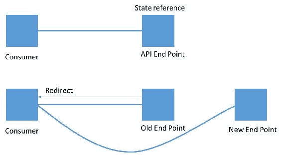
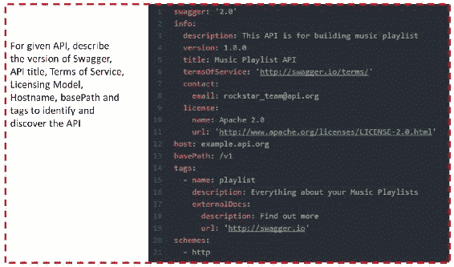
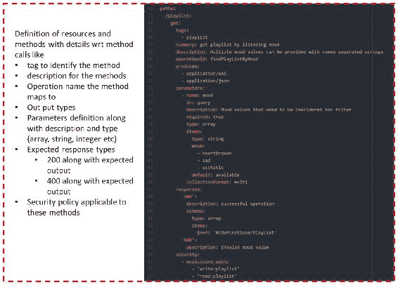
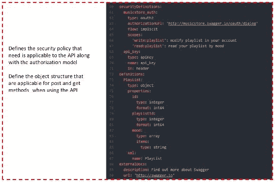
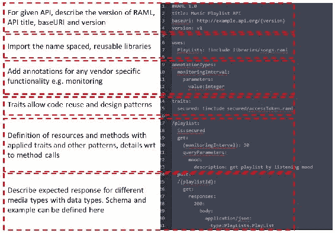

# 十一、API 设计最佳实践

本章讨论如何设计粒度和面向功能的以消费者为中心的 API。它还讨论了 API 设计关注点的各种最佳实践，如如何识别将用于形成 API 的资源、如何对 API 进行分类、API 错误处理、API 版本控制等。我们将介绍通过 openapi 和 RAML 描述 API 的模型。

我们将讨论以下主题：

*   API 设计关注点
*   API 网关部署

# API 设计关注点

API 是用来消费的，并定义如何消费 API。API 指定与 API 交互所需的命令/操作列表以及这些命令的格式/模式。

定义 RESTAPI 时，信息的关键抽象是资源。资源定义为到一组实体的概念映射。API 设计以构成设计核心的资源为中心。**统一资源标识符**（**URI**）、操作（使用 HTTP 方法）和资源表示（JSON 模式）都是在考虑资源的情况下构建的。对资源进行正确的抽象以实现 API 的使用、可重用性和可维护性变得非常重要。

资源可以指向单个实体或实体集合。例如，产品是单一资源，而产品是资源的集合。我们将从两个层面介绍设计指南：

*   如何确定正确的资源粒度级别
*   如何围绕已识别的资源设计 API

# API 资源标识

API 的设计与问题域的底层业务域模型相关联。API 需要以消费者为中心，并关注消费者的需求。应用领域驱动的设计原则来确定正确的粒度。有界上下文模式是有助于将问题区域划分为不同有界上下文并明确其关系的中心模式。对于企业来说，资源标识也由中央/集团体系结构团队定义的规范模型驱动。

此外，根据 API 的定义位置及其公开的特性/功能，API 可分为三大类：


让我们在以下部分详细讨论这些类别。

# 系统 API

关键企业资源或记录系统需要作为一组 API 打开或公开，以供所有下游系统围绕这些服务构建逻辑/体验。对于绿地项目，系统 API 通常表示作为功能一部分开发的记录或数据存储系统。对于企业而言，系统 API 代表所有企业系统，例如核心**企业资源规划**（**ERP**系统）、运营数据存储、大型机应用，或者许多**商用现货**（**COTS**产品，例如**c****客户关系管理**（**CRM**等），运行企业核心流程。系统 API 的一些显著特征如下：

*   域驱动设计的起源源于查看核心系统域，并创建有界上下文来定义系统 API。
*   这些记录系统通常映射到 HTTP 资源类型名词，并提供实体服务。例如，在银行账户中，抵押贷款、证券和卡是构建系统 API 的核心实体或名词。
*   有界上下文模型定义服务拥有其数据存储。但在现有系统的情况下，如**企业资源规划**（**ERP**），服务可能共享相同的底层系统。这需要仔细研究底层业务流程，识别域（又名名词），并将其作为系统 API 公开。账户可以是一个系统 API，但账户转账将是一个流程 API，它利用基础账户系统 API 来提供服务。
*   系统 API 传统上非常稳定，不知道通道或流程 API 层中的变化。这些构成了核心、稳定的企业方面的一部分。
*   该企业系统的组成和集成机制定义了系统 API 如何与底层系统集成。例如，大型机指定使用 MQ 作为集成机制，让系统 API 实现 MQ 以将大型机功能作为 API 公开。
*   系统 API 的最大问题是其正常运行时间和恢复能力与基础系统的稳定性有关。如果核心应用经常宕机或出现问题，这些问题往往会传递到系统 API 层。

# 过程 API

纯粹主义者会说，系统 API 公开了系统的核心功能，应用应该将系统 API 中的功能混搭起来，为最终客户提供必要的功能。这可能适用于较小的应用或应用的初始迭代。随着应用越来越大，或者您开始跨多个通道或设备公开功能，您开始考虑功能开始被复制的场景，这意味着缺乏重用，导致系统更难维护。流程 API 的一些显著特征如下：

*   流程 API 提供了构建在系统 API 之上的更丰富的功能。例如，不是每个通道都编写帐户转移功能，我们可以将帐户转移编写为流程 API，跨通道重用以提供一致且可重用的模型。
*   从消费者的角度来看，流程 API 为访问功能提供了一个比尝试编排多个系统 API 更简单的模型。这有助于提高客户端的易用性，并有助于减少 API 网关级别的流量。
*   流程 API 还可用于向应用提供跨通道/全通道功能。可以在此级别处理诸如通道上下文切换之类的问题。
*   应用倾向于引入流程 API 来提高整个系统的性能。如果系统 API 绑定到速度较慢或只能处理有限吞吐量的系统，则可以使用流程 API 缓存来自系统 API 的数据，以避免每次都访问底层系统。如果记录系统和随后的系统 API 不可用，流程 API 可通过提供替代功能流来处理此类请求。
*   Process API 还可以充当外部第三方调用的适配器，而不是直接进行第三方调用的应用。使用流程 API 允许我们处理第三方 API 故障不会影响应用其余部分的场景。流程 API 可以应用诸如断路器和限制传出请求等模式来处理多个场景。

# 通道 API

最终的 API 分类是通道 API。顾名思义，这些 API 是特定于通道的，并映射到作为应用一部分构建的客户旅程。这些也被称为体验 API 或旅程 API。例如，如果您正在使用 Angular 或 React 构建应用，则属于**单页应用**（**SPA**）一部分的客户旅程需要映射到通道 API 可以提供的底层服务。通道 API 的一些显著特征如下：

*   渠道 API 映射到客户旅程，客户旅程总是与渠道相关联。这些有时也称为体验 API。这些 API 可以是有状态的，因为它们在客户的旅程中为客户服务，并且需要承载会话上下文。可以通过将状态外部化到会话存储（如 Redis）来构建无状态服务。
*   每次客户旅程发生变化时，渠道 API 都会发生变化。通道 API 之间的可重用性商不是很高。它通常在 10-15%之间。例如，如果在 Android 和 iOS 应用之间映射了类似的客户旅程，那么就有可能重复使用相同的 API。
*   通道 API 不具有业务逻辑或任何服务编排逻辑，因为这些关注点往往由流程 API 层处理。
*   安全性（CQRS、CORS）、身份验证、授权、限制等问题在 API 网关级别处理，而不是传递到通道 API 层。
*   有时，在 API 开发过程中，可能会对 API 进行严格的区分和定义。但是在许多应用迭代的过程中，这样的差异开始出现在 API 中，人们可以开始看到应用向这些分类移动。
*   接下来，我们将介绍适用于我们看到的三种分类的 API 设计指南。

# API 设计指南

一旦确定了正确的资源粒度级别，API 设计指南的其余部分将帮助制定正确的契约/接口级别，以实现消耗、可重用性和可维护性。

RESTful 客户端应该能够发现访问 URI 路径所需的所有可用操作和资源。客户应能够处理以下事项：

*   **请求**：处理发送到服务器端的入站处理消息
*   **响应**：服务器提供的封装信息
*   **路径**：被请求资源的唯一标识符
*   **参数**：作为键/值对添加到请求中的元素，用于指定请求的筛选、子集等操作

当我们开始设计 API 时，我们正在分享多年来遇到的一些最佳实践。

# 命名和关联

资源名称通常是指从业务域中提取的名词。一旦识别出这些名词，就可以将 API 契约建模为针对这些名词的 HTTP 动词：

*   资源的选择需要考虑细粒度模型和粗粒度模型。太细粒度意味着太多的闲聊，而粗粒度意味着缩小焦点，从而导致对变体的支持。在某种程度上，可以通过使用系统与流程 API 模型来解释这一点。但问题是，如果资源过于细粒度，系统 API 的数量就会增加，从而导致无法维护的复杂性。
*   API 是根据消费者的需求设计的。根据客户的旅程以及他们将如何映射到底层数据存储，导出您的 API 需求。这意味着，请使用顶层设计方法查看 API 设计。使用首先进行数据建模的底层模型可能不会产生正确的平衡。如果您有现有的企业资产，您将需要执行中间相遇的方法，在这种方法中，您需要通过编写流程 API 来平衡客户的需求，以帮助弥合差距。

# 资源的基本 URL

这取决于您如何将资源视为单例或集合。因此，理想情况下，一个资源将有两个基本 URL，一个用于集合，另一个用于实体。例如：

| **资源** | `POST`（**创建** | `GET`（**读** | `PUT`（**更新** | `DELETE`（**删除** |
| `/orders` | 创建新订单 | 订单清单 | 替换为新订单 | 错误（不想删除所有订单） |
| `/orders/1234` | 错误 | 显示 ID 为`1234`的订单 | 如果存在，更新订单；如果没有，请创建新订单 | 删除 ID 为`1234`的订单 |

# 处理错误

使用标准 HTTP 状态代码指示问题/错误：

*   如果使用 JSON，错误应该是顶级属性
*   错误必须是描述性的、正确的和信息性的

错误消息示例如以下代码段所示：

```java
{ 
   "type": "error", 
   "status":400, 
   "code": "bad_request", 
   "context_info": { 
         "errors": [ 
         { 
               "reason": "missing_argument", 
               "message": "order_id is required", 
               "name": "order_id", 
               "location": "query_param" 
         } 
         ] 
   }, 
   "help_url": "http://developers.some.com/api/docs/#error_code", 
   "message": "Bad Request" 
   "request_id": "8233232980923412494933" 
} 
```

HTTP 代码使用的一些示例如下：

*   400 错误请求
*   401 未经授权
*   403 禁止
*   404 找不到
*   409 冲突
*   429 请求太多
*   5xx API 有故障

# 版本控制

服务版本控制有多种模型：

*   **URL**：您只需将 API 版本添加到 URL 中，例如：`https://getOrder/order/v2.0/sobjects/Account`。经常使用，但不是很好的实践。

*   **接受头**：修改接受头指定版本，例如：`Accept: application/vnd.getOrders.v2+json`。很少使用，对客户来说很麻烦。

*   **模式级**：使用模式强制验证，JSON 难以强制验证，XML 很好用。良好做法/罕见。

*   **API facade 层**：使用 facade 层向客户端隐藏版本复杂性。

记住，资源是一个语义模型；资源的表示形式和状态可能会随着时间的推移而改变，但标识符必须始终对同一资源进行寻址。因此，只有在概念发生根本性变化时，才应使用新的 URI。API facade 层可以从底层服务和模式版本中抽象出北向 API。API 管理平台支持创建 API facade 层。

# 标页码

使用带有分页信息的 URL 来处理结果偏移量和限制。例如，`/orders?limit=25&offset=50`。

# 属性

API 应该支持消费者使用查询参数模型请求的数据属性的设置。例如，`/orders?fields=id,orderDate,total`。

# 数据格式

API 应根据消费者的要求提供对多种数据格式的支持。例如，`/orders/1234.json`返回 JSON 格式的数据。

# 客户端对有限 HTTP 方法的支持

根据设备及其支持 HTTP 谓词的有限功能，您可能希望使用以下方式提供对 HTTP 方法的支持：

*   **创建**：`/orders?method=post`
*   **读**：`/orders`
*   **更新**：`/orders/1234?method=put&location=park`
*   **删除**`/orders/1234?method=delete`

# 认证和授权

REST 服务在适当时为每个公开的方法使用基于角色的成员资格，并提供基于任意数量的特定角色独立启用`GET`、`POST`、`PUT`和`DELETE`的能力。

通常，应在 API 网关级别处理此问题。您不应该将此作为服务的一部分来处理。

# 端点重定向

由于业务或技术原因，服务库存可能会随着时间的推移而变化。可能无法同时替换对旧端点的所有引用。

通过采用这种设计实践，服务端点的使用者可以在重新构造服务清单时进行调整。它会自动将访问过时端点标识符的服务使用者引用到当前标识符：



HTTP 本机支持使用 3xx 状态代码和标准头的组合的端点重定向模式：

*   301 永久搬迁
*   307 临时重定向
*   位置/新 URI

# 内容协商

服务使用者可能会以不向后兼容的方式更改其需求。服务可能必须同时支持新老客户，而不必为每种客户引入特定的功能。

服务可以指定特定的内容和数据表示格式，作为其调用的一部分，由运行时协商的服务功能接受或返回。服务合同涉及多种标准化媒体类型。

# 保护

始终使用 SSL 保护 URI。SSL 确保了有保证的加密通信，从而简化了身份验证工作—无需对每个 API 请求签名。

这涵盖了 API 设计中的一些最佳实践。你可以从 Google、Facebook 和 Amazon 如何定义它们的公共 API 中学习，并将它们作为 API 设计的基础。

# API 建模

有两种标准在竞争描述 API 开放 API 和 RESTful API。我们将在以下章节中详细讨论这些问题。

# 开放式 API

OpenAPI 计划的重点是基于 Swagger 规范创建和推广一种与供应商无关的 API 描述格式。openapi 规范允许我们为 restapi 定义一个标准的、与语言无关的接口，它允许人类和计算机在不访问源代码的情况下发现和理解服务的功能。

在下图中，我们描述了一个基于开放 API 的示例 API 定义以及各个部分：



代码在下图中继续：



代码在下图中继续：



# RESTful API 建模语言（RAML）

**RESTful API 建模语言**（**RAML**是描述 RESTful API 的标准语言。RAML 的编写方式与 YAML 相同，YAML 是一种人类可读的数据序列化语言。RAML 的目标是提供描述 API 所需的所有必要信息。RAML 提供了一种机器可读的 API 设计，可以被各种 API 管理工具读取。

在下图中，我们描述了一个示例 RAML 以及各个部分：



RAML 映射到整个 API 设计寿命，可分为以下几类：


让我们看看流程：

1.  **设计**：API 供应商提供编辑器作为 API 开发套件的一部分，帮助设计/编写 API/RAML 定义，从而加快开发速度，减少错误。生成的 RAML 可以使用模拟数据进行扩充，并允许与业务所有者/消费者就设计进行迭代，以进行验证和正确性。
2.  **构建**：生成的 RAML 为 API 的构建提供规范。开发套件可以基于 RAML 生成存根以插入逻辑。
3.  **测试**：RAML 可以用来生成测试脚本。Postman 和 Abao 等工具允许导入 RAML 规范并生成用于验证 API 的测试。此外，API Fortress 和 SmartBear 等工具还可以测试响应延迟、有效负载和错误。
4.  **文档**：RAML 规范可以转换为基于 HTML 的模型。诸如用于 PHP 的 RAML2HTML、API 控制台等工具提供了一种公开作为 RAML 一部分指定的文档的简单方法。此模型允许规范中的任何更改反映在文档中并保持同步。
5.  **集成**：API 生命周期的最后阶段是集成或使用 API 的能力。RAML 的使用允许供应商/工具创建多种方式来集成和使用 API。使用 RAML，可以构建特定于 API 的 SDK。供应商还提供可以利用 RAML 与客户端逻辑集成的工具。

这两个标准之间的选择取决于组织选择的 API 网关产品堆栈。尽管每个产品都声称支持这两种标准，但大多数产品都倾向于使用一种标准。

# API 网关部署模型

API 网关提供了一个门面模式，它封装了系统的内部工作，为所有传入的客户端提供了一个入口点。API 网关可以为每种类型的客户端提供定制的 API，同时解决安全性、身份验证、授权、节流、负载平衡等问题。

让我们看看影响 API 在 API 网关上部署方式的因素。

*   **客户端或通道的类型**：根据发出请求的设备或通道，API 可能需要为不同的数据子集提供服务。例如，与移动客户端相比，桌面版本的服务可能需要更多的细节。即使在手机和平板电脑之间，数据也可能存在差异。我们如何确保相同的微服务能够服务于所有设备类型的请求，并且仍然能够处理这些变化？在本例中，我们为不同的设备类型创建了多个 API，以满足客户机的特定需求，而不会影响微服务。
*   **数据转换**：有时候，后端的服务是为了服务 JSON 内容而构建的。一个需求要求 XML 响应，反之亦然。在这种情况下，API 网关公开了一个 API，该 API 在网关级别执行数据转换时提供 XML 作为响应，从而允许服务在不进行任何更改或不了解客户端需求的情况下工作。
*   **版本控制**：对于公共 API 或绑定到 URI 中未添加版本控制的资源的 API，API 网关可以基于客户端和用于正确服务的版本路由传入请求。在这种情况下，API 网关可以使用多种技术破译服务版本：
    *   客户端标识符可用于标识它们是否已移动到新版本或正在使用旧版本。
    *   可以根据 SLA 将客户端划分为多个类别。发布新版本时，可以要求最低类别或低使用率客户端移动到新版本。当客户端升级时，API 网关可以将它们重定向到正确的服务版本。
*   **编排**：有时，API 可能需要调用多个后端服务并聚合结果。在这种情况下，API 网关必须同时调用多个服务并聚合结果。有时，服务调用之间可能存在依赖关系。例如，传入的请求可能需要在实际服务调用之前进行身份验证，或者可能需要提取额外的客户端或会话信息来调用调用。可以在 API 网关层编写整个业务流程逻辑，因为某些产品提供运行时支持。另一种选择是编写一个流程 API，它跨其他服务进行编排，并提供一个统一的 API 供使用。这有助于减少聊天次数，并从客户端的角度提高总体性能。
    我们在[第 3 章](11.html)*设计您的云原生应用*中介绍了编排模式。
*   **服务发现**：随着服务实例的上下波动，服务注册中心是在任何给定时间点可用的服务端点的唯一真实数据源。API 网关应该能够在运行时调用 service registry 以获取服务端点，并使用该服务端点来调用服务。服务注册表可用作跨已注册服务实例负载平衡服务调用的机制。
*   **处理超时**：对于在合理时间内没有响应的服务，API 网关允许您超时请求。这允许网关处理超时故障，甚至为客户端提供故障模式。一个选项可以是提供缓存数据（如果适用并取决于服务类型）或 fail fast 模型，其中网关可以在不调用服务的情况下立即返回错误或故障。
*   **数据缓存**：API 网关还可以为提供静态数据或不经常更改的数据的服务调用缓存数据。此模型允许减少服务实例上的通信量。这提高了总体响应延迟和总体系统弹性。在主流发生故障的情况下，缓存的数据还可以用作辅助故障流。
*   **服务调用**：部署的服务可以使用多个接口或协议。例如，您可能有使用基于异步消息传递机制（如 JMS、MQ、Kafka 等）的服务，或者其他服务可以使用 HTTP 或 Thrift 等同步模型。API 网关应该能够支持多个服务调用模型，并在这些调用方法之上提供编排模型。
*   **服务计量/节流**：对于某些类别的客户端，您可能需要限制它们可以进行的服务调用的数量。例如，如果您提供的是功能减少的免费服务模型，以及在一个时间范围内可以进行的调用限制。基于客户端类型（免费或付费）测量和限制传入请求的能力有助于围绕 API 和底层服务提供业务模型。如果您正在向另一个 SaaS 提供商进行外部 API 调用，这也会很有帮助。通过 API 网关路由这些调用有助于预测/管理传出调用的数量，并在出现使用账单时提供不必要的冲击。
*   **API 监控**：另一个重要的问题是监控 API 调用是否存在任何偏差，无论是在不同百分比的响应延迟、故障率、API 可用性等方面。这些指标需要绘制在具有适当警报和通知系统的仪表板上。根据故障类型，可以自动执行恢复脚本以克服这些问题。

本文总结了可应用于 API 网关的各种使用场景和模式，以将您的服务作为 API 公开给消费者。

# 总结

在本章中，我们了解了如何根据 API 的主要用途和底层资源将其划分为不同的模型。我们看到了关于整个 API 设计的最佳实践，以及通过开放 API 或 RAML 规范对 API 建模的可用标准。接下来，我们了解了如何利用 API 网关来解决服务级别未处理的问题。

在下一章中，我们将介绍云开发对企业现有环境的影响，以及如何实现向数字化企业的转型。