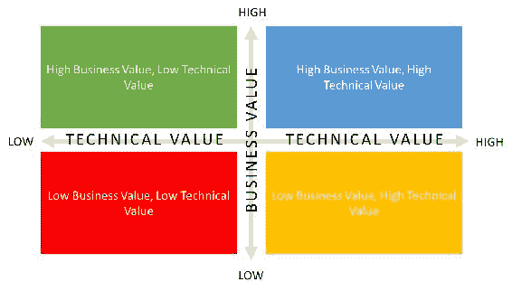
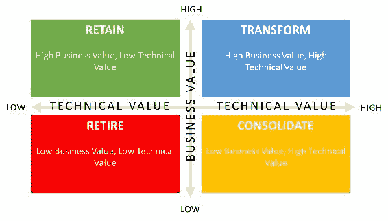
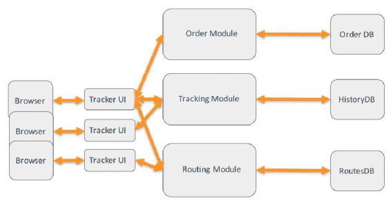
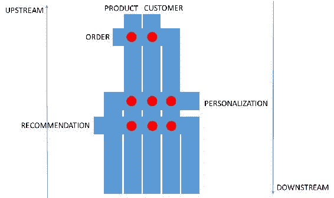
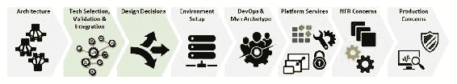
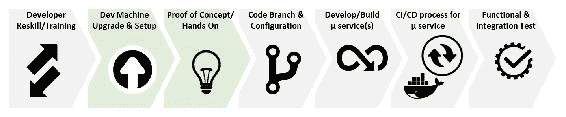

# 十二、数字转型

云计算的出现正在影响企业环境的方方面面。从核心基础设施到面向客户端的应用，企业环境正在看到变革力量的影响。一些企业是这些变革的主要先兆，而另一些企业仍在试图找出从何处开始以及做什么。根据行业领域的成熟度，转型过程可能会大不相同。一些领域首先采用技术趋势（如 BFSI），而其他领域则等待技术过时后采用新技术（制造业、公用事业）。在本章中，我们将介绍以下内容：

*   映射数字转换的应用组合
*   将现有单片应用分解为分布式云原生应用
*   流程、人员和技术层面需要的变更
*   构建您自己的平台服务（控制与委派）

# 应用组合合理化

数字转换的决策通常映射到更大的应用组合。以客户为中心、更好的客户体验、法规遵从性/监管、云计算、开源等方面的外部力量促使企业审视其整个应用环境，并确定需要改进、增强和返工的领域。

第一步是确定需要为云部署进行转换的机会或应用。在这一步中，我们通常跨业务和技术参数进行总体投资组合分析。这些参数有助于提供投资组合的加权分数。使用分数，我们可以在四个象限中映射应用。这些象限有助于我们确定关注点和最大值。

# 投资组合分析–业务和技术参数

应用是跨业务和技术参数进行测量和评分的。

技术值的参数如下：

*   IT 标准遵从性
*   体系结构标准遵从性
*   服务质量
*   维修性
*   业务考虑
*   许可证/支持成本
*   基础设施成本
*   项目/变更成本
*   应用维护成本
*   采购（内包/外包）

业务价值的参数如下所示：

*   财务影响
*   应用用户影响
*   客户影响
*   临界性
*   业务一致性
*   功能重叠/冗余
*   监管/合规风险
*   服务失败风险
*   产品/供应商稳定性

您可以在 1-5 的范围内对这些参数进行评分（一个是最低的，五个是最高的）

映射这些参数有助于我们确定成本和复杂性热点，并根据业务能力领域隔离应用。进一步分析这些应用类别的相互依赖性、接触点、集成点和底层基础设施。使用所有这些，我们可以分析其好处，并为转型路线图提供建议。下一步是基于业务价值和技术价值；我们将应用绘制在以下象限之一：

这些分数有助于我们提供应用和投资组合级别的成本效益分析。它还有助于确定哪些方面存在功能重叠（因为合并和收购活动），了解业务的缺乏、It 协调，以及业务优先级在哪里。这些有助于确定投资机会所在以及潜在的非核心领域。

使用上述基础，每个象限中的应用可以进一步映射到如下图所示的一种配置：

这些配置为我们提供了合理的应用机会，我们将在以下章节中讨论。

# 退休

所有属于低业务价值和低技术价值的应用都可以标记为退役。这些应用通常要么在不同的业务环境中失去相关性，要么实现了新的功能。

这些应用的特点是使用率低，业务风险很低。还可以通过根据这些应用和使用量聚合票据来识别这些应用。使用率低、票证数量少的应用通常是退役的候选应用。

# 保持

所有技术价值低、业务价值高的应用都属于这一类。技术成熟度可能较低，但它们为业务提供了巨大的价值。从 IT 的角度来看，这些应用的运行成本不会太高。我们可以为这些应用打开指示灯，因为它们仍然为业务提供重要价值。

# 巩固

所有具有高技术价值和低业务价值的应用都属于这一类。高技术价值可能是由于技术支持成本高、缺乏具备技术技能的人员、缺乏文档等原因造成的。业务部门可以明确说明应用的价值，但目前在这些应用上的花费可能是不合理的。这些应用集需要迁移和整合以升级技术货币。

# 使改变

这些应用具有很高的技术价值和商业价值。这意味着这些应用拥有庞大的用户群、多个版本、大量的票证和较高的基础设施支持成本，但仍然为业务提供了显著的优势。这些应用是需要投入精力的地方，因为它们为组织提供了显著的差异化优势。

使用前面的方法，我们可以确定适合转换的应用。对于我们的示例，我们可以使用一个现有的 Java/JEE 应用，该应用当前正在本地运行，需要转换为分布式应用设计模型。

# 单片应用到分布式云原生应用

J2EE 规范的出现，加上提供必要服务的应用服务器，导致了单片应用的设计和开发：

单片应用及其生态系统的一些特征是：

*   所有内容都打包到一个`.ear`文件中。单个`.ear`文件需要多个月的测试周期，这会降低生产中的变化速度。通常情况下，*大*每年推进一到两次生产。
*   应用构建的复杂性非常高，各个模块之间存在依赖关系。有时，应用使用的 JAR 文件版本之间存在冲突。
*   应用之间的重用主要通过共享`.JAR`文件来执行。
*   庞大的 bug 和功能数据库从待办事项的角度来看，在各个应用模块中存在许多功能集/bug。有时，一些积压的订单可能会彼此发生争执。
*   用户验收标准通常未定义。虽然有一些冒烟测试，但总的来说，新功能和集成只在生产环境中才能看到。
*   设计、开发和运营管理需要多个团队的参与和重大监督（业务团队、架构团队、开发团队、测试团队、运营团队等）。在发布周期中，协调各个团队是一项艰巨的工作。
*   随着新特性/功能添加到应用中，一段时间内的技术债务积累，原始设计从未经历任何更改/重构以满足新需求。这会导致应用中积累大量死代码和重复代码。
*   过时的运行时（许可证、复杂更新）-应用可能正在较旧版本的 JVM、较旧的应用服务器和/或数据库上运行。升级成本很高，而且通常非常复杂。规划升级意味着在开发周期中放弃任何功能发布。多个团队的参与需要复杂的项目管理模型。缺少回归测试脚本会使情况变得更糟。
*   技术设计领导团队遵循的方法。在开发开始之前，架构和设计被预先冻结。随着应用的增长，新的特性/功能不断增加，应用架构/设计不再需要第二次审视。
*   几乎没有使用任何业务组件或域。应用设计通常根据层（表示层、业务层、集成层和数据库层）和客户/应用流水平划分为特定的模块/模式。例如，使用 MVC 模式的应用将沿着模型、视图和控制器的线条创建包，其中包含值和公共值。
*   通常，整个应用只有一个数据库模式。在数据库级别没有分离功能。在第三种规范化形式之后，这些域通过外键和数据库相互链接。应用设计通常是自下而上的，数据库模式决定了应用数据库层的设计。
*   一般的企业应用将有超过 500k 行代码，以及大量的样板代码。随着应用的增长，源代码库中会有大量的死代码和重复代码。
*   通常由重量级基础设施支持的应用通过添加越来越多的硬件来管理应用的功能。服务器集群用于扩展应用。
*   数千个测试用例增加了运行回归测试套件的时间。有时，发布版会跳过回归测试套件以加快循环。
*   在大多数项目中，团队规模超过 20 人。

我们可以看到，在单片应用的情况下，业务速度和变化率非常低。这种模式可能在 10-15 年前就已经奏效了。在当今竞争激烈的市场中，以令人难以置信的速度发布特性/功能的能力至关重要。您不仅要与其他大型企业竞争，还要与许多小型灵活的初创企业竞争，这些初创企业没有遗留应用、技术和流程的包袱。

消费类公司开源增长的出现，以及移动设备的不断增长，以及其他因素，导致了应用体系结构领域的创新，以及由微服务和反应式模型驱动的更多分布式应用。单片应用被分解成更小的应用/服务集。

接下来，我们将探讨分布式应用的关键体系结构问题。我们将了解这些关键关注点如何映射到总体应用技术能力，以及应雇佣哪些能力和应构建哪些能力：

分布式应用及其生态系统的一些特征是：

*   **轻量级运行时容器**：微服务的出现与重量级 JEE 容器的消亡相关。随着应用转变为具有单一用途和松散耦合的微服务，有必要简化管理组件生命周期的容器。Netty 的出现导致了反应式框架的开发，该框架正好适合此目的。
*   **事务管理**：应用简化的另一个原因是事务管理。有界上下文意味着服务不会与多个资源通信，也不会尝试执行两阶段提交事务。CQR、事件存储、**多版本并发控制**（**MVCC**）、最终一致性等模式有助于简化应用，并将其移动到不需要锁定资源的模型 a 中。
*   **服务扩展**：断开应用允许单独扩展和扩展单个服务。使用帕累托原理，80%的传入流量由 20%的服务处理。扩展这 20%服务的能力成为实现更高可用性 SLA 的重要驱动因素。
*   **负载平衡**：与单片应用不同，单片应用的负载平衡是在应用服务器集群节点之间进行的，在分布式应用的情况下，负载平衡是跨服务实例的（在 Docker 类容器中运行）。这些服务实例是无状态的，通常可以非常频繁地上下移动。发现活动和非活动实例的能力成为负载平衡的一个关键功能。
*   **灵活部署**：分布式体系结构的关键能力之一是从僵化的集群部署模型转向更灵活的部署模型（牛对宠物），部署实例部署为不可变实例。Kubernetes 等编排引擎允许对底层资源进行最佳利用，并消除了管理/部署数百个实例的痛苦。
*   **配置**：随着服务实例变得不可变，服务配置从服务中抽象出来并保存在中央存储库（配置管理服务器）中。服务在启动时，或作为服务初始化的一部分，会选择配置并以可用模式启动。
*   **服务发现**：使用在商品硬件上运行的无状态不可变服务实例，意味着服务可以随时上下波动。调用这些服务的客户端应该能够在运行时发现服务实例。此功能以及负载平衡有助于维护服务可用性。一些新产品（如特使）已将服务发现与负载平衡合并在一起。
*   **服务版本：**随着服务开始吸引消费者，将需要升级服务合同以适应新功能/变化。在这种情况下，运行多个版本的服务变得至关重要。您将需要担心将现有的使用者移动到新的服务版本。
*   **监控**：与传统的单体监控不同，传统的单体监控侧重于基础设施和应用服务器监控，分布式体系结构需要在事务级别进行监控，因为它流经各种服务实例。**应用性能管理**（**APM**等）工具用于监控事务。
*   **事件处理/消息传递/异步通信**：服务之间不进行点对点通信。服务利用通过事件的异步通信将它们彼此分离。一些关键消息传递工具（如 RabbitMQ、Kafka 等）用于实现服务之间的异步通信。
*   **非阻塞 I/O**：服务本身利用非阻塞 I/O 模型从底层资源获得最大性能。用于构建底层服务的微服务框架（如 Play framework、Dropwizard、Vert.x、Reactor 等）正在采用反应式体系结构。
*   **Polyglot 服务**：分布式应用的出现以及使用 API 作为集成，使得服务实例可以使用同类最佳的技术构建。由于集成模型是 JSON over HTTP，因此服务可以是多语言的，从而允许使用正确的技术来构建服务。这些服务还可以根据服务需求的类型使用不同的数据存储。
*   **高性能持久性**：由于服务拥有自己的数据存储，读写服务需要处理大量并发请求。诸如**命令查询请求分离**（**CQRS**等模式允许我们分离读/写请求，并将其移动到数据存储以形成最终的一致性模型。
*   **API 管理**：分布式体系结构的另一个关键要素是能够抽象出服务节流、身份验证/授权、转换、反向代理等关注点，并转移到称为 API 管理的外部层。
*   **健康检查和恢复**：服务执行健康检查和恢复，以便负载平衡器发现健康的服务实例并移除不健康的服务实例。这些服务实现心跳机制，服务发现机制使用心跳机制跟踪整个应用环境中的健康/不健康服务。
*   **跨服务安全性：**需要保护服务到服务调用。可以通过安全通信（HTTPS）或通过有线加密数据来保护移动中的数据。这些服务还可以使用公钥/私钥来匹配哪些客户端服务可以调用其他服务。

我们看到了构建分布式应用所需的一些架构问题。为了涵盖作为一组微服务构建的整个应用的范围，我们在各个领域关注以下关键架构问题：

为了使应用成为云原生应用，使用云供应商提供的 SaaS/PaaS 构建应用非常重要。此模型允许您将重点放在业务功能上，提高创新节奏，并改善客户体验。除非技术不是组织的关键区别，否则核心基础设施和平台服务的运行应该留给专家。在需求变化巨大的情况下，云弹性尺度模型提供了动力。我不想为云供应商做营销，但除非基础设施不是您业务的重要方面，否则您不应该运行基础设施。

唯一的缺点是，你会被云提供商提供的服务束缚住。组织正在采用多云供应商战略，在这一战略中，他们传播其应用，并利用云供应商的关键优势。例如，GCP 提供了丰富的分析和机器学习功能库，能够运行您的分析工作负载并解读意义见解，**机器学习**（**ML**模型是使用同类最佳功能的一种方式。类似地，对于面向消费者的应用，AWS 提供了一组丰富的 PaaS 服务，可用于启动和围绕以客户为中心的解决方案。

# 将单片应用转换为分布式应用

在本节中，我们将介绍一个单片应用，并了解将其架构成分布式应用需要哪些步骤。

我们假设一个典型的 Java 应用运行在应用服务器上，通过集群模型进行扩展，并使用典型的 RDBMS。应用已经投入生产，需要重构/迁移到分布式体系结构。

我们将讨论多个需要协同工作以重构/推出分布式应用的并行轨道。我们将首先介绍各个曲目，然后将它们全部组合在一起。在您的组织中，您可以选择为每一条赛道组建单独的团队，或者由一个团队管理多条赛道。这样做的目的是让您大致了解单片应用的实际转换所涉及的活动。

# 领域驱动设计的客户旅程映射

启动数字化转型的关键驱动力是定义新的客户旅程并构建新的客户体验。这种以客户为中心的理念推动企业为数字转型计划提供资金。在我们的案例中，我们可以假设业务部门已经批准了数字转型计划，我们从中着手。

从服务分解的角度来看，我们需要遵循这里提到的步骤：

*   **客户体验旅程地图**：数字化转型的关键驱动因素之一是定义新的客户旅程。客户体验旅程是客户通过流程参与模型的初始接触点地图。此练习通常由专家完成，包括以客户为中心的研究、接触点、涉及的参与者/系统、业务需求和竞争分析等。客户旅程通常创建为信息图表。
    当客户互动跨越设备、渠道或流程时，客户旅程有助于识别差距。它有助于填补这些差距，并确定增强总体客户体验的方法和途径。
*   **推导出领域模型**：根据当前和未来的需求映射客户体验旅程图。这些需求构成了用户情景的基础。对于新的应用，需求可以构成系统功能分解的基础。对于现有应用，系统可能已经分解为可识别的域/子域。
    一旦我们有了需求，我们就可以开始识别系统中的各个子域。域模型是使用泛在语言记录的。整个想法是使用一种业务和技术团队都能理解的语言。
    域是围绕实体及其功能建模的。我们还考虑在函数之间互操作的依赖关系。通常，作为第一关，我们最终会遇到一个大泥球，所有已知的实体和功能都已被识别。对于较小的应用，域模型的大小可能合适，但对于较大的应用，需要进一步细分大问题，这就是有界上下文的意义所在。
*   **定义有界上下文**：大泥球需要分解成更小的块，以便于适应。这些较小的块或有界上下文中的每一个都有自己的业务上下文，该上下文是围绕特定的职责构建的。还可以围绕团队的组织方式或现有应用代码库的结构对上下文进行建模。
    没有规则来定义上下文是如何定义的，但每个人都理解边界条件是非常重要的。您可以创建上下文映射来映射域环境，并确保明确定义和映射了有界上下文。有各种模式（例如，共享内核、一致性、生产者/供应商等）可用于映射出有界上下文。

*   **服务分解**：使用有界上下文，我们可以识别将作为一个有界上下文的一部分工作的团队。他们将关注需要生产/消费的服务，以提供作为受限上下文一部分的功能。业务能力被分解为单个的微服务。服务可以根据以下原则进行分解：
    *   **单一责任**：首先是服务的范围和服务将暴露的能力
    *   **独立**：功能/特性需求的变更应限于一项服务，允许一个团队拥有并完成相同的服务
    *   **松耦合**：服务应该是松耦合的，允许它们独立发展
*   **映射上下游服务依赖关系**：由于服务在每个域中都有标识，因此服务可以映射为依赖关系。封装记录系统的核心实体服务是上游服务。来自上游服务的更改将发布为下游服务订阅或使用的事件。

# 定义架构跑道

业务应用需要放在平台的肩膀上。根据业务和应用需求，可以构建或购买该平台。组织需要定义一个有意的架构模型，并定义铁路警卫，以确保团队在给定的技术约束范围内构建服务。平台团队拥有这个总体架构，选择架构和技术组件，并帮助构建成功运行应用服务所需的任何公共关注点。

*   **平台架构**：成功的分布式架构的关键要素之一是底层平台。可以选择使用现成的开源/商业软件（Red Hat OpenStack、Cloud Foundry 等）构建平台，也可以选择战略云提供商（如 AWS、Azure）开始构建平台。底层基础设施（计算、网络和存储）的弹性特性为平台提供了基本的构建块。
*   **技术选择、验证和集成**：为了构建平台服务，您可能需要评估多套技术，以确定哪些技术在您的生态系统中最有效。技术堆栈评估通常是一个多步骤的过程，其中需求映射到可用的技术/产品，并执行一系列详细的验证步骤，从而形成有关技术集成的矩阵。
*   **设计决策**：技术评估的结果映射到基础需求，形成矩阵。该矩阵用于确定最佳拟合，并帮助做出设计决策。此步骤与上一步骤紧密结合使用。
*   **环境设置**：一旦关键设计决策到位，我们需要从环境设置开始。根据选择是内部部署还是云计算，设置和相关步骤会有所不同。您可以从开发、测试、预生产和生产环境的设置开始。这些环境按照复杂性的顺序构建，并经过多次迭代（从手动到脚本/自动）。
*   **DevOps/Maven 原型**：接下来，我们开始进行应用构建和部署的**持续集成**（**CI**）/**持续部署**（**CD**部分。对于在敏捷模型中开发的应用，CI/CD 模型有助于在一天内完成多个发布，并提高整个过程的速度。我们还可以开发加速器来帮助 CI/CD 流程。例如，Maven 原型附带了创建可部署工件所需的绑定。
*   **平台服务搭建**：接下来是需要搭建/提供给平台用户的一套平台服务。
    这些服务用于应用开发（例如，队列、工作流、API 网关、电子邮件服务等）、数据库（例如，NoSQL、RDBMS、缓存等）、DevOps 工具（例如，CI/CD 工具、服务注册表、代码 repos 等）、安全性（如目录服务、密钥管理服务、证书管理服务、**硬件安全模块**（**HSM**等）、数据分析（如认知服务、数据管道、数据湖等）。
    您可以从多家供应商处购买这些服务（如 Tiles，作为**Pivotal Cloud Foundry**（**PCF**）、Iron.io 平台的一部分提供）或订阅云供应商提供的服务或在产品之上创建自己的平台服务。
*   **非功能性需求（NFR）关注点**：一旦关键平台服务到位，并且第一组应用开始进入平台，我们需要开始担心如何处理应用的 NFR 关注点。应用将如何根据传入负载进行扩展，如何检测故障，如何保持应用的最小阈值，等等。同样，您可能希望将现有产品集成到提供/支持这些 NFR 关注点的平台。
*   **生产问题**：最后，我们需要开始担心生产问题，比如服务管理、监控、安全等。我们需要从运营的角度构建服务和必要的门户，以监控、检测并在出现偏差/定义规则时采取适当的措施。这些服务通常是使用考虑到的组织标准构建的。随着越来越多的用例被识别，服务也越来越成熟。其想法是自动化所有可能的操作，以确保平台一直运行，而无需任何人为干预。

# 开发人员构建

数字化转型的另一个关键方面是关注现有团队管理/维护现有应用。团队需要在技能和技术方面进行升级，以便能够将现有应用重构/构建/部署到分布式应用中。我们将介绍重新杀死团队以处理分布式应用故事所需的步骤。

*   **开发人员技能/培训**：首先，也是最重要的是向开发人员传授新的应用架构技术和设计模式的新技能。这意味着课堂培训、在线技术培训、供应商产品课程/培训等。提高团队技能的另一种方法是雇佣具有相关技能的人员，让他们在现有开发团队的支持下带头进行整体开发。
    有时，你可能需要两个团队，一个负责改变业务，另一个负责经营业务。在这种情况下，第一个业务团队为团队带来了新的技能。另一个业务团队在转换期间管理和操作现有应用。
*   **开发者机器升级和设置**：新技术栈要求开发者机器升级。如果机器运行在 4 GB RAM 上，我们可能希望将其升级到至少 8 GB RAM，更好的是 16 GB RAM。较新的堆栈需要虚拟机、Docker 引擎、IDE 和其他用于开发和单元测试的软件。较慢的机器会增加构建/测试代码的时间。如果没有足够的马力，开发人员的生产力就远远不够。
*   **动手实验室/概念验证**：一旦机器升级并完成开发人员培训，开发人员可以开始使用新技术堆栈进行动手实验室和/或概念验证，以熟悉新的开发技术。开发人员可以获得小项目，也可以参与堆栈评估，以使他们熟悉技术堆栈。
    开发团队完成的工作应由该地区的 SME 进行评估，指出他们做错了什么以及正确的方法。拥有外部顾问（中小企业或供应商顾问团队）有助于弥合这一差距。
*   **代码分支和配置**：一旦开发团队准备好开始处理分布式应用，下一步就是从单片应用中分支代码。您可能还需要分支配置数据。
    记住，即使有分支，现有的应用维护仍会在主代码主干上继续。分支版本用于重构代码。我们将在下一节中看到更多细节。
*   **开发/构建微服务**：一旦代码被分支和重构，开发人员应该开始将其打包为微服务。该团队还可以开始创建新的微服务，以满足应用的新需求。
    分支上的代码定期与主干同步，以确保对主干所做的更改在分支代码中可用。
    移动到云供应商提供的特定 PaaS 服务也是此阶段的一部分。如果您想要使用诸如排队或通知之类的服务，或者任何其他服务，那么这就是您进行相关更改的阶段。
*   **微服务 CI/CD 流程**：开发者将开始创建管道，以持续集成和部署微服务。服务依赖关系被映射和考虑。各种代码分析检查作为 CI 过程的一部分运行，以确保代码的生产准备就绪。额外的服务治理过程可以构建到管道的各个阶段中。
*   **功能/集成测试**：最后但并非最不重要的一点是，开发人员将编写功能和集成测试套件来验证服务的正确性。这些测试套件集成为 CI 管道的一部分。在部署新代码时，这些测试作为回归的一部分运行，以确保功能的正确性。

# 打破单一应用

数字化转换的关键步骤之一是单片应用的实际重构。在本例中，我们假设一个基于 Java 的应用需要重构/分解为分布式应用：

*   **初始状态**：在开始之前，我们先获取单片应用的初始状态。在这种状态下，应用由一个部署单元（例如 WAR 文件）组成，该部署单元内部由多个 JAR 文件组成。代码以逻辑的方式进行布局，具有跨表示层、业务层和数据层的逻辑结构。每个层由基于模块建模的模块或子包进一步划分。如果没有，则会根据类名对模块进行区分。配置存储为一组外部属性文件。代码覆盖率相当不错（超过 60%），有可能编写更多的测试用例。
*   **代码重构**：下一步是从单片应用中切割出可能组合在一起的代码片段。例如，跨模块的类可以打包为一个单独的 Java 项目。公共文件或实用程序类可以打包为单独的 JAR。当您从单个代码项目重构代码时，您将创建多个相互依赖的 Java 项目。仅将 JAR 打包为较大 WAR 或 EAR 文件的一部分。请记住，我们正在处理代码库的主主干。更改被集成并同步回分支代码。
    除了代码，您还需要重构应用配置。在重构代码时，需要将配置映射到相应的 Java 项目。配置可能是特定于项目/模块的，可以在模块之间共享，也可以是在应用之间使用的全局配置。
*   **构建过程更新**：当您处理代码重构部分，创建较小的独立 Java 项目时，您需要更新项目构建过程。Java 项目需要按照相互依赖的顺序构建。当您划分项目时，构建过程会不断地进行迭代。构建过程将与代码重构步骤一起更新。
    随着代码的重构，需要将更新的 WAR/EAR 部署到生产环境中。这确保了代码重构工作正常，并考虑了其他度量标准代码覆盖率、单元测试、回归测试等。这样可以确保您所做的工作每天都与生产相结合。
*   **Java 版本更新**：我们多次看到项目中使用的 JVM 版本可能不是最新版本。一些较新的反应式框架通常使用 Java1.7 以上版本。这意味着需要升级基本 JVM 版本。这可能需要为不推荐使用的功能重构应用代码。有些代码可能需要升级以获得更新的功能。重构后的代码需要与升级后的 JVM 版本一起投入生产。
*   **引入断路器/反应模式**：代码重构的下一步是升级弹性模式的代码。您可以通过实现 Java 库（如 Hystrix）引入断路器等模式。您还可以通过实现模式来改进模块间的代码，例如通过实现异步消息传递来解耦模块，引入反应式框架（如 Spring Boot、Vert.x、Dropwizard 等），以及改进并发性（如 Akka、RxJava 等）。所有更改都是对生产代码的更改，并与分支代码集成。
*   **特性标志实现**：有时，您可能正在集成来自分支的代码。在这种情况下，您可能不希望某些代码生效。您可以在代码中引入通过配置控制的功能标志。因此，您可以将代码带入生产环境，直到特性准备好投入使用为止，这些代码可能已经失效。
*   **正在进行的功能更新**：应用将定期进行功能更改/更新。对代码进行更改，并定期同步回分支代码。

# 把这一切结合起来

我们看到了这四个轨道是如何以各自的能力在应用中工作的。现在，我们以协作的方式将所有四条轨道结合在一起。随着单片应用进行转换，其他轨道建立了基础平台，用于划分有界上下文和相关的微服务：

我们可以看到这两条轨道如何改变业务，运行业务重叠，并提供从单一模型迁移到分布式应用模型的完美平衡。

这类似于更换行驶中汽车的轮胎。

# 构建您自己的平台服务（控制与委派）

企业的另一个关键决策是如何选择平台：

*   我应该建立自己的平台吗？
*   我是否应该订阅现有平台并在其上开发应用？

这一决定归结为一个因素，即您如何看待技术，将其视为一种促成因素（控制）还是一种差异因素（委托）？

在核心，所有公司都是技术公司。但问题是，控制技术是否能让你在竞争中获得额外优势，还是有助于建立一条护城河，阻止新玩家加入。让我们举几个例子，看看它是如何发挥作用的：

*   如果你打算在零售领域与亚马逊这样的公司竞争，你需要有雄厚的财力。亚马逊零售的低利润业务由 AWS 的盈利业务提供资金。因此，除非你有一个“糖爹”或其他收入模式，否则与亚马逊竞争并不容易。但是假设你有钱，你能开始在 AWS 或任何云提供商的基础上为你的零售平台建模吗？对您可以从任何公共云平台开始，一旦您有了可预测的需求，就可以进入私有云模型。这种模式为您节省了前期资本支出。
*   让我们以一个销售实体产品的制造领域为例。他们可以使用**物联网**（**物联网**）设备潜在地扩充其产品，这些设备提供关于产品性能和使用的常规数据流。该公司收集这些数据，并围绕这些产品提供分析服务（如预测性维护）作为数字服务。现在，您可以在任何云提供商上建模和构建分析模型。平台的选择取决于认知能力或数据搅动能力的选择。您可以从平台上选择认知服务，甚至创建自己的认知服务。底层平台功能委托给云提供商。您将重点放在构建正确的预测模型上。

没有正确或错误的模式。您可以从委托开始（与公共云提供商合作），然后转到控制模型（私有云），在该模型中，您可以完全控制应用的特性/功能。无需大量前期投资和锁定，就可以轻松地专注于云提供商模型。这个想法是为了确定你的与众不同之处！

# 总结

这将我们带到数字转型的终点。我们了解了如何评估我们的应用组合以获得转型机会。我们看到了单片应用成为实现业务目标的障碍的原因。

一旦确定了转换机会，我们就可以利用现有的单片应用，转向分布式应用模型。我们看到了需要跨人员、流程和技术级别采取的各种步骤。

这也结束了用 Java 构建云原生应用的整个过程。我们看到了构建新时代基于微服务的应用的各种工具/技术，如何构建它们，如何将这些应用投入生产，如何监控它们，以及我们如何为云提供商（如 AWS 和 Azure）采用这些应用。我们还看到了构建基于 API 的平台的一些最佳实践，以及如何将现有的单片应用转换为基于分布式微服务的应用。