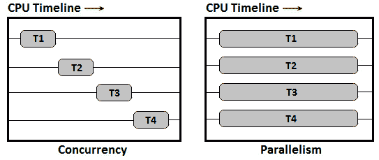
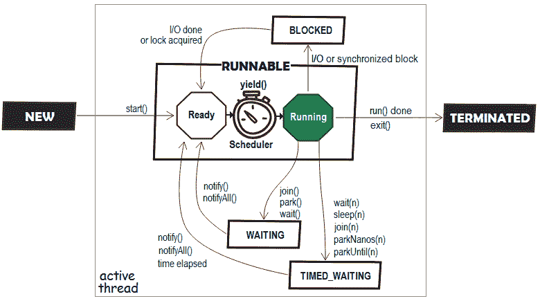
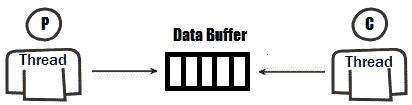

# 十六、并发

开发单线程 Java 应用程序很少可行。因此，大多数项目都是多线程的（也就是说，它们将在多线程环境中运行）。这意味着，您迟早要解决某些多线程问题。换句话说，在某个时刻，您将不得不直接或通过专用 API 来处理 Java 线程的代码。

本章介绍了 Java 并发性（多线程）方面最常见的问题，这些问题出现在关于 Java 语言的一般访谈中。和往常一样，我们将从一个简短的介绍开始，介绍 Java 并发性的主要方面。因此，我们的议程是直截了当的，包括以下主题：

*   Java 并发（多线程）简而言之
*   问题和编码挑战

让我们从主题 Java 并发性的基础知识开始。使用下面的简要部分来提取关于并发性的一些基本问题的答案，例如*什么是并发性？什么是 Java 线程？什么是多线程？*等。

# 技术要求

本章中使用的代码可以在 GitHub 上找到：[https://github.com/PacktPublishing/The-Complete-Coding-Interview-Guide-in-Java/tree/master/Chapter16](https://github.com/PacktPublishing/The-Complete-Coding-Interview-Guide-in-Java/tree/master/Chapter16)

# Java 并发（多线程）简而言之

我们的电脑可以同时运行多个*程序*或*应用程序*（例如，我们可以在媒体播放器上听音乐，同时浏览互联网）。*进程*是一个程序或应用程序的执行实例（例如，双击计算机上的 NetBeans 图标，启动一个将运行 NetBeans 程序的进程）。此外，*线程*是一个*轻量级子流程*，表示流程中最小的可执行工作单元。Java 线程的开销相对较低，并且与其他线程共享公共内存空间。一个进程可以有多个线程和一个*主线程*。

重要提示

进程和线程之间的主要区别在于，线程共享公共内存空间，而进程不共享。通过共享内存，线程减少了大量开销。

*并发*是应用程序处理其处理的多个任务的能力。程序或应用程序可以一次处理一个任务（*顺序处理*），也可以同时处理多个任务（*并发处理*）。

不要将并发性与*并行性*混淆。*并行性*是应用程序处理每个单独任务的能力。应用程序可以串行处理每个任务，也可以将任务拆分为可以并行处理的子任务。

重要提示

并发是指**一次处理**（不做）很多事情，而并行是指**一次做**很多事情。

通过*多线程*实现并发。*多线程*是一种使程序或应用程序能够一次处理多个任务并同步这些任务的技术。这意味着多线程通过几乎同时执行两个或多个任务来实现 CPU 的最大利用率。我们在这里说*实际上是在同一时间*，因为任务看起来只是在同时运行；然而，从本质上讲，他们无法做到这一点。它们利用了操作系统的 CPU*上下文切换*或*时间切片*功能。换句话说，CPU 时间在所有正在运行的任务中共享，每个任务都计划运行一段时间。因此，多线程是*多任务*的关键。

重要提示

使用单核 CPU，我们可以实现并发，但*不能实现*并行。

总之，线程可以产生多任务的错觉；然而，在任何给定的时间点，CPU 只执行一个线程。CPU 在线程之间快速切换控制，造成任务并行执行（或提前执行）的错觉。实际上，它们是同时执行的。然而，随着硬件技术的进步，现在拥有多核机器和计算机已司空见惯。这意味着应用程序可以利用这些体系结构，并有一个专用的 CPU 运行每个线程。

下图通过四个线程（**T1**、**T2**、**T3**和**T4**澄清了并发性和并行性之间的混淆：



16.1–并发与并行

因此，应用程序可以是以下之一：

*   **并发但不并行**：同时执行多个任务，但不同时执行两个任务。
*   **并行而非并发**：在多核 CPU 上同时执行一个任务的多个子任务。
*   **既不并行也不并发**：一次执行一个任务（顺序执行）。
*   **并行并发**：在一个多核 CPU 上同时执行多个任务。

分配给执行任务的一组同质工作线程称为*线程池*。完成任务的工作线程返回池。通常，线程池绑定到一个任务队列，并且可以根据它们所持有的线程的大小进行调整。通常，为了获得最佳性能，线程池的大小等于 CPU 核的数量。

多线程环境的*同步*是通过*锁定*实现的。锁定用于在多线程环境中协调和限制对资源的访问。

如果多个线程可以访问同一资源而不会导致错误或不可预测的行为/结果，那么我们就处于*线程安全上下文*中。*线程安全*可以通过各种同步技术实现（例如，Java**synchronized**关键字）。

接下来，让我们讨论几个关于 Java 并发性的问题和编码挑战。

# 问题和编码挑战

在本节中，我们将介绍 20 个在访谈中非常流行的并发问题和编码挑战。

您应该知道，Java 并发是一个广泛而复杂的主题，任何 Java 开发人员都需要非常详细地介绍它。对 Java 并发性有基本的了解应该足以通过一般的 Java 语言面试，但对于特定的面试来说还不够（例如，如果您申请的工作将意味着开发并发 API，那么您必须深入研究该主题并学习高级概念——最有可能的是，面试将以并发为中心）。

## 编码挑战 1–线程生命周期状态

**问题**：列举并用几句话解释 Java**线程**的状态。

**解决方案**：Java 线程的状态可通过**线程、状态**枚举获取。Java 线程的可能状态可以在下图中看到：



16.2–Java 线程状态

Java**线程**的不同生命周期状态如下：

*   ****新****状态**：一个已创建但未启动的线程（这是在调用**线程的【start（）**方法之前的状态）。**
***   ****可运行****状态**：通过调用**线程【start（）**方法，线程从**新**传递到**可运行**。在**可运行**状态下，线程可以正在运行或准备运行。一个线程正在等待**JVM**（**Java 虚拟机**线程调度器来分配必要的资源和运行时间，该线程已准备好运行，但尚未运行。一旦 CPU 可用，线程调度程序就会运行线程。*****   ****阻塞****状态**：执行同步块或 I/O 任务的线程可能会进入**阻塞**状态。例如，如果一个线程*t1*试图进入一个已被另一个线程*t2*访问的同步代码块（例如，标记为**已同步**的代码块），则*t1*被保存在**已被阻止的**中状态，直到它可以获得所需的锁。*****   ****等待****状态**：一个线程*T1*（没有设置明确的超时时间）等待另一个线程*T2*完成其任务，该线程处于**等待**状态。*****   ****定时等待****状态**：一个线程*T1*等待另一个线程*T2*完成其作业的显式时间段（通常以毫秒或秒为单位）处于**定时等待**状态。*****   ****终止****状态**：异常中断或成功完成任务的 Java 线程处于**终止**状态。************

 ****除了描述 Java 线程的可能状态外，面试官可能会要求您为每个状态编写一个示例。这就是为什么我强烈建议您花点时间分析名为*ThreadLifecycleState*的应用程序（为简洁起见，本书中未列出代码）。应用程序的结构非常直观，主要的注释解释了每个场景/状态。

## 编码挑战 2–死锁

**问题**：向我们解释一下僵局，我们会雇用你！

**解决方案**：雇佣我，我会向你解释。

在这里，我们已经刚刚描述了一个死锁。

死锁可以这样解释：线程*T1*持有锁*P*，并试图获取锁*Q*。同时，有线程*T2*持有锁*Q*，并试图获取锁*P*。这种僵局被称为*循环等待*或*致命拥抱*。

Java 不提供死锁检测和/或解决机制（比如数据库）。这意味着死锁对于应用程序来说可能非常尴尬。死锁可以部分或完全阻止应用程序。这会导致严重的性能损失、意外的行为/结果等。通常，死锁很难找到和调试，它们迫使您重新启动应用程序。

避免竞争死锁的最佳方法是避免使用嵌套锁或不必要的锁。嵌套锁很容易出现死锁。

模拟死锁的一个常见问题是**进餐哲学家**问题。您可以在*Java 编码问题*一书（[中找到此问题的详细解释和实现 https://www.packtpub.com/programming/java-coding-problems](https://www.packtpub.com/programming/java-coding-problems) ）。*Java 编码问题*包含两章专门讨论 Java 并发性，旨在使用特定问题深入探讨此主题。

在本书的代码包中，您可以找到一个导致死锁的简单示例，名为*死锁*。

## 编码挑战 3–竞赛条件

**问题**：解释*比赛条件*是什么。

**解决方案**：首先我们必须提到，可以由多个线程执行（即并发执行）并公开共享资源（例如，共享数据）的代码片段/代码块称为*关键部分*。

*当线程在没有线程同步的情况下通过这些关键部分时，会出现竞态条件*。线程*在尝试读/写共享资源的关键部分进行*竞争。根据线程完成此竞争的顺序，应用程序的输出会发生变化（应用程序的两次运行可能会产生不同的输出）。这会导致应用程序中出现不一致的行为。

避免竞争条件的最佳方法是通过使用锁、同步块、原子/易失性变量、同步器和/或消息传递来正确同步关键部分。

编码挑战 4–可重入锁定

**问题**：解释*重入锁定*的概念。

**解决方案**：一般来说，*重入锁定*是指能够多次获取锁而自身不会死锁的过程。如果锁不可重入，那么进程仍然可以获取它。但是，当进程再次尝试获取锁时，它将被阻止（死锁）。可重入锁可以由另一个线程获取，也可以由同一个线程递归获取。

可重入锁可用于不包含可能破坏它的更新的代码段。如果代码包含可更新的共享状态，则再次获取锁将损坏共享状态，因为代码在执行时被调用。

在 Java 中，可重入锁是通过**可重入锁**类实现的。可重入锁的作用如下：当线程第一次进入锁时，保持计数设置为 1。解锁前，线程可以重新进入锁，导致每次进入的保持计数增加一。每个解锁请求将保持计数递减一，当保持计数为零时，锁定的资源被打开。

## 编码挑战 5–执行者和执行者服务

**问题**：什么是**执行人**和**执行人服务**？

**解决方案**：在**java.util.concurrent**包中，有许多专用于执行任务的接口。最简单的名为**执行人**。此接口公开了一个名为**execute（Runnable 命令）**的方法。

一个更复杂、更全面的接口是**ExecutorService**，它提供了许多额外的方法。这是**执行器**的一个丰富版本。Java 附带了一个成熟的**ExecutorService**实现，名为**ThreadPoolExecutor**。

在本书的代码包中，您可以找到在名为*Executor 和*ExecutorService 的应用程序中使用**Executor**和**ThreadPoolExecutor**的简单示例。

编码挑战 6–可运行与可调用

**问题**：**可调用**接口与**可运行**接口有什么区别？

**解决方案**：**Runnable**接口是一个功能接口，包含一个名为**run（）**的方法。**run（）**方法不接受任何参数，返回**void**。此外，它不能抛出已检查的异常（只有**RuntimeException**）。这些语句使**可运行**适用于我们不寻找线程执行结果的场景。**run（）**签名如下：

```java
void run()
```

另一方面，**可调用**接口是一个功能接口，它包含一个名为**call（）**的方法。**call（）**方法返回一个泛型值，并可以抛出已检查的异常。通常，**可调用**用于**ExecutorService**实例。这对于启动异步任务，然后调用返回的**Future**实例获取其值非常有用。**Future**接口定义了获取**可调用**对象生成的结果和管理其状态的方法。**call（）**签名如下：

```java
V call() throws Exception
```

注意这两个接口都表示一个任务，该任务将由一个单独的线程并发执行。

在本书的代码包中，您可以找到在名为*RunnabledCallable*的应用程序中使用**Runnable**和**Callable**的简单示例。

## 编码挑战 7–饥饿

**问题**：解释*饥饿*是什么线索。

**解决方案**：从未（或极少）获得 CPU 时间或访问共享资源的线程是经历*饥饿*的线程。由于无法获得对共享资源的常规访问，因此此线程无法继续其作业。发生这种情况是因为其他线程（所谓的*贪婪*线程）在该线程之前获得访问权限，并使资源长时间不可用。

避免线程匮乏的最佳方法是使用*公平*锁，如 Java**ReentrantLock**。一个*公平*锁授予对等待时间最长的线程的访问权。可以通过 Java**信号量**实现在防止饥饿的同时同时同时运行多个线程。*公平***信号量**保证使用 FIFO 授予争用下的许可。

编码挑战 8–活锁

**问题**：解释什么是线程*活锁*。

**解决方案**：当两个线程继续对另一个线程进行响应时，就会发生活锁。线程在自己的作业中没有任何进展。请注意，线程没有阻塞；他们两人都忙于回复对方，无法继续工作。

这里有一个活锁的例子：想象两个人在走廊里试图互相交叉。马克向右移动让奥利弗通过，奥利弗向左移动让马克通过。两人现在都在互相阻拦。马克看到他挡住了奥利弗，向左移动，奥利弗看到他挡住了马克后向右移动。他们从来没有设法互相交叉，并不断地互相阻挡。

我们可以通过**重入锁**避免活锁。这样，我们可以确定哪个线程等待的时间最长，并为其分配一个锁。如果线程无法获取锁，它应该释放以前获取的锁，然后稍后重试。

编码挑战 9–开始（）与运行（）的比较

**问题**：解释 Java**线程**中**start（）**方法与**run（）**方法的主要差异。

**解决方案**：**start（）**与**run（）**的主要区别在于**start（）**方法创建新线程，而**run（）**方法不创建新线程。**start（）**方法创建一个新线程，并调用该新线程的**run（）**方法中编写的代码块。**run（）**方法在同一线程（即调用线程）上执行该代码，而不创建新线程。

另一个区别是，对 thread 对象调用两次**start（）**将抛出一个**非法状态异常**。另一方面，两次调用**run（）**方法不会导致异常。

通常，新手会忽略这些差异，因为**start（）**方法最终会调用**run（）**方法，所以他们认为没有理由调用**start（）**方法。因此，他们直接调用**run（）**方法。

## 编码挑战 10–线程与可运行

**问题**：要实现线程，我们应该扩展**线程**还是实现**可运行**？

**解决方案**：正如问题所暗示的，实现 Java 线程可以通过扩展**Java.lang.thread**或实现**Java.lang.Runnable**来完成。首选的方法是实现**可运行**。

大多数时候，我们实现线程只是为了让它运行，而不是覆盖**线程**的行为。只要我们想让线程运行，我们就一定要坚持实现**可运行**。事实上，使用**可调用**或**未来任务**是更好的选择。

除此之外，通过实现**Runnable**，您还可以扩展另一个类。通过扩展**线程**，您无法扩展另一个类，因为 Java 不支持多继承。

最后，通过实现**可运行**，我们将任务定义与任务执行分离。

编码挑战 11–倒计时锁存器与周期载波器

**问题**：解释**倒计时锁存器**与**自行车载货车**的主要区别。

**解决方案**：**倒计时锁存器**和**循环载波器**是五个 Java*同步器*中的两个，紧挨着**交换机**、**信号量**和**相位器**。

**倒计时锁存器**和**CyclicBarrier**之间的主要区别在于**倒计时锁存器**实例一旦倒计时为零就不能被重用。另一方面，**CyclicBarrier**实例是可重用的。**CyclicBarrier**实例是循环的，因为它可以重置和重用。要执行此操作，请在释放所有在屏障处等待的线程后调用**reset（）**方法；否则将抛出**BrokenBarrierException**。

## 编码挑战 12–等待（）与睡眠（）

**问题**：解释**等待（）**方法与**睡眠（）**方法的主要差异。

**解决方案**：**wait（）**方法与**sleep（）**方法的主要区别在于**wait（）**必须从同步上下文（例如，从**同步**方法）调用，**sleep（）**方法方法不需要同步的上下文。从非同步上下文调用**wait（）**将引发**非法监视器状态异常**。

此外，值得一提的是，**wait（）**作用于**对象**，而**sleep（）**作用于当前线程。本质上，**wait（）**是**java.lang.Object**中定义的非**静态**方法，**sleep（）**是**java.lang.Thread**中定义的**静态**方法。

此外，**wait（）**方法释放锁，**sleep（）**方法不释放锁。**sleep（）**方法仅将当前线程暂停一段时间。它们都抛出**IntrupptedException**并可以被中断。

最后，应该在决定何时释放锁的循环中调用**wait（）**方法。另一方面，不建议您在循环中调用**sleep（）**方法。

编码挑战 13–ConcurrentHashMap 与 Hashtable

**问题**：为什么**ConcurrentHashMap**比**哈希表**快？

**解决方案**：**ConcurrentHashMap**由于其特殊的内部设计，比**Hashtable**更快。**ConcurrentHashMap**在内部将映射划分为段（或桶），并且在更新操作期间只锁定特定的段。另一方面，**哈希表**在更新操作期间锁定整个地图。因此，**哈希表**对整个数据使用一个锁，而**ConcurrentHashMap**对不同的段（桶）使用多个锁。

此外，使用**get（）**读取**ConcurrentHashMap**是无锁的（无锁），而所有**哈希表**操作只是**同步**。

## 编码挑战 14–ThreadLocal

**问题**：什么是 Java**ThreadLocal**？

**解决方案**：Java 线程共享相同的内存。然而，有时，我们需要为每个线程提供专用内存。Java 提供了**ThreadLocal**作为单独存储和检索每个线程的值的方法。**ThreadLocal**的单个实例可以存储和检索多个线程的值。如果线程*A*在**ThreadLocal**的同一实例中存储了*x*值，线程*B*存储了*y*值，那么稍后，线程*A*检索了*x*值，线程*B*检索*y*值。Java**ThreadLocal**通常用于以下两种场景：

1.  提供每线程实例（线程安全性和内存效率）
2.  为每个线程提供上下文

## 编码挑战 15–提交（）与执行（）比较

**问题**：解释**ExecutorService【submit（）**和**Executor**方法之间的主要差异。

**解决方案**：虽然这两种方法都用于提交**可运行的**任务执行，但它们并不相同。主要的区别可以通过简单地检查他们的签名来观察。请注意，**submit（）**返回结果（即表示任务的**Future**对象），而**execute（）**返回**void**。返回的**Future**对象可用于以后（提前）以编程方式取消正在运行的线程。此外，通过使用**Future#get（）**方法，我们可以等待任务完成。如果我们提交一个**可调用**，那么**Future#get（）**方法将返回调用**可调用**方法的结果。

## 编码挑战 16–中断（）和中断（）

**问题**：解释**中断的方法**和**中断的方法**之间的主要差异。

**解决方案**：Java 多线程中断技术使用称为*中断状态*的内部标志。**Thread.interrupt（）**方法中断当前线程并将此标志设置为**true**。

**interrupted（）**和**isiinterrupted（）**方法之间的主要区别在于**interrupted（）**方法清除中断状态，而**isiinterrupted（）**不清除。

如果线程被中断，则**thread.interrupted（）**将返回**true**。但是，除了测试之外，如果当前线程被中断，**thread.interrupted（）**会清除线程的中断状态（即将其设置为**false**。

非-**静态 isInterrupted（）**方法不会更改中断状态标志。

根据经验，在捕捉到**InterruptedException**之后，不要忘记通过调用**Thread.currentThread（）.interrupt（）**来恢复中断。这样，我们代码的调用者将知道中断。

编码挑战 17–取消线程

**问题**：如何停止或取消线程？

**解决方案**：Java 不提供阻止线程的抢先方式。因此，要取消任务，通常的做法是依赖使用标志条件的循环。该任务的责任是定期检查该标志，当它找到该标志集时，它应该尽快停止。请注意，此标志通常声明为**volatile**（也称为轻量级同步机制）。作为一个**volatile**标志，它不会被线程缓存，对它的操作不会在内存中重新排序；因此，线程无法看到旧值。任何读取**volatile**字段的线程都将看到最近写入的值。这正是我们需要的，以便将取消操作传达给对该操作感兴趣的所有正在运行的线程。下图说明了这一点：


16.3–易失性标志读/写

注意，**volatile**变量不适合读-修改-写场景。对于此类场景，我们将依赖原子变量（例如，**原子布尔**、**原子整数**和**原子引用**）。

在本书的代码包中，您可以找到取消线程的示例。该应用程序名为*CancelThread*。

## 编码挑战 18–线程间共享数据

**问题**我们如何在两个线程之间共享数据？

**解决方案**：可以通过线程安全的共享对象或数据结构在两个（或更多）线程之间共享数据。Java 自带了一组内置的线程安全数据结构，如**阻塞队列**、**LinkedBlockingQueue**和**ConcurrentLinkedQueue**。依靠这些数据结构在线程之间共享数据非常方便，因为您不必担心线程安全和线程间通信。

编码挑战 19–读写锁

**问题**：解释 Java 中的**读写锁**是什么。

**解决方案**：**读写锁**的主要目的是维持并发环境中读写操作的效率和线程安全。它通过*锁条化*概念实现了这一目标。换句话说，**读写锁**对读写操作使用单独的锁。更准确地说，**ReadWriteLock**保留了一对锁：一个用于只读操作，一个用于写入操作。只要没有写入线程，多个读线程就可以同时持有读锁（共享悲观锁）。一个写入程序一次可以写入（独占/悲观锁定）。因此，**读写锁**可以显著提高应用程序的性能。

除了**读写锁**之外，Java 还配备了**可重入写锁**和**压印锁**。**ReentrantReadWriteLock**类将*reentrant locking*概念（参见*编码挑战 4*添加到**读写锁**中。另一方面，**StampedLock**的性能优于**ReentrantReadWriteLock**并支持乐观读取。但它不是*可重入的*；因此，它容易出现死锁。

## 编码挑战 20–生产者-消费者

**问题**：为著名生产者消费者问题提供实现。

笔记

这是任何 Java 多线程访问中最受欢迎的问题！

**解决方案**：生产者-消费者问题是一种设计模式，可以表示为：



16.4–生产者-消费者设计模式

最常见的是，在这种模式中，生产者线程和消费者线程通过队列（生产者排队数据和消费者排队数据）和一组特定于建模业务的规则进行通信。该队列称为*数据缓冲区*。当然，根据流程设计，其他数据结构也可以扮演数据缓冲区的角色。

现在，让我们假设以下场景（一组规则）：

*   如果数据缓冲区为空，则生产商生产一种产品（通过将其添加到数据缓冲区）。
*   如果数据缓冲区不为空，则消费者消费一种产品（通过将其从数据缓冲区中移除）。
*   只要数据缓冲区不为空，生产者就等待。
*   只要数据缓冲区是空的，消费者就会等待。

接下来，让我们通过两种常见的方法来解决这个场景。我们将从一个基于**wait（）**和**notify（）**方法的解决方案开始。

## 生产者消费者通过等待（）和通知（）进行

一些面试官可能会要求您使用**等待（）**和**通知（）**方法实现**生产者消费者**应用程序。换句话说，它们不允许您使用内置的线程安全队列，例如**阻塞队列**。

例如，让我们考虑数据缓冲器（Apple T0}队列 AUTT1）由一个 TythT2A.Link 表 TUR3 T3，即一个非线程安全的数据结构来表示。为了确保生产者和消费者能够以线程安全的方式访问此共享的**LinkedList**，我们依赖**synchronized**关键字。

### 制作人

如果队列不是空的，则生产者将等待消费者完成。为此，生产者依赖于**wait（）**方法，如下所示：

```java
synchronized (queue) {     
  while (!queue.isEmpty()) {
    logger.info("Queue is not empty ...");
    queue.wait();
  }
}
```

另一方面如果队列为空，则生产者将一个产品排队，并通过**notify（）**通知消费者线程，如下所示：

```java
synchronized (queue) {
  String product = "product-" + rnd.nextInt(1000);
  // simulate the production time
  Thread.sleep(rnd.nextInt(MAX_PROD_TIME_MS)); 
  queue.add(product);
  logger.info(() -> "Produced: " + product);
  queue.notify();
}
```

将产品添加到队列后，消费者应该准备好消费它。

### 消费者

如果队列为空，则消费者等待生产者完成。为此，生产者依赖于**wait（）**方法，如下所示：

```java
synchronized (queue) {
  while (queue.isEmpty()) {
    logger.info("Queue is empty ...");
    queue.wait();
  }
}
```

另一方面，如果队列不为空，则消费者将一个产品退出队列，并通过**notify（）**通知生产者线程，如下所示：

```java
synchronized (queue) {
  String product = queue.remove(0);
  if (product != null) {
    // simulate consuming time
    Thread.sleep(rnd.nextInt(MAX_CONS_TIME_MS));                                
    logger.info(() -> "Consumed: " + product);
    queue.notify();
  }
}
```

完整代码在捆绑代码*ProducerConsumerWaitNotify*中提供。

通过内置阻塞队列的生产者-消费者

如果您可以使用内置阻塞队列，那么您可以选择**阻塞队列**甚至**传输队列**。它们都是线程安全的。在下面的代码中，我们使用一个**TransferQueue**或者更准确地说，一个**LinkedTransferQueue**。

### 制作人

生产者通过**hasWaitingConsumer（）**等待消费者可用：

```java
while (queue.hasWaitingConsumer()) {
  String product = "product-" + rnd.nextInt(1000);
  // simulate the production time
  Thread.sleep(rnd.nextInt(MAX_PROD_TIME_MS)); 
  queue.add(product);
  logger.info(() -> "Produced: " + product);
}
```

将产品添加到队列后，消费者应该准备好消费它。

### 消费者

消费者使用带超时的**poll（）**方法提取产品：

```java
// MAX_PROD_TIME_MS * 2, just give enough time to the producer
String product = queue.poll(
  MAX_PROD_TIME_MS * 2, TimeUnit.MILLISECONDS);
if (product != null) {
  // simulate consuming time
  Thread.sleep(rnd.nextInt(MAX_CONS_TIME_MS));                         
  logger.info(() -> "Consumed: " + product);
}
```

完整的代码在捆绑代码*ProducerConsumerQueue*中提供

总结

在本章中，我们讨论了 Java 多线程访谈中最常见的问题。然而，Java 并发是一个广泛的话题，深入研究它是非常重要的。我强烈建议您阅读 Brian Goetz 的*Java 并发性实践*。这是任何 Java 开发人员必须阅读的内容。

在下一章中，我们将讨论一个热门话题：Java 函数式编程。****