# Java 中的第一个编程步骤

欢迎来到《面向初学者的 Java 自动化测试实践》。这是您在互联网上找到的唯一一本书，它教授了成为强大的 Java 自动化测试人员所需的每一个主题。它包含了简单的教学和简单的技术，可以有效地处理 Java 相关的自动化/项目。考虑到我们将涵盖核心 Java 的每一个主题，并提供详细的解释，这将真正帮助我们开发和分级我们自己的 Java 自动化项目。

所有核心 Java 概念都是从头开始解释的。我们不认为读者有任何先决条件知识，所以我们认为所有的读者都来自非编码背景，我们教他们，并支持他们的例子，我们将实时使用。因此，我们不会只坚持理论。

当你查看市场上的课程时，你应该尝试学习一个新概念。你只看到三行定义，后面是示例；这就是全部。但在这里，我们将理解为什么、何时以及在何处使用 Java 中的**面向对象编程系统**（**OOPS**）概念。还将有适当的编程示例，显示实时使用中的特定 OOPS 概念。通过这种方式，我们的书将推动实时项目；这都是关于实践的学习。当我们从 Java 集合（如核心 Java）开始时，这将发挥作用，核心 Java 是我们书中的主要概念之一，因为它是您在工作场所中开始基础知识和开发自动化框架所必需的。此外，由于 Java 集合是核心部分之一，在整本书中，我们将非常小心地为我们将要讨论的每个 Java 集合提供所有必要的实际场景。

我们将致力于复杂的 Java 程序，研究打印输出、素数、斐波那契级数和金字塔。我们将按降序排列打印，查看数组矩阵，并打印最大列数。这本书将为你提供详细的策略和技巧，你需要在接近和设计这些程序的逻辑时使用这些策略和技巧。这将帮助您超越界限进行思考，并获得编写困难的 Java 程序所需的逻辑。

本书中讨论的项目来源于许多公司面试中常见的问题。您将获得有关这些问题的帮助，以及详细的解决方案和接近该逻辑的方法。因此，本书主要关注核心 Java。我们不是在讨论摆动和按钮，它们超出了本书中 Java 学习的范围。

在本书中，我们将学习核心 Java、集合和其他概念，如循环、类和数组。这些对于您启动和开发 Java 项目来说已经足够了。无论您从事哪个领域，从本书中获得的知识都将帮助您立即开始自动化项目中的测试。

本章将涵盖以下概念：

*   Java 及其安装简介
*   使用 Java 编辑器工具
*   用 Java 编写第一个可执行程序

# Java 及其安装简介

当我们谈到 Java 时，首先想到的是它是独立于平台的。这一特性使 Java 成为市场上的热门编程工具。那么平台独立到底意味着什么呢？

我们编写的代码独立于环境；基本上，当我们编写 Java 程序时，Java 编译器会将程序转换为字节码。当我们运行 Java 代码时，Java 编译器将整个编程代码转换为字节码。例如，我们正在 Windows 计算机上工作。当我们运行程序，Java 编译器为我们运行并创建字节码时，这个字节码可以在任何其他平台上执行，比如 Linux、macOS 和 Unix。这意味着我们正在 Windows 中开发字节码，并且字节码可以在任何其他平台上运行。这就是我们所说的平台独立。

这是 Java 编程中非常酷的特性。每当你要求别人下载 Java 时，第一个问题就是，它是 JDK 还是 JRE？人们容易混淆这两个术语。在开始在机器中下载和配置 Java 之前，我们需要弄清楚这一点。让我们看看 JRE 和 JDK：

*   **JRE**代表**Java 运行时环境**：负责运行我们的 Java 程序。如果我们的目标是只运行普通的 Java 核心代码，那么 JRE 就足够了。
*   **JDK**代表**Java 开发工具包**：用于调试我们的 Java 代码，或者如果我们想要 Java 文档或类似的东西。

JDK 包含 JRE、Java 文档、调试工具和其他很酷的东西。这是一个完整的 Java 工具包，我们将从中获得它的所有组件。因此，下载什么取决于我们，但我建议我们只使用 JDK，以确保安全。如果我们只想练习和运行我们的程序，JRE 也足够了，但让我们坚持使用 JDK。

现在让我们回到从前，从互联网上下载 Java，并尝试在我们的机器上配置它。要下载 Java，[请导航到以下页面](https://java.com/en/download/)。当您单击免费 Java 下载按钮时，如以下屏幕截图所示，将下载 JRE 版本：

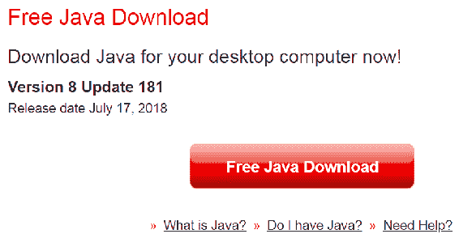

但是我们打算在我们的程序中使用 JDK，[所以请导航到以下站点](https://www.oracle.com/technetwork/java/javase/downloads/index.html)。这里有多个版本的 JDK。目前市场上最新的版本是 JavaSE10.0.2。单击下载，如以下屏幕截图所示，以便在我们的机器中下载并配置所有组件：

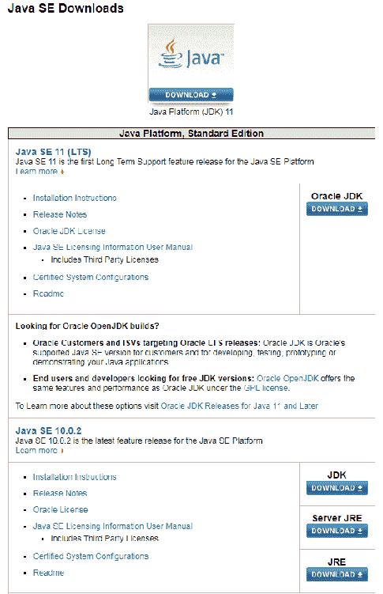

这需要一段时间，因为配置它需要很多步骤。继续单击“下一步”，以便在我们的机器中成功配置 Java。要检查我们的机器中是否安装了 Java，请导航到`C:\Program Files`。如果我们在那里找到名为`Java`的文件夹，就意味着 Java 已经成功安装在我们的机器上。`Java`文件夹如下图所示：

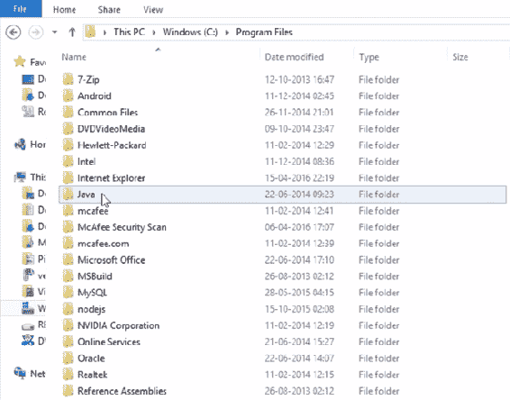

这里需要记住的一点是，如果我们是 64 位的，只有到那时我们才能在`Program Files`中看到这个`Java`文件夹。如果我们的机器是 32 位的，那么我们需要返回到`Program Files (x86)`获取`Java`文件夹。

我们可以通过进入控制面板并单击系统来检查系统类型。我正在使用的系统是 64 位的，如以下屏幕截图所示：

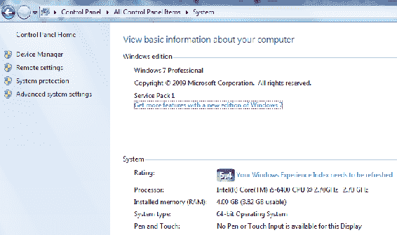

下载成功后，我们进入`Java`文件夹，观察 JDK 和 JRE 都已下载。我们进入 JDK 文件夹并复制整个文件路径。我们这样做是因为我们需要设置环境变量。设置环境变量意味着我们要让系统知道 Java 文件夹的位置。

在我们的例子中，Java 文件夹位于`C:/Program Files/Java/JDK`中，但 Windows 不知道它的确切位置。因此，为了让系统知道位置，我们将把 JDK 主路径放在系统变量中。这将帮助我们的机器知道 Java 文件夹的位置，这样无论何时运行我们的程序，它都会确定确切的 JDK 版本并运行我们的程序。为了更新系统中的环境变量，我们复制整个 JDK 路径。转到控制面板，选择系统和安全性，选择系统，然后单击高级系统设置。在高级系统设置中，选择环境变量。单击环境变量时，将显示以下窗口：

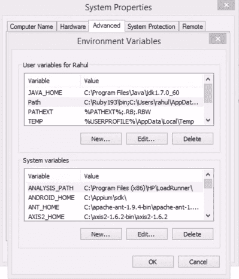

当我们在“Rahul 的用户变量”部分中单击“新建”时，我们将得到一个添加新用户变量的提示。我们输入名称为`JAVA_HOME`，将 JDK 路径粘贴到变量值文本框中，点击 OK，如下图所示：

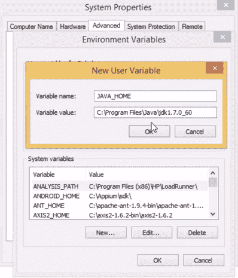

这就是我们如何让系统知道`Java`文件夹的确切位置。我们还需要更新另一个变量。为此，我们返回 JDK 文件夹并输入`bin`文件夹。我们将看到多个`.exe`文件，如下图所示：

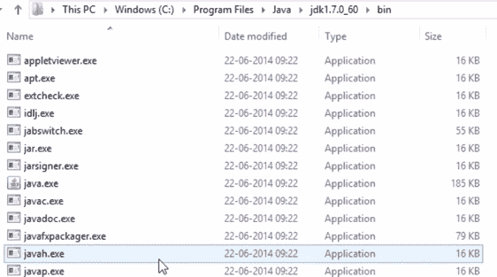

我们复制`bin`文件夹位置路径并返回系统属性窗口。在系统变量中，我们将看到一个名为`Path`的变量。双击它将显示编辑系统变量的提示，如以下屏幕截图所示：

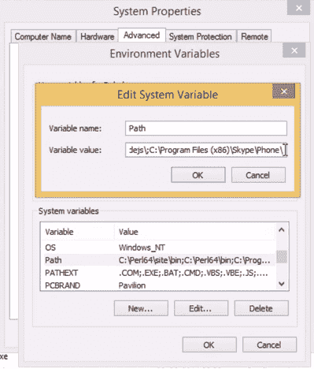

在变量值中，我们转到末尾，添加分号，然后粘贴`bin`文件夹路径。这意味着我们正在将`Path`变量设置为`bin`文件夹。我们还创建了一个名为`JAVA_HOME`的新变量，指向`Java`文件夹。在开始使用 Java 之前，我们需要设置这两个变量。一旦我们设置了这两个变量并单击 OK，我们将成功设置环境变量。

如果我们想交叉检查环境变量是否正确配置，我们可以使用命令提示符。在命令提示下，我们输入`java -version`并点击`Enter`。如果我们得到如下屏幕截图所示的输出，则表示 Java 已在我们的系统上成功配置：

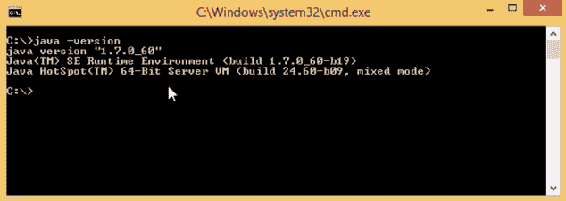

如果在添加变量之前运行该命令，我们将看到 Java 无法识别。只有在设置了系统环境变量之后，我们才能成功地配置 Java。

前面的说明介绍了如何从我们的终端安装和配置系统。接下来，我们将尝试下载 Eclipse，它是一个 Java 编辑器工具，我们在其中编写、运行和调试代码。作为下载 Eclipse 的先决条件，我们必须确保在机器中正确配置 Java。如果任何安装或配置步骤没有正确完成，Eclipse 将无法正确安装。

# 使用 Java 编辑器工具

在这里，我们将看看我们将用来编写 Java 代码的编辑器工具。市场上有很多工具可以作为新的 Java 编辑器，但我个人更喜欢使用 Eclipse。它具有许多内置功能和语法添加。随着我们的进步，我们将看到 Eclipse 的其他优势。有些优点在理论上是无法讨论的，因此，一旦我们开始实践编码，我们就会明白它是如何促使我们编写正确的语法的。因此，在本书的整个过程中，我们将在 EclipseIDE 编辑器中编写所有 Java 代码。

首先，我们下载 EclipseIDE 编辑器并查看它提供的接口。[下面的链接将带我们到 Eclipse 的官方网站](https://www.eclipse.org/downloads/)。该网站将如以下屏幕截图所示：


当我们单击下载 64 位按钮下方的下载软件包时，它会将我们带到以下页面：


我们将为 JavaEE 开发人员使用 EclipseIDE。我们可以选择 32 位或 64 位，这取决于我们正在使用的系统。我们已经知道如何通过访问控制面板并按照安装阶段给出的说明检查系统是 32 位还是 64 位。

我们需要确保的一件重要事情是，我们的 Java 版本与我们正在下载的 IDE 兼容。如果我们的系统是 32 位的，并且我们下载了 64 位的 Java，那么 Eclipse 将不会打开。因此，请确保我们的系统、Java 和 Eclipse 版本都在同一条线上。

该文件将以 ZIP 文件夹的形式下载，我们可以将其解压缩。以下屏幕截图显示将出现在`eclipse`文件夹中的文件夹：

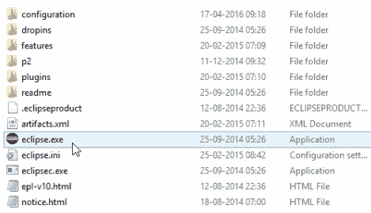

如果我们双击`eclipse.exe`文件，Eclipse UI 将打开。

如果我们想编写 Java 代码，我们需要创建一个 Java 项目。右键单击左侧的白色窗格窗口，然后单击新建|项目。这显示在以下屏幕截图中：

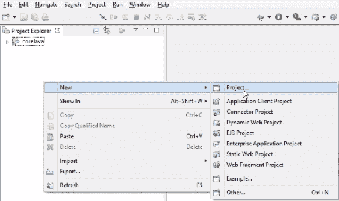

我们会得到一个提示，告诉 Eclipse 我们正在处理什么样的项目，如下面的屏幕截图所示：

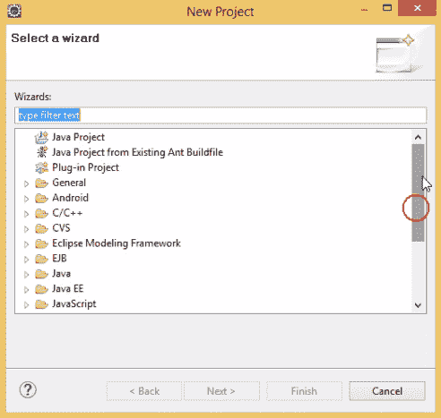

正如我们所看到的，有很多不同的框架可用，比如 Java Project、C/C++ 和 Android，但是我们只对 Java 项目感兴趣，所以我们选择 Java Project，然后单击 Next。我们将获得一个新的 Java 项目窗口，在该窗口中，我们将填写新项目的所有信息，如以下屏幕截图所示：

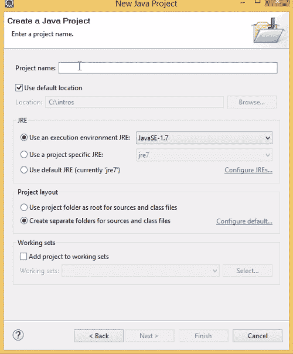

我们为将要创建的 Java 项目选择一个项目名称。我们将第一个项目命名为`coreJavaTraining`，点击下一步，然后完成。我们将收到提示，询问我们是否要打开关联透视图？；选择否：

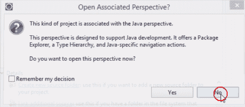

这将成功创建`coreJavaTraining`。在项目中，有一个自动创建的源文件夹。这意味着我们需要在这个源文件夹中编写类。课程到底是什么？基本上，所有 Java 代码都写在一个类中。当我们在记事本中编写 Java 时，我们打开记事本，编写 Java 代码，并用`.java`扩展名保存特定的记事本文件。但是在 Eclipse 中，所有这些工作都是由这个工具本身完成的。所以我们所需要做的就是创建一个类，这将为我们提供一个合适的模板。我们右键单击源（`src`文件）并单击“新建类”。我们将得到一个 Java 类提示，在这里输入类名。我们将该类命名为`Firstclass`并确保选中`public static void main (String[] args)`复选框；我们稍后将讨论这一点的重要性。最后，我们点击“完成”。这显示在以下屏幕截图中：

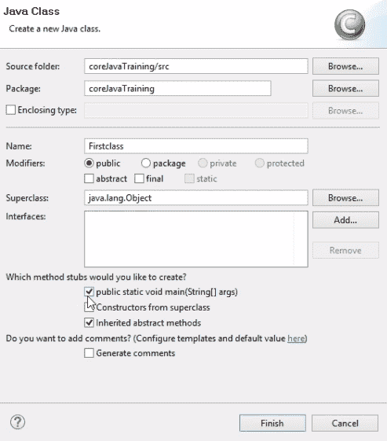

我们看到，内置层次结构已经为我们创建，因为 Eclipse 创建了一个外部模板。我们可以在编辑器中看到存在一个类和`public static void main`。所有这些都是由 Eclipse 工具创建的。如果我们在记事本上正常书写而不使用任何工具，我们需要创建模板。但是在 Eclipse 中，我们所需要做的就是给出类名。我们将要键入的代码将封装在类中；也就是说，在类的括号内。创建文件时使用的任何名称都将是类名。

所有代码的执行都将放在`public static void main`中，因为无论何时我们运行这个文件，Java 控件都将直接进入这个块。它不会触及任何写在`public static void main`之外的代码。简而言之，我们在`public static void main`块外编写代码，但最终需要在块内调用该代码。这是因为只有`main`块负责执行我们的 Java 代码。这就是为什么我们要写`public static void main`。我们将在本书中进一步了解`public`和`void`关键字，因为现在讨论这些细节还为时过早。我们可以在以下屏幕截图中看到模板：

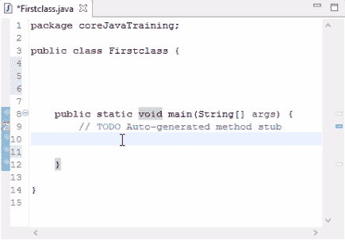

由 Eclipse 工具创建的类

# 用 Java 编写第一个可执行程序

让我们从本节中的基本编码开始。如果我们想在输出中打印一些东西，Java 中有一个名为`System.out.println()`的命令。此命令将在控制台中打印输出。假设我们要打印`hello world`，当我们运行以下代码时，`hello world`将在我们的输出控制台中打印：

```java
Firstclass.java
```

让我们运行代码。有两种方法可以运行代码：

*   在项目资源管理器中右键单击文件名，单击运行方式，然后选择 Java 应用程序。
*   或者，我们可以单击工具栏中的“运行”图标，然后单击`Save and Launch`窗口中的 OK。图标如下所示：


这将运行我们的代码并打印输出。以下屏幕截图显示了我们编辑器上的`hello world`消息：

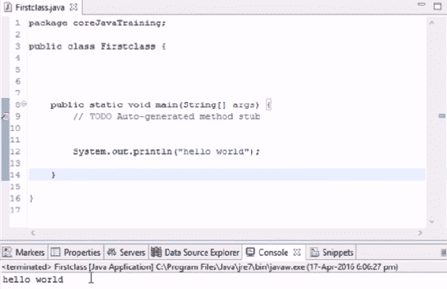

按照代码显示`hello world`的输出

简而言之，`System.out.println()`用于在我们的控制台中打印。我们将在几乎所有的示例中使用它来演示实际示例。如果我们从语句中删除`ln`，它将不会在下一行打印输出。

让我们尝试打印一条语句，该语句将在同一行上显示两个打印命令的输出。在这里，我们在`hello world`语句之前添加一个`System.out.println("hi")`语句。如果我们运行代码，输出将如下所示：

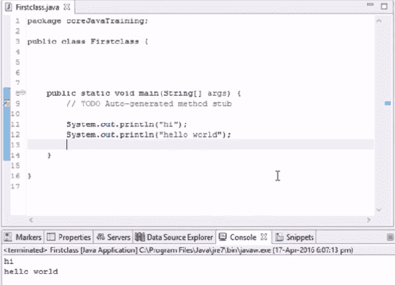

输出显示在两个单独的行上

观察`hi`如何显示在一行上，然后`hello world`如何显示在下一行上。此处，`ln`在下一行显示输出。如果我们从这两条语句中删除`ln`并运行代码，消息将显示如下：

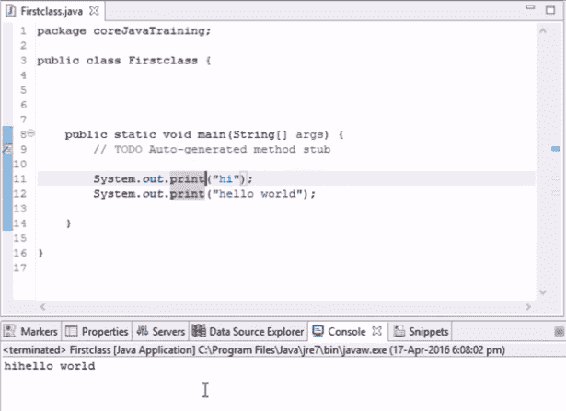

输出显示在同一行上

我们看到，`hihello world`印在同一行上。

如果我们编写代码，然后希望部分检查输出，则不需要删除代码行；我们所需要做的就是把它评论出来。我们可以在开头简单地加上双斜杠（`//`），这样 Java 就不会挑出这一行。这显示在以下屏幕截图中：

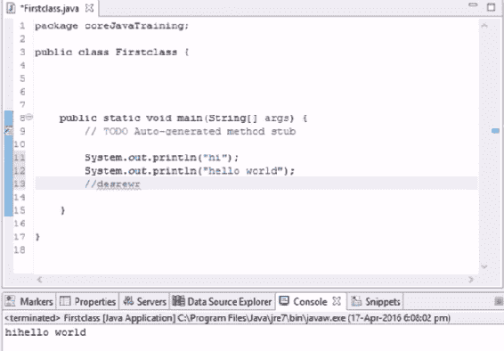

使用双斜杠进行注释

如果删除斜杠，并且语句只是一些随机单词，那么它将抛出一个错误。我们将看到一个带红色下划线的代码。这意味着在带有十字标记的线处存在错误。这显示在以下屏幕截图中：

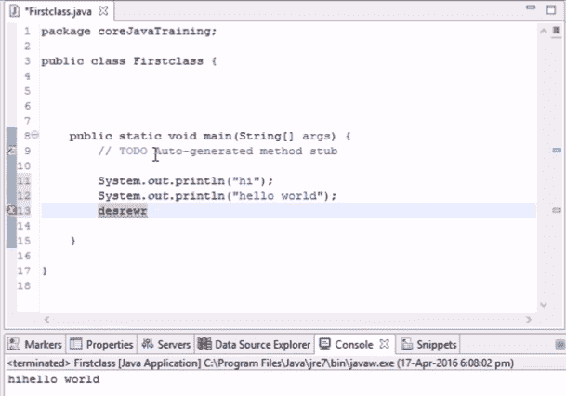

除了行号外，还用十字标记错误

再次添加反斜杠以注释掉错误。

记住，这里我们只在`main`块中编写实际代码。如果我们想打印一个整数呢？

假设我们要打印号码`4`。要打印它，我们首先需要将它存储在变量中，然后再打印变量。因此，当我们打印变量时，表示该变量的值将自动打印。在本例中，我们选择数字`4`，并在名为`a`的变量中分配该数字。这里的问题是`a`不知道分配给它的数据类型。所以，我们必须明确指出，`a`是一个整数。如果我们没有提到`a`是一个整数，它会抛出一个错误。

简而言之，我们首先创建一个名为`a`的变量，该变量仅作用于整数，然后将整数值`4`放入其中。下面的屏幕截图说明了我们正在讨论的示例：

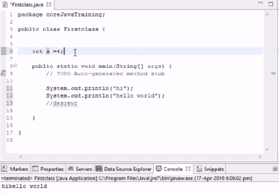

将值 4 指定给变量`a`

因此，使用这种类型的代码，我们可以在外部键入它，但是如果我们想打印它，我们必须在主块中键入它。在本例中，我们希望打印`a`的值，因此我们添加了另一条`System.out.println(a)`语句。编辑器将在`print`语句中为变量`a`抛出一个错误。要知道错误是什么，我们将鼠标悬停在错误上，会显示一个弹出窗口，显示错误以及可能的修复，如以下屏幕截图所示：

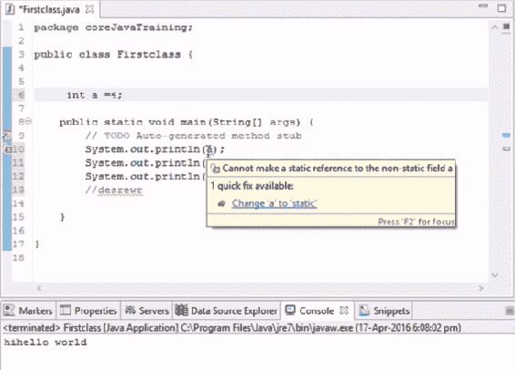

鼠标悬停在错误详细信息上时，将显示错误详细信息

在错误详细信息中，将有一个可单击的选项。这将通过添加所需内容自动解决错误。这是编辑器拥有的一个惊人的特性，当我们进入更复杂的示例时，它非常有用。

在我们的示例中，当我们单击错误详细信息弹出窗口中的`Change 'a' to 'static'`时，`static`被添加到变量`a`，我们可以运行代码。运行代码时，控制台将如下所示：

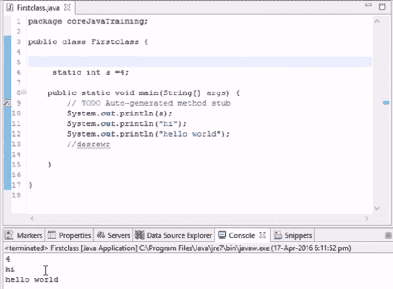

根据代码显示`a`值的输出

我们将在后面的章节中详细介绍`static`到底是什么

# 总结

在本章中，我们简要介绍了 Java。然后，我们安装并配置了使用 Java 所需的各种工具。接下来，我们看了一下我们将用来编写自己的 Java 代码的编辑器。

最后，我们执行了第一个示例，了解了编辑器是如何工作的，以及它是如何处理错误的

在下一章中，我们将学习一些基本概念，例如字符串、变量和方法，以及它们如何使用代码彼此不同。