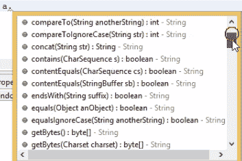
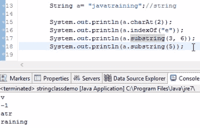

# 在 Java 中处理字符串及其函数

在本章中，我们将讨论字符串并查看`String`类。我们还将学习如何定义字符串，并了解定义字符串的不同方式。然后我们将在`String`课程中讨论不同的方法。最后，我们将编写一些简单的代码来反转字符串的内容，我们还将检查反转的字符串是否是回文。

本章将介绍以下主题：

*   引入字符串
*   `String`类及其方法
*   反转字符串的逻辑

# 引入字符串

字符串是 Java 编程中最重要的概念之一。`String`是 Java 中预构建的类之一。因此，如果您想要操纵字符串，那么您可以简单地创建这个`String`类的对象，并使用该对象，您可以随意操纵字符串。然后可以根据`substring`概念将字符串分成两部分。我们还可以连接两个字符串。所有这些都可以在`String`课程的帮助下完成。

让我们自己试着操纵一根弦。创建一个新的 Java 类并将其命名为`stringclassdemo`。

在几乎所有与 Java 相关的访谈中，最常见的问题之一是程序员如何定义字符串。答案是，您可以使用以下两种方式之一：

*   通过定义`String`文本
*   通过创建一个对象`String`

现在让我们逐一查看每个方法，以了解声明字符串的不同方式。

# 定义字符串文字

定义`String`文本可以简单地完成，如下所示：

```java
        String a= "hello";
```

我们创建了一个字符串，它是`hello`，并将其存储在名为`a`的变量中。这就是我们定义`String`的方式，它与定义`String`文字相同。

假设您又定义了一个字符串，如下所示：

```java
        String a= "hello";
        String b= "hello";
```

不幸的是，即使是`b`变量也有一个`hello`字符串，`a`变量也定义了相同的字符串。Java 程序编译时，会创建一个名为`a`的`String`对象，并分配`hello`。

现在，在为这个`hello`字符串创建对象之前，`b`变量首先检查`String`池中是否已经定义了任何`hello`字符串实例。如果已经定义了，它只是将`a`引用到`b`对象，而不是单独创建一个或多个对象。

# 创建`String`类的对象

我们创建一个`String`类的对象，如下代码行所示：

```java
        String ab=new String();
```

现在，要创建一个`hello`字符串，只需将一个参数传递到`String`类中，如下所示：

```java
        String ab=new String("hello");
```

`ab`对象现在可以在此`hello`字符串上执行所有字符串操作。

让我们创建另一个字符串，称为`b`，它也等于`hello`，如下所示：

```java
        String a=new String("hello");
        String b=new String("hello");
```

然而，这里已经有一个用`a`对象创建的`hello`字符串，当 Java 编译器处理`b`对象时，它仍然会创建一个重复的`hello`字符串并将其分配给`b`，因为这里我们显式地强制它为这个类创建一个对象。虽然已经存在一个副本，但它仍将为此字符串创建一个对象；但是，在定义`String`文本时，如果对象已经存在于`String`池中，它将不会创建它，而是直接引用已经创建的对象。

这就是使用`String`文本对象创建字符串和单独使用`String`类创建对象之间的基本区别。最终，这两种方法都支持`String`方法，但在定义字符串时，这两种方法之间存在一些差异。

我们刚刚学到的这两种方法有什么区别？这两个字符串都可以访问`hello`字符串，但您可以看到它们之间存在一些差异。如果您在后端以文本方式声明字符串，那么 Java 会将`hello`分配给`a`变量。因此，这是一种更直接的创建字符串的方法，而不是使用对象创建方法。

在大多数常规 Java 工作经验中，我们更喜欢使用`String`文本。我们只是说`a`等于`hello`，就是这样。就像定义整数一样。但是`String`是一个类，在后端，它为这个`hello`字符串创建一个单独的对象，而整数只是一个引用数据类型，所以在后端不会发生任何事情。

让我们看看我们可以用我们创建的对象对这个`hello`字符串进行哪些操作。

# String 类及其方法

我们有`a`变量，这个变量也充当一个对象。当我们在编辑器中键入`a.`时，它将显示该`String`类中存在的所有方法，如以下屏幕截图所示：



它读取字符串中的第一个字符作为索引 0，第二个字符作为索引 1，依此类推。在处理程序时，如果希望在索引 2 中显示字符，只需使用以下语句即可获得该字符：

```java
        Systme.out.println(a.charAt(2));
```

您可以在输出中打印它，以便看到该字符。您可能想知道为什么我们需要字符串中的单个字符，但通常使用`charAt`方法。在下一节中，我们将介绍一个可以完全反转字符串的程序。

现在，我们将简要介绍这些方法。我们了解了如何获取出现在特定索引位置的字符。现在让我们试着扭转这种局面。假设字符存在，我们需要找到字符串中字符存在的索引值。我们使用`indexOf`方法，如下所示：

```java
        Systme.out.println(a.indexOf"e"));
```

运行这个程序。您可以看到字符`l`在`2`处，`H`在`0`处，`e`在索引`1`处，`l`在索引`2`处。这就是如何借助`String`方法提取字符和索引。

但是如果我只想把字符串从第一个字符拉到第三个字符呢？让我们来看看下面的例子：

```java
        String a= "javatraining";
        a.substring(3, 6);
```

我们输入`a.`，您可以看到有一个`substring`。如果你想拉一个从索引`3`开始到索引`6`结束的字符串，这意味着`j`将在`0`、`a`将在`1`等等。它从`2`开始，然后转到`3`、`4`和`5`，它将打印类似`vatra`的内容。

如果您想从整个字符串中拉出`substring`，那么请给出第一个字母索引和最后一个字母索引，以便在第一个字母和最后一个字母之间打印整个字符串。请记住还有另一种`substring`方法，使用这种方法，如果您不通过最后一个索引，只通过第一个索引，那么它将从索引`5`打印到最后一个索引，如下所示：

```java
        a.substring(5);
```

让我们打印输出，看看如何提取`substring`。此操作的结果显示在以下屏幕截图中：



此处，`e`的索引为`-1`，因为该字符串中没有名为`e`的字母字符。当什么都没有时，它会打印一个`-1`。

总而言之。如果我想将`concat`这个字符串与另一个名为`rahul teaches`的字符串合并，那么我将执行以下操作：

```java
        String a= "javatraining";
        System.out.priontln(a.concat("rahul teaches"));
```

`a`变量中存在的`javatraining`字符串将与`rahul teaches`连接，并将输出打印为`javatrainingrahul teaches`。我们也可以使用`a.length()`，它将给出该字符串从零开始的最大长度。还有一种类型叫做`trim`。假设字符串中有一些空格，如下所示：

```java
        String a= " javatraining";
        System.out.println(a.trim());
```

这里，字符串的第一个字符是一个空格，后面紧跟着其余字符。如果您想删除该空白，只需使用`a.trim`即可。打印输出时，将删除此空白。

如果您想打印所有大写字母，我们可以使用`a.toUpperCase`。我们可以使用`a.toLowerCase`对小写进行同样的处理。

还有一个更有趣的方法可以看，那就是`split`。基本上，我们可以根据分隔符分割整个字符串。为此，我们使用`a.split()`。在本例中，我们希望根据代码中的斜杠将其拆分，如下所示：

```java
        String a= "java/training";
        System.out.println(a.split(/));
```

这意味着`/`字符之前的整个字符串应作为一个字符串分隔，其余部分应作为另一个字符串分隔。此方法不仅可以用于分割斜杠，还可以分割我们想要分割的任何东西，如以下代码所示：

```java
        String a= "javatraining";
        System.out.println(a.split(t));
```

如果我们想从`t`中拆分字符串，那么这意味着`java`将是一个字符串，`raining`将是另一个字符串。因为我们将有两个字符串，所以我们的输出将把这两个字符串存储在一个数组中，而这个数组返回类型当然将是一个`String`，因为它是在一个`String`中编写的，如下代码所示：

```java
        String arr[]=a.split("t");
        System.out.println(arr[0]);
        System.out.println(arr[1]);
```

如果要打印字符串的第一部分，则会将其存储在数组系统的`0`索引中，如果要打印字符串的第二部分，则会将其显示在数组的`1`索引中。

我们将在这里讨论的最后一种方法是`replace`方法，如下代码所示：

```java
        String a= "javatraining";
        System.out.println(a.replace("t", "s"));
```

这里，我们想用随机的`s`替换字符串中的`t`。对于这个，我们使用`a.replace("t", "s")`，就是这样。打印时，只要字符串中存在一个`t`，它就会被更改为一个`s`，并在输出中打印出来。

`String`方法差不多就是这样。您仍然可以使用`a.`来处理它们，并一步一步地使用不同的方法，但这些是我们在 Java 编程中使用的核心方法。

让我们根据本节所学的方法尝试处理一个示例。

# 反转字符串的逻辑

在本节中，让我们看看如何反向打印字符串。这是雅虎采访中提出的问题之一。让我们为我们的示例创建一个`reversedemo`类。

我们有一个名为`Rahul`的字符串，我们希望输出为`luhaR`。我们还需要注意一个概念：回文。如果您输入一个字符串，比如`madam`，我们将字符串反转，它只会给出`madam`作为输出。这种类型的字符串称为**回文**。回文的一个实例如以下代码所示：

```java
package demopack;

public class reversedemo {

    public static void main(String[] args) {

        String s = "madam";
        String t= "";
        for(int i=s.length()-1; i>=0; i--)
        {
            t= t+ s.charAt(i);
        }
        System.out.println(t);
    }
}    
```

我们首先创建一个名为`s`的字符串和一个名为`t`的空字符串。我们创建这个空字符串来连接`for`循环后的每个元素，以获得控制台中字符串形式的输出；否则，我们可能会得到如下结果：

```java
m
a
d
a
m
```

使用串联逻辑，我们可以如下显示输出：

```java
madam
```

这是一个简单的逻辑，用于反转字符串，并使用空字符串逻辑以字符串的形式显示它。我们使用了`charAt`方法并实现了我们的反向字符串。一旦我们有了反向字符串，我们就可以很容易地将其与本例中的原始字符串进行比较，这涉及到将`t`字符串与`s`字符串进行比较，如果它们都匹配，那么我们可以打印出给定的字符串是回文。

忘记回文吧。这就是字符串反转的概念。

# 总结

在本章中，我们介绍了字符串，它是 Java 中更重要的类之一。我们研究了定义字符串的不同方法。然后我们研究了`String`类下的不同方法。我们看了一些在`String`类中最常用的方法，在最后一节中，我们看了一个反转字符串以更好地理解`String`类的示例。

在下一章中，我们将通过示例了解重要的循环和条件。