# Java 程序–循环和条件的构建块

循环和条件是 Java 程序的构造块。本章将通过示例帮助我们理解重要的循环和条件。在 Java 中学习这些循环和条件将使编写代码更容易。

在本章中，我们将介绍以下主题：

*   `for`循环
*   `if…else`条件
*   `while`循环
*   嵌套循环连接

# for 循环

让我们看看`for`循环是如何工作的。`for`循环是 Java 程序中最常用的循环之一，了解其内部工作原理非常重要。那么，假设我们想使用`for`循环打印从 1 到 100 的数字。对于按顺序执行从 1 到 100 的数字并将其写入`for`循环的语法，我们只需编写：

```java
// 1 to 100

/*  for(initialization;condition;increment)
       {
       } */
    for (int i=0;i<100;i++)
    {
        system.out.println(i);
        }
}

```

因为我们要打印`0`、`1`、`2`、`3`，所以我们使用`i++`。这意味着对于每个循环，它只增加`1`。每次循环时，它还检查前面的条件是否满足。所以，如果`1`小于`100`，则进入内部；如果`2`小于`100`，则进入内部。在满足此条件之前，它将继续循环。当`i`的值达到`100`时，`100`小于`100`，为假。此时，它终止循环并退出。我们将在这里使用一个基本示例：

```java
for (int i=0;i<5;i++)
    {
         system.out.println(i);
    }
```

要在 IDE 中以调试模式运行测试用例，请双击以下屏幕截图中显示的位置：

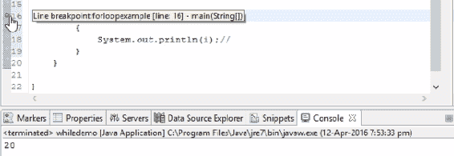

调试开始的行

当您看到蓝色图标时，通过单击昆虫状符号在调试模式下运行该图标。它将要求您以调试模式启动。只需单击“保存”即可：


编辑器顶部的调试图标

您将在此处看到所有变量值。我们将一步一步地进入循环，并执行程序的下一步：

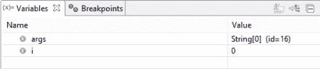

调试时的变量值

最后，当它达到值`4`并且再次增加`1`时，它是`5`。请注意，在值变为`5`后，它从循环中出来而不进入循环中。因此，这意味着条件不再满足，循环将运行五次。输出如以下屏幕截图所示：

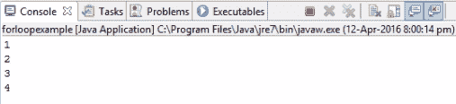

最终输出符合规范要求

这就是`for`循环的工作原理。

现在，如果我们将条件设置为以下值，它将不会进入`for`循环，即使是第一次，因为条件为`false`：

```java
for (int i=5;i<3;i++)
```

在调试模式下运行上述条件时，将跳过整个循环，并且在输出中看不到任何内容。

让我们看另一个例子：

```java
for (int i=0;i<10;i+2 )
```

输出将是：

```java
0
2
4
6
8
```

这就是`for`循环在内部的工作方式。

在下一节中，我们将学习`if...else`和`do...while`循环

# 如果……否则条件

在学习`while`和`do...while`循环之前，我们将在本节中讨论`if`条件。在 Java 程序中，当使用`if`条件语句时，`if`块中的语句仅在满足条件时执行。否则将运行来自`else`块的语句。此外，此执行仅发生一次。在`for`循环中，启动变量，循环运行直到满足条件。

然而，在`if`案例中，它不会继续循环。只要满足`if`条件，它就会进入循环；否则，它将进入`else`块。因此，控件将执行此`else`块中的语句，如以下屏幕截图所示：

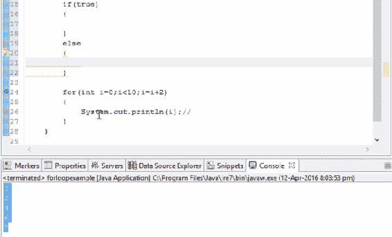

根据代码输出`if…else`条件

但所有这些都只发生一次，不像`for`循环，循环中的条件在返回并执行之前是满足的。

让我们看一下以下示例：

```java
    if(5>2)
    {
        System.out.println("success");
    }
    else
    {
        System.out.println("fail");
    }
```

以下屏幕截图显示了这些错误：

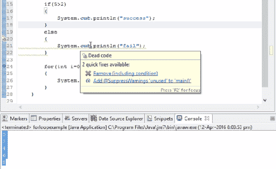

“快速修复”下拉列表中包含更正代码错误的建议

第一个错误是删除可忽略的包含条件。在运行前面的程序时，您将看到输出为`success`，因为进入的`5`大于`2`的条件为真：

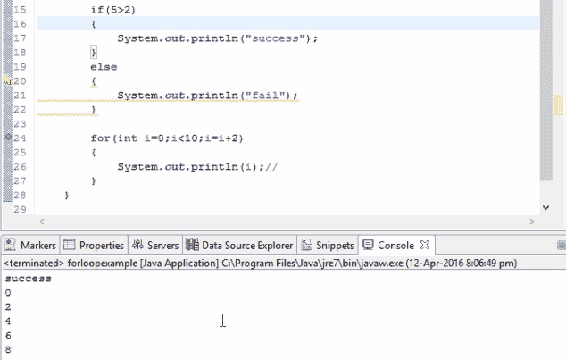

输出根据代码显示成功

如果我们改变条件并使`5`小于`2`，使条件为假，它将跳到`else`块并执行`else`中的语句。

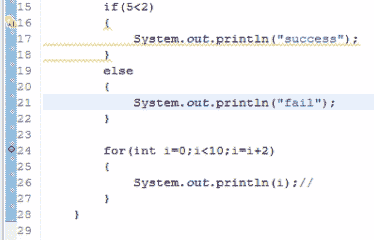

接收失败作为输出的代码

这次输出应为`fail`，如下图所示：

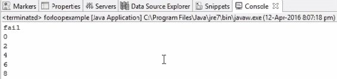

输出根据代码显示成功

这就是`if`条件的工作原理。

请注意，如果块中只有一行，则可以去掉这些大括号，因为它最终假定如果条件为`true`，将执行下一行。这意味着，如果块中只有一行，则可以去掉大括号。但是，如果您想要有多个语句，如果您的条件为`true`，那么请确保使用大括号来编写该语句，以避免冲突。如果不指定大括号，它仍将打印为`success`，如下图所示：

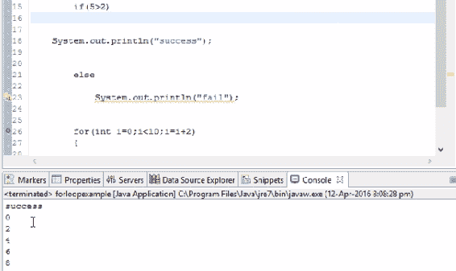

输出显示修改代码后的成功

此处，`5`大于`2`。运行此命令时，程序将在没有大括号的情况下运行

现在，再添加一条语句，比如说`"second step"`，它抛出一个错误，如下面的屏幕截图所示：

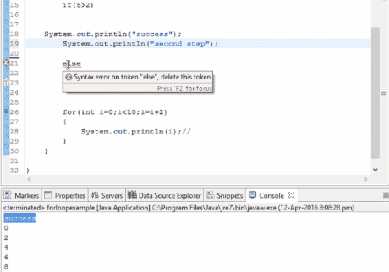

除了行号之外，错误还带有一个十字标记，显示语法错误

请注意前面屏幕截图中标记的语法错误。要么你应该保持一个支撑，要么你应该避免这一步。为了解决这个问题，我们只需将整个块放在大括号中。这样，错误就消失了。

# 在`for`循环中引入`if…else`条件

现在，让我们将`if...else`条件引入`for`循环。让我们在代码中添加以下内容：

```java
for (int i=0;i<10;i=i+2)
{
     if(i==8)
     system.out.println("print 8 is displayed");
     else 
        system.out.println("I did not find");
}
```

因为这里只有一条语句，所以我们不会把它写在大括号里。现在，让我们分析一下。数值将从零开始进入`for`循环，直到数值小于`10`。

进入`for`循环时，会检查第一个值`0`是否等于`8`。由于不相等，将显示`"I didnot find"`。现在，第二次将`2`添加到`0`（根据我们设定的条件）。请注意，这个新值仍然不等于`8`；因此，值`0`、`2`、`4`和`6`的输出将保持不变。接下来，当`8`进入`for`循环时，条件满足，`" 8 is displayed"`语句显示为输出：

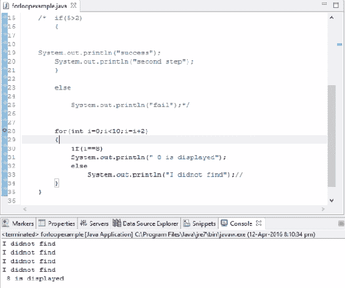

`" 8 is displayed"`和`"I did not find"`显示为输出

现在，如果我们说`i=9`，它将永远不会被打印，因为我们设置的条件是`i+2`，这将是一个递增的偶数。这意味着不满足条件，并且不执行`if`条件之后的下一步。因此，我们可以说，如果一个条件是真的，只有到那时它才会被执行；否则，将执行`else`块中的条件或语句。当你运行它时，你总是得到输出为`"I did not find"`

但是，如果我们编写以下语法，我们将得到输出为`"9 is displayed"`：

```java
for(int i=0;i<10;i=i+3)
```

这就是使用`for`循环时`if...else`条件的工作方式。在下一节中，我们将详细了解`for`循环

# `while`循环

在本节中，我们将详细学习`while`循环。首先，创建一个新类。现在让我们看看在编写代码时如何利用这个`while`循环。假设我们要按顺序打印从 1 到 10 的数字。我们如何使用`while`循环打印此内容？`while`循环的基本语法是：

```java
// While loop

while(boolean)
{

}
```

这里，如果布尔表达式返回`true`，那么控件才会进入该循环，而如果表达式返回`false`，那么控件不会进入该循环。这是`while`循环的基本简单概念。现在让我们假设我们想把数字从 1 带入 10。为此，我们将编写以下代码：

```java
//While loop 

//1 to 10

int i=0;
while(i<10)
{
      System.out.println(i);
}
```

如您所见，在前面的代码示例中，我们可以看到给定的条件为`true`。因此，它进入循环并打印`i`的值。此循环将继续执行，直到表达式的计算结果为`false`。根据我们的例子，条件总是正确的；因此，它将进入无限循环并打印零。

这就是`while`循环的工作原理。除非此参数中的条件变为`false`，否则此循环将永远不会停止执行。现在，如果我们在打印变量后增加值呢？让我们看看这样做会发生什么：

```java
//While loop 

//1 to 10

int i=0;
while(i<10)
{
      System.out.println(i);
      i++;
}
```

输出将如以下屏幕截图所示：


根据代码输出`while`条件

如果我们使用以下条件：

```java
while(i<=10)
```

新的产出将是：

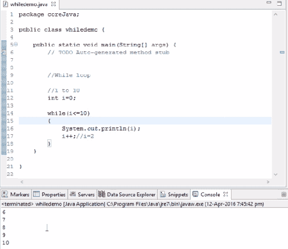

修改代码后`while`条件的输出

类似地，您可以按如下方式反转条件：

```java
//While loop 

//1 to 10

int i=10;
while(i>0)
{
      System.out.println(i);
      i++;//i=2
}
```

由于`10`大于`0`，所以数字持续增加，因此输出将变为无穷大。

如果我们使用递减条件，它将继续递减，直到条件变为假。之后，它将退出循环，如下面的代码示例所示：

```java
//While loop 

//1 to 10

int i=10;
while(i>0)
{
      System.out.println(i);
      i--;//i=2
}
```

上述代码示例的输出为：

```java
5
4
3
2
1
```

这就是我们如何在 Java 程序中使用`while`循环语法的方法。在下一节中，我们将看到如何处理`do...while`循环。

# `do…while`循环

`do...while`循环的语法是：

```java
do
{
}while();
```

让我们考虑下面的例子，在这里，我们希望从 20 到 30 打印数字：

```java
    int j=20;
do
{
    j++;
}while(j<30); // 1 loop of execution is guaranteed 
```

前面的代码将打印`20`、`21`、`22`直到`29`作为输出。因此，它首先执行，然后进行比较

`while`循环和`do...while`循环的基本区别在于`while`循环不会在不计算布尔表达式的情况下执行，`do...while`循环首先执行一个循环，然后计算运行更多的循环

让我们考虑下面的例子，其中变量的值大于

```java
int j=20;
do
{
    j++;
}while(j>30); // 1 loop of execution is guaranteed 
```

这里，输出将是`20`，而之后的脚本将被终止，因为正如本节前面提到的，在`do...while`循环中，保证执行一个循环。如果您在这个`while`循环中运行相同的逻辑，即使是第一次，它也不会运行。

因此，在下一节中，我们将尝试根据`for`循环、`while`循环、`do...while`循环和`if`条件做一个练习。这些程序将是理解循环的良好实践学习。

在下一节中，我们将学习嵌套循环是如何工作的。

# 嵌套循环连接

这是最重要的概念之一。所有编程逻辑都来自嵌套循环。如果您能够掌握它背后的概念，那么用 Java 解决编程示例将很容易。因此，首先，我将编写一种语法：

```java
for(int i=1;i<=4;i++)  // this block will loop for 4 times
{
}
```

前面的语法表示循环将运行四次。如果我们在前面的块中再写一个`for`循环会怎么样？在循环中实现循环的概念称为**嵌套循环**：

```java
     for(int i=1;i<=4;i++)  
     // (outer for loop) it will loop for 4 times
     {
         System.out.println("outer loop started");
         for(int j=1;j<=4;j++) //(inner for loop)
         {
             System.out.println("inner loop");
         }
         System.out.println("outer loop finished");
     }

```

因此，当我们完成之前的迭代一次时，一个循环系统就完成了。要完成一个外循环，我们必须完成所有四个内循环。这意味着我们必须运行这个内部循环 16 次（4x4 次）才能完成这个外部循环 4 次。

输出如以下屏幕截图所示：

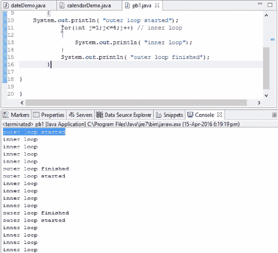

根据代码输出嵌套循环

进一步讲，`for`循环的概念将被更多地使用。为了理解`for`循环的概念，让我们试着解决几个例子。

# 例 1

为以下输出编写代码：

```java
1 2 3 4
5 6 7
8 9
10
```

正如我们在输出中所观察到的，每行中有一个数字在递减。我们将在这里介绍外环和内环的概念。代码如下：

```java
int k=1;
for(int i=0;i<4;i++)  
// (outer for loop) it will loop for 4 times
     {
         //System.out.println("outer loop started");
         for(int j=1;j<=4;j++) //(inner for loop)
         {
             System.out.print("k");
             System.out.print("\t");
         }
         System.out.println(" ");
    }
```

# 例 2

为以下输出编写代码：

```java
1
2 3
4 5 6 
7 8 9 10
```

如您所见，本示例中使用的输出与第一个示例中的输出相反：

```java
int k=1;
for(int i=1;i<5;i++)  
// (outer for loop) it will loop for 4 times
     {
         //System.out.println("outer loop started");
         for(int j=1;j<=i;j++) //(inner for loop)
         {
             System.out.print("k");
             System.out.print("\t");
             k++;
         }
        System.out.println(" ");
     }
```

# 例 3

以类似的方式，还有一个程序，称为排序数字

为以下输出编写代码：

```java
1
1 2 
1 2 3
1 2 3 4
```

前面输出的代码为：

```java
    for(int i=1;i<5;i++)  
    // (outer for loop) it will loop for 4 times
         {
              for(int j=1;j<=i;j++) //(inner for loop)
              {
                  System.out.print("j");
                  System.out.print("\t");
              }
              System.out.println(" ");
         }
```

# 总结

通过使用简单的示例，我们学习了如何在 Java 中使用`if...else`条件。我们还了解了如何使用`for`循环和`while`循环来获得所需的输出。更进一步，我们学习了如何使用嵌套的`for`循环来获得特定模式的输出

在下一章中，我们将介绍一些重要的概念，例如接口、它们如何工作以及它们在 Java 中的用法。我们还将使用一个实际示例讨论继承。