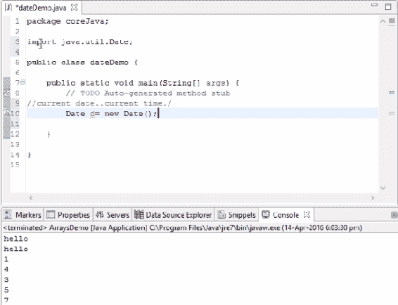
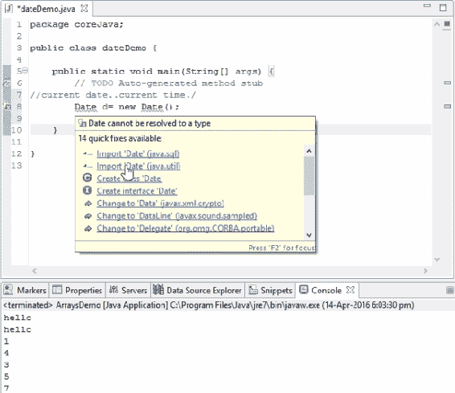
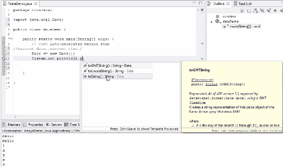
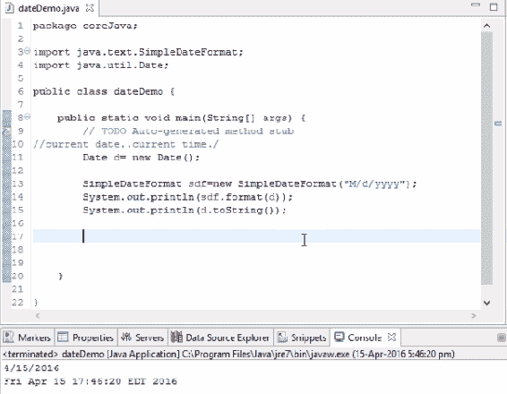
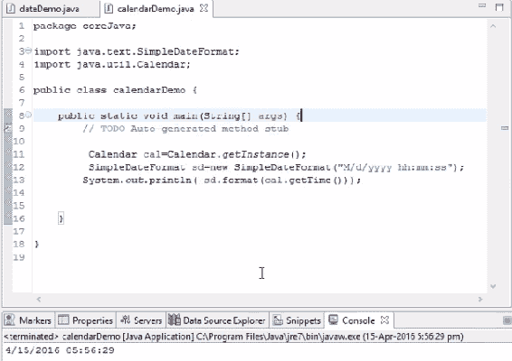
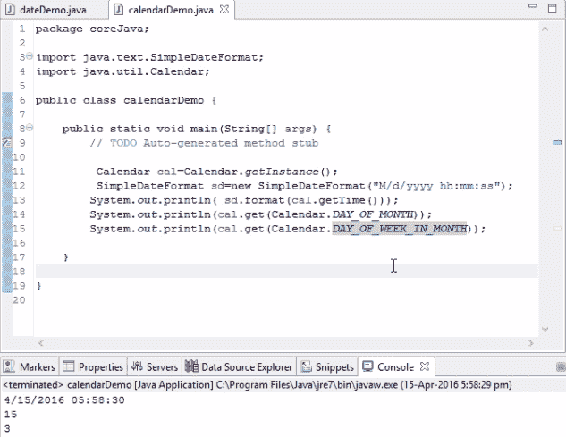
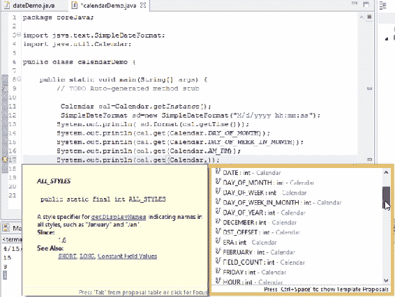
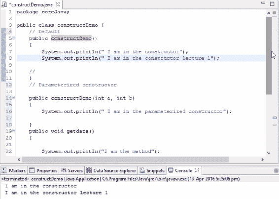
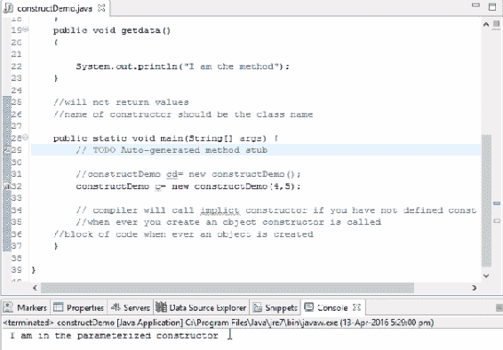

# 七、了解 Java11 中的日期类和构造函数

`Date`类和构造函数是 Java 的重要组成部分。在本章中，我们将通过一些示例详细讨论其中的每一个。

在本章中，我们将介绍：

*   日期类
*   日历类
*   建设者
*   参数化构造函数

# 日期类

为了理解`Date`类的概念，我们将从为`dateDemo`类创建源代码开始。假设我们要打印当前日期或时间。我们如何打印？

有时，我们会被要求在当前日期字段中输入日期，我们需要从 Java 获取它。在这种情况下，我们将使用`Date`类，它将以秒为单位给出当前日期和当前时间。因此，关于一天、一周、一个月、一年或一小时的每一个细节都可以从 Java 类中通读。Java 开发了一个名为`Date`的类，我们可以从中获得所有这些细节。以下屏幕截图显示了源代码：



显示日期类用法的源代码

基本上，我们需要使用该特定类中存在的方法。要使用该类中存在的方法，我们需要创建该特定类的对象。为此，让我们考虑以下代码语法：

```java
Date d= new Date();
```

这个`Date`类来自`util`包，`d`是`Date`类的对象，其中有日期和时间。在上一章中，我们看到 Java 有一些包，比如捕获所有基本 Java 内容的`java.lang`包，以及`java.util`，在这里我们有收集框架和`Date`类。

前面的代码语法表示我们不知道`Date`类在哪里。为了使这个类对我们的 Java 文件可用，我们需要导入`util`Java 包，因为这个`Date`类被打包到那个特定的包中。如果我们使用它将包导入到前面的类中，您可以成功地使用该日期。将鼠标移到此处，显示`import 'Date' (java.util)`，如下图所示：



“快速修复”下拉列表中包含更正代码错误的建议

单击该按钮后，您将看到：

```java
import java.util.Date
```

其中`util`是包，`Date`是类。

正如我们所看到的，`d`是包含日期和时间的对象，但是我们如何打印它呢？因为它是一种对象格式，我们不能简单地使用以下内容：

```java
System.out.println(d)
```

要将其转换为可读文本，请参阅以下屏幕截图：



将代码转换为可读文本格式

在这里，我们将`Date`转换成一个字符串，以便我们可以在输出中直观地看到它。如屏幕截图所示运行上述代码时，它将打印以下内容：

```java
Fri Apr 15 17:37:27 EDT 2016
```

这就是我们如何从当前系统的 Java 日期打印整个日期、时间和月份的方法。前面输出中的格式不是我们通常得到的格式，但可能是特定格式，例如：

```java
mm//dd//yyyy
```

如果我们想用前面的格式提取日期，我们该怎么做

`d`对象为我们提供了所有细节。但是我们如何将所有这些细节转换成前面的格式呢？为此，我们将使用以下方法：

```java
       Date d= new Date();

        SimpleDateFormat sdf=new SimpleDateFormat("M/d/yyyy");
        System.out.println(sdf.format(d));
        System.out.println(d.toString());
```

上述代码语法的输出将为：



根据代码显示日期和时间的输出

[`SimpleDateFormat`格式代码请参考以下 URL](http://www.tutorialspoint.com/java/java_date_time.htm)。

现在，在更改对象和`SimpleDateFormat`代码时，我们看到以下内容：

```java
 Date d= new Date();

        SimpleDateFormat sdf=new SimpleDateFormat("M/d/yyyy");
        SimpleDateFormat sdf=new SimpleDateFormat("M/d/yyyy hh:mm:ss");
        System.out.println(sdf.format(d));
        System.out.println(sd.toString());
        System.out.println(d.toString());
```

输出将是：


以新格式显示日期和时间的输出

因此，我们实际上可以根据我们的要求格式化日期，并将其传递到`SimpleDateFormat`方法中。我们可以将`d`对象放入参数中，以便以特定的方式对其进行格式化。这就是使用 Java 检索日期的方式

在下一节中，我们将看到如何使用`Calendar`类。

# 日历类

在上一节中，我们探讨了`Date`类，在那里我们学习了`Date`方法以及如何使用简单的日期格式标准对其进行操作。在本节中，我们将了解`Calendar`类，它与`Date`类类似，但有一些额外的特性。让我们看看它们是什么，以及如何使用它们来使用`Calendar`类提取日期格式。

首先，我们将创建一个具有不同名称的类以避免冲突。要创建`Calendar`实例，请运行以下操作：

```java
Calendar cal=Calendar.getInstance();
Date d=new Date();
```

步骤与`Date`类类似。然而，`Calendar`对象有一些`Date`不支持的独特特性。让我们来探索一下。

使用以下代码段：

```java
        Calendar cal=Calendar.getInstance();
        SimpleDateFormat sd=new SimpleDateFormat("M/d/yyyy hh:mm:ss");
        System.out.println(sd.format(cal.getTime()));
```

上述代码的输出将为：



使用`Calendar`类显示日期和时间的输出

现在，假设我们也要打印每月和每周的日期。我们将在前面的代码段中添加以下代码行：

```java
System.out.println(cal.get(Calendar.DAY_OF_MONTH));
System.out.println(cal.get(Calendar.DAY_OF_WEEK_IN_MONTH));
```

输出结果如下：



使用`Calendar`类输出显示月份中的日期、时间、月日和周日

类似地，我们可以从以下屏幕截图中看到，有多个属性可供选择：



显示日历类的多个属性的下拉列表

因此，这里我们使用了`Calendar`实例来实际获取系统日期和时间，但在前面的类中我们使用了`Date`实例；这是唯一的区别。在这个`Calendar`实例中有很多方法，在`Date`类中找不到

这就是根据我们的要求检索系统日期的方式。

# 建设者

构造函数是 Java 编程语言中最重要的概念之一。因此，在我们看到示例之前，让我们先了解构造函数是什么。

每当创建对象时，构造函数都会执行一段代码。这意味着，每当我们为类创建对象时，就会自动执行一段代码。换句话说，每当创建对象时都会调用构造函数。

那么在哪里使用构造函数，我们如何定义它呢？构造函数应该被编写，就像方法一样，但方法和构造函数之间的唯一区别是构造函数不会返回任何值，构造函数的名称应该始终是类名。

要为此类创建构造函数，我们将编写以下代码语法：

```java
public class constructDemo()
{
//
}
```

从前面的代码语法可以明显看出，无论是谁创建对象并调用构造函数，都将执行此构造函数中编写的任何内容。如果我们为前面的类创建一个名为`constructorDemo`的对象，则会自动执行此块中存在的一组行。这是构造器的主要目标：

```java
package coreJava;

public class constructDemo {
    public constructDemo()
    {
        System.out.println("I am in the constructor");
    }
    public-void getdata()
    {
        System.out.println("I am the method");
    }
    // will not return value
    //name of constructor should be the class name
    public static void main(String[] args)  {
        // TODO Auto-generated method stub
        constructDemo cd= new constructDemo(); 
```

每当执行前一行时，控件将自动检查是否存在显式定义的构造函数。如果已定义，它将执行特定块。无论何时创建对象，都会在 Java 中调用构造函数。

上述代码的输出将为：

```java
I am in the constructor
```

实际上，我们并不是为每个类创建构造函数，但我们现在特别引入了构造函数概念，因为在前面，我们在定义构造函数时没有使用任何概念。现在，如果我们使用这个命令，程序仍将运行，但这次它不会执行该块。如果我们没有定义任何构造函数，编译器将调用默认构造函数。我们可以称之为隐式构造函数。

我们主要依靠构造函数实时地初始化对象，或者为我们的程序定义变量。构造函数和普通方法在括号中定义访问修饰符时看起来很相似，但不接受任何返回类型，但在本例中接受。因此，如果我们写：

```java
public constructDemo()
{
    System.out.println("I am in the constructor");
    System.out.println("I am in the constructor lecture 1");

}
```

上述代码的输出将为：

```java
I am in the constructor
I am in the constructor lecture 1
```

因此，一般来说，人们使用前面的代码块来实时定义变量或初始化属性，然后继续使用构造函数。

在下一节中，我们将研究 Java 中的另一个构造函数。

# 参数化构造函数

我们在上一节中了解的构造函数是默认构造函数，因为它不接受任何值。在具有相同语法的参数化构造函数中，我们实际上会产生一些参数，如以下屏幕截图所示：



使用给定代码的参数化构造函数的输出

上一个构造函数和这个构造函数之间的唯一区别是，我们在这里传递参数，而在默认情况下，不传递任何参数。当我们运行代码时，无论何时创建对象，如果我们不传递任何参数，编译器都会自动选择默认构造函数，如以下屏幕截图所示：



传递默认参数时输出

现在，让我们为具有参数的同一类再创建一个对象：

```java
constructDemo c=new constructDemo(4,5);
```

当我们在前面的语法中定义参数时，编译器会在执行运行时检查是否存在具有两个整型参数的构造函数。如果找到构造函数，则执行以下代码语法：

```java
public constructDemo(int a, int b)
{
    System.out.println("I am in the parameterized constructor");
}
```

如果未定义参数，编译器将执行默认构造函数。上述代码的输出将为：

```java
 I am in the parameterized constructor
```

在运行时，当创建一个对象时，我们必须给出参数，因此在执行期间，它会将参数与定义的构造函数进行比较。类似地，我们可以为同一类创建多个对象：

```java
constructDemo cd=new constructDemo();
constructDemo c=new constructDemo(4,5);
```

当两个构造函数一起运行时，输出将为：

```java
I am in the constructor
I am in the constructor lecture 1
I am in the parameterized constructor
```

现在，我们将再创建一个类似类型的构造函数，但这次只使用一个参数：

```java
public constructDemo(String str)
{
    System.out.println(str);
}
public static void main(String[] args) 
{
    constructDemo cd=new constructDemo("hello");
}
```

输出将是：

```java
hello
```

因此，如果我们显式定义某些内容，Java 编译器会优先选择显式构造函数，否则它会打印隐式构造函数。这里需要注意的关键点是，它不会返回任何值，并且必须仅使用类名定义构造函数。

# 总结

在本章中，我们运行了一些代码示例，以了解`Date`类、`Calendar`类和构造函数是如何工作的

在本章中，我们将了解三个关键字：`super`、`this`并讨论`finally`块。