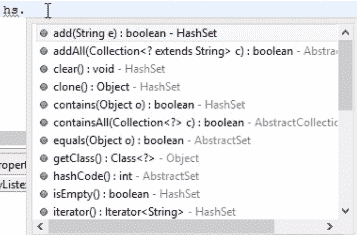

# 九、理解集合框架

在本章中，我们将深入研究集合框架，它由接口和类组成。我们来看看三大系列：`List`、`Set`和`Map`。本章将讨论`List`集合中的`ArrayList`、`Set`集合中的`HashSet`以及`Map`集合中的`HashMap`和`HashTable`。我们将通过查看示例来了解每个概念。

本章将介绍以下主题：

*   集合框架
*   列表集合
*   集合
*   地图收藏

# 集合框架

Java 集合框架基本上是接口和类的集合。为了高效地编程，或者利用 Java 方法的灵活性，Java 设计了一个由不同类和接口组成的框架。集合框架有助于高效地存储和处理数据。这个框架有几个有用的类，它们有很多有用的函数，这使得程序员的任务非常简单。

我们已经看到了很多关于数组和多维数组的概念。例如，在一个数组中，如果我们想从一组新的数组中删除一个索引，我们可以使用集合框架来完成。假设在一个数组中有 10 个值，我们想要删除第五个值，或者在第五个值和第六个值之间插入一个值。在集合框架中有一些灵活的方法。

本收集框架中可用的方法种类，以及如何有效地使用这些方法，将在后续章节中讨论。因此，为了给您一个想法，请记住集合是一组类和接口。

我们将看看这个框架提供的集合。

# 列表集合

第一个是`List`采集/接口。列表是一个有序的集合，有时我们也将其称为序列。列表可能包含重复的元素，就像数组一样，但是数组和`ArrayList`之间有很多不同。您可以在这个`List`容器中插入多个值，它也可能包含重复的元素。实际上，您可以添加任何值，也可以从任何索引中删除任何值。假设您按顺序向列表中添加了 15 个元素，现在您想要删除第六个元素，或者您想要在第十个和第十一个元素之间插入一个元素，或者您想要知道这 15 个元素中的一个元素在哪个索引处。有很多有用的 API 可以从列表容器中检索元素，而我们在数组中没有这些 API。数组只能初始化；除此之外，你不能在一个数组上执行任何方法，而使用`ArrayList`你可以使用很多灵活的方法。

`List`接口是一个集合，`ArrayList`、`LinkedList`、`vector`是实现该接口的三个类。此接口提供了一组方法。它公开了一些方法，而这三个类在它们的类中使用这些方法。

在这三个问题中，让我们讨论一下`ArrayList`。这是最著名的一个，大多数 Java 程序员都使用它。一旦你理解了`ArrayList`，你就可以很容易地理解`LinkedLists`和`vector`。在下一节中，我们将创建一个`ArrayList`类并实现`List`接口中的方法，以了解这些方法在检索或组织数据方面的灵活性。当容器中有一组数据时，您可以借助`List`界面轻松组织该数据。

# `ArrayList`类

让我们从实现`List`接口的`ArrayList`类开始。创建一个新类并将其命名为`arrayListexample`。我们先看一下`ArrayList`中的方法，然后讨论数组和`ArrayList`之间的区别。

我们首先声明`ArrayList`如下。如果您将鼠标悬停在 IDE 中的`ArrayList`上方，您将看到一条建议，告诉您为`ArrayList`导入`java.util`：

```java
package coreJava;

public class arrayListexample {

    public static void main(String[] args) {

        ArrayList a=new ArrayList();

    }
}
```

一旦你这样做了，它仍然会显示一个对`ArrayList`的建议，如果你将鼠标悬停在上面，它会建议添加参数类型。要删除此建议，可以将参数类型传递给`ArrayList`，例如`Integer`或`String`：

```java
        ArrayList<String> a=new ArrayList<String>();
        a.add("rahul");
        a.add("java");
```

传递参数类型后，您可以使用`a.`轻松添加一些字符串实例，它将显示`ArrayList`支持的不同类型的列表。对于`ArrayList`，我们没有定义特定的数组大小，而当您在数组中看到时，我们已经明确定义了一个大小。在数组中，一旦定义了大小，就不能减少或增加大小。但在`ArrayList`中，您可以随时从列表中添加或删除元素，这是一个动态大小数组。这是数组与`ArrayList`的基本区别之一。

如果我们想打印这个`ArrayList`，我们只需添加以下代码行即可：

```java
        System.out.println(a);
```

运行时打印`[rahul, java]`。但是如果你想在数组中打印，我们需要写一个`for`循环。我们添加了另一个对象，这一次我们指定了我们希望字符串指向的索引：

```java
        a.add("rahul");
        a.add("java");
        System.out.println(a);
        a.add(0, "student");
        System.out.println(a);
```

当我们打印此文件时，它会给出以下输出：

```java
[rahul, java]
[student, rahul, java]
```

您可以看到，在第二行中，`student`被添加到列表中的`rahul`之前，因为我们已经将其索引指定为`0`。

如果要从列表中删除条目，可以添加以下代码行：

```java
        a.remove(1);
        a.remove("java");
```

第一行代码将从第一个索引处的列表中删除条目，而第二行代码将在列表中找到字符串并将其删除。如果要获取特定索引的条目，可以使用`get`方法：

```java
       a.get(2);
```

前一行代码将打印`java`作为输出，因为它是索引`2`中的元素。

假设您有一个包含 50 个元素的列表，您需要确定该列表中是否存在特定的字符串/整数。如果要使用数组，则必须创建一个`for`循环，并确定元素是否存在，但在`ArrayList`中，我们有一个`contains`方法，可以检查整个列表，并以`true`或`false`的形式给出输出：

```java
        System.out.println(a.contains("java"));
```

这将输出为`true`，因为元素出现在我们的列表中；例如，如果您将其更改为`testing`，它将返回`false`值，因为它不在我们的列表中。

`ArrayList`中另一个有用的方法是`indexOf`方法。如果我们想从列表中找到某个元素的索引值，我们可以使用`indexOf`知道：

```java
        System.out.println(a.indexOf("rahul"))
```

这将返回此字符串的索引号。

现在，如果我们想检查数组是否为空，可以使用`ArrayList`中的`isEmpty`方法进行检查，返回值为`true`或`false`：

```java
        System.out.println(a.isEmpty());
```

这将返回值`false`，因为我们的列表不是空的。

`ArrayList`中最后也是最重要的方法是`size`方法，它返回列表的长度：

```java
        System.out.println(a.size());
```

关于`ArrayList`您还需要知道的一点是，实现`List`接口的所有类都可以接受重复的值。我们知道集合接口中扩展了`List`的类：`ArrayList`、`LinkedList`和`vector`。所有这些类都可以接受重复的值。

# `ArrayList`示例

假设我们有一个具有重复数字的数组，例如`{4, 5, 5, 5, 4, 6, 6, 9, 4}`，我们想从中打印出唯一的数字，以及这个数字在这个数组中重复了多少次。我们的输出应该是“四重复三次，五重复三次，六重复两次，九重复一次。”

让我们在这里引入`ArrayList`概念来解决这个难题：

```java
package demopack;
import java.util.ArrayList;
public class collectiondemo {
    public static void main(String[] args) { 
        int a[] ={ 4,5,5,5,4,6,6,9,4}; 
        ArrayList<Integer>ab =new ArrayList<Integer>(); 
        for(int i=0;i<a.length;i++) 
        { 
            int k=0; 
            if(!ab.contains(a[i])) 
            { 
                ab.add(a[i]); 
                k++; 
                for(int j=i+1;j<a.length;j++) 
                { 
                    if(a[i]==a[j]) 
                    { 
                       k++; 
                    } 
                } 
                System.out.println(a[i]); 
                System.out.println(k); 
                if(k==1) 
                    System.out.println(a[i]+"is unique number"); 
            } 
        } 
    }
}
```

前面的代码片段是解决此难题所需的全部代码。让我们试着理解代码中的关键逻辑概念。我们首先定义数组，然后创建一个空的具有`ab`对象类型的`ArrayList`。然后我们创建一个`for`循环，在其中我们使用一个`if`循环和`!ab.contains`来检查元素是否存在于循环中。在这个`if`循环中，我们需要另一个`for`循环来迭代数组的其余部分。此`for`循环中的`if`循环将用作计数器，用于增加数组中某个数字的重复次数。

我们已经完成了`for`和`if`循环。我们打印出数组中的每个元素以及每个元素在数组中存在的实例数。要打印唯一的数字，即数组中不重复的数字，我们使用`if`循环并打印它

这个例子就是这样；您可以尝试使用自己的逻辑编写此示例。

# 集合

Java 中另一个重要的集合是`Set`集合/接口。`HashSet`、`TreeSet`和`LinkedHashSet`是实现`Set`接口的三个类。`Set`和`List`之间的主要区别在于`Set`不接受重复值。`Set`和`List`接口之间的另一个区别是，不能保证元素按顺序存储。

本节主要讨论`HashSet`。我们将以一节课为例，试图理解这个概念。为本节创建一个类并命名为`hashSetexample`，在类内创建一个要使用`HashSet`的对象；建议您添加参数类型，在本例中为`String`：

```java
package coreJava;

import java.util.HashSet;

public class hashSetexample {

    public static void main(String[] args) {

       HashSet<String> hs= new HashSet<String>();

    }
}
```

在您的 IDE 中键入`hs.`时，会显示`HashSet`提供的所有方法：



首先添加几个重复条目的字符串实例：

```java
        HashSet<String hs= new HashSet<String>();
        hs.add("USA");
        hs.add("UK");
        hs.add("INDIA");
        hs.add("INDIA");
        System.out.println(hs);
```

打印时，输出如下所示：

```java
[USA, UK, INDIA]
```

我们看到`INDIA`的重复条目被`HashSet`拒绝，我们只看到一个实例。

如果我们想要移除任何对象，我们可以使用`remove`方法来移除，并使用`size`方法来获取列表的大小：

```java
        System.out.println(hs.remove("UK"));
        System.out.println(hs.isEmpty());
        System.out.println(hs.size());
```

`isEmpty`方法告诉我们列表是否为空，如果为空，则返回`true`，否则返回`false`。

# 使用迭代器

为了遍历列表中的每个元素，我们使用`iterator`方法。我们需要为这个`Iterator`类创建另一个对象，以及`String`参数类型：

```java
        Iterator<String> i=hs.iterator();
```

假设我们有一组元素，它们从零、一、二开始依次排列。`iterator`从零开始遍历每个元素，并以每个值打印当前元素。我们已经为迭代器创建了一个对象，并按如下方式打印值：

```java
        System.out.println(i.next());
        System.out.println(i.next());
```

`i.next()`的第一个实例将打印零索引处的值，下一个`i.next()`实例将打印索引 1 处的值。如果我们有一个大约有 100 个值的集合，我们将不得不使用`while`循环：

```java
        while(i.hasNext())
        {
            System.out.println(i.next());
        }
```

在这里，我们使用了`hasNext`方法，它检查集合中的下一个值。如果下一个索引中存在值，则返回`true`，否则返回`false`。在我们的例子中，它将返回 100 个值的`true`，然后返回`false`，并退出`while`循环。

这就是如何使用`iterator`遍历`Set`接口中的对象。如果您正在进行自动化测试，例如 Selenium，您将经常使用这个`while`循环。

# 地图收藏

我们还有一个收藏，叫做`Map`。我们将举一个例子，在继续代码时讨论`Map`。此接口采用键和值对形式的值

我们创建一个类`hashMapexample`，并在其中定义`HashMap`。`HashMap`需要两种类型的参数，如`Integer`和`String`：

```java
package coreJava;

import java.util.HashMap;

public class hashMapexample {

    public static void main(String[] args) {

       HashMap<Integer, String> hm= new HashSet<Integer, String>();

    }
}
```

这里，`Integer`是键，`String`是值。现在，如果您在 IDE 中键入`hm.`，您将在`HashMap`中看到一些方法；让我们使用`put`方法：

```java
        hm.put(0, "hello");
        hm.put(1, "goodbye");
        hm.put(2, "morning");
        hm.put(3, "evening");
```

`put`方法以键和值的形式进行输入。此外，键的值必须是整数，也可以是字符串。关键点就是我们为值定义的东西。我们可以使用`remove`方法删除一个值：

```java
        hm.remove(2);
```

`HashMap`中的`entrySet`方法以集合索引的形式存储每个键和值：

```java
        Set sn= hm.entrySet();
```

我们现在已经把这个`HashMap`转换成了一套。要遍历此集合的每个索引，我们使用`iterator`，并且与上一节一样，我们使用`while`循环：

```java
        Iterator it= sn.iterator();

        while(it.hasNext())
        {
            Map.Entry mp=(Map.Entry)it.next();
            System.out.println(mp.getKey());
            System.out.println(mp.getValues());
        }
```

我们需要在这里使用`Map.Entry`，因为每个索引中的元素由一个键和一个值组成，`Map.Entry`帮助我们区分键和值。打印此`while`循环时，应得到以下输出：

```java
0
hello
1
goodbye
2
morning
3
evening
```

如果不使用`Map.Entry`，它将抛出一个错误。这就是`HashMap`的工作原理。

# 散列表

还有一个集合名为`HashTable`，但它与`HashMap`位于同一条线上。你只需要将`HashMap`改为`HashTable`-就这样。`HashMap`和`HashTable`之间有一点区别

`HashMap`与`HashTable`的区别如下：

*   同步还是线程安全
*   空键和空值
*   迭代值

# 同步还是线程安全

这是两者之间最重要的区别。`HashMap`是非同步的，并且不是线程安全的。那么什么是非同步？意味着如果多个程序同时访问`HashMap`，它会不断更新。现在假设有五个线程在`HashMap`上工作。这意味着五个不同的程序或线程可以同时访问`HashMap`，这意味着没有同步。但在`HashTable`中，如果一个程序正在访问`HashTable`，则另一个程序需要等待，直到第一个程序释放`HashTable`资源。这是主要的区别。另一方面，`HashTable`是线程安全的和同步的。您应该何时使用`HashMap`？如果您的应用程序不需要多线程任务，换句话说，`HashMap`更适合于非线程应用程序。`HashTable`应用于多线程应用程序。

# 空键和空值

`HashMap`允许一个空键和任意数量的空值，`HashTable`不允许`HashTable`对象中的空键和空值。假设您正在将员工记录输入数据库，并且在将员工详细信息上载到数据库时，您可能觉得您不知道他们的电话号码，但您在键值中输入了名为电话号码的字段，此时索引值将保留为`null`；您可以稍后更新它。这在`HashMap`中起作用，但当您使用`HashTable`时，它将不允许任何空键和空值。如果您觉得您的程序非常安全，并且希望阻止多个线程同时访问它，那么您应该使用`HashTable`。`HashTable`是线程安全的，在一个程序完成对`HashTable`的操作之前，它不会将其对象释放给另一个程序。

# 迭代值

`HashMap`使用`iterator`迭代对象值。`HashTable`是除`Vector`之外唯一一个使用枚举器迭代`HashTable`对象值的类。

在`HashMap`和`HashTable`之间的操作是相同的，除了我们刚才描述的三个差异。

# 总结

在本章中，我们了解了集合框架和三种集合类型：`List`、`Set`和`Map`。我们在`List`集合中探索了`ArrayList`，还探索了`ArrayList`的一个例子。`Set`集合与`ArrayList`不同-主要区别在于`Set`不接受重复值。在上一个集合，即`Map`集合中，我们看到了两种类型，`HashMap`和`HashTable`，以及两者之间的差异。