# 第 2 章：提高生产率和更快应用的工具

自从编程作为一种职业出现以来，每一个有抱负的程序员的长期目标都是快速生成能够以闪电般的速度执行指定任务的应用程序。否则，何必麻烦呢？我们可以慢慢地做我们几千年来一直在做的事情。在上个世纪的书中，我们在这两个方面都取得了实质性的进展，现在，Java9 在这两个方向上又迈出了一步。

Java 9 中引入了两个新工具，JShell 和提前编译（**AOT**）的编译器——这两个工具都被期待了很长一段时间。JShell 是一个**读取–评估–打印循环**（**REPL**）工具，对于那些使用 Scala、Ruby 或 Python 编程的人来说，它是众所周知的。它接受用户输入，对其求值，并立即返回结果。AOT 编译器接受 Java 字节码并生成本机（依赖于系统）机器代码，以便生成的二进制文件可以本机执行。**

 **这些工具将是本课程的重点。

# JShell 工具的使用

JShell 帮助程序员在编写代码片段时测试它们。它避免了开发周期中的构建-部署测试部分，从而缩短了开发时间。程序员可以轻松地将一个表达式甚至几个方法复制到 JShell 会话中，并立即多次运行 test-modify。这样的快速转换还有助于在使用库 API 之前更好地理解库 API，并优化代码以准确表达其目的，从而促进更高质量的软件。

我们多久会猜到特定 API 的 JavaDoc 意味着什么，并浪费构建部署测试周期来弄清楚它？或者我们想回忆一下，`substring(3)`将如何分割字符串？有时，我们创建一个小型测试应用程序，在其中运行我们不确定的代码，再次使用相同的构建-部署测试周期。使用 JShell，我们可以复制、粘贴和运行。在本节中，我们将描述并演示如何执行此操作。

JShell 构建在 JVM 之上，因此它与 JVM 完全一样处理代码片段。只有少数对 REPL 没有意义的构造被省略。例如，您不能在 JShell 中使用`package`声明、`static`或`final`（这些关键字将被忽略）。此外，分号`;`在语句末尾是允许的，但不是必需的。

JShell 附带了模块`jdk.jshell`中包含的 API，该模块可用于将 JShell 集成到其他工具（例如 IDE）中，但它不在本书的范围之内。

## 创建 JShell 会话并设置上下文

JDK 安装附带了 JShell。您可以在`bin`目录中以`$JAVA_HOME/bin/jshell`的形式找到它。执行它以启动 JShell 会话。在您熟悉 JShell 之前，我们建议使用选项`-v`开始会话，该选项表示**详细**。通过这种方式，shell 将为您的每个操作添加更多细节，并解释每个操作都完成了什么。在终端窗口中启动`jshell`后，您将看到以下输出：

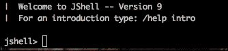

这意味着将创建一个 JShell 会话，并可用于运行 Java 代码。输入推荐的命令`/help intro`并阅读以下 JShell 介绍：

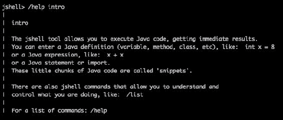

导言告诉我们，为了开始，我们需要知道的最低限度。那么，让我们按照指南来做。如果我们输入`/help`，我们将获得可能的 JShell 命令列表，其中包含一个简短的描述（我们将在后面详细介绍每个命令）和以下信息：

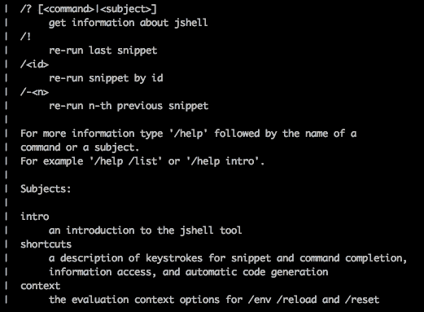

这些都是需要记住的重要提示。请注意，`/?`和`/help`命令产生相同的结果，因此从现在开始，我们将只使用`/?`。命令`/i`、`/<id>`（id 自动分配给每个代码段，并在由命令`/list`列出时显示在代码段左侧）和`/-<n>`允许重新运行以前运行过的代码段。

主题`intro`我们已经看到了。通过输入命令`/? shortcuts`可以查看主题`shortcuts`：

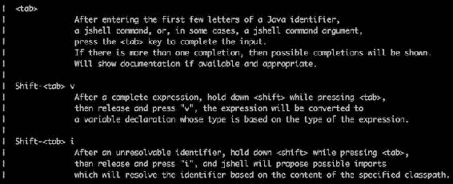

如您所见，`TAB`键可用于完成当前条目，而双`TAB`则显示可能的完成选项或 JavaDoc（如果可用）。每次命令后，请毫不犹豫地按几下`TAB`键。它将帮助您找到更多利用 JShell 特性的方法。

按`Shift + Tab`，然后按`V`根据刚刚完成的表达式创建变量。以下是一个例子：

*   在控制台上键入`2*2`并按`Enter`。
*   同时按下`Shift + Tab`。
*   松开按键并按`V`。
*   外壳将显示`int x = 2*2`并将光标定位在`=`的正前方。
*   输入变量（`x`为例，按`Enter`。结果屏幕将显示以下输出：

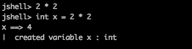

在未解析标识符请求 JShell 根据类路径的内容提供可能的导入后，按`Shift + Tab`，然后按`I`。以下是一个例子：

*   键入`new Pair`并按`Enter`。
*   同时按下`Shift + Tab`。
*   松开按键并按`I`。 Shell 将显示以下输出：

    

*   您将得到两个选项，其值分别为`0`和`1`。
*   在 shell 中，您将得到一个名为`Choice`的语句；键入`1`并按`Enter`。
*   现在，`javafx.util.Pair`类被导入。
*   您可以继续输入代码段。

JShell 之所以能够提供建议，是因为包含编译的`Pair`类的 JAR 文件位于类路径上（默认情况下设置为 JDK 库的一部分）。您还可以向类路径添加任何其他 JAR 文件，其中包含编码所需的编译类。您可以在 JShell 启动时通过选项`--class-path`进行设置（也可以与一个破折号`-class-path`一起使用）：


在前面的示例中，JAR 文件`myclasses.jar`是从用户主目录中的文件夹`mylibrary`加载的。要设置多个 JAR 文件，您可以用冒号`:`（对于 Linux 和 MacOS）或分号`;`（对于 Windows）将它们分开。

类路径也可以在 JShell 会话期间的任何时候通过命令`/env`进行设置：


请注意，每次设置类路径时，当前会话的所有片段都会用新的类路径重新加载。

也可以使用命令`/reset`和`/reload`来代替`/env`命令来设置类路径。我们将在下一节中描述这些命令之间的区别。

如果您不想在 JAR 文件中收集编译过的类，那么选项`--class-path`（或`-class-path`可以指向编译过的类所在的目录。一旦设置了类路径，就可以在编写代码段时使用键`Shift + Tab`和`I`导入与其关联的类，如前所述。

其他上下文选项与模块的使用有关，在输入命令`/? context`后可以看到：

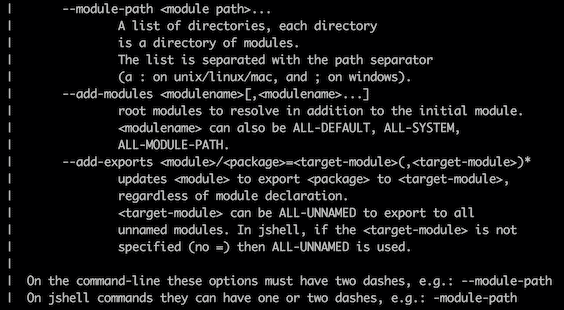

运行`jshell`工具有几个更高级的选项。要了解它们，请参阅 [Oracle 文档](https://docs.oracle.com/javase/9/tools/jshell.htm)。

在本节中我们要提到的最后一个重要命令是`/exit`。它允许退出命令模式并关闭 JShell 会话。

## JShell 命令

如前一节所述，通过键入`/?`命令可以获得 JShell 命令的完整列表。每个命令都有一行描述。还有另一种方法可以获得相同的列表，但没有说明，那就是键入`/`，然后键入`TAB`。屏幕将显示以下内容：

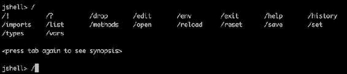

第二次按*键*将显示相同的命令列表，每个命令都有一个摘要（一行描述）。为了使用户更方便，在键入时，可以缩写命令、子命令、命令参数或命令选项，只要它保持唯一性，以便工具可以明确地识别它。例如，您可以使用其缩写版本的对应列表来代替前面的全名命令列表：`/!`、`/?`、`/d`、`/ed`、`/en`、`/ex`、`/he`、`/hi`、`/i`、`/l`、`/m`、`/o`、`/rel`、`/res`、`/sa`、`/se`、`/t`、`/v`.前面的破折号`/`用于区分命令和代码段。

现在，让我们回顾一下这些命令。在执行此操作时，我们将创建一些代码段、变量和类型，以便使用特定示例更清楚地演示每个命令。

您可以通过运行`jshell`（带有选项`-v`来启动新的 JShell 会话，并输入以下命令：

*   `/en`：查看或更改评估上下文
*   `/h`：查看您键入内容的历史记录
*   `/l [<name or id>|-all|-start]`：列出您键入的来源
*   `/m [<name or id>|-all|-start]L`：列出声明的方法及其签名
*   `/t [<name or id>|-all|-start]`：列出声明的类型
*   `/v [<name or id>|-all|-start]`：列出声明的变量及其值

结果如下：

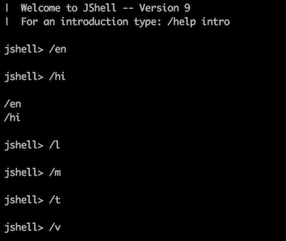

正如您可能期望的那样，这些命令中的大多数都没有产生任何结果（除了在那一刻之前键入的简短历史记录），因为我们还没有输入任何代码片段。最后四个命令具有相同的选项：

*   `<name or id>`：这是特定片段、方法、类型或变量的名称或 ID（我们将在后面看到示例）
*   `-start`：这显示了在 JShell 开始时加载的代码片段、方法、类型或变量（我们将在后面看到如何操作）
*   `-all`：这显示了在 JShell 开始时加载的片段、方法、类型或变量，以及随后在会话期间输入的内容

默认情况下，在启动时，会导入几个常用包。您可以通过键入`/l -start`或`/l -all`命令来查看它们：

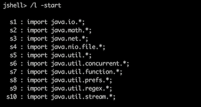

此列表中没有`java.lang`包，但默认情况下总是导入，不在导入中列出。

在前面提到的列表的左列中，您可以看到每个代码段的 ID。例如，如果您键入`/l s5`命令，它将检索 ID 为`s5`的代码段：

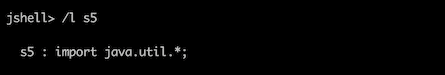

要自定义启动条目，您可以使用命令`/sa <file>`将您在当前会话中输入的所有设置和代码段保存到指定文件中。下次要继续使用相同的上下文时，可以使用此文件`jshell <file>`启动 JShell 会话。

让我们用一个例子来演示这个过程：

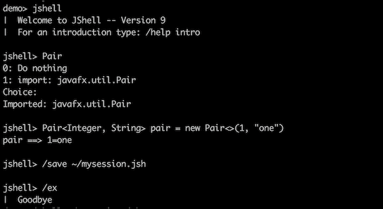

在上一个截图中，您可以看到我们已经启动了一个 JShell 会话，输入了类的名称`Pair`（尚未导入），然后按下`Shift + Tab`和`I`并选择了选项`1`（导入类`Pair`。之后，我们完成了输入代码片段（创建了一个变量`pair`，将会话条目保存在文件`mysession.jsh`（在主目录中）中，并关闭了会话。现在我们来看一下`mysession.jsh`文件：

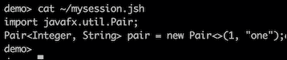

如您所见，该文件仅包含保存的会话中的新条目。如果我们想将它们加载到下一个会话中，我们将使用命令`jshell ~/mysession.jsh`并在相同的上下文中继续工作：

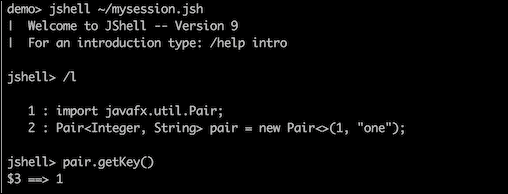

在上一个屏幕截图中，我们启动了一个新会话，列出了所有新条目（从上一个会话重新加载），并从对象`pair`中获得了一个密钥。这已经自动创建了变量`$3`。

我们还可以显式地创建一个变量。键入`pair.getValue()`并按`Shift + Tab`，然后按`V`，这将提示您在符号`String = pair.getValue()`前面输入变量名称。输入`value`并查看结果：

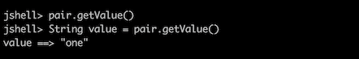

要查看当前会话的所有变量，请键入命令`/v`：

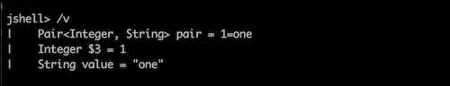

现在让我们创建一个方法`to2()`，将任意整数乘以 2：

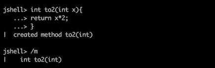

为了完成命令`/l`、`/m`、`/t`和`/v`的演示，让我们创建一个新类型：

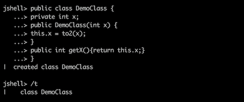

请注意，方法`to2()`在新类中可见，这意味着类中的所有独立变量、独立方法和代码都在同一上下文中执行。通过这种方式，代码片段的测试变得更容易，但如果代码的作者依赖于封装和行为隔离，而不仅仅是简单的代码片段，那么代码片段的测试可能会引入细微的错误，甚至是意外的行为。

现在，通过使用`/l`命令，我们可以看到我们键入的所有内容：

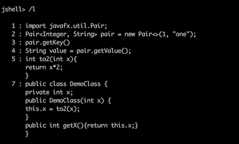

所有这些代码段都可以执行。下面是使用它们的一个示例：

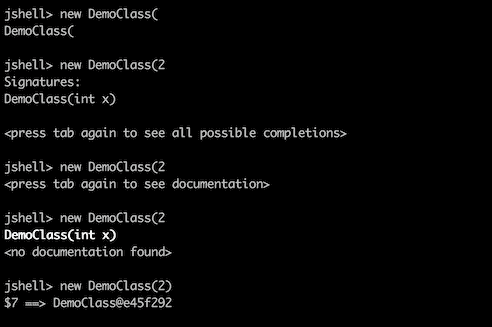

在上一个屏幕截图中，我们键入了`new Demo`并按下了`TAB`。然后，我们进入`2`并再次按下`TAB`。我们看到了关于按`TAB`查看文档的建议，并照做了。嗯，没有找到任何文档（我们在创建类`DemoClass`时没有键入任何 JavaDoc），所以我们只添加了`)`并按下`Enter`。因此，创建了一个新变量`$7`，该变量包含对类`DemoClass`对象的引用。我们现在可以这样使用这个变量，例如：

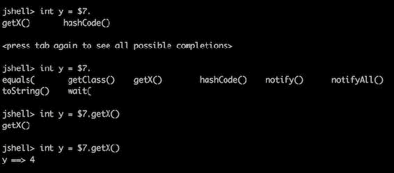

在上一个屏幕截图中，我们输入`int y = $7.`并按下`TAB`，然后第二次按下`TAB`查看其他选项。我们这样做只是为了演示。然后，我们在`.`之后键入`getX`并按`Tab`进行选择。JShell 为我们用`()`完成了语句，我们按下`Enter`，从而创建了一个新变量`y`（当前评估值为`4`。

最后，让我们尝试并测试函数`substring()`，以确保它返回我们需要的子字符串：

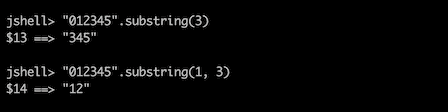

我们希望您现在能够了解如何创建和执行代码片段。

让我们回顾一下其他 JShell 命令。命令`/i`列出导入的包和类。在本例中，如果使用此命令，将获得以下输出：

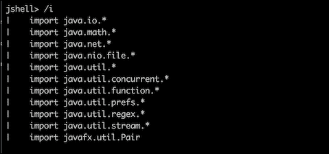

您可以看到，`Pair`类被列为导入类，尽管我们已经在上一个 JShell 会话中完成了它，并通过使用文件`~/mysession.jsh`将它引入了新会话。

命令`/ed <name or id>`允许您编辑命令`/l`列出的任何条目。让我们开始吧：

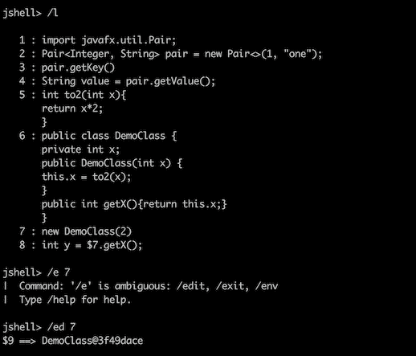

在上一个屏幕截图中，我们列出了所有片段，并输入了`/e 7`来编辑 ID 为`7`的片段。原来有几个以`e`开头的命令，所以我们添加了`d`并得到了以下编辑器窗口：

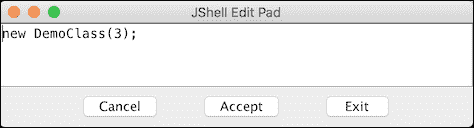

在上一个窗口中，我们将`2`更改为`3`，并点击**接受**按钮。因此，创建了一个新变量`$9`，用于保存对新`DemoClass`对象的引用。我们现在也可以使用这个新变量：

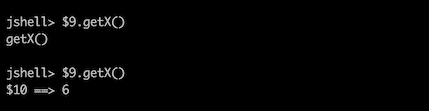

在上一个截图中，我们输入了`$9.getX`并按下了`TAB`。JShell 通过添加`()`完成了该声明。我们按下`Enter`键，创建新变量`$10`（当前评估值为`6`）。

命令`/d <name or id>`会删除一个由名称或 ID 引用的代码段。让我们使用它删除一个 ID 为`7`的代码段：

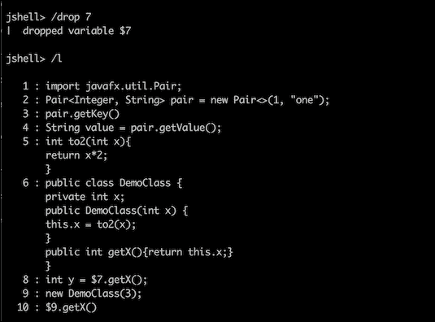

正如您所猜测的，现在无法计算为变量`8`赋值的表达式：

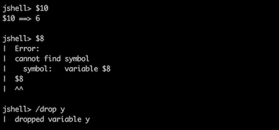

在前面的屏幕截图中，我们首先请求计算为变量`10`生成值的表达式（出于演示目的），并将其正确计算为`6`。然后，我们尝试对变量`8`执行同样的操作，并收到一个错误，因为删除变量`7`后其表达式被破坏。因此，我们现在也删除了它（这次是按名称，以演示如何使用名称）。

命令`/sa [-all|-history|-start] <file>`将片段保存到文件中。它由命令`/o <file>`补充，该命令打开文件作为源输入。

命令`/en`、`/res`和`/rel`具有重叠功能：

*   `/en [options]`：允许查看或更改评估上下文
*   `/res [options]`：这将丢弃所有输入的代码段并重新启动会话
*   `/rel[options]`：这将以与命令`/en`相同的方式重新加载会话

请参阅 [Oracle 官方文档](http://docs.oracle.com/javase/9/tools/jshell.htm)了解更多详细信息和可能的选项。

命令`[/se [setting]`设置配置信息，包括外部编辑器、启动设置和反馈模式。此命令还用于创建具有自定义提示、格式和截断值的自定义反馈模式。如果未输入任何设置，则显示编辑器的当前设置、启动设置和反馈模式。前面提到的文档详细描述了所有可能的设置。

当集成到 IDE 中时，JShell 将更加有用，这样程序员可以动态地计算表达式，或者更好的是，可以像今天的编译器计算语法一样自动计算表达式。

# 提前（AOT）

Java 的最大特点是在任何地方运行一次编写。它是通过为几乎所有平台创建一个**Java 运行时环境**（**JRE**）实现的，因此 Java 编译器（`javac`工具）从源代码生成的字节码可以在安装 JRE 的任何地方执行，只要编译器的版本为`javac`与 JRE 的版本兼容。

JRE 的第一次发布主要是字节码的解释，并比其他语言和编译器（例如 C 和 C++）产生了更慢的性能。然而，随着时间的推移，JRE 基本上得到了改善，现在产生了相当不错的结果，与许多其他流行的系统相当。在很大程度上，这是由于 JIT 动态编译器将最常用方法的字节码转换为本机代码。一旦生成，编译后的方法（特定于平台的机器代码）将根据需要执行，而不进行任何解释，从而减少执行时间。

为了利用这种方法，JRE 需要一些时间来确定应用程序中最常用的方法。在编程领域工作的人们称之为热方法。这段发现时间，直到达到性能峰值，通常称为 JVM 的预热时间。对于更大、更复杂的 Java 应用程序，它更大，而对于较小的应用程序，它只需要几秒钟。但是，即使在性能达到峰值之后，由于特定的输入，应用程序也可能开始使用以前从未使用过的执行路径，并调用尚未编译的方法，从而突然降低性能。当尚未编译的代码属于在某些罕见的关键情况下调用的复杂过程时，尤其是在需要最佳性能的情况下，这一点尤为重要。

自然的解决方案是允许程序员决定应用程序的哪些组件必须预编译为本机代码——那些更常用的组件（从而减少应用程序的预热时间），以及那些不常用但必须尽快执行的组件（支持关键情况和总体性能稳定）。这就是**Java 增强提案 JEP 295：提前编译**的动机：

JIT 编译器速度很快，但 Java 程序可能会变得太大，以至于 JIT 需要很长时间才能完全预热。不经常使用的 Java 方法可能永远不会被编译，因为重复解释调用可能会导致性能下降。

值得注意的是，在 JIT 编译器中，可以通过设置编译阈值来减少预热时间——方法在编译成本机代码之前必须调用多少次。默认情况下，数字为 1500。因此，如果我们将其设置为小于该值，则预热时间将更短。可以使用选项`-XX:CompileThreshold`和`java`工具来完成。例如，我们可以将阈值设置为 500，如下所示（其中，`Test`是已编译的 Java 类，其中包含`main()`方法）：

```java
java -XX:CompileThreshold=500 -XX:-TieredCompilation Test
```

添加选项`-XX:-TieredCompilation`是为了禁用分层编译，因为它在默认情况下处于启用状态，并且不符合编译阈值。可能的缺点是 500 阈值可能太低，将编译太多的方法，从而降低性能并增加预热时间。此选项的最佳值因应用程序而异，甚至可能取决于同一应用程序的特定数据输入。

## 静态编译与动态编译

许多高级编程语言如 C 或 C++从一开始就使用 AOT 编译。它们也被称为**静态编译**语言。由于 AOT（或静态）编译器不受性能要求的约束（至少没有运行时的解释器（也称为**动态编译器**）那么多），因此它们可以花时间进行复杂的代码优化。另一方面，静态编译器没有运行时（评测）数据，这在动态类型语言的情况下尤其有限，Java 就是其中之一。由于 Java 中的动态类型功能（向下转换到子类型、查询对象的类型以及其他类型操作）是面向对象编程（多态原理）的支柱之一，因此 Java 的 AOT 编译变得更加有限。Lambda 表达式暂停了静态编译的另一个挑战，目前还不受支持。**

动态编译器的另一个优点是，它可以做出假设并相应地优化代码。如果假设被证明是错误的，编译器可以尝试另一个假设，直到达到性能目标。这样的过程可能会减慢应用程序的速度和/或增加预热时间，但从长远来看，它可能会带来更好的性能。概要文件引导的优化也可以帮助静态编译器沿着这条路径前进，但与动态编译器相比，静态编译器的优化机会总是有限的。

也就是说，JDK 9 中当前的 AOT 实现是实验性的，并且到目前为止仅限于基于 64 位 Linux 的系统，具有并行或 G1 垃圾收集，并且唯一受支持的模块是`java.base`。此外，AOT 编译应该在相同的系统上执行，或者在具有相同配置的系统上执行，生成的机器代码将在该系统上执行。然而，尽管如此，JEP 295 声明：

性能测试表明，一些应用程序受益于 AOT 编译的代码，而其他应用程序则清楚地显示了回归。

值得注意的是，**Java 微型版**（**ME**）中长期支持 AOT 编译，但**Java 标准版**（**SE**）中更多的 AOT 用例尚未确定，这也是 JDK 9 发布实验性 AOT 实现的原因之一——为了方便社区尝试和讲述实际需求。

## AOT 命令和程序

JDK 9 中的底层 AOT 编译基于 Oracle 项目`Graal`——JDK 8 引入的一种开源编译器，其目标是提高 Java 动态编译器的性能。AOT 小组不得不修改它，主要围绕常量处理和优化。他们还添加了概率分析和特殊的内联策略，从而使 Grall 更适合静态编译。

除了现有的编译工具`javac`之外，JDK 9 安装中还包含了一个新的`jaotc`工具。生成的 AOT 共享库`.so`是使用`libelf`库生成的，该库将在将来的版本中删除。

要启动 AOT 编译，用户必须启动`jaotc`并指定必须编译的类、JAR 文件或模块。输出库的名称（保存生成的机器代码）也可以作为`jaotc`参数传递。如果未指定，则输出的默认名称为`unnamed.so`。例如，让我们看看 AOT 编译器如何处理类`HelloWorld`：

```java
public class HelloWorld {
   public static void main(String... args) {
       System.out.println("Hello, World!");
   }
}
```

首先，我们将生成字节码并使用`javac`生成`HelloWorld.class`：

```java
javac HelloWorld.java
```

然后，我们将使用文件`HelloWorld.class`中的字节码生成机器代码到库`libHelloWorld.so`：

```java
jaotc --output libHelloWorld.so HelloWorld.class
```

现在，我们可以使用带有选项`-XX:AOTLibrary`的`java`工具执行生成的库（在与执行`jaotc`的平台规格相同的平台上）：

```java
java -XX:AOTLibrary=./libHelloWorld.so HelloWorld
```

选项`-XX:AOTLibrary`允许我们列出几个用逗号分隔的 AOT 库。

请注意，`java`工具除了其某些组件的本机代码外，还需要所有应用程序的字节码。这一事实削弱了静态编译的所谓优势，一些 AOT 爱好者声称，静态编译可以更好地保护代码不被反编译。如果 AOT 库中已经存在相同的类或方法，则在运行时不需要字节码时，将来可能会出现这种情况。然而，到今天为止，情况并非如此。

要查看是否使用了 AOT 编译的方法，可以添加选项`-XX:+PrintAOT`：

```java
java -XX:AOTLibrary=./libHelloWorld.so -XX:+PrintAOT HelloWorld
```

它将允许您查看输出中加载的`./libHelloWorld.so`AOT 库的行。

如果一个类的源代码被更改了，但没有（通过`jaotc`工具）推送到 AOT 库中，JVM 会在运行时注意到它，因为每个编译类的指纹都与其本机代码一起存储在 AOT 库中。然后 JIT 将忽略 AOT 库中的代码，而使用字节码。

JDK 9 中的`java`工具支持与 AOT 相关的一些其他标志和选项：

*   `-XX:+/-UseAOT`告知 JVM 使用或忽略 AOT 编译文件（默认设置为使用 AOT）
*   `-XX:+/-UseAOTStrictLoading`开启/关闭 AOT 严格加载；如果启用，则如果任何 AOT 库是在配置不同于当前运行时配置的平台上生成的，它将指示 JVM 退出

JEP 295 对`jaotc`工具的命令格式描述如下：

```java
jaotc <options> <name or list>
```

`name`是一个类名或 JAR 文件。`list`是以冒号`:`分隔的类名、模块、JAR 文件或包含类文件的目录列表。`options`是以下列表中的一个或多个标志：

*   `--output <file>`：输出文件名（默认为`unnamed.so`）
*   `--class-name <class names>`：这是要编译的 Java 类列表
*   `--jar <jar files>`：这是要编译的 JAR 文件列表
*   `--module <modules>`：这是要编译的 Java 模块列表
*   `--directory <dirs>`：这是目录列表，您可以在其中搜索要编译的文件
*   `--search-path <dirs>`：这是用于搜索指定文件的目录列表
*   `--compile-commands <file>`：包含编译命令的文件名；下面是一个例子：

    ```java
    exclude sun.util.resources..*.TimeZoneNames_.*.getContents\(\)\[\[Ljava/lang/Object;
    exclude sun.security.ssl.*
    compileOnly java.lang.String.*

    ```

AOT 当前识别两个编译命令：

*   `exclude`：不包括指定方法的编译
*   `compileOnly`：只编译指定的方法

正则表达式用于指定类和方法，如下所述：

*   `--compile-for-tiered`：生成分层编译的评测代码（默认不生成评测代码）
*   `--compile-with-assertions`：生成带有 Java 断言的代码（默认情况下不生成断言代码）
*   `--compile-threads <number>`：这是要使用的编译线程数（默认情况下，较小的值 16 和可用 CPU 数）
*   `--ignore-errors`：这将忽略类加载期间引发的所有异常（默认情况下，如果类加载引发异常，则在编译时退出）
*   `--exit-on-error`：编译错误时存在（默认跳过编译失败，继续编译其他方法）
*   `--info`：打印编译阶段信息
*   `--verbose`：这将打印有关编译阶段的更多详细信息
*   `--debug`：这会打印更多细节
*   `--help`：打印帮助信息
*   `--version`：打印版本信息
*   `-J<flag>`：这将直接向 JVM 运行时系统传递一个标志

正如我们已经提到的，一些应用程序可以使用 AOT 提高性能，而其他应用程序可能会变得更慢。只有测试才能明确回答关于 AOT 对每个应用程序有用性的问题。在任何情况下，提高性能的方法之一是编译并使用`java.base`模块的 AOT 库：

```java
jaotc --output libjava.base.so --module java.base
```

在运行时，AOT 初始化代码在`$JAVA_HOME/lib`目录或`-XX:AOTLibrary`选项列出的库中查找共享库。如果找到共享库，则会提取并使用它们。如果找不到共享库，AOT 将关闭。

# 总结

在本课中，我们介绍了两个新工具，它们可以帮助开发人员提高工作效率（JShell 工具）和帮助提高 Java 应用程序性能（T0 工具）。使用它们的示例和步骤将帮助您了解使用它们的好处，并在您决定尝试它们时开始使用它们。

在下一课中，我们将讨论如何使用命令行工具以编程方式监视 Java 应用程序。我们还将探索如何通过多线程提高应用程序性能，以及在通过监视了解瓶颈之后如何调优 JVM 本身。

# 评估

1.  编译器接受 Java 字节码并生成本机机器代码，以便生成的二进制文件可以本机执行。
2.  以下哪个命令会删除由名称或 ID 引用的代码段？

    1.  `/d <name or id>`
    2.  `/drop <name or id>`
    3.  `/dr <name or id>`
    4.  `/dp <name or id>`

3.  说明是真是假：Shell 是一种超前工具，对于那些使用 Scala、Ruby 编程的人来说是众所周知的。它接受用户输入，对其进行评估，并在一段时间后返回结果。
4.  以下哪个命令用于列出您在 JShell 中键入的源代码？

    1.  `/l [<name or id>|-all|-start]`
    2.  `/m [<name or id>|-all|-start]L`
    3.  `/t [<name or id>|-all|-start]`
    4.  `/v [<name or id>|-all|-start]`

5.  以下哪个正则表达式忽略类加载期间引发的所有异常？

    1.  `--exit-on-error`
    2.  `–ignores-errors`
    3.  `--ignore-errors`
    4.  `--exits-on-error`**