# 第三章多线程和反应式编程

在本课程中，我们将研究一种通过编程方式在多个工作者之间拆分任务来支持应用程序高性能的方法。这就是 4500 年前金字塔的建造方式，从那时起，这种方法一直没有失败过。但是，在同一个项目中，可以雇佣多少劳动力是有限制的。共享资源为劳动力的增加提供了上限，无论这些资源是以平方英尺和加仑（金字塔时代的生活区和水）还是以千兆字节和千兆赫兹（计算机的内存和处理能力）计算的。

生活空间和计算机内存的分配、使用和限制非常相似。然而，我们对人力和 CPU 的处理能力的看法却截然不同。历史学家告诉我们，数千名古埃及人同时致力于切割和移动巨大的石块。即使我们知道这些工人一直在轮换，其中一些人暂时休息或处理其他事务，然后回来接替完成年度任务的工人，另一些人死亡或受伤，并由新兵接替，我们也不难理解他们的意思。

但在计算机数据处理的情况下，当我们听到工作线程同时执行时，我们会自动地假设它们实际上执行了它们被编程为并行执行的任务。只有在我们深入研究了这样一个系统之后，我们才意识到，只有当线程分别由不同的 CPU 执行时，这样的并行处理才是可能的。否则，它们的时间共享相同的处理能力，我们认为它们在同一时间工作只是因为它们使用的时间间隔非常短——只是我们在日常生活中使用的时间单位的一小部分。当线程共享同一资源时，在计算机科学中，我们说它们同时执行。

在本课中，我们将讨论通过使用并发处理数据的工作线程（工作器）来提高 Java 应用程序性能的方法。我们将展示如何通过池化有效地使用线程，如何同步并发访问的数据，如何在运行时监视和调优工作线程，以及如何利用反应式编程概念。

但在此之前，让我们回顾一下在同一 Java 进程中创建和运行多个线程的基础知识。

# 先决条件

创建工作线程主要有两种方法——扩展`java.lang.Thread`类和实现`java.lang.Runnable`接口。在扩展`java.lang.Thread`类时，我们不需要实现任何东西：

```java
class MyThread extends Thread {
}
```

我们的`MyThread`类继承了具有自动生成值的`name`属性和`start()` 方法。我们可以运行此方法并检查`name`：

```java
System.out.print("demo_thread_01(): ");
MyThread t1 = new MyThread();
t1.start();
System.out.println("Thread name=" + t1.getName());
```

如果我们运行此代码，结果将如下所示：


如您所见，生成的`name`是`Thread-0`。如果我们在同一个 Java 进程中创建了另一个线程，`name`将是`Thread-1`，依此类推。`start()`方法没有任何作用。源代码显示，如果实现了`run()`方法，它将调用该方法。

我们可以在`MyThread`类中添加任何其他方法，如下所示：

```java
class MyThread extends Thread {
    private double result;
    public MyThread(String name){ super(name); }
    public void calculateAverageSqrt(){
        result =  IntStream.rangeClosed(1, 99999)
                           .asDoubleStream()
                           .map(Math::sqrt)
                           .average()
                           .getAsDouble();
    }
    public double getResult(){ return this.result; }
}
```

`calculateAverageSqrt()`方法计算前 99999 个整数的平均平方根，并将结果分配给可随时访问的属性。下面的代码演示了如何使用它：

```java
System.out.print("demo_thread_02(): ");
MyThread t1 = new MyThread("Thread01");
t1.calculateAverageSqrt();
System.out.println(t1.getName() + ": result=" + t1.getResult());
```

运行此操作将产生以下结果：


正如您所料，`calculateAverageSqrt()`方法会一直阻塞，直到计算完成。它在主线程中执行，没有利用多线程。为此，我们移动`run()`方法中的功能：

```java
class MyThread01 extends Thread {
    private double result;
    public MyThread01(String name){ super(name); }
    public void run(){
        result =  IntStream.rangeClosed(1, 99999)
                           .asDoubleStream()
                           .map(Math::sqrt)
                           .average()
                           .getAsDouble();
    }
    public double getResult(){ return this.result; }
}
```

现在我们再次调用`start()`方法，如第一个示例所示，并期望计算结果：

```java
System.out.print("demo_thread_03(): ");
MyThread01 t1 = new MyThread01("Thread01");
t1.start();
System.out.println(t1.getName() + ": result=" + t1.getResult());
```

但是，此代码的输出可能会让您感到惊讶：


这意味着主线程在新的`t1`线程完成计算之前访问（并打印）了`t1.getResult()`函数。我们可以试验并更改`run()`方法的实现，看看`t1.getResult()`函数是否可以得到部分结果：

```java
public void run() {
    for (int i = 1; i < 100000; i++) {
        double s = Math.sqrt(1\. * i);
        result = result + s;
    }
    result = result / 99999;
}
```

但是，如果我们再次运行`demo_thread_03()`方法，结果保持不变：


创建一个新线程并使其运行需要时间。同时，`main`线程立即调用`t1.getResult()`函数，因此尚未得到结果。

为了给新（子）线程完成计算的时间，我们添加了以下代码：

```java
try {
     t1.join();
 } catch (InterruptedException e) { 
     e.printStackTrace();
 }
```

`join()`方法告诉当前线程等待`t1`线程完成执行。让我们运行以下代码片段：

```java
System.out.print("demo_thread_04(): ");
MyThread01 t1 = new MyThread01("Thread01");
t1.start();
try {
    t1.join();
} catch (InterruptedException e) { 
    e.printStackTrace();
}
System.out.println(t1.getName() 
                + ": result=" + t1.getResult());
System.out.println("Thread name=" 
            + Thread.currentThread().getName());
```

您已经注意到，我们将主线程暂停了 100 毫秒，并添加了当前线程名称的打印，以说明我们所说的`main`线程是什么意思，即自动分配给执行`main()`方法的线程的名称。前面代码的输出如下所示：

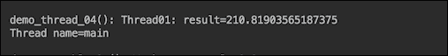

100 毫秒的延迟足以让`t1`线程完成计算。这是为多线程计算创建线程的两种方法中的第一种。第二种方式是实现`Runnable`接口。如果进行计算的类已经扩展了其他类，并且由于某些原因您不能或不想使用组合，那么这可能是唯一可能的方法。`Runnable`接口是一个功能接口（只有一个抽象方法），必须实现`run()`方法：

```java
@FunctionalInterface
public interface Runnable {
    /**
     * When an object implementing interface <code>Runnable</code> is used
     * to create a thread, starting the thread causes the object's
     * <code>run</code> method to be called in that separately executing
     * thread.
     */
    public abstract void run();
```

我们在`MyRunnable`类中实现了这个接口：

```java
class MyRunnable01 implements Runnable {
    private String id;
    private double result;
    public MyRunnable01(int id) {
        this.id = String.valueOf(id);
    }
    public String getId() { return this.id; }
    public double getResult() { return this.result; }
    public void run() {
        result = IntStream.rangeClosed(1, 99999)
                          .asDoubleStream()
                          .map(Math::sqrt)
                          .average()
                          .getAsDouble();
    }
}
```

它与前面的`Thread01`类具有相同的功能，并且我们添加了 ID，允许在必要时识别线程，因为`Runnable`接口没有`Thread`类所具有的内置`getName()`方法。

类似地，如果我们在不暂停`main`线程的情况下执行该类，如下所示：

```java
System.out.print("demo_runnable_01(): ");
MyRunnable01 myRunnable = new MyRunnable01(1);
Thread t1 = new Thread(myRunnable);
t1.start();
System.out.println("Worker " + myRunnable.getId() 
           + ": result=" + myRunnable.getResult());
```

输出结果如下：


现在，我们将添加暂停，如下所示：

```java
System.out.print("demo_runnable_02(): ");
MyRunnable01 myRunnable = new MyRunnable01(1);
Thread t1 = new Thread(myRunnable);
t1.start();
try {
    t1.join();
} catch (InterruptedException e) { 
    e.printStackTrace();
}
System.out.println("Worker " + myRunnable.getId() 
           + ": result=" + myRunnable.getResult());
```

结果与`Thread01`类产生的结果完全相同：


前面的所有示例都将生成的结果存储在`class`属性中。但情况并非总是如此。通常，工作线程要么将其值传递给另一个线程，要么将其存储在数据库或外部的其他地方。在这种情况下，可以利用`Runnable`接口作为功能接口，将必要的处理函数作为 Lambda 表达式传递到新线程中：

```java
System.out.print("demo_lambda_01(): ");
String id = "1";
Thread t1 = 
    new Thread(() -> IntStream.rangeClosed(1, 99999)
         .asDoubleStream().map(Math::sqrt).average()
         .ifPresent(d -> System.out.println("Worker " 
                            + id + ": result=" + d)));
t1.start();
try {
    t1.join();
} catch (InterruptedException e) { 
    e.printStackTrace();
}
```

结果将完全相同，如下所示：


根据首选样式，可以重新排列代码并在变量中隔离 Lambda 表达式，如下所示：

```java
Runnable r = () -> IntStream.rangeClosed(1, 99999)
       .asDoubleStream().map(Math::sqrt).average()
      .ifPresent(d -> System.out.println("Worker " 
                           + id + ": result=" + d));
Thread t1 = new Thread(r);
```

或者，可以将 Lambda 表达式放在单独的方法中：

```java
void calculateAverage(String id) {
    IntStream.rangeClosed(1, 99999)
        .asDoubleStream().map(Math::sqrt).average()
        .ifPresent(d -> System.out.println("Worker " 
                            + id + ": result=" + d));
}
void demo_lambda_03() {
    System.out.print("demo_lambda_03(): ");
    Thread t1 = new Thread(() -> calculateAverage("1"));
    ...
}
```

结果将是相同的，如下所示：


对线程创建有了基本的了解之后，我们现在可以回到关于使用多线程构建高性能应用程序的讨论。换句话说，在我们了解了每个工人所需的能力和资源之后，我们现在可以讨论为吉萨大金字塔这样的大型项目引进许多工人的物流。

编写代码来管理工作线程的生命周期以及它们对共享资源的访问是可能的，但是从一个应用程序到另一个应用程序是完全相同的。这就是为什么在 Java 的几个版本之后，线程管理管道作为`java.util.concurrent`包成为标准 JDK 库的一部分。这个包有大量支持多线程和并发的接口和类。我们将在后面的章节中讨论如何使用大部分功能，同时讨论线程池、线程监控、线程同步以及相关主题。

# 线程池

在本节中，我们将研究`java.util.concurrent`包中提供的`Executor`接口及其实现。它们封装了线程管理，最大限度地减少了应用程序开发人员在编写与线程生命周期相关的代码上花费的时间。

`java.util.concurrent`包中定义了三个`Executor`接口。第一个是基本的`Executor`接口中只有一个`void execute(Runnable r)`方法。它基本上取代了以下内容：

```java
Runnable r = ...;
(new Thread(r)).start()
```

但是，我们也可以通过从池中获取线程来避免创建新线程。

第二个是`ExecutorService`接口扩展了`Executor`并添加了以下方法组，用于管理工作线程和执行器本身的生命周期：

*   `submit()`：放入队列中执行接口`Runnable`或接口`Callable`的对象（允许工作线程返回值）；`Future`接口的返回对象，用于访问`Callable`返回的值，管理工作线程的状态
*   `invokeAll()`：在执行接口`Callable`对象集合的队列中放置返回的`Future`对象列表，当所有工作线程完成时（还有一个带超时的重载`invokeAll()`方法）
*   `invokeAny()`：放入队列中执行接口`Callable`对象集合；返回任何工作线程的一个已完成的`Future`对象（还有一个带超时的重载`invokeAny()`方法）

管理工作线程状态和服务本身的方法：

*   `shutdown()`：这将防止新的工作线程提交到服务
*   `isShutdown()`：检查是否启动了执行器关闭
*   `awaitTermination(long timeout, TimeUnit timeUnit)`：这将等待所有工作线程在关闭请求后完成执行，或者超时发生，或者当前线程中断，以先发生的为准
*   `isTerminated()`：检查关机启动后是否所有工作线程都已完成；除非先调用了`shutdown()`或`shutdownNow()`，否则它永远不会返回`true`
*   `shutdownNow()`：这会中断每个未完成的工作线程；工作线程应该被写入，以便它定期检查自己的状态（例如使用`Thread.currentThread().isInterrupted()`），并自动正常关闭；否则，即使在调用了`shutdownNow()`之后，它仍将继续运行

第三个接口是`ScheduledExecutorService`，它扩展了`ExecutorService`并添加了允许调度工作线程执行（一次性和周期性）的方法。

可以使用`java.util.concurrent.ThreadPoolExecutor`或`java.util.concurrent.ScheduledThreadPoolExecutor`类创建基于池的`ExecutorService`实现。还有一个`java.util.concurrent.Executors`工厂类，涵盖了大多数实际案例。因此，在编写用于创建工作线程池的自定义代码之前，我们强烈建议使用`java.util.concurrent.Executors`类的以下工厂方法：

*   `newSingleThreadExecutor()`：这将创建一个`ExecutorService`（池）实例，该实例按顺序执行工作线程
*   `newFixedThreadPool()`：这将创建一个线程池，用于重用固定数量的工作线程；如果在所有工作线程仍在执行时提交新任务，则会将其设置到队列中，直到有工作线程可用为止
*   `newCachedThreadPool()`：创建一个线程池，根据需要添加一个新线程，除非之前创建了一个空闲线程；已空闲 60 秒的线程将从缓存中删除
*   `newScheduledThreadPool()`：这将创建一个固定大小的线程池，可以安排命令在给定延迟后运行，或定期执行
*   `newSingleThreadScheduledExecutor()`：这将创建一个单线程执行器，它可以安排命令在给定延迟后运行，或定期执行
*   `newWorkStealingThreadPool()`：这将创建一个线程池，该线程池使用与`ForkJoinPool`相同的工作窃取机制，这在工作线程生成其他线程时特别有用，例如在递归算法中

这些方法中的每一个都有一个重载版本，允许在需要时传入用于创建新线程的`ThreadFactory`。让我们看看它在代码示例中是如何工作的。

首先，我们创建一个实现`Runnable`的`MyRunnable02`类—我们未来的工作线程：

```java
class MyRunnable02 implements Runnable {
    private String id;
    public MyRunnable02(int id) {
        this.id = String.valueOf(id);
    }
    public String getId(){ return this.id; }
    public void run() {
        double result = IntStream.rangeClosed(1, 100)
           .flatMap(i -> IntStream.rangeClosed(1, 99999))
           .takeWhile(i -> 
                 !Thread.currentThread().isInterrupted())
           .asDoubleStream()
           .map(Math::sqrt)
           .average()
           .getAsDouble();
        if(Thread.currentThread().isInterrupted()){
            System.out.println(" Worker " + getId() 
                       + ": result=ignored: " + result);
        } else {
            System.out.println(" Worker " + getId() 
                                + ": result=" + result);
        }
}
```

请注意此实现与前面示例的重要区别，`takeWhile(i -> !Thread.currentThread().isInterrupted())`操作允许流流动，只要线程工作者状态未设置为中断，这在调用`shutdownNow()`方法时发生。只要`takeWhile()`的谓词返回`false`（工作线程被中断），线程就停止生成结果（只忽略当前的`result`值）。例如，在实际系统中，这相当于跳过在数据库中存储`result`值。

这里值得注意的是，在前面的代码中使用`interrupted()`状态方法检查线程状态可能会导致不一致的结果。由于`interrupted()`方法返回正确的状态值，然后清除线程状态，因此对该方法的第二次调用（或在调用方法`interrupted()`之后对方法`isInterrupted()`的调用）总是返回`false`。

虽然在这段代码中不是这样，但我们想在这里提到一些开发人员在工作线程中实现`try/catch`块时犯的一个错误。例如，如果工作者需要暂停并等待中断信号，代码通常如下所示：

```java
try {
    Thread.currentThread().wait();
} catch (InterruptedException e) {}
// Do what has to be done
```

前面代码段的问题是线程状态从未中断，而更高级别的代码可能正在监视工作线程，并根据工作线程是否中断而改变行为。

更好的实施方式如下：

```java
try {
    Thread.currentThread().wait();
} catch (InterruptedException e) {
    Thread.currentThread().interrupt();
}
// Do what has to be done
```

这样在螺纹上设置状态`interrupted`，以后可以通过`isInterrupted()`方法进行检查。公平地说，在许多应用程序中，一旦线程中断，就不会再次检查其代码。但是设置正确的状态是一种很好的做法，尤其是在您不是客户机代码作者的情况下。

在使用`join()`方法的代码片段中，我们不需要这样做，因为这是必须暂停的主代码（最高级别的代码）。

现在，我们可以展示如何使用`ExecutiveService`池的缓存池实现来执行早期的`MyRunnable02`类（类似地使用其他类型的线程池）。首先，我们创建池，提交`MyRunnable02`类的三个实例执行并关闭池：

```java
ExecutorService pool = Executors.newCachedThreadPool();
IntStream.rangeClosed(1, 3).
       forEach(i -> pool.execute(new MyRunnable02(i)));
System.out.println("Before shutdown: isShutdown()=" 
          + pool.isShutdown() + ", isTerminated()=" 
                                + pool.isTerminated());
pool.shutdown(); // New threads cannot be submitted
System.out.println("After  shutdown: isShutdown()=" 
          + pool.isShutdown() + ", isTerminated()=" 
                                + pool.isTerminated());
```

如果我们运行这些行，我们将看到以下输出：


这里没有惊喜！`isShutdown()`方法在调用`shutdown()`方法之前返回`false`值，之后返回`true`值。`isTerminated()`方法返回一个`false`值，因为没有工作线程完成。

让我们通过在`shutdown()`方法之后添加以下代码来测试它：

```java
try {
    pool.execute(new MyRunnable02(100));
} catch(RejectedExecutionException ex){
    System.err.println("Cannot add another worker-thread to the service queue:\n" + ex.getMessage());
}
```

现在，输出将有以下消息（屏幕截图对于该页面来说可能太大，或者在安装时不可读）：

```java
Cannot add another worker-thread to the service queue:
Task com.packt.java9hp.ch09_threads.MyRunnable02@6f7fd0e6 
    rejected from java.util.concurrent.ThreadPoolExecutor
    [Shutting down, pool size = 3, active threads = 3, 
    queued tasks = 0, completed tasks = 0]
```

正如预期的那样，在调用`shutdown()`方法之后，不能再向池中添加工作线程。

现在，让我们看看启动关机后我们可以做什么：

```java
long timeout = 100;
TimeUnit timeUnit = TimeUnit.MILLISECONDS;
System.out.println("Waiting for all threads completion " 
                     + timeout + " " + timeUnit + "...");
// Blocks until timeout or all threads complete execution
boolean isTerminated = 
                pool.awaitTermination(timeout, timeUnit);
System.out.println("isTerminated()=" + isTerminated);
if (!isTerminated) {
    System.out.println("Calling shutdownNow()...");
    List<Runnable> list = pool.shutdownNow(); 
    printRunningThreadIds(list);
    System.out.println("Waiting for threads completion " 
                     + timeout + " " + timeUnit + "...");
    isTerminated = 
                pool.awaitTermination(timeout, timeUnit);
    if (!isTerminated){
        System.out.println("Some threads are running...");
    }
    System.out.println("Exiting.");
}
```

`printRunningThreadIds()`方法如下：

```java
void printRunningThreadIds(List<Runnable> l){
    String list = l.stream()
            .map(r -> (MyRunnable02)r)
            .map(mr -> mr.getId())
            .collect(Collectors.joining(","));
    System.out.println(l.size() + " thread"
       + (l.size() == 1 ? " is" : "s are") + " running"
            + (l.size() > 0 ? ": " + list : "") + ".");
}
```

上述代码的输出如下所示：

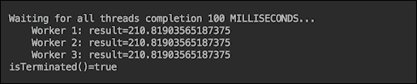

这意味着 100 毫秒足以让每个辅助线程完成计算。（请注意，如果您尝试在计算机上复制此数据，由于性能的差异，结果可能略有不同，因此您需要调整超时。）

当我们将等待时间减少到 75 毫秒时，输出如下：

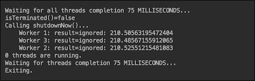

我们计算机上的 75 毫秒不足以让所有线程完成，因此它们被`shutdownNow()`中断，部分结果被忽略。

现在让我们取消对`MyRunnable01`类中中断状态的检查：

```java
class MyRunnable02 implements Runnable {
    private String id;
    public MyRunnable02(int id) {
        this.id = String.valueOf(id);
    }
    public String getId(){ return this.id; }
    public void run() {
        double result = IntStream.rangeClosed(1, 100)
           .flatMap(i -> IntStream.rangeClosed(1, 99999))
           .asDoubleStream()
           .map(Math::sqrt)
           .average()
           .getAsDouble();
        System.out.println(" Worker " + getId() 
                                + ": result=" + result);
}
```

如果不进行检查，即使我们将超时时间减少到 1ms，结果如下：

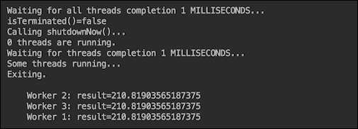

这是因为工作线程从未注意到有人试图中断它们并完成分配的计算。最后一个测试演示了监视工作线程中中断状态的重要性，以避免许多可能的问题，即数据损坏和内存泄漏。

演示的缓存池工作正常，如果工作线程执行较短的任务，并且其数量不能增长过大，则不会出现问题。如果您需要更多地控制在任何时候运行的最大工作线程数，请使用固定大小的线程池。我们将在本课程的以下部分之一中讨论如何选择池大小。

单线程池非常适合按特定顺序执行任务，或者在每个任务都需要大量资源而无法与其他任务并行执行时使用。使用单线程执行的另一种情况是，工作人员修改相同的数据，但不能以另一种方式保护数据不受并行访问的影响。线程同步也将在本课程的以下部分之一中进行更详细的讨论。

在我们的示例代码中，到目前为止，我们只包含了`Executor`接口的`execute()`方法。在讨论线程监控时，我们将在下一节中演示`ExecutorService`池的其他方法。

以及本节的最后一句话。工作线程不需要是同一类的对象。它们可能代表完全不同的功能，仍然由一个池管理。

# 监控线程

有两种方法可以监视线程，通过编程和使用外部工具。我们已经看到如何检查工人计算的结果。让我们重温一下这段代码。我们还将稍微修改我们的工作器实现：

```java
class MyRunnable03 implements Runnable {
  private String name;
  private double result;
  public String getName(){ return this.name; }
  public double getResult() { return this.result; }
  public void run() {
    this.name = Thread.currentThread().getName();
    double result = IntStream.rangeClosed(1, 100)
      .flatMap(i -> IntStream.rangeClosed(1, 99999))
      .takeWhile(i -> !Thread.currentThread().isInterrupted())
      .asDoubleStream().map(Math::sqrt).average().getAsDouble();
    if(!Thread.currentThread().isInterrupted()){
      this.result = result;
    }
  }
}
```

对于工作线程标识，我们现在使用在执行时自动分配的线程名称，而不是自定义 ID（这就是为什么我们在`run()`方法中分配`name`属性，该方法在线程获取其名称时在执行上下文中调用）。新类`MyRunnable03`可以这样使用：

```java
void demo_CheckResults() {
    ExecutorService pool = Executors.newCachedThreadPool();
    MyRunnable03 r1 = new MyRunnable03();
    MyRunnable03 r2 = new MyRunnable03();
    pool.execute(r1);
    pool.execute(r2);
    try {
        t1.join();
    } catch (InterruptedException e) { 
        e.printStackTrace();
    }
    System.out.println("Worker " + r1.getName() + ": result=" + r1.getResult());
    System.out.println("Worker " + r2.getName() + ": result=" + r2.getResult());
    shutdown(pool);
}
```

`shutdown()`方法包含以下代码：

```java
void shutdown(ExecutorService pool) {
    pool.shutdown();
    try {
        if(!pool.awaitTermination(1, TimeUnit.SECONDS)){
            pool.shutdownNow();
        }
    } catch (InterruptedException ie) {}
}
```

如果我们运行前面的代码，输出将如下所示：


如果计算机上的结果不同，请尝试增加`sleepMs()`方法的输入值。

获取应用程序工作线程信息的另一种方法是使用`Future`接口。我们可以使用`ExecutorService`池的`submit()`方法访问此接口，而不是使用`execute()`、`invokeAll()`或`invokeAny()`方法。此代码显示如何使用`submit()`方法：

```java
ExecutorService pool = Executors.newCachedThreadPool();
Future f1 = pool.submit(new MyRunnable03());
Future f2 = pool.submit(new MyRunnable03());
printFuture(f1, 1);
printFuture(f2, 2);
shutdown(pool);
```

`printFuture()`方法有如下实现：

```java
void printFuture(Future future, int id) {
    System.out.println("printFuture():");
    while (!future.isCancelled() && !future.isDone()){
        System.out.println("    Waiting for worker " 
                                + id + " to complete...");
        sleepMs(10);
    }
    System.out.println("    Done...");
}
```

`sleepMs()`方法包含以下代码：

```java
void sleepMs(int sleepMs) {
    try {
        TimeUnit.MILLISECONDS.sleep(sleepMs);
    } catch (InterruptedException e) {}
}
```

我们更喜欢这个实现，而不是传统的`Thread.sleep()`，因为它明确了所使用的时间单位。

如果我们执行前面的代码，结果将与以下类似：

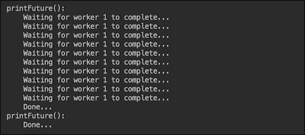

`printFuture()`方法已阻止主线程执行，直到第一个线程完成。同时，第二个线程也完成了。如果我们在`shutdown()`方法之后调用`printFuture()`方法，那么两个线程都将在该时间之前完成，因为我们已经设置了 1 秒的等待时间（请参见`pool.awaitTermination()`方法），这足以让它们完成任务：


如果您认为从线程监控的角度来看，信息不多，`java.util.concurrent`包通过`Callable`接口提供了更多功能。它是一个功能接口，允许使用`ExecutiveService`方法--`submit()`、`invokeAll()`和`invokeAny()`通过`Future`对象返回任何对象（包含工作线程计算的结果）。例如，我们可以创建一个包含工作线程结果的类：

```java
class Result {
    private double result;
    private String workerName;
    public Result(String workerName, double result) {
        this.result = result;
        this.workerName = workerName;
    }
    public String getWorkerName() { return workerName; }
    public double getResult() { return result;}
}
```

我们还包括了工作线程的名称，用于监视哪个线程生成了显示的结果。实现`Callable`接口的类可能如下所示：

```java
class MyCallable01<T> implements Callable {
  public Result call() {
    double result = IntStream.rangeClosed(1, 100)
       .flatMap(i -> IntStream.rangeClosed(1, 99999))
       .takeWhile(i -> !Thread.currentThread().isInterrupted())
       .asDoubleStream().map(Math::sqrt).average().getAsDouble();

    String workerName = Thread.currentThread().getName();
    if(Thread.currentThread().isInterrupted()){
        return new Result(workerName, 0);
    } else {
        return new Result(workerName, result);
    }
  }
}
```

下面是使用`MyCallable01`类的代码：

```java
ExecutorService pool = Executors.newCachedThreadPool();
Future f1 = pool.submit(new MyCallable01<Result>());
Future f2 = pool.submit(new MyCallable01<Result>());
printResult(f1, 1);
printResult(f2, 2);
shutdown(pool);
```

`printResult()`方法包含以下代码：

```java
void printResult(Future<Result> future, int id) {
    System.out.println("printResult():");
    while (!future.isCancelled() && !future.isDone()){
        System.out.println("    Waiting for worker " 
                              + id + " to complete...");
        sleepMs(10);
    }
    try {
        Result result = future.get(1, TimeUnit.SECONDS);
        System.out.println("    Worker " 
                + result.getWorkerName() + ": result = " 
                                   + result.getResult());
    } catch (Exception ex) {
        ex.printStackTrace();
    }
}
```

此代码的输出可能如下所示：

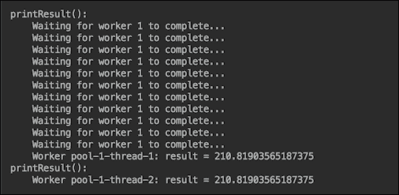

与前面的示例一样，前面的输出显示，`printResult()`方法等待第一个工作线程完成，因此第二个线程设法同时完成其任务。如您所见，使用`Callable`的优点是，如果需要，我们可以从`Future`对象检索实际结果。

`invokeAll()`和`invokeAny()`方法的用法类似：

```java
ExecutorService pool = Executors.newCachedThreadPool();
try {
    List<Callable<Result>> callables = 
              List.of(new MyCallable01<Result>(), 
                           new MyCallable01<Result>());
    List<Future<Result>> futures = 
                             pool.invokeAll(callables);
    printResults(futures);
} catch (InterruptedException e) {
    e.printStackTrace();
}
shutdown(pool);
```

`printResults()`方法使用`printResult()`方法，您已经知道：

```java
void printResults(List<Future<Result>> futures) {
    System.out.println("printResults():");
    int i = 1;
    for (Future<Result> future : futures) {
        printResult(future, i++);
    }
}
```

如果我们运行前面的代码，输出将如下所示：

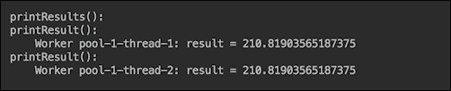

如您所见，不再需要等待工作线程完成作业。这是因为在所有作业完成后，`invokeAll()`方法返回`Future`对象的集合。

`invokeAny()`方法的行为类似。如果我们运行以下代码：

```java
System.out.println("demo_InvokeAny():");
ExecutorService pool = Executors.newCachedThreadPool();
try {
    List<Callable<Result>> callables = 
                   List.of(new MyCallable01<Result>(), 
                            new MyCallable01<Result>());
    Result result = pool.invokeAny(callables);
    System.out.println("    Worker " 
                        + result.getWorkerName()
                  + ": result = " + result.getResult());
} catch (InterruptedException | ExecutionException e) {
    e.printStackTrace();
}
shutdown(pool);
```

以下是输出：


这些是以编程方式监视线程的基本技术，但是可以很容易地扩展我们的示例，以涵盖针对特定应用程序需求定制的更复杂的情况。在第 5 课中“使用新 API 改进代码”中，我们还将讨论另一种使用 JDK 8 中引入并在 JDK 9 中扩展的`java.util.concurrent.CompletableFuture`类以编程方式监视工作线程的方法。

如有必要，可以使用`java.lang.Thread`类不仅获取有关应用程序工作线程的信息，还获取有关 JVM 进程中所有其他线程的信息：

```java
void printAllThreads() {
    System.out.println("printAllThreads():");
    Map<Thread, StackTraceElement[]> map = Thread.getAllStackTraces();
    for(Thread t: map.keySet()){
        System.out.println("    " + t);
    }
```

现在，让我们按如下方式调用此方法：

```java
void demo_CheckResults() {
    ExecutorService pool = Executors.newCachedThreadPool();
    MyRunnable03 r1 = new MyRunnable03();
    MyRunnable03 r2 = new MyRunnable03();
    pool.execute(r1);
    pool.execute(r2);
    sleepMs(1000);
    printAllThreads();
    shutdown(pool);
}
```

结果如下所示：

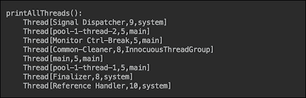

我们利用了`Thread`类的`toString()`方法，该方法只打印线程名称、优先级和它所属的线程组。我们在列表中的名称`pool-1-thread-1`和`pool-1-thread-2`下看到了我们明确创建的两个应用程序线程（除了`main`线程）。但是如果调用`shutdown()`方法后再调用`printAllThreads()`方法，则输出如下：

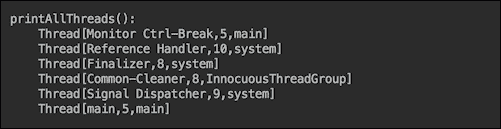

我们在列表中再也看不到`pool-1-thread-1`和`pool-1-thread-2`线程，因为`ExecutorService`池已经关闭。

我们可以轻松添加从同一映射中提取的堆栈跟踪信息：

```java
void printAllThreads() {
    System.out.println("printAllThreads():");
    Map<Thread, StackTraceElement[]> map 
                               = Thread.getAllStackTraces();
    for(Thread t: map.keySet()){
        System.out.println("   " + t);
        for(StackTraceElement ste: map.get(t)){
            System.out.println("        " + ste);
        }
    }
}
```

但是，这会占用书页上太多的空间。在第 5 课“使用新 API 改进代码”中，在展示 JDK 9 附带的新 Java 功能的同时，我们还将讨论通过`java.lang.StackWalker`类访问堆栈跟踪的更好方法。

`Thread`类对象还有几个其他方法提供关于线程的信息，如下所示：

*   `dumpStack()`：将堆栈跟踪打印到标准错误流
*   `enumerate(Thread[] arr)`：将当前线程的线程组及其子组中的活动线程复制到指定的数组`arr`
*   `getId()`：提供线程的 ID
*   `getState()`：读取线程的状态；`enum Thread.State`中的可能值可以是以下值之一：

    *   `NEW`：这是尚未启动的线程
    *   `RUNNABLE`：这是当前正在执行的线程
    *   `BLOCKED`：这是被阻止等待释放监视器锁的线程
    *   `WAITING`：这是等待中断信号的线程
    *   `TIMED_WAITING`：这是等待中断信号达到指定等待时间的线程
    *   `TERMINATED`：这是退出

    的线程
*   `holdsLock(Object obj)`：表示线程是否持有指定对象上的监视器锁
*   `interrupted()`或`isInterrupted()`：表示线程是否被中断（接收到中断信号，表示中断标志设置为`true`）
*   `isAlive()`：表示线程是否处于活动状态
*   `isDaemon()`：表示该线程是否为守护进程线程。

`java.lang.management`包提供了类似的监视线程的功能。让我们运行以下代码段，例如：

```java
void printThreadsInfo() {
    System.out.println("printThreadsInfo():");
    ThreadMXBean threadBean = 
                      ManagementFactory.getThreadMXBean();
    long ids[] = threadBean.getAllThreadIds();
    Arrays.sort(ids);
    ThreadInfo[] tis = threadBean.getThreadInfo(ids, 0);
    for (ThreadInfo ti : tis) {
        if (ti == null) continue;
        System.out.println("    Id=" + ti.getThreadId() 
                       + ", state=" + ti.getThreadState() 
                          + ", name=" + ti.getThreadName());
    }
}
```

为了更好地展示，我们利用了列出线程 ID 的优势，正如您前面所看到的，我们按照 ID 对输出进行了排序。如果我们在`shutdown()`方法之前调用`printThreadsInfo()`方法，那么输出将如下所示：

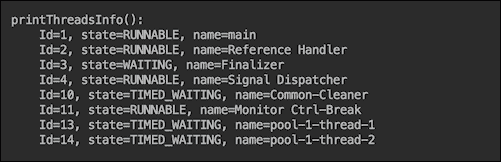

但是，如果我们在`shutdown()`方法之后调用`printThreadsInfo()`方法，输出将不再包括我们的工作线程，就像使用`Thread`类 API 的情况一样：

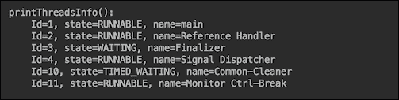

`java.lang.management.ThreadMXBean`接口提供了许多关于线程的其他有用数据。有关此接口的更多信息，请参阅 Oracle 网站上的官方 API。[请查看此链接](https://docs.oracle.com/javase/8/docs/api/index.html?java/lang/management/ThreadMXBean.html)。

在前面提到的线程列表中，您可能已经注意到了`Monitor Ctrl-Break`线程。此线程提供了另一种监视 JVM 进程中线程的方法。在 Windows 上按下`Ctrl`和`Break`键会导致 JVM 将线程转储打印到应用程序的标准输出中。在 Oracle Solaris 或 Linux 操作系统上，组合使用`Ctrl`键和反斜杠`\`也会产生相同的效果。这就引出了线程监控的外部工具。

如果您无法访问源代码或更喜欢使用外部工具进行线程监视，那么 JDK 安装中有几个诊断实用程序。在下面的列表中，我们仅提及允许线程监视的工具，并仅描述所列工具的此功能（尽管它们也具有其他广泛的功能）：

*   `jcmd`实用程序使用 JVM 进程 ID 或主类名称`jcmd <process id/main class> <command> [options]`向同一台机器上的 JVM 发送诊断命令请求，`Thread.print`选项打印进程中所有线程的堆栈跟踪。
*   JConsole 监控工具使用 JVM 中内置的 JMX 工具来提供有关运行应用程序的性能和资源消耗的信息。它有一个“线程”选项卡窗格，其中显示了一段时间内的线程使用情况、当前的活动线程数、自 JVM 启动以来的最高活动线程数。可以选择线程及其名称、状态和堆栈跟踪，对于阻塞的线程，还可以选择线程等待获取的同步器以及拥有锁的线程。使用**死锁检测**按钮识别死锁。运行该工具的命令是`jconsole <process id>`或（对于远程应用程序）`jconsole <hostname>:<port>`，其中`port`是启用 JMX 代理的 JVM `start`命令指定的端口号。
*   `jdb`实用程序是一个示例命令行调试器。它可以附加到 JVM 进程，并允许您检查线程。
*   `jstack`命令行实用程序可以附加到 JVM 进程，并打印所有线程的堆栈跟踪，包括 JVM 内部线程和可选的本机堆栈帧。它还允许您检测死锁。
*   **Java 飞行记录器**（**JFR**）提供 Java 进程的相关信息，包括等待锁的线程、垃圾收集等。它还允许获取线程转储，类似于通过`Thread.print`诊断命令或使用 JStack 工具生成的线程转储。如果满足条件，可以设置**Java 任务控制**（**JMC**）以转储飞行记录。JMCUI 包含关于线程、锁争用和其他延迟的信息。尽管 JFR 是一项商业功能，但它对开发人员台式机/笔记本电脑以及测试、开发和生产环境中的评估目的是免费的。

### 注

有关这些和其他诊断工具的更多详细信息，请参见 [Oracle 官方文档](https://docs.oracle.com/javase/9/troubleshoot/diagnostic-tools.htm)。

# 调整线程池执行器的大小

在我们的示例中，我们使用了一个缓存线程池，它根据需要创建一个新线程，或者，如果可用的话，重用已经使用过的线程，但该线程完成了它的工作并返回到池中进行新的分配。我们不担心创建的线程太多，因为我们的演示应用程序最多有两个工作线程，而且它们的寿命很短。

但是，如果应用程序可能需要的工作线程没有固定的限制，或者无法很好地预测线程可能需要多少内存或执行多长时间，那么设置工作线程数的上限可以防止应用程序性能的意外降级，工作线程使用的内存不足或任何其他资源耗尽。如果线程行为极不可预测，那么单线程池可能是唯一的解决方案，可以选择使用自定义线程池执行器（后面将解释关于最后一个选项的更多信息）。但在大多数情况下，固定大小的线程池执行器是应用程序需求和代码复杂性之间的一个很好的实际折衷方案。根据具体要求，此类执行人可能是以下三种类型之一：

*   一个简单的、固定大小的`ExecutorService.newFixedThreadPool(int nThreads)`池，不会超出指定的大小，但不采用任何一种
*   几个`ExecutorService.newScheduledThreadPool(int nThreads)`池，允许调度具有不同延迟或执行周期的不同线程组
*   `ExecutorService.newWorkStealingPool(int parallelism)`适用于指定数量的 CPU，您可以将其设置为高于或小于计算机上的实际 CPU 数量

将前面任何池中的固定大小设置得太低可能会剥夺应用程序有效利用可用资源的机会。因此，在选择池大小之前，建议花一些时间来监视它和调优 JVM（请参阅本课程的一节中的如何操作），目的是识别应用程序行为的特性。事实上，为了适应和利用代码或执行环境中发生的更改，必须在整个应用程序生命周期中重复部署监视器调整周期。

您考虑的第一个参数是系统中的 CPU 数量，因此线程池大小至少可以与 CPU 计数一样大。然后，您可以监视应用程序，并查看每个线程占用 CPU 的时间以及使用其他资源（如 I/O 操作）的时间。如果不使用 CPU 所花费的时间与线程的总执行时间相当，则可以将池大小增加**不使用 CPU 的时间/总执行时间**。但这是在另一个资源（磁盘或数据库）不是线程之间争用的主题的情况下。如果是后者，那么您可以使用该资源而不是 CPU 作为描述因子。

假设应用程序的工作线程不太大或执行时间不太长，并且属于在合理短时间内完成其任务的典型工作线程的主流群体，则可以通过添加（四舍五入）来增加池大小期望响应时间与线程使用 CPU 或其他最具争议的资源的时间的比率。这意味着，在相同的期望响应时间下，线程使用 CPU 或另一个并发访问的资源越少，池大小应该越大。如果有争议的资源有其自身的能力来改进并发访问（如数据库中的连接池），请首先考虑使用该功能。

如果所需的同时运行的线程数在不同的情况下在运行时发生变化，则可以使池大小成为动态的，并使用新大小创建一个新池（在所有线程完成后关闭旧池）。在添加或删除可用资源后，可能还需要重新计算新池的大小。例如，您可以使用`Runtime.getRuntime().availableProcessors()`以编程方式根据可用 CPU 的当前计数调整池大小。

如果 JDK 附带的现成线程池执行器实现都不能满足特定应用程序的需要，那么在从头开始编写线程管理代码之前，首先尝试使用`java.util.concurrent.ThreadPoolExecutor`类。它有几个重载构造函数。

为了让您了解其功能，以下是选项最多的构造函数：

```java
ThreadPoolExecutor (int corePoolSize, int maximumPoolSize, long keepAliveTime, TimeUnit unit, BlockingQueue<Runnable> workQueue, ThreadFactory threadFactory, RejectedExecutionHandler handler)
```

前面提到的参数是（引用 JavaDoc）：

*   `corePoolSize`：这是池中要保留的线程数，即使它们处于空闲状态，除非设置了`allowCoreThreadTimeOut`
*   `maximumPoolSize`：这是池中允许的最大线程数
*   `keepAliveTime`：当线程数大于核心数时，这是多余空闲线程等待新任务终止前的最长时间
*   `unit`：这是`keepAliveTime`参数的时间单位
*   `workQueue`：此队列用于在任务执行前保存任务，此队列将只保存`execute`方法提交的`Runnable`任务
*   `threadFactory`：这是执行器创建新线程时使用的工厂
*   `handler`：这是由于达到线程边界和队列容量而导致执行受阻时要使用的处理程序

在`ThreadPoolExecutor`方法的对象创建完成后，除`workQueue`参数外，之前的每个构造函数参数也可以通过相应的设置器进行设置，这样可以更灵活地动态调整现有池特性。

# 线程同步

我们已经收集了足够的人员和资源，如食物、水和建造金字塔的工具。我们将人员分成小组，并为每个小组分配一项任务。一些人（一个水池）以待命模式住在附近的村庄，准备替换在任务中生病或受伤的人。我们调整了劳动力数量，使村里只有少数人闲着。我们在工作-休息周期中轮换团队，以保持项目以最大速度进行。我们对整个过程进行了监控，并调整了团队的数量和他们所需的供应流，以确保整个项目不会出现明显的延迟，并有稳定的、可测量的进展。然而，整体上有许多活动部件，各种大小突发事件和问题一直在发生。

为了确保工人和团队不会相互踩踏，并且有某种交通管制，以便在上一个技术步骤完成之前，下一个技术步骤不会开始，主建筑师派他的代表前往施工现场的所有关键点。这些代表确保以预期的质量和规定的顺序执行任务。他们有权阻止下一个团队开始他们的工作，直到上一个团队尚未完成。他们的行为就像交通警察或锁，可以关闭或允许进入工作场所，如果必要的话。

这些代表所做的工作可以用现代语言定义为执行单元动作的协调或同步。没有它，数千名工人的努力结果将无法预测。从一万英尺的高空望去，这幅大图看上去平滑而和谐，就像从飞机的窗户望去农民的田地一样。但如果不仔细检查和关注关键细节，这张完美的照片可能会带来糟糕的收成（如果有的话）。

类似地，在多线程执行环境的安静电子空间中，如果工作线程共享对同一工作场所的访问权，则必须对其进行同步。例如，让我们为线程创建以下类辅助程序：

```java
class MyRunnable04 implements Runnable {
  private int id;
  public MyRunnable04(int id) { this.id = id; }
  public void run() {
    IntStream.rangeClosed(1, 5)
      .peek(i -> System.out.println("Thread "+id+": "+ i))
      .forEach(i -> Demo04Synchronization.result += i);
    }
}
```

如您所见，它依次向`Demo04Synchronization`类的静态属性添加 1、2、3、4、5（因此，生成的总数预计为 15）：

```java
public class Demo04Synchronization {
    public static int result;
    public static void main(String... args) {
        System.out.println();
        demo_ThreadInterference();
    }
    private static void demo_ThreadInterference(){
        System.out.println("demo_ThreadInterference: ");
        MyRunnable04 r1 = new MyRunnable04(1);
        Thread t1 = new Thread(r1);
        MyRunnable04 r2 = new MyRunnable04(2);
        Thread t2 = new Thread(r2);
        t1.start();
        sleepMs(100);
        t2.start();
        sleepMs(100);
        System.out.println("Result=" + result);
    }
    private static void sleepMs(int sleepMs) {
        try {
            TimeUnit.MILLISECONDS.sleep(sleepMs);
        } catch (InterruptedException e) {}
    }
}
```

在前面的代码中，当主线程第一次暂停 100ms 时，线程`t1`将变量结果的值增加到 15，然后线程`t2`再增加 15，得到总共 30。以下是输出：

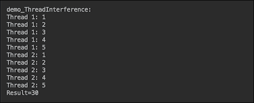

如果我们取消 100 毫秒的第一次暂停，线程将同时工作：

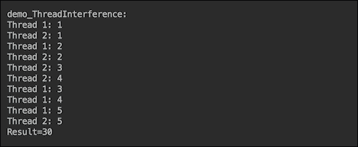

最终结果仍然是 30。我们对这段代码感觉良好，并将其作为经过良好测试的代码部署到生产环境中。但是，例如，如果我们将加法的数量从 5 增加到 250，结果就会变得不稳定，并且会随着运行而变化。这是第一次运行（为了节省空间，我们注释了每个线程中的打印输出）：


下面是另一次运行的输出：


它证明了`Demo04Synchronization.result += i`操作不是原子操作的事实。这意味着它由几个步骤组成，从`result`属性读取值，向其添加值，将结果总和分配回`result`属性。这允许以下场景，例如：

*   两个线程都读取了当前值`result`（因此每个线程都有一个相同原始`result`值的副本）
*   每个线程将另一个整数添加到同一个原始整数
*   第一个线程将总和分配给`result`属性
*   第二个线程将其总和分配给`result`属性

如您所见，第二个线程不知道第一个线程所做的添加，并且覆盖了第一个线程分配给`result`属性的值。但这种线程交错并不是每次都会发生。这只是一场机会游戏。这就是为什么我们没有看到只有五个数字的效果。但这种情况发生的概率随着并发操作数量的增加而增加。

类似的事情也可能发生在金字塔的建造过程中。第二组可以在第一组完成任务之前开始做一些事情。我们肯定需要一个**同步器**，它附带一个`synchronized`关键字。使用它，我们可以在`Demo04Synchronization`类中创建一个方法（架构师代表），该方法将控制对`result`属性的访问，并向其添加以下关键字：

```java
private static int result;
public static synchronized void incrementResult(int i){
    result += i;
}
```

现在我们还要修改工作线程中的`run()`方法：

```java
public void run() {
    IntStream.rangeClosed(1, 250)
       .forEach(Demo04Synchronization::incrementResult);
}
```

现在，每次运行的输出都显示相同的最终编号：


`synchronized`关键字告诉 JVM 一次只允许一个线程进入这个方法。所有其他线程将等待，直到方法的当前访问者退出。

通过在代码块中添加`synchronized`关键字也可以达到同样的效果：

```java
public static void incrementResult(int i){
    synchronized (Demo04Synchronization.class){
        result += i;
    }
}
```

不同之处在于，块同步需要一个对象——静态属性同步（如我们的情况）中的类对象，或者实例属性同步中的任何其他对象。每个对象都有一个内在锁或监视器锁，通常简称为监视器。一旦一个线程在一个对象上获得了锁，其他线程就不能在同一个对象上获得它，除非第一个线程在正常退出锁定的代码或代码抛出异常后释放锁。

事实上，在同步方法的情况下，对象（该方法所属的对象）也用于锁定。它只是在幕后自动发生，不需要程序员显式地使用对象的锁。

如果您没有访问`main`类代码的权限（如前面的示例所示），您可以将`result`属性保持为公共，并向工作线程添加一个同步方法（而不是我们所做的类）：

```java
class MyRunnable05 implements Runnable {
    public synchronized void incrementResult(int i){
        Demo04Synchronization.result += i;
    }
    public void run() {
        IntStream.rangeClosed(1, 250)
                .forEach(this::incrementResult);
    }
}
```

在这种情况下，`MyRunnable05`工作者类的对象默认提供其内在锁。这意味着您需要对所有线程使用`MyRunnable05`类的相同对象：

```java
void demo_Synchronized(){
    System.out.println("demo_Synchronized: ");
    MyRunnable05 r1 = new MyRunnable05();
    Thread t1 = new Thread(r1);
    Thread t2 = new Thread(r1);
    t1.start();
    t2.start();
    sleepMs(100);
    System.out.println("Result=" + result);
}
```

上述代码的输出与之前相同：


可以说，最后一个实现更可取，因为它将同步的责任分配给线程（及其代码的作者），而不是共享资源。通过这种方式，同步的需求随着线程实现的发展而变化，前提是客户机代码（为线程使用相同或不同的对象）也可以根据需要进行更改。

在某些操作系统中还可能出现另一个并发问题。根据线程缓存的实现方式，一个线程可能会保留属性`result`的本地副本，而不会在另一个线程更改其值后更新它。通过将`volatile`关键字添加到共享（线程间）属性中，可以保证其当前值将始终从主内存中读取，因此每个线程将看到其他线程所做的更新。在前面的示例中，我们只需将`Demo04Synchronization`类属性设置为`private static volatile int result`，将同步`incrementResult()`方法添加到同一个类或线程中，就不必再担心线程之间相互踩在一起了。

所描述的线程同步对于主流应用程序来说通常已经足够了。但更高的性能和高并发处理通常需要更仔细地查看线程转储，这通常表明方法同步比块同步更有效。当然，这也取决于方法和块的大小。由于尝试访问同步方法或块的所有其他线程都将停止执行，直到该方法或块的当前访问者退出它为止，因此，尽管开销很大，小的同步块仍有可能比大的同步方法产生更好的性能。

对于某些应用程序，默认内在锁的行为可能不太合适，它只是阻塞直到释放锁。如果是这种情况，请考虑使用来自 Type T0-包的锁。如果与使用默认的内在锁相比，基于该包中的锁的访问控制有几个不同之处。这些差异可能对您的应用程序有利，也可能会带来不必要的复杂性，但了解它们很重要，这样您就可以做出明智的决定：

*   同步的代码片段不需要属于一个方法；它可以跨越多个方法，由对`lock()`和`unlock()`方法的调用描述（在实现`Lock`接口的对象上调用）
*   在创建名为`ReentrantLock`的`Lock`接口对象时，可以向构造函数传递`fair`标志，使锁能够首先授予对等待时间最长线程的访问权，这有助于避免饥饿（当低优先级线程永远无法访问锁时）
*   允许线程在提交被阻止之前测试锁是否可访问
*   允许中断等待锁的线程，这样它就不会无限期地被阻塞
*   您可以使用应用程序所需的任何功能自行实现`Lock`接口

`Lock`接口的典型使用模式如下：

```java
Lock lock = ...;
...
    lock.lock();
    try {
        // the fragment that is synchronized
    } finally {
        lock.unlock();
    }
...
}
```

注意`finally`块。这是保证`lock`最终释放的方式。否则，`try-catch`块内的代码会抛出异常，锁永远不会释放。

除了`lock()`和`unlock()`方法外，`Lock`接口还有以下方法：

*   `lockInterruptibly()`：除非当前线程中断，否则会获取锁。与`lock()`方法类似，此方法在等待获取锁时阻塞，与`lock()`方法不同，如果另一个线程中断等待的线程，此方法将抛出`InterruptedException`异常
*   `tryLock()`：如果在调用时锁是空闲的，则立即获取锁
*   `tryLock(long time, TimeUnit unit)`：如果锁在给定的等待时间内空闲，并且当前线程未被中断，则获取锁
*   `newCondition()`：返回一个绑定到此`Lock`实例的新`Condition`实例，获取锁后，线程可以释放它（调用`Condition`对象上的`await()`方法），直到其他线程调用同一`Condition`对象上的`signal()`或`signalAll()`为止，也可以指定超时时间（通过使用重载的`await()`方法），因此如果没有收到信号，线程将在超时后恢复，详情请参见`Condition`API

本书的范围不允许我们展示`java.util.concurrent.locks`包中提供的线程同步的所有可能性。要描述所有这些需要几节课。但是，即使从这个简短的描述中，您也可以看到，很难找到无法使用`java.util.concurrent.locks`包解决的同步问题。

当多行代码必须作为一个原子（全部或无）操作隔离时，方法或代码块的同步是有意义的。但是，对于一个变量的简单赋值或一个数字的递增/递减（如我们前面的例子），有一种更好的方法来同步这个操作，方法是使用`java.util.concurrent.atomic`包中的类，这些类支持对单个变量进行无锁线程安全编程。类的种类涵盖了所有的数字、偶数数组和引用类型，如`AtomicBoolean`、`AtomicInteger`、`AtomicIntegerArray`、`AtomicReference`和`AtomicReferenceArray`。

总共有 16 个班。根据值类型，它们中的每一个都允许一个完全可以想象的操作范围，即，`set()`、`get()`、`addAndGet()`、`compareAndSet()`、`incrementAndGet()`、`decrementAndGet()`和许多其他操作。每个操作的执行效率都比使用`synchronized`关键字执行的相同操作要高得多。而且不需要`volatile`关键字，因为它在引擎盖下使用它。

如果并发访问的资源是一个集合，`java.util.concurrent`包提供了多种线程安全实现，其性能优于同步的`HashMap`、`Hashtable`、`HashSet`、`Vector`和`ArrayList`（如果我们比较相应的`ConcurrentHashMap`、`CopyOnWriteArrayList`和`CopyOnWriteHashSet`）。传统的同步集合锁定整个集合，而并发集合使用锁剥离等高级技术来实现线程安全。并发集合尤其具有更高的读取量和更少的更新量，并且它们比同步集合具有更大的可伸缩性。但是，如果共享集合的大小很小，并且写操作占主导地位，那么并发集合的优势就不那么明显了。

# 调优 JVM

与任何大型项目一样，每个金字塔建筑都经历了相同的设计、规划、执行和交付生命周期。在这些阶段中的每一个阶段，一个持续的调整都在进行，一个复杂的项目之所以这样叫是有原因的。软件系统在这方面没有什么不同。我们设计、规划和构建它，然后不断地改变和调整。如果我们幸运的话，那么新的改变不会回到最初的阶段，也不需要改变设计。为了避免这些激烈的步骤，我们使用原型（如果使用瀑布模型）或迭代交付（如果采用敏捷过程）来早期发现可能的问题。像年轻的父母一样，我们时刻保持警惕，日夜监控孩子的进步。

正如我们在前面的一节中已经提到的，每个 JDK 9 安装都有几个诊断工具，或者除了这些工具之外，还可以用来监视 Java 应用程序。这些工具的完整列表（以及如何创建自定义工具的建议，如果需要）[可以在 Oracle 网站上的正式 Java SE 文档中找到](https://docs.oracle.com/javase/9/troubleshoot/diagnostic-tools.htm)。

使用这些工具可以识别应用程序的瓶颈，并通过编程或调优 JVM 本身或两者来解决它。最大的收益通常来自于良好的设计决策和使用某些编程技术和框架，其中一些我们在其他章节中已经描述过。在本节中，我们将研究在应用了所有可能的代码更改之后或更改代码不是选项时可用的选项，因此我们所能做的就是调优 JVM 本身。

工作目标取决于应用程序评测的结果和以下方面的非功能需求：

*   延迟，或应用程序对输入的响应程度
*   吞吐量，或应用程序在给定时间单位内所做的工作量
*   内存占用，或应用程序需要多少内存

其中一个方面的改进通常只能以牺牲另一个或两个方面为代价。内存消耗的减少可能会降低吞吐量和延迟，而延迟的减少通常只能通过增加内存占用来实现，除非您可以引入更快的 CPU，从而改善所有三个特性。

应用程序分析可能表明，一个特定的操作会在循环中不断分配大量内存。如果您可以访问代码，您可以尝试优化代码的这一部分，从而减轻 JVM 的压力。或者，它可能表明存在一个 I/O 或涉及到另一个与低端设备的交互，并且在代码中您无法对其进行任何改进。

定义应用程序和 JVM 调优的目标需要建立度量。例如，众所周知，作为平均响应时间的延迟的传统度量方法隐藏的比它揭示的性能更多。更好的延迟指标是最大响应时间和 99% 的最佳响应时间。对于吞吐量，一个好的指标是每单位时间的事务数。通常，此指标（每个事务的时间）的倒数反映了延迟。对于内存占用，最大分配内存（在负载下）允许硬件规划和设置防止可怕的`OutOfMemoryError`异常。避免完全（停止世界）垃圾收集循环将是理想的。但是，在实践中，如果**完全 GC**不经常发生，不会明显影响性能，并且在几个周期后得到大致相同的堆大小，这就足够了。

不幸的是，这种需求的简单性在实践中确实存在。现实生活总是带来更多的问题，如下所示：

*   是否可以超过目标延迟（响应时间）？
*   如果是，多久一次，多少钱？
*   不良响应时间能持续多久？
*   谁/什么衡量生产中的延迟？
*   目标绩效是否为最高绩效？
*   预计的峰值负荷是多少？
*   预计的峰值负荷将持续多久？

只有在回答了所有这些和类似的问题并建立了度量（反映非功能性需求）之后，我们才能开始调整代码，一次又一次地运行它和分析，然后调整代码并重复这个周期。此活动必须消耗大部分精力，因为与代码更改所获得的性能相比，JVM 本身的调优只能带来性能改进的一小部分。

尽管如此，JVM 调优的几个过程必须在早期进行，以避免浪费精力，并试图在配置不好的环境中强制执行代码。JVM 配置必须尽可能慷慨，以便代码利用所有可用资源。

首先，从 JVM 9 支持的四个垃圾收集器中选择垃圾收集器，如下所示：

*   **串行收集器**：使用单个线程执行所有垃圾收集工作
*   **并行收集器**：使用多线程加速垃圾收集
*   **并发标记扫描（CMS）收集器**：它使用更短的垃圾收集暂停，但会占用更多处理器时间
*   **垃圾优先（G1）收集器**：这适用于具有大内存的多处理器机器，但很可能满足垃圾收集暂停时间目标，同时实现高吞吐量。

[Oracle 官方文档](https://docs.oracle.com/javase/9/gctuning/available-collectors.htm)为垃圾收集选择提供了以下初始指导原则：

*   如果应用程序有一个小数据集（大约 100 MB），则使用`-XX:+UseSerialGC`选项选择串行采集器
*   如果应用程序将在单处理器上运行，并且没有暂停时间要求，则使用`-XX:+UseSerialGC`选项选择串行采集器
*   如果（a）峰值应用性能是第一优先级，并且（b）没有暂停时间要求，或者可以接受 1 秒或更长的暂停，则让 VM 选择收集器或使用`-XX:+UseParallelGC`选择并行收集器
*   如果响应时间比总吞吐量更重要，并且垃圾收集暂停时间必须保持在大约 1 秒以内，则使用`-XX:+UseG1GC or -XX:+UseConcMarkSweepGC`选择一个并发收集器

但是，如果您还没有特定的首选项，那么让 JVM 选择垃圾收集器，直到您了解更多关于应用程序需求的信息。在 JDK9 中，在某些平台上默认选择 G1，如果您使用的硬件有足够的资源，这是一个良好的开端。

Oracle 还建议使用 G1 及其默认设置，然后使用`-XX:MaxGCPauseMillis`选项使用不同的暂停时间目标，使用`-Xmx`选项使用最大 Java 堆大小。增加暂停时间目标或堆大小通常会导致更高的吞吐量。延迟也受暂停时间目标的更改影响。

在调优 GC 时，保留`-Xlog:gc*=debug`记录选项是有益的。它提供了许多关于垃圾收集活动的有用细节。JVM 调优的第一个目标是减少完整堆 GC 周期（完整 GC）的数量，因为它们非常消耗资源，因此可能会降低应用程序的速度。这是由于老年代居住面积过大造成的。在日志中，它由单词`Pause Full (Allocation Failure)`标识。以下是减少完全 GC 机会的可能步骤：

*   使用`-Xmx`调出堆的大小。但请确保它不超过 RAM 的物理大小。更好的是，为其他应用程序留出一些 RAM 空间。
*   使用`-XX:ConcGCThreads`显式增加并发标记线程数。
*   如果大量对象占用了太多的堆（注意显示大量区域旁边数字的`gc+heap=info`日志记录），请尝试使用`-XX: G1HeapRegionSize`增加区域大小。
*   观察 GC 日志并修改代码，这样应用程序创建的几乎所有对象都不会移动到年轻一代（垂死的年轻一代）之外。
*   一次添加或更改一个选项，这样您就可以清楚地了解 JVM 行为更改的原因。

这几个步骤将帮助您创建一个试错周期，让您更好地了解所使用的平台、应用程序的需求以及 JVM 和所选 GC 对不同选项的敏感性。有了这些知识，您就能够满足非功能性能需求，无论是通过更改代码、调优 JVM 还是重新配置硬件。

# 反应式编程

在经历了几次错误的开始和几次灾难性的破坏之后，接着是英勇的恢复，金字塔的建造过程形成了，古代的建筑者能够完成一些项目。最终的形状有时看起来与预想的不完全一样（最初的金字塔最终弯曲了），但是，尽管如此，金字塔仍然装饰着今天的沙漠。这种经历代代相传，设计和工艺都经过了很好的调整，足以在 4000 多年后生产出一些华丽、宜人的东西。

软件实践也会随着时间的推移而改变，尽管自图灵先生编写第一个现代程序以来，我们只有大约 70 年的时间。起初，当世界上只有少数几个程序员时，计算机程序曾经是一个连续的指令列表。函数式编程（像一等公民一样推动函数）也很早就被引入，但尚未成为主流。相反，`goto`指令允许您在意大利面碗中滚动代码。随后是结构化编程，然后是面向对象编程，函数式编程正在发展，甚至在某些领域蓬勃发展。对按键生成的事件的异步处理成为许多程序员的例行程序。JavaScript 试图使用所有的最佳实践，并获得了很多功能，即使在调试（乐趣）阶段以程序员的挫折为代价。最后，由于线程池和 Lambda 表达式是 JDKSE 的一部分，将反应流 API 添加到 JDK9 使 Java 成为允许使用异步数据流进行反应式编程的家族的一部分。

公平地说，即使没有这个新 API，我们也能够异步处理数据——通过旋转工作线程、使用线程池和可调用项（如前几节所述），或者通过传递回调（即使有时在调用谁的人的迷宫中丢失一次）。但是，在编写了几次这样的代码之后，我们注意到，大多数这样的代码只是一个管道，可以包装在一个框架内，从而大大简化异步处理。[这就是反应流倡议的方式](http://www.reactive-streams.org)，工作范围定义如下：

反应流的范围是找到一组最小的接口、方法和协议，这些接口、方法和协议将描述实现目标所需的操作和实体——具有非阻塞背压的异步数据流。

术语**非阻塞背压**是一个重要的术语，因为它指出了现有异步处理的一个问题——将传入数据的速率与系统在不需要停止（阻塞）数据输入的情况下处理它们的能力相协调。解决方案仍将包括一些背压，告知来源消费者难以跟上输入，但新框架应以更灵活的方式对传入数据速率的变化作出反应，而不仅仅是阻塞流，因此名称为**反应式**。

反应流 API 由类中包含的五个接口组成，分别为`java.util.concurrent.Flow`、`Publisher`、`Subscriber`、`Subscription`和`Processor`：

```java
@FunctionalInterface
public static interface Flow.Publisher<T> {
  public void subscribe(Flow.Subscriber<? super T> subscriber);
}

public static interface Flow.Subscriber<T> {
  public void onSubscribe(Flow.Subscription subscription);
  public void onNext(T item);
  public void onError(Throwable throwable);
  public void onComplete();
}

public static interface Flow.Subscription {
  public void request(long numberOfItems);
  public void cancel();
}

public static interface Flow.Processor<T,R> 
               extends Flow.Subscriber<T>, Flow.Publisher<R> {
}
```

`Flow.Subscriber`对象在`Flow.Subscriber`对象作为参数传递到`subscribe()`方法后，成为`Flow.Publisher`对象生成的数据的订户。发布者（`Flow.Publisher`的对象）调用订阅者的`onSubscribe()`方法，并将`Flow.Subsctiption`对象作为参数传递。现在，订阅者可以通过调用订阅的`request()`方法向发布者请求`numberOffItems`数据。当订阅者决定何时请求另一项进行处理时，这就是实现拉取模型的方法。订阅者可以通过调用`cancel()`订阅方式取消订阅发布者服务。

作为回报（或者在没有任何请求的情况下，如果实现者已经决定这样做，这将是一个推送模型），发布者可以通过调用订阅者的`onNext()`方法将一个新项目传递给订阅者。发布者还可以告诉订阅者物品生产遇到了问题（通过调用订阅者的`onError()`方法）或将不会有更多数据（通过调用订阅者的`onComplete()`方法）。

`Flow.Processor`接口描述了一个既可以作为订阅者又可以作为发布者的实体。它允许创建此类处理器的链（管道），以便订阅者可以从发布者接收项目，调整它，然后将结果传递给下一个订阅者。

这是响应流倡议为支持具有非阻塞背压的异步数据流而定义的最小接口集（现在是 JDK 9 的一部分）。如您所见，它允许订阅者和发布者相互交谈，并在需要时协调传入数据的速率，从而为我们在开始时讨论的背压问题提供多种解决方案。

有许多方法可以实现这些接口。目前，在 JDK 9 中，只有一个接口的实现示例，`SubmissionPublisher`类实现了`Flow.Publisher`。但是已经存在其他几个实现反应流 API 的库：RxJava、Reactor、Akka Streams 和 Vert.x 是最有名的库。我们将在示例中使用 RXJava2.1.3。您可以在[这里](http://reactivex.io)找到 RxJava 2.x API名称为 ReactiveX，表示被动扩展。

在这样做的同时，我们还希望解决`java.util.stream`包的流和反应流（例如，在 RxJava 中实现的）之间的差异。可以使用任何流编写非常类似的代码。让我们看一个例子。这是一个程序，它迭代五个整数，只选择偶数（2 和 4），变换每个整数（取每个所选数的平方根），然后计算两个平方根的平均值。它基于传统的`for`循环。

让我们从相似性开始。可以使用任何流实现相同的功能。例如，这里有一个方法，它迭代五个整数，只选择偶数（在本例中为 2 和 4），变换每个整数（取每个偶数的平方根），然后计算两个平方根的平均值。基于传统的`for`循环：

```java
void demo_ForLoop(){
    List<Double> r = new ArrayList<>();
    for(int i = 1; i < 6; i++){
        System.out.println(i);
        if(i%2 == 0){
            System.out.println(i);
            r.add(doSomething(i));
        }
    }
    double sum = 0d;
    for(double d: r){ sum += d; }
    System.out.println(sum / r.size());
}
static double doSomething(int i){
    return Math.sqrt(1.*i);
}
```

如果我们运行此程序，结果如下：

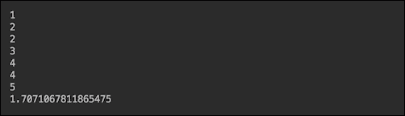

使用包`java.util.stream`可以实现相同的功能（具有相同的输出），如下所示：

```java
void demo_Stream(){
    double a = IntStream.rangeClosed(1, 5)
        .peek(System.out::println)
        .filter(i -> i%2 == 0)
        .peek(System.out::println)
        .mapToDouble(i -> doSomething(i))
        .average().getAsDouble();
    System.out.println(a);
}
```

RxJava 也可以实现相同的功能：

```java
void demo_Observable1(){
    Observable.just(1,2,3,4,5)
        .doOnNext(System.out::println)
        .filter(i -> i%2 == 0)
        .doOnNext(System.out::println)
        .map(i -> doSomething(i))
        .reduce((r, d) -> r + d)
        .map(r -> r / 2)
        .subscribe(System.out::println);
}
```

RxJava 基于`Observable`对象（扮演`Publisher`角色）和`Observer`订阅`Observable`并等待数据发出。发射数据的每一项（从`Observable`到`Observer`的过程中）都可以通过以流畅的方式链接的操作进行处理（参见前面的代码）。每个操作都采用一个 Lambda 表达式。从名称上看，操作功能是显而易见的。

尽管能够表现出与流相似的行为，`Observable`具有显著不同的能力。例如，流一旦关闭就不能重新打开，而`Observable`可以重用。以下是一个例子：

```java
void demo_Observable2(){
    Observable<Double> observable = Observable
            .just(1,2,3,4,5)
            .doOnNext(System.out::println)
            .filter(i -> i%2 == 0)
            .doOnNext(System.out::println)
            .map(Demo05Reactive::doSomething);

    observable
            .reduce((r, d) -> r + d)
            .map(r -> r / 2)
            .subscribe(System.out::println);

    observable
            .reduce((r, d) -> r + d)
            .subscribe(System.out::println);
}
```

在前面的代码中，我们使用了两次`Observable`——用于平均值计算和偶数的所有平方根求和。输出如以下屏幕截图所示：

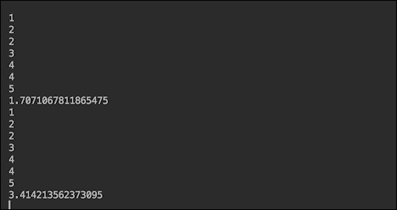

如果我们不希望`Observable`运行两次，我们可以通过添加`.cache()`操作来缓存其数据：

```java
void demo_Observable2(){
    Observable<Double> observable = Observable
            .just(1,2,3,4,5)
            .doOnNext(System.out::println)
            .filter(i -> i%2 == 0)
            .doOnNext(System.out::println)
            .map(Demo05Reactive::doSomething)
            .cache();

    observable
            .reduce((r, d) -> r + d)
            .map(r -> r / 2)
            .subscribe(System.out::println);

    observable
            .reduce((r, d) -> r + d)
            .subscribe(System.out::println);
}
```

上述代码的结果如下所示：

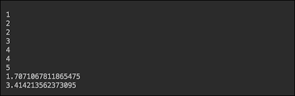

您可以看到，第二次使用相同的`Observable`利用了缓存的数据，从而实现了更好的性能。

`Observable`的另一个优点是`Observer`可以捕获异常：

```java
subscribe(v -> System.out.println("Result=" + v),
        e -> {
            System.out.println("Error: " + e.getMessage());
            e.printStackTrace();
        },
        () -> System.out.println("All the data processed"));
```

`subscribe()`方法重载，允许传入一个、两个或三个函数：

*   第一种是在成功的情况下使用
*   第二个是在异常情况下使用
*   第三个是在处理完所有数据后调用

`Observable`模型还允许对多线程处理进行更多控制。在流中使用`.parallel()`不允许指定要使用的线程池。但是，在 RxJava 中，您可以使用`Observable`中的`subscribeOn()`方法设置您喜欢的池类型：

```java
observable.subscribeOn(Schedulers.io())
        .subscribe(System.out::println);
```

`subscribeOn()`方法告诉`Observable`将数据放在哪个线程上。`Schedulers`类具有生成线程池的方法，这些线程池主要处理 I/O 操作（如我们的示例中所示），或计算量大（方法`computation()`），或为每个工作单元创建一个新线程（方法`newThread()`），以及其他一些方法，包括传入自定义线程池（方法`from(Executor executor)`。

本书的格式不允许我们描述 RxJavaAPI 和其他反应流实现的所有丰富内容。他们的主旨反映在[反应性宣言](http://www.reactivemanifesto.org/)将反应式系统描述为新一代高性能软件解决方案。基于异步消息驱动流程和反应流，此类系统能够展示反应宣言中声明的质量：

*   **伸缩性**：可根据负载需要伸缩
*   **更好的响应性**：在这里，可以使用异步调用并行处理
*   **弹性**：在这里，系统被分解为多个（通过消息松散耦合）组件，从而促进灵活的复制、包容和隔离

使用反应流为反应式系统编写代码以实现前面提到的质量构成了反应式编程。今天，这种系统的典型应用是微服务，这将在下一课中介绍。

# 总结

在本课中，我们讨论了使用多线程提高 Java 应用程序性能的方法。我们描述了如何使用线程池和适合不同处理需求的各种类型的线程池来减少创建线程的开销。我们还提出了用于选择池大小的注意事项，以及如何同步线程，以便它们不会相互干扰并产生最佳性能结果。我们指出，关于性能改进的每一个决定都必须通过对应用程序的直接监控来做出和测试，并且我们讨论了以编程方式和使用各种外部工具进行监控的可能选项。最后一步，JVM 调优，可以通过我们在相应部分中列出并注释的 Java 工具标志来完成。然而，通过采用反应式编程的概念，可以在 Java 应用程序性能方面获得更多的收益，我们将其视为朝向高可伸缩性和高性能 Java 应用程序的最有效举措中的有力竞争者。

在下一课中，我们将讨论通过将应用程序拆分为几个微服务来添加更多工作人员，每个微服务独立部署，每个微服务使用多线程和反应式编程，以获得更好的性能、响应、可伸缩性和容错性。

# 评估

1.  指定计算前 99999 个整数的平均平方根并将结果指定给可随时访问的属性的方法。
2.  以下哪种方法创建固定大小的线程池，可以安排命令在给定延迟后运行，或定期执行：

    1.  `newscheduledThreadPool()`
    2.  `newWorkStealingThreadPool()`
    3.  `newSingleThreadScheduledExecutor()`
    4.  `newFixedThreadPool()`

3.  说明是真是假：可以利用`Runnable`接口作为函数接口，将必要的处理函数作为 Lambda 表达式传递到新线程中。
4.  调用`__________`方法后，池中不再添加工作线程。

    1.  `shutdownNow()`
    2.  `shutdown()`
    3.  `isShutdown()`
    4.  `isShutdownComplete()`

5.  ________ 基于扮演发布者角色的`Observable`对象。