# 第四章微服务

只要我们一直在谈论一个过程的设计、实现和调整，我们就能够用生动的金字塔建筑图像（尽管只是在我们的想象中）来说明它。基于线程池成员之间平等的民主原则的多线程管理也具有集中规划和监督的意识。不同的优先级以编程方式分配给线程，在程序员根据预期负载仔细考虑后硬编码（对于大多数情况），并在监视后进行调整。可用资源的上限是固定的，尽管在一个相对较大的集中决策之后可以增加。

这些系统取得了巨大的成功，仍然构成了目前部署到生产环境中的大多数 web 应用程序。它们中的许多都是巨石，密封在一个`.ear`或`.war`文件中。对于相对较小的应用程序和支持它们的相应团队规模来说，这很好。它们易于维护和构建（如果代码结构良好），如果生产负载不是很高，则可以轻松部署。如果业务没有增长或对公司的互联网业务影响不大，他们将继续从事这项工作，并且在可预见的未来可能会这样做。许多服务提供商急于托管此类网站，只收取少量费用，并减轻网站所有者对与业务无关的生产维护的技术担忧。但并非所有人都是如此。

负载越高，扩展就越困难，成本也就越高，除非重新构造代码和整个体系结构，以便更灵活、更能适应不断增长的负载。本课程介绍了许多行业领导者在解决该问题时采用的解决方案及其背后的动机。

我们将在本课程中讨论的微服务的特定方面包括：

*   微服务兴起的动因
*   最近为支持微服务而开发的框架
*   微服务开发的过程和实例，包括微服务构建过程中的考虑事项和决策过程
*   三种主要部署方法（如无容器、自包含和容器内）的优缺点

# 为什么使用微服务？

一些企业对部署计划有更高的要求，因为需要跟上更大的流量。这个挑战的自然答案是添加部署了相同`.ear`或`.war`文件的服务器，并将所有服务器加入到集群中。因此，一台发生故障的服务器可以自动替换为集群中的另一台服务器，站点用户永远不会体验到服务断开的情况。支持所有群集服务器的数据库也可以群集化。到每个集群的连接都通过负载平衡器，确保没有一个集群成员比其他集群成员工作得更多。

web 服务器和数据库集群在一定程度上有所帮助，因为随着代码库的增长，其结构可能会产生一个或多个瓶颈，除非通过可伸缩设计解决此类和类似的问题。其中一种方法是将代码分为三层：前端（或 web 层）、中间层（或应用层）和后端（或后端层）。然后，每一层都可以独立部署（如果层之间的协议没有改变）并部署在自己的服务器集群中，因为每一层都可以根据需要独立于其他层进行水平增长。这样的解决方案为扩展提供了更大的灵活性，但会使部署计划更加复杂，尤其是在新代码引入突破性更改的情况下。其中一种方法是创建第二个集群，该集群将承载新代码，然后从旧集群中逐个获取服务器，部署新代码，并将它们放入新集群中。只要每层中至少有一台服务器具有新代码，新集群就会打开。这种方法在 web 和应用层上运行良好，但在后端则更加复杂，有时需要进行数据迁移和类似的操作。在其部署过程中，由于人为错误、代码中的缺陷、纯粹的事故或一些先前提到的组合（例如，在附近的施工现场挖掘机切断了电力电缆），导致了意外的中断。而且很容易理解为什么很少有人喜欢将主要版本部署到生产环境中。

程序员天生就是问题解决者，他们试图通过编写防御代码、弃用而不是更改、测试等方式尽可能地防止早期场景。其中一种方法是将应用程序分解为更多可独立部署的部分，希望避免同时部署所有内容。他们称这些独立单元为**服务**，于是**面向服务的架构**（**SOA**诞生了。

不幸的是，在许多公司中，代码库的自然增长没有及时地适应新的挑战。就像青蛙最终在缓慢加热的水壶中煮沸一样，它们从来没有时间通过改变设计跳出热点。与重新设计整个应用程序相比，在现有功能的 blob 中添加另一个功能总是更便宜。在结构不良的源代码最终停止工作之前，上市时间和保持盈利的业务指标始终是决策的主要标准，如果公司幸运的话，让他们经受住风暴，并显示出重新设计投资的重要性。

因此，一些幸运的公司仍在业务中，其单片应用程序仍按预期运行（可能不会很长时间，但谁知道呢），一些公司停业，一些公司从错误中吸取教训，进入新挑战的勇敢世界，还有一些人从错误中吸取教训，将系统设计为 SOA。

在社会领域观察到类似的趋势是很有趣的。社会从强大的中央集权政府转变为半独立国家的松散联盟，通过互利的经济和文化交流联系在一起。

不幸的是，维持如此宽松的结构是有代价的。每个参与者不仅在形式上，而且在精神上，都必须对维护合同（对于社团来说是社会的，对于软件来说是 API）更加负责。否则，例如，来自一个组件的新版本的数据，尽管在类型上是正确的，但在值上（太大或太小）可能是另一个组件无法接受的。保持跨团队理解和责任重叠需要不断保持警惕，以保持文化的活力和启发性。鼓励创新和冒险可以带来业务突破，这与来自同一业务人员的稳定和风险规避保护倾向相矛盾。

从单一团队开发到多个团队和独立的基于组件的系统需要企业的所有级别的努力。你所说的**不再有质量保证部门**是什么意思？那么，谁会关心测试人员的专业成长呢？那么 IT 团队呢？你所说的**开发者将支持生产**是什么意思？这些变化影响人类的生活，不容易实施。这就是为什么 SOA 架构不仅仅是一个软件原则。它影响到公司里的每个人。

与此同时，行业领袖们，他们成功地超越了我们十年前所能想象的任何东西，被迫解决了更多令人生畏的问题，并带着他们的解决方案回到了软件社区。这就是我们与金字塔建筑的类比不再适用的地方。因为新的挑战不仅仅是建造以前从未建造过的如此巨大的东西，而且要在几年内，甚至几周甚至几天内，快速完成。结果必须持续不到一千年，但必须能够不断发展，并具有足够的灵活性，以实时适应新的、意外的需求。如果只改变了功能的一个方面，我们应该能够只重新部署这一个服务。如果对任何服务的需求增长，我们应该能够仅沿着这一服务进行扩展，并在需求下降时释放资源。

为了避免大规模部署，并更接近连续部署（这缩短了上市时间，因此得到了业务的支持），功能继续划分为更小的服务块。为了响应这一需求，更复杂、更健壮的云环境、部署工具（包括容器和容器编排）以及监控系统支持了这一举措。在上一课中描述的反应流，甚至在反应宣言出台并在现代框架堆栈中插入障碍之前就已经开始发展。

将应用程序拆分为独立的部署单元带来了一些不太符合预期的好处，这些好处增加了向前迈进的动力。服务的物理隔离允许在选择编程语言和实现平台时具有更大的灵活性。它不仅有助于选择最适合工作的技术，而且有助于雇佣能够实施该技术的人员，而不受公司某个技术堆栈的约束。它还帮助招聘人员扩大了招聘网络，并使用更小的细胞来引进新人才，这是一个不小的优势，因为现有专家数量有限，而且快速增长的数据处理行业的需求无限。

此外，这样的体系结构对复杂系统的较小部分之间的接口进行了讨论和明确的定义，从而为进一步的增长和调整处理复杂度奠定了坚实的基础。

微服务就是这样出现的，并被 Netflix、Google、Twitter、eBay、Amazon 和 Uber 等流量巨头所使用。现在，让我们谈谈这项工作的成果和经验教训。

# 建筑微服务

在深入构建过程之前，让我们重新审视一段代码必须具备的特性，以获得作为微服务的资格。我们不会按特定顺序进行：

*   一个微服务的源代码的大小应该比 SOA 的小，并且一个开发团队应该能够支持其中的几个。
*   它必须独立于其他服务进行部署。
*   每个服务都必须有自己的数据库（或模式或表集），尽管这一说法仍在争论中，特别是在多个服务修改同一数据集或相互依赖的数据集的情况下；如果同一个团队拥有所有相关服务，则更容易完成。否则，我们将在后面讨论几种可能的策略。
*   它必须是无状态且幂等的。如果服务的一个实例失败，那么另一个实例应该能够完成服务的预期任务。
*   它应该提供一种检查其**运行状况**的方法，这意味着该服务已启动并正在运行，并且已准备好执行该工作。

在设计、开发和部署后，必须考虑共享资源，并对假设的验证进行监控。在上一课中，我们讨论了线程同步。你可以看到这个问题不容易解决，我们已经介绍了几种可能的解决方法。类似的方法也可以应用于微服务。尽管它们在不同的流程中运行，但如果需要，它们可以相互通信，以便协调和同步它们的操作。

在修改相同的持久性数据时必须特别小心，无论是跨数据库、模式还是同一模式内的表共享的数据。如果最终的一致性是可接受的（这通常是用于统计目的的较大数据集的情况），则无需采取特殊措施。然而，对事务完整性的需求带来了一个更困难的问题。

支持跨多个微服务的事务的一种方法是创建一个扮演**分布式事务管理器**（**DTM**角色的服务。其他需要协调的服务将传递给它新的修改值。DTM 服务可以将并发修改的数据暂时保存在数据库表中，并在所有数据就绪（且一致）后，在一个事务中将其移动到主表中。

如果访问数据的时间是一个问题，或者您需要保护数据库免受过多并发连接的影响，那么将数据库专用于某些服务可能是一个答案。或者，如果您想尝试另一种选择，可以选择内存缓存。添加一个提供对缓存的访问（并根据需要进行更新）的服务增加了与使用它的服务的隔离，但也需要（有时很困难）管理同一缓存的对等方之间的同步。

在考虑了数据共享的所有选项和可能的解决方案之后，重新考虑为每个微服务创建自己的数据库（或模式）的想法通常会有所帮助。您可能会发现，与动态同步数据的工作相比，数据隔离（以及数据库级别上的后续同步）的工作看起来不像以前那么令人畏惧。

也就是说，让我们来看一下微服务实现框架的领域。人们完全可以从头开始编写微服务，但在编写之前，一定要先看看已经存在的内容，即使最终发现没有任何内容适合您的特定需求。

目前有十几个框架用于构建微服务。最流行的两款是 [SpringBoot](https://projects.spring.io/spring-boot/) 和原始 J2EE。J2EE 社区创建了[倡议文件](https://microprofile.io/)，目标是**优化企业 Java**的微服务架构。[Kumuluz](https://ee.kumuluz.com/) 是一个轻量级开源微服务框架，与微文件相结合。

其他一些框架的列表包括以下内容（按字母顺序排列）：

*   **Akka**：这是一个为 Java 和 Scala 构建高度并发、分布式和弹性消息驱动应用程序的工具包（[Akka.io](https://akka.io/)）
*   **Bootique**：这是一个针对可运行 Java 应用程序的最低限度的自以为是的框架（[Bootique.io](http://bootique.io)）
*   **Dropwizard**：这是一个用于开发 ops 友好、高性能、RESTful web 服务的 Java 框架（[www.Dropwizard.io](http://www.dropwizard.io)）
*   **Jodd**：这是一套 Java 微框架、工具和实用程序，低于 1.7MB（[Jodd.org](http://jodd.org)）
*   **Lightbend-Lagom**：这是一个基于 Akka 和 Play 的固执己见的微服务框架（[www.Lightbend.com](http://www.lightbend.com)）
*   **忍者**：这是一个针对 Java 的全栈 web 框架（[www.ninjaframework.org](http://www.ninjaframework.org)）
*   **Spotify Apollo**：这是 Spotify 用于编写微服务的一组 Java 库（[Spotify.github.io/Apollo](http://spotify.github.io/apollo)）
*   **Vert.x**：这是一个在 JVM 上构建反应式应用程序的工具包（[vertx.io](http://vertx.io)）

所有框架都支持微服务之间的 HTTP/JSON 通信；他们中的一些人还有另外一种发送信息的方式。如果不是后者，则可以使用任何轻量级消息传递系统。我们在这里提到它是因为，正如您可能记得的，消息驱动的异步处理是由微服务组成的反应式系统的弹性、响应性和弹性的基础。

为了演示构建微服务的过程，我们将使用 Vert.x，这是一个事件驱动、非阻塞、轻量级和多语言工具包（组件可以用 Java、JavaScript、Groovy、Ruby、Scala、Kotlin 和 Ceylon 编写）。它支持异步编程模型和分布式事件总线，甚至可以访问浏览器中的 JavaScript（从而允许创建实时 web 应用程序）。

通过创建一个实现接口`io.vertx.core.Verticle`的`Verticle`类开始使用 Vert.x：

```java
package io.vertx.core;
public interface Verticle {
  Vertx getVertx();
  void init(Vertx vertx, Context context);
  void start(Future<Void> future) throws Exception;
  void stop(Future<Void> future) throws Exception;
}
```

前面提到的方法名称是不言自明的。方法`getVertex()`提供对`Vertx`对象的访问，该对象是 Vert.x 核心 API 的入口点。它提供了对 microservices 大楼所需的以下功能的访问：

*   创建 TCP 和 HTTP 客户端和服务器
*   创建 DNS 客户端
*   创建数据报套接字
*   创建定期服务
*   提供对事件总线和文件系统 API 的访问
*   提供对共享数据 API 的访问
*   部署和取消部署垂直线

使用这个 Vertx 对象，可以部署各种 Verticle，它们相互通信，接收外部请求，并像任何其他 Java 应用程序一样处理和存储数据，从而形成一个微服务系统。使用包`io.vertx.rxjava`中的 RxJava 实现，我们将展示如何创建一个反应式的微服务系统。

垂直体是垂直体中的构造块。`x`世界。可以通过扩展`io.vertx.rxjava.core.AbstractVerticle`类轻松创建：

```java
package io.vertx.rxjava.core;
import io.vertx.core.Context;
import io.vertx.core.Vertx;
public class AbstractVerticle 
               extends io.vertx.core.AbstractVerticle {
  protected io.vertx.rxjava.core.Vertx vertx;
  public void init(Vertx vertx, Context context) {
     super.init(vertx, context);
     this.vertx = new io.vertx.rxjava.core.Vertx(vertx);
  }
}
```

前面提到的类依次扩展了`io.vertx.core.AbstractVerticle`：

```java
package io.vertx.core;
import io.vertx.core.json.JsonObject;
import java.util.List;
public abstract class AbstractVerticle 
                               implements Verticle {
    protected Vertx vertx;
    protected Context context;
    public Vertx getVertx() { return vertx; }
    public void init(Vertx vertx, Context context) {
        this.vertx = vertx;
        this.context = context;
    }
    public String deploymentID() {
        return context.deploymentID();
    }
    public JsonObject config() {
        return context.config();
    }
    public List<String> processArgs() {
        return context.processArgs();
    }
    public void start(Future<Void> startFuture) 
                                throws Exception {
        start();
        startFuture.complete();
    }
    public void stop(Future<Void> stopFuture) 
                                throws Exception {
        stop();
        stopFuture.complete();
    }
    public void start() throws Exception {}
    public void stop() throws Exception {}

}
```

也可以通过扩展类`io.vertx.core.AbstractVerticle`来创建垂直体。然而，我们将编写反应式微服务，因此我们将扩展它的 rx 版本`io.vertx.rxjava.core.AbstractVerticle`。

要使用 Vert.x 并运行提供的示例，只需添加以下依赖项：

```java
<dependency>
    <groupId>io.vertx</groupId>
    <artifactId>vertx-web</artifactId>
    <version>${vertx.version}</version>
</dependency>

<dependency>
    <groupId>io.vertx</groupId>
    <artifactId>vertx-rx-java</artifactId>
    <version>${vertx.version}</version>
</dependency>
```

可以根据需要添加其他 Vert.x 功能，包括其他 Maven 依赖项。

使`Vert.x``Verticle`反应的是一个事件循环（线程）的底层实现，它接收一个事件并将其传递给`Handler`（我们将展示如何为它编写代码）。当`Handler`得到结果时，事件循环调用回调。

### 注

如您所见，重要的是不要编写阻塞事件循环的代码，因此 Vert.x 黄金法则：不要阻塞事件循环。

如果不阻塞，事件循环工作得非常快，并在短时间内交付大量事件。这称为[反应器模式](https://en.wikipedia.org/wiki/Reactor_pattern)。这种事件驱动的非阻塞编程模型非常适合反应式微服务。对于某些本质上是阻塞的代码类型（JDBC 调用和长时间计算是很好的例子），可以异步执行 worker verticle（不是通过事件循环，而是通过使用方法`vertx.executeBlocking()`的单独线程），这保持了黄金法则的完整性。

让我们看几个例子。下面是一个用作 HTTP 服务器的`Verticle`类：

```java
import io.vertx.rxjava.core.http.HttpServer;
import io.vertx.rxjava.core.AbstractVerticle;

public class Server extends AbstractVerticle{
  private int port;
  public Server(int port) {
    this.port = port;
  }
  public void start() throws Exception {
    HttpServer server = vertx.createHttpServer();
    server.requestStream().toObservable()
       .subscribe(request -> request.response()
       .end("Hello from " + 
          Thread.currentThread().getName() + 
                       " on port " + port + "!\n\n")
       );
    server.rxListen(port).subscribe();
    System.out.println(Thread.currentThread().getName()
               + " is waiting on port " + port + "...");
  }
}
```

在前面的代码中，创建了服务器，来自可能请求的数据流被包装到一个`Observable`中。然后，我们订阅了来自`Observable`的数据，并传入一个函数（请求处理程序），该函数将处理请求并生成必要的响应。我们还告诉服务器要侦听哪个端口。使用这个`Verticle`，我们可以部署多个 HTTP 服务器实例，监听不同的端口。以下是一个例子：

```java
import io.vertx.rxjava.core.RxHelper;
import static io.vertx.rxjava.core.Vertx.vertx;
public class Demo01Microservices {
  public static void main(String... args) {
    RxHelper.deployVerticle(vertx(), new Server(8082));
    RxHelper.deployVerticle(vertx(), new Server(8083));
  }
}
```

如果我们运行此应用程序，输出将如下所示：

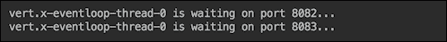

如您所见，同一线程正在两个端口上侦听。如果我们现在向每个正在运行的服务器发出请求，我们将得到硬编码的响应：

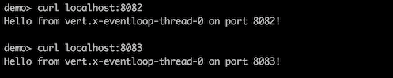

我们使用`main()`方法运行示例。一个插件`maven-shade-plugin`允许您指定您希望哪个垂直点作为应用程序的起点。以下是一个来自[的示例 http://vertx.io/blog/my-first-vert-x-3-application](http://vertx.io/blog/my-first-vert-x-3-application) ：

```java
<plugin>
  <groupId>org.apache.maven.plugins</groupId>
  <artifactId>maven-shade-plugin</artifactId>
  <version>2.3</version>
  <executions>
    <execution>
      <phase>package</phase>
      <goals>
        <goal>shade</goal>
      </goals>
      <configuration>
        <transformers>
          <transformer
            implementation="org.apache.maven.plugins.shade.resource.ManifestResourceTransformer">
            <manifestEntries>
              <Main-Class>io.vertx.core.Starter</Main-Class>
              <Main-Verticle>io.vertx.blog.first.MyFirstVerticle</Main-Verticle>
            </manifestEntries>
          </transformer>
        </transformers>
        <artifactSet/>
        <outputFile>${project.build.directory}/${project.artifactId}-${project.version}-fat.jar</outputFile>
      </configuration>
    </execution>
  </executions>
</plugin>
```

现在，运行以下命令：

```java
mvn package

```

它将生成一个指定的 JAR 文件（在本例中称为`target/my-first-app-1.0-SNAPSHOT-fat.jar`）。它被称为`fat`，因为它包含所有必要的依赖项。此文件还将包含包含以下条目的`MANIFEST.MF`：

```java
Main-Class: io.vertx.core.Starter
Main-Verticle: io.vertx.blog.first.MyFirstVerticle
```

您可以使用任何垂直体而不是本例中使用的`io.vertx.blog.first.MyFirstVerticle`，但是`io.vertx.core.Starter`必须存在，因为这是知道如何读取清单并执行指定垂直体的方法`start()`的`Vert.x`类的名称。现在，您可以运行以下命令：

```java
java -jar target/my-first-app-1.0-SNAPSHOT-fat.jar

```

此命令将执行`MyFirstVerticle`类的`start()`方法，执行方式与我们示例中的`main()`方法相同，为了简化演示，我们将继续使用该方法。

为了补充 HTTP 服务器，我们还可以创建一个 HTTP 客户端。但是，首先，我们将修改`server`垂直中的`start()`方法，以接受参数`name`：

```java
public void start() throws Exception {
    HttpServer server = vertx.createHttpServer();
    server.requestStream().toObservable()
       .subscribe(request -> request.response()
       .end("Hi, " + request.getParam("name") + 
             "! Hello from " + 
             Thread.currentThread().getName() + 
                       " on port " + port + "!\n\n")
       );
    server.rxListen(port).subscribe();
    System.out.println(Thread.currentThread().getName()
               + " is waiting on port " + port + "...");
}
```

现在，我们可以创建一个 HTTP`client`垂直链接，该垂直链接每秒发送一个请求并打印响应，持续 3 秒，然后停止：

```java
import io.vertx.rxjava.core.AbstractVerticle;
import io.vertx.rxjava.core.http.HttpClient;
import java.time.LocalTime;
import java.time.temporal.ChronoUnit;

public class Client extends AbstractVerticle {
  private int port;
  public Client(int port) {
    this.port = port;
  }
  public void start() throws Exception {
    HttpClient client = vertx.createHttpClient();
    LocalTime start = LocalTime.now();
    vertx.setPeriodic(1000, v -> {
       client.getNow(port, "localhost", "?name=Nick",
         r -> r.bodyHandler(System.out::println));
         if(ChronoUnit.SECONDS.between(start, 
                             LocalTime.now()) > 3 ){
           vertx.undeploy(deploymentID());
       }
    });
  }
}
```

假设我们按如下方式部署两个垂直轴：

```java
RxHelper.deployVerticle(vertx(), new Server2(8082));
RxHelper.deployVerticle(vertx(), new Client(8082));
```

输出结果如下：

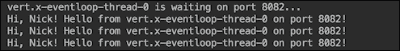

在最后一个示例中，我们演示了如何创建 HTTP 客户端和定期服务。现在，让我们为系统添加更多功能。例如，让我们添加另一个与数据库交互的垂直体，并通过我们已经创建的 HTTP 服务器使用它。

首先，我们需要添加此依赖项：

```java
<dependency>
    <groupId>io.vertx</groupId>
    <artifactId>vertx-jdbc-client</artifactId>
    <version>${vertx.version}</version>
</dependency>
```

新添加的 JAR 文件允许我们创建内存中的数据库和访问该数据库的处理程序：

```java
public class DbHandler {
  private JDBCClient dbClient;
  private static String SQL_CREATE_WHO_CALLED = 
    "CREATE TABLE IF NOT EXISTS " +
          "who_called ( name VARCHAR(10), " +
          "create_ts TIMESTAMP(6) DEFAULT now() )";
  private static String SQL_CREATE_PROCESSED = 
    "CREATE TABLE IF NOT EXISTS " +
         "processed ( name VARCHAR(10), " +
         "length INTEGER, " +
         "create_ts TIMESTAMP(6) DEFAULT now() )";

  public DbHandler(Vertx vertx){
    JsonObject config = new JsonObject()
      .put("driver_class", "org.hsqldb.jdbcDriver")
      .put("url", "jdbc:hsqldb:mem:test?shutdown=true");
    dbClient = JDBCClient.createShared(vertx, config);
    dbClient.rxGetConnection()
      .flatMap(conn -> 
                 conn.rxUpdate(SQL_CREATE_WHO_CALLED)
                       .doAfterTerminate(conn::close) )
      .subscribe(r -> 
        System.out.println("Table who_called created"),
                           Throwable::printStackTrace);
    dbClient.rxGetConnection()
      .flatMap(conn -> 
                 conn.rxUpdate(SQL_CREATE_PROCESSED)
                      .doAfterTerminate(conn::close) )
      .subscribe(r -> 
        System.out.println("Table processed created"),
                          Throwable::printStackTrace);

  }
}
```

熟悉 RxJava 的人可以看到，Vert.x 代码非常遵循 RxJava 的样式和命名约定。尽管如此，我们还是鼓励您阅读 Vert.x 文档，因为它有一个非常丰富的 API，涵盖了比刚才演示的更多的情况。在前面的代码中，操作`flatMap()`接收运行脚本的函数，然后关闭连接。在这种情况下，操作`doAfterTerminate()`的作用就像它被放在传统代码中的 finally 块中一样，如果成功或生成异常，则关闭连接。`subscribe()`方法有几个重载版本。对于我们的代码，我们选择了一个包含两个函数的函数，一个在成功的情况下执行（我们打印一条关于正在创建的表的消息），另一个在异常的情况下执行（然后我们只打印堆栈跟踪）。

要使用创建的数据库，我们可以添加到`DbHandler`方法`insert()`、`process()`和`readProcessed()`，这将允许我们演示如何构建反应式系统。方法`insert()`的代码可以如下所示：

```java
private static String SQL_INSERT_WHO_CALLED = 
             "INSERT INTO who_called(name) VALUES (?)";
public void insert(String name, Action1<UpdateResult> 
                onSuccess, Action1<Throwable> onError){
  printAction("inserts " + name);
  dbClient.rxGetConnection()
    .flatMap(conn -> 
        conn.rxUpdateWithParams(SQL_INSERT_WHO_CALLED, 
                            new JsonArray().add(name))
                       .doAfterTerminate(conn::close) )
    .subscribe(onSuccess, onError);
}
```

`insert()`方法以及我们将要编写的其他方法充分利用了 Java 函数接口。它在表`who_called`中创建一条记录（使用传入的参数`name`。然后，操作`subscribe()`执行调用此方法的代码传入的两个函数之一。我们使用`printAction()`方法只是为了更好地追溯：

```java
private void printAction(String action) {  
  System.out.println(this.getClass().getSimpleName() 
                                     + " " + action);
}
```

方法`process()`也接受两个函数，但不需要其他参数。处理表`who_called`中所有尚未处理的记录（表`processed`中未列出）：

```java
private static String SQL_SELECT_TO_PROCESS = 
  "SELECT name FROM who_called w where name not in " +
  "(select name from processed) order by w.create_ts " +
  "for update";
private static String SQL_INSERT_PROCESSED = 
     "INSERT INTO processed(name, length) values(?, ?)";
public void process(Func1<JsonArray, Observable<JsonArray>> 
                     process, Action1<Throwable> onError) {
  printAction("process all records not processed yet");
  dbClient.rxGetConnection()
    .flatMapObservable(conn -> 
       conn.rxQueryStream(SQL_SELECT_TO_PROCESS)
           .flatMapObservable(SQLRowStream::toObservable)
           .flatMap(process)
           .flatMap(js -> 
              conn.rxUpdateWithParams(SQL_INSERT_PROCESSED, js)
                  .flatMapObservable(ur->Observable.just(js)))
           .doAfterTerminate(conn::close))
    .subscribe(js -> printAction("processed " + js), onError);
}
```

如果两个线程正在读取表`who_called`以选择尚未处理的记录，SQL 查询中的子句`for update`确保每个记录只有一个得到，因此它们不会被处理两次。方法`process()`代码的显著优点是它使用`rxQUeryStream()`操作，一次一个地发出找到的记录，以便它们彼此独立地处理。在大量未处理记录的情况下，这样的解决方案可以保证结果的顺利交付，而不会造成资源消耗的急剧增加。下面的`flatMap()`操作使用传入的函数进行处理。该函数的唯一要求是必须返回一个整数值（在`JsonArray`中），该整数值将用作`SQL_INSERT_PROCESSED`语句的参数。因此，由调用此方法的代码决定处理的性质。代码的其余部分与方法`insert()`类似。代码缩进有助于跟踪操作的嵌套。

方法`readProcessed()`的代码与方法`insert()`的代码非常相似：

```java
private static String SQL_READ_PROCESSED = 
  "SELECT name, length, create_ts FROM processed 
                       order by create_ts desc limit ?";
public void readProcessed(String count, Action1<ResultSet> 
                  onSuccess, Action1<Throwable> onError) {
  printAction("reads " + count + 
                            " last processed records");
  dbClient.rxGetConnection()
   .flatMap(conn -> 
      conn.rxQueryWithParams(SQL_READ_PROCESSED, 
                          new JsonArray().add(count))
                      .doAfterTerminate(conn::close) )
   .subscribe(onSuccess, onError);
}
```

前面的代码读取指定数量的最新处理记录。与方法`process()`不同的是，方法`readProcessed()`返回一个结果集中的所有读取记录，因此该方法的用户可以决定如何批量或一次处理一个结果。我们展示所有这些可能性只是为了展示各种可能的选项。有了`DbHandler`类，我们就可以使用它并创建`DbServiceHttp`微服务，它允许通过包装 HTTP 服务器远程访问`DbHandler`功能。以下是新微服务的构造器：

```java
public class DbServiceHttp extends AbstractVerticle {
  private int port;
  private DbHandler dbHandler;
  public DbServiceHttp(int port) {
    this.port = port;
  }
  public void start() throws Exception {
    System.out.println(this.getClass().getSimpleName() + 
                            "(" + port + ") starts...");
    dbHandler = new DbHandler(vertx);
    Router router = Router.router(vertx);
    router.put("/insert/:name").handler(this::insert);
    router.get("/process").handler(this::process);
    router.get("/readProcessed")
                         .handler(this::readProcessed);
    vertx.createHttpServer()
          .requestHandler(router::accept).listen(port);
  }
}
```

在前面提到的代码中，您可以看到 URL 映射是如何在 Vert.x 中完成的。对于每个可能的路由，分配相应的`Verticle`方法，每个方法接受包含 HTTP 上下文所有数据的`RoutingContext`对象，包括`HttpServerRequest`和`HttpServerResponse`对象。各种方便的方法使我们能够轻松访问 URL 参数和处理请求所需的其他数据。以下是`start()`方法中引用的`insert()`方法：

```java
private void insert(RoutingContext routingContext) {
  HttpServerResponse response = routingContext.response();
  String name = routingContext.request().getParam("name");
  printAction("insert " + name);
  Action1<UpdateResult> onSuccess = 
    ur -> response.setStatusCode(200).end(ur.getUpdated() + 
                 " record for " + name + " is inserted");
  Action1<Throwable> onError = ex -> {
    printStackTrace("process", ex);
    response.setStatusCode(400)
        .end("No record inserted due to backend error");
  };
  dbHandler.insert(name, onSuccess, onError);
}
```

它所做的只是从请求中提取参数`name`，并构造调用前面讨论的`DbHandler`方法`insert()`所需的两个函数。方法`process()`与前面的方法`insert()`相似：

```java
private void process(RoutingContext routingContext) {
  HttpServerResponse response = routingContext.response();
  printAction("process all");
  response.setStatusCode(200).end("Processing...");
  Func1<JsonArray, Observable<JsonArray>> process = 
    jsonArray -&gt; { 
      String name = jsonArray.getString(0);
      JsonArray js = 
            new JsonArray().add(name).add(name.length());
       return Observable.just(js);
  };
  Action1<Throwable> onError = ex -> {
     printStackTrace("process", ex);
     response.setStatusCode(400).end("Backend error");
  };
  dbHandler.process(process, onError);
}
```

前面提到的函数`process`定义了如何处理`DbHandler`中方法`process()`中的`SQL_SELECT_TO_PROCESS`语句中的记录。在我们的例子中，它计算调用方名称的长度，并将其作为参数与名称本身（作为返回值）一起传递给下一个 SQL 语句，该语句将结果插入表`processed`。

以下是方法`readProcessed()`：

```java
private void readProcessed(RoutingContext routingContext) {
  HttpServerResponse response = routingContext.response();
  String count = routingContext.request().getParam("count");
  printAction("readProcessed " + count + " entries");
  Action1<ResultSet> onSuccess = rs -> {
     Observable.just(rs.getResults().size() > 0 ? 
       rs.getResults().stream().map(Object::toString)
                   .collect(Collectors.joining("\n")) : "")
       .subscribe(s -> response.setStatusCode(200).end(s) );
  };
  Action1<Throwable> onError = ex -> {
      printStackTrace("readProcessed", ex);
      response.setStatusCode(400).end("Backend error");
  };
  dbHandler.readProcessed(count, onSuccess, onError);
}
```

也就是说，（在函数`onSuccess()`的前面代码中）读取查询`SQL_READ_PROCESSED`的结果集并用于构造响应。请注意，我们首先创建一个`Observable`，然后订阅它，并将订阅结果作为响应传递给方法`end()`。否则，可以在不等待响应被构造的情况下返回响应。

现在，我们可以通过部署`DbServiceHttp`垂直线来启动我们的反应系统：

```java
RxHelper.deployVerticle(vertx(), new DbServiceHttp(8082));
```

如果这样做，我们将在输出中看到以下代码行：

```java
DbServiceHttp(8082) starts...
Table processed created
Table who_called created
```

在另一个窗口中，我们可以发出生成 HTTP 请求的命令：

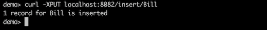

如果我们现在读取已处理的记录，则应该没有：

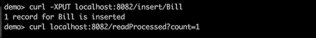

日志消息显示以下内容：

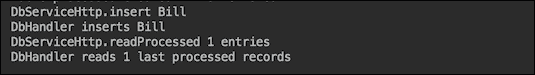

现在，我们可以请求处理现有记录，然后再次读取结果：

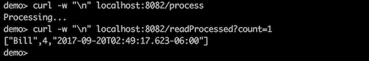

原则上，建立一个反应式系统已经足够了。我们可以在不同的端口上部署许多`DbServiceHttp`微服务，或将其群集，以提高处理能力、恢复能力和响应能力。我们可以将其他服务封装在 HTTP 客户机或 HTTP 服务器中，让它们相互通信，处理输入并沿处理管道传递结果。

然而，Vert.x 还有一个更适合消息驱动体系结构的特性（不使用 HTTP）。它被称为事件总线。任何 verticle 都可以访问事件总线，并且可以使用方法`send()`（`rxSend()`（在反应式编程的情况下）或方法`publish()`将任何消息发送到任何地址（只是一个字符串）。一个或多个垂直站点可以将自己注册为某个地址的消费者。

如果多个垂直站点是同一地址的消费者，则方法`send()`（`rxSend()`）只将消息传递给其中一个（使用循环算法选择下一个消费者）。正如您所期望的，方法`publish()`将消息传递给具有相同地址的所有消费者。让我们看一个例子，使用已经熟悉的`DbHandler`作为主要工作马。

基于事件总线的微服务与我们已经讨论过的基于 HTTP 协议的微服务非常相似：

```java
public class DbServiceBus extends AbstractVerticle {
  private int id;
  private String instanceId;
  private DbHandler dbHandler;
  public static final String INSERT = "INSERT";
  public static final String PROCESS = "PROCESS";
  public static final String READ_PROCESSED 
                              = "READ_PROCESSED";
  public DbServiceBus(int id) { this.id = id; }
  public void start() throws Exception {
    this.instanceId = this.getClass().getSimpleName()
                                     + "(" + id + ")";
    System.out.println(instanceId + " starts...");
    this.dbHandler = new DbHandler(vertx);
    vertx.eventBus().consumer(INSERT).toObservable()
      .subscribe(msg -> {
         printRequest(INSERT, msg.body().toString());
         Action1<UpdateResult> onSuccess 
                               = ur -> msg.reply(...);
         Action1<Throwable> onError 
                   = ex -> msg.reply("Backend error");
         dbHandler.insert(msg.body().toString(), 
                                 onSuccess, onError);
    });

    vertx.eventBus().consumer(PROCESS).toObservable()
        .subscribe(msg -> {
                  .....
                 dbHandler.process(process, onError);
        });

    vertx.eventBus().consumer(READ_PROCESSED).toObservable()
        .subscribe(msg -> {
                 ...
            dbHandler.readProcessed(msg.body().toString(), 
                                        onSuccess, onError);
        });
    }
```

我们通过跳过一些部分（非常类似于`DbServiceHttp`类）并试图突出显示代码结构来简化前面的代码。出于演示目的，我们将部署该类的两个实例，并分别向地址`INSERT`、`PROCESS`和`READ_PROCESSED`发送三条消息：

```java
void demo_DbServiceBusSend() {
  Vertx vertx = vertx();
  RxHelper.deployVerticle(vertx, new DbServiceBus(1));
  RxHelper.deployVerticle(vertx, new DbServiceBus(2));
  delayMs(200);
  String[] msg1 = {"Mayur", "Rohit", "Nick" };
  RxHelper.deployVerticle(vertx, 
    new PeriodicServiceBusSend(DbServiceBus.INSERT, msg1, 1));
  String[] msg2 = {"all", "all", "all" };
  RxHelper.deployVerticle(vertx, 
    new PeriodicServiceBusSend(DbServiceBus.PROCESS, msg2, 1));
  String[] msg3 = {"1", "1", "2", "3" };
  RxHelper.deployVerticle(vertx, 
     new PeriodicServiceBusSend(DbServiceBus.READ_PROCESSED, 
                                                     msg3, 1));
}
```

注意我们使用`delayMs()`方法插入的 200 毫秒延迟：

```java
void delayMs(int ms){
    try {
        TimeUnit.MILLISECONDS.sleep(ms);
    } catch (InterruptedException e) {}
}
```

延迟是必要的，以便部署和启动`DbServiceBus`垂直体（以及使用该地址注册的使用者）。否则，发送消息的尝试可能会失败，因为消费者尚未使用该地址注册。`PeriodicServiceBusSend()`垂直代码如下：

```java
public class PeriodicServiceBusSend 
                           extends AbstractVerticle {
  private EventBus eb;
  private LocalTime start;
  private String address;
  private String[] caller;
  private int delaySec;
  public PeriodicServiceBusSend(String address, 
                     String[] caller, int delaySec) {
        this.address = address;
        this.caller = caller;
        this.delaySec = delaySec;
  }
  public void start() throws Exception {
    System.out.println(this.getClass().getSimpleName() 
      + "(" + address + ", " + delaySec + ") starts...");
    this.eb = vertx.eventBus();
    this.start  = LocalTime.now();
    vertx.setPeriodic(delaySec * 1000, v -> {
       int i = (int)ChronoUnit.SECONDS.between(start,
                                    LocalTime.now()) - 1;
       System.out.println(this.getClass().getSimpleName()
          + " to address " + address + ": " + caller[i]);
       eb.rxSend(address, caller[i]).subscribe(reply -> {
         System.out.println(this.getClass().getSimpleName() 
                    + " got reply from address " + address 
                               + ":\n    " + reply.body());
          if(i + 1 >= caller.length ){
               vertx.undeploy(deploymentID());
          }
       }, Throwable::printStackTrace);
    });
  }
}
```

前面的代码每隔`delaySec`秒向一个地址发送一条消息，发送的次数相当于数组`caller[]`的长度，然后取消垂直体（自身）的部署。如果我们运行演示，输出的开始将如下所示：

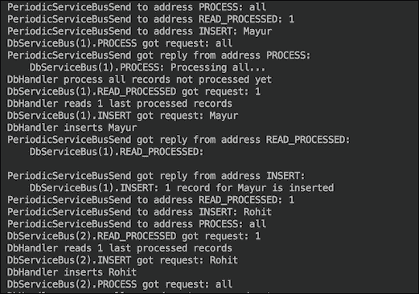

如您所见，对于每个地址，只有`DbServiceBus(1)`是第一条消息的接收者。`DbServiceBus(2)`收到了发送到同一地址的第二条消息。这就是我们前面提到的循环算法。输出的最后一部分如下所示：

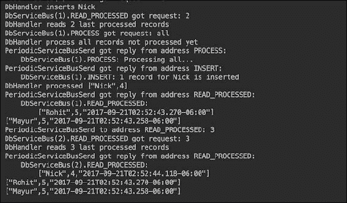

我们可以根据需要部署任意多个相同类型的垂直站点。例如，让我们部署四个向地址`INSERT`发送消息的垂直链接：

```java
String[] msg1 = {"Mayur", "Rohit", "Nick" };
RxHelper.deployVerticle(vertx, 
  new PeriodicServiceBusSend(DbServiceBus.INSERT, msg1, 1));
RxHelper.deployVerticle(vertx, 
  new PeriodicServiceBusSend(DbServiceBus.INSERT, msg1, 1));
RxHelper.deployVerticle(vertx, 
  new PeriodicServiceBusSend(DbServiceBus.INSERT, msg1, 1));
RxHelper.deployVerticle(vertx, 
  new PeriodicServiceBusSend(DbServiceBus.INSERT, msg1, 1));
```

为了查看结果，我们还将要求读取垂直轴读取最后八条记录：

```java
String[] msg3 = {"1", "1", "2", "8" };
RxHelper.deployVerticle(vertx, 
  new PeriodicServiceBusSend(DbServiceBus.READ_PROCESSED, 
                                               msg3, 1));
```

结果（输出的最后部分）将如预期的那样：

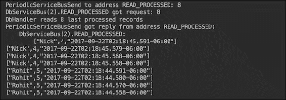

四个垂直轴发送了相同的消息，因此每个名称被发送了四次并进行了处理，这就是我们在前面的输出中看到的。

现在我们将返回到一个插入周期性垂直线，但将其从使用方法`rxSend()`更改为使用方法`publish()`：

```java
PeriodicServiceBusPublish(String address, String[] caller, int delaySec) {
  ...
  vertx.setPeriodic(delaySec * 1000, v -> {
    int i = (int)ChronoUnit.SECONDS.between(start, 
                                      LocalTime.now()) - 1;
    System.out.println(this.getClass().getSimpleName()
            + " to address " + address + ": " + caller[i]);
    eb.publish(address, caller[i]);
    if(i + 1 == caller.length ){
        vertx.undeploy(deploymentID());
    }
  });
}
```

此更改意味着必须将消息发送到在该地址注册为消费者的所有垂直站点。现在，让我们运行以下代码：

```java
Vertx vertx = vertx();
RxHelper.deployVerticle(vertx, new DbServiceBus(1));
RxHelper.deployVerticle(vertx, new DbServiceBus(2));
delayMs(200);
String[] msg1 = {"Mayur", "Rohit", "Nick" };
RxHelper.deployVerticle(vertx, 
  new PeriodicServiceBusPublish(DbServiceBus.INSERT, 
                                               msg1, 1));
delayMs(200);
String[] msg2 = {"all", "all", "all" };
RxHelper.deployVerticle(vertx, 
  new PeriodicServiceBusSend(DbServiceBus.PROCESS, 
                                               msg2, 1));
String[] msg3 = {"1", "1", "2", "8" };
RxHelper.deployVerticle(vertx, 
  new PeriodicServiceBusSend(DbServiceBus.READ_PROCESSED, 
                                               msg3, 1));
```

我们已经包括了另一个 200 毫秒的延迟，以给发布垂直发送消息的时间。现在，输出（在最后一节中）显示每条消息被处理了两次：

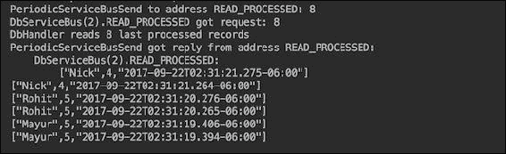

这是因为部署了两个使用者`DbServiceBus(1)`和`DbServiceBus(2)`，每个使用者都接收到一条发送到地址`INSERT`的消息，并将其插入表`who_called`中。

前面的所有示例都在一个 JVM 进程中运行。如有必要，可以在不同的 JVM 进程中部署 Vert.x 实例，并通过在 run 命令中添加`-cluster`选项进行集群。因此，它们共享事件总线，并且所有 Vert.x 实例都可以看到这些地址。这样，可以根据需要将资源添加到每个地址。例如，我们可以只增加处理微服务的数量，并补偿负载的增加。

我们前面提到的其他框架也有类似的功能。它们使微服务的创建变得容易，并可能鼓励将应用程序分解为微小的单一方法操作，以期望组装一个非常有弹性和响应性的系统。

然而，这些并不是高质量的唯一标准。系统分解增加了其部署的复杂性。此外，如果一个开发团队负责许多微服务，那么在不同阶段（开发、测试、集成测试、认证、登台、生产）对如此多的部分进行版本控制的复杂性可能会导致混乱和非常具有挑战性的部署过程，这反过来，可能会减慢使系统与市场需求保持同步所需的更改速度。

除了开发微服务外，还必须解决许多其他方面，以支持反应式系统：

*   必须设计一个监控系统来提供对应用程序状态的洞察，但它不应该太复杂，以至于将开发资源从主应用程序中抽离。
*   必须安装警报，以便及时向团队警告可能的和实际的问题，以便在影响业务之前解决这些问题。
*   如有可能，必须实施自动纠正流程。例如，系统应该能够根据当前负载添加和释放资源；在声明失败之前，必须使用合理的尝试上限来实现重试逻辑。
*   当一个组件的故障剥夺了其他组件必要的资源时，一层断路器必须保护系统免受多米诺效应的影响。
*   嵌入式测试系统应该能够引入中断并模拟处理负载，以确保应用程序的弹性和响应性不会随着时间的推移而降低。例如，Netflix 团队引入了一个**混沌猴子**系统，该系统能够关闭生产系统的各个部分，以测试恢复能力。他们甚至在生产环境中也使用它，因为生产环境具有特定的配置，而在另一个环境中进行的任何测试都不能保证找到所有可能的问题。

反应式系统设计的主要考虑因素之一是选择部署方法，该方法可以是无容器的、自包含的，也可以是容器内的。在本课程的以下部分中，我们将探讨每种方法的优缺点。

# 无容器部署

人们使用术语**容器**来指代非常不同的事物。在最初的用法中，容器是将其内容从一个位置运送到另一个位置而不改变内部任何内容的东西。然而，当引入服务器时，只强调了一个方面，即保存应用程序以容纳它的能力。此外，还增加了另一个含义，即提供支持生命的基础设施，以便容器的内容（应用程序）不仅能够生存，而且能够活动并响应外部请求。这种重新定义的容器概念被应用于 web 服务器（servlet 容器）、应用程序服务器（有或没有 EJB 容器的应用程序容器）以及为应用程序提供支持环境的其他软件设施。有时，甚至 JVM 本身也被称为容器，但这种关联并没有存在，可能是因为主动参与（执行）内容的能力与容器的原始含义不一致。

这就是为什么后来人们开始谈论无容器部署时，他们通常指的是能够直接将应用程序部署到 JVM 中，而无需首先安装 WebSphere、WebLogic、JBoss 或为应用程序提供运行时环境的任何其他中介软件。

在前面的部分中，我们描述了许多框架，这些框架允许我们构建和部署应用程序（或者更确切地说是一个反应式的微服务系统），而不需要 JVM 本身之外的任何其他容器。您需要做的就是构建一个包含所有依赖项（来自 JVM 本身的依赖项除外）的 fat JAR 文件，然后将其作为独立的 Java 进程运行：

```java
$ java -jar myfatjar.jar

```

那么，您还需要确保 JAR 文件中的`MANIFEST.MF`有一个条目`main`类，该条目指向具有`main()`方法且将在启动时运行的完全限定类名。我们已经在上一节*构建微服务*中描述了如何实现这一点。

这是承诺的编译一次在 Java 的任何地方运行，也就是说安装了某个版本或更高版本 JVM 的任何地方。这种方法有几个优点和缺点。我们将讨论它们，而不是相对于服务器容器中的传统部署。不使用传统容器进行部署的优势非常明显，一开始的许可成本要少得多（如果有的话），最后的部署和可伸缩性过程要轻得多，甚至不用说资源消耗要少得多。相反，我们将把无容器部署与传统部署进行比较，而不是与几年前开发的新一代容器中的自包含和容器内部署进行比较。

它们不仅允许包含和执行包含的代码（传统容器也这样做），还允许在不更改包含的代码的情况下将其移动到不同的位置。从现在起，我们所说的容器，将仅指新的容器。

无容器部署的优点如下：

*   在同一台物理（或虚拟或云中）机器内或在新硬件上添加更多 Java 进程都很容易
*   进程之间的隔离级别很高，这在共享环境中尤其重要，因为您无法控制其他共同部署的应用程序，并且恶意应用程序可能会试图渗透到相邻的执行环境
*   它占用的空间很小，因为它不包括应用程序本身或一组微服务之外的任何内容

无容器部署的缺点如下：

*   每个 JAR 文件都需要特定版本或更高版本的 JVM，这可能会迫使您为此而启动一个新的物理或虚拟机，以部署一个特定的 JAR 文件
*   在您无法控制的环境中，您的代码可能使用错误版本的 JVM 进行部署，这可能会导致不可预知的结果
*   同一 JVM 中的进程争夺资源，在不同团队或不同公司共享环境的情况下，资源尤其难以管理
*   当多个微服务捆绑到同一个 JAR 文件中时，它们可能需要不同版本的第三方库，甚至是不兼容的库

微服务可以每个 JAR 部署一个，也可以由团队、相关服务、规模单位或使用其他标准捆绑在一起。并非最不重要的考虑因素是此类 JAR 文件的总数。随着这一数字的增长（谷歌现在一次处理数十万个部署单元），通过简单的 bash 脚本处理部署可能变得不可能，并且需要一个复杂的过程，允许考虑可能的不兼容。如果是这样的话，那么合理地考虑使用虚拟机或容器（在他们的新化身中，见下面的部分）以更好地隔离和管理。

# 自给式微服务

自包含的微服务看起来非常类似于无容器服务。唯一的区别是，运行应用程序所需的 JVM（实际上是 JRE）或任何其他外部框架和服务器也包含在 fat JAR 文件中。有很多方法可以构建这样一个包罗万象的 JAR 文件。

例如，SpringBoot 提供了一个带有复选框列表的方便 GUI，允许您选择要打包的 SpringBoot 应用程序和外部工具的哪些部分。类似地，WildFly Swarm 允许您选择希望与应用程序捆绑在一起的 JavaEE 组件的哪些部分。或者，您可以使用`javapackager`工具自己完成。它将应用程序和 JRE 编译并打包在同一个 JAR 文件中（也可以是`.exe`或`.dmg`），以便分发。您可以在 Oracle 网站[上了解该工具 https://docs.oracle.com/javase/9/tools/javapackager.htm](https://docs.oracle.com/javase/9/tools/javapackager.htm) 或者您可以在安装了 JDK 的计算机上运行`javapackager`命令（它也随 Java 8 提供），您将获得工具选项列表及其简要说明。

基本上，要使用`javapackager`工具，您所需要做的就是准备一个包含所有您想要打包在一起的内容的项目，包括所有依赖项（打包在 JAR 文件中），并使用必要的选项运行`javapackager`命令，这些选项允许您指定您想要的输出类型（`.exe`或`.dmg`，例如），您希望捆绑在一起的 JRE 位置、要使用的图标、`MANIFEST.MF`的`main`类条目等等。还有一些 Maven 插件可以简化打包命令，因为大部分设置都必须在`pom.xml`中配置。

自包含式部署的优点如下：

*   它是一个要处理的文件（包含组成反应式系统或其某一部分的所有微服务），这对于用户和分发者来说都比较简单
*   不需要预安装 JRE，也不存在与所需版本不匹配的风险
*   隔离级别很高，因为您的应用程序有专用的 JRE，所以来自共同部署的应用程序的入侵风险最小
*   您可以完全控制捆绑包中包含的依赖项

缺点如下：

*   文件的大小更大，如果必须下载，这可能是一个障碍
*   与无容器的 JAR 文件相比，配置更加复杂
*   捆绑包必须在与目标捆绑包匹配的平台上生成，如果您无法控制安装过程，则可能会导致不匹配
*   部署在同一硬件或虚拟机上的其他进程可能占用对您的应用程序需求至关重要的资源，如果您的应用程序不是由开发它的团队下载和运行的，则这些资源尤其难以管理

# 集装箱内部署

那些熟悉**虚拟机**（**VM**）但不熟悉现代容器（如 Docker、Rocket by CoreOS、VMware Photon 或类似）的人可能会得到这样的印象，即我们在谈论 VM 的同时说容器不仅可以包含和执行包含的代码，但也可以将其移动到其他位置，而不更改所包含的代码。如果是这样，那将是一个非常恰当的假设。虚拟机确实允许所有这些，现代容器可以被视为轻量级虚拟机，因为它还允许分配资源，并提供独立机器的感觉。然而，容器并不是一个完全独立的虚拟计算机。

关键区别在于，可以作为 VM 传递的捆绑包包括整个操作系统（部署了应用程序）。因此，运行两个虚拟机的物理服务器很可能运行两个不同的操作系统。相比之下，运行三个容器化应用程序的物理服务器（或 VM）只有一个运行的操作系统，两个容器共享（只读）操作系统内核，每个容器都有自己的访问（装载）来写入它们不共享的资源。例如，这意味着启动时间要短得多，因为启动容器不需要我们启动操作系统（如 VM）。

举个例子，让我们仔细看看集装箱码头的社区领袖。2015 年，一项名为**开放容器项目**的计划被宣布，后来更名为**开放容器计划**（**OCI**，该计划得到了谷歌、IBM、亚马逊、微软、红帽、甲骨文、VMware、惠普、推特等多家公司的支持。其目的是为所有平台开发容器格式和容器运行时软件的行业标准。Docker 已将其大约 5%的代码库捐赠给该项目，因为其解决方案被选为起点。

[上有大量 Docker 文档 https://docs.docker.com](https://docs.docker.com) 。使用 Docker，可以将所有 JavaEE 容器和应用程序作为 Docker 映像包含在包中，实现与自包含部署基本相同的结果。然后，您可以使用以下命令在 Docker 引擎中启动 Docker 映像来启动应用程序：

```java
$ docker run mygreatapplication

```

它启动的过程看起来像是在物理计算机上运行操作系统，尽管它也可能发生在虚拟机内部的云中，虚拟机运行在许多不同公司和个人共享的物理 Linux 服务器上。这就是为什么隔离级别（在容器的情况下，隔离级别几乎与 VM 中的隔离级别一样高）在选择不同的部署模型时可能是至关重要的。

一个典型的建议是在每个容器中放置一个微服务，但没有什么可以阻止您在一个 Docker 映像（或任何其他容器）中放置多个微服务。然而，已经有成熟的容器管理系统（在称为**编排**的容器世界中）可以帮助您进行部署，因此拥有多个容器的复杂性虽然是一个有效的考虑因素，但如果弹性和响应能力受到威胁，则不应成为一个大障碍。其中一个名为**Kubernetes**的流行编排支持微服务注册、发现和负载平衡。Kubernetes 可以在任何云或私有基础设施中使用。

容器允许在几乎所有当前部署环境中进行快速、可靠和一致的部署，无论是您自己的基础设施还是 Amazon、Google 或 Microsoft 的云。它们还允许在开发、测试和生产阶段轻松移动应用程序。这种基础设施独立性允许您在必要时使用公共云进行开发和测试，并使用自己的计算机进行生产。

一旦创建了基本操作映像，每个开发团队就可以在上面构建他们的应用程序，从而避免环境配置的复杂性。还可以在版本控制系统中跟踪容器的版本。

使用容器的优点如下：

*   与无容器和自包含部署相比，隔离级别最高。此外，最近在增加集装箱的安全性方面做了更多的努力。
*   每个容器都由同一组命令进行管理、分发、部署、启动和停止。
*   不需要预安装 JRE，并且存在与所需版本不匹配的风险。
*   您可以完全控制容器中包含的依赖项。
*   通过添加/删除容器实例，可以直接放大/缩小每个微服务。

使用容器的缺点如下：

*   您和您的团队必须学习一套全新的工具，并更多地参与生产阶段。另一方面，这似乎是近年来的普遍趋势。

# 总结

Microservices 是一种针对高负载处理系统的新架构和设计解决方案，在亚马逊、谷歌、推特、微软、IBM 等巨头成功地将其应用于生产后，该解决方案变得非常流行。但这并不意味着你也必须采用它，但是你可以考虑新的方法，看看它中的一些或任何能帮助你的应用程序更具弹性和反应性。

使用微服务可以提供巨大的价值，但不是免费的。从需求、开发到测试再到生产，在整个生命周期中管理更多单元的需求变得越来越复杂。在致力于全面的微服务体系结构之前，先尝试一下，只实现几个微服务，然后将它们全部转移到生产环境中。然后，让它运行一段时间，评估体验。这将是非常具体的您的组织。任何成功的解决方案都不能盲目复制，而应根据您的特殊需要和能力加以采用。

与彻底的重新设计和重新架构相比，通常可以通过逐步改进现有功能来实现更好的性能和总体效率。

在下一课中，我们将讨论并演示新的 API，它可以通过提高代码的可读性和执行速度来改进代码。

# 评估

1.  通过使用 _________;对象，可以部署各种垂直站点，它们相互通信，接收外部请求，并像任何其他 Java 应用程序一样处理和存储数据，从而形成一个微服务系统。
2.  以下哪项是无容器部署的优势？

    1.  每个 JAR 文件都需要某个版本或更高版本的 JVM，这可能会迫使您为此启动一个新的物理或虚拟机，部署一个特定的 JAR 文件
    2.  在您无法控制的环境中，您的代码可能会部署一个正确版本的 JVM，这可能会导致不可预测的结果
    3.  同一 JVM 中的进程争夺资源，在不同团队或不同公司共享环境的情况下尤其难以管理
    4.  它占地面积小，因为它不包括应用程序本身或一组微服务之外的任何内容

3.  声明是真是假：跨多个微服务支持事务的一种方法是创建一个充当并行事务管理器角色的服务。
4.  以下哪些是 Java 9 中包含的 Java 框架？

    1.  阿卡
    2.  忍者
    3.  橙色
    4.  Selenium

5.  说明是真是假：与无容器和自包含部署相比，容器中的隔离级别最高。