# 第五章。利用新 API 改进代码

在之前的课程中，我们讨论了提高 Java 应用程序性能的可能方法——从使用新的命令和监视工具到添加多线程和引入反应式编程，甚至从根本上将当前解决方案重新设计为一组不规则且灵活的小型独立部署单元和微服务。在不了解您的具体情况的情况下，我们无法猜测所提供的建议中哪些对您有帮助。这就是为什么在本课中，我们将介绍 JDK 最近添加的一些内容，这些内容也会对您有所帮助。正如我们在上一课中提到的，性能和总体代码改进的提高并不总是需要我们彻底地重新设计它。微小的增量变化有时会带来比我们预期的更显著的改进。

让我们回到金字塔建筑的类比，与其试图改变将石头运送到最终目的地的物流——以缩短施工时间——通常谨慎的做法是仔细观察建筑商首先使用的工具。如果每项作业都能在一半的时间内完成，那么项目交付的总时间就可以相应缩短，即使每一块石头走的距离相同（如果不是更长的话）。

以下是我们将在本课中讨论的编程工具的改进：

*   在流上使用过滤器作为查找所需内容和减少工作负载的方法
*   一种新的堆栈遍历 API，用于以编程方式分析堆栈跟踪，以便应用自动更正
*   创建紧凑的、不可修改的集合实例的新的方便的静态工厂方法
*   新的`CompletableFuture`类作为访问异步处理结果的方式
*   JDK 9 stream API 的改进可以加快处理速度，同时提高代码的可读性

# 过滤流

`java.util.streams.Stream`接口是在 Java8 中引入的。它发射元素并支持基于这些元素执行计算的各种操作。流可以是有限的或无限的，慢的或快的。自然，始终存在一个问题，即新发射元素的速率可能高于处理速率。此外，跟上输入的能力反映了应用程序的性能。`Stream`实现通过使用缓冲器和各种其他技术调整发射和处理速率来解决背压（当元件处理速率低于其发射速率时）。此外，如果应用程序开发人员确保尽早做出处理或跳过每个特定元素的决定，以避免浪费处理资源，那么这总是很有帮助的。根据情况，可以使用不同的操作来过滤数据。

## 基本滤波

第一种也是最直接的过滤方法是使用`filter()`操作。为了演示以下所有功能，我们将使用`Senator`类：

```java
public class Senator {
    private int[] voteYes, voteNo;
    private String name, party;
    public Senator(String name, String party, 
                     int[] voteYes, int[] voteNo) {
        this.voteYes = voteYes;
        this.voteNo = voteNo;
        this.name = name;
        this.party = party;
    }
    public int[] getVoteYes() { return voteYes; }
    public int[] getVoteNo() { return voteNo; }
    public String getName() { return name; }
    public String getParty() { return party; }
    public String toString() {
        return getName() + ", P" + 
          getParty().substring(getParty().length() - 1);
    }
}
```

正如您所看到的，这个类捕获参议员的姓名、政党以及他们对每个问题的投票方式（`0`表示`No`和`1`表示`Yes`。如果针对特定问题`i`、`voteYes[i]=0`和`voteNo[i]=0`，这意味着参议员不在场。不可能为同一问题提供`voteYes[i]=1`和`voteNo[i]=1`。

假设有 100 名参议员，每一位都属于两个政党中的一个：`Party1`或`Party2`。我们可以使用这些对象来收集参议员如何使用`Senate`类对过去 10 期投票的统计数据：

```java
public class Senate {
  public static List<Senator> getSenateVotingStats(){
     List<Senator> results = new ArrayList<>();
     results.add(new Senator("Senator1", "Party1", 
                       new int[]{1,0,0,0,0,0,1,0,0,1}, 
                       new int[]{0,1,0,1,0,0,0,0,1,0}));
     results.add(new Senator("Senator2", "Party2", 
                       new int[]{0,1,0,1,0,1,0,1,0,0}, 
                       new int[]{1,0,1,0,1,0,0,0,0,1}));
     results.add(new Senator("Senator3", "Party1", 
                       new int[]{1,0,0,0,0,0,1,0,0,1}, 
                       new int[]{0,1,0,1,0,0,0,0,1,0}));
     results.add(new Senator("Senator4", "Party2", 
                       new int[]{1,0,1,0,1,0,1,0,0,1}, 
                       new int[]{0,1,0,1,0,0,0,0,1,0}));
     results.add(new Senator("Senator5", "Party1", 
                       new int[]{1,0,0,1,0,0,0,0,0,1}, 
                       new int[]{0,1,0,0,0,0,1,0,1,0}));
     IntStream.rangeClosed(6, 98).forEach(i -> {
       double r1 = Math.random();
       String name = "Senator" + i;
       String party = r1 > 0.5 ? "Party1" : "Party2";
       int[] voteNo = new int[10];
       int[] voteYes = new int[10];
       IntStream.rangeClosed(0, 9).forEach(j -> {
         double r2 = Math.random();
         voteNo[j] = r2 > 0.4 ? 0 : 1;
         voteYes[j] = r2 < 0.6 ? 0 : 1;
       });
       results.add(new Senator(name,party,voteYes,voteNo));
     });
     results.add(new Senator("Senator99", "Party1", 
                       new int[]{0,0,0,0,0,0,0,0,0,0}, 
                       new int[]{1,1,1,1,1,1,1,1,1,1}));
        results.add(new Senator("Senator100", "Party2",
                       new int[]{1,1,1,1,1,1,1,1,1,1}, 
                       new int[]{0,0,0,0,0,0,0,0,0,0}));
        return results;
    }
    public static int timesVotedYes(Senator senator){
        return Arrays.stream(senator.getVoteYes()).sum();
    }
}
```

我们对前五位参议员的统计数据进行了硬编码，以便在测试我们的过滤器并验证过滤器是否工作时，能够得到可预测的结果。我们还对最后两位参议员的投票统计数据进行了硬编码，这样我们就可以进行可预测的计数，同时寻找对十个议题中的每一个只投了`Yes`票或`No`票的参议员。我们添加了`timesVotedYes()`方法，该方法提供给定`senator`投票`Yes`的次数。

现在我们可以从`Senate`类中收集一些数据。例如，让我们看看`Senate`类中每个政党有多少成员：

```java
List<Senator> senators = Senate.getSenateVotingStats();
long c1 = senators.stream()
   .filter(s -> s.getParty() == "Party1").count();
System.out.println("Members of Party1: " + c1);

long c2 = senators.stream()
   .filter(s -> s.getParty() == "Party2").count();
System.out.println("Members of Party2: " + c2);
System.out.println("Members of the senate: " + (c1 + c2));
```

前面代码的结果因运行而异，因为我们在`Senate`类中使用了随机值生成器，所以如果您尝试运行示例，请不要期望看到完全相同的数字。重要的是，两名党员的总数应等于 100——`Senate`级参议员的总数：


表达式`s -> s.getParty()=="Party1"`是仅过滤`Party1`成员的参议员的谓词。因此，`Party2`的元素（`Senator`对象）无法通过，不包括在计数中。这很简单。

现在让我们看一个更复杂的过滤示例。让我们计算一下，每个党派有多少参议员投票支持`issue 3`：

```java
int issue = 3;
c1 = senators.stream()
  .filter(s -> s.getParty() == "Party1")
  .filter(s -> s.getVoteNo()[issue] != s.getVoteYes()[issue])
  .count();
System.out.println("Members of Party1 who voted on Issue" + 
                                          issue + ": " + c1);

c2 = senators.stream()
  .filter(s -> s.getParty() == "Party2" &&
               s.getVoteNo()[issue] != s.getVoteYes()[issue])
  .count();
System.out.println("Members of Party2 who voted on Issue" + 
                                          issue + ": " + c2);
System.out.println("Members of the senate who voted on Issue" 
                                 + issue + ": " + (c1 + c2));
```

对于`Party1`，我们使用了两个过滤器。对于`Party2`，我们将它们结合起来，只是为了展示另一种可能的解决方案。这里重要的一点是，在只选择投票人的筛选之前，先使用一方（`s -> s.getParty() == "Party1"`的筛选。这样，第二个过滤器仅用于大约一半的元件。否则，如果只选择投票人的过滤器排在第一位，它将应用于所有 100 名`Senate`成员。

结果如下所示：


同样，我们可以计算出每个政党有多少成员在`issue 3`上投票`Yes`：

```java
c1 = senators.stream()
        .filter(s -> s.getParty() == "Party1" &&
                     s.getVoteYes()[issue] == 1)
        .count();
System.out.println("Members of Party1 who voted Yes on Issue"
                                        + issue + ": " + c1);

c2 = senators.stream()
        .filter(s -> s.getParty() == "Party2" &&
                     s.getVoteYes()[issue] == 1)
        .count();
System.out.println("Members of Party2 who voted Yes on Issue"
                                        + issue + ": " + c2);
System.out.println("Members of the senate voted Yes on Issue"
                                 + issue + ": " + (c1 + c2));
```

上述代码的结果如下：


我们可以利用 Java 函数式编程功能（使用 lambda 表达式）并创建`countAndPrint()`方法来重构前面的示例：

```java
long countAndPrint(List<Senator> senators, 
       Predicate<Senator> pred1, Predicate<Senator> pred2, 
                                           String prefix) {
    long c = senators.stream().filter(pred1::test)
                              .filter(pred2::test).count();
    System.out.println(prefix + c);
    return c;
}
```

现在，所有早期代码都可以用更简洁的方式表示：

```java
int issue = 3;

Predicate<Senator> party1 = s -> s.getParty() == "Party1";
Predicate<Senator> party2 = s -> s.getParty() == "Party2";
Predicate<Senator> voted3 = 
       s -> s.getVoteNo()[issue] != s.getVoteYes()[issue];
Predicate<Senator> yes3 = s -> s.getVoteYes()[issue] == 1;

long c1 = countAndPrint(senators, party1, s -> true, 
                                   "Members of Party1: ");
long c2 = countAndPrint(senators, party2, s -> true, 
                                   "Members of Party2: ");
System.out.println("Members of the senate: " + (c1 + c2));

c1 = countAndPrint(senators, party1, voted3, 
   "Members of Party1 who voted on Issue" + issue + ": ");
c2 = countAndPrint(senators, party2, voted3, 
   "Members of Party2 who voted on Issue" + issue + ": ");
System.out.println("Members of the senate who voted on Issue"
                                 + issue + ": " + (c1 + c2));

c1 = countAndPrint(senators, party1, yes3, 
  "Members of Party1 who voted Yes on Issue" + issue + ": ");
c2 = countAndPrint(senators, party2, yes3, 
  "Members of Party2 who voted Yes on Issue" + issue + ": ");
System.out.println("Members of the senate voted Yes on Issue" 
                                 + issue + ": " + (c1 + c2));
```

我们创建了四个谓词，`party1`、`party2`、`voted3`和`yes3`，并多次使用它们作为`countAndPrint()`方法的参数。此代码的输出与前面示例的输出相同：

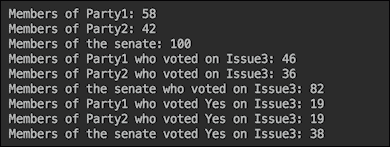

使用`Stream`接口的`filter()`方法是最常用的过滤方式。但也可以使用其他`Stream`方法来达到同样的效果。

### 使用其他流操作进行过滤

或者，或者除了上一节描述的基本过滤之外，还可以使用其他操作（`Stream`接口的方法）来选择和过滤发射的流元素。

例如，让我们使用`flatMap()`方法，根据参议院成员的党派成员筛选出他们：

```java
long c1 = senators.stream()
        .flatMap(s -> s.getParty() == "Party1" ? 
                      Stream.of(s) : Stream.empty())
        .count();
System.out.println("Members of Party1: " + c1);
```

该方法利用了`Stream.of()`（产生一个元素的流）和`Stream.empty()`工厂方法（产生一个没有元素的流，因此不会向下游排放任何东西）。或者，使用名为`Stream.ofNullable()`的新工厂方法（在 Java 9 中引入）也可以实现相同的效果：

```java
c1 = senators.stream().flatMap(s -> 
  Stream.ofNullable(s.getParty() == "Party1" ? s : null))
                                                 .count();
System.out.println("Members of Party1: " + c1);
```

`Stream.ofNullable()`方法创建一个元素流，如果不是`null`；否则，它将创建一个空流，如前一个示例中所示。前面的两个代码段——如果我们为相同的组合运行它们，则会产生相同的输出：


但是，使用可能包含或不包含值的`java.uti.Optional`类也可以获得相同的结果。如果存在一个值（而不是`null`，则其`isPresent()`方法返回`true`，而`get()`方法返回该值。下面是我们如何使用它过滤出一方的成员：

```java
long c2 = senators.stream()
  .map(s -> s.getParty() == "Party2" ? 
                         Optional.of(s) : Optional.empty())
  .flatMap(o -> o.map(Stream::of).orElseGet(Stream::empty))
  .count();
System.out.println("Members of Party2: " + c2);
```

首先，我们将一个元素（`Senator`对象）映射（转换）到一个`Optional`对象，该对象包含或不包含该值。接下来，我们使用`flatMap()`方法生成单个元素的流，或者生成一个空流，然后计算通过的元素数。在 Java 9 中，`Optional`类获得了一个新的工厂`stream()`方法，如果`Optional`对象携带非空值，该方法将生成一个元素流；否则，它将生成一个空流。使用此新方法，我们可以按如下方式重写以前的代码：

```java
long c2 = senators.stream()
  .map(s -> s.getParty() == "Party2" ? 
                         Optional.of(s) : Optional.empty())
  .flatMap(Optional::stream)
  .count();
System.out.println("Members of Party2: " + c2);
```

如果我们对相同的参议院组成运行上述两个示例，则它们会产生相同的输出：


当我们需要捕获流发出的第一个元素时，我们可以应用另一种过滤。这意味着我们在发出第一个元素后终止流。例如，让我们找到`Party1`中第一位对`issue 3`投`Yes`票的参议员：

```java
senators.stream()
  .filter(s -> s.getParty() == "Party1" &&
                            s.getVoteYes()[3] == 1)    
  .findFirst()
  .ifPresent(s -> System.out.println("First senator "
         "of Party1 found who voted Yes on issue 3: " 
                                     + s.getName()));
```

在前面的代码片段中，我们突出显示了`findFirst()`方法，它完成了所描述的工作。它返回`Optional`对象，因此我们添加了另一个`ifPresent()`操作符，仅当`Optional`对象包含非空值时才会调用该操作符。结果输出如下：


这正是我们在`Senate`类中播种数据时所期望的。

同样，我们可以使用`findAny()`方法找到任何投票`issue 3`的`senator`：

```java
senators.stream().filter(s -> s.getVoteYes()[3] == 1)
        .findAny()
        .ifPresent(s -> System.out.println("A senator " +
                 "found who voted Yes on issue 3: " + s));
```

结果也正如我们预期的那样：


它通常（但不一定）是流的第一个元素。但是人们不应该依赖这种假设，特别是在并行处理的情况下。

`Stream`接口还有三个`match`方法，虽然它们返回布尔值，但如果不需要特定对象，我们也可以使用它们进行过滤，我们只需要确定这样一个对象是否存在。这些方法的名称为`anyMatch()`、`allMatch()`和`noneMatch()`。它们中的每一个都接受一个谓词并返回一个布尔值。让我们从演示`anyMatch()`方法开始。我们将使用它来确定`Party1`中是否至少有一位`senator`对`issue 3`投了`Yes`票：

```java
boolean found = senators.stream()
       .anyMatch(s -> (s.getParty() == "Party1" && 
                             s.getVoteYes()[3] == 1));
String res = found ? 
  "At least one senator of Party1 voted Yes on issue 3"
  : "Nobody of Party1 voted Yes on issue 3";
System.out.println(res);
```

运行前面代码的结果应如下所示：


为了演示`allMatch()`方法，我们将使用它来了解`Senate`类中`Party1`的所有成员是否对`issue 3`进行了`Yes`投票：

```java
boolean yes = senators.stream()
    .allMatch(s -> (s.getParty() == "Party1" &&
                           s.getVoteYes()[3] == 1));
String res = yes ? 
  "All senators of Party1 voted Yes on issue 3"
  : "Not all senators of Party1 voted Yes on issue 3";
System.out.println(res);
```

前面代码的结果可能如下所示：


三种`match`方法中的最后一种`noneMatch()`方法将用于确定`Party1`的一些参议员是否对`issue 3`进行了`Yes`投票：

```java
boolean yes = senators.stream()
   .noneMatch(s -> (s.getParty() == "Party1" && 
                            s.getVoteYes()[3] == 1));
String res = yes ? 
  "None of the senators of Party1 voted Yes on issue 3"
  : "Some of senators of Party1 voted Yes on issue 3";
System.out.println(res);
```

前面示例的结果如下所示：


然而，在现实生活中，情况可能会大不相同，因为`Senate`类中有相当多的问题是按照党的路线投票的。

当我们需要跳过流中的所有重复元素并只选择唯一的元素时，还需要另一种类型的过滤。`distinct()`方法就是为此目的而设计的。我们将使用它查找其成员在`Senate`类中的各方的名称：

```java
senators.stream().map(s -> s.getParty())
        .distinct().forEach(System.out::println);
```

正如预期的那样，结果如下：


嗯，这不奇怪吧？

我们也可以使用`limit()`方法过滤掉`stream`中的所有元素，除了第一个元素的特定计数：

```java
System.out.println("These are the first 3 senators " 
                          + "of Party1 in the list:");
senators.stream()
        .filter(s -> s.getParty() == "Party1")
.limit(3)
        .forEach(System.out::println);

System.out.println("These are the first 2 senators "
                           + "of Party2 in the list:");
senators.stream().filter(s -> s.getParty() == "Party2")
.limit(2)
        .forEach(System.out::println);
```

如果你还记得我们是如何确定名单中的前五名参议员的，你可以预测结果如下：

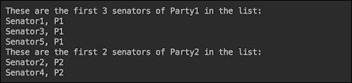

现在让我们在一个流中只找到一个元素——最大的一个。为此，我们可以使用`Stream`接口的`max()`方法和`Senate.timeVotedYes()`方法（我们将在每个参议员身上应用）：

```java
senators.stream()
   .max(Comparator.comparing(Senate::timesVotedYes))
   .ifPresent(s -> System.out.println("A senator voted "
        + "Yes most of times (" + Senate.timesVotedYes(s) 
                                            + "): " + s));
```

在前面的片段中，我们使用`timesVotedYes()`方法的结果来选择最常投票`Yes`的参议员。您可能还记得，我们已将`Yes`的所有实例分配给`Senator100`。让我们看看结果会不会是这样：


是的，我们将`Senator100`筛选为在所有 10 个议题上投票`Yes`的人。

同样，我们可以找到在所有 10 个问题上投票的参议员：

```java
senators.stream()
  .min(Comparator.comparing(Senate::timesVotedYes))
  .ifPresent(s -> System.out.println("A senator voted "
       + "Yes least of times (" + Senate.timesVotedYes(s) 
                                            + "): " + s));
```

我们预计为`Senator99`，结果如下：


这就是为什么我们在`Senate`类中硬编码了几个统计数据，这样我们就可以验证我们的查询是否正常工作。

由于最后两种方法可以帮助我们进行过滤，我们将演示 JDK9 中引入的`takeWhile()`和`dropWhile()`方法。我们将首先打印前五名参议员的所有数据，然后使用`takeWhile()`方法打印第一名参议员，直到我们遇到投票`Yes`超过四次的人，然后停止打印：

```java
System.out.println("Here is count of times the first "
                            + "5 senators voted Yes:");
senators.stream().limit(5)
  .forEach(s -> System.out.println(s + ": " 
                           + Senate.timesVotedYes(s)));
System.out.println("Stop printing at a senator who "
                     + "voted Yes more than 4 times:");
senators.stream().limit(5)
        .takeWhile(s -> Senate.timesVotedYes(s) < 5)
        .forEach(s -> System.out.println(s + ": " 
                           + Senate.timesVotedYes(s)));
```

前面代码的结果如下所示：

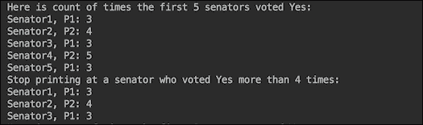

`dropWhile()`方法可用于相反的效果，即过滤掉，跳过第一位参议员，直到我们遇到投票`Yes`超过四次的人，然后继续打印所有其他参议员：

```java
System.out.println("Here is count of times the first " 
                             + "5 senators voted Yes:");
senators.stream().limit(5)
        .forEach(s -> System.out.println(s + ": " 
                            + Senate.timesVotedYes(s)));
System.out.println("Start printing at a senator who "
                      + "voted Yes more than 4 times:");
senators.stream().limit(5)
        .dropWhile(s -> Senate.timesVotedYes(s) < 5)
        .forEach(s -> System.out.println(s + ": " 
                            + Senate.timesVotedYes(s)));
System.out.println("...");
```

结果如下：

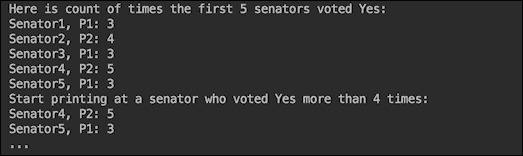

这就结束了我们对元素流过滤方式的演示。我们希望您已经学到了足够的知识，能够为您的任何过滤需求找到解决方案。尽管如此，我们还是鼓励您自己学习和试验流 API，这样您就可以保留到目前为止所学的内容，并对 Java9 的丰富 API 有自己的看法。

# 堆栈遍历 API

例外情况确实会发生，特别是在开发或软件稳定期间。但在大型复杂系统中，即使在生产环境中也可能发生异常，特别是当几个第三方系统聚集在一起时，需要以编程方式分析堆栈跟踪以应用自动更正。在本节中，我们将讨论如何实现这一点。

## Java 9 之前的堆栈分析

使用`java.lang.Thread`和`java.lang.Throwable`类的对象对堆栈跟踪进行的传统读取是通过从标准输出捕获来完成的。例如，我们可以在代码的任何部分包含这一行：

```java
Thread.currentThread().dumpStack();
```

前一行将产生以下输出：

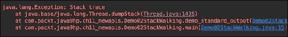

同样，我们可以在代码中包含这一行：

```java
new Throwable().printStackTrace();
```

然后，输出将如下所示：


此输出可以通过编程方式捕获、读取和分析，但需要大量自定义代码编写。

JDK 8 通过使用流使这变得更容易。下面是允许从流中读取堆栈跟踪的代码：

```java
Arrays.stream(Thread.currentThread().getStackTrace())
        .forEach(System.out::println);
```

前一行生成以下输出：

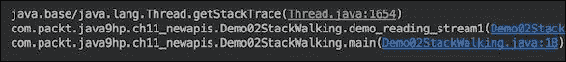

或者，我们可以使用以下代码：

```java
Arrays.stream(new Throwable().getStackTrace())
        .forEach(System.out::println);
```

前面代码的输出以类似的方式显示堆栈跟踪：

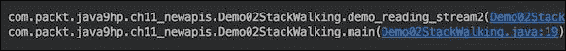

例如，如果要查找调用方类的完全限定名，可以使用以下方法之一：

```java
new Throwable().getStackTrace()[1].getClassName();

Thread.currentThread().getStackTrace()[2].getClassName();
```

这种编码是可能的，因为`getStackTrace()`方法返回`java.lang.StackTraceElement`类的对象数组，每个对象表示堆栈跟踪中的堆栈帧。每个对象都携带可通过`getFileName()`、`getClassName()`、`getMethodName()`和`getLineNumber()`方法访问的堆栈跟踪信息。

为了演示它是如何工作的，我们创建了三个类，`Clazz01`、`Clazz02`和`Clazz03`，它们相互调用：

```java
public class Clazz01 {
  public void method(){ new Clazz02().method(); }
}
public class Clazz02 {
  public void method(){ new Clazz03().method(); }
}
public class Clazz03 {
  public void method(){
    Arrays.stream(Thread.currentThread()
                        .getStackTrace()).forEach(ste -> {
      System.out.println();
      System.out.println("ste=" + ste);
      System.out.println("ste.getFileName()=" + 
                                     ste.getFileName());
      System.out.println("ste.getClassName()=" +
                                    ste.getClassName());
      System.out.println("ste.getMethodName()=" + 
                                   ste.getMethodName());
      System.out.println("ste.getLineNumber()=" + 
                                   ste.getLineNumber());
    });
  }
}
```

现在我们来调用`Clazz01`的`method()`方法：

```java
public class Demo02StackWalking {
    public static void main(String... args) {
        demo_walking();
    }
    private static void demo_walking(){
        new Clazz01().method();
    }
}
```

以下是前面代码打印的六个堆栈跟踪帧中的两个（第二个和第三个）：

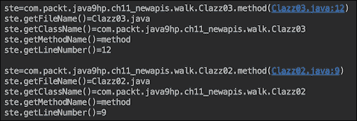

原则上，每个被调用的类都可以访问此信息。但是要找出调用当前类的类可能并不容易，因为您需要找出哪个帧代表调用方。另外，为了提供此信息，JVM 捕获整个堆栈（隐藏的堆栈帧除外），这可能会影响性能。

这就是在 JDK9 中引入`java.lang.StackWalker`类、嵌套的`Option`类和`StackWalker.StackFrame`接口的动机。

## 新的更好的方式来处理问题

`StackWalker`类有四种`getInstance()`静态工厂方法：

*   `getInstance()`：返回一个`StackWalker`类实例，配置为跳过所有隐藏帧和调用方类引用
*   `getInstance(StackWalker.Option option)`：这将创建一个`StackWalker`类实例，该实例具有指定其可以访问的堆栈帧信息的给定选项
*   `getInstance(Set<StackWalker.Option> options)`：这将创建一个具有给定选项集的`StackWalker`类实例
*   `getInstance(Set<StackWalker.Option> options, int estimatedDepth)`：这允许您传入`estimatedDepth`参数，该参数指定此实例将遍历的堆栈帧的估计数量，以便 Java 机器可以分配它可能需要的适当缓冲区大小

作为选项传递的值可以是以下值之一：

*   `StackWalker.Option.RETAIN_CLASS_REFERENCE`
*   `StackWalker.Option.SHOW_HIDDEN_FRAMES`
*   `StackWalker.Option.SHOW_REFLECT_FRAMES`

`StackWalker`类的其他三种方法如下：

*   `T walk(Function<Stream<StackWalker.StackFrame>, T> function)`：将传入函数应用于堆栈帧流，第一帧表示调用此`walk()`方法的方法
*   `void forEach(Consumer<StackWalker.StackFrame> action)`：对当前线程流的`StalkWalker.StackFrame`接口类型的每个元素执行传入操作
*   `Class<?> getCallerClass()`：获取调用方类的`Class`类的对象

如您所见，它允许更直接的堆栈跟踪分析。让我们使用以下代码修改演示类，并在一行中访问调用方名称：

```java
public class Clazz01 {
  public void method(){ 
    System.out.println("Clazz01 was called by " +
      StackWalker.getInstance(StackWalker
        .Option.RETAIN_CLASS_REFERENCE)
        .getCallerClass().getSimpleName());
    new Clazz02().method(); 
  }
}
public class Clazz02 {
  public void method(){ 
    System.out.println("Clazz02 was called by " +
      StackWalker.getInstance(StackWalker
        .Option.RETAIN_CLASS_REFERENCE)
        .getCallerClass().getSimpleName());
    new Clazz03().method(); 
  }
}
public class Clazz03 {
  public void method(){
    System.out.println("Clazz01 was called by " +
      StackWalker.getInstance(StackWalker
        .Option.RETAIN_CLASS_REFERENCE)
        .getCallerClass().getSimpleName());
  }
}
```

前面的代码将生成以下输出：

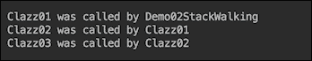

您可以欣赏解决方案的简单性。如果我们需要查看整个堆栈跟踪，我们可以在`Clazz03`中的代码中添加以下行：

```java
StackWalker.getInstance().forEach(System.out::println);
```

结果输出如下：

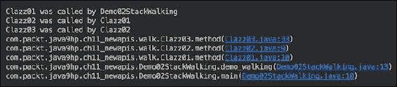

同样，仅使用一行代码，我们就获得了更具可读性的输出。我们可以使用`walk()`方法获得相同的结果：

```java
StackWalker.getInstance().walk(sf -> { 
  sf.forEach(System.out::println); return null; 
});
```

除了打印`StackWalker.StackFrame`之外，我们还可以对其进行更深入的分析，如果需要的话，使用其 API，这比`java.lang.StackTraceElement`的 API 更广泛。让我们运行打印每个堆栈帧及其信息的代码示例：

```java
StackWalker stackWalker = 
   StackWalker.getInstance(Set.of(StackWalker
                   .Option.RETAIN_CLASS_REFERENCE), 10);
stackWalker.forEach(sf -> {
    System.out.println();
    System.out.println("sf="+sf);
    System.out.println("sf.getFileName()=" + 
                                       sf.getFileName());
    System.out.println("sf.getClass()=" + sf.getClass());
    System.out.println("sf.getMethodName()=" + 
                                     sf.getMethodName());
    System.out.println("sf.getLineNumber()=" + 
                                     sf.getLineNumber());
    System.out.println("sf.getByteCodeIndex()=" +
                                  sf.getByteCodeIndex());
    System.out.println("sf.getClassName()=" + 
                                      sf.getClassName());
    System.out.println("sf.getDeclaringClass()=" + 
                                 sf.getDeclaringClass());
    System.out.println("sf.toStackTraceElement()=" +
                               sf.toStackTraceElement());
});
```

前面代码的输出如下所示：

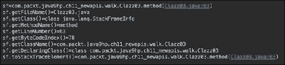

注意实现`StackWalker.StackFrame`接口的`StackFrameInfo`类，它实际执行了该任务。该 API 还允许转换回熟悉的`StackTraceElement`对象，以实现向后兼容性，并让那些习惯于此且不想改变代码和习惯的人享受。

相反，`StackWalker`类生成并存储在内存中的数组中的完整堆栈跟踪（与传统堆栈跟踪实现的情况类似），只带来请求的元素。这是其引入的另一个动机，除了已证明的简单使用。有关`StackWalker`类 API 及其用法的更多详细信息，请访问[这里](https://docs.oracle.com/javase/9/docs/api/java/lang/StackWalker.html) 。

# 方便工厂收集方法

随着 Java 中函数式编程的引入，对不可变对象的兴趣和需求增加了。传递到方法中的函数可能会在与创建它们时所处的环境大不相同的环境中执行，因此需要减少意外副作用的可能性，这使得不变性的理由更加充分。此外，Java 创建不可修改集合的方法非常冗长，因此在 Java9 中解决了这个问题。以下是在 Java 8 中创建`Set`接口的不可变集合的代码示例：

```java
Set<String> set = new HashSet<>();
set.add("Life");
set.add("is");
set.add("good!");
set = Collections.unmodifiableSet(set); 
```

在做了几次之后，对一种方便的方法的需求自然而然地成为了重构的基本考虑因素，这一点一直萦绕在任何软件专业人员的后台思维中。在 Java 8 中，前面的代码可以更改为：

```java
Set<String> immutableSet = 
  Collections.unmodifiableSet(new HashSet<>(Arrays
                          .asList("Life", "is", "good!")));
```

或者，如果 streams 是您的朋友，您可以编写以下内容：

```java
Set<String> immutableSet = Stream.of("Life","is","good!")
  .collect(Collectors.collectingAndThen(Collectors.toSet(),
                             Collections::unmodifiableSet));
```

上述代码的另一个版本如下：

```java
Set<String> immutableSet =
  Collections.unmodifiableSet(Stream.of("Life","is","good!")
                               .collect(Collectors.toSet()));
```

但是，它的样板代码多于您试图封装的值。因此，在 Java 9 中，先前代码的较短版本成为可能：

```java
Set<String> immutableSet = Set.of("Life","is","good!");
```

引入了类似的工厂来生成`List`接口和`Map`接口的不可变集合：

```java
List<String> immutableList = List.of("Life","is","good!");

Map<Integer,String> immutableMap1 = 
                   Map.of(1, "Life", 2, "is", 3, "good!");

Map<Integer,String> immutableMap2 = 
       Map.ofEntries(entry(1, "Life "), entry(2, "is"), 
                                        entry(3, "good!");

Map.Entry<Integer,String> entry1 = Map.entry(1,"Life");
Map.Entry<Integer,String> entry2 = Map.entry(2,"is");
Map.Entry<Integer,String> entry3 = Map.entry(3,"good!");
Map<Integer,String> immutableMap3 = 
                    Map.ofEntries(entry1, entry2, entry3);
```

## 为什么要采用新的工厂方法？

以更紧凑的方式表达相同功能的能力是非常有用的，但这可能不足以成为引入这些新工厂的动机。更重要的是要解决`Collections.unmodifiableList()`、`Collections.unmodifiableSet()`和`Collections.unmodifiableMap()`现有实现的弱点。尽管使用这些方法创建的集合在您尝试修改或添加/删除其元素时会抛出一个`UnsupportedOperationException`类，但它们只是传统可修改集合的包装，因此可能会受到修改的影响，具体取决于您构建它们的方式。让我们通过示例来说明这一点。顺便说一句，现有的不可修改实现的另一个缺点是它不会改变源集合的构造方式，因此`List`、`Set`和`Map`之间的区别——它们的构造方式——仍然存在，这可能是程序员使用它们时产生错误甚至挫折的原因。新的工厂方法也解决了这个问题，仅使用`of()`工厂方法（以及`Map`的附加`ofEntries()`方法）提供了更统一的方法。话虽如此，让我们回到例子。请查看以下代码段：

```java
List<String> list = new ArrayList<>();
list.add("unmodifiableList1: Life");
list.add(" is");
list.add(" good! ");
list.add(null);
list.add("\n\n");
List<String> unmodifiableList1 = 
                      Collections.unmodifiableList(list);
//unmodifiableList1.add(" Well..."); //throws exception
//unmodifiableList1.set(2, " sad."); //throws exception
unmodifiableList1.stream().forEach(System.out::print);

list.set(2, " sad. ");
list.set(4, " ");
list.add("Well...\n\n");
unmodifiableList1.stream().forEach(System.out::print);
```

直接修改`unmodifiableList1`元素的尝试导致`UnsupportedOperationException`。然而，我们可以通过底层的`list`对象修改它们。如果我们运行前面的示例，输出将如下所示：

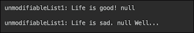

即使我们使用`Arrays.asList()`创建源列表，它也只会保护创建的集合不添加新元素，而不会修改现有元素。下面是一个代码示例：

```java
List<String> list2 = 
           Arrays.asList("unmodifiableList2: Life", 
                        " is", " good! ", null, "\n\n");
List<String> unmodifiableList2 = 
                    Collections.unmodifiableList(list2);
//unmodifiableList2.add(" Well..."); //throws exception
//unmodifiableList2.set(2, " sad."); //throws exception
unmodifiableList2.stream().forEach(System.out::print);

list2.set(2, " sad. ");
//list2.add("Well...\n\n");  //throws exception
unmodifiableList2.stream().forEach(System.out::print);
```

如果我们运行前面的代码，输出将如下所示：

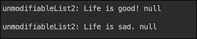

我们还包含了一个`null`元素来演示现有实现如何处理它们，因为相比之下，不可变集合的新工厂不允许包含`null`。顺便说一句，它们也不允许在`Set`中使用重复的元素（而现有的实现只是忽略它们），但我们将在稍后的代码示例中使用新的工厂方法时演示这一方面。

公平地说，也有一种方法可以使用现有的实现创建一个真正不可变的`List`接口集合。请看以下代码：

```java
List<String> immutableList1 =
        Collections.unmodifiableList(new ArrayList<>() {{
            add("immutableList1: Life");
            add(" is");
            add(" good! ");
            add(null);
            add("\n\n");
        }});
//immutableList1.set(2, " sad.");     //throws exception
//immutableList1.add("Well...\n\n");  //throws exception
immutableList1.stream().forEach(System.out::print);
```

创建不可变列表的另一种方法如下：

```java
List<String> immutableList2 =
  Collections.unmodifiableList(Stream
   .of("immutableList2: Life"," is"," good! ",null,"\n\n")
   .collect(Collectors.toList()));
//immutableList2.set(2, " sad.");     //throws exception
//immutableList2.add("Well...\n\n");  //throws exception
immutableList2.stream().forEach(System.out::print);
```

以下是早期代码的变体：

```java
List<String> immutableList3 = 
  Stream.of("immutableList3: Life",
                             " is"," good! ",null,"\n\n")
  .collect(Collectors.collectingAndThen(Collectors.toList(),
                             Collections::unmodifiableList));
//immutableList3.set(2, " sad.");     //throws exception
//immutableList3.add("Well...\n\n");  //throws exception
immutableList3.stream().forEach(System.out::print);
```

如果我们运行前三个示例，我们将看到以下输出：


请注意，虽然我们无法修改这些列表的内容，但我们可以将`null`放入其中。

`Set`的情况与我们之前看到的列表非常相似。下面的代码显示了如何修改`Set`接口的不可修改集合：

```java
Set<String> set = new HashSet<>();
set.add("unmodifiableSet1: Life");
set.add(" is");
set.add(" good! ");
set.add(null);
Set<String> unmodifiableSet1 = 
                       Collections.unmodifiableSet(set);
//unmodifiableSet1.remove(" good! "); //throws exception
//unmodifiableSet1.add("...Well..."); //throws exception
unmodifiableSet1.stream().forEach(System.out::print);
System.out.println("\n");

set.remove(" good! ");
set.add("...Well...");
unmodifiableSet1.stream().forEach(System.out::print);
System.out.println("\n");
```

即使我们将原始集合从数组转换为列表，然后再转换为集合，也可以修改`Set`接口的结果集合，如下所示：

```java
Set<String> set2 = 
   new HashSet<>(Arrays.asList("unmodifiableSet2: Life", 
                                " is", " good! ", null));
Set<String> unmodifiableSet2 = 
                       Collections.unmodifiableSet(set2);
//unmodifiableSet2.remove(" good! "); //throws exception
//unmodifiableSet2.add("...Well..."); //throws exception
unmodifiableSet2.stream().forEach(System.out::print);
System.out.println("\n");

set2.remove(" good! ");
set2.add("...Well...");
unmodifiableSet2.stream().forEach(System.out::print);
System.out.println("\n");
```

以下是运行前两个示例的输出：

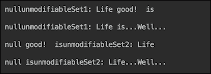

如果您没有在 Java9 中使用过集合，您可能会惊讶地看到输出中集合元素的顺序异常混乱。事实上，这是 JDK9 中引入的 set 和 maps 的另一个新特性。在过去，`Set`和`Map`实现不能保证保持元素的顺序。但通常情况下，顺序被保留下来，一些程序员编写了依赖于它的代码，从而在应用程序中引入了令人烦恼的不一致且不容易复制的缺陷。新的`Set`和`Map`实现更频繁地改变顺序，如果不是在每次新的代码运行时。这样，它在开发的早期就暴露了潜在的缺陷，并减少了其进入生产的机会。

与列表类似，即使不使用 Java9 新的不可变集工厂，我们也可以创建不可变集。一种方法如下：

```java
Set<String> immutableSet1 =
     Collections.unmodifiableSet(new HashSet<>() {{
            add("immutableSet1: Life");
            add(" is");
            add(" good! ");
            add(null);
        }});
//immutableSet1.remove(" good! "); //throws exception
//immutableSet1.add("...Well..."); //throws exception
immutableSet1.stream().forEach(System.out::print);
System.out.println("\n");
```

此外，与列表一样，还有另一种方法：

```java
Set<String> immutableSet2 =
     Collections.unmodifiableSet(Stream
        .of("immutableSet2: Life"," is"," good! ", null)
                           .collect(Collectors.toSet()));
//immutableSet2.remove(" good!");  //throws exception
//immutableSet2.add("...Well..."); //throws exception
immutableSet2.stream().forEach(System.out::print);
System.out.println("\n");
```

上述代码的另一个变体如下所示：

```java
Set<String> immutableSet3 = 
  Stream.of("immutableSet3: Life"," is"," good! ", null)
  .collect(Collectors.collectingAndThen(Collectors.toSet(),
                            Collections::unmodifiableSet));
//immutableList5.set(2, "sad.");  //throws exception
//immutableList5.add("Well...");  //throws exception
immutableSet3.stream().forEach(System.out::print);
System.out.println("\n");
```

如果我们运行刚才介绍的创建`iSet`接口的不可变集合的所有三个示例，结果如下：

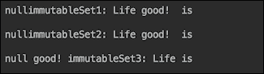

使用`Map`接口，我们只能想出一种方法来修改`unmodifiableMap`对象：

```java
Map<Integer, String> map = new HashMap<>();
map.put(1, "unmodifiableleMap: Life");
map.put(2, " is");
map.put(3, " good! ");
map.put(4, null);
map.put(5, "\n\n");
Map<Integer, String> unmodifiableleMap = 
                       Collections.unmodifiableMap(map);
//unmodifiableleMap.put(3, " sad.");   //throws exception
//unmodifiableleMap.put(6, "Well..."); //throws exception
unmodifiableleMap.values().stream()
                             .forEach(System.out::print);
map.put(3, " sad. ");
map.put(4, "");
map.put(5, "");
map.put(6, "Well...\n\n");
unmodifiableleMap.values().stream()
                             .forEach(System.out::print);
```

前面代码的输出如下所示：

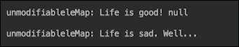

我们找到了四种方法来创建一个不使用 Java9 增强的`Map`接口的不可变集合。这是第一个例子：

```java
Map<Integer, String> immutableMap1 =
        Collections.unmodifiableMap(new HashMap<>() {{
            put(1, "immutableMap1: Life");
            put(2, " is");
            put(3, " good! ");
            put(4, null);
            put(5, "\n\n");
        }});
//immutableMap1.put(3, " sad. ");   //throws exception
//immutableMap1.put(6, "Well...");  //throws exception
immutableMap1.values().stream().forEach(System.out::print);
```

第二个例子有点复杂：

```java
String[][] mapping = 
       new String[][] {{"1", "immutableMap2: Life"}, 
                       {"2", " is"}, {"3", " good! "}, 
                          {"4", null}, {"5", "\n\n"}};

Map<Integer, String> immutableMap2 =
  Collections.unmodifiableMap(Arrays.stream(mapping)
    .collect(Collectors.toMap(a -> Integer.valueOf(a[0]), 
                          a -> a[1] == null? "" : a[1])));
immutableMap2.values().stream().forEach(System.out::print);
```

我们首先尝试使用`Collectors.toMap(a -> Integer.valueOf(a[0]), a -> a[1])`，但是`toMap()`方法使用`merge()`函数，不允许`null`作为值。因此，我们必须为`null`添加一个检查，并将其替换为空`String`值。实际上，这让我们看到了上一个代码片段的下一个版本——源数组中没有`null`值：

```java
String[][] mapping = 
    new String[][]{{"1", "immutableMap3: Life"}, 
       {"2", " is"}, {"3", " good! "}, {"4", "\n\n"}};
Map<Integer, String> immutableMap3 =
   Collections.unmodifiableMap(Arrays.stream(mapping)
     .collect(Collectors.toMap(a -> Integer.valueOf(a[0]), 
a -> a[1])));
//immutableMap3.put(3, " sad.");   //throws Exception
//immutableMap3.put(6, "Well..."); //throws exception
immutableMap3.values().stream().forEach(System.out::print);
```

上述代码的变体如下所示：

```java
mapping[0][1] = "immutableMap4: Life";
Map<Integer, String> immutableMap4 = Arrays.stream(mapping)
           .collect(Collectors.collectingAndThen(Collectors
             .toMap(a -> Integer.valueOf(a[0]), a -> a[1]),
                             Collections::unmodifiableMap));
//immutableMap4.put(3, " sad.");    //throws exception
//immutableMap4.put(6, "Well...");  //throws exception
immutableMap4.values().stream().forEach(System.out::print);
```

运行完最后四个示例后，输出如下：

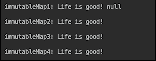

通过对现有集合实现的修订，我们现在可以讨论并欣赏 Java9 中集合的新工厂方法。

## 新的工厂方法正在发挥作用

在回顾了现有的集合创建方法之后，我们现在可以回顾并欣赏 Java9 中引入的相关 API。与上一节一样，我们从`List`接口开始。下面是使用新的`List.of()`工厂方法创建不可变列表的简单性和一致性：

```java
List<String> immutableList = 
  List.of("immutableList: Life", 
      " is", " is", " good!\n\n"); //, null);
//immutableList.set(2, "sad.");    //throws exception
//immutableList.add("Well...");    //throws exception
immutableList.stream().forEach(System.out::print);
```

从前面的代码注释中可以看到，新的 factory 方法不允许将`null`包含为列表值。

`immutableSet`创建看起来与此类似：

```java
Set<String> immutableSet = 
    Set.of("immutableSet: Life", " is", " good!");
                                      //, " is" , null);
//immutableSet.remove(" good!\n\n");  //throws exception
//immutableSet.add("...Well...\n\n"); //throws exception
immutableSet.stream().forEach(System.out::print);
System.out.println("\n");
```

从前面的代码注释中可以看出，`Set.of()`工厂方法不允许在创建`Set`接口的不可变集合时添加`null`或重复元素。

`Map`接口的不可变集合也有类似的格式：

```java
Map<Integer, String> immutableMap = 
   Map.of(1</span>, "immutableMap: Life", 2, " is", 3, " good!");
                                    //, 4, null);
//immutableMap.put(3, " sad.");    //throws exception
//immutableMap.put(4, "Well...");  //throws exception
immutableMap.values().stream().forEach(System.out::print);
System.out.println("\n");
```

`Map.of()`方法也不允许`null`作为值。`Map.of()`方法的另一个特点是，它允许对元素类型进行编译时检查，这减少了运行时出现问题的可能性。

对于那些更喜欢紧凑代码的人，这里有另一种表达相同功能的方法：

```java
Map<Integer, String> immutableMap3 = 
            Map.ofEntries(entry(1, "immutableMap3: Life"), 
                      entry(2, " is"), entry(3, " good!"));
immutableMap3.values().stream().forEach(System.out::print);
System.out.println("\n");
```

如果我们运行前面所有使用新 factory 方法的示例，则输出如下：

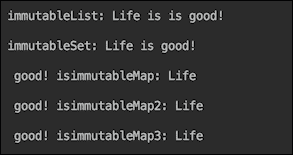

正如我们已经提到的，拥有不可变集合（包括空集合）的能力对函数式编程非常有帮助，因为此功能可以确保这样的集合不会被修改为副作用，也不会引入意外和难以跟踪的缺陷。各种各样的新工厂方法包括多达 10 个显式条目加上一个具有任意数量元素的条目。下面是它如何寻找`List`接口：

```java
static <E> List<E> of()
static <E> List<E> of(E e1)
static <E> List<E> of(E e1, E e2)
static <E> List<E> of(E e1, E e2, E e3)
static <E> List<E> of(E e1, E e2, E e3, E e4)
static <E> List<E> of(E e1, E e2, E e3, E e4, E e5)
static <E> List<E> of(E e1, E e2, E e3, E e4, E e5, E e6)
static <E> List<E> of(E e1, E e2, E e3, E e4, E e5, E e6, E e7)
static <E> List<E> of(E e1, E e2, E e3, E e4, E e5, E e6, E e7, E e8)
static <E> List<E> of(E e1, E e2, E e3, E e4, E e5, E e6, E e7, E e8, E e9)
static <E> List<E> of(E e1, E e2, E e3, E e4, E e5, E e6, E e7, E e8, E e9, E e10)
static <E> List<E> of(E... elements)
```

`Set`工厂方法类似：

```java
static <E> Set<E> of()
static <E> Set<E> of(E e1)
static <E> Set<E> of(E e1, E e2)
static <E> Set<E> of(E e1, E e2, E e3)
static <E> Set<E> of(E e1, E e2, E e3, E e4)
static <E> Set<E> of(E e1, E e2, E e3, E e4, E e5)
static <E> Set<E> of(E e1, E e2, E e3, E e4, E e5, E e6)
static <E> Set<E> of(E e1, E e2, E e3, E e4, E e5, E e6, E e7)
static <E> Set<E> of(E e1, E e2, E e3, E e4, E e5, E e6, E e7, E e8)
static <E> Set<E> of(E e1, E e2, E e3, E e4, E e5, E e6, E e7, E e8, E e9)
static <E> Set<E> of(E e1, E e2, E e3, E e4, E e5, E e6, E e7, E e8, E e9, E e10)
static <E> Set<E> of(E... elements)
```

此外，`Map`工厂方法如下：

```java
static <K,V> Map<K,V> of()
static <K,V> Map<K,V> of(K k1, V v1)
static <K,V> Map<K,V> of(K k1, V v1, K k2, V v2)
static <K,V> Map<K,V> of(K k1, V v1, K k2, V v2, K k3, V v3)
static <K,V> Map<K,V> of(K k1, V v1, K k2, V v2, K k3, V v3, K k4, V v4)
static <K,V> Map<K,V> of(K k1, V v1, K k2, V v2, K k3, V v3, K k4, V v4, K k5, V   v5
static <K,V> Map<K,V> of(K k1, V v1, K k2, V v2, K k3, V v3, K k4, V v4, K k5, V v5, K k6, V v6)
static <K,V> Map<K,V> of(K k1, V v1, K k2, V v2, K k3, V v3, K k4, V v4, K k5, V v5, K k6, V v6, K k7, V v7
static <K,V> Map<K,V> of(K k1, V v1, K k2, V v2, K k3, V v3, K k4, V v4, K k5, V v5, K k6, V v6, K k7, V v7,
K k8, V v8)
static <K,V> Map<K,V> of(K k1, V v1, K k2, V v2, K k3, V v3, K k4, V v4, K k5, V v5, K k6, V v6, K k7, V v7,
K k8, V v8, K k9, V v9)
static <K,V> Map<K,V> of(K k1, V v1, K k2, V v2, K k3, V v3, K k4, V v4, K k5, V v5, K k6, V v6, K k7, V v7,
K k8, V v8, K k9, V v9, K k10, V v10)
static <K,V> Map<K,V> ofEntries(Map.Entry<? extends K,? extends V>... entries
```

不为不可变集合添加新接口的决定使它们容易在程序员认为可以调用`add()`或`put()`时偶尔引起混淆。如果不进行测试，这种假设将导致运行时错误，抛出一个`UnsupportedOperationException`。尽管存在这种潜在的缺陷，但用于创建不可变集合的新工厂方法是对 Java 非常有用的补充。

# 支持异步处理的完整未来

`java.util.concurrent.CompletableFuture<T>`类最初是在 Java8 中引入的。这是对`java.util.concurrent.Future<T>`接口的下一级异步调用控制。它实际上实现了`Future`以及`java.util.concurrent.CompletionStage<T>`。在 Java 9 中，`CompletableFuture`通过添加新的工厂方法、对延迟和超时的支持以及改进的子类化得到了增强——我们将在后面的小节中更详细地讨论这些特性。但首先，让我们对`CompletableFuture`API 进行概述。

## 完整的未来 API 概述

`CompletableFuture`API 包含 70 多个方法，其中 38 个是`CompletionStage`接口的实现，5 个是`Future`接口的实现。由于`CompletableFuture`类实现了`Future`接口，因此可以将其视为`Future`，不会破坏基于`Future`API 的现有功能。

因此，大部分 API 来自`CompletionStage`。大多数方法返回`CompletableFuture`（在`CompletionStage`接口中返回`CompletionStage`，但在`CompletableFuture`类中实现时转换为`CompletableFuture`，这意味着它们允许链接类似于`Stream`方法在只有一个元素通过管道时所做的操作。每个方法都有一个接受函数的签名。有些方法接受`Function<T,U>`，它将应用于传入的值`T`，并返回结果`U`。其他方法接受`Consumer<T>`，接受传入值并返回`void`。但其他方法接受`Runnable`，它不接受任何输入并返回`void`。以下是其中一组方法：

```java
thenRun(Runnable action)
thenApply(Function<T,U> fn)
thenAccept(Consumer<T> action)
```

它们都返回`CompletableFuture`，携带函数或 void 的结果（在`Runnable`和`Consumer`的情况下）。它们中的每一个都有两个异步执行相同函数的伴随方法。例如，让我们以`thenRun(Runnable action)`方法为例。以下是它的同伴：

*   `thenRunAsync(Runnable action)`方法，在默认`ForkJoinPool.commonPool()`池的另一个线程中运行该操作
*   `thenRun(Runnable action, Executor executor)`方法，它在作为参数 executor 传入的池中的另一个线程中运行操作

至此，我们已经介绍了`CompletionStage`接口的九种方法。

另一组方法包括以下内容：

```java
thenCompose(Function<T,CompletionStage<U>> fn)
applyToEither(CompletionStage other, Function fn)
acceptEither(CompletionStage other, Consumer action)
runAfterBoth(CompletionStage other, Runnable action)
runAfterEither(CompletionStage other, Runnable action)
thenCombine(CompletionStage<U> other, BiFunction<T,U,V> fn)
thenAcceptBoth(CompletionStage other, BiConsumer<T,U> action)
```

这些方法在一个或两个`CompletableFuture`（或`CompletionStage`对象生成一个用作操作输入的结果后执行传入的操作。这两者都是指提供方法的`CompletableFuture`和作为方法参数传入的`CompletableFuture`。从这些方法的名称，您可以非常可靠地猜测它们的意图。我们将在下面的示例中演示其中的一些。这七个方法中的每一个都有两个用于异步处理的伙伴。这意味着我们已经描述了`CompletionStage`接口的 30 种方法（共 38 种）。

有一组两种方法通常用作终端操作，因为它们可以处理前一种方法的结果（作为`T`传入）或异常（作为`Throwable`传入）：

```java
handle(BiFunction<T,Throwable,U> fn)
whenComplete(BiConsumer<T,Throwable> action)
```

稍后我们将看到这些方法的使用示例。当链中的某个方法引发异常时，将跳过链中其他所有方法，直到遇到第一个`handle()`方法或`whenComplete()`为止。如果链中没有这两个方法，那么异常将像任何其他 Java 异常一样冒泡。这两种方法也有异步伙伴，这意味着我们已经讨论了 36 种（38 种）方法的`CompletionStage`接口。

还有一种方法只处理异常（类似于传统编程中的 catch 块）：

```java
exceptionally(Function<Throwable,T> fn)
```

此方法没有异步伙伴，就像最后剩下的方法一样：

```java
toCompletableFuture()
```

它只返回一个与此阶段具有相同属性的`CompletableFuture`对象。至此，我们已经描述了`CompletionStage`接口的所有 38 种方法。

`CompletableFuture`类中还有大约 30 个方法不属于任何实现的接口。其中一些在异步执行提供的函数后返回`CompletableFuture`对象：

```java
runAsync(Runnable runnable)
runAsync(Runnable runnable, Executor executor)
supplyAsync(Supplier<U> supplier)
supplyAsync(Supplier<U> supplier, Executor executor)
```

其他人并行执行`CompletableFuture`的多个对象：

```java
allOf(CompletableFuture<?>... cfs)
anyOf(CompletableFuture<?>... cfs)
```

还有一组生成已完成期货的方法，所以返回的`CompletableFuture`对象上的`get()`方法将不再阻塞：

```java
complete(T value)
completedStage(U value)
completedFuture(U value)
failedStage(Throwable ex)
failedFuture(Throwable ex)
completeAsync(Supplier<T> supplier)
completeExceptionally(Throwable ex)
completeAsync(Supplier<T> supplier, Executor executor)
completeOnTimeout(T value, long timeout, TimeUnit unit)
```

其余的方法执行各种其他可能有用的功能：

```java
join()
defaultExecutor()
newIncompleteFuture()
getNow(T valueIfAbsent)
getNumberOfDependents()
minimalCompletionStage()
isCompletedExceptionally()
obtrudeValue(T value)
obtrudeException(Throwable ex)
orTimeout(long timeout, TimeUnit unit)
delayedExecutor(long delay, TimeUnit unit)
```

请参阅 Oracle 官方文档，其中描述了[中`CompletableFuture`API 的这些方法和其他方法 http://download.java.net/java/jdk9/docs/api/index.html?java/util/concurrent/CompletableFuture.html](http://download.java.net/java/jdk9/docs/api/index.html?java/util/concurrent/CompletableFuture.html) 。

## Java 9 中可完成的未来 API 增强

Java 9 为`CompletableFuture`引入了几个增强功能：

*   `CompletionStage<U> failedStage(Throwable ex)`工厂方法返回在给定异常情况下完成的`CompletionStage`对象
*   `CompletableFuture<U> failedFuture(Throwable ex)`工厂方法返回在给定异常情况下完成的`CompletableFuture`对象
*   新的`CompletionStage<U> completedStage(U value)`工厂方法返回使用给定`U`值完成的`CompletionStage` 对象
*   `CompletableFuture<T> completeOnTimeout(T value, long timeout, TimeUnit unit)`如果在给定超时之前没有完成，则以给定的`T`值完成`CompletableFuture`任务
*   如果在给定超时之前未完成，则`CompletableFuture<T> orTimeout(long timeout, TimeUnit unit)`以`java.util.concurrent.TimeoutException`完成`CompletableFuture`
*   现在可以覆盖`defaultExecutor()`方法以支持另一个默认执行器
*   一种新方法`newIncompleteFuture()`使`CompletableFuture`类的子类化变得更容易

## 问题与未来解决方案

为了展示和欣赏`CompletableFuture`的威力，让我们先从一个仅使用`Future`实现的问题开始，然后看看使用`CompletableFuture`可以更有效地解决这个问题。让我们设想一下，我们的任务是为一个由四个阶段组成的建筑建模：

*   收集基础、墙壁和屋顶材料
*   安装地基
*   筑墙
*   屋顶的建造和修整

在单线程的传统顺序编程中，模型如下所示：

```java
StopWatch stopWatch = new StopWatch();
Stage failedStage;
String SUCCESS = "Success";

stopWatch.start();
String result11 = doStage(Stage.FoundationMaterials);
String result12 = doStage(Stage.Foundation, result11);
String result21 = doStage(Stage.WallsMaterials);
String result22 = doStage(Stage.Walls, 
                       getResult(result21, result12));
String result31 = doStage(Stage.RoofMaterials);
String result32 = doStage(Stage.Roof, 
                       getResult(result31, result22));
System.out.println("House was" + 
       (isSuccess(result32)?"":" not") + " built in " 
                + stopWatch.getTime()/1000\. + " sec");
```

这里，`Stage`是一个枚举：

```java
enum Stage {
    FoundationMaterials,
    WallsMaterials,
    RoofMaterials,
    Foundation,
    Walls,
    Roof
}
```

`doStage()`方法有两个重载版本。这是第一个：

```java
String doStage(Stage stage) {
    String result = SUCCESS;
    boolean failed = stage.equals(failedStage);
    if (failed) {
        sleepSec(2);
        result = stage + " were not collected";
        System.out.println(result);
    } else {
        sleepSec(1);
        System.out.println(stage + " are ready");
    }
    return result;
}
```

第二个版本如下：

```java
String doStage(Stage stage, String previousStageResult) {
  String result = SUCCESS;
  boolean failed = stage.equals(failedStage);
  if (isSuccess(previousStageResult)) {
    if (failed) {
      sleepSec(2);
      result = stage + " stage was not completed";
      System.out.println(result);
    } else {
      sleepSec(1);
      System.out.println(stage + " stage is completed");
    }
  } else {
      result = stage + " stage was not started because: " 
                                    + previousStageResult;
      System.out.println(result);
  }
  return result;
}
```

`sleepSec()`、`isSuccess()`和`getResult()`方法如下所示：

```java
private static void sleepSec(int sec) {
    try {
        TimeUnit.SECONDS.sleep(sec);
    } catch (InterruptedException e) {
    }
}
boolean isSuccess(String result) {
    return SUCCESS.equals(result);
}
String getResult(String result1, String result2) {
    if (isSuccess(result1)) {
        if (isSuccess(result2)) {
            return SUCCESS;
        } else {
            return result2;
        }
    } else {
        return result1;
    }
}
```

成功的房屋建造（如果我们运行前面的代码而不给`failedStage` 变量赋值）如下所示：

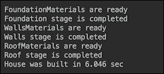

如果我们设置`failedStage=Stage.Walls`，结果如下：

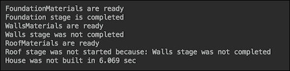

使用`Future`，我们可以缩短建造房屋所需的时间：

```java
ExecutorService execService = Executors.newCachedThreadPool();
Callable<String> t11 = 
                     () -> doStage(Stage.FoundationMaterials);
Future<String> f11 = execService.submit(t11);
List<Future<String>> futures = new ArrayList<>();
futures.add(f11);

Callable<String> t21 = () -> doStage(Stage.WallsMaterials);
Future<String> f21 = execService.submit(t21);
futures.add(f21);

Callable<String> t31 = () -> doStage(Stage.RoofMaterials);
Future<String> f31 = execService.submit(t31);
futures.add(f31);

String result1 = getSuccessOrFirstFailure(futures);

String result2 = doStage(Stage.Foundation, result1);
String result3 = 
       doStage(Stage.Walls, getResult(result1, result2));
String result4 = 
        doStage(Stage.Roof, getResult(result1, result3));
```

这里的`getSuccessOrFirstFailure()`方法如下：

```java
String getSuccessOrFirstFailure(
                      List<Future<String>> futures) {
    String result = "";
    int count = 0;
    try {
        while (count < futures.size()) {
            for (Future<String> future : futures) {
                if (future.isDone()) {
                    result = getResult(future);
                    if (!isSuccess(result)) {
                        break;
                    }
                    count++;
                } else {
                    sleepSec(1);
                }
            }
            if (!isSuccess(result)) {
                break;
            }
        }
    } catch (Exception ex) {
        ex.printStackTrace();
    }
    return result;
}
```

现在房屋的成功建造速度更快，因为材料收集同时进行：

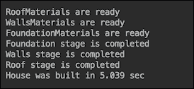

通过利用 Java 函数式编程，我们可以将实现的后半部分更改为以下内容：

```java
Supplier<String> supplier1 = 
                 () -> doStage(Stage.Foundation, result1);
Supplier<String> supplier2 = 
                () -> getResult(result1, supplier1.get());
Supplier<String> supplier3 = 
              () -> doStage(Stage.Walls, supplier2.get());
Supplier<String> supplier4 = 
                () -> getResult(result1, supplier3.get());
Supplier<String> supplier5 = 
               () -> doStage(Stage.Roof, supplier4.get());
System.out.println("House was" + 
              (isSuccess(supplier5.get()) ? "" : " not") + 
      " built in " + stopWatch.getTime() / 1000\. + " sec");
```

前面嵌套函数的链由最后一行中的`supplier5.get()`触发。它会一直阻塞，直到所有功能按顺序完成，因此没有性能改进：

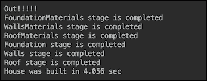

这就是我们所能做到的。现在让我们看看是否可以使用`CompletableFuture`来改进前面的代码。

## 具有完全未来的解决方案

下面是我们如何使用`CompletableFuture`API 链接相同的操作：

```java
stopWatch.start();
ExecutorService pool = Executors.newCachedThreadPool();
CompletableFuture<String> cf1 =
   CompletableFuture.supplyAsync(() -> 
           doStageEx(Stage.FoundationMaterials), pool);
CompletableFuture<String> cf2 =
   CompletableFuture.supplyAsync(() -> 
                doStageEx(Stage.WallsMaterials), pool);
CompletableFuture<String> cf3 =
   CompletableFuture.supplyAsync(() -> 
                 doStageEx(Stage.RoofMaterials), pool);
CompletableFuture.allOf(cf1, cf2, cf3)
  .thenComposeAsync(result -> 
      CompletableFuture.supplyAsync(() -> SUCCESS), pool)
  .thenApplyAsync(result -> 
                 doStage(Stage.Foundation, result), pool)
  .thenApplyAsync(result -> 
                      doStage(Stage.Walls, result), pool)
  .thenApplyAsync(result -> 
                       doStage(Stage.Roof, result), pool)
  .handleAsync((result, ex) -> {
       System.out.println("House was" +
         (isSuccess(result) ? "" : " not") + " built in " 
                 + stopWatch.getTime() / 1000\. + " sec");
       if (result == null) {
         System.out.println("Because: " + ex.getMessage());
         return ex.getMessage();
       } else {
         return result;
       }
  }, pool);
System.out.println("Out!!!!!");
```

为了使其有效，我们必须将其中一种`doStage()`方法的实现更改为`doStageEx()`方法：

```java
String doStageEx(Stage stage) {
  boolean failed = stage.equals(failedStage);
  if (failed) {
    sleepSec(2);
    throw new RuntimeException(stage + 
                          " stage was not completed");
  } else {
    sleepSec(1);
    System.out.println(stage + " stage is completed");
  }
  return SUCCESS;
}
```

我们之所以这样做是因为`CompletableFuture.allOf()`方法返回`CompletableFuture<Void>`，而我们需要将收集资料的前三个阶段的结果传达给下一个阶段。结果如下所示：


有两点需要注意：

*   我们使用专用的线程池异步运行所有操作；如果有多个 CPU 或某些操作使用 IO，而其他操作不使用 IO，结果可能会更好
*   代码片段的最后一行（`Out!!!!!`）首先出现，这意味着与建造房屋相关的所有操作链都是异步执行的

现在，让我们看看如果收集材料的第一个阶段之一失败（`failedStage = Stage.WallsMaterials`时，系统的行为：

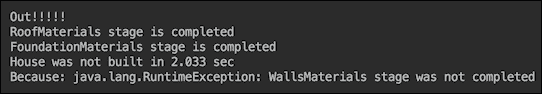

异常由`WallsMaterials`阶段抛出，并由`handleAsync()`方法捕获，正如预期的那样。同样，在打印`Out!!!!!`消息后，处理是异步完成的。

## 可完成未来的其他有用功能

`CompletableFuture`的最大优点之一是，它可以作为一个对象传递，并多次用于启动不同的操作链。为了演示此功能，让我们创建几个新操作：

```java
String getData() {
  System.out.println("Getting data from some source...");
  sleepSec(1);
  return "Some input";
}
SomeClass doSomething(String input) {
  System.out.println(
    "Doing something and returning SomeClass object...");
  sleepSec(1);
  return new SomeClass();
}
AnotherClass doMore(SomeClass input) {
  System.out.println("Doing more of something and " +
                    "returning AnotherClass object...");
  sleepSec(1);
  return new AnotherClass();
}
YetAnotherClass doSomethingElse(AnotherClass input) {
  System.out.println("Doing something else and " +
                "returning YetAnotherClass object...");
  sleepSec(1);
  return new YetAnotherClass();
}
int doFinalProcessing(YetAnotherClass input) {
  System.out.println("Processing and finally " +
                                "returning result...");
  sleepSec(1);
  return 42;
}
AnotherType doSomethingAlternative(SomeClass input) {
  System.out.println("Doing something alternative " +
               "and returning AnotherType object...");
  sleepSec(1);
  return new AnotherType();
}
YetAnotherType doMoreAltProcessing(AnotherType input) {
  System.out.println("Doing more alternative and " +
                  "returning YetAnotherType object...");
  sleepSec(1);
  return new YetAnotherType();
}
int doFinalAltProcessing(YetAnotherType input) {
  System.out.println("Alternative processing and " +
                         "finally returning result...");
  sleepSec(1);
  return 43;
}
```

这些操作的结果将通过`myHandler()`方法进行处理：

```java
int myHandler(Integer result, Throwable ex) {
    System.out.println("And the answer is " + result);
    if (result == null) {
        System.out.println("Because: " + ex.getMessage());
        return -1;
    } else {
        return result;
    }
}
```

注意操作返回的所有不同类型。现在，我们可以构建一条在某个点上分叉的链：

```java
ExecutorService pool = Executors.newCachedThreadPool();
CompletableFuture<SomeClass> completableFuture =
   CompletableFuture.supplyAsync(() -> getData(), pool)
     .thenApplyAsync(result -> doSomething(result), pool);

completableFuture
   .thenApplyAsync(result -> doMore(result), pool)
   .thenApplyAsync(result -> doSomethingElse(result), pool)
   .thenApplyAsync(result -> doFinalProcessing(result), pool)
   .handleAsync((result, ex) -> myHandler(result, ex), pool);

completableFuture
   .thenApplyAsync(result -> doSomethingAlternative(result), pool)
   .thenApplyAsync(result -> doMoreAltProcessing(result), pool)
   .thenApplyAsync(result -> doFinalAltProcessing(result), pool)
   .handleAsync((result, ex) -> myHandler(result, ex), pool);

System.out.println("Out!!!!!");
```

此示例的结果如下所示：

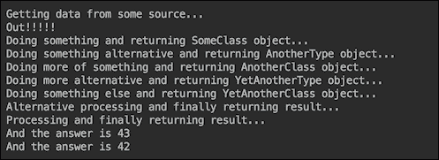

`CompletableFuture`API 提供了一个非常丰富且经过深思熟虑的 API，除其他外，它支持反应式微服务的最新趋势，因为它允许在数据进入时完全异步地处理数据，在需要时分割流，并进行缩放以适应输入的增加。我们鼓励您学习这些示例（本书附带的代码中提供了更多示例）并查看[中的 APIhttp://download.java.net/java/jdk9/docs/api/index.html?java/util/concurrent/CompletableFuture.html](http://download.java.net/java/jdk9/docs/api/index.html?java/util/concurrent/CompletableFuture.html) 。

# 流 API 改进

Java 9 中大多数新的`Stream`API 特性已经在描述`Stream`过滤的部分中演示过。为了提醒您，下面是我们基于 JDK 9 中的`Stream`API 改进演示的示例：

```java
long c1 = senators.stream()
        .flatMap(s -> Stream.ofNullable(s.getParty() 
                              == "Party1" ? s : null))
        .count();
System.out.println("OfNullable: Members of Party1: " + c1);

long c2 = senators.stream()
        .map(s -> s.getParty() == "Party2" ? Optional.of(s) 
                                        : Optional.empty())
        .flatMap(Optional::stream)
        .count();
System.out.println("Optional.stream(): Members of Party2: "
                                                      + c2);

senators.stream().limit(5)
        .takeWhile(s -> Senate.timesVotedYes(s) < 5)
        .forEach(s -> System.out.println("takeWhile(<5): " 
                     + s + ": " + Senate.timesVotedYes(s)));

senators.stream().limit(5)
         .dropWhile(s -> Senate.timesVotedYes(s) < 5)
        .forEach(s -> System.out.println("dropWhile(<5): " 
                     + s + ": " + Senate.timesVotedYes(s)));
```

我们唯一没有提到的是新的重载`iterate()`方法：

```java
static <T> Stream<T> iterate(T seed, UnaryOperator<T> f)
```

其用法示例如下：

```java
String result = 
    IntStream.iterate(1, i -> i + 2)
             .limit(5)
             .mapToObj(i -> String.valueOf(i))
             .collect(Collectors.joining(", "));
System.out.println("Iterate: " + result);
```

我们必须添加`limit(5)`，因为`iterate()`方法的这个版本创建了一个无限的整数流。上述代码的结果如下所示：


在 Java 9 中，添加了一个重载的`iterate()`方法：

```java
static <T> Stream<T> iterate(T seed, 
     Predicate<? super T> hasNext, UnaryOperator<T> next)
```

如您所见，它现在有一个`Predicate`功能接口作为参数，允许根据需要限制流。例如，下面的代码生成的结果与前面的示例中的`limit(5)`完全相同：

```java
String result = 
   IntStream.iterate(1, i -> i < 11, i -> i + 2)
            .mapToObj(i -> String.valueOf(i))
            .collect(Collectors.joining(", "));
System.out.println("Iterate: " + result);
```

请注意，stream 元素的类型不需要是整数。它可以是源代码生成的任何类型。因此，新的`iterate()`方法可用于提供终止任何类型数据流的标准。

# 总结

在本课中，我们介绍了 Java9 引入的新特性领域的很多内容。首先，我们研究了许多流式过滤的方法，从基本的`filter()`方法开始，最后使用 JDK9 中添加的`Stream`API。然后，您学习了使用新的`StackWalker`类分析堆栈跟踪的更好方法。讨论通过具体示例进行了说明，这些示例有助于您了解真正的工作代码。

我们使用了相同的方法，同时介绍了新的方便的工厂方法来创建不可变集合，以及`CompletableFuture`类及其在 JDK 9 中的增强所附带的异步处理的新功能。

最后，我们列举了对`Stream`API 的改进——我们在过滤代码示例和新的`iterate()`方法中演示了这些改进。

有了这些，我们就到了这本书的结尾。现在，您可以尝试将学到的技巧和技术应用到项目中，或者，如果不适合，可以构建自己的 Java 项目以获得高性能。在这样做的同时，试着解决真正的问题。这将迫使你学习新的技能和框架，而不仅仅是应用你已经掌握的知识，尽管后者也很有用——它会让你的知识保持新鲜和实用。

最好的学习方法是自己动手。随着 Java 的不断改进和扩展，请注意 Packt 的本书和类似书籍的新版本。

# 评估

1.  Java 8 中引入了 _____________________。
2.  `StackWalker`类的以下哪个工厂方法创建了一个`StackWalker`类实例，该实例具有指定它可以访问的堆栈帧信息的给定选项？

    1.  `getInstance()`
    2.  `getInstance(StackWalker.Option option)`

    4.  `getInstance(Set<StackWalker.Option> options, int estimatedDepth)`

3.  说明正确与否：`CompletableFuture`API 包含许多方法，这些方法是`CompletionStage`接口的实现，是`Future`的实现。
4.  当需要某种类型的筛选来跳过流中的所有重复元素并仅选择唯一元素时，将使用以下方法之一。

    1.  `distinct()`
    2.  `unique()`
    3.  `selectall()`
    4.  `filtertype()`

5.  说明是真是假：`CompletableFuture`的一大优点是它可以作为对象传递，并多次用于启动不同的操作链。