# 四、您的第一个 Java 项目

在前几章中，您学习了很多关于 Java 的知识，包括它的基本方面和主要工具。现在，我们将应用所获得的知识来完成并向创建 Java 项目的实际程序迈出第一步。我们将向您展示如何编写应用程序代码，如何测试它，以及如何执行主代码及其测试。

在本章中，我们将介绍以下主题：

*   什么是项目？
*   创建项目
*   编写和构建应用程序代码
*   执行和单元测试应用程序
*   练习：JUnit`@Before`和`@After`注释

# 什么是项目？

让我们从术语 project 的定义和起源开始。

# 项目的定义和起源

根据牛津词典的一篇英语文章，术语*项目*是*为实现特定目标而精心策划的个人或合作企业*。IDE 的设计者采用了这个术语，意思是组成应用程序的文件集合。这就是为什么术语 project 也经常被用作应用程序的同义词。

# 项目相关术语

构成项目的文件存储在文件系统的目录中。最顶层的目录称为*项目根目录*，其余项目目录在其下方形成一棵树。这就是为什么一个项目也可以被看作是一个目录树，其中包含所有的`.java`文件和其他文件，这些文件包括应用程序及其测试的源代码。非 Java 文件通常称为`resources`，存储在同名目录中。

程序员还使用术语*源代码树*、*源代码*或只是*源代码*作为项目的同义词。

当一个项目使用另一个项目的类时，它们被打包在一个`.jar`文件中，通常构成一个*库*（一个或多或少独立类的集合）或*框架*（一个为支持某些功能而设计的类系统）。库和框架之间的差异不会影响项目访问其类的方式，因此从现在起，为了简洁起见，我们将调用项目库使用的所有第三方`.jar`文件。在*Maven 项目配置*部分，我们将向您展示如何访问这些库，如果您的代码需要它们。

# 项目的生命周期

Java 项目生命周期包括以下阶段（步骤、阶段）：

*   可行性：确定是否继续进行项目时
*   需求收集和高级设计
*   班级级设计：*开发阶段第一阶段*
*   项目创建
*   编写应用程序代码及其单元测试
*   项目建设：代码汇编
*   将源代码存储在远程存储库中并与其他程序员共享
*   项目打包：将`.class`文件和所有支持的非 Java 文件收集到一个`.jar`文件中，该文件通常被称为*项目工件*或只是一个*工件*
*   项目安装：将工件保存在二进制存储库（也称为*和**工件库*）中，从中可以检索工件并在其他程序员之间共享。此阶段是开发阶段的最后一个阶段

*   测试环境中的项目部署和执行；将工件放置在一个可以在类似于生产的条件下执行和测试的环境中，*这是测试阶段*
*   生产环境中的项目部署和执行：*这是生产（也称为维护）阶段的第一阶段*
*   项目增强和维护：修复缺陷并向应用程序添加新功能
*   在不再需要项目后关闭项目

在本书中，我们只讨论了四个项目阶段：

*   项目设计（见[第 8 章](08.html)、*面向对象设计（OOD）原则*）
*   项目创建
*   编写应用程序代码及其单元测试
*   项目构建，这是一个使用`javac`工具的代码编译

我们将向您展示如何使用 IntelliJ IDEA 社区版执行所有这些阶段，但其他 IDE 也有类似的过程。

IDE 使用 Java 编译器（即`javac`工具）和依赖项管理工具来构建项目。后者在`javac`和`java`命令中设置`-classpath`选项的值。三种最流行的依赖关系管理工具是 Maven、Gradle 和 Ant。IntelliJ IDEA 具有内置的 Maven 功能，不需要安装外部依赖关系管理工具。

# 创建项目

有几种方法可以在 IntelliJ IDEA（或任何其他 IDE）中创建项目：

*   使用项目向导（请参见*使用项目向导创建项目*部分）
*   从文件系统读取现有源代码
*   从源代码管理系统读取现有源代码

在本书中，我们将仅使用项目向导引导您完成第一个选项。另外两个选项只是一步到位，不需要太多解释。在学习如何手动创建项目后，您将了解在从现有源自动创建项目的过程中，幕后会发生什么。

# 使用项目向导创建项目

除第一次外，当您启动 IntelliJ IDEA 时，它将显示已创建项目的列表。否则，您将仅看到以下屏幕：


这三个选项–导入项目、打开和从版本控制检出–允许您处理现有项目。我们不打算在本书中使用它们。

单击“创建新项目”链接，进入项目创建向导的第一个屏幕。选择左上角的 Java，然后单击右上角的 New 按钮，并选择计算机上安装的 JDK 的位置。之后，单击右下角的“确定”按钮。

在下一个窗口中，不要选择任何内容，只需单击“下一步”按钮：


您在前面的屏幕截图中看不到“下一步”按钮，因为它位于实际屏幕的底部，其余部分是空白，我们决定不在此处显示。

在下一个屏幕上，在上面的字段中输入项目名称（通常是您的应用程序名称），如下所示：

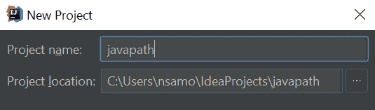

对于我们的演示代码，我们选择了项目（应用程序）名称为`javapath`，即 Java 编程的路径。单击前面屏幕底部的 Finish（完成）按钮，您将看到如下内容：


如果在左侧窗格中看不到项目结构，请单击“视图”（在最顶部的菜单中），然后单击“工具窗口”，然后单击“项目”，如以下屏幕截图所示：


现在，您应该能够看到项目结构：

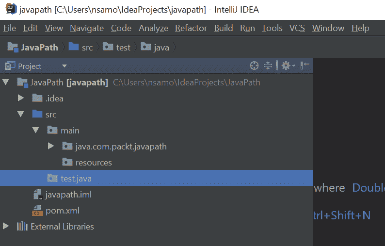

上述项目包括：

*   保存项目 IntelliJ IDEA 设置的`.idea`目录
*   `src`目录，带子目录：
    *   `main`，将您的应用程序文件保存在其`java`子目录（对于`.java`文件）和`resources`子目录（对于其他类型的文件），
    *   `test`，它将在其`java`（对于`.java`文件）和`resources`子目录（对于其他类型的文件）中保存应用程序的测试。
*   `javapath.iml`文件，这是另一个带有项目配置的 IntelliJ IDEA 文件
*   `External Libraries`目录，其中包含项目正在使用的所有库

在前面的屏幕截图中，您还可以看到`pom.xml`文件。此文件用于描述代码所需的其他库。我们将在*Maven 项目配置*部分解释如何使用它。IDE 自动生成它，因为在上一章中，在配置 IDE 时，我们表示希望在 IDE 默认设置中与 Maven 集成。如果您还没有这样做，现在可以右键单击项目名称（`JavaPath`，在我们的例子中）并选择添加框架支持：

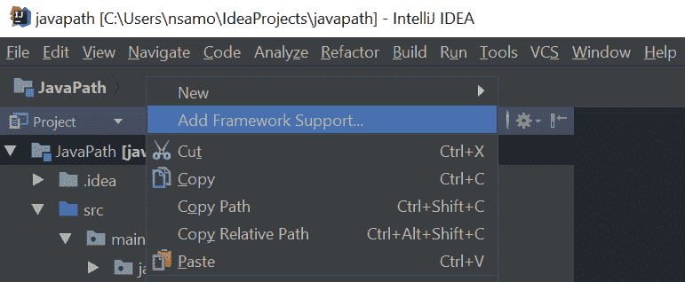

然后，您将看到一个屏幕，您可以在其中选择 Maven：


点击确定按钮，将创建`pom.xml`文件。如果`pom.xml`文件没有 Maven 符号，则应遵循相同的步骤，如前面的屏幕截图所示。以下是添加 Maven 支持后的情况：


触发`pom.xml`创建的另一种方式是响应右下角的一个小窗口，该窗口弹出各种建议，包括 Add as Maven Project（这意味着代码依赖项将由 Maven 管理）：


如果您没有单击前面的链接，您仍然可以通过单击底线处的链接来恢复建议：


它将把建议带回到屏幕的左下角：


点击 AddasMaven 项目链接，将创建`pom.xml`文件。

另一个有用的建议如下所示：


建议您单击“启用自动导入”链接。它将允许 IDE 更好地支持您的项目，使您不必手动完成某些事情。

如果上述方法都不适用于您，则始终可以手动创建`pom.xml`文件。只需右键单击左侧窗格中的项目名称（`JavaPath`，选择新建，选择文件，然后键入文件名`pom.xml`，然后单击确定按钮。

# Maven 项目配置

正如我们已经提到的，Maven 在编译和运行应用程序时帮助编写`javac`和`java`命令。设置`-classpath`选项的值。为了实现这一点，Maven 从`pom.xml`中读取项目所需的库列表。正确指定这些库是您的责任。否则，Maven 将无法找到它们。

默认情况下，`pom.xml`文件位于项目根目录中。这也是 IDE 运行`javac`命令并在类路径上设置`src/main/java`目录的目录，以便`javac`可以找到项目的源文件。它将编译后的`.class`文件也放在`target/classes`目录下的根目录中，并在执行`java`命令时将该目录设置在类路径上。

`pom.xml`的另一个功能是描述您的项目，以便在您计算机上的所有其他项目中，甚至在 internet 上的所有其他项目中，可以唯一地识别该项目。这就是我们现在要做的。让我们看看`pom.xml`文件的内部：

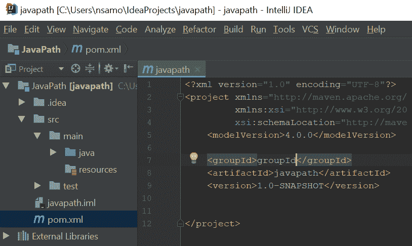

您可以看到标识项目的三个 XML 标记：

*   `groupId`标识组织或开源社区中的一组项目
*   `artifactId`识别集团内的特定项目
*   `version`标识项目的版本

`groupId`标记中设置的值必须遵循包命名约定，因此现在，我们需要解释包是什么。包是 Java 应用程序最大的结构单元。每个包对相关的 Java 类进行分组。不同包中的两个不同类可以具有相同的名称。这就是包也称为命名空间的原因。

包名称必须是唯一的。它使我们能够正确识别一个类，即使在类路径上列出的其他包中存在同名的类。包可以有多个子包。它们以类似于文件系统目录结构的层次结构进行组织。包含所有其他包的包称为顶级包。其名称用作`pom.xml`文件的`groupId`标记值。

包命名约定要求顶级包名称基于创建包的组织的 internet 域名（按相反顺序）。例如，如果域名是`oracle.com`，那么顶级包名必须是`com.oracle`，后跟（在一个点之后，`.`）项目名。或者，可以在反向域名和项目名称之间插入子域、部门名称或任何其他项目组。然后，其他子包也随之出现。

JDK 标准库的许多包，例如以`jdk`、`java`或`javax`开头。但最佳实践是遵循 Java 规范（[第$6.1 节中定义的命名约定 https://docs.oracle.com/javase/specs](https://docs.oracle.com/javase/specs) ）。

当一个开源项目在没有考虑任何组织的情况下启动时，选择一个唯一的包名可能会有问题。在这种情况下，程序员经常使用`org.github.<author's name>`或类似的东西。

在我们的项目中，我们有一个顶级的`com.packt.javapath`包。这样做，我们冒了一点风险，因为另一个 Packt 作者可能会决定以相同的名称启动包。最好从`com.packt.nicksamoylov.javapath`开始我们的套餐。这样，作者的名字将解决可能的冲突，当然，除非另一个同名作者开始为 Packt 编写 Java 书籍。但是，为了简洁起见，我们决定冒险。此外，我们认为我们在本书中创建的代码不会被其他项目使用。

因此，我们项目的`groupId`标签值为`com.packt.javapath`。

`artifactId`标记值通常设置为项目名称。

`version`标记值包含项目版本。

`artifactId`和`version`用于在项目包装过程中形成`.jar`文件名。例如，如果项目名称为`javapath`且版本为`1.0.0`，则`.jar`文件名将为`javapath-1.0.0.jar`。

所以我们的`pom.xml`现在看起来是这样的：

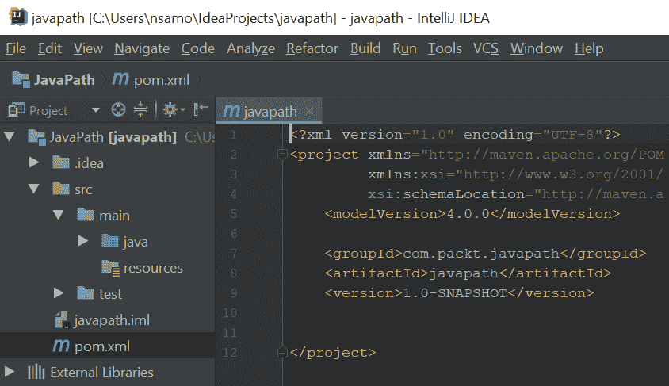

注意版本中的`-SNAPSHOT`后缀。只有当您与其他程序员共享同一个项目时，它的有用性才会变得明显。但我们现在将解释它，以便您理解此值的用途。当创建项目的工件（一个`.jar`文件）时，其名称将为`javapath-1.0-SNAPSHOT.jar`。文件名中出现的`-SNAPSHOT`表示这是一项正在进行的工作，代码在不同的版本中不断变化。这样，使用您的工件的其他 Maven 管理的项目将在`.jar`文件上的时间戳每次更改时下载它。

当代码稳定且更改很少时，您可以将版本值设置为`1.0.0`，并且仅当代码更改且发布新的项目版本时才进行更改，例如`javapath-1.0.0.jar`、`javapath-1.0.1.jar`或`javapath-1.2.0.jar`。然后，其他使用 javapath`.jar`文件的项目不会自动下载新的文件版本。相反，其他项目的程序员可以阅读每个新版本的发行说明，并决定是否使用它；新版本可能会引入不需要的更改，或者与应用程序代码不兼容。如果他们决定需要一个新版本，他们会在项目的`dependencies`标签中的`pom.xml`文件中进行设置，然后 Maven 为他们下载。

在我们的`pom.xml`文件中，还没有`dependencies`标签。但它可以放在`<project>...</project>`标签内的任何地方。让我们看一下`pom.xml`文件中依赖关系的几个示例。我们现在可以将它们添加到项目中，因为我们稍后将使用它们：

```java
<dependencies>
  <dependency>
    <groupId>org.junit.jupiter</groupId>
    <artifactId>junit-jupiter-api</artifactId>
    <version>5.1.0-M1</version>
  </dependency>
  <dependency>
    <groupId>org.postgresql</groupId>
    <artifactId>postgresql</artifactId>
    <version>42.2.2</version>
  </dependency>
  <dependency>
    <groupId>org.apache.commons</groupId>
    <artifactId>commons-lang3</artifactId>
    <version>3.4</version>
  </dependency>
</dependencies>
```

第一个`org.junit.jupiter`依赖项是指一个`junit-jupiter-api-5.1.0-M1.jar`文件，其中包含编写测试所需的`.class`文件。我们将在下一节中使用它，*编写应用程序代码并测试*。

第二个`org.postgresql`依赖关系是指一个`postgresql-42.2.2.jar`文件，它允许我们连接 PostgreSQL 数据库并使用它。我们将在[第 16 章](16.html)、*数据库编程*中使用此依赖关系。

第三个依赖关系是指`org.apache.commons`文件`commons-lang3-3.4.jar`，其中包含许多称为实用程序的非常有用的小方法，其中一些我们将慷慨地用于各种目的。

这些`.jar`文件都存储在互联网上的存储库中。默认情况下，Maven 将搜索自己位于[的中央存储库 http://repo1.maven.org/maven2](http://repo1.maven.org/maven2) 。您需要的绝大多数库都存储在那里。但在极少数情况下，除了 Maven central 存储库之外，您还需要指定其他存储库，您可以按如下方式执行：

```java
<repositories>
  <repository>
    <id>my-repo1</id>
    <name>your custom repo</name>
    <url>http://jarsm2.dyndns.dk</url>
  </repository>
  <repository>
    <id>my-repo2</id>
    <name>your custom repo</name>
    <url>http://jarsm2.dyndns.dk</url>
  </repository>
</repositories>
```

阅读 Maven 指南，了解更多关于 Maven 的详细信息，请访问[http://maven.apache.org/guides](http://maven.apache.org/guides) 。

配置了`pom.xml`文件后，我们就可以开始为第一个应用程序编写代码了。但在此之前，我们想介绍一下如何定制 IntelliJ IDEA 的配置，以匹配您对 IDE 外观和其他功能的偏好。

# 随时更改 IDE 设置

您可以随时更改 IntelliJ IDEA 设置和项目配置，以将 IDE 的外观和行为调整为最适合您的样式。慢慢来，看看您可以在以下每个配置页面上设置什么。

要更改 IntelliJ IDEA 本身的配置，请执行以下操作：

*   在 Windows 上：单击最顶部菜单上的文件，然后选择设置
*   在 Linux 和 macOS 上：单击最上面菜单上的 IntelliJ IDEA，然后选择 Preferences

您访问的配置屏幕将类似于以下内容：

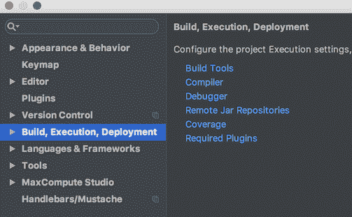

单击此处查看您可以做什么，以便了解 IDE 的可能性。

要更改特定于项目的设置，请单击“文件”，然后选择“项目结构”，然后查看可用的设置和选项。请注意，通过右键单击项目名称（在左窗格中），然后选择“打开模块设置”，可以访问相同的屏幕。

在建立了自己的样式并了解了自己的首选项后，可以通过文件|其他设置|默认设置将它们设置为 IDE 配置的默认设置。

默认项目结构也可以通过文件|其他设置|默认项目结构进行设置。每次创建新项目时，将自动应用这些默认设置。

这样，我们就可以开始编写应用程序代码了。

# 编写应用程序代码

这是程序员职业中最有趣的活动。这就是本书的目的——帮助您更好地编写 Java 代码。

让我们从第一个应用程序的要求开始。以整数作为输入，乘以`2`，并按以下格式打印结果：`<the input number> * 2 = <result>`。

现在，让我们来设计一下。我们将使用`multiplyByTwo(int i)`方法创建`SimpleMath`类，该方法将接受一个整数并返回结果。此方法将由`MyApplication`类的`main()`方法调用。`main()`方法应：

*   从用户处接收输入号码
*   将输入值传递到`multiplyByTwo(int i)`方法中
*   得到结果
*   以所需格式在屏幕上打印

我们还将为`multiplyByTwo(int i)`方法创建测试，以确保我们编写的代码正确工作。

我们将首先创建目录来保存我们的`.java`文件。目录路径必须与每个类的包名匹配。我们已经讨论过一个包，并将顶级包名设置为`groupId`值。现在，我们将描述如何在`.java`文件中声明它。

# Java 包声明

包声明是任何 Java 类的第一行。它以`package`关键字开头，后跟包名。`javac`和`java`工具使用完全限定的类名在类路径上搜索一个类，该类名是一个类名，其前面附加了包名。例如，如果我们将`MyApplication`类放入`com.packt.javapath.ch04demo`包中，则该类的完全限定名将为`com.packt.javapath.ch04demo.MyApplication`。你可以猜到，`ch04demo`代表第四章的*演示代码*。这样，我们可以在不同的章节中使用相同的类名，并且它们不会冲突。这就是包名在类路径上唯一标识类的方式。

包的另一个功能是定义`.java`文件相对于`src\main\java`目录（对于 Windows）或`src/main/java`目录（对于 Linux）的位置。包名称必须与属于此包的文件的路径匹配：

```java
src\main\java\com\packt\javapath\ch04demo\MyApplication.java (for Windows)

src/main/java/com/packt/javapath/ch04demo/MyApplication.java (for Linux) 
```

包名称和文件位置之间的任何不匹配都会触发编译错误。当您使用 IDE 向导创建一个新类时（在右键单击包名之后），IDE 会自动将正确的包声明添加到`.java`文件的第一行。但是如果您在不使用 IDE 的情况下创建了一个新的源文件，那么您有责任匹配包名和`.java`文件位置。

如果`.java`文件位于`src\main\java`目录（对于 Windows）或`src/main/java`目录（对于 Linux），则可以不声明包名。Java 规范将这样的包称为默认包。使用默认包仅适用于小型或临时应用程序，因为随着类数量的增加，一百个甚至一千个文件的简单列表变得不可管理。此外，如果您编写供其他项目使用的代码，如果没有包名，这些其他项目将无法引用您的类。在[第 7 章](07.html)、*包和可访问性（可见性）*中，我们将对此进行更多讨论。

`.class`文件的目录树是在编译过程中由`javac`工具创建的，它反映了`.java`文件的目录结构。Maven 在项目根目录中创建一个`target`目录，其中包含一个子目录`classes`。Maven 然后将该子目录指定为生成文件的输出位置，在`javac`命令中使用`-d`选项：

```java
//For Windows:
javac -classpath src\main\java -d target\classes 
 com.packt.javapath.ch04demo.MyApplication.java

//For Linux:
javac -classpath src/main/java -d target/classes 
 com.packt.javapath.ch04demo.MyApplication.java
```

在执行过程中，`.class`文件的位置设置在类路径上：

```java
//For Windows:
java -classpath target\classes com.packt.javapath.ch04demo.MyApplication

//For Linux:
java -classpath target/classes com.packt.javapath.ch04demo.MyApplication
```

在了解包声明、它的功能及其与目录结构的关系之后，让我们创建第一个包。

# 创建包

我们假设您已经按照*使用项目向导*部分中的步骤创建了项目。如果您已关闭 IDE，请重新启动 IDE，并在最近的项目列表中选择`JavaPath`打开已创建的项目。

项目打开后，点击左侧窗格中的`src`文件夹，然后点击`main`文件夹。您现在应该可以看到`java`文件夹：


右键点击`java`文件夹，选择新菜单项，然后选择套餐菜单项：

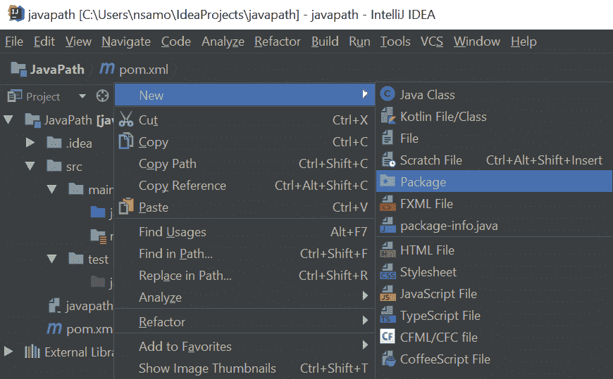

在弹出窗口中键入`com`：

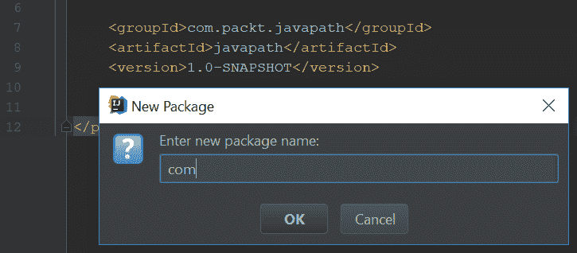

单击 OK 按钮。将创建`com`文件夹。

在左窗格中右键单击，选择新菜单项，然后选择套餐菜单项，并在弹出窗口中键入`packt`：

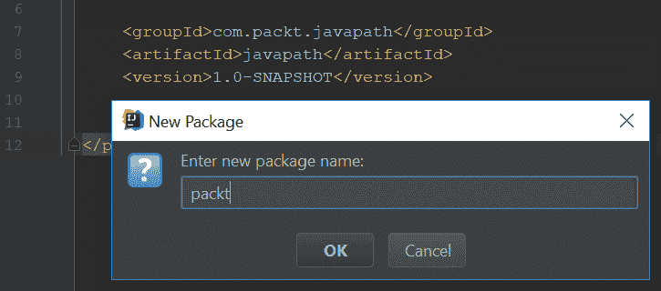

重复此过程，在`packt`文件夹下创建`javapath`文件夹，然后在`javapath`文件夹下创建`ch04demo`文件夹。在`com.packt.javapath.ch04demo`包就位后，我们可以创建其成员`MyApplication`类。

# 创建 MyApplication 类

要创建类，右键单击左窗格中的`com.packt.javapath.che04demo`包，选择新菜单项，然后选择 Java 类菜单项，并在弹出窗口中键入`MyApplication`：


单击“确定”按钮，将创建该类：

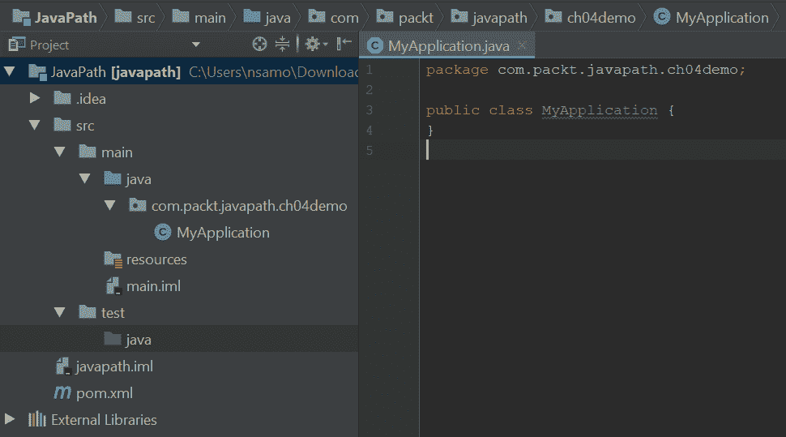

右窗格中`MyApplication`类的名称已褪色。这就是 IntelliJ IDEA 表明它尚未在任何地方使用的方式。

# 构建应用程序

在幕后，每次更改代码时，IDE 都会编译您正在编写的代码。例如，尝试删除右窗格中类名称中的第一个字母`M`。IDE 将立即警告您语法错误：

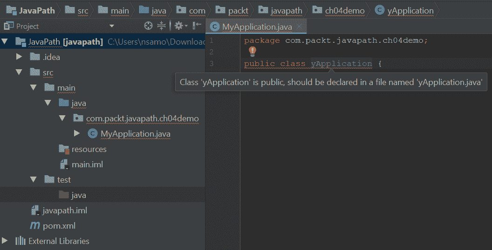

如果您将鼠标定位到红色气泡，或者前面屏幕截图中强调类声明的任何红线，您将看到类“yApplication”是公共的，应该在名为“yApplication.java”的消息文件中声明。您可能还记得我们在[第 2 章](02.html)*Java 语言基础中讨论过它。*

每个`.java`文件只包含一个`public`类。文件名必须与公共类名匹配。

由于 IDE 在每次更改后都会编译代码，因此对于少量的`.java`文件，不需要显式构建项目。但是当应用程序的大小增加时，您可能不会注意到出现了问题。

这就是为什么要求 IDE 不时地重新编译（或构建）应用程序的所有`.java`文件是一种好做法，方法是单击最顶部菜单中的“构建”，然后选择“重建项目”菜单项：


您可能已经注意到其他相关的菜单项：构建项目和构建模块“javapath”。模块是跨包捆绑类的一种方式。但是使用模块超出了本书的范围。Build Project 仅重新编译已更改的类以及使用更改的类的类。当构建时间很长时，只在非常大的应用程序中使用它是有意义的。另一方面，重建项目会重新编译所有的`.java`文件，无论它们是否被更改，我们建议您始终使用它。这样，您就可以确保每个类都已重建，并且没有遗漏任何依赖项。

单击重建项目后，您将在左窗格中看到一个新的`target`文件夹：

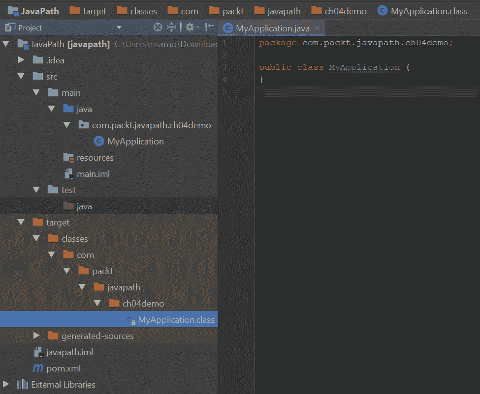

这就是 Maven（以及 IntellijIDEA 使用的内置 Maven）存储`.class`文件的地方。您可能已经注意到，`javac`工具为包名的每个部分创建了一个文件夹。这样，编译类的树正好反映了源类的树。

现在，在继续编写代码之前，我们将执行一个技巧，使源代码树看起来更简单。

# 隐藏一些文件和目录

如果您不希望看到 IDE 特定的文件（例如`.iml`文件）或临时文件和目录（例如`target`文件夹），可以将 IntelliJ IDEA 配置为不显示它们。只需单击文件设置（在 Windows 上）或 IntelliJ IDEA 首选项（在 Linux 和 macOS 上），然后单击左栏中的编辑器菜单项，然后单击文件类型。生成的屏幕将包含以下部分：


在屏幕底部，您可以看到“忽略文件和文件夹”标签以及带有文件名模式的输入字段。在列表末尾添加以下内容：`*.iml;.idea;target;`。然后，单击 OK 按钮。现在，您的项目结构应该如下所示：

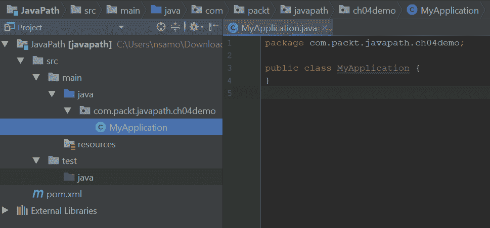

它仅显示应用程序源文件和第三方库（在“外部库”下）。

# 创建 SimpleMath 类

现在让我们创建另一个包`com.packt.javapath.math`和其中的`SimpleMath`类。这样做的原因是，在未来，我们计划在这个包中有几个类似的数学相关类，在其他包中有其他非数学相关类。

在左侧窗格中，右键单击`com.packt.javapath.ch04demo`包，选择新建，然后单击包。在提供的输入字段中键入`math`，然后单击确定按钮。

右键点击`math`包名，选择 New，然后点击 Java 类，在提供的输入字段中输入`SimpleMath`，点击 OK 按钮。

您应该创建一个新的`SimpleMath`类，如下所示：


# 创建方法

首先，我们在`SimpleMath`类中添加以下方法：

```java
public int multiplyByTwo(int i){
  return i * 2;
}
```

现在，我们可以将使用上述方法的代码添加到`MyApplication`类中：

```java
public static void main(String[] args) {
  int i = Integer.parseInt(args[0]);
  SimpleMath simpleMath = new SimpleMath();
  int result = simpleMath.multiplyByTwo(i);
  System.out.println(i + " * 2 = " + result);
}
```

前面的代码非常简单。`String[] args`作为应用程序的第一个输入元素，接收来自 T0 的输入。请注意，Java 数组中的第一个元素的索引是 0，而不是 1。参数以字符串形式出现，必须使用标准 Java 库中的`java.lang.Integer`类的`parseInt()`静态方法将其转换（解析）为`int`类型。我们将在[第 5 章](05.html)、*Java 语言元素和类型*中讨论 Java 类型。

然后，创建一个`SimpleMath`类的对象，并调用`multiplyByTwo()`方法。返回的结果存储在`int`类型的`result`变量中，然后使用标准 Java 库的`java.lang.System`类以所需格式打印出来。此类有一个`out`静态属性，该属性保存对`java.io.PrintStream`类的对象的引用。而`PrintStream`类又有`println()`方法，将结果打印到屏幕上。

# 执行和单元测试应用程序

有几种方法可以执行我们的新应用程序。在*构建应用程序*部分，我们看到所有编译的类都由 IntelliJ IDEA（使用内置 Maven）存储在`target`文件夹中。这意味着我们可以通过使用`java`工具并使用`-classpath`选项列出文件夹目标来执行应用程序。

为此，打开一个命令提示符或终端窗口，并转到新项目的根目录。如果您不确定它在哪里，请查看 IntelliJ IDEA 窗口的顶行，该窗口显示了它的完整路径。进入项目根目录（即`pom.xml`文件所在的文件夹）后，运行以下命令：

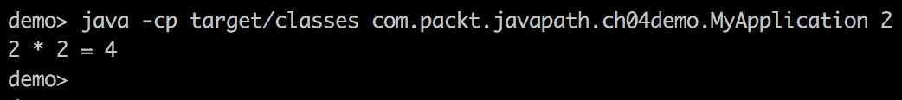

在前面的屏幕截图中，您可以看到`-classpath`选项（我们使用的是短版本`-cp`）列出了编译所有类的目录。之后，我们输入了`com.packt.javapath.ch04demo.MyApplication`主类的名称，因为我们必须告诉`java`工具哪个类是应用程序的入口点，并且包含`main()`方法。然后，我们输入了`2`作为主类的输入参数。您可能还记得，`main()`方法希望它是一个整数。

当我们运行该命令时，结果以预期格式显示输出：`2 * 2 = 4`。

或者，我们可以收集`myapp.jar`文件中所有已编译的类，并使用类路径上列出的`myapp.jar`文件运行类似的`java`命令：

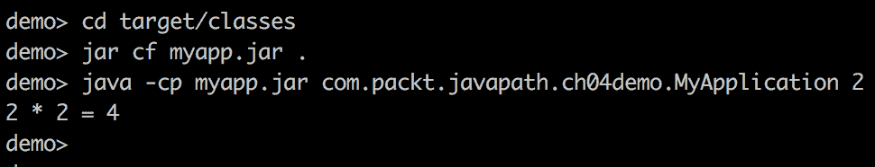

在前面的屏幕截图中，您可以看到我们首先输入了`target`文件夹及其`classes`子文件夹，然后使用`jar`命令将其内容（所有编译的类）收集到`myapp.jar`文件中。然后，我们键入`java`命令，并列出带有`-classpath`选项的`myapp.jar`文件。由于`myapp.jar`文件位于当前目录中，因此我们不包括任何目录路径。`java`命令的结果与之前相同：`2 * 2 = 4`。

到达项目根目录的另一种方法是从 IDE 打开一个终端窗口。在 IntelliJ IDEA 中，您可以通过单击左下角的终端链接来执行此操作：


然后，我们可以在 IDE 内的终端窗口中键入前面的所有命令。

但是有一种更简单的方法可以从 IDE 执行应用程序，而无需键入前面的所有命令，这是在项目开发阶段推荐的方法。这是你的 IDE，记得吗？我们将在下一节中演示如何执行此操作。

# 使用 IDE 执行应用程序

为了能够从 IDE 执行应用程序，必须在第一次设置一些配置。在 IntelliJ IDEA 中，如果单击最顶部的菜单项，单击运行，然后选择编辑配置…，您将看到以下屏幕：


单击左上角的加号（+），然后在新窗口中键入值：


在名称字段中键入`MyApplication`（或您喜欢的任何其他名称）。

在主类字段中键入`com.packt.javapath.ch02demo.MyApplication`。

在程序参数字段中键入`2`（或您喜欢的任何其他数字）。

选中右上角的“仅单个实例”复选框。它将确保您始终只有一个应用程序实例在运行。

填写完所有描述的值后，单击右下角的“确定”按钮。

现在，如果您打开`MyApplication`类，您将看到两个绿色箭头–一个在类级别，另一个在`main()`方法：


单击这些绿色箭头中的任意一个，您的应用程序将被执行。

结果将显示在 IntelliJ IDEA 的左下角。将打开一个标题为 Run 的窗口，您将看到应用程序执行的结果。如果在“程序参数”字段中键入了`2`，则结果应相同：`2 * 2 = 4`。

# 创建单元测试

现在，让我们为`SimpleMath`类的`multiplyByTwo()`方法编写一个测试，因为我们希望确保`multiplyByTwo()`方法按预期工作。只要项目存在，这样的测试就很有用，因为您可以在每次代码更改时运行这些测试，并验证现有功能没有意外更改。

方法是应用程序中最小的可测试部分。这就是为什么这样的测试被称为单元测试。对您创建的每个方法进行单元测试是一个好主意（除了一些琐碎的方法，例如 getter 和 setter）。

我们将使用一个名为 JUnit 的流行测试框架。它有几个版本。在撰写本文时，第 5 版是最新版本，但第 3 版和第 4 版仍在积极使用。我们将使用版本 5。它需要 Java8 或更高版本，我们假设您的计算机上至少安装了 Java9。

正如我们已经提到的，为了使用第三方库或框架，您需要在`pom.xml`文件中将其指定为依赖项。一旦您这样做，Maven 工具（或 IDE 的内置 Maven 功能）将在线在 Maven 存储库中查找相应的`.jar`文件。它会将`.jar`下载到您本地的 Maven 存储库中的`.m2`文件夹中，该文件夹是在您计算机的主目录中自动创建的。之后，您的项目可以随时访问和使用它。

我们已经在*Maven 项目配置*部分的`pom.xml`中为 JUnit 5 的依赖项设置了值。但是，让我们假设我们还没有这样做，以便向您展示程序员通常是如何做的。

首先，您需要做一些研究，并决定需要哪个框架或库。例如，在搜索互联网后，您可能已经阅读了 JUnit5 文档（[http://junit.org/junit5](http://junit.org/junit5) ），并认为需要将 Maven 依赖项设置为`junit-jupiter-api`。有了它，你可以再次搜索互联网，这一次，寻找`maven dependency junit-jupiter-api`，或者只是`maven dependency junit 5`。搜索结果中的第一个链接可能会将您带到以下页面：


选择您喜欢的任何版本（我们选择了最新的 5.1.0-M1）并单击它。

将打开一个新页面，告诉您如何在`pom.xml`中设置依赖项：

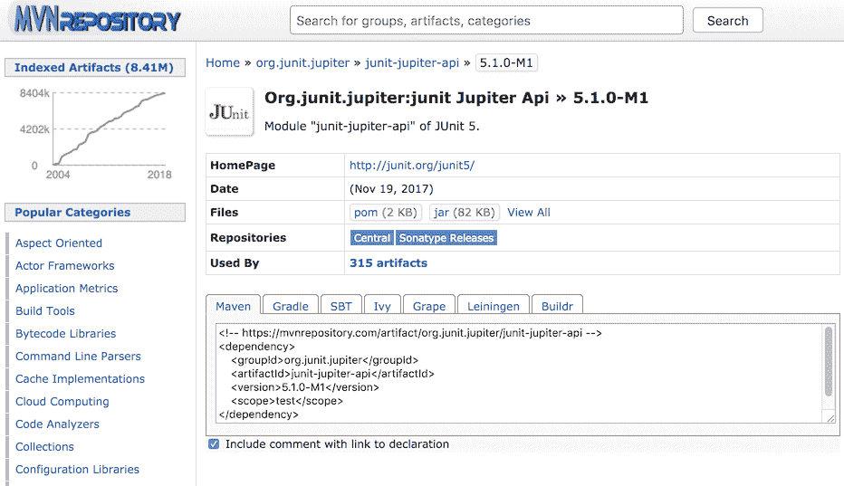

或者，您可以访问 Maven 存储库站点（[https://mvnrepository.com](https://mvnrepository.com) ），并在其搜索窗口中键入`junit-jupiter-api`。然后，单击其中一个提供的链接，您将看到相同的页面。

如果您在阅读[第 3 章](03.html)、*您的开发*环境*设置*时没有添加`junit-jupiter-api`依赖项，您现在可以通过将提供的依赖项复制到`<dependencies></dependencies>`标记内的`pom.xml`文件中来完成：


现在，您可以使用 JUnit 框架创建单元测试。

在 IntelliJ IDEA 中，`junit-jupiter-api-5.1.0-M1.jar`文件也列在左侧窗格的`External Libraries`文件夹中。如果打开列表，您将看到在`pom.xml`文件中没有指定的另外两个库：`junit-latform-commons-1.0.0-M1.jar`和`opentest4j-1.0.0.jar`。他们在那里是因为`junit-jupiter-api-5.1.0-M1.jar`依赖于他们。Maven 就是这样做的：它发现所有依赖项并下载所有必要的库。

现在，我们可以为`SimpleMath`类创建一个测试。我们将使用 IntelliJ IDEA 来实现这一点。打开`SimpleMath`类，右击类名，选择 Go To，点击 Test：


您将获得一个小弹出窗口：


点击新建测试。。。以下窗口将允许您配置测试：

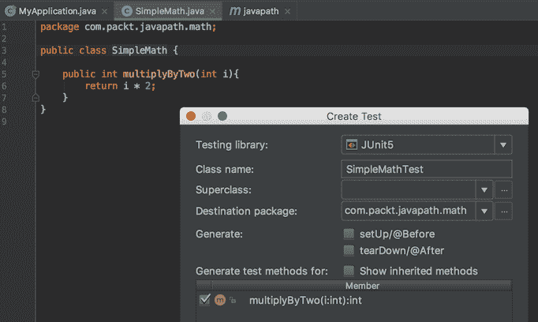

IntelliJ IDEA 中内置了对 JUnit 5 的支持。在前面的屏幕中，选择 JUnit5 作为测试库，并选中`multiplyByTwo()`方法的复选框。然后，单击右下角的“确定”按钮。将创建以下测试：

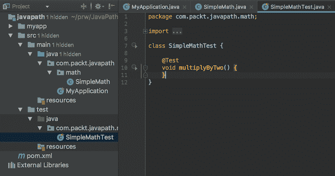

请注意，在左侧窗格中的`test/java`文件夹下，创建了一个与`SimpleMath`类的包完全匹配的包结构。在右侧窗格中，您可以看到`multiplyByTwo()`方法的`SimpleMathTest`测试类，其中包含一个测试（到目前为止为空）。测试方法可以有任何名称，但前面必须有`@Test`，称为注释。它告诉测试框架这是测试之一。

让我们实施测试。例如，我们可以这样做：

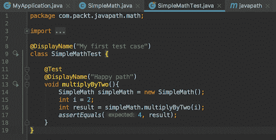

如您所见，我们已经创建了一个`SimpleMath`类的对象，并使用参数`2`调用了`multiplyByTwo()`方法。我们知道正确的结果必须是`4`，我们使用 JUnit 框架中的`assertEquals()`方法检查结果。我们还向类和测试方法添加了`@DisplayName`注释。稍后您将看到此注释的作用。

现在我们修改`SimpleMath`类中的`mutliplyByTwo()`方法：


我们不只是乘以`2`，而是将`1`添加到结果中，这样我们的测试就会失败。首先，在不正确的代码上运行测试是一种很好的做法，这样我们就可以确保我们的测试捕捉到这样的错误。

# 执行单元测试

现在，让我们回到`SimpleMathTest`类，点击其中一个绿色箭头来运行它。类级别上的绿色箭头运行所有测试方法，而方法级别上的绿色箭头仅运行该测试方法。由于我们只有一种测试方法，到目前为止，单击哪个箭头无关紧要。结果应该如下所示：

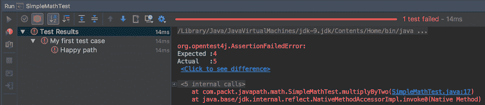

这正是我们希望看到的：测试预期结果等于`4`，但得到的却是`5`。它为我们提供了一定程度的信心，我们的测试工作正常。

请注意，在左窗格中，我们可以看到来自`@DisplayName`注释的显示名称，这些注释正是这些注释的用途。

另外，单击右窗格中的每个蓝色链接以查看它们的功能。第一个提供了有关预期和实际结果的更详细信息。第二个链接将您带到测试行，在该行中，断言位于测试失败的位置，因此您可以看到确切的上下文并纠正错误。

现在，您可以再次转到`SimpleMath`类并删除我们添加的`1`。然后，单击左上角的绿色三角形（参见前面的屏幕截图）。表示*重新运行测试*。结果应该如下所示：


顺便说一句，你可能已经注意到我们的屏幕截图和项目的路径有了轻微的变化。这是因为我们现在正在拍摄运行在 macOS 上的 IntelliJ IDEA 的屏幕截图，这样我们就可以涵盖 Windows 和 macOS。如您所见，IntelliJ IDEA 屏幕在 Windows 上的外观与在 macOS 系统上的外观基本相同。

# 多少个单元测试就足够了？

每当编写一个新方法或修改一个旧方法时，任何程序员都会考虑这个问题：有多少个单元测试足以确保应用程序被彻底测试，它们应该是什么类型的测试？通常，仅对应用程序的每个方法进行一次测试是不够的。通常有许多方面的功能需要测试。但是每个测试方法都应该只测试一个方面，因此编写和理解起来更容易。

例如，对于我们简单的`multiplyByTwo()`方法，我们可以添加另一个测试（我们称之为`multiplyByTwoRandom()`），它选择一个随机整数作为方法的输入，并执行一百次。或者，我们可以考虑一些极端数字，比如`0`和负数，看看我们的方法如何处理它们（例如，我们可以称它们为`multiplyByZero()`和`multiplyByNegative()`。另一个测试是使用一个非常大的数字——大于 Java 允许的最大整数的一半（我们将在[第 5 章](05.html)、*Java 语言元素和类型*中讨论此类限制）。我们还可以考虑在`multiplyByTwo()`方法中添加对传入参数值的检查，如果传入参数大于最大整数的一半，则抛出异常*。我们将在[第 10 章](10.html)、*控制流语句*中讨论异常。*

 *您可以看到单元测试的数量有多快，因为最简单的方法可以增长。想象一下，对于一个比我们的简单代码做得更多的方法，可以编写多少个单元测试。

我们也不想编写太多的单元测试，因为我们需要在项目的剩余生命周期中维护所有这些代码。在过去，一个大型项目的维护成本过高的情况不止一次，这仅仅是因为编写了太多复杂的单元测试，几乎没有或几乎没有增加价值。这就是为什么在项目代码稳定并在生产环境中运行一段时间后，如果有理由认为它有太多的单元测试，团队通常会重新访问它们，并确保没有无用的测试、重复的测试或其他明显的测试。

编写快速工作并彻底测试代码的良好单元测试是一项需要经验的技能。在本书中，我们将利用每一个机会与您分享单元测试的最佳实践，以便在本书结束时，您将在这个非常重要的专业 Java 编程领域获得一些经验。

# 练习–JUnit@Before 和@After 注释

阅读 JUnit 用户指南（[https://junit.org/junit5/docs/current/user-guide](https://junit.org/junit5/docs/current/user-guide) 类和`SampleMathTest`类两种新方法：

*   在任何测试方法运行之前只执行一次的测试方法
*   在所有测试方法运行后只执行一次的测试方法

我们没有谈论它，所以你需要做一些研究。

# 答复

对于 JUnit5，可用于此目的的注释是`@BeforeAll`和`@AfterAll`。下面是演示代码：

```java
public class DemoTest {
  @BeforeAll
  static void beforeAll(){
    System.out.println("beforeAll is executed");
  }
  @AfterAll
  static void afterAll(){
    System.out.println("afterAll is executed");
  }
  @Test
  void test1(){
    System.out.println("test1 is executed");
  }
  @Test
  void test2(){
    System.out.println("test2 is executed");
  }
}
```

如果运行它，输出将是：

```java
beforeAll is executed
test1 is executed
test2 is executed
afterAll is executed 
```

# 总结

在本章中，您学习了 Java 项目，以及如何设置和使用它们来编写应用程序代码和单元测试。您还学习了如何构建以及如何执行应用程序代码和单元测试。基本上，Java 程序员大部分时间都是这样做的。在本书的其余部分中，您将获得有关 Java 语言、标准库以及第三方库和框架的更详细的知识。

在下一章中，我们将深入研究 Java 语言元素和类型，包括`int`、`String`和`arrays`。您还将了解什么是标识符以及如何将其用作变量名，以及有关 Java 保留关键字和注释的信息。*