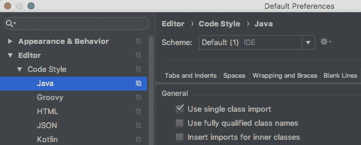
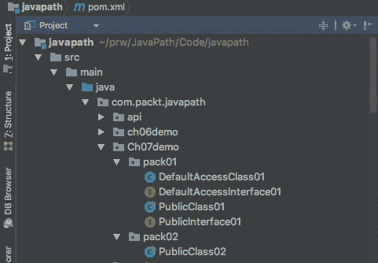

# 七、包和可访问性（可见性）

到现在为止，您已经非常熟悉包了。在本章中，我们将完成其描述，然后讨论类和类成员的不同可访问性级别（也称为可见性）——方法和字段。所有这些都将归结为面向对象编程的关键概念——封装——并为我们讨论面向对象的设计原则奠定了基础。

在本章中，我们将介绍以下主题：

*   什么是进口？
*   静态导入
*   接口访问修饰符
*   类访问修饰符
*   方法访问修饰符
*   属性访问修饰符
*   封装
*   练习-阴影

# 什么是进口？

导入允许我们在`.java`文件开头、类或接口声明之前只指定一次完全限定的类或接口名称。导入语句的格式如下所示：

```java
import <package>.<class or interface name>;
```

例如，请看以下内容：

```java
import com.packt.javapath.ch04demo.MyApplication;
```

从现在起，该类在代码中只能通过其名称`MyApplication`引用。还可以使用通配符（`*`导入包的所有类或接口：

```java
import com.packt.javapath.ch04demo.*;
```

注意，前面的 import 语句导入`com.packt.javapath.ch04demo`包的子包的类和接口。如果需要，每个子包必须单独导入。

但是，在我们继续之前，让我们先讨论一下`.java`文件结构和包。

# .java 文件和包的结构

正如您已经知道的，包名反映了目录结构，从包含`.java`文件的项目目录开始。每个`.java`文件的名称必须与其中定义的公共类的名称相同。`.java`文件的第一行是 package 语句，它以`package`关键字开头，后面是实际的包名，即指向该文件的目录路径，其中斜杠替换为点。让我们看一些例子。我们将主要关注包含类定义的`.java`文件，但我们也将关注带有接口的文件和`enum`类定义，因为有一种特殊类型的导入（称为静态导入），主要用于接口和`enum`。

对于`MyClass`和`MyClass`文件，我们假设`MyClass`和`MyClass`文件都存储在`MyClass`的目录中

```java
src/main/java/com/packt/javapath/MyClass.java (for Linux) 
src/main/java/com/packt/javapath/MyEnum.java
src/main/java/com/packt/javapath/MyInterface.java 
```

或（适用于 Windows）

```java
src\main\java\com\packt\javapath\MyClass.java (for Windows) 
src\main\java\com\packt\javapath\MyEnum.java
src\main\java\com\packt\javapath\MyInterface.java 
```

每个文件的第一行如下所示：

```java
package com.packt.javapath;
```

如果我们不导入任何内容，那么每个文件中的下一行就是类或接口声明。

`MyClass`类的声明如下：

```java
public class MyClass extends SomeClass 
     implements Interface1, Interface2, ... {...}
```

它包括以下内容：

*   访问修饰符；文件中的一个类必须是`public`
*   `class`关键字
*   按照约定，以大写字母开头的类名（标识符）
*   如果该类是另一个类的子类，`extends`关键字和父类的名称
*   如果类实现了一个或多个接口，`implements`关键字后跟它实现的以逗号分隔的接口列表
*   类的主体（定义字段和方法的地方）被大括号包围，`{}`

`MyEnum`类的声明如下：

```java
public enum MyEnum implements Interface1, Interface2, ... {...}
```

它包括以下内容：

*   访问修饰符；如果它是文件中定义的唯一类，则必须为`public`
*   `enum`关键字
*   按照约定，以大写字母开头的类名（标识符）
*   没有`extends`关键字，因为枚举类型隐式扩展了`java.lang.Enum`类，并且在 Java 中，一个类只能有一个父类
*   如果类实现了一个或多个接口，`implements`关键字后跟它实现的以逗号分隔的接口列表
*   类的主体（其中定义了常量和方法）被大括号包围，`{}`

`MyInterface`接口的声明如下：

```java
public interface MyInterface extends Interface1, Interface2, ... {...}
```

它包括以下内容：

*   访问修饰符；文件中的一个接口必须是`public`
*   `interface`关键字
*   按照约定，以大写字母开头的接口名称（标识符）
*   如果接口是一个或多个接口的子接口，`extends`关键字后跟以逗号分隔的父接口列表
*   被大括号包围的接口主体（定义字段和方法的地方），`{}`

在不导入的情况下，我们需要通过其完全限定名引用正在使用的每个类或接口，其中包括包名和类或接口名。例如，`MyClass`类声明如下所示：

```java
public class MyClass 
          extends com.packt.javapath.something.AnotherMyClass 
          implements com.packt.javapath.something2.Interface1,
                     com.packt.javapath.something3.Interface2
```

或者，假设我们想实例化`com.packt.javapath.something`包中的`SomeClass`类。该类的完全限定名为`com.packt.javapath.something.SomeClass`，其对象创建语句如下所示：

```java
com.packt.javapath.something.SomeClass someClass =
                    new com.packt.javapath.something.SomeClass();
```

太冗长了，不是吗？这就是包导入的作用所在。

# 单类导入

为了避免在代码中使用完全限定的类或接口名称，我们可以在包声明和类或接口声明之间的空格中添加导入语句：

```java
package com.packt.javapath;
import com.packt.javapath.something.SomeClass;
public class MyClass {
  //... 
  SomeClass someClass = new SomeClass();
  //...
}
```

如您所见，import 语句允许避免使用完全限定的类名，这使得代码更易于阅读。

# 多类导入

如果从同一个包中导入多个类或接口，则可以使用星号（`*`通配符导入所有包成员。

如果`SomeClass`和`SomeOtherClass`属于同一个包，则导入声明可能如下所示：

```java
package com.packt.javapath;
import com.packt.javapath.something.*;
public class MyClass {
  //... 
  SomeClass someClass = new SomeClass();
  SomeOtherClass someClass1 = new SomeOtherClass();
  //...
}
```

使用星号的优点是导入语句的列表更短，但这种样式隐藏了导入的类和接口的名称。因此，程序员可能不知道它们的确切来源。此外，当两个或多个包包含具有相同名称的成员时，您只需将它们显式地作为单个类导入。否则，编译器将生成一个错误。

另一方面，喜欢通配符导入的程序员认为，它有助于防止意外创建一个名称已经存在于导入包中的类。因此，在样式和配置 IDE 以使用或不使用通配符导入时，您必须做出自己的选择。

在 IntelliJ IDEA 中，默认的导入样式是使用通配符。如果要切换到单个类导入，请单击文件|其他设置|默认设置，如以下屏幕截图所示：


在打开的屏幕上，选择编辑器| Java 并选中使用单一类导入复选框：



您可能会发现此页面上还有其他有用的设置，请记住如何访问它。

# 静态导入

静态导入不仅允许导入类或接口，还允许单独导入其公共成员字段和方法。如果查看我们的一个测试类，您将看到以下静态导入语句：

```java
import static org.junit.jupiter.api.Assertions.*;

```

该声明允许我们写下以下内容：

```java
Person p = new Person("Joe", "Blow", dob);
assertTrue(p.equals(p));

```

而不是这样写：

```java
Person p = new Person("Joe", "Blow", dob);
Assertions.assertTrue(p.equals(p));

```

这是静态导入使用的一个普遍情况。另一种流行的情况是静态导入接口或`enum`的常量。例如，如果我们有如下接口：

```java
package com.packt.javapath.api;
public interface Constants {
  String NAME = "name";
}
```

然后，要使用其常量，可以静态导入它们：

```java
package com.packt.javapath;
import static com.packt.javapath.api.Constants.*;
public class MyClass {
  //...
  String s = "My " + NAME + " is Joe";
  System.out.println(s);        //Prints: My name is Joe
  //...
} 
```

顺便说一下，通过非静态地导入`Constants`接口并让类实现它，也可以达到同样的效果：

```java
package com.packt.javapath;
import com.packt.javapath.api.Constants;
public class MyClass implements Constants {
  //...
  String s = "My " + NAME + " is Joe";
  System.out.println(s);        //Prints: My name is Joe
  //...
} 
```

这种实现接口以使用其常量的方式在 Java 程序员中非常流行。

使用静态导入以使用`enum`常量的示例类似：

```java
import static java.time.DayOfWeek.*;
```

它允许代码使用`DayOfWeek`常量作为`MONDAY`，而不是`DayOfWeek.MONDAY`。

# 访问修饰符

有三个显式访问修饰符 public、private 和 protected，还有一个隐式（默认）访问修饰符，在未设置访问修饰符时隐含。它们可以应用于顶级类或接口、它们的成员和构造函数。*顶级*类或接口可以包括*成员*类或接口。类或接口的其他*成员*是字段和方法。类也有*构造函数*。

为了演示可访问性，让我们创建一个包含两个类和两个接口的`com.packt.javapath.Ch07demo.pack01`包：

```java
public class PublicClass01 {
  public static void main(String[] args){
    //We will write code here
  }
}

class DefaultAccessClass01 {
}

public interface PublicInterface01 {
  String name = "PublicInterface01";
}

interface DefaultAccessInterface01 {
  String name = "DefaultAccessInterface01";
}
```

我们还将创建另一个`com.packt.javapath.Ch07demo.pack02`包，其中包含一个类：

```java
public class PublicClass02 {
  public static void main(String[] args){
    //We will write code here
  }
}
```

前面的每个类和接口都位于其自己的文件中：



现在我们已经准备好探索类、接口、它们的成员和构造函数的可访问性。

# 顶级类或接口的可访问性

公共类或接口可以从任何地方访问。我们可以导入它们并从另一个包访问它们：

```java
import com.packt.javapath.Ch07demo.pack01.PublicClass01;
import com.packt.javapath.Ch07demo.pack01.PublicInterface01;
//import com.packt.javapath.Ch07demo.pack01.DefaultAccessClass01;
//import com.packt.javapath.Ch07demo.pack01.DefaultAccessInterface01;

public class PublicClass02 {
  public static void main(String[] args){
    System.out.println(PublicInterface01.name);
    PublicClass01 o = new PublicClass01();

  }
}
```

在前面的代码中，两个 import 语句被注释掉，因为它们生成了一个错误。这是因为在`DefaultAccessClass01`类和`DefaultAccessClass01`接口中，我们没有使用访问修饰符，这使得它们只能被同一个包的成员访问。

如果没有访问修饰符，顶级类或接口只能由同一包的成员访问。

在顶级类或接口的声明中使用访问修饰符`private`会使它们无法访问，因此对顶级类或接口使用`private`访问修饰符没有意义。

`protected`关键字不能应用于顶级。这一限制并不明显。我们将在下一节中看到，`protected`表示包成员和孩子可以访问它。因此，有人可能会说，`protected`访问也可以应用于顶级类或接口。然而，Java 作者决定不这样做，如果您试图创建顶级类或接口`protected`，编译器将生成一个异常。

但是，`private`和`protected`访问修饰符可以应用于顶级类或接口的成员的内部类或接口。

# 访问类或接口成员

即使类或接口成员声明为公共，如果封闭的类或接口不可访问，也无法访问它们。因此，以下所有讨论都将在类或接口可访问的假设下进行。

一个类或接口的成员可以访问同一个类或接口的其他成员，无论他们有什么访问修饰符。这很有道理，不是吗？这一切都发生在同一个封闭类或接口中。

默认情况下，接口成员是公共的。所以，如果可以访问接口本身，那么也可以访问没有访问修饰符的接口成员。并且，提醒您，默认情况下，接口字段是静态的和最终的（常量）。

另一方面，没有访问修饰符的类成员只能由包成员访问。因此，类或接口可能是公共的，但如果不显式公开，则其成员的可访问性较低。

私有类或接口成员只能由同一类或接口的其他成员访问。这是可能的最受限制的访问。即使是班级的孩子也无法访问他们父母的私人成员。

受保护的包成员可由同一包的其他成员以及类或接口的子级访问，这意味着受保护的成员可以被重写。程序员经常将其用作意图的表达：他们使那个些成员受到保护，以使其预期被覆盖。否则，它们要么是私有的，要么是公共的。默认无访问修饰符访问很少使用。

**Private**: Allows access from the same class (or interface) only
**No modifier (default)**: Allows access from the same class (or interface) and the same package
**Protected**: Allows access from the same class (or interface), the same package, and any child
**Public**: Allows access from anywhere

同样的可访问性规则也适用于内部类和接口。下面是包含内部类和接口的类的示例：

```java
public class PublicClass01 {
  public static void main(String[] args){
    System.out.println(DefaultAccessInterface01.name);
    DefaultAccessClass01 o = new DefaultAccessClass01();
  }
  class DefaultAccessClass{
  }
  protected class ProtectedClass{
  }
  private class PrivateClass{
  }
  interface DefaultAccessInterface {
  }
  protected class ProtectedInterface{
  }
  private class PrivateInterface{
  }
}
```

这是一个具有内部类和接口的接口：

```java
public interface PublicInterface01 {
  String name = "PublicInterface01";
```

```java

  class DefaultAccessClass{
  }
  interface DefaultAccessInterface {
  }
}
```

如您所见，接口的内部类和接口只允许默认（公共）访问。

并且，为了重复我们已经讨论过的内容，我们将简要地提到成员无障碍性的一些其他相关方面：

*   静态嵌套类（它是一个内部类，但在静态类的情况下按约定称为嵌套类）不能访问同一类的非静态成员，但它们可以访问该类
*   作为某个顶级类的成员，静态嵌套类可以是公共的、受保护的、包可访问的（默认）或私有的
*   类的公共、受保护和包可访问成员由子级继承

# 构造函数的可访问性与任何类成员相同

正如本节的标题所述，这就是关于构造函数可访问性的所有内容。当然，当我们谈论构造函数时，我们只谈论类。

构造函数的有趣之处在于它们只能进行私有访问。这意味着一个类可以提供自己的工厂方法（参见[第 6 章](06.html)、*接口、类和对象构造*），控制每个对象的构造方式，甚至控制它们中有多少可以投入流通。最后一个特性在每个对象都需要访问某个资源（文件或另一个数据库）的情况下特别有用，该资源对并发访问的支持有限。以下是创建的对象数量有限的工厂方法的最简单版本的外观：

```java
private String field;
private static int count;
private PublicClass02(String s){
  this.field = s;
}
public static PublicClass02 getInstance(String s){
  if(count > 5){
    return null;
  } else {
    count++;
    return new PublicClass02(s);
  }
}
```

这段代码的用处不大，我们展示它只是为了演示如何使用私有可访问的构造函数。这是可能的，因为每个类成员都可以访问所有其他类成员，而不管它们的访问修饰符是什么。

所有与可访问性相关的功能都不需要，除非它们带来一些优势。这就是我们将在下一节讨论的内容——关于面向对象编程的核心概念，称为封装，如果没有可访问性控制，这是不可能的。

# 封装

OOP 的概念是为了管理日益复杂的软件系统而产生的。数据和过程的概念捆绑在一个对象中，并对其进行受控访问（称为封装），允许在层中更好地组织数据和过程，其中一些是隐藏的，另一些是暴露于外部访问的。前几节中描述的可访问性控制是其重要组成部分。与继承、接口（也称为抽象）和多态性一起，封装成为 OOP 的核心概念之一。

一个 OOP 概念与另一个 OOP 概念通常没有明确的区分。接口也有助于隐藏（封装）实现细节。继承具有重写和隐藏父类方法的能力，为可访问性添加了动态方面。所有这三个概念都可以添加多态性的概念，即同一对象根据上下文（基于继承或实现的接口）将自身呈现为不同类型的能力，或者根据数据可用性改变其行为（使用组合我们将在[第 8 章中讨论）](08.html)、*面向对象设计（OOD）原则——*或方法重载、隐藏和重写）。

但是没有封装，这些概念都是不可能的。这就是为什么它是 OOP 四个概念中最基本的。很可能，您会听到很多人提到它，因此我们决定在本节中专门介绍封装上下文中经常使用的术语，这是基于它提供的优势：

*   数据隐藏和解耦
*   灵活性、可维护性、重构
*   可重用性
*   可测试性

# 数据隐藏和解耦

当我们将对象状态（其字段的值）和某些方法设置为私有，或对内部对象数据施加限制访问的其他措施时，我们参与了*数据隐藏*。对象功能的用户只能根据其可访问性调用某些方法，并且不能直接操作对象的内部状态。对象的用户可能不知道功能是如何实现的，数据是如何存储的。它们将所需的输入数据传递给可访问的方法并返回结果。通过这种方式，我们*将*内部状态从其使用中分离出来，并将实现细节从 API 中分离出来。

将相关方法和数据分组到同一类中也会增加*解耦*，这一次是在不同的功能领域之间。

您可能会听到术语*紧密耦合*只有在无法避免的情况下才允许使用，因为它通常意味着一个零件的任何更改都需要另一个零件的相应更改。即使在日常生活中，我们也更喜欢处理模块化系统，只允许更换一个模块，而不改变系统其余部分的任何其他组件。

这就是为什么*松耦合*通常是程序员喜欢的东西，尽管其代价通常是不确定在所有可能的执行路径中测试系统之前不会出现意外情况。一个经过深思熟虑的测试系统，包括基本用例，通常有助于减少生产中缺陷传播的机会。

# 灵活性、可维护性和重构

当我们在上一节讨论解耦时，灵活性和可维护性的概念可能是通过关联而出现的。松散耦合的系统更灵活，更易于维护。

例如，在[第 6 章](06.html)*接口、类和对象构造*中，我们演示了在实现对象工厂时的灵活解决方案：

```java
public static Calculator createInstance(){
  WhichImpl whichImpl = 
      Utils.getWhichImplValueFromConfig(Utils.class,
            Calculator.CONF_NAME, Calculator.CONF_WHICH_IMPL);
  switch (whichImpl){
    case multiplies:
      return new CalculatorImpl();
    case adds:
      return new AnotherCalculatorImpl();
    default:
      throw new RuntimeException("Houston, we have another problem."+
                  " We do not have implementation for the key " +
                  Calculator.CONF_WHICH_IMPL + " value " + whichImpl);
    }
}
```

它仅与其`Calculator`接口（API）紧密耦合，但这是不可避免的，因为这是实现必须遵守的契约。至于在工厂内的实施，只要遵守合同，就更不受任何限制。

我们可以只创建每个实现的一个实例一次，然后只返回一个实例（使每个类成为一个单例）。以下是`CalculatorImpl`作为单身的一个例子：

```java
private static Calculator calculator = null;
public static Calculator createInstance(){
  WhichImpl whichImpl = 
      Utils.getWhichImplValueFromConfig(Utils.class,
            Calculator.CONF_NAME, Calculator.CONF_WHICH_IMPL);
  switch (whichImpl){
    case multiplies:
      if(calculator == null){
        calculator = new CalculatorImpl();
      }
      return calculator;
    case adds:
      return new AnotherCalculatorImpl();
    default:
      throw new RuntimeException("Houston, we have another problem."+
                      " We do not have implementation for the key " +
                  Calculator.CONF_WHICH_IMPL + " value " + whichImpl);
    }
}
```

或者我们可以将另一个`Calculator`实现作为嵌套类添加到工厂中，并使用它代替`CalculatorImpl`：

```java
public static Calculator createInstance(){
  String whichImpl = Utils.getStringValueFromConfig(CalculatorFactory.class,
            "calculator.conf", "which.impl");
  if(whichImpl.equals("multiplies")){
    return new Whatever();
  } else if (whichImpl.equals("adds")){
    return new AnotherCalculatorImpl();
  } else {
    throw new RuntimeException("Houston, we have a problem. " +
              "Unknown key which.impl value " + whichImpl +
              " is in config.");
  }

}

static class Whatever implements Calculator {
  public static String addOneAndConvertToString(double d){
    System.out.println(Whatever.class.getName());
    return Double.toString(d + 1);
  }
  public int multiplyByTwo(int i){
    System.out.println(Whatever.class.getName());
    return i * 2;
  }
}
```

这个工厂的客户机代码永远不会知道差异，除非它在工厂返回的对象上使用`getClass()`方法打印出关于类的信息。但这是另一个故事。从功能上讲，我们新实现的`Whatever`将与旧实现一样工作。

这实际上是将内部实现从一个版本更改为另一个版本的常见做法。当然，还有错误修复和新增功能。随着实现代码的不断发展，它的程序员一直在关注重构的可能性。在计算机科学中，因子分解是分解的同义词，分解是将复杂的代码分解为更简单的部分，目的是使代码更具可读性和可维护性。例如，假设我们被要求编写一个方法，该方法接受两个`String`类型的参数（每个参数代表一个整数），并将它们的和作为整数返回。经过思考，我们决定这样做：

```java
public long sum(String s1, String s2){
  int i1 = Integer.parseInt(s1);
  int i2 = Integer.parseInt(s1);
  return i1 + i2;
}
```

但是我们要求提供一个可能的输入值样本，这样我们就可以在接近生产的条件下测试代码。事实证明，其中一些值可能高达 1000000000，超过 2147483647（Java 允许的最大`Integer.MAX_VALUE`int 值）。因此，我们将代码更改为：

```java
public long sum(String s1, String s2){
  long l1 = Long.parseLong(s1);
  long l2 = Long.parseLong(s2);
  return l1 + l2;
}
```

现在我们的代码可以处理高达 9223372036854775807 的值（即`Long.MAX_VALUE`）。我们将代码部署到生产环境中，并在几个月内运行良好，由一个处理统计数据的大型软件系统使用。然后系统切换到新的数据源，代码开始中断。我们调查发现，新的数据源产生的值可以包括字母和其他一些字符。我们已经针对这种情况测试了我们的代码，发现以下行抛出了`NumberFormatException`：

```java
long l1 = Long.parseLong(s1);

```

我们与领域专家讨论了这种情况，他们建议我们记录非整数的值，跳过它们，然后继续求和计算。因此，我们对代码进行了如下修改：

```java
public long sum(String s1, String s2){
  long l1 = 0;
  try{
    l1 = Long.parseLong(s1);
  } catch (NumberFormatException ex){
    //make a record to a log
  }
  long l2 = 0;
  try{
    l2 = Long.parseLong(s2);
  } catch (NumberFormatException ex){
    //make a record to a log
  }
  return l1 + l2;
}
```

我们很快将代码发布到生产环境中，但下一个版本有了新的要求：输入的`String`值可以包含十进制数。因此，我们改变了处理输入`String`值的方式，假设它们带有十进制值（也包括整数值），并重构代码，如下所示：

```java
private long getLong(String s){
  double d = 0;
  try{
    d = Double.parseDouble(s);
  } catch (NumberFormatException ex){
    //make a record to a log
  }
  return Math.round(d);
}
public long sum(String s1, String s2){
  return getLong(s1) + getLong(s2);
}
```

重构就是这样做的。它在不改变 API 的情况下重新构造代码。随着新需求的不断涌现，我们可以在不接触`sum()`方法的情况下更改`getLong()`方法。我们也可以在其他地方重用`getLong()`方法，这将是下一节的主题。

# 可重用性

封装无疑会更容易实现可重用性，因为它隐藏了实现细节。例如，我们在上一节中编写的`getLong()`方法可以被同一类的另一个方法重用：

```java
public long sum(int i, String s2){
  return i + getLong(s2);
}
```

它甚至可以公开并被其他类使用，如以下行：

```java
int i = new Ch07DemoApp().getLong("23", "45.6");
```

当使用与继承无关的不同类的方法构建（组合）某些功能时，这将是一个组合的示例。而且，由于它不依赖于对象状态（这种方法称为无状态），因此可以将其设置为静态：

```java
int i = Ch07DemoApp.getLong("23", "45.6");
```

那么，如果该方法在运行时被其他几个方法同时使用，那么即使是这样一个简单的代码也可能需要保护（同步）以防止并行使用。但这些考虑超出了本书的范围。目前，如果有疑问，请不要将该方法设置为静态。

如果您阅读了面向对象编程的历史，您会发现继承最初的任务是作为代码重用的主要机制。它完成了任务。子级继承（重用）其父级的所有方法，并仅重写那些需要为子级专门化而重写的方法。

但在实践中，与前面演示的类似的其他可重用性技术似乎更受欢迎，特别是在重用方法是无状态的情况下。我们将在[第 8 章](08.html)、*面向对象设计（OOD）原则*中进一步讨论其原因。

# 可测试性

代码可测试性是封装有帮助的另一个领域。如果没有隐藏实现细节，我们将需要测试每一行代码，并在每次更改任何一行实现时更改测试。但是隐藏 API 外观背后的细节允许我们只关注那些可能的输入数据（参数值）集合所要求和限制的测试用例。

此外，还有一些框架允许我们创建一个对象，该对象根据输入参数的特定值返回特定结果。Mockito 是一个流行的框架，可以实现这一点（[http://site.mockito.org](http://site.mockito.org) ）。这样的对象称为模拟对象。当您需要从一个对象的方法中获得某些结果以测试其他方法时，它们特别有用，但是您无法运行作为数据源的方法的实际实现，因为您在数据库中没有必要的数据，例如，或者它需要一些复杂的设置。为了解决这个问题，您可以将某些方法的实际实现替换为无条件返回所需数据或响应某些输入数据的方法。如果没有封装，这种方法行为的模拟可能是不可能的，因为客户机代码将绑定到特定的实现，如果不更改客户机代码，您将无法更改它。

# 练习-阴影

编写演示变量阴影的代码。我们还没有讨论过，所以你需要做一些研究。

# 答复

以下是一种可能的解决方案：

```java
public class ShadowingDemo {
  private String x = "x";
  public void printX(){
    System.out.println(x);   
    String x = "y";
    System.out.println(x);   
  }
}
```

如果您运行`new ShadowingDemo().printX();`，它会先打印`x`，然后打印`y`，因为下一行中的局部变量`x`遮挡了`x`实例变量：

```java
String x = "y";

```

请注意，阴影可以是缺陷的来源，也可以用于程序的利益。如果没有它，您将无法使用实例变量已经使用的局部变量标识符。下面是另一个例子，变量阴影有助于：

```java
private String x = "x";
public void setX(String x) {
  this.x = x;
}
```

`x`局部变量（参数）遮挡`x`实例变量。它允许对已用于实例变量名的局部变量名使用相同的标识符。为了避免可能的混淆，建议使用关键字`this`引用实例变量，正如我们在上面的示例中所做的那样。

# 总结

在本章中，您了解了面向对象语言的一个基本特性——类、接口、其成员和构造函数的可访问性规则。现在可以从其他包导入类和接口，并避免使用它们的完全限定名。所有这些讨论使我们能够介绍 OOP 封装的核心概念。这样，我们就可以开始对**面向对象设计**（**面向对象设计**原则进行深入的讨论。

下一章将介绍 Java 编程的更高级视图。它讨论了良好设计的标准，并提供了经验证的 OOD 原则指南。详细描述了每个设计原则，并使用相应的代码示例进行了说明。