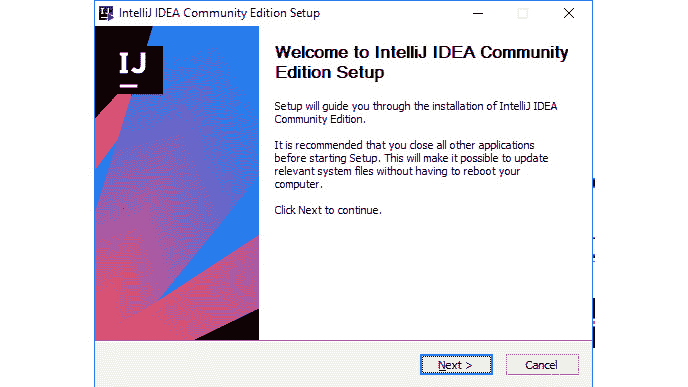
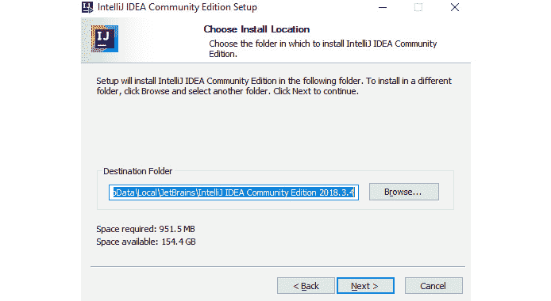
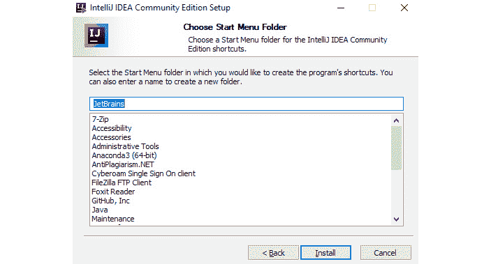

# 零、序言

## 关于

本节简要介绍作者、本书的内容、入门所需的技术技能以及完成所有包含的活动和练习所需的硬件和软件要求。

## 关于这本书

自从 Java 诞生以来，它就席卷了编程世界。它的特性和功能为开发人员提供了编写健壮的跨平台应用程序所需的工具。*Java 基础*向您介绍这些工具和功能，使您能够创建 Java 程序。这本书首先介绍了这种语言，它的哲学，以及随着时间的推移的演变，直到最新版本。您将了解到**javac**/**java**工具是如何工作的，java 包是什么，以及 java 程序通常的组织方式。一旦您熟悉了这一点，您将了解该语言的高级概念，例如控制流关键字。您将探索面向对象编程及其在使 Java 成为现实中所起的作用。在最后的课程中，您将掌握类、类型转换和接口，并了解数据结构、数组和字符串的用法；处理例外情况；以及创建泛型。

在本书的结尾，您将学习如何编写程序、自动执行任务、学习算法和数据结构方面的高级书籍，或者探索更高级的 Java 书籍。

### 关于作者

Gazihan Alankus To.T1 是伊兹密尔经济大学的助理教授，在那里教授与移动应用、游戏和物联网相关的书籍。他在圣路易斯华盛顿大学获得博士学位，并在谷歌实习。2019 年，他成为谷歌 Dart 编程语言的开发专家。他喜欢从事各种研究和开发项目。

RoigeRio TeoDooo de 布里托 PultT1 拥有计算机科学学士学位和计算生物学硕士学位，均来自巴西 S·O·Paulo 大学。在学术上，他是一位自由/开源软件（FOSS）爱好者，在巴西圣保罗麦肯齐长老会大学教授计算机科学和 IT 方面的各种课程。他是 Packt 的*edX 电子学习课程营销*的技术评审员。

完成硕士学位后，他开始了自己的学术指导，并一直在使用多种语言，如 C、C++、爪哇、C、Perl 和 Python。

**Basheer Ahamed Fazal**在印度一家著名的基于服务的软件产品公司担任技术架构师。他曾在 Cognition、Symantec、HID Global 和 Ooyala 等技术组织中发展职业生涯。通过解决围绕敏捷产品开发的复杂问题，包括微服务、亚马逊网络服务、基于谷歌云的架构、应用程序安全以及大数据和人工智能驱动的计划，他丰富了自己的编程和算法能力。

VisiUS IsLa AutoT1T.有着不同的背景，来自坎皮纳斯大学的物理学学士学位。当 Macromedia Flash 接管互联网时，他开始学习如何编写 ActionScript。在学习为期 10 个月的 VisualBasic 课程时，他用它为大学的科学启蒙计划构建了一个使用细胞自动机与遗传算法相结合的生命模拟。

如今，他在 Everbridge 担任全职软件工程师，利用业余时间学习新的编程语言，如 Go，并构建工具来帮助开发人员实现强大的连续集成和自动管道的连续部署。

**迈尔斯·奥巴雷**领导位于内罗毕的体育博彩公司 Betika 的数据工程团队。他致力于构建实时、可伸缩的后端系统。以前，他在一家金融科技初创公司担任数据工程师，负责开发和部署数据管道和机器学习模型。他拥有电气和计算机工程学位，经常撰写有关分布式系统的文章。

### 目标

*   创建和运行 Java 程序
*   在代码中使用数据类型、数据结构和控制流
*   在创建对象时实施最佳实践
*   使用构造函数和继承
*   了解高级数据结构以组织和存储数据
*   在编译过程中使用泛型来增强检查类型
*   学习处理代码中的异常

### 观众

*Java 基础*专为熟悉一些编程语言并希望快速介绍 Java 最重要原理的技术爱好者而设计。

### 方法

*Java 基础*采用一种实用的方法，在尽可能短的时间内为初学者提供最基本的数据分析工具。它包含多个活动，这些活动使用真实的业务场景，让您在高度相关的环境中练习和应用新技能。

### 硬件要求

为了获得最佳学员体验，我们建议采用以下硬件配置：

*   处理器：英特尔酷睿 i7 或同等产品
*   内存：8GB 内存
*   存储：35 GB 可用空间

### 软件需求

您还需要提前安装以下软件：

*   操作系统：Windows 7 或更高版本
*   Java8JDK
*   智能思想

### 安装和设置

IntelliJ IDEA 是一个集成开发环境，它试图将您可能需要的所有开发工具集成到一个地方。

**安装 IntelliJ IDEA**

1.  要在您的机器上安装 IntelliJ，请转至[https://www.jetbrains.com/idea/download/#section=windows](00.html) 下载特定于您操作系统的社区版。
2.  Open the downloaded file. You will see the following window. Click **Next**:

    

    ###### 
    图 0.1:IntelliJ IDEA 社区设置向导

3.  Select the directory to install IntelliJ and select **Next**:

    

    ###### 图 0.2：选择安装位置的向导

4.  Choose the preferred installation options and click **Next**:

    

    ###### 图 0.3：选择安装选项的向导

5.  Choose the start menu folder and click on **Install**:

    

    ###### 图 0.4：选择开始菜单文件夹的向导

6.  下载完成后，点击**完成**：


###### 图 0.5：完成安装的向导

安装 IntelliJ 后重新启动系统。

**安装 Java 8 JDK**

Java 开发工具包（JDK）是使用 Java 编程语言构建应用程序的开发环境：

1.  要安装 JDK，请转至[https://www.oracle.com/technetwork/java/javase/downloads/jdk8-downloads-2133151.html](00.html) 。
2.  转到**Java SE 开发工具包 8u201**并选择**接受许可协议**选项。
3.  下载特定于您的操作系统的 JDK。
4.  下载文件后运行安装程序。

### 习俗

文本中的代码字、数据库表名、文件夹名、文件名、文件扩展名、路径名、虚拟 URL、用户输入和 Twitter 句柄如下所示：“正确的指令应该是**System.out.println**

代码块设置如下：

```java
public class Test { //line 1
    public static void main(String[] args) { //line 2
        System.out.println("Test"); //line 3
    } //line 4
} //line 5
```

新术语和重要词语以粗体显示。您在屏幕上看到的单词（例如，在菜单或对话框中）出现在文本中，如下所示：“右键单击**src**文件夹并选择**新建**|**类**。”

### 安装代码包

从 GitHub 存储库下载该书的代码包，并将其复制到安装 IntelliJ 的文件夹中。

### 额外资源

本书的代码包也托管在 GitHub 上，地址为：[https://github.com/TrainingByPackt/Java-Fundamentals](00.html) 。

我们的丰富书籍和视频目录中还有其他代码包，请访问[https://github.com/PacktPublishing/](00.html) 。看看他们！