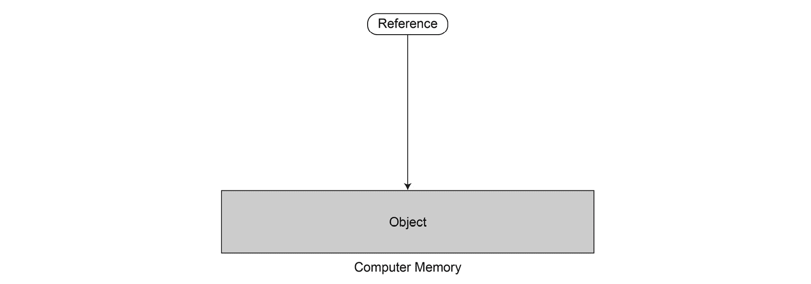
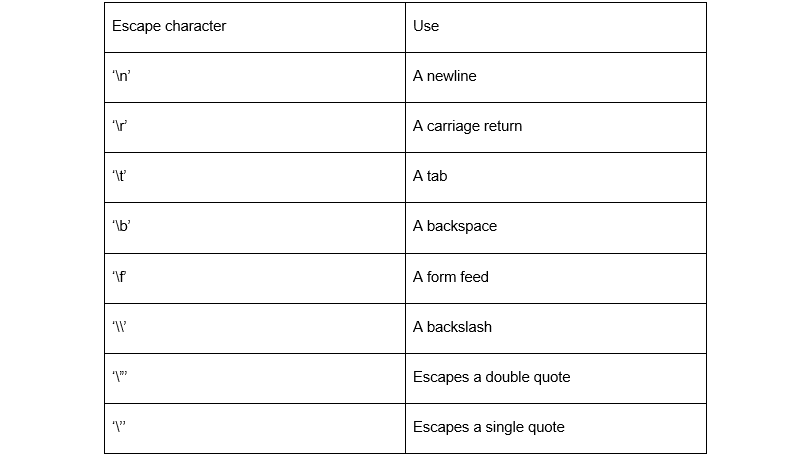

# 二、变量、数据类型和运算符

## 学习目标

本课程结束时，您将能够：

*   在 Java 中使用基本数据类型
*   在 Java 中使用引用类型
*   实现简单的算术运算
*   使用类型铸造方法
*   输入和输出各种数据类型

## 导言

在上一课中，我们介绍了 Java 生态系统以及开发 Java 程序所需的工具。在本课中，我们将通过查看 Java 语言中的基本概念（如变量、数据类型和操作）开始 Java 语言的旅程。

## 变量和数据类型

计算机编程的基本概念之一是内存，用于在计算机中存储信息。计算机使用位作为可以存储的最小信息。位是 1 或 0。我们可以将 8 位分组，得到所谓的**字节**。由于位非常小，我们通常在编程时将字节作为最小的单位来处理。当我们编写程序时，我们实际上是从某个内存位置提取一些位，对它们执行一些操作，然后将结果写回内存位置。

我们需要一种在计算机内存中存储不同类型数据的方法，并告诉计算机在哪个内存位置存储了什么类型的数据。

数据类型是我们指定需要在给定内存位置存储的数据类型和大小的一种方法。数据类型的一个示例是整数、字符或字符串。一般来说，Java 中可用的数据类型可分为以下类型：

*   基本数据类型
*   参考数据类型

**基元类型**是基本类型，即不能修改。它们是不可分割的，是形成复杂类型的基础。Java 中有八种基本数据类型，我们将在后续章节中详细介绍：

*   字节
*   短的
*   int
*   长的
*   烧焦
*   浮动
*   双重的
*   布尔值

**引用类型**是指存储在特定存储位置的数据的类型。它们本身并不保存数据，而是保存数据的地址。稍后将介绍的对象是引用类型的示例：



###### 图 2.1：参考类型的表示

所有数据类型都具有以下公共属性：

*   它们与一个值相关联。
*   它们根据所持有的价值支持某些操作。
*   它们占用内存中给定数量的位。

例如，一个整数可以有一个值，比如 100，支持加减运算，并且在计算机内存中使用 32 位来表示。

### 变量

每当我们想要处理给定的数据类型时，我们必须创建该数据类型的变量。例如，要创建一个包含年龄的整数，可以使用如下行：

```java
int age;
```

这里，我们说这个变量叫做**age**，是一个整数。整数只能保存-2147483648 到 2147483647 范围内的值。尝试将值保持在范围之外将导致错误。然后我们可以为**年龄**变量赋值，如下所示：

```java
age = 30;
```

**年龄**变量现在保存值 30。单词**age**称为**标识符**，用于表示存储值 30 的存储位置。标识符是用于引用值的内存地址的人类可读字。

您可以使用自己选择的单词作为标识符来引用相同的内存地址。例如，我们可以这样写：

```java
int myAge ;
myAge = 30;
```

以下是前面代码段的图形表示：


###### 图 2.2：内存地址中的年龄表示

正如我们可以使用任何单词作为标识符一样，Java 对有效标识符的组成有一些规则。以下是创建标识符名称时要遵循的一些规则：

*   标识符应以字母**或**$**开头。它们不能以数字开头。**
***   标识符只能包含有效的 unicode 字符和数字。*   标识符之间不能有空格。*   标识符可以是任意长度。*   标识符不能是保留关键字。*   标识符不能有算术符号，如+或-。*   标识符区分大小写，例如，年龄和年龄不是相同的标识符。**

 **### 保留关键字

Java 还包含保留的内置字，不能用作标识符。这些词在语言中有特殊的含义。

现在让我们讨论 Java 中的基本数据类型。如前所述，Java 有 8 种基本数据类型，我们将详细介绍它们。

## 整型数据类型

整数类型是具有整数值的类型。它们是 int、long、short、byte 和 char。

### int 数据类型

**int**数据类型用于表示整数。整数是介于-2147483648 到 2147483647 之间的 32 位数字。整数的示例为 0、1300、500、389 230、1345543、-500、-324145 以及该范围内的其他整数。例如，要创建一个**int**变量来保存值 5，我们编写以下代码：

```java
int num = 5;
```

**num**变量现在是一个值为 5 的**int**。我们还可以在一行中声明多个相同类型的变量：

```java
int num1, num2, num3, num4, num5;
```

在这里，我们创建了五个变量，都是**int**类型，并初始化为零。我们还可以将所有变量初始化为特定值，如下所示：

```java
int num1 = 1, num2 = 2, num3 = 3, num4 = 4, num5 = 5;
```

除了以十进制格式表示整数外，我们还可以以八进制、十六进制和二进制格式表示整数：

*   To express in hexadecimal format, we start the **int** with 0x or 0X, that is, a zero followed by x or X. The number has to be at least 2 digits in length. Hexadecimal numbers use 16 digits (0-9 and A-F). For example, to express 30 in hexadecimal, we would use the following code:

    ```java
    int hex_num = 0X1E;
    ```

    打印数字将按预期输出 30。要在十六进制中保存值为 501 的整数，我们将编写以下代码：

    ```java
    int hex_num1 = 0x1F5;
    ```

*   To express in octal format, we start the **int** with a zero and must have at least 2 digits. Octal numbers have 8 digits. For example, to express 15 in octal, we would do the following:

    ```java
    int oct_num = 017;
    ```

    尝试打印前面的变量将输出 15。要以八进制表示 501，我们将执行以下操作：

    ```java
    int oct_num1 = 0765;
    ```

*   为了以二进制格式表示，我们以 0b 或 0b 开始**int**，即零后跟 b 或 b。大小写无关紧要。例如，要以二进制形式保存值 100，我们将执行以下操作：

    ```java
    int bin_num = 0b1100100;
    ```

*   要以二进制形式保存数字 999，我们将执行以下操作：

    ```java
    int bin_num1 = 0B1111100111;
    ```

作为上述四种表示整数格式的总结，以下所有变量的值均为 117：

```java
int num = 117;
int hex_num = 0x75;
int oct_num = 0165;
int bin_num = 0b1110101;
```

### 长数据类型

**长**是一个 64 位的整数等价物。它们包含的数字范围为-9223372036854775808 到 9223372036854775807。long 类型的数字称为 long literal，并在末尾用 L 表示。例如，要声明值为 200 的 long，我们将执行以下操作：

```java
long long_num = 200L;
```

要声明值为 8 的**长**，我们将执行以下操作：

```java
long long_num = 8L;
```

由于整数是 32 位的，因此位于长的范围内，我们可以将一个**int**转换为一个**long**。

## 型铸造

要将值为 23 的**int**转换为长文本，我们需要执行所谓的**类型转换**：

```java
int num_int = 23;
long num_long = (long)num_int;
```

在第二行中，我们使用符号**（long）num_int**将**int**类型的**num_int**转换为长文字。这被称为**铸造**。转换是将一种数据类型转换为另一种数据类型的过程。虽然我们可以对**整数**进行长距离转换，但请记住，该数字可能超出**整数**范围，如果无法放入整数，则某些数字将被截断。

与**int**一样，**long**也可以是八进制、十六进制和二进制，如下代码所示：

```java
long num = 117L;
long hex_num = 0x75L;
long oct_num = 0165L;
long bin_num = 0b1110101L;
```

### 练习 5：类型铸造

将一种类型更改为另一种类型通常很重要。在本练习中，我们将把整数转换为浮点：

1.  导入**扫描仪**并创建公共类：

    ```java
    import java.util.Scanner;

    public class Main

    { 
        static Scanner sc = new Scanner(System.in);
        public static void main(String[] args) 
    ```

2.  输入一个整数：

    ```java
    { 
        System.out.println("Enter a Number: ");
        int num1 = sc.nextInt();
    ```

3.  打印出整数：

    ```java
    System.out.println("Entered value is: " + num1);
    ```

4.  将整数转换为浮点：

    ```java
    float fl1 = num1;
    ```

5.  打印出浮点：

    ```java
    System.out.print("Entered value as a floating point variable is: " + fl1);

        } 

    }
    ```

### 字节数据类型

**字节**是一个 8 位数字，可以保存-128 到 127 范围内的值。**字节**是 Java 中最小的原始数据类型，可以用来保存二进制值。要将值分配给**字节**，它必须在-128 到 127 之间，否则编译器将引发错误：

```java
byte num_byte = -32;
byte num_byte1 = 111;
```

您还可以将一个**int**强制转换为**字节**，就像我们对**long**所做的那样：

```java
int num_int = 23;
byte num_byte = (byte)num_int;
```

除了强制转换之外，我们还可以将一个**字节**分配给一个**int**：

```java
byte num_byte = -32;
int num_int = num_byte;
```

然而，我们不能在不强制转换的情况下直接将**int**分配给**字节**。尝试运行时，以下代码将引发错误：

```java
int num_int = 23;
byte num_byte = num_int;
```

这是因为整数可能超出字节范围（-128 到 127），因此会丢失一些精度。Java 不允许将超出范围的类型分配给较低范围的类型。您必须强制转换，以便忽略溢出位。

### 短数据类型

**short**是一种 16 位数据类型，可以保存-32768 到 32767 范围内的数字。要为**短**变量赋值，请确保它在指定范围内，否则将抛出错误：

```java
short num = 13000;
short num_short = -18979;
```

您可以将一个**字节**分配给一个**短**，因为一个字节的所有值都在短的范围内。但是，如**字节**和**int**所述，反向操作将抛出错误。要将**int**转换为**short**，必须强制转换以避免编译错误。这也适用于将**长**转换为**短**：

```java
short num = 13000;
byte num_byte = 19;
num = num_byte; //OK
int num1 = 10;
short s = num1; //Error
long num_long = 200L;
s = (short)num_long; //OK
```

### 布尔数据类型

**布尔值**是真值还是假值：

```java
boolean finished = true;
boolean hungry = false;
```

#### 笔记

有些语言，如 C 和 C++，允许 Booleans 取真值 1，假值取 0。Java 不允许将 1 或 0 分配给 Boolean，这将引发编译时错误。

### 字符数据类型

**字符**数据类型用于保存单个字符。字符用单引号括起来。字符的示例有“a”、“b”、“z”和“5”。字符类型为 16 位，不能为负。字符类型本质上是 0 到 65535 之间的整数，用于表示 Unicode 字符。如何声明字符的示例如下：

```java
char a = 'a';
char b = 'b';
char c = 'c';
char five = '5';
```

请注意，字符用单引号括起来，而不是双引号。在双引号中包含一个**字符**会将其更改为**字符串**。**字符串**是一个或多个字符的集合。字符串的一个示例是“Hello World”：

```java
String hello = "Hello World";
```

将**字符**括在双引号中将引发错误，因为编译器将双引号解释为**字符串**，而不是字符：

```java
char hello = "Hello World"; //ERROR
```

同样，在单引号中包含多个字符会引发编译器错误，因为字符应仅为一个字符：

```java
String hello = 'Hello World'; //ERROR
```

除了用于保存单个字符的字符外，它们还可用于保存转义字符。转义字符是具有特殊用途的特殊字符。它们由反斜杠和字符组成，并用单引号括起来。有 8 个预定义的转义字符及其用法，如下表所示：



###### Ta 表 2.1：转义字符的表示及其使用

假设您写了一行，如下所示：

```java
char nl = '\n';
```

**字符**包含一个换行符，如果您尝试将其打印到控制台，它将跳到下一行。

如果打印**'\t'**，输出中将转义一个制表符：

```java
char tb = '\t';
```

“**\\**”将在输出中打印反斜杠。

您可以使用转义字符根据所需输出格式化字符串。例如，让我们看看下面这行：

```java
String hello_world = "Hello \n World";
```

以下是输出：

```java
Hello 
 World
```

这是因为转义字符“**\n**在**Hello**和**World**之间引入了一条新行。

此外，还可以使用 Unicode 转义字符“**\u**”以 Unicode 表示字符。Unicode 是一种国际编码标准，其中为字符分配一个可在任何平台上使用的数值。Unicode 旨在支持世界上所有可用的语言，这与 ASCII 不同。

### 浮点数据类型

浮点数据类型是表示形式中有小数部分的数字。示例包括 3.2、5.681 和 0.9734。Java 有两种数据类型来表示带有小数部分的类型：

*   **浮动**
*   **双**

浮点类型使用称为 IEEE 754 浮点标准的特殊标准表示。本标准由电气和电子工程师协会（IEEE）制定，旨在使计算的低级别部分中的浮动类型表示统一。请记住，浮动类型通常是近似值。当我们说 5.01 时，这个数字必须用二进制格式表示，并且表示通常是实数的近似值。在使用高性能程序时，必须将值测量到微数量级，因此必须了解浮动类型在硬件级别的表示方式，以避免精度损失。

浮动类型有两种表示法：十进制格式和科学记数法。

十进制格式是我们通常使用的正常格式，如 5.4、0.0004 或 23423.67。

科学记数法是用字母 e 或 e 表示一个十升为一个值。例如，科学记数法中的 0.0004 是 4E-4 或 4E-4，与 4x10-4 类似。科学记数法中的数字 23423.67 是 2.342367E4 或 2.342367E4，与 2.342367x104 相似。

### 浮点数据类型

**浮点**用于保存范围为 1.4x10-45，最大为 3.4x1038 的 32 位小数。也就是说，**浮动**可以容纳的最小数字是 1.4x10-45，它可以容纳的最大数字是 3.4x1038。浮点数后接字母 f 或 f，表示浮点数为**浮点数**类型。浮点数示例如下所示：

```java
float a = 1.0f;
float b = 0.0002445f;
float c = 93647.6335567f;
```

浮点数也可以用科学符号表示，如下所示：

```java
float a = 1E0f;
float b = 2.445E-4f;
float c = 9.36476335567E+4f;
```

Java 还有一个名为 Float 的类，它可以封装 Float 并提供一些有用的特性。例如，要知道您环境中可用的最大**浮动**号码和最小**浮动**号码，您可以调用以下命令：

```java
float max = Float.MAX_VALUE;
float min = Float.MIN_VALUE;
```

Float 类还有一些值，用于在被零除时表示正无穷大和负无穷大：

```java
float max_inf = Float.POSITIVE_INFINITY;
float min_inf = Float.NEGATIVE_INFINITY;
```

浮动支持两种类型的零：-0.0f 和+0.0f。正如我们已经说过的，浮点类型在内存中表示为近似值，因此即使是零也不是绝对零。这就是为什么我们有两个零。当一个数字被正零除时，我们得到**浮点数。正无穷大**，当一个数字被负零除时，我们得到**浮点数。负无穷大**。

 **Float 类还具有常量**NaN**以指示不是**Float**类型的数字：

```java
float nan = Float.NaN;
```

与前面讨论的整数类型一样，我们可以将**int**、**byte**、**short**、**long**和 char 分配给 float，但除非进行强制转换，否则不能执行相反的操作。

#### 笔记

将整数转换为浮点数，然后再转换回**int**并不总是得到原始数字。在**int**和**浮子**之间进行铸造时要小心。

### 双数据类型

**双精度**保存带小数部分的 64 位数字。也就是说，范围为 4.9 x 10e-324 到 1.7 x 10e 308。double 用于保存比 float 更大的数字。它们在末尾用 d 或 d 表示。但是，默认情况下，在 Java 中，任何带有小数部分的数字都是一个**双**，因此通常不需要在末尾附加 d 或 d。双打的例子如下：

```java
double d1  = 4.452345;
double d2 = 3.142;
double d3 = 0.123456;
double d4 = 0.000999;
```

与浮点数一样，双精度也可以用科学记数法表示：

```java
double d1  = 4.452345E0;
double d2 = 3.142E0;
double d3 = 1.23456E-1;
double d4 = 9.99E-4;
```

正如您可能已经猜到的，Java 还提供了一个名为**Double**的类，其中包含一些有用的常量，如下代码所示：

```java
double max = Double.MAX_VALUE;
double min = Double.MIN_NORMAL;
double max_inf = Double.POSITIVE_INFINITY;
double min_inf = Double.NEGATIVE_INFINITY;
double nan = Double.NaN;
```

同样地，我们可以将整数类型和**浮点**分配给**双精度**，除非将**布尔**类型分配给**双精度**。以下是允许和禁止的示例操作：

```java
int num = 100;
double d1 = num;
float f1 = 0.34f;
double d2 = f1;
double d3 = 'A'; //Assigns 65.0 to d3
int num  = 200;
double d3 = 3.142;
num = d3; //ERROR: We must cast
num = (int)d3; //OK
```

### 活动 4：输入学生信息并输出 ID

在任何开发环境中，在 Foundation 中存储和输出变量。在本活动中，您将创建一个程序，要求学生输入数据，然后输出一张简单的身份证。程序将在**java.util**包中使用整数和字符串以及 scanner 类。

以下活动使用字符串变量和整数变量输入有关学生的信息，然后打印出来。

1.  导入 scanner 包并创建一个新类。
2.  将学生姓名作为字符串导入。
3.  将大学名称作为字符串导入。
4.  将学生的年龄作为整数导入。
5.  使用**System.out.println**打印学生详细信息。
6.  After running the program, the output should be similar to this:

    ```java
    Here is your ID 
    *********************************
    Name: John Winston
    University: Liverpool University
    Age: 19
    *********************************
    ```

    #### 笔记

    有关此活动的解决方案，请参见第 306 页。

### 活动 5：计算装满水果盒的数量

约翰是个桃农。他从树上摘下桃子，把它们放进水果盒里运出去。如果一个水果盒装满了 20 个桃子，他就可以装运。如果他只有不到 20 个桃子，他必须采更多的桃子，这样他就可以用 20 个桃子装满一个水果盒，然后装运。

我们想帮助 John 计算他可以运送的水果盒的数量和留下的桃子的数量，考虑到他能够采摘的桃子的数量。为此，请执行以下步骤：

1.  新建一个类，输入**PeachCalculator**作为类名
2.  导入**java.util.Scanner**包：
3.  在**main（）**中，使用**System.out.print**向用户查询**numberOfPeaches**。
4.  计算**numberofullboxs**和**numberOfPeachesLeft**值。提示：使用整数除法。
5.  使用**System.out.println**输出这两个值。
6.  Run the main program.

    输出应类似于：

    ```java
    Enter the number of peaches picked: 55
    We have 2 full boxes and 15 peaches left.
    ```

    #### 笔记

    此活动的解决方案见第 307 页。

## 总结

在本课中，我们学习了原语和引用数据类型的使用，以及 Java 中数据的简单算术运算。我们学习了如何将数据类型从一种类型转换为另一种类型。然后我们了解了如何处理浮点数据类型。

在下一课中，我们将使用条件语句和循环结构。****