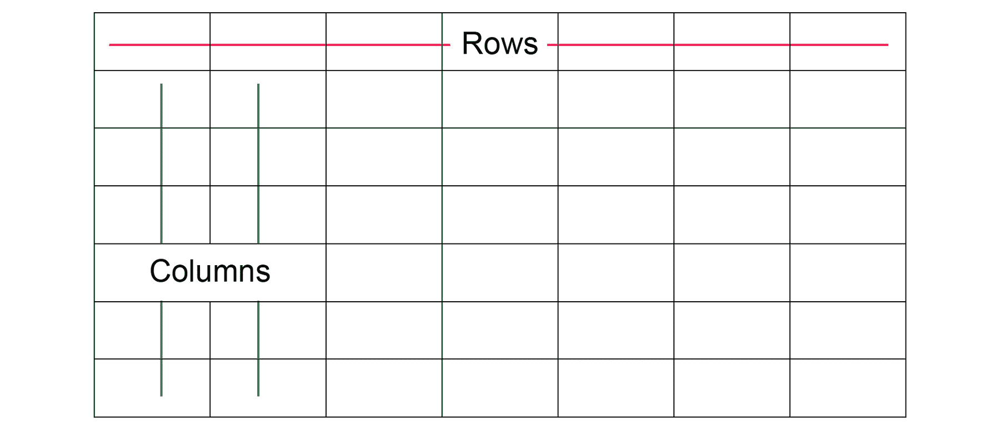
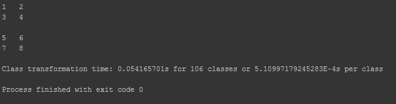
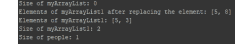
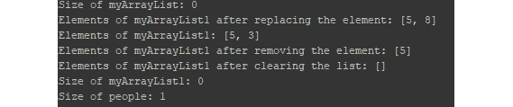
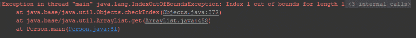
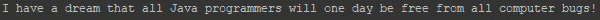
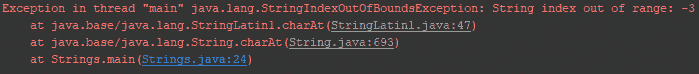
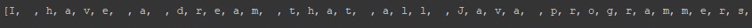

# 六、数据结构、数组和字符串

## 学习目标

本课程结束时，您将能够：

*   创建和操作各种数据结构，如数组
*   描述编程算法背后的基本原理
*   为数组编写简单的排序程序
*   输入并对字符串执行操作

## 导言

这是我们讨论 OOP 的最后一个主题。到目前为止，我们已经研究了类和对象，以及如何使用类作为蓝图来创建多个对象。我们看到了如何使用方法来保存类的逻辑，以及如何使用字段来保存状态。我们已经讨论了类如何从其他类继承一些属性，以便于代码的重用。

我们还研究了多态性，或者类如何重新定义从超类继承的方法的实现；和重载，或者我们如何使用相同名称的多个方法，只要它们具有不同的签名。我们还讨论了函数或方法。

我们在上一课中已经介绍了类型转换和接口，以及类型转换是如何将对象从一种类型更改为另一种类型的，只要它们位于同一层次结构树上。我们讨论了向上投射和向下投射。另一方面，接口是我们定义泛型行为的一种方式，我们的类可以提供它们自己的特定实现。

在本节中，我们将介绍 Java 附带的几个常见类。这些是你会发现自己每天都在使用的类，因此了解它们很重要。我们还将讨论数据结构，并讨论 Java 附带的常见数据结构。请记住，Java 是一种广泛的语言，这个列表并不详尽。一定要抽出时间看看官方的 Java 规范，以了解更多关于您可以使用的其他类的信息。在本课程中，我们将介绍一个主题，给出示例程序来说明概念，然后我们将以一个练习结束。

## 数据结构和算法

算法是为实现最终目标而应遵循的一组指令。它们是特定于计算的，但我们经常谈论在计算机程序中完成特定任务的算法。当我们编写计算机程序时，我们通常实现算法。例如，当我们想要对数组或数字列表进行排序时，我们通常会想出一个算法来实现。它是计算机科学中的一个核心概念，对于任何优秀的程序员来说理解它都很重要。我们有排序、搜索、图形问题、字符串处理等算法。Java 附带了许多已经为您实现的算法。然而，我们仍然有自己的定义范围。

数据结构是存储和组织数据以便于访问和修改的一种方式。数据结构的一个示例是用于保存多个相同类型项的数组或用于保存键值对的映射。没有一个单一的数据结构适用于所有目的，因此了解它们的优势和局限性很重要。Java 有许多预定义的数据结构，用于存储和修改不同类型的数据。在接下来的章节中，我们还将介绍其中的一些内容。

排序不同类型的数据是计算机程序中的一项常见任务。

### 阵列

在*第 3 课*、*控制**流*中，当我们研究循环时，我们提到了数组，但值得更仔细地研究一下，因为它们是强大的工具。数组是有序项的集合。它用于保存多个相同类型的项目。Java 中的数组示例可以是**{1，2，3，4，5，6，7}**，它保存整数 1 到 7。此数组中的项数为 7。数组还可以保存字符串或其他对象，如下所示：

```java
{"John","Paul","George", "Ringo"}
```

我们可以使用数组的索引来访问数组中的项。索引是项在数组中的位置。数组中的元素从**0**索引。即第一个数字位于索引**0**，第二个数字位于索引**1**，第三个数字位于索引**2**，依此类推。在我们的第一个示例数组中，最后一个数字位于索引**6**。

为了能够从数组中访问一个元素，我们使用**myArray[0]**访问**myArray**中的第一项，**myArray[1]**访问第二项，然后使用**myArray[6]**访问第七项。

Java 允许我们定义基本类型和对象（如引用类型）的数组。

数组还有一个大小，即该数组中的项数。在 Java 中，创建数组时，必须指定其大小。创建阵列后，无法更改此大小。


###### 图 6.1：空数组

### 创建并初始化数组

要创建数组，需要声明数组的名称、包含的元素类型及其大小，如下所示：

```java
int[] myArray = new int[10];
```

我们使用方括号**【】**表示数组。在本例中，我们正在创建一个整数数组，其中包含 10 个项目，索引范围为 0 到 9。我们指定项目的数量，以便 Java 能够为元素保留足够的内存。我们还使用**new**关键字来表示一个新数组。

例如，要声明 10 个双精度数组，请使用以下命令：

```java
double[] myArray = new double[10];
```

要声明包含 10 个布尔值的数组，请使用以下命令：

```java
boolean[] myArray = new boolean[10];
```

要声明 10 个**Person**对象的数组，请使用以下命令：

```java
Person[] people = new Person[10];
```

您还可以创建一个数组，同时声明数组中的项（初始化）：

```java
int[] myArray = {0, 1, 2, 3, 4, 5, 6, 7, 8, 9};
```

### 访问元素

为了访问数组元素，我们使用方括号中的索引。例如，要访问第四个元素，我们使用**myArray[3]**，要访问第十个元素，我们使用**myArray[9]**。

下面是一个例子：

```java
int first_element = myArray[0];
int last_element = myArray[9];
```

为了获得数组的长度，我们使用了**length**属性。它返回一个整数，该整数是数组中的项数：

```java
int length = myArray. length;
```

如果数组中没有项目，**长度**为 0。我们可以使用**长度**和一个循环将项目插入数组。

### 练习 14：使用循环创建数组

使用控制流命令创建长数组可能很有用。这里我们将使用循环的**来创建一个 0-9 之间的数字数组。**

1.  创建一个以**DataStr**为类名的新类，设置**main**方法如下：

    ```java
    public class DataStr {
    public static void main(String[] args){
    }
    ```

2.  创建一个长度为 10 的整数数组，如下所示：

    ```java
    int[] myArray = new int[10];
    ```

3.  为循环初始化一个**，变量从零开始，循环每次迭代递增一，条件小于数组长度：

    ```java
    for (int i = 0; i < myArray.length; i++)
    ```** 
4.  将项目**i**插入数组：

    ```java
    {
    myArray[i] = i;
    }
    ```

5.  Use a similar loop construct to print out the loop:

    ```java
    for (int i = 0; i < myArray.length; i++){
    System.out.println(myArray[i]);
    }
    ```

    完整代码应如下所示：

    ```java
    public class DataStr {
        public static void main(String[] args){
            int[] myArray = new int[10];
            for (int i = 0; i < myArray.length; i++){
                myArray[i] = i;
            }
            for (int i = 0; i < myArray.length; i++){
                System.out.println(myArray[i]);
            }
        }
    }
    ```

    您的输出应如下所示：


###### 图 6.2:DataStr 类的输出

在本练习中，我们使用循环的第一个**将项目插入**myArray**中，第二个用于打印项目。**

如前所述，我们可以将循环的第二个**替换为**循环的第二个**，这将大大缩短代码的长度，使代码更易于阅读：**

```java
for (int i : myArray) {
System.out.println(i);
}
```

Java 为我们自动执行绑定检查-如果您创建了一个大小为 N 的数组，并且使用了一个值小于 0 或大于 N-1 的索引，那么您的程序将以一个**ArrayOutOfBoundsException**异常终止。

### 练习 15：在数组中搜索数字

在本练习中，您将检查用户输入的数字是否存在于数组中。为此，请执行以下步骤：

1.  定义一个名为**NumberSearch**的新类，并在其中包含**main**方法：

    ```java
    public class NumberSearch {
    public static void main(String[] args){
    }
    }
    ```

2.  确保在顶部导入此包，用于从输入设备读取值：

    ```java
    import java.util.Scanner;
    ```

3.  声明存储整数 2、4、7、98、32、77、81、62、45、71 的数组样本：

    ```java
    int [] sample = { 2, 4, 7, 98, 32, 77, 81, 62, 45, 71 }; 
    ```

4.  从用户处读取编号：

    ```java
    Scanner sc = new Scanner(System.in);
    System.out.print("Enter the number you want to find: ");
    int ele = sc.nextInt();
    ```

5.  Check whether the **ele** variable matches any of the items in the array sample. To do this we iterate through the loop and check whether each element of the array matches the element entered by the user:

    ```java
    for (int i = 0; i < 10; i++) {
      if (sample[i] == ele) {
        System.out.println("Match found at element " + i);
        break;
    }
    else
      {
        System.out.println("Match not found");
        break;
      }
    }
    ```

    您的输出应与此类似：

    

###### 图 6.3:NumberSearch 类的输出

### 活动 21：寻找数组中的最小数

在本活动中，我们将获取一个由 20 个未排序的数字组成的数组，并在该数组中循环查找最小的数字。

步骤如下：

1.  创建一个名为**ExampleArray**的类，并创建**main**方法。
2.  创建一个由 20 个浮点组成的数组，如下所示：

    ```java
    14, 28, 15, 89, 46, 25, 94, 33, 82, 11, 37, 59, 68, 27, 16, 45, 24, 33, 72, 51
    ```

3.  在数组中为每个循环创建一个**，并找到数组中的最小元素。**
4.  Print out the minimum float.

    #### 笔记

    此活动的解决方案可在第 335 页找到。

### 活动 22：带运算符数组的计算器

在本活动中，您将更改计算器，使其更具动态性，并使添加新运算符更容易。为此，您将把所有可能的运算符添加到一个数组中，并使用 For 循环来确定要使用的运算符，而不是将所有可能的运算符设置为不同的字段。

要完成此活动，您需要：

1.  创建一个类**运算符**，该类将包含根据字符串确定要使用哪个运算符的逻辑。在此类中创建一个公共常量字段**默认 _ 运算符**，它将成为**运算符**类的实例。然后创建另一个名为**运算符**的常量字段，其类型为**运算符**数组，并使用您拥有的每个运算符的实例对其进行初始化。
2.  在**操作符**类中，添加一个名为**findOperator**的公共静态方法，该方法将操作符作为字符串接收，并返回**操作符**的实例。在它内部，遍历可能的操作符数组，并使用每个操作符的 matches 方法，返回所选操作符，如果它不匹配任何操作符，则返回默认操作符。
3.  使用 DynamicOperator 类创建一个新的**计算器，该类有三个字段：**操作数 1**和**运算符 2**作为双精度运算符，以及**运算符**类型的**运算符**。**
4.  添加一个接受三个参数的构造函数：double 类型的操作数 1 和操作数 2，以及作为字符串的运算符。在构造函数中，使用**Operators.findOperator**方法设置运算符字段，而不是使用 if-else 来选择运算符。
5.  Add a **main** method where you call the **Calculator** class multiple times and print the results.

    #### 笔记

    有关此活动的解决方案，请参见第 336 页。

### 二维阵列

到目前为止，我们所看到的数组被称为一维数组，因为所有元素都可以被视为在一行上。我们还可以声明同时具有列和行的数组，就像矩阵或网格一样。多维数组是我们前面看到的一维数组的数组。也就是说，您可以将其中一行视为一维数组，然后列是多个一维数组。

在描述多维数组时，我们称该数组为 M×N 多维数组，表示该数组有 M 行，每行长度为 N，例如，一个 6×7 的数组：



###### 图 6.4：多维数组的图形表示

在 java 中，为了创建二维数组，我们使用双方括号，**[M][N]**。此符号创建一个 M-by-N 数组。然后，我们可以使用符号**[i][j][T3】引用数组中的单个项，以访问*i**第*行和*j*第*第*列中的元素。**

要创建 8×10 的多维双精度数组，请执行以下操作：

```java
double[][] a = new double[8][10];
```

Java 将所有数值类型初始化为零，布尔值初始化为 false。我们还可以在数组中循环并手动将每个项初始化为我们选择的值：

```java
double[][] a = new double[8][10];
for (int i = 0; i < 8; i++)
for (int j = 0; j < 10; j++)
a[i][j] = 0.0;
```

### 练习 16：打印简单的二维数组

要打印简单的二维数组，请执行以下步骤：

1.  在名为**Twoarray**：

    ```java
    public class Twoarray {
        public static void main(String args[]) {
        }
    }
    ```

    的新类文件中设置**main**方法
2.  通过向数组中添加元素来定义**arr**数组：

    ```java
    int arr[][] = {{1,2,3}, {4,5,6}, {7,8,9}};
    ```

3.  为循环创建嵌套的**。**循环的外部**是按行打印元素，**循环的内部**是按列打印元素：

    ```java
            System.out.print("The Array is :\n");
            for (int i = 0; i < 3; i++) {
                for (int j = 0; j < 3; j++) {
                    System.out.print(arr[i][j] + "  ");
                }
                System.out.println();
            }
    ```** 
4.  运行程序。您的输出应与此类似：


###### 图 6.5:Twoarray 类的输出

使用数组的其余大部分操作与使用一维数组的操作基本相同。需要记住的一个重要细节是，在多维数组中，使用**a[i]**返回一个一维数组行。您必须使用第二个索引来访问所需的确切位置，**a[i][j]**。

#### 笔记

Java 还允许您创建高阶维数组，但处理它们会变得复杂。这是因为我们的大脑可以很容易地理解三维阵列，但高阶阵列变得难以可视化。

### 练习 17：创建三维阵列

在这里，我们将创建一个三维的**（x，y，z）**整数数组，并将每个元素初始化为其行、列和深度（x*y*z）索引的乘积。

1.  创建一个名为**Threearray**的新类，并设置**主**方法：

    ```java
    public class Threearray
    {
        public static void main(String args[])
        {
        }
    }
    ```

2.  声明维度为**[2][2][2]**：

    ```java
    int arr[][][] = new int[2][2][2];
    ```

    的**arr**数组
3.  声明迭代变量：

    ```java
    int i, j, k, num=1;
    ```

4.  为相互嵌套的循环创建三个**，以便将值写入三维数组：

    ```java
    for(i=0; i<2; i++)
      {
        for(j=0; j<2; j++)
          {
            for(k=0; k<2; k++)
             {
             arr[i][j][k] = no;
             no++;
         }
      }
    }
    ```** 
5.  Print the elements out of the array using the three **for** loops that are nested within each other:

    ```java
    for(i=0; i<2; i++)
      {
      for(j=0; j<2; j++)
        {
          for(k=0; k<2; k++)
          {
          System.out.print(arr[i][j][k]+ "\t");
          }
        System.out.println();
        }
      System.out.println();
      }
    }
    }
    }
    }
    }
    ```

    完整代码应如下所示：

    ```java
    public class Threearray
    {
        public static void main(String args[])
        {
            int arr[][][] = new int[2][2][2];
            int i, j, k, num=1;
            for(i=0; i<2; i++)
            {
                for(j=0; j<2; j++)
                {
                    for(k=0; k<2; k++)
                    {
                        arr[i][j][k] = num;
                        num++;
                    }
                }
            }
            for(i=0; i<2; i++)
            {
                for(j=0; j<2; j++)
                {
                    for(k=0; k<2; k++)
                    {
                        System.out.print(arr[i][j][k]+ "\t");
                    }
                    System.out.println();
                }
                System.out.println();
            }
        }
    }
    ```

    结果如下：



###### 图 6.6:Threearray 类的输出

### Java 中的数组类

Java 提供了**数组**类，该类提供了可用于数组的静态方法。使用此类通常更容易，因为我们可以访问排序、搜索等方法。这个类在**java.util.Arrays**包中提供，因此在我们使用它之前，请将这一行放在您想要使用它的任何文件的顶部：

```java
import java.util.Arrays;
```

在下面的代码中，我们可以看到如何使用**数组**类和一些我们可以使用的方法。在代码片段之后解释了所有方法：

```java
import java.util.Arrays;
class ArraysExample {
public static void main(String[] args) {
double[] myArray = {0.0, 1.0, 2.0, 3.0, 4.0, 5.0, 6.0, 7.0, 8.0, 9.0};
System.out.println(Arrays.toString (myArray)); 
Arrays.sort(myArray);
System.out.println(Arrays.toString (myArray));
Arrays.sort(myArray);
int index = Arrays.binarySearch(myArray,7.0);
System.out.println("Position of 7.0 is: " + index);
}
}
```

这是输出：


###### 图 6.7:ArraysExample 类的输出

在这个程序中，我们有三个使用**数组**类的示例。在第一个示例中，我们看到了如何使用**array.toString（）**轻松打印出数组的元素，而无需使用前面使用的循环的**。在第二个示例中，我们看到了如何使用**array.sort（）**对数组进行快速排序。如果我们自己实现这样一种方法，我们将使用更多的行，并且在过程中容易犯很多错误。**

在上一个示例中，我们对数组进行排序，然后使用**arrays.binarySearch（）**搜索 7.0，它使用了一种称为**二进制搜索**的搜索算法。

#### 笔记

**Arrays.sort（）**使用一种称为双枢轴快速排序的算法对大型数组进行排序。对于较小的数组，它使用插入排序和合并排序的组合。最好相信**array.sort（）**是针对每个用例优化的，而不是实现您自己的排序算法。**数组。binarySearch（）**使用一种称为二进制搜索的算法来查找数组中的项。它首先需要对数组进行排序，这就是为什么我们首先调用**数组。sort（）**。二进制搜索将排序后的数组递归地分成两等分，直到它不能再分割数组为止，此时该值就是答案。

### 插入排序

排序是计算机科学中算法的基本应用之一。插入排序是排序算法的一个经典示例，尽管它效率低下，但在研究数组和排序问题时，它是一个很好的起点。该算法的步骤如下：

1.  取数组中的第一个元素，假设它已经排序，因为它只有一个。
2.  拾取数组中的第二个元素。将其与第一个元素进行比较。如果大于第一个元素，则这两个项目已排序。如果小于第一个元素，则交换这两个元素，以便对它们进行排序。
3.  以第三个元素为例。将其与已排序子数组中的第二个元素进行比较。如果较小，则交换两个。将其与第一个元素再次进行比较。如果较小，则再次交换两个，使其成为第一个。现在将对这三个元素进行排序。
4.  取第四个元素并重复此过程，如果它小于其左邻居，则交换，否则将其保留在原来的位置。
5.  对数组中的其余项重复此过程。
6.  结果数组将被排序。

### 示例

以阵列**[3,5,8,1,9]**为例：

1.  让我们假设第一个元素已排序：**【3】**。
2.  以第二个元素 5 为例。因为它大于 3，所以我们将数组保持原样：**【3，5】**。
3.  以第三个元素 8 为例。它大于 5，所以这里也没有交换：**[3,5,8]**。
4.  以第四个元素 1 为例。因为它小于 8，所以我们将 8 和 1 交换为：**[3,5,1,8]**。
5.  由于 1 仍然小于 5，我们再次交换这两个：**[3,1,5,8]**。
6.  1 仍然小于 3。我们再次交换：**【1,3,5,8】**。
7.  它现在是最小的。
8.  以最后一个元素 9 为例。它大于 8，因此没有交换。
9.  整个数组现在已排序：**【1,3,5,8,9】**。

### 练习 18：实现插入排序

在本练习中，我们将实现插入排序。

1.  创建一个名为**InsertionSort**的新类，在该类中创建**main**方法：

    ```java
    public class InsertionSort {
    public static void main(String[] args){
    }
    }
    ```

2.  在我们的**主**方法中，创建一个随机整数样本数组，并将其传递给我们的**排序**方法。使用以下数组[1,3,354,64,364,64,3,4,74,2,46]：

    ```java
    int[] arr = {1, 3,354,64,364,64, 3,4 ,74,2 , 46};
    System.out.println("Array before sorting is as follows: ");
    System.out.println(Arrays.toString(arr));
    ```

3.  使用我们的数组调用**sort（）**后，使用**foreach**循环打印已排序数组中的每个项目，并在单行中留出空格：

    ```java
    sort(arr);
            System.out.print("Array after sort looks as follows: ");
            for (int i : arr) {
                System.out.print(i + " ");
            }
        }
    }
    ```

4.  Create a public static method called **sort()** that takes an array of integers and returns **void**. This is the method that will have our sorting algorithm:

    ```java
    public static void sort(int[] arr){
    }
    ```

    在**排序**方法中，实现前面说明的算法。

5.  将整数**num**定义为**sort（）**方法：

    ```java
    int num = arr.length;
    ```

    中数组的长度
6.  Create a **for** loop that executes until **i** has reached the length of the array. Inside the loop, create the algorithm that compares the numbers: **k** will be an integer defined by the index **i**, and **j** will be index **i-1**. Add a **while** loop inside the **for** loop that switches the integers at **i** and **i-1** with the following conditions: **j** is greater or equal to **0** and the integer at index **j** is greater than **k**:

    ```java
    for (int i = 1; i < num; i++) {
            int k = arr[i];
            int j = i - 1;
        while (j>= 0 && arr[j] > k) {
            arr[j + 1] = arr[j];
            j = j - 1;
        }
        arr[j + 1] = k;
        }
    }
    ```

    完成的代码如下所示：

    ```java
    import java.util.Arrays;
    public class InsertionSort {
        public static void sort(int[] arr) {
            int num = arr.length;
            for (int i = 1; i < num; i++) {
                int k = arr[i];
                int j = i - 1;
            while (j>= 0 && arr[j] > k) {
                arr[j + 1] = arr[j];
                j = j - 1;
            }
            arr[j + 1] = k;
            }
        }
        public static void main(String[] args) {
            int[] arr = {1, 3, 354, 64, 364, 64, 3, 4, 74, 2, 46};
            System.out.println("Array before sorting is as follows: ");
            System.out.println(Arrays.toString(arr));
            sort(arr);
            System.out.print("Array after sort looks as follows: ");
            for (int i : arr) {
                System.out.print(i + " ");
            }
        }
    }
    ```

    结果如下：


###### 图 6.8:InsertionSort 类的输出

Java 使我们能够轻松处理常用的数据结构，如列表、堆栈、队列和映射。它与 Java collections 框架一起提供，该框架在处理此类数据结构时提供易于使用的 API。一个很好的例子是，当我们要对数组中的元素进行排序或要搜索数组中的特定元素时。Java 提供了可以应用于集合的方法，只要它们符合集合框架的要求，就可以应用于集合，而不是自己从头开始重写这些方法。集合框架的类可以容纳任何类型的对象。

现在我们来看看集合框架中一个名为**ArrayList**的公共类。有时我们希望存储元素，但不确定所需的项目数。我们需要一个数据结构，我们可以添加任意多的项目，并在需要时删除一些项目。到目前为止，我们看到的数组要求我们在创建时指定项目的数量。之后，除非创建一个全新的数组，否则无法更改该数组的大小。ArrayList 是一个动态列表，可以根据需要增减；它们是用初始大小创建的，当我们添加或删除项目时，大小会根据需要自动放大或缩小。

### 创建 ArrayList 并添加元素

创建**ArrayList**时，需要指定要存储的对象类型。数组列表仅支持引用类型（即对象）的存储，不支持基元类型。但是，由于 Java 为所有原语类型提供了**包装类**，因此可以使用包装类将原语存储在 ArrayList 中。要在列表的末尾追加一项，我们使用**add（）**方法，将要添加的对象作为参数。ArrayList 还有一种方法可以获取列表中的项数，称为**size（）**。该方法返回一个整数，即列表中的项数：

```java
import java.util.ArrayList;
public class Person {
public static void main(String[] args){
Person john=new Person();
//Initial size of 0
ArrayList<Integer> myArrayList = new ArrayList<>();
System.out.println("Size of myArrayList: "+myArrayList.size());

//Initial size of 5
ArrayList<Integer> myArrayList1 = new ArrayList<>(5);
myArrayList1.add(5);System.out.println("Size of myArrayList1: "+myArrayList1.size());
//List of Person objectsArrayList<Person> people = new ArrayList<>();
people.add(john);System.out.println("Size of people: "+people.size());
 }
}
```

结果如下：


###### 图 6.9:Person 类的输出

在第一个示例中，我们创建了一个大小为 0 的**ArrayList**，名为**myArrayList**，其中包含**整数**类型。在第二个示例中，我们创建了一个大小为 5 的**整数**类型的**数组列表**。虽然初始大小为 5，但当我们添加更多项目时，列表的大小将自动增加。在上一个示例中，我们创建了一个包含**Person**对象的**ArrayList**。根据这三个示例，创建数组列表时应遵循以下几点：

1.  从**java.util**包中导入**ArrayList**类。
2.  指定**<>**之间对象的数据类型。
3.  指定列表的名称。
4.  使用**新建**关键字创建**ArrayList**的新实例。

以下是向 ArrayList 添加元素的一些方法：

```java
myArrayList.add( new Integer(1));
myArrayList1.add(1);
people.add(new Person());
```

在第一个示例中，我们创建一个新的**整数**对象并将其添加到列表中。新对象将追加到列表的末尾。在第二行中，我们插入了 1，但是因为**ArrayList**只接受对象，JVM 将**autobox**将 1 转换为一个值为 1 的整数实例。在上一个示例中，我们还创建了**Person**类的一个新对象，并将其附加到列表中。我们可能还希望在特定索引处插入元素，而不是在同一类的列表末尾追加元素。在这里，我们指定要插入对象的索引和要插入的对象：

```java
myArrayList1.add(1, 8);
System.out.println("Elements of myArrayList1: " +myArrayList1.toString());
```

结果如下：


###### 图 6.10：向列表中添加元素后的输出

#### 笔记

在索引小于 0 或大于数组列表大小的位置插入对象将导致**IndexOutOfBoundsException**，程序将崩溃。在指定要插入的索引之前，请始终检查列表的大小。

### 更换和拆卸元件

**ArrayList**还允许我们用新元素替换指定位置的元素。在前面的代码中附加以下内容并观察输出：

```java
myArrayList1.set(1, 3);
System.out.println("Elements of myArrayList1 after replacing the element: " +myArrayList1.toString());
```

以下是输出：



###### 图 6.11：更换元件后的列表

这里我们用一个值为 3 的新的**整数**对象替换索引 2 处的元素。如果我们试图替换索引大于列表大小或索引小于零的元素，则此方法还会抛出**IndexOutOfBoundsException****。**

 **如果还希望删除单个元素或所有元素，ArrayList 也支持：

```java
//Remove at element at index 1
myArrayList1.remove(1);
System.out.println("Elements of myArrayList1 after removing the element: " +myArrayList1.toString());
//Remove all the elements in the list
myArrayList1.clear();
System.out.println("Elements of myArrayList1 after clearing the list: " +myArrayList1.toString());
```

以下是输出：



###### 图 6.12：清除所有元素后的列表

要获取特定索引处的元素，请使用**get（）**方法，传入索引。该方法返回一个对象：

```java
myArrayList1.add(10);
Integer one = myArrayList1.get(0);
System.out.println("Element at given index: "+one);
```

结果如下：


###### 图 6.13：给定索引下的元素输出

如果传递的索引无效，此方法还将抛出**IndexOutOfBoundsException**。为避免异常，请始终首先检查列表的大小。考虑下面的例子：

```java
Integer two = myArrayList1.get(1);
```



###### 图 6.14:IndexOutOfBounds 异常消息

### 练习 19：添加、删除和替换数组中的元素

数组是存储信息的基本但有用的方法。在本练习中，我们将了解如何在学生列表中添加和减去元素：

1.  为**java.util**：

    ```java
    import java.util.ArrayList;
    import java.util.List;
    ```

    导入**ArrayList**和**列表**类
2.  创建一个**公共**类和**主**方法：

    ```java
    public class StudentList {
        public static void main(String[] args) {
    ```

3.  将学生**列表**定义为包含字符串的新 ArrayList:

    ```java
    List<String> students = new ArrayList<>();
    ```

4.  添加四名学生的姓名：

    ```java
    students.add("Diana");
    students.add("Florence");
    students.add("Mary");
    students.add("Betty");
    ```

5.  打印出阵列并移除最后一个学员：

    ```java
    System.out.println(students);
    students.remove("Betty");
    ```

6.  打印出阵列：

    ```java
    System.out.println(students);
    ```

7.  替换第一个学生（索引为 0）：

    ```java
    students.set(0, "Jean");
    ```

8.  Print out the array:

    ```java
    System.out.println(students);  
    }
    }
    ```

    结果如下：


###### 图 6.15:StudentList 类的输出

### 迭代器

集合框架还提供了迭代器，我们可以使用迭代器循环遍历**ArrayList**的元素。迭代器就像指向列表中项目的指针。我们可以使用迭代器查看列表中是否有下一个元素，然后检索它。将迭代器视为集合框架的循环。我们可以使用**array.iterator（）**对象和**hasNext（）**循环一个数组。

### 练习 20：遍历 ArrayList

在本练习中，我们将创建世界上城市的**ArrayList**，并使用迭代器一次一个地打印出整个**ArrayList**中的城市：

1.  导入 ArrayList 和**迭代器**包：

    ```java
    import java.util.ArrayList;
    import java.util.Iterator;
    ```

2.  创建一个**公共**类和**主**方法：

    ```java
    public class Cities {
    public static void main(String[] args){
    ```

3.  创建新数组并添加城市名称：

    ```java
    ArrayList<String> cities = new ArrayList<>();
    cities.add( "London");
    cities.add( "New York");
    cities.add( "Tokyo");
    cities.add( "Nairobi");
    cities.add( "Sydney");
    ```

4.  定义包含字符串的迭代器：

    ```java
    Iterator<String> citiesIterator = cities.iterator(); 
    ```

5.  Loop through the iterator with **hasNext()**, printing out each city with **next()**:

    ```java
    while (citiesIterator.hasNext()){
    String city = citiesIterator.next();
    System.out.println(city);
    }
    }
    }
    ```

    结果如下：


###### 图 6.16：城市类产出

在这个类中，我们创建了一个包含字符串的新 ArrayList。然后，我们插入了一些名称并创建了一个名为**citiesIterator**的迭代器。集合框架中的类支持**迭代器（）**方法，该方法返回一个迭代器以用于集合。迭代器有**hasNext（）**方法，如果列表中的其他元素位于当前位置之后，则返回 true；还有**next（）**方法返回下一个对象。**next（）**返回一个对象实例，然后隐式地将其向下转换为字符串，因为我们的**citiesIterator**被声明为保存字符串类型：**迭代器<字符串>citiesIterator**。


###### 图 6.17:next（）和 hasNext（）的工作情况

除了使用迭代器进行循环外，我们还可以使用正常的**进行**循环，以实现相同的目标：

```java
for (int i = 0; i < cities.size(); i++){
String name = cities.get(i);
System.out .println(name);
}
```

结果如下：


###### 图 6.18：使用 for 循环的 Cities 类输出

在这里，我们使用**size（）**方法检查列表的大小，并使用**get（）**在给定索引处检索元素。没有必要将对象强制转换为字符串，因为 Java 已经知道我们正在处理字符串列表。

同样，我们可以为每个循环使用**，这更简洁，但实现了相同的目标：**

```java
for (String city : cities) {
System.out.println(city);
}
```

结果如下：


###### 图 6.19：使用 for each 循环的 Cities 类输出

### 活动 23：与 ArrayList 合作

我们有几个学生希望在我们的课程中保持跟踪。然而，我们目前不确定确切的数字，但预计随着越来越多的学生使用我们的课程，数字会发生变化。我们也希望能够在我们的学生身上循环并打印他们的名字。我们将创建对象的 ArrayList，并使用迭代器在 ArrayList 上循环：

以下步骤将帮助您完成活动：

1.  从**java.util**导入**ArrayList**和**迭代器**。
2.  创建一个名为**StudentsArray**的新类。
3.  在**main**方法中，定义**学生**对象的**数组列表**。插入四个学生实例，用我们前面创建的不同类型的构造函数实例化。
4.  为列表创建迭代器并打印每个学生的姓名。
5.  Finally, clear all the objects from the **ArrayList**.

    输出结果如下：


###### 图 6.20:StudentsArray 类的输出

#### 笔记

ArrayList 是一个需要了解的重要类，因为您会发现自己在日常生活中使用它。该类具有此处未介绍的更多功能，例如交换两个元素、对项进行排序等等。

#### 笔记

有关此活动的解决方案，请参见第 338 页。

## 弦

Java 具有字符串数据类型，用于表示字符序列。字符串是 Java 中的基本数据类型之一，几乎在所有程序中都会遇到它。

字符串只是一个字符序列。“Hello World”、“London”和“Toyota”都是 Java 中字符串的示例。字符串是 Java 中的对象，而不是基本类型。它们是不可变的，也就是说，一旦它们被创建，就不能被修改。因此，我们将在以下章节中考虑的方法只创建包含操作结果但不修改原始字符串对象的新字符串对象。

### 创建字符串

与字符的单引号相比，我们使用双引号表示字符串：

```java
public class StringsDemo {
    public static void main(String[] args) {
        String hello="Hello World";
        System.out.println(hello);
    }
}
```

结果如下：


###### 图 6.21:StringsDemo 类的输出

**hello**对象现在是一个字符串，是不可变的。我们可以在字符串中使用分隔符，例如**\n**表示换行符；**\t**表示制表符；**\r**表示返回：

```java
String data = '\t'+ "Hello"+ '\n'+" World";
System.out.println(data);
```

结果如下：


###### 图 6.22：使用分隔符的输出

我们在**Hello**之前有一个标签，然后在**World**之前有一个换行符，它在下一行打印**World**。

### 串联

我们可以在通常称为串联的过程中组合多个字符串文字。我们使用**+**符号连接两个字符串，如下所示：

```java
String str = "Hello " + "World";
System.out.println(str);
```

结果如下：

```java
Hello World
```

当我们想要替换将在运行时计算的值时，通常使用串联。代码如下所示：

```java
String userName = getUserName(); // get the username from an external location like database or input field
System.out.println( " Welcome " + userName);
```

在第一行中，我们从一个我们在这里没有定义的方法中获取**用户名**。然后我们打印一条欢迎信息，用我们之前得到的**用户名**替换**用户名**。

当我们想要表示跨越多行的字符串时，连接也很重要：

```java
String quote = "I have a dream that " +
"all Java programmers will " +
"one day be free from " +
"all computer bugs!";
System.out.println(quote);
```

以下是输出：



###### 图 6.23：串联字符串

除了**+**符号外，Java 还提供了**concat（）**方法来连接两个字符串文字：

```java
String wiseSaying = "Java programmers are " . concat("wise and knowledgeable").concat("." );
System.out.println(wiseSaying);
```

以下是输出：


###### 图 6.24：使用 concat（）连接的字符串

### 字符串长度和字符

String 提供了**length（）**方法来获取字符串中的字符数。字符数是所有有效 java 字符的计数，包括换行符、空格和制表符：

```java
String saying = "To be or not to be, that is the question."
int num = saying.length();
System.out.println(num);
```

以下是输出：

```java
4
```

要访问给定索引处的字符，请使用**字符（i）**。此方法获取所需字符的索引并返回其字符：

```java
char c = quote.charAt(7);
System.out.println(c);
```

以下是输出：

```java
r
```

使用大于字符串中字符数或负数的索引调用**charAt（i）**将导致您的程序因**StringIndexOutOfBoundsException**异常而崩溃：

```java
char d = wiseSaying.charAt(-3);
```



###### 图 6.25:**StringIndexOutOfBoundsException 消息**

我们还可以使用**getChars（）**方法将字符串转换为字符数组。此方法返回可以使用的字符数组。我们可以转换整个字符串或部分字符串：

```java
char[] chars = new char [quote.length()]; 
quote.getChars(0, quote.length(), chars, 0); 
System.out.println(Arrays.toString (chars));
```

结果如下：



###### 图 6.26：字符数组

### 活动 24：输入一个字符串，并将其长度和作为数组输出

为了检查输入到系统中的名称是否过长，我们可以使用前面提到的一些功能来计算名称的长度。在本活动中，您将编写一个程序，输入名称，然后导出名称的长度和首字母。

步骤如下：

1.  导入**java.util.Scanner**包。
2.  创建一个名为**nameTell**的公共类和一个**main**方法。
3.  使用**扫描仪**和**下一行**在提示**输入您的姓名：**处输入字符串。
4.  计算字符串的长度并找到第一个字符。
5.  按如下方式打印输出：

    ```java
    Your name has 10 letters including spaces.
    The first letter is: J
    ```

输出结果如下：


###### 图 6.27:NameTell 类的输出

#### 笔记

可在第 340 页找到此活动的解决方案。

### 活动 25：计算器读取输入

封装了所有计算器逻辑后，我们将编写一个命令行计算器，在这里，您将给出运算符、两个操作数，并显示结果。这样的命令行应用程序从一个永不结束的 while 循环开始。然后读取用户的输入，并据此做出决策。

对于此活动，您将编写一个只有两个选择的应用程序：退出或执行操作。如果用户输入**Q**（或**Q**，应用程序将退出循环并完成。其他任何东西都将被视为手术。您将使用**Operators.findOperator**方法查找 and 运算符，然后请求用户提供更多输入。每个都将转换为一个双精度（使用**double.parse**或**Scanner.nextDouble**）。使用找到的操作员对其进行操作，并将结果打印到控制台。

由于无限循环，应用程序将重新启动，请求另一个用户操作。

要完成此活动，您必须：

1.  创建一个名为**CommandLineCalculator**的新类，其中包含一个**main**方法。
2.  使用无限循环保持应用程序运行，直到用户请求退出。
3.  收集用户输入以决定要执行的操作。如果动作为**Q**或**Q**，则退出循环。
4.  如果操作是其他操作，则找到一个运算符并请求两个其他输入，这两个输入将是覆盖它们的操作数，以使其加倍。
5.  Call the **operate** method on the Operator found and print the result to the console.

    #### 笔记

    有关此活动的解决方案，请参见第 341 页。

### 转换

有时我们可能希望将给定类型转换为字符串，以便打印出来，或者我们可能希望将字符串转换为给定类型。例如，我们希望将字符串“**100**”转换为整数**100**，或者将整数**100**转换为字符串“**100**”。

使用**+**运算符将基本数据类型连接到字符串将返回该项的字符串表示形式。

例如，这是如何在整数和字符串之间转换：

```java
String str1 = "100";
Integer number = Integer.parseInt(str1);
String str2 = number.toString();
System.out.println(str2);
```

结果如下：

```java
100
```

这里我们使用**parseInt（）**方法获取字符串的整数值，然后使用**toString（）**方法将整数转换回字符串。

要将整数转换为字符串，请将其与空字符串“”连接：

```java
int a = 100;
String str = "" + a;
```

结果如下：

```java
100
```

#### 笔记

Java 中的每个对象都有一个字符串表示。Java 在**对象**超类中提供了**toString（）**方法，我们可以在类中重写该方法以提供类的字符串表示。当我们想要以字符串格式打印类时，字符串表示非常重要。

### 比较字符串和字符串的部分

**字符串**类支持多种方法来比较字符串和字符串的部分。

比较两个字符串是否相等：

```java
String data= "Hello";
String data1 = "Hello";
if (data == data1){
System. out .println("Equal");
}else{
System. out .println("Not Equal");
}
```

结果如下：

```java
Equal
```

如果此字符串以给定子字符串结尾或以给定子字符串开头，则返回**true**：

```java
boolean value= data.endsWith( "ne");
System.out.println(value);
boolean value1 = data.startsWith("He");
System.out.println(value);
```

结果如下：

```java
False
True
```

### 架线工

我们已经声明字符串是不可变的，也就是说，一旦声明它们就不能修改。但是，有时我们希望修改字符串。在这种情况下，我们使用**StringBuilder**类。**StringBuilder**与普通字符串类似，只是它是可修改的。**StringBuilder**还提供了额外的方法，如返回分配给它的容量的**capacity（）**和反转其中字符的**reverse（）**。StringBuilder 在**String**类中也支持相同的方法，如**length（）**和**toString（）**。

### 练习 21：使用 StringBuilder

本练习将附加三个字符串以创建一个字符串，然后打印其长度、容量和反转：

1.  创建一个名为**StringBuilderExample**的公共类，然后创建一个**main**方法：

    ```java
    import java.lang.StringBuilder;
    public class StringBuilder {
    public static void main(String[] args) { 
    ```

2.  创建一个名为**StringBuilder**：

    ```java
    StringBuilder stringBuilder = new StringBuilder(); 
    ```

    的新**StringBuilder（）**对象
3.  附加三个短语：

    ```java
    stringBuilder.append( "Java programmers "); 
    stringBuilder.append( "are wise " ); 
    stringBuilder.append( "and knowledgeable");
    ```

4.  使用**\n**作为换行符打印字符串：

    ```java
    System.out.println("The string is \n" + stringBuilder.toString()); 
    ```

5.  找到字符串的长度并打印：

    ```java
    int len = stringBuilder.length();
    System.out.println("The length of the string is: " + len);
    ```

6.  找到字符串的容量并打印：

    ```java
    int capacity = stringBuilder.capacity(); 
    System.out.println("The capacity of the string is: " + capacity);
    ```

7.  Reverse the string and print it out using the line break:

    ```java
    stringBuilder.reverse(); 
          System.out.println("The string reversed is: \n" + stringBuilder);
    }
    }
    ```

    以下是输出：


###### 图 6.28:StringBuilder 类的输出

在本练习中，我们创建了一个新的**StringBuilder**实例，默认容量为 16。然后我们插入几个字符串，然后打印出整个字符串。我们还通过使用**length（）**获得了生成器中的字符数。然后我们得到了**StringBuilder**的容量。容量是分配给**StringBuilder**的字符数。它通常大于或等于建筑者的长度。我们最终反转了生成器中的所有字符，然后将其打印出来。在上一次打印中，我们没有使用**stringBuilder.toString（）**，因为 Java 隐式地为我们这样做。

### 活动 26：删除字符串中的重复字符

为了创建安全的密钥，我们决定需要创建不包含重复字符的字符串行。在本活动中，您将创建一个程序，该程序接收字符串，删除所有重复字符，然后打印结果。

一种方法是循环遍历字符串的所有字符，对于每个字符，我们再次循环遍历字符串，检查字符是否已经存在。如果我们发现一个重复的，我们会立即删除它。该算法是一种蛮力方法，在运行时间方面不是最好的。事实上，它的运行时间是指数级的。

以下步骤将帮助您完成活动：

1.  创建一个名为**Unique**的新类，并在其中创建一个**main**方法。暂时让它空着。
2.  创建一个名为**removeDups**的新方法，该方法接受并返回一个字符串。这就是我们的算法的发展方向。此方法应为**公共**和**静态**。
3.  在方法内部，检查字符串是否为 null、空或长度为 1。如果这些情况中有任何一个是真的，那么只需返回原始字符串，因为不需要进行检查。
4.  创建一个名为**结果**的空字符串。这将是要返回的唯一字符串。
5.  为从 0 到传入方法的字符串长度的循环创建**。**
6.  在循环的**中，获取字符串当前索引处的字符。将变量命名为**c**。**
7.  同时创建一个名为**isDuplicate**的布尔值，并将其初始化为**false**。当我们遇到副本时，我们会将其更改为**true**。
8.  为从 0 到结果的**长度（）**的循环创建另一个嵌套的**。**
9.  在循环的**内，也可以得到结果当前索引处的字符。命名为**d**。**
10.  比较**c**和**d**。如果它们相等，则将**isDuplicate**设置为 true，并将**break**设置为 break。
11.  关闭回路的内部**，进入**回路的第一个**回路。**
12.  检查**是否为重复**是否为**假**。如果是，则将**c**追加到结果中。
13.  跳出循环的第一个**并返回结果。我们的算法到此结束。**
14.  回到我们的空**主**方法。创建以下几个测试字符串：

    ```java
    aaaaaaa 
    aaabbbbb
    abcdefgh
    Ju780iu6G768
    ```

15.  将字符串传递给我们的方法，并打印出该方法返回的结果。
16.  Check the result. Duplicate characters should be removed in the returned strings.

    输出应如下所示：


###### 图 6.29：唯一类的预期输出

#### 笔记

有关此活动的解决方案，请参见第 342 页。

## 总结

本课将结束我们对面向对象编程的核心原则的讨论。在本课中，我们已经了解了数据类型、算法和字符串。

我们已经了解了数组如何是相同类型项的有序集合。数组是用方括号**[]**声明的，它们的大小不能修改。Java 从 collections 框架中提供了**Arrays**类，我们可以在数组上使用额外的方法。

我们还看到了**Arraylist**和 string 的概念。Java 提供了**StringBuilder**类，它基本上是一个可修改的字符串。**stringbuilder**具有**长度**和**容量**功能。**