# 三、分支

每次运行时执行相同操作的程序都很好，但最有趣的计算机程序每次运行时所做的事情都略有不同，无论是因为它们有不同的输入，还是因为用户正在积极地与它们交互。有了这些，让我们从理解条件语句开始本章，然后我们将进一步探索 Java 如何处理复杂的条件语句，修改程序的控制流，以及研究循环功能。

具体而言，我们将在本章中介绍以下主题：

*   理解`if`陈述
*   复合条件句
*   `switch`、`case`和`break`语句
*   `while`和`do...while`循环
*   `for`循环

# 理解 if 语句

今天，我们将探讨非常基本的`if`和`else`条件语句。要进一步了解这一点，请参阅以下项目符号列表：

1.  让我们在 NetBeans 中创建一个新的 Java 项目。我将调用我的`ConditionalStatements`，我将允许 NetBeans 为我创建`main`类；请参阅以下屏幕截图：

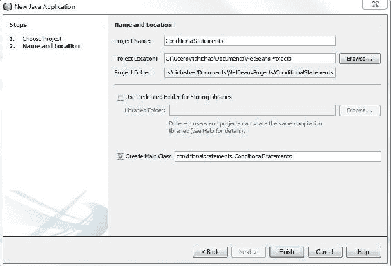

为了保持事物的整洁，我们可以去掉所有的评论；现在我们可以走了。为了让我们编写更有趣的程序，我们将快速学习如何使用 Java 进行一些基本的用户输入。此时此刻，你还没有充分掌握我们将要做的复杂事情的知识基础，但你可能已经对正在发生的事情有了基本的了解，你当然可以在将来自己重复这个过程。

虽然向这个**InputStream**/**控制台**窗口写入数据是一种简单的免责过程，但用 Java 读取输入数据可能会稍微复杂一些：

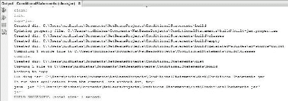

2.  用户输入被放入一个缓冲区，当我们的程序被提示输入时，它会访问该缓冲区；因此，我们需要声明一个变量，当我们需要获得一些新的用户输入时，该变量允许我们访问这个缓冲区。为此，我们将使用`Scanner`类。让我们将新实例称为`reader`。NetBeans 对我们大喊大叫，因为`Scanner`生活在`java.util`包中，我们需要明确访问该包。我们随时可以进口`java.util`套餐：

```java
package conditionalstatements; 

public class ConditionalStatements { 

    public static void main(String[] args) { 
        java.util.Scanner reader; 
    } 
} 
```

3.  在这一部分中，你必须有一种信念的飞跃，在你真正准备完全完全理解的东西之前跳一点。我们需要给这个`Scanner`类型的`reader`变量分配一个值，以便它与 InputStream 窗口链接，用户将在这里输入他们的输入。为此，我们将把它的值设置为一个全新的`Scanner()`对象的值，但这个 Scanner 对象将使用一个类型参数创建，即`(System.in)`，它恰好是用户将使用的输入流的链接：

```java
package conditionalstatements; 

import java.util.*; 

public class ConditionalStatements { 

    public static void main(String[] args) { 
        Scanner reader = new Scanner(System.in); 
    } 
} 
```

以下是上述代码的输出：

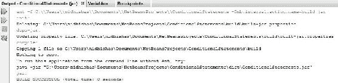

4.  就像我说的，这是一些很有冲击力的东西，你现在当然不应该期望了解它是如何在较低的层次上工作的。现在，知道`reader`与我们的 InputStream 窗口相连，并且我们的`Scanner`对象具有`next()`功能，允许我们访问用户刚刚输入到流中的输入。像大多数函数一样，这个函数只返回这个输入，所以我们必须创建一个字符串来存储这个输入。
5.  完成后，我们可以使用`System.out.println()`函数将`input`值打印回控制台：

```java
package conditionalstatements; 

import java.util.*; 

public class ConditionalStatements { 

    public static void main(String[] args) { 
        Scanner reader = new Scanner(System.in); 
        String input = reader.next(); 
        System.out.println(input); 
    } 
} 
```

6.  When we run our program, nothing appears to happen, but in actuality, our console here is waiting for some user input. Now, when we type our input into this console and hit *Enter* key, it will echo right back at us:

    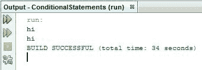

7.  通过让我们的程序提示用户输入，而不是简单地静静地等待，我们可以让它使用起来更方便一些：

```java
public static void main(String[] args) { 
    Scanner reader = new Scanner(System.in); 
    System.out.println("Input now: "); 
    String input = reader.next(); 
    System.out.println(input); 
} 
```

# 条件语句

在本章的开头，我向您保证会学习条件语句，我们现在就要学习。但首先，让我们快速修改程序的用户输入部分。与获取字符串相比，如果我们学习使用用户提供的整数值的条件语句，将会容易得多。因此，让我们将`input`变量的值或类型更改为`int`数据类型；`reader.next()`函数返回一个字符串，但有一个名为`nextInt()`的类似函数将返回一个整数：

```java
int input = reader.nextInt(); 
```

我们当然不会在非常简单的程序中加入任何错误处理机制。

要知道，如果我们意外地为这个 Java 程序提供了除整数以外的任何东西，那么程序就会崩溃。

那么条件语句到底是什么呢？好吧，条件语句允许我们沿着不同的路径发送我们的程序，执行不同的代码行，这取决于事情是否属实。在本章中，我们将使用条件语句根据用户提供的输入值向用户打印不同的响应。具体来说，我们会让他们知道他们给我们的值是否小于、大于或等于数字 10。为了开始这个过程，让我们设置输出案例。

如果用户提供的输入大于 10，我们将打印出`MORE`。如果用户提供的输入恰好少于 10，我们将打印出`LESS`。当然，如果我们现在运行这个程序，它只会打印出`MORE`或`LESS`，两行。我们需要做的是使用条件语句来确保在任何程序运行中只执行这两行中的一行，当然正确的行也会执行。您可能已经注意到，为我们创建的默认项目 NetBeans 将我们的代码划分为多个段，这些段周围有花括号。

我们可以使用自己的括号将代码进一步划分为段。按照惯例，一旦我们创建了一组新的括号，一段新的代码，我们就需要在括号之间的所有内容之前添加一个选项卡，以使我们的程序更具可读性。

# 使用 if 语句

一旦我们将两个`system.out.println`语句分割开来，我们现在就准备好提供必须为真的案例，如果这些语句要运行的话。为了做到这一点，我们用 Java`if`语句作为新章节的序言，其中`if`是一个 Java 关键字，后面是两个括号，我们将语句放在两个括号之间进行求值。如果 Java 确定我们在括号中编写的语句为 true，则将执行以下括号中的代码。如果 Java 确定该语句为 false，则括号中的代码将被完全跳过。本质上，我们将给这个`if`语句两条输入。我们将给它一个变量`input`，如果你还记得，它包含我们从用户那里得到的整数值，我们将给它一个显式值`10`，这就是我们要比较的。Java 理解大于（`>`和小于（`<`的比较运算符。因此，如果我们做这个`if`语句`if(input > 10)`，那么`System.out.println`命令（如下面的屏幕截图所示）只有在用户提供的值大于 10 时才会运行：

```java
if(input > 10) 
        { 
            System.out.println("MORE!"); 
        } 
        { 
            System.out.println("LESS!"); 
        } 
```

现在，我们需要提供一个`if`语句，以确保我们的程序不会总是打印出`LESS`。

我们可以使用小于运算符要求我们的程序在用户提供小于 10 的输入时打印出`LESS`。这在几乎所有情况下都是好的，但是如果我们的用户提供输入值 10，我们的程序将不会打印任何内容。要解决此问题，我们可以使用小于或等于运算符来确保我们的程序始终响应用户输入：

```java
package conditionalstatements; 

import java.util.*; 

public class ConditionalStatements { 

    public static void main(String[] args) { 
        Scanner reader = new Scanner(System.in); 
        System.out.println("Input now: "); 
        int input =  reader.nextInt(); 

        if(input > 10) 
        { 
            System.out.println("MORE!"); 
        } 
        if(input <= 10) 
        { 
            System.out.println("LESS"); 
        } 
    } 
} 
```

现在，让我们快速运行我们的程序，以确保它工作正常。

InputStream 窗口中会提示输入。让我们先给它一个大于 10 的值，然后按*回车*键。我们得到的是`MORE`响应，而不是`LESS`响应；这是我们所期望的：

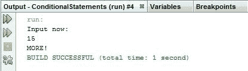

我们的程序没有循环，所以我们必须再次运行它来测试`LESS`输出，这次我们给它一个值`10`，它应该触发小于或等于运算符。塔达！

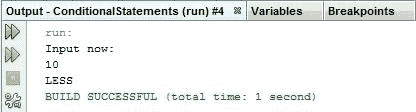

# 使用 else 语句

事实证明，有一种更简单的方法来编写前面的程序。当我们编写一个条件语句，或者更确切地说是一对条件语句，其中我们总是要执行两个代码块中的一个，这可能是使用`else`关键字的好时机。`else`关键字必须跟在方括号内的`if`块后面，然后后面跟着自己的方括号。只有在前面的`if`括号之间的代码未执行时，`else`语句才会计算为 true 并执行括号之间的代码：

```java
import java.util.*; 

public class ConditionalStatements { 

    public static void main(String[] args) { 
        Scanner reader = new Scanner(System.in); 
        System.out.println("Input now: "); 
        int input =  reader.nextInt(); 

        if(input > 10) 
        { 
            System.out.println("MORE!"); 
        } 
       else 
        { 
            System.out.println("LESS"); 
        } 
    } 
} 
```

如果我们运行此程序，我们将获得与以前相同的结果，只需少编写一位逻辑代码：


在结束本主题之前，让我们简要介绍一下我们可以在`if`语句中使用的其他运算符，然后我们将了解如果需要比较非原语的项，应该怎么做。除了大于运算符和小于运算符外，我们还可以使用相等运算符（`==`，如果两侧的项具有相同的值，则为真。请确保在使用相等运算符时，不要意外地使用赋值运算符（`=`）：

```java
if(input == 10) 
```

在某些情况下，您的程序不会编译，但在其他情况下它会编译，您会得到非常奇怪的结果。如果要使用相等运算符的对立面，可以使用 not equals（`!=`），如果两个项的值不相同，则返回 true：

```java
if(input != 10) 
```

比较类实例时，不要尝试使用这些相等运算符，这一点很重要。我们应该只在处理原语时使用它们。

为了展示这一点，让我们修改我们的程序，以便我们可以将`String`作为用户输入。我们来看看`String`是否等同于密码：


如果是，则打印出`YES`；如果没有，则打印出`NO`。现在，NetBeans 给了我们一个警告（如前面的屏幕截图所示）；事实上，如果我们尝试将字符串与一些不同的运算符进行比较，NetBeans 会让我们知道我们的程序甚至可能不会编译。这是因为 Java 不希望我们将类的实例与这些操作符进行比较。相反，类应该公开允许我们在逻辑上比较它们的函数。Java 中几乎每个对象都有一些函数用于此目的。其中最常见的是`equals()`函数，它接受相同类型的对象，并让我们知道它们是否等价。此函数返回所谓的**布尔类型**，这是它自己的基本类型，其值可以为 true 或 false。我们的`if`语句理解如何计算此布尔类型：

```java
import java.util.*; 

public class ConditionalStatements { 

    public static void main(String[] args) { 
        Scanner reader = new Scanner(System.in); 
        System.out.println("Input now: "); 
        String input =  reader.next(); 

        if(input.equals("password")) 
        { 
            System.out.println("YES"); 
        } 
        else 
        { 
            System.out.println("NO"); 
        } 
    } 
} 
```

让我们快速运行我们的程序，首先输入一个坏字符串，然后输入`password`以查看我们的程序工作：

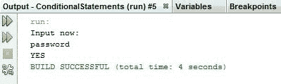

这是`if-else`语句的基础。我鼓励您现在使用我们所看到的一些比较运算符，并尝试在彼此之间嵌套`if...else`语句。

最后一点，您有时可能会看到没有以下括号的`if`语句。这是一种有效的语法，基本上相当于将整个语句放在一行上。

# 复合条件句

首先，让我们编写一个非常简单的 Java 程序。我们将从导入`java.util`开始，这样我们就可以通过`Scanner`对象获得一些用户输入，我们将把这个`Scanner`对象与`System.in`输入字符串链接起来，这样我们就可以在控制台窗口中使用它。

一旦我们这样做了，我们需要从用户那里获取一些输入并存储它，所以让我们创建一个新字符串，并将其值分配给用户给我们的任何内容。为了让事情变得有趣，让我们再给自己两个字符串变量。我们称之为`sOne`和`sTwo`；我们将第一个字符串变量的值分配给`abc`，第二个字符串变量的值分配给`z`：

```java
package complexconditionals; 

import java.util.*; 

public class ComplexConditionals { 
    public static void main(String[] args) { 
      Scanner reader = new Scanner (System.in); 
      String input = reader.next(); 
      String sOne = "abc"; 
      String sTwo = "z"; 
    } 
} 
```

因为本主题是关于条件语句的，我们可能需要其中的一个，所以让我们创建一个`if...else`块。这是我们计算条件语句的地方。我们将设置一些输出，以便查看发生了什么。如果我们的条件语句的计算结果为 true，并且我们输入块的以下部分，我们只需打印出`TRUE`：

```java
if() 
{ 
    System.out.println("TRUE");     
} 
else 
{ 

} 
```

如果条件语句的计算结果为 false，我们跳过块的上一个`if`部分，而是输入`else`部分，我们将打印出`FALSE`：

```java
if() 
{ 
    System.out.println("TRUE");     
} 
else 
{ 
    System.out.println("FALSE"); 
} 
```

# 包含函数

现在可能是编写条件语句的时候了。让我向您介绍一个名为`contains`函数的新字符串函数：

```java
if(input.contains()) 
```

`contains`函数将字符串限定的字符序列作为输入。作为输出，它给我们一个布尔值，这意味着它将输出`TRUE`或`FALSE`。所以我们的`if`语句应该理解这个函数的结果，并对其进行评估。为了测试我们的程序，让我们从简单地执行以下过程开始。

我们将为我们的`contains`函数提供`sOne`字符串中存储的值，即`abc`：

```java
package complexconditionals; 

import java.util.*; 

public class ComplexConditionals { 
    public static void main(String[] args) { 
      Scanner reader = new Scanner (System.in); 
      String input = reader.next(); 
      String sOne = "abc"; 
      String sTwo = "z"; 
      if(input.contains(sOne)) 
      { 
           System.out.println("TRUE");     
      } 
      else 
      { 
           System.out.println("FALSE"); 
      } 
    } 
} 
```

因此，如果我们运行我们的程序并向它提供包含`abc`字符串的`abcdefg`，我们就会得到`TRUE`结果。这是因为`input.contains`计算结果为 true，我们输入`if...else`块的`if`部分：


如果我们运行并提供一些不包含`abc`字符串的胡言乱语，我们可以输入块的`else`语句并返回`FALSE`：

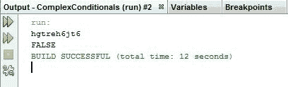

没什么太疯狂的。但是，假设我们想让我们的程序更复杂一点。让我们在下一节中了解这一点。

# 复杂条件语句

如果我们想检查输入字符串是否同时包含两个字符串，即`sOne`和`sTwo`，该怎么办？有几种方法可以做到这一点，我们将看看其他一些方法。但是，对于我们来说，最简单的方法可能是在`if(input.contains(sOne))`行上使用一个**复合词**。Java 允许我们使用`&&`或`|`条件运算符同时计算多个 true 或 false 语句或布尔对象。当与`&&`运算符比较的所有条件都计算为 true 时，`&&`运算符为我们提供了一个 true 结果。当与`|`运算符比较的任何条件求值为 true 时，`|`运算符为我们提供了一个 true 结果。在本例中，我们想知道输入字符串是否同时包含`sOne`和`sTwo`的内容，因此我们将使用`&&`运算符。该运算符的工作原理是在其两侧提供两个条件语句。所以，我们将在`sOne`和`sTwo`上运行`input.contains`函数。如果表示为（`if(input.contains (sOne) && input.contains (sTwo))`的`&&`运算符任一侧的这两个函数的值均为 true，则我们的条件语句也将为 true：

```java
package complexconditionals; 

import java.util.*; 

public class ComplexConditionals { 
    public static void main(String[] args) { 
        Scanner reader = new Scanner (System.in); 
        String input = reader.next(); 
        String sOne = "abc"; 
        String sTwo = "z"; 
        if(input.contains(sOne)) 
        { 
            System.out.println("TRUE"); 
        } 
        else 
        { 
            System.out.println("FALSE"); 
        } 
    } 
} 
```

让我们运行我们的程序。在这两种情况下，`abcz`字符串的计算结果都应该为 true，当我们按下*Enter*键时，我们看到事实上是这样的：

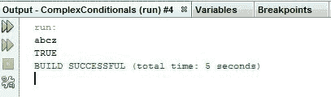

如果我们只提供有效字符串`z`，我们将得到一个错误的结果，因为我们的`&&`操作符将计算 false 和 true，后者的计算结果为 false。如果我们要使用`|`运算符，这将是字符串：

```java
if(input.contains(sOne) || input.contains(sTwo)) 
```

以下是上述代码的输出：

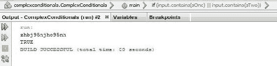

这实际上会给我们一个真实的结果，因为我们现在只需要其中一个函数就可以返回 true。布尔逻辑很快就会变得疯狂。例如，我们可以将`&& false`语句放在布尔条件的末尾，即`if(input.contains(sOne) || input.contains(sTwo) && false)`。Java 中的`true`和`false`代码项是关键字；事实上，它们是显式值，就像数字或单个字符一样。`true`关键字的计算结果为 true，`false`关键字的计算结果为 false。

任何以`false`结尾的条件语句都将作为一个整体计算为 false：

```java
if(input.contains(sOne) && false) 
```

奇怪的是，如果我们返回到前面的原始语句并运行以下程序，为其提供最有效的输入，我们将得到真正的结果：

```java
package complexconditionals;
import java.util.*;
public class ComplexConditionals {
    public static void main(String[] args) {
        Scanner reader = new Scanner(System.in);
        String input = reader.next();
        String sOne = "abc";
        String sTwo = "z";
        if(input.contains(sOne) || input.contains(sTwo) && false)
        {
            System.out.println("TRUE");
        }
        else
        {
            System.out.println("FALSE");
        }
    }
}
```

以下是前面代码的输出：


这很有趣，因为如果 Java 选择先计算`if(input.contains(sOne) || input.contains(sTwo))`语句，然后计算`&& false`语句，我们会得到一个错误的结果；相反，Java 似乎选择先评估`(input.contains(sTwo) && false)`语句，然后评估`||`语句，即`(input.contains(sOne) ||)`。这会让事情很快变得混乱。

幸运的是，就像在代数中一样，我们可以要求 Java 按照特定的顺序进行操作。我们通过用括号包围代码块来实现这一点。括号内的代码块将在 Java 离开括号进行其他计算之前进行计算：

```java
if((input.contains(sOne) || input.contains(sTwo)) && false) 
```

所以，在我们用括号括住`||`语句之后，我们将计算`||`语句，然后用`false`结束该结果：

```java
package complexconditionals;
import java.util.*;
public class ComplexConditionals {
    public static void main(String[] args) {
        Scanner reader = new Scanner(System.in);
        String input = reader.next();
        String sOne = "abc";
        String sTwo = "z";
        if((input.contains(sOne) || input.contains(sTwo)) && false)
        {
            System.out.println("TRUE");
        }
        else
        {
            System.out.println("FALSE");
        }
    }
}
```

现在我们将看到前面的程序在这里的计算结果总是为 false：


所以复杂的条件可以很快变得复杂。如果我们在代码中遇到这样的`if`语句，特别是如果它是我们尚未编写的代码，我们可能需要很长时间才能弄清楚到底发生了什么。

# 布尔变量

为了帮助我们完成上一节中讨论的内容，我们有`boolean`变量：

```java
boolean bool = true; 
```

在前一行代码中，`boolean`是 Java 中的一个基元类型，`boolean`类型的变量只能有两个值中的一个：可以是`true`或`false`。我们可以将布尔变量的值设置为任何条件语句。因此，如果我们想简化代码在实际的`if`语句中的外观，我们可以继续存储这些布尔值：

```java
boolean bool1 = input.contains(sOne); 
boolean bool2 = input.contains(sTwo);  
```

在实际评估`if`语句之前，我们需要这样做，以使所有内容更加紧凑和可读：

```java
if((bool1 || bool2) && false) 
```

请记住，游戏的名称是让我们的代码尽可能简单易读。编写一个很长的条件语句可能会让人感觉很棒，但通常会有一个更优雅的解决方案。

这就是 Java 中复杂条件的基本原理。

# 开关、外壳和断路器

在本节中，我们将看一看`switch`语句，这是我们修改程序控制流的另一种方式。

首先，让我们在 NetBeans 中创建一个新项目。至少在我这边，我要把这些评论都删掉。为了演示`switch`语句的威力，我们将从只使用`if`块编写程序开始，然后将程序转换为使用`switch`语句的程序。以下是仅使用`if`块的程序的步骤：

1.  首先，让我们简单地声明一个变量`x`（`int x =1;`），我们的目标是：如果`x`的值是`1`、`2`或`3`，我们希望分别打印出响应`RED`、`BLUE`或`GREEN`。如果`x`不是这些数字之一，我们将打印一个默认响应。

2.  使用`if`块执行此操作非常简单，如果不是有点乏味的话：

```java
if(x == 1) 
{ 
System.out.println("RED") 
} 
```

然后，我们将复制并粘贴这段代码，并针对蓝色和绿色情况对其进行修改：

```java
int x=1; 
if(x==1) 
{ 
    System.out.println("RED"); 
} 
if(x==2) 
{ 
    System.out.println("BLUE"); 
} 
if(x==3) 
{ 
    System.out.println("GREEN"); 
} 
```

3.  对于我们的默认情况，我们只想检查`x`是否不等于`1`、`x`是否不等于`2`、`x`是否不等于`3`：

```java
if((x != 1) && (x != 2) && (x != 3)) 
{ 
    System.out.println("NONE"); 
} 
```

让我们快速浏览一下我们的程序：

```java
package switcher; 

public class Switcher { 
    public static void main(String[] args) { 
        int x=1; 

       if(x==1) 
       { 
           System.out.println("RED"); 
       } 
       if(x==2) 
       { 
           System.out.println("BLUE"); 
       } 
       if(x==3) 
       { 
           System.out.println("GREEN"); 
       } 
    } 
} 
```

以下是预期结果的屏幕截图：


这是我们在编写更大程序的过程中逻辑上可能会发现自己正在做的事情的简化版本。当我们把这些放在一个相当不错的片段中时，很容易看出，如果我们处理许多可能的`x`案例，这个问题将变得极其棘手。而且，对于一个人来说，阅读和理解这里发生的事情也是相当困难的。正如您可能已经猜到的，解决方案是使用`switch`语句来控制我们的程序流。

# 使用开关、外壳和断路器编程

当我们想根据单个变量的值执行不同的代码行或代码块时，`switch`语句非常有效。现在，让我们用一个`switch`语句重写我们的`if`块系列。语法将在以下步骤中解释：

1.  我们首先声明我们将使用一个`switch`语句，`switch`是 Java 中的一个保留关键字。然后，我们提供希望`switch`语句作用的变量的名称，在本例中为`x`，因为我们将根据`x`的值执行不同的代码块：

```java
package switcher; 

public class Switcher { 
    public static void main(String[] args) { 
        int x=1; 

        switch(x) 
        { 

        } 
    } 
} 
```

然后，就像使用`if`或`else`语句一样，我们将使用两个括号创建新的代码段。

2.  现在，我们不再创建一系列笨拙的`if`块，而是使用`case`关键字在`switch`语句中创建单独的块。在每个`case`关键字之后，我们给出一个规定的值，如果`x`的值与`case`关键字的值匹配，则执行下面的代码。

所以，就像我们在做`if`块时一样，如果`x`的值是`1`，我们想打印出`RED`。为每个可能的值编写单独的案例现在变得更加清晰和易于阅读。

3.  `switch`语句还有一个特殊的情况，`default`情况，我们几乎总是把它放在`switch`语句的末尾。

只有在其他案例均未执行的情况下，才会执行此案例，这意味着我们不必为最后一个`if`块编写复杂的布尔逻辑：

```java
package switcher; 

public class Switcher { 
    public static void main(String[] args) { 
        int x=7; 

        switch(x) 
        { 
            case 1: case 5: case 7: 
                System.out.println("RED"); 
            case 2: 
                System.out.println("BLUE"); 
            case 3: 
                System.out.println("GREEN"); 
            default: 
                System.out.println("NONE"); 
        } 
    }  
} 
```

如果我们运行前面的程序，我们实际上会看到所有可能的输出都被执行。那是因为我们忘了做一些非常重要的事情：

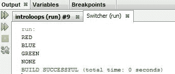

`switch`语句允许我们创建复杂的逻辑树，因为一旦一个案例开始执行，它将继续执行，甚至贯穿队列中的下一个案例。因为我们正在编写一个非常简单的程序，其中只需要执行一个案例，我们需要在输入案例并完成代码后显式结束执行。

4.  我们可以使用`break`关键字来实现这一点，该关键字单独存在于一行代码中，只需将我们提升并脱离我们所处的情况：

```java
package switcher; 

public class Switcher { 
    public static void main(String[] args) { 
        int x=1; 

        switch(x) 
        { 
            case 1: 
                System.out.println("RED"); 
                break; 
            case 2: 
                System.out.println("BLUE"); 
                break; 
            case 3: 
                System.out.println("GREEN"); 
                break; 
            default: 
                System.out.println("NONE"); 
        } 
    } 
} 
```

现在，如果我们运行我们的程序，我们将看到预期的结果：

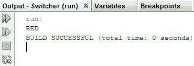

5.  除了从一个案例到另一个案例，我们还可以通过在一行中添加多个案例来增加 switch 语句的复杂性和威力。因为案例之间是自由的，所以执行类似于`case 1: case 5: case;`的操作意味着，如果我们提供这些数字中的一个，将执行以下代码块：`1`、`5`或`7`。`switch`陈述有一种简单快捷的方式：

```java
package switcher; 

public class Switcher { 
    public static void main(String[] args) { 
        int x=7; 

        switch(x) 
        { 
            case 1: case 5: case 7: 
                System.out.println("RED"); 
                break; 
            case 2: 
                System.out.println("BLUE"); 
                break; 
            case 3: 
                System.out.println("GREEN"); 
                break; 
            default: 
                System.out.println("NONE"); 
        } 
    } 
} 
```

以下是上述代码的输出：


Switch 语句本质上比较我们正在切换的变量或显式值以及使用等式（`==`运算符）的情况。如果无法将元素与相等运算符进行比较，则 switch 语句将无法正常工作。

从 JavaSEV7 开始，您可以将字符串与相等运算符进行比较，以便在`switch`语句中使用它们。情况并非总是如此，在`switch`语句中避免使用带相等运算符的字符串仍然是一个好主意。这是因为它破坏了您正在编写的代码的向后兼容性。

# While 和 do…While 循环

欢迎来到关于循环的介绍性课程。在本节的最后，我们将对 Java 的`while`和`do...while`循环进行命令控制。我对此感到非常兴奋，因为循环允许我们反复执行 Java 代码块，只要我们认为合适。在我们的学习过程中，这是一个非常酷的步骤，因为快速连续多次执行小任务的能力是使计算机在某些任务上比人类做得更好的因素之一：

1.  为了开始本主题，让我们创建一个新的 NetBeans 项目，输入`main`方法，然后简单地声明一个整数并给它一个值。我们可以选择任何正值。我们将要求我们的程序将短语`Hello World`打印出来，打印次数等于整数的值。

2.  为此，我们将使用一个`while`循环。`while`循环语法看起来很像我们正在编写的`if`语句。我们从保留的`while`关键字开始，后面有两个括号；在这些语句中，我们最终将放置一个条件语句。就像它是一个`if`语句一样，以下代码块只有在程序到达`while`循环并将其条件语句求值为 true 时才会执行：

```java
package introtoloops; 

public class IntroToLoops { 
    public static void main(String[] args) { 
        int i=5; 

        while () 
        { 

        }  
    } 
} 
```

然而，将`while`循环与`if`语句区分开来的是，当`while`循环的代码块结束时，我们的程序将基本上跳回并再次执行这行代码，评估条件语句，如果条件语句仍然为真，则重新输入 while 循环的代码块。

让我们从设置`while`循环的逻辑开始。我们希望循环执行的次数存储在整数 i 的值中，但我们需要一种方法来将其传达给循环。任何不会无限次运行的循环都需要在循环内容中进行一些控制流更改。在我们的例子中，让我们在每次循环运行时通过减小 i 的值来更改程序的状态，这样当 i 达到 0 时，我们将运行循环五次。

3.  如果是这种情况，这意味着我们只希望在`i`的值大于`0`时执行循环。让我们暂停一下，快速查看这行代码。这里的`i = i -1`是一个非常有效的语句，但是我们可以使用一个快捷方式，它更快、更容易阅读。我们可以使用`i--`将整型变量的值减一。一旦我们设置好了，唯一要做的就是将函数代码放在循环中；这只是一个`println`声明，上面写着`Hello world`：

```java
package introtoloops; 

public class IntroToLoops { 
    public static void main(String[] args) { 
        int i=5; 

        while (i>0) 
        { 
            System.out.println("Hello world"); 
            i--; 
        }  
    } 
} 
```

4.  现在，让我们运行程序，看看会发生什么：


我们开始了，五个`Hello world`实例被打印到控制台窗口，正如我们预期的那样。

# While 循环

通常，我们允许小程序（比如我们正在编写的程序）在没有代码可供执行时结束。然而，当我们使用循环时，我们可能会犯一个错误，意外地创建一个无限`while`循环并运行一个没有终点的程序：

```java
package introtoloops; 

public class IntroToLoops { 
    public static void main(String[] args) { 
        int i=5; 

        while (i>0) 
        { 
            System.out.println("Hello world"); 
        }  
    } 
} 
```

发生这种情况时，我们需要手动关闭程序。在 NetBeans 中，在输出窗口的左侧有一个名为 Stop 的便利小功能：

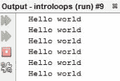

如果我们通过命令提示符运行程序，*Ctrl*+*C*是取消程序执行的常用命令。现在我们已经掌握了基本的`while`循环语法，让我们尝试一些更复杂、更动态的方法：

1.  我想到的程序需要一些用户输入，所以让我们导入`java.util`并设置一个新的`Scanner`对象：

```java
public class IntroToLoops { 
    public static void main(String[] args) { 
        Scanner reader = new Scanner(System.in); 
```

2.  但是，我们不会立即收集用户输入，而是在每次`while`循环成功执行时收集新的用户输入：

```java
while(i > 0) { 
   reader.nextLine(); 
   System.out.println("Hello world"); 
} 
```

3.  每次收集此输入时，我们都需要某个地方来存储它，因此让我们创建一个新字符串，其目的是存储新获取的输入的值：

```java
public class IntroToloops { 
    public static void main(String[] args) { 
        Scanner reader = new Scanner(System.in); 
        String input; 
        int i=5; 
        while(i>0) { 
            input= reader.nextLine(); 
            System.out.println("Hello world"); 
        } 
    }   
} 
```

这个`input`变量的值在整个程序执行过程中会发生多次变化，因为在每个`while`循环开始时，我们会给它分配一个新值。如果我们只是简单地执行这个程序，对我们用户来说就不会很有趣了，因为当我们给输入字符串分配一个新值时，它的旧值会不断丢失。

4.  因此，让我们创建另一个字符串，其目的是存储从用户处获得的所有串联值。然后，在程序结束时，我们将打印出该字符串的值，以便用户可以看到我们一直在存储他们的输入：

```java
public class IntroToloops { 
    public static void main(String[] args) { 
        Scanner reader = new Scanner(System.in); 
        String input; 
        String all = ""; 
        int i=5; 
        while(i>0) { 
            input = reader.nextLine(); 
        }   
        System.out.println(all); 
    }   
}
```

5.  将输入值添加到此处所示行上的 all 字符串：

```java
while(i>0) { 
   input = reader.nextLine(); 
   all = 
}
```

我们可以做几件事。我们可以用加法运算符很好地添加字符串。因此，`all = all + input`语句，`all`和`input`是字符串，加号完全有效。然而，当我们向其自身添加一些东西并使用一个原语或一个可以像字符串一样充当原语的类型时，我们也可以使用`+=`操作符，它执行相同的功能。此外，我们不能忘记重新实现整数值`i`的递减，这样我们的程序就不会无限运行：

```java
package introtoloops; 
import java.util.*; 
public class IntroToLoops { 
    public static void main(String[] args) { 
        Scanner reader = new Scanner(System.in); 

        String input; 
        String all = ""; 
        int i=5; 

        while (i>0) { 
            input = reader.nextLine(); 
            all += input; 
            i--; 
        }  
        System.out.println(all); 
    } 
 }  
```

现在，如果我们运行这个程序并提供五个输入字符串，我们将得到如下屏幕截图所示的输出：


我们会看到他们像预期的那样向我们吐口水，这很酷，但我对这个项目有更大的计划。

实际上，如果我们只想编写我们现在的程序，`for`循环，我们将在后面学习，可能是完全合适的。但是对于我们即将要做的事情，`while`和`do...while`循环是非常必要的。我想做的是去掉这个程序中的计数变量。相反，我们将允许用户告诉我们何时停止执行我们的程序。

当用户将输入值设置为`STOP`字符串时，所有大写字母，我们将停止执行`while`循环，并打印出迄今为止他们提供给我们的所有字符串。因此，我们只希望在输入值不是`STOP`值的情况下运行这个`while`循环。您会注意到，我们将得到一个预编译错误，如以下屏幕截图所示：


如果我们试图运行我们的程序，我们将得到一个完整的编译器错误。这是因为我们的程序知道，当我们第一次尝试执行这个条件语句时，输入的值不会被设置。即使输入的不存在值不等于`STOP`，它也是一种非常糟糕的形式。对于这里的字符串，它不是原语，在给定任何值之前，我们的计算机不可能访问它的任何方法。

这里一个不雅观的解决方案是给输入一个起始值，就像我们对`all`所做的那样，但是有一个更好的方法。一旦我们的循环第一次执行，我们知道输入将有一个由用户给定的适当值，该值可能是也可能不是`STOP`。

# 边做边做循环

如果我们不在循环开始时检查条件，而是在循环结束时检查条件，会怎么样？这实际上是一种选择。`do...while`循环就像`while`循环一样运行，但第一次运行时，它们不会检查条件是否为真；它们只需在最后运行并检查它们的条件语句。我们确实需要在`do...while`循环后面的条件语句末尾加一个分号。我提到这个是因为我总是忘记它。现在，如果我们运行我们的程序，我们可以给出任意数量的字符串，然后输入`STOP`字符串，以查看到目前为止我们键入并打印到屏幕上的所有内容：

```java
public static void main(String[] args) { 
    Scanner reader = new Scanner(System.in); 

    String input; 
    String all = ""; 
    int i=5; 

    do 
    { 
        input = reader.nextLine(); 
        all += input; 
        i--; 
    } while(!input.equals("STOP")); 
    System.out.println(all); 
} 
```

以下是上述代码的输出：


最后一点要注意的是，几乎任何东西后面都有自己的代码块，您将看到这样的语法，其中您将有一个关键字，可能是一个条件语句，然后在下面的几行中用括号括起来；或者，您可能会看到括号开始于关键字和条件语句的同一行。这两种方法都是完全有效的，事实上，与关键字在同一行开始的括号可能很快变得更加常见。

我鼓励你玩玩我们编写的程序。尝试执行一些循环，您认为这些循环会突破字符串可以容纳多少信息的界限，或者尝试使用向屏幕显示大量信息的循环。这是电脑做的，我们用铅笔和纸做不到的，所以它很整洁。

# For 循环

在本节中，我们将快速查看`for`循环。我们使用`for`循环以非常优雅的语义方式解决 Java 中的一个常见问题。当我们需要迭代一个变量来计算循环次数时，这些循环是合适的。

首先，我用一个`while`循环编写了一个非常基本的程序；它将`1`到`100`的值打印到屏幕上的窗口。一旦您在脑海中详细了解了这个`while`循环是如何工作的，我们将用`for`循环编写相同的循环，这样我们就可以看到`for`循环在这个特定实例中是如何更加优雅的。让我们注释掉我们的`while`循环，这样我们仍然可以看到它，如下面的屏幕截图所示，而不让它执行任何代码，并开始编写我们的`for`循环：


`for`循环的基本语法看起来与`while`循环非常相似。我们有一个保留关键字，两个括号，其中我们将放一些循环需要的信息，以及我们将要循环的代码块。与`while`循环不同，它只在这些括号之间包含一个条件语句，我们将为`for`循环提供一组信息。因为`for`循环是为处理特定情况而设计的，一旦我们提供了所有这些信息，它就会确切地知道如何处理它。这减轻了我们在循环外部处理代码，并在循环内部手动增加或减少代码的需要。它保留了我们代码的功能位，`println`语句，在更复杂的程序中，`for`循环中可能包含的更复杂的信息更孤立。

我们典型的`for`循环需要三个输入。详情如下:

1.  首先，我们需要声明要递增或递减的变量，以计算循环次数。在这种情况下，我们将使用一个整数`i`，并给它一个初始值`1`。我们在这个初始语句后面加了一个分号。这不是一个函数调用；这是`for`循环的特殊语法。
2.  特殊语法需要的第二条信息是每次重新启动循环时需要计算的条件语句。如果这个条件语句不正确，那么我们的`for`循环结束，我们在`for`循环块之后继续恢复代码。在本例中，我们的条件语句将与`while`循环中的条件语句相同。我们希望`for`循环的最后一次迭代是在`i`等于`100`时，也就是说，当我们打印出`100`时。一旦`i`不再小于或等于 100，就要退出`for`循环了。
3.  正如我们专门为`for`循环提供的第一条信息使我们不必处理循环范围外的变量一样，我们将为`for`循环提供的最后一条信息将取代我们必须手动增加或减少循环范围内的计数器。这是特殊的修改代码，我们在这里提供的`for`循环将在每个循环的末尾运行。在这种情况下，我们只想在每个循环结束时增加`i`的值。我想你会同意这个程序比我们的`while`循环更干净：

```java
package forloops; 

public class Forloops { 
    public static void main(String[] args) { 
    /*  int i=1; 
        while(i <= 100) { 
            System.out.println(i); 
            i++; 
        }*/ 
        for(int i=1; i<=100; i++) 
        { 
            System.out.println(i); 
        } 
    } 
} 
```

现在，让我们检查一下它是否执行相同的任务，将`1`到`100`的值打印到我们的屏幕上，如下面的屏幕截图所示：


如果这个语句在`for`循环的最开始执行，`0`应该是正确的，但它在循环的最后执行。

当我们在 Java 或任何编程语言中处理大量和增量时，我们称之为错误，就像我们刚才遇到的那样，**由一个错误**（**双簧管**错误）引起。双簧管是那些即使是经验丰富的程序员，如果他们不注意或只是错误地寻找一个实例，也会遇到的小逻辑错误。学习识别双簧管的症状，例如，比预期多输出一行，将使我们能够更有效地追踪并找到它们。

# 总结

在本章中，我们基本上了解了如何使用`contains`、`complex`和`boolean`等函数处理贯穿复杂条件的条件`if...else`语句。在程序的帮助下，我们经历了复杂的`switch`、`case`和`break`；此外，我们还深入探讨了如何使用`while`、`do...while`和`for`循环使用循环功能。

在下一章中，我们将研究一种称为**数据结构**的东西。