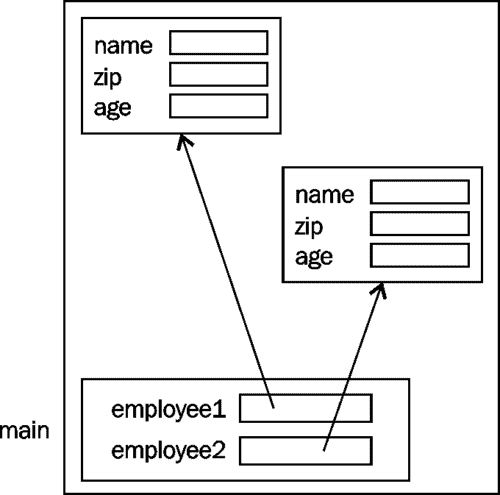

# 六、类、构造器和方法

面向对象编程的核心是类和从类创建的对象。当通过方法修改对象的状态时，对象的初始化发生在构造器中。这些构造器和方法的打包是数据封装的重点。本章介绍了类、构造器、方法和数据封装的基本原理。

我们首先介绍类，包括讨论如何在内存中管理对象。然后介绍了构造器和方法的常见方面，包括签名的概念、参数的传递以及`this`关键字的使用。

讨论了构造器的用法，包括默认构造器、如何重载它们以及私有构造器的使用。Java 初始化序列包括初始化器列表的使用。

方法以及它们的使用方式将被解释，包括如何重载它们以及访问器和变异器方法的创建。本章最后讨论了静态方法和实例方法。

# 课程

**类**是数据结构的定义加上对其进行操作的动作，通常对应于真实世界的对象或概念。类只定义一次，但不直接在应用中使用。相反，基于类创建（实例化）对象并分配内存。

在本章中，我们将使用`Employee`类说明构造器和方法的使用。该类的一部分如下所示：

```java
public class Employee {
    private String name;
    private int zip;
    private int age;
   …
}
```

该定义将被扩展以解释与类和对象相关的概念和技术。

## 对象创建

使用`new`关键字创建对象。关键字与类名一起使用，结果是从堆中为对象分配内存。堆是通常位于堆栈“上方”的内存区域，如[第 2 章](02.html "Chapter 2. Java Data Types and Their Usage")*Java 数据类型及其用法*中的*堆栈和堆*部分所述。

使用`new`关键字实例化新对象时：

*   为类的新实例分配内存
*   然后调用构造器来执行对象的初始化
*   返回对对象的引用

在以下示例中，创建了`Employee`类的两个实例，并将引用分配给引用变量`employee1`和`employee2`：

```java
Employee employee1 = new Employee();
Employee employee2 = new Employee();
```

类的每个实例都有自己的一组相互独立的实例变量。下图显示了这一点。请注意，该类的两个实例都包含它们自己的实例变量副本：



创建新的对象时，将执行该对象的构造器。构造器的目的是初始化一个对象。此过程包含在*施工人员*章节中。类的方法在类的实例之间共享。也就是说，这些方法只有一个副本。

## 内存管理

Java 内存管理是动态和自动的。当使用`new`关键字时，它会自动在堆上分配内存。

在下面的示例中，`Employee`类的一个实例被创建并分配给`employee1`变量。Next，将`employee1`变量的值分配给`employee2`变量。此赋值的效果是两个引用变量都指向同一个对象：

```java
Employee employee1 = new Employee();
Employee employee2 = employee1;
```

下图对此进行了说明：


引用变量可以通过以下方式取消引用对象的实例：

*   被重新指定给另一个对象
*   将其设置为 null

当垃圾回收器确定没有对它的引用时，该对象就有资格被垃圾回收线程从堆中删除，并且它的内存可以重新用于其他对象。这个垃圾收集过程实际上超出了应用的控制范围。

## 数据封装

数据封装涉及对程序员隐藏无关信息并公开相关信息。隐藏实现细节允许在不影响程序其他部分的情况下进行更改。例如，如果程序员想在屏幕上显示一个矩形，可以使用几种方法。它可能涉及逐像素绘制矩形或绘制一系列线。隐藏操作的细节称为数据封装。

数据封装的主要目的是降低软件开发的复杂性。通过隐藏执行操作所需的细节，该操作的使用更加简单。该方法使用起来并不复杂，因为用户不必担心其实现的细节。用户可以关注它做什么，而不是如何做。这反过来又允许开发人员做更多的工作。

例如，考虑 AutoT0R 类的实现。最初，实例变量都声明为私有：

```java
public class Employee {
    public String name;
    private int age;

   ...

    public int getAge() {
        return age;
    }

    private void setAge(int age) {
        this.age = age;
    }

}
```

`name`变量的访问修饰符类型已更改为 public，`setAge`方法的访问修饰符已变为 private。这意味着该类的任何用户都可以访问`name`字段，但只能读取员工的`age`。当我们明确决定什么应该和不应该向类的用户公开时，数据封装受到了影响。

类及其实现的细节应该对用户隐藏。这允许在不改变类的公共方面的情况下修改类的内部实现。一般来说，实例变量是私有的，方法是公共的。此规则的例外情况是基于类的需要而制定的。

也可以控制对施工人员的访问。本主题包含在*施工人员*部分。

## 引用实例变量

引用变量保存指向对象的引用或指针。通过在对象引用变量名称后面加上句点，然后再加上字段或方法名称，可以访问对象的字段或变量。下面的代码片段说明了基于上一节中的`Employee`声明使用`Employee`类的可能引用：

```java
Employee employee = new Employee();
int employeeAge = employee.getAge(24);
String employeeName = employee.name;
```

注意，我们没有使用`age`字段，因为它被声明为`Employee`类的私有字段。[第 1 章](01.html "Chapter 1. Getting Started with Java")*Java 入门*中的*访问修饰符*部分介绍了修饰符的使用。

## 签字

构造器或方法的签名用于唯一标识构造器或方法。签名包括：

*   方法或构造器名称
*   参数数量
*   参数类型
*   参数的顺序

同一类中的所有构造器或方法都必须具有唯一的签名。请注意，方法的返回类型不是签名的一部分。下表显示了重载`Employee`类构造器的签名。第三个和第四个构造器的参数顺序不同。如果有多个方法或构造器具有相同的名称，且在同一类中，但具有不同的签名，则称该方法或构造器重载：

<colgroup><col style="text-align: left"> <col style="text-align: left"> <col style="text-align: left"></colgroup> 
| 

方法

 | 

参数数

 | 

参数类型

 |
| --- | --- | --- |
| `Employee()` | 0 |   |
| `Employee(String name)` | 1. | `String` |
| `Employee(String name, int zip)` | 2. | `String`、`int` |
| `Employee(int zip, String name)` | 2. | `int`、`String` |
| `Employee(String name, int zip, int age)` | 3. | `String`、`int`、`int` |

# 使用 this 关键字

这个`this`关键字有四种用法：

*   执行构造器链接
*   访问实例变量
*   将当前对象传递给方法
*   从方法返回当前对象

*重载施工人员*部分介绍了施工人员链接。让我们检查一下如何使用`this`关键字来访问实例变量。`setAge`方法可以按如下方式实施：

```java
public class Employee {
    public String name;
    private int age;
   ...

    private void setAge(int age) {
        age = age;
    }

}
```

此代码不会产生修改`age`实例变量的预期结果。实例变量的作用域是整个类。参数的范围仅限于方法。参数将比实例变量具有“优先级”。其效果是传递给该方法的时间被分配给了它自己。未修改实例变量。

有两种方法可以纠正此问题：

*   更改参数名称
*   使用`this`关键字

我们可以更改参数的名称。然而，设计一个不同的名称来表示同一事物会导致奇怪或尴尬的名称。例如，我们可以使用以下方法：

```java
public class Employee {
  private int age;
     …
    private void setAge(int initialAge) {
        age = initialAge;
    }

}
```

`initialAge`参数将被指定为成员变量`age`的初始值。但是，可以使用任何数量的其他可能有意义的名称。此类型的命名参数没有标准命名约定。

另一种方法是使用`final`关键字将参数声明为常量，如下面的代码段所示。当我们采用这种方法时，会生成一个语法错误，因为我们试图修改参数。因为它是恒定的，我们无法改变它：

```java
public void setAge(final int age) {
   age = age;
}
```

生成的语法错误消息如下所示：

```java
final parameter age may not be assigned

Assignment To Itself

```

首选的方法是使用`this`关键字明确指定哪个变量是成员变量，哪个是参数。这在以下实现中进行了说明：

```java
public class Employee {
  private int age;
   …
  private void setAge(int age) {
      this.age = age;
  }

}
```

在这个赋值语句中，我们通过在成员变量前面加上`this`关键字和句点来引用它。考虑下面的陈述：

```java
       this.age = age;
```

`this`关键字引用赋值语句左侧的`age`实例变量。右侧的使用了`age`参数。因此，参数被指定给实例变量。使用`this`关键字可以避免为分配给成员变量的参数设计一些非标准且可能令人混淆的名称。

`this`关键字也可用于传递或返回对当前对象的引用。在下面的序列中，`validateEmployee`方法被假定为`Employee`类的成员。如果满足条件，则将由`this`关键字标识的当前员工添加到维护`department`变量引用的部门信息的类中。对当前对象的引用传递给`add`方法：

```java
private Department department;
   …
private void validateEmployee() {
   if(someCondition) {
      department.add(this);
   }
}
```

`this`关键字也可用于返回对当前对象的引用。在下一个序列中，`getReference`方法返回当前对象，该方法假定为`Employee`类的方法：

```java
private Employee getReference() {
   …
   return this;
}
```

## 通过参数

在任何方法中，可能存在两种类型的变量参数和局部变量。参数包含调用方法时传递给该方法的值。局部变量是方法的一部分，用于帮助方法完成任务。这里讨论的技术既适用于构造器，也适用于方法，尽管我们只在本节中的示例中使用方法。

参数作为参数列表的一部分传递。此列表使用逗号分隔参数类型和名称的声明。例如，以下代码段中的方法传递了两个参数：整数和字符串：

```java
public void passParameters(int number, String label) {
   …
}
```

将基元数据类型或对象传递给方法。以下术语用于标识正在传递的数据：

*   参数：这是正在传递的变量
*   参数：这是在方法签名中定义的元素

例如，在下面的代码序列中`number`和`employee1`是参数，`num`和`employee`是`changeValues`方法对应的参数：

```java
public static void main(String[] args) {
   int number = 10;
   Employee employee1 = new Employee();
   changeValues(number, employee1);
   …
}

private static void changeValues(int num, 
   Employee employee) {
   …
}
```

在 Java 中，只将原始数据类型和对象引用传递给方法或构造器。这是使用一种称为**的技术通过值**来执行的。调用方法时，参数的副本将指定给参数。

传递基元数据类型时，只传递值的副本。这意味着，如果被调用方法中的副本已更改，则原始数据不会更改。

传递引用变量时，只传递引用的副本。对象本身不会被传递或复制。此时，我们有两个对同一对象的引用，参数引用变量和参数引用变量。我们可以使用任意一个引用变量修改对象。

我们还可以更改参数引用的内容。也就是说，我们可以修改参数以引用不同的对象。如果我们修改参数，我们就不会修改参数。参数和参数引用变量是不同的变量。

考虑下面的程序，我们将一个整数和一个对 Type T0 对象的引用传递给 AUTYT1 方法。在该方法中，我们更改整数、`Employee`对象的字段和`employee`参考变量。

```java
public static void main(String[] args) {
   …
   int number = 10;
   employee = new Employee();
   employee.setAge(11);
   changeValues(number, employee);

   System.out.println(number);
   System.out.println(employee.getAge());

}
```

```java
private static void changeValues(int num, Employee employee) {
   num = 20;
   employee.setAge(22);
   employee = new Employee();
   employee.setAge(33);
}
```

执行时，我们得到以下输出：

```java
10
22

```

### 注

请注意，当我们更改`num`参数的值时，`main`方法的`number`变量没有更改。此外，我们还使用`changeValues`方法的`employee`参考变量更改了对象的`age`字段。但是，当我们通过创建一个新员工来修改`changeValues`方法的`employee`参考变量所指向的内容时，我们没有更改 `main`方法的`employee`参考变量。它仍然引用原始对象。

下图说明了这是如何工作的。堆栈和堆反映了`changeValues`方法启动时和返回前应用的状态。为简单起见，我们忽略了`args`变量：


通过值传递对象是一种有效的参数传递技术。这是有效的，因为我们没有复制整个对象。我们只复制对对象的引用。

### 参数数量可变

可以将可变数量的参数传递给方法。但是，有一些限制：

*   变量数量的参数必须都是相同的类型
*   它们在方法中被视为一个数组
*   它们必须是方法的最后一个参数

为了理解这些限制，请考虑以下代码片段中的方法，用于返回整数列表中的最大整数：

```java
private static int largest(int... numbers) {
   int currentLargest = numbers[0];
   for (int number : numbers) {
      if (number > currentLargest) {
         currentLargest = number;
      }
   }
   return currentLargest;
}
```

无需将参数数量可变的方法声明为静态。我们在这里这样做是为了可以从静态`main`方法调用它。在以下代码序列中，我们调用该方法两次：

```java
System.out.println(largest(12, -12, 45, 4, 345, 23, 49));
System.out.println(largest(-43, -12, -705, -48, -3));
```

结果如下：

```java
345
-3

```

`largest`方法将第一个参数`numbers`数组的第一个元素分配给`currentLargest`。它假设最大数是第一个参数。如果不是，那么它最终将被替换。这避免了必须为`currentLargest`变量指定尽可能小的值。

### 注

`Integer`类中的最大整数和最小整数分别定义为`Integer.MAX_VALUE`和`Integer.MIN_VALUE`。

我们使用 for-each 语句将 numbers 数组的每个元素与最大变量进行比较。如果数字更大，则我们用该数字替换`largest`。for-each 语句在[第 5 章](05.html "Chapter 5. Looping Constructs")的*for-each 语句*部分*循环构造*中有详细说明。

如果我们调用不带参数的方法，如下所示：

```java
System.out.println(largest());
```

程序将执行，但会生成一个`ArrayIndexOutOfBoundsException`异常。发生这种情况的原因是我们试图访问方法中的数组的第一个元素，该元素不存在，因为数组为空。如果我们没有引用方法中的第一个元素，这个问题就不会发生。也就是说，在大多数情况下，使用可变数量参数的方法可以在没有参数的情况下调用。

我们本可以实现一个版本的`largest`方法来处理不传递任何参数的情况。但是，当未传递任何内容时，返回值应该是什么？我们返回的任何值都意味着该数字是最大的，而实际上，没有最大的数字。我们可能只能返回一个反映此问题的异常。然而，这实际上就是当前版本所做的。异常`ArrayIndexOutOfBoundsException`可能没有自定义异常那么有意义。

我们可以在具有可变参数数的方法中使用其他参数。在下面的示例中，我们向`displayAspects`方法传递一个字符串和零个或多个浮点。该方法的目的是显示关于第一个参数标识的元素的信息：

```java
private static void displayAspects(String item, 
    float... aspects) {
   ...    
}
```

以下代码是如何调用该方法的示例：

```java
displayAspects("Europa", 2.3f, 56.005f, 0.0034f);
```

### 注

变量参数必须全部为同一类型，并且必须是参数列表中的最后一个参数。

## 不可变对象

不可变对象是状态无法更改的对象。状态是指其成员变量的值。这些类型的对象可以简化应用，并且不太容易出错。JDK 核心中有几个不可变的类，包括`String`类。

要创建一个不可变对象：

*   将类设置为 final，这意味着它不能被扩展（在[第 7 章](07.html "Chapter 7. Inheritance and Polymorphism")、*继承和多态性*中的*使用 final 关键字 with classes*一节中介绍）
*   Keep the fields of the class private and ideally final

    D 不提供任何修改对象状态的方法，即不提供 setter 或类似方法

    D 不允许更改可变字段对象

以下是表示页面标题的不可变类的声明示例：

```java
package packt;

import java.util.Date;

final public class Header {
    private final String title;
    private final int version;
    private final Date date;

    public Date getDate() {
        return new Date(date.getTime());
    }

    public String getTitle() {
        return title;
    }

    public int getVersion() {
        return version;
    }

    public Header(String title, int version, Date date) {
        this.title = title;
        this.version = version;
        this.date = new Date(date.getTime());
    }

    public String toString() {
        return  "Title: " + this.title + "\n" +
                "Version: " + this.version + "\n" +
                "Date: " + this.date + "\n";
    }
}
```

注意，`getDate`方法基于标题的`date`字段创建了一个新的`Date`对象。任何`Date`对象都是可变的，因此通过返回日期的副本而不是当前日期的引用，用户无法访问或修改私有字段。在三参数构造器中使用了相同的方法。

# 施工人员

构造器用于初始化类的成员变量。创建对象时，将为该对象分配内存，并执行该类的构造器。这通常通过使用`new`关键字来实现。

对象实例变量的初始化很重要。开发人员的职责之一是确保对象的状态始终有效。为了帮助这个过程，每当创建对象时都会执行构造器。

Java 没有使用的另一种方法是使用初始化方法，程序员应该在创建对象后调用该方法。然而，使用这种初始化方法并不是一种万无一失的技术。程序员可能不知道该方法存在，或者可能忘记调用该方法。为了避免这些类型的问题，在创建对象时会自动调用构造器。

施工人员的重要特征包括：

*   构造器与类具有相同的名称
*   允许构造器重载
*   构造器不是方法
*   构造器没有返回类型，甚至没有 void

下面的代码片段说明了如何定义构造器。在本例中，定义了三个重载构造器。目前，我们没有提到他们的尸体。这些构造器的目的是初始化构成类的三个实例变量：

```java
public class Employee {
   private String name;
   private int zip;
   private int age;

   public Employee() {

   }

   public Employee(String name) {

   }

   public Employee(String name, int zip) {

   }

}
```

## 默认构造器

一个类通常存在一个默认构造器。如果一个类没有显式声明任何构造器，它将自动拥有一个默认构造器。默认构造器是没有参数的构造器。下面的代码片段对没有定义构造器的`Employee`类进行了说明：

```java
public class Employee {
   private String name;
   private int zip;
   private int age;

   …

}
```

默认构造器基本上将其实例变量初始化为 0，如[第 2 章](02.html "Chapter 2. Java Data Types and Their Usage")*Java 数据类型及其用法*中的*初始化标识符*部分所述。分配给成员变量的值可在下表中找到，该表与[第 2 章](02.html "Chapter 2. Java Data Types and Their Usage")、*Java 数据类型及其用法*中重复，以方便您使用：

<colgroup><col style="text-align: left"> <col style="text-align: left"></colgroup> 
| 

数据类型

 | 

默认值（用于字段）

 |
| --- | --- |
| 布尔值 | 错误的 |
| 字节 | 0 |
| 烧焦 | “\u0000” |
| 短的 | 0 |
| int | 0 |
| 长的 | 0L |
| 浮动 | 0.0f |
| 双重的 | 0.0d |
| 字符串（或任何对象） | 无效的 |

但是，我们也可以添加一个显式的默认构造器，如下面的代码段所示。默认构造器是没有参数的构造器。正如我们所看到的，我们可以自由地将类的字段初始化为我们选择的任何值。对于那些我们没有初始化的字段，JVM 会将它们初始化为零，如上所述：

```java
public Employee() {
    this.name = "Default name";
    this.zip = 12345;
    this.age = 21;
}
```

注意`this`关键字的使用。在此上下文中，它用于明确指定期间之后的变量是类成员变量，而不是一些其他局部变量。在这里，没有其他可能导致混淆的变量。`this`关键字在*中使用该关键字*部分进行了详细说明。将`this`关键字与成员变量一起使用是一种常见做法。

如果程序员向类添加构造器，那么该类将不再自动添加默认构造器。程序员必须显式地添加一个默认构造器，类才能有一个。在`Employee`类的以下声明中，默认构造器被省略：

```java
public class Employee {
   private String name;
   private int zip;
   private int age;
   public Employee(String name) {

   }

   …

}
```

如果我们尝试使用默认构造器创建对象，如以下代码段所示，则会出现语法错误：

```java
Employee employee1 = new Employee();
```

生成的错误消息如下所示：

```java
no suitable constructor found for Employee()

```

### 注

作为一般规则，始终向类添加默认构造器。当类是基类时，这一点尤为重要。

## 施工人员超载

构造器可以被重载。通过重载构造器，我们为类用户提供了创建对象的更大灵活性。这可以简化开发过程。

重载构造器名称相同，但签名不同。签名的定义在前面讨论的*签名*部分中提供。在`Employee`类的以下版本中，我们提供了四个构造器。请注意，每个构造器如何为未随构造器传递的成员变量分配默认值：

```java
public class Employee {
   private String name;
   private int zip;
   private int age;

   public Employee() {
       this.name = "Default name";
       this.zip = 12345;
       this.age = 21;
   }
   public Employee(String name) {
       this.name = name;
       this.zip = 12345;
       this.age = 21;
   }
   public Employee(String name, int zip) {
       this.name = name;
       this.zip = zip;
       this.age = 21;
   }

   public Employee(String name, int zip, int age) {
       this.name = name;
       this.zip = zip;
       this.age = age;
   }

}
```

这个例子重复了构造器之间的工作。另一种方法，如下图所示，使用和`this`关键字来减少重复工作并简化整个过程：

```java
public class Employee {
   private String name;
   private int zip;
   private int age;

   public Employee() {
       this("Default name", 12345, 21);
   }

   public Employee(String name) {
       this(name, 12345, 21);
   }

   public Employee(String name, int zip) {
       this(name, zip, 21);
   }

   public Employee(String name, int zip, int age) {
       this.name = name;
       this.zip = zip;
       this.age = age;
   }
}
```

在本例中，`this`关键字用于带参数列表的构造器的开头。其效果是调用与所用签名匹配的同一类的构造器。在本例中，前三个构造器中的每一个都调用最后一个构造器。这称为**构造器链接**。所有的工作都是在最后一个构造器中执行的，这减少了重复工作的数量和出错的机会，尤其是在添加新字段时。

如果在赋值之前在构造器中检查字段变量，那么这将更有效率。例如，如果我们需要验证名称是否符合一组特定的命名标准，则只需要在一个位置执行，而不需要在传递名称的每个构造器中执行。

## 私人建造商

构造器可以声明为私有的，用于向用户隐藏它。可以这样做：

*   限制对类的某些构造器（但不是全部）的访问
*   对用户隐藏所有构造器

在某些情况下，我们可能希望将构造器设置为私有的或受保护的（有关`protected`关键字的讨论，请参见[第 7 章](07.html "Chapter 7. Inheritance and Polymorphism")、*继承和多态性*），以限制对某些初始化序列的访问。例如，可以使用私有构造器以不太严格的方式初始化类的字段。当我们从其他构造器调用构造器时，我们可能对所分配的值更有信心，并且不觉得需要对其参数进行大量检查。

发现所有构造器都声明为私有的类并不少见。这将用户创建对象限制为类的公共方法。`java.util.Calendar`类就是这样一个类的例子。获取此类实例的唯一方法是使用其静态`getInstance`方法。

私有构造器的使用用于控制应用可以创建的类的实例数。单例设计模式规定一个类只创建一个实例。这种设计模式可以通过将其所有构造器设置为私有并提供一个创建类的单个实例的公共`getInstance`方法来支持。

下面说明了`Employee`类的这种方法。构造器是私有的，`getInstance`方法确保只创建一个对象：

```java
public class Employee {
   private static Employee instance = null;
   private String name;
   private int zip;
   private int age;

   private Employee instance = null;
   ...

   private Employee() {
      this.name = "Default name";
      this.zip = 12345;
      this.age = 21;
   }

   public Employee getInstance() {
      if(instance == null) {
         instance = new Employee();
      }
      return instance;
   }

   ...
}
```

第一次调用`getInstance`方法时，`instance`变量为 null，这将导致创建一个新的`Employee`对象。在对`getInstance`方法的后续调用中，`instance`将不会为 null，并且不会创建新的`Employee`对象。返回对单个对象的当前引用。

## 建造商问题

如果一个“构造器”有一个返回类型，那么它实际上是一个与类同名的方法。即使返回类型为`void`也是如此，如以下代码段所示：

```java
public void Employee(String name) {

}
```

我们可以创建一个新的`Employee`类实例，然后对这个对象应用`Employee`方法，如下代码片段所示：

```java
Employee employee = new Employee();
employee.Employee("Calling a method");
```

虽然这是合法的，但它不是一种好的风格，可能会令人困惑。此外，正如我们在[第一章](01.html "Chapter 1. Getting Started with Java")*Java 入门*中的*Java 命名约定*部分所看到的，方法的命名约定建议方法名称的首字母应该以小写字母开头。

## Java 初始化序列

构造器关注对象的字段的初始化。但是，还有两种方法可以用来补充构造器的使用。第一种是使用实例变量初始值设定项。使用`Employee`类，我们可以将年龄初始化为 21 岁，如下所示：

```java
public class Employee {
   ...
   private int age = 21;

   ...

}
```

如果以这种方式初始化实例变量，则不必在构造器中初始化它。

第二种方法是使用初始化块。这种类型的块在构造器执行之前执行。以下代码片段说明了此方法：

```java
public class Employee {
   ...
   private int age;

   // Initialization block
   {
      age = 31;
   }
   ...
}
```

当需要更复杂的初始化序列时，初始化块非常有用，而更简单的实例变量初始值设定项不支持这些序列。此初始化也可以在构造器中执行。

因此，有几种初始化成员变量的方法。如果我们使用这些技术中的一种或多种来初始化同一个变量，那么我们可能会想知道它们的执行顺序。实际的初始化序列比这里描述的要复杂一些。但是，一般顺序如下：

1.  实例化对象时执行的字段归零
2.  最终变量和静态变量的初始化
3.  实例变量初始值设定项的赋值
4.  初始化块的执行
5.  构造器中的代码

有关初始化序列的更多详细信息，请参见 Java 语言规范（[http://docs.oracle.com/javase/specs/](http://docs.oracle.com/javase/specs/) ）。

# 方法

**方法**是一组语句，用于完成特定任务。方法具有返回值、名称、一组参数和主体。参数被传递给方法并用于执行操作。如果要从方法返回值，则使用 return 语句。一个方法可以有零个或多个返回语句。返回 void 的方法可以使用 return 语句，但该语句没有参数。

## 定义方法

方法被定义为类定义的一部分，通常遵循实例变量的声明。方法声明指定返回类型。返回类型`void`表示该方法不返回值。

### 注

方法的 Java 命名约定指定第一个单词不大写，但后面的单词大写。方法名称应该是动词。

在下面的示例中，方法返回`boolean`并传递两个整数参数：

```java
public boolean isAgeInRange(int startAge, int endAge) {
    return (startAge <= age) && (age <= endAge);
}
```

同一程序中的所有方法都必须具有唯一的签名。签名在前面讨论的*签名*部分中进行了讨论。请注意，方法的返回类型不是签名的一部分。作为一个例子，考虑下面代码片段中的声明：

```java
   public int getAgeInMonths() {
      …
   }

   public float getAgeInMonths() {
      …
   }
```

这两种方法的签名是相同的。未使用返回类型。如果我们试图在`Employee`类中声明这两个方法，我们将得到以下语法错误消息：

```java
getAgeInMonths() is already defined in packt.Employee

```

## 调用方法

用于调用方法的语法似乎类似于使用实例变量。实例方法将始终针对对象执行。正常语法使用对象名后跟句点，然后是方法名和所需的任何参数。在以下示例中，针对`employee`参考变量调用`getAgeInMonths`方法：

```java
Employee employee = new Employee();
System.out.println(employee.getAgeInMonths());
```

使用类名或对象调用静态方法。考虑以下一个静态变量的声明：

```java
public class Employee {
    // static variables
    private static int entityCode;

    public static void setEntityCode(int entityCode) {
        Employee.entityCode = entityCode;
    }
   ...
}
```

以下代码段中的两个方法调用将调用相同的方法：

```java
Employee employee = new Employee();
employee.setEntityCode(42);
Employee.setEntityCode(42);
```

然而，使用引用变量来调用静态方法不是一个好的实践。相反，始终使用类名。尝试使用对象将导致以下语法警告：

```java
Accessing static method setEntityCode

```

### 注

静态方法在*实例和静态类成员*部分有详细说明。

如果没有向方法传递任何参数，则参数列表可能为空。在下面的简化方法中，员工的年龄以月为单位返回。不向方法传递任何参数，并返回一个整数。该方法被简化，因为实际值需要考虑雇员的当前日期和出生日期：

```java
public int getAgeInMonths() {
    int months = age*12;
    return months;
}
```

## 超载方法

Java 中允许使用多个同名方法。这为实现参数类型不同的方法提供了一种方便的技术。重载方法都具有相同的方法名。这些方法的区别在于，每个重载方法必须具有唯一的签名。签名在前面的*签名*部分讨论。回想一下，方法的返回类型不是签名的一部分。

以下代码段说明了方法的重载：

```java
int max(int, int);
int max(int, int, int);  // Different number of parameters
int max(int …);         // Varying number of arguments
int max(int, float);    // Different type of parameters
int max(float, int)    // Different order of parameters
```

调用重载方法时必须小心，因为编译器可能无法确定要使用哪个方法。考虑下面的声明：

```java
class OverloadingDemo {

    public int max(int n1, int n2, int n3) {
        return 0;
    }

    public float max(long n1, long n2, long n3) {
        return 0.0f;
    }

    public float max(float n1, float n2) {
        return 0.0f;
    }
}
```

以下代码序列说明了可能导致编译器出现问题的情况：

```java
int num;
float result;
OverloadingDemo demo = new OverloadingDemo();
num = demo.max(45, 98, 2);
num = demo.max(45L, 98L, 2L);		// assignment issue
result = demo.max(45L, 98L, 2L);
num = demo.max(45, 98, 2L);       // assignment issue
result = demo.max(45, 98, 2L);
result = demo.max(45.0f, 0.056f);
result = demo.max(45.0, 0.056f);  // Overload problem
```

第二个和第四个赋值语句将方法调用与三个长参数方法相匹配。这是第二次。对于第四个赋值，只有一个参数是长的，但它仍然使用三个长参数方法。这些赋值的问题是该方法返回的是`long`而不是`int`。如以下语法错误消息所示，在不损失精度的情况下，无法将浮点值分配给`int`变量：

```java
possible loss of precision
  required: int
  found:    float
```

最后一个赋值找不到可接受的重载方法。出现以下语法错误消息结果：

```java
no suitable method found for max(double,float)

```

### 注

与重载密切相关的是重写方法的过程。通过重写，两个方法的签名是相同的，但它们位于不同的类中。本主题在[第 7 章](07.html "Chapter 7. Inheritance and Polymorphism")、*继承和多态性*中的*覆盖方法*一节中介绍。

## 访问器/变异器

访问器方法是读取或访问类变量的方法。mutator 方法是修改类变量的方法。这些方法通常是公共的，变量通常声明为私有的。这是数据封装的一个重要部分。私有数据对用户隐藏，但通过方法提供访问。

有一个一致的命名约定，应该与访问器和 mutator 方法一起使用。此约定使用私有成员变量名作为基，并使用 get 或 set 前缀作为基的前缀。get 方法返回变量的值，而 set 方法接受分配给私有变量的参数。在这两种方法中，成员变量名都是大写的。

针对`Employee`类的私有`age`字段说明了这种方法：

```java
public class Employee {
   ...
   private int age;
   ...
   public int getAge() {
      return age;
   }

   public void setAge(int age) {
      this.age = age;
   }
}
```

注意，`getAge`的返回类型是`int`，也是`setAge`方法的参数类型。这是访问器和变异器的标准格式。访问器方法通常被称为 getter，而 mutator 方法被称为 setter。

私有数据通常通过将其私有化并提供访问它的公共方法来封装。具有私有或不存在 setter 的字段称为**只读字段**。具有私有或不存在 getter 的字段称为**只写字段**，但并不常见。getter 和 setter 的主要原因是限制访问并提供对字段的额外处理。

例如，我们可能有一个返回`Rectangle`类宽度的`getWidth`方法。但是，返回的值可能取决于所使用的度量单位。它可能会返回一个值，具体取决于另一个测量单位字段是否设置为英寸、厘米或像素。在有安全意识的环境中，我们可能希望根据用户或一天中的时间限制可以读取或写入的内容。

# 实例和静态类成员

有两种类型的变量或方法：

*   例子
*   静止的

实例变量被声明为类的一部分，并与对象关联。静态变量的声明方式相同，只是前面有`static`关键字。创建对象时，它有自己的一组实例变量。但是，所有对象共享静态变量的一个副本。

有时，拥有一个可以由类的所有实例共享和访问的单一变量是有意义的。与变量一起使用时，称为**类变量**，是类本身的局部变量。

考虑下面的 To0T0.类：

```java
public class Employee {
    // static variables
    private static int minimumAge;

    // instance variables
    private String name;
    private int zip;
    private int age;

   ...
}
```

每个`Employee`对象都有自己的`name`、`zip`和`age`变量副本。所有`Employee`对象可能共享相同的`minimumAge`变量。使用变量的单个副本可以确保所有类都可以访问和使用相同的值，并且节省空间。

考虑下面的代码序列：

```java
Employee employee1 = new Employee();
Employee employee2 = new Employee();
```

下图说明了堆中两个对象的分配。每个对象都有自己的实例变量集。单个静态变量显示为分配在堆上方其自己的特殊内存区域中：


一个类的每个方法只有一个副本，而不管该方法是实例方法还是静态方法。静态方法的声明方式与实例方法的声明方式相同，只是方法的声明前面有`static`关键字。以下代码片段中的静态`setMinimumAge` 方法演示了静态方法的声明：

```java
public static void setMinimumAge(int minimumAge) {
   Employee.minimumAge = minimumAge;
}
```

所有实例方法必须针对一个对象执行。不可能对类的名称执行，因为可以使用静态方法。实例方法用于访问或修改实例变量。因此，它需要针对拥有实例变量的对象执行。如果我们试图对类名执行实例方法，如下所示：

```java
Employee.getAge();
```

它将导致以下语法错误消息：

```java
non-static method getAge() cannot be referenced from a static context

```

静态方法可以针对对象或类名执行。静态方法不能访问实例变量或调用实例方法。由于静态方法可以针对类名执行，这意味着即使不存在任何对象，它也可以执行。如果没有对象，那么就不能有任何实例变量。因此，静态方法无法访问实例变量。

静态方法不能调用实例方法。如果它能够访问实例方法，那么它将间接地能够访问实例变量。由于可能不存在任何对象，因此不允许静态方法调用实例方法。

实例方法可以访问静态变量或调用静态方法。静态变量总是存在的。因此，实例方法没有理由不能访问静态变量和方法。

下表总结了静态/实例变量和方法之间的关系：

<colgroup><col style="text-align: left"> <col style="text-align: left"> <col style="text-align: left"> <col style="text-align: left"> <col style="text-align: left"></colgroup> 
|   | 变量 |   | 方法 |   |
|   | 例子 | 静止的 | 例子 | 静止的 |
| 实例方法 |  |  |  |  |
| 静态法 |  |  |  |  |

# 总结

在这一章中，我们考察了课程的许多重要方面。这包括创建类实例时如何管理内存、初始化过程以及如何调用方法来使用类。

有几个问题与构造器和方法都相关。在详细介绍构造器和方法的细节之前，我们已经讨论了这些问题，包括`this`关键字的使用、传递参数和签名。对构造器和各种初始化技术进行了说明，包括这些初始化发生的顺序。还讨论了方法声明，包括如何重载方法。

我们还检查了实例和静态、变量和方法之间的差异。在本章中，我们说明了内存是如何分配的。

既然我们已经了解了类的基本知识，我们就准备好讨论继承和多态性的主题，如下一章所讨论的。在这一章中，我们将详细介绍如何分配内存、初始化顺序，并介绍新的主题，例如重写方法。

# 涵盖的认证目标

本章涵盖的认证目标包括：

*   创建带有参数和返回值的方法
*   将`static`关键字应用于方法和字段
*   创建重载方法
*   区分默认构造器和用户定义构造器
*   应用访问修饰符
*   将封装原则应用于类
*   确定将对象引用和基元值传递到更改值的方法时对它们的影响

# 测试你的知识

1.  Which of the following declares a method that takes a float and an integer returns an array of integers?

    A.`public int[] someMethod(int i, float f) { return new``int[5];}`

    B`public int[] someMethod(int i, float f) { return new int[];}`

    C`public int[] someMethod(int i, float f) { return new int[i];}`

    D`public int []someMethod(int i, float f) { return new int[5];}`

2.  What happens if you try to compile and run the following code:

    ```java
    public class SomeClass {public static void main(String arguments[]) {
          someMethod(arguments);
       }
       public void someMethod(String[] parameters) {
          System.out.println(parameters);
       }
    }
    ```

    A.语法错误–`main`未正确声明。

    B 语法错误–变量参数无法使用，因为它在`println`方法中。

    C 语法错误–`someMethod`需要声明为静态。

    D 程序将无错误地执行。

3.  Which of the following statements about overloaded methods are true?

    A.不能重载静态方法。

    B 重载方法时不考虑返回值。

    C 不能重载私有方法。

    D 重载方法不能引发异常。

4.  Given the following code, which of the following statements are true?

    ```java
    public class SomeClass {
       public SomeClass(int i, float f) { }
       public SomeClass(float f, int i) { }
       public SomeClass(float f) { }
       public void SomeClass() { }
    }
    ```

    A.将发生语法错误，因为 void 不能与构造器一起使用。

    B 将发生语法错误，因为前两个构造器不是唯一的。

    C 该类没有默认构造器。

    D 不会生成语法错误。

5.  Which of the following keywords cannot be used when declaring a class?

    A.`public`

    B`private`

    C`protected`

    D`package`

6.  Assuming that the following classes are in the same package, which statements are true?

    ```java
    class SomeClass {void method1() { }public void method2( { }
       private void method3( { }
       protected void method4() { }
    }

    class demo [
       public void someMethod(String[] parameters) {SomeClass sc = new SomeClass();
          sc.method1();
          sc.method2();
          sc.method3();
          sc.method41();}
    }
    ```

    A.`sc.method1()`将生成语法错误。

    B`sc.method2()`将生成语法错误。

    C`sc.method3()`将生成语法错误。

    D`sc.method4()`将生成语法错误。

    E 不会生成语法错误。

7.  What is the output of the following code?

    ```java
    public static void main(String args[]) { 
        String s = "string 1";
        int i = 5;
        someMethod1(i);
        System.out.println(i);
        someMethod2(s);
        System.out.println(s);
    }

    public static void someMethod1(int i) { 
        System.out.println(++i);
    }
    public static void someMethod2(String s) { 
        s = "string 2"; 
        System.out.println(s);
    }
    ```

    A.`5 5 string 2 string 1`

    B`6 6 string 2 string 2`

    C`5 5 string 2 string 2`

    D`6 5 string 2 string 1`