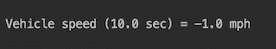
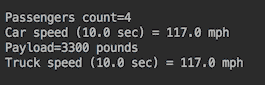
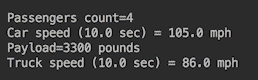
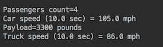
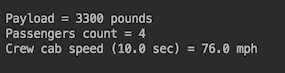
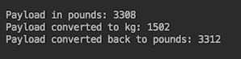
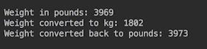
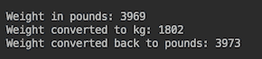
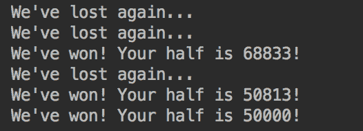

# 面向对象编程的快速通道-类和接口

在本章中，我们将介绍以下配方：

*   实现**面向对象设计**（**面向对象设计**）
*   使用内部类
*   使用继承和聚合
*   对接口进行编码
*   使用默认和静态方法创建接口
*   使用私有方法创建接口
*   使用`Optional`处理空值的更好方法
*   使用实用程序类`Objects`

本章中的食谱不需要任何关于 OOD 的先验知识。不过，有一些用 Java 编写代码的经验将是有益的。本章中的代码示例功能齐全，与 Java 11 兼容。为了更好地理解，我们建议您尝试运行所提供的示例。

我们还鼓励您根据您的团队经验，根据您的需要调整本章中的提示和建议。考虑与同事分享您的新知识，并讨论如何将所述原则应用于您的领域和当前项目。

# 介绍

本章简要介绍了**o****面向对象编程**（**OOP**的概念，并介绍了自 Java 8 以来引入的一些增强功能。我们还将尝试在适用的地方介绍一些良好的 OOD 实践，并使用特定的代码示例演示它们。

人们可以花很多时间阅读书籍和互联网上有关 OOD 的文章和实用建议。这样做对某些人是有益的。但是，根据我们的经验，掌握 OOD 的最快方法是在您自己的代码中尽早尝试其原则。这正是本章的目标，让您有机会了解并使用 OOD 原则，从而使正式定义立即变得有意义。

写得好的代码的主要标准之一是意图的清晰。动机良好且清晰的设计有助于实现这一点。代码由计算机运行，但由人工维护、读取和修改。记住这一点可以确保代码的使用寿命，甚至可以让那些后来不得不处理代码的人感谢并提及代码。

在本章中，您将学习如何使用五个基本 OOP 概念：

*   **对象/类**：将数据和方法保存在一起
*   **封装**：隐藏数据和/或方法
*   **继承**：扩展另一类数据和/或方法
*   **接口**：隐藏类型的实现和编码
*   **多态性**：使用指向子类对象的基类类型引用

如果您在互联网上搜索，您可能会注意到许多其他概念和对它们的补充，以及所有 OOD 原则，都可以从前面列出的五个概念中派生出来。这意味着对它们的深入理解是成功设计面向对象系统的先决条件。

# 实现面向对象设计（OOD）

在本教程中，您将学习前两个 OOP 概念对象/类和封装。这些概念是 ODE 的基础。

# 准备

术语*对象*通常指耦合数据和可应用于该数据的过程的实体。既不需要数据也不需要程序，但其中一个是，通常两者都存在。数据称为对象字段（或属性），而过程称为方法。字段值描述对象的*状态*。方法描述对象的*行为*。每个对象都有一个类型，该类型由其类（用于创建对象的模板）定义。对象也被称为类的实例。

A *class* is a collection of definitions of fields and methods that will be present in each of its instances—the objects created based on this class.
Encapsulation is the hiding of those fields and methods that should not be accessible by other objects.

通过在字段和方法的声明中使用称为*访问修饰符的`public`、`protected`或`private`Java 关键字*实现封装。当未指定访问修饰符时，还有一个默认的封装级别。

# 怎么做。。。

1.  使用`horsePower`字段创建一个`Engine`类。添加`setHorsePower(int horsePower)`方法（设置此字段的值）和`getSpeedMph(double timeSec, int weightPounds)`方法（根据车辆开始移动后经过的时间段、车辆重量和发动机功率计算车辆速度）：

```java
public class Engine { 
  private int horsePower; 
  public void setHorsePower(int horsePower) { 
     this.horsePower = horsePower; 
  } 
  public double getSpeedMph(double timeSec, int weightPounds){ 
    double v = 2.0 * this.horsePower * 746 * timeSec * 
                                       32.17 / weightPounds; 
    return Math.round(Math.sqrt(v) * 0.68); 
 } 
}
```

2.  创建`Vehicle`类：

```java
      public class Vehicle { 
          private int weightPounds; 
          private Engine engine; 
          public Vehicle(int weightPounds, Engine engine) { 
            this.weightPounds = weightPounds; 
            this.engine = engine; 
          } 
          public double getSpeedMph(double timeSec){ 
            return this.engine.getSpeedMph(timeSec, weightPounds); 
         } 
     } 
```

3.  创建将使用上述类的应用程序：

```java
public static void main(String... arg) { 
   double timeSec = 10.0; 
   int horsePower = 246; 
   int vehicleWeight = 4000;  
   Engine engine = new Engine(); 
   engine.setHorsePower(horsePower); 
   Vehicle vehicle = new Vehicle(vehicleWeight, engine); 
   System.out.println("Vehicle speed (" + timeSec + " sec)=" 
                   + vehicle.getSpeedMph(timeSec) + " mph"); 
 } 
```

如您所见，`engine`对象是通过调用`Engine`类的默认构造函数创建的，没有参数，并且使用`new`Java 关键字为堆上新创建的对象分配内存。

第二个对象`vehicle`是使用显式定义的`Vehicle`类构造函数创建的，该构造函数有两个参数。构造函数的第二个参数是`engine`对象，它携带使用`setHorsePower(int horsePower)`方法设置为`246`的`horsePower`值。

`engine`对象包含`getSpeedMph(double timeSec, int weightPounds)`方法，任何对象都可以调用`getSpeedMph(double timeSec, int weightPounds)`方法（因为它是`public`），就像`Vehicle`类的`getSpeedMph(double timeSec)`方法一样。

# 它是如何工作的。。。

前面的应用程序生成以下输出：


值得注意的是，`Vehicle`类的`getSpeedMph(double timeSec)`方法依赖于分配给`engine`字段的值的存在。这样，`Vehicle`类*的对象将*速度计算委托给`Engine`类的对象。如果后者未设置（`Vehicle()`构造函数中传递的`null`，例如），`NullPointerException`将在运行时抛出，如果应用程序未处理，JVM 将捕获并强制退出。为了避免这种情况，我们可以检查`Vehicle()`构造函数中是否存在`engine`字段值：

```java
if(engine == null){ 
   throw new RuntimeException("Engine" + " is required parameter."); 
}   
```

或者，我们可以在`Vehicle`类的`getSpeedMph(double timeSec)`方法中进行检查：

```java
if(getEngine() == null){ 
  throw new RuntimeException("Engine value is required."); 
} 
```

通过这种方式，我们避免了`NullPointerException`的歧义，并准确地告诉用户问题的根源是什么。

您可能已经注意到，`getSpeedMph(double timeSec, int weightPounds)`方法可以从`Engine`类中删除，并且可以在`Vehicle`类中完全实现：

```java
public double getSpeedMph(double timeSec){
  double v =  2.0 * this.engine.getHorsePower() * 746 * 
                                timeSec * 32.17 / this.weightPounds;
  return Math.round(Math.sqrt(v) * 0.68);
}
```

为此，我们需要将`getHorsePower()`公共方法添加到`Engine`类中，以便`Vehicle`类中的`getSpeedMph(double timeSec)`方法可以使用它。现在，我们将`getSpeedMph(double timeSec, int weightPounds)`方法留在`Engine`类中。

这是您需要做出的设计决策之一。如果您认为`Engine`类的对象将被不同类的对象（不仅仅是`Vehicle`类）传递和使用，那么您需要将`getSpeedMph(double timeSec, int weightPounds)`方法保留在`Engine`类中。否则，如果您认为只有`Vehicle`类负责速度计算（这是有意义的，因为它是车辆的速度，而不是发动机的速度），您应该在`Vehicle`类中实现此方法。

# 还有更多。。。

Java 提供了扩展类的能力，并允许子类访问基类的所有非私有字段和方法。例如，您可以确定可以询问其速度的每个对象都属于派生自`Vehicle`类的子类。在这种情况下，`Car`类可能如下所示：

```java
public class Car extends Vehicle {
  private int passengersCount;
  public Car(int passengersCount, int weightPounds, Engine engine){
    super(weightPounds, engine);
    this.passengersCount = passengersCount;
  }
  public int getPassengersCount() {
    return this.passengersCount;
  }
}
```

现在，我们可以通过将`Vehicle`类对象替换为`Car`类的对象来更改测试代码：

```java
public static void main(String... arg) { 
  double timeSec = 10.0; 
  int horsePower = 246; 
  int vehicleWeight = 4000; 
  Engine engine = new Engine(); 
  engine.setHorsePower(horsePower); 
  Vehicle vehicle = new Car(4, vehicleWeight, engine); 
  System.out.println("Car speed (" + timeSec + " sec) = " + 
                             vehicle.getSpeedMph(timeSec) + " mph"); 
} 
```

当执行上述代码时，它产生与`Vehicle`类的对象相同的值：


由于多态性，可以将对`Car`类的对象的引用分配给其基类`Vehicle`的引用。`Car`类对象有两种类型—它自己的类型`Car`和基类的类型`Vehicle`。

在 Java 中，一个类还可以实现多个接口，这样一个类的对象也可以具有每个实现接口的类型。我们将在随后的食谱中讨论这一点。

# 使用内部类

在本食谱中，您将了解三种类型的内部类：

*   **内部类**：这是在另一个（封闭的）类中定义的类。它从封闭类外部的可访问性由`public`、`protected`和`private`访问修饰符调节。内部类可以访问封闭类的私有成员，封闭类可以访问其内部类的私有成员，但不能从封闭类外部访问私有内部类或非私有内部类的私有成员。
*   **方法局部内部类**：方法内部定义的类。它的可访问性仅限于方法内部。
*   **匿名内部类**：没有声明名称的类，仅基于接口或扩展类在对象实例化时定义。

# 准备

当一个类被另一个类使用，并且只有一个类使用时，设计者可能会决定不需要将此类公开。例如，假设`Engine`类仅由`Vehicle`类使用。

# 怎么做。。。

1.  创建`Engine`类作为`Vehicle`类的内部类：

```java
        public class Vehicle {
          private int weightPounds;
          private Engine engine;
          public Vehicle(int weightPounds, int horsePower) {
            this.weightPounds = weightPounds;
            this.engine = new Engine(horsePower);
          }
          public double getSpeedMph(double timeSec){
            return this.engine.getSpeedMph(timeSec);
          }
          private int getWeightPounds(){ return weightPounds; }
          private class Engine {
            private int horsePower;
            private Engine(int horsePower) {
              this.horsePower = horsePower;
            }
            private double getSpeedMph(double timeSec){
              double v = 2.0 * this.horsePower * 746 * 
                         timeSec * 32.17 / getWeightPounds();
              return Math.round(Math.sqrt(v) * 0.68);
            }
          }
        }
```

2.  请注意，`Vehicle`类的`getSpeedMph(double timeSec)`方法可以访问`Engine`类，即使它被声明为`private`。它甚至可以访问`Engine`类的`getSpeedMph(double timeSec)`私有方法。内部类也可以访问封闭类的所有私有元素。这就是为什么`Engine`类的`getSpeedMph(double timeSec)`方法可以访问封闭`Vehicle`类的私有`getWeightPounds()`方法的原因。

3.  仔细看看内部`Engine`类的用法。仅使用`Engine`类的`getSpeedMph(double timeSec)`方法。如果设计者认为将来也会如此，他们可以合理地决定将`Engine`类方法设置为局部内部类，这是内部类的第二种类型：

```java
        public class Vehicle {
          private int weightPounds;
          private int horsePower;
          public Vehicle(int weightPounds, int horsePower) {
            this.weightPounds = weightPounds;
            this.horsePower = horsePower;
          }
          private int getWeightPounds() { return weightPounds; }
          public double getSpeedMph(double timeSec){
            class Engine {
              private int horsePower;
              private Engine(int horsePower) {
                this.horsePower = horsePower;
              }
              private double getSpeedMph(double timeSec){
                double v = 2.0 * this.horsePower * 746 * 
                          timeSec * 32.17 / getWeightPounds();
                return Math.round(Math.sqrt(v) * 0.68);
              }
            }
            Engine engine = new Engine(this.horsePower);
            return engine.getSpeedMph(timeSec);
          }
        }
```

在前面的代码示例中，拥有一个`Engine`类毫无意义。速度计算公式可以直接使用，无需`Engine`类的调解。但在某些情况下，这可能并不容易做到。例如，方法本地内部类可能需要扩展其他类以继承其功能，或者创建的`Engine`对象可能需要经过一些转换，因此需要创建。其他注意事项可能需要一个本地内部类的方法。

在任何情况下，使不需要从封闭类外部访问的所有功能都不可访问都是一种好的做法。封装隐藏对象的状态和行为有助于避免意外更改或重写对象行为所导致的意外副作用。这使得结果更加可预测。这就是为什么一个好的设计只公开必须从外部访问的功能。通常是封闭类功能首先推动了类的创建，而不是内部类或其他实现细节。

# 它是如何工作的。。。

无论`Engine`类是作为内部类实现还是作为方法本地内部类实现，测试代码看起来都是一样的：

```java
public static void main(String arg[]) {
  double timeSec = 10.0;
  int engineHorsePower = 246;
  int vehicleWeightPounds = 4000;
  Vehicle vehicle = 
          new Vehicle(vehicleWeightPounds, engineHorsePower);
  System.out.println("Vehicle speed (" + timeSec + " sec) = " 
                    + vehicle.getSpeedMph(timeSec) + " mph");
}
```

如果我们运行前面的程序，我们会得到相同的输出：


现在，假设我们需要测试`getSpeedMph()`方法的不同实现：

```java
public double getSpeedMph(double timeSec){ return -1.0d; }
```

如果此速度计算公式对您没有意义，则您是正确的，它没有意义。我们这样做是为了使结果具有可预测性，并且与以前实施的结果不同。

有许多方法可以引入这种新的实现。例如，我们可以更改`Engine`类中`getSpeedMph(double timeSec)`方法的代码。或者，我们可以在`Vehicle`类中更改相同方法的实现。

在这个配方中，我们将使用第三种类型的内部类，称为匿名内部类来实现这一点。当您希望编写尽可能少的新代码，或者希望通过临时重写旧代码来快速测试新行为时，这种方法尤其方便。匿名类的用法如下所示：

```java
public static void main(String... arg) {
  double timeSec = 10.0;
  int engineHorsePower = 246;
  int vehicleWeightPounds = 4000;
  Vehicle vehicle = 
    new Vehicle(vehicleWeightPounds, engineHorsePower) {
        public double getSpeedMph(double timeSec){ 
           return -1.0d;
        }
    };
  System.out.println("Vehicle speed (" + timeSec + " sec) = "
                    + vehicle.getSpeedMph(timeSec) + " mph");
}
```

如果我们运行此程序，结果如下：



如您所见，匿名类实现已经覆盖了`Vehicle`类实现。新的匿名类中只有一个方法，`getSpeedMph()`方法返回硬编码值。但是我们可以重写`Vehicle`类的其他方法，或者添加新的方法。为了便于演示，我们只想让示例保持简单。

根据定义，匿名内部类必须是一个表达式，该表达式是以分号结尾的语句（与任何语句一样）的一部分。该表达式由以下部分组成：

*   `new`操作员
*   实现的接口或扩展类的名称，后跟括号，`()`，表示默认构造函数或扩展类的构造函数（后者是我们的情况，扩展类为`Vehicle`）
*   使用方法创建类主体

与任何内部类一样，匿名内部类可以访问封闭类的任何成员，并附带内部匿名类使用的警告，封闭类的字段必须隐式声明为`final`或成为`final`，这意味着它们的值不能更改。如果您试图更改此值，一个好的现代 IDE 将警告您违反此约束。

使用这些特性，我们可以修改示例代码，为新实现的`getSpeedMph(double timeSec)`方法提供更多输入数据，而无需将其作为方法参数传递：

```java
public static void main(String... arg) {
  double timeSec = 10.0;
  int engineHorsePower = 246;
  int vehicleWeightPounds = 4000;
  Vehicle vehicle = 
    new Vehicle(vehicleWeightPounds, engineHorsePower){
      public double getSpeedMph(double timeSec){
        double v = 2.0 * engineHorsePower * 746 * 
             timeSec * 32.17 / vehicleWeightPounds;
        return Math.round(Math.sqrt(v) * 0.68);
      }
    };
  System.out.println("Vehicle speed (" + timeSec + " sec) = " 
                    + vehicle.getSpeedMph(timeSec) + " mph");
}
```

注意，`timeSec`、`engineHorsePower`和`vehicleWeightPounds`变量可以通过内部类的`getSpeedMph(double timeSec)`方法访问，不能修改。如果我们运行前面的代码，结果将与前面相同：


如果接口只有一个抽象方法（称为函数接口），则可以使用另一个构造（称为*lambda 表达式*，而不是匿名内部类）。它提供了一个较短的表示法。我们将在[第 4 章](04.html)*开始功能化*中讨论功能接口和 lambda 表达式。

# 还有更多。。。

内部类是非静态嵌套类。Java 还允许我们创建一个静态嵌套类，当内部类不需要访问封闭类的非静态字段和方法时，可以使用该类。下面是一个例子（在`Engine`类中添加了`static`关键字）：

```java
public class Vehicle {
  private Engine engine;
  public Vehicle(int weightPounds, int horsePower) {
    this.engine = new Engine(horsePower, weightPounds)
  }
  public double getSpeedMph(double timeSec){
    return this.engine.getSpeedMph(timeSec);
  }
  private static class Engine {
    private int horsePower;
    private int weightPounds;
    private Engine(int horsePower, int weightPounds) {
      this.horsePower = horsePower;
    }
    private double getSpeedMph(double timeSec){
      double v = 2.0 * this.horsePower * 746 * 
                       timeSec * 32.17 / this.weightPounds;
      return Math.round(Math.sqrt(v) * 0.68);
    }
  }
}
```

因为静态类无法访问非静态成员，所以在构造`Engine`类的过程中，我们被迫将权重值传递给`Engine`类，并删除了`getWeightPounds()`方法，因为不再需要它。

# 使用继承和聚合

在本食谱中，您将进一步了解两个重要的 OOP 概念：继承和多态性，这两个概念已经在前面的食谱示例中提到并使用过。加上聚合，这些概念使设计更具可扩展性。

# 准备

继承是一个类获得另一个类的非私有字段和方法所有权的能力。

扩展类称为基类、超类或父类。该类的新扩展称为子类或子类。

多态性是使用基类类型引用其子类的对象的能力。

为了演示继承和多态性的威力，让我们创建一些类来表示汽车和卡车，每个类都有重量、发动机功率和速度（作为时间的函数）以及最大负载。此外，在这种情况下，汽车的特征是乘客数量，而卡车的重要特征是其有效载荷。

# 怎么做。。。

1.  看看`Vehicle`类：

```java
        public class Vehicle {
          private int weightPounds, horsePower;
          public Vehicle(int weightPounds, int horsePower) {
            this.weightPounds = weightPounds;
            this.horsePower = horsePower;
          }
          public double getSpeedMph(double timeSec){
            double v = 2.0 * this.horsePower * 746 * 
                     timeSec * 32.17 / this.weightPounds;
            return Math.round(Math.sqrt(v) * 0.68);
          }
        }
```

`Vehicle`类中实现的功能不是特定于汽车或卡车的，因此将此类用作`Car`和`Truck`类的基类是有意义的，因此每个类都将此功能作为自己的功能。

2.  创建`Car`类：

```java
        public class Car extends Vehicle {
          private int passengersCount;
          public Car(int passengersCount, int weightPounds, 
                                             int horsepower){
            super(weightPounds, horsePower);
            this.passengersCount = passengersCount;
          }
          public int getPassengersCount() { 
            return this.passengersCount; 
          }
        }
```

3.  创建`Truck`类：

```java
         public class Truck extends Vehicle {
           private int payload;
           public Truck(int payloadPounds, int weightPounds, 
                                              int horsePower){
             super(weightPounds, horsePower);
             this.payload = payloadPounds;
           }
           public int getPayload() { 
             return this.payload; 
           }
         }
```

由于`Vehicle`基类既没有无参数的隐式构造函数，也没有无参数的显式构造函数（因为我们选择了只使用带参数的显式构造函数），因此我们必须调用基类构造函数`super()`作为`Vehicle`类的每个子类的构造函数的第一行。

# 它是如何工作的。。。

让我们编写一个测试程序：

```java
public static void main(String... arg) {
  double timeSec = 10.0;
  int engineHorsePower = 246;
  int vehicleWeightPounds = 4000;
  Vehicle vehicle = new Car(4, vehicleWeightPounds, engineHorsePower);
  System.out.println("Passengers count=" + 
                                 ((Car)vehicle).getPassengersCount());
  System.out.println("Car speed (" + timeSec + " sec) = " + 
                               vehicle.getSpeedMph(timeSec) + " mph");
  vehicle = new Truck(3300, vehicleWeightPounds, engineHorsePower);
  System.out.println("Payload=" + 
                           ((Truck)vehicle).getPayload() + " pounds");
  System.out.println("Truck speed (" + timeSec + " sec) = " + 
                               vehicle.getSpeedMph(timeSec) + " mph");
}
```

注意，`Vehicle`类型的`vehicle`引用指向`Car`子类的对象，之后指向`Truck`子类的对象。由于多态性，这是可能的，根据多态性，一个对象在其继承行中具有每个类的类型，包括所有接口。

如果您需要调用一个只存在于子类中的方法，那么您必须像在前面的示例中所做的那样，将这样的引用转换为子类类型。

上述代码的结果如下：



当我们看到汽车和卡车的计算速度相同时，我们不应该感到惊讶，因为计算速度时使用的重量和发动机功率都相同。但是，凭直觉，我们觉得一辆重载卡车不应该在同一时间内达到与汽车相同的速度。为了验证这一点，我们需要在速度计算中包括汽车（乘客及其行李）和卡车（有效载荷）的总重量。一种方法是重写每个子类中的`Vehicle`基类的`getSpeedMph(double timeSec)`方法。

我们可以将`getSpeedMph(double timeSec)`方法添加到`Car`类中，这将覆盖基类中具有相同签名的方法。此方法将使用车辆特定重量计算：

```java
public double getSpeedMph(double timeSec) {
  int weight = this.weightPounds + this.passengersCount * 250;
  double v = 2.0 * this.horsePower * 746 * timeSec * 32.17 / weight;
  return Math.round(Math.sqrt(v) * 0.68);
}
```

在前面的代码中，我们假设一名携带行李的乘客平均总重量为`250`磅。

同样，我们可以将`getSpeedMph(double timeSec)`方法添加到`Truck`类中：

```java
public double getSpeedMph(double timeSec) {
  int weight = this.weightPounds + this.payload;
  double v = 2.0 * this.horsePower * 746 * timeSec * 32.17 / weight;
  return Math.round(Math.sqrt(v) * 0.68);
}
```

这些修改的结果（如果我们运行相同的测试类）如下所示：


结果证实了我们的直觉——满载的汽车或卡车不会达到与空车相同的速度。

子类中的新方法覆盖了`Vehicle`基类的`getSpeedMph(double timeSec)`，尽管我们通过基类引用访问它：

```java
Vehicle vehicle =  new Car(4, vehicleWeightPounds, engineHorsePower);
System.out.println("Car speed (" + timeSec + " sec) = " + 
                              vehicle.getSpeedMph(timeSec) + " mph");
```

重写的方法是动态绑定的，这意味着方法调用的上下文由所引用的实际对象的类型决定。因为在我们的示例中，`vehicle`引用指向`Car`子类的对象，`vehicle.getSpeedMph(double timeSec)`构造调用子类的方法，而不是基类的方法。

在这两个新方法中存在明显的代码冗余，我们可以通过在`Vehicle`基类中创建一个方法进行重构，然后在每个子类中使用它：

```java
protected double getSpeedMph(double timeSec, int weightPounds) {
  double v = 2.0 * this.horsePower * 746 * 
                              timeSec * 32.17 / weightPounds;
  return Math.round(Math.sqrt(v) * 0.68);
}
```

由于此方法仅由子类使用，因此它可以是`protected`，因此只能由子类访问。

现在我们可以修改`Car`类中的`getSpeedMph(double timeSec)`方法，如下所示：

```java
public double getSpeedMph(double timeSec) {
  int weightPounds = this.weightPounds + this.passengersCount * 250;
  return getSpeedMph(timeSec, weightPounds);
}
```

在前面的代码中，调用`getSpeedMph(timeSec, weightPounds)`方法时不需要使用`super`关键字，因为具有此类签名的方法只存在于`Vehicle`基类中，并且没有歧义。

在`Truck`类的`getSpeedMph(double timeSec)`方法中也可以进行类似的更改：

```java
public double getSpeedMph(double timeSec) {
  int weightPounds = this.weightPounds + this.payload;
  return getSpeedMph(timeSec, weightPounds);
}
```

现在我们需要通过添加 casting 来修改测试类，否则会出现运行时错误，因为`Vehicle`基类中不存在`getSpeedMph(double timeSec)`方法：

```java
public static void main(String... arg) {
    double timeSec = 10.0;
    int engineHorsePower = 246;
    int vehicleWeightPounds = 4000;
    Vehicle vehicle = new Car(4, vehicleWeightPounds, 
    engineHorsePower);
    System.out.println("Passengers count=" + 
    ((Car)vehicle).getPassengersCount());
    System.out.println("Car speed (" + timeSec + " sec) = " +
                       ((Car)vehicle).getSpeedMph(timeSec) + " mph");
    vehicle = new Truck(3300, vehicleWeightPounds, engineHorsePower);
    System.out.println("Payload=" + 
                          ((Truck)vehicle).getPayload() + " pounds");
    System.out.println("Truck speed (" + timeSec + " sec) = " + 
                     ((Truck)vehicle).getSpeedMph(timeSec) + " mph");
  }
}
```

正如您所料，测试类生成相同的值：



为了简化测试代码，我们可以放弃强制转换并编写以下代码：

```java
public static void main(String... arg) {
  double timeSec = 10.0;
  int engineHorsePower = 246;
  int vehicleWeightPounds = 4000;
  Car car = new Car(4, vehicleWeightPounds, engineHorsePower);
  System.out.println("Passengers count=" + car.getPassengersCount());
  System.out.println("Car speed (" + timeSec + " sec) = " + 
                                  car.getSpeedMph(timeSec) + " mph");
  Truck truck = 
              new Truck(3300, vehicleWeightPounds, engineHorsePower);
  System.out.println("Payload=" + truck.getPayload() + " pounds");
  System.out.println("Truck speed (" + timeSec + " sec) = " + 
                                truck.getSpeedMph(timeSec) + " mph");
}
```

此代码生成的速度值保持不变。

然而，有一种更简单的方法可以达到同样的效果。我们可以将`getMaxWeightPounds()`方法添加到基类和每个子类中。`Car`类现在将如下所示：

```java
public class Car extends Vehicle {
  private int passengersCount, weightPounds;
  public Car(int passengersCount, int weightPounds, int horsePower){
    super(weightPounds, horsePower);
    this.passengersCount = passengersCount;
    this.weightPounds = weightPounds;
  }
  public int getPassengersCount() { 
    return this.passengersCount;
  }
  public int getMaxWeightPounds() {
    return this.weightPounds + this.passengersCount * 250;
  }
}
```

下面是新版本的`Truck`类现在的样子：

```java
public class Truck extends Vehicle {
  private int payload, weightPounds;
  public Truck(int payloadPounds, int weightPounds, int horsePower) {
    super(weightPounds, horsePower);
    this.payload = payloadPounds;
    this.weightPounds = weightPounds;
  }
  public int getPayload() { return this.payload; }
  public int getMaxWeightPounds() {
    return this.weightPounds + this.payload;
  }
}
```

我们还需要将`getMaxWeightPounds()`方法添加到基类中，以便用于速度计算：

```java
public abstract class Vehicle {
  private int weightPounds, horsePower;
  public Vehicle(int weightPounds, int horsePower) {
    this.weightPounds = weightPounds;
    this.horsePower = horsePower;
  }
  public abstract int getMaxWeightPounds();
  public double getSpeedMph(double timeSec){
    double v = 2.0 * this.horsePower * 746 * 
                             timeSec * 32.17 / getMaxWeightPounds();
    return Math.round(Math.sqrt(v) * 0.68);
  }
}
```

将抽象方法`getMaxWeightPounds()`添加到`Vehicle`类会使该类变得抽象。这有一个积极的副作用，它在每个子类中强制实现`getMaxWeightPounds()`方法。否则，子类不能实例化，也必须声明为抽象的。

测试类保持不变并产生相同的结果：


但是，老实说，我们这样做只是为了演示使用抽象方法和类的一种可能方式。事实上，更简单的解决方案是将最大权重作为参数传递给`Vehicle`基类的构造函数。生成的类将如下所示：

```java
public class Car extends Vehicle {
  private int passengersCount;
  public Car(int passengersCount, int weightPounds, int horsepower){
    super(weightPounds + passengersCount * 250, horsePower);
    this.passengersCount = passengersCount;
  }
  public int getPassengersCount() { 
    return this.passengersCount; }
}
```

我们将乘客的重量添加到传递给超类构造函数的值中；这是该子类中唯一的更改。以下是`Truck`类中的类似变化：

```java
public class Truck extends Vehicle {
  private int payload;
  public Truck(int payloadPounds, int weightPounds, int horsePower) {
    super(weightPounds + payloadPounds, horsePower);
    this.payload = payloadPounds;
  }
  public int getPayload() { return this.payload; }
}
```

`Vehicle`基类与原来的基类保持一致：

```java
public class Vehicle {
  private int weightPounds, horsePower;
  public Vehicle(int weightPounds, int horsePower) {
    this.weightPounds = weightPounds;
    this.horsePower = horsePower;
  }
  public double getSpeedMph(double timeSec){
    double v = 2.0 * this.horsePower * 746;
    v = v * timeSec * 32.174 / this.weightPounds;
    return Math.round(Math.sqrt(v) * 0.68);
  }
}
```

测试类不会更改并产生相同的结果：



最后一个版本将最大权重传递给基类的构造函数，现在将成为进一步代码演示的起点。

# 聚合使设计更具可扩展性

在前面的示例中，速度模型是在`Vehicle`类的`getSpeedMph(double timeSec)`方法中实现的。如果我们需要使用不同的速度模型（例如，它包含更多的输入参数，并且更适合某些驾驶条件），我们需要更改`Vehicle`类或创建一个新的子类来覆盖该方法。如果我们需要用几十种甚至数百种不同的模型进行实验，这种方法就站不住脚了。

此外，在现实生活中，基于机器学习和其他先进技术的建模变得如此复杂和专业化，以至于汽车加速建模通常由不同的团队完成，而不是由组装汽车模型的团队完成。

为了避免子类的激增和车辆构建者和 speed 模型开发人员之间的代码合并冲突，我们可以使用聚合创建更具扩展性的设计。

聚合是一种 OOD 原则，用于使用不属于继承层次结构的类的行为来实现必要的功能。该行为可以独立于聚合功能而存在。

我们可以将速度计算封装在`getSpeedMph(double timeSec)`方法中的`SpeedModel`类中：

```java
public class SpeedModel{
  private Properties conditions;
  public SpeedModel(Properties drivingConditions){
    this.drivingConditions = drivingConditions;
  }
  public double getSpeedMph(double timeSec, int weightPounds,
                                               int horsePower){
    String road = 
         drivingConditions.getProperty("roadCondition","Dry");
    String tire = 
         drivingConditions.getProperty("tireCondition","New");
    double v = 2.0 * horsePower * 746 * timeSec * 
                                         32.17 / weightPounds;
    return Math.round(Math.sqrt(v)*0.68)-road.equals("Dry")? 2 : 5) 
                                       -(tire.equals("New")? 0 : 5);
  }
}
```

可以创建此类的对象，然后将其设置为`Vehicle`类字段的值：

```java
public class Vehicle {
   private SpeedModel speedModel;       
   private int weightPounds, horsePower;
   public Vehicle(int weightPounds, int horsePower) {
      this.weightPounds = weightPounds;
      this.horsePower = horsePower;
   }
   public void setSpeedModel(SpeedModel speedModel){
      this.speedModel = speedModel;
   }
   public double getSpeedMph(double timeSec){
      return this.speedModel.getSpeedMph(timeSec,
                       this.weightPounds, this.horsePower);
   }
}
```

测试类更改如下：

```java
public static void main(String... arg) {
  double timeSec = 10.0;
  int horsePower = 246;
  int vehicleWeight = 4000;
  Properties drivingConditions = new Properties();
  drivingConditions.put("roadCondition", "Wet");
  drivingConditions.put("tireCondition", "New");
  SpeedModel speedModel = new SpeedModel(drivingConditions);
  Car car = new Car(4, vehicleWeight, horsePower);
  car.setSpeedModel(speedModel);
  System.out.println("Car speed (" + timeSec + " sec) = " + 
                         car.getSpeedMph(timeSec) + " mph");
}
```

上述代码的结果如下：


我们将速度计算功能隔离在一个单独的类中，现在可以修改或扩展它，而无需更改`Vehicle`继承层次结构的任何类。这就是聚合设计原则允许您在不更改实现的情况下更改行为的方式。

在下一个菜谱中，我们将向您展示接口的 OOP 概念如何释放聚合和多态性的更强大功能，从而使设计更简单、更具表现力。

# 对接口进行编码

在本教程中，您将学习最后一个 OOP 概念，即接口，并进一步练习聚合和多态性以及内部类和继承的使用。

# 准备

接口定义了在实现接口的类中可以看到的方法的签名。它是客户端可以访问的功能的公共面，因此通常被称为**应用程序接口**（**API**。它支持多态性和聚合，并有助于更灵活和可扩展的设计。

接口是隐式抽象的，这意味着它不能被实例化。如果不实现接口，则不能仅基于接口创建任何对象。它仅用于包含抽象方法（无正文）。但是自从 Java8 以来，可以向接口添加默认方法和私有方法，这是我们将在下面的菜谱中讨论的功能。

每个接口都可以扩展多个其他接口，并且类似于类继承，继承扩展接口的所有默认和抽象方法。无法继承静态成员，因为它们属于特定接口。

# 怎么做。。。

1.  创建描述 API 的接口：

```java
public interface SpeedModel {
   double getSpeedMph(double timeSec, int weightPounds, 
                                            int horsePower);
 }
 public interface Vehicle {
   void setSpeedModel(SpeedModel speedModel);
   double getSpeedMph(double timeSec);
 }
 public interface Car extends Vehicle {
   int getPassengersCount();
 }
 public interface Truck extends Vehicle {
   int getPayloadPounds();
 }
```

2.  使用工厂，工厂是生成实现某些接口的对象的类。工厂对客户机代码隐藏了实现的细节，因此客户机只处理接口。当实例创建需要复杂的过程和/或大量代码重复时，它尤其有用。在我们的例子中，有一个`FactoryVehicle`类可以创建实现`Vehicle`、`Car`或`Truck`接口的类的对象。我们还将创建`FactorySpeedModel`类，该类生成实现`SpeedModel`接口的类的对象。这样的 API 允许我们编写以下代码：

```java
public static void main(String... arg) {
   double timeSec = 10.0;
   int horsePower = 246;
   int vehicleWeight = 4000;
   Properties drivingConditions = new Properties();
   drivingConditions.put("roadCondition", "Wet");
   drivingConditions.put("tireCondition", "New");
   SpeedModel speedModel  = FactorySpeedModel.
                 generateSpeedModel(drivingConditions);
   Car car = FactoryVehicle.
                buildCar(4, vehicleWeight, horsePower);
   car.setSpeedModel(speedModel);
   System.out.println("Car speed (" + timeSec + " sec) = " 
                      + car.getSpeedMph(timeSec) + " mph");
}
```

3.  请注意，代码行为与前面的示例中相同：


但是，该设计的可扩展性要大得多。

# 它是如何工作的。。。

我们已经看到了`SpeedModel`接口的一种可能实现。下面是另一种方法，将`SpeedModel`类型的对象聚合到`FactorySpeedModel`类中：

```java
public class FactorySpeedModel {
  public static SpeedModel generateSpeedModel(
  Properties drivingConditions){
    //if drivingConditions includes "roadCondition"="Wet"
    return new SpeedModelWet(...);
    //if drivingConditions includes "roadCondition"="Dry"
    return new SpeedModelDry(...);
  }
  private class SpeedModelWet implements SpeedModel{
    public double getSpeedMph(double timeSec, int weightPounds, 
                                                     int horsePower){
       //method code goes here
    }
  }
  private class SpeedModelDry implements SpeedModel{
    public double getSpeedMph(double timeSec, int weightPounds, 
                                                     int horsePower){
      //method code goes here
    }
  }
}
```

为了简洁起见，我们将注释放在伪代码中，`...`符号代替了实际代码。

如您所见，factory 类可能隐藏许多不同的私有类，每个私有类都包含特定驾驶条件的专用模型。每个模型产生不同的结果。

`FactoryVehicle`类的实现可能如下所示：

```java
public class FactoryVehicle {
  public static Car buildCar(int passengersCount, 
                               int weightPounds, int horsePower){
    return new CarImpl(passengersCount, weightPounds,horsePower);
  }
  public static Truck buildTruck(int payloadPounds, 
                               int weightPounds, int horsePower){
    return new TruckImpl(payloadPounds, weightPounds,horsePower);
  }
}
```

`CarImpl`私有嵌套类在`FactoryVehicle`类中可以如下所示：

```java
  private static class CarImpl extends VehicleImpl implements Car {
    private int passengersCount;
    private CarImpl(int passengersCount, int weightPounds,
                                                 int horsePower){
      super(weightPounds + passengersCount * 250, horsePower);
      this.passengersCount = passengersCount;
    }
    public int getPassengersCount() { 
      return this.passengersCount;
    }
  }
```

类似地，`TruckImpl`类可以是`FactoryImpl`类的私有嵌套类：

```java
  private static class TruckImpl extends VehicleImpl implements Truck {
    private int payloadPounds;
    private TruckImpl(int payloadPounds, int weightPounds, 
                                                     int horsePower){
      super(weightPounds+payloadPounds, horsePower);
      this.payloadPounds = payloadPounds;
    }
    public int getPayloadPounds(){ return payloadPounds; }
  }
```

我们也可以将`VehicleImpl`类放置为`FactoryVehicle`类的私有内部类，这样`CarImpl`和`TruckImpl`类可以访问它，但`FactoryVehicle`之外的任何其他类都不能访问：

```java
  private static abstract class VehicleImpl implements Vehicle {
    private SpeedModel speedModel;
    private int weightPounds, horsePower;
    private VehicleImpl(int weightPounds, int horsePower){
      this.weightPounds = weightPounds;
      this.horsePower = horsePower;
    }
    public void setSpeedModel(SpeedModel speedModel){ 
      this.speedModel = speedModel; 
    }
    public double getSpeedMph(double timeSec){
      return this.speedModel.getSpeedMph(timeSec, weightPounds, 
                                                    horsePower);
    }
  }
```

如您所见，接口描述了如何调用对象行为，而工厂可以为不同的请求生成不同的实现，而无需更改客户端应用程序的代码。

# 还有更多。。。

让我们试着模拟一个乘员驾驶室——一辆具有多个乘客座椅的卡车，它结合了汽车和卡车的特性。Java 不允许多重继承。这是另一种情况，界面起到了救援作用。

`CrewCab`类可能如下所示：

```java
public class CrewCab extends VehicleImpl implements Car, Truck {
  private int payloadPounds;
  private int passengersCount;
  private CrewCabImpl(int passengersCount, int payloadPounds,
                             int weightPounds, int horsePower) {
     super(weightPounds + payloadPounds + passengersCount * 250, 
                                                     horsePower);
     this.payloadPounds = payloadPounds;
     this. passengersCount = passengersCount;
  }
  public int getPayloadPounds(){ return payloadPounds; }
  public int getPassengersCount() { 
     return this.passengersCount;
  }
}
```

该类实现了两个接口-`Car`和`Truck`-并将车辆、有效载荷和乘客及其行李的组合重量传递给基类构造函数。

我们也可以在`FactoryVehicle`中添加以下方法：

```java
public static Vehicle buildCrewCab(int passengersCount, 
                      int payload, int weightPounds, int horsePower){
  return new CrewCabImpl(passengersCount, payload, 
                                           weightPounds, horsePower);
}
```

`CrewCab`对象的双重性质可以通过以下测试来证明：

```java
public static void main(String... arg) {
  double timeSec = 10.0;
  int horsePower = 246;
  int vehicleWeight = 4000;
  Properties drivingConditions = new Properties();
  drivingConditions.put("roadCondition", "Wet");
  drivingConditions.put("tireCondition", "New");
  SpeedModel speedModel = 
      FactorySpeedModel.generateSpeedModel(drivingConditions);
  Vehicle vehicle = FactoryVehicle.
             buildCrewCab(4, 3300, vehicleWeight, horsePower);
  vehicle.setSpeedModel(speedModel);
  System.out.println("Payload = " +
            ((Truck)vehicle).getPayloadPounds()) + " pounds");
  System.out.println("Passengers count = " + 
                         ((Car)vehicle).getPassengersCount());
  System.out.println("Crew cab speed (" + timeSec + " sec) = "  
                     + vehicle.getSpeedMph(timeSec) + " mph");
}
```

如您所见，我们可以将`CrewCub`类的对象强制转换为它实现的每个接口。如果我们运行此程序，结果如下：



# 使用默认和静态方法创建接口

在本教程中，您将了解 Java 8 中首次引入的两个新特性—接口中的默认方法和静态方法。

# 准备

接口中的默认方法允许我们添加新方法签名，而无需在添加新方法签名之前更改已实现此接口的类。该方法称为*default*，因为它提供了在类未实现该方法时的功能。但是，如果类实现了它，则接口的默认实现将被类实现忽略并覆盖。

接口中的静态方法可以提供与类中的静态方法相同的功能。与类静态方法类似，类静态方法可以在没有类实例化的情况下调用，接口静态方法也可以使用应用于接口的点运算符`SomeInterface.someStaticMethod()`来调用。

接口的静态方法不能被实现此接口的类重写，也不能隐藏任何类的任何静态方法，包括实现此接口的类。

例如，让我们在示例中已经使用的系统中添加一些功能。到目前为止，我们已经创造了一个惊人的软件来计算车辆的速度。如果该系统变得流行（应该如此），我们希望它对喜欢公制单位的读者更友好，而不是我们在速度计算中使用的英里和磅。在我们的速度计算软件流行之后，为了满足这种需求，我们决定在`Car`和`Truck`接口中添加更多方法，但我们不想破坏现有的实现。

默认接口方法正是针对这种情况引入的。使用它，我们可以发布新版本的`Car`和`Truck`接口，而无需将发布与现有实现的相应修改相协调，即`CarImpl`、`TruckImpl`和`FactoryVehicle`类。

# 怎么做。。。

例如，我们将更改`Truck`接口。`Car`接口可以类似方式修改：

1.  通过添加返回卡车有效载荷（单位为千克）的`getPayloadKg()`方法来增强`Truck`接口。通过向`Truck`接口添加新的默认方法，您可以在不强制更改实现`Truck`接口的`TruckImpl`类的情况下执行此操作：

```java
      public interface Truck extends Vehicle {
          int getPayloadPounds();
          default int getPayloadKg(){
            return (int) Math.round(0.454 * getPayloadPounds());
          }
      }
```

注意新的`getPayloadKg()`方法如何使用现有的`getPayloadPounds()`方法，就好像后者也在接口内部实现一样，尽管事实上，它是在实现`Truck`接口的类中实现的。当这个方法动态地绑定到实现这个接口的类的实例时，神奇的事情就会发生在运行时。

我们无法将`getPayloadKg()`方法设置为静态，因为它将无法访问非静态`getPayloadPounds()`方法，并且我们必须使用`default`关键字，因为只有接口的默认或静态方法才能有主体。

2.  编写使用新方法的客户端代码：

```java
      public static void main(String... arg) {
         Truck truck = FactoryVehicle.buildTruck(3300, 4000, 246);
         System.out.println("Payload in pounds: " + 
                                        truck.getPayloadPounds());
         System.out.println("Payload in kg: " + 
                                            truck.getPayloadKg());
      }
```

3.  运行前面的程序并检查输出：


4.  请注意，新方法甚至可以在不更改实现它的类的情况下工作。
5.  当您决定改进`TruckImpl`类的实现时，可以通过添加相应的方法来实现，例如：

```java
       class TruckImpl extends VehicleImpl implements Truck {
          private int payloadPounds;
          private TruckImpl(int payloadPounds, int weightPounds,
                                                int horsePower) {
            super(weightPounds + payloadPounds, horsePower);
            this.payloadPounds = payloadPounds;
          }
          public int getPayloadPounds(){ return payloadPounds; }
          public int getPayloadKg(){ return -2; }
       }
```

我们已经将`getPyloadKg()`方法实现为`return -2`，以便明确使用哪种实现。

6.  运行相同的演示程序。结果如下：


如您所见，这次使用了`TruckImpl`类中的方法实现。它已经覆盖了`Truck`接口中的默认实现。

7.  增强`Truck`接口，在不改变`FactoryVehicle`和`Truck`接口实现的情况下，以千克为单位输入有效载荷。另外，我们不想添加 setter 方法。有了所有这些限制，我们唯一的办法就是将`convertKgToPounds(int kgs)`添加到`Truck`接口中，它必须是`static`，因为我们将在构建实现`Truck`接口的对象之前使用它：

```java
      public interface Truck extends Vehicle {
          int getPayloadPounds();
          default int getPayloadKg(){
            return (int) Math.round(0.454 * getPayloadPounds());
          }
          static int convertKgToPounds(int kgs){
            return (int) Math.round(2.205 * kgs);
          }
       }
```

# 它是如何工作的。。。

喜欢公制单位的人现在可以利用新方法：

```java
public static void main(String... arg) {
  int horsePower = 246;
  int payload = Truck.convertKgToPounds(1500);
  int vehicleWeight = Truck.convertKgToPounds(1800);
  Truck truck = FactoryVehicle.
           buildTruck(payload, vehicleWeight, horsePower);
  System.out.println("Payload in pounds: " + 
                                truck.getPayloadPounds());
  int kg = truck.getPayloadKg();
  System.out.println("Payload converted to kg: " + kg);
  System.out.println("Payload converted back to pounds: " + 
                              Truck.convertKgToPounds(kg));
}
```

结果如下：



1502 的值接近于原来的 1500，而 3308 的值接近于 3312。这种差异是由转换过程中近似值的误差引起的。

# 使用私有方法创建接口

在本教程中，您将了解 Java9 中引入的一个新特性，即私有接口方法，它有两种类型：静态和非静态。

# 准备

私有接口方法必须有一个实现（带有代码的主体）。同一接口的其他方法未使用的私有接口方法没有意义。私有方法的目的是包含两个或多个方法之间通用的功能，这些方法的主体位于同一接口中，或者在单独的方法中隔离一段代码，以获得更好的结构和可读性。私有接口方法不能被任何其他接口的方法重写，也不能被实现该接口的类中的方法重写。

非静态私有接口方法只能由同一接口的非静态方法访问。静态私有接口方法可以由同一接口的非静态和静态方法访问。

# 怎么做。。。

1.  增加`getWeightKg(int pounds)`方法实现：

```java
     public interface Truck extends Vehicle {
         int getPayloadPounds();
         default int getPayloadKg(){
            return (int) Math.round(0.454 * getPayloadPounds());
         }
         static int convertKgToPounds(int kilograms){
            return (int) Math.round(2.205 * kilograms);
         }
         default int getWeightKg(int pounds){
            return (int) Math.round(0.454 * pounds);
         }
     }
```

2.  使用专用接口方法删除冗余代码：

```java
    public interface Truck extends Vehicle {
        int getPayloadPounds();
        default int getPayloadKg(int pounds){
            return convertPoundsToKg(pounds);
        }
        static int convertKgToPounds(int kilograms){
            return (int) Math.round(2.205 * kilograms);
        }
        default int getWeightKg(int pounds){
            return convertPoundsToKg(pounds);
        }
        private int convertPoundsToKg(int pounds){
            return (int) Math.round(0.454 * pounds);
        }
    }
```

# 它是如何工作的。。。

以下代码演示了新添加的内容：

```java
public static void main(String... arg) {
  int horsePower = 246;
  int payload = Truck.convertKgToPounds(1500);
  int vehicleWeight = Truck.convertKgToPounds(1800);
  Truck truck = 
      FactoryVehicle.buildTruck(payload, vehicleWeight, horsePower);
  System.out.println("Weight in pounds: " + vehicleWeight);
  int kg = truck.getWeightKg(vehicleWeight);
  System.out.println("Weight converted to kg: " + kg);
  System.out.println("Weight converted back to pounds: " + 
                                       Truck.convertKgToPounds(kg));
}
```

试验结果不变：



# 还有更多。。。

当`getWeightKg(int pounds)`方法接受输入参数时，方法名称可能会产生误导，因为它没有捕获输入参数的权重单位。我们可以尝试将其命名为`getWeightKgFromPounds(int pounds)`，但这并不能使方法的功能更清晰。在意识到这一点后，我们决定公开`convertPoundsToKg(int pounds)`方法，并完全删除`getWeightKg(int pounds)`方法。由于`convertPoundsToKg(int pounds)`方法不需要访问对象字段，因此也可以是静态的：

```java
public interface Truck extends Vehicle {
  int getPayloadPounds();
  default int getPayloadKg(int pounds){
    return convertPoundsToKg(pounds);
  }
  static int convertKgToPounds(int kilograms){
    return (int) Math.round(2.205 * kilograms);
  }
  static int convertPoundsToKg(int pounds){
    return (int) Math.round(0.454 * pounds);
  }
}
```

米制的爱好者们仍然能够把磅换算成公斤。此外，由于两种转换方法都是静态的，我们不需要创建实现`Truck`接口的类的实例来进行转换：

```java
public static void main(String... arg) {
  int payload = Truck.convertKgToPounds(1500);
  int vehicleWeight = Truck.convertKgToPounds(1800);
  System.out.println("Weight in pounds: " + vehicleWeight);
  int kg = Truck.convertPoundsToKg(vehicleWeight);
  System.out.println("Weight converted to kg: " + kg);
  System.out.println("Weight converted back to pounds: " + 
                                     Truck.convertKgToPounds(kg));
}
```

结果不会改变：



# 使用可选的

在本食谱中，您将学习如何使用`java.util.Optional`类来表示可选值，而不是使用`null`引用。它在 Java8 中引入，并在 Java9 中进一步增强，其中又添加了三种方法：`or()`、`ifPresentOrElse()`和`stream()`。我们将展示所有这些。

# 准备

`Optional`类是一个围绕值的包装器，该值可以是`null`或任何类型的值。这是为了帮助避免可怕的`NullPointerException`。但是，到目前为止，`Optional`的引入只在一定程度上帮助实现了这一点，而且主要是在流和函数编程领域。

激发`Optional`类创建的愿景是对`Optional`对象调用`isPresent()`方法，然后仅当`isPresent()`方法返回`true`时才应用`get()`方法（获取包含的值）。不幸的是，当无法保证对`Optional`对象本身的引用不是`null`时，需要检查它以避免`NullPointerException`。如果是这样的话，那么使用`Optional`的价值就会降低，因为通过更少的代码编写，我们可以检查`null`值本身，避免将其包装在`Optional`中？让我们编写代码来说明我们一直在讨论的内容。

假设我们想写一个检查彩票结果的方法，如果你和朋友一起买的彩票中奖了，计算你 50%的份额。传统的做法是：

```java
void checkResultInt(int lotteryPrize){
    if(lotteryPrize <= 0){
        System.out.println("We've lost again...");
    } else {
        System.out.println("We've won! Your half is " + 
                     Math.round(((double)lotteryPrize)/2) + "!");
    }
}
```

但是，为了演示如何使用`Optional`，我们将假设结果为`Integer`类型。然后，我们还需要检查`null`，如果我们不确定传入的值不能是`null`：

```java
void checkResultInt(Integer lotteryPrize){
    if(lotteryPrize == null || lotteryPrize <= 0){
        System.out.println("We've lost again...");
    } else {
        System.out.println("We've won! Your half is " + 
                    Math.round(((double)lotteryPrize)/2) + "!");
    }
}
```

使用`Optional`类无助于避免对`null`的检查。它甚至需要添加一个额外的检查`isPresent()`，以便我们在获取值时可以避免`NullPointerException`：

```java
void checkResultOpt(Optional<Integer> lotteryPrize){
    if(lotteryPrize == null || !lotteryPrize.isPresent() 
                                        || lotteryPrize.get() <= 0){
        System.out.println("We lost again...");
    } else {
        System.out.println("We've won! Your half is " + 
                   Math.round(((double)lotteryPrize.get())/2) + "!");
    }
}
```

显然，`Optional`前面的用法无助于改进代码或使编码更容易。在 Lambda 表达式和流管道中使用`Optional`更有潜力，因为`Optional`对象提供了可以通过点运算符调用的方法，并且可以插入到 fluent 风格的处理代码中。

# 怎么做。。。

1.  使用已演示的任何方法创建一个`Optional`对象，如下所示：

```java
Optional<Integer> prize1 = Optional.empty();
System.out.println(prize1.isPresent()); //prints: false
System.out.println(prize1);   //prints: Optional.empty

Optional<Integer> prize2 = Optional.of(1000000);
System.out.println(prize2.isPresent()); //prints: true
System.out.println(prize2);  //prints: Optional[1000000]

//Optional<Integer> prize = Optional.of(null); 
                                  //NullPointerException

Optional<Integer> prize3 = Optional.ofNullable(null);
System.out.println(prize3.isPresent());  //prints: false
System.out.println(prize3);     //prints: Optional.empty

```

请注意，`null`值可以使用`ofNullable()`方法包装在`Optional`对象中。

2.  可以使用`equals()`方法比较两个`Optional`对象，该方法通过数值进行比较：

```java
Optional<Integer> prize1 = Optional.empty();
System.out.println(prize1.equals(prize1)); //prints: true

Optional<Integer> prize2 = Optional.of(1000000);
System.out.println(prize1.equals(prize2)); //prints: false

Optional<Integer> prize3 = Optional.ofNullable(null);
System.out.println(prize1.equals(prize3)); //prints: true

Optional<Integer> prize4 = Optional.of(1000000);
System.out.println(prize2.equals(prize4)); //prints: true
System.out.println(prize2 == prize4); //prints: false

Optional<Integer> prize5 = Optional.of(10);
System.out.println(prize2.equals(prize5)); //prints: false

Optional<String> congrats1 = Optional.empty();
System.out.println(prize1.equals(congrats1));//prints: true

Optional<String> congrats2 = Optional.of("Happy for you!");
System.out.println(prize1.equals(congrats2));//prints: false
```

请注意，空的`Optional`对象等于包装`null`值的对象（前面代码中的`prize1`和`prize3`对象）。前面代码中的`prize2`和`prize4`对象是相等的，因为它们包含相同的值，尽管它们是不同的对象并且引用不匹配（`prize2 != prize4`。另外，请注意，包装不同类型的空对象是相等的（`prize1.equals(congrats1)`，这意味着`Optional`类的`equals()`方法不会比较值类型。

三。使用`Optional`类的`or(Suppier<Optional<T>> supplier)`方法从`Optional`对象可靠地返回非空值。如果对象为空且包含`null`，则返回由提供的`Supplier`函数生成的`Optional`对象中包含的另一个值。

例如，如果`Optional<Integer> lotteryPrize`对象可以包含`null`值，则每次遇到`null`值时，以下构造将返回零：

```java
       int prize = lotteryPrize.or(() -> Optional.of(0)).get();

```

3.  使用`ifPresent(Consumer<T> consumer)`方法忽略`null`值，并使用提供的`Consumer<T>`函数处理非空值。例如，`processIfPresent(Optional<Integer>)`方法处理`Optional<Integer> lotteryPrize`对象：

```java
void processIfPresent(Optional<Integer> lotteryPrize){
   lotteryPrize.ifPresent(prize -> {
      if(prize <= 0){
          System.out.println("We've lost again...");
      } else {
          System.out.println("We've won! Your half is " + 
                    Math.round(((double)prize)/2) + "!");
     }
});
```

我们可以通过创建`checkResultAndShare(int prize)`方法来简化前面的代码：

```java
void checkResultAndShare(int prize){
    if(prize <= 0){
        System.out.println("We've lost again...");
    } else {
        System.out.println("We've won! Your half is " + 
                   Math.round(((double)prize)/2) + "!");
    }
}
```

现在，`processIfPresent()`方法看起来简单多了：

```java
void processIfPresent(Optional<Integer> lotteryPrize){
    lotteryPrize.ifPresent(prize -> checkResultAndShare(prize));
}
```

4.  如果您不想忽略`null`值并对其进行处理，可以使用`ifPresentOrElse(Consumer<T> consumer, Runnable processEmpty)`方法将`Consumer<T>`函数应用于非空值，并使用`Runnable`功能接口处理`null`值：

```java
void processIfPresentOrElse(Optional<Integer> lotteryPrize){
   Consumer<Integer> weWon = 
                       prize -> checkResultAndShare(prize);
   Runnable weLost = 
           () -> System.out.println("We've lost again...");
   lotteryPrize.ifPresentOrElse(weWon, weLost);
}
```

如您所见，我们重用了刚刚创建的`checkResultAndShare(int prize)`方法。

5.  使用`orElseGet(Supplier<T> supplier)`方法，我们可以用提供的`Supplier<T>`函数生成的值替换空值或`null`值（包含在`Optional`对象中）：

```java
void processOrGet(Optional<Integer> lotteryPrize){
   int prize = lotteryPrize.orElseGet(() -> 42);
   lotteryPrize.ifPresentOrElse(p -> checkResultAndShare(p),
      () -> System.out.println("Better " + prize 
                                     + " than nothing..."));
 }
```

6.  如果`Optional`对象为空或包含`null`值时需要抛出异常，请使用`orElseThrow()`方法：

```java
void processOrThrow(Optional<Integer> lotteryPrize){
   int prize = lotteryPrize.orElseThrow();
   checkResultAndShare(prize);
}
```

`orElseThrow()`方法的重载版本允许我们指定一个异常，以及当`Optional`对象中包含的值为`null`时您想要抛出的消息：

```java
void processOrThrow(Optional<Integer> lotteryPrize){
    int prize = lotteryPrize.orElseThrow(() -> 
           new RuntimeException("We've lost again..."));
    checkResultAndShare(prize);
}
```

7.  使用`filter()`、`map()`和`flatMap()`方法处理流中的`Optional`对象：

```java
void useFilter(List<Optional<Integer>> list){
   list.stream().filter(opt -> opt.isPresent())
         .forEach(opt -> checkResultAndShare(opt.get()));
}
void useMap(List<Optional<Integer>> list){
   list.stream().map(opt -> opt.or(() -> Optional.of(0)))
         .forEach(opt -> checkResultAndShare(opt.get()));
}
void useFlatMap(List<Optional<Integer>> list){
   list.stream().flatMap(opt -> 
           List.of(opt.or(()->Optional.of(0))).stream())
        .forEach(opt -> checkResultAndShare(opt.get()));
}
```

在前面的代码中，`useFilter()`方法只处理那些具有非空值的流元素。`useMap()`方法处理所有流元素，但替换不带任何值的`Optional`对象，或将`null`值包装为包装为零的`Optional`对象。最后一种方法使用`flatMap()`，这需要从提供的函数返回流。在这方面，我们的示例非常无用，因为我们作为`flatMap()`参数传递的函数会生成一个对象的流，因此在这里使用`map()`（如前面的`useMap()`方法）是更好的解决方案。我们这样做只是为了演示如何将`flatMap()`方法插入流管道。

# 它是如何工作的。。。

下面的代码演示了所描述的`Optional`类的功能。`useFlatMap()`方法接受`Optional`对象列表，创建流，并处理每个发出的元素：

```java
void useFlatMap(List<Optional<Integer>> list){
    Function<Optional<Integer>, 
      Stream<Optional<Integer>>> tryUntilWin = opt -> {
        List<Optional<Integer>> opts = new ArrayList<>();
        if(opt.isPresent()){
            opts.add(opt);
        } else {
            int prize = 0;
            while(prize == 0){
                double d = Math.random() - 0.8;
                prize = d > 0 ? (int)(1000000 * d) : 0;
                opts.add(Optional.of(prize));
            }
        }
        return opts.stream();
    };
    list.stream().flatMap(tryUntilWin)
        .forEach(opt -> checkResultAndShare(opt.get()));
}
```

原始列表的每个元素首先进入`flatMap()`方法，作为`tryUntilWin`函数的输入。此函数首先检查`Optional`对象的值是否存在。如果是，`Optional`对象作为流的单个元素发射，并通过`checkResultAndShare()`方法进行处理。但如果`tryUntilWin`函数确定`Optional`对象中没有值或值为`null`，则会生成一个介于`-0.8`和`0.2`之间的随机双数。如果该值为负数，则向结果列表中添加一个值为零的`Optional`对象，并生成一个新的随机数。但如果生成的数字为正数，则用于计算奖品值，并将其添加到包裹在`Optional`对象中的结果列表中。然后，`Optional`对象的结果列表作为流返回，流的每个元素都由`checkResultAndShare()`方法处理。

现在，让我们对以下列表运行前面的方法：

```java
List<Optional<Integer>> list = List.of(Optional.empty(), 
                                       Optional.ofNullable(null), 
                                       Optional.of(100000));
useFlatMap(list);

```

结果如下：



如您所见，当处理第一个列表元素`Optional.empty()`时，`tryUntilWin`函数成功地从第三次尝试中获得了一个正的`prize`值。第二个`Optional.ofNullable(null)`对象导致两次尝试，直到`tryUntilWin`功能成功。最后一件物品成功通过并奖励你和你的朋友每人 50000 英镑。

# 还有更多。。。

`Optional`类的对象不可序列化，因此不能用作对象的字段。这是另一个指示，`Optional`类的设计者打算在无状态进程中使用。

它使流处理管道更加紧凑和富有表现力，将重点放在实际值上，而不是检查流中是否有空元素。

# 使用实用程序类对象

在本教程中，您将了解`java.util.Objects`实用程序类如何更好地处理与对象比较相关的对象相关功能、计算哈希值以及检查`null`。这是一段很长的时间，因为程序员们一次又一次地编写相同的代码来检查对象的`null`。

# 准备

`Objects`类只有 17 个方法，都是静态的。为了更好地了解情况，我们将他们分为七组：

*   `compare()`：一种方法使用提供的`Comparator`对两个对象进行比较
*   `toString()`：将`Object`值转换为`String`值的两种方法
*   `checkIndex()`：三种方法允许我们检查集合或数组的索引和长度是否兼容
*   `requireNonNull()`：如果提供的对象为`null`，则五个方法抛出异常
*   `hash()`、`hashCode():`计算单个对象或对象数组哈希值的两种方法
*   `isNull()`、`nonNull()`：包装`obj == null`或`obj != null`表达式的两种方法
*   `equals()`、`deepEquals()`：两种方法，用于比较两个可以为 null 或数组的对象

我们将在前面的序列中编写使用这些方法的代码。

# 怎么做。。。

1.  `int compare(T a, T b, Comparator<T> c)`方法使用提供的比较器来比较两个对象：

    *   当对象相等时返回 0
    *   当第一个对象小于第二个对象时，返回负数
    *   否则返回正数

`int compare(T a, T b, Comparator<T> c)`方法的非零返回值取决于实现。在`String`的情况下，根据其排序位置定义更小和更大（在排序列表中，较小的放在较大的前面），返回值是列表中第一个和第二个参数位置之间的差值，根据提供的比较器排序：

```java
int res =
      Objects.compare("a", "c", Comparator.naturalOrder());
System.out.println(res);       //prints: -2
res = Objects.compare("a", "a", Comparator.naturalOrder());
System.out.println(res);       //prints: 0
res = Objects.compare("c", "a", Comparator.naturalOrder());
System.out.println(res);       //prints: 2
res = Objects.compare("c", "a", Comparator.reverseOrder());
System.out.println(res);       //prints: -2
```

另一方面，当值不相等时，`Integer`值仅返回`-1`或`1`：

```java
res = Objects.compare(3, 5, Comparator.naturalOrder());
System.out.println(res);       //prints: -1
res = Objects.compare(3, 3, Comparator.naturalOrder());
System.out.println(res);       //prints: 0
res = Objects.compare(5, 3, Comparator.naturalOrder());
System.out.println(res);       //prints: 1
res = Objects.compare(5, 3, Comparator.reverseOrder());
System.out.println(res);       //prints: -1
res = Objects.compare("5", "3", Comparator.reverseOrder());
System.out.println(res);       //prints: -2
```

请注意，在前面代码块的最后一行中，当我们将数字作为`String`文本进行比较时，结果是如何变化的。

当两个对象都是`null`时，`compare()`方法认为它们相等：

```java
res = Objects.compare(null,null,Comparator.naturalOrder());
System.out.println(res);       //prints: 0

```

但当只有一个对象为空时，它抛出`NullPointerException`：

```java
//Objects.compare(null, "c", Comparator.naturalOrder());   
//Objects.compare("a", null, Comparator.naturalOrder());   
```

如果需要将对象与 null 进行比较，最好使用`org.apache.commons.lang3.ObjectUtils.compare(T o1, T o2)`。

2.  当`obj`对象引用为`null`值时，`toString(Object obj)`方法很有用：
    *   `String toString(Object obj)`：非`null`时返回调用第一个参数`toString()`的结果，第一个参数值为`null`时返回调用`null`的结果
    *   `String toString(Object obj, String nullDefault)`：当第一个参数不是`null`时返回调用`toString()`的结果，当第一个参数值为`null`时返回调用第二个参数值`nullDefault`的结果

`toString(Object obj)`方法的使用非常简单：

```java
System.out.println(Objects.toString("a")); //prints: a
System.out.println(Objects.toString(null)); //prints: null
System.out.println(Objects.toString("a", "b")); //prints: a
System.out.println(Objects.toString(null, "b"));//prints: b
```

3.  `checkIndex()`重载方法检查集合或数组的索引和长度是否兼容：
    *   `int checkIndex(int index, int length)`：如果提供的`index`大于`length - 1`则抛出`IndexOutOfBoundsException`，例如：

```java
List<Integer> list = List.of(1, 2);
try {
   Objects.checkIndex(3, list.size());
} catch (IndexOutOfBoundsException ex){
   System.out.println(ex.getMessage()); 
       //prints: Index 3 out-of-bounds for length 2
}
```

```java
List<Integer> list = List.of(1, 2);
try {
   Objects.checkFromIndexSize(1, 3, list.size());
} catch (IndexOutOfBoundsException ex){
   System.out.println(ex.getMessage());
//prints:Range [1, 1 + 3) out-of-bounds for length 2
}
```

```java
List<Integer> list = List.of(1, 2);
try {
   Objects.checkFromToIndex(1, 3, list.size());
} catch (IndexOutOfBoundsException ex){
   System.out.println(ex.getMessage()); 
   //prints:Range [1, 3) out-of-bounds for length 2
}
```

4.  `requireNonNull()`组的五种方法检查第一个参数`obj`的值。如果值为`null`，则抛出`NullPointerException`或返回提供的默认值：
    *   `T requireNonNull(T obj)`：如果参数为`null`则抛出`NullPointerException`而不带消息，例如：

```java
String obj = null;
try {
  Objects.requireNonNull(obj);
} catch (NullPointerException ex){
  System.out.println(ex.getMessage());//prints: null
}
```

```java
String obj = null;
try {
  Objects.requireNonNull(obj,  
                          "Parameter 'obj' is null");
} catch (NullPointerException ex){
  System.out.println(ex.getMessage()); 
                 //prints: Parameter 'obj' is null
}
```

```java
String obj = null;
Supplier<String> supplier = () -> "Message";
try {
  Objects.requireNonNull(obj, supplier);
} catch (NullPointerException ex){
  System.out.println(ex.getMessage()); 
                         //prints: Message
}
```

```java
String object = null;
System.out.println(Objects
          .requireNonNullElse(obj, "Default value")); 
                          //prints: Default value
```

```java
Integer obj = null;
Supplier<Integer> supplier = () -> 42;
try {
    System.out.println(Objects
              .requireNonNullElseGet(obj, supplier));
} catch (NullPointerException ex){
    System.out.println(ex.getMessage()); //prints: 42
} 
```

5.  `hash()`或`hashCode()`方法通常用于覆盖默认`hashCode()`实现：

    *   `int hashCode(Object value)`：计算单个对象的哈希值，例如：

```java
System.out.println(Objects.hashCode(null)); 
                                       //prints: 0
System.out.println(Objects.hashCode("abc")); 
                                   //prints: 96354 
```

*   `int hash(Object... values)`：计算对象数组的哈希值，例如：

```java
System.out.println(Objects.hash(null));  //prints: 0
System.out.println(Objects.hash("abc"));  
                                     //prints: 96385
String[] arr = {"abc"};
System.out.println(Objects.hash(arr));
                                     //prints: 96385
Object[] objs = {"a", 42, "c"};
System.out.println(Objects.hash(objs));  
                                    //prints: 124409
System.out.println(Objects.hash("a", 42, "c")); 
                                    //prints: 124409
```

请注意，`hashCode(Object value)`方法返回的散列值（`96354`与`Objects.hash(Object... values)`方法（`96385`不同），即使它们为同一个对象计算散列值。

6.  `isNull()`和`nonNull()`方法只是布尔表达式的包装：
    *   `boolean isNull(Object obj)`：返回与`obj == null`相同的值，例如：

```java
String obj = null;
System.out.println(obj == null);     //prints: true
System.out.println(Objects.isNull(obj));
                                     //prints: true
obj = "";
System.out.println(obj == null);    //prints: false
System.out.println(Objects.isNull(obj));  
                                    //prints: false
```

```java
String obj = null;
System.out.println(obj != null);    //prints: false
System.out.println(Objects.nonNull(obj)); 
                                    //prints: false
obj = "";
System.out.println(obj != null);     //prints: true
System.out.println(Objects.nonNull(obj));  
                                     //prints: true
```

7.  `equals()`和`deepEquals()`方法允许我们通过状态比较两个对象：
    *   `boolean equals(Object a, Object b)`：使用`equals(Object)`方法比较两个对象，处理其中一个或两个对象都是`null`的情况，例如：

```java
String o1 = "o";
String o2 = "o";
System.out.println(Objects.equals(o1, o2));       
                                   //prints: true
System.out.println(Objects.equals(null, null));   
                                   //prints: true
Integer[] ints1 = {1,2,3};
Integer[] ints2 = {1,2,3};
System.out.println(Objects.equals(ints1, ints2)); 
                                  //prints: false
```

在前面的示例中，`Objects.equals(ints1, ints2)`返回`false`，因为数组不能重写`Object`类的`equals()`方法，并通过引用而不是值进行比较。

```java
String o1 = "o";
String o2 = "o";
System.out.println(Objects.deepEquals(o1, o2));    
                                   //prints: true
System.out.println(Objects.deepEquals(null, null));
                                   //prints: true
Integer[] ints1 = {1,2,3};
Integer[] ints2 = {1,2,3};
System.out.println(Objects.deepEquals(ints1,ints2));
                                      //prints: true
Integer[][] iints1 = {{1,2,3},{1,2,3}};
Integer[][] iints2 = {{1,2,3},{1,2,3}};
System.out.println(Objects.
         deepEquals(iints1, iints2)); //prints: true  
```

如您所见，`deepEquals()`方法在数组的对应值相等时返回`true`。但如果数组具有不同的值或相同值的不同顺序，则该方法返回`false`：

```java
Integer[][] iints1 = {{1,2,3},{1,2,3}};
Integer[][] iints2 = {{1,2,3},{1,3,2}};
System.out.println(Objects.
      deepEquals(iints1, iints2)); //prints: false
```

# 它是如何工作的。。。

`Arrays.equals(Object a, Object b)`和`Arrays.deepEquals(Object a, Object b)`方法的行为方式与`Objects.equals(Object a, Object b)`和`Objects.deepEquals(Object a, Object b)`方法相同：

```java
Integer[] ints1 = {1,2,3};
Integer[] ints2 = {1,2,3};
System.out.println(Arrays.equals(ints1, ints2));         
                                            //prints: true
System.out.println(Arrays.deepEquals(ints1, ints2));     
                                            //prints: true
System.out.println(Arrays.equals(iints1, iints2));       
                                            //prints: false
System.out.println(Arrays.deepEquals(iints1, iints2));   
                                            //prints: true
```

实际上，在`Objects.equals(Object a, Object b)`和`Objects.deepEquals(Object a, Object b)`方法的实现中使用了`Arrays.equals(Object a, Object b)`和`Arrays.deepEquals(Object a, Object b)`方法。

总之，如果您想通过两个对象的字段值来比较两个对象`a`和`b`，那么：

*   如果不是数组且`a`不是`null`，则使用`a.equals(Object b)`
*   如果它们不是数组，并且每个或两个对象都可以是`null`，则使用`Objects.equals(Object a, Object b)`
*   如果两者都可以是数组，并且每个或两者都可以是`null`，则使用`Objects.deepEquals(Object a, Object b)`

`Objects.deepEquals(Object a, Object b)`方法似乎是最安全的方法，但这并不意味着你必须一直使用它。大多数情况下，您将知道比较的对象可以是`null`还是数组，因此您也可以安全地使用其他方法。