# 三、模块化编程

在本章中，我们将介绍以下配方：

*   使用 JDEP 查找 Java 应用程序中的依赖项
*   创建简单的模块化应用程序
*   创建模块化 JAR
*   在项目前 JigsawJDK 应用程序中使用模块 JAR
*   自底向上迁移
*   自上而下迁移
*   使用服务在使用者和提供者模块之间创建松散耦合
*   使用 JLink 创建自定义模块化运行时映像
*   为较旧的平台版本编译
*   创建多版本 JAR
*   使用 Maven 开发模块化应用程序
*   使库模块路径友好
*   如何打开模块进行反射

# 介绍

模块化编程使人们能够将代码组织成独立的、内聚的模块，这些模块可以组合起来以实现所需的功能。这允许我们创建以下代码：

*   更具内聚性，因为模块是为特定目的构建的，所以驻留在那里的代码往往满足特定目的。
*   封装，因为模块只能与其他模块提供的 API 交互。
*   可靠，因为可发现性基于模块而不是单个类型。这意味着，如果模块不存在，则在从属模块发现之前，从属模块无法执行。这有助于防止运行时错误。
*   松散耦合。如果使用服务接口，则模块接口和服务接口实现可以松散耦合。

因此，设计和组织代码的思维过程现在将涉及识别进入模块的模块、代码和配置文件，以及在模块中组织代码的包。之后，我们必须决定模块的公共 API，从而使它们可供依赖模块使用。

**Java 平台模块系统**的开发受[**Java 规范要求**（**JSR**）376](https://www.jcp.org/en/jsr/detail?id=376) 的制约。JSR 提到模块系统应解决以下基本问题：

*   **可靠配置**：提供类路径的替代方案，用于声明组件之间的依赖关系，这样开发人员可以防止其应用程序由于类路径中缺少依赖关系而在运行时引发意外。
*   **强封装**：提供更严格的访问控制，使得组件私有的东西在真正意义上是私有的，即即使通过反射也无法访问，并允许开发人员有选择地暴露组件中的部分以供其他组件使用。

JSR 列出了解决上述问题的优势：

*   **可扩展平台**：JSR 376 中的规范允许以正确的方式利用 JSR 337 中引入的不同概要文件，允许使用在新平台中创建的不同组件/模块创建概要文件。该模块化平台还允许其他开发人员打包 Java 平台的不同组件，以创建自定义运行时，从而为他们提供一个选项，以创建刚好适合其使用的运行时。
*   **更大的平台完整性**：强大的封装将防止故意或意外使用 Java 内部 API，从而提供更大的平台完整性。
*   **性能提升**：由于组件之间的依赖关系清晰，现在可以更轻松地根据 Java SE 平台内外交互的组件来优化各个组件。

在本章中，我们将介绍一些重要的方法，这些方法将帮助您开始模块化编程。

# 使用 JDEP 查找 Java 应用程序中的依赖项

模块化应用程序的第一步是确定其依赖关系。JDK 8 中引入了一个名为`jdeps`的静态分析工具，使开发人员能够找到其应用程序的依赖关系。命令中支持多个选项，这使开发人员能够检查 JDK 内部 API 中的依赖项，在包级别显示依赖项，在类级别显示依赖项，并过滤依赖项，以及其他选项。

在本教程中，我们将通过探索`jdeps`工具的功能并使用其支持的多个命令行选项来了解如何使用该工具。

# 准备

我们需要一个示例应用程序，可以针对`jdeps`命令运行该应用程序来查找其依赖项。因此，我们考虑创建一个非常简单的应用程序，[使用 Jackson API 使用 REST API 中的 JSON](http://jsonplaceholder.typicode.com/users)。

在示例代码中，我们还添加了对不推荐使用的 JDK 内部 API 的调用，称为`sun.reflect.Reflection.getCallerClass()`。通过这种方式，我们可以看到`jdeps`如何帮助查找 JDK 内部 API 的依赖项。

以下步骤将帮助您设置此配方的先决条件：

1.  您可以从`Chapter03/1_json-jackson-sample`获取样本的完整代码。我们已经根据 Java9 和 Java8 构建了这段代码，并且编译得很好。因此，您只需要安装 Java9 就可以编译它。如果您尝试使用 JDK 11 进行编译，您将面临一个错误，原因是不推荐使用的内部 API 不再可用。
2.  获得代码后，使用以下方法编译代码：

```java
 # On Linux
 javac -cp 'lib/*' -d classes 
            -sourcepath src $(find src -name *.java)

 # On Windows
 javac -cp lib*;classes 
            -d classes src/com/packt/model/*.java
                       src/com/packt/*.java
```

注意：如果您的`javac`指向 JDK 11，则可以声明环境变量，例如分别指向 JDK 8 和 JDK9 安装的`JAVA8_HOME`或`JAVA9_HOME`。这样，您可以使用以下方法进行编译：

```java
# On Linux
"$JAVA8_HOME"/bin/javac -cp 'lib/*' 
   -d classes -sourcepath src $(find src -name *.java)

# On Windows
"%JAVA8_HOME%"\bin\javac -cp lib\*;classes 
       -d classes src\com\packt\*.java 
                 src\com\packt\model\*.java
```

您将看到关于使用内部 API 的警告，您可以安全地忽略该警告。我们添加此项是为了展示`jdeps`的能力。现在，您应该在`classes`目录中拥有已编译的类文件。

3.  通过使用以下命令运行 JAR，可以创建可执行 JAR 并运行示例程序：

```java
 # On Linux:
        jar cvfm sample.jar manifest.mf -C classes .
        "$JAVA8_HOME"/bin/java -jar sample.jar
 # On Windows:
        jar cvfm sample.jar manifest.mf -C classes .
 "%JAVA8_HOME%"\bin\java -jar sample.jar
```

4.  我们在`Chapter03/1_json-jackson-sample`中提供了`run.bat`和`run.sh`脚本。您也可以使用这些脚本编译和运行。

如果您使用了`run.bat`或`run.sh`或前面的命令来创建 JAR，则会在当前目录中创建一个`sample.jar`文件。如果尚未创建 JAR，可以使用`build-jar.bat`或`build.-jar.sh`脚本编译和构建 JAR。

因此，我们有一个示例非模块化应用程序，我们将使用`jdeps`对其进行分析，以找到其依赖关系，以及它可能依赖的模块的名称。

# 怎么做。。。

1.  使用`jdeps`最简单的方式如下：

```java
# On Linux
jdeps -cp classes/:lib/* classes/com/packt/Sample.class

# On Windows
jdeps -cp "classes/;lib/*" classes/com/packt/Sample.class 
```

上述命令相当于以下命令：

```java
# On Linux jdeps -verbose:package -cp classes/:lib/*
      classes/com/packt/Sample.class

# On Windows
jdeps -verbose:package -cp "classes/;lib/*" classes/com/packt/Sample.class 
```

上述代码的输出如下所示：

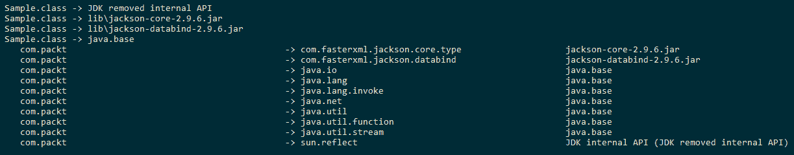

在前面的命令中，我们使用`jdeps`在包级别列出类文件`Sample.class`的依赖项。我们必须为`jdeps`提供搜索所分析代码依赖关系的路径。这可以通过设置`jdeps`命令的`-classpath`、`-cp`或`--class-path`选项来实现。

`-verbose:package`选项列出了包级别的依赖项。

2.  让我们列出类级别的依赖项：

```java
# On Linux      
jdeps -verbose:class -cp classes/:lib/* 
classes/com/packt/Sample.class

# On Windows
jdeps -verbose:class -cp "classes/;lib/*" classes/com/packt/Sample.class 
```

上述命令的输出如下所示：

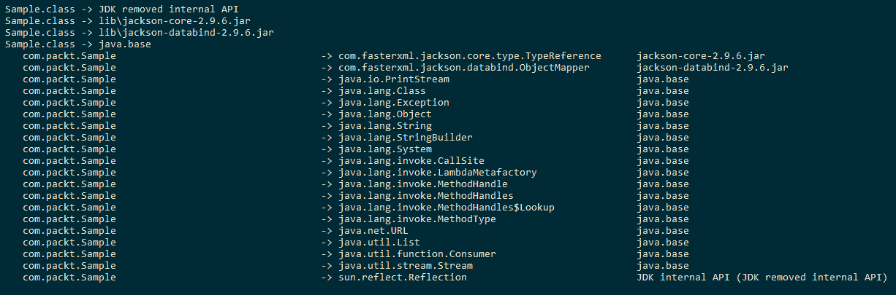

在这种情况下，我们使用`-verbose:class`选项列出类级别的依赖项，这就是为什么您可以看到`com.packt.Sample`类依赖于`com.packt.model.Company`、`java.lang.Exception`、`com.fasterxml.jackson.core.type.TypeReference`等。

3.  让我们来总结一下这些依赖关系：

```java
# On Linux
jdeps -summary -cp classes/:lib/* 
                   classes/com/packt/Sample.class

# On Windows
jdeps -summary -cp "classes/;lib/*" 
                    classes/com/packt/Sample.class 
```

结果如下：

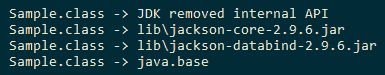

4.  让我们检查一下对 JDK 内部 API 的依赖性：

```java
# On Linux
jdeps -jdkinternals -cp classes/:lib/*
 classes/com/packt/Sample.class

# On Windows
jdeps -jdkinternals -cp "classes/;lib/*"   
                         classes/com/packt/Sample.class 
```

以下是前面命令的输出：

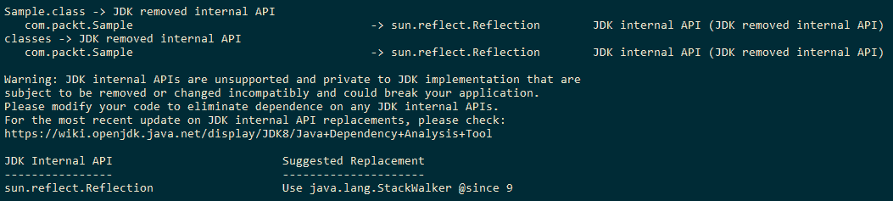

栈遍历 API 是用于遍历调用堆栈的新 API，它是在 Java9 中引入的。这是对`sun.reflect.Reflection.getCallerClass()`方法的替代。我们将在第 11 章、“内存管理和调试”中讨论此 API。

5.  让我们在 JAR 文件`sample.jar`上运行`jdeps`：

```java
# On Linux and Windows
      jdeps -s -cp lib/* sample.jar
```

我们得到的输出如下：

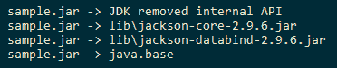

在使用`jdeps`调查`sample.jar`后获得的上述信息非常有用。它清楚地说明了 JAR 文件的依赖关系，并且在我们尝试将此应用程序迁移到模块化应用程序时非常有用。

6.  让我们看看给定包名是否存在任何依赖项：

```java
# On Linux and Windows
      jdeps -p java.util sample.jar
```

结果如下：

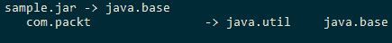

`-p`选项用于查找对给定包名的依赖关系。因此，我们知道我们的代码依赖于`java.util`包。让我们使用另一个包名来尝试此操作：

```java
 jdeps -p java.util.concurrent sample.jar
```

没有输出，这意味着我们的代码不依赖于`java.util.concurrent`包。

7.  我们只希望对代码运行依赖项检查。是的，这是可能的。假设我们运行`jdeps -cp lib/* sample.jar`；您甚至会看到正在分析的库 JAR。我们不想那样，对吧？让我们只包括`com.packt`包的类：

```java
# On Linux 
jdeps -include 'com.packt.*' -cp lib/* sample.jar

# On Windows
jdeps -include "com.packt.*" -cp lib/* sample.jar 
```

结果如下：

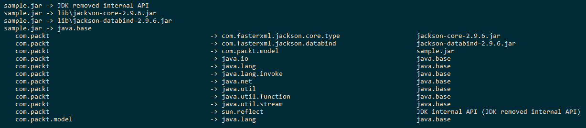

8.  让我们检查一下我们的代码是否依赖于特定的包：

```java
# On Linux
jdeps -p 'com.packt.model' sample.jar

# On Windows
jdeps -p "com.packt.model" sample.jar 
```

结果如下：

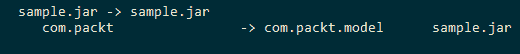

9.  我们可以使用`jdeps`来分析 JDK 模块。我们选择`java.httpclient`模块进行分析：

```java
 jdeps -m java.xml
```

以下是输出：

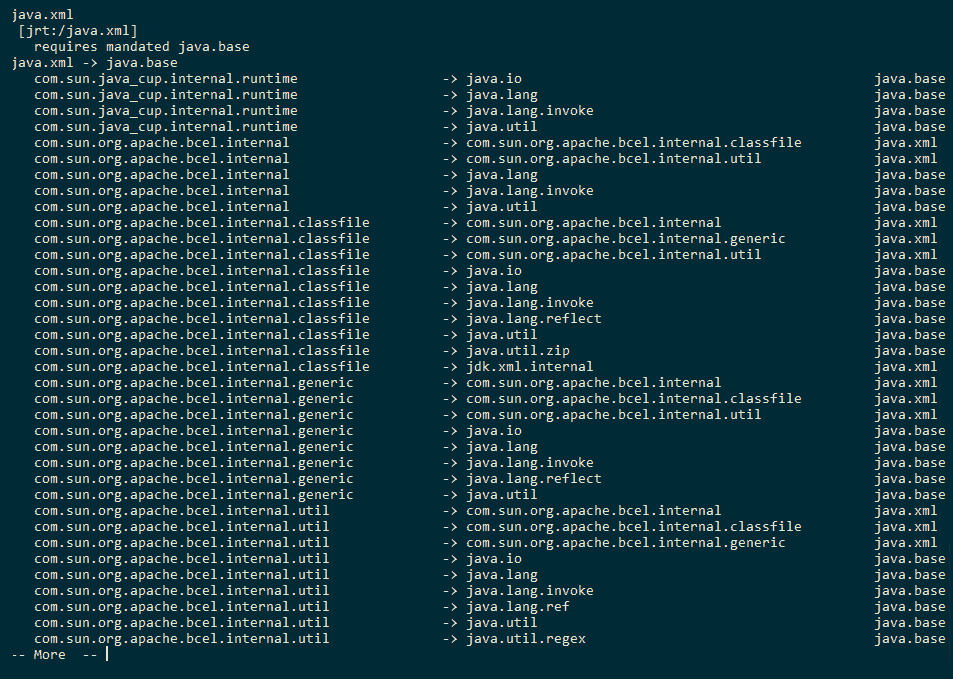

我们还可以通过使用`--require`选项来确定给定模块是否依赖于另一个模块，如下所示：

```java
# On Linux and Windows
      jdeps --require java.logging -m java.sql
```

以下是输出：

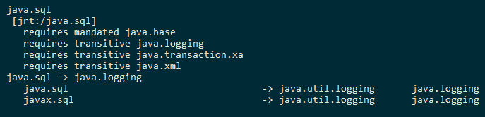

在前面的命令中，我们试图找出`java.sql`模块是否依赖于`java.logging`模块。我们得到的输出是`java.sql`模块和`java.sql`模块中的包的依赖性摘要，它们利用了`java.logging`模块中的代码。

# 它是如何工作的。。。

`jdeps`命令是一个静态类依赖关系分析器，用于分析应用程序及其库的静态依赖关系。默认情况下，`jdeps`命令显示输入文件的包级依赖关系，可以是`.class`文件、目录或 JAR 文件。这是可配置的，可以更改以显示类级依赖关系。有多个选项可用于过滤依赖项和指定要分析的类文件。我们已经看到了`-cp`命令行选项的常规使用。此选项用于提供搜索所分析代码的依赖项的位置。

我们已经分析了类文件、JAR 文件和 JDK 模块，并且还尝试了不同的`jdeps`命令选项。有几个选项，例如`-e`、`-regex`、`--regex`、`-f`、`--filter`和`-include`接受正则表达式（regex）。理解`jdeps`命令的输出非常重要。分析的每个类/JAR 文件都有两部分信息：

1.  分析文件（JAR 或类文件）的依赖项摘要。左边是类或 JAR 文件的名称，右边是依赖实体的名称。依赖实体可以是目录、JAR 文件或 JDK 模块，如下所示：

```java
 Sample.class -> classes
      Sample.class -> lib/jackson-core-2.9.6.jar
      Sample.class -> lib/jackson-databind-2.9.6.jar
      Sample.class -> java.base
      Sample.class -> jdk.unsupported
```

2.  在包或类级别（取决于命令行选项），分析文件内容的更详细的依赖关系信息。这包括三列：第 1 列包含包/类的名称，第 2 列包含依赖包的名称，第 3 列包含找到依赖项的模块/JAR 的名称。示例输出如下所示：

```java
 com.packt  -> com.fasterxml.jackson.core.type  
                    jackson-core-2.9.6.jar
      com.packt  -> com.fasterxml.jackson.databind   
                    jackson-databind-2.9.6.jar
      com.packt  -> com.packt.model  sample.jar
```

# 还有更多。。。

我们已经看到了`jdeps`命令的许多选项。还有一些与筛选依赖项和筛选要分析的类相关的内容。除此之外，还有一些处理模块路径的选项。

以下是可以尝试的选项：

*   `-e`、`-regex`、`--regex`：这些查找与给定模式匹配的依赖项。
*   `-f`、`-filter`：这些排除与给定模式匹配的依赖项。
*   `-filter:none`：不允许通过`filter:package`或`filter:archive`进行过滤。
*   `-filter:package`：这不包括同一包中的依赖项。这是默认选项。例如，如果我们将`-filter:none`添加到`jdeps sample.jar`，它会将包的依赖项打印到自身。
*   `-filter:archive`：这不包括同一存档中的依赖项。
*   `-filter:module`：不包括同一模块中的依赖项。
*   `-P`、`-profile`：用于显示包的配置文件，无论是 compact1、compact2、compact3 还是完整 JRE。
*   `-R`、`-recursive`：递归遍历所有运行时依赖项；它们相当于`-filter:none`选项。

# 创建简单的模块化应用程序

您应该想知道这种模块化是关于什么的，以及如何用 Java 创建模块化应用程序。在本食谱中，我们将通过一个简单的示例，试图消除在 Java 中创建模块化应用程序的困惑。我们的目标是向您展示如何创建模块化应用程序；因此，我们选择了一个简单的例子来关注我们的目标。

我们的示例是一个简单的高级计算器，它检查一个数字是否为素数，计算素数之和，检查一个数字是否为偶数，并计算偶数和奇数之和。

# 准备

我们将把应用程序分为两个模块：

*   `math.util`模块，包含用于执行数学计算的 API
*   `calculator`模块，启动高级计算器

# 怎么做。。。

1.  让我们在`com.packt.math.MathUtil`类中实现 API，从`isPrime(Integer number)`API 开始：

```java
        public static Boolean isPrime(Integer number){
          if ( number == 1 ) { return false; }
          return IntStream.range(2,num).noneMatch(i -> num % i == 0 );
        }
```

2.  实现`sumOfFirstNPrimes(Integer count)`API：

```java
        public static Integer sumOfFirstNPrimes(Integer count){
          return IntStream.iterate(1,i -> i+1)
                          .filter(j -> isPrime(j))
                          .limit(count).sum();
        }
```

3.  让我们编写一个函数来检查数字是否为偶数：

```java
        public static Boolean isEven(Integer number){
          return number % 2 == 0;
        }
```

4.  `isEven`的否定告诉我们这个数字是否是奇数。我们可以使用函数来查找第一个`N`偶数和第一个`N`奇数之和，如下所示：

```java
        public static Integer sumOfFirstNEvens(Integer count){
          return IntStream.iterate(1,i -> i+1)
                          .filter(j -> isEven(j))
                          .limit(count).sum();
        }

        public static Integer sumOfFirstNOdds(Integer count){
          return IntStream.iterate(1,i -> i+1)
                          .filter(j -> !isEven(j))
                          .limit(count).sum();
        }
```

我们可以在前面的 API 中看到，重复了以下操作：

*   从`1`开始的无限数字序列
*   根据某些条件过滤数字
*   将数字流限制为给定的计数
*   求由此得到的数之和

根据我们的观察，我们可以重构前面的 API 并将这些操作提取到一个方法中，如下所示：

```java
Integer computeFirstNSum(Integer count,
                                 IntPredicate filter){
  return IntStream.iterate(1,i -> i+1)
                  .filter(filter)
                  .limit(count).sum();
 }
```

这里，`count`是我们需要求和的数字的极限，`filter`是选择要求和的数字的条件。

让我们根据刚才的重构重写 API：

```java
public static Integer sumOfFirstNPrimes(Integer count){
  return computeFirstNSum(count, (i -> isPrime(i)));
}

public static Integer sumOfFirstNEvens(Integer count){
  return computeFirstNSum(count, (i -> isEven(i)));
}

public static Integer sumOfFirstNOdds(Integer count){
  return computeFirstNSum(count, (i -> !isEven(i)));
}
```

您一定想知道以下几点：

*   `IntStream`类和方法的相关链接
*   `->`在代码库中的使用
*   `IntPredicate`类的使用

如果您确实感到疑惑，那么您不必担心，因为我们将在第 4 章、“开始函数式”和第 5 章、“流和管道中介绍这些内容。

到目前为止，我们已经看到了一些关于数学计算的 API。这些 API 是我们`com.packt.math.MathUtil`类的一部分。此类的完整代码可在本书下载的代码库中的`Chapter03/2_simple-modular-math-util/math.util/com/packt/math`中找到。

让我们将这个小实用程序类作为名为`math.util`的模块的一部分。以下是我们用于创建模块的一些约定：

1.  将所有与模块相关的代码放在名为`math.util`的目录下，并将其视为我们的模块根目录。
2.  在根文件夹中，插入名为`module-info.java`的文件。
3.  将包和代码文件放在根目录下。

`module-info.java`包含什么？以下是：

*   模块的名称
*   它导出的包，即它提供给其他模块使用的包
*   它所依赖的模块
*   它使用的服务
*   它为其提供实现的服务

正如第 1 章、“安装 Java 11”中提到的，JDK 附带了很多模块，即现有的 Java SDK 已经模块化了！其中一个模块是名为`java.base`的模块。所有用户定义的模块都隐式地依赖（或需要）于`java.base`模块（想想每个类都隐式地扩展了`Object`类）。

我们的`math.util`模块不依赖于任何其他模块（当然，除了`java.base`模块）。但是，它使其 API 可用于其他模块（如果不是，则该模块的存在是有问题的）。让我们继续并将此语句转换为代码：

```java
module math.util{
  exports com.packt.math;
}
```

我们正在告诉 Java 编译器和运行时，我们的`math.util`模块正在将`com.packt.math`包中的代码导出到依赖于`math.util`的任何模块。

此模块的代码可在`Chapter03/2_simple-modular-math-util/math.util`中找到。

现在，让我们创建另一个使用`math.util`模块的模块计算器。该模块有一个`Calculator`类，其工作是接受用户选择执行哪个数学运算，然后接受执行该运算所需的输入。用户可以从五种可用的数学运算中进行选择：

*   素数检查
*   偶数校验
*   `N`素数之和
*   `N`个偶数之和
*   `N`赔率之和

让我们在代码中看到这一点：

```java
private static Integer acceptChoice(Scanner reader){
  System.out.println("************Advanced Calculator************");
  System.out.println("1\. Prime Number check");
  System.out.println("2\. Even Number check");
  System.out.println("3\. Sum of N Primes");
  System.out.println("4\. Sum of N Evens");
  System.out.println("5\. Sum of N Odds");
  System.out.println("6\. Exit");
  System.out.println("Enter the number to choose operation");
  return reader.nextInt();
}
```

然后，对于每个选择，我们接受所需的输入并调用相应的`MathUtil`API，如下所示：

```java
switch(choice){
  case 1:
    System.out.println("Enter the number");
    Integer number = reader.nextInt();
    if (MathUtil.isPrime(number)){
      System.out.println("The number " + number +" is prime");
    }else{
      System.out.println("The number " + number +" is not prime");
    }
  break;
  case 2:
    System.out.println("Enter the number");
    Integer number = reader.nextInt();
    if (MathUtil.isEven(number)){
      System.out.println("The number " + number +" is even");
    }
  break;
  case 3:
    System.out.println("How many primes?");
    Integer count = reader.nextInt();
    System.out.println(String.format("Sum of %d primes is %d", 
          count, MathUtil.sumOfFirstNPrimes(count)));
  break;
  case 4:
    System.out.println("How many evens?");
    Integer count = reader.nextInt();
    System.out.println(String.format("Sum of %d evens is %d", 
          count, MathUtil.sumOfFirstNEvens(count)));
  break;
  case 5: 
    System.out.println("How many odds?");
    Integer count = reader.nextInt();
    System.out.println(String.format("Sum of %d odds is %d", 
          count, MathUtil.sumOfFirstNOdds(count)));
  break;
}
```

`Calculator`类的完整代码可在`Chapter03/2_simple-modular-math-util/calculator/com/packt/calculator/Calculator.java`中找到。

让我们为`calculator`模块创建模块定义，就像为`math.util`模块创建模块定义一样：

```java
module calculator{
  requires math.util;
}
```

在前面的模块定义中，我们提到，`calculator`模块通过使用`required`关键字依赖于`math.util`模块。

此模块的代码可在`Chapter03/2_simple-modular-math-util/calculator`中找到。

让我们编译代码：

```java
javac -d mods --module-source-path . $(find . -name "*.java")
```

上述命令必须从`Chapter03/2_simple-modular-math-util`开始执行。

此外，您应该在`mods`目录中有跨模块`math.util`和`calculator`编译的代码。只需一个命令，包括模块之间的依赖关系在内的一切都由编译器处理。我们不需要像`ant`这样的构建工具来管理模块的编译。

`--module-source-path`命令是`javac`的新命令行选项，指定模块源代码的位置。

让我们执行前面的代码：

```java
java --module-path mods -m calculator/com.packt.calculator.Calculator
```

与`--classpath`类似的`--module-path`命令是新的命令行选项`java`，用于指定已编译模块的位置。

运行上述命令后，您将看到计算器正在运行：

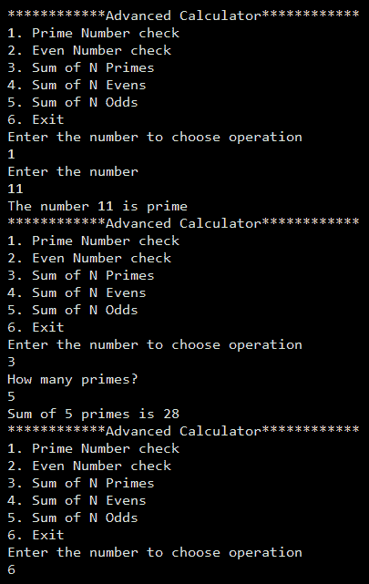

祝贺你！有了它，我们就有了一个简单的模块化应用程序。

我们提供了在 Windows 和 Linux 平台上测试代码的脚本。请在 Windows 上使用`run.bat`，在 Linux 上使用`run.sh`。

# 它是如何工作的。。。

既然您已经看完了这个示例，我们将研究如何对其进行概括，以便在所有模块中应用相同的模式。我们按照特定约定创建模块：

```java
|application_root_directory
|--module1_root
|----module-info.java
|----com
|------packt
|--------sample
|----------MyClass.java
|--module2_root
|----module-info.java
|----com
|------packt
|--------test
|----------MyAnotherClass.java
```

我们将特定于模块的代码放在文件夹中，文件夹根目录下有一个相应的`module-info.java`文件。这样，代码组织得很好。

让我们看看`module-info.java`能包含什么。来自 [Java 语言规范](http://cr.openjdk.java.net/~mr/jigsaw/spec/lang-vm.html)，模块声明的形式如下：

```java
{Annotation} [open] module ModuleName { {ModuleStatement} }
```

下面是解释的语法：

*   `{Annotation}`：这是表格`@Annotation(2)`的任何注释。
*   `open`：该关键字是可选的。开放模块使其所有组件在运行时都可以通过反射进行访问。但是，在编译时和运行时，只有显式导出的组件才可访问。
*   `module`：用于声明模块的关键字。
*   `ModuleName`：这是一个模块的名称，该模块是一个有效的 Java 标识符，标识符名称之间有一个允许的点（`.`），类似于`math.util`。
*   `{ModuleStatement}`：这是模块定义中允许的语句的集合。让我们接下来展开这个。

模块语句的形式如下：

```java
ModuleStatement:
  requires {RequiresModifier} ModuleName ;
  exports PackageName [to ModuleName {, ModuleName}] ;
  opens PackageName [to ModuleName {, ModuleName}] ;
  uses TypeName ;
  provides TypeName with TypeName {, TypeName} ;
```

模块语句在此处解码：

*   `requires`：用于声明对模块的依赖关系。`{RequiresModifier}`可以是**传递的**、**静态的**或两者兼而有之。可传递性意味着依赖于给定模块的任何模块也隐式地依赖于给定模块可传递性所需的模块。静态意味着模块依赖性在编译时是必需的，但在运行时是可选的。一些例子是`requires math.util`、`requires transitive math.util`和`requires static math.util`。
*   `exports`：用于使相关模块可以访问给定的包。或者，我们可以通过指定模块名称（如`exports com.package.math to claculator`来强制包对特定模块的可访问性。
*   `opens`：用于打开特定的包。我们在前面看到，我们可以通过在模块声明中指定`open`关键字来打开模块。但这可能没有那么严格。因此，为了使其更具限制性，我们可以在运行时使用`opens`关键字-`opens com.packt.math`打开一个特定的包进行反射访问。
*   `uses`：用于声明对可通过`java.util.ServiceLoader`访问的服务接口的依赖关系。服务接口可以位于当前模块中，也可以位于当前模块所依赖的任何模块中。
*   `provides`：用于声明一个服务接口，并为其提供至少一个实现。服务接口可以在当前模块或任何其他依赖模块中声明。但是，服务实现必须在同一模块中提供；否则，将发生编译时错误。

我们将在“使用服务在消费者和提供者模块之间创建松散耦合”中更详细地了解`uses`和`provides`条款。

可以使用`--module-source-path`命令行选项一次编译所有模块的模块源代码。这样，所有模块都将被编译并放置在`-d`选项提供的目录下相应的目录中。例如，`javac -d mods --module-source-path . $(find . -name "*.java")`将当前目录中的代码编译成`mods`目录。

运行代码同样简单。我们使用命令行选项`--module-path`指定编译所有模块的路径。然后，我们使用命令行选项`-m`提及模块名以及完全限定的主类名，例如`java --module-path mods -m calculator/com.packt.calculator.Calculator`。

# 另见

第一章“安装以及对 Java 11 的窥探”中的“编译和运行 Java 应用程序配方，

# 创建模块化 JAR

将模块编译到类中是好的，但不适合共享二进制文件和部署。JAR 是更好的共享和部署格式。我们可以将编译后的模块打包成 JAR，顶层包含`module-info.class`的 JAR 称为**模块化 JAR**。在本配方中，我们将了解如何创建模块化 JAR，以及如何执行由多个模块化 JAR 组成的应用程序。

# 准备

我们已经在“创建更简单的模块化应用程序”配方中看到并创建了一个简单的模块化应用程序。为了构建模块化 JAR，我们将使用`Chapter03/3_modular_jar`中提供的示例代码。此示例代码包含两个模块：`math.util`和`calculator`。我们将为这两个模块创建模块化 JAR。

# 怎么做。。。

1.  编译代码并将编译后的类放在一个目录中，比如说，`mods`：

```java
 javac -d mods --module-source-path . $(find . -name *.java)
```

2.  为`math.util`模块构建模块化 JAR：

```java
      jar --create --file=mlib/math.util@1.0.jar --module-version 1.0
      -C mods/math.util .
```

不要忘记前面代码末尾的点（`.`。

3.  为`calculator`模块构建模块化 JAR，指定使 JAR 可执行的主类：

```java
 jar --create --file=mlib/calculator@1.0.jar --module-version 1.0 
      --main-class com.packt.calculator.Calculator -C mods/calculator .
```

前面命令中的关键部分是`--main-class`选项。这使我们能够执行 JAR，而不必在执行期间提供主类信息。

4.  现在，我们在`mlib`目录中有两个 JAR:`math.util@1.0.jar`和`calculator@1.0.jar`。这些 JAR 被称为模块化 JAR。如果要运行该示例，可以使用以下命令：

```java
 java -p mlib -m calculator
```

5.  JAR 命令的一个新命令行选项在 Java9 中引入，称为`-d`或`--describe-module`。这将打印模块化 JAR 包含的模块的相关信息：

```java
jar -d --file=mlib/calculator@1.0.jar
```

`calculator@1.0.jar`的`jar -d`输出如下：

```java
calculator@1.0
  requires mandated java.base
  requires math.util
  conceals com.packt.calculator
  main-class com.packt.calculator.Calculator

jar -d --file=mlib/math.util@1.0.jar
```

`math.util@1.0.jar`的`jar -d`输出如下：

```java
math.util@1.0
  requires mandated java.base
  exports com.packt.math
```

我们提供了以下脚本在 Windows 上试用配方代码：

*   `compile-math.bat`
*   `compile-calculator.bat`
*   `jar-math.bat`
*   `jar-calculator.bat`
*   `run.bat`

我们提供了以下脚本在 Linux 上试用配方代码：

*   `compile.sh`
*   `jar-math.sh`
*   `jar-calculator.sh`
*   `run.sh`

您必须按照列出的顺序运行脚本。

# 在项目前 JigsawJDK 应用程序中使用模块 JAR

如果我们的模块化 JAR 能够与项目前的 JigsawJDK 应用程序一起运行，那将是一件令人惊讶的事情。这样，我们就不用为 JDK 9 之前的应用程序编写另一个版本的 API 了。好消息是，我们可以像使用普通 JAR 一样使用模块化 JAR，也就是说，JAR 的根部没有`module-info.class`。我们将在这个食谱中看到如何做到这一点。

# 准备

对于这个配方，我们需要一个模块化的 JAR 和一个非模块化的应用程序。我们的模块化代码可以在`Chapter03/4_modular_jar_with_pre_java9/math.util`中找到（这与我们在“创建简单模块化应用程序”配方中创建的`math.util`模块相同）。让我们编译此模块化代码，并使用以下命令创建模块化 JAR：

```java
javac -d classes --module-source-path . $(find math.util -name *.java)
mkdir mlib
jar --create --file mlib/math.util.jar -C classes/math.util .
```

我们还提供了一个位于`Chapter03/4_modular_jar_with_pre_java9`的`jar-math.bat`脚本，可用于在 Windows 上创建模块化 JAR。我们有我们的模块化 JAR。让我们使用`jar`命令的`-d`选项进行验证：

```java
jar -d --file mlib/math.util@1.0.jar
math.util@1.0
  requires mandated java.base
  exports com.packt.math
```

# 怎么做。。。

现在，让我们创建一个简单的应用程序，它是非模块化的。我们的应用程序将由一个名为`NonModularCalculator`的类组成，该类在“创建一个简单的模块化应用程序”配方时借用了`Calculator`类的代码。

您可以在`Chapter03/4_modular_jar_with_pre_java9/calculator`目录下的`com.packt.calculator`包中找到`NonModularCalculator`类定义。由于它是非模块化的，所以不需要`module-info.java`文件。此应用程序使用我们的模块化 JAR`math.util.jar`执行一些数学计算。

此时，您应该具备以下条件：

*   一个名为`math.util@1.0.jar`的模块化 JAR
*   由`NonModularCalculator`包组成的非模块化应用程序

现在，我们需要编译我们的`NonModularCalculator`类：

```java
javac -d classes/ --source-path calculator $(find calculator -name *.java)
```

在运行上一个命令后，您将看到一个错误列表，表明`com.packt.math`包不存在，无法找到`MathUtil`符号，等等。你猜对了；我们没有为编译器提供模块化 JAR 的位置。让我们使用`--class-path`选项添加模块化`jar`位置：

```java
javac --class-path mlib/* -d classes/ --source-path calculator $(find calculator -name *.java)
```

现在，我们已经成功编译了依赖于模块化 JAR 的非模块化代码。让我们运行编译后的代码：

```java
java -cp classes:mlib/* com.packt.calculator.NonModularCalculator
```

祝贺你！您已经成功地将模块化 JAR 用于非模块化应用程序。太棒了，对吧？

我们在`Chapter03/4_modular_jar_with_pre_java9`提供了以下脚本，在 Windows 平台上运行代码：

*   `compile-calculator.bat`
*   `run.bat`

# 自底向上迁移

现在 Java9 已经面世，期待已久的模块化特性现在可以被开发人员采用。在某个时刻，您将参与到将应用程序迁移到 Java9 的过程中，并因此尝试对其进行模块化。如此巨大的变化，涉及到第三方库和重新思考代码结构，将需要适当的规划和实施。Java 团队提出了两种迁移方法：

*   自底向上迁移
*   自上而下迁移

在学习自底向上迁移之前，了解未命名模块和自动模块是什么很重要。假设您正在访问在任何模块中都不可用的类型；在这种情况下，模块系统将在类路径上搜索该类型，如果找到，该类型将成为未命名模块的一部分。这类似于我们编写的不属于任何包的类，但 Java 将它们添加到未命名包中，以简化新类的创建。

因此，一个未命名的模块是一个不带名称的全部捕获模块，它包含所有这些类型，这些类型不属于任何模块，但在类路径中可以找到。未命名模块可以访问所有命名模块（用户定义模块）和内置模块（Java 平台模块）的所有导出类型。另一方面，命名模块（用户定义模块）将无法访问未命名模块中的类型。换句话说，命名模块不能声明对未命名模块的依赖关系。如果您想声明一个依赖项，您将如何做？未命名的模块没有名称！

使用未命名模块的概念，您可以原样使用 Java 8 应用程序并在 Java 9 上运行它（除了任何不推荐使用的内部 API，这些 API 可能不适用于 Java 9 中的用户代码）。

如果您尝试了“使用 JDEP 在 Java 应用程序中查找依赖项的方法”配方，您可能已经看到了这一点，在 Java 应用程序*配方中，我们有一个非模块化的应用程序，并且能够在 Java 9 上运行它。然而，在 Java9 上按原样运行会破坏引入模块化系统的目的。

如果在命名模块和未命名模块中都定义了包，则命名模块中的包将优先于未命名模块中的包。这有助于防止来自命名模块和未命名模块的包冲突。

自动模块是由 JVM 自动创建的模块。当我们在模块路径（而不是类路径）中引入打包在 JAR 中的类时，就会创建这些模块。此模块的名称将从 JAR 的名称派生而来，没有`.jar`扩展名，因此与未命名的模块不同。或者，可以通过在 JAR 清单文件中提供针对`Automatic-Module-Name`的模块名称来提供这些自动模块的名称。这些自动模块导出其中存在的所有包，并且还依赖于所有自动和命名（user/JDK）模块。

基于此说明，模块可分为以下几类：

*   **未命名模块**：类路径上可用、模块路径上不可用的代码放在未命名模块中。
*   **命名模块**：所有与之关联的模块都可以是自定义模块和 JDK 模块。
*   **自动模块**：JVM 根据模块路径中的 JAR 文件隐式创建的所有模块。
*   **隐式模块**：隐式创建的模块。它们与自动模块相同。
*   **显式模块**：用户或 JDK 显式创建的所有模块。

但是，未命名模块和自动模块是开始迁移的良好第一步。那么，让我们开始吧！

# 准备

我们需要一个最终将模块化的非模块化应用程序。我们已经创建了一个简单的应用程序，其源代码位于`Chapter03/6_bottom_up_migration_before`。此简单应用程序包含三个部分：

*   一个包含我们最喜欢的数学 API 的数学实用程序库：素数检查器、偶数检查器、素数之和、偶数之和和以及赔率之和。此代码可在`Chapter03/6_bottom_up_migration_before/math_util`上找到。
*   包含用于计算单利和复利的 API 的银行实用程序库。此代码可在`Chapter03/6_bottom_up_migration_before/banking_util`上找到。
*   我们的计算器应用程序帮助我们进行数学和银行计算。为了使这更有趣，我们将以 JSON 输出结果，为此，我们将使用 Jackson JSON API。此代码可在`Chapter03/6_bottom_up_migration_before/calculator`上找到。

在您复制或下载代码之后，我们将编译并构建相应的 JAR。因此，请使用以下命令编译和构建 JAR：

```java
#Compiling math util

javac -d math_util/out/classes/ -sourcepath math_util/src $(find math_util/src -name *.java)
jar --create --file=math_util/out/math.util.jar 
-C math_util/out/classes/ .

#Compiling banking util

javac -d banking_util/out/classes/ -sourcepath banking_util/src $(find banking_util/src -name *.java)
jar --create --file=banking_util/out/banking.util.jar 
-C banking_util/out/classes/ .

#Compiling calculator

javac -cp calculator/lib/*:math_util/out/math.util.jar:banking_util/out/banking.util.jar -d calculator/out/classes/ -sourcepath calculator/src $(find calculator/src -name *.java)
```

让我们也为此创建一个 JAR（我们将使用 JAR 构建依赖关系图，但不用于运行应用程序）：

```java
jar --create --file=calculator/out/calculator.jar -C calculator/out/classes/ .
```

请注意，我们的 Jackson JAR 位于`calculator/lib`中，因此您无需担心下载它们。让我们使用以下命令运行计算器：

```java
java -cp calculator/out/classes:calculator/lib/*:math_util/out/math.util.jar:banking_util/out/banking.util.jar com.packt.calculator.Calculator
```

您将看到一个菜单，要求选择操作，然后您可以玩不同的操作。现在，让我们模块化这个应用程序！

我们已经为包提供了`package-*.bat`和`run.bat`，并在 Windows 上运行应用程序。您可以对包使用`package-*.sh`和`run.sh`并在 Linux 上运行应用程序。

# 怎么做。。。

模块化应用程序的第一步是理解其依赖关系图。让我们为应用程序创建一个依赖关系图。为此，我们使用了`jdeps`工具。如果您想知道`jdeps`工具是什么，请立即停止并阅读“使用 JDEP 查找 Java 应用程序的依赖项”配方。好的，让我们运行`jdeps`工具：

```java
jdeps -summary -R -cp calculator/lib/*:math_util/out/*:banking_util/out/* calculator/out/calculator.jar
```

我们要求`jdeps`对`calculator.jar`的依赖项进行总结，然后对`calculator.jar`的每个依赖项递归进行总结。我们得到的结果如下：

```java
banking.util.jar -> java.base
calculator.jar -> banking_util/out/banking.util.jar
calculator.jar -> calculator/lib/jackson-databind-2.8.4.jar
calculator.jar -> java.base
calculator.jar -> math_util/out/math.util.jar
jackson-annotations-2.8.4.jar -> java.base
jackson-core-2.8.4.jar -> java.base
jackson-databind-2.8.4.jar -> calculator/lib/jackson-annotations-2.8.4.jar
jackson-databind-2.8.4.jar -> calculator/lib/jackson-core-2.8.4.jar
jackson-databind-2.8.4.jar -> java.base
jackson-databind-2.8.4.jar -> java.logging
jackson-databind-2.8.4.jar -> java.sql
jackson-databind-2.8.4.jar -> java.xml
math.util.jar -> java.base
```

前面的输出很难理解，可以用图表表示，如下所示：

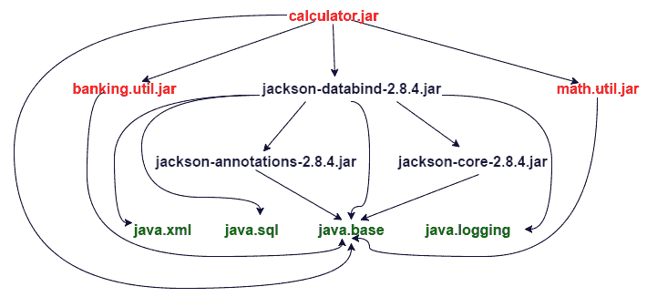

在自底向上迁移中，我们首先将叶节点模块化。在我们的图中，`java.xml`、`java.sql`、`java.base`和`java.logging`叶节点已经模块化。让我们将`banking.util.jar`模块化。

此配方的所有代码可在`Chapter03/6_bottom_up_migration_after`上找到。

# 模块化`banking.util.jar`

1.  将`BankUtil.java`从`Chapter03/6_bottom_up_migration_before/banking_util/src/com/packt/banking`复制到`Chapter03/6_bottom_up_migration_after/src/banking.util/com/packt/banking`。有两件事需要注意：
    *   我们已将文件夹从`banking_util`重命名为`banking.util`。这是为了遵循将模块相关代码放置在带有模块名称的文件夹下的惯例。
    *   我们已将包裹直接放在`banking.util`文件夹下，而不是`src`文件夹下。同样，这是为了遵循惯例。我们将把所有模块放在`src`文件夹下。
2.  在`Chapter03/6_bottom_up_migration_after/src/banking.util`下创建模块定义文件`module-info.java`，定义如下：

```java
        module banking.util{   
          exports com.packt.banking;
        }
```

3.  在`6_bottom_up_migration_after`文件夹中，通过运行以下命令编译模块的 Java 代码：

```java
 javac -d mods --module-source-path src 
      $(find src -name *.java)
```

4.  您将看到模块`banking.util`中的 Java 代码被编译到 mods 目录中。
5.  让我们为这个模块创建一个模块化 JAR：

```java
 jar --create --file=mlib/banking.util.jar -C mods/banking.util .
```

如果您想知道什么是模块化 JAR，请随意阅读本章中的“创建模块化 JAR”配方。

现在我们已经模块化了`banking.util.jar`，让我们使用这个模块化的`jar`来代替前面“准备”部分中使用的非模块化 JAR。您应该从`6_bottom_up_migration_before`文件夹执行以下操作，因为我们尚未完全模块化应用程序：

```java
java --add-modules ALL-MODULE-PATH --module-path ../6_bottom_up_migration_after/mods/banking.util -cp calculator/out/classes:calculator/lib/*:math_util/out/math.util.jar com.packt.calculator.Calculator
```

`--add-modules`选项告诉 Java 运行时按照模块名称或预定义的常量包括模块，即`ALL-MODULE-PATH`、`ALL-DEFAULT`和`ALL-SYSTEM`。我们使用`ALL-MODULE-PATH`添加模块路径上可用的模块。

`--module-path`选项告诉 Java 运行时模块的位置。

你会看到我们的计算器像往常一样运行。尝试一个简单的利息计算，一个复利计算，以检查是否找到了`BankUtil`类。因此，我们的依赖关系图如下所示：

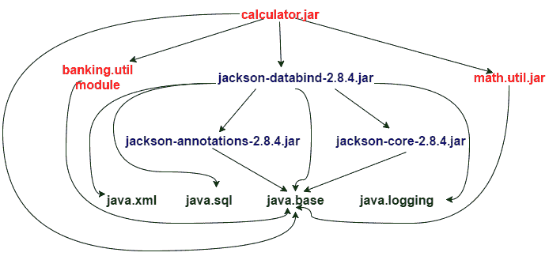

# 模块化`math.util.jar`

1.  将`MathUtil.java`从`Chapter03/6_bottom_up_migration_before/math_util/src/com/packt/math`复制到`Chapter03/6_bottom_up_migration_after/src/math.util/com/packt/math`。
2.  使用以下定义在`Chapter03/6_bottom_up_migration_after/src/math.util`下创建模块定义文件`module-info.java`：

```java
        module math.util{
          exports com.packt.math;
        }
```

3.  在`6_bottom_up_migration_after`文件夹中，通过运行以下命令编译模块的 Java 代码：

```java
 javac -d mods --module-source-path src $(find src -name *.java)
```

4.  您将看到，`math.util`和`banking.util`模块中的 Java 代码被编译到`mods`目录中。
5.  让我们为这个模块创建一个模块化 JAR：

```java
 jar --create --file=mlib/math.util.jar -C mods/math.util .
```

如果您想知道什么是模块化`jar`，请阅读本章中的“创建模块化 JAR”配方。

6.  现在我们已经模块化了`math.util.jar`，让我们使用这个模块化的`jar`来代替前面在“准备”部分中使用的非模块化的`jar`。您应该从`6_bottom_up_migration_before`文件夹执行以下操作，因为我们尚未完全模块化应用程序：

```java
 java --add-modules ALL-MODULE-PATH --module-path
      ../6_bottom_up_migration_after/mods/banking.util:
      ../6_bottom_up_migration_after/mods/math.util 
      -cp calculator/out/classes:calculator/lib/*
      com.packt.calculator.Calculator
```

我们的应用程序运行良好，依赖关系图如下所示：

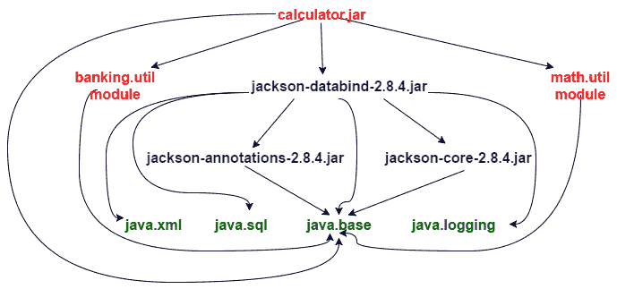

我们无法对`calculator.jar`进行模块化，因为它依赖于另一个非模块化代码`jackson-databind`，我们无法对`jackson-databind`进行模块化，因为它不是由我们维护的。这意味着我们无法实现应用程序的 100% 模块化。在本配方的开头，我们向您介绍了未命名的模块。我们在类路径中的所有非模块代码都分组在未命名的模块中，这意味着所有与 Jackson 相关的代码仍然可以保留在未命名的模块中，我们可以尝试模块化`calculator.jar`。但是我们不能这样做，因为`calculator.jar`不能声明对`jackson-databind-2.8.4.jar`的依赖关系（因为它是一个未命名的模块，命名的模块不能声明对未命名模块的依赖关系）。

解决这个问题的一种方法是将与 Jackson 相关的代码作为自动模块。我们可以通过移动与 Jackson 相关的 JAR 来实现这一点：

*   `jackson-databind-2.8.4.jar`
*   `jackson-annotations-2.8.4.jar`
*   `jackson-core-2.8.4.jar`

我们将使用以下命令将它们移动到`6_bottom_up_migration_after`文件夹下：

```java
$ pwd 
/root/java9-samples/Chapter03/6_bottom_up_migration_after
$ cp ../6_bottom_up_migration_before/calculator/lib/*.jar mlib/
$ mv mlib/jackson-annotations-2.8.4.jar mods/jackson.annotations.jar
$ mv mlib/jackson-core-2.8.4.jar mods/jackson.core.jar
$ mv mlib/jackson-databind-2.8.4.jar mods/jackson.databind.jar
```

重命名 JAR 的原因是模块名称必须是一个有效标识符（不应仅为数字，不应包含`-`和其他规则），并用`.`分隔。由于名称是从 JAR 文件的名称派生的，因此我们必须重命名 JAR 文件以符合 Java 标识符规则。

在`6_bottom_up_migration_after`下创建一个新的`mlib`目录，如果它不存在。

现在，让我们使用以下命令再次运行计算器程序：

```java
java --add-modules ALL-MODULE-PATH --module-path ../6_bottom_up_migration_after/mods:../6_bottom_up_migration_after/mlib -cp calculator/out/classes com.packt.calculator.Calculator
```

应用程序将照常运行。您会注意到，我们的`-cp`选项值越来越小，因为所有依赖库都已作为模块路径中的模块移动。依赖关系图现在如下所示：

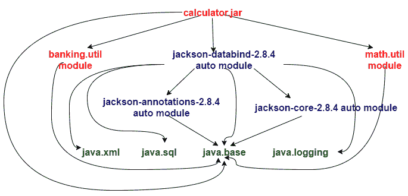

# 模块化计算器.jar

迁移的最后一步是模块化`calculator.jar`。按照以下步骤将其模块化：

1.  将`com`文件夹从`Chapter03/6_bottom_up_migration_before/calculator/src`复制到`Chapter03/6_bottom_up_migration_after/src/calculator`。
2.  在`Chapter03/6_bottom_up_migration_after/src/calculator`下创建模块定义文件`module-info.java`，定义如下：

```java
        module calculator{ 
          requires math.util; 
          requires banking.util; 
          requires jackson.databind; 
          requires jackson.core; 
          requires jackson.annotations; 
        }
```

3.  在`6_bottom_up_migration_after`文件夹中，通过运行以下命令编译模块的 Java 代码：

```java
 javac -d mods --module-path mlib:mods --module-source-path src $(find src -name *.java)
```

4.  您将看到，我们所有模块中的 Java 代码都被编译到 mods 目录中。请注意，您应该已经将自动模块（即与 Jackson 相关的 JAR）放置在`mlib`目录中。
5.  让我们为这个模块创建一个模块化 JAR，并提到哪个是`main`类：

```java
 jar --create --file=mlib/calculator.jar --main-
      class=com.packt.calculator.Calculator -C mods/calculator .
```

6.  现在，我们有一个用于计算器模块的模块化 JAR，它是我们的主模块，因为它包含`main`类。通过这一点，我们还将整个应用程序模块化。让我们从文件夹中运行以下命令：`6_bottom_up_migration_after`：

```java
 java -p mlib:mods -m calculator
```

因此，我们已经了解了如何使用自底向上的迁移方法对非模块化应用程序进行模块化。最终的依赖关系图如下所示：

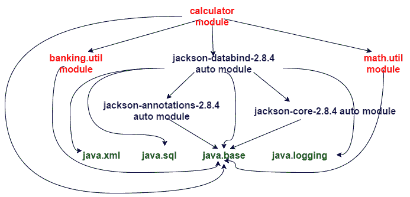

此模块化应用程序的最终代码可在`Chapter03/6_bottom_up_migration_after`中找到。

我们可以按行进行修改，即模块化同一目录`6_bottom_up_migration_before`中的代码。但是我们更喜欢在不同的目录`6_bottom_up_migration_after`中单独执行，这样可以保持它的整洁，并且不会干扰现有的代码库。

# 它是如何工作的。。。

未命名模块的概念帮助我们在 Java9 上运行非模块化应用程序。模块路径和类路径的使用帮助我们在迁移过程中运行部分模块化的应用程序。我们开始模块化那些不依赖于任何非模块化代码的代码库，以及任何我们无法模块化的代码库，我们将其转换为自动模块，从而使我们能够模块化依赖于此类代码库的代码。最终，我们得到了一个完全模块化的应用程序。

# 自上而下迁移

另一种迁移技术是自顶向下迁移。在这种方法中，我们从 JAR 依赖关系图中的根 JAR 开始。

JAR 表示一个代码基。我们假设代码库是以 JAR 的形式提供的，因此我们得到的依赖关系图具有节点，即 JAR。

模块化依赖关系图的根意味着这个根所依赖的所有其他 JAR 都必须是模块化的。否则，此模块根不能声明对未命名模块的依赖关系。让我们考虑一下我们在自底向上迁移方法中引入的示例非模块化应用程序。依赖关系图如下所示：

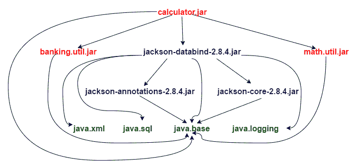

我们在自顶向下的迁移中广泛使用自动模块。自动模块是由 JVM 隐式创建的模块。这些是基于模块路径中可用的非模块化 JAR 创建的。

# 准备

我们将使用前面“自底向上迁移”配方中介绍的计算器示例。继续从`Chapter03/7_top_down_migration_before`复制非模块化代码。如果要运行它并查看它是否工作，请使用以下命令：

```java
$ javac -d math_util/out/classes/ -sourcepath math_util/src $(find math_util/src -name *.java)

$ jar --create --file=math_util/out/math.util.jar 
-C math_util/out/classes/ .

$ javac -d banking_util/out/classes/ -sourcepath banking_util/src $(find banking_util/src -name *.java)

$ jar --create --file=banking_util/out/banking.util.jar 
-C banking_util/out/classes/ .

$ javac -cp calculator/lib/*:math_util/out/math.util.jar:banking_util/out/banking.util.jar -d calculator/out/classes/ -sourcepath calculator/src $(find calculator/src -name *.java)

$ java -cp calculator/out/classes:calculator/lib/*:math_util/out/math.util.jar:banking_util/out/banking.util.jar com.packt.calculator.Calculator
```

我们已经为包提供了`package-*.bat`和`run.bat`并在 Windows 上运行代码，在包上使用了`package-*.sh`和`run.sh`并在 Linux 上运行代码。

# 怎么做。。。

我们将在`Chapter03/7_top_down_migration_after`目录下对应用程序进行模块化。在`Chapter03/7_top_down_migration_after`下创建两个目录`src`和`mlib`。

 **# 模块化计算器

1.  在将计算器的所有依赖项模块化之前，我们无法将其模块化。但是模块化其依赖性有时可能更容易，而在其他时候则不然，特别是在依赖性来自第三方的情况下。在这种情况下，我们使用自动模块。我们复制文件夹`mlib`下的非模块化 JAR，并确保 JAR 的名称为`<identifier>(.<identifier>)*`格式，其中`<identifier>`是有效的 Java 标识符：

```java
 $ cp ../7_top_down_migration_before/calculator/lib/jackson-
      annotations-
 2.8.4.jar mlib/jackson.annotations.jar 

 $ cp ../7_top_down_migration_before/calculator/lib/jackson-core-
      2.8.4.jar
 mlib/jackson.core.jar 

 $ cp ../7_top_down_migration_before/calculator/lib/jackson-
      databind-
 2.8.4.jar mlib/jackson.databind.jar 

 $ cp 
      ../7_top_down_migration_before/banking_util/out/banking.util.jar 
      mlib/ 

 $ cp ../7_top_down_migration_before/math_util/out/math.util.jar 
      mlib/
```

我们提供了`copy-non-mod-jar.bat`和`copy-non-mod-jar.sh`脚本，以便轻松复制 JAR。

让我们看看我们复制到`mlib`中的内容：

```java
     $ ls mlib
      banking.util.jar  jackson.annotations.jar  jackson.core.jar 
 jackson.databind.jar  math.util.jar
```

`banking.util.jar` and `math.util.jar` will exist only if you have compiled and JAR-ed the code in the `Chapter03/7_top_down_migration_before/banking_util` and `Chapter03/7_top_down_migration_before/math_util` directories. We did this in the *Getting ready*section earlier.

2.  在`src`下新建一个`calculator`文件夹。这将包含`calculator`模块的代码。
3.  在`Chapter03/7_top_down_migration_after/src/calculator`目录下创建`module-info.java`，包含以下内容：

```java
        module calculator{ 
          requires math.util; 
          requires banking.util; 
          requires jackson.databind; 
          requires jackson.core; 
          requires jackson.annotations; 
        }
```

4.  将`Chapter03/7_top_down_migration_before/calculator/src/com`目录及其下的所有代码复制到`Chapter03/7_top_down_migration_after/src/calculator`。

5.  编译计算器模块：

```java
 #On Linux
 javac -d mods --module-path mlib --module-source-path src $(find
      src -name *.java)

 #On Windows
 javac -d mods --module-path mlib --module-source-path src 
      srccalculatormodule-info.java 
      srccalculatorcompacktcalculatorCalculator.java 
      srccalculatorcompacktcalculatorcommands*.java
```

6.  为`calculator`模块创建模块化 JAR：

```java
 jar --create --file=mlib/calculator.jar --main-
      class=com.packt.calculator.Calculator -C mods/calculator/ .
```

7.  运行`calculator`模块：

```java
 java --module-path mlib -m calculator
```

我们将看到我们的计算器正在正确执行。您可以尝试不同的操作，以验证它们是否都正确执行。

# 模块化`banking.util`

由于这不依赖于其他非模块代码，我们可以通过以下步骤直接将其转换为模块：

1.  在`src`下新建一个`banking.util`文件夹。这将包含`banking.util`模块的代码。
2.  在`Chapter03/7_top_down_migration_after/src/banking.util`目录下创建`module-info.java`，其中包含以下：

 ****```java
        module banking.util{
          exports com.packt.banking; 
        }
```

3.  将`Chapter03/7_top_down_migration_before/banking_util/src/com`目录及其下的所有代码复制到`Chapter03/7_top_down_migration_after/src/banking.util`。
4.  编译模块：

```java
 #On Linux
 javac -d mods --module-path mlib --module-source-path src $(find 
      src -name *.java)

 #On Windows
 javac -d mods --module-path mlib --module-source-path src 
      srcbanking.utilmodule-info.java 
      srcbanking.utilcompacktbankingBankUtil.java
```

5.  为`banking.util`模块创建一个模块化 JAR。这将取代`mlib`中已经存在的非模块化`banking.util.jar`：

```java
 jar --create --file=mlib/banking.util.jar -C mods/banking.util/ .
```

6.  运行`calculator`模块测试`banking.util`模块化 JAR 是否创建成功：

```java
 java --module-path mlib -m calculator
```

7.  您应该看到计算器正在执行。使用不同的操作来确保没有“未找到类”问题。

# 模块化`math.util`

1.  在`src`下新建一个`math.util`文件夹。这将包含`math.util`模块的代码。
2.  在`Chapter03/7_top_down_migration_after/src/math.util`目录下创建`module-info.java`，其中包含以下：

 **```java
        module math.util{ 
          exports com.packt.math; 
        }
```

3.  将`Chapter03/7_top_down_migration_before/math_util/src/com`目录及其下的所有代码复制到`Chapter03/7_top_down_migration_after/src/math.util`。
4.  编译模块：

```java
 #On Linux
 javac -d mods --module-path mlib --module-source-path src $(find 
      src -name *.java)

 #On Windows
 javac -d mods --module-path mlib --module-source-path src 
      srcmath.utilmodule-info.java 
      srcmath.utilcompacktmathMathUtil.java
```

5.  为`banking.util`模块创建一个模块化 JAR。这将取代`mlib`中已经存在的非模块化`banking.util.jar`：

```java
 jar --create --file=mlib/math.util.jar -C mods/math.util/ .
```

6.  运行`calculator`模块测试`math.util`模块化 JAR 是否创建成功。

```java
 java --module-path mlib -m calculator
```

7.  您应该看到计算器正在执行。使用不同的操作来确保没有*类未找到*问题。

有了这个，我们已经完全模块化了应用程序，展示了我们已经转换为自动模块的 Jackson 库。

我们更喜欢自上而下的迁移方法。这是因为我们不必同时处理类路径和模块路径。我们可以将所有内容都制作成自动模块，然后在将非模块化 JAR 迁移到模块化 JAR 时使用模块路径。

# 使用服务在使用者和提供者模块之间创建松散耦合

通常，在我们的应用程序中，我们有一些接口和这些接口的多个实现。然后，在运行时，根据特定的条件，我们使用特定的实现。这个原理被称为**依赖倒置**。依赖注入框架（如 Spring）使用此原则创建具体实现的对象，并将其分配（或注入）到抽象接口类型的引用中。

很长一段时间以来，Java（自 Java6 以来）通过`java.util.ServiceLoader`类支持服务提供者加载功能。使用服务加载器，您可以拥有一个**服务提供者接口**（**SPI**）和多个简单称为服务提供者的 SPI 实现。这些服务提供程序位于类路径中，并在运行时加载。当这些服务提供程序位于模块中时，由于我们不再依赖类路径扫描来加载服务提供程序，我们需要一种机制来告诉我们的模块有关服务提供程序及其提供实现的服务提供程序接口。在这个配方中，我们将通过一个简单的例子来研究这个机制。

# 准备

我们不需要为这个食谱设置任何特定的设置。在这个食谱中，我们将举一个简单的例子。我们有一个`BookService`抽象类，它支持 CRUD 操作。现在，这些 CRUD 操作可以在 SQL DB、MongoDB、文件系统等上运行。通过使用服务提供者接口和`ServiceLoader`类加载所需的服务提供者实现，可以提供这种灵活性。

# 怎么做。。。

本配方中有四个模块：

*   `book.service`：这是包含我们的服务提供商接口的模块，即服务
*   `mongodb.book.service`：这是服务提供商模块之一
*   `sqldb.book.service`：这是另一个服务商模块
*   `book.manage`：这是服务消费者模块

以下步骤演示如何利用`ServiceLoader`实现松耦合：

1.  在`Chapter03/8_services/src`目录下创建一个`book.service`文件夹。`book.service`模块的所有代码都将在此文件夹下。
2.  在新包下创建一个新包`com.packt.model`和一个新类`Book`。这是我们的模型类，它包含以下属性：

```java
        public String id; 
        public String title; 
        public String author;
```

3.  在新包下创建一个新包`com.packt.service`和一个新类`BookService`。这是我们的主要服务接口，服务提供商将为此服务提供一个实现。除了 CRUD 操作的抽象方法外，值得一提的方法是`getInstance()`。此方法使用`ServiceLoader`类加载任何一个服务提供商（具体来说是最后一个），然后使用该服务提供商获得`BookService`的实现。让我们看看下面的代码：

```java
        public static BookService getInstance(){ 
          ServiceLoader<BookServiceProvider> sl = 
                 ServiceLoader.load(BookServiceProvider.class);
          Iterator<BookServiceProvider> iter = sl.iterator(); 
          if (!iter.hasNext()) 
            throw new RuntimeException("No service providers found!");

          BookServiceProvider provider = null; 
          while(iter.hasNext()){ 
            provider = iter.next(); 
            System.out.println(provider.getClass()); 
          } 
          return provider.getBookService(); 
        }
```

第一个`while`循环只是为了演示`ServiceLoader`加载了所有的服务提供者，我们选择其中一个服务提供者。您也可以有条件地返回服务提供商，但这取决于需求。

4.  另一个重要部分是实际的服务提供者接口。其职责是返回服务实现的适当实例。在我们的配方中，`com.packt.spi`包中的`BookServiceProvider`是一个服务提供商接口：

```java
        public interface BookServiceProvider{ 
          public BookService getBookService(); 
        }
```

5.  我们在`Chapter03/8_services/src/book.service`目录下创建`module-info.java`，包含以下内容：

```java
        module book.service{ 
          exports com.packt.model; 
          exports com.packt.service; 
          exports com.packt.spi; 
          uses com.packt.spi.BookServiceProvider; 
        }
```

前面模块定义中的`uses`语句指定了模块使用`ServiceLoader`发现的服务接口。

6.  现在，让我们创建一个名为`mongodb.book.service`的服务提供商模块。这将为我们在`book.service`模块中的`BookService`和`BookServiceProvider`接口提供一个实现。我们的想法是，该服务提供商将使用 MongoDB 数据存储实现 CRUD 操作。
7.  在`Chapter03/8_services/src`目录下创建一个`mongodb.book.service`文件夹。
8.  在`com.packt.mongodb.service`包中创建`MongoDbBookService`类，扩展`BookService`抽象类，提供我们抽象 CRUD 操作方法的实现：

```java
        public void create(Book book){ 
          System.out.println("Mongodb Create book ... " + book.title); 
        } 

        public Book read(String id){ 
          System.out.println("Mongodb Reading book ... " + id); 
          return new Book(id, "Title", "Author"); 
        } 

        public void update(Book book){ 
          System.out.println("Mongodb Updating book ... " + 
              book.title); 
        }

        public void delete(String id){ 
          System.out.println("Mongodb Deleting ... " + id); 
        }
```

9.  在`com.packt.mongodb`包中创建`MongoDbBookServiceProvider`类，实现`BookServiceProvider`接口。这是我们的服务发现类。基本上，它返回`BookService`实现的相关实例。它覆盖`BookServiceProvider`界面中的方法，如下所示：

```java
        @Override 
        public BookService getBookService(){ 
          return new MongoDbBookService(); 
        }
```

10.  模块定义非常有趣。我们必须在模块定义中声明，该模块是`BookServiceProvider`接口的服务提供者，可以按如下方式完成：

```java
        module mongodb.book.service{ 
          requires book.service; 
          provides com.packt.spi.BookServiceProvider 
                   with com.packt.mongodb.MongoDbBookServiceProvider; 
        }
```

`provides .. with ..`语句用于指定服务接口和其中一个服务提供者。

11.  现在，让我们创建一个名为`book.manage`的服务消费者模块。
12.  在`Chapter03/8_services/src`下创建一个新的`book.manage`文件夹，其中将包含模块的代码。
13.  在`com.packt.manage`包中创建一个名为`BookManager`的新类。此类的主要目的是获取`BookService`的实例，然后执行其 CRUD 操作。返回的实例由`ServiceLoader`加载的服务提供商决定。`BookManager`类看起来像这样：

```java
        public class BookManager{ 
          public static void main(String[] args){ 
            BookService service = BookService.getInstance();
            System.out.println(service.getClass()); 
            Book book = new Book("1", "Title", "Author"); 
            service.create(book); 
            service.read("1"); 
            service.update(book); 
            service.delete("1"); 
          }
        }
```

14.  让我们使用以下命令编译并运行主模块：

```java
 $ javac -d mods --module-source-path src 
      $(find src -name *.java) 
 $ java --module-path mods -m 
      book.manage/com.packt.manage.BookManager 
 class com.packt.mongodb.MongoDbBookServiceProvider
 class com.packt.mongodb.service.MongoDbBookService
 Mongodb Create book ... Title
 Mongodb Reading book ... 1
 Mongodb Updating book ... Title
 Mongodb Deleting ... 1
```

在前面的输出中，第一行表示可用的服务提供者，第二行表示我们正在使用的`BookService`实现。

15.  有了一个服务提供商，它看起来很简单。让我们继续添加另一个模块`sqldb.book.service`，其模块定义如下：

```java
        module sqldb.book.service{ 
          requires book.service; 
          provides com.packt.spi.BookServiceProvider 
                   with com.packt.sqldb.SqlDbBookServiceProvider; 
        }
```

16.  `com.packt.sqldb`包中的`SqlDbBookServiceProvider`类是`BookServiceProvider`接口的实现，如下所示：

```java
        @Override 
        public BookService getBookService(){     
          return new SqlDbBookService(); 
        }
```

17.  CRUD 操作的实现由`com.packt.sqldb.service`包中的`SqlDbBookService`类完成。
18.  让我们编译并运行主模块，这次使用两个服务提供商：

```java
 $ javac -d mods --module-source-path src 
      $(find src -name *.java) 
 $ java --module-path mods -m  
      book.manage/com.packt.manage.BookManager 
 class com.packt.sqldb.SqlDbBookServiceProvider
 class com.packt.mongodb.MongoDbBookServiceProvider
 class com.packt.mongodb.service.MongoDbBookService
 Mongodb Create book ... Title
 Mongodb Reading book ... 1
 Mongodb Updating book ... Title
 Mongodb Deleting ... 1
```

前两行打印可用服务提供商的类名，第三行打印我们正在使用的`BookService`实现。

# 使用 JLink 创建自定义模块化运行时映像

Java 有两种风格：

*   仅限 Java 运行时，也称为 JRE：它支持 Java 应用程序的执行
*   带有 Java 运行时的 Java 开发工具包，也称为 JDK：它支持 Java 应用程序的开发和执行

除此之外，Java 8 中还引入了三个紧凑的概要文件，旨在以较小的占用空间提供运行时，以便在嵌入式和较小的设备上运行，如下所示：

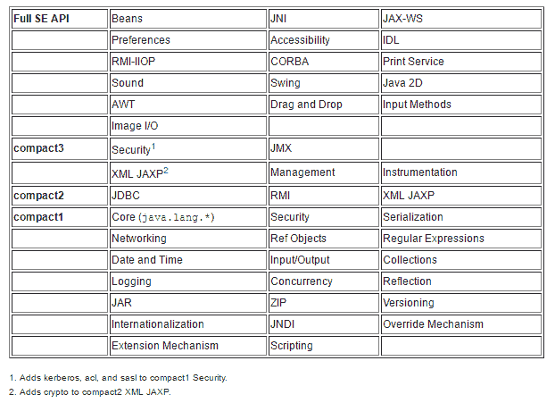

上图显示了不同的配置文件及其支持的功能。

Java9 中引入了一个名为`jlink`的新工具，它支持创建模块化运行时映像。这些运行时映像只是一组模块及其依赖项的集合。有一个 Java 增强方案 JEP220，用于管理此运行时映像的结构。

在此配方中，我们将使用`jlink`创建一个运行时映像，该映像由我们的`math.util`、`banking.util`和`calculator`模块以及 Jackson 自动模块组成。

# 准备

在“创建简单模块化应用程序”配方中，我们创建了一个由以下模块组成的简单模块化应用程序：

*   `math.util`
*   `calculator`：由主类组成

我们将重用同一组模块和代码来演示`jlink`工具的使用。为方便读者阅读，代码可在`Chapter03/9_jlink_modular_run_time_image`找到。

# 怎么做。。。

1.  让我们编译模块：

```java
 $ javac -d mods --module-path mlib --module-source-path 
        src $(find src - name *.java)
```

2.  让我们为所有模块创建模块化 JAR：

```java
     $ jar --create --file mlib/math.util.jar -C mods/math.util . 

 $ jar --create --file=mlib/calculator.jar --main-
 class=com.packt.calculator.Calculator -C mods/calculator/ .
```

3.  让我们使用`jlink`创建一个运行时映像，该映像由`calculator`和`math.util`模块及其依赖项组成：

```java
 $ jlink --module-path mlib:$JAVA_HOME/jmods --add-modules 
 calculator,math.util --output image --launcher 
 launch=calculator/com.packt.calculator.Calculator
```

运行时映像将在使用`--output`命令行选项指定的位置创建。

4.  在目录映像下创建的运行时映像包含`bin`目录以及其他目录。此`bin`目录由一个名为`calculator`的 Shell 脚本组成。这可用于启动我们的应用程序：

```java
    $ ./image/bin/launch 

 ************Advanced Calculator************
 1\. Prime Number check
 2\. Even Number check
 3\. Sum of N Primes
 4\. Sum of N Evens
 5\. Sum of N Odds
 6\. Exit
 Enter the number to choose operation
```

我们无法创建包含自动模块的模块的运行时映像。如果 JAR 文件不是模块化的，或者没有`module-info.class`，Jlink 会给出一个错误。

# 为较旧的平台版本编译

我们在某个时候使用了`-source`和`-target`选项来创建 Java 构建。`-source`选项用于指示编译器接受的 Java 语言版本，`-target`选项用于指示类文件支持的版本。通常，我们忘记使用`-source`选项，默认情况下，`javac`根据最新的可用 Java 版本进行编译。因此，有可能会使用较新的 API，因此，构建不会在目标版本上按预期运行。

为了克服提供两个不同命令行选项的混乱，Java9 中引入了一个新的命令行选项`--release`。此选项可替代`-source`、`-target`和`-bootclasspath`选项。`-bootclasspath`用于提供给定版本`N`的引导类文件的位置。

# 准备

我们创建了一个名为`demo`的简单模块，其中包含一个名为`CollectionsDemo`的非常简单的类，该类只在映射中放入一些值，并按如下方式对它们进行迭代：

```java
public class CollectionsDemo{
  public static void main(String[] args){
    Map<String, String> map = new HashMap<>();
    map.put("key1", "value1");
    map.put("key2", "value3");
    map.put("key3", "value3");
    map.forEach((k,v) -> System.out.println(k + ", " + v));
  }
}
```

让我们编译并运行它以查看其输出：

```java
$ javac -d mods --module-source-path src srcdemomodule-info.java srcdemocompacktCollectionsDemo.java
$ java --module-path mods -m demo/com.packt.CollectionsDemo
```

我们得到的结果如下：

```java
key1, value1
key2, value3
key3, value3
```

现在，让我们编译它在 Java8 上运行，然后在 Java8 上运行它。

# 怎么做。。。

1.  由于 Java、Java 8 及之前的旧版本不支持模块，因此，如果我们在旧版本上编译，我们将不得不放弃`module-info.java`。这就是为什么我们在编译过程中没有包括`module-info.java`。我们使用以下代码编译：

```java
 $ javac --release 8 -d mods srcdemocompacktCollectionsDemo.java
```

您可以看到，我们使用的是`--release`选项，目标是 Java 8，而不是编译`module-info.java`。

2.  让我们创建一个 JAR 文件，因为传输 Java 构建比复制所有类文件更容易：

```java
 $jar --create --file mlib/demo.jar --main-class 
      com.packt.CollectionsDemo -C mods/ .
```

3.  让我们在 Java 9 中运行前面的 JAR：

```java
 $ java -version
 java version "9"
 Java(TM) SE Runtime Environment (build 9+179)
 Java HotSpot(TM) 64-Bit Server VM (build 9+179, mixed mode)

 $ java -jar mlib/demo.jar
 key1, value1
 key2, value3
 key3, value3
```

4.  让我们在 Java 8 中运行 JAR：

```java
 $ "%JAVA8_HOME%"binjava -version 
 java version "1.8.0_121"
 Java(TM) SE Runtime Environment (build 1.8.0_121-b13)
 Java HotSpot(TM) 64-Bit Server VM (build 25.121-b13, mixed mode)

 $ "%JAVA8_HOME%"binjava -jar mlibdemo.jar
 key1, value1
 key2, value3
 key3, value3
```

如果我们在构建 Java9 时没有使用`-release`选项会怎么样？让我们也尝试一下：

1.  不使用`--release`选项进行编译，并使用生成的类文件创建 JAR：

```java
 $ javac -d mods srcdemocompacktCollectionsDemo.java 
 $ jar --create --file mlib/demo.jar --main-class 
      com.packt.CollectionsDemo -C mods/ .
```

2.  让我们在 Java 9 上运行 JAR：

```java
 $ java -jar mlib/demo.jar 
 key1, value1
 key2, value3
 key3, value3
```

它按预期工作。

3.  让我们在 Java 8 上运行 JAR：

```java
 $ "%JAVA8_HOME%"binjava -version
 java version "1.8.0_121"
 Java(TM) SE Runtime Environment (build 1.8.0_121-b13)
 Java HotSpot(TM) 64-Bit Server VM (build 25.121-b13, mixed mode)
```

输出如下：

```java
$ java -jar mlibdemo.jar

Exception in thread "main" java.lang.UnsupportedClassVersionError:

com/packt/CollectionsDemo has been compiled by a more recent version of the Java Runtime (class file version 53.0), this version of the Java Runtime only recognizes class file versions up to 52.0
```

它清楚地表明类文件的版本不匹配。因为它是为 Java9（53.0 版）编译的，所以它不在 Java8（52.0 版）上运行。

# 它是如何工作的。。。

编译为目标旧版本所需的数据存储在`$JDK_ROOT/lib/ct.sym`文件中。此信息由`--release`选项用于定位`bootclasspath`。`ct.sym`文件是一个 ZIP 文件，包含与目标平台版本的类文件相对应的精简类文件（逐字取自[这里](http://openjdk.java.net/jeps/247)）。

# 创建多版本 JAR

在 Java9 之前，如果不发布新的库版本，库的开发人员很难采用该语言中引入的新特性。但在 Java9 中，多版本 JAR 提供了这样一种功能，您可以将某些类文件捆绑在一起，以便在使用更高版本的 Java 时运行。

在这个配方中，我们将向您展示如何创建这样一个多版本 JAR。

# 怎么做。。。

1.  为 Java8 平台创建所需的 Java 代码。我们将在`src8compackt`目录中添加两个类`CollectionUtil.java`和`FactoryDemo.java`：

```java
        public class CollectionUtil{
          public static List<String> list(String ... args){
            System.out.println("Using Arrays.asList");
            return Arrays.asList(args);
          }

          public static Set<String> set(String ... args){
            System.out.println("Using Arrays.asList and set.addAll");
            Set<String> set = new HashSet<>();
            set.addAll(list(args));
            return set;
          }
        }

        public class FactoryDemo{
          public static void main(String[] args){
            System.out.println(CollectionUtil.list("element1", 
                       "element2", "element3"));
            System.out.println(CollectionUtil.set("element1", 
                       "element2", "element3"));
          }
        }
```

2.  我们希望利用 Java9 中引入的`Collection`工厂方法。因此，我们将在`src`下创建另一个子目录，以放置与 Java-9 相关的代码：`src9compackt`。在这里我们将添加另一个`CollectionUtil`类：

```java
        public class CollectionUtil{
          public static List<String> list(String ... args){
            System.out.println("Using factory methods");
            return List.of(args);
          }
          public static Set<String> set(String ... args){
            System.out.println("Using factory methods");
            return Set.of(args);
          }
        }
```

3.  前面的代码使用 Java9 集合工厂方法。使用以下命令编译源代码：

```java
 javac -d mods --release 8 src8compackt*.java
      javac -d mods9 --release 9 src9compackt*.java
```

记下用于编译不同 Java 版本代码的`--release`选项。

4.  现在，让我们创建多版本 JAR：

```java
 jar --create --file mr.jar --main-class=com.packt.FactoryDemo 
      -C mods . --release 9 -C mods9 .
```

在创建 JAR 时，我们还提到，在 Java9 上运行时，我们使用 Java-9 特定的代码。

5.  我们将在 Java 9 上运行`mr.jar`：

```java
 java -jar mr.jar
 [element1, element2, element3]
 Using factory methods
 [element2, element3, element1]
```

6.  我们将在 Java 8 上运行`mr.jar`：

```java
      #Linux
 $ /usr/lib/jdk1.8.0_144/bin/java -version
 java version "1.8.0_144"
 Java(TM) SE Runtime Environment (build 1.8.0_144-b01)
 Java HotSpot(TM) 64-Bit Server VM (build 25.144-b01, mixed mode)
 $ /usr/lib/jdk1.8.0_144/bin/java -jar mr.jar
 Using Arrays.asList
 [element1, element2, element3]
 Using Arrays.asList and set.addAll
 Using Arrays.asList
 [element1, element2, element3]

 #Windows
 $ "%JAVA8_HOME%"binjava -version 
 java version "1.8.0_121"
 Java(TM) SE Runtime Environment (build 1.8.0_121-b13)
 Java HotSpot(TM) 64-Bit Server VM (build 25.121-b13, mixed mode)
 $ "%JAVA8_HOME%"binjava -jar mr.jar
 Using Arrays.asList
 [element1, element2, element3]
 Using Arrays.asList and set.addAll
 Using Arrays.asList
 [element1, element2, element3]
```

# 它是如何工作的。。。

我们来看看`mr.jar`中的内容布局：

```java
jar -tvf mr.jar
```

JAR 的内容如下：


在前面的布局中，我们有`META-INF/versions/9`，其中包含特定于 Java 9 的代码。另一个需要注意的重要事项是`META-INF/MANIFEST.MF`文件的内容。让我们提取 JAR 并查看其内容：

```java
jar -xvf mr.jar

$ cat META-INF/MANIFEST.MF
Manifest-Version: 1.0
Created-By: 9 (Oracle Corporation)
Main-Class: com.packt.FactoryDemo
Multi-Release: true
```

新的`Multi-Release`manifest 属性用于指示 JAR 是否为多版本 JAR。

# 使用 Maven 开发模块化应用程序

在本教程中，我们将介绍如何使用 Maven（Java 生态系统中最流行的构建工具）来开发简单的模块化应用程序。我们将重复使用本章“服务”配方中介绍的想法。

# 准备

我们的示例中有以下模块：

*   `book.manage`：这是与数据源交互的主要模块
*   `book.service`：这是包含服务提供商接口的模块
*   `mongodb.book.service`：此模块为服务提供商接口提供实现
*   `sqldb.book.service`：此模块为服务提供商接口提供另一个实现

在这个过程中，我们将创建一个 Maven 项目，并将前面的 JDK 模块作为 Maven 模块包括在内。让我们开始吧。

# 怎么做。。。

1.  创建包含所有模块的文件夹。我们将其命名为`12_services_using_maven`，文件夹结构如下：

```java
      12_services_using_maven
 |---book-manage
 |---book-service
 |---mongodb-book-service
 |---sqldb-book-service
 |---pom.xml
```

2.  母公司的`pom.xml`如下所示：

```java
        <?xml version="1.0" encoding="UTF-8"?>
        <project 
         xmlns:xsi="http://www.w3.org/2001/XMLSchema-instance"
         xsi:schemaLocation="http://maven.apache.org/POM/4.0.0 
         http://maven.apache.org/xsd/maven-4.0.0.xsd">
          <modelVersion>4.0.0</modelVersion>
          <groupId>com.packt</groupId>
          <artifactId>services_using_maven</artifactId>
          <version>1.0</version>
          <packaging>pom</packaging>
          <modules>
            <module>book-service</module>
            <module>mongodb-book-service</module>
            <module>sqldb-book-service</module>
            <module>book-manage</module>
          </modules>
          <build>
            <plugins>
              <plugin>
                <groupId>org.apache.maven.plugins</groupId>
                <artifactId>maven-compiler-plugin</artifactId>
                <version>3.6.1</version>
                <configuration>
                  <source>9</source>
                  <target>9</target>
                  <showWarnings>true</showWarnings>
                  <showDeprecation>true</showDeprecation>
                </configuration>
              </plugin>
            </plugins>
          </build>
        </project>
```

3.  让我们为`book-service`Maven 模块创建如下结构：

```java
 book-service
 |---pom.xml
 |---src
 |---main
 |---book.service
 |---module-info.java
 |---com
 |---packt
 |---model
 |---Book.java
 |---service
 |---BookService.java
 |---spi
 |---BookServiceProvider.java
```

4.  `book-service`Maven 模块`pom.xml`的内容为：

```java
        <?xml version="1.0" encoding="UTF-8"?>
        <project 
        xmlns:xsi="http://www.w3.org/2001/XMLSchema-instance"
        xsi:schemaLocation="http://maven.apache.org/POM/4.0.0 
        http://maven.apache.org/xsd/maven-4.0.0.xsd">
          <modelVersion>4.0.0</modelVersion>
          <parent>
            <groupId>com.packt</groupId>
            <artifactId>services_using_maven</artifactId>
            <version>1.0</version>
          </parent>
          <artifactId>book-service</artifactId>
          <version>1.0</version>
          <build>
            <sourceDirectory>src/main/book.service</sourceDirectory>
          </build>
        </project>
```

5.  以下是`module-info.java`：

```java
        module book.service{
          exports com.packt.model;
          exports com.packt.service;
          exports com.packt.spi;
          uses com.packt.spi.BookServiceProvider;
       }
```

6.  以下是`Book.java`：

```java
       public class Book{
         public Book(String id, String title, String author){
           this.id = id;
           this.title = title
           this.author = author;
         }
         public String id;
         public String title;
         public String author;
       }
```

7.  以下是`BookService.java`：

```java
 public abstract class BookService{
 public abstract void create(Book book); 
 public abstract Book read(String id); 
 public abstract void update(Book book); 
 public abstract void delete(String id);
 public static BookService getInstance(){ 
   ServiceLoader<BookServiceProvider> sl =     
        ServiceLoader.load(BookServiceProvider.class);          
   Iterator<BookServiceProvider> iter = sl.iterator();        
   if (!iter.hasNext())
      throw new RuntimeException("No service providers found!");              
   BookServiceProvider provider = null;        
   while(iter.hasNext()){
       provider = iter.next();
       System.out.println(provider.getClass());        
   }        
   return provider.getBookService(); 
   }
 }
```

8.  以下是`BookServiceProvider.java`：

```java
        public interface BookServiceProvider{
          public BookService getBookService();
        }
```

在类似的行中，我们定义了其他三个 Maven 模块，`mongodb-book-service`、`sqldb-book-service`和`book-manager`。此代码可在`Chapter03/12_services_using_maven`中找到。

我们可以使用以下命令编译类并构建所需的 JAR 文件：

```java
mvn clean install
```

我们已经提供了`run-with-mongo.*`以使用`mongodb-book-service`作为服务提供商实现，`run-with-sqldb.*`以`sqldb-book-service`作为服务提供商实现。

此配方的完整代码可在`Chapter03/12_services_using_maven`中找到。

# 使库模块路径友好

对于一个完全模块化的应用程序，它应该将自身及其依赖项模块化。现在，制作第三方模块不在应用程序开发人员的手中。一种方法是在模块路径中包含第三方`jar`，并使用`jar`的名称作为模块的名称来声明依赖关系。在这种情况下，`jar`成为一个自动模块。这是可以的，但通常情况下，`jar`的名称对模块名不友好，或者不符合有效模块名的语法。在这种情况下，我们使用 JDK 9 中添加的另一个支持，其中可以在`jar`的`MANIFEST.mf`文件中定义`jar`的名称，然后库使用者可以声明对定义名称的依赖关系。这样，在将来，库开发人员可以模块化他们的库，同时仍然使用相同的模块名。

在本配方中，我们将向您展示如何为从非模块化`jar`创建的自动模块提供名称。首先，我们将向您展示如何使用 Maven 实现这一点，然后在“更多”部分，我们将了解如何在不使用任何构建工具的情况下创建 JAR。

# 准备

您至少需要 JDK 9 来运行这个配方，但我们将在 Maven 构建插件中使用 JDK 11。您还需要安装 Maven 才能使用它。您可以在互联网上搜索 Maven 的安装过程。

# 怎么做。。。

1.  使用 Maven 生成一个空项目：

```java
mvn archetype:generate -DgroupId=com.packt.banking -DartifactId=13_automatic_module -DarchetypeArtifactId=maven-archetype-quickstart -DinteractiveMode=false
```

2.  通过复制以下依赖项来更新位于`13_automatic_module`目录中的`pom.xml`文件中的依赖项：

```java
<dependencies>
  <dependency>
    <groupId>junit</groupId>
    <artifactId>junit</artifactId>
    <version>4.12</version>
    <scope>test</scope>
  </dependency>
  <dependency>
    <groupId>org.assertj</groupId>
    <artifactId>assertj-core</artifactId>
    <version>3.10.0</version>
    <scope>test</scope>
  </dependency>
</dependencies>
```

3.  我们需要配置`maven-compiler-plugin`以便能够为 JDK 11 编译。因此，我们将在`<dependencies></dependencies>`之后添加以下插件配置：

```java
<build>
  <plugins>
    <plugin>
      <groupId>org.apache.maven.plugins</groupId>
      <artifactId>maven-compiler-plugin</artifactId>
      <version>3.6.1</version>
      <configuration>
        <source>11</source>
        <target>11</target>
        <showWarnings>true</showWarnings>
        <showDeprecation>true</showDeprecation>
      </configuration>
    </plugin>
  </plugins>
</build>
```

4.  通过在新的`<Automatic-Module-Name>`标签中提供名称，配置`maven-jar-plugin`提供自动模块名称，如下图：

```java
<plugin>
  <groupId>org.apache.maven.plugins</groupId>
  <artifactId>maven-jar-plugin</artifactId>
  <configuration>
    <archive>
      <manifestEntries>
        <Automatic-Module-Name>com.packt.banking</Automatic-Module-
         Name>
      </manifestEntries>
    </archive>
  </configuration>
</plugin>
```

5.  我们将添加一个 API 来计算`com.packt.banking.Banking`类中的单利，如下所示：

```java
public class Banking {
  public static Double simpleInterest(Double principal, 
                            Double rateOfInterest, Integer years){
    Objects.requireNonNull(principal, "Principal cannot be null");
    Objects.requireNonNull(rateOfInterest,  
                               "Rate of interest cannot be null");
    Objects.requireNonNull(years, "Years cannot be null");
    return ( principal * rateOfInterest * years ) / 100;
  }
}
```

6.  我们还添加了一个测试，您可以在本章下载的代码`Chapter03\13_automatic_module\src\test\java\com\packt\banking`中找到。让我们运行`mvn package`命令来构建一个 JAR。如果一切顺利，您将看到以下内容：

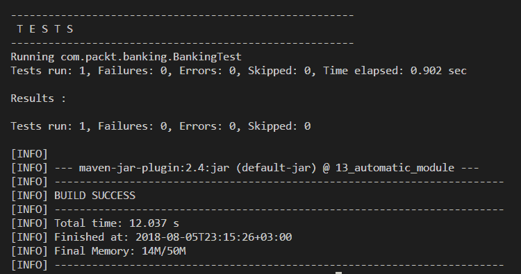

7.  您可以使用任何压缩实用程序（如 7z）查看 JAR 的内容，尤其是`Manifest.MF`文件，其内容如下：

```java
Manifest-Version: 1.0
Archiver-Version: Plexus Archiver
Created-By: Apache Maven 3.3.9
Built-By: sanaulla
Build-Jdk: 11-ea
Automatic-Module-Name: com.packt.banking
```

这些步骤的代码可在`Chapter03\13_automatic_module`中找到。

# 它是如何工作的。。。

到目前为止，我们已经创建了一个带有自动模块名的 Java 库 JAR。现在，让我们看看如何在模块化应用程序中使用这个非模块化 JAR 作为自动模块。完整的代码可在`Chapter03\13_using_automatic_module`中找到。

让我们复制在“如何做”中创建的`jar`文件。。。部分，您可以在`13_automatic_module\target\13_automatic_module-1.0.jar`中找到，放入`13_using_automatic_module\mods`文件夹中。这使得我们即将推出的模块化应用程序能够利用`jar`附带的`com.packt.banking`模块。

复制 JAR 后，我们需要为我们的模块创建一个模块定义，并在`module-info.java`中声明其依赖项，放在`13_using_automatic_module\src\banking.demo`中：

```java
module banking.demo{
    requires com.packt.banking;
}
```

接下来是创建主`com.packt.demo.BankingDemo`类，该类将使用银行实用程序。这将在`13_using_automatic_module\src\banking.demo\com\packt\demo`路径中创建，如下所示：

```java
package com.packt.demo;
import com.packt.banking.Banking;
public class BankingDemo{
  public static void main(String[] args) {
    Double principal = 1000.0;
    Double rateOfInterest = 10.0;
    Integer years = 2;
    Double simpleInterest = Banking.simpleInterest(principal, 
                                      rateOfInterest, years);
        System.out.println("The simple interest is: " + 
                                             simpleInterest);
    }
}
```

我们可以使用以下命令编译前面的代码，从`13_using_automatic_module`执行：

```java
javac -d mods -p mods --module-source-path src src\banking.demo\*.java src\banking.demo\com\packt\demo\*.java
```

然后使用从同一位置执行的以下命令运行前面的代码：

```java
java --module-path mods -m banking.demo/com.packt.demo.BankingDemo
```

您将看到以下输出：

```java
The simple interest is: 200.0
```

注意：您可以使用`run.bat`或`run.sh`脚本编译和运行代码。

因此，有了这个，我们有：

*   创建了一个具有自动模块名的非模块化 JAR。
*   通过使用非模块化 JAR 的自动模块名声明对其的依赖关系，将其用作自动模块。

您还将看到，我们已经完全删除了类路径的使用，而不是只使用模块路径；这是我们迈向完全模块化应用程序的第一步。

# 还有更多。。。

我们将向您展示如何为您的银行实用程序创建一个 JAR，如果您不使用 Maven，还将介绍自动模块名。此代码可在`Chapter03\13_automatic_module_no_maven`中找到。我们仍然会将相同的`Banking .java`复制到`13_automatic_module_no_maven\src\com\packt\banking`目录中。

接下来，我们需要定义一个`manifest.mf`清单文件，该文件将包含以下自动模块名称：

```java
Automatic-Module-Name: com.packt.banking
```

我们可以通过从`Chapter03\13_automatic_module_no_maven`发出以下命令来编译前面的类：

```java
javac -d classes src/com/packt/banking/*.java
```

然后从同一位置发出以下命令，构建一个`jar`：

```java
jar cvfm banking-1.0.jar manifest.mf -C classes .
```

我们还提供了创建您的`jar`的脚本。您可以使用`build-jar.bat`或`build-jar.sh`编译并创建`jar`。现在，您可以将`banking-1.0.jar`复制到`Chapter03\13_using_automatic_module\mods`并替换`13_automati_module-1.0.jar`。然后，根据您的平台，使用`run.bat`或`run.sh`脚本运行`Chapter03\13_using_automatic_module`中的代码。您仍将看到与上一节相同的输出。

# 如何打开模块进行反射

模块系统在其模块内引入了类的严格封装，并且引入了严格级别，如果不明确允许类进行反射，则不能通过反射访问其私有成员。大多数库，如 Hibernate 和 Jackson，都依赖反射来实现它们的目的。模块系统提供的严格封装将立即破坏新 JDK 9 和更高版本上的这些库。

为了支持这些重要的库，Java 团队决定引入一些特性，模块开发人员可以在这些特性中声明几个包或完整的包，这些包可以通过反射进行检查。在本食谱中，我们将了解如何实现这一目标。

# 准备

您需要安装 JDK 9 或更高版本。我们将在本食谱中使用 Jackson API，其`jar`文件可在本书代码下载的`Chapter03/14_open_module_for_rflxn/mods`中找到。这些`jar`文件非常重要，因为我们将使用 Jackson API 从 Java 对象创建 JSON 字符串。这些 Jackson API 将用作自动模块。

# 怎么做。。。

1.  在`14_open_module_for_rflxn/src/demo/com/packt/demo`中创建一个具有以下定义的`Person`类：

```java
package com.packt.demo;

import java.time.LocalDate;

public class Person{
    public Person(String firstName, String lastName, 
        LocalDate dob, String placeOfBirth){
        this.firstName = firstName;
        this.lastName = lastName;
        this.dob = dob;
        this.placeOfBirth = placeOfBirth;
    }
    public final String firstName;
    public final String lastName;
    public final LocalDate dob;
    public final String placeOfBirth;
}
```

2.  创建一个`OpenModuleDemo`类，该类创建`Person`类的实例，并使用`com.fasterxml.jackson.databind.ObjectMapper`将其序列化为 JSON。新日期时间 API 的序列化需要对`ObjectMapper`实例进行一些配置更改，这也在静态初始化块中完成，如下所示：

```java
package com.packt.demo;

import java.time.LocalDate;

import com.fasterxml.jackson.databind.ObjectMapper;
import com.fasterxml.jackson.databind.SerializationFeature;
import com.fasterxml.jackson.datatype.jsr310.JavaTimeModule;

public class OpenModuleDemo{
    final static ObjectMapper MAPPER = new ObjectMapper();
    static{
        MAPPER.registerModule(new JavaTimeModule());
        MAPPER.configure(SerializationFeature.
                         WRITE_DATES_AS_TIMESTAMPS, false);
    }
    public static void main(String[] args) 
        throws Exception {
        Person p = new Person("Mohamed", "Sanaulla", 
            LocalDate.now().minusYears(30), "India");
        String json = MAPPER.writeValueAsString(p);
        System.out.println("The Json for Person is: ");
        System.out.println(json);
    }
}
```

3.  在`14_open_module_for_rflxn/src/demo`中创建`module-info.java`，它声明了模块的名称、依赖项以及另一个有趣的东西`opens`。`opens`是允许外部库进行反射的解决方案，如下所示：

```java
module demo{
    requires com.fasterxml.jackson.annotation;
    requires com.fasterxml.jackson.core;
    requires com.fasterxml.jackson.databind;
    requires com.fasterxml.jackson.datatype.jsr310;
    opens com.packt.demo;
}
```

# 它是如何工作的。。。

通过反射打开模块进行检查有两种方法：

*   在模块级别声明打开：

```java
open module demo { }
```

*   声明在单个包级别打开：

```java
module demo { 
    opens com.packt.demo;
}
```

后者比前者更具限制性（即，仅使包可用于反射）。还有另一种方法可以实现这一点，即将特定包导出到正确的 Jackson 包，如下所示：

```java
module demo{
   exports com.packt.demo to <relevant Jackson package here>
}
```************