# 发挥作用

本章介绍一种称为函数式编程的编程范式及其在Java11中的适用性。我们将介绍以下配方：

*   使用标准功能接口
*   创建功能接口
*   理解lambda表达式
*   使用lambda表达式
*   使用方法引用
*   在程序中利用lambda表达式

# 介绍

函数式编程是将某一功能作为对象处理，并将其作为参数或方法的返回值传递的能力。这个特性存在于许多编程语言中，Java在Java8的发布中获得了它。

它避免创建类、对象和管理对象状态。函数的结果只取决于输入数据，无论调用多少次。这种风格使结果更加可预测，这是函数式编程最吸引人的方面。

它对Java的介绍还允许我们通过将并行性的责任从客户机代码转移到库中来改进Java中的并行编程能力。在此之前，为了处理Java集合的元素，客户机代码必须从集合中获取迭代器并组织集合的处理。

Java集合的一些默认方法接受函数（函数接口的实现）作为参数，然后将其应用于集合的每个元素。因此，组织处理是图书馆的责任。一个例子是在每个`Iterable`接口中可用的`forEach(Consumer)`方法，其中`Consumer`是一个功能接口。另一个例子是可用于每个`Collection`接口的`removeIf(Predicate)`方法，其中`Predicate`也是一个功能接口。另外，在`List`界面中增加了`sort(Comparator)`和`replaceAll(UnaryOperator)`方法，在`Map`界面中增加了`compute()`方法。

Lambda表达式利用了函数接口，大大简化了它们的实现，使代码更短、更清晰、更具表现力。

在本章中，我们将讨论函数式编程的优点，定义和解释函数接口和lambda表达式，并在代码示例中演示所有相关功能。

使函数成为该语言的一流公民为Java增添了更多的力量。但是利用这种语言能力需要那些尚未接触函数式编程的人——一种新的思考和组织代码的方式。

本章的目的是解释这一新功能并分享使用它的最佳实践。

# 使用标准功能接口

在本教程中，您将了解什么是函数接口以及为什么将其添加到Java中，以及`java.util.function`包中JDK 8附带的标准Java库的43个现成的函数接口。

如果没有函数接口，将功能传递给方法的唯一方法是编写类，创建其对象，然后将其作为参数传递。但是，即使是使用匿名类的最简单的样式也需要编写太多的代码。使用功能接口有助于避免所有这些。

# 准备

任何只有一个抽象方法的接口都称为函数接口。为了避免运行时错误，可以在接口前面添加`@FunctionalInterface`注释。它告诉编译器意图，因此编译器可以检查该接口中是否存在一个抽象方法，包括从其他接口继承的抽象方法。

在前几章的演示代码中，我们已经有了一个函数接口的示例，即使我们没有将其注释为函数：

```
public interface SpeedModel {
  double getSpeedMph(double timeSec, int weightPounds, int horsePower);
  enum DrivingCondition {
    ROAD_CONDITION,
    TIRE_CONDITION
  }
  enum RoadCondition {
    //...
  }
  enum TireCondition {
    //...
  }
}
```

`enum`类型或任何实现（默认或静态）方法的存在不会使其成为非功能接口。只计算抽象（未实现）方法。这也是一个功能接口的例子：

```
public interface Vehicle {
  void setSpeedModel(SpeedModel speedModel);
  default double getSpeedMph(double timeSec){ return -1; };
  default int getWeightPounds(){ return -1; }
  default int getWeightKg(){ 
    return convertPoundsToKg(getWeightPounds());
  }
  private int convertPoundsToKg(int pounds){
    return (int) Math.round(0.454 * pounds);
  }
  static int convertKgToPounds(int kilograms){
    return (int) Math.round(2.205 * kilograms);
  }
}
```

回顾您在[第二章](02.html)*OOP快速通道*【类和接口】中了解到的接口的默认方法，`getWeightPounds()`方法在`getWeightKg()`调用或直接使用实现`Vehicle`接口的类的对象时，将返回`-1`。但是，只有在类中没有实现`getWeightPounds()`方法时，才是这样。否则，将使用类实现并返回不同的值。

除了默认和静态接口方法外，功能接口还可以包括`java.lang.Object`基的任何和所有抽象方法。在Java中，每个对象都提供了`java.lang.Object`方法的默认实现，因此编译器和Java运行时会忽略这些抽象方法。

例如，这也是一个功能接口：

```
public interface SpeedModel {
  double getSpeedMph(double timeSec, int weightPounds, int horsePower);
  boolean equals(Object obj);
  String toString();
}
```

但以下不是功能接口：

```
public interface Car extends Vehicle {
   int getPassengersCount();
}
```

这是因为`Car`接口有两个抽象方法—它自己的`getPassengersCount()`方法和继承自`Vehicle`接口的`setSpeedModel(SpeedModel speedModel)`方法。

我们可以尝试在`Car`界面添加`@FunctionalInterface`注释：

```
@FunctionalInterface 
public interface Car extends Vehicle {
   int getPassengersCount();
}
```

如果我们这样做，编译器将生成以下错误：


使用`@FunctionalInterface`注释不仅有助于在编译时捕获错误，还可以确保程序员之间可靠地交流设计意图。这有助于您或其他程序员记住，此接口不能有多个抽象方法，当某些代码已经存在并依赖于这种假设时，这一点尤为重要。

出于同样的原因，`Runnable`和`Callable`接口（它们自Java早期版本以来就存在于Java中）在Java 8中被注释为`@FunctionalInterface`，以明确这一区别：

```
@FunctionalInterface
interface Runnable { void run(); }

@FunctionalInterface
interface Callable<V> { V call() throws Exception; }
```

# 怎么做。。。

在创建自己的功能接口之前，请考虑首先使用`java.util.function`包中提供的43个功能接口之一。其中大部分是`Function`、`Consumer`、`Supplier`和`Predicate`接口的专业化。

您可以按照以下步骤熟悉功能接口：

1.  查看`Function<T,R>`功能界面：

```
        @FunctionalInterface
        public interface Function<T,R>
```

从`<T,R>`泛型可以看出，该接口的唯一方法采用`T`类型的参数，并返回`R`类型的值。根据JavaDoc，这个接口有`R apply(T t)`方法。我们可以使用匿名类创建此接口的实现：

```
      Function<Integer, Double> ourFunc = 
          new Function<Integer, Double>() {
              public Double apply(Integer i){
                  return i * 10.0;
              }
          };
```

我们实现中的`R apply(T t)`方法接受`Integer`类型的值（或将自动装箱的`int`原语），将其乘以`10`，并返回`Double`类型的值，以便我们可以按如下方式使用新函数：

```
        System.out.println(ourFunc.apply(1));  //prints: 10
```

在下面的配方*理解lambda表达式*中，我们将介绍一个lambda表达式，并向您展示它的使用如何使实现变得更短。但是现在，我们将继续使用匿名类。

2.  请看`Consumer<T>`功能界面。这个名称帮助我们记住，这个接口的方法接受一个值，但不返回它只使用的任何内容。它唯一的方法是`void accept(T)`。此接口的实现如下所示：

```
        Consumer<String> ourConsumer = new Consumer<String>() {
          public void accept(String s) {
            System.out.println("The " + s + " is consumed.");
          }
        };
```

我们实现中的`void accept(T t)`方法接收`String`类型的值并打印它。例如，我们可以按如下方式使用它：

```
          ourConsumer.accept("Hello!");  
                        //prints: The Hello! is consumed.
```

3.  请看`Supplier<T>`功能界面。该名称有助于您记住，此接口的方法不接受任何值，但只返回所提供的值。它唯一的方法是`T get()`。基于此，我们可以创建一个函数：

```
        Supplier<String> ourSupplier = new Supplier<String>() {
          public String get() {
            String res = "Success";
            //Do something and return result—Success or Error.
            return res;
          }
        };
```

我们实现中的`T get()`方法做了一些事情，然后返回一个`String`类型的值，因此我们可以编写以下代码：

```
        System.out.println(ourSupplier.get());   //prints: Success
```

4.  请看`Predicate<T>`功能界面。这个名称有助于记住，这个接口的方法返回一个布尔值，它断言了一些东西。它唯一的方法是`boolean test(T t)`，这意味着我们可以创建以下函数：

```
        Predicate<Double> ourPredicate = new Predicate<Double>() {
          public boolean test(Double num) {
            System.out.println("Test if " + num + 
                               " is smaller than 20");
            return num < 20;
          }
        };
```

我们实现的`boolean test(T t)`方法接受`Double`类型的值作为参数，并返回`boolean`类型的值，因此我们可以如下使用它：

```
        System.out.println(ourPredicate.test(10.0) ? 
                           "10 is smaller" : "10 is bigger");
```

结果如下：

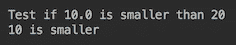

5.  看看`java.util.function`包中的其他39个功能接口。请注意，它们是我们已经讨论过的四个接口的变体。创建这些变体的原因如下：

以下功能接口只是39个接口列表中的几个示例。

`IntFunction<R>`功能接口具有`R apply(int i)`抽象方法。它提供了一个较短的表示法（参数类型没有泛型），并避免了自动装箱（通过将`int`原语定义为参数）。下面是其用法的一个示例：

```
        IntFunction<String> iFunc = new IntFunction<String>() {
          public String apply(int i) {
            return String.valueOf(i * 10);
          }
        };
        System.out.println(iFunc.apply(1));    //prints: 10
```

`BiFunction<T,U,R>`功能接口有抽象方法`R apply(T,U)`。以下是其实施的一个示例：

```
        BiFunction<String, Integer, Double> biFunc = 
                         new BiFunction<String, Integer, Double >() {
           public Double apply(String s, Integer i) {
             return (s.length() * 10d) / i;
           }
        };
        System.out.println(biFunc.apply("abc", 2)); //prints: 15.0

```

`BinaryOperator<T>`功能接口有一个抽象方法`T apply(T,T)`。它通过避免重复同一类型三次来提供更短的表示法。下面是其用法的一个示例：

```
       BinaryOperator<Integer> function = new BinaryOperator<Integer>(){
           public Integer apply(Integer i, Integer j) {
             return i >= j ? i : j;
           }
       };
        System.out.println(binfunc.apply(1, 2));     //prints: 2

```

`IntBinaryOperator`功能接口具有`int applyAsInt(int,int)`抽象方法。我们可以使用它重现与前一示例中相同的功能：

```
        IntBinaryOperator intBiFunc = new IntBinaryOperator(){
            public int applyAsInt(int i, int j) {
                return i >= j ? i : j;
            }
        };
        System.out.println(intBiFunc.applyAsInt(1, 2)); //prints: 2
```

下面的食谱将提供更多使用此类专业化的示例。

# 它是如何工作的。。。

我们可以仅使用以下函数组合整个方法：

```
void calculate(Supplier<Integer> source, 
  Function<Integer, Double> process, Predicate<Double> condition,
              Consumer<Double> success, Consumer<Double> failure){
    int i = source.get();
    double res = process.apply(i);
    if(condition.test(res)){
        success.accept(res);
    } else {
        failure.accept(res);
    }
}
```

前面的代码从源代码获取值，对其进行处理，然后根据作为参数提供的函数决定结果是否成功。现在，让我们创建这些函数并调用该方法。我们决定的源参数如下：

```
Supplier<Integer> source = new Supplier<Integer>() {
    public Integer get() {
        Integer res = 42;
        //Do something and return result value
        return res;
    }
};

```

在实际代码中，此函数可以从数据库或任何其他数据源提取数据。为了得到可预测的结果，我们使用硬编码的返回值保持简单。

处理函数和谓词将保持与以前相同：

```
Function<Integer, Double> process = new Function<Integer, Double>(){
    public Double apply(Integer i){
        return i * 10.0;
    }
};
Predicate<Double> condition = new Predicate<Double>() {
    public boolean test(Double num) {
        System.out.println("Test if " + num + 
                                    " is smaller than " + 20);
        return num < 20;
    }
}; 
```

消费者几乎相同，只是打印结果前前缀不同：

```
Consumer<Double> success = new Consumer<Double>() {
    public void accept(Double d) {
        System.out.println("Success: " + d);
    }
};
Consumer<Double> failure = new Consumer<Double>() {
    public void accept(Double d) {
        System.out.println("Failure: " + d);
    }
};

```

我们现在可以调用calculate方法，如下所示：

```
calculate(source, process, condition, success, failure);

```

结果如下：

```
Test if 420.0 is smaller than 20.0
Failure: 420.0
```

如果我们需要快速测试源值和谓词条件的各种组合，我们可以创建`testSourceAndCondition(int src, int limit)`方法，如下所示：

```
void testSourceAndCondition(int src, double condition) {
    Supplier<Integer> source = new Supplier<Integer>() {
        public Integer get() {
            Integer res = src;
            //Do something and return result value
            return res;
        }
    };
    Function<Integer, Double> process = 
      new Function<Integer, Double>() {
         public Double apply(Integer i){
            return i * 10.0;
         }
      };
    Predicate<Double> condition = new Predicate<Double>() {
        public boolean test(Double num) {
            System.out.println("Test if " + num + 
                                " is smaller than " + limit);
            return num < limit;
        }
    };
    Consumer<Double> success = new Consumer<Double>() {
        public void accept(Double d) {
            System.out.println("Success: " + d);
        }
    };
    Consumer<Double> failure = new Consumer<Double>() {
        public void accept(Double d) {
            System.out.println("Failure: " + d);
        }
    };
    calculate(source, process, cond, success, failure);
}
```

注意我们如何将`src`值传递给`source`供应商，将`limit`值传递给`condition`谓词。现在，我们可以使用不同的输入值运行`testSourceAndCondition(int src, int limit)`方法，以搜索`src`值和`limit`值的组合，从而获得成功：

```
testSourceAndCondition(10, 20);
testSourceAndCondition(1, 20);
testSourceAndCondition(10, 200);

```

结果如下：

```
Test if 100.0 is smaller than 20.0
Failure: 100.0
Test if 10.0 is smaller than 20.0
Success: 10.0
Test if 100.0 is smaller than 200.0
Success: 100.0
```

# 还有更多。。。

`java.util.function`包中的许多功能接口都有默认方法，这些方法不仅可以增强其功能，还可以让您链接函数，并将一个函数的结果作为输入参数传递给另一个函数。例如，我们可以使用`Function<T,R>`接口的`Function<T,V> andThen(Function<R,V> after)`默认方法：

```
Function<Integer, Double> before = new Function<Integer, Double>(){
    public Double apply(Integer i){
        return i * 10.0;
    }
};
Function<Double, Double> after = new Function<Double, Double>(){
    public Double apply(Double d){
        return d + 10.0;
    }
};
Function<Integer, Double> process = before.andThen(after);
```

如您所见，我们的`process`函数现在是原始函数（将源值乘以10.0）和新函数`after`的组合，该函数将第一个函数的结果加上10.0。如果我们将`testSourceAndCondition(int source, int condition)`方法称为`testSourceAndCondition(42, 20)`，结果如下：

```
Test if 430.0 is smaller than 20
Failure: 430.0
```

`Supplier<T>`接口没有允许我们链接多个函数的方法，但`Predicate<T>`接口有`and(Predicate<T> other)`和`or(Predicate<T> other)`默认方法，允许我们构造更复杂的布尔表达式。`Consumer<T>`接口也有`andThen(Consumer<T> after)`默认方法。

注意`after`函数的输入值类型必须与`before`函数的结果类型相匹配：

```
Function<T,R> before = ...
Function<R,V> after = ...
Function<T,V> result = before.andThen(after);
```

结果函数接受一个`T`类型的值，并生成一个`V`类型的值。

实现相同结果的另一种方法是使用`Function<V,R> compose(Function<V,T> before)`默认方法：

```
Function<Integer, Double> process = after.compose(before);
```

使用哪种方法-`andThen()`或`compose()`-取决于可用于调用聚合方法的函数。然后，一个被认为是基础，而另一个是参数。

如果这种编码看起来有点过于复杂，那是因为它确实如此。我们这样做只是为了演示。好消息是，下一个配方中提供的lambda表达式允许我们以更简短、更清晰的方式实现相同的结果。

`java.util.function`包的功能接口还有其他有用的默认方法。最突出的是`identity()`方法，它返回一个始终返回其输入参数的函数：

```
Function<Integer, Integer> id = Function.identity();
System.out.println(id.apply(4));  //prints: 4
```

当一个方法需要您提供某个函数，但您不希望该函数修改结果时，`identity()`方法非常有用。

其他默认方法主要与转换、装箱、取消装箱以及提取两个参数的最小值和最大值有关。我们鼓励您浏览`java.util.function`所有功能接口的API，了解其可能性。

# 创建功能接口

在此配方中，您将学习如何在`java.util.function`包中的标准接口均不满足要求时创建和使用自定义功能接口。

# 准备

创建功能界面很容易。只需确保接口中只有一个抽象方法，包括从其他接口继承的方法：

```
@FunctionalInterface
interface A{
    void m1();
}

@FunctionalInterface
interface B extends A{
    default void m2(){};
}

//@FunctionalInterface
interface C extends B{
    void m3();
}
```

在前面的示例中，接口`C`不是功能接口，因为它有两个抽象方法—`m1()`，继承自接口`A`，以及它自己的方法`m3()`。

我们也已经看到了`SpeedModel`功能界面：

```
@FunctionalInterface
public interface SpeedModel {
  double getSpeedMph(double timeSec, int weightPounds, int horsePower);
}
```

我们对其进行了注释，以表达意图，并在`SpeedModel`接口中添加另一个抽象方法时发出警告。而且，为了使它更简单，我们从中删除了`enum`类。此接口用于`Vehicle`接口：

```
public interface Vehicle {
    void setSpeedModel(SpeedModel speedModel);
    double getSpeedMph(double timeSec);
}
```

而`Vehicle`实现需要它的原因是`SpeedModel`是计算速度的功能的来源：

```
public class VehicleImpl implements Vehicle {
    private SpeedModel speedModel;
    private int weightPounds, hoursePower;
    public VehicleImpl(int weightPounds, int hoursePower){
        this.weightPounds = weightPounds;
        this.hoursePower = hoursePower;
    }
    public void setSpeedModel(SpeedModel speedModel){
        this.speedModel = speedModel;
    }
    public double getSpeedMph(double timeSec){
        return this.speedModel.getSpeedMph(timeSec, 
                                 this.weightPounds, this.hoursePower);
    };
}
```

正如我们在[第2章](02.html)*中提到的【面向对象快速通道——类和接口】*，这种设计被称为聚合。这是构成所需行为的首选方式，因为它允许更大的灵活性。

有了功能接口，这样的设计变得更加灵活。为了演示它，让我们实现我们的自定义接口-`SpeedModel`。

# 怎么做。。。

传统的方法是创建一个实现`SpeedModel`接口的类：

```
public class SpeedModelImpl implements SpeedModel {
   public double getSpeedMph(double timeSec, 
                       int weightPounds, int horsePower){
      double v = 2.0 * horsePower * 746 * 
                       timeSec * 32.17 / weightPounds;
      return (double) Math.round(Math.sqrt(v) * 0.68);
   }
}
```

然后，我们可以按如下方式使用此实现：

```
Vehicle vehicle = new VehicleImpl(3000, 200);
SpeedModel speedModel = new SpeedModelImpl();
vehicle.setSpeedModel(speedModel);
System.out.println(vehicle.getSpeedMph(10.)); //prints: 122.0

```

要改变计算速度的方式，我们需要改变`SpeedModelImpl`类。

或者，利用`SpeedModel`是一个接口的事实，我们可以更快地引入更改，甚至可以首先避免使用`SpeedModelImpl`类：

```
Vehicle vehicle = new VehicleImpl(3000, 200);
SpeedModel speedModel = new SpeedModel(){
   public double getSpeedMph(double timeSec, 
                       int weightPounds, int horsePower){
      double v = 2.0 * horsePower * 746 * 
                       timeSec * 32.17 / weightPounds;
      return (double) Math.round(Math.sqrt(v) * 0.68);
   }
};
vehicle.setSpeedModel(speedModel);
System.out.println(vehicle.getSpeedMph(10.)); //prints: 122.0
```

但是，前面的实现没有利用接口的功能性。如果我们注释掉注释，我们可以在`SpeedModel`界面添加另一个方法：

```
//@FunctionalInterface
public interface SpeedModel {
    double getSpeedMph(double timeSec, 
                    int weightPounds, int horsePower);
    void m1();
}
Vehicle vehicle = new VehicleImpl(3000, 200);
SpeedModel speedModel = new SpeedModel(){
   public double getSpeedMph(double timeSec, 
                     int weightPounds, int horsePower){
      double v = 2.0 * horsePower * 746 * 
                       timeSec * 32.17 / weightPounds;
      return (double) Math.round(Math.sqrt(v) * 0.68);
   }
   public void m1(){}
   public void m2(){}
};
vehicle.setSpeedModel(speedModel);
System.out.println(vehicle.getSpeedMph(10.)); //prints: 122.0
```

从前面的代码中可以看到，不仅`SpeedModel`接口有另一个抽象方法`m1()`，匿名类还有另一个方法`m2()`，没有在`SpeedModel`接口中列出。因此，匿名类不要求接口具有功能性。但lambda表达式确实如此。

# 它是如何工作的。。。

使用lambda表达式，我们可以按如下方式重写前面的代码：

```
Vehicle vehicle = new VehicleImpl(3000, 200);
SpeedModel speedModel =  (t, wp, hp) -> {
    double v = 2.0 * hp * 746 * t * 32.17 / wp;
    return (double) Math.round(Math.sqrt(v) * 0.68);
};
vehicle.setSpeedModel(speedModel);
System.out.println(vehicle.getSpeedMph(10.)); //prints: 122.0

```

我们将在下一个配方中讨论lambda表达式格式。现在，我们只想指出功能接口对于前一个实现的重要性。如您所见，只指定了接口的名称，而没有方法名称。这是可能的，因为一个功能接口只有一个必须实现的方法，这就是JVM如何理解它并在幕后生成一个功能接口实现。

# 还有更多。。。

可以定义与标准功能接口类似的通用自定义功能接口。例如，我们可以创建以下自定义功能接口：

```
@FunctionalInterface
interface Func<T1,T2,T3,R>{ 
   R apply(T1 t1, T2 t2, T3 t3);
}
```

它允许三个输入参数，这正是我们计算速度所需要的：

```
Func<Double, Integer, Integer, Double> speedModel = (t, wp, hp) -> {
    double v = 2.0 * hp * 746 * t * 32.17 / wp;
    return (double) Math.round(Math.sqrt(v) * 0.68);
};

```

使用此功能代替`SpeedModel`接口，我们可以对`Vehicle`接口及其实现进行如下更改：

```
interface Vehicle {
   void setSpeedModel(Func<Double, Integer, Integer, 
                                         Double> speedModel);
   double getSpeedMph(double timeSec);
}
class VehicleImpl  implements Vehicle {
   private Func<Double, Integer, Integer, Double> speedModel;
   private int weightPounds, hoursePower;
   public VehicleImpl(int weightPounds, int hoursePower){
       this.weightPounds = weightPounds;
       this.hoursePower = hoursePower;
   }
   public void setSpeedModel(Func<Double, Integer, 
                               Integer, Double> speedModel){
       this.speedModel = speedModel;
   }
   public double getSpeedMph(double timeSec){
       return this.speedModel.apply(timeSec, 
                             weightPounds, hoursePower);
   };
}
```

前面的代码通过`SpeedModel`接口产生与前面相同的结果。

自定义接口的名称及其唯一方法的名称可以是我们喜欢的任何名称。例如：

```
@FunctionalInterface
interface FourParamFunction<T1,T2,T3,R>{
     R caclulate(T1 t1, T2 t2, T3 t3);
}
```

好的，因为我们无论如何都要创建一个新的接口，使用`SpeedModel`名称和`getSpeedMph()`方法名称可能是更好的解决方案，因为它使代码更具可读性。但在某些情况下，通用自定义函数接口是更好的选择。在这种情况下，您可以使用前面的定义，并根据需要对其进行增强。

# 理解lambda表达式

我们已经多次提到lambda表达式，并指出它们在Java中的使用证明了在`java.util.function`包中引入函数接口的合理性。lambda表达式允许我们通过删除匿名类的所有样板代码来简化函数实现，只留下最少的必要信息。我们还解释了这种简化是可能的，因为函数接口只有一个抽象方法，因此编译器和JVM将提供的功能与方法签名匹配，并在幕后生成函数接口实现。

现在，在我们开始使用lambda表达式使代码比使用匿名类时更短、更可读之前，是时候定义lambda表达式语法并查看lambda表达式的可能形式的范围了。

# 准备

20世纪30年代，数学家阿隆佐·丘奇（Alonzo Church）在研究数学基础的过程中引入了lambda演算——一种通用计算模型，可用于模拟任何图灵机器。当时，图灵机器还没有被创造出来。直到后来，当艾伦·图灵发明了他的*a机器*（自动机器），也称为*通用图灵机器*时，他和丘奇才联合起来，提出了丘奇·图灵论文，表明兰姆达微积分和图灵机具有非常相似的能力。

丘奇使用希腊字母*lambda*来描述匿名函数，它成为编程语言理论领域的非官方符号。第一种利用lambda演算形式的编程语言是Lisp。2014年，随着Java8的发布，Java在其功能中增加了函数式编程。

lambda表达式是一种匿名方法，允许我们省略修饰符、返回类型和参数类型。这是一种非常紧凑的表示法。lambda表达式的语法包括参数列表、箭头标记（`->`和主体。参数列表可以是空的（只有括号，`()`），没有括号（如果只有一个参数），也可以是由括号包围的逗号分隔的参数列表。主体可以是没有括号的单个表达式，也可以是被括号包围的语句块。

# 怎么做。。。

让我们看几个例子。以下lambda表达式没有输入参数，始终返回`33`：

```
() -> 33;
```

以下lambda表达式接受整数类型的一个参数，将其递增1，并返回结果：

```
i -> i++;
```

以下lambda表达式接受两个参数并返回其总和：

```
(a, b) -> a + b;
```

以下lambda表达式接受两个参数，进行比较，并返回`boolean`结果：

```
(a, b) -> a == b;
```

最后一个lambda表达式接受两个参数，计算并打印结果：

```
(a, b) -> { 
     double c = a +  Math.sqrt(b); 
     System.out.println("Result: " + c);
}
```

如您所见，lambda表达式可以包含任何大小的代码块，类似于任何方法。前面的示例不返回任何值。下面是返回`String`值的代码块的另一个示例：

```
(a, b) -> { 
     double c = a +  Math.sqrt(b); 
     return c > 10.0 ? "Success" : "Failure";
}
```

# 它是如何工作的。。。

让我们再看看最后一个例子。如果*功能*接口`A`中定义了`String m1(double x, double y)`方法，如果`m2(A a)`方法接受`A`类型的对象，我们可以如下调用：

```
A a = (a, b) -> { 
     double c = a +  Math.sqrt(b); 
     return c > 10.0 ? "Success" : "Failure";
}
m2(a);
```

前面的代码表示传入的对象具有以下`m1()`方法的实现：

```
public String m1(double x, double y){
     double c = a +  Math.sqrt(b); 
     return c > 10.0 ? "Success" : "Failure";
}
```

`m2(A a)`将`A`对象作为参数的事实告诉我们`m2(A a)`的代码可能至少使用了`A`接口方法中的一种（在`A`接口中也可能有默认或静态方法）。但是，一般来说，无法保证方法使用传入的对象，因为程序员可能已经决定停止使用它，并保持签名不变，例如，只是为了避免破坏客户机代码。

然而，客户机必须向方法传递一个实现`A`接口的对象，这意味着必须实现其唯一的抽象方法。这就是lambda表达式的作用。它使用最少的代码量（输入参数列表和方法实现的代码块）定义抽象方法功能。这就是编译器和JVM生成实现所需的全部内容。

由于lambda表达式和函数接口的结合，编写这样紧凑高效的代码成为可能。

# 还有更多。。。

与在匿名类中一样，在lambda表达式外部创建但在内部使用的变量实际上是final，不能修改。您可以编写以下代码：

```
double v = 10d;
Function<Integer, Double> multiplyBy10 = i -> i * v;
```

但是，不能在lambda表达式之外更改`v`变量的值：

```
double v = 10d;
v = 30d; //Causes compiler error
Function<Integer, Double> multiplyBy10 = i -> i * v;
```

您不能在表达式中更改它，或者：

```
double v = 10d;
Function<Integer, Double> multiplyBy10 = i -> {
  v = 30d; //Causes compiler error
  return i * v;
};

```

这种限制的原因是函数可以在不同的上下文（例如，不同的线程）中为不同的参数传递和执行，而同步这些上下文的尝试将挫败函数分布式求值的最初想法。

另一个值得一提的lambda表达式特性是它对`this`关键字的解释，这与匿名类的解释大不相同。在匿名类中，`this`表示匿名类的实例，但在lambda表达式中，`this`表示围绕该表达式的类的实例。让我们演示一下，假设我们有以下类：

```
class Demo{
    private String prop = "DemoProperty";
    public void method(){
        Consumer<String> consumer = s -> {
            System.out.println("Lambda accept(" + s 
                                      + "): this.prop=" + this.prop);
        };
        consumer.accept(this.prop);
        consumer = new Consumer<>() {
            private String prop = "ConsumerProperty";
            public void accept(String s) {
                System.out.println("Anonymous accept(" + s 
                                      + "): this.prop=" + this.prop);
            }
        };
        consumer.accept(this.prop);
    }
}
```

如您所见，在`method()`代码中，`Consumer`函数接口使用lambda表达式和匿名类实现了两次。让我们在以下代码中调用此方法：

```
  Demo d = new Demo();
  d.method();
```

输出结果如下：

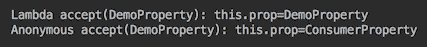

lambda表达式不是内部类，不能被`this`引用。lambda表达式没有字段或属性。它是无国籍的。这就是为什么在lambda表达式中，`this`关键字引用周围的上下文。这也是要求lambda表达式使用的周围上下文的所有变量必须是final或有效final的另一个原因。

# 使用lambda表达式

在本食谱中，您将学习如何在实践中使用lambda表达式。

# 准备

创建和使用lambda表达式实际上比编写方法简单得多。只需要列出输入参数（如果有）和执行必须执行的操作的代码。

让我们回顾一下本章第一个配方中标准函数接口的实现，并使用lambda表达式重写它们。以下是我们如何使用匿名类实现四个主要功能接口：

```
Function<Integer, Double> ourFunc = new Function<Integer, Double>(){
    public Double apply(Integer i){
        return i * 10.0;
    }
};
System.out.println(ourFunc.apply(1));       //prints: 10.0
Consumer<String> consumer = new Consumer<String>() {
    public void accept(String s) {
        System.out.println("The " + s + " is consumed.");
    }
};
consumer.accept("Hello!"); //prints: The Hello! is consumed.
Supplier<String> supplier = new Supplier<String>() {
    public String get() {
        String res = "Success";
        //Do something and return result—Success or Error.
        return res;
    }
};
System.out.println(supplier.get());      //prints: Success
Predicate<Double> pred = new Predicate<Double>() {
    public boolean test(Double num) {
       System.out.println("Test if " + num + " is smaller than 20");
       return num < 20;
    }
};
System.out.println(pred.test(10.0)? "10 is smaller":"10 is bigger");
                           //prints: Test if 10.0 is smaller than 20
                           //        10 is smaller

```

以下是lambda表达式的外观：

```
Function<Integer, Double> ourFunc = i -> i * 10.0;
System.out.println(ourFunc.apply(1)); //prints: 10.0

Consumer<String> consumer = 
            s -> System.out.println("The " + s + " is consumed.");
consumer.accept("Hello!");       //prints: The Hello! is consumed.

Supplier<String> supplier = () - > {
        String res = "Success";
        //Do something and return result—Success or Error.
        return res;
    };
System.out.println(supplier.get());  //prints: Success

Predicate<Double> pred = num -> {
   System.out.println("Test if " + num + " is smaller than 20");
   return num < 20;
};
System.out.println(pred.test(10.0)? "10 is smaller":"10 is bigger");
                          //prints: Test if 10.0 is smaller than 20
                          //        10 is smaller
```

我们提供的专用功能接口示例如下：

```
IntFunction<String> ifunc = new IntFunction<String>() {
    public String apply(int i) {
        return String.valueOf(i * 10);
    }
};
System.out.println(ifunc.apply(1));   //prints: 10
BiFunction<String, Integer, Double> bifunc =
        new BiFunction<String, Integer, Double >() {
            public Double apply(String s, Integer i) {
                return (s.length() * 10d) / i;
            }
        };

System.out.println(bifunc.apply("abc",2));     //prints: 15.0
BinaryOperator<Integer> binfunc = new BinaryOperator<Integer>(){
    public Integer apply(Integer i, Integer j) {
        return i >= j ? i : j;
    }
};
System.out.println(binfunc.apply(1,2));  //prints: 2
IntBinaryOperator intBiFunc = new IntBinaryOperator(){
    public int applyAsInt(int i, int j) {
        return i >= j ? i : j;
    }
};
System.out.println(intBiFunc.applyAsInt(1,2)); //prints: 2

```

以下是lambda表达式的外观：

```
IntFunction<String> ifunc = i -> String.valueOf(i * 10);
System.out.println(ifunc.apply(1));             //prints: 10

BiFunction<String, Integer, Double> bifunc = 
                            (s,i) -> (s.length() * 10d) / i;
System.out.println(bifunc.apply("abc",2));      //prints: 15.0

BinaryOperator<Integer> binfunc = (i,j) -> i >= j ? i : j;
System.out.println(binfunc.apply(1,2));         //prints: 2

IntBinaryOperator intBiFunc = (i,j) -> i >= j ? i : j;
System.out.println(intBiFunc.applyAsInt(1,2));  //prints: 2
```

正如您所看到的，代码不那么凌乱，可读性更强。

# 怎么做。。。

那些有一些传统代码编写经验的人，在开始函数式编程时，会将函数等同于方法。他们首先尝试创建函数，因为我们过去都是通过创建方法来编写传统代码的。然而，函数只是修改方法行为的某些方面或为非特定于业务的代码提供业务逻辑的较小的功能。在函数式编程中，正如在传统编程中一样，方法继续提供代码结构，而函数则是对它的有益补充。因此，在函数式编程中，在定义函数之前，首先要创建一个方法。让我们来演示一下。

以下是编写代码的基本步骤。首先，我们确定可以作为方法实现的重点明确的代码块。然后，在我们知道新方法将要做什么之后，我们可以将它的一些功能转换为函数：

1.  创建`calculate()`方法：

```
void calculate(){
    int i = 42;        //get a number from some source
    double res = 42.0; //process the above number 
    if(res < 42){ //check the result using some criteria
        //do something
    } else {
        //do something else
    }
}
```

前面的伪代码概述了`calculate()`方法功能的概念。它可以通过使用以下方法以传统方式实现：

```
int getInput(){
   int result;
   //getting value for result variable here
   return result;
}
double process(int i){
    double result;
    //process input i and assign value to result variable
}
boolean checkResult(double res){
    boolean result = false;
    //use some criteria to validate res value
    //and assign value to result
    return result;
}
void processSuccess(double res){
     //do something with res value
}
void processFailure(double res){
     //do something else with res value
}
void calculate(){
    int i = getInput();
    double res = process(i); 
    if(checkResult(res)){     
        processSuccess(res);
    } else {
        processFailure(res);
    }
}
```

但是这些方法中的一些可能非常小，因此代码变得支离破碎，可读性较差，需要进行大量的间接操作。当方法来自`calculate()`方法实现的类之外时，这种缺点变得尤为明显：

```
void calculate(){
    SomeClass1 sc1 = new SomeClass1();
    int i = sc1.getInput();
    SomeClass2 sc2 = new SomeClass2();
    double res = sc2.process(i); 
    SomeClass3 sc3 = new SomeClass3();
    SomeClass4 sc4 = new SomeClass4();
    if(sc3.checkResult(res)){     
        sc4.processSuccess(res);
    } else {
        sc4.processFailure(res);
    }
}
```

如您所见，在每个外部方法都很小的情况下，管道代码的数量可能会大大超过它所支持的负载。此外，前面的实现在类之间创建了许多紧密的依赖关系。

2.  让我们看看如何使用函数实现相同的功能。其优点是，函数可以根据需要而变小，但管道代码永远不会超过有效负载，因为没有管道代码。使用函数的另一个原因是，为了算法的研究目的，我们需要灵活地动态更改函数的各个部分。如果这些功能必须来自类之外，我们不需要仅仅为了将方法传递到`calculate()`而构建其他类。我们可以将它们作为函数传递：

```
void calculate(Supplier<Integer> souc e, Function<Integer,
             Double> process, Predicate<Double> condition,
      Consumer<Double> success, Consumer<Double> failure){
    int i = source.get();
    double res = process.apply(i);
    if(condition.test(res)){
        success.accept(res);
    } else {
        failure.accept(res);
    }
} 
```

3.  以下是函数的外观：

```
Supplier<Integer> source = () -> 4;
Function<Integer, Double> before = i -> i * 10.0;
Function<Double, Double> after = d -> d + 10.0;
Function<Integer, Double> process = before.andThen(after);
Predicate<Double> condition = num -> num < 100;
Consumer<Double> success = 
                  d -> System.out.println("Success: "+ d);
Consumer<Double> failure = 
                  d -> System.out.println("Failure: "+ d);
calculate(source, process, condition, success, failure);
```

上述代码的结果如下所示：

```
Success: 50.0
```

# 它是如何工作的。。。

lambda表达式充当常规方法，除非您考虑单独测试每个函数。怎么做？

解决这个问题有两种方法。首先，由于函数通常很小，因此通常不需要单独测试它们，并且在测试使用它们的代码时会间接测试它们。其次，如果您仍然认为必须测试该函数，那么总是可以将其包装到返回该函数的方法中，这样您就可以像测试任何其他方法一样测试该方法。下面是一个如何做到这一点的示例：

```
public class Demo {
  Supplier<Integer> source(){ return () -> 4;}
  Function<Double, Double> after(){ return d -> d + 10.0; }
  Function<Integer, Double> before(){return i -> i * 10.0; }
  Function<Integer, Double> process(){return before().andThen(after());}
  Predicate<Double> condition(){ return num -> num < 100.; }
  Consumer<Double> success(){ 
     return d -> System.out.println("Failure: " + d); }
  Consumer<Double> failure(){ 
     return d-> System.out.println("Failure: " + d); }
  void calculate(Supplier<Integer> souce, Function<Integer,
              Double> process, Predicate<Double> condition,
       Consumer<Double> success, Consumer<Double> failure){
    int i = source.get();
    double res = process.apply(i);
    if(condition.test(res)){
        success.accept(res);
    } else {
        failure.accept(res);
    }
}
void someOtherMethod() {
   calculate(source(), process(), 
                       condition(), success(), failure());
}
```

现在我们可以编写如下功能单元测试：

```
public class DemoTest {

    @Test
    public void source() {
        int i = new Demo().source().get();
        assertEquals(4, i);
    }
    @Test
    public void after() {
        double d = new Demo().after().apply(1.);
        assertEquals(11., d, 0.01);
    }
    @Test
    public void before() {
        double d = new Demo().before().apply(10);
        assertEquals(100., d, 0.01);
    }
    @Test
    public void process() {
        double d = new Demo().process().apply(1);
        assertEquals(20., d, 0.01);
    }
    @Test
    public void condition() {
        boolean b = new Demo().condition().test(10.);
        assertTrue(b);
    }
}
```

通常，lambda表达式（以及通常的函数）用于通过向方法添加业务逻辑来专门化其他通用功能。一个很好的例子是流操作，我们将在[第5章](05.html)*流和管道中讨论。*图书馆的作者创建了它们，以便能够并行工作，这需要大量的专业知识。现在，库用户可以通过将提供应用程序业务逻辑的lambda表达式（函数）传递给操作来专门化操作。

# 还有更多。。。

因为，正如我们已经提到的，函数通常是简单的单行程序，当作为参数传入时，它们通常是内联的，例如：

```
Consumer<Double> success = d -> System.out.println("Success: " + d);
Consumer<Double> failure = d-> System.out.println("Failure: " + d);
calculate(() -> 4, i -> i * 10.0 + 10, n -> n < 100, success, failure);
```

但我们不应该把它推得太远，因为这样的内联可能会降低代码的可读性。

# 使用方法引用

在这个配方中，您将学习如何使用方法引用，构造函数引用就是其中之一。

# 准备

当一行lambda表达式仅包含对其他地方实现的现有方法的引用时，可以通过使用*方法引用*进一步简化lambda表示法。

方法引用的语法为`Location::methodName`，其中`Location`表示可以在何处（在哪个对象或类中）找到`methodName`方法。两个冒号（`::`）用作位置和方法名称之间的分隔符。如果在指定位置有多个同名的方法（由于方法重载），则引用方法由lambda表达式实现的函数接口的抽象方法的签名标识。

# 怎么做。。。

方法引用的确切格式取决于引用的方法是静态的还是非静态的。方法引用也可以是*绑定*或*未绑定*，或者更正式地说，方法引用可以有*绑定接收方*或*未绑定接收方。*接收方是用于调用方法的对象或类。它*接收*呼叫。它可以绑定到特定上下文，也可以不绑定（未绑定）。我们将在演示过程中解释这意味着什么。

方法引用还可以引用带参数或不带参数的构造函数。

请注意，只有当表达式只包含一个方法调用而不包含任何其他方法调用时，方法引用才适用于*。例如，方法引用可以应用于`() -> SomeClass.getCount()`lambda表达式。它看起来像`SomeClass::getCount`。但是表达式`() -> 5 + SomeClass.getCount()`不能替换为方法引用，因为此表达式中的操作多于方法调用。*

# 静态未绑定方法引用

为了演示静态方法引用，我们将使用带有两个静态方法的`Food`类：

```
class Food{
    public static String getFavorite(){ return "Donut!"; }
    public static String getFavorite(int num){
        return num > 1 ? String.valueOf(num) + " donuts!" : "Donut!";
    }
}
```

由于第一种方法`String getFavorite()`不接受任何输入参数并返回值，因此可以将其实现为功能接口`Supplier<T>`。实现包含对`String getFavorite()`静态方法调用的函数的lambda表达式如下所示：

```
Supplier<String> supplier = () -> Food.getFavorite();
```

使用方法引用，前一行更改为以下内容：

```
Supplier<String> supplier = Food::getFavorite;
```

如您所见，前面的格式定义了方法的位置（作为`Food`类）、方法的名称和返回类型的值（作为`String`。函数接口的名称表示没有输入参数，因此编译器和JVM可以在`Food`类的方法中识别该方法。

静态方法引用未绑定，因为没有用于调用该方法的对象。对于静态方法，类是调用接收器，而不是对象。

第二个静态方法`String getFavorite(int num)`接受一个参数并返回一个值。这意味着我们可以使用`Function<T,R>`功能接口来实现只包含对该方法的调用的功能：

```
Function<Integer, String> func = i -> Food.getFavorite(i); 
```

但当使用方法引用时，它将更改为与上一示例完全相同的形式：

```
Function<Integer, String> func = Food::getFavorite; 
```

不同之处在于指定的功能接口。它允许编译器和Java运行时识别要使用的方法：该方法命名为`getFavorite()`，接受`Integer`值，并返回`String`值。而`Food`类中只有一个这样的方法。实际上，甚至不需要查看方法返回的值，因为不可能仅通过返回值来重载方法。方法名称的签名和参数类型列表足以用于方法的标识。

我们可以使用以下实现的功能：

```
Supplier<String> supplier = Food::getFavorite;
System.out.println("supplier.get() => " + supplier.get());

Function<Integer, String> func = Food::getFavorite;
System.out.println("func.getFavorite(1) => " + func.apply(1));
System.out.println("func.getFavorite(2) => " + func.apply(2));
```

如果我们运行前面的代码，结果如下：

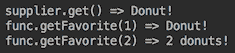

# 非静态绑定方法引用

为了演示一个非静态绑定方法引用，让我们通过添加一个`name`字段、两个构造函数和两个`String sayFavorite()`方法来增强`Food`类：

```
class Food{
     private String name;
     public Food(){ this.name = "Donut"; }
     public Food(String name){ this.name = name; }
     public static String getFavorite(){ return "Donut!"; }
     public static String getFavorite(int num){
         return num > 1 ? String.valueOf(num) + " donuts!" : "Donut!";
     }
     public String sayFavorite(){
         return this.name + (this.name.toLowerCase()
                             .contains("donut")?"? Yes!" : "? D'oh!");
     }
     public String sayFavorite(String name){
         this.name = this.name + " and " + name;
         return sayFavorite();
     }
}
```

现在，让我们创建`Food`类的三个实例：

```
Food food1 = new Food();
Food food2 = new Food("Carrot");
Food food3 = new Food("Carrot and Broccoli");
```

前面是我们现在要创建的lambda表达式周围的代码上下文。我们使用前面上下文中的局部变量来实现三个不同的供应商：

```
Supplier<String> supplier1 = () -> food1.sayFavorite();
Supplier<String> supplier2 = () -> food2.sayFavorite();
Supplier<String> supplier3 = () -> food3.sayFavorite();
```

我们使用`Supplier<T>`是因为`String`、`sayFavorite()`方法不需要任何参数，只产生（提供）`String`值。使用方法引用，我们可以按如下方式重写前面的lambda表达式：

```
Supplier<String> supplier1 = food1::sayFavorite;
Supplier<String> supplier2 = food2::sayFavorite;
Supplier<String> supplier3 = food3::sayFavorite;
```

方法`sayFavorite()`属于在特定上下文中创建的对象。换句话说，这个对象（呼叫接收方）绑定到某个上下文，这就是为什么这种方法引用被称为*绑定方法引用*或*绑定接收方方法引用*。

我们可以将新创建的函数作为任何其他对象传递，并在需要的任何位置使用它们，例如：

```
System.out.println("new Food().sayFavorite() => " + supplier1.get());
System.out.println("new Food(Carrot).sayFavorite() => " 
                                                  + supplier2.get());
System.out.println("new Food(Carrot,Broccoli).sayFavorite() => " 
                                                  + supplier3.get());
```

结果如下：

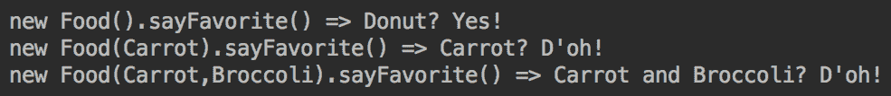

请注意，接收方仍然绑定到上下文，因此其状态可能会更改并影响输出。这就是被*束缚*的区别的意义。使用这种引用时，必须小心不要在其原始上下文中更改接收方的状态。否则，可能会导致不可预测的结果。当相同的函数可以在不同的上下文中使用时，这种考虑尤其适用于并行处理。

让我们看看另一个使用第二个非静态方法`String sayFavorite(String name)`的绑定方法引用的例子。首先，我们使用前面示例中使用的`Food`类的相同对象创建功能接口`UnaryOperator<T>`的实现：

```
UnaryOperator<String> op1 = s -> food1.sayFavorite(s);
UnaryOperator<String> op2 = s -> food2.sayFavorite(s);
UnaryOperator<String> op3 = s -> food3.sayFavorite(s);

```

我们使用`UnaryOperator<T>`函数接口的原因是`String sayFavorite(String name)`方法接受一个参数并生成相同类型的值。这就是其中名为`Operator`的功能接口的用途，以支持输入值和结果具有相同类型的情况。

方法引用允许我们更改lambda表达式，如下所示：

```
UnaryOperator<String> op1 = food1::sayFavorite;
UnaryOperator<String> op2 = food2::sayFavorite;
UnaryOperator<String> op3 = food3::sayFavorite;
```

现在，我们可以在代码中的任何位置使用前面的函数（运算符），例如：

```
System.out.println("new Food()
       .sayFavorite(Carrot) => " + op1.apply("Carrot"));
System.out.println("new Food(Carrot)
   .sayFavorite(Broccoli) => " + op2.apply("Broccoli"));
System.out.println("new Food(Carrot, Broccoli)
       .sayFavorite(Donuts) => " + op3.apply("Donuts"));
```

上述代码的结果如下：

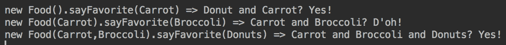

# 非静态未绑定方法引用

为了演示对`String sayFavorite()`方法的未绑定方法引用，我们将使用`Function<T,R>`功能接口，因为我们希望使用`Food`类的对象（呼叫接收器）作为参数并返回`String`值：

```
Function<Food, String> func = f -> f.sayFavorite();

```

方法引用允许我们重写前面的lambda表达式，如下所示：

```
Function<Food, String> func = Food::sayFavorite;
```

使用前面示例中创建的`Food`类的相同对象，我们在以下代码中使用新创建的函数，例如：

```
System.out.println("new Food()
              .sayFavorite() => " + func.apply(food1));
System.out.println("new Food(Carrot)
              .sayFavorite() => " + func.apply(food2));
System.out.println("new Food(Carrot, Broccoli)
              .sayFavorite() => " + func.apply(food3));
```

如您所见，参数（CallReceiver对象）与任何参数一样，仅来自当前上下文。无论函数传递到哪里，它都不携带上下文。它的接收者未绑定到用于创建函数的上下文。这就是为什么这个方法引用被称为*unbound*。

上述代码的输出如下所示：

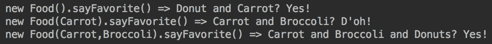

为了演示另一个未绑定方法引用的例子，我们将使用第二个方法`String sayFavorite(String name)`，使用我们一直使用的相同`Food`对象。我们这次要实现的功能接口称为`BiFunction<T,U,R>`：

```
BiFunction<Food, String, String> func = (f,s) -> f.sayFavorite(s);
```

我们选择此功能接口的原因是，它接受两个参数，这两个参数正是我们在本例中需要的，以便将接收方对象和`String`值作为参数。前面lambda表达式的方法引用版本如下所示：

```
BiFunction<Food, String, String> func = Food::sayFavorite;

```

我们可以通过编写以下代码来使用前面的函数，例如：

```
System.out.println("new Food()
  .sayFavorite(Carrot) => " + func.apply(food1, "Carrot"));
System.out.println("new Food(Carrot)
  .sayFavorite(Broccoli) => " 
                         + func2.apply(food2, "Broccoli"));
System.out.println("new Food(Carrot,Broccoli)
  .sayFavorite(Donuts) => " + func2.apply(food3,"Donuts"));

```

结果如下：

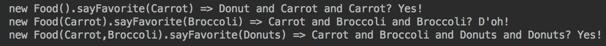

# 构造函数方法引用

为构造函数使用方法引用与静态方法引用非常类似，因为它使用类作为调用接收器，而不是对象（尚未创建）。下面是实现`Supplier<T>`接口的lambda表达式：

```
Supplier<Food> foodSupplier = () -> new Food();

```

以下是其版本和方法参考：

```
Supplier<Food> foodSupplier = Food::new;
System.out.println("new Food()
  .sayFavorite() => " + foodSupplier.get().sayFavorite());
```

如果我们运行前面的代码，我们将得到以下输出：


现在，让我们向`Food`类添加另一个构造函数：

```
public Food(String name){ 
     this.name = name; 
} 
```

完成此操作后，我们可以使用方法引用来表示前面的构造函数：

```
Function<String, Food> createFood = Food::new;
Food food = createFood.apply("Donuts");
System.out.println("new Food(Donuts).sayFavorite() => " 
                                   + food.sayFavorite());
food = createFood.apply("Carrot");
System.out.println("new Food(Carrot).sayFavorite() => " 
                                   + food.sayFavorite());
```

以下是前面代码的输出：

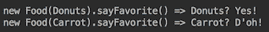

同样，我们可以添加一个具有两个参数的构造函数：

```
public Food(String name, String anotherName) {
     this.name = name + " and " + anotherName;
}
```

一旦我们这样做了，我们可以通过`BiFunction<String, String>`来表达：

```
BiFunction<String, String, Food> createFood = Food::new;
Food food = createFood.apply("Donuts", "Carrots");
System.out.println("new Food(Donuts, Carrot)
        .sayFavorite() => " + food.sayFavorite());
food = constrFood2.apply("Carrot", "Broccoli");
System.out.println("new Food(Carrot, Broccoli)
          .sayFavorite() => " food.sayFavorite());
```

上述代码的结果如下：


为了表示一个接受两个以上参数的构造函数，我们可以创建一个具有任意数量参数的自定义函数接口。例如，我们可以使用以下自定义功能接口，这是我们在前面的配方中讨论的：

```
        @FunctionalInterface
        interface Func<T1,T2,T3,R>{ R apply(T1 t1, T2 t2, T3 t3);}
```

假设我们需要使用`AClass`类：

```
class AClass{
    public AClass(int i, double d, String s){ }
    public String get(int i, double d){ return ""; }
    public String get(int i, double d, String s){ return ""; }
}
```

我们可以使用方法引用编写以下代码：

```
Func<Integer, Double, String, AClass> func1 = AClass::new;
AClass obj = func1.apply(1, 2d, "abc");

Func<Integer, Double, String, String> func2 = obj::get;    //bound
String res1 = func2.apply(42, 42., "42");

Func<AClass, Integer, Double, String> func3 = AClass::get; //unbound
String res21 = func3.apply(obj, 42, 42.);

```

在前面的代码片段中，我们创建了`func1`函数，该函数允许我们创建类`AClass`的对象。`func2`函数将使用绑定方法引用的方法`String get(int i, double d)`应用于结果对象`obj`，因为其调用接收器（对象`obj`来自特定上下文（绑定到它）。相比之下，`func3`函数被实现为未绑定的方法引用，因为它不是从上下文获取其调用接收器（类`AClass`）。

# 还有更多。。。

有几个简单但非常有用的方法参考，因为它得到了在实践中经常使用的调用接收器：

```
Function<String, Integer> strLength = String::length;
System.out.println(strLength.apply("3"));  //prints: 1

Function<String, Integer> parseInt = Integer::parseInt;
System.out.println(parseInt.apply("3"));    //prints: 3

Consumer<String> consumer = System.out::println;
consumer.accept("Hello!");             //prints: Hello!
```

还有一些使用数组和列表的有用方法：

```
Function<Integer, String[]> createArray = String[]::new;
String[] arr = createArray.apply(3);
System.out.println("Array length=" + arr.length); 

int i = 0;
for(String s: arr){ arr[i++] = String.valueOf(i); }
Function<String[], List<String>> toList = Arrays::<String>asList;
List<String> l = toList.apply(arr);
System.out.println("List size=" + l.size());
for(String s: l){ System.out.println(s); }
```

以下是上述代码的结果：

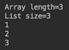

我们留给您分析前面的lambda表达式是如何创建和使用的。

# 在程序中利用lambda表达式

在本教程中，您将学习如何将lambda表达式应用于代码。我们将回到演示应用程序，并通过引入lambda表达式对其进行修改。

# 准备

配备功能接口、lambda表达式和lambda友好API设计的最佳实践，我们可以通过使其设计更加灵活和用户友好，大大提高计算应用程序的速度。让我们设置一些尽可能接近现实问题的背景，而不要使其过于复杂。

无人驾驶汽车最近成了新闻，有充分的理由相信在相当长的一段时间内它将以这种方式出现。该领域的任务之一是基于真实数据的城市交通流分析和建模。大量此类数据已经存在，并将在未来继续收集。假设我们可以按日期、时间和地理位置访问这样的数据库。我们还假设来自该数据库的交通数据是以单位表示的，每个单位捕获关于一辆车和驾驶条件的详细信息：

```
public interface TrafficUnit {
  VehicleType getVehicleType();
  int getHorsePower();
  int getWeightPounds();
  int getPayloadPounds();
  int getPassengersCount();
  double getSpeedLimitMph();
  double getTraction();
  RoadCondition getRoadCondition();
  TireCondition getTireCondition();
  int getTemperature();
} 
```

`enum`类型`VehicleType`、`RoadCondition`和`TireCondition`已经在[第二章](02.html)、*OOP快速通道*中构建：

```
enum VehicleType { 
  CAR("Car"), TRUCK("Truck"), CAB_CREW("CabCrew");
  private String type;
  VehicleType(String type){ this.type = type; }
  public String getType(){ return this.type;}
}
enum RoadCondition {
  DRY(1.0), 
  WET(0.2) { public double getTraction() { 
    return temperature > 60 ? 0.4 : 0.2; } }, 
  SNOW(0.04);
  public static int temperature;
  private double traction;
  RoadCondition(double traction){ this.traction = traction; }
  public double getTraction(){return this.traction;}
}
enum TireCondition {
  NEW(1.0), WORN(0.2);
  private double traction;
  TireCondition(double traction){ this.traction = traction; }
  public double getTraction(){ return this.traction;}
}

```

访问流量数据的界面可能如下所示：

```
TrafficUnit getOneUnit(Month month, DayOfWeek dayOfWeek, 
                       int hour, String country, String city, 
                       String trafficLight);
List<TrafficUnit> generateTraffic(int trafficUnitsNumber, 
                  Month month, DayOfWeek dayOfWeek, int hour,
                  String country, String city, String trafficLight);
```

以下是访问上述方法的示例：

```
TrafficUnit trafficUnit = FactoryTraffic.getOneUnit(Month.APRIL, 
               DayOfWeek.FRIDAY, 17, "USA", "Denver", "Main103S");
```

号码`17`是一天中的一小时（下午5点），而`Main1035`是一个交通灯标识。

对第二个方法的调用将返回多个结果：

```
List<TrafficUnit> trafficUnits = 
    FactoryTrafficModel.generateTraffic(20, Month.APRIL, 
        DayOfWeek.FRIDAY, 17, "USA", "Denver", "Main103S");
```

第一个参数`20`是请求的业务单元数。

如您所见，这样的流量工厂提供特定时间（在我们的示例中为下午5点到6点之间）特定位置的流量数据。每次呼叫工厂都会产生不同的结果，而交通单元列表描述了指定位置统计上正确的数据（包括最可能的天气条件）。

我们还将更改`FactoryVehicle`和`FactorySpeedModel`的接口，以便它们可以在`TrafficUnit`接口的基础上构建`Vehicle`和`SpeedModel`。生成的演示代码如下所示：

```
double timeSec = 10.0;
TrafficUnit trafficUnit = FactoryTraffic.getOneUnit(Month.APRIL, 
              DayOfWeek.FRIDAY, 17, "USA", "Denver", "Main103S");
Vehicle vehicle = FactoryVehicle.build(trafficUnit);
SpeedModel speedModel =  
               FactorySpeedModel.generateSpeedModel(trafficUnit);
vehicle.setSpeedModel(speedModel);
printResult(trafficUnit, timeSec, vehicle.getSpeedMph(timeSec));
```

`printResult()`方法的代码如下：

```
void printResult(TrafficUnit tu, double timeSec, double speedMph){
   System.out.println("Road " + tu.getRoadCondition()
                 + ", tires " + tu.getTireCondition() + ": " 
                              + tu.getVehicleType().getType() 
                              + " speedMph (" + timeSec + " sec)=" 
                                              + speedMph + " mph");
}
```

此代码的输出可能如下所示：


由于我们现在使用的是“真实”数据，因此该程序的每次运行都会根据数据的统计特性产生不同的结果。在某个地点，汽车或干燥天气会在该日期和时间出现得更频繁，而在另一个地点，卡车或雪会更典型。

在这次运行中，交通部门带来了一条湿路、新轮胎和`Truck`，其发动机功率和负载足以在10秒内达到22 mph的速度。我们用来计算速度的公式（在`SpeedModel`的物体内）您很熟悉：

```
double weightPower = 2.0 * horsePower * 746 * 32.174 / weightPounds;
double speed = (double) Math.round(Math.sqrt(timeSec * weightPower) 
                                                 * 0.68 * traction);
```

这里，`traction`值来自`TrafficUnit`。在实现`TrafficUnit`接口的类中，`getTraction()`方法如下所示：

```
public double getTraction() {
  double rt = getRoadCondition().getTraction();
  double tt = getTireCondition().getTraction();
  return rt * tt;
}
```

`getRoadCondition()`和`getTireCondition()`方法返回我们刚才描述的相应`enum`类型的元素。

现在，我们准备使用前面的配方中讨论的lambda表达式来改进我们的计算速度应用程序。

# 怎么做。。。

按照以下步骤学习如何使用lambda表达式：

1.  让我们开始构建一个API。我们称之为`Traffic`。如果不使用功能接口，它可能如下所示：

```
public interface Traffic {
   void speedAfterStart(double timeSec, int trafficUnitsNumber);
}  
```

其实施可如下：

```
public class TrafficImpl implements Traffic {
   private int hour;
   private Month month;
   private DayOfWeek dayOfWeek;
   private String country, city, trafficLight;
   public TrafficImpl(Month month, DayOfWeek dayOfWeek, int hour, 
                String country, String city, String trafficLight){
      this.hour = hour;
      this.city = city;
      this.month = month;
      this.country = country;
      this.dayOfWeek = dayOfWeek;
      this.trafficLight = trafficLight;
   }
   public void speedAfterStart(double timeSec, 
                                      int trafficUnitsNumber){
      List<TrafficUnit> trafficUnits = 
        FactoryTraffic.generateTraffic(trafficUnitsNumber, 
          month, dayOfWeek, hour, country, city, trafficLight);
      for(TrafficUnit tu: trafficUnits){
         Vehicle vehicle = FactoryVehicle.build(tu);
         SpeedModel speedModel = 
                      FactorySpeedModel.generateSpeedModel(tu);
         vehicle.setSpeedModel(speedModel);
         double speed = vehicle.getSpeedMph(timeSec);
         printResult(tu, timeSec, speed);
      }
   }
}
```

2.  让我们编写使用`Traffic`接口的示例代码：

```
Traffic traffic = new TrafficImpl(Month.APRIL, 
  DayOfWeek.FRIDAY, 17, "USA", "Denver", "Main103S");
double timeSec = 10.0;
int trafficUnitsNumber = 10;
traffic.speedAfterStart(timeSec, trafficUnitsNumber); 
```

我们得到的结果与以下类似：

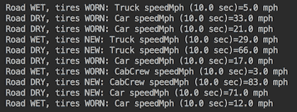

如前所述，由于我们使用的是真实数据，因此同一代码不会每次都产生完全相同的结果。人们不应该期望看到前面屏幕截图的速度值，而是一些看起来非常相似的东西。

3.  让我们使用lambda表达式。前面的API相当有限。例如，它不允许您在不更改`FactorySpeedModel`的情况下测试不同的速度计算公式。同时，`SpeedModel`接口只有一个抽象方法，称为`getSpeedMph()`（使其成为功能接口）：

```
public interface SpeedModel {
  double getSpeedMph(double timeSec, 
           int weightPounds, int horsePower);
}
```

我们可以利用`SpeedModel`作为功能接口的优势，在`Traffic`接口上增加另一种方法，可以将`SpeedModel`实现作为lambda表达式接受：

```
public interface Traffic {
  void speedAfterStart(double timeSec, 
                       int trafficUnitsNumber);
  void speedAfterStart(double timeSec, 
    int trafficUnitsNumber, SpeedModel speedModel);
}
```

问题在于`traction`值不是`getSpeedMph()`方法的参数，因此我们无法将其作为参数传递给`speedAfterStart()`方法的函数来实现。仔细查看`FactorySpeedModel.generateSpeedModel(TrafficUnit trafficUnit)`的速度计算：

```
double getSpeedMph(double timeSec, int weightPounds, 
                                           int horsePower) {
    double traction = trafficUnit.getTraction();
    double v = 2.0 * horsePower * 746 * timeSec * 
                                    32.174 / weightPounds;
    return Math.round(Math.sqrt(v) * 0.68 * traction);
}
```

如您所见，`traction`值是`speed`计算值的倍增，这是对流量单位的唯一依赖。我们可以从速度模型中删除牵引力，并在使用速度模型计算速度后应用牵引力。这意味着我们可以更改`TrafficImpl`类的`speedAfterStart()`的实现，如下所示：

```
public void speedAfterStart(double timeSec, 
           int trafficUnitsNumber, SpeedModel speedModel) {
   List<TrafficUnit> trafficUnits = 
     FactoryTraffic.generateTraffic(trafficUnitsNumber, 
       month, dayOfWeek, hour, country, city, trafficLight);
   for(TrafficUnit tu: trafficUnits){
       Vehicle vehicle = FactoryVehicle.build(tu);
       vehicle.setSpeedModel(speedModel);
       double speed = vehicle.getSpeedMph(timeSec);
       speed = (double) Math.round(speed * tu.getTraction());
       printResult(tu, timeSec, speed);
   }
}
```

此更改允许用户将`Traffic`API pass`SpeedModel`作为一个函数：

```
Traffic traffic = new TrafficImpl(Month.APRIL, 
     DayOfWeek.FRIDAY, 17, "USA", "Denver", "Main103S");
double timeSec = 10.0;
int trafficUnitsNumber = 10;
SpeedModel speedModel = (t, wp, hp) -> {
   double weightPower = 2.0 * hp * 746 * 32.174 / wp;
   return (double) Math
              .round(Math.sqrt(t * weightPower) * 0.68);
};
traffic.speedAfterStart(timeSec, trafficUnitsNumber, 
                                            speedModel);
```

4.  前面代码的结果与`FactorySpeedModel`生成`SpeedModel`时相同。但是现在API用户可以自己设计速度计算函数了。

5.  我们可以将`SpeedModel`接口注释为`@FunctionalInterface`，因此，任何试图向其添加其他方法的人都会受到尽职的警告，如果不删除此注释并意识到破坏已实现此功能接口的现有客户端的代码的风险，将无法添加其他抽象方法。
6.  我们可以通过添加各种标准来丰富API，这些标准将所有可能的流量分割成多个部分。

例如，API用户可能只想分析汽车、卡车、发动机大于300马力的汽车或发动机大于400马力的卡车。实现这一点的传统方法是创建以下方法：

```
void speedAfterStartCarEngine(double timeSec, 
              int trafficUnitsNumber, int horsePower);
void speedAfterStartCarTruckOnly(double timeSec, 
                              int trafficUnitsNumber);
void speedAfterStartEngine(double timeSec, 
         int trafficUnitsNumber, int carHorsePower, 
                                 int truckHorsePower);
```

相反，我们只需在`Traffic`接口的现有`speedAfterStart()`方法中添加标准功能接口，让API用户决定提取哪一部分流量：

```
void speedAfterStart(double timeSec, int trafficUnitsNumber,
  SpeedModel speedModel, Predicate<TrafficUnit> limitTraffic);
```

`TrafficImpl`类中的`speedAfterStart()`方法实现将更改如下：

```
public void speedAfterStart(double timeSec, 
          int trafficUnitsNumber, SpeedModel speedModel, 
                    Predicate<TrafficUnit> limitTraffic) {
  List<TrafficUnit> trafficUnits = 
    FactoryTraffic.generateTraffic(trafficUnitsNumber, 
    month, dayOfWeek, hour, country, city, trafficLight);
  for(TrafficUnit tu: trafficUnits){
      if(limitTraffic.test(tu){
         Vehicle vehicle = FactoryVehicle.build(tu);
         vehicle.setSpeedModel(speedModel);
         double speed = vehicle.getSpeedMph(timeSec);
         speed = (double) Math.round(speed * 
                                   tu.getTraction());
         printResult(tu, timeSec, speed);
      }
    }
}
```

`Traffic`API用户可以定义他们需要的流量，如下所示：

```
Predicate<TrafficUnit> limit = tu ->
  (tu.getHorsePower() < 250 
      && tu.getVehicleType() == VehicleType.CAR) || 
  (tu.getHorsePower() < 400 
      && tu.getVehicleType() == VehicleType.TRUCK);
traffic.speedAfterStart(timeSec, 
            trafficUnitsNumber, speedModel, limit);
```

结果现在仅限于发动机小于250`hp`的汽车和发动机小于400`hp`的卡车：

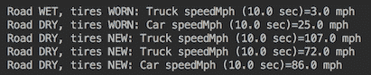

事实上，`Traffic`API用户现在可以应用任何限制流量的标准，只要这些标准适用于`TrafficUnit`对象中的值。例如，用户可以编写以下内容：

```
Predicate<TrafficUnit> limitTraffic = 
 tu -> tu.getTemperature() > 65 
 && tu.getTireCondition() == TireCondition.NEW 
 && tu.getRoadCondition() == RoadCondition.WET;
```

或者，他们可以对来自`TrafficUnit`的值写入任何其他限制组合。如果用户决定取消限制并分析所有流量，此代码也将执行此操作：

```
traffic.speedAfterStart(timeSec, trafficUnitsNumber, 
                              speedModel, tu -> true);
```

7.  如果需要按速度选择交通单位，我们可以在速度计算后应用谓词标准（注意我们如何将`Predicate`替换为`BiPredicate`，因为我们现在需要使用两个参数）：

```
public void speedAfterStart(double timeSec,  
           int trafficUnitsNumber, SpeedModel speedModel,
             BiPredicate<TrafficUnit, Double> limitSpeed){
   List<TrafficUnit> trafficUnits = 
     FactoryTraffic.generateTraffic(trafficUnitsNumber, 
     month, dayOfWeek, hour, country, city, trafficLight);
   for(TrafficUnit tu: trafficUnits){
      Vehicle vehicle = FactoryVehicle.build(tu);
      vehicle.setSpeedModel(speedModel);
      double speed = vehicle.getSpeedMph(timeSec);
      speed = (double) Math.round(speed*tu.getTraction());
      if(limitSpeed.test(tu, speed)){
           printResult(tu, timeSec, speed);
      }
   }
}
```

`Traffic`API用户现在可以编写以下代码：

```
BiPredicate<TrafficUnit, Double> limit = (tu, sp) ->
   (sp > (tu.getSpeedLimitMph() + 8.0) && 
          tu.getRoadCondition() == RoadCondition.DRY) || 
   (sp > (tu.getSpeedLimitMph() + 5.0) && 
          tu.getRoadCondition() == RoadCondition.WET) || 
    (sp > (tu.getSpeedLimitMph() + 0.0) && 
           tu.getRoadCondition() == RoadCondition.SNOW);
traffic.speedAfterStart(timeSec, 
                 trafficUnitsNumber, speedModel, limit);
```

上面的谓词选择超过速度限制超过一定量的交通单位（不同的驾驶条件不同）。如果需要，它可以完全忽略速度，并以与前面谓词完全相同的方式限制流量。这种实现的唯一缺点是效率稍低，因为谓词是在速度计算之后应用的。这意味着将对每个生成的交通单元进行速度计算，而不是像以前的实施中那样，对数量进行限制。如果这是一个问题，您可能会留下我们在此配方中讨论的所有不同签名：

```
public interface Traffic {
   void speedAfterStart(double timeSec, int trafficUnitsNumber);
   void speedAfterStart(double timeSec, int trafficUnitsNumber,
                                         SpeedModel speedModel);
   void speedAfterStart(double timeSec, 
            int trafficUnitsNumber, SpeedModel speedModel, 
                           Predicate<TrafficUnit> limitTraffic);
   void speedAfterStart(double timeSec, 
             int trafficUnitsNumber, SpeedModel speedModel,
                  BiPredicate<TrafficUnit,Double> limitTraffic);
}
```

通过这种方式，API用户决定使用哪种方法更灵活或更高效，并决定默认速度计算实现是否可接受。

# 还有更多。。。

到目前为止，我们还没有让API用户选择输出格式。目前按`printResult()`方式实施：

```
void printResult(TrafficUnit tu, double timeSec, double speedMph) {
  System.out.println("Road " + tu.getRoadCondition() +
                  ", tires " + tu.getTireCondition() + ": " 
                     + tu.getVehicleType().getType() + " speedMph (" 
                     + timeSec + " sec)=" + speedMph + " mph");
}
```

为了使其更加灵活，我们可以在API中添加另一个参数：

```
Traffic traffic = new TrafficImpl(Month.APRIL, DayOfWeek.FRIDAY, 17,
                                        "USA", "Denver", "Main103S");
double timeSec = 10.0;
int trafficUnitsNumber = 10;
BiConsumer<TrafficUnit, Double> output = (tu, sp) ->
  System.out.println("Road " + tu.getRoadCondition() + 
                  ", tires " + tu.getTireCondition() + ": " 
                     + tu.getVehicleType().getType() + " speedMph (" 
                     + timeSec + " sec)=" + sp + " mph");
traffic.speedAfterStart(timeSec, trafficUnitsNumber, speedModel, output);
```

请注意，`timeSec`值不是函数参数之一，而是函数的封闭范围。我们可以这样做，因为它在整个计算过程中保持不变（并且可以有效地是最终的）。同样，我们可以向`output`函数添加任何其他对象—例如文件名或其他输出设备，从而将所有与输出相关的决策留给API用户。为适应此新功能，API实现更改为：

```
public void speedAfterStart(double timeSec, int trafficUnitsNumber,
        SpeedModel speedModel, BiConsumer<TrafficUnit, Double> output) {
  List<TrafficUnit> trafficUnits = 
     FactoryTraffic.generateTraffic(trafficUnitsNumber, month, 
                      dayOfWeek, hour, country, city, trafficLight);
  for(TrafficUnit tu: trafficUnits){
     Vehicle vehicle = FactoryVehicle.build(tu);
     vehicle.setSpeedModel(speedModel);
     double speed = vehicle.getSpeedMph(timeSec);
     speed = (double) Math.round(speed * tu.getTraction());
     output.accept(tu, speed);
  }
}
```

我们花了一段时间才到达这一点，函数式编程的力量开始显现，并证明学习它的努力是正确的。然而，如下一章所述，当用于处理流时，lambda表达式会产生更强大的功能。