# 流和管道

在 Java8 和 Java9 中，CollectionsAPI 通过利用 lambda 表达式引入流和内部迭代进行了重大的改头换面。在 Java10（JDK18.3）中，添加了新方法-`List.copyOf`、`Set.copyOf`和`Map.copyOf`，允许我们从现有实例创建新的不可变集合。此外，新方法`toUnmodifiableList`、`toUnmodifiableSet`和`toUnmodifiableMap`被添加到`java.util.stream`包中的`Collectors`类中，允许将`Stream`中的元素收集到一个不可变的集合中。本章介绍如何使用流和链多个操作来创建管道。此外，读者还将了解如何并行完成这些操作。配方列表包括以下内容：

*   使用`of()`和`copyOf()`工厂方法创建不可变集合
*   创建和操作流
*   使用数字流进行算术运算
*   通过生成集合来完成流
*   通过生成地图来完成流
*   通过分组流元素完成流
*   创建流操作管道
*   并行流

# 介绍

上一章中描述和演示的 Lambda 表达式是在 Java8 中介绍的。与函数接口一起，他们向 Java 添加了函数编程功能，允许将行为（函数）作为参数传递到为数据处理性能而优化的库中。通过这种方式，应用程序程序员可以专注于所开发系统的业务方面，将性能方面留给库的作者专家。

这种库的一个例子是`java.util.stream`包，这将是本章的重点。该包允许您对随后可以应用于数据的过程进行声明性表示，也可以并行应用；这些过程以流的形式呈现，流是`Stream`接口的对象。为了更好地从传统集合过渡到流，在`java.util.Collection`接口中添加了两种默认方法`stream()`和`parallelStream()`，同时在`Stream`接口中添加了流生成的新工厂方法。

这种方法利用了聚合的能力，如第 2 章“OOP 快速通道——类和接口”中所述。与其他设计原则（封装、接口和多态）一起，它促进了高度可扩展和灵活的设计，而 lambda 表达式允许您以简洁的方式实现它。

如今，当海量数据处理和操作微调的机器学习需求变得无处不在时，这些新特性加强了 Java 在几种现代编程语言中的地位。

# 使用`of()`和`copyOf()`工厂方法创建不可变集合

在本食谱中，我们将回顾创建集合的传统方法，并将它们与 Java9 附带的`List.of()`、`Set.of()`、`Map.of()`和`Map.ofEntries()`工厂方法以及 Java10 附带的`List.copyOf()`、`Set.copyOf()`和`Map.copyOf()`方法进行比较。

# 准备

在 Java9 之前，有几种创建集合的方法。以下是创建`List`最常用的方法：

```java
List<String> list = new ArrayList<>();
list.add("This ");
list.add("is ");
list.add("built ");
list.add("by ");
list.add("list.add()");
list.forEach(System.out::print);
```

如果我们运行前面的代码，我们会得到以下结果：

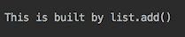

创建`List`集合的较短方法是从数组开始：

```java
Arrays.asList("This ", "is ", "created ", "by ", 
              "Arrays.asList()").forEach(System.out::print);
```

结果如下：

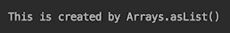

以前创建的`Set`集合类似：

```java
Set<String> set = new HashSet<>();
set.add("This ");
set.add("is ");
set.add("built ");
set.add("by ");
set.add("set.add() ");
set.forEach(System.out::print);
```

或者，我们可以从一个数组开始构建`Set`：

```java
new HashSet<>(Arrays.asList("This ", "is ", "created ", "by ", 
                            "new HashSet(Arrays.asList()) "))
                            .forEach(System.out::print);
```

下面是最后两个示例的结果说明：

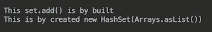

请注意，与`List`不同，`Set`中元素的顺序没有保留。它取决于哈希代码的实现，可以在不同的计算机之间进行更改。但在同一台计算机上运行之间的顺序保持不变。请注意最后一个事实，因为我们稍后会再讨论。

这就是我们在 Java 9 之前创建`Map`的方式：

```java
Map<Integer, String> map = new HashMap<>();
map.put(1, "This ");
map.put(2, "is ");
map.put(3, "built ");
map.put(4, "by ");
map.put(5, "map.put() ");
map.entrySet().forEach(System.out::print);
```

上述代码的输出如下所示：

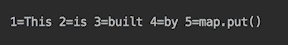

尽管前面的输出保留了元素的顺序，但不能保证`Map`的顺序，因为它基于`Set`中收集的键。

那些不得不以这种方式创建集合的人通常会欣赏 JDK 增强建议 269（JEP 269）“集合的便利工厂方法”，其中指出，

“Java 经常因其冗长而受到批评，其目标是在集合接口上提供静态工厂方法，以创建紧凑、不可修改的集合实例。”

为了回应批评和建议，Java 9 为 3 个接口中的每一个引入了 12 个`of()`静态工厂方法—`List`、`Set`和`Map`。以下是`List`的工厂方法：

```java
static <E> List<E> of()  //Returns list with zero elements
static <E> List<E> of(E e1) //Returns list with one element
static <E> List<E> of(E e1, E e2)  //etc
static <E> List<E> of(E e1, E e2, E e3)
static <E> List<E> of(E e1, E e2, E e3, E e4)
static <E> List<E> of(E e1, E e2, E e3, E e4, E e5)
static <E> List<E> of(E e1, E e2, E e3, E e4, E e5, E e6)
static <E> List<E> of(E e1, E e2, E e3, E e4, E e5, E e6, E e7)
static <E> List<E> of(E e1, E e2, E e3, E e4, E e5, 
                                        E e6, E e7, E e8)
static <E> List<E> of(E e1, E e2, E e3, E e4, E e5, 
                                  E e6, E e7, E e8, E e9)
static <E> List<E> of(E e1, E e2, E e3, E e4, E e5, 
                            E e6, E e7, E e8, E e9, E e10)
static <E> List<E> of(E... elements)
```

如 [JEP 269](http://openjdk.java.net/jeps/269) 所述，针对性能优化了具有固定数量元素的 10 种重载工厂方法，这些方法

“*避免**varargs 调用所产生的阵列分配、初始化和垃圾收集开销。*

 *使用`of()`工厂方法使代码更加紧凑：

```java
List.of("This ", "is ", "created ", "by ", "List.of()")
                                            .forEach(System.out::print);
System.out.println();
Set.of("This ", "is ", "created ", "by ", "Set.of() ")
                                            .forEach(System.out::print);
System.out.println();
Map.of(1, "This ", 2, "is ", 3, "built ", 4, "by ", 5,"Map.of() ")
                                 .entrySet().forEach(System.out::print);
```

添加了`System.out.println()`语句以在结果之间插入一个换行符：

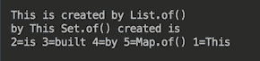

`Map`界面中的 12 种静态工厂方法中有一种不同于其他`of()`方法：

```java
Map<K,V> ofEntries(Map.Entry<K,V>... entries)
```

以下是其用法示例：

```java
Map.ofEntries(
  entry(1, "This "),
  entry(2, "is "),
  entry(3, "built "),
  entry(4, "by "),
  entry(5, "Map.ofEntries() ")
).entrySet().forEach(System.out::print);
```

它产生以下输出：

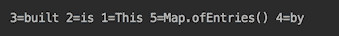

对于无限数量的元素，没有`Map.of()`工厂方法。创建包含 10 个以上元素的地图时，必须使用`Map.ofEntries()`。

在 Java10 中，引入了`List.copyOf()`、`Set.copyOf()`和`Map.copyOf()`方法。它们允许我们将任何集合转换为相应类型的不可变集合。

# 怎么做。。。

正如我们已经提到的，`Set.of()`、`Map.of()`和`Map.ofEntries()`方法不保留集合元素的顺序。这与之前（Java 9 之前）的`Set`和`Map`行为实例不同，它们在同一台计算机上运行时保持相同的顺序。`Set.of()`、`Map.of()`和`Map.ofEntries()`方法甚至在同一台计算机上也会在运行之间更改元素的顺序。无论集合迭代多少次，顺序仅在同一次运行期间保持不变。在同一台计算机上，将元素的顺序从一次运行更改为另一次运行可以帮助程序员避免对特定顺序的不必要依赖。

由`List`、`Set`和`Map`接口的`of()`静态方法生成的集合的另一个特征是它们的不变性。这是什么意思？考虑以下代码：

```java
List<String> list = List.of("This ", "is ", "immutable");
list.add("Is it?");     //throws UnsupportedOperationException
list.set(1, "is not "); //throws UnsupportedOperationException
```

如您所见，任何添加新元素或修改使用`List.of()`方法创建的集合的现有元素的尝试都会导致`java.lang.UnsupportedOperationException`运行时异常。

另外，`List.of()`方法不接受`null`元素，因此下面的代码抛出`java.lang.NullPointerException`运行时异常：

```java
List<String> list = List.of("This ", "is ", "not ", "created ", null);
```

由`Set.of()`和`Map.of()`创建的集合与前面描述的方法`List.of()`具有相同的行为：

```java
Set<String> set = Set.of("a", "b", "c");
//set.remove("b");  //UnsupportedOperationException
//set.add("e");     //UnsupportedOperationException
//set = Set.of("a", "b", "c", null); //NullPointerException

Map<Integer, String> map = Map.of(1, "one", 2, "two", 3, "three");
//map.remove(2);                    //UnsupportedOperationException
//map.put(5, "five ");              //UnsupportedOperationException
//map = Map.of(1, "one", 2, "two", 3, null); //NullPointerException
//map = Map.ofEntries(entry(1, "one"), null); //NullPointerException

```

`List.copyOf()`、`Set.copyOf()`和`Map.copyOf()`方法提供了另一种基于另一个集合创建不可变集合的方法：

```java
List<Integer> list = Arrays.asList(1,2,3);
list = List.copyOf(list);
//list.set(1, 0);     //UnsupportedOperationException
//list.remove(1);     //UnsupportedOperationException

Set<Integer> setInt = Set.copyOf(list);
//setInt.add(42);       //UnsupportedOperationException
//setInt.remove(3);  //UnsupportedOperationException

Set<String> set = new HashSet<>(Arrays.asList("a","b","c"));
set = Set.copyOf(set);
//set.add("d");     //UnsupportedOperationException
//set.remove("b");  //UnsupportedOperationException

Map<Integer, String> map = new HashMap<>();
map.put(1, "one ");
map.put(2, "two ");
map = Map.copyOf(map);
//map.remove(2);          //UnsupportedOperationException
//map.put(3, "three ");    //UnsupportedOperationException

```

请注意，输入参数可以是具有相同类型元素的任何集合，也可以是扩展传入集合的元素类型的类型：

```java
class A{}
class B extends A{}

List<A> listA = Arrays.asList(new B(), new B());
Set<A> setA = new HashSet<>(listA);

List<B> listB = Arrays.asList(new B(), new B());
setA = new HashSet<>(listB);

//List<B> listB = Arrays.asList(new A(), new A()); //compiler error
//Set<B> setB = new HashSet<>(listA);              //compiler error

```

# 还有更多。。。

在 lambda 表达式和流被引入后不久，非空值和不变性被强制执行，这不是偶然的。正如您将在后续配方中看到的，函数式编程和流管道鼓励流畅的编码风格（使用方法链接，以及在本配方示例中使用`forEach()`方法）。Fluent 样式提供了更紧凑、可读性更强的代码。不需要检查`null`值有助于保持紧凑，并专注于主要处理过程。

不变性特性反过来与 lambda 表达式使用的变量的`finale`概念非常一致。例如，可变集合允许我们绕过此限制：

```java
List<Integer> list = Arrays.asList(1,2,3,4,5);
list.set(2, 0);
list.forEach(System.out::print);  //prints: 12045

list.forEach(i -> {
  int j = list.get(2);
  list.set(2, j + 1);
});
System.out.println();
list.forEach(System.out::print);   //prints: 12545
```

在前面的代码中，第二个`forEach()`操作使用的 lambda 表达式在原始列表的第三个（索引为 2）元素中保持状态。它可以有意或无意地在 lambda 表达式中引入状态，并在不同的上下文中导致相同函数的不同结果。这在并行处理中尤其危险，因为无法预测每个可能上下文的状态。这就是为什么集合的不变性是一个有益的补充，它使代码更加健壮和可靠。

# 创建和操作流

在此配方中，我们将描述如何创建流，以及如何将操作应用于流发出的元素。讨论和示例适用于任何类型的流，包括专用数字流：`IntStream`、`LongStream`和`DoubleStream`。由于下一个配方“使用数字流进行算术运算”中描述了数字流的特定行为，因此没有给出该行为。

# 准备

创建流的方法有很多：

*   `java.util.Collection`接口的`stream()`和`parallelStream()`方法这意味着所有子接口，包括`Set`和`List`也有这些方法
*   `java.util.Arrays`类的两个重载`stream()`方法，将数组和子数组转换为流
*   `java.util.stream.Stream`接口的`of()`、`generate()`和`iterate()`方法
*   `java.nio.file.Files`类的`Stream<Path> list()`、`Stream<String> lines()`和`Stream<Path> find()`方法
*   `java.io.BufferedReader`类的`Stream<String> lines()`方法

创建流后，可以对其元素应用各种方法（称为操作）。流本身不存储数据。相反，它根据需要从源获取数据（并向操作提供或发送数据）。这些操作可以使用 fluent 样式形成管道，因为许多中间操作也可以返回流。这种操作称为*中间*操作。中间操作的示例包括：

*   `map()`：根据函数变换元素
*   `flatMap()`：根据函数将每个元素转换成流
*   `filter()`：仅选择符合条件的元素
*   `limit()`：将流限制为指定数量的元素
*   `sorted()`：将未排序的流转换为已排序的流
*   `distinct()`：删除重复项
*   `Stream`接口返回`Stream`的其他方法

管道以**终端操作**结束。流元素的处理实际上仅在执行终端操作时开始。然后，所有中间操作（如果存在）开始处理，流关闭，并且在终端操作完成执行之前无法重新打开。终端操作的示例包括：

*   `forEach()`
*   `findFirst()`
*   `reduce()`
*   `collect()`
*   `Stream`接口其他不返回`Stream`的方式

终端操作返回结果或产生副作用，但不返回`Stream`对象。

所有的`Stream`操作都支持并行处理，这在多核计算机上处理大量数据的情况下尤其有用。所有 Java 流 API 接口和类都在`java.util.stream`包中。

在这个配方中，我们将演示顺序流。并行流处理没有太大区别。只需注意处理管道不会使用在不同处理环境中可能不同的上下文状态。我们将在本章后面的另一个配方中讨论并行处理。

# 怎么做。。。

在配方的这一部分中，我们将介绍创建流的方法。实现`Set`接口或`List`接口的每个类都有`stream()`方法和`parallelStream()`方法，返回`Stream`接口的实例：

1.  考虑下面的流创建示例：

```java
List.of("This", "is", "created", "by", "List.of().stream()")
                            .stream().forEach(System.out::print);
System.out.println();
Set.of("This", "is", "created", "by", "Set.of().stream()")
                            .stream().forEach(System.out::print);
System.out.println();
Map.of(1, "This ", 2, "is ", 3, "built ", 4, "by ", 5,
                             "Map.of().entrySet().stream()")
                 .entrySet().stream().forEach(System.out::print);
```

我们使用 fluent 样式使代码更加紧凑和插入`System.out.println()`，以便在输出中开始一行新代码。

2.  运行前面的示例，您将看到以下结果：

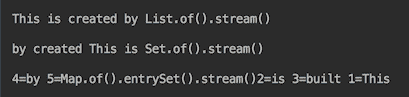

请注意，`List`保留元素的顺序，而`Set`元素的顺序在每次运行时都会更改。后者有助于在订单未得到保证的情况下，根据对特定订单的依赖发现缺陷。

3.  请看`Arrays`类的 Javadoc。它有两种`stream()`重载静态方法：

```java
Stream<T> stream(T[] array)
Stream<T> stream(T[] array, int startInclusive, int endExclusive)
```

4.  请举例说明最后两种方法的用法：

```java
String[] array = {"That ", "is ", "an ", "Arrays.stream(array)"};
Arrays.stream(array).forEach(System.out::print);
System.out.println();
String[] array1 = { "That ", "is ", "an ", 
                                    "Arrays.stream(array,0,2)" };
Arrays.stream(array1, 0, 2).forEach(System.out::print);
```

5.  运行它并查看结果：

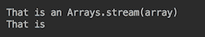

请注意，在第二个示例中，只有索引为`0`和`1`的前两个元素被选择为包含在流中，这是预期的。

6.  打开`Stream`界面的 Javadoc，查看`of()`、`generate()`、`iterate()`静态工厂方法：

```java
Stream<T> of(T t)          //Stream of one element
Stream<T> ofNullable(T t)  //Stream of one element
       // if not null. Otherwise, returns an empty Stream
Stream<T> of(T... values)
Stream<T> generate(Supplier<T> s)
Stream<T> iterate(T seed, UnaryOperator<T> f)
Stream<T> iterate(T seed, Predicate<T> hasNext, 
                           UnaryOperator<T> next)
```

前两种方法很简单，所以我们跳过了它们的演示，从第三种方法开始，`of()`。它可以接受数组或逗号分隔的元素。

7.  编写如下示例：

```java
String[] array = { "That ", "is ", "a ", "Stream.of(array)" };
Stream.of(array).forEach(System.out::print); 
System.out.println();
Stream.of( "That ", "is ", "a ", "Stream.of(literals)" )
                                  .forEach(System.out::print);
```

8.  运行并观察输出：

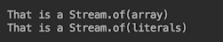

9.  将`generate()`和`iterate()`方法的用法举例如下：

```java
Stream.generate(() -> "generated ")
                           .limit(3).forEach(System.out::print);
System.out.println();
System.out.print("Stream.iterate().limit(10): ");
Stream.iterate(0, i -> i + 1)
                          .limit(10).forEach(System.out::print);
System.out.println();
System.out.print("Stream.iterate(Predicate < 10): ");
Stream.iterate(0, i -> i < 10, i -> i + 1)
                                    .forEach(System.out::print);
```

我们必须对前两个示例生成的流的大小进行限制。否则，它们将是无限的。第三个示例接受一个谓词，该谓词提供了迭代何时必须停止的标准。

10.  运行示例并观察结果：

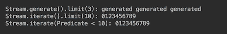

11.  让我们看一下`Files.list(Path dir)`方法的示例，它返回目录中所有条目的`Stream<Path>`：

```java
System.out.println("Files.list(dir): ");
Path dir = FileSystems.getDefault()
  .getPath("src/main/java/com/packt/cookbook/ch05_streams/");
try(Stream<Path> stream = Files.list(dir)) {
      stream.forEach(System.out::println);
} catch (Exception ex){ 
      ex.printStackTrace(); 
}
```

以下内容来自 JDK API：

“必须在`try-with-resources`语句或类似的控制结构中使用此方法，以确保在流的操作完成后立即关闭流的打开目录。”

这就是我们所做的；我们使用了 try with resources 语句。或者，我们可以使用 try-catch-finally 构造，关闭 finally 块中的流，结果不会改变。

12.  运行前面的示例并观察输出：

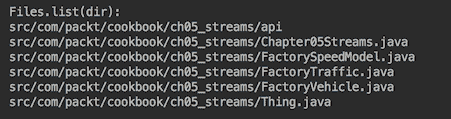

并非所有流都必须显式关闭，尽管`Stream`接口扩展了`AutoCloseable`，并且人们希望所有流都必须使用 try with resources 语句自动关闭。但事实并非如此。[`Stream`接口的 Javadoc](https://docs.oracle.com/javase/8/docs/api/java/util/stream/Stream.html) 表示，

“流有一个`BaseStream.close()`方法并实现`AutoCloseable`。大多数流实例在使用后实际上不需要关闭，因为它们由集合、数组或生成函数支持，不需要特殊的资源管理。通常，只有源为 I/O 通道的流，例如`Files.lines(Path)`返回的流。”，将需要关闭。”

这意味着程序员必须知道流的源代码，因此如果源代码的 API 需要，请确保流已关闭。

13.  写一个`Files.lines()`方法用法的例子：

```java
  System.out.println("Files.lines().limit(3): ");
  String file = "src/main/java/com/packt/cookbook/" +
                              "ch05_streams/Chapter05Streams.java";
  try(Stream<String> stream=Files.lines(Paths.get(file)).limit(3)){ 
       stream.forEach(l -> { 
            if( l.length() > 0 ) {
                System.out.println("   " + l); 
            }
       });
  } catch (Exception ex){ 
      ex.printStackTrace(); 
  }
```

前面示例的目的是读取指定文件的前三行，并以三个空格的缩进打印非空行。

14.  运行前面的示例并查看结果：

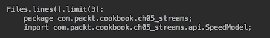

15.  编写使用`Files.find()`方法的代码：

```java
Stream<Path> find(Path start, int maxDepth, BiPredicate<Path, 
    BasicFileAttributes> matcher, FileVisitOption... options)
```

16.  与前一种情况类似，`Files.find()`方法生成的流也必须显式关闭。`Files.find()`方法遍历以给定起始文件和请求深度为根的文件树，并返回匹配谓词（包括文件属性）的文件路径。编写以下代码：

```java
Path dir = FileSystems.getDefault()
 .getPath("src/main/java/com/packt/cookbook/ch05_streams/");
BiPredicate<Path, BasicFileAttributes> select = 
   (p, b) -> p.getFileName().toString().contains("Factory");
try(Stream<Path> stream = Files.find(f, 2, select)){
        stream.map(path -> path.getFileName())
                              .forEach(System.out::println);
} catch (Exception ex){ 
   ex.printStackTrace(); 
}
```

17.  运行前面的示例，您将获得以下输出：

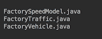

如有必要，`FileVisitorOption.FOLLOW_LINKS`可以作为`Files.find()`方法的最后一个参数，如果我们需要执行搜索，该搜索将跟踪它可能遇到的所有符号链接。

18.  使用`BufferedReader.lines()`方法返回从文件读取的`Stream<String>`行的要求有点不同。根据 [Javadoc](https://docs.oracle.com/javase/8/docs/api/java/io/BufferedReader.html)，在执行终端流操作期间，不能对读取器进行操作。否则，终端流操作的结果是未定义的

JDK 中还有许多其他方法可以生成流。但它们更专业，由于空间不足，我们不会在这里演示它们。

# 它是如何工作的。。。

在前面的示例中，我们已经演示了几个流操作，这些流操作已经包含在`Stream`接口的方法中。我们经常使用`forEach()`和`limit()`几次。第一个是终端操作，第二个是中间操作。现在我们来看一下`Stream`接口的其他方法。

以下是返回`Stream`且可以流畅连接的中间操作方法：

```java
//1
Stream<T> peek(Consumer<T> action)
//2
Stream<T> distinct()       //Returns stream of distinct elements
Stream<T> skip(long n)     //Discards the first n elements 
Stream<T> limit(long n)    //Allows the first n elements to be processed 
Stream<T> filter(Predicate<T> predicate)
Stream<T> dropWhile(Predicate<T> predicate) 
Stream<T> takeWhile(Predicate<T> predicate)
//3 
Stream<R> map(Function<T, R> mapper)
IntStream mapToInt(ToIntFunction<T> mapper)
LongStream mapToLong(ToLongFunction<T> mapper)
DoubleStream mapToDouble(ToDoubleFunction<T> mapper)
//4
Stream<R> flatMap(Function<T, Stream<R>> mapper)
IntStream flatMapToInt(Function<T, IntStream> mapper)
LongStream flatMapToLong(Function<T, LongStream> mapper)
DoubleStream flatMapToDouble(Function<T, DoubleStream> mapper)
//5
static Stream<T> concat(Stream<T> a, Stream<T> b) 
//6
Stream<T> sorted()
Stream<T> sorted(Comparator<T> comparator)
```

上述方法的签名通常包括输入参数的`"? super T"`和结果的`"? extends R"`（形式定义见 Javadoc）。我们通过删除这些符号来简化它们，以便更好地概述方法的多样性和通用性。作为补偿，我们想重述相关泛型符号的含义，因为它们在流 API 中被广泛使用，并且可能会引起混淆。

让我们看看`flatMap()`方法的正式定义，因为它包含了所有这些：

```java
<R> Stream<R> flatMap(Function<? super T,
                      ? extends Stream<? extends R>> mapper)
```

方法前面的`<R>`符号向编译器表明它是一个泛型方法（具有自己类型参数的方法）。如果没有它，编译器将寻找`R`类型的定义。`T`类型未列在方法前面，因为它包含在`Stream<T>`接口定义中（请查看声明接口的页面顶部）。`? super T`符号表示此处允许使用`T`类型或其超类。`? extends R`符号表示此处允许使用`R`类型或其子类。同样适用于`? extends Stream<...>`：此处允许使用`Stream`类型或其子类。

现在，让我们回到中间操作的（简化）列表。我们根据相似性将其分为几个组：

*   第一组只包含一个`peek()`方法，它允许您将`Consumer`函数应用于每个流元素，而不会影响元素，因为`Consumer`函数不返回任何内容。它通常用于调试：

```java
       int sum = Stream.of( 1,2,3,4,5,6,7,8,9 )
                       .filter(i -> i % 2 != 0)
                       .peek(i -> System.out.print(i))
                       .mapToInt(Integer::intValue)
                       .sum();
       System.out.println("sum = " + sum);
```

如果执行上述代码，结果如下：

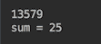

*   在上面列出的第二组中间操作中，前三个-`distinct()`、`skip()`、`limit()`是不言自明的。`filter(Predicate p)`方法是最常用的方法之一。它会按照其名称从流中删除那些与作为`Predicate`函数传入的标准不匹配的元素。我们在前面的代码片段中看到了它的用法示例：只允许奇数通过过滤器。只要满足条件，`dropWhile()`方法就会丢弃元素（然后允许流元素的其余部分流向下一个操作）。`takeWhile()`方法正好相反，只要满足标准，它允许元素流动（然后丢弃其余元素）。以下是这些操作的使用示例：

```java
System.out.println("Files.lines().dropWhile().takeWhile():");
String file = "src/main/java/com/packt/cookbook/" + 
                        "ch05_streams/Chapter05Streams.java";
try(Stream<String> stream = Files.lines(Paths.get(file))){
    stream.dropWhile(l -> 
                  !l.contains("dropWhile().takeWhile()"))
        .takeWhile(l -> !l.contains("} catc" + "h"))
        .forEach(System.out::println);
} catch (Exception ex){ 
    ex.printStackTrace(); 
}   
```

此代码读取存储前面代码的文件。我们希望它先打印`"Files.lines().dropWhile().takeWhile():"`，然后打印除最后三行之外的所有前面的行。因此，前面的代码丢弃文件中所有没有`dropWhile().takeWhile()`子字符串的第一行，然后允许所有行流动，直到找到`} catch`子字符串。

请注意，我们必须编写`"} catc" + "h"`而不是`"} catch"`。否则，代码将找到`contains(" catch")`并且不会继续。

上述代码的结果如下所示：

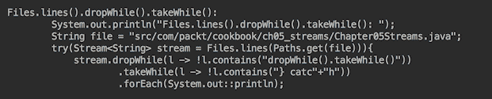

*   `map()`操作组也非常简单。这样的操作通过向流中的每个元素应用作为参数传入的函数来转换流中的每个元素。我们已经看到了一个使用`mapToInt()`方法的示例。下面是`map()`操作的另一个示例：

```java
Stream.of( "That ", "is ", "a ", "Stream.of(literals)" )
              .map(s -> s.contains("i"))
              .forEach(System.out::println);
```

在本例中，我们将`String`文本转换为`boolean`。结果如下：

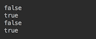

*   下一组中间操作称为`flatMap()`，提供更复杂的处理。`flatMap()`操作将传入函数（返回流）应用于每个元素，以便该操作可以生成由从每个元素提取的流组成的流。下面是一个`flatMap()`用法的示例：

```java
Stream.of( "That ", "is ", "a ", "Stream.of(literals)" )
     .filter(s -> s.contains("Th"))
     .flatMap(s -> Pattern.compile("(?!^)").splitAsStream(s))
     .forEach(System.out::print);
```

前面的代码仅从流元素中选择包含`Th`的文本，并将其转换为字符流，然后由`forEach()`打印出来。结果如下：

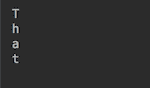

*   `concat()`方法从两个输入流创建一个流，以便第一个流的所有元素后面跟着第二个流的所有元素。以下是此功能的一个示例：

```java
Stream.concat(Stream.of(4,5,6), Stream.of(1,2,3))
                                  .forEach(System.out::print);
```

结果如下：


如果有两个以上的流串联，可以编写以下代码：

```java
Stream.of(Stream.of(4,5,6), Stream.of(1,2,3), Stream.of(7,8,9))
 .flatMap(Function.identity())
 .forEach(System.out::print);
```

结果如下：


注意，在前面的代码中，`Function.identity()`是一个返回其输入参数的函数。我们之所以使用它，是因为我们不需要转换输入流，只需按原样将它们传递给结果流。如果不使用此`flatMap()`操作，流将由`Stream`对象组成，而不是由它们的元素组成，并且输出将显示`java.util.stream.ReferencePipeline$Head@548b7f67java.util.stream.ReferencePipeline$Head@7ac7a4e4 java.util.stream.ReferencePipeline$Head@6d78f375`。

*   最后一组中间操作由`sorted()`方法组成，这些方法按照自然顺序（如果是`Comparable`类型）或根据传入的`Comparator`对象对流元素进行排序。这是一个有状态操作（以及`distinct()`、`limit()`和`skip()`），在并行处理的情况下产生非确定性结果（即下面配方“并行流”的主题）。

现在，让我们看看终端操作（我们也通过删除`? super T`和`? extends R`简化了它们的签名）：

```java
//1
long count()                     //Returns total count of elements
//2
Optional<T> max(Comparator<T> c) //Returns max according to Comparator
Optional<T> min(Comparator<T> c) //Returns min according to Comparator
//3
Optional<T> findAny()    //Returns any or empty Optional
Optional<T> findFirst()  //Returns the first element or empty Optional 
//4
boolean allMatch(Predicate<T> p)   //All elements match Predicate?
boolean anyMatch(Predicate<T> p)   //Any element matches Predicate?
boolean noneMatch(Predicate<T> p)  //No element matches Predicate?
//5
void forEach(Consumer<T> action)   //Apply action to each element 
void forEachOrdered(Consumer<T> action) 
//6
Optional<T> reduce(BinaryOperator<T> accumulator) 
T reduce(T identity, BinaryOperator<T> accumulator) 
U reduce(U identity, BiFunction<U,T,U> accumulator, 
                                          BinaryOperator<U> combiner) 
//7
R collect(Collector<T,A,R> collector) 
R collect(Supplier<R> supplier, BiConsumer<R,T> accumulator, 
                                            BiConsumer<R,R> combiner) 
//8
Object[] toArray() 
A[] toArray(IntFunction<A[]> generator)
```

前四组是不言自明的，但我们需要对`Optional`说几句话。[Javadoc](https://docs.oracle.com/javase/8/docs/api/java/util/Optional.html) 定义为：

一个容器对象，它可能包含也可能不包含非空值。如果存在值，`isPresent()`返回`true`，而`get()`返回该值

它允许你避开`NullPointerException`或检查`null`（好吧，无论如何你必须打`isPresent()`。它有自己的方法-`map()`、`filter()`和`flatMap()`。除此之外，`Optional`还隐式包含`isPresent()`检查的方法：

*   `ifPresent(Consumer<T> action)`：如果存在，则使用值执行操作，否则不执行任何操作
*   `ifPresentOrElse(Consumer<T> action, Runnable emptyAction)`：如果存在值，则执行提供的动作，否则执行提供的空基动作
*   `or(Supplier<Optional<T>> supplier)`：如果存在，则返回描述该值的`Optional`类，否则返回所提供函数生成的`Optional`类
*   `orElse(T other)`：如果存在返回值，否则返回提供的`other`对象
*   `orElseGet(Supplier<T> supplier)`：如果存在返回值，否则返回所提供函数产生的结果
*   `orElseThrow(Supplier<X> exceptionSupplier)`：如果存在返回值，否则抛出所提供函数产生的异常

请注意，`Optional`在`null`为可能结果的情况下用作返回值。下面是它的用法示例。我们使用返回`Optional`的`reduce()`操作重新实现了流连接代码：

```java
    Stream.of(Stream.of(4,5,6), Stream.of(1,2,3), Stream.of(7,8,9))
          .reduce(Stream::concat)
          .orElseGet(Stream::empty)
          .forEach(System.out::print);
```

结果与前面使用`flatMap()`方法实现的结果相同：


下一组终端操作称为`forEach()`。这些操作保证给定的函数将应用于流的每个元素。但是`forEach()`没有说明订单，可能会为了更好的性能而更改。相反，`forEachOrdered()`不仅保证流的所有元素的处理，而且还保证按照其源指定的顺序进行处理，而不管流是顺序的还是并行的。这里有几个例子：

```java
Stream.of("3","2","1").parallel().forEach(System.out::print);
System.out.println();
Stream.of("3","2","1").parallel().forEachOrdered(System.out::print);
```

结果如下：

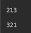

如您所见，在并行处理的情况下，`forEach()`不保证顺序，而`forEachOrdered()`保证顺序。下面是同时使用`Optional`和`forEach()`的另一个示例：

```java
 Stream.of( "That ", "is ", "a ", null, "Stream.of(literals)" )
       .map(Optional::ofNullable) 
       .filter(Optional::isPresent)
       .map(Optional::get)
       .map(String::toString)
       .forEach(System.out::print);
```

我们不能使用`Optional.of()`而使用`Optional.ofNullable()`，因为`Optional.of()`会在`null`上抛出`NullPointerException`。在这种情况下，`Optional.ofNullable()`只返回`Optional`空。结果如下：

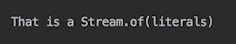

现在，让我们谈谈下一组终端操作，称为`reduce()`。在处理所有流元素后，三个重载方法中的每一个都返回一个值。其中最简单的例子是查找流元素的总和，如果它们是数字，或者是 max、min 和类似的值。但对于任何类型的对象流，都可以构造更复杂的结果。

第一个方法`Optional<T> reduce(BinaryOperator<T> accumulator)`返回`Optional<T>`对象，因为计算结果是提供的累加器函数的责任，JDK 实现的作者不能保证它始终包含非空值：

```java
 int sum = Stream.of(1,2,3).reduce((p,e) -> p + e).orElse(0);
 System.out.println("Stream.of(1,2,3).reduce(acc): " +sum);
```

传入函数接收同一函数的上一次执行结果（作为第一个参数`p`）和流的下一个元素（作为第二个参数`e`）。对于第一个元素，`p`获取其值，而`e`是第二个元素。您可以按如下方式打印`p`值：

```java
int sum = Stream.of(1,2,3)
        .reduce((p,e) -> {
            System.out.println(p);   //prints: 1 3
            return p + e;
        })
        .orElse(10);
System.out.println("Stream.of(1,2,3).reduce(acc): " + sum);
```

上述代码的输出如下所示：

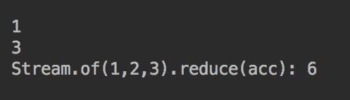

为了避免使用`Optional`的额外步骤，第二种方法`T reduce(T identity, BinaryOperator<T> accumulator)`在流为空的情况下返回作为`T`类型（即`Stream<T>`元素的类型）的第一个参数`identity`提供的值。此参数必须符合所有`t`的要求，因为`accumulator.apply(identity, t)`等于`t`要求（来自 Javadoc）。在我们的情况下，它必须是`0`才能符合`0 + e == e`。下面是如何使用第二种方法的示例：

```java
int sum = Stream.of(1,2,3).reduce(0, (p,e) -> p + e);
System.out.println("Stream.of(1,2,3).reduce(0, acc): " + sum);
```

结果与第一种`reduce()`方法相同。

第三种方法`U reduce(U identity, BiFunction<U,T,U> accumulator, BinaryOperator<U> combiner)`借助`BiFunction<U,T,U>`函数将`T`类型的值转换为`U`类型的值。`BiFunction<U,T,U>`用作累加器，以便其应用于前一个元素（`T`类型）的结果（`U`类型）与流的当前元素一起成为函数的输入。下面是一个代码示例：

```java
String sum = Stream.of(1,2,3)
    .reduce("", (p,e) -> p + e.toString(), (x,y) -> x + "," + y);
System.out.println("Stream.of(1,2,3).reduce(,acc,comb): " + sum);

```

人们自然希望看到结果是`1,2,3`。相反，我们看到以下情况：


前面结果的原因是使用组合器是因为流是连续的。但是现在让我们让流平行：

```java
String sum = Stream.of(1,2,3).parallel()  
    .reduce("", (p,e) -> p + e.toString(), (x,y) -> x + "," + y);
System.out.println("Stream.of(1,2,3).reduce(,acc,comb): " + sum);
```

上述代码执行的结果如下所示：

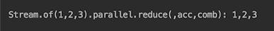

这意味着仅为并行处理调用组合器，以便组合（组合）并行处理的不同子流的结果。这是迄今为止我们注意到的唯一一个偏离，偏离了为顺序流和并行流提供相同行为的声明意图。但是有很多方法可以在不使用第三版`reduce()`的情况下实现相同的结果。例如，考虑下面的代码：

```java
String sum = Stream.of(1,2,3)
                   .map(i -> i.toString() + ",")
                   .reduce("", (p,e) -> p + e);
System.out.println("Stream.of(1,2,3).map.reduce(,acc): " 
                   + sum.substring(0, sum.length()-1));

```

它产生与上一个示例相同的结果：

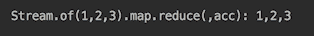

现在让我们将其更改为并行流：

```java
String sum = Stream.of(1,2,3).parallel()
                   .map(i -> i.toString() + ",")
                   .reduce("", (p,e) -> p + e);
System.out.println("Stream.of(1,2,3).map.reduce(,acc): " 
                   + sum.substring(0, sum.length()-1));

```

结果保持不变：`1,2,3`。

下一组中间操作称为`collect()`，包括两种方法：

```java
R collect(Collector<T,A,R> collector) 
R collect(Supplier<R> supplier, BiConsumer<R,T> accumulator, 
                                            BiConsumer<R,R> combiner) 
```

第一个接受`Collector<T,A,R>`作为参数。它比第二个更受欢迎，因为它由`Collectors`类备份，该类提供了`Collector`接口的多种实现。我们鼓励您浏览`Collectors`类的 Javadoc，看看它提供了什么。

让我们讨论几个使用`Collectors`类的例子。首先，我们将创建一个名为`Thing`的小演示类：

```java
public class Thing {
  private int someInt;
  public Thing(int i) { this.someInt = i; }
  public int getSomeInt() { return someInt; }
  public String getSomeStr() { 
    return Integer.toString(someInt); }
} 
```

现在我们可以用它来演示几个收集器：

```java
double aa = Stream.of(1,2,3).map(Thing::new)
              .collect(Collectors.averagingInt(Thing::getSomeInt));
System.out.println("stream(1,2,3).averagingInt(): " + aa);

String as = Stream.of(1,2,3).map(Thing::new).map(Thing::getSomeStr)
                                 .collect(Collectors.joining(","));
System.out.println("stream(1,2,3).joining(,): " + as);

String ss = Stream.of(1,2,3).map(Thing::new).map(Thing::getSomeStr)
                       .collect(Collectors.joining(",", "[", "]"));
System.out.println("stream(1,2,3).joining(,[,]): " + ss);
```

结果如下：

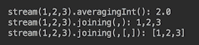

加入收集器对于任何程序员来说都是一种乐趣，因为他们必须编写代码来检查添加的元素是第一个、最后一个还是删除最后一个字符（就像我们在`reduce()`操作示例中所做的那样）。由`joining()`方法生成的收集器在幕后完成此操作。程序员只需提供分隔符、前缀和后缀。

大多数程序员永远不需要编写自定义收集器。但在需要的情况下，可以使用`Stream`的第二种方法`collect()`，并提供构成收集器的函数，或者使用生成可重用收集器的两种`Collector.of()`静态方法之一。

如果您比较`reduce()`和`collect()`操作，您会注意到`reduce()`的主要目的是对不可变对象和原语进行操作。`reduce()`的结果是一个通常（但不是唯一）与流元素类型相同的值。相比之下，`collect()`产生的结果是不同类型的包装在可变容器中。`collect()`最常用的用法是使用相应的`Collectors.toList()`、`Collectors.toSet()`或`Collectors.toMap()`收集器生成`List`、`Set`或`Map`对象。

最后一组终端操作包括两种`toArray()`方法：

```java
Object[] toArray() 
A[] toArray(IntFunction<A[]> generator)
```

第一个返回`Object[]`，第二个返回指定类型的数组。让我们看一下它们的用法示例：

```java
 Object[] os = Stream.of(1,2,3).toArray();
 Arrays.stream(os).forEach(System.out::print);
 System.out.println();
 String[] sts = Stream.of(1,2,3)
                      .map(i -> i.toString())
                      .toArray(String[]::new);
 Arrays.stream(sts).forEach(System.out::print);
```

这些示例的输出如下所示：

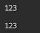

第一个例子非常简单。值得注意的是，我们不能写以下内容：

```java
Stream.of(1,2,3).toArray().forEach(System.out::print);
```

这是因为`toArray()`是一个终端操作，完成后流自动关闭。这就是为什么我们必须在前面代码示例的第二行中打开一个新流。

重载`A[] toArray(IntFunction<A[]> generator)`方法的第二个示例更复杂。[Javadoc](https://docs.oracle.com/javase/8/docs/api/java/util/stream/Stream.html) 表示，

生成器函数接受一个整数，即所需数组的大小，并生成所需大小的数组

这意味着上一个示例中对`toArray(String[]::new)`构造函数的方法引用是`toArray(size -> new String[size])`的较短版本。

# 使用数字流进行算术运算

除了`Stream`接口外，`java.util.stream`包还提供了专门的接口——`IntStream`、`DoubleStream`和`LongStream`——这些接口针对相应原语类型的处理流进行了优化。它们使用非常方便，并且具有数字操作，例如`max()`、`min()`、`average()`、`sum()`。

数字接口的方法与流接口的方法类似，这意味着我们在前面的配方“创建和操作流”中讨论的所有内容也适用于数字流。这就是为什么在本节中，我们将只讨论`Stream`接口中不存在的方法。

# 准备

除了“创建和操作流”配方中描述的方法外，还可以使用以下方法创建数字流：

*   `IntStream`和`LongStream`接口的`range(int startInclusive, int endInclusive)`和`rangeClosed(int startInclusive, int endInclusive)`方法
*   `java.util.Arrays`类的六个重载`stream()`方法，用于将数组和子数组转换为数字流

特定于数字流的中间操作列表包括以下内容：

*   `boxed()`：将原语类型的数字流转换为相应包装类型的流
*   `mapToObj(mapper)`：使用提供的函数映射器将原语类型的数字流转换为对象流
*   `LongStream`接口的`asDoubleStream()`：将`LongStream`转换为`DoubleStream`
*   `IntStream`接口的`asLongStream()`和`asDoubleStream()`：将`IntStream`转换成相应的数字流

特定于数字流的终端算术运算列表包括以下内容：

*   `sum()`：计算数字流元素的总和
*   `average()`：计算数字流元素的平均值
*   `summaryStatistics()`：创建一个对象，其中包含关于流元素的各种摘要数据

# 怎么做。。。

1.  使用`IntStream`和`LongStream`接口的`range(int startInclusive, int endInclusive)`和`rangeClosed(int startInclusive, int endInclusive)`方法进行实验：

```java
IntStream.range(1,3).forEach(System.out::print); //prints: 12
LongStream.range(1,3).forEach(System.out::print); //prints: 12
IntStream.rangeClosed(1,3).forEach(System.out::print);  // 123
LongStream.rangeClosed(1,3).forEach(System.out::print); // 123

```

如您所见，`range()`和`rangeClosed()`方法之间的区别在于排除或包含作为第二个参数传入的值。在两个参数具有相同值的情况下，这也会导致以下结果：

```java
IntStream.range(3,3).forEach(System.out::print);
                                                //prints:
LongStream.range(3,3).forEach(System.out::print);      
                                                //prints:
IntStream.rangeClosed(3,3).forEach(System.out::print); 
                                                //prints: 3
LongStream.rangeClosed(3,3).forEach(System.out::print);
                                                //prints: 3

```

在前面的示例中，`range()`方法不发射任何元素，而`rangeClosed()`方法只发射一个元素。

请注意，当第一个参数大于第二个参数时，这两种方法都不会生成错误。它们不发出任何信息，以下语句不产生任何输出：

```java
IntStream.range(3,1).forEach(System.out::print);        
LongStream.range(3,1).forEach(System.out::print);       
IntStream.rangeClosed(3,1).forEach(System.out::print);  
LongStream.rangeClosed(3,1).forEach(System.out::print); 

```

2.  如果不需要流元素的值是连续的，可以先创建一个值数组，然后使用`java.util.Arrays`类的六个重载`stream()`静态方法之一生成流：

```java
IntStream stream(int[] array)
IntStream stream(int[] array, int startInclusive, 
 int endExclusive)
LongStream stream(long[] array)
LongStream stream(long[] array, int startInclusive, 
                                           int endExclusive)
DoubleStream stream(double[] array)
DoubleStream stream(double[] array, int startInclusive, 
                                           int endExclusive)
```

以下是使用`Arrays.stream()`方法的示例：

```java
int[] ai = {2, 3, 1, 5, 4};
Arrays.stream(ai)
      .forEach(System.out::print);  //prints: 23154
Arrays.stream(ai, 1, 3)
      .forEach(System.out::print);  //prints: 31
long[] al = {2, 3, 1, 5, 4};
Arrays.stream(al)
       .forEach(System.out::print);  //prints: 23154
Arrays.stream(al, 1, 3)
       .forEach(System.out::print);  //prints: 31
double[] ad = {2., 3., 1., 5., 4.};
Arrays.stream(ad)
  .forEach(System.out::print);  //prints: 2.03.01.05.04.0
Arrays.stream(ad, 1, 3)
      .forEach(System.out::print);  //prints: 3.01.0

```

最后两条管道可以改进，通过使用前面配方中讨论的连接收集器，“创建和操作流”，以更人性化的格式打印`DoubleStream`的元素：

```java
double[] ad = {2., 3., 1., 5., 4.};
String res = Arrays.stream(ad).mapToObj(String::valueOf)
                       .collect(Collectors.joining(" ")); 
System.out.println(res);   //prints: 2.0 3.0 1.0 5.0 4.0
res = Arrays.stream(ad, 1, 3).mapToObj(String::valueOf)
                       .collect(Collectors.joining(" "));  
System.out.println(res);               //prints: 3.0 1.0

```

由于`Collector<CharSequence, ?, String>`加入收集器接受`CharSequence`作为输入类型，我们必须使用中间操作`mapToObj()`将数字转换为`String`。

3.  使用`mapToObj(mapper)`中间操作将基元类型元素转换为引用类型。我们在步骤 2 中看到了它的用法示例。为了实现必要的转换，映射器函数可以是简单的，也可以是复杂的。

还有一个专门的操作，`boxed()`，没有将原始数字类型的元素转换为相应的包装类型的参数——`int`值转换为`Integer`值、`long`值转换为`Long`值、`double`值转换为`Double`值。例如，我们可以使用它来实现与使用`mapToObj(mapper)`操作的最后两个示例相同的结果：

```java
double[] ad = {2., 3., 1., 5., 4.};
String res = Arrays.stream(ad).boxed()
                   .map(Object::toString)
                   .collect(Collectors.joining(" ")); 
System.out.println(res); //prints: 2.0 3.0 1.0 5.0 4.0
res = Arrays.stream(ad, 1, 3).boxed()
                     .map(Object::toString)
                     .collect(Collectors.joining(" ")); 
System.out.println(res); //prints: 3.0 1.0
```

4.  还存在将数值流的元素从一种基本类型转换为另一种数值基本类型的中间操作：`IntStream`接口中的`asLongStream()`和`asDoubleStream()`，以及`LongStream`接口中的`asDoubleStream()`。让我们看一下它们的用法示例：

```java
IntStream.range(1, 3).asLongStream()
              .forEach(System.out::print); //prints: 12
IntStream.range(1, 3).asDoubleStream()
 .forEach(d -> System.out.print(d + " ")); //prints: 1.0 2.0
LongStream.range(1, 3).asDoubleStream()
 .forEach(d -> System.out.print(d + " ")); //prints: 1.0 2.0

```

您可能已经注意到，这些操作仅适用于加宽原语转换：从`int`类型到`long`和`double`，从`long`到`double`。

5.  特定于数字流的终端算术运算非常简单。以下是使用`IntStream`进行`sum()`和`average()`操作的示例：

```java
         int sum = IntStream.empty().sum();
         System.out.println(sum);                   //prints: 0
         sum = IntStream.range(1, 3).sum();
         System.out.println(sum);                   //prints: 3
         double av = IntStream.empty().average().orElse(0);
         System.out.println(av);                   //prints: 0.0
         av = IntStream.range(1, 3).average().orElse(0);
         System.out.println(av);                   //prints: 1.5

```

如您所见，`average()`操作返回`OptionalDouble`。考虑一下为什么作者决定返回`OptionalDouble`作为`average()`而不是`sum()`是很有趣的。这个决定可能是为了将一个空流映射到一个空的`OptionalDouble`，但是当`sum()`应用于一个空流时返回`0`的决定似乎不一致。

这些操作对`LongStream`和`DoubleStream`的行为方式相同：

```java
        long suml = LongStream.range(1, 3).sum();
        System.out.println(suml);                 //prints: 3
        double avl = LongStream.range(1, 3).average().orElse(0);
        System.out.println(avl);                  //prints: 1.5

        double sumd = DoubleStream.of(1, 2).sum();
        System.out.println(sumd);                 //prints: 3.0
        double avd = DoubleStream.of(1, 2).average().orElse(0);
        System.out.println(avd);                  //prints: 1.5

```

6.  `summaryStatistics()`终端操作收集流元素的各种汇总数据：

```java
     IntSummaryStatistics iss = 
                    IntStream.empty().summaryStatistics();
     System.out.println(iss);   //count=0, sum=0, 
       //min=2147483647, average=0.000000, max=-2147483648
     iss = IntStream.range(1, 3).summaryStatistics();
     System.out.println(iss);    //count=2, sum=3, min=1, 
                                 //average=1.500000, max=2

     LongSummaryStatistics lss = 
                    LongStream.empty().summaryStatistics();
     System.out.println(lss);  //count=0, sum=0, 
                               //min=9223372036854775807, 
               //average=0.000000, max=-9223372036854775808
     lss = LongStream.range(1, 3).summaryStatistics();
     System.out.println(lss);  //count=2, sum=3, min=1, 
                               //average=1.500000, max=2

     DoubleSummaryStatistics dss = 
                   DoubleStream.empty().summaryStatistics();
     System.out.println(dss);  //count=0, sum=0.000000, 
            //min=Infinity, average=0.000000, max=-Infinity
     dss = DoubleStream.of(1, 2).summaryStatistics();
     System.out.println(dss);  //count=2, sum=3.000000, 
             //min=1.000000, average=1.500000, max=2.000000

```

作为注释添加到前面打印行的打印输出相应地来自于`IntSummaryStatistics`、`LongSummaryStatistics`或`DoubleSummaryStatistics`对象的`toString()`方法。这些对象的其他方法包括`getCount()`、`getSum()`、`getMin()`、`getAverage()`和`getMax()`，它们允许访问所收集统计数据的特定方面。

请注意，对于空流，最小（最大）值是对应 Java 类型的最小（最大）可能值：

```java
    System.out.println(Integer.MAX_VALUE); // 2147483647
    System.out.println(Integer.MIN_VALUE); //-2147483648
    System.out.println(Long.MAX_VALUE);    // 9223372036854775807
    System.out.println(Long.MIN_VALUE);    //-9223372036854775808
    System.out.println(Double.MAX_VALUE);  //1.7976931348623157E308
    System.out.println(Double.MIN_VALUE);  //4.9E-324

```

只有`DoubleSummaryStatistics`将`Infinity`和`-Infinity`显示为最小值和最大值，而不是此处显示的实际数字。根据这些方法的 Javadoc，`getMax()`返回“最大记录值，`Double.NaN`如果任何记录值是`NaN`或`Double.NEGATIVE_INFINITY`如果没有记录值，`getMin()`返回“最小记录值，`Double.NaN`如果任何记录值是`NaN`或`Double.POSITIVE_INFINITY`如果没有记录值。”

另外，请注意，与`average()`终端流操作相比，上述任何汇总统计数据的`getAverage()`方法返回流值的算术平均值，如果流中没有发出值，则返回零，而不是返回`Optional`对象。

# 还有更多。。。

`IntSummaryStatistics`、`LongSummaryStatistics`和`DoubleSummaryStatistics`对象不仅可以通过`summaryStatistics()`数字流终端操作创建。这样的对象也可以通过应用于任何`Stream`对象的`collect()`终端操作来创建，而不仅仅是`IntStream`、`LongStream`或`DoubleStream`。

每个汇总统计对象都有`accept()`和`combine()`方法，这允许我们创建一个`Collector`对象，可以传递到`collect()`操作中，并生成相应的汇总统计对象。我们将通过创建`IntSummaryStatistics`对象来演示这种可能性。可以类似地创建`LongSummaryStatistics`和`DoubleSummaryStatistics`对象。

`IntSummaryStatistics`类有以下两种方法：

*   void accept（int 值）：将新值包含到统计摘要中
*   void combine（`IntSummaryStatistics`other）：将提供的`other`对象收集到的统计信息添加到当前统计信息中

这些方法允许我们在任何`Stream`对象上使用`R collect(Supplier<R> supplier, BiConsumer<R,? super T> accumulator, BiConsumer<R,R> combiner)`操作的重载版本，如下所示：

```java
IntSummaryStatistics iss = Stream.of(3, 1)
        .collect(IntSummaryStatistics::new,
                 IntSummaryStatistics::accept,
                 IntSummaryStatistics::combine
        );
System.out.println(iss);  //count=2, sum=4, min=1, 
                          //average=2.000000, max=3

```

如您所见，流不是专门的数字流之一。它只有与所创建的摘要统计信息对象相同类型的数字元素。尽管如此，我们还是能够创建一个`IntSummaryStatistics`类的对象。类似地，可以创建`LongSummaryStatistics`和`DoubleSummaryStatistics`类的对象。

请注意，第三个参数`combiner`仅用于并行流处理，它组合了并行处理的子流的结果。为了证明这一点，我们可以将前面的示例更改为：

```java
IntSummaryStatistics iss = Stream.of(3, 1)
   .collect(IntSummaryStatistics::new,
      IntSummaryStatistics::accept,
      (r, r1) -> {
        System.out.println("Combining...");  //is not printing
        r.combine(r1);
      }
   );
System.out.println(iss); //count=2, sum=4, min=1, 
                          //average=2.000000, max=3
```

`Combining...`行未打印。让我们将流更改为并行流：

```java
IntSummaryStatistics iss = Stream.of(3, 1)
     .parallel()
     .collect(IntSummaryStatistics::new,
         IntSummaryStatistics::accept,
         (r, r1) -> {
             System.out.println("Combining...");  //Now it prints!
             r.combine(r1);
         }
     );
System.out.println(iss); //count=2, sum=4, min=1, 
                          //average=2.000000, max=3
```

如果您现在运行前面的代码，您将看到`Combining...`行。

另一种收集统计信息的方法是使用由`Collectors`类的以下方法之一创建的`Collector`对象：

```java
Collector<T, ?, IntSummaryStatistics> 
                   summarizingInt (ToIntFunction<T> mapper)
Collector<T, ?, LongSummaryStatistics> 
                  summarizingLong​(ToLongFunction<T> mapper)
Collector<T, ?, DoubleSummaryStatistics> 
              summarizingDouble​(ToDoubleFunction<T> mapper)
```

同样，我们将使用前面的第一个方法来创建`IntSummaryStatistics`对象。假设我们有以下`Person`类：

```java
class Person {
    private int age;
    private String name;
    public Person(int age, String name) {
        this.name = name;
        this.age = age;
    }
    public int getAge() { return this.age; }
    public String getName() { return this.name; }
}
```

如果有`Person`类对象流，我们可以收集人员年龄统计（流元素），如下所示：

```java
IntSummaryStatistics iss = 
   Stream.of(new Person(30, "John"), new Person(20, "Jill"))
         .collect(Collectors.summarizingInt(Person::getAge));
System.out.println(iss);     //count=2, sum=50, min=20, 
                             //average=25.000000, max=30

```

如您所见，我们只能在与所收集统计信息类型匹配的对象字段上收集统计信息。流及其元素都不是数字。

在尝试创建自定义`Collector`对象之前，查看`java.util.stream.Collectors`类的 Javadoc，看看它还提供了哪些其他功能。

# 通过生成集合完成流

您将学习并练习如何使用`collect()`终端操作将流元素重新打包到目标集合结构。

# 准备

`collect()`终端操作有两个重载版本，允许我们创建流元素的集合：

*   `R collect(Supplier<R> supplier, BiConsumer<R,T> accumulator, BiConsumer<R,R> combiner)`：使用应用于`T`类型的流元素的传入函数生成`R`结果。所提供的供应商和蓄能器共同工作如下：

```java
                 R result = supplier.get();
                 for (T element : this stream) {
                    accumulator.accept(result, element);
                 }
                 return result;
```

所提供的组合器仅用于并行流的处理。它合并并行处理的子流的结果。

*   `R collect(Collector<T, A, R> collector)`：使用应用于`T`类型的流元素的传入`Collector`对象生成`R`结果。`A`型为`Collector`的中间积累型。可以使用`Collector.of()`工厂方法构建`Collector`对象，但我们不打算在本配方中讨论它，因为`java.util.stream.Collectors`类中有许多工厂方法可以满足大多数需求。另外，在你学会如何使用`Collectors`类之后，你也将能够使用`Collector.of()`方法。

在本食谱中，我们将演示如何使用`Collectors`类的以下方法：

*   `Collector<T, ?, List<T>> toList()`：创建一个`Collector`对象，将`T`类型的流元素收集到一个`List<T>`对象中
*   `Collector<T, ?, Set<T>> toSet()`：创建一个`Collector`对象，将`T`类型的流元素收集到一个`Set<T>`对象中
*   `Collector<T, ?, C> toCollection(Supplier<C> collectionFactory)`：创建一个`Collector`对象，将`T`类型的流元素收集到`collectionFactor`供应商生产的 C 类型的`Collection`中
*   `Collector<T, ?, List<T>> toUnmodifiableList()`：创建一个`Collector`对象，将`T`类型的流元素收集到一个不可变的`List<T>`对象中
*   `Collector<T, ?, Set<T>> toUnmodifiableSet()`：创建一个`Collector`对象，将`T`类型的流元素收集到一个不可变的`Set<T>`对象中

对于我们的演示，我们将使用以下`Person`类：

```java
class Person {
    private int age;
    private String name;
    public Person(int age, String name) {
        this.age = age;
        this.name = name;
    }
    public int getAge() { return this.age; }
    public String getName() { return this.name; }
    @Override
    public boolean equals(Object o) {
        if (this == o) return true;
        if (!(o instanceof Person)) return false;
        Person person = (Person) o;
        return getAge() == person.getAge() &&
                Objects.equals(getName(), person.getName());
    }
    @Override
    public int hashCode() {
        return Objects.hash(getName(), getAge());
    }
    @Override
    public String toString() {
        return "Person{name:" + this.name + ",age:" + this.age + "}";
    }
}
```

# 怎么做。。。

我们将引导您完成演示如何使用上述方法和类的一系列实际步骤：

1.  写一个生成`List<T>`对象的`Stream<T>`接口的`R collect(Supplier<R> supplier, BiConsumer<R,T> accumulator, BiConsumer<R,R> combiner)`操作的使用示例：

```java
 List<Person> list = 
    Stream.of(new Person(30, "John"), new Person(20, "Jill"))
    .collect(ArrayList::new,
             List::add,      //same as: (a,p)-> a.add(p),
             List::addAll    //same as: (r, r1)-> r.addAll(r1)
    );
 System.out.println(list);
   //prints: [Person{name:John,age:30}, Person{name:Jill,age:20}]  
```

在前面的示例中，对累加器和组合器的注释演示了如何将这些函数表示为 lambda 表达式，而不仅仅是方法引用。

第一个参数`Supplier<R>`返回结果的容器。在我们的例子中，我们将其定义为`ArrayList<Person>`类的构造函数，因为它实现了`List<Person>`接口—我们想要构造的对象的类型。

累加器获取当前结果`a`（在本例中为`List<Person>`类型），并向其添加下一个流元素`p`（在本例中为`Person`对象）。示例的输出显示为最后一条注释行。

合并器合并并行处理的子流的结果。它获取第一个结果`r`（首先完成处理的任何子流），并将另一个结果`r1`添加到其中，依此类推。这意味着组合器仅用于并行处理。为了演示这一点，我们对前面的代码进行如下修改：

```java
  List<Person> list = 
     Stream.of(new Person(30, "John"), new Person(20, "Jill"))
           .collect(ArrayList::new,
                    ArrayList::add,
                    (r, r1)-> {
                        System.out.println("Combining...");
                        r.addAll(r1);
                    }
           );
  System.out.println(list1);  
   //prints: [Person{name:John,age:30}, Person{name:Jill,age:20}]

```

如果您运行前面的示例，您将不会看到打印出来的`Combining...`行，因为`combiner`不用于顺序流处理。

现在，让我们将该流转换为并行流：

```java
 List<Person> list = 
    Stream.of(new Person(30, "John"), new Person(20, "Jill"))
          .parallel()
          .collect(ArrayList::new,
                   ArrayList::add,
                   (r, r1)-> {
                      System.out.println("Combining...");
                      r.addAll(r1);
                   }
          );
  System.out.println(list1);  
    //prints: [Person{name:John,age:30}, Person{name:Jill,age:20}]

```

如果您运行上述代码，将显示`Combining...`行。

只要每个函数的输入和返回类型保持不变，就不会阻止您以任何方式修改提供的函数。

`Set<Person>`对象的创建方法相同：

```java
 Set<Person> set = 
   Stream.of(new Person(30, "John"), new Person(20, "Jill"))
         .collect(HashSet::new,
                  Set::add,      //same as: (a,p)-> a.add(p),
                  Set::addAll    //same as: (r, r1)-> r.addAll(r1)
         );
 System.out.println(set);  
   //prints: [Person{name:John,age:30}, Person{name:Jill,age:20}]
```

创建的`List`或`Set`对象可以随时修改：

```java
list.add(new Person(30, "Bob"));
System.out.println(list);  //prints: [Person{name:John,age:30}, 
                           //         Person{name:Jill,age:20}, 
                           //         Person{name:Bob,age:30}]
list.set(1, new Person(15, "Bob"));
System.out.println(list);  //prints: [Person{name:John,age:30}, 
                           //         Person{name:Bob,age:15}, 
                           //         Person{name:Bob,age:30}]
set.add(new Person(30, "Bob"));
System.out.println(set);   //prints: [Person{name:John,age:30}, 
                           //         Person{name:Jill,age:20}, 
                           //         Person{name:Bob,age:30}]
```

我们提到它是为了将这种行为与不可变集合的行为进行对比，我们将在稍后讨论。

2.  编写一个使用`Collector<T, ?, List<T>> Collectors.toList()`和`Collector<T, ?, Set<T>> Collectors.toSet()`方法创建的收集器的`Stream<T>`接口的`R collect(Collector<T, A, R> collector)`操作的示例：

```java
       List<Person> list = Stream.of(new Person(30, "John"), 
                                     new Person(20, "Jill"))
                .collect(Collectors.toList());
       System.out.println(list);  //prints: [Person{name:John,age:30}, 
                                  //         Person{name:Jill,age:20}]

       Set<Person> set1 = Stream.of(new Person(30, "John"), 
                                    new Person(20, "Jill"))
                .collect(Collectors.toSet());
       System.out.println(set1); //prints: [Person{name:John,age:30}, 
                                            Person{name:Jill,age:20}]

       Set<Person> set2 = Stream.of(new Person(30, "John"), 
                                    new Person(20, "Jill"), 
                                    new Person(30, "John"))
                .collect(Collectors.toSet());
        System.out.println(set2); //prints: [Person{name:John,age:30}, 
                                             Person{name:Jill,age:20}]
        set2.add(new Person(30, "Bob"));
        System.out.println(set2); //prints: [Person{name:John,age:30}, 
                                             Person{name:Jill,age:20}, 
                                             Person{name:Bob,age:30}]

```

正如所料，`Set`不允许`equals()`方法实现定义的重复元素。在`Person`类中，`equals()`方法比较年龄和姓名，因此这些属性中的任何一个不同都会导致两个`Person`对象不相等。

3.  写一个例子，说明如何使用`Stream<T>`接口的`R collect(Collector<T, A, R> collector)`操作与`Collector<T, ?, C> Collectors.toCollection(Supplier<C> collectionFactory)`方法创建的收集器。此收集器的优点是它不仅在`List`或`Set`中收集流元素，而且在实现`Collection`接口的任何对象中收集流元素。收集`T`类型流元素的目标对象由`collectionFactor`供应商生产：

```java
LinkedList<Person> list = Stream.of(new Person(30, "John"), 
                                    new Person(20, "Jill"))
        .collect(Collectors.toCollection(LinkedList::new));
System.out.println(list);  //prints: [Person{name:John,age:30}, 
                            //        Person{name:Jill,age:20}]

LinkedHashSet<Person> set = Stream.of(new Person(30, "John"), 
                                      new Person(20, "Jill"))
        .collect(Collectors.toCollection(LinkedHashSet::new));
System.out.println(set);  //prints: [Person{name:John,age:30}, 
                                     Person{name:Jill,age:20}]
```

4.  编写一个使用`Collector<T, ?, List<T>> Collectors.toUnmodifiableList()`和`Collector<T, ?, Set<T>> Collectors.toUnmodifiableSet()`方法创建的收集器的`Stream<T>`接口的`R collect(Collector<T, A, R> collector)`操作的示例：

```java
List<Person> list = Stream.of(new Person(30, "John"), 
                              new Person(20, "Jill"))
        .collect(Collectors.toUnmodifiableList());
System.out.println(list);  //prints: [Person{name:John,age:30}, 
                           //         Person{name:Jill,age:20}]

list.add(new Person(30, "Bob"));  //UnsupportedOperationException
list.set(1, new Person(15, "Bob")); //UnsupportedOperationException
list.remove(new Person(30, "John")); //UnsupportedOperationException

Set<Person> set = Stream.of(new Person(30, "John"), 
                            new Person(20, "Jill"))
        .collect(Collectors.toUnmodifiableSet());
System.out.println(set);  //prints: [Person{name:John,age:30}, 
                          //         Person{name:Jill,age:20}]

set.add(new Person(30, "Bob"));  //UnsupportedOperationException

```

从前面代码中的注释可以看出，使用`Collector<T, ?, List<T>> Collectors.toUnmodifiableList()`和`Collector<T, ?, Set<T>> Collectors.toUnmodifiableSet()`方法生成的收集器创建的对象会创建不可变的对象。这些对象在 lambda 表达式中使用时非常有用，因为这样我们可以保证它们不会被修改，因此，即使在不同的上下文中传递并执行相同的表达式，也会产生仅依赖于其输入参数的结果，并且不会因修改其使用的`List`或`Set`对象而产生意外的副作用。

例如：

```java
Set<Person> set = Stream.of(new Person(30, "John"), 
                            new Person(20, "Jill"))
        .collect(Collectors.toUnmodifiableSet());

Predicate<Person> filter = p -> set.contains(p);
```

我们在前面示例中创建的过滤器可以在任何地方用于选择属于所提供集合的`Person`对象。

# 通过生成地图完成流

您将学习并练习如何使用`collect()`终端操作来重新打包流元素，以针对`Map`结构。在讨论收集器时，我们将不包括使用分组的收集器，因为它们将在下一个配方中介绍。

# 准备

正如我们在前面的配方中提到的，`collect()`终端操作有两个重载版本，允许我们创建流元素的集合：

*   `R collect(Supplier<R> supplier, BiConsumer<R,T> accumulator, BiConsumer<R,R> combiner)`：使用应用于`T`类型的流元素的传入函数生成`R`结果
*   `R collect(Collector<T, A, R> collector)`：使用应用于`T`类型的流元素的传入`Collector`对象生成`R`结果

这些操作也可以用来创建一个`Map`对象，在这个配方中，我们将演示如何做到这一点。

为了支持前面第二个版本的`collect()`操作，`Collectors`类提供了四组创建`Collector`对象的工厂方法。第一组包括非常类似于创建`Collector`对象的工厂方法，用于将流元素收集到`List`或`Set`中，这些方法在前面的配方中进行了讨论和演示：

*   `Collector<T,?,Map<K,U>> toMap(Function<T,K> keyMapper, Function<T,U> valueMapper)`：创建一个`Collector`对象，该对象使用提供的函数（映射器）将`T`类型的流元素收集到`Map<K,U>`对象中，该函数从流元素生成一个键和值作为输入参数。
*   `Collector<T,?,Map<K,U>> toMap(Function<T,K> keyMapper, Function<T,U> valueMapper, BinaryOperator<U> mergeFunction)`：创建一个`Collector`对象，该对象使用提供的函数（映射器）将`T`类型的流元素收集到`Map<K,U>`对象中，该函数从流元素生成一个键和值作为输入参数。提供的`mergeFunction`仅用于并行流处理；它将子流的结果合并到一个最终结果`Map<K,U>`对象中。
*   `Collector<T,?,M> toMap(Function<T,K> keyMapper, Function<T,U> valueMapper, BinaryOperator<U> mergeFunction, Supplier<M> mapFactory)`：创建一个`Collector`对象，该对象使用提供的函数（映射器）将`T`类型的流元素收集到`Map<K,U>`对象中，该函数从流元素生成一个键和值作为输入参数。提供的`mergeFunction`仅用于并行流处理；它将子流的结果合并到一个最终结果`Map<K,U>`对象中。提供的`mapFactory`供应商创建一个空`Map<K,U>`对象，结果将插入其中。
*   `Collector<T,?,Map<K,U>> toUnmodifiableMap(Function<T,K> keyMapper, Function<T,U> valueMapper)`：使用提供的函数（映射器）创建一个`Collector`对象，该对象将`T`类型的流元素收集到一个*不可变的*`Map<K,U>`对象中，该函数从流元素生成一个键和值作为输入参数。
*   `Collector<T,?,Map<K,U>> toUnmodifiableMap(Function<T,K> keyMapper, Function<T,U> valueMapper, BinaryOperator<U> mergeFunction)`：使用提供的函数（映射器）创建一个`Collector`对象，该对象将`T`类型的流元素收集到一个*不可变的*`Map<K,U>`对象中，该函数从流元素生成一个键和值作为输入参数。提供的`mergeFunction`仅用于并行流处理；它将子流的结果合并为一个最终结果，即不可变的`Map<K,U>`对象。

第二组包括三种工厂方法，类似于我们刚才列出的三种`toMap()`方法。唯一的区别是由`toConcurrentMap()`方法创建的收集器收集`ConcurrentMap`对象中的流元素：

*   `Collector<T,?,ConcurrentMap<K,U>> toConcurrentMap(Function<T,K> keyMapper, Function<T,U> valueMapper)`：创建一个`Collector`对象，该对象使用提供的函数（映射器）将`T`类型的流元素收集到`ConcurrentMap<K,U>`对象中，该函数从流元素生成一个键和值作为输入参数。
*   `Collector<T,?,ConcurrentMap<K,U>> toConcurrentMap(Function<T,K> keyMapper, Function<T,U> valueMapper, BinaryOperator<U> mergeFunction)`：创建一个`Collector`对象，该对象使用提供的函数（映射器）将`T`类型的流元素收集到`ConcurrentMap<K,U>`对象中，该函数从流元素生成一个键和值作为输入参数。提供的`mergeFunction`仅用于并行流处理；它将子流的结果合并到一个最终结果`ConcurrentMap<K,U>`对象中。
*   `Collector<T,?,M> toConcurrentMap(Function<T,K> keyMapper, Function<T,U> valueMapper, BinaryOperator<U> mergeFunction, Supplier<M> mapFactory)`：创建一个`Collector`对象，该对象使用提供的函数（映射器）将`T`类型的流元素收集到`ConcurrentMap<K,U>`对象中，该函数从流元素生成一个键和值作为输入参数。提供的`mergeFunction`仅用于并行流处理；它将子流的结果合并到一个最终结果`ConcurrentMap<K,U>`对象中。提供的`mapFactory`供应商创建一个空`ConcurrentMap<K,U>`对象，结果将插入其中。

对于第二组工厂方法的需要源于这样一个事实，即对于并行流，不同子流的合并结果是一个昂贵的操作。当结果必须按照所遇到的顺序合并到结果`Map`中时，它尤其沉重，而`toMap()`工厂方法创建的收集器就是这样做的。这些收集器创建多个中间结果，然后通过多次调用收集器的供应商和合并器来合并它们。

当结果合并的顺序不重要时，`toConcurrentMap()`方法创建的收集器可以作为较轻的收集器使用，因为它们只调用供应商一次，将元素插入*共享的*结果容器中，并且从不调用合并器。

因此，`toMap()`和`toConcurrentMap()`收集器之间的差异仅在并行流处理期间表现出来。这就是为什么通常建议使用`toMap()`采集器进行串行流处理，使用`toConcurrentMap()`采集器进行并行流处理（如果收集流元素的顺序不重要）。

第三组包括三种`groupingBy()`工厂方法，我们将在下一个配方中讨论。

第四组包括三种`groupingByConcurrent()`工厂方法，我们也将在下一个配方中讨论。

在我们的演示中，我们将使用上一个配方中用于创建集合的`Person`类：

```java
class Person {
    private int age;
    private String name;
    public Person(int age, String name) {
        this.age = age;
        this.name = name;
    }
    public int getAge() { return this.age; }
    public String getName() { return this.name; }
    @Override
    public boolean equals(Object o) {
        if (this == o) return true;
        if (!(o instanceof Person)) return false;
        Person person = (Person) o;
        return getAge() == person.getAge() &&
                Objects.equals(getName(), person.getName());
    }
    @Override
    public int hashCode() {
        return Objects.hash(getName(), getAge());
    }
    @Override
    public String toString() {
        return "Person{name:" + this.name + ",age:" + this.age + "}";
    }
}
```

# 怎么做。。。

我们将引导您完成演示如何使用上述方法和类的一系列实际步骤：

1.  写一个例子，说明生成`Map`对象的`Stream<T>`接口的`R collect(Supplier<R> supplier, BiConsumer<R,T> accumulator, BiConsumer<R,R> combiner)`操作的用法。以人名为键创建`Map<String, Person>`：

```java
Map<String, Person> map = Stream.of(new Person(30, "John"), 
                                    new Person(20, "Jill"))
        .collect(HashMap::new,
                (m,p) -> m.put(p.getName(), p),
                Map::putAll
        );
System.out.println(map); //prints: {John=Person{name:John,age:30}, 
                         //         Jill=Person{name:Jill,age:20}}
```

或者，为了避免结果`Map`中的冗余数据，我们可以使用年龄字段作为`Map`值：

```java
Map<String, Integer> map = Stream.of(new Person(30, "John"), 
                                     new Person(20, "Jill"))
        .collect(HashMap::new,
                (m,p) -> m.put(p.getName(), p.getAge()),
                Map::putAll
        );
System.out.println(map);       //prints: {John=30, Jill=20}

```

组合器仅针对并行流调用，因为它用于组合不同子流处理的结果。为了证明这一点，我们将方法引用`Map::putAll`替换为打印消息`Combining...`的代码块：

```java
Map<String, Integer> map = Stream.of(new Person(30, "John"), 
                                     new Person(20, "Jill"))
      //.parallel()     //conversion to a parallel stream
        .collect(HashMap::new,
                (m,p) -> m.put(p.getName(), p.getAge()),
                (m,m1) -> {
                      System.out.println("Combining...");
                      m.putAll(m1);
                }
        );
System.out.println(map);  //prints: {John=30, Jill=20}
```

`Combining...`消息仅在转换为并行流未被注释掉时才会显示。

如果我们添加另一个具有相同名称的`Person`对象，其中一个对象将在生成的`Map`中被覆盖：

```java
Map<String, Integer> map = Stream.of(new Person(30, "John"), 
                                     new Person(20, "Jill"),
                                     new Person(15, "John"))
        .collect(HashMap::new,
                (m,p) -> m.put(p.getName(), p.getAge()),
                Map::putAll
        );
System.out.println(map);       //prints: {John=15, Jill=20}
```

如果这样的行为是不可取的，并且我们需要查看所有重复键的所有值，我们可以将结果`Map`更改为将`List`对象作为值，以便在此列表中我们可以收集具有相同键的所有值：

```java
BiConsumer<Map<String, List<Integer>>, Person> consumer = 
(m,p) -> {
    List<Integer> list = m.get(p.getName());
    if(list == null) {
        list = new ArrayList<>(); 
        m.put(p.getName(), list);
    }
    list.add(p.getAge());
};
Map<String, List<Integer>> map = 
  Stream.of(new Person(30, "John"), 
            new Person(20, "Jill"), 
            new Person(15, "John"))
        .collect(HashMap::new, consumer, Map::putAll);
System.out.println(map);
                   //prints: {John=[30, 15], Jill=[20]}

```

正如您所看到的，我们没有将`collect()`操作中的`BiConsumer`函数作为参数内联，因为它现在是一个多行代码，这样更容易阅读。

在本例中，为同一个键收集多个值的另一种方法是使用一个`String`值创建`Map`，如下所示：

```java
BiConsumer<Map<String, String>, Person> consumer2 = (m,p) -> {
 if(m.keySet().contains(p.getName())) {
   m.put(p.getName(), m.get(p.getName()) + "," + p.getAge());
 } else {
   m.put(p.getName(), String.valueOf(p.getAge()));
 }
};
Map<String, String> map = Stream.of(new Person(30, "John"), 
                                    new Person(20, "Jill"), 
                                    new Person(15, "John"))
        .collect(HashMap::new, consumer, Map::putAll);
System.out.println(map);    //prints: {John=30,15, Jill=20}
```

2.  写一个使用`Collector<T, ?, Map<K,U>> Collectors.toMap(Function<T,K> keyMapper, Function<T,U> valueMapper)`方法创建的收集器的`Stream<T>`接口的`R collect(Collector<T, A, R> collector)`操作的示例：

```java
Map<String, Integer> map = Stream.of(new Person(30, "John"), 
                                     new Person(20, "Jill"))
  .collect(Collectors.toMap(Person::getName, Person::getAge));
System.out.println(map);     //prints: {John=30, Jill=20}
```

只要没有遇到重复的密钥，上述解决方案就可以正常工作，如下例所示：

```java
Map<String, Integer> map = Stream.of(new Person(30, "John"), 
                                     new Person(20, "Jill"),
                                     new Person(15, "John"))
.collect(Collectors.toMap(Person::getName, Person::getAge));

```

前面的代码抛出带有`Duplicate key John`（尝试合并值 30 和 15）消息的`IllegalStateException`，我们无法像以前那样添加对重复密钥的检查。因此，如果存在重复密钥的可能性，则必须使用重载版本的`toMap()`方法。

3.  写一个使用`Collector<T, ?, Map<K,U>> Collectors.toMap(Function<T,K> keyMapper, Function<T,U> valueMapper, BinaryOperator<U> mergeFunction)`方法创建的收集器的`Stream<T>`接口的`R collect(Collector<T, A, R> collector)`操作的示例：

```java
Function<Person, List<Integer>> valueMapper = p -> {
    List<Integer> list = new ArrayList<>();
    list.add(p.getAge());
    return list;
};
BinaryOperator<List<Integer>> mergeFunction = (l1, l2) -> {
    l1.addAll(l2);
    return l1;
};
Map<String, List<Integer>> map = 
   Stream.of(new Person(30, "John"), 
             new Person(20, "Jill"), 
             new Person(15, "John"))
         .collect(Collectors.toMap(Person::getName, 
                           valueMapper, mergeFunction));
System.out.println(map); 
                     //prints: {John=[30, 15], Jill=[20]}

```

这就是`mergeFunction`的目的——为一个复制键组合值。除了`List<Integer>`，我们还可以收集`String`对象中重复键的值：

```java
Function<Person, String> valueMapper = 
                        p -> String.valueOf(p.getAge());
BinaryOperator<String> mergeFunction = 
                              (s1, s2) -> s1 + "," + s2;
Map<String, String> map = 
  Stream.of(new Person(30, "John"), 
            new Person(20, "Jill"), 
            new Person(15, "John"))
        .collect(Collectors.toMap(Person::getName, 
                           valueMapper, mergeFunction));
System.out.println(map3);//prints: {John=30,15, Jill=20}
```

4.  写一个使用`Collector<T, ?, M> Collectors.toMap(Function<T,K> keyMapper, Function<T,U> valueMapper, BinaryOperator<U> mergeFunction, Supplier<M> mapFactory)`方法创建的收集器的`Stream<T>`接口的`R collect(Collector<T, A, R> collector)`操作的示例：

```java
Function<Person, String> valueMapper = 
                           p -> String.valueOf(p.getAge());
BinaryOperator<String> mergeFunction = 
                                 (s1, s2) -> s1 + "," + s2;
LinkedHashMap<String, String> map = 
   Stream.of(new Person(30, "John"), 
             new Person(20, "Jill"), 
             new Person(15, "John"))
         .collect(Collectors.toMap(Person::getName, 
           valueMapper, mergeFunction, LinkedHashMap::new));
System.out.println(map3);    //prints: {John=30,15, Jill=20} 
```

正如您所看到的，`toMap()`方法的这个版本允许我们指定所需的`Map`接口实现（本例中为`LinkedHashMap`类），而不是使用默认的接口实现。

5.  写一个使用`Collector<T, ?, Map<K,U>> Collectors.toUnmodifiableMap(Function<T,K> keyMapper, Function<T,U> valueMapper)`方法创建的收集器的`Stream<T>`接口的`R collect(Collector<T, A, R> collector)`操作的示例：

```java
Map<String, Integer> map = Stream.of(new Person(30, "John"), 
                                      new Person(20, "Jill"))
        .collect(Collectors.toUnmodifiableMap(Person::getName, 
                                              Person::getAge));
System.out.println(map);          //prints: {John=30, Jill=20}

map.put("N", new Person(42, "N")); //UnsupportedOperationExc
map.remove("John");                //UnsupportedOperationExc

Map<String, Integer> map = Stream.of(new Person(30, "John"), 
                                     new Person(20, "Jill"), 
                                     new Person(15, "John"))
  .collect(Collectors.toUnmodifiableMap(Person::getName, 
    Person::getAge)); //IllegalStateExc: Duplicate key John

```

如您所见，`toUnmpdifiableMap()`方法创建的收集器的行为与`Collector<T, ?, Map<K,U>> Collectors.toMap(Function<T,K> keyMapper, Function<T,U> valueMapper)`方法创建的收集器相同，只是它生成一个不可变的`Map`对象。

6.  写一个使用`Collector<T, ?, Map<K,U>> Collectors.toUnmodifiableMap(Function<T,K> keyMapper, Function<T,U> valueMapper, BinaryOperator<U> mergeFunction)`方法创建的收集器的`Stream<T>`接口的`R collect(Collector<T, A, R> collector)`操作的示例：

```java
Function<Person, List<Integer>> valueMapper = p -> {
    List<Integer> list = new ArrayList<>();
    list.add(p.getAge());
    return list;
};
BinaryOperator<List<Integer>> mergeFunction = (l1, l2) -> {
    l1.addAll(l2);
    return l1;
};
Map<String, List<Integer>> map = 
    Stream.of(new Person(30, "John"), 
              new Person(20, "Jill"), 
              new Person(15, "John"))
      .collect(Collectors.toUnmodifiableMap(Person::getName, 
                                valueMapper, mergeFunction));
System.out.println(map); //prints: {John=[30, 15], Jill=[20]}
```

由`toUnmpdifiableMap()`方法创建的收集器与由`Collector<T, ?, Map<K,U>> Collectors.toMap(Function<T,K> keyMapper, Function<T,U> valueMapper, BinaryOperator<U> mergeFunction)`方法创建的收集器的行为相同，只是它生成一个不可变的`Map`对象。其目的是处理钥匙重复的情况。以下是组合重复关键帧值的另一种方法：

```java
Function<Person, String> valueMapper = 
                             p -> String.valueOf(p.getAge());
BinaryOperator<String> mergeFunction = 
                                   (s1, s2) -> s1 + "," + s2;
Map<String, String> map = Stream.of(new Person(30, "John"), 
                                    new Person(20, "Jill"), 
                                    new Person(15, "John"))
    .collect(Collectors.toUnmodifiableMap(Person::getName, 
                                valueMapper, mergeFunction));
System.out.println(map);      //prints: {John=30,15, Jill=20}
```

7.  写一个使用`Collector<T, ? ,ConcurrentMap<K,U>> Collectors.toConcurrentMap(Function<T,K> keyMapper, Function<T,U> valueMapper)`方法创建的收集器的`Stream<T>`接口的`R collect(Collector<T, A, R> collector)`操作的示例：

```java
ConcurrentMap<String, Integer> map = 
                            Stream.of(new Person(30, "John"), 
                                      new Person(20, "Jill"))
        .collect(Collectors.toConcurrentMap(Person::getName, 
                                            Person::getAge));
System.out.println(map);          /prints: {John=30, Jill=20}

map.put("N", new Person(42, "N")); //UnsupportedOperationExc
map.remove("John");                //UnsupportedOperationExc

ConcurrentMap<String, Integer> map = 
                           Stream.of(new Person(30, "John"), 
                                     new Person(20, "Jill"), 
                                     new Person(15, "John"))
  .collect(Collectors.toConcurrentMap(Person::getName, 
    Person::getAge)); //IllegalStateExc: Duplicate key John
```

如您所见，由`toConcurrentMap()`方法创建的收集器的行为与由`Collector<T, ?, Map<K,U>> Collectors.toMap(Function<T,K> keyMapper, Function<T,U> valueMapper)`和`Collector<T, ?, Map<K,U>> Collectors.toUnmodifiableMap(Function<T,K> keyMapper, Function<T,U> valueMapper)`方法创建的收集器的行为相同，只是它生成一个可变的`Map`对象，并且当流是并行的时，在子流之间共享生成的`Map`。

8.  写一个使用`Collector<T, ?, ConcurrentMap<K,U>> Collectors.toConcurrentMap(Function<T,K> keyMapper, Function<T,U> valueMapper, BinaryOperator<U> mergeFunction)`方法创建的收集器的`Stream<T>`接口的`R collect(Collector<T, A, R> collector)`操作的示例：

```java
Function<Person, List<Integer>> valueMapper = p -> {
    List<Integer> list = new ArrayList<>();
    list.add(p.getAge());
    return list;
};
BinaryOperator<List<Integer>> mergeFunction = (l1, l2) -> {
    l1.addAll(l2);
    return l1;
};
ConcurrentMap<String, List<Integer>> map = 
  Stream.of(new Person(30, "John"), 
            new Person(20, "Jill"), 
            new Person(15, "John"))
       .collect(Collectors.toConcurrentMap(Person::getName, 
                              valueMapper, mergeFunction));
System.out.println(map);
                       //prints: {John=[30, 15], Jill=[20]}
```

如您所见，由`toConcurrentMap()`方法创建的收集器的行为与由`Collector<T, ?, Map<K,U>> Collectors.toMap(Function<T,K> keyMapper, Function<T,U> valueMapper, BinaryOperator<U> mergeFunction)`和`Collector<T, ?, Map<K,U>> Collectors.toUnmodifiableMap(Function<T,K> keyMapper, Function<T,U> valueMapper, BinaryOperator<U> mergeFunction)`方法创建的收集器的行为相同，只是它生成一个可变的`Map`对象，并且当流并行时，在子流之间共享生成的`Map`。以下是组合重复关键帧值的另一种方法：

```java
Function<Person, String> valueMapper = 
                              p -> String.valueOf(p.getAge());
BinaryOperator<String> mergeFunction = 
                                    (s1, s2) -> s1 + "," + s2;
ConcurrentMap<String, String> map = 
                          Stream.of(new Person(30, "John"), 
                                    new Person(20, "Jill"), 
                                    new Person(15, "John"))
    .collect(Collectors.toConcurrentMap(Person::getName, 
                                 valueMapper, mergeFunction));
System.out.println(map);       //prints: {John=30,15, Jill=20}
```

9.  写一个使用`Collector<T, ?, M> Collectors.toConcurrentMap(Function<T,K> keyMapper, Function<T,U> valueMapper, BinaryOperator<U> mergeFunction, Supplier<M> mapFactory)`方法创建的收集器的`Stream<T>`接口的`R collect(Collector<T, A, R> collector)`操作的示例：

```java
ConcurrentSkipListMap<String, String> map = 
                             Stream.of(new Person(30, "John"), 
                                       new Person(20, "Jill"), 
                                       new Person(15, "John"))
   .collect(Collectors.toConcurrentMap(Person::getName, 
     valueMapper, mergeFunction, ConcurrentSkipListMap::new));
System.out.println(map4);      //prints: {Jill=20, John=30,15}
```

正如您所看到的，`toConcurrentMap()`方法的这个版本允许我们指定所需的`Map`接口实现（本例中为`ConcurrentSkipListMap`类），而不是使用默认的接口实现。

由`toConcurrentMap()`方法创建的收集器的行为与由`Collector<T, ?, Map<K,U>> Collectors.toMap(Function<T,K> keyMapper, Function<T,U> valueMapper, BinaryOperator<U> mergeFunction, Supplier<M> mapFactory)`方法创建的收集器相同，但当流是并行的时，它在子流之间共享生成的`Map`。

# 通过使用分组收集器生成贴图来完成流

在此配方中，您将学习并练习如何使用`collect()`终端操作按属性对元素进行分组，并使用收集器将结果存储在`Map`实例中。

# 准备

有两组收集器使用类似于 SQL 语句的`group by`功能的分组来将流数据表示为`Map`对象。第一套包括三种过载的`groupingBy()`工厂方法：

*   `Collector<T, ?, Map<K,List<T>>> groupingBy(Function<T,K> classifier)`：创建一个`Collector`对象，该对象使用提供的`classifier`函数将`T`类型的流元素收集到`Map<K,List<T>>`对象中，以将当前元素映射到结果映射中的键。
*   `Collector<T,?,Map<K,D>> groupingBy(Function<T,K> classifier, Collector<T,A,D> downstream)`：创建一个`Collector`对象，该对象使用提供的`classifier`功能将`T`类型的流元素收集到`Map<K,D>`对象中，将当前元素映射到中间映射`Map<K,List<T>>`中的键。然后，它使用`downstream`收集器将中间映射的值转换为结果映射`Map<K,D`的值。
*   `Collector<T, ?, M> groupingBy(Function<T,K> classifier, Supplier<M> mapFactory, Collector<T,A,D> downstream)`：创建一个`Collector`对象，该对象使用提供的`classifier`功能将`T`类型的流元素收集到`M`映射对象中，以将当前元素映射到`Map<K,List<T>>`中间映射中的键。然后，它使用`downstream`收集器将中间映射的值转换为`mapFactory`供应商提供的类型的结果映射的值。

第二组收集器包括三个`groupingByConcurrent()`工厂方法，它们是为并行流处理期间的并发处理而创建的。这些收集器采用与前面列出的`groupingBy()`收集器的相应重载版本相同的参数。唯一的区别是，`groupingByConcurrent()`收集器的返回类型是`ConcurrentHashMap`类或其子类的实例：

*   `Collector<T, ?, ConcurrentMap<K,List<T>>> groupingByConcurrent(Function<T,K> classifier)`：创建一个`Collector`对象，该对象使用提供的`classifier`函数将`T`类型的流元素收集到`ConcurrentMap<K,List<T>>`对象中，以将当前元素映射到结果映射中的键。
*   `Collector<T, ?, ConcurrentMap<K,D>> groupingByConcurrent(Function<T,K> classifier, Collector<T,A,D> downstream)`：创建一个`Collector`对象，该对象使用提供的`classifier`函数将`T`类型的流元素收集到`ConcurrentMap<K,D>`对象中，以将当前元素映射到`ConcurrentMap<K,List<T>>`中间映射中的键。然后，它使用`downstream`收集器将中间映射的值转换为结果映射`ConcurrentMap<K,D>`的值。
*   `Collector<T, ?, M> groupingByConcurrent(Function<T,K> classifier, Supplier<M> mapFactory, Collector<T,A,D> downstream)`：创建一个`Collector`对象，该对象使用提供的`classifier`功能将`T`类型的流元素收集到`M`映射对象中，以将当前元素映射到`ConcurrentMap<K,List<T>>`中间映射中的键。然后，它使用`downstream`收集器将中间映射的值转换为`mapFactory`供应商提供的类型的结果映射的值。

在我们的演示中，我们将使用上一个配方中用于创建地图的`Person`类：

```java
class Person {
    private int age;
    private String name;
    public Person(int age, String name) {
        this.age = age;
        this.name = name;
    }
    public int getAge() { return this.age; }
    public String getName() { return this.name; }
    @Override
    public boolean equals(Object o) {
        if (this == o) return true;
        if (!(o instanceof Person)) return false;
        Person person = (Person) o;
        return getAge() == person.getAge() &&
                Objects.equals(getName(), person.getName());
    }
    @Override
    public int hashCode() {
        return Objects.hash(getName(), getAge());
    }
    @Override
    public String toString() {
        return "Person{name:" + this.name + ",age:" + this.age + "}";
    }
}
```

我们还将使用`Person2`类：

```java
class Person2 {
    private int age;
    private String name, city;
    public Person2(int age, String name, String city) {
        this.age = age;
        this.name = name;
        this.city = city;
    }
    public int getAge() { return this.age; }
    public String getName() { return this.name; }
    public String getCity() { return this.city; }
    @Override
    public boolean equals(Object o) {
        if (this == o) return true;
        if (!(o instanceof Person)) return false;
        Person2 person = (Person2) o;
        return getAge() == person.getAge() &&
                Objects.equals(getName(), person.getName()) &&
                Objects.equals(getCity(), person.getCity());
    }
    @Override
    public int hashCode() {
        return Objects.hash(getName(), getAge(), getCity());
    }
    @Override
    public String toString() {
        return "Person{name:" + this.name + ",age:" + this.age  + 
                                       ",city:" + this.city + "}";
    }
}
```

`Person2`类与`Person`类不同，因为它有一个额外的字段城市。它将用于演示分组功能的威力。而`Person2`类变体`Person3`类将用于演示如何创建`EnumMap`对象。`Person3`类使用`enum City`作为其`city`属性的值类型：

```java
enum City{
    Chicago, Denver, Seattle
}

class Person3 {
    private int age;
    private String name;
    private City city;
    public Person3(int age, String name, City city) {
        this.age = age;
        this.name = name;
        this.city = city;
    }
    public int getAge() { return this.age; }
    public String getName() { return this.name; }
    public City getCity() { return this.city; }
    @Override
    public boolean equals(Object o) {
        if (this == o) return true;
        if (!(o instanceof Person)) return false;
        Person3 person = (Person3) o;
        return getAge() == person.getAge() &&
                Objects.equals(getName(), person.getName()) &&
                Objects.equals(getCity(), person.getCity());
    }
    @Override
    public int hashCode() {
        return Objects.hash(getName(), getAge(), getCity());
    }
    @Override
    public String toString() {
        return "Person{name:" + this.name + ",age:" + this.age  + 
                                       ",city:" + this.city + "}";
    }
}
```

为了减少示例的冗长，我们将使用以下方法生成测试流：

```java
Stream<Person> getStreamPerson() {
    return Stream.of(new Person(30, "John"), 
                     new Person(20, "Jill"), 
                     new Person(20, "John"));
}
Stream<Person2> getStreamPerson2(){
    return Stream.of(new Person2(30, "John", "Denver"), 
                     new Person2(30, "John", "Seattle"), 
                     new Person2(20, "Jill", "Seattle"), 
                     new Person2(20, "Jill", "Chicago"), 
                     new Person2(20, "John", "Denver"),
                     new Person2(20, "John", "Chicago"));
}
Stream<Person3> getStreamPerson3(){
    return Stream.of(new Person3(30, "John", City.Denver), 
                     new Person3(30, "John", City.Seattle),
                     new Person3(20, "Jill", City.Seattle), 
                     new Person3(20, "Jill", City.Chicago),
                     new Person3(20, "John", City.Denver),
                     new Person3(20, "John", City.Chicago));
}
```

# 怎么做。。。

我们将引导您完成演示如何使用上述方法和类的一系列实际步骤：

1.  写一个使用`Collector<T, ?, Map<K,List<T>>> groupingBy(Function<T,K> classifier)`方法创建的收集器的`Stream<T>`接口的`R collect(Collector<T, A, R> collector)`操作的示例：

```java
Map<String, List<Person>> map = getStreamPerson()
        .collect(Collectors.groupingBy(Person::getName));
System.out.println(map);  
               //prints: {John=[Person{name:John,age:30}, 
               //               Person{name:John,age:20}], 
               //         Jill=[Person{name:Jill,age:20}]}

```

这是`Collector`对象的最简单版本。您只需定义结果映射的键，收集器就会将具有相同键值的所有流元素添加到结果映射中与该键关联的元素列表中。

下面是另一个例子：

```java
Map<Integer, List<Person>> map = getStreamPerson()
        .collect(Collectors.groupingBy(Person::getAge));
System.out.println(map);  
                //prints: {20=[Person{name:Jill,age:20}, 
                //             Person{name:John,age:20}], 
                //         30=[Person{name:John,age:30}]}
```

如果必须按属性组合对流元素进行分组，则可以创建一个包含必要组合的类。此类的对象将用作复杂键。例如，让我们阅读`Person2`元素的流，并按年龄和名称对它们进行分组。这意味着需要一个可以携带两个值的类。例如，这里有这样一个类，称为`TwoStrings`：

```java
class TwoStrings {
    private String one, two;
    public TwoStrings(String one, String two) {
        this.one = one;
        this.two = two;
    }
    public String getOne() { return this.one; }
    public String getTwo() { return this.two; }
    @Override
    public boolean equals(Object o) {
       if (this == o) return true;
       if (!(o instanceof TwoStrings)) return false;
       TwoStrings twoStrings = (TwoStrings) o;
       return Objects.equals(getOne(), twoStrings.getOne()) 
           && Objects.equals(getTwo(), twoStrings.getTwo());
    }
    @Override
    public int hashCode() {
        return Objects.hash(getOne(), getTwo());
    }
    @Override
    public String toString() {
        return "(" + this.one + "," + this.two + ")";
    }
}
```

我们必须实现`equals()`和`hashCode()`方法，因为`TwoStrings`类的一个对象将被用作键，其值必须针对这两个值的每个组合而特定。我们现在可以按如下方式使用它：

```java
Map<TwoStrings, List<Person2>> map = getStreamPerson2()
  .collect(Collectors.groupingBy(p -> 
            new TwoStrings(String.valueOf(p.getAge()), 
                                        p.getName())));
System.out.println(map);  
//prints: 
//   {(20,Jill)=[Person{name:Jill,age:20,city:Seattle}, 
//               Person{name:Jill,age:20,city:Chicago}], 
//    (20,John)=[Person{name:John,age:20,city:Denver}, 
//               Person{name:John,age:20,city:Chicago}], 
//    (30,John)=[Person{name:John,age:30,city:Denver}, 
//               Person{name:John,age:30,city:Seattle}]}

```

3.  写一个例子，说明如何使用`Stream<T>`接口的`R collect(Collector<T, A, R> collector)`操作与`Collector<T,?,Map<K,D>> groupingBy(Function<T,K> classifier, Collector<T,A,D> downstream)`方法创建的收集器：

```java
Map<String, Set<Person>> map = getStreamPerson()
   .collect(Collectors.groupingBy(Person::getName, 
                                  Collectors.toSet()));
System.out.println(map);  
             //prints: {John=[Person{name:John,age:30}, 
             //               Person{name:John,age:20}], 
             //         Jill=[Person{name:Jill,age:20}]}

```

如您所见，`Collectors.groupingBy(Person::getName)`采集器生成的 map 的`List<Person>`值后来（下游）被`Collectors.toSet()`采集器更改为一个集合。

或者，每个`List<Person>`值可以仅转换为列表元素的计数，如下所示：

```java
Map<String, Long> map = getStreamPerson()
        .collect(Collectors.groupingBy(Person::getName, 
                                        Collectors.counting()));
System.out.println(map);   //prints: {John=2, Jill=1}
```

要计算流中有多少相同的`Person`对象（根据`equals()`方法相等的对象），我们可以使用 identity 函数，该函数定义为返回未更改的输入。例如：

```java
Stream.of("a","b","c")
      .map(s -> Function.identity()
      .apply(s))
      .forEach(System.out::print);  //prints: abc    
```

使用此功能，我们可以计算相同人数，如下所示：

```java
Map<Person, Long> map = Stream.of(new Person(30, "John"), 
                                  new Person(20, "Jill"), 
                                  new Person(30, "John"))
        .collect(Collectors.groupingBy(Function.identity(), 
                                        Collectors.counting()));
System.out.println(map);  //prints: {Person{name:Jill,age:20}=1, 
                          //         Person{name:John,age:30}=2}
```

我们还可以计算每组人的平均年龄（一组人被定义为具有相同的结果关键值）：

```java
Map<String, Double> map = getStreamPerson()
        .collect(Collectors.groupingBy(Person::getName, 
                Collectors.averagingInt(Person::getAge)));
System.out.println(map);  //prints: {John=25.0, Jill=20.0}
```

要列出同名人员的所有年龄值，我们可以使用`Collector<T, ?, R> Collectors.mapping (Function<T,U> mapper, Collector<U,A,R> downstream)`方法创建的下游收集器：

```java
Map<String, List<Integer>> map = getStreamPerson()
   .collect(Collectors.groupingBy(Person::getName, 
            Collectors.mapping(Person::getAge, 
                               Collectors.toList())));
System.out.println(map);     
                  //prints: {John=[30, 20], Jill=[20]}

```

此解决方案的另一个变体是以下示例，其中为每个年龄段创建逗号分隔的姓名列表：

```java
Map<Integer, String> map = getStreamPerson()
 .collect(Collectors.groupingBy(Person::getAge, 
             Collectors.mapping(Person::getName, 
                            Collectors.joining(","))));
System.out.println(map);
                     //prints: {20=Jill, John, 30=John}
```

最后，为了演示另一种技术，我们可以使用嵌套的`groupingBy()`收集器创建一张地图，其中包含年龄作为键，以及人名到城市作为值的地图：

```java

Map<Integer, Map<String, String>> map = getStreamPerson2()
  .collect(Collectors.groupingBy(Person2::getAge, 
           Collectors.groupingBy(Person2::getName, 
                  Collectors.mapping(Person2::getCity, 
                              Collectors.joining(",")))));
System.out.println(map);  //prints: 
                          //   {20={John=Denver,Chicago, 
                          //        Jill=Seattle,Chicago}, 
                          //   30={John=Denver,Seattle}}
```

请注意，我们在前面的示例中使用了`Person2`流。

4.  写一个使用`Collector<T, ?, M> groupingBy(Function<T,K> classifier, Supplier<M> mapFactory, Collector<T,A,D> downstream)`方法创建的收集器的`Stream<T>`接口的`R collect(Collector<T, A, R> collector)`操作的示例：

```java
LinkedHashMap<String, Long> map = getStreamPerson()
        .collect(Collectors.groupingBy(Person::getName, 
                                       LinkedHashMap::new, 
                                       Collectors.counting()));
System.out.println(map);  //prints: {John=2, Jill=1}
```

上例中的代码统计每个名称在`Person`对象流中遇到的次数，并将结果放入由`mapFactory`函数（`groupingBy()`方法的第二个参数）定义的容器中（本例中为`LinkedHashMap`。

以下示例演示如何告诉收集器使用基于`enum City`的`EnumMap`作为最终结果的容器：

```java
EnumMap<City, List<Person3>> map = getStreamPerson3()
        .collect(Collectors.groupingBy(Person3::getCity, 
                            () -> new EnumMap<>(City.class), 
                                      Collectors.toList()));
System.out.println(map);  
 //prints: {Chicago=[Person{name:Jill,age:20,city:Chicago},  
 //                  Person{name:John,age:20,city:Chicago}], 
 //          Denver=[Person{name:John,age:30,city:Denver}, 
 //                  Person{name:John,age:20,city:Denver}], 
 //         Seattle=[Person{name:Jill,age:20,city:Seattle}, 
 //                  Person{name:John,age:30,city:Seattle}]}

```

请注意，我们在前面的示例中使用了`Person3`流。为了简化结果（避免为相同的结果显示一个城市两次）并按年龄分组（每个城市），我们可以再次使用嵌套的`groupingBy()`收集器：

```java
EnumMap<City, Map<Integer, String>> map = getStreamPerson3()
   .collect(Collectors.groupingBy(Person3::getCity, 
                   () -> new EnumMap<>(City.class), 
             Collectors.groupingBy(Person3::getAge, 
             Collectors.mapping(Person3::getName, 
                                Collectors.joining(",")))));
System.out.println(map);  
                       //prints: {Chicago={20=Jill,John}, 
                       //         Denver={20=John, 30=John}, 
                       //         Seattle={20=Jill, 30=John}}
```

5.  作为第二组收集器（由`groupingByConcurrent()`方法创建的收集器）的示例，可以通过将`groupingBy()`替换为`groupingByConcurrent()`并将生成的`Map`替换为`ConcurrentMap`类或其子类来使用前面的所有代码段（最后两个代码段除外）。例如：

```java
ConcurrentMap<String, List<Person>> map1 = 
   getStreamPerson().parallel()
      .collect(Collectors.groupingByConcurrent(Person::getName));
System.out.println(map1);  
                     //prints: {John=[Person{name:John,age:30}, 
                     //               Person{name:John,age:20}], 
                     //         Jill=[Person{name:Jill,age:20}]}

ConcurrentMap<String, Double> map2 = 
   getStreamPerson().parallel()
    .collect(Collectors.groupingByConcurrent(Person::getName,       
                     Collectors.averagingInt(Person::getAge)));
System.out.println(map2);      //prints: {John=25.0, Jill=20.0}

ConcurrentSkipListMap<String, Long> map3 = 
    getStreamPerson().parallel()
       .collect(Collectors.groupingByConcurrent(Person::getName, 
           ConcurrentSkipListMap::new, Collectors.counting()));
System.out.println(map3);        //prints: {Jill=1, John=2}

```

正如我们前面提到的，`groupingByConcurrent()`采集器也可以处理顺序流，但它们被设计用于处理并行流数据，因此我们将前面的流转换为并行流。返回的结果为`ConcurrentHashMap`类型或其子类。

# 还有更多。。。

`Collectors`类还提供了`partitioningBy()`方法生成的两个收集器，它们是`groupingBy()`收集器的专用版本：

*   `Collector<T, ?, Map<Boolean,List<T>>> partitioningBy(Predicate<T> predicate)`：创建一个`Collector`对象，该对象使用提供的`predicate`函数将`T`类型的流元素收集到`Map<Boolean,List<T>>`对象中，以将当前元素映射到结果映射中的键。
*   `Collector<T, ?, Map<Boolean,D>> partitioningBy(Predicate<T> predicate, Collector<T,A,D> downstream)`：创建一个`Collector`对象，该对象使用提供的`predicate`函数将`T`类型的流元素收集到`Map<Boolean,D>`对象中，以将当前元素映射到`Map<K,List<T>>`中间映射中的键。然后，它使用`downstream`收集器将中间映射的值转换为结果映射`Map<Boolean,D>`的值。

让我们看一些例子。以下是如何使用上述第一种方法将`Person`流元素收集为两组，一组名称包含字母`i`，另一组名称不包含字母`i`：

```java
Map<Boolean, List<Person>> map = getStreamPerson()
  .collect(Collectors.partitioningBy(p-> p.getName().contains("i")));
System.out.println(map);  //prints: {false=[Person{name:John,age:30}, 
                          //                Person{name:John,age:20}], 
                          //          true=[Person{name:Jill,age:20}]}
```

为了演示第二种方法的用法，我们可以将上例中创建的映射的每个`List<Person>`值转换为列表大小：

```java
Map<Boolean, Long> map = getStreamPerson()
  .collect(Collectors.partitioningBy(p-> p.getName().contains("i"),  
                                           Collectors.counting()));
System.out.println(map);  //prints: {false=2, true=1}

```

使用`groupingBy()`方法创建的收集器也可以获得相同的结果：

```java
Map<Boolean, List<Person>> map1 = getStreamPerson()
   .collect(Collectors.groupingBy(p-> p.getName().contains("i")));
System.out.println(map); //prints: {false=[Person{name:John,age:30}, 
                          //               Person{name:John,age:20}], 
                          //         true=[Person{name:Jill,age:20}]}

Map<Boolean, Long> map2 = getStreamPerson()
     .collect(Collectors.groupingBy(p-> p.getName().contains("i"),  
                                          Collectors.counting()));
System.out.println(map2);  //prints: {false=2, true=1}
```

由`partitioningBy()`方法创建的收集器被认为是由`groupingBy()`方法创建的收集器的特化，当流元素被分成两组并存储在带有布尔键的映射中时，我们可以编写更少的代码。但是，从前面的代码中可以看出，情况并非总是如此。我们示例中的`partitioningBy()`收集器要求我们编写与`groupingBy()`收集器完全相同的代码量。

# 创建流操作管道

在本配方中，您将学习如何通过`Stream`操作构建管道。

# 准备

在上一章第 4 章“开始函数式”中，在创建一个 lambda 友好的 API 时，我们最终采用了以下 API 方法：

```java
public interface Traffic {
  void speedAfterStart(double timeSec, 
    int trafficUnitsNumber, SpeedModel speedModel, 
    BiPredicate<TrafficUnit, Double> limitTraffic,     
    BiConsumer<TrafficUnit, Double> printResult);
 }
```

指定数量的`TrafficUnit`实例是在`speedAfterStart()`方法中生成的。它们受到`limitTrafficAndSpeed`函数的限制，并根据`speedAfterStart()`方法中的`speedModel`函数进行处理。结果由`printResults`函数格式化。

它是一种非常灵活的设计，允许通过修改传递给 API 的函数进行大量实验。但实际上，尤其是在数据分析的早期阶段，创建 API 需要编写更多的代码。只有在设计灵活性允许我们以零或很少的代码更改来适应新需求的情况下，它才能在长期内得到回报。

在研究阶段，情况发生了根本性的变化。当开发新算法或处理大量数据的需求带来挑战时，跨开发系统所有层的透明度成为基本要求。没有它，今天在大数据分析方面的许多成功都是不可能的。

流和管道解决了透明性问题，并将编写基础结构代码的开销降至最低。

# 怎么做。。。

让我们回忆一下用户是如何调用 lambda 友好 API 的：

```java
double timeSec = 10.0;
int trafficUnitsNumber = 10;

SpeedModel speedModel = (t, wp, hp) -> ...;
BiConsumer<TrafficUnit, Double> printResults = (tu, sp) -> ...;
BiPredicate<TrafficUnit, Double> limitSpeed = (tu, sp) -> ...;

Traffic api = new TrafficImpl(Month.APRIL, DayOfWeek.FRIDAY, 17, 
                              "USA", "Denver", "Main103S");
api.speedAfterStart(timeSec, trafficUnitsNumber, speedModel, 
                    limitSpeed, printResults);
```

正如我们已经注意到的那样，这样的 API 可能没有涵盖模型可以发展的所有可能的方式，但它是一个很好的起点，允许我们以更透明和更灵活的实验构建操作流和管道。

现在，让我们看看 API 的实现：

```java
double timeSec = 10.0;
int trafficUnitsNumber = 10;

SpeedModel speedModel = (t, wp, hp) -> ...;
BiConsumer<TrafficUnit, Double> printResults = (tu, sp) -> ...;
BiPredicate<TrafficUnit, Double> limitSpeed = (tu, sp) -> ...;
List<TrafficUnit> trafficUnits = FactoryTraffic
     .generateTraffic(trafficUnitsNumber, Month.APRIL, 
                      DayOfWeek.FRIDAY, 17, "USA", "Denver",
                      "Main103S");
for(TrafficUnit tu: trafficUnits){
  Vehicle vehicle = FactoryVehicle.build(tu);
  vehicle.setSpeedModel(speedModel);
  double speed = vehicle.getSpeedMph(timeSec);
  speed = Math.round(speed * tu.getTraction());
    if(limitSpeed.test(tu, speed)){
      printResults.accept(tu, speed);
    }
  }
```

我们可以将`for`循环转换为一个流量单元流，并将相同的函数直接应用于流的元素。但首先，我们可以请求流量生成系统向我们提供`Stream`而不是`List`数据。它允许我们避免将所有数据存储在内存中：

```java
Stream<TrafficUnit> stream = FactoryTraffic
       .getTrafficUnitStream(trafficUnitsNumber, Month.APRIL,
            DayOfWeek.FRIDAY, 17, "USA", "Denver", "Main103S");
```

我们现在可以处理无限数量的流量单元，而无需在内存中一次存储多个单元。在演示代码中，我们仍然使用`List`，因此流式传输不会为我们节省内存。但在实际系统中，例如那些从各种传感器收集数据的系统，使用流有助于减少或完全避免内存使用问题。

我们还将创建一个方便的方法：

```java
Stream<TrafficUnit>getTrafficUnitStream(int trafficUnitsNumber){
  return FactoryTraffic.getTrafficUnitStream(trafficUnitsNumber,
                       Month.APRIL, DayOfWeek.FRIDAY, 17, "USA", 
                                          "Denver", "Main103S");
}
```

有了这个，我们可以写以下内容：

```java
getTrafficUnitStream(trafficUnitsNumber).map(tu -> {
   Vehicle vehicle = FactoryVehicle.build(tu);
   vehicle.setSpeedModel(speedModel);
   return vehicle;
})
.map(v -> {
   double speed = v.getSpeedMph(timeSec);
   return Math.round(speed * tu.getTraction());
})
.filter(s -> limitSpeed.test(tu, s))
.forEach(tuw -> printResults.accept(tu, s));
```

我们将`TrafficUnit`映射到`Vehicle`，然后将`Vehicle`映射到`speed`，然后使用当前`TrafficUnit`实例和计算出的`speed`来限制流量并打印结果。如果在现代编辑器中有此代码，您会注意到它没有编译，因为在第一个映射之后，当前的`TrafficUnit`元素不再可访问，而是被`Vehicle`替换。这意味着我们需要保留原始元素，并在此过程中添加新值。为了实现这一点，我们需要一个容器——某种类型的流量单元包装器。让我们创建一个：

```java
class TrafficUnitWrapper {
  private double speed;
  private Vehicle vehicle;
  private TrafficUnit trafficUnit;
  public TrafficUnitWrapper(TrafficUnit trafficUnit){
    this.trafficUnit = trafficUnit;
  }
  public TrafficUnit getTrafficUnit(){ return this.trafficUnit; }
  public Vehicle getVehicle() { return vehicle; }
  public void setVehicle(Vehicle vehicle) { 
    this.vehicle = vehicle; 
  }
  public double getSpeed() { return speed; }
  public void setSpeed(double speed) { this.speed = speed; }
}
```

现在，我们可以构建一条有效的管道：

```java
getTrafficUnitStream(trafficUnitsNumber)
  .map(TrafficUnitWrapper::new)
  .map(tuw -> {
       Vehicle vehicle = FactoryVehicle.build(tuw.getTrafficUnit());
       vehicle.setSpeedModel(speedModel);
       tuw.setVehicle(vehicle);
       return tuw;
   })
  .map(tuw -> {
       double speed = tuw.getVehicle().getSpeedMph(timeSec);
       speed = Math.round(speed * tuw.getTrafficUnit().getTraction());
       tuw.setSpeed(speed);
       return tuw;
  })
  .filter(tuw -> limitSpeed.test(tuw.getTrafficUnit(),tuw.getSpeed()))
  .forEach(tuw -> printResults.accept(tuw.getTrafficUnit(), 
                                                     tuw.getSpeed()));
```

代码看起来有点冗长，尤其是`Vehicle`和`SpeedModel`设置。我们可以通过将这些管道移动到`TrafficUntiWrapper`类来隐藏这些管道：

```java
class TrafficUnitWrapper {
  private double speed;
  private Vehicle vehicle;
  private TrafficUnit trafficUnit;
  public TrafficUnitWrapper(TrafficUnit trafficUnit){
    this.trafficUnit = trafficUnit;
    this.vehicle = FactoryVehicle.build(trafficUnit);
  }
  public TrafficUnitWrapper setSpeedModel(SpeedModel speedModel) {
    this.vehicle.setSpeedModel(speedModel);
    return this;
  }
  pubic TrafficUnit getTrafficUnit(){ return this.trafficUnit; }
  public Vehicle getVehicle() { return vehicle; }
  public double getSpeed() { return speed; }
  public TrafficUnitWrapper setSpeed(double speed) { 
    this.speed = speed;
    return this; 
  }
}
```

注意我们如何从`setSpeedModel()`和`setSpeed()`方法返回`this`。这使我们能够保持流畅的风格。现在，管道看起来干净多了：

```java
getTrafficUnitStream(trafficUnitsNumber)
  .map(TrafficUnitWrapper::new)
  .map(tuw -> tuw.setSpeedModel(speedModel))
  .map(tuw -> {
       double speed = tuw.getVehicle().getSpeedMph(timeSec);
       speed = Math.round(speed * tuw.getTrafficUnit().getTraction());
       return tuw.setSpeed(speed);
   })
  .filter(tuw -> limitSpeed.test(tuw.getTrafficUnit(),tuw.getSpeed()))
  .forEach(tuw -> printResults.accept(tuw.getTrafficUnit(), 
                                                     tuw.getSpeed()));
```

如果不需要保持速度计算公式易于访问，我们可以通过将`setSpeed()`方法更改为`calcSpeed()`将其移动到`TrafficUnitWrapper`类：

```java
TrafficUnitWrapper calcSpeed(double timeSec) {
   double speed = this.vehicle.getSpeedMph(timeSec);
   this.speed = Math.round(speed * this.trafficUnit.getTraction());
   return this;
}
```

因此，管道变得更加不冗长：

```java
getTrafficUnitStream(trafficUnitsNumber)
   .map(TrafficUnitWrapper::new)
   .map(tuw -> tuw.setSpeedModel(speedModel))
   .map(tuw -> tuw.calcSpeed(timeSec))
   .filter(tuw -> limitSpeed.test(tuw.getTrafficUnit(),
                                                  tuw.getSpeed()))
   .forEach(tuw -> printResults.accept(tuw.getTrafficUnit(),
                                                  tuw.getSpeed()));
```

基于此技术，我们现在可以创建一种方法，用于计算多车道道路中每个车道在给定速度限制下的交通密度（即每个车道的车辆数量）：

```java
Integer[] trafficByLane(Stream<TrafficUnit> stream,
       int trafficUnitsNumber, double timeSec, 
       SpeedModel speedModel, double[] speedLimitByLane) {
   int lanesCount = speedLimitByLane.length;
   Map<Integer, Integer> trafficByLane = stream
     .limit(trafficUnitsNumber)
     .map(TrafficUnitWrapper::new)
     .map(tuw -> tuw.setSpeedModel(speedModel))
     .map(tuw -> tuw.calcSpeed(timeSec))
     .map(speed -> countByLane(lanesCount, 
                               speedLimitByLane, speed))
     .collect(Collectors.groupingBy(CountByLane::getLane, 
           Collectors.summingInt(CountByLane::getCount)));
   for(int i = 1; i <= lanesCount; i++){
      trafficByLane.putIfAbsent(i, 0);
   }
   return trafficByLane.values()
                       .toArray(new Integer[lanesCount]);
}
```

前面方法使用的私有`CountByLane`类如下所示：

```java
private class CountByLane {
  int count, lane;
  private CountByLane(int count, int lane){
    this.count = count;
    this.lane = lane;
  }
  public int getLane() { return lane; }
  public int getCount() { return count; }
}
```

下面是私人`TrafficUnitWrapper`课程的样子：

```java
private static class TrafficUnitWrapper {
  private Vehicle vehicle;
  private TrafficUnit trafficUnit;
  public TrafficUnitWrapper(TrafficUnit trafficUnit){
    this.vehicle = FactoryVehicle.build(trafficUnit);
    this.trafficUnit = trafficUnit;
  }
  public TrafficUnitWrapper setSpeedModel(SpeedModel speedModel) {
    this.vehicle.setSpeedModel(speedModel);
    return this;
  }
  public double calcSpeed(double timeSec) {
    double speed = this.vehicle.getSpeedMph(timeSec);
    return Math.round(speed * this.trafficUnit.getTraction());
  }
}
```

`countByLane()`私有方法的代码如下：

```java
private CountByLane countByLane(int lanesNumber, 
                                   double[] speedLimit, double speed){
  for(int i = 1; i <= lanesNumber; i++){
     if(speed <= speedLimit[i - 1]){ 
        return new CountByLane(1, i);
     }
  }
  return new CountByLane(1, lanesNumber);
}
```

在第 14 章“测试”中，我们将更详细地讨论`TrafficDensity`类的此方法，并重新讨论此实现，以便更好地进行单元测试。这就是为什么编写与代码开发并行的单元测试会带来更高的生产率；它消除了以后更改代码的需要。它还会产生更多可测试（质量更好）的代码。

# 还有更多。。。

管道允许轻松添加另一个过滤器，或任何其他操作：

```java
Predicate<TrafficUnit> limitTraffic = tu ->
    tu.getVehicleType() == Vehicle.VehicleType.CAR
    || tu.getVehicleType() == Vehicle.VehicleType.TRUCK;

getTrafficUnitStream(trafficUnitsNumber)
   .filter(limitTraffic)
   .map(TrafficUnitWrapper::new)
   .map(tuw -> tuw.setSpeedModel(speedModel))
   .map(tuw -> tuw.calcSpeed(timeSec))
   .filter(tuw -> limitSpeed.test(tuw.getTrafficUnit(), 
                                            tuw.getSpeed()))
   .forEach(tuw -> printResults.accept(tuw.getTrafficUnit(), 
                                           tuw.getSpeed()));
```

当需要处理多种类型的数据时，这一点尤为重要。值得一提的是，在计算之前使用过滤器是提高性能的最佳方法，因为它可以避免不必要的计算。

使用流的另一个主要优点是，无需额外编码即可使流程并行。您只需将管道的第一行更改为`getTrafficUnitStream(trafficUnitsNumber).parallel()`（假设源不生成并行流，可通过`.isParallel()`操作识别）。我们将在下一个配方中更详细地讨论并行处理。

# 并行流

在前面的配方中，我们演示了并行流处理的一些技术。在本食谱中，我们将更详细地讨论处理，并分享常见问题的最佳实践和解决方案。

# 准备

将所有的流都设置为平行，而不再去想它，这是很诱人的。不幸的是，并行性并不总是提供优势。事实上，由于工作线程的协调，它会产生开销。此外，某些流源本质上是连续的，某些操作可能共享相同的（同步的）资源。更糟糕的是，在并行处理中使用有状态操作可能会导致不可预测的结果。这并不意味着不能对并行流使用有状态操作，但需要仔细规划并清楚地了解并行处理的子流之间如何共享状态。

# 怎么做。。。

如前一配方中所述，平行流可以通过集合的`parallelStream()`方法或应用于流的`parallel()`方法创建。相反，可以使用`sequential()`方法将现有的并行流转换为顺序流。

作为第一个最佳实践，默认情况下应该使用顺序流，并且只有在必要和可能的情况下才开始考虑并行流。如果性能不够好，需要处理大量数据，通常会出现这种需求。这些可能性受到流源和操作性质的限制。例如，从文件读取是顺序的，而基于文件的流并行执行的效果并不更好。任何阻塞操作也会抵消并行的性能改进。

顺序流和并行流不同的领域之一是排序。以下是一个例子：

```java
List.of("This ", "is ", "created ", "by ",
         "List.of().stream()").stream().forEach(System.out::print);
System.out.println();
List.of("This ", "is ", "created ", "by ", 
          "List.of().parallelStream()")
                      .parallelStream().forEach(System.out::print);
```

结果如下：

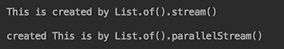

如您所见，`List`保留了元素的顺序，但在并行处理的情况下不保留它。

在“创建和操作流”配方中，我们演示了使用`reduce()`和`collect()`操作时，仅为并行流调用组合器。因此，顺序流处理不需要组合器，但在并行流处理上操作时必须存在组合器。如果没有它，则无法正确聚合多个工作人员的结果。

我们还证明了在并行处理的情况下，`sorted()`、`distinct()`、`limit()`和`skip()`有状态操作会产生不确定的结果。

如果订单很重要，我们已经证明您可以依赖`forEachOrdered()`操作。它不仅保证对流的所有元素进行处理，而且还保证按照其源指定的顺序进行处理，而不管流是顺序的还是并行的。

并行流可以通过`parallelStream()`方法或`parallel()`方法创建。一旦创建，它在处理过程中使用`ForkJoin`框架：将原始流分解为段（子流），然后将这些段（子流）提供给不同的工作线程进行处理，然后聚合（每个子流处理的）所有结果，并作为原始流处理的最终结果显示。在只有一个处理器的计算机上，这样的实现没有优势，因为处理器是共享的。但在多核计算机上，工作线程可以由不同的处理器执行。更重要的是，如果一个工人空闲，它可以从一个忙碌的工人那里偷走一部分工作。然后从所有工作进程中收集结果，并聚合以完成终端操作（即当收集操作的组合器变忙时）。

一般来说，如果有一个资源对于并发访问是不安全的，那么在并行流处理期间使用它也是不安全的。考虑以下两个示例（`ArrayList`不知道是线程安全的）：

```java
List<String> wordsWithI = new ArrayList<>();
Stream.of("That ", "is ", "a ", "Stream.of(literals)")
      .parallel()
      .filter(w -> w.contains("i"))
      .forEach(wordsWithI::add);
System.out.println(wordsWithI);
System.out.println();

wordsWithI = Stream.of("That ", "is ", "a ", "Stream.of(literals)" )
                   .parallel()
                   .filter(w -> w.contains("i"))
                   .collect(Collectors.toList());
System.out.println(wordsWithI);
```

如果运行多次，此代码可能会产生以下结果：


`Collectors.toList()`方法总是生成相同的列表，由`is`和`Stream.of(literals)`组成，而`forEach()`偶尔会错过`is`或`Stream.of(literals)`。

如果可能，首先尝试使用`Collectors`类构造的收集器，避免在并行计算期间共享资源。

总的来说，使用无状态函数是并行流管道的最佳选择。如果有疑问，请测试您的代码，最重要的是，多次运行相同的测试以检查结果是否稳定。*