# 数据库编程

本章介绍 Java 应用程序与**数据库**（**DB**之间的基本和常用交互，从连接到数据库并执行 CRUD 操作到创建事务、存储过程，以及处理**大型对象**（**LOB**）。我们将介绍以下配方：

*   使用 JDBC 连接到数据库
*   设置数据库交互所需的表
*   使用 JDBC 执行 CRUD 操作
*   使用**Hikari 连接池**（**Hikari 连接池**）
*   使用事先准备好的陈述
*   使用事务
*   处理大型对象
*   执行存储过程
*   对大型数据集使用批处理操作
*   使用**MyBatis**进行积垢处理
*   使用**Java 持久化 API**和**Hibernate**

# 介绍

很难想象一个复杂的软件应用程序不使用某种称为数据库的结构化和可访问的数据存储。这就是为什么任何现代语言实现都包含一个框架，允许您访问数据库并在其中创建、读取、更新和删除（**CRUD**）数据。在 Java 中，**Java 数据库连接**（**JDBC**API）提供对任何数据源的访问，从关系数据库到电子表格和平面文件。

基于这种访问，应用程序可以使用数据库语言（例如 SQL）直接操作数据库中的数据，也可以使用**对象关系映射（ORM）**框架间接操作数据库中的数据，该框架允许将内存中的对象映射到数据库中的表。**Java 持久性 API（JPA）**是 Java 的 ORM 规范。使用 ORM 框架时，映射的 Java 对象上的 CRUD 操作会自动转换为数据库语言。最流行的 ORM 框架包括 ApacheCayenne、ApacheOpenJPA、EclipseLink、jOOQ、MyBatis 和 Hibernate，仅举几例。

构成 JDBCAPI 的`java.sql`和`javax.sql`包包含在**Java 平台标准版**（**Java SE**中。`java.sql`包提供 API，用于访问和处理存储在数据源（通常是关系数据库）*中的数据。*`javax.sql`包提供了用于服务器端数据源访问和处理的 API。具体来说，它提供了`DataSource`接口，用于建立与数据库的连接、连接和语句池、分布式事务和行集。包含符合 JPA 的接口的`javax.persistence`包不包含在 Java SE 中，必须作为依赖项添加到 Maven 配置文件`pom.xml`。作为首选 ORM 框架的特定 JPA 实现也必须作为 Maven 依赖项包括在内。在本章中，我们将讨论 JDBC、JPA 和两个 ORM 框架 Hibernate 和 MyBatis 的用法。

要将`DataSource`实际连接到物理数据库，还需要特定于数据库的驱动程序（例如，由数据库供应商提供，如 MySQL、Oracle、PostgreSQL 或 SQL server 数据库）。它可以用 Java 编写，也可以混合使用 Java 和**Java 本机接口**（**JNI**本机方法编写。此驱动程序实现 JDBCAPI。

使用数据库包括八个步骤：

1.  按照供应商的说明安装数据库。
2.  使用特定于数据库的驱动程序将对`.jar`的依赖项添加到应用程序中。
3.  创建用户、数据库和数据库模式表、视图、存储过程等。
4.  从应用程序连接到数据库。
5.  直接使用 JDBC 或间接使用 JPA 构造 SQL 语句。

6.  直接使用 JDBC 执行 SQL 语句或使用 JPA 提交数据更改。
7.  使用执行的结果。
8.  关闭数据库连接和其他资源。

在运行应用程序之前，在数据库设置阶段只执行一次步骤 1–3。

应用程序根据需要重复执行步骤 4–8。

步骤 5–7 可以使用同一数据库连接重复多次。

# 使用 JDBC 连接到数据库

在本食谱中，您将学习如何连接到数据库。

# 怎么做。。。

1.  选择要使用的数据库。有好的商业数据库和好的开源数据库。我们唯一要假设的是，您选择的数据库支持**结构化查询语言**（**SQL**），这是一种标准化语言，允许您对数据库执行 CRUD 操作。在我们的食谱中，我们将使用标准 SQL 并避免特定于特定数据库类型的构造和过程。
2.  如果数据库尚未安装，请按照供应商的说明进行安装。然后，下载数据库驱动程序。最流行的是用 Java 编写的类型 4 和类型 5。它们非常高效，通过套接字连接与数据库服务器进行通信。如果将带有此类驱动程序的`.jar`文件放在类路径上，则会自动加载该文件。类型 4 和 5 驱动程序是特定于数据库的，因为它们使用数据库本机协议访问数据库。我们假设您正在使用这种类型的驱动程序。

如果应用程序必须访问几种类型的数据库，则需要类型 3 的驱动程序。这样的驱动程序可以通过中间件应用服务器与不同的数据库通信。

仅当数据库没有其他可用的驱动程序类型时，才使用类型 1 和 2 的驱动程序。

3.  将下载的`.jar`文件与应用程序类路径上的驱动程序一起设置。现在，您的应用程序可以访问数据库了。
4.  您的数据库可能有控制台、GUI 或其他与之交互的方式。阅读说明，首先创建一个用户，即`cook`，然后创建一个数据库，即`cookbook`。

例如，以下是 PostgreSQL 的命令：

```java
 CREATE USER cook SUPERUSER;
 CREATE DATABASE cookbook OWNER cook;
```

我们为我们的用户选择了`SUPERUSER`角色；但是，一个好的安全实践是将这样一个强大的角色分配给管理员，并创建另一个特定于应用程序的用户，该用户可以管理数据，但不能更改数据库结构。创建另一个称为**模式**的逻辑层是一种很好的做法，它可以拥有自己的一组用户和权限。这样，可以隔离同一数据库中的多个模式，每个用户（其中一个是您的应用程序）只能访问某个模式。

5.  此外，在企业级，通常的做法是为数据库模式创建同义词，以便任何应用程序都不能直接访问原始结构。您甚至可以为每个用户创建一个密码，但是，对于本书来说，这不是必需的。因此，我们让数据库管理员制定适合每个企业特定工作条件的规则和指南。

现在，我们将应用程序连接到数据库。在下面的演示代码中，您可能已经猜到了，我们将使用开源 PostgreSQL 数据库。

# 它是如何工作的。。。

以下是创建到本地 PostgreSQL 数据库连接的代码片段：

```java
String URL = "jdbc:postgresql://localhost/cookbook";
Properties prop = new Properties( );
//prop.put( "user", "cook" );
//prop.put( "password", "secretPass123" );
Connection conn = DriverManager.getConnection(URL, prop);
```

注释行显示如何为连接设置用户和密码。因为，在本演示中，我们保持数据库的开放性，任何人都可以访问，所以我们可以使用重载的`DriverManager.getConnection(String url)`方法。但是，我们将展示最通用的实现，它允许任何人读取属性文件，并将其他有用的值（`ssl`作为真/假，`autoReconnect`作为真/假，`connectTimeout`以秒为单位，等等）传递给连接创建方法。对于所有主要数据库类型，传入属性的许多键都是相同的，但其中一些键是特定于数据库的。

或者，为了只传递用户和密码，我们可以使用第三个重载版本，即`DriverManager.getConnection(String url, String user, String password)`。值得一提的是，对密码进行加密是一种很好的做法。我们不会向您展示如何做到这一点，但网上有很多指南。

另外，`getConnection()`方法抛出`SQLException`，因此我们需要将其包装在`try...catch`块中。

要隐藏所有这些管道，最好将建立连接的代码保存在方法中：

```java
Connection getDbConnection(){
  String url = "jdbc:postgresql://localhost/cookbook";
  try {
    return DriverManager.getConnection(url);
  }
  catch(Exception ex) {
    ex.printStackTrace();
    return null;
  }
}
```

连接数据库的另一种方式是使用`DataSource`接口。它的实现通常包含在与数据库驱动程序相同的`.jar`文件中。对于 PostgreSQL，有两个类实现了`DataSource`接口：`org.postgresql.ds.PGSimpleDataSource`和`org.postgresql.ds.PGPoolingDataSource`。我们可以用它们代替`DriverManager`。以下是使用`PGSimpleDataSource`的示例：

```java
Connection getDbConnection(){
  PGSimpleDataSource source = new PGSimpleDataSource();
  source.setServerName("localhost");
  source.setDatabaseName("cookbook");
  source.setLoginTimeout(10);
  try {
    return source.getConnection();
  }
  catch(Exception ex) {
    ex.printStackTrace();
    return null;
  }
}

```

以下是`PGPoolingDataSource`的用法示例：

```java
Connection getDbConnection(){
  PGPoolingDataSource source = new PGPoolingDataSource();
  source.setServerName("localhost");
  source.setDatabaseName("cookbook");
  source.setInitialConnections(3);
  source.setMaxConnections(10);
  source.setLoginTimeout(10);
  try {
    return source.getConnection();
  }
  catch(Exception ex) {
    ex.printStackTrace();
    return null;
  }
}
```

`getDbConnection()`方法的最新版本通常是首选的连接方式，因为除了通过`DriverManager`连接时可用的功能外，它还允许您使用连接池和其他一些功能。请注意，`PGPoolingDataSource`类已被弃用，因为版本`42.0.0`支持第三方连接池软件。我们前面提到的一个这样的框架，HikariCP，将在配方*中使用 Hikari 连接池*进行讨论和演示。

无论您选择什么版本的`getDbConnection()`实现，您都可以以相同的方式在所有代码示例中使用它。

# 还有更多。。。

最好在不需要时立即关闭连接。方法是使用`try-with-resources`构造，确保在`try...catch`块末尾关闭资源：

```java
try (Connection conn = getDbConnection()) {
  // code that uses the connection to access the DB
} 
catch(Exception ex) { 
  ex.printStackTrace();
}
```

这种构造可以用于实现`java.lang.AutoCloseable`或`java.io.Closeable`接口的任何对象。

# 设置数据库交互所需的表

在本教程中，您将学习如何创建、更改和删除构成数据库架构的表和其他逻辑数据库结构。

# 准备

用于创建表的标准 SQL 语句如下所示：

```java
CREATE TABLE table_name (
  column1_name data_type(size),
  column2_name data_type(size),
  column3_name data_type(size),
  ....
);
```

这里，`table_name`和`column_name`必须是字母数字和唯一（在模式内部）标识符。名称和可能的数据类型的限制是特定于数据库的。例如，Oracle 允许表名包含 128 个字符，而在 PostgreSQL 中，表名和列名的最大长度为 63 个字符。数据类型也存在差异，因此请阅读数据库文档。

# 它是如何工作的。。。

下面是在 PostgreSQL 中创建`traffic_unit`表的命令示例：

```java
CREATE TABLE traffic_unit (
  id SERIAL PRIMARY KEY,
  vehicle_type VARCHAR NOT NULL,
  horse_power integer NOT NULL,
  weight_pounds integer NOT NULL,
  payload_pounds integer NOT NULL,
  passengers_count integer NOT NULL,
  speed_limit_mph double precision NOT NULL,
  traction double precision NOT NULL,
  road_condition VARCHAR NOT NULL,
  tire_condition VARCHAR NOT NULL,
  temperature integer NOT NULL
);
```

`size`参数是可选的。如果未设置，如前面的示例代码中所示，则表示该列可以存储任意长度的值。在本例中，`integer`类型允许您存储从`Integer.MIN_VALUE`（即-2147483648）到`Integer.MAX_VALUE`（即+2147483647）的数字。添加了`NOT NULL`类型，因为默认情况下，该列可以为 null，并且我们希望确保填充所有列。

我们还将`id`列标识为`PRIMARY KEY`，这表示该列（或列的组合）唯一地标识了该记录。例如，如果有一个表包含所有国家的所有人的信息，那么唯一的组合可能是他们的全名、地址和出生日期。好吧，我们可以想象，在一些家庭中，双胞胎出生并有相同的名字，所以我们说*可能*。如果出现这种情况的可能性很高，我们需要在主键组合中添加另一列，这是一个出生顺序，默认值为`1`。以下是我们如何在 PostgreSQL 中做到这一点：

```java
CREATE TABLE person (
  name VARCHAR NOT NULL,
  address VARCHAR NOT NULL,
  dob date NOT NULL,
  order integer DEFAULT 1 NOT NULL,
  PRIMARY KEY (name,address,dob,order)
);
```

在`traffic_unit`表的情况下，没有可以用作主键的列组合。许多汽车在任何列的组合中都具有相同的值。但是我们需要参考`traffic_unit`记录，这样我们就可以知道，例如，哪些单元已经被选择和处理，哪些没有。这就是为什么，我们添加了一个`id`列，用一个唯一生成的数字填充它，我们希望数据库自动生成这个主键。

如果您发出命令`\d traffic_unit`显示表格描述，您将看到分配给`id`列的功能`nextval('traffic_unit_id_seq'::regclass)`。此函数按顺序生成数字，从 1 开始。如果需要不同的行为，请手动创建序列号生成器。下面是一个如何做到这一点的示例：

```java
CREATE SEQUENCE traffic_unit_id_seq 
START WITH 1000 INCREMENT BY 1 
NO MINVALUE NO MAXVALUE CACHE 10; 
ALTER TABLE ONLY traffic_unit ALTER COLUMN id SET DEFAULT nextval('traffic_unit_id_seq'::regclass);
```

如果需要快速连续生成数字，此序列从 1000 开始，缓存 10 个数字以获得更好的性能。

根据前面章节给出的代码示例，`vehicle_type`、`road_condition`和`tire_condition`的值受`enum`类型的限制。这就是为什么在填充`traffic_unit`表时，我们希望确保在列中只能设置相应`enum`类型的值。为此，我们将创建一个名为`enums`的查找表，并使用`enum`类型中的值填充它：

```java
CREATE TABLE enums (
  id integer PRIMARY KEY,
  type VARCHAR NOT NULL,
  value VARCHAR NOT NULL
);

insert into enums (id, type, value) values 
(1, 'vehicle', 'car'),
(2, 'vehicle', 'truck'),
(3, 'vehicle', 'crewcab'),
(4, 'road_condition', 'dry'),
(5, 'road_condition', 'wet'),
(6, 'road_condition', 'snow'),
(7, 'tire_condition', 'new'),
(8, 'tire_condition', 'worn');
```

PostgreSQL 有一个`enum`数据类型，但是如果可能值的列表不是固定的，并且必须随着时间的推移进行更改，则会产生开销。我们认为应用程序中的值列表很可能会扩展。因此，我们决定不使用数据库`enum`类型，而是自己创建查找表。

现在，我们可以使用`enums`表的 ID 作为外键，从`traffic_unit`表中引用`enums`表的值。首先，我们删除该表：

```java
drop table traffic_unit;
```

然后，我们使用稍微不同的 SQL 命令重新创建它：

```java
CREATE TABLE traffic_unit (
  id SERIAL PRIMARY KEY,
  vehicle_type integer REFERENCES enums (id),
  horse_power integer NOT NULL,
  weight_pounds integer NOT NULL,
  payload_pounds integer NOT NULL,
  passengers_count integer NOT NULL,
  speed_limit_mph double precision NOT NULL,
  traction double precision NOT NULL,
  road_condition integer REFERENCES enums (id),
  tire_condition integer REFERENCES enums (id),
  temperature integer NOT NULL
);
```

`vehicle_type`、`road_condition`和`tire_condition`列现在必须由`enums`表相应记录的主键值填充。这样，我们可以确保我们的流量分析代码能够将这些列中的值与代码中的`enum`类型的值相匹配。

# 还有更多。。。

我们还希望确保`enums`表不包含重复的组合类型和值。为了确保这一点，我们可以在`enums`表中添加一个唯一的约束：

```java
ALTER TABLE enums ADD CONSTRAINT enums_unique_type_value 
UNIQUE (type, value);
```

现在，如果我们试图添加一个副本，数据库将不允许它。

创建数据库表的另一个重要考虑因素是是否必须添加索引。*索引*是一种数据结构，有助于加速表中的数据搜索，而无需检查每个表记录。它可以包括表的一列或多列。例如，主键的索引是自动创建的。如果调出我们已经创建的表的说明，您将看到以下内容：

```java
 Indexes: "traffic_unit_pkey" PRIMARY KEY, btree (id)
```

如果我们认为（并通过实验证明）索引有助于提高应用程序性能，我们也可以自己添加索引。在`traffic_unit`的例子中，我们发现我们的代码经常通过`vehicle_type`和`passengers_count`来搜索这个表。因此，我们在搜索过程中测量了代码的性能，并将这两列添加到索引中：

```java
CREATE INDEX idx_traffic_unit_vehicle_type_passengers_count 
ON traffic_unit USING btree (vehicle_type,passengers_count);
```

然后，我们再次测量性能。如果情况确实有所改善，我们将保留索引，但在我们的情况下，我们已将其删除：

```java
drop index idx_traffic_unit_vehicle_type_passengers_count;
```

索引并没有显著提高性能，可能是因为索引有额外写入和存储空间的开销。

在我们的主键、约束和索引示例中，我们遵循了 PostgreSQL 的命名约定。如果您使用不同的数据库，我们建议您查找其命名约定并遵循它，以便您的命名与自动创建的名称保持一致。

# 使用 JDBC 执行 CRUD 操作

在本教程中，您将学习如何使用 JDBC 在中填充、读取、更改和删除数据。

# 准备

我们已经看到了在数据库中创建（填充）数据的 SQL 语句示例：

```java
INSERT INTO table_name (column1,column2,column3,...)
VALUES (value1,value2,value3,...);
```

我们还看到了必须添加多个表记录的实例：

```java
INSERT INTO table_name (column1,column2,column3,...)
VALUES (value1,value2,value3, ... ), 
       (value21,value22,value23, ...), 
       ( ...                       );
```

如果列指定了默认值，则无需在`INSERT INTO`语句中列出它，除非必须插入不同的值。

通过`SELECT`语句从数据库中读取数据：

```java
SELECT column_name,column_name
FROM table_name WHERE some_column=some_value;
```

以下是`WHERE`条款的一般定义：

```java
WHERE column_name operator value
Operator:
  = Equal
  <> Not equal. In some versions of SQL, !=
  > Greater than
  < Less than
  >= Greater than or equal
  <= Less than or equal
  BETWEEN Between an inclusive range
  LIKE Search for a pattern
  IN To specify multiple possible values for a column
```

`column_name operator value`构造可以与逻辑运算符`AND`和`OR`组合，并与括号`(`和`)`分组。

所选值可以按特定顺序返回：

```java
SELECT * FROM table_name WHERE-clause by some_other_column; 
```

顺序可以标记为升序（默认）或降序：

```java
SELECT * FROM table_name WHERE-clause by some_other_column desc; 
```

可以使用`UPDATE`语句更改数据：

```java
UPDATE table_name SET column1=value1,column2=value2,... WHERE-clause;
```

也可以使用`DELETE`语句删除：

```java
DELETE FROM table_name WHERE-clause;
```

如果没有`WHERE`子句，表中的所有记录都将受到`UPDATE`或`DELETE`语句的影响。

# 怎么做。。。

我们已经看到了一个`INSERT`声明。以下是其他类型语句的示例：

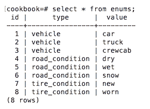

前面的`SELECT`语句从表中所有行的所有列中调出值。为了限制返回的数据量，可以添加一个`WHERE`子句：


以下屏幕截图捕获了三条语句：

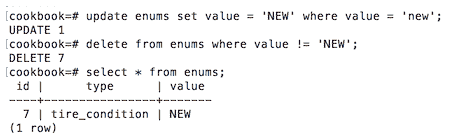

第一个是一个`UPDATE`语句，它将`value`列中的值更改为`NEW`，但仅在`value`列包含值`new`的行中更改（显然，该值区分大小写）。第二条语句删除`value`列中没有值`NEW`的所有行。第三条语句（`SELECT`从所有列的所有行中检索值。

值得注意的是，如果`traffic_unit`表引用`enums`表的记录（作为外键），我们将无法删除这些记录。只有在删除`traffic_unit`表的相应记录后，才能删除`enums`表的记录。

要执行代码中的任何 CRUD 操作，必须首先获取 JDBC 连接，然后创建并执行语句：

```java
try (Connection conn = getDbConnection()) {
  try (Statement st = conn.createStatement()) {
    boolean res = st.execute("select id, type, value from enums");
    if (res) {
      ResultSet rs = st.getResultSet();
      while (rs.next()) {
        int id = rs.getInt(1); 
        String type = rs.getString(2);
        String value = rs.getString(3);
        System.out.println("id = " + id + ", type = " 
                           + type + ", value = " + value);
      }
    } else {
      int count = st.getUpdateCount();
      System.out.println("Update count = " + count);
    }
  }
} catch (Exception ex) { ex.printStackTrace(); }
```

对`Statement`对象使用`try-with-resources`构造是一种很好的做法。关闭`Connection`对象将自动关闭`Statement`对象。但是，当您显式关闭`Statement`对象时，清理会立即进行，而不必等待必要的检查和操作通过框架的各个层传播。

`execute()`方法是三种可以执行语句的方法中最通用的一种。其他两种包括`executeQuery()`（仅适用于`SELECT`报表）和`executeUpdate()`（适用于`UPDATE`、`DELETE`、`CREATE`或`ALTER`报表）。从前面的示例中可以看到，`execute()`方法返回`boolean`，它指示结果是`ResultSet`对象还是仅仅是一个计数。这意味着`execute()`充当`SELECT`语句的`executeQuery()`角色，而`executeUpdate()`充当我们列出的其他语句的`executeQuery()`。

我们可以通过为以下语句序列运行前面的代码来演示这一点：

```java
"select id, type, value from enums"
"insert into enums (id, type, value)" + " values(1,'vehicle','car')"
"select id, type, value from enums"
"update enums set value = 'bus' where value = 'car'"
"select id, type, value from enums"
"delete from enums where value = 'bus'"
"select id, type, value from enums"
```

结果如下：

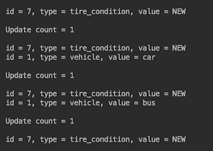

我们使用从`ResultSet`中位置提取值，因为这比使用列名（如`rs.getInt("id")`或`rs.getInt("type")`中）更有效。不过，性能上的差异非常小，只有在操作多次发生时才会变得重要。只有实际的测量和测试才能告诉您这种差异对您的应用程序是否重要。请记住，按名称获取值可以提供更好的代码可读性，这在应用程序维护期间的长期收益很高。

我们使用`execute()`方法进行演示。在实践中，`executeQuery()`方法用于`SELECT`语句：

```java
try (Connection conn = getDbConnection()) {
  try (Statement st = conn.createStatement()) {
    boolean res = st.execute("select id, type, value from enums");
    ResultSet rs = st.getResultSet();
    while (rs.next()) {
        int id = rs.getInt(1); 
        String type = rs.getString(2);
        String value = rs.getString(3);
        System.out.println("id = " + id + ", type = " 
                           + type + ", value = " + value);
    }
  }
} catch (Exception ex) { ex.printStackTrace(); }
```

如您所见，前面的代码不能泛化为将 SQL 语句作为参数接收的方法。提取数据的代码特定于执行的 SQL 语句。相比之下，对`executeUpdate()`的调用可以封装在通用方法中：

```java
void executeUpdate(String sql){
  try (Connection conn = getDbConnection()) {
    try (Statement st = conn.createStatement()) {
      int count = st.executeUpdate(sql);
      System.out.println("Update count = " + count);
    }
  } catch (Exception ex) { ex.printStackTrace(); }
}
```

# 还有更多。。。

SQL 是一种丰富的语言，我们没有足够的空间来涵盖它的所有特性。但我们想列举一些最受欢迎的，以便您了解它们的存在，并在需要时查找它们：

*   `SELECT`语句允许使用`DISTINCT`关键字来消除所有重复值
*   关键字`LIKE`允许您将搜索模式设置为`WHERE`子句
*   搜索模式可以使用多个通配符-`%, _`、`[charlist]`、`[^charlist]`或`[!charlist]`。
*   匹配值可以用`IN`关键字枚举
*   `SELECT`语句可以使用`JOIN`子句包含多个表
*   `SELECT * INTO table_2 from table_1`创建`table_2`并从`table_1`复制数据
*   删除表中的所有行时，`TRUNCATE`速度更快，使用的资源更少

在`ResultSet`接口中还有许多其他有用的方法。下面是一个示例，说明如何使用它的一些方法编写遍历返回结果并使用元数据打印列名和返回值的通用代码：

```java
void traverseRS(String sql){
  System.out.println("traverseRS(" + sql + "):");
  try (Connection conn = getDbConnection()) {
    try (Statement st = conn.createStatement()) {
      try(ResultSet rs = st.executeQuery(sql)){
        int cCount = 0;
        Map<Integer, String> cName = new HashMap<>();
        while (rs.next()) {
          if (cCount == 0) {
            ResultSetMetaData rsmd = rs.getMetaData();
            cCount = rsmd.getColumnCount();
            for (int i = 1; i <= cCount; i++) {
              cName.put(i, rsmd.getColumnLabel(i));
            }
          }
          List<String> l = new ArrayList<>();
          for (int i = 1; i <= cCount; i++) {
            l.add(cName.get(i) + " = " + rs.getString(i));
          }
          System.out.println(l.stream()
                              .collect(Collectors.joining(", ")));
        }
      }
    }
  } catch (Exception ex) { ex.printStackTrace(); }
}
```

我们只使用了一次`ResultSetMetaData`来收集返回的列名和一行的长度（列数）。然后，我们按位置从每行中提取值，并创建具有相应列名的`List<String>`元素。为了打印，我们使用了您已经熟悉的东西—程序员的喜悦—加入收集器（我们在上一章中讨论过）。如果调用`traverseRS("select * from enums")`方法，结果如下：

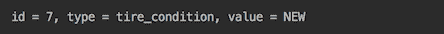

# 使用 Hikari 连接池（HIKARIP）

在本配方中，您将学习如何设置和使用高性能 HikariCP。

# 准备

HikariCP 框架由居住在日本的 Brett Wooldridge 创建。*Hikari*在日语中的意思是*光*。它是一个轻量级且相对较小的 API，经过高度优化，允许通过许多属性进行调优，其中一些属性在其他池中不可用。除了标准用户、密码、最大池大小、各种超时设置和缓存配置属性外，它还公开了诸如`allowPoolSuspension`、`connectionInitSql`、`connectionTestQuery`等属性，甚至包括处理未及时关闭的连接的属性`leakDetectionThreshold`。

要使用 Hikari pool 的最新版本（在编写本书时），请向项目添加以下依赖项：

```java
<dependency>
    <groupId>com.zaxxer</groupId>
    <artifactId>HikariCP</artifactId>
    <version>3.2.0</version>
 </dependency>
```

出于演示目的，我们将使用本章前面的配方中创建的数据库，*使用 JDBC*连接到数据库。我们还将假设您已经研究了这个配方，并且没有必要重复那里所说的关于数据库、JDBC 以及它们如何协同工作的内容。

# 怎么做。。。

有几种方法可以配置 Hikari 连接池。所有这些都基于`javax.sql.DataSource`接口的使用：

1.  最明显、最直接的方法是直接在`DataSource`对象上设置池属性：

```java
HikariDataSource ds = new HikariDataSource();
ds.setPoolName("cookpool");
ds.setDriverClassName("org.postgresql.Driver");
ds.setJdbcUrl("jdbc:postgresql://localhost/cookbook");
ds.setUsername( "cook");
//ds.setPassword("123Secret");
ds.setMaximumPoolSize(10);
ds.setMinimumIdle(2);
ds.addDataSourceProperty("cachePrepStmts", Boolean.TRUE);
ds.addDataSourceProperty("prepStmtCacheSize", 256);
ds.addDataSourceProperty("prepStmtCacheSqlLimit", 2048);
ds.addDataSourceProperty("useServerPrepStmts", Boolean.TRUE);

```

我们已经注释掉了密码，因为我们没有为数据库设置密码。在属性`jdbcUrl`和`dataSourceClassName`之间，一次只能使用其中一个属性，除非使用一些可能需要同时设置这两个属性的旧驱动程序。另外，请注意，当特定属性没有专用的 setter 时，我们是如何使用通用方法`addDataSourceProperty()`的。

要从 PostgreSQL 切换到另一个关系数据库，只需更改驱动程序类名和数据库 URL。还有许多其他财产；其中一些是特定于数据库的，但我们不打算深入讨论这些细节，因为这个配方演示了如何使用 HikariCP。阅读数据库文档，了解特定于数据库的池配置属性，以及如何使用这些属性优化池以获得最佳性能，这在很大程度上取决于特定应用程序与数据库的交互方式。

2.  配置 Hikari 池的另一种方法是使用`HikariConfig`类收集所有属性，然后在`HikariDataSource`构造函数中设置`HikariConfig`对象：

```java
HikariConfig config = new HikariConfig();
config.setPoolName("cookpool");
config.setDriverClassName("org.postgresql.Driver");
config.setJdbcUrl("jdbc:postgresql://localhost/cookbook");
config.setUsername("cook");
//conf.setPassword("123Secret");
config.setMaximumPoolSize(10);
config.setMinimumIdle(2);
config.addDataSourceProperty("cachePrepStmts", true);
config.addDataSourceProperty("prepStmtCacheSize", 256);
config.addDataSourceProperty("prepStmtCacheSqlLimit", 2048);
config.addDataSourceProperty("useServerPrepStmts", true);

HikariDataSource ds = new HikariDataSource(config);

```

如您所见，我们再次使用了通用方法`addDataSourceProperty()`，因为`HikariConfig`类中也没有专门的属性设置器。

3.  反过来，`HikariConfig`对象可以使用类`java.util.Properties`填充数据：

```java
Properties props = new Properties();
props.setProperty("poolName", "cookpool");
props.setProperty("driverClassName", "org.postgresql.Driver");
props.setProperty("jdbcUrl", "jdbc:postgresql://localhost/cookbook");
props.setProperty("username", "cook");
//props.setProperty("password", "123Secret");
props.setProperty("maximumPoolSize", "10");
props.setProperty("minimumIdle", "2");
props.setProperty("dataSource.cachePrepStmts","true");
props.setProperty("dataSource.prepStmtCacheSize", "256");
props.setProperty("dataSource.prepStmtCacheSqlLimit", "2048");
props.setProperty("dataSource.useServerPrepStmts","true");

HikariConfig config = new HikariConfig(props);
HikariDataSource ds = new HikariDataSource(config);

```

请注意，对于在`HikariConfig`类中没有专用设置器的属性，我们使用了前缀`dataSource`。

4.  为了使配置更易于加载，`HikariConfig`类有一个构造函数，它接受带有属性的文件。例如，我们在文件夹`resources`中创建一个名为`database.properties`的文件，其内容如下：

```java
poolName=cookpool
driverClassName=org.postgresql.Driver
jdbcUrl=jdbc:postgresql://localhost/cookbook
username=cook
password=
maximumPoolSize=10
minimumIdle=2
dataSource.cachePrepStmts=true
dataSource.useServerPrepStmts=true
dataSource.prepStmtCacheSize=256
dataSource.prepStmtCacheSqlLimit=2048

```

请注意，我们如何再次使用具有相同属性的前缀`dataSource`。现在，我们可以将前面的文件直接加载到`HikariConfig`构造函数中：

```java
ClassLoader loader = getClass().getClassLoader();
File file = 
   new File(loader.getResource("database.properties").getFile());
HikariConfig config = new HikariConfig(file.getAbsolutePath());
HikariDataSource ds = new HikariDataSource(config);
```

您可以猜到，在幕后，它只是加载属性：

```java
public HikariConfig(String propertyFileName) {
    this();
    this.loadProperties(propertyFileName);
}
```

5.  或者，我们可以使用`HikariConfig`默认构造函数中包含的以下功能：

```java
String systemProp = 
       System.getProperty("hikaricp.configurationFile");
if (systemProp != null) {
    this.loadProperties(systemProp);
}
```

这意味着我们可以如下设置系统属性：

```java
-Dhikaricp.configurationFile=src/main/resources/database.properties
```

然后，我们可以如下配置 HikariCP：

```java
HikariConfig config = new HikariConfig();
HikariDataSource ds = new HikariDataSource(config);

```

池配置的所有前面的方法都会产生相同的结果，因此只能由样式、约定或您的个人喜好来决定使用哪种方法。

# 它是如何工作的。。。

以下方法是使用创建的`DataSource`对象访问数据库，并从表`enums`中选择所有值，这些值是在使用 JDBC 连接数据库的配方*中创建的：*

```java
void readData(DataSource ds) {
   try(Connection conn = ds.getConnection();
      PreparedStatement pst = 
        conn.prepareStatement("select id, type, value from enums");
      ResultSet rs = pst.executeQuery()){
      while (rs.next()) {
            int id = rs.getInt(1);
            String type = rs.getString(2);
            String value = rs.getString(3);
            System.out.println("id = " + id + ", type = " + 
                                      type + ", value = " + value);
      }
   } catch (SQLException ex){
      ex.printStackTrace();
   }
}
```

如果我们运行前面的代码，结果如下：

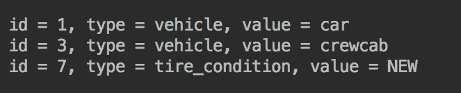

# 还有更多。。。

您可以在 [GitHub](https://github.com/brettwooldridge/HikariCP) 上阅读更多关于 HikariCP 功能的信息。

# 使用事先准备好的陈述

在本食谱中，您将学习如何使用**准备好的语句**——一种可以存储在数据库中并使用不同输入值高效执行的语句模板。

# 准备

`PreparedStatement`的对象`Statement`的子接口可以预编译并存储在数据库中，然后用于针对不同的输入值多次高效地执行 SQL 语句。类似于`Statement`的一个对象（通过`createStatement()`方法创建），可以通过相同`Connection`对象的`prepareStatement()`方法创建。

用于生成`Statement`的 SQL 语句也可以用于生成`PreparedStatement`。事实上，考虑对任何被多次调用的 SQL 语句使用`PrepdaredStatement`是一个好主意，因为它的性能比`Statement`更好。为此，我们只需更改上一节示例代码中的以下两行：

```java
try (Statement st = conn.createStatement()) {
  boolean res = st.execute("select * from enums");

```

我们将这些行更改为以下内容：

```java
try (PreparedStatement st = 
           conn.prepareStatement("select * from enums")) {
  boolean res = st.execute();

```

# 怎么做。。。

`PreparedStatement`的真正有用之处在于它能够接受参数（按外观顺序）替代`?`符号的输入值。下面是一个例子：

```java
traverseRS("select * from enums");
System.out.println();
try (Connection conn = getDbConnection()) {
  String[][] values = {{"1", "vehicle", "car"},
                       {"2", "vehicle", "truck"}};
  String sql = "insert into enums (id, type, value) values(?, ?, ?)");
  try (PreparedStatement st = conn.prepareStatement(sql) {
    for(String[] v: values){
      st.setInt(1, Integer.parseInt(v[0]));
      st.setString(2, v[1]);
      st.setString(3, v[2]);
      int count = st.executeUpdate();
      System.out.println("Update count = " + count);
    }
  }
} catch (Exception ex) { ex.printStackTrace(); }
System.out.println();
traverseRS("select * from enums");

```

结果如下：

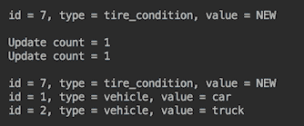

# 还有更多。。。

对于 CRUD 操作，始终使用准备好的语句不是一个坏主意。如果只执行一次，它们可能会变慢，但您可以测试并查看这是否是您愿意付出的代价。通过系统地使用准备好的语句，您将生成一致（可读性更好）的代码，从而提供更高的安全性（准备好的语句不易受到 SQL 注入的攻击）。

# 使用事务

在本教程中，您将了解什么是数据库事务以及如何在 Java 代码中使用它。

# 准备

**事务**是一个工作单元，包括一个或多个更改数据的操作。如果成功，则所有数据更改都是**提交**（应用于数据库）。如果其中一个操作出错，事务将被**回滚**、*，并且事务中包含的任何更改都不会应用于数据库。*

 *在`Connection`对象上设置事务属性。它们可以在不关闭连接的情况下进行更改，因此不同的事务可以重用相同的`Connection`对象。

JDBC 只允许对 CRUD 操作进行事务控制。表修改（`CREATE TABLE`、`ALTER TABLE`等）是自动提交的，不能从 Java 代码控制。

CRUD 操作事务默认设置为**自动提交**。这意味着 SQL 语句引入的每个数据更改都会在该语句执行完成后立即应用于数据库。本章前面的所有示例都使用此默认行为。

要更改此行为，必须使用`Connection`对象的`setAutoCommit(boolean)`方法。如果设置为`false`，则在调用`Connection`对象上的`commit()`方法之前，数据更改不会应用于数据库。此外，如果改为调用`rollback()`方法，则自事务开始或上次调用`commit()`以来的所有数据更改都将被丢弃。

显式编程事务管理提高了性能，但对于只调用一次而不经常调用的短原子操作来说，它是微不足道的。当多个操作引入必须同时应用或不应用的更改时，接管事务控制变得至关重要。它允许将组数据库更改为原子单位，从而避免意外破坏数据完整性。

# 怎么做。。。

首先，让我们为`traverseRS()`方法添加一个输出：

```java
void traverseRS(String sql){
  System.out.println("traverseRS(" + sql + "):");
  try (Connection conn = getDbConnection()) {
    ...
  }
}
```

当在同一个演示示例中执行许多不同的 SQL 语句时，这将帮助您分析输出。

现在，让我们运行以下代码，从`enums`表中读取数据，然后插入一行，然后再次从表中读取所有数据：

```java
traverseRS("select * from enums");
System.out.println();
try (Connection conn = getDbConnection()) {
  conn.setAutoCommit(false);
  String sql = "insert into enums (id, type, value) "
                       + " values(1,'vehicle','car')";
  try (PreparedStatement st = conn.prepareStatement(sql)) {
    System.out.println(sql);
    System.out.println("Update count = " + st.executeUpdate());
  }
  //conn.commit();
} catch (Exception ex) { ex.printStackTrace(); }
System.out.println();
traverseRS("select * from enums");

```

注意，我们通过调用`conn.setAutoCommit(false)`接管了事务控制。结果如下：

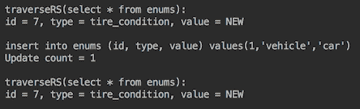

如您所见，由于对`commit()`的调用已被注释掉，因此未应用更改。取消注释后，结果会发生变化：

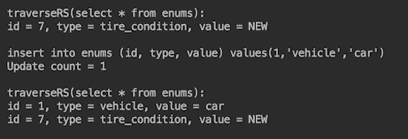

现在，让我们执行两个插入，但在第二个插入中引入拼写错误：

```java
traverseRS("select * from enums");
System.out.println();
try (Connection conn = getDbConnection()) {
  conn.setAutoCommit(false);
  String sql = "insert into enums (id, type, value) "
                       + " values(1,'vehicle','car')";
  try (PreparedStatement st = conn.prepareStatement(sql)) {
    System.out.println(sql);
    System.out.println("Update count = " + st.executeUpdate());
  }
  conn.commit();
  sql = "inst into enums (id, type, value) " 
                     + " values(2,'vehicle','truck')";
  try (PreparedStatement st = conn.prepareStatement(sql)) {
    System.out.println(sql);
    System.out.println("Update count = " + st.executeUpdate());
  }
  conn.commit();
} catch (Exception ex) { ex.printStackTrace(); } //get exception here
System.out.println();
traverseRS("select * from enums");
```

我们得到一个异常堆栈跟踪（我们不显示它以节省空间），并显示以下消息：

```java
org.postgresql.util.PSQLException: ERROR: syntax error at or near "inst"
```

然而，第一次插入成功执行：

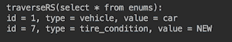

未插入第二行。如果在第一个`INSERT INTO`语句之后没有`conn.commit()`，则也不会应用第一个 insert。这是编程事务控制的优点，在许多独立数据更改的情况下，如果一个失败，我们可以跳过它并继续应用其他更改。

现在，让我们尝试在第二行插入三行有错误的内容（将字母而不是数字设置为`id`值）：

```java
traverseRS("select * from enums");
System.out.println();
try (Connection conn = getDbConnection()) {
  conn.setAutoCommit(false);
  String[][] values = { {"1", "vehicle", "car"},
                        {"b", "vehicle", "truck"},
                        {"3", "vehicle", "crewcab"} };
  String sql = "insert into enums (id, type, value) " 
                            + " values(?, ?, ?)";
  try (PreparedStatement st = conn.prepareStatement(sql)) {
    for (String[] v: values){
      try {
        System.out.print("id=" + v[0] + ": ");
        st.setInt(1, Integer.parseInt(v[0]));
        st.setString(2, v[1]);
        st.setString(3, v[2]);
        int count = st.executeUpdate();
        conn.commit();
        System.out.println("Update count = "+count);
      } catch(Exception ex){
        //conn.rollback();
        System.out.println(ex.getMessage());
      }
    }
  }
} catch (Exception ex) { ex.printStackTrace(); }
System.out.println();
traverseRS("select * from enums");

```

我们将每个插入执行放在`try...catch`块中，并在打印结果（更新计数或错误消息）之前提交更改。结果如下：

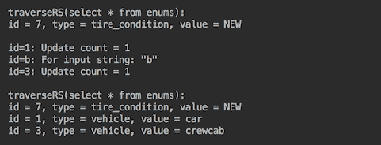

如您所见，第二行没有插入，尽管`conn.rollback()`被注释掉了。为什么？这是因为此事务中包含的唯一 SQL 语句失败，因此没有要回滚的内容。

现在，让我们使用数据库控制台创建一个只有一列`name`的`test`表：

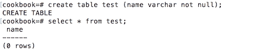

在`enums`表中插入记录之前，我们将在`test`表中插入车辆类型：

```java
traverseRS("select * from enums");
System.out.println();
try (Connection conn = getDbConnection()) {
  conn.setAutoCommit(false);
  String[][] values = { {"1", "vehicle", "car"},
                        {"b", "vehicle", "truck"},
                        {"3", "vehicle", "crewcab"} };
  String sql = "insert into enums (id, type, value) " +
                                        " values(?, ?, ?)";
  try (PreparedStatement st = conn.prepareStatement(sql)) {
    for (String[] v: values){
      try(Statement stm = conn.createStatement()) {
        System.out.print("id=" + v[0] + ": ");
        stm.execute("insert into test values('"+ v[2] + "')");
        st.setInt(1, Integer.parseInt(v[0]));
        st.setString(2, v[1]);
        st.setString(3, v[2]);
        int count = st.executeUpdate();
        conn.commit();
        System.out.println("Update count = " + count);
      } catch(Exception ex){
         //conn.rollback();
         System.out.println(ex.getMessage());
      }
    }
  }
} catch (Exception ex) { ex.printStackTrace(); }
System.out.println();
traverseRS("select * from enums");
System.out.println();
traverseRS("select * from test");

```

如您所见，前面的代码在第二次插入后提交了更改，与前面的示例一样，对于数组`values`的第二个元素，这是不成功的。注释掉`conn.rollback()`后，结果如下：

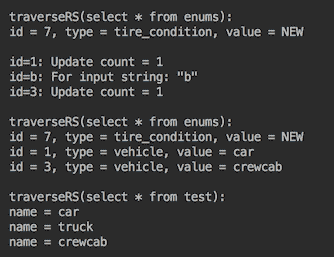

带`truck`的行没有插入`enums`表中，而是添加到`test`表中。也就是说，当回滚的有用性得到证明时。如果我们取消注释`conn.rollback()`，结果如下：

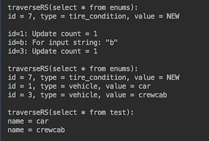

这表明`conn.rollback()`回滚了所有尚未提交的更改。

# 还有更多。。。

事务的另一个重要属性是**事务隔离级别**。它定义了数据库用户之间的边界。例如，其他用户在提交数据库更改之前是否可以看到这些更改？隔离度越高（最高值为**可序列化**），在并发访问相同记录的情况下，事务完成所需的时间越长。隔离的限制性越小（限制性最小的是**read uncommitted**），数据越脏，这意味着其他用户可以获得您尚未提交的值（可能永远不会提交）。

通常，使用默认级别就足够了，它通常是`TRANSACTION_READ_COMMITTED`，尽管对于不同的数据库可能会有所不同。JDBC 允许您通过调用`Connection`对象上的`getTransactionIsolation()`方法来获取当前事务隔离级别。`Connection`对象的`setTransactionIsolation()`方法允许您根据需要设置任何隔离级别。

对于需要提交哪些更改和回滚哪些更改的复杂决策逻辑，可以使用其他两种`Connection`方法创建和删除**保存点**。`setSavepoint(String savepointName)`方法创建一个新的保存点并返回一个`Savepoint`对象，该对象可用于稍后使用`rollback (Savepoint savepoint)`方法回滚到该点的所有更改。可通过调用`releaseSavepoint(Savepoint savepoint)`删除保存点。

最复杂的数据库事务类型是**分布式事务**。它们有时被称为**全局事务**、**XA 事务**或**JTA 事务**（后者是一个 Java API，由两个 Java 包组成，即`javax.transaction`和`javax.transaction.xa`。它们允许创建和执行跨两个不同数据库的操作的事务。提供分布式事务的详细概述超出了本书的范围。

# 处理大型对象

在本配方中，您将学习如何存储和检索可以是三种类型之一的 LOB-**二进制大对象**（**BLOB**）、**字符大对象**（**CLOB**）和**国家字符大对象**（**NCLOB**）。

# 准备

数据库中 LOB 对象的实际处理是特定于供应商的，但是 JDBC API 通过将三种 LOB 类型表示为接口（即`java.sql.Blob`、`java.sql.Clob`和`java.sql.NClob`）来对应用程序隐藏这些实现细节。

`Blob`通常用于存储图像或其他非字母数字数据。在访问数据库的过程中，可以将图像转换为字节流，并使用`INSERT INTO`语句进行存储。`Blob`接口允许您找到对象的长度，并将其转换为字节数组，可以由 Java 处理以显示图像，例如。

`Clob`允许您存储字符数据。`NClob`存储 Unicode 字符数据以支持国际化。它扩展了`Clob`接口并提供了相同的方法。这两个接口都允许您查找 LOB 的长度，并在值中获取子字符串。

`ResultSet`、`CallableStatement`（我们将在下一个配方中讨论）和`PreparedStatement`接口中的方法允许应用程序以各种方式存储和访问存储的值，其中一些方式是通过相应对象的 setter 和 getter，而另一些方式是`bytes[]`或二进制、字符或 ASCII 流。

# 怎么做。。。

每个数据库都有其存储 LOB 的特定方式。在 PostgreSQL 中，`Blob`通常映射到`OID`或`BYTEA`数据类型，而`Clob`和`NClob`则映射到`TEXT`类型。为了演示如何执行此操作，让我们创建可以存储每个大型对象类型的表。我们将编写一个以编程方式创建表的新方法：

```java
void execute(String sql){
  try (Connection conn = getDbConnection()) {
    try (PreparedStatement st = conn.prepareStatement(sql)) {
      st.execute();
    }
  } catch (Exception ex) {
    ex.printStackTrace();
  }
}
```

现在，我们可以创建三个表：

```java
execute("create table images (id integer, image bytea)");
execute("create table lobs (id integer, lob oid)");
execute("create table texts (id integer, text text)");
```

查看 JDBC 接口`PreparedStatement`和`ResultSet`，您会注意到对象的 setter 和 getter—`get/setBlob()`、`get/setClob()`、`get/setNClob()`、`get/setBytes()`——以及使用`InputStream`和`Reader`—`get/setBinaryStream()`、`get/setAsciiStream()`或`get/setCharacterStream()`的方法。流式方法的最大优点是，它们在数据库和源之间移动数据，而无需将整个 LOB 存储在内存中。

然而，对象的 setter 和 getter 更接近我们的心，与面向对象的编码保持一致。因此，我们将从它们开始，使用不太大的对象进行演示。我们希望以下代码能够正常工作：

```java
try (Connection conn = getDbConnection()) {
  String sql = "insert into images (id, image) values(?, ?)";
  try (PreparedStatement st = conn.prepareStatement(sql)) {
    st.setInt(1, 100);
    File file = 
       new File("src/main/java/com/packt/cookbook/ch06_db/image1.png");
    FileInputStream fis = new FileInputStream(file);
    Blob blob = conn.createBlob();   
    OutputStream out = blob.setBinaryStream(1);
    int i = -1;
    while ((i = fis.read()) != -1) {
      out.write(i);
    }
    st.setBlob(2, blob);
    int count = st.executeUpdate();
    System.out.println("Update count = " + count);
  }
} catch (Exception ex) { ex.printStackTrace(); }
```

或者，在`Clob`的情况下，我们编写以下代码：

```java
try (Connection conn = getDbConnection()) {
  String sql = "insert into texts (id, text) values(?, ?)";
  try (PreparedStatement st = conn.prepareStatement(sql)) {
    st.setInt(1, 100);
    File file = new File("src/main/java/com/packt/cookbook/" +
                                    "ch06_db/Chapter06Database.java");
    Reader reader = new FileReader(file);
    st.setClob(2, reader);  
    int count = st.executeUpdate();
    System.out.println("Update count = " + count);
  }
} catch (Exception ex) { ex.printStackTrace(); }
```

事实证明，并非所有 JDBCAPI 中可用的方法都是由所有数据库的驱动程序实现的。例如，`createBlob()`对于 Oracle 和 MySQL 来说似乎工作得很好，但对于 PostgreSQL，我们得到如下结果：

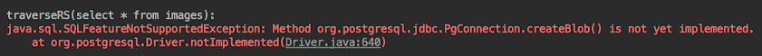

对于`Clob`，我们得到以下信息：

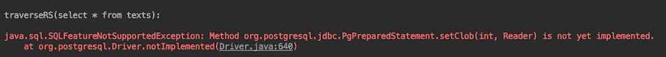

我们也可以尝试通过 getter 从`ResultSet`检索对象：

```java
String sql = "select image from images";
try (PreparedStatement st = conn.prepareStatement(sql)) {
  st.setInt(1, 100);
  try(ResultSet rs = st.executeQuery()){
    while (rs.next()){
      Blob blob = rs.getBlob(1); 
      System.out.println("blob length = " + blob.length());
    }
  }
}
```

结果如下：

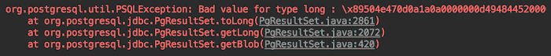

显然，了解 JDBCAPI 是不够的；您还必须阅读数据库的文档。以下是 [PostgreSQL 的文档内容](https://jdbc.postgresql.org/documentation/80/binary-data.html) 所述的 LOB 处理：

"To use the BYTEA data type you should simply use the `getBytes()`, `setBytes()`, `getBinaryStream()`, or `setBinaryStream()` methods.
To use the Large Object functionality you can use either the `LargeObject` class provided by the PostgreSQL JDBC driver, or by using the `getBLOB()` and `setBLOB()` methods."

此外，还必须访问 SQL 事务块中的大型对象。您可以通过调用`setAutoCommit(false)`启动事务块。

在不了解这些细节的情况下，找出处理 LOB 的方法将需要大量时间，并且会导致很多挫折。

在处理 LOB 时，流方法是首选的，因为它们直接将数据从源传输到数据库（或者相反），并且不像 setter 和 getter 那样消耗内存（它们必须首先在内存中加载所有 LOB）。以下是从 PostgreSQL 数据库中传输`Blob`的代码：

```java
traverseRS("select * from images");
System.out.println();
try (Connection conn = getDbConnection()) {
  String sql = "insert into images (id, image) values(?, ?)";
  try (PreparedStatement st = conn.prepareStatement(sql)) {
    st.setInt(1, 100);
    File file = 
       new File("src/main/java/com/packt/cookbook/ch06_db/image1.png");
    FileInputStream fis = new FileInputStream(file);
    st.setBinaryStream(2, fis);
    int count = st.executeUpdate();
    System.out.println("Update count = " + count);
  }
  sql = "select image from images where id = ?";
  try (PreparedStatement st = conn.prepareStatement(sql)) {
    st.setInt(1, 100);
    try(ResultSet rs = st.executeQuery()){
      while (rs.next()){
        try(InputStream is = rs.getBinaryStream(1)){
          int i;
          System.out.print("ints = ");
          while ((i = is.read()) != -1) {
            System.out.print(i);
          }
        }
      }
    }
  }
} catch (Exception ex) { ex.printStackTrace(); }
System.out.println();
traverseRS("select * from images");

```

让我们看看结果。我们在右侧任意剪切了截图；否则，它在水平方向上太长：

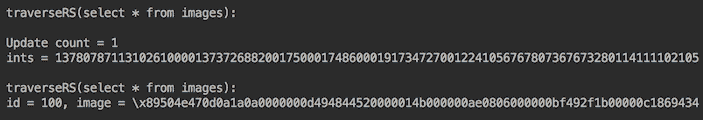

处理检索到的图像的另一种方法是使用`byte[]`：

```java
try (Connection conn = getDbConnection()) {
  String sql =  "insert into images (id, image) values(?, ?)";
  try (PreparedStatement st = conn.prepareStatement(sql)) {
    st.setInt(1, 100);
    File file = 
       new File("src/main/java/com/packt/cookbook/ch06_db/image1.png");
    FileInputStream fis = new FileInputStream(file);
    byte[] bytes = fis.readAllBytes();
    st.setBytes(2, bytes);
    int count = st.executeUpdate();
    System.out.println("Update count = " + count);
  }
  sql = "select image from images where id = ?";
  System.out.println();
  try (PreparedStatement st = conn.prepareStatement(sql)) {
    st.setInt(1, 100);
    try(ResultSet rs = st.executeQuery()){
      while (rs.next()){
        byte[] bytes = rs.getBytes(1);
        System.out.println("bytes = " + bytes);
      }
    }
  }
} catch (Exception ex) { ex.printStackTrace(); }

```

PostgreSQL 将`BYTEA`大小限制为 1GB。较大的二进制对象可以存储为**对象标识符**（**OID**数据类型：

```java
traverseRS("select * from lobs");
System.out.println();
try (Connection conn = getDbConnection()) {
  conn.setAutoCommit(false);
  LargeObjectManager lobm = 
        conn.unwrap(org.postgresql.PGConnection.class)
            .getLargeObjectAPI();
  long lob = lobm.createLO(LargeObjectManager.READ 
                           | LargeObjectManager.WRITE);
  LargeObject obj = lobm.open(lob, LargeObjectManager.WRITE);
  File file = 
       new File("src/main/java/com/packt/cookbook/ch06_db/image1.png");
  try (FileInputStream fis = new FileInputStream(file)){
    int size = 2048;
    byte[] bytes = new byte[size];
    int len = 0;
    while ((len = fis.read(bytes, 0, size)) > 0) {
      obj.write(bytes, 0, len);
    }
    obj.close();
    String sql = "insert into lobs (id, lob) values(?, ?)";
    try (PreparedStatement st = conn.prepareStatement(sql)) {
      st.setInt(1, 100);
      st.setLong(2, lob);
      st.executeUpdate();
    }
  }
    conn.commit();
} catch (Exception ex) { ex.printStackTrace(); }
System.out.println();
traverseRS("select * from lobs");

```

结果如下：

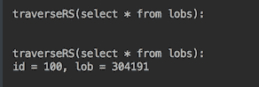

请注意，`select`语句从`lob`列返回一个长值。这是因为`OID`列不像`BYTEA`那样存储值本身。相反，它存储对存储在数据库其他位置的对象的引用。这样的安排使得删除 OID 类型的行不像这样简单：

```java
execute("delete from lobs where id = 100"); 

```

如果这样做，实际对象将成为孤立对象，继续消耗磁盘空间。要避免此问题，必须先执行以下命令`unlink`LOB：

```java
execute("select lo_unlink((select lob from lobs " + " where id=100))");

```

只有这样，您才能安全地执行`delete from lobs where id = 100`命令。

如果您忘记先执行`unlink`，或者您意外地创建了孤立 LOB（例如，由于代码中的错误），那么有一种方法可以在系统表中查找孤立 LOB。同样，数据库文档应该为您提供如何执行此操作的说明。在 PostgreSQL v.9.3 或更高版本中，可以通过执行`select count(*) from pg_largeobject`命令来检查是否有孤立 LOB。如果返回的计数大于 0，则可以通过以下连接删除所有孤立项（假设`lobs`表是唯一可以包含对 LOB 的引用的表）：

```java
SELECT lo_unlink(pgl.oid) FROM pg_largeobject_metadata pgl
WHERE (NOT EXISTS (SELECT 1 FROM lobs ls" + "WHERE ls.lob = pgl.oid));
```

这是在数据库中存储 LOB 所要付出的代价。

值得注意的是，尽管`BYTEA`在删除操作期间不需要如此复杂，但它有一种不同的开销。根据 PostgreSQL 文档，当接近 1GB 时，*与**需要大量内存才能处理如此大的值。*

要读取 LOB 数据，可以使用以下代码：

```java
try (Connection conn = getDbConnection()) {
  conn.setAutoCommit(false);
  LargeObjectManager lobm =      
          conn.unwrap(org.postgresql.PGConnection.class)
              .getLargeObjectAPI();
  String sql = "select lob from lobs where id = ?";
  try (PreparedStatement st = conn.prepareStatement(sql)) {
    st.setInt(1, 100);
    try(ResultSet rs = st.executeQuery()){
      while (rs.next()){
        long lob = rs.getLong(1);
        LargeObject obj = lobm.open(lob, LargeObjectManager.READ);
        byte[] bytes = new byte[obj.size()];
        obj.read(bytes, 0, obj.size());
        System.out.println("bytes = " + bytes);
        obj.close();
      }
    }
  }
  conn.commit();
} catch (Exception ex) { ex.printStackTrace(); }

```

或者，如果 LOB 不是太大，可以通过直接从`ResultSet`对象获取`Blob`来使用更简单的代码：

```java
while (rs.next()){
  Blob blob = rs.getBlob(1);
  byte[] bytes = blob.getBytes(1, (int)blob.length());
  System.out.println("bytes = " + bytes);
}
```

要在 PostgreSQL 中存储`Clob`，可以使用与前面代码相同的代码。在从数据库读取数据时，您可以将字节转换为`String`数据类型或类似的数据类型（同样，如果 LOB 不是太大）：

```java
String str = new String(bytes, Charset.forName("UTF-8"));
System.out.println("bytes = " + str);

```

然而，PostgreSQL 中的`Clob`可以直接存储为数据类型`TEXT`，其大小不受限制。此代码读取写入此代码的文件，并在数据库中存储/检索该文件：

```java
traverseRS("select * from texts");
System.out.println();
try (Connection conn = getDbConnection()) {
  String sql = "insert into texts (id, text) values(?, ?)";
  try (PreparedStatement st = conn.prepareStatement(sql)) {
    st.setInt(1, 100);
    File file = new File("src/main/java/com/packt/cookbook/ch06_db/"
                                          + "Chapter06Database.java");
    try (FileInputStream fis = new FileInputStream(file)) {
      byte[] bytes = fis.readAllBytes();
      st.setString(2, new String(bytes, Charset.forName("UTF-8")));
    }
    int count = st.executeUpdate();
    System.out.println("Update count = " + count);
  }
  sql = "select text from texts where id = ?";
  try (PreparedStatement st = conn.prepareStatement(sql)) {
    st.setInt(1, 100);
    try(ResultSet rs = st.executeQuery()){
      while (rs.next()) {
        String str = rs.getString(1);
        System.out.println(str);
      }
    }
  }
} catch (Exception ex) { ex.printStackTrace(); }
```

结果如下（我们只显示了输出的前几行）：

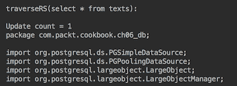

对于较大的对象，流式方法是更好的选择（如果不是唯一的选择）：

```java
traverseRS("select * from texts");
System.out.println();
try (Connection conn = getDbConnection()) {
  String sql = "insert into texts (id, text) values(?, ?)";
  try (PreparedStatement st = conn.prepareStatement(sql)) {
    st.setInt(1, 100);
    File file = new File("src/main/java/com/packt/cookbook/ch06_db/"
                                          + "Chapter06Database.java");
    //This is not implemented:
    //st.setCharacterStream(2, reader, file.length()); 
    st.setCharacterStream(2, reader, (int)file.length());

    int count = st.executeUpdate();
    System.out.println("Update count = " + count);
  }
} catch (Exception ex) { ex.printStackTrace(); }
System.out.println();
traverseRS("select * from texts");
```

请注意，在撰写本书时，`setCharacterStream(int, Reader, long)`尚未实现，而`setCharacterStream(int, Reader, int)`工作正常。

我们还可以从`texts`表中读取文件作为字符流，并将其限制为前 160 个字符：

```java
String sql = "select text from texts where id = ?";
try (PreparedStatement st = conn.prepareStatement(sql)) {
  st.setInt(1, 100);
  try(ResultSet rs = st.executeQuery()){
    while (rs.next()) {
      try(Reader reader = rs.getCharacterStream(1)) {
        char[] chars = new char[160];
        reader.read(chars);
        System.out.println(chars);
      }
    }
  }
}
```

结果如下：

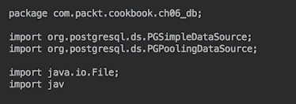

# 还有更多。。。

[这里是 PostgreSQL 文档中的另一条建议](https://jdbc.postgresql.org/documentation/80/binary-data.html)：

“BYTEA 数据类型不太适合存储非常大量的二进制数据。虽然 BYTEA 类型的列最多可以容纳 1 GB 的二进制数据，但它需要大量内存来处理如此大的值。

用于存储二进制数据的大对象方法更适合存储非常大的值，但它有其自身的局限性。 专门删除包含大对象引用的行不会删除大对象。 删除大对象是需要执行的单独操作。 大对象也有一些安全问题，因为连接到数据库的任何人都可以查看和/或修改任何大对象，即使他们没有查看/更新包含大对象引用的行的权限。”

在决定在数据库中存储 LOB 时，您需要记住，数据库越大，维护它就越困难。选择数据库作为存储设施的主要优势是访问速度也会降低，而且不可能为 LOB 类型创建索引来改进搜索。此外，除了少数 CLOB 情况外，您不能在`WHERE`子句中使用 LOB 列，也不能在`INSERT`或`UPDATE`语句的多行中使用 LOB 列。

因此，在考虑一个 LoB 数据库之前，您应该始终考虑是否将数据库中的文件名、关键字和其他内容属性存储在解决方案中。

# 执行存储过程

在本教程中，您将学习如何从 Java 程序执行数据库存储过程。

# 准备

偶尔，Java 程序员会遇到操作和/或从多个表中选择数据的需要，因此程序员会提出一组复杂的 SQL 语句，这些语句在 Java 中无法实现，或者强烈怀疑 Java 实现可能不会产生足够的性能。此时，可以将 SQL 语句集包装到一个存储过程中，该存储过程被编译并存储在数据库中，然后通过 JDBC 接口调用。或者，命运的另一个转折点是，Java 程序员可能需要将对现有存储过程的调用合并到程序中。为了实现这一点，可以使用接口`CallableStatement`（它扩展了`PreparedStatement`接口），尽管有些数据库允许您使用接口`Statement`或`PreparedStatement`调用存储过程。

`CallableStatement`可以有三种类型的参数-`IN`用于输入值，`OUT`用于结果，`IN OUT`用于输入或输出值。`OUT`参数必须通过`CallableStatement`的`registerOutParameter()`方法注册。`IN`参数的设置方式与`PreparedStatement`参数相同。

请记住，以编程方式从 Java 执行存储过程是标准化程度最低的领域之一。例如，PostgreSQL 不直接支持存储过程，但它们可以作为函数调用，通过将`OUT`参数解释为返回值来修改函数。另一方面，Oracle 也允许函数使用`OUT`参数。

这就是为什么数据库函数和存储过程之间的以下差异只能作为一般准则，而不能作为正式定义：

*   函数有一个返回值，但它不允许使用`OUT`参数（某些数据库除外），并且可以在 SQL 语句中使用。
*   存储过程没有返回值（某些数据库除外）；它允许`OUT`参数（对于大多数数据库），并且可以使用 JDBC 接口`CallableStatement`执行。

这就是为什么阅读数据库文档以了解如何执行存储过程非常重要的原因。

由于存储过程是在数据库服务器上编译和存储的，`CallableStatement`的`execute()`方法对同一 SQL 语句的性能优于`Statement`或`PreparedStatement`的相应方法。这就是为什么很多 Java 代码有时会被一个或多个存储过程（甚至包括业务逻辑）所取代的原因之一。但是对于每一个案例和问题都没有正确的答案，因此我们将避免提出具体的建议，除了重复关于测试的价值和您正在编写的代码的清晰性的熟悉咒语。

# 怎么做。。。

与前面的方法一样，我们将继续使用 PostgreSQL 数据库进行演示。在编写自定义 SQL 语句、函数和存储过程之前，应该首先查看现有函数的列表。通常，它们提供了丰富的功能。

下面是调用`replace(string text, from text, to text)`函数的一个示例，该函数搜索第一个参数（`string text`），并用第三个参数（`string text`提供的子字符串替换与第二个参数（`from text` 匹配的所有子字符串：

```java
String sql = "{ ? = call replace(?, ?, ? ) }";
try (CallableStatement st = conn.prepareCall(sql)) {
  st.registerOutParameter(1, Types.VARCHAR);
  st.setString(2, "Hello, World! Hello!");
  st.setString(3, "llo");
  st.setString(4, "y");
  st.execute();
  String res = st.getString(1);
  System.out.println(res);
}
```

结果如下：


我们将把这个函数合并到我们的自定义函数和存储过程中，向您展示如何做到这一点。

一个存储过程可以完全没有任何参数，可以仅使用`IN`参数，也可以仅使用`OUT`参数，或者两者都使用。结果可能是一个或多个值，或者是一个`ResultSet`对象。以下是在 PostgreSQL 中创建不带任何参数的存储过程的示例：

```java
execute("create or replace function createTableTexts() " 
        + " returns void as " 
        + "$$ drop table if exists texts; "
        + "  create table texts (id integer, text text); "
        + "$$ language sql");

```

在前面的代码中，我们使用了我们已经熟悉的方法`execute()`：

```java
void execute(String sql){
  try (Connection conn = getDbConnection()) {
    try (PreparedStatement st = conn.prepareStatement(sql)) {
      st.execute();
    }
  } catch (Exception ex) {
    ex.printStackTrace();
  }
}
```

此存储过程（它始终是 PostgreSQL 中的一个函数）创建`texts`表（如果表已经存在，则删除它）。您可以在数据库文档中找到用于创建函数的 SQL 语法。这里我们唯一想评论的是，您可以使用单引号，而不是表示函数体的符号`$$`。不过，我们更喜欢`$$`，因为如果需要在函数体中包含单引号，它可以帮助避免单引号转义。

创建并存储在数据库中后，`CallableStatement`可以调用该过程：

```java
String sql = "{ call createTableTexts() }";
try (CallableStatement st = conn.prepareCall(sql)) {
  st.execute();
}
```

或者，可以使用 SQL 语句`select createTableTexts()`或`select * from createTableTexts()`调用它。这两条语句都返回一个`ResultSet`对象（在`createTableTexts()`函数中为`null`，因此我们可以通过我们的方法遍历它：

```java
void traverseRS(String sql){
  System.out.println("traverseRS(" + sql + "):");
  try (Connection conn = getDbConnection()) {
    try (Statement st = conn.createStatement()) {
      try(ResultSet rs = st.executeQuery(sql)){
        int cCount = 0;
        Map<Integer, String> cName = new HashMap<>();
        while (rs.next()) {
          if (cCount == 0) {
            ResultSetMetaData rsmd = rs.getMetaData();
            cCount = rsmd.getColumnCount();
            for (int i = 1; i <= cCount; i++) {
              cName.put(i, rsmd.getColumnLabel(i));
            }
          }
          List<String> l = new ArrayList<>();
          for (int i = 1; i <= cCount; i++) {
            l.add(cName.get(i) + " = " + rs.getString(i));
          }
          System.out.println(l.stream()
                      .collect(Collectors.joining(", ")));
        }
      }
    }
  } catch (Exception ex) { ex.printStackTrace(); }
}
```

我们已经在以前的食谱中使用过这种方法。

可以使用以下语句删除该函数：

```java
drop function if exists createTableTexts(); 
```

现在，让我们将所有这些放在 Java 代码中，创建一个函数，并以三种不同的样式调用它：

```java
execute("create or replace function createTableTexts() " 
        + "returns void as "
        + "$$ drop table if exists texts; "
        + "  create table texts (id integer, text text); "
        + "$$ language sql");
String sql = "{ call createTableTexts() }";
try (Connection conn = getDbConnection()) {
  try (CallableStatement st = conn.prepareCall(sql)) {
    st.execute();
  }
}
traverseRS("select createTableTexts()");
traverseRS("select * from createTableTexts()");
execute("drop function if exists createTableTexts()");

```

结果如下：

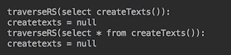

正如所料，返回的`ResultSet`对象是`null`。请注意，函数名不区分大小写。我们将其保留为驼色大小写样式，仅用于人类可读性。

现在，让我们创建并调用另一个具有两个输入参数的存储过程（函数）：

```java
execute("create or replace function insertText(int,varchar)" 
        + " returns void "
        + " as $$ insert into texts (id, text) "
        + "   values($1, replace($2,'XX','ext'));" 
        + " $$ language sql");
String sql = "{ call insertText(?, ?) }";
try (Connection conn = getDbConnection()) {
  try (CallableStatement st = conn.prepareCall(sql)) {
    st.setInt(1, 1);
    st.setString(2, "TXX 1");
    st.execute();
  }
}
execute("select insertText(2, 'TXX 2')");
traverseRS("select * from texts");
execute("drop function if exists insertText()");

```

在函数体中，输入参数按其位置称为`$1`和`$2`。如前所述，在将第二个输入参数插入表之前，我们还使用内置的`replace()`函数来操作其值。新创建的存储过程被调用两次：首先通过`CallableStatment`调用，然后通过`execute()`方法调用，使用不同的输入值。然后，我们使用`traverseRS("select * from texts")`查看了表内部，删除了新创建的函数以执行清理。我们只是为了这个演示放弃了这个函数。在实际代码中，函数一旦创建，就会保留下来，并利用存在、编译和准备运行的优势。

如果我们运行前面的代码，我们将得到以下结果：

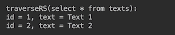

现在，让我们向`texts`表中添加两行，然后查看并创建一个存储过程（函数），该存储过程计算表中的行数并返回结果：

```java
execute("insert into texts (id, text) " 
         + "values(3,'Text 3'),(4,'Text 4')");
traverseRS("select * from texts");
execute("create or replace function countTexts() " 
        + "returns bigint as " 
        + "$$ select count(*) from texts; " 
        + "$$ language sql");
String sql = "{ ? = call countTexts() }";
try (Connection conn = getDbConnection()) {
  try (CallableStatement st = conn.prepareCall(sql)) {
    st.registerOutParameter(1, Types.BIGINT);
    st.execute();
    System.out.println("Result of countTexts() = " + st.getLong(1));
  }
}
traverseRS("select countTexts()");
traverseRS("select * from countTexts()");
execute("drop function if exists countTexts()");

```

注意返回值的`bigint`值和`OUT`参数`Types.BIGINT`的匹配类型。新创建的存储过程执行三次，然后删除。结果如下：

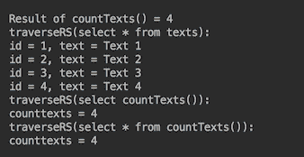

现在，让我们看一个存储过程的示例，其中有一个类型为`int`的输入参数返回`ResultSet`对象：

```java
execute("create or replace function selectText(int) " 
        + "returns setof texts as 
        + "$$ select * from texts where id=$1; " 
        + "$$ language sql");
traverseRS("select selectText(1)");
traverseRS("select * from selectText(1)");
execute("drop function if exists selectText(int)");
```

注意返回类型定义为`setof texts`，其中`texts`是表的名称。如果我们运行前面的代码，结果如下：

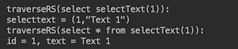

值得分析对存储过程的两个不同调用的`ResultSet`内容的差异。如果没有`select *`，则包含过程的名称和返回的对象（属于`ResultSet`类型）。但对于`select *`，它返回过程中最后一条 SQL 语句的实际`ResultSet`内容。

自然，问题出现了，为什么我们不能通过`CallableStatement`调用此存储过程，如下所示：

```java
String sql = "{ ? = call selectText(?) }";
try (CallableStatement st = conn.prepareCall(sql)) {
  st.registerOutParameter(1, Types.OTHER);
  st.setInt(2, 1);
  st.execute();
  traverseRS((ResultSet)st.getObject(1));
}

```

我们试过了，但没有成功。以下是 PostgreSQL 文档对此的说明：

以集合形式返回数据的函数不应通过 CallableStatement 接口调用，而应使用普通语句或 PreparedStatement 接口

不过，有一种方法可以绕过这一限制。相同的数据库文档描述了如何检索`refcursor`（PostgreSQL 特定功能）值，然后将其转换为`ResultSet`：

```java
execute("create or replace function selectText(int) " 
        + "returns refcursor " +
        + "as $$ declare curs refcursor; " 
        + " begin " 
        + "   open curs for select * from texts where id=$1;" 
        + "     return curs; " 
        + " end; " 
        + "$$ language plpgsql");
String sql = "{ ? = call selectText(?) }";
try (Connection conn = getDbConnection()) {
  conn.setAutoCommit(false);
  try(CallableStatement st = conn.prepareCall(sql)){
    st.registerOutParameter(1, Types.OTHER);
    st.setInt(2, 2);
    st.execute();
    try(ResultSet rs = (ResultSet) st.getObject(1)){
      System.out.println("traverseRS(refcursor()=>rs):");
      traverseRS(rs);
    }
  }
}
traverseRS("select selectText(2)");
traverseRS("select * from selectText(2)");
execute("drop function if exists selectText(int)");

```

关于前面代码的一些注释可能有助于您理解这是如何完成的：

*   必须关闭自动提交。
*   在函数内部，`$1`表示第一个`IN`参数（不包括`OUT`参数）。
*   语言设置为`plpgsql`以访问`refcursor`功能（PL/pgSQL 是 PostgreSQL 数据库的可加载过程语言）。
*   为了遍历`ResultSet`，我们编写了一个新方法，如下所示：

```java
        void traverseRS(ResultSet rs) throws Exception {
          int cCount = 0;
          Map<Integer, String> cName = new HashMap<>();
          while (rs.next()) {
            if (cCount == 0) {
              ResultSetMetaData rsmd = rs.getMetaData();
              cCount = rsmd.getColumnCount();
              for (int i = 1; i <= cCount; i++) {
                cName.put(i, rsmd.getColumnLabel(i));
              }
            }
            List<String> l = new ArrayList<>();
            for (int i = 1; i <= cCount; i++) {
              l.add(cName.get(i) + " = " + rs.getString(i));
            }
            System.out.println(l.stream()
                      .collect(Collectors.joining(", ")));
          }
        }
```

因此，我们的老朋友`traverseRS(String sql)`方法现在可以重构为以下形式：

```java
void traverseRS(String sql){
  System.out.println("traverseRS(" + sql + "):");
  try (Connection conn = getDbConnection()) {
    try (Statement st = conn.createStatement()) {
      try(ResultSet rs = st.executeQuery(sql)){
        traverseRS(rs);
      }
    }
  } catch (Exception ex) { ex.printStackTrace(); }
}
```

如果我们运行最后一个示例，结果如下：

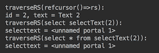

您可以看到，在这种情况下，不提取对象并将其强制转换为`ResultSet`的结果遍历方法不会显示正确的数据。

# 还有更多。。。

我们讨论了最流行的从 Java 代码调用存储过程的情况。本书的范围不允许我们在 PostgreSQL 和其他数据库中展示更复杂和可能有用的存储过程形式。然而，我们想在这里提及它们，以便您了解其他可能性：

*   复合类型上的函数
*   具有参数名的函数
*   参数个数可变的函数
*   参数具有默认值的函数
*   作为表源的函数
*   返回表的函数
*   多态 SQL 函数
*   具有排序规则的函数

# 对大型数据集使用批处理操作

在本教程中，您将学习如何通过对数据库的一次调用来创建和执行多个**批**SQL 语句。

# 准备

当必须同时执行多个 SQL 语句以插入、更新或读取数据库记录时，需要批处理。执行多个 SQL 语句可以通过对它们进行迭代并逐个发送到数据库来完成，但是它会产生网络开销，可以通过同时将所有查询发送到数据库来避免这种开销。

为了避免这种网络开销，可以将所有 SQL 语句组合成一个`String`值，并且每个语句用分号分隔，因此它们可以在一次调用中发送到数据库。返回的结果（如果存在）也将作为每个语句生成的结果集的集合发回。这种处理通常称为批量处理，以区别于仅对`INSERT`和`UPDATE`语句可用的批处理。批处理允许您使用接口`java.sql.Statement`或`java.sql.PreparedStatement`的`addBatch()`方法组合许多 SQL 语句。

我们将使用 PostgreSQL 数据库和下表`person`插入、更新和读取数据：

```java
create table person (
   name VARCHAR NOT NULL,
   age INTEGER NOT NULL
)
```

如您所见，表的每个记录都可以包含人名和年龄两个属性。

# 怎么做。。。

我们将演示**批量处理**和**批量处理**。为了完成它，让我们按照以下步骤操作：

1.  批量处理的一个示例是包含多个`VALUES`子句的单个`INSERT`语句：

```java
INSERT into <table_name> (column1, column2, ...) VALUES 
                         ( value1,  value2, ...),
                         ( value1,  value2, ...),
                          ...
                         ( value1,  value2, ...)
```

构造此类语句的代码如下所示：

```java
int n = 100000;  //number of records to insert
StringBuilder sb = 
 new StringBuilder("insert into person (name,age) values ");
for(int i = 0; i < n; i++){
   sb.append("(")
     .append("'Name").append(String.valueOf(i)).append("',")
     .append(String.valueOf((int)(Math.random() * 100)))
     .append(")");
   if(i < n - 1) {
        sb.append(",");
   }
}
try(Connection conn = getConnection();
    Statement st = conn.createStatement()){
    st.execute(sb.toString());
} catch (SQLException ex){
    ex.printStackTrace();
}
```

如您所见，前面的代码构造了一个包含 100000`VALUES`子句的语句，这意味着它在数据库的一次访问中插入 100000 条记录。在我们的实验中，完成这项工作需要 1082 毫秒。因此，表`person`现在包含 100000 条姓名在`Name0`到`Name99999`之间、年龄在 1 到 99（含）之间的随机数字的记录。

这种批量处理方法有两个缺点：易受 SQL 注入攻击，并且会消耗太多内存。SQL 注入可以通过使用`PreparedStatement`来解决，但受到绑定变量数量的限制。PostgreSQL 不能超过`32767`。这意味着我们需要将单个`PreparedStatement`分解为几个较小的变量，每个变量不超过`32767`绑定变量。顺便说一句，它还将解决内存消耗问题，因为现在每个语句都比大语句小得多。例如，前一条语句包含 200000 个值。

2.  下面的代码通过将单个 SQL 语句拆分为更小的`PreparedStatement`对象来解决这两个问题，每个对象的绑定变量不超过`32766`：

```java
int n = 100000, limit = 32766, l = 0;
List<String> queries = new ArrayList<>();
List<Integer> bindVariablesCount = new ArrayList<>();
String insert = "insert into person (name, age) values ";
StringBuilder sb = new StringBuilder(insert);
for(int i = 0; i < n; i++){
    sb.append("(?, ?)");
    l = l + 2;
    if(i == n - 1) {
        queries.add(sb.toString());
        bindVariablesCount.add(l % limit);
    }
    if(l % limit == 0) {
        queries.add(sb.toString());
        bindVariablesCount.add(limit);
        sb = new StringBuilder(insert);
    } else {
        sb.append(",");
    }
}
try(Connection conn = getConnection()) {
    int i = 0, q = 0;
    for(String query: queries){
        try(PreparedStatement pst = conn.prepareStatement(query)) {
            int j = 0;
            while (j < bindVariablesCount.get(q)) {
                pst.setString(++j, "Name" + String.valueOf(i++));
                pst.setInt(++j, (int)(Math.random() * 100));
            }
            pst.executeUpdate();
            q++;
        }
    }
} catch (SQLException ex){
    ex.printStackTrace();
}
```

前面的代码执行速度与前面的示例一样快。完成此作业花费了 1175 毫秒。但是我们在安装了数据库的同一台计算机上运行了这段代码，因此没有从七次数据库访问中产生的网络开销（这就是添加到`List queries`的查询数量）。但是，正如您所看到的，代码相当复杂。通过使用批处理，它可以大大简化。

3.  批处理基于`addBatch()`和`executeBatch()`方法的使用，这两种方法在`Statement`和`PreparedStatement`接口中都可用。在我们的演示中，我们将使用`PreparedStatement`有两个原因，即它不易受 SQL 注入的影响，并且在多次执行时性能更好（这是`PreparedStatement`的主要目的—利用同一语句多次执行不同值的优势）：

```java
int n = 100000;
String insert = 
           "insert into person (name, age) values (?, ?)";
try (Connection conn = getConnection();
    PreparedStatement pst = conn.prepareStatement(insert)) {
    for (int i = 0; i < n; i++) {
        pst.setString(1, "Name" + String.valueOf(i));
        pst.setInt(2, (int)(Math.random() * 100));
        pst.addBatch();
    }
    pst.executeBatch();
} catch (SQLException ex) {
    ex.printStackTrace();
}
```

在`person`表中插入 100000 条记录花费了 2299 毫秒，与使用一条包含多个`VALUES`子句的语句（第一个示例）或使用多个`PreparedStatement`对象（第二个示例）相比，这几乎是两倍长。虽然它的执行时间较长，但此代码的明显优点是更简单。它在一次行程中将一批语句发送到数据库，这意味着当数据库未与应用程序并置时，此实现与前一个实现（对数据库进行七次行程）之间的性能差距将更小。

但这种实现也可以改进。

4.  为了改进批处理，我们将`reWriteBatchedInserts`属性添加到`DataSource`对象，并将其设置为`true`：

```java
DataSource createDataSource() {
    HikariDataSource ds = new HikariDataSource();
    ds.setPoolName("cookpool");
    ds.setDriverClassName("org.postgresql.Driver");
    ds.setJdbcUrl("jdbc:postgresql://localhost/cookbook");
    ds.setUsername( "cook");
    //ds.setPassword("123Secret");
    ds.setMaximumPoolSize(2);
    ds.setMinimumIdle(2);
    ds.addDataSourceProperty("reWriteBatchedInserts", 
                                            Boolean.TRUE);
    return ds;
}
```

现在，如果我们使用连接`createDataSource().getConnection()`运行相同的批处理代码，插入相同 100000 条记录所需的时间将下降到 750 毫秒，这比我们目前测试的任何实现都要好 25%。而且代码比以前的任何实现都要简单得多。

但是内存消耗呢？

5.  随着批处理大小的增长，JVM 可能会在某个时候耗尽内存。在这种情况下，批处理可以分为几个批，每个批在单独的行程中交付到数据库：

```java
int n = 100000;
int batchSize = 30000;
boolean execute = false;
String insert = 
          "insert into person (name, age) values (?, ?)";
try (Connection conn = getConnection();
    PreparedStatement pst = conn.prepareStatement(insert)) {
    for (int i = 0; i < n; i++) {
        pst.setString(1, "Name" + String.valueOf(i));
        pst.setInt(2, (int)(Math.random() * 100));
        pst.addBatch();
        if((i > 0 && i % batchSize == 0) || 
                                 (i == n - 1 && execute)) {
             pst.executeBatch();
             System.out.print(" " + i); 
                        //prints: 30000 60000 90000 99999
             if(n - 1 - i < batchSize && !execute){
                  execute = true;
             }
        }
    }
    pst.executeBatch();
} catch (SQLException ex) {
    ex.printStackTrace();
}
```

我们使用变量`execute`作为标志，表示如果最后一个批小于`batchSize`值，则在向批添加最后一条语句时需要再次调用`executeBatch()`。从前面代码的注释中可以看出，`executeBatch()`被调用了四次，包括添加最后一条语句时（当`i=99999`时）。在我们的运行中，此代码的性能与不生成多个批处理时的性能相同，因为我们的数据库与应用程序位于同一台计算机上。否则，通过网络交付每个批将增加执行此代码所需的时间。

# 它是如何工作的。。。

上一小节的最后一个示例（步骤 5）是批处理过程的最终实现，可用于插入和更新数据库中的记录。方法`executeBatch()`返回一个`int`数组，如果成功，该数组指示批处理中每个语句更新了多少行。在`INSERT`语句的情况下，该值等于-2（负 2），这是静态常数`Statement.SUCCESS_NO_INFO`的值。值-3（负三）是常量`Statement.EXECUTE_FAILED`的值，表示语句失败。

如果返回的更新行数预计大于`Integer.MAX_VALUE`，则使用`long[] executeLargeBatch()`方法执行批处理。

没有从数据库读取数据的批处理。要批量读取数据，可以将多条语句作为一个字符串发送到数据库，然后对返回的多个结果集进行迭代。例如，让我们提交`SELECT`语句，计算从 1 到 99（含）的每个年龄值的记录数：

```java
int minAge = 0, maxAge = 0, minCount = n, maxCount = 0;
StringBuilder sb = new StringBuilder();
for (int i = 0; i < 100; i++) {
    sb.append("select count(*) from person where age = ")
                                          .append(i).append(";");
}
try (Connection conn = getConnection();
     PreparedStatement pst = conn.prepareStatement(sb.toString())) {
    boolean hasResult = pst.execute();
    int i = 0;
    while (hasResult){
        try (ResultSet rs = pst.getResultSet()) {
            rs.next();
            int c = rs.getInt(1);
            if(c < minCount) {
                minAge = i;
                minCount = c;
            }
            if(c > maxCount) {
                maxAge = i;
                maxCount = c;
            }
            i++;
            hasResult = pst.getMoreResults();
        }
    }
} catch (SQLException ex) {
    ex.printStackTrace();
}
System.out.println("least popular age=" + minAge + "(" + minCount + 
             "), most popular age=" + maxAge + "(" + maxCount + ")");

```

在我们的测试运行中，执行前面的代码并显示以下消息花费了 2162 毫秒：

```java
least popular age=14(929), most popular age=10(1080)
```

# 还有更多。。。

也可以使用`COPY`命令在 PostgreSQL 数据库中来回移动大量数据，该命令将数据复制到文件中或从文件中复制数据。您可以在[数据库文档](https://www.postgresql.org/docs/current/static/sql-copy.html)中了解更多信息。

# 使用 MyBatis 进行 CRUD 操作

在前面的方法中，当使用 JDBC 时，我们有编写代码，它从查询返回的`ResultSet`对象中提取查询结果。这种方法的缺点是，您必须编写相当多的样板代码来创建和填充表示数据库中记录的域对象。正如我们在本章导言中已经提到的，有几个 ORM 框架可以为您实现这一点，并自动创建相应的域对象（或者，换句话说，将数据库记录映射到相应的域对象）。当然，每一个这样的框架都会在构造 SQL 语句时失去一些控制和灵活性。因此，在提交到特定的 ORM 框架之前，您需要研究和试验不同的框架，以找到一个能够提供应用程序在数据库方面所需的一切并且不会产生太多开销的框架。

在本教程中，您将了解 SQL 映射器工具 MyBatis，与直接使用 JDBC 相比，它简化了数据库编程。

# 准备

MyBatis 是一个轻量级的 ORM 框架，它不仅允许将结果映射到 Java 对象，还允许执行任意 SQL 语句。主要有两种方法来描述映射：

*   使用 Java 注释
*   使用 XML 配置

在这个配方中，我们将使用 XML 配置。但是，无论您喜欢什么样式，都需要创建类型为`org.apache.ibatis.session.SqlSessionFactory`的对象，然后使用它创建类型为`org.apache.ibatis.session.SqlSession`的对象来启动 MyBatis 会话：

```java
InputStream inputStream = Resources.getResourceAsStream(configuration);
SqlSessionFactory sqlSessionFactory = 
                     new SqlSessionFactoryBuilder().build(inputStream);
SqlSession session = sqlSessionFactory.openSession();
```

`SqlSessionFactoryBuilder`对象有九个重载的`build()`方法来创建`SqlSession`对象。这些方法允许配置 SQL 执行环境。使用它们，您可以定义以下内容：

*   无论您是喜欢自动提交数据库更改还是显式执行更改（我们在示例中使用后者）
*   您是使用已配置的数据源（如我们的示例中所示）还是使用外部提供的数据库连接
*   您是要使用默认的特定于数据库的事务隔离级别（如我们的示例中所示），还是要设置自己的事务隔离级别
*   您将使用以下哪一个`ExecutorType`值—`SIMPLE`（默认情况下，为语句的每次执行创建一个新的`PreparedStatement`）、`REUSE`（重用`PreparedStatements`）或`BATCH`（批处理所有更新语句，如果在它们之间执行`SELECT`语句，则根据需要对它们进行标定）
*   此代码部署到哪个环境（`development`、`test`或`production`等），因此将使用配置的相应部分（我们将在稍后讨论）
*   包含数据源配置的`Properties`对象

`SqlSession`对象提供了允许您执行 SQL 映射 XML 文件中定义的`SELECT`、`INSERT`、`UPDATE`和`DELETE`语句的方法。它还允许您提交或回滚当前事务。

我们用于此配方的 Maven 依赖项如下所示：

```java
<dependency>
   <groupId>org.mybatis</groupId>
   <artifactId>mybatis</artifactId>
   <version>3.4.6</version>
</dependency>
```

在撰写本书时，[最新的 MyBatis 文档可在此处找到](http://www.mybatis.org/mybatis-3/index.html)。

# 怎么做。。。

我们将使用 PostgreSQL 数据库和类`Person1`开始 CRUD 操作：

```java
public class Person1 {
    private int id;
    private int age;
    private String name;
    public Person1(){}  //Must be present, used by the framework
    public Person1(int age, String name){
        this.age = age;
        this.name = name;
    }
    public int getId() { return id; }
    public void setName(String name) { this.name = name; }
    @Override
    public String toString() {
        return "Person1{id=" + id + ", age=" + age +
                                  ", name='" + name + "'}";
    }
}
```

我们需要前面的`getId()`方法来获取 ID 值（演示如何通过 ID 查找数据库记录）。方法`setName()`将用于更新数据库记录，方法`toString()`将用于显示结果。我们使用名称`Person1`来区分它与同一类的另一个版本`Person2`，我们将使用它来演示如何实现类与相应表之间的关系。

可以使用以下 SQL 语句创建匹配的数据库表：

```java
create table person1 (
   id SERIAL PRIMARY KEY,
   age INTEGER NOT NULL,
   name VARCHAR NOT NULL
);
```

然后执行以下步骤：

1.  首先创建一个 XML 配置文件。我们将其命名为`mb-config1.xml`并将其放入`resources`下的文件夹`mybatis`。这样，Maven 将把它放在类路径上。另一种选择是将该文件与 Java 代码一起放在任何其他文件夹中，并修改`pom.xml`以告知 Maven 将该文件夹中的`.xml`文件也放在类路径上。`mb-config1.xml`文件的内容如下：

```java
<?xml version="1.0" encoding="UTF-8" ?>
<!DOCTYPE configuration
        PUBLIC "-//mybatis.org//DTD Config 3.0//EN"
        "http://mybatis.org/dtd/mybatis-3-config.dtd">
<configuration>
  <settings>
    <setting name="useGeneratedKeys" value="true"/>
  </settings>
  <typeAliases>
     <typeAlias type="com.packt.cookbook.ch06_db.mybatis.Person1" 
                                                 alias="Person"/>
  </typeAliases>
  <environments default="development">
     <environment id="development">
       <transactionManager type="JDBC"/>
       <dataSource type="POOLED">
          <property name="driver" value="org.postgresql.Driver"/>
          <property name="url" 
                   value="jdbc:postgresql://localhost/cookbook"/>
          <property name="username" value="cook"/>
          <property name="password" value=""/>
        </dataSource>
     </environment>
  </environments>
  <mappers>
      <mapper resource="mybatis/Person1Mapper.xml"/>
  </mappers>
</configuration>
```

`<settings>`标记允许定义一些全局延迟加载值的行为、启用/禁用缓存、设置自动映射行为（是否填充嵌套数据）等等。我们选择全局设置自动生成密钥的使用，因为我们需要用数据库中生成的 ID 填充插入的对象。

`<typeAiases>`标记包含完全限定类名的别名，其工作方式与`IMPORT`语句类似。唯一的区别是别名可以是任何单词，而不仅仅是类名。声明别名后，MyBatis`.xml`文件中的任何其他地方，该类只能由该别名引用。我们将在稍后查看文件`Person1Mapper.xml`的内容时了解如何执行此操作。

`<environments>`标签包含不同环境的配置。例如，我们可以为环境`env42`进行配置（任何字符串都可以）。然后，在创建一个`SqlSession`对象时，您可以将此名称作为方法`SqlSessionFactory.build()`的参数传递，并使用标签`<environment id="env42"></environment>`中包含的配置。它定义了要使用的事务管理器和数据源。

`TransactionManager`可以是两种类型的 JDBC 之一，它使用数据源提供的连接提交、回滚和管理事务的范围；`MANAGED`不做任何事情，允许容器很好地管理事务的生命周期，它默认关闭连接，但可以通过设置以下属性来更改该行为：

```java

<transactionManager type="MANAGED">
    <property name="closeConnection" value="false"/>
</transactionManager>
```

标记`<mappers>`包含对所有`.xml`文件的引用，这些文件包含映射数据库记录和 Java 对象的 SQL 语句，在本例中就是文件`Person1Mapper.xml`。

2.  创建`Person1Mapper.xml`文件并将其与`mb-config1.xml`文件放在同一文件夹中。该文件可以有您喜欢的任何名称，但它包含映射类`Person1`的数据库记录和对象的所有 SQL 语句，因此为了清晰起见，我们将其命名为`Person1Mapper.xml`：

```java
<?xml version="1.0" encoding="UTF-8" ?>
<!DOCTYPE mapper
        PUBLIC "-//mybatis.org//DTD Mapper 3.0//EN"
        "http://mybatis.org/dtd/mybatis-3-mapper.dtd">
<mapper namespace="mybatis.Person1Mapper">
   <insert id="insertPerson" keyProperty="id" keyColumn="id" 
                                         parameterType="Person">
      insert into Person1 (age, name) values(#{age}, #{name})
   </insert>
   <select id="selectPersonById" parameterType="int" 
                                            resultType="Person">
      select * from Person1 where id = #{id}
   </select>
   <select id="selectPersonsByName" parameterType="string" 
                                           resultType="Person">
      select * from Person1 where name = #{name}
   </select>
   <select id="selectPersons" resultType="Person">
      select * from Person1
   </select>
   <update id="updatePersonById" parameterType="Person">
      update Person1 set age = #{age}, name = #{name} 
                                              where id = #{id}
   </update>
   <delete id="deletePersons"> 
      delete from Person1
   </delete>
</mapper>
```

如您所见，`<mapper>`标记有一个`namespace`属性，用于解析不同位置具有相同名称的文件。它可能与映射器文件位置匹配，也可能不匹配。映射器文件位置在配置文件`mb-config1.xml`中指定为标签`<mapper>`的属性资源（参见上一步）。

标签`<insert>`、`<select>`、`<update>`和`<delete>`的属性在很大程度上是不言自明的。添加属性`keyProperty`、`keyColumn`和`useGeneratedKeys`（在配置`<settings>`中）以使用数据库生成的值填充插入的对象。如果您在全局范围内不需要该属性，则可以从配置中的设置中删除该属性`useGeneratedKeys`，并仅将其添加到希望利用自动生成某些值的 insert 语句中。我们这样做是因为我们希望获得生成的 ID，并在稍后的代码中使用它来演示如何通过 ID 检索记录。

使用`<select>`的 ID 属性和类似的标记来调用它们，以及映射器名称空间值。我们将很快向您展示这是如何完成的。构造`#{id}`是指作为参数传入的值，如果该值是基元类型。否则，传入的对象应该有这样一个字段。不需要在对象上具有 getter。如果存在 getter，它必须符合 JavaBean 方法格式。

对于返回值，默认情况下，列的名称与对象字段或 setter 的名称匹配（必须符合 JavaBean 方法格式）。如果字段（或 setter 名称）和列名不同，可以使用标记`<resultMap>`提供映射。例如，如果表`person`有`person_id`和`person_name`列，而域对象`Person`有`id`和`name`字段，我们可以创建一个映射：

```java
<resultMap id="personResultMap" type="Person">
    <id property="id" column="person_id" />
    <result property="name" column="person_name"/>
</resultMap>
```

该`resultMap`可用于填充域对象`Person`，如下所示：

```java
<select id="selectPersonById" parameterType="int" 
                                  resultMap="personResultMap">
   select person_id, person_name from Person where id = #{id}
</select>
```

或者，也可以使用标准 select 子句别名：

```java
<select id="selectPersonById" parameterType="int" 
                                          resultType="Person">
   select person_id as "id", person_name as "name" from Person 
                                              where id = #{id}
</select>
```

3.  编写在表`person1`中插入记录的代码，然后通过`id`读取该记录：

```java
String resource = "mybatis/mb-config1.xml";
String mapperNamespace = "mybatis.Person1Mapper";
try {
   InputStream inputStream = 
                    Resources.getResourceAsStream(resource);
   SqlSessionFactory sqlSessionFactory = 
          new SqlSessionFactoryBuilder().build(inputStream);
   try(SqlSession session = sqlSessionFactory.openSession()){
       Person1 p = new Person1(10, "John");
       session.insert(mapperNamespace + ".insertPerson", p);
       session.commit();
       p = session.selectOne(mapperNamespace + 
                            ".selectPersonById", p.getId());
        System.out.println("By id " + p.getId() + ": " + p);
    } catch (Exception ex) {
        ex.printStackTrace();
    }
} catch (Exception ex){
    ex.printStackTrace();
}
```

前面的代码将生成一个输出：

```java
By id 1: Person1{id=1, age=10, name='John'}
```

实用程序`Resources`有十种重载方法用于读取配置文件。我们已经描述了如何确保 Maven 将配置和映射器文件放在类路径上。

`SqlSession`对象实现了`AutoCloseable`接口，因此我们可以使用 try with resources 块，而不用担心资源泄漏。`SqlSession`接口提供了很多执行方法，包括重载方法`insert()`、`select()`、`selectList()`、`selectMap()`、`selectOne()`、`update()`、`delete()`，这些方法是最常用、最简单的方法。我们还使用了`insert()`和`selectOne()`。后者确保只返回一个结果。否则，它将抛出一个异常。当用于通过值标识单个记录的列没有唯一约束时，它还会引发异常。这就是为什么我们将`PRIMARY KEY`限定添加到列 ID 中。或者，我们可以只添加一个唯一的约束（将其标记为`PRIMARY KEY`隐式地执行此操作）。

另一方面，`selectList()`方法生成`List`对象，即使只返回一个结果。我们现在将演示这一点。

4.  写入从表`person1`读取所有记录的代码：

```java
List<Person1> list = session.selectList(mapperNamespace 
                                    + ".selectPersons");
for(Person1 p1: list) {
    System.out.println("All: " + p1);
}
```

上述代码将产生以下输出：

```java
All: Person1{id=1, age=10, name='John'}
```

5.  为了演示更新，让我们将`"John"`的名称更改为`"Bill"`，并再次读取`person1`中的所有记录：

```java
List<Person1> list = session.selectList(mapperNamespace 
                      + ".selectPersonsByName", "John");
for(Person1 p1: list) {
    p1.setName("Bill");
    int c = session.update(mapperNamespace + 
                               ".updatePersonById", p1);
    System.out.println("Updated " + c + " records");
}
session.commit();
list = 
 session.selectList(mapperNamespace + ".selectPersons");
for(Person1 p1: list) {
    System.out.println("All: " + p1);
}
```

上述代码将产生以下输出：

```java
Updated 1 records
All: Person1{id=1, age=10, name='Bill'}
```

注意更改是如何提交的：`session.commit()`。如果没有此行，结果是相同的，但更改不会持续，因为默认情况下事务不会自动提交。打开会话时，可将自动提交设置为`true`进行更改：

```java
      SqlSession session = sqlSessionFactory.openSession(true);
```

6.  最后，调用`DELETE`语句并从表`person1`中删除所有记录：

```java
int c = session.delete(mapperNamespace + ".deletePersons");
System.out.println("Deleted " + c + " persons");
session.commit();

List<Person1> list = session.selectList(mapperNamespace + 
                                         ".selectPersons");
System.out.println("Total records: " + list.size());

```

上述代码将产生以下输出：

```java
Deleted 0 persons
Total records: 0
```

7.  要演示 MyBatis 如何支持关系，请创建表`family`和表`person2`：

```java
create table family (
    id SERIAL PRIMARY KEY,
    name VARCHAR NOT NULL
);
create table person2 (
    id SERIAL PRIMARY KEY,
    age INTEGER NOT NULL,
    name VARCHAR NOT NULL,
    family_id INTEGER references family(id) 
                             ON DELETE CASCADE
);
```

如您所见，表`family`和`person2`中的记录具有一对多关系。表`person2`的每条记录可能属于一个族（参考`family`记录），也可能不属于一个族。几个人可以属于同一个家庭。我们还增加了`ON DELETE CASCADE`条款，以便`person2`记录在其所属家庭被删除时可以自动删除。

相应的 Java 类如下所示：

```java
class Family {
    private int id;
    private String name;
    private final List<Person2> members = new ArrayList<>();
    public Family(){}  //Used by the framework
    public Family(String name){ this.name = name; }
    public int getId() { return id; }
    public String getName() { return name; }
    public List<Person2> getMembers(){ return this.members; }
}
```

如您所见，类`Family`有一组`Person2`对象。对于`getId()`和`getMembers()`方法，我们需要与`Person2`类建立关系。将使用`getName()`方法作为演示代码。

类`Person2`如下所示：

```java
class Person2 {
    private int id;
    private int age;
    private String name;
    private Family family;
    public Person2(){}  //Used by the framework
    public Person2(int age, String name, Family family){
        this.age = age;
        this.name = name;
        this.family = family;
    }
    @Override
    public String toString() {
        return "Person2{id=" + id + ", age=" + age +
                 ", name='" + name + "', family='" +
         (family == null ? "" : family.getName())+ "'}";
    }
}
```

8.  创建一个名为`mb-config2.xml`的新配置文件：

```java
<?xml version="1.0" encoding="UTF-8" ?>
<!DOCTYPE configuration
        PUBLIC "-//mybatis.org//DTD Config 3.0//EN"
        "http://mybatis.org/dtd/mybatis-3-config.dtd">
<configuration>
    <settings>
        <setting name="useGeneratedKeys" value="true"/>
    </settings>
    <typeAliases>
       <typeAlias type="com.packt.cookbook.ch06_db.mybatis.Family" 
                                                    alias="Family"/>
       <typeAlias type="com.packt.cookbook.ch06_db.mybatis.Person2" 
                                                    alias="Person"/>
    </typeAliases>
    <environments default="development">
       <environment id="development">
          <transactionManager type="JDBC"/>
          <dataSource type="POOLED">
             <property name="driver" value="org.postgresql.Driver"/>
             <property name="url" 
                      value="jdbc:postgresql://localhost/cookbook"/>
             <property name="username" value="cook"/>
             <property name="password" value=""/>
          </dataSource>
       </environment>
    </environments>
    <mappers>
        <mapper resource="mybatis/FamilyMapper.xml"/>
        <mapper resource="mybatis/Person2Mapper.xml"/>
    </mappers>
</configuration>
```

请注意，我们现在有两个别名和两个 mapper`.xml`文件。

9.  `Person2Mapper.xml`文件的内容比我们以前使用的`Person1Mapper.xml`文件的内容小得多：

```java
<?xml version="1.0" encoding="UTF-8" ?>
<!DOCTYPE mapper
        PUBLIC "-//mybatis.org//DTD Mapper 3.0//EN"
        "http://mybatis.org/dtd/mybatis-3-mapper.dtd">
<mapper namespace="mybatis.Person2Mapper">
    <insert id="insertPerson" keyProperty="id" keyColumn="id"
                                          parameterType="Person">
        insert into Person2 (age, name, family_id) 
                    values(#{age}, #{name}, #{family.id})
    </insert>
    <select id="selectPersonsCount" resultType="int">
        select count(*) from Person2
    </select>
</mapper>
```

这是因为我们不会直接更新或管理这些人员。我们将通过他们所属的家庭来做到这一点。我们添加了一个新的查询，返回`person2`表中记录的计数。

10.  `FamilyMapper.xml`文件内容如下：

```java
<?xml version="1.0" encoding="UTF-8" ?>
<!DOCTYPE mapper
 PUBLIC "-//mybatis.org//DTD Mapper 3.0//EN"
 "http://mybatis.org/dtd/mybatis-3-mapper.dtd">
<mapper namespace="mybatis.FamilyMapper">
 <insert id="insertFamily" keyProperty="id" keyColumn="id" 
 parameterType="Family">
 insert into Family (name) values(#{name})
 </insert>
 <select id="selectMembersOfFamily" parameterType="int" 
 resultMap="personMap">
 select * from Person2 where family_id = #{id}
 </select>
 <resultMap id="personMap" type="Person">
 <association property="family" column="family_id" 
 select="selectFamilyById"/>
 </resultMap>
 <select id="selectFamilyById" parameterType="int"
 resultType="Family">
 select * from Family where id = #{id}
 </select>
 <select id="selectFamilies" resultMap="familyMap">
 select * from Family
 </select>
 <resultMap id="familyMap" type="Family">
 <collection property="members" column="id" ofType="Person" 
 select="selectMembersOfFamily"/>
 </resultMap>
 <select id="selectFamiliesCount" resultType="int">
 select count(*) from Family
 </select>
 <delete id="deleteFamilies">
 delete from Family
 </delete>

```

家庭映射器的参与度更高，因为我们在其中管理关系。首先，看看查询`selectMembersOfFamily`。如果您不想填充`Person2`对象中的`family`字段，那么 SQL 会简单得多，如下所示：

```java
    <select id="selectMembersOfFamily" parameterType="int" 
 resultType="Person">
        select * from Person2 where family_id = #{id}
    </select>

```

但是我们想在`Person2`对象中设置相应的`Family`对象值，所以我们使用`ResultMap``personMap`只描述默认情况下无法完成的映射，我们使用`<association>`标记使用查询`selectFamilyById`将字段`family`与列`family_id`a 相关联。最后一个查询将不会填充`Family`对象的`members`字段，但我们认为我们的演示不需要它。

我们在查询`selectFamilies`中重用了查询`selectMembersOfFamily`。为了填充`Family`对象的字段`members`，我们创建了一个`ResultMap``familyMap`，它使用`selectMembersOfFamily`来完成此操作。

# 它是如何工作的。。。

让我们编写代码来演示`family`表上的 CRUD 操作。首先，下面介绍如何创建一条`family`记录并将其与两条`person2`记录关联：

```java
String resource = "mybatis/mb-config2.xml";
String familyMapperNamespace = "mybatis.FamilyMapper";
String personMapperNamespace = "mybatis.Person2Mapper";
try {
    InputStream inputStream = Resources.getResourceAsStream(resource);
    SqlSessionFactory sqlSessionFactory =
            new SqlSessionFactoryBuilder().build(inputStream);
    try(SqlSession session = sqlSessionFactory.openSession()){
        Family f = new Family("The Jones");
        session.insert(familyMapperNamespace + ".insertFamily", f);
        System.out.println("Family id=" + f.getId()); //Family id=1

        Person2 p = new Person2(25, "Jill", f);
        session.insert(personMapperNamespace + ".insertPerson", p);
        System.out.println(p); 
          //Person2{id=1, age=25, name='Jill', family='The Jones'}

        p = new Person2(30, "John", f);
        session.insert(personMapperNamespace + ".insertPerson", p);
        System.out.println(p);
          //Person2{id=2, age=30, name='John', family='The Jones'}

        session.commit();
    } catch (Exception ex) {
        ex.printStackTrace();
    }
} catch (Exception ex){
    ex.printStackTrace();
}
```

现在，我们可以使用以下代码读取创建的记录：

```java
List<Family> fList = 
       session.selectList(familyMapperNamespace + ".selectFamilies");
for (Family f1: fList) {
    System.out.println("Family " + f1.getName() + " has " + 
                               f1.getMembers().size() + " members:");
    for(Person2 p1: f1.getMembers()){
        System.out.println("   " + p1);
    }
}
```

前面的代码段生成以下输出：

```java
Family The Jones has 2 members:
 Person2{id=1, age=25, name='Jill', family='The Jones'}
 Person2{id=2, age=30, name='John', family='The Jones'}

```

现在，我们可以删除所有的`family`记录，并检查`family`和`person2`的任何一个表后面是否有记录：

```java
int c = session.delete(familyMapperNamespace + ".deleteFamilies");
System.out.println("Deleted " + c + " families");
session.commit();

c = session.selectOne(familyMapperNamespace + ".selectFamiliesCount");
System.out.println("Total family records: " + c);

c = session.selectOne(personMapperNamespace + ".selectPersonsCount");
System.out.println("Total person records: " + c);

```

前面代码段的输出如下所示：

```java
Deleted 1 families
Total family records: 0
Total person records: 0
```

表`person2`现在也是空的，因为我们在创建表时添加了子句`ON DELETE CASCADE`。

# 还有更多。。。

MyBatis 还提供了构建动态 SQL、SqlBuilder 类的工具，以及许多其他方法来构造和执行任何复杂的 SQL 或存储过程。有关详细信息，请阅读[文档](http://www.mybatis.org/mybatis-3)。

# 使用 Java 持久性 API 和 Hibernate

在此配方中，您将学习如何使用名为**Hibernate 对象关系映射**（**ORM**框架的**Java 持久化 API**（**JPA**实现）填充、读取、更改和删除数据库中的数据。

# 准备

JPA 是定义 ORM 可能解决方案的规范。您可以在以下链接找到 JPA 2.2 版：

```java
http://download.oracle.com/otn-pub/jcp/persistence-2_2-mrel-spec/JavaPersistence.pdf
```

规范中描述的接口、枚举、注释和异常属于包[`javax.persistence`](https://javaee.github.io/javaee-spec/javadocs)。JPA 由几个框架实现，其中最流行的是：

*   [Hibernate ORM](http://hibernate.org/orm)
*   [Eclipse](http://www.eclipse.org/eclipselink)
*   [甲骨文 TopLink](http://www.oracle.com/technetwork/middleware/toplink/overview/index.html)
*   [JOOQ](https://www.jooq.org)

JPA 是围绕使用注释映射到数据库表的 Java bean 而设计的。或者，可以使用 XML 或两者的组合来定义映射。XML 定义的映射将取代注释定义的映射。该规范还为静态和动态数据查询定义了类似 SQL 的查询语言。

大多数 JPA 实现都允许使用注释和 XML 定义的映射创建数据库模式。

# 怎么做。。。

1.  我们先将`javax.persistence`包依赖项添加到 Maven 配置文件`pom.xml`

```java
<dependency>
    <groupId>javax.persistence</groupId>
    <artifactId>javax.persistence-api</artifactId>
    <version>2.2</version>
</dependency>
```

我们还不需要任何 JPA 实现。这样，我们可以确保我们的代码不使用任何特定于框架的代码，只使用 JPA 接口。

2.  创建类`Person1`：

```java
public class Person1 {
    private int age;
    private String name;
    public Person1(int age, String name){
        this.age = age;
        this.name = name;
    }
    @Override
    public String toString() {
        return "Person1{id=" + id + ", age=" + age +
                          ", name='" + name + "'}";
    }
}
```

我们不添加 getter、setter 或任何其他方法；这是为了使我们的代码示例保持简短。根据 JPA 规范，要将该类转换为实体，我们需要将注释`@Entity`添加到类声明中（需要导入`java.persistence.Entity`。这意味着我们希望这个类表示名为`person`的数据库表中的一条记录。默认情况下，实体类的名称与表的名称匹配。但是可以使用注释`@Table(name="<another table name>")`将类映射到另一个名称的表。类似地，每个类属性都映射到具有相同名称的列，并且可以使用注释`@Column (name="<another column name>")`更改默认名称。

此外，实体类必须有一个主键，即注释`@Id`描述的字段。组合多个字段的复合键也可以使用注释`@IdClass`来定义（在我们的示例中没有使用）。如果数据库中的主键是自动生成的，`@GeneratedValue`注释可以放在该字段的前面。

最后，实体类必须有一个没有参数的构造函数。通过所有这些注释，实体类`Person`现在看起来如下所示：

```java
import javax.persistence.Entity;
import javax.persistence.GeneratedValue;
import javax.persistence.GenerationType;
import javax.persistence.Id;

@Entity
public class Person1 {
    @Id
    @GeneratedValue(strategy = GenerationType.IDENTITY)
    private int id;
    public int age;
    private String name;
    public Person1(){}
    public Person1(int age, String name){
        this.age = age;
        this.name = name;
    }
}
```

该类及其任何持久实例变量都不能声明为 final。通过这种方式，实现框架可以扩展实体类并实现所需的功能。

或者，可以将持久性注释添加到 getter 和 setter，而不是实例字段（如果方法名称遵循 JavaBean 约定）。但不允许混淆字段和方法注释，这可能会导致意外的后果。

也可以使用 XML 文件而不是注释来定义 Java 类与数据库表和列之间的映射，但我们将继续使用字段级注释，以便提供最紧凑和清晰的方法来表达意图。

3.  使用以下 SQL 脚本创建名为`person1`的数据库表：

```java
create table person1 (
   id SERIAL PRIMARY KEY,
   age INTEGER NOT NULL,
   name VARCHAR NOT NULL
);
```

我们已经将列`id`定义为`SERIAL`，这意味着每次在表`person1`中插入新行时，我们都会要求数据库自动生成下一个整数值。它匹配类`Person1`的属性`id`的注释。

4.  现在，让我们编写一些代码，将一条记录插入表`person1`，然后从中读取所有记录。要创建、更新和删除实体（以及相应表中的相应记录），您需要使用实体管理器，如`javax.persistence.EntityManager`：

```java
EntityManagerFactory emf = 
      Persistence.createEntityManagerFactory("jpa-demo");
EntityManager em = emf.createEntityManager();
try {
    em.getTransaction().begin();
    Person1 p = new Person1(10, "Name10");
    em.persist(p);
    em.getTransaction().commit();

    Query q = em.createQuery("select p from Person1 p");
    List<Person1> pList = q.getResultList();
    for (Person1 p : pList) {
        System.out.println(p);
    }
    System.out.println("Size: " + pList.size());
} catch (Exception ex){
    em.getTransaction().rollback();
} finally {
    em.close();
    emf.close();
} 
```

如您所见，`EntityManagerFactory`的对象是使用某种配置创建的，即`jpa-demo`。我们将很快讨论这个问题。工厂允许创建`EntityManager`对象，该对象控制持久化过程：创建、提交和回滚事务，存储新的`Person1`对象（从而在表`person1`中插入新记录），支持使用**Java 持久化查询语言**（**JPQL**读取数据），以及许多其他数据库操作和事务管理过程。

实体管理器关闭后，受管实体处于分离状态。要再次与数据库同步，可以使用`EntityManager`的`merge()`方法。

在前面的示例中，我们使用 JPQL 查询数据库。或者，我们也可以使用 JPA 规范定义的标准 API：

```java
CriteriaQuery<Person1> cq = 
       em.getCriteriaBuilder().createQuery(Person1.class);
cq.select(cq.from(Person1.class));
List<Person1> pList = em.createQuery(cq).getResultList();
System.out.println("Size: " + pList.size());

```

但是，JPQL 似乎不那么冗长，并且支持了解 SQL 的程序员的直觉，因此我们将使用 JPQL。

5.  在文件夹`resources/META-INF`中的文件`persistence.xml`中定义持久性配置。标签`<persistence-unit>`有一个属性名。我们已经将属性值设置为`jpa-demo`，但是您可以使用您喜欢的任何其他名称。此配置以 XML 格式指定 JPA 实现（提供程序）、数据库连接属性和许多其他与持久性相关的属性：

```java
<?xml version="1.0" encoding="UTF-8"?>
<persistence  
    xmlns:xsi="http://www.w3.org/2001/XMLSchema-instance"
    xsi:schemaLocation="http://xmlns.jcp.org/xml/ns/persistence
    http://xmlns.jcp.org/xml/ns/persistence/persistence_2_1.xsd"
                                                   version="2.1">
   <persistence-unit name="jpa-demo" 
                               transaction-type="RESOURCE_LOCAL">
     <provider>org.hibernate.jpa.HibernatePersistenceProvider</provider>
     <properties>
       <property name="javax.persistence.jdbc.url" 
                   value="jdbc:postgresql://localhost/cookbook"/>
       <property name="javax.persistence.jdbc.driver" 
                                  value="org.postgresql.Driver"/>
       <property name="javax.persistence.jdbc.user" value="cook"/>
       <property name="javax.persistence.jdbc.password" value=""/>
     </properties>
   </persistence-unit>
</persistence>
```

关于`persistence.xml`文件的配置请参阅 [Oracle 文档](https://docs.oracle.com/cd/E16439_01/doc.1013/e13981/cfgdepds005.htm)。对于这个配方，我们使用了 Hibernate ORM，因此指定了`org.hibernate.jpa.HibernatePersistenceProvider`作为提供者。

6.  最后，我们需要在`pom.xml`中添加 JPA 实现（Hibernate ORM）作为依赖项：

```java
<dependency>
    <groupId>org.hibernate</groupId>
    <artifactId>hibernate-core</artifactId>
    <version>5.3.1.Final</version>
    <scope>runtime</scope>
</dependency>
<dependency>
    <groupId>javax.xml.bind</groupId>
    <artifactId>jaxb-api</artifactId>
    <version>2.3.0</version>
</dependency>

```

正如您可能已经注意到的，我们已经将 Hibernate 依赖项标记为范围为`runtime`。我们这样做是为了避免在编写代码时使用特定于 Hibernate 的特性。我们还添加了由 Hibernate 使用的`jaxb-api`依赖项，但是这个库不是特定于 Hibernate 的，所以我们没有让它只在运行时使用。

7.  为了更好地展示结果，我们将在`Person1`类中添加以下`toString()`方法：

```java
@Override
public String toString() {
    return "Person1{id=" + id + ", age=" + age +
                             ", name='" + name + "'}";
}
```

8.  现在，我们可以运行 JPA 代码示例并观察输出：

```java
Person1{id=1, age=10, name='Name10'}
Size: 1
Size: 1
```

前面输出的前两行来自 JPQL 用法，最后一行来自代码示例的 CriteriaAPI 用法片段。

9.  JPA 还提供了建立类之间关系的条款。实体类（以及相应的数据库表）可以与另一个实体类（及其表）具有一对一、一对多、多对一和多对多的关系。这种关系可以是双向的，也可以是单向的。本规范为双向关系定义了以下规则：

*   反向侧必须使用注释`@OneToOne`、`@OneToMany`或`@ManyToMany`的`mappedBy`属性来引用其拥有侧。
*   一对多和多对一关系的多方必须拥有此关系，因此不能在`@ManyToOne`注释上指定`mappedBy`属性。
*   在一对一关系中，拥有方是包含外键的一方。
*   在多对多关系中，任何一方都可能是拥有方。

对于单向关系，只有一个类引用另一个类。

为了说明这些规则，我们创建一个名为`Family`的类，它与类`Person2`有一对多的关系：

```java
@Entity
public class Family {
    @Id
    @GeneratedValue(strategy = GenerationType.IDENTITY)
    private int id;
    private String name;
    public Family(){}
    public Family(String name){ this.name = name;}

    @OneToMany(mappedBy = "family")
    private final List<Person2> members = new ArrayList<>();

    public List<Person2> getMembers(){ return this.members; }
    public String getName() { return name; }
}
```

创建表`family`的 SQL 脚本非常简单：

```java
create table family (
    id SERIAL PRIMARY KEY,
    name VARCHAR NOT NULL
);
```

我们还需要将`Family`字段添加到类`Person2`：

```java
@Entity
public class Person2 {
    @Id
    @GeneratedValue(strategy = GenerationType.IDENTITY)
    private int id;
    private int age;
    private String name;

    @ManyToOne
    private Family family;

    public Person2(){}
    public Person2(int age, String name, Family family){
        this.age = age;
        this.name = name;
        this.family = family;
    }
    @Override
    public String toString() {
      return "Person2{id=" + id + ", age=" + age +
               ", name='" + name + "', family='" +
         (family == null ? "" : family.getName())+ "'}";
    }
}
```

`Person2`类是一个“多”方，所以根据这个规则，它拥有这个关系，所以表`person2`必须有一个外键指向表`family`的记录：

```java
create table person2 (
    id SERIAL PRIMARY KEY,
    age INTEGER NOT NULL,
    name VARCHAR NOT NULL,
    family_id INTEGER references family(id) 
                             ON DELETE CASCADE
);
```

对列的引用要求此列值唯一。这就是为什么我们将表`person2`的`id`列标记为`PRIMARY KEY`。否则，将引发错误`ERROR: 42830: there is no unique constraint matching given keys for referenced table`。

10.  现在，我们可以使用类`Family`和`Person2`在相应的表中创建记录并从这些表中读取：

```java
EntityManagerFactory emf = 
         Persistence.createEntityManagerFactory("jpa-demo");
    EntityManager em = emf.createEntityManager();
    try {
        em.getTransaction().begin();
        Family f = new Family("The Jones");
        em.persist(f);

        Person2 p = new Person2(10, "Name10", f);  
        em.persist(p);                      

        f.getMembers().add(p);
        em.getTransaction().commit();

        Query q = em.createQuery("select f from Family f");
        List<Family> fList = q.getResultList();
        for (Family f1 : fList) {
            System.out.println("Family " + f1.getName() + ": " 
                      + f1.getMembers().size() + " members:");
            for(Person2 p1: f1.getMembers()){
                System.out.println("   " + p1);
            }
        }
        q = em.createQuery("select p from Person2 p");
        List<Person2> pList = q.getResultList();
        for (Person2 p1 : pList) {
            System.out.println(p1);
        }
    } catch (Exception ex){
        ex.printStackTrace();
        em.getTransaction().rollback();
    } finally {
        em.close();
        emf.close();
    }
}
```

在前面的代码中，我们创建了类`Family`的对象并将其持久化。这样，对象从数据库中获取一个`id`值。然后我们将其传递给类`Person2`的构造函数，并在多个方面建立了关系。然后，我们持久化了`Person2`对象（这样它也从数据库中获取了一个`id`，并将其添加到`Family`对象的集合`members`，从而也建立了关系的一侧。要保留数据，必须提交事务。当事务提交时，与`EntityManager`关联的所有实体对象（这些对象被称为处于**管理的**状态）都会自动持久化。

# 它是如何工作的。。。

如果我们运行前面的代码，结果如下：

```java
Family The Jones: 1 members:
    Person2{id=1, age=10, name='Name10', family='The Jones'}
Person2{id=1, age=10, name='Name10', family='The Jones'}
```

如您所见，这正是我们所期望的，类`Family The Jones`的对象有一个成员类`Person2`的对象，表`person2`中的记录引用表`family`中相应的记录。*