# 并发和多线程编程

并发编程一直是一项困难的任务。这是许多难以解决的问题的根源。在本章中，我们将向您展示合并并发性和一些最佳实践的不同方法，例如不变性，这有助于创建多线程处理。我们还将讨论一些常用模式的实现，例如使用 Java 提供的构造进行分治和发布订阅。我们将介绍以下配方：

*   使用并发线程的基本元素
*   不同的同步方法
*   作为实现并发的一种手段的不变性
*   使用并发集合
*   使用 executor 服务执行异步任务
*   使用 fork/join 实现分治
*   使用流实现发布-订阅模式

# 介绍

并发随着大数据分析进入现代应用程序的主流，并行执行多个过程的能力变得越来越重要。在一个 CPU 中使用 CPU 或多个内核有助于提高吞吐量，但数据量的增长速度总是超过硬件的发展速度。此外，即使在多 CPU 系统中，也必须构造代码并考虑资源共享，以利用可用的计算能力。

在前面的章节中，我们演示了具有功能接口和并行流的 lambda 如何使并发处理成为每个 Java 程序员工具包的一部分。人们可以很容易地利用这一功能，只需最少的指导（如果有的话）。

在本章中，我们将描述其他一些旧的（在 Java9 之前）和新的 Java 特性和 API，它们允许对并发进行更多的控制。自 Java5 以来，高级并发 JavaAPI 就一直存在。JDK 增强方案（JEP）266，[*更多并发更新*](http://openjdk.java.net/jeps/266)，在 Java 9 引入到`java.util.concurrent`包中。

一个可互操作的发布-订阅框架，对 CompletableFuture API 的增强，以及各种其他改进

但在深入了解最新添加的细节之前，让我们先回顾一下 Java 并发编程的基础知识，看看如何使用它们。

Java 有两个执行单元：进程和线程。一个进程通常代表整个 JVM，尽管应用程序可以使用`ProcessBuilder`创建另一个进程。但由于多进程的情况超出了本书的范围，我们将重点讨论第二个执行单元，即线程，它与进程类似，但与其他线程的隔离程度较低，执行所需的资源较少。

一个进程可以运行多个线程，并且至少有一个线程称为*主*线程。线程可以共享资源，包括内存和打开的文件，从而提高效率。但这也带来了一个代价，那就是意外的相互干扰，甚至阻碍执行的风险更高。这就需要编程技能和对并发技术的理解。这就是我们在本章要讨论的。

# 使用并发的基本元素–线程

在本章中，我们将介绍`java.lang.Thread`类，并了解它在并发性和程序性能方面的作用。

# 准备

Java 应用程序作为主线程启动（不包括支持该进程的系统线程）。然后，它可以创建其他线程并让它们并行运行，通过时间切片共享同一个内核，或者为每个线程使用专用 CPU。这可以通过使用`java.lang.Thread`类来完成，该类只使用一个抽象方法`run()`实现`Runnable`功能接口。

创建新线程有两种方式：创建`Thread`的子类，或者实现`Runnable`接口并将实现类的对象传递给`Thread`构造函数。我们可以通过调用`Thread`类的`start()`方法来调用新线程，该方法反过来调用已实现的`run()`方法。

然后，我们可以让新线程运行到完成，或者暂停它，让它再次继续。如果需要，我们还可以访问其属性或中间结果。

# 怎么做。。。

首先，我们创建一个名为`AThread`的类，该类扩展`Thread`并重写其`run()`方法：

```java
class AThread extends Thread {
  int i1,i2;
  AThread(int i1, int i2){
    this.i1 = i1;
    this.i2 = i2;
  }
  public void run() {
    IntStream.range(i1, i2)
             .peek(Chapter07Concurrency::doSomething)
             .forEach(System.out::println);
  }
}
```

在本例中，我们希望线程生成特定范围内的整数流。然后，我们使用`peek()`操作为每个流元素调用主类的`doSomething()`静态方法，以使线程忙碌一段时间。请参阅以下代码：

```java
int doSomething(int i){
  IntStream.range(i, 100000).asDoubleStream().map(Math::sqrt).average();
  return i;
}
```

如您所见，`doSomething()`方法生成一个范围为`i`到`99999`的整数流；然后，它将流转换为双倍流，计算每个流元素的平方根，最后计算流元素的平均值。我们丢弃结果并返回传入的参数，这是一种方便，允许我们在线程的流管道中保持流畅的样式，最后打印出每个元素。使用这个新类，我们可以演示三个线程的并发执行，如下所示：

```java
Thread thr1 = new AThread(1, 4);
thr1.start();

Thread thr2 = new AThread(11, 14);
thr2.start();

IntStream.range(21, 24)
         .peek(Chapter07Concurrency::doSomething)
         .forEach(System.out::println);

```

第一个线程生成整数`1`、`2`和`3`，第二个线程生成整数`11`、`12`和`13`，第三个线程（主线程）生成`21`、`22`和`23`。

如前所述，我们可以通过创建并使用能够实现`Runnable`接口的类来重写相同的程序：

```java
class ARunnable implements Runnable {
  int i1,i2;
  ARunnable(int i1, int i2){
    this.i1 = i1;
    this.i2 = i2;
  }
  public void run() {
    IntStream.range(i1, i2)
             .peek(Chapter07Concurrency::doSomething)
             .forEach(System.out::println);
  }
}
```

可以像这样运行相同的三个线程：

```java
Thread thr1 = new Thread(new ARunnable(1, 4));
thr1.start();

Thread thr2 = new Thread(new ARunnable(11, 14));
thr2.start();

IntStream.range(21, 24)
         .peek(Chapter07Concurrency::doSomething)
         .forEach(System.out::println);

```

我们还可以利用`Runnable`作为函数接口的优势，通过传递 lambda 表达式来避免创建中间类：

```java
Thread thr1 = new Thread(() -> IntStream.range(1, 4)
                  .peek(Chapter07Concurrency::doSomething)
                  .forEach(System.out::println));
thr1.start();

Thread thr2 = new Thread(() -> IntStream.range(11, 14)
                  .peek(Chapter07Concurrency::doSomething)
                  .forEach(System.out::println));
thr2.start();

IntStream.range(21, 24)
         .peek(Chapter07Concurrency::doSomething)
         .forEach(System.out::println);

```

哪种实现更好取决于您的目标和风格。实现`Runnable`有一个优势（在某些情况下，是唯一可能的选择），允许实现扩展另一个类。当您想向现有类添加类似线程的行为时，它特别有用。您甚至可以直接调用`run()`方法，而无需将对象传递给`Thread`构造函数。

当只需要`run()`方法实现时，使用 lambda 表达式胜过`Runnable`实现，不管它有多大。如果它太大，可以使用单独的方法将其隔离：

```java
public static void main(String arg[]) {
  Thread thr1 = new Thread(() -> runImpl(1, 4));
  thr1.start();

  Thread thr2 = new Thread(() -> runImpl(11, 14));
  thr2.start();

  runImpl(21, 24);
}

private static void runImpl(int i1, int i2){
  IntStream.range(i1, i2)
           .peek(Chapter07Concurrency::doSomething)
           .forEach(System.out::println);
}
```

人们将很难想出上述功能的较短实现。

如果我们运行上述任何版本，我们将得到如下输出：

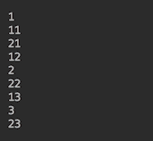

如您所见，这三个线程同时打印它们的编号，但顺序取决于特定的 JVM 实现和底层操作系统。因此，您可能会得到不同的输出。此外，它也可能会随着运行而变化。

`Thread`类有几个构造函数，允许设置线程名称及其所属的组。如果有许多线程并行运行，则对线程进行分组有助于管理它们。该类还有几个方法提供有关线程状态和属性的信息，并允许我们控制线程的行为。将这两行添加到前面的示例中：

```java
System.out.println("Id=" + thr1.getId() + ", " + thr1.getName() + ",
                   priority=" + thr1.getPriority() + ",
                   state=" + thr1.getState());
System.out.println("Id=" + thr2.getId() + ", " + thr2.getName() + ",
                   priority=" + thr2.getPriority() + ",
                   state=" + thr2.getState());
```

前面代码的结果如下所示：

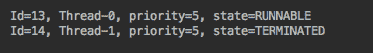

接下来，假设您为每个线程添加了一个名称：

```java
Thread thr1 = new Thread(() -> runImpl(1, 4), "First Thread");
thr1.start();

Thread thr2 = new Thread(() -> runImpl(11, 14), "Second Thread");
thr2.start();

```

在这种情况下，输出将显示以下内容：


线程的`id`是自动生成的，不能更改，但在线程终止后可以重用。另一方面，可以使用相同的名称设置多个线程。可通过编程方式设置执行优先级，设置值介于`Thread.MIN_PRIORITY`和`Thread.MAX_PRIORITY`之间。该值越小，线程运行的时间就越长，这意味着它具有更高的优先级。如果未设置，优先级值默认为`Thread.NORM_PRIORITY`。

线程的状态可以具有以下值之一：

*   `NEW`：线程尚未启动时
*   `RUNNABLE`：执行线程时
*   `BLOCKED`：线程被阻塞并等待监视器锁定时
*   `WAITING`：当一个线程无限期地等待另一个线程执行特定操作时
*   `TIMED_WAITING`：当一个线程等待另一个线程执行某个操作的时间达到指定的等待时间时
*   `TERMINATED`：线程退出时

`sleep()`方法可用于在指定的时间段（以毫秒为单位）内暂停线程执行。互补的`interrupt()`方法向线程发送`InterruptedException`，该线程可用于唤醒*休眠的*线程。让我们在代码中解决这个问题并创建一个新类：

```java
class BRunnable implements Runnable {
  int i1, result;
  BRunnable(int i1){ this.i1 = i1; }
  public int getCurrentResult(){ return this.result; }
  public void run() {
    for(int i = i1; i < i1 + 6; i++){
      //Do something useful here
      this.result = i;
      try{ Thread.sleep(1000);
      } catch(InterruptedException ex){}
    }
  }
}
```

前面的代码生成中间结果，这些结果存储在`result`属性中。每次生成新结果时，线程都会暂停（休眠）一秒钟。在这个特定的示例中（仅为演示目的编写），代码没有做任何特别有用的事情。它只是在一组值上迭代，并将每个值都视为一个结果。在实际代码中，您将根据系统的当前状态进行一些计算，并将计算出的值分配给`result`属性。现在让我们使用这个类：

```java
BRunnable r1 = new BRunnable(1);
Thread thr1 = new Thread(r1);
thr1.start();

IntStream.range(21, 29)
         .peek(i -> thr1.interrupt())
         .filter(i ->  {
           int res = r1.getCurrentResult();
           System.out.print(res + " => ");
           return res % 2 == 0;
         })
         .forEach(System.out::println);

```

前面的代码段生成一个整数流-21、22、…、28。生成每个整数后，主线程中断`thr1`线程，让它生成下一个结果，然后通过`getCurrentResult()`方法访问下一个结果。如果当前结果为偶数，则过滤器允许打印生成的数字流。如果不是，则跳过它。以下是一个可能的结果：

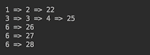

在不同的计算机上，输出可能会有所不同，但您可以理解：通过这种方式，一个线程可以控制另一个线程的输出。

# 还有更多。。。

还有两种支持线程协作的重要方法。第一个是`join()`方法，它允许当前线程等待另一个线程终止。`join()`的重载版本接受定义线程在执行其他操作之前必须等待多长时间的参数。

`setDaemon()`方法可以使线程在所有非守护进程线程终止后自动终止。通常，后台进程线程用于后台进程和支持进程。

# 不同的同步方法

在本教程中，您将了解到在 Java 中管理对公共资源的并发访问的两种最流行的方法：`synchronized method`和`synchronized block`。

# 准备

两个或多个线程在其他线程读取时修改相同的值，这是对并发访问问题的最一般描述。更微妙的问题包括**线程干扰**和**内存一致性错误**，它们都会在看似良性的代码片段中产生意想不到的结果。我们将展示这些案例以及避免它们的方法。

乍一看，这似乎很简单：一次只允许一个线程修改/访问资源，就这样。但是，如果访问需要很长时间，就会造成瓶颈，可能会消除多线程并行工作的优势。或者，如果一个线程在等待访问另一个资源时阻止对一个资源的访问，而第二个线程在等待对第一个资源的访问时阻止对第二个资源的访问，则会产生一个称为**死锁**的问题。这是两个非常简单的例子，说明了程序员在处理多线程时必须解决的可能挑战。

# 怎么做。。。

首先，我们将重现由同时修改相同值引起的问题。让我们创建一个具有`calculate()`方法的`Calculator`类：

```java
class Calculator {
   private double prop;
   public double calculate(int i){
      DoubleStream.generate(new Random()::nextDouble).limit(50);
      this.prop = 2.0 * i;
      DoubleStream.generate(new Random()::nextDouble).limit(100);
      return Math.sqrt(this.prop);
   }
}
```

此方法为特性指定输入值，然后计算其平方根。我们还插入了两行代码，生成 50 和 100 个值的流。我们这样做是为了让方法忙碌一段时间。否则，一切都会很快完成，几乎不可能发生任何并发。在当前线程计算当前线程刚刚分配的值的平方根之前，我们添加 100 个值生成代码，让另一个线程有机会为`prop`字段分配另一个值。

现在我们将在下面的代码片段中使用`calculate()`方法：

```java
Calculator c = new Calculator();
Runnable runnable = () -> System.out.println(IntStream.range(1, 40)
                                   .mapToDouble(c::calculate).sum());
Thread thr1 = new Thread(runnable);
thr1.start();
Thread thr2 = new Thread(runnable);
thr2.start();
```

前面的两个线程同时修改相同`Calculator`对象的相同属性。以下是我们从一次跑步中得到的结果：

```java
231.69407148192175
237.44481627598856
```

如果您在计算机上运行这些示例，但看不到并发的影响，请尝试增加在*减慢*行中生成的双倍数，例如，将`100`替换为`1000`。当线程的结果不同时，这意味着在设置`prop`字段的值和在`calculate()`方法中返回其平方根之间的时间段内，另一个线程设法将不同的值分配给`prop`。这是螺纹干涉的情况。

有两种方法可以防止代码出现此类问题：使用`synchronized method`或`synchronized block`——这两种方法都有助于将代码作为原子操作执行，而不会受到其他线程的任何干扰。

制作`synchronized method`简单明了：

```java
class Calculator{
  private double prop;
 synchronized public double calculate(int i){
     DoubleStream.generate(new Random()::nextDouble).limit(50);
     this.prop = 2.0 * i;
     DoubleStream.generate(new Random()::nextDouble).limit(100);
     return Math.sqrt(this.prop);
  }
}
```

我们只需在方法定义前面添加`synchronized`关键字。现在，两个线程的结果将始终相同：

```java
233.75710300331153
233.75710300331153
```

这是因为在当前线程（已经进入该方法的线程）退出同步方法之前，另一个线程无法进入该方法。如果该方法执行时间较长，则此方法可能会导致性能下降。在这种情况下，可以使用`synchronized block`，它在一个原子操作中不包装整个方法，而只包装几行代码。在我们的例子中，我们可以将生成 50 个值的*慢*代码行移到同步块之外：

```java
class Calculator{
  private double prop;
  public double calculate(int i){
  DoubleStream.generate(new Random()::nextDouble).limit(50);
 synchronized (this) {
       this.prop = 2.0 * i;
       DoubleStream.generate(new Random()::nextDouble).limit(100);
       return Math.sqrt(this.prop);
    }
  }

```

通过这种方式，同步部分要小得多，因此它成为瓶颈的机会更少。

`synchronized block`在任何物体上都会获得一个锁。在一个巨大的类中，您可能没有注意到当前对象（this）被用作几个块的锁。在类上获取的锁更容易受到意外共享的影响。因此，最好使用专用锁：

```java
class Calculator{
  private double prop;
  private Object calculateLock = new Object();
  public double calculate(int i){
    DoubleStream.generate(new Random()::nextDouble).limit(50);
    synchronized (calculateLock) {
       this.prop = 2.0 * i;
       DoubleStream.generate(new Random()::nextDouble).limit(100);
       return Math.sqrt(this.prop);
    }
  }
}
```

专用锁具有更高级别的保证，即该锁将仅用于访问特定块。

我们做了所有这些示例只是为了演示同步方法。如果它们是真正的代码，我们只会让每个线程创建自己的`Calculator`对象：

```java
    Runnable runnable = () -> {
        Calculator c = new Calculator();
        System.out.println(IntStream.range(1, 40)
                .mapToDouble(c::calculate).sum());
    };
    Thread thr1 = new Thread(runnable);
    thr1.start();
    Thread thr2 = new Thread(runnable);
    thr2.start();
```

这与使 lambda 表达式独立于创建它们的上下文的总体思想是一致的。这是因为，在多线程环境中，人们永远不知道上下文在执行过程中会是什么样子。除非必须处理大量数据，否则每次创建新对象的成本可以忽略不计，并且测试确保对象创建开销是显著的。

在多线程环境中，内存一致性错误可能有多种形式和原因。在`java.util.concurrent`包的 Javadoc 中对它们进行了详细的讨论。在这里，我们将只提到最常见的情况，这是由于缺乏可见性造成的。当一个线程更改属性值时，另一个线程可能不会立即看到更改，并且不能对基元类型使用`synchronized`关键字。在这种情况下，考虑对属性使用`volatile`关键字；它保证了不同线程之间的读/写可见性。

# 还有更多。。。

`java.util.concurrent.locks`包装中装配了不同需求、不同行为的不同类型的锁。

`java.util.concurrent.atomic`软件包支持对单变量进行无锁、线程安全的编程。

以下类也提供同步支持：

*   `Semaphore`：这限制了可以访问资源的线程数量
*   `CountDownLatch`：这允许一个或多个线程等待，直到在其他线程中执行的一组操作完成
*   `CyclicBarrier`：这允许一组线程等待彼此到达公共屏障点
*   `Phaser`：这提供了一种更灵活的屏障形式，可用于控制多线程之间的分阶段计算
*   `Exchanger`：这允许两个线程在一个集合点交换对象，在一些管道设计中很有用

Java 中的每个对象都从基本对象继承了`wait()`、`notify()`和`notifyAll()`方法。这些方法还可用于控制线程的行为及其对锁的访问。

`Collections`类具有同步各种集合的方法。但是，这意味着只有对集合的修改可以成为线程安全的，而不是对集合成员的更改。此外，当通过迭代器遍历集合时，它也必须受到保护，因为迭代器不是线程安全的。下面是一个正确使用同步映射的 Javadoc 示例：

```java
 Map m = Collections.synchronizedMap(new HashMap());
 ...
 Set s = m.keySet(); // Needn't be in synchronized block
 ...
 synchronized (m) { // Synchronizing on m, not s!
   Iterator i = s.iterator(); //Must be synchronized block
   while (i.hasNext())
   foo(i.next());
 }
```

作为一名程序员，要想增加更多的内容，您必须意识到以下代码不是线程安全的：

```java
List<String> l = Collections.synchronizedList(new ArrayList<>());
l.add("first");
//... code that adds more elements to the list
int i = l.size();
//... some other code
l.add(i, "last");

```

这是因为尽管`List l`是同步的，但在多线程处理中，很可能其他代码会向列表中添加更多元素或删除元素。

并发问题不容易解决。这就是为什么越来越多的开发人员现在采取更激进的方法并不奇怪。他们宁愿在一组无状态操作中处理数据，而不是管理对象状态。我们在第 5 章、*流和管道*中看到了此类代码的示例。Java 和许多现代语言以及计算机系统似乎正朝着这个方向发展。

# 作为实现并发的一种手段的不变性

在本教程中，您将学习如何使用不变性来解决并发性引起的问题。

# 准备

并发问题通常发生在不同线程修改和读取同一共享资源的数据时。减少修改操作的数量可以减少并发问题的风险。这就是只读值的不变性条件进入的阶段。

对象不变性意味着在创建对象后，缺少更改其状态的方法。它不能保证线程安全，但有助于显著提高线程安全性，并在许多实际应用程序中提供足够的并发保护。

创建新对象而不是重用现有对象（通过 setter 和 getter 更改其状态）通常被认为是一种昂贵的方法。但随着现代计算机的强大，必须进行大量的对象创建，才能对性能产生重大影响。即使是这样，程序员也常常选择性能下降作为获得可预测结果的代价。

# 怎么做。。。

下面是一个生成可变对象的类的示例：

```java
class MutableClass{
  private int prop;
  public MutableClass(int prop){
    this.prop = prop;
  }
  public int getProp(){
    return this.prop;
  }
  public void setProp(int prop){
    this.prop = prop;
  }
}
```

要使其不可变，我们需要删除 setter 并将`final`关键字添加到其唯一属性和类本身：

```java
final class ImmutableClass{
  final private int prop;
  public ImmutableClass(int prop){
    this.prop = prop;
  }
  public int getProp(){
    return this.prop;
  }
}
```

将`final`关键字添加到类中会阻止对其进行扩展，因此无法重写其方法。将`final`添加到私有财产并不那么明显。动机有点复杂，与编译器在对象构造过程中重新排序字段的方式有关。如果该字段被声明为`final`，编译器将其视为已同步。这就是为什么向私有属性添加`final`是使对象完全不可变的必要条件。

如果该类由其他类组成，尤其是可变类，那么挑战就会增加。发生这种情况时，注入的类可能会引入影响包含类的代码。此外，内部（可变）类（由引用通过 getter 检索）可以被修改并在包含类内传播更改。关闭此类孔的方法是在对象检索的合成过程中生成新对象。以下是一个例子：

```java
final class ImmutableClass{
  private final double prop;
  private final MutableClass mutableClass;
  public ImmutableClass(double prop, MutableClass mc){
    this.prop = prop;
    this.mutableClass = new MutableClass(mc.getProp());
  }
  public double getProp(){
    return this.prop;
  }
  public MutableClass getMutableClass(){
    return new MutableClass(mutableClass.getProp());
  }
}
```

# 还有更多。。。

在我们的示例中，我们使用了非常简单的代码。如果任何方法都增加了更高的复杂性，尤其是参数（尤其是当某些参数是对象时），则可能会再次出现并发问题：

```java
int getSomething(AnotherMutableClass amc, String whatever){
  //... code is here that generates a value "whatever" 
  amc.setProperty(whatever);
  //...some other code that generates another value "val"
  amc.setAnotherProperty(val);
  return amc.getIntValue();
}
```

即使此方法属于`ImmutableClass`并且不影响`ImmutableClass`对象的状态，它仍然是线程竞赛的主题，必须根据需要进行分析和保护。

`Collections`类具有使各种集合不可修改的方法。这意味着对集合本身的修改变为只读，而不是集合成员。

# 使用并发集合

在本食谱中，您将了解`java.util.concurrent`包的线程安全集合。

# 准备

如果对一个集合应用`Collections.synchronizeXYZ()`方法之一，则可以对其进行同步；在这里，我们使用 XYZ 作为占位符，表示`Set`、`List`、`Map`或几种集合类型之一（请参见`Collections`类的 API）。我们已经提到，同步应用于集合本身，而不是其迭代器或集合成员。

此类同步集合也称为**包装器**，因为所有功能仍然由作为参数传递给`Collections.synchronizeXYZ()`方法的集合提供，而包装器仅提供对它们的线程安全访问。同样的效果也可以通过在原始集合上获取锁来实现。显然，这种同步会在多线程环境中产生性能开销，导致每个线程等待轮到它访问集合。

`java.util.concurrent`包为线程安全集合的性能实现提供了一个经过良好调优的应用程序。

# 怎么做。。。

`java.util.concurrent`包的每个并发集合实现（或扩展，如果是接口的话）`java.util`包的四个接口之一：`List`、`Set`、`Map`或`Queue`：

1.  `List`接口只有一个实现：`CopyOnWriteArrayList`类。以下内容摘自此类的 Javadoc：

所有可变操作（添加、设置等）都是通过创建基础数组的新副本来实现的…快照“样式迭代器方法使用对创建迭代器时数组状态的引用。该数组在迭代器的生命周期内不会改变，因此不可能发生干扰，并且迭代器保证不会抛出`ConcurrentModificationException`。自创建迭代器以来，迭代器不会反映对列表的添加、删除或更改。不支持迭代器本身的元素更改操作（删除、设置和添加）。这些方法抛出了`UnsupportedOperationException`

2.  为了演示`CopyOnWriteArrayList`类的行为，让我们将其与`java.util.ArrayList`进行比较（它不是`List`的线程安全实现）。以下是在同一列表上迭代时向列表中添加元素的方法：

```java
        void demoListAdd(List<String> list) {
          System.out.println("list: " + list);
          try {
            for (String e : list) {
              System.out.println(e);
              if (!list.contains("Four")) {
                System.out.println("Calling list.add(Four)...");
                list.add("Four");
              }
            }
          } catch (Exception ex) {
            System.out.println(ex.getClass().getName());
          }
          System.out.println("list: " + list);
        }
```

考虑下面的代码：

```java
        System.out.println("***** ArrayList add():");
        demoListAdd(new ArrayList<>(Arrays
                          .asList("One", "Two", "Three")));

        System.out.println();
        System.out.println("***** CopyOnWriteArrayList add():");
        demoListAdd(new CopyOnWriteArrayList<>(Arrays.asList("One", 
                                         "Two", "Three")));

```

如果我们执行此代码，结果如下：

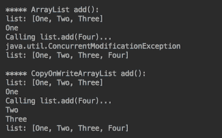

如您所见，`ArrayList`在迭代时修改列表时抛出`ConcurrentModificationException`（为了简单起见，我们使用了相同的线程，因为它会产生相同的效果，就像另一个线程修改列表一样）。不过，规范不能保证抛出异常或应用列表修改（如我们的例子），因此程序员不应该将应用程序逻辑建立在此类行为的基础上。

另一方面，`CopyOnWriteArrayList`阶层则容忍同样的干预；但是，请注意，它不会向当前列表中添加新元素，因为迭代器是从基础数组的新副本的快照创建的。

现在，让我们尝试使用以下方法在遍历列表时同时删除列表元素：

```java
       void demoListRemove(List<String> list) {
          System.out.println("list: " + list);
          try {
            for (String e : list) {
              System.out.println(e);
              if (list.contains("Two")) {
                System.out.println("Calling list.remove(Two)...");
                list.remove("Two");
              }
            }
          } catch (Exception ex) {
            System.out.println(ex.getClass().getName());
          }
          System.out.println("list: " + list);
       }
```

考虑下面的代码：

```java
        System.out.println("***** ArrayList remove():");
        demoListRemove(new ArrayList<>(Arrays.asList("One", 
                                         "Two", "Three")));
        System.out.println();
        System.out.println("***** CopyOnWriteArrayList remove():");
        demoListRemove(new CopyOnWriteArrayList<>(Arrays
                                .asList("One", "Two", "Three")));

```

如果我们执行此操作，我们将得到以下结果：

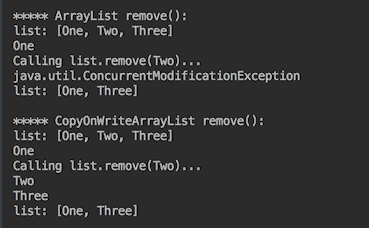

该行为类似于上一个示例。`CopyOnWriteArrayList`类允许并发访问列表，但不允许修改当前列表的副本。

我们知道`ArrayList`在很长一段时间内不会是线程安全的，所以我们使用了不同的技术在遍历列表时从列表中删除元素。以下是在 Java 8 发布之前是如何做到这一点的：

```java
        void demoListIterRemove(List<String> list) {
          System.out.println("list: " + list);
          try {
            Iterator iter = list.iterator();
            while (iter.hasNext()) {
              String e = (String) iter.next();
              System.out.println(e);
              if ("Two".equals(e)) {
                System.out.println("Calling iter.remove()...");
                iter.remove();
              }
            }
          } catch (Exception ex) {
              System.out.println(ex.getClass().getName());
          }
          System.out.println("list: " + list);
        }
```

让我们试试这个并运行代码：

```java
        System.out.println("***** ArrayList iter.remove():");
        demoListIterRemove(new ArrayList<>(Arrays
                            .asList("One", "Two", "Three")));
        System.out.println();
        System.out.println("*****" 
                    + " CopyOnWriteArrayList iter.remove():");
        demoListIterRemove(new CopyOnWriteArrayList<>(Arrays
                             .asList("One", "Two", "Three")));

```

结果如下：

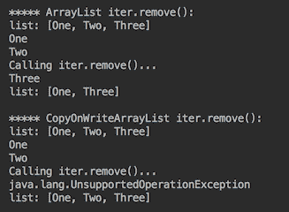

[这正是 Javadoc 所警告的](https://docs.oracle.com/cd/E17802_01/j2se/j2se/1.5.0/jcp/beta2/apidiffs/java/util/concurrent/CopyOnWriteArrayList.html)：

不支持迭代器本身（删除、设置和添加）上的元素更改操作。这些方法引发 UnsupportedOperationException

当升级应用程序使其在多线程环境中工作时，我们应该记住这一点，如果我们使用迭代器删除列表元素，仅仅从`ArrayList()`更改为`CopyOnWriteArrayList`是不够的。

自 Java 8 以来，有一种更好的方法可以使用 lambda 从集合中删除元素，因为它将管道细节留给库代码使用：

```java
        void demoRemoveIf(Collection<String> collection) {
              System.out.println("collection: " + collection);
              System.out.println("Calling list.removeIf(e ->" 
                                      + " Two.equals(e))...");
              collection.removeIf(e -> "Two".equals(e));
              System.out.println("collection: " + collection);
        }
```

让我们这样做：

```java
        System.out.println("***** ArrayList list.removeIf():");
        demoRemoveIf(new ArrayList<>(Arrays
                              .asList("One", "Two", "Three")));
        System.out.println();
        System.out.println("*****" 
                   + " CopyOnWriteArrayList list.removeIf():");
        demoRemoveIf(new CopyOnWriteArrayList<>(Arrays
                              .asList("One", "Two", "Three")));

```

上述代码的结果如下：

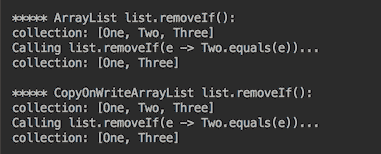

它很短，对任何集合都没有问题，并且符合无状态并行计算的一般趋势，即使用具有 lambda 和函数接口的流。

此外，在我们升级应用程序以使用`CopyOnWriteArrayList`类之后，我们可以利用一种更简单的方法将新元素添加到列表中（无需首先检查它是否已经存在）：

```java
CopyOnWriteArrayList<String> list =  
  new CopyOnWriteArrayList<>(Arrays.asList("Five","Six","Seven"));
list.addIfAbsent("One");

```

使用`CopyOnWriteArrayList`，这可以作为一个原子操作来完成，因此不需要同步不存在的代码块，然后添加代码块。

2.  让我们回顾一下实现`Set`接口的`java.util.concurrent`包的并发集合。有三种这样的实现方式-`ConcurrentHashMap.KeySetView`、`CopyOnWriteArraySet`和`ConcurrentSkipListSet`。

第一个只是`ConcurrentHashMap`键的视图。由`ConcurrentHashMap`备份（可通过`getMap()`方法获取）。稍后我们将回顾`ConcurrentHashMap`的行为。

`java.util.concurrent`包中`Set`的第二个实现是`CopyOnWriteArraySet`类。其行为类似于`CopyOnWriteArrayList`类。事实上，它在后台使用了`CopyOnWriteArrayList`类的实现。唯一的区别是它不允许集合中存在重复的元素。

`java.util.concurrent`包中`Set`的第三个（也是最后一个）实现是`ConcurrentSkipListSet`；它实现了一个名为`NavigableSet`的`Set`子接口。根据`ConcurrentSkipListSet`类的 Javadoc，插入、删除和访问操作由多个线程*同时安全执行。*Javadoc 中也描述了一些限制：

`ConcurrentSkipListSet`类的实现是基于`ConcurrentSkipListMap`类的，我们将在稍后讨论。为了演示`ConcurrentSkipListSet`类的行为，让我们将其与`java.util.TreeSet`类（非并发实现`NavigableSet`类）进行比较。我们首先删除一个元素：

```java
        void demoNavigableSetRemove(NavigableSet<Integer> set) {
          System.out.println("set: " + set);
          try {
            for (int i : set) {
              System.out.println(i);
              System.out.println("Calling set.remove(2)...");
              set.remove(2);
            }
          } catch (Exception ex) {
            System.out.println(ex.getClass().getName());
          }
          System.out.println("set: " + set);
        }
```

当然，这个代码不是很有效；我们多次删除了相同的元素，但没有检查它是否存在。我们这样做只是为了说明目的。此外，自 Java8 以来，同样的`removeIf()`方法对`Set`也适用。但是我们想介绍新的`ConcurrentSkipListSet`类的行为，所以让我们执行以下代码：

```java
        System.out.println("***** TreeSet set.remove(2):");
        demoNavigableSetRemove(new TreeSet<>(Arrays
                                     .asList(0, 1, 2, 3)));
        System.out.println();
        System.out.println("*****"
                    + " ConcurrentSkipListSet set.remove(2):");
        demoNavigableSetRemove(new ConcurrentSkipListSet<>(Arrays
                                     .asList(0, 1, 2, 3)));

```

输出结果如下：

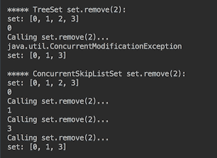

正如所料，`ConcurrentSkipListSet`类处理并发性，甚至从当前集合中删除一个元素，这很有帮助。它还通过迭代器删除元素，没有异常。考虑以下代码：

```java
        void demoNavigableSetIterRemove(NavigableSet<Integer> set){
          System.out.println("set: " + set);
          try {
            Iterator iter = set.iterator();
            while (iter.hasNext()) {
              Integer e = (Integer) iter.next();
              System.out.println(e);
              if (e == 2) {
                System.out.println("Calling iter.remove()...");
                iter.remove();
              }
            }
          } catch (Exception ex) {
            System.out.println(ex.getClass().getName());
          }
          System.out.println("set: " + set);
        }
```

为`TreeSet`和`ConcurrentSkipListSet`运行此命令：

```java
        System.out.println("***** TreeSet iter.remove():");
        demoNavigableSetIterRemove(new TreeSet<>(Arrays
                                           .asList(0, 1, 2, 3)));

        System.out.println();
        System.out.println("*****"
                      + " ConcurrentSkipListSet iter.remove():");
        demoNavigableSetIterRemove(new ConcurrentSkipListSet<>
                                    (Arrays.asList(0, 1, 2, 3)));
```

我们不会得到任何例外：

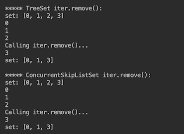

这是因为，根据 Javadoc，`ConcurrentSkipListSet`的迭代器是弱一致的，这意味着：

这个“不保证”的部分有点令人失望，但它比得到一个例外要好，比如`CopyOnWriteArrayList`。

添加到`Set`类不像添加到`List`类那样有问题，因为`Set`不允许重复并在内部处理必要的检查：

```java
        void demoNavigableSetAdd(NavigableSet<Integer> set) {
          System.out.println("set: " + set);
          try {
            int m = set.stream().max(Comparator.naturalOrder())
                                .get() + 1;
            for (int i : set) {
              System.out.println(i);
              System.out.println("Calling set.add(" + m + ")");
              set.add(m++);
              if (m > 6) {
                break;
              }
            }
          } catch (Exception ex) {
            System.out.println(ex.getClass().getName());
          }
          System.out.println("set: " + set);
        }
```

考虑下面的代码：

```java
        System.out.println("***** TreeSet set.add():");
        demoNavigableSetAdd(new TreeSet<>(Arrays
                                     .asList(0, 1, 2, 3)));

        System.out.println();
        System.out.println("*****" 
                            + " ConcurrentSkipListSet set.add():");
        demoNavigableSetAdd(new ConcurrentSkipListSet<>(Arrays
                                        .asList(0,1,2,3)));

```

如果运行此操作，将得到以下结果：

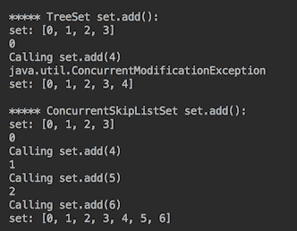

与前面一样，我们观察到并发`Set`版本更好地处理并发。

3.  我们来看看`Map`接口，它在`java.util.concurrent`包中有两个实现：`ConcurrentHashMap`和`ConcurrentSkipListMap`。

Javadoc 中的`ConcurrentHashMap`类。

“支持检索的完全并发性和更新的高并发性”

它是`java.util.HashMap`的线程安全版本，在这方面与`java.util.Hashtable`类似。事实上，`ConcurrentHashMap`类满足与`java.util.Hashtable`相同的功能规范要求，尽管其实现“在同步细节上有所不同”*（来自 Javadoc）。*

 *与`java.util.HashMap`和`java.util.Hashtable`不同，`ConcurrentHashMap`根据其 [Javadoc](https://docs.oracle.com/javase/9/docs/api/java/util/concurrent/ConcurrentHashMap.html) 提供支持，

一组连续和并行的批量操作，与大多数流方法不同，这些操作被设计为安全且通常合理地应用于其他线程同时更新的映射

这些批量操作接受一个`parallelismThreshold`参数，该参数允许延迟并行化，直到映射大小达到指定的阈值。当然，当阈值设置为`Long.MAX_VALUE`时，将不会有任何并行性。

类 API 中还有许多其他方法，因此请参阅其 Javadoc 以了解概述。

与`java.util.HashMap`（与`java.util.Hashtable`类似，`ConcurrentHashMap`和`ConcurrentSkipListMap`都不允许 null 用作键或值。

`Map`的第二个实现`ConcurrentSkipListSet`类是基于`ConcurrentSkipListMap`类的，正如我们前面提到的，所以我们刚才描述的`ConcurrentSkipListSet`类的所有限制也适用于`ConcurrentSkipListMap`类。`ConcurrentSkipListSet`类实际上是`java.util.TreeMap`的线程安全版本。`SkipList`是一种排序数据结构，允许同时进行快速搜索。所有元素都根据其键的自然排序顺序进行排序。我们为`ConcurrentSkipListSet`类演示的`NavigableSet`功能也存在于`ConcurrentSkipListMap`类中。对于类 API 中的许多其他方法，请参考其 Javadoc。

现在，让我们演示一下`java.util.HashMap`、`ConcurrentHashMap`和`ConcurrentSkipListMap`类之间响应并发性的行为差异。首先，我们将编写生成测试`Map`对象的方法：

```java
        Map createhMap() {
          Map<Integer, String> map = new HashMap<>();
          map.put(0, "Zero");
          map.put(1, "One");
          map.put(2, "Two");
          map.put(3, "Three");
          return map;
       }
```

下面是同时向`Map`对象添加元素的代码：

```java
        void demoMapPut(Map<Integer, String> map) {
          System.out.println("map: " + map);
          try {
            Set<Integer> keys = map.keySet();
            for (int i : keys) {
              System.out.println(i);
              System.out.println("Calling map.put(8, Eight)...");
              map.put(8, "Eight");

              System.out.println("map: " + map);
              System.out.println("Calling map.put(8, Eight)...");
              map.put(8, "Eight");

              System.out.println("map: " + map);
              System.out.println("Calling" 
                                 + " map.putIfAbsent(9, Nine)...");
              map.putIfAbsent(9, "Nine");

              System.out.println("map: " + map);
              System.out.println("Calling" 
                                 + " map.putIfAbsent(9, Nine)...");
              map.putIfAbsent(9, "Nine");

              System.out.println("keys.size(): " + keys.size());
              System.out.println("map: " + map);
            }
          } catch (Exception ex) {
            System.out.println(ex.getClass().getName());
          }
        }
```

对`Map`的所有三种实现运行此命令：

```java
        System.out.println("***** HashMap map.put():");
        demoMapPut(createhMap());

        System.out.println();
        System.out.println("***** ConcurrentHashMap map.put():");
        demoMapPut(new ConcurrentHashMap(createhMap()));

        System.out.println();
        System.out.println("*****"
                          + " ConcurrentSkipListMap map.put():");
        demoMapPut(new ConcurrentSkipListMap(createhMap()));

```

如果我们这样做，我们只会得到第一个键的`HashMap`输出：

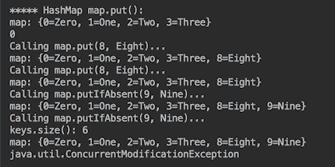

我们还为所有键（包括新添加的键）获得了`ConcurrentHashMap`和`ConcurrentSkipListMap`的输出。以下是`ConcurrentHashMap`输出的最后一部分：

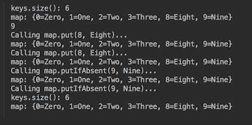

如前所述，`ConcurrentModificationException`的外观不保证。现在我们看到抛出它的那一刻（如果抛出的话）就是代码发现修改发生的那一刻。在我们的例子中，它发生在下一次迭代中。另一点值得注意的是，即使我们将当前密钥集隔离在单独的变量中，它们也会发生变化：

```java
      Set<Integer> keys = map.keySet();
```

这提醒我们不要忽略通过对象引用传播的更改。

为了节省一些空间和时间，我们将不显示并发删除的代码，而只是总结结果。正如所料，`HashMap`在通过以下任一方式删除元素时抛出`ConcurrentModificationException`异常：

```java
        String result = map.remove(2);
        boolean success = map.remove(2, "Two");

```

使用`Iterator`可以通过以下方式之一进行并行删除：

```java
         iter.remove();
         boolean result = map.keySet().remove(2);
         boolean result = map.keySet().removeIf(e -> e == 2);

```

相比之下，两个并发`Map`实现允许并发元素删除，而不仅仅是使用`Iterator`。

`Queue`接口的所有并发实现也表现出类似的行为：`LinkedTransferQueue`、`LinkedBlockingQueue`、`LinkedBlockingDequeue`、`ArrayBlockingQueue`、`PriorityBlockingQueue`、`DelayQueue`、`SynchronousQueue`、`ConcurrentLinkedQueue`、`ConcurrentLinkedDequeue`，都在`java.util.concurrent`包中。但是，为了演示所有这些内容，需要一个单独的卷，所以我们让您浏览 Javadoc，并仅提供一个`ArrayBlockingQueue`示例。队列将由`QueueElement`类表示：

```java
         class QueueElement {
           private String value;
           public QueueElement(String value){
             this.value = value;
           }
           public String getValue() {
             return value;
           }
         }
```

队列生成器将如下所示：

```java
        class QueueProducer implements Runnable {
          int intervalMs, consumersCount;
          private BlockingQueue<QueueElement> queue;
          public QueueProducer(int intervalMs, int consumersCount, 
                               BlockingQueue<QueueElement> queue) {
            this.consumersCount = consumersCount;
            this.intervalMs = intervalMs;
            this.queue = queue;
          }
          public void run() {
            List<String> list = 
               List.of("One","Two","Three","Four","Five");
            try {
              for (String e : list) {
                Thread.sleep(intervalMs);
                queue.put(new QueueElement(e));
                System.out.println(e + " produced" );
              }
              for(int i = 0; i < consumersCount; i++){
                queue.put(new QueueElement("Stop"));
              }
            } catch (InterruptedException e) {
              e.printStackTrace();
            }
           }
         }
```

以下将是队列使用者：

```java
        class QueueConsumer implements Runnable{
          private String name;
          private int intervalMs;
          private BlockingQueue<QueueElement> queue;
          public QueueConsumer(String name, int intervalMs, 
                               BlockingQueue<QueueElement> queue){
             this.intervalMs = intervalMs;
             this.queue = queue;
             this.name = name;
          }
          public void run() {
            try {
              while(true){
                String value = queue.take().getValue();
                if("Stop".equals(value)){
                  break;
                }
                System.out.println(value + " consumed by " + name);
                Thread.sleep(intervalMs);
              }
            } catch(InterruptedException e) {
              e.printStackTrace();
            }
          }
        }
```

运行以下代码：

```java
        BlockingQueue<QueueElement> queue = 
                      new ArrayBlockingQueue<>(5);
        QueueProducer producer = new QueueProducer(queue);
        QueueConsumer consumer = new QueueConsumer(queue);
        new Thread(producer).start();
        new Thread(consumer).start();

```

其结果可能如下所示：

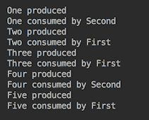

# 它是如何工作的。。。

在选择要使用的集合之前，请阅读 Javadoc，查看集合的限制是否适用于您的应用程序。

例如，根据 Javadoc，`CopyOnWriteArrayList`类

通常成本太高，但当遍历操作的数量远远超过变异时，可能比其他方法更有效，并且在您不能或不想同步遍历，但需要排除并发线程之间的干扰时非常有用

当不需要在不同位置添加新元素并且不需要排序时，可以使用它。否则，请使用`ConcurrentSkipListSet`。

根据 Javadoc，`ConcurrentSkipListSet`和`ConcurrentSkipListMap`类，

提供包含、添加和删除操作及其变体的预期平均日志（n）时间开销。升序视图及其迭代器比降序视图及其迭代器快

当需要以特定顺序快速遍历元素时，请使用它们。

当并发性要求非常苛刻，需要允许锁定写操作，但不需要锁定元素时，使用`ConcurrentHashMap`。

当多个线程共享对公共集合的访问时，`ConcurrentLinkedQueque`和`ConcurrentLinkedDeque`是合适的选择。`ConcurrentLinkedQueque`采用高效的非阻塞算法。

`PriorityBlockingQueue`是一个更好的选择，当自然顺序可以接受时，您需要快速向尾部添加元素，并快速从队列头部移除元素。阻塞意味着队列在检索元素时等待变为非空，在存储元素时等待队列中的空间变为可用。

`ArrayBlockingQueue`、`LinkedBlockingQueue`和`LinkedBlockingDeque`具有固定大小（它们是有界的）。其他队列是无限的。

使用这些和类似的特性和建议作为指导原则，但在实现功能之前和之后执行全面的测试和性能度量。

# 使用 executor 服务执行异步任务

在本食谱中，您将学习如何使用`ExecutorService`实现可控线程执行。

# 准备

在前面的配方中，我们演示了如何直接使用`Thread`类创建和执行线程。对于少量快速运行并产生预期结果的线程来说，这是一种可接受的机制。对于具有运行时间较长且逻辑复杂的线程（这可能会让它们在不可预测的很长时间内保持活动）和/或线程数量也在不可预测地增长的大型应用程序，简单的创建并运行直到退出方法可能会导致`OutOfMemory`错误或需要复杂的自定义线程状态维护和管理系统。对于这种情况，`ExecutorService`和`java.util.concurrent`包的相关类提供了一种开箱即用的解决方案，使程序员无需编写和维护大量基础结构代码。

在执行器框架的基础上，有一个只有一个 Tyl T1 方法的接口，它在将来的某个时候执行给定的命令。

其子接口`ExecutorService`添加了允许您管理执行器的方法：

*   `invokeAny()`、`invokeAll()`和`awaitTermination()`方法以及`submit()`允许您定义线程将如何执行，以及它们是否需要返回一些值
*   `shutdown()`和`shutdownNow()`方法允许您关闭执行器
*   `isShutdown()`和`isTerminated()`方法提供执行者的状态

`ExecutorService`的对象可以通过`java.util.concurrent.Executors`类的静态工厂方法创建：

*   `newSingleThreadExecutor()`：创建一个`Executor`方法，该方法使用单个工作线程在无界队列之外运行。它有一个重载版本，参数为`ThreadFactory`。
*   `newCachedThreadPool()`：创建一个线程池，根据需要创建新线程，但在可用时重用先前构建的线程。它有一个重载版本，参数为`ThreadFactory`。
*   `newFixedThreadPool(int nThreads)`：创建一个线程池，该线程池重用在共享无边界队列上运行的固定数量的线程。它有一个重载版本，参数为`ThreadFactory`。

`ThreadFactory`实现允许您覆盖创建新线程的过程，使应用程序能够使用特殊的线程子类、优先级等。其用法的演示超出了本书的范围。

# 怎么做。。。

1.  需要记住的`Executor`接口行为的一个重要方面是，一旦创建，它会一直运行（等待新任务执行），直到 Java 进程停止。因此，如果要释放内存，`Executor`接口必须显式停止。如果不关闭，被遗忘的执行器将造成内存泄漏。这里有一种可能的方法来确保没有执行者被留下：

```java
        int shutdownDelaySec = 1;
        ExecutorService execService = 
                       Executors.newSingleThreadExecutor();
        Runnable runnable =  () -> System.out.println("Worker One did
                                                       the job.");
        execService.execute(runnable);
        runnable =   () -> System.out.println("Worker Two did the 
                                               job.");
        Future future = execService.submit(runnable);
        try {
          execService.shutdown();
          execService.awaitTermination(shutdownDelaySec, 
                                       TimeUnit.SECONDS);
        } catch (Exception ex) {
          System.out.println("Caught around" 
                  + " execService.awaitTermination(): " 
                  + ex.getClass().getName());
        } finally {
          if (!execService.isTerminated()) {
            if (future != null && !future.isDone() 
                               && !future.isCancelled()){
              System.out.println("Cancelling the task...");
              future.cancel(true);
            }
          }
          List<Runnable> l = execService.shutdownNow();
          System.out.println(l.size() 
                 + " tasks were waiting to be executed." 
                 + " Service stopped.");
        }
```

您可以通过多种方式将用于执行的 worker（一个`Runnable`或`Callable`功能接口的实现）传递给`ExecutorService`，我们将很快看到。在本例中，我们执行了两个线程：一个使用`execute()`方法，另一个使用`submit()`方法。这两种方法都接受`Runnable`或`Callable`，但在本例中我们仅使用`Runnable`。`submit()`方法返回`Future`，表示异步计算的结果。

`shutdown()`方法启动之前提交的任务的有序关闭，并防止任何新任务被接受。此方法不会等待任务完成执行。`awaitTermination()`方法可以做到这一点。但在`shutdownDelaySec`之后停止阻塞，码流进入`finally`块，如果关机后所有任务都完成，`isTerminated()`方法返回`true`。在本例中，我们有两个任务在两个不同的语句中执行。但请注意，`ExecutorService`的其他方法接受一组任务。

在这种情况下，当服务关闭时，我们迭代`Future`对象的集合。我们调用每个任务，如果它还没有完成，就取消它，可能是在取消任务之前必须做的其他事情。对于每个应用程序和可能运行的任务，必须测试等待的时间（值为`shutdownDelaySec`）。

最后，`shutdownNow()`方法说

尝试停止所有正在执行的任务，停止正在等待的任务的处理，并返回正在等待执行的任务列表

（根据 Javadoc）。

2.  收集并评估结果。在实际应用程序中，我们通常不希望经常关闭服务。我们只是检查任务的状态，并收集那些从`isDone()`方法返回 true 的结果。在前面的代码示例中，我们只是展示了如何确保当我们停止服务时，我们是以一种受控的方式进行的，而不会留下任何失控的进程。如果我们运行该代码示例，我们将得到以下结果：

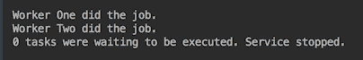

3.  概括前面的代码，创建一个关闭服务和返回`Future`的任务的方法：

```java
        void shutdownAndCancelTask(ExecutorService execService, 
                  int shutdownDelaySec, String name, Future future) {
          try {
            execService.shutdown();
            System.out.println("Waiting for " + shutdownDelaySec 
                         + " sec before shutting down service...");
            execService.awaitTermination(shutdownDelaySec,
                                         TimeUnit.SECONDS);
          } catch (Exception ex) {
            System.out.println("Caught around" 
                        + " execService.awaitTermination():" 
                        + ex.getClass().getName());
         } finally {
           if (!execService.isTerminated()) {
             System.out.println("Terminating remaining tasks...");
             if (future != null && !future.isDone() 
                                && !future.isCancelled()) {
               System.out.println("Cancelling task " 
                                  + name + "...");
               future.cancel(true);
             }
           }
           System.out.println("Calling execService.shutdownNow(" 
                              + name + ")...");
           List<Runnable> l = execService.shutdownNow();
           System.out.println(l.size() + " tasks were waiting" 
                         + " to be executed. Service stopped.");
         }
       }
```

4.  通过使`Runnable`（使用 lambda 表达式）休眠一段时间（模拟要完成的有用工作）来增强示例：

```java
        void executeAndSubmit(ExecutorService execService, 
                    int shutdownDelaySec, int threadSleepsSec) {
          System.out.println("shutdownDelaySec = " 
                          + shutdownDelaySec + ", threadSleepsSec = " 
                          + threadSleepsSec);
          Runnable runnable = () -> {
            try {
              Thread.sleep(threadSleepsSec * 1000);
              System.out.println("Worker One did the job.");
            } catch (Exception ex) {
              System.out.println("Caught around One Thread.sleep(): " 
                                 + ex.getClass().getName());
            }
          };
          execService.execute(runnable);
          runnable = () -> {
            try {
              Thread.sleep(threadSleepsSec * 1000);
              System.out.println("Worker Two did the job.");
            } catch (Exception ex) {
              System.out.println("Caught around Two Thread.sleep(): " 
                                 + ex.getClass().getName());
            }
          };
          Future future = execService.submit(runnable);
          shutdownAndCancelTask(execService, shutdownDelaySec, 
                                "Two", future);
        }
```

注意这两个参数，`shutdownDelaySec`（定义在继续并最终关闭之前，服务将等待多长时间而不允许提交新任务）和`threadSleepSec`（定义工作人员睡眠多长时间，表示模拟过程正在执行其工作）。

5.  针对`ExecutorService`和`shutdownDelaySec`和`threadSleepSec`值的不同实现运行新代码：

```java
        System.out.println("Executors.newSingleThreadExecutor():");
        ExecutorService execService = 
                       Executors.newSingleThreadExecutor();
        executeAndSubmit(execService, 3, 1);

        System.out.println();
        System.out.println("Executors.newCachedThreadPool():");
        execService = Executors.newCachedThreadPool();
        executeAndSubmit(execService, 3, 1);

        System.out.println();
        int poolSize = 3;
        System.out.println("Executors.newFixedThreadPool(" 
                                            + poolSize + "):");
        execService = Executors.newFixedThreadPool(poolSize);
        executeAndSubmit(execService, 3, 1);

```

这是输出的外观（在您的计算机上可能略有不同，具体取决于操作系统控制的事件的确切时间）：

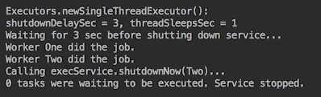

6.  分析结果。在第一个示例中，我们没有发现令人惊讶的地方，因为有以下几行：

```java
        execService.awaitTermination(shutdownDelaySec, 
                                     TimeUnit.SECONDS);

```

它阻塞了 3 秒钟，而每个工人只工作了 1 秒钟。因此，即使对于单个线程执行器，每个工作线程也有足够的时间来完成其工作。

让服务只等待一秒钟：

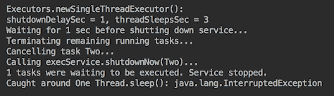

执行此操作时，您将注意到所有任务都不会完成。在这种情况下，工作者`One`被中断（参见输出的最后一行），而任务`Two`被取消。

让我们让服务等待三秒：

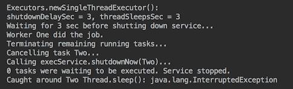

现在我们看到 worker`One`能够完成其任务，而 worker`Two`被中断。

由`newCachedThreadPool()`或`newFixedThreadPool()`产生的`ExecutorService`接口在单核计算机上的性能类似。唯一显著的区别是，如果`shutdownDelaySec`值等于`threadSleepSec`值，那么它们都允许您完成线程：

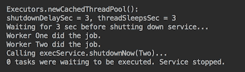

这是使用`newCachedThreadPool()`的结果。使用`newFixedThreadPool()`的示例的输出在单核计算机上看起来完全相同。

7.  为了更好地控制任务，请检查`Future`对象的返回值，而不仅仅是提交任务并等待，希望它能根据需要完成。在`ExecutorService`接口中还有另一个方法，称为`submit()`，它不仅允许您返回`Future`对象，还允许您将传递给该方法的结果作为第二个参数包含在返回对象中。让我们看一个这样的例子：

```java
        Future<Integer> future = execService.submit(() -> 
               System.out.println("Worker 42 did the job."), 42);
        int result = future.get();

```

`result`的值为`42`。当您提交了许多工作人员（`nWorkers`）并且需要知道哪个工作人员已完成时，此方法可能会有所帮助：

```java
        Set<Integer> set = new HashSet<>();
        while (set.size() < nWorkers){
          for (Future<Integer> future : futures) {
            if (future.isDone()){
              try {
                String id = future.get(1, TimeUnit.SECONDS);
                if(!set.contains(id)){
                  System.out.println("Task " + id + " is done.");
                  set.add(id);
                }
              } catch (Exception ex) {
                System.out.println("Caught around future.get(): "
                                   + ex.getClass().getName());
              }
            }
          }
        }
```

嗯，问题是`future.get()`是一种阻塞方法。这就是为什么我们使用`get()`方法的一个版本，它允许我们设置`delaySec`超时。否则，`get()`将阻止迭代。

# 它是如何工作的。。。

让我们更接近真实代码，创建一个实现了`Callable`的类，并允许您将 worker 的结果作为`Result`类的对象返回：

```java
class Result {
  private int sleepSec, result;
  private String workerName;
  public Result(String workerName, int sleptSec, int result) {
    this.workerName = workerName;
    this.sleepSec = sleptSec;
    this.result = result;
  }
  public String getWorkerName() { return this.workerName; }
  public int getSleepSec() { return this.sleepSec; }
  public int getResult() { return this.result; }
}
```

`getResult()`方法返回实际数值结果。这里，我们还包括了工作线程的名称以及线程睡眠（工作）的时间，这只是为了方便和更好地说明输出。

worker 本身将是`CallableWorkerImpl`类的一个实例：

```java
class CallableWorkerImpl implements CallableWorker<Result>{
  private int sleepSec;
  private String name;
  public CallableWorkerImpl(String name, int sleepSec) {
    this.name = name;
    this.sleepSec = sleepSec;
  }
  public String getName() { return this.name; }
  public int getSleepSec() { return this.sleepSec; }
  public Result call() {
    try {
      Thread.sleep(sleepSec * 1000);
    } catch (Exception ex) {
      System.out.println("Caught in CallableWorker: " 
                         + ex.getClass().getName());
    }
    return new Result(name, sleepSec, 42);
  }
}
```

在这里，数字`42`是一个实际的数字结果，据推测是工人（在睡觉时）计算出来的。`CallableWorkerImpl`类实现了`CallableWorker`接口：

```java
interface CallableWorker<Result> extends Callable<Result> {
  default String getName() { return "Anonymous"; }
  default int getSleepSec() { return 1; }
}
```

我们必须将这些方法设置为默认值并返回一些数据（它们无论如何都会被类实现覆盖）以保持其`functional interface`状态。否则，我们将无法在 lambda 表达式中使用它。

我们还将创建一个工厂，生成工人列表：

```java
List<CallableWorker<Result>> createListOfCallables(int nSec){
  return List.of(new CallableWorkerImpl("One", nSec),
                 new CallableWorkerImpl("Two", 2 * nSec),
                 new CallableWorkerImpl("Three", 3 * nSec));
}
```

现在我们可以使用所有这些新类和方法来演示`invokeAll()`方法：

```java
void invokeAllCallables(ExecutorService execService, 
        int shutdownDelaySec, List<CallableWorker<Result>> callables) {
  List<Future<Result>> futures = new ArrayList<>();
  try {
    futures = execService.invokeAll(callables, shutdownDelaySec, 
                                    TimeUnit.SECONDS);
  } catch (Exception ex) {
    System.out.println("Caught around execService.invokeAll(): " 
                       + ex.getClass().getName());
  }
  try {
    execService.shutdown();
    System.out.println("Waiting for " + shutdownDelaySec 
                       + " sec before terminating all tasks...");
    execService.awaitTermination(shutdownDelaySec,
                                 TimeUnit.SECONDS);
  } catch (Exception ex) {
    System.out.println("Caught around awaitTermination(): " 
                       + ex.getClass().getName());
  } finally {
    if (!execService.isTerminated()) {
      System.out.println("Terminating remaining tasks...");
      for (Future<Result> future : futures) {
        if (!future.isDone() && !future.isCancelled()) {
          try {
            System.out.println("Cancelling task "
                       + future.get(shutdownDelaySec, 
                               TimeUnit.SECONDS).getWorkerName());
            future.cancel(true);
          } catch (Exception ex) {
            System.out.println("Caught at cancelling task: " 
                               + ex.getClass().getName());
          }
        }
      }
    }
    System.out.println("Calling execService.shutdownNow()...");
    execService.shutdownNow();
  }
  printResults(futures, shutdownDelaySec);
}
```

`printResults()`方法输出从工人处收到的结果：

```java
void printResults(List<Future<Result>> futures, int timeoutSec) {
  System.out.println("Results from futures:");
  if (futures == null || futures.size() == 0) {
    System.out.println("No results. Futures" 
                       + (futures == null ? " = null" : ".size()=0"));
  } else {
    for (Future<Result> future : futures) {
      try {
        if (future.isCancelled()) {
          System.out.println("Worker is cancelled.");
        } else {
          Result result = future.get(timeoutSec, TimeUnit.SECONDS);
          System.out.println("Worker "+ result.getWorkerName() + 
                             " slept " + result.getSleepSec() + 
                             " sec. Result = " + result.getResult());
        }
      } catch (Exception ex) {
        System.out.println("Caught while getting result: " 
                           + ex.getClass().getName());
      }
    }
  }
}
```

为了得到结果，我们再次使用带有超时设置的`get()`方法。运行以下代码：

```java
List<CallableWorker<Result>> callables = createListOfCallables(1);
System.out.println("Executors.newSingleThreadExecutor():");
ExecutorService execService = Executors.newSingleThreadExecutor();
invokeAllCallables(execService, 1, callables);

```

其产出如下：

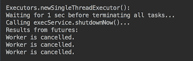

可能值得一提的是，这三名工人的睡眠时间分别为 1、2、3 秒，而服务关闭前的等待时间是 1 秒。这就是为什么所有的工人都被取消了。

现在，如果我们将等待时间设置为 6 秒，那么单线程执行器的输出将如下所示：

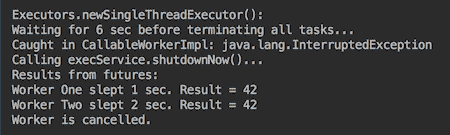

当然，如果我们再增加轮候时间，所有工人都可以完成他们的任务。

`newCachedThreadPool()`或`newFixedThreadPool()`产生的`ExecutorService`接口即使在单核计算机上也表现得更好：

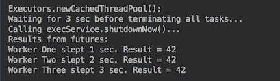

如您所见，所有线程都能够完成，即使等待时间为三秒。

或者，您可以在重载版本的`invokeAll()`方法上设置超时，而不是在服务关闭期间设置超时：

```java
List<Future<T>> invokeAll(Collection<? extends Callable<T>> tasks,
                          long timeout, TimeUnit unit)
```

`invokeAll()`方法的行为有一个特别的方面经常被忽略，并给初次使用它的用户带来惊喜：它只有在所有任务完成后才会返回（正常或抛出异常）。阅读 Javadoc 并进行实验，直到您认识到这种行为对于您的应用程序是可接受的。

相比之下，`invokeAny()`方法仅在至少完成一项任务之前阻塞

成功完成（未引发异常），如果有。在正常或异常返回时，未完成的任务将被取消

前面的引用来自 [Javadoc](https://docs.oracle.com/javase/7/docs/api/java/util/concurrent/ExecutorService.html)。下面是执行此操作的代码示例：

```java
void invokeAnyCallables(ExecutorService execService, 
        int shutdownDelaySec, List<CallableWorker<Result>> callables) {
  Result result = null;
  try {
    result = execService.invokeAny(callables, shutdownDelaySec,                                    TimeUnit.SECONDS);
  } catch (Exception ex) {
    System.out.println("Caught around execService.invokeAny(): " 
                       + ex.getClass().getName());
  }
  shutdownAndCancelTasks(execService, shutdownDelaySec,
                         new ArrayList<>());
  if (result == null) {
    System.out.println("No result from execService.invokeAny()");
  } else {
    System.out.println("Worker " + result.getWorkerName() + 
                       " slept " + result.getSleepSec() + 
                       " sec. Result = " + result.getResult());
  }
}
```

您可以尝试使用它，为线程设置不同的等待时间（`shutdownDelaySec`和睡眠时间值，直到您对该方法的行为感到满意为止。如您所见，我们通过传递一个空的`Future`对象列表重用了`shutdownAndCancelTasks()`方法，因为我们这里没有这些对象。

# 还有更多。。。

`Executors`类中还有两个静态工厂方法创建`ExecutorService`的实例：

*   `newWorkStealingPool()`：这将使用可用处理器的数量作为其目标并行度级别，创建一个工作窃取线程池。它有一个重载版本，并行度级别作为参数。
*   `unconfigurableExecutorService(ExecutorService executor)`：这将返回一个对象，该对象将所有已定义的`ExecutorService`方法委托给给定的执行器，但使用强制转换可以访问的方法除外。

此外，`ExecutorService`接口的子接口称为`ScheduledExecutorService`，它增强了 API 的功能，使其能够计划将来的线程执行和/或其定期执行。

`ScheduledExecutorService`的对象可以使用`java.util.concurrent.Executors`类的静态工厂方法创建：

*   `newSingleThreadScheduledExecutor()`：创建一个单线程执行器，该执行器可以安排命令在给定延迟后运行或定期执行。它有一个重载版本，参数为`ThreadFactory`。
*   `newScheduledThreadPool(int corePoolSize)`：创建一个线程池，可以安排命令在给定延迟后运行或定期执行。它有一个重载版本，参数为`ThreadFactory`。
*   `unconfigurableScheduledExecutorService( ScheduledExecutorService executor )`：返回一个对象，该对象将所有已定义的`ScheduledExecutorService`方法委托给给定的执行器，但不委托任何其他可能通过强制转换访问的方法。

`Executors`类还有几个重载方法，它们接受、执行和返回`Callable`（与`Runnable`相反，T1 包含结果）。

`java.util.concurrent`包还包括实现`ExecutorService`的类：

*   `ThreadPoolExecutor`：该类使用几个池线程中的一个执行每个提交的任务，通常使用`Executors`工厂方法进行配置。
*   `ScheduledThreadPoolExecutor`：此类扩展了`ThreadPoolExecutor`类，实现了`ScheduledExecutorService`接口。
*   `ForkJoinPool`：使用工作窃取算法管理工作人员的执行（即`ForkJoinTask`流程）。我们将在下一个食谱中讨论它。

这些类的实例可以通过接受更多参数（包括保存结果的队列）的类构造函数创建，以提供更精细的线程池管理。

# 使用 fork/join 实现分治

在本教程中，您将学习如何使用 fork/join 框架进行分治计算模式。

# 准备

如前一个配方中所述，`ForkJoinPool`类是`ExecutorService`接口的实现，该接口使用工作窃取算法管理`ForkJoinTask`进程的执行。它利用多个处理器（如果有的话），在可以递归分解成更小任务的任务上效果最好，这也被称为**分而治之**策略。

池中的每个线程都有一个专用的双端队列（deque），用于存储任务，当当前任务完成时，线程会立即从队列的头部拾取下一个任务。当另一个线程完成执行其队列中的所有任务时，它可以从另一个线程的非空队列的尾部获取一个任务（窃取它）。

与任何`ExecutorService`实现一样，fork/join 框架将任务分配给线程池中的工作线程。这个框架是独特的，因为它使用了工作窃取算法。任务用完的工作线程可以从其他仍然繁忙的线程窃取任务。

这样的设计平衡了负载并允许有效地使用资源。

出于演示目的，我们将使用在第 3 章、*模块化编程*、`TrafficUnit`、`SpeedModel`和`Vehicle`接口中创建的 API 以及`TrafficUnitWrapper`、`FactoryTraffic`、`FactoryVehicle`和`FactorySpeedModel`类。我们还将依赖于第 3 章、*模块化编程*中描述的流和流管道。

为了提醒您，以下是`TrafficUnitWrapper`课程：

```java
class TrafficUnitWrapper {
  private double speed;
  private Vehicle vehicle;
  private TrafficUnit trafficUnit;
  public TrafficUnitWrapper(TrafficUnit trafficUnit){
    this.trafficUnit = trafficUnit;
    this.vehicle = FactoryVehicle.build(trafficUnit);
  }
  public TrafficUnitWrapper setSpeedModel(SpeedModel speedModel) {
    this.vehicle.setSpeedModel(speedModel);
    return this;
  }
  TrafficUnit getTrafficUnit(){ return this.trafficUnit;}
  public double getSpeed() { return speed; }

  public TrafficUnitWrapper calcSpeed(double timeSec) {
    double speed = this.vehicle.getSpeedMph(timeSec);
    this.speed = Math.round(speed * this.trafficUnit.getTraction());
    return this;
  }
}
```

我们还将通过引入一个新的`DateLocation`类，稍微修改现有的 API 接口，使其更加紧凑：

```java
class DateLocation {
  private int hour;
  private Month month;
  private DayOfWeek dayOfWeek;
  private String country, city, trafficLight;

  public DateLocation(Month month, DayOfWeek dayOfWeek, 
                      int hour, String country, String city, 
                      String trafficLight) {
    this.hour = hour;
    this.month = month;
    this.dayOfWeek = dayOfWeek;
    this.country = country;
    this.city = city;
    this.trafficLight = trafficLight;
  }
  public int getHour() { return hour; }
  public Month getMonth() { return month; }
  public DayOfWeek getDayOfWeek() { return dayOfWeek; }
  public String getCountry() { return country; }
  public String getCity() { return city; }
  public String getTrafficLight() { return trafficLight;}
}
```

它还可以让你隐藏细节，并帮助你看到这个食谱的重要方面。

# 怎么做。。。

所有计算都封装在抽象`ForkJoinTask`类的两个子类（`RecursiveAction`或`RecursiveTask<T>`之一）的子类中。您可以扩展`RecursiveAction`（并实现`void compute()`方法）或`RecursiveTask<T>`（并实现`T compute()`方法）。正如您可能已经注意到的，您可以选择为不返回任何值的任务扩展`RecursiveAction`类，并在需要任务返回值时扩展`RecursiveTask<T>`。在我们的演示中，我们将使用后者，因为它稍微复杂一些。

假设我们要计算特定日期、时间和驾驶条件下特定位置的平均交通速度（所有这些参数都由`DateLocation`属性对象定义）。其他参数如下：

*   `timeSec`：车辆在红绿灯处停车后有机会加速的秒数
*   `trafficUnitsNumber`：平均速度计算中包含的车辆数量

当然，计算中包含的车辆越多，预测就越好。但随着这个数字的增加，计算的数量也随之增加。这就需要将车辆数量分解为更小的组，并与其他组并行计算每个组的平均速度。然而，有一定数量的计算不值得在两个线程之间拆分。以下是 [Javadoc](https://docs.oracle.com/javase/8/docs/api/java/util/concurrent/ForkJoinTask.html) 的内容不得不说：

作为一个非常粗略的经验法则，一个任务应该执行 100 到 10000 个基本计算步骤，并且应该避免无限循环。如果任务太大，则并行性无法提高吞吐量。如果任务太小，则内存和内部任务维护开销可能会压倒处理

然而，与往常一样，在不在并行线程之间拆分计算的情况下，确定最佳计算数量应该基于测试。这就是我们建议您将其作为参数传递的原因。我们将此参数称为`threshold`。请注意，它还用作退出递归的标准。

我们将调用我们的类（任务）`AverageSpeed`并扩展`RecursiveTask<Double>`，因为我们希望得到`double`类型的平均速度值：

```java
class AverageSpeed extends RecursiveTask<Double> {
  private double timeSec;
  private DateLocation dateLocation;
  private int threshold, trafficUnitsNumber;
  public AverageSpeed(DateLocation dateLocation, 
                      double timeSec, int trafficUnitsNumber, 
                      int threshold) {
    this.timeSec = timeSec;
    this.threshold = threshold;
    this.dateLocation = dateLocation;
    this.trafficUnitsNumber = trafficUnitsNumber;
  }
  protected Double compute() {
    if (trafficUnitsNumber < threshold) {
      //... write the code here that calculates
      //... average speed trafficUnitsNumber vehicles
      return averageSpeed;
    } else{
      int tun = trafficUnitsNumber / 2;
      //write the code that creates two tasks, each
      //for calculating average speed of tun vehicles 
      //then calculates an average of the two results
      double avrgSpeed1 = ...;
      double avrgSpeed2 = ...;
      return (double) Math.round((avrgSpeed1 + avrgSpeed2) / 2);
    }
  }
}
```

在我们完成为`compute()`方法编写代码之前，让我们先编写执行此任务的代码。有几种方法可以做到这一点。我们可以使用`fork()`和`join()`，例如：

```java
void demo1_ForkJoin_fork_join() {
  AverageSpeed averageSpeed = createTask();
  averageSpeed.fork();  
  double result = averageSpeed.join();
  System.out.println("result = " + result);
}
```

这种技术为框架提供了名称。`fork()`方法，根据 Javadoc，

安排在当前任务正在运行的池中异步执行此任务（如果适用），或者如果不在`ForkJoinPool()`中，则使用`ForkJoinPool.commonPool()`

在我们的例子中，我们还没有使用任何池，所以默认情况下`fork()`将使用`ForkJoinPool.commonPool()`。它将任务置于池中线程的队列中。`join()`方法在计算完成后返回计算结果。

`createTask()`方法包含以下内容：

```java
AverageSpeed createTask() {
  DateLocation dateLocation = new DateLocation(Month.APRIL, 
        DayOfWeek.FRIDAY, 17, "USA", "Denver", "Main103S");
  double timeSec = 10d;
  int trafficUnitsNumber = 1001;
  int threshold = 100;
  return new AverageSpeed(dateLocation, timeSec, 
                          trafficUnitsNumber, threshold);
}
```

注意`trafficUnitsNumber`和`threshold`参数的值。这对于分析结果非常重要。

实现这一点的另一种方法是使用`execute()`或`submit()`方法，每种方法都为任务的执行提供相同的功能。执行的结果可以通过`join()`方法检索（与上例相同）：

```java
void demo2_ForkJoin_execute_join() {
  AverageSpeed averageSpeed = createTask();
  ForkJoinPool commonPool = ForkJoinPool.commonPool();
  commonPool.execute(averageSpeed);
  double result = averageSpeed.join();
  System.out.println("result = " + result);
}
```

我们要回顾的最后一个方法是`invoke()`，这相当于先调用`fork()`方法，再调用`join()`方法：

```java
void demo3_ForkJoin_invoke() {
  AverageSpeed averageSpeed = createTask();
  ForkJoinPool commonPool = ForkJoinPool.commonPool();
  double result = commonPool.invoke(averageSpeed);
  System.out.println("result = " + result);
}
```

当然，这是开始分而治之过程最流行的方式。

现在让我们回到`compute()`方法，看看如何实现它。首先，让我们实现`if`块（计算小于`threshold`车辆的平均速度）。我们将使用第 3 章、*模块化编程*中描述的技术和代码：

```java
double speed = 
    FactoryTraffic.getTrafficUnitStream(dateLocation, 
                                                trafficUnitsNumber)
        .map(TrafficUnitWrapper::new)
        .map(tuw -> tuw.setSpeedModel(FactorySpeedModel.
                         generateSpeedModel(tuw.getTrafficUnit())))
        .map(tuw -> tuw.calcSpeed(timeSec))
        .mapToDouble(TrafficUnitWrapper::getSpeed)
        .average()
        .getAsDouble();
System.out.println("speed(" + trafficUnitsNumber + ") = " + speed);
return (double) Math.round(speed);

```

我们从`FactoryTraffic`获得`trafficUnitsNumber`辆车。我们为每个发射的元素创建一个`TrafficUnitWrapper`对象，并对其调用`setSpeedModel()`方法（根据发射的`TrafficUnit`对象传入新生成的`SpeedModel`对象）。然后我们计算速度，得到流中所有速度的平均值，并从`Optional`对象（`average()`操作的返回类型）得到结果为`double`。然后我们将结果打印出来，并四舍五入以获得一种更直观的格式。

使用传统的`for`循环也可以获得相同的结果。但是，如前所述，Java 似乎遵循了更流畅和流式风格的总体趋势，面向处理大量数据。所以，我们建议你习惯它。

在第 14 章、*测试*中，您将看到相同功能的另一个版本，它允许对每个步骤进行更好的单独单元测试，这再次支持这样的观点：单元测试以及编写代码有助于使您的代码更易于测试，并减少以后重写代码的需要。

现在，让我们回顾一下`else`块实现的选项。前几行总是一样的：

```java
int tun = trafficUnitsNumber / 2;
System.out.println("tun = " + tun);
AverageSpeed as1 = 
   new AverageSpeed(dateLocation, timeSec, tun, threshold);
AverageSpeed as2 = 
   new AverageSpeed(dateLocation, timeSec, tun, threshold);

```

我们将`trafficUnitsNumber`数字除以 2（我们不担心在一个大集合中出现平均值时可能损失一个单元），并创建两个任务。

下面的实际任务执行代码可以用几种不同的方式编写。下面是我们已经熟悉的第一个可能的解决方案：

```java
as1.fork();                //add to the queue
double res1 = as1.join();  //wait until completed
as2.fork();
double res2 = as2.join();
return (double) Math.round((res1 + res2) / 2);

```

运行以下代码：

```java
demo1_ForkJoin_fork_join();
demo2_ForkJoin_execute_join();
demo3_ForkJoin_invoke();

```

如果我们这样做，我们将看到相同的输出（但速度值不同）三次：

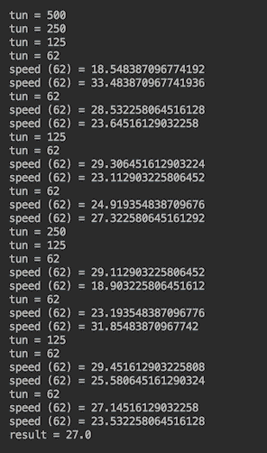

您可以看到，最初计算 1001 个单位（车辆）的平均速度的任务是如何被 2 除以几次的，直到一组（62）的数量降至 100 的阈值以下。然后，计算最后两组的平均速度，并与其他组的结果相结合。

实现`compute()`方法的`else`块的另一种方法如下：

```java
as1.fork();                   //add to the queue
double res1 = as2.compute();  //get the result recursively
double res2 = as1.join();     //wait until the queued task ends
return (double) Math.round((res1 + res2) / 2);

```

结果如下：

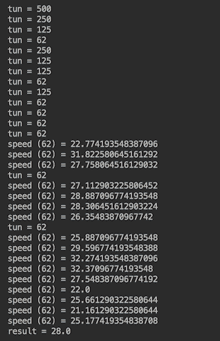

您可以看到，在本例中，（第二个任务的）多次递归调用`compute()`方法，直到它达到元素数的阈值，然后将其结果与第一个任务的`fork()`和`join()`方法的调用结果合并。

如前所述，所有这些复杂性都可以通过调用`invoke()`方法来替代：

```java
double res1 = as1.invoke();
double res2 = as2.invoke();
return (double) Math.round((res1 + res2) / 2);

```

它产生的结果类似于在每个任务上调用`fork()`和`join()`产生的结果：

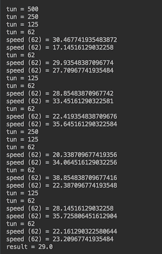

然而，有一种更好的方法来实现`compute()`方法的`else`块：

```java
return ForkJoinTask.invokeAll(List.of(as1, as2))
        .stream()
        .mapToDouble(ForkJoinTask::join)
        .map(Math::round)
        .average()
        .getAsDouble();

```

如果您觉得这很复杂，请注意这只是一种类似于流的方式来迭代`invokeAll()`的结果：

```java
<T extends ForkJoinTask> Collection<T> invokeAll(Collection<T> tasks)
```

它还可以迭代对每个返回任务调用`join()`的结果（并将结果合并为平均值）。这样做的好处是，我们让框架来决定如何优化负载分布。结果如下：

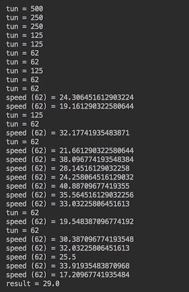

您可以看到，它不同于前面的任何结果，并且可以根据计算机上 CPU 的可用性和负载而改变。

# 使用流实现发布-订阅模式

在本教程中，您将了解 Java9 中引入的新发布-订阅功能。

# 准备

在许多其他特性中，Java 9 在`java.util.concurrent.Flow`类中引入了以下四个接口：

```java
Flow.Publisher<T> - producer of items (messages) of type T
Flow.Subscriber<T> - receiver of messages of type T
Flow.Subscription - links producer and receiver
Flow.Processor<T,R> - acts as both producer and receiver
```

有了这一点，Java 通过异步处理数据流进入了反应式编程的世界。

我们在第 3 章、*模块化编程、*中讨论了流，并指出它们不是数据结构，因为它们不会将数据保存在内存中。流管道在发出元素之前不会执行任何操作。这样的模型允许最小的资源分配，并且只在需要时使用资源。应用程序的行为是*响应*它所响应的数据的外观，从而响应名称。

在发布-订阅模式中，主要的两个参与者是流式传输数据（发布）的`Publisher`和侦听数据（订阅）的`Subscriber`。

`Flow.Publisher<T>`接口为功能接口。它只有一个抽象方法：

```java
void subscribe(Flow.Subscriber<? super T> subscriber)

```

根据 [Javadoc](https://docs.oracle.com/javase/10/docs/api/java/util/concurrent/SubmissionPublisher.html)，这种方法，

“如果可能，添加给定的`Flow.Subscriber<T>`，如果已经订阅，或者订阅尝试失败，则使用`IllegalStateException`调用`Flow.Subscriber<T>`的`onError()`方法；否则，使用新的`Flow.Subscription.`调用`Flow.Subscriber<T>`的`onSubscribe()`方法，订阅者可以通过调用此`Flow.Subscription`的`request()`方法启用接收项目。”并可能通过调用其`cancel()`方法取消订阅。”

`Flow.Subscriber<T>`接口有四种方式：

*   `void onSubscribe(Flow.Subscription subscription)`：在为给定`Subscription`调用任何其他`Subscriber`方法之前调用
*   `void onError(Throwable throwable)`：当`Publisher`或`Subscription`遇到不可恢复的错误时调用，之后`Subscription`不会调用其他`Subscriber`方法
*   `void onNext(T item)`：与`Subscription`的下一项一起调用
*   `void onComplete()`：当已知`Subscription`不会发生额外的`Subscriber`方法调用时调用

`Flow.Subscription`接口有两种方式：

*   `void cancel()`：导致`Subscriber`最终停止接收消息
*   `void request(long n)`：将给定的*n*项数添加到此订阅的当前未满足需求

`Flow.Processor<T,R>`接口不在本书范围内。

# 怎么做。。。

为了节省一些时间和空间，我们可以使用`java.util.concurrent`包中的`SubmissionPublisher<T>`类，而不是创建自己的`Flow.Publisher<T>`接口实现。但是，我们将创建自己的`Flow.Subscriber<T>`接口实现：

```java
class DemoSubscriber<T> implements Flow.Subscriber<T> {
  private String name;
  private Flow.Subscription subscription;
  public DemoSubscriber(String name){ this.name = name; }
  public void onSubscribe(Flow.Subscription subscription) {
    this.subscription = subscription;
    this.subscription.request(0);
  }
  public void onNext(T item) {
    System.out.println(name + " received: " + item);
    this.subscription.request(1);
  }
  public void onError(Throwable ex){ ex.printStackTrace();}
  public void onComplete() { System.out.println("Completed"); }
}
```

我们还将实现`Flow.Subscription`接口：

```java
class DemoSubscription<T> implements Flow.Subscription {
  private final Flow.Subscriber<T> subscriber;
  private final ExecutorService executor;
  private Future<?> future;
  private T item;
  public DemoSubscription(Flow.Subscriber subscriber,
                          ExecutorService executor) {
    this.subscriber = subscriber;
    this.executor = executor;
  }
  public void request(long n) {
    future = executor.submit(() -> {
      this.subscriber.onNext(item );
    });
  }
  public synchronized void cancel() {
    if (future != null && !future.isCancelled()) {
      this.future.cancel(true);
    }
  }
}
```

如您所见，我们只是遵循 Javadoc 的建议，并期望在将订阅者添加到发布者时调用订阅者的`onSubscribe()`方法。

另一个需要注意的细节是，`SubmissionPublisher<T>`类有`submit(T item)`方法，根据 [Javadoc](https://docs.oracle.com/javase/10/docs/api/java/util/concurrent/SubmissionPublisher.html) 的说法：

通过异步调用其`onNext()`方法将给定项发布到每个当前订阅服务器，在任何订阅服务器的资源不可用时不间断地阻止

通过这种方式，`SubmissionPublisher<T>`类将项目提交给当前订阅者，直到关闭为止。这允许项目生成器充当反应流发布者。

为了演示这一点，让我们使用`demoSubscribe()`方法创建几个订阅者和订阅：

```java
void demoSubscribe(SubmissionPublisher<Integer> publisher, 
        ExecutorService execService, String subscriberName){
  DemoSubscriber<Integer> subscriber = 
                     new DemoSubscriber<>(subscriberName);
  DemoSubscription subscription = 
            new DemoSubscription(subscriber, execService);
  subscriber.onSubscribe(subscription);
  publisher.subscribe(subscriber);
}
```

然后在以下代码中使用它们：

```java
ExecutorService execService =  ForkJoinPool.commonPool();
try (SubmissionPublisher<Integer> publisher = 
                            new SubmissionPublisher<>()){
  demoSubscribe(publisher, execService, "One");
  demoSubscribe(publisher, execService, "Two");
  demoSubscribe(publisher, execService, "Three");
  IntStream.range(1, 5).forEach(publisher::submit);
} finally {
  //...make sure that execService is shut down
}
```

前面的代码创建了三个订阅服务器，它们通过专用订阅连接到同一个发布服务器。最后一行生成数字流 1、2、3 和 4，并将每个数字提交给发布者。我们希望每个订户都能得到生成的每个号码作为`onNext()`方法的参数。

在`finally`块中，我们包含了您已经熟悉的前一配方代码：

```java
try {
  execService.shutdown();
  int shutdownDelaySec = 1;
  System.out.println("Waiting for " + shutdownDelaySec 
                           + " sec before shutting down service...");
  execService.awaitTermination(shutdownDelaySec, TimeUnit.SECONDS);
} catch (Exception ex) {
  System.out.println("Caught around execService.awaitTermination(): " 
                                          + ex.getClass().getName());
} finally {
  System.out.println("Calling execService.shutdownNow()...");
  List<Runnable> l = execService.shutdownNow();
  System.out.println(l.size() 
            +" tasks were waiting to be executed. Service stopped.");
}
```

如果我们运行前面的代码，输出可能如下所示：

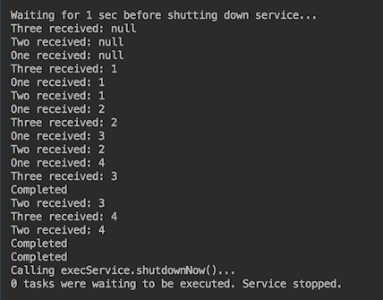

如您所见，由于异步处理，控件非常快地到达`finally`块，并在关闭服务之前等待一秒钟。这段等待时间足以生成项目并将其传递给订阅者。我们还确认每个生成的项目都已发送给每个订户。每次调用每个订阅者的`onSubscribe()`方法时，都会生成三个`null`值。

可以合理预期，在未来的 Java 版本中，将增加更多对反应（异步和非阻塞）功能的支持。*