# 更好地管理操作系统进程

在本章中，我们将介绍以下配方：

*   产生一个新进程
*   将进程输出和错误流重定向到文件
*   更改子流程的工作目录
*   为子流程设置环境变量
*   运行shell脚本
*   获取当前JVM的进程信息
*   获取衍生进程的进程信息
*   管理衍生流程
*   枚举系统中的活动进程
*   使用管道连接多个进程
*   管理子流程

# 介绍

您多久编写一次生成新进程的代码？不经常。然而，可能存在需要编写此类代码的情况。在这种情况下，您必须求助于使用第三方API，如**ApacheCommonsExec**（[）https://commons.apache.org/proper/commons-exec/](https://commons.apache.org/proper/commons-exec/) ）等。为什么会这样？JavaAPI还不够吗？不，不是；至少要等到Java9。现在，使用Java9和更高版本，我们在流程API中添加了更多的特性。

在Java7之前，重定向输入、输出和错误流并不简单。Java7引入了新的API，允许将输入、输出和错误重定向到其他进程（管道）、文件或标准输入/输出。然后，在Java8中，又引入了一些API。在Java 9中，现在有用于以下领域的新API：

*   获取流程信息，如**流程ID****PID**、启动流程的用户、流程运行时间等
*   枚举系统中运行的进程
*   管理子流程并通过向上导航流程层次结构来访问流程树

在本章中，我们将介绍一些配方，这些配方将帮助您探索流程API中的所有新内容，您还将了解自`Runtime.getRuntime().exec()`时代以来所引入的变化。你们都知道使用它是一种犯罪。

All these recipes can only be executed on the Linux platform because we will be using Linux-specific commands while spawning a new process from Java code. There are two ways to execute the script `run.sh` on Linux:

*   `sh run.sh`
*   `chmod +x run.sh && ./run.sh`

Windows 10上的用户不必担心，因为Microsoft已经发布了Windows Linux子系统，它允许您在Windows上运行自己喜欢的Linux发行版，如Ubuntu、OpenSuse等。有关更多详细信息，请查看此链接：[https://docs.microsoft.com/en-in/windows/wsl/install-win10](https://docs.microsoft.com/en-in/windows/wsl/install-win10) 。

# 产生一个新进程

在这个配方中，我们将看到如何使用`ProcessBuilder`生成一个新流程。我们还将看到如何利用输入、输出和错误流。这应该是一个非常简单和常见的配方。然而，介绍这一点的目的是使本章更加完整，而不仅仅是关注Java9特性。

# 准备

Linux中有一个名为`free`的命令，显示可用RAM的数量以及系统正在使用的RAM数量。它接受一个选项`-m`，以兆字节为单位显示输出。因此，仅运行free`-m`就提供了以下输出：

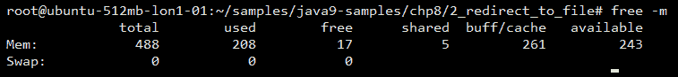

我们将在Java程序中运行前面的代码。

# 怎么做。。。

遵循以下步骤：

1.  通过提供所需的命令及其选项，创建`ProcessBuilder`的实例：

```java
        ProcessBuilder pBuilder = new ProcessBuilder("free", "-m");
```

指定命令和选项的另一种方法如下：

```java
        pBuilder.command("free", "-m");
```

2.  为process builder和其他属性（如执行目录和环境变量）设置输入和输出流。之后，在`ProcessBuilder`实例上调用`start()`生成流程并获取对`Process`对象的引用：

```java
        Process p = pBuilder.inheritIO().start();
```

`inheritIO()`函数将派生子进程的标准I/O设置为与当前Java进程的标准I/O相同。

3.  然后，我们等待流程完成，或等待一秒钟（以较早者为准），如以下代码所示：

```java
        if(p.waitFor(1, TimeUnit.SECONDS)){
          System.out.println("process completed successfully");
        }else{
          System.out.println("waiting time elapsed, process did 
                              not complete");   
          System.out.println("destroying process forcibly");
          p.destroyForcibly();
        }
```

如果这没有在指定的时间内完成，那么我们通过调用`destroyForcibly()`方法终止该进程。

4.  使用以下命令编译并运行代码：

```java
 $ javac -d mods --module-source-path src
      $(find src -name *.java)
      $ java -p mods -m process/com.packt.process.NewProcessDemo
```

5.  我们得到的结果如下：

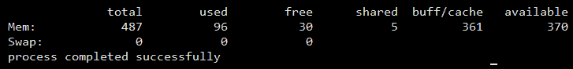

此配方的代码可在`Chapter08/1_spawn_new_process`中找到。

# 它是如何工作的。。。

有两种方式让`ProcessBuilder`知道要运行哪个命令：

*   在创建`ProcessBuilder`对象时，将命令及其选项传递给构造函数
*   将命令及其选项作为参数传递给`ProcessBuilder`对象的`command()`方法

在生成流程之前，我们可以执行以下操作：

*   我们可以使用`directory()`方法更改执行目录。
*   我们可以将输入流、输出流和错误流重定向到文件或另一个进程。
*   我们可以为子流程提供所需的环境变量。

在本章中，我们将在各自的食谱中看到所有这些活动。

当调用`start()`方法并且调用者以`Process`类的实例的形式获取对此子流程的引用时，将生成一个新流程。使用这个`Process`对象，我们可以做很多事情，比如：

*   获取有关进程的信息，包括其PID
*   获取输出和错误流
*   检查流程是否完成
*   破坏过程
*   将流程完成后要执行的任务关联起来
*   检查该进程生成的子进程
*   查找进程的父进程（如果存在）

在我们的食谱中，我们需要`waitFor`一秒钟，或者完成整个过程（以先发生的为准）。如果流程已经完成，`waitFor`返回`true`；否则返回`false`。如果流程没有完成，我们可以通过调用`Process`对象上的`destroyForcibly()`方法来终止流程。

# 将进程输出和错误流重定向到文件

在这个配方中，我们将看到如何处理由Java代码生成的进程的输出和错误流。我们将把生成的进程产生的输出或错误写入一个文件。

# 准备

在这个配方中，我们将使用`iostat`命令。此命令用于报告不同设备和分区的CPU和I/O统计信息。让我们运行命令，看看它报告了什么：

```java
$ iostat
```

在一些Linux发行版中，例如Ubuntu，默认情况下不安装`iostat`。您可以通过运行`sudo apt-get install sysstat`来安装该实用程序。

上述命令的输出如下所示：


# 怎么做。。。

遵循以下步骤：

1.  通过指定要执行的命令来创建新的`ProcessBuilder`对象：

```java
        ProcessBuilder pb = new ProcessBuilder("iostat");
```

2.  将输出和错误流分别重定向到文件的输出和错误：

```java
        pb.redirectError(new File("error"))
          .redirectOutput(new File("output"));
```

3.  启动流程并等待其完成：

```java
        Process p = pb.start();
        int exitValue = p.waitFor();
```

4.  读取输出文件的内容：

```java
        Files.lines(Paths.get("output"))
                         .forEach(l -> System.out.println(l));
```

5.  读取错误文件的内容。仅当命令中存在错误时，才会创建此命令：

```java
        Files.lines(Paths.get("error"))
                         .forEach(l -> System.out.println(l));
```

步骤4和5供我们参考。这与`ProcessBuilder`或产生的过程无关。使用这两行代码，我们可以检查进程写入输出和错误文件的内容。

完整代码可在`Chapter08/2_redirect_to_file`找到。

6.  使用以下命令编译代码：

```java
 $ javac -d mods --module-source-path src $(find src -name 
      *.java)
```

7.  使用以下命令运行代码：

```java
 $ java -p mods -m process/com.packt.process.RedirectFileDemo
```

我们将获得以下输出：

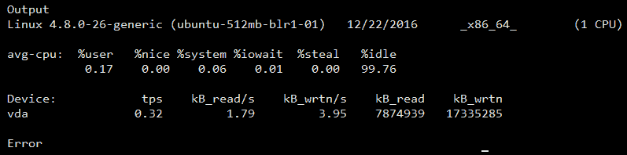

我们可以看到，当命令成功执行时，错误文件中没有任何内容。

# 还有更多。。。

您可以向`ProcessBuilder`提供错误的命令，然后看到错误被写入错误文件，而输出文件中没有任何内容。您可以按如下方式更改`ProcessBuilder`实例创建：

```java
ProcessBuilder pb = new ProcessBuilder("iostat", "-Z");
```

使用前面的*操作方法中给出的命令编译并运行。。。*节。

您将看到错误文件中报告了一个错误，但输出文件中没有报告任何错误：

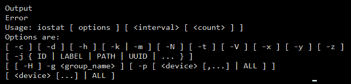

# 更改子流程的工作目录

通常，您希望在路径的上下文中执行进程，例如列出目录中的文件。为此，我们必须告诉`ProcessBuilder`在给定位置的上下文中启动流程。我们可以使用`directory()`方法来实现这一点。这种方法有两个目的：

*   当我们不传递任何参数时，它返回当前的执行目录。
*   当我们传递参数时，它将当前执行目录设置为传递的值。

在这个配方中，我们将看到如何执行

`tree`递归遍历当前目录中所有目录并以树的形式打印的命令。

# 准备

通常，`tree`命令不是预先安装的，因此您必须安装包含该命令的软件包。要在基于Ubuntu/Debian的系统上安装，请运行以下命令：

```java
$ sudo apt-get install tree
```

要在支持`yum`软件包管理器的Linux上安装，请运行以下命令：

```java
$ yum install tree
```

要验证您的安装，只需运行`tree`命令，您应该能够看到打印的当前目录结构。对我来说，是这样的：

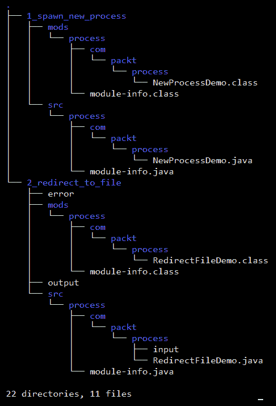

`tree`命令支持多个选项。这是供你探索的。

# 怎么做。。。

遵循以下步骤：

1.  创建一个新的`ProcessBuilder`对象：

```java
        ProcessBuilder pb = new ProcessBuilder();
```

2.  将命令设置为`tree`，输出和错误与当前Java进程相同：

```java
        pb.command("tree").inheritIO();
```

3.  将目录设置为所需的任何目录。我将其设置为根文件夹：

```java
        pb.directory(new File("/root"));
```

4.  启动进程并等待其退出：

```java
        Process p = pb.start();
        int exitValue = p.waitFor();
```

5.  使用以下命令编译并运行：

```java
$ javac -d mods --module-source-path src $(find src -name *.java)
$ java -p mods -m process/com.packt.process.ChangeWorkDirectoryDemo
```

6.  输出将是目录的递归内容，在`ProcessBuilder`对象的`directory()`方法中指定，以树状格式打印。

完整代码可在`Chapter08/3_change_work_directory`找到。

# 它是如何工作的。。。

`directory()`方法接受`Process`的工作目录路径。路径被指定为`File`的实例。

# 为子流程设置环境变量

环境变量与编程语言中的任何其他变量一样。它们有一个名称并具有一些值，这些值可以变化。Linux/Windows命令或shell/batch脚本使用这些命令来执行不同的操作。这些被称为**环境变量**，因为它们存在于正在执行的进程/命令/脚本的环境中。通常，流程从父流程继承环境变量。

它们在不同的操作系统中以不同的方式访问。在Windows中，它们作为`%ENVIRONMENT_VARIABLE_NAME%`访问，在基于Unix的操作系统中，它们作为`$ENVIRONMENT_VARIABLE_NAME`访问。

在基于Unix的系统中，您可以使用`printenv`命令打印进程可用的所有环境变量，在基于Windows的系统中，您可以使用`SET`命令。

在此配方中，我们将向子流程传递一些环境变量，并使用`printenv`命令打印所有可用的环境变量。

# 怎么做。。。

遵循以下步骤：

1.  创建`ProcessBuilder`的实例：

```java
        ProcessBuilder pb = new ProcessBuilder();
```

2.  将命令设置为`printenv`，输出和错误流与当前Java进程相同：

```java
        pb.command("printenv").inheritIO();
```

3.  为环境变量`COOKBOOK_VAR1`提供值`First variable`、`COOKBOOK_VAR2`提供值`Second variable`、`COOKBOOK_VAR3`提供值`Third variable`：

```java
        Map<String, String> environment = pb.environment();
        environment.put("COOKBOOK_VAR1", "First variable");
        environment.put("COOKBOOK_VAR2", "Second variable");
        environment.put("COOKBOOK_VAR3", "Third variable");

```

4.  启动流程并等待其完成：

```java
        Process p = pb.start();
        int exitValue = p.waitFor();
```

此配方的完整代码可在`Chapter08/4_environment_variables`中找到。

5.  使用以下命令编译并运行代码：

```java
 $ javac -d mods --module-source-path src $(find src -name 
      *.java)
      $ java -p mods -m 
       process/com.packt.process.EnvironmentVariableDemo
```

您得到的输出如下所示：

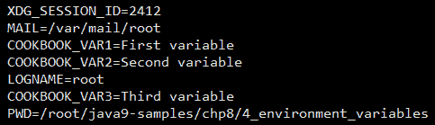

您可以看到在其他变量中打印的三个变量。

# 它是如何工作的。。。

当您在`ProcessBuilder`实例上调用`environment()`方法时，它会复制当前流程的环境变量，将它们填充到`HashMap`实例中，并将其返回给调用方代码。

加载环境变量的所有工作都由包私有的final类`ProcessEnvironment`完成，它实际上扩展了`HashMap`。

然后，我们使用这个映射来填充我们自己的环境变量，但我们不需要将映射设置回`ProcessBuilder`，因为我们将有一个对映射对象的引用，而不是一个副本。对map对象所做的任何更改都将反映在`ProcessBuilder`实例所持有的实际map对象中。

# 运行shell脚本

我们通常在文件中收集一组用于执行操作的命令，在Unix世界中称为**shell脚本**，在Windows中称为**批处理文件**。这些文件中的命令是按顺序执行的，但脚本中有条件块或循环时除外。

这些shell脚本由执行它们的shell进行评估。可用的不同类型的外壳有`bash`、`csh`、`ksh`等。`bash`外壳是最常用的外壳。

在这个方法中，我们将编写一个简单的shell脚本，然后使用`ProcessBuilder`和`Process`对象从Java代码中调用相同的脚本。

# 准备

首先，让我们编写shell脚本。此脚本执行以下操作：

1.  打印环境变量`MY_VARIABLE`的值
2.  执行`tree`命令
3.  执行`iostat`命令

让我们创建一个名为`script.sh`的shell脚本文件，其中包含以下命令：

```java
echo $MY_VARIABLE;
echo "Running tree command";
tree;
echo "Running iostat command"
iostat;
```

您可以将`script.sh`放在您的主文件夹中；就是在`/home/<username>`中。现在，让我们看看如何从Java执行此操作。

# 怎么做。。。

遵循以下步骤：

1.  创建`ProcessBuilder`的新实例：

```java
        ProcessBuilder pb = new ProcessBuilder();
```

2.  将执行目录设置为指向shell脚本文件的目录：

```java
         pb.directory(new File("/root"));
```

请注意，创建`File`对象时传递的上一条路径将取决于脚本`script.sh`的放置位置。在我们的案例中，我们将其放置在`/root`中。您可能已经在`/home/yourname`中复制了脚本，因此`File`对象将被创建为`newFile("/home/yourname")`。

3.  设置shell脚本将使用的环境变量：

```java
    Map<String, String> environment = pb.environment();
    environment.put("MY_VARIABLE", "Set by Java process");
```

4.  设置要执行的命令，以及要传递给该命令的参数。另外，将进程的输出流和错误流设置为与当前Java进程的输出流和错误流相同：

```java
       pb.command("/bin/bash", "script.sh").inheritIO();
```

5.  启动流程并等待其完全执行：

```java
         Process p = pb.start();
         int exitValue = p.waitFor();
```

您可以从`Chapter08/5_running_shell_script`获取完整的代码。

可以使用以下命令编译和运行代码：

```java
$ javac -d mods --module-source-path src $(find src -name *.java)
$ java -p mods -m process/com.packt.process.RunningShellScriptDemo
```

我们得到的结果如下：

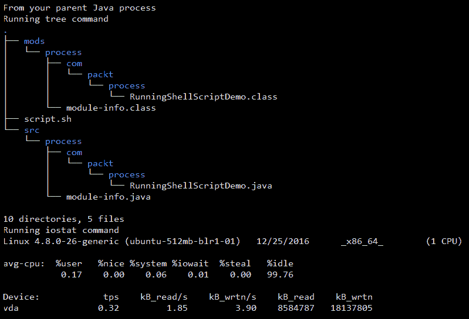

# 它是如何工作的。。。

你必须在食谱中记下两件事：

*   将进程的工作目录更改为shell脚本的位置。
*   使用`/bin/bash`执行shell脚本。

如果没有记下步骤1，则必须使用shell脚本文件的绝对路径。然而，在这个配方中，我们确实做到了这一点，因此我们只为`/bin/bash`命令使用shell脚本名称。

步骤2基本上是您希望如何执行shell脚本。这样做的方法是将shell脚本传递给解释器，解释器将解释并执行脚本。以下代码行就是这样做的：

```java
pb.command("/bin/bash", "script.sh")
```

# 获取当前JVM的进程信息

正在运行的进程具有一组与其关联的属性，例如：

*   **PID**：唯一标识流程
*   **所有者**：启动流程的用户名称
*   **命令**：流程下运行的命令
*   **CPU时间**：表示进程处于活动状态的时间
*   **开始时间**：表示流程启动的时间

这些是我们通常感兴趣的几个属性。也许我们也会对CPU使用或内存使用感兴趣。现在，在Java9之前，从Java内部获取这些信息是不可能的。然而，在Java9中，引入了一组新的API，这使我们能够获得有关流程的基本信息。

在这个配方中，我们将看到如何获取当前Java进程的进程信息；也就是说，执行代码的进程。

# 怎么做。。。

遵循以下步骤：

1.  创建一个简单类，使用`ProcessHandle.current()`获取当前Java进程的`ProcessHandle`：

```java
        ProcessHandle handle = ProcessHandle.current();
```

2.  我们添加了一些代码，这将为代码增加一些运行时间：

```java
        for ( int i = 0 ; i < 100; i++){
          Thread.sleep(1000);
        }
```

3.  在`ProcessHandle`实例上使用`info()`方法得到`ProcessHandle.Info`实例：

```java
        ProcessHandle.Info info = handle.info();
```

4.  使用`ProcessHandle.Info`实例获取界面提供的所有信息：

```java
        System.out.println("Command line: " + 
                                     info.commandLine().get());
        System.out.println("Command: " + info.command().get());
        System.out.println("Arguments: " + 
                     String.join(" ", info.arguments().get()));
        System.out.println("User: " + info.user().get());
        System.out.println("Start: " + info.startInstant().get());
        System.out.println("Total CPU Duration: " + 
                  info.totalCpuDuration().get().toMillis() +"ms");
```

5.  使用`ProcessHandle`的`pid()`方法获取当前Java进程的进程ID：

```java
        System.out.println("PID: " + handle.pid());
```

6.  我们还将使用代码即将结束的时间打印结束时间。这将使我们了解流程的执行时间：

```java
        Instant end = Instant.now();
        System.out.println("End: " + end);
```

您可以从`Chapter08/6_current_process_info`获取完整的代码。

使用以下命令编译并运行代码：

```java
$ javac -d mods --module-source-path src $(find src -name *.java) 
$ java -p mods -m process/com.packt.process.CurrentProcessInfoDemo
```

您看到的输出如下所示：

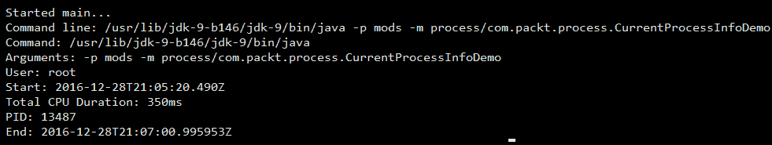

It will take some time until the program completes execution.
One observation to be made is that even if the program ran for around two minutes, the total CPU duration was 350 millisecond. This is the time period during which the CPU was busy.

# 它是如何工作的。。。

为了更好地控制本机进程并获取其信息，Java API中添加了一个名为`ProcessHandle`的新接口。使用`ProcessHandle`可以控制流程的执行，也可以获取流程的一些信息。该接口有另一个名为`ProcessHandle.Info`的内部接口。此接口提供API以获取有关流程的信息。

有多种方法可以为流程获取`ProcessHandle`对象。其中一些方法如下：

*   `ProcessHandle.current()`：用于获取当前Java进程的`ProcessHandle`实例。
*   `Process.toHandle()`：用于获取给定`Process`对象的`ProcessHandle`。
*   `ProcessHandle.of(pid)`：用于获取给定PID标识的流程的`ProcessHandle`。

在我们的食谱中，我们使用第一种方法，即使用`ProcessHandle.current()`。这为我们提供了当前Java进程的句柄。在`ProcessHandle`实例上调用`info()`方法将为我们提供一个`ProcessHandle.Info`接口实现的实例，我们可以利用它来获取流程信息，如配方代码所示。

`ProcessHandle` and `ProcessHandle.Info` are interfaces. The JDK provide either Oracle JDK or Open JDK, will provide implementations for these interfaces. Oracle JDK has a class called `ProcessHandleImpl`, which implements `ProcessHandle` and another inner class within `ProcessHandleImpl` called `Info`, which implements the `ProcessHandle.Info` interface. So, whenever you call one of the aforementioned methods to get a `ProcessHandle` object, an instance of `ProcessHandleImpl` is returned.
The same goes with the `Process` class as well. It is an abstract class and Oracle JDK provides an implementation called `ProcessImpl`, which implements the abstract methods in the `Process` class.
In all the recipes in this chapter, any mention of the instance of `ProcessHandle` or the `ProcessHandle` object will refer to the instance or object of `ProcessHandleImpl` or any other implementation class provided by the JDK you are using.
Also, any mention of the instance of `ProcessHandle.Info` or the `ProcessHandle.Info` object will refer to the instance or object of `ProcessHandleImpl.Info` or any other implementation class provided by the JDK you are using.

# 获取衍生进程的进程信息

在前面的配方中，我们看到了如何获取当前Java进程的进程信息。在本食谱中，我们将了解如何获取Java代码生成的进程的进程信息；也就是说，通过当前的Java进程。除了`ProcessHandle`实例的实现方式外，使用的API将与我们在前面的配方中看到的相同。

# 准备

在此配方中，我们将使用Unix命令`sleep`，该命令用于暂停执行一段时间（以秒为单位）。

# 怎么做。。。

遵循以下步骤：

1.  从Java代码生成一个新进程，该进程运行`sleep`命令：

```java
        ProcessBuilder pBuilder = new ProcessBuilder("sleep", "20");
        Process p = pBuilder.inheritIO().start();
```

2.  获取此衍生进程的`ProcessHandle`实例：

```java
        ProcessHandle handle = p.toHandle();
```

3.  等待生成的进程完成执行：

```java
        int exitValue = p.waitFor();
```

4.  使用`ProcessHandle`获取`ProcessHandle.Info`实例，并使用其API获取所需信息。或者，我们甚至可以使用`Process`类中的`info()`方法直接使用`Process`对象来获取`ProcessHandle.Info`：

```java
        ProcessHandle.Info info = handle.info();
        System.out.println("Command line: " + 
                                     info.commandLine().get());
        System.out.println("Command: " + info.command().get());
        System.out.println("Arguments: " + String.join(" ", 
                                      info.arguments().get()));
        System.out.println("User: " + info.user().get());
        System.out.println("Start: " + info.startInstant().get());
        System.out.println("Total CPU time(ms): " + 
                        info.totalCpuDuration().get().toMillis());
        System.out.println("PID: " + handle.pid());
```

您可以从`Chapter08/7_spawned_process_info`获取完整的代码。

使用以下命令编译并运行代码：

```java
$ javac -d mods --module-source-path src $(find src -name *.java)
$ java -p mods -m process/com.packt.process.SpawnedProcessInfoDemo
```

或者，`Chapter08/7_spawned_process_info`中有一个`run.sh`脚本，您可以在任何基于Unix的系统上以`/bin/bash run.sh`的形式运行该脚本。

您看到的输出如下所示：

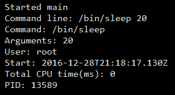

# 管理衍生流程

有几种方法，例如`destroy()`、`destroyForcibly()`（在Java 8中添加）、`isAlive()`（在Java 8中添加）和`supportsNormalTermination()`（在Java 9中添加），可以用来控制生成的进程。这些方法在`Process`对象和`ProcessHandle`对象上都可用。在这里，控制只是检查进程是否处于活动状态，如果处于活动状态，则销毁进程。

在此配方中，我们将生成一个长时间运行的流程，并执行以下操作：

*   检查它是否活泼
*   检查是否能正常停止；也就是说，根据平台的不同，必须使用销毁或强制销毁来停止该过程
*   停止这个过程

# 怎么做。。。

1.  从Java代码生成一个新进程，该进程运行`sleep`命令一分钟或60秒：

```java
        ProcessBuilder pBuilder = new ProcessBuilder("sleep", "60");
        Process p = pBuilder.inheritIO().start();

```

2.  等待，比如说，10秒钟：

```java
        p.waitFor(10, TimeUnit.SECONDS);
```

3.  检查进程是否处于活动状态：

```java
        boolean isAlive = p.isAlive();
        System.out.println("Process alive? " + isAlive);
```

4.  检查过程是否能正常停止：

```java
        boolean normalTermination = p.supportsNormalTermination();
        System.out.println("Normal Termination? " + normalTermination);
```

5.  停止进程并检查其活力：

```java
        p.destroy();
        isAlive = p.isAlive();
        System.out.println("Process alive? " + isAlive);
```

您可以从`Chapter08/8_manage_spawned_process`获取完整的代码。

我们提供了一个名为`run.sh`的实用程序脚本，您可以使用它编译和运行代码-`sh run.sh`。

我们得到的结果如下：

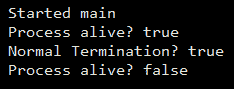

如果我们在Windows上运行该程序，`supportsNormalTermination()`返回`false`，但在Unix上`supportsNormalTermination()`返回`true`（如前面的输出所示）。

# 枚举系统中的活动进程

在Windows中，您可以打开Windows任务管理器来查看当前活动的进程，在Linux中，您可以使用带有各种选项的`ps`命令来查看进程以及其他详细信息，如用户、花费的时间、命令等。

在Java9中，添加了一个名为`ProcessHandle`的新API，用于控制和获取有关进程的信息。API的方法之一是`allProcesses()`，它返回当前进程可见的所有进程的快照。在本食谱中，我们将了解该方法是如何工作的，以及我们可以从API中提取哪些信息。

# 怎么做。。。

遵循以下步骤：

1.  使用`ProcessHandle`界面上的`allProcesses()`方法获取当前活动进程的流：

```java
         Stream<ProcessHandle> liveProcesses = 
                       ProcessHandle.allProcesses();
```

2.  使用`forEach()`在流上迭代，并传递lambda表达式以打印可用的详细信息：

```java
         liveProcesses.forEach(ph -> {
           ProcessHandle.Info phInfo = ph.info();
           System.out.println(phInfo.command().orElse("") +" " + 
                              phInfo.user().orElse(""));
         });
```

您可以从`Chapter08/9_enumerate_all_processes`获取完整的代码。

我们提供了一个名为`run.sh`的实用程序脚本，您可以使用它编译和运行代码-`sh run.sh`。

我们得到的结果如下：

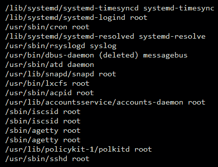

在前面的输出中，我们正在打印命令名以及进程的用户。我们展示了输出的一小部分。

# 使用管道连接多个进程

在Unix中，通常使用`|`符号将一组命令通过管道连接在一起，以创建活动管道，其中命令的输入是前一个命令的输出。这样，我们可以处理输入以获得所需的输出。

常见的情况是，您希望在日志文件中搜索某个内容或模式，或在日志文件中搜索某个文本。在这种情况下，您可以创建一个管道，通过一系列命令传递所需的日志文件数据，即，`cat`、`grep`、`wc -l`等等。

在本配方中，我们将使用UCI机器学习库中的Iris数据集，该数据集位于[https://archive.ics.uci.edu/ml/datasets/Iris](https://archive.ics.uci.edu/ml/datasets/Iris) 创建一个管道，我们将计算每种花的出现次数。

# 准备

我们已经下载了虹膜花数据集（[https://archive.ics.uci.edu/ml/datasets/iris](https://archive.ics.uci.edu/ml/datasets/iris) ），可在本书代码下载的`Chapter08/10_connecting_process_pipe/iris.data`处找到。

如果您碰巧看到`Iris`数据，您将看到以下格式的150行：

```java
4.7,3.2,1.3,0.2,Iris-setosa
```

这里有多个属性用逗号（`,`分隔，属性如下：

*   萼片长度（厘米）
*   萼片宽度（厘米）
*   花瓣长度（厘米）
*   花瓣宽度（厘米）
*   类别：
    *   山鸢尾
    *   花色鸢尾
    *   弗吉尼亚鸢尾

在这个食谱中，我们将找到每一类花的总数，即刚毛、杂色和弗吉尼亚。

我们将通过以下命令使用管道（使用基于Unix的操作系统）：

```java
$ cat iris.data.txt | cut -d',' -f5 | uniq -c
```

我们得到的结果如下：

```java
50 Iris-setosa
50 Iris-versicolor
50 Iris-virginica
1
```

末尾的1表示文件末尾的新行。因此，每个班级有50朵鲜花。让我们仔细分析上面的shell命令管道，了解它们各自的功能：

*   `cat`：此命令读取作为参数给出的文件。
*   `cut`：使用`-d`选项中给出的字符分割每一行，并返回`-f`选项标识的列中的值。
*   `uniq`：返回给定值的唯一列表，当使用`-c`选项时，返回每个唯一值在列表中出现的次数。

# 怎么做。。。

1.  创建一个`ProcessBuilder`对象列表，它将保存参与我们管道的`ProcessBuilder`实例。另外，将管道中最后一个进程的输出重定向到当前Java进程的标准输出：

```java
         List<ProcessBuilder> pipeline = List.of(
           new ProcessBuilder("cat", "iris.data.txt"),
           new ProcessBuilder("cut", "-d", ",", "-f", "5"),
           new ProcessBuilder("uniq", "-c")
               .redirectOutput(ProcessBuilder.Redirect.INHERIT)
         );
```

2.  使用`ProcessBuilder`的`startPipeline()`方法，通过`ProcessBuilder`对象列表启动管线。它将返回一个`Process`对象列表，每个对象代表列表中的一个`ProcessBuilder`对象：

```java
  List<Process> processes = ProcessBuilder.startPipeline(pipeline);
```

3.  获取列表中的最后一个流程并`waitFor`完成：

```java
     int exitValue = processes.get(processes.size() - 1).waitFor();
```

您可以从`Chapter08/10_connecting_process_pipe`获取完整的代码。

我们提供了一个名为`run.sh`的实用程序脚本，您可以使用它编译和运行代码-`sh run.sh`。

我们得到的结果如下：

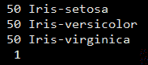

# 它是如何工作的。。。

`startPipeline()`方法为列表中的每个`ProcessBuilder`对象启动`Process`。除了第一个和最后一个进程外，它使用`ProcessBuilder.Redirect.PIPE`将一个进程的输出重定向到另一个进程的输入。如果您为任何中间流程提供了`redirectOutput`而不是`ProcessBuilder.Redirect.PIPE`，则会抛出错误；类似于以下内容：

```java
Exception in thread "main" java.lang.IllegalArgumentException: builder redirectOutput() must be PIPE except for the last builder: INHERIT. 
```

它指出，除最后一个构建器外，任何构建器都应该将其输出重定向到下一个进程。同样适用于`redirectInput`。

# 管理子流程

当一个流程启动另一个流程时，启动的流程将成为启动流程的子流程。启动的流程反过来可以启动另一个流程，并且这个链可以继续。这将生成一个进程树。通常，我们必须处理一个有缺陷的子流程，可能想要杀死该子流程，或者我们可能想要知道启动的子流程，可能想要获得关于它们的一些信息。

在Java9中，`Process`类中添加了两个新的API—`children()`和`descendants()`。`children()`API提供当前流程的直接子流程快照列表，`descendants()`API提供当前流程递归`children()`的流程快照；也就是说，它们在每个子进程上递归调用`children()`。

在这个配方中，我们将查看`children()`和`descendants()`API，并查看我们可以从流程快照中收集哪些信息。

# 准备

让我们创建一个简单的shell脚本，我们将在配方中使用它。此脚本可在`Chapter08/11_managing_sub_process/script.sh`找到：

```java
echo "Running tree command";
tree;
sleep 60;
echo "Running iostat command";
iostat;
```

在前面的脚本中，我们正在运行命令`tree`和`iostat`，两个命令之间有一分钟的睡眠时间。如果您想了解这些命令，请参考本章的*运行shell脚本*配方。从bashshell中执行sleep命令时，每次调用它时都会创建一个新的子进程。

例如，我们将创建10个`ProcessBuilder`实例来运行前面的shell脚本并同时启动它们。

# 怎么做。。。

1.  我们将创建10个`ProcessBuilder`实例来运行我们的shell脚本（可在`Chapter08/11_managing_sub_process/script.sh`上找到）。我们不关心它的输出，所以让我们通过将输出重定向到名为`ProcessHandle.Redirect.DISCARD`的预定义重定向来丢弃命令的输出：

```java
        for ( int i = 0; i < 10; i++){
          new ProcessBuilder("/bin/bash", "script.sh")
              .redirectOutput(ProcessBuilder.Redirect.DISCARD)
              .start();
        }
```

2.  获取当前进程的句柄：

```java
        ProcessHandle currentProcess = ProcessHandle.current();
```

3.  使用当前进程使用`children()`API获取其子进程，并迭代每个子进程以打印其信息。一旦我们有了`ProcessHandle`的实例，我们可以做很多事情，比如销毁流程，获取流程信息，等等：

```java
        System.out.println("Obtaining children");
        currentProcess.children().forEach(pHandle -> {
          System.out.println(pHandle.info());
        });
```

4.  使用当前流程，通过使用`descendants()`API获取其子流程的所有子流程，并迭代每个子流程以打印其信息：

```java
        currentProcess.descendants().forEach(pHandle -> {
          System.out.println(pHandle.info());
        });
```

您可以从`Chapter08/11_managing_sub_process`获取完整的代码。

我们提供了一个名为`run.sh`的实用程序脚本，您可以使用它编译和运行代码-`sh run.sh`。

我们得到的结果如下：

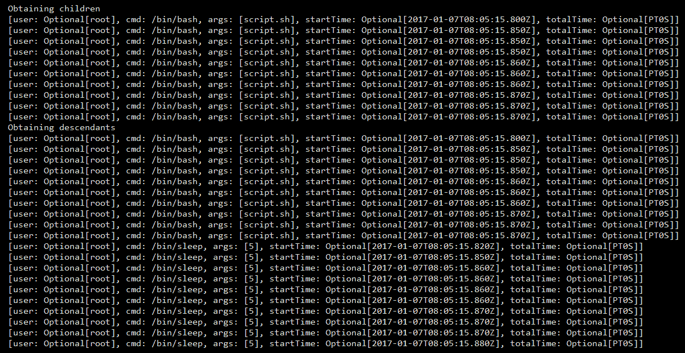

# 它是如何工作的。。。

API`children()`和`descendants()`为每个进程返回`ProcessHandler`的`Stream`，这些进程可以是当前进程的直接子进程，也可以是当前进程的后代。使用`ProcessHandler`实例，我们可以执行以下操作：

*   获取流程信息
*   检查进程的状态
*   停止这个过程