# 使用 springboot 的 restfulweb 服务

在本章中，我们将介绍以下配方：

*   创建一个简单的 Spring 引导应用程序
*   与数据库交互
*   创建 RESTful web 服务
*   为 Spring Boot 创建多个配置文件
*   将 RESTful web 服务部署到 Heroku
*   使用 Docker 容器化 RESTful web 服务
*   使用千分尺和Prometheus监控 Spring Boot 2 应用程序

# 介绍

近年来，基于微服务体系结构的驱动器得到了广泛的采用，这要归功于它在正确的方式下提供的简单性和易维护性。许多公司，如 Netflix 和 Amazon，已经从单一的系统转移到更专注、更轻的系统，所有这些都是通过 RESTful web 服务相互交流的。RESTful web 服务的出现及其使用已知 HTTP 协议创建 web 服务的简单方法使得应用程序之间的通信比旧的基于 SOAP 的 web 服务更容易。

在本章中，我们将介绍**Spring Boot**框架，它提供了一种使用 Spring 库创建生产就绪微服务的便捷方法。使用 SpringBoot，我们将开发一个简单的 RESTfulWeb 服务并将其部署到云中。

# 创建一个简单的 Spring 引导应用程序

Spring Boot 有助于轻松创建生产就绪、基于 Spring 的应用程序。它支持使用几乎所有的 Spring 库，而无需显式配置它们。提供了自动配置类，以便与最常用的库、数据库和消息队列轻松集成。

在本教程中，我们将介绍如何创建一个简单的 Spring 引导应用程序，该应用程序带有一个控制器，当在浏览器中打开时，该控制器将打印一条消息。

# 准备

SpringBoot 支持 Maven 和 Gradle 作为其构建工具，我们将在我们的食谱中使用 Maven。[以下 URL](http://start.spring.io/) 提供了一种方便的方法来创建具有所需依赖项的空项目。我们将使用它下载一个空项目。按照以下步骤创建并下载空的基于 Spring 引导的项目：

1.  导航至[这里](http://start.spring.io/)查看与以下截图类似的内容：

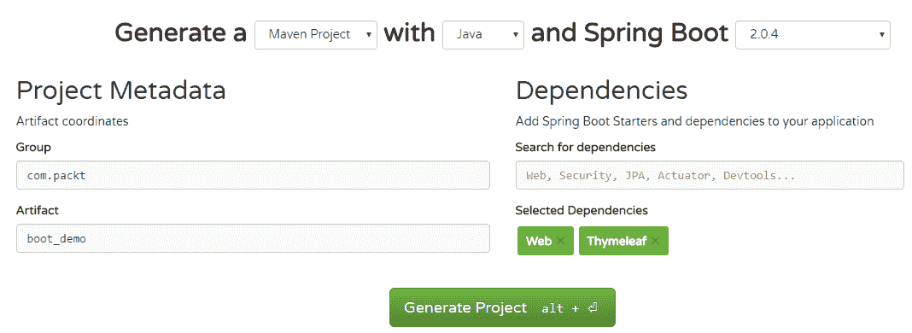

2.  您可以选择依赖项管理和构建工具，在**生成**文本后的下拉列表中选择适当的选项。

3.  Spring Boot 支持 Java、Kotlin 和 Groovy。您可以通过将**后的下拉列表更改为**文本来选择语言。
4.  通过从和 Spring 引导文本后的下拉列表中选择其值来选择 Spring 引导版本。对于这个配方，我们将使用 SpringBoot2 的最新稳定版本，即 2.0.4。
5.  在左侧，在项目元数据下，我们必须提供与 Maven 相关的信息，即组 ID 和工件 ID。我们将使用组作为`com.packt`，工件作为`boot_demo`。
6.  在右侧的“依赖项”下，可以搜索要添加的依赖项。对于这个配方，我们需要 web 和 Thymeleaf 依赖项。这意味着我们希望创建一个使用 Thymeleaf UI 模板的 web 应用程序，并希望所有依赖项（如 Spring MVC 和 Embedded Tomcat）都成为应用程序的一部分。
7.  单击 Generate Project 按钮下载空项目。您可以在您选择的任何 IDE 中加载这个空项目，就像任何其他 Maven 项目一样。

此时，您将把空项目加载到您选择的 IDE 中，并准备进一步探索。在这个配方中，我们将使用 Thymeleaf 模板引擎来定义我们的网页，并创建一个简单的控制器来呈现网页。

此配方的完整代码可在`Chapter09/1_boot_demo`中找到。

# 怎么做。。。

1.  如果您遵循了*准备就绪*部分中提到的组 ID 和工件 ID 命名约定，那么您将拥有一个包结构`com.packt.boot_demo`和一个已经为您创建的`BootDemoApplication.java`主类。在`tests`文件夹下将有一个等效的包结构和一个`BootDemoApplicationTests.java`主类。

2.  在`com.packt.boot_demo`包下创建一个新类`SimpleViewController`，代码如下：

```java
        @Controller
        public class SimpleViewController{
          @GetMapping("/message")
          public String message(){
            return "message";
          }  
        }
```

3.  在`src/main/resources/templates`下创建一个网页`message.html`，其代码如下：

```java
        <h1>Hello, this is a message from the Controller</h1>
        <h2>The time now is [[${#dates.createNow()}]]</h2>
```

4.  在命令提示下，导航到项目根文件夹，发出`mvn spring-boot:run`命令；您将看到应用程序正在启动。一旦完成初始化并启动，它将在默认端口`8080`上运行。导航至`http://localhost:8080/message`查看消息。

我们正在使用 SpringBoot 的 Maven 插件，它为我们在开发过程中启动应用程序提供了方便的工具。但对于生产，我们将创建一个胖 JAR，即包含所有依赖项的 JAR，并将其部署为 Linux 或 Windows 服务。我们甚至可以使用`java -jar`命令运行胖罐子。

# 它是如何工作的。。。

我们将不讨论 SpringBoot 或其他 Spring 库的工作。Spring Boot 创建了一个在默认端口上运行的嵌入式 Tomcat，即`8080`。然后，它使用`@SpringBootApplication`注释注册类的包和子包中可用的所有控制器、组件和服务。

在我们的配方中，`com.packt.boot_demo`包中的`BootDemoApplication`类用`@SpringBootApplication`注释。因此，所有用`@Controller`、`@Service`、`@Configuration`和`@Component`注释的类都作为 bean 在 Spring 框架中注册并由它管理。现在，可以使用`@Autowired`注释将它们注入到代码中。

有两种方法可以创建 web 控制器：

*   用`@Controller`注释
*   用`@RestController`注释

在第一种方法中，我们创建了一个控制器，它可以同时提供原始数据和 HTML 数据（由 Thymeleaf、Freemarker 和 JSP 等模板引擎生成）。在第二种方法中，控制器支持只能以 JSON 或 XML 形式提供原始数据的端点。在我们的配方中，我们使用了前一种方法，如下所示：

```java
@Controller
public class SimpleViewController{
  @GetMapping("/message")
  public String message(){
    return "message";
  }
}
```

我们可以用`@RequestMapping`注释这个类，比如说`@RequestMapping("/api")`。在这种情况下，控制器中暴露的任何 HTTP 端点都由`/api`预先准备好。HTTP`GET`、`POST`、`DELETE`和`PUT`方法都有专门的注释映射，分别是`@GetMapping`、`@PostMapping`、`@DeleteMapping`和`@PutMapping`。我们还可以重写控制器类，如下所示：

```java
@Controller
@RequestMapping("/message")
public class SimpleViewController{
  @GetMapping
  public String message(){
    return "message";
  }
}
```

我们可以通过在`application.properties`文件中提供`server.port = 9090`来修改端口。此文件可在`src/main/resources/application.properties`中找到。[有一整套属性](http://docs.spring.io/spring-boot/docs/current/reference/html/common-application-properties.html)，我们可以使用它来定制和连接不同的组件。

# 与数据库交互

在此配方中，我们将了解如何与数据库集成以创建、读取、修改和删除数据。为此，我们将使用所需的表设置一个 MySQL 数据库。随后，我们将从 Spring 引导应用程序更新表中的数据。

我们将使用 Windows 作为该配方的开发平台。您也可以在 Linux 上执行类似的操作，但首先必须设置 MySQL 数据库。

# 准备

在开始将应用程序与数据库集成之前，我们需要在开发机器上本地设置数据库。在接下来的小节中，我们将下载并安装 MySQL 工具，然后创建一个包含一些数据的示例表，我们将在应用程序中使用这些数据。

# 安装 MySQL 工具

首先，从[这里](https://dev.mysql.com/downloads/windows/installer/5.7.html)下载 MySQL 安装程序。此 MySQL 捆绑包仅适用于 Windows。按照屏幕上的说明成功安装 MySQL 以及 MySQL Workbench 等其他工具。要确认 MySQL 守护程序（`mysqld`）正在运行，请打开任务管理器，您应该能够看到类似于以下内容的流程：

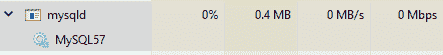

您应该记住为 root 用户设置的密码。

让我们运行 MySQL 工作台；启动时，您应该能够看到类似于以下屏幕截图的内容，以及该工具提供的其他内容：

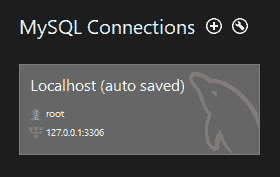

如果未找到如上图所示的连接，可以使用（+）符号添加一个连接。单击（+）时，您将看到以下对话框。填写并单击“测试连接”以获得成功消息：

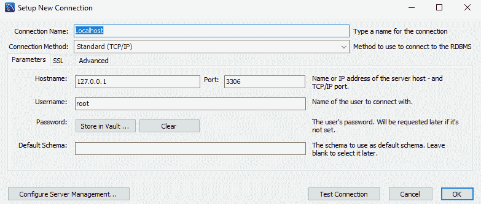

成功的测试连接将产生以下消息：

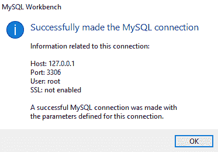

双击连接以连接到数据库，您将在左侧看到一个数据库列表，在右侧看到一个空白区域，在顶部看到一个菜单和工具栏。在文件菜单中，点击新建查询页签，或按*Ctrl*+*T*键，即可得到一个新的查询窗口。在这里，我们将编写查询来创建一个数据库，并在该数据库中创建一个表。

[这里](https://dev.mysql.com/downloads/windows/installer/5.7.html)下载的捆绑的安装程序仅适用于 Windows。 Linux 用户必须分别下载 MySQL Server 和 MySQL Workbench（用于与 DB 交互的 GUI）。MySQL服务器可以从[这里](https://dev.mysql.com/downloads/mysql/)下载。MySQL Workbench 可以从[这里](https://dev.mysql.com/downloads/workbench/)下载。

# 创建示例数据库

运行以下 SQL 语句以创建数据库：

```java
create database sample;
```

# 创建人员表

运行以下 SQL 语句以使用新创建的数据库并创建简单的 person 表：

```java
create table person( 
  id int not null auto_increment,    
  first_name varchar(255),    
  last_name varchar(255),
  place varchar(255),    
  primary key(id)
);
```

# 填充样本数据

让我们继续在刚刚创建的表中插入一些示例数据：

```java
insert into person(first_name, last_name, place) 
values('Raj', 'Singh', 'Bangalore');

insert into person(first_name, last_name, place) 
values('David', 'John', 'Delhi');
```

现在我们已经准备好了数据库，我们将继续实用以下选项[下载空的 Spring 引导项目](http://start.spring.io/)：

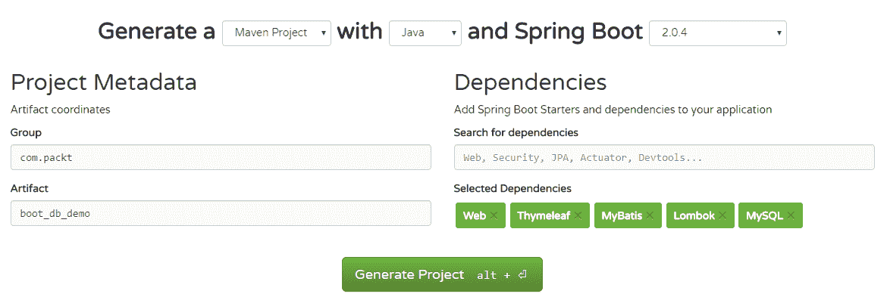

# 怎么做。。。

1.  创建一个模型类`com.packt.boot_db_demo.Person`，以表示一个人。我们将使用 Lombok 注释为我们生成 getter 和 setter：

```java
        @Data
        public class Person{
          private Integer id;
          private String firstName;
          private String lastName;
          private String place;
        }
```

2.  创建`com.packt.boot_db_demo.PersonMapper`将数据库中的数据映射到我们的模型类`Person`：

```java
        @Mapper
        public interface PersonMapper {
        }
```

3.  让我们添加一个方法来获取表中的所有行。注意下面几个方法将写入`PersonMapper`接口中：

```java
        @Select("SELECT * FROM person")
        public List<Person> getPersons();
```

4.  获取由 ID 标识的单个人员的详细信息的另一种方法如下：

```java
        @Select("SELECT * FROM person WHERE id = #{id}")
        public Person getPerson(Integer id);
```

5.  在表中创建新行的方法如下：

```java
        @Insert("INSERT INTO person(first_name, last_name, place) " 
                 + " VALUES (#{firstName}, #{lastName}, #{place})")
        @Options(useGeneratedKeys = true)
        public void insert(Person person);
```

6.  更新表中由 ID 标识的现有行的方法如下：

```java
  @Update("UPDATE person SET first_name = #{firstName},last_name = 
             #{lastName}, "+ "place = #{place}  WHERE id = #{id} ")
  public void save(Person person);
```

7.  从表中删除由 ID 标识的行的方法如下：

```java
        @Delete("DELETE FROM person WHERE id = #{id}")
        public void delete(Integer id);
```

8.  让我们创建一个`com.packt.boot_db_demo.PersonController`类，用于编写 web 端点：

```java
        @Controller
        @RequestMapping("/persons")
        public class PersonContoller {
          @Autowired PersonMapper personMapper;
        }
```

9.  让我们创建一个端点来列出`person`表中的所有条目：

```java
        @GetMapping
        public String list(ModelMap model){
          List<Person> persons = personMapper.getPersons();
          model.put("persons", persons);
          return "list";
        }
```

10.  让我们创建一个端点，在`person`表中添加一个新行：

```java
   @GetMapping("/{id}")
   public String detail(ModelMap model, @PathVariable Integer id){
        System.out.println("Detail id: " + id);
        Person person = personMapper.getPerson(id);
        model.put("person", person);
        return "detail";
   }
```

11.  让我们创建一个端点，在`person`表中添加新行或编辑现有行：

```java
        @PostMapping("/form")
        public String submitForm(Person person){
          System.out.println("Submiting form person id: " + 
                             person.getId());
          if ( person.getId() != null ){
            personMapper.save(person);
          }else{
            personMapper.insert(person);
          }
          return "redirect:/persons/";
        }  
```

12.  让我们创建一个端点来删除`person`表中的一行：

```java
        @GetMapping("/{id}/delete")
        public String deletePerson(@PathVariable Integer id){
          personMapper.delete(id);
          return "redirect:/persons";
        }
```

13.  更新`src/main/resources/application.properties`文件，提供与我们的数据源，即我们的 MySQL 数据库相关的配置：

```java
  spring.datasource.driver-class-name=com.mysql.jdbc.Driver
  spring.datasource.url=jdbc:mysql://localhost/sample?useSSL=false
  spring.datasource.username=root
  spring.datasource.password=mohamed
  mybatis.configuration.map-underscore-to-camel-case=true
```

您可以使用`mvn spring-boot:run`从命令行运行应用程序。此应用程序在默认端口上启动，即`8080`。在浏览器中导航到`http://localhost:8080/persons`。

此配方的完整代码可在`Chapter09/2_boot_db_demo`中找到。

访问`http://localhost:8080/persons`时，您会发现：

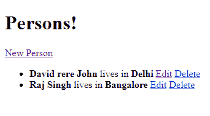

点击**新人**，您将获得以下信息：

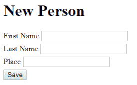

点击**编辑**按钮，您将看到以下内容：

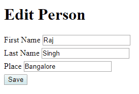

# 它是如何工作的。。。

首先，`org.apache.ibatis.annotations.Mapper`注释的`com.packt.boot_db_demo.PersonMapper`知道如何执行`@Select`、`@Update`和`@Delete`注释中提供的查询并返回相关结果。这些都由 MyBatis 和 Spring 数据库管理。

您一定想知道到数据库的连接是如何实现的。其中一个 Spring Boot 自动配置类`DataSourceAutoConfiguration`通过使用您的`application.properties`文件中定义的`spring.datasource.*`属性进行设置，为我们提供一个`javax.sql.DataSource`实例。然后，MyBatis 库使用此`javax.sql.DataSource`对象为您提供`SqlSessionTemplate`的实例，这是我们的`PersonMapper`在引擎盖下使用的。

然后，我们使用`com.packt.boot_db_demo.PersonMapper`，通过使用`@AutoWired`将其注入`com.packt.boot_db_demo.PersonController`类。`@AutoWired`注释查找任何 Spring 管理的 bean，这些 bean 要么是确切类型的实例，要么是其实现。看看本章中的*创建一个简单的 Spring Boot 应用程序*配方，了解`@Controller`注释。

通过很少的配置，我们能够快速设置简单的 CRUD 操作。这就是 SpringBoot 为开发人员提供的灵活性和敏捷性！

# 创建 RESTful web 服务

在我们之前的配方中，我们使用 web 表单与数据交互。在这个配方中，我们将看到如何使用 RESTfulWeb 服务与数据交互。这些 web 服务是使用已知 HTTP 协议及其方法（即 GET、POST 和 PUT）与其他应用程序交互的一种手段。数据可以以 XML、JSON 甚至纯文本的形式交换。我们将在菜谱中使用 JSON。

因此，我们将创建 RESTful API 来支持检索数据、创建新数据、编辑数据和删除数据。

# 准备

照常[下载初学者项目](http://start.spring.io/)，通过选择以下屏幕截图中显示的依赖项：

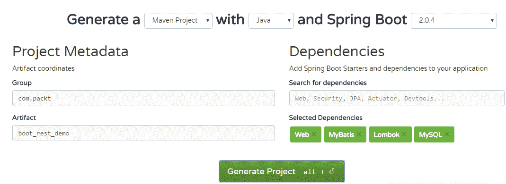

# 怎么做。。。

1.  从上一个配方复制`Person`类：

```java
        public class Person {
          private Integer id;
          private String firstName;
          private String lastName;
          private String place;
          //required getters and setters
        }
```

2.  我们将用另一种方式来做`PersonMapper`部分。我们将把所有 SQL 查询写入 mapper XML 文件中，然后从`PersonMapper`接口引用它们。我们将把映射器 XML 放在`src/main/resources/mappers`文件夹下。我们将`mybatis.mapper-locations`属性的值设置为`classpath*:mappers/*.xml`。这样，`PersonMapper`接口就可以发现与其方法对应的 SQL 查询。

3.  创建`com.packt.boot_rest_demo.PersonMapper`接口：

```java
        @Mapper
        public interface PersonMapper {
          public List<Person> getPersons();
          public Person getPerson(Integer id);
          public void save(Person person);
          public void insert(Person person);
          public void delete(Integer id);
        }
```

4.  在`PersonMapper.xml`中创建 SQL。确保`<mapper>`标记的`namespace`属性与`PersonMapper`映射器接口的完全限定名相同：

```java
        <!DOCTYPE mapper PUBLIC "-//mybatis.org//DTD Mapper 3.0//EN"
          "http://mybatis.org/dtd/mybatis-3-mapper.dtd">
        <mapper namespace="com.packt.boot_rest_demo.PersonMapper">
          <select id="getPersons"
           resultType="com.packt.boot_rest_demo.Person">
            SELECT id, first_name firstname, last_name lastname, place
            FROM person
          </select>

          <select id="getPerson"
           resultType="com.packt.boot_rest_demo.Person"
           parameterType="long">
            SELECT id, first_name firstname, last_name lastname, place
            FROM person
            WHERE id = #{id}
          </select>

          <update id="save"
           parameterType="com.packt.boot_rest_demo.Person">
            UPDATE person SET
              first_name = #{firstName},
              last_name = #{lastName},
              place = #{place}
            WHERE id = #{id}
          </update>

          <insert id="insert" 
           parameterType="com.packt.boot_rest_demo.Person"
           useGeneratedKeys="true" keyColumn="id" keyProperty="id">
            INSERT INTO person(first_name, last_name, place)
            VALUES (#{firstName}, #{lastName}, #{place})
          </insert>

          <delete id="delete" parameterType="long">
            DELETE FROM person WHERE id = #{id}
          </delete>
        </mapper>
```

5.  在`src/main/resources/application.properties`文件中定义应用程序属性：

```java
        spring.datasource.driver-class-name=com.mysql.jdbc.Driver
        spring.datasource.url=jdbc:mysql://localhost/sample?    
        useSSL=false
        spring.datasource.username=root
        spring.datasource.password=mohamed
        mybatis.mapper-locations=classpath*:mappers/*.xml
```

6.  为 RESTAPI 创建一个空控制器。此控制器将标记有`@RestController`注释，因为其中的所有 API 都将单独处理数据：

```java
        @RestController
        @RequestMapping("/api/persons")
        public class PersonApiController {
          @Autowired PersonMapper personMapper;
        }
```

7.  添加 API 以列出`person`表中的所有行：

```java
        @GetMapping
        public ResponseEntity<List<Person>> getPersons(){
          return new ResponseEntity<>(personMapper.getPersons(),
                                      HttpStatus.OK);
        }
```

8.  添加 API 以获取单个人员的详细信息：

```java
   @GetMapping("/{id}")
   public ResponseEntity<Person> getPerson(@PathVariable Integer id){
      return new ResponseEntity<>(personMapper.getPerson(id),
                                                     HttpStatus.OK);
   }
```

9.  添加 API 以向表中添加新数据：

```java
        @PostMapping
        public ResponseEntity<Person> newPerson
                       (@RequestBody Person person){
          personMapper.insert(person);
          return new ResponseEntity<>(person, HttpStatus.OK);
        }
```

10.  添加 API 以编辑表中的数据：

```java
        @PostMapping("/{id}")
        public ResponseEntity<Person> updatePerson
                       (@RequestBody Person person,
          @PathVariable Integer id){
            person.setId(id);
            personMapper.save(person);
            return new ResponseEntity<>(person, HttpStatus.OK);
          }
```

11.  添加 API 以删除表中的数据：

```java
        @DeleteMapping("/{id}")
        public ResponseEntity<Void> deletePerson
                       (@PathVariable Integer id){
          personMapper.delete(id);
          return new ResponseEntity<>(HttpStatus.OK);
        }
```

您可以在`Chapter09/3_boot_rest_demo`找到完整的代码。您可以从项目文件夹中使用`mvn spring-boot:run`启动应用程序。应用程序启动后，导航至`http://localhost:8080/api/persons`查看 person 表中的所有数据。

为了测试其他 API，我们将使用用于 Google Chrome 的 Postman REST 客户端应用程序。

这就是添加一个新人的样子。查看请求主体，即 JSON 中指定的人员详细信息：

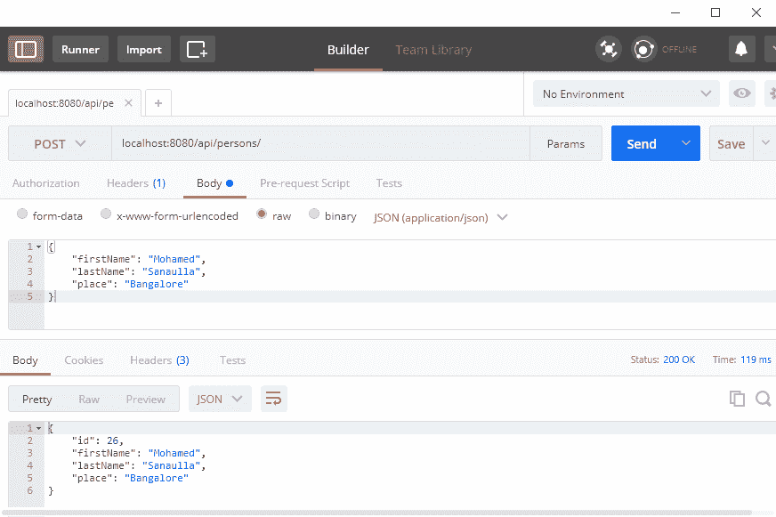

这是我们编辑个人详细信息的方式：

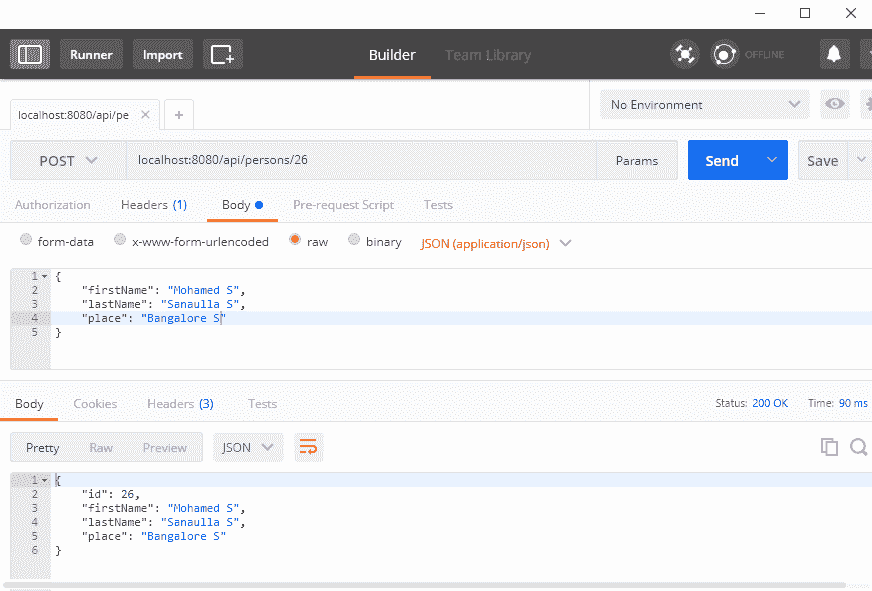

这就是删除一个人的方式：

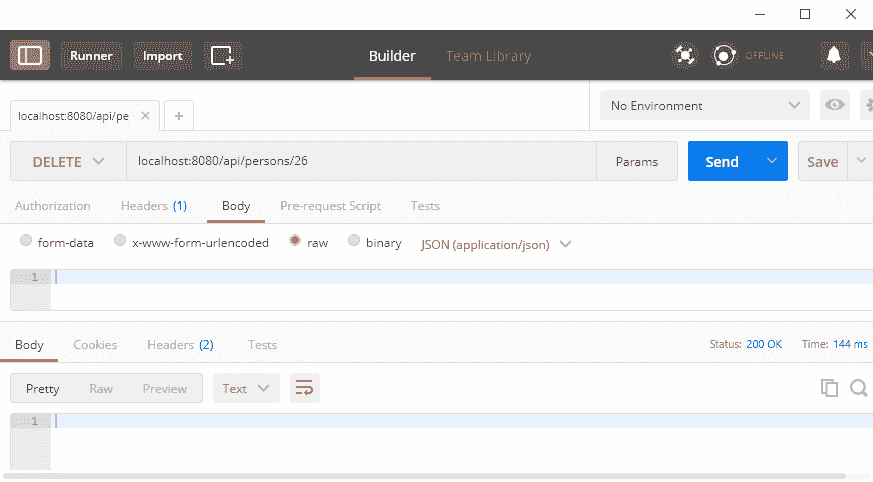

# 它是如何工作的。。。

首先，让我们看看`PersonMapper`接口是如何发现要执行的 SQL 语句的。如果你看`src/main/resources/mappers/PersonMapper.xml`，你会发现`<mapper>``namespace`属性是`org.packt.boot_rest_demo.PersonMapper`。这是一个要求，`namespace`属性的值应该是映射器接口的完全限定名，在我们的例子中，它是`org.packt.boot_rest_demo.PersonMapper`。

接下来，在`<select>`、`<insert>`、`<update>`和`<delete>`中定义的各个 SQL 语句的`id`属性应该与 mapper 接口中的方法名称匹配。例如，`PersonMapper`接口中的`getPersons()`方法查找带有`id="getPersons"`的 SQL 语句。

现在，MyBatis 库通过读取`mybatis.mapper-locations`属性的值来发现这个映射器 XML 的位置。

在控制器方面，我们引入了一个新的注释`@RestController`。这个特殊的注释指出，除了它是一个 web 控制器之外，类中定义的所有方法都返回一个通过 HTTP 响应体发送的响应；其余的 API 也是如此。他们只是处理数据。

与往常一样，您可以通过使用 Maven Spring Boot 插件`mvn spring-boot:run`或执行 Maven 包`java -jar my_jar_name.jar`创建的 JAR 来启动 Spring Boot 应用程序。

# 为 Spring Boot 创建多个配置文件

通常，web 应用程序部署在不同的环境中—首先，它们在开发人员的机器上本地运行，然后部署在测试服务器上，最后部署在生产服务器上。我们将让应用程序与每个环境中位于不同位置的组件进行交互。最好的方法是为每个环境维护不同的概要文件。一种方法是创建不同版本的`application.properties`文件，即存储应用程序级属性的文件的不同版本。Spring Boot 中的这些属性文件也可以是 YML 文件，例如`application.yml`。即使创建了不同的版本，也需要一种机制来告诉应用程序根据文件部署到的环境选择相关版本。

SpringBoot 为这种特性提供了惊人的支持。它允许您拥有多个配置文件，每个配置文件代表一个特定的配置文件，然后，您可以在不同的配置文件中启动应用程序，具体取决于应用程序部署到的环境。让我们看看这一点，然后我们将解释它是如何工作的。

# 准备

对于此配方，有两个选项可以托管 MySQL 数据库的另一个实例：

1.  使用 AWS 等云提供商，使用其亚马逊[**关系数据库服务**（**RDS**）](https://aws.amazon.com/rds/)。它们有一定的免费使用限制。
2.  使用云提供商，如 [DigitalOcean](https://www.digitalocean.com/) 以每月 5 美元的价格购买一个 droplet（即服务器）。在上面安装 MySQL 服务器。
3.  使用 VirtualBox 在您的计算机上安装 Linux，假设我们使用的是 Windows，反之亦然，如果您使用的是 Linux。在上面安装 MySQL 服务器。

选项更多，从托管的数据库服务到服务器，这些服务器为您提供安装 MySQL 服务器的完整根访问权限。对于此配方，我们执行了以下操作：

1.  我们从 DigitalOcean 购买了一个基本的液滴。
2.  我们使用带有 root 用户密码的`sudo apt-get install mysql-server-5.7`安装了 MySQL。
3.  我们创建了另一个用户`springboot`，以便我们可以使用该用户从 RESTful web 服务应用程序进行连接：

```java
 $ mysql -uroot -p
 Enter password: 
 mysql> create user 'springboot'@'%' identified by 'springboot';
```

4.  我们修改了 MySQL 配置文件，以便 MySQL 允许远程连接。这可以通过编辑服务器 IP 的`/etc/mysql/mysql.conf.d/mysqld.cnf`文件中的`bind-address`属性来完成。
5.  在 MySQL 工作台上，我们使用`IP = <Digital Ocean droplet IP>`、`username = springboot`和`password = springboot`添加了新的 MySQL 连接。

MySQL 配置文件在 Ubuntu 操作系统中的位置为`/etc/mysql/mysql.conf.d/mysqld.cnf`。查找特定于操作系统的配置文件位置的一种方法是执行以下操作：

1.  运行`mysql --help`。
2.  在输出中，搜索`Default options are read from the following files in the given order:`。下面是 MySQL 配置文件的可能位置。

我们将创建所需的表并填充一些数据。但在此之前，我们会将`sample`数据库创建为`root`，并将其上的所有权限授予`springboot`用户：

```java
mysql -uroot
Enter password: 

mysql> create database sample;

mysql> GRANT ALL ON sample.* TO 'springboot'@'%';
Query OK, 0 rows affected (0.00 sec)

mysql> flush privileges;
```

现在，让我们以`springboot`用户的身份连接到数据库，创建所需的表，并用一些示例数据填充它：

```java
mysql -uspringboot -pspringboot

mysql> use sample
Database changed
mysql> create table person(
-> id int not null auto_increment,
-> first_name varchar(255),
-> last_name varchar(255),
-> place varchar(255),
-> primary key(id)
-> );
Query OK, 0 rows affected (0.02 sec)

mysql> INSERT INTO person(first_name, last_name, place) VALUES('Mohamed', 'Sanaulla', 'Bangalore');
mysql> INSERT INTO person(first_name, last_name, place) VALUES('Nick', 'Samoylov', 'USA');

mysql> SELECT * FROM person;
+----+------------+-----------+-----------+
| id | first_name | last_name | place     |
+----+------------+-----------+-----------+
| 1  | Mohamed    | Sanaulla  | Bangalore |
| 2  | Nick       | Samoylov  | USA       |
+----+------------+-----------+-----------+
2 rows in set (0.00 sec)
```

现在，我们已经准备好了 MySQL 数据库的云实例。让我们看看如何根据应用程序运行的配置文件管理两个不同连接的信息。

此配方所需的初始样本应用程序可在`Chapter09/4_boot_multi_profile_incomplete`中找到。我们将转换此应用程序，使其在不同的环境中运行。

# 怎么做。。。

1.  在`src/main/resources/application.properties`文件中，添加一个新的`springboot`属性`spring.profiles.active = local`。
2.  在`src/main/resources/`中创建一个新文件`application-local.properties`。
3.  将以下属性添加到`application-local.properties`并从`application.properties`文件中删除：

```java
  spring.datasource.url=jdbc:mysql://localhost/sample?useSSL=false
  spring.datasource.username=root
  spring.datasource.password=mohamed
```

4.  在`src/main/resources/`中创建另一个文件`application-cloud.properties`。
5.  将以下属性添加到`application-cloud.properties`：

```java
      spring.datasource.url=
               jdbc:mysql://<digital_ocean_ip>/sample?useSSL=false
      spring.datasource.username=springboot
      spring.datasource.password=springboot
```

完整申请的完整代码可在`Chapter09/4_boot_multi_profile_incomplete`**找到。**您可以使用`mvn spring-boot:run`命令运行应用程序。Spring Boot 从`application.properties`文件读取`spring.profiles.active`属性，并在本地配置文件中运行应用程序。在浏览器中打开`http://localhost:8080/api/persons`URL，查找以下数据：

```java
[ 
  {
    "id": 1,
    "firstName": "David ",
    "lastName": "John",
    "place": "Delhi"
  },
  {
    "id": 2,
    "firstName": "Raj",
    "lastName": "Singh",
    "place": "Bangalore"
  }
]
```

现在，使用`mvn spring-boot:run -Dspring.profiles.active=cloud`命令在云配置文件上运行应用程序。然后在浏览器中打开`http://localhost:8080/api/persons`查找以下数据：

```java
[
  {
    "id": 1,
    "firstName": "Mohamed",
    "lastName": "Sanaulla",
    "place": "Bangalore"
  },
  {
    "id": 2,
    "firstName": "Nick",
    "lastName": "Samoylov",
    "place": "USA"
  }
]
```

您可以看到，同一个 API 返回了一组不同的数据，前面的数据被插入到我们在云端运行的 MySQL 数据库中。因此，我们已经能够在两个不同的配置文件中成功运行该应用程序：本地和云。

# 它是如何工作的。。。

Spring Boot 可以通过多种方式读取应用程序的配置。此处按相关性的顺序列出了一些重要的属性（在前面的源中定义的属性优先于在后面的源中定义的属性）：

*   从命令行。属性是使用`-D`选项指定的，就像我们在云配置文件`mvn spring-boot:run -Dspring.profiles.active=cloud`中启动应用程序时所做的那样。或者，如果您使用的是 JAR，它将是`java -Dspring.profiles.active=cloud -jar myappjar.jar`。
*   从 Java 系统属性中，使用`System.getProperties()`。
*   操作系统环境变量。
*   特定于配置文件的应用程序属性，`application-{profile}.properties`或`application-{profile}.yml`文件，在打包的 JAR 之外。
*   配置文件特定的应用程序属性，`application-{profile}.properties`或`application-{profile}.yml`文件，打包在 JAR 中。
*   应用程序属性，`application.properties`或`application.yml`在打包的 JAR 之外定义。
*   应用程序属性，`application.properties`或`application.yml`打包在 JAR 中。
*   配置类（即用`@Configuration`注释）作为属性源（用`@PropertySource`注释）。
*   Spring 引导的默认属性。

在我们的配方中，我们在`application.properties`文件中指定了所有通用属性，如以下，并且在特定于配置文件的应用程序属性文件中指定了任何特定于配置文件的属性：

```java
spring.profiles.active=local
spring.datasource.driver-class-name=com.mysql.jdbc.Driver

mybatis.mapper-locations=classpath*:mappers/*.xml
mybatis.configuration.map-underscore-to-camel-case=true  
```

从前面的列表中，我们可以发现，`application.properties`或`application-{profile}.properties`文件可以在应用程序 JAR 之外定义。Spring Boot 将在默认位置搜索属性文件，其中一个路径是运行应用程序的当前目录的`config`子目录。

Spring Boot 支持的应用程序属性的完整列表可在[这里](http://docs.spring.io/spring-boot/docs/current/reference/html/common-application-properties.html)找到。除此之外，我们还可以创建自己的属性，这将是我们的应用程序所需要的。

此配方的完整代码可在`Chapter09/4_boot_multi_profile_complete`中找到。

# 还有更多。。。

我们可以使用 SpringBoot 创建一个配置服务器，它将充当所有配置文件中所有应用程序的所有属性的存储库。然后，客户端应用程序可以连接到配置服务器，根据应用程序名称和应用程序配置文件读取相关属性。

在配置服务器中，可以使用类路径或 GitHub 存储库从文件系统读取应用程序属性。使用 GitHub 存储库的优点是可以对属性文件进行版本控制。可以更新配置服务器中的属性文件，通过设置消息队列将更改转发到下游，可以将这些更新推送到客户端应用程序。另一种方法是使用`@RefreshScope`bean，然后在需要客户端应用程序拉取配置更改时调用`/refresh`API。

# 将 RESTful web 服务部署到 Heroku

**平台即服务**（**Paas**）是云计算提供商提供托管计算平台的云计算模型之一（另外两个是**软件即服务**（**SaaS**）和**基础设施即服务**（**IaaS**），其中包括操作系统、编程语言运行时、数据库和其他附加组件，如队列、日志管理和警报。它们还为您提供了便于部署的工具和用于监视应用程序的仪表板。

Heroku 是 PaaS 提供商领域最早的参与者之一。它支持以下编程语言：Ruby、Node.js、Java、Python、Clojure、Scala、Go 和 PHP。Heroku 支持多种数据存储，如 MySQL、MongoDB、Redis 和弹性搜索。它提供了与日志工具、网络实用程序、电子邮件服务和监视工具的集成。

Heroku 提供了一个名为 Heroku cli（[cli.Heroku.com](http://cli.heroku.com)的命令行工具，可用于创建 Heroku 应用程序、部署、监视、添加资源等。CLI 也支持其 web 仪表板提供的功能。它使用 Git 存储应用程序的源代码。因此，当您将应用程序代码推送到 Heroku 的 Git 存储库时，它会根据您正在使用的构建包触发一个构建。然后，它要么使用默认方式生成应用程序，要么使用`ProcFile`执行应用程序。

在此配方中，我们将把基于 Spring Boot 的 RESTful web 服务部署到 Heroku。我们将继续使用之前配方中在另一个云提供商上创建的数据库，*为 Spring Boot*创建多个配置文件。

# 准备

在我们继续在 Heroku 上部署示例应用程序之前，我们需要注册一个 Heroku 帐户并安装其工具，这将使我们能够从命令行工作。在接下来的部分中，我们将指导您完成注册过程，通过 web UI 和 Heroku**命令行界面**（**CLI**创建一个示例应用程序）。

# 建立 Heroku 帐户

访问[这里](http://www.heroku.com) 如果您没有账户，请注册。如果您有帐户，您可以登录。要注册，请访问[这里](https://signup.heroku.com)：

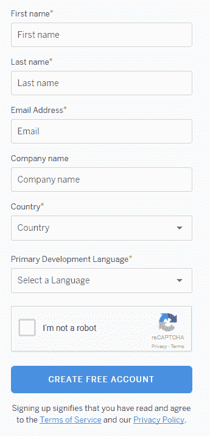

要登录，URL 为[这个页面](https://id.heroku.com/login)：


成功登录后，您将看到一个仪表板，其中包含应用程序列表（如果有）：

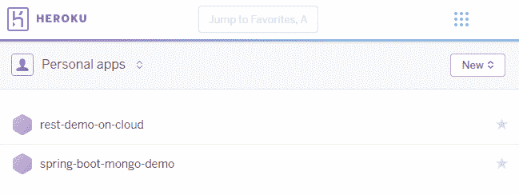

# 从 UI 创建新应用程序

单击新建|创建新应用程序，填写详细信息，然后单击创建应用程序：

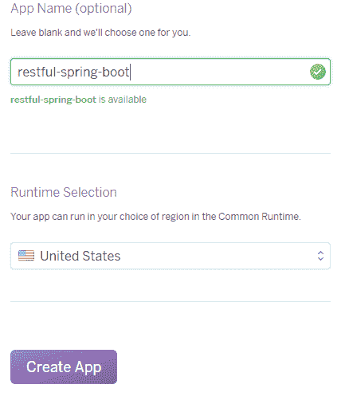

# 从 CLI 创建新应用程序

执行以下步骤从 CLI 创建新应用程序：

1.  [安装 Heroku CLI](https://cli.heroku.com)。
2.  安装后，Heroku 应位于系统的`PATH`变量中。
3.  打开命令提示符并运行`heroku create`。您将看到类似于以下内容的输出：

```java
 Creating app... done, glacial-beyond-27911
 https://glacial-beyond-27911.herokuapp.com/ |
 https://git.heroku.com/glacial-beyond-27911.git
```

4.  动态生成应用程序名称并创建远程 Git 存储库。通过运行以下命令，可以指定应用程序名称和区域（通过 UI 完成）：

```java
 $ heroku create test-app-9812 --region us
 Creating test-app-9812... done, region is us
 https://test-app-9812.herokuapp.com/ |
      https://git.heroku.com/test-app-9812.git
```

到 Heroku 的部署通过`git push`到 Heroku 上创建的远程 Git 存储库完成。我们将在下一节中看到这一点。

我们在`Chapter09/5_boot_on_heroku`有应用程序的源代码。因此，复制此应用程序并继续在 Heroku 上部署。

在 Heroku 的 cli 中运行任何命令之前，必须登录 Heroku 帐户。您可以通过运行`heroku login`命令登录。

# 怎么做。。。

1.  运行以下命令以创建 Heroku 应用程序：

```java
 $ heroku create <app_name> -region us
```

2.  初始化项目文件夹中的 Git 存储库：

```java
 $ git init
```

3.  将 Heroku Git 存储库作为远程存储库添加到本地 Git 存储库：

```java
 $ heroku git:remote -a <app_name_you_chose>
```

4.  将源代码（即主分支）推送到 Heroku Git 存储库：

```java
 $ git add .
 $ git commit -m "deploying to heroku"
 $ git push heroku master
```

5.  当代码被推送到 Heroku Git 存储库时，它会触发一个构建。在我们使用 Maven 时，它运行以下命令：

```java
 ./mvnw -DskipTests clean dependency:list install
```

6.  一旦代码完成构建和部署，您就可以使用`heroku open`命令打开应用程序。这将在浏览器中打开应用程序。
7.  您可以使用`heroku logs --tail`命令监视应用程序的日志。

应用程序成功部署后，运行`heroku open`命令后，您应该会看到浏览器加载的 URL：

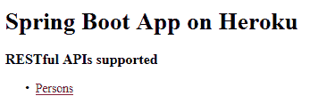

单击人员链接将显示以下信息：

```java
[
  {
    "id":1,
    "firstName":"Mohamed",
    "lastName":"Sanaulla",
    "place":"Bangalore"
  },
  {
    "id":2,
    "firstName":"Nick",
    "lastName":"Samoylov",
    "place":"USA"
  }
]
```

有趣的是，我们的应用程序运行在 Heroku 上，它连接到 DigitalOcean 服务器上的 MySQL 数据库。我们甚至可以在 Heroku 应用程序中提供一个数据库，并连接到该数据库。在*中查看如何执行此操作还有更多。。。*节。

# 还有更多。。。

1.  向应用程序添加新的 DB 附加组件：

```java
 $ heroku addons:create jawsdb:kitefin
```

这里，`addons:create`取加载项名称和服务计划名称，两者用冒号（`:`分隔）。您可以在[这里](https://elements.heroku.com/addons/jawsdb-maria)了解更多关于附加组件的详细信息和计划。此外，用于将附加组件添加到应用程序的 Heroku CLI 命令在所有附加组件的附加组件详细信息页面末尾给出。

2.  打开 DB 仪表板以查看连接详细信息，如 URL、用户名、密码和数据库名称：

```java
 $ heroku addons:open jawsdb
```

`jawsdb`仪表板看起来与以下类似：

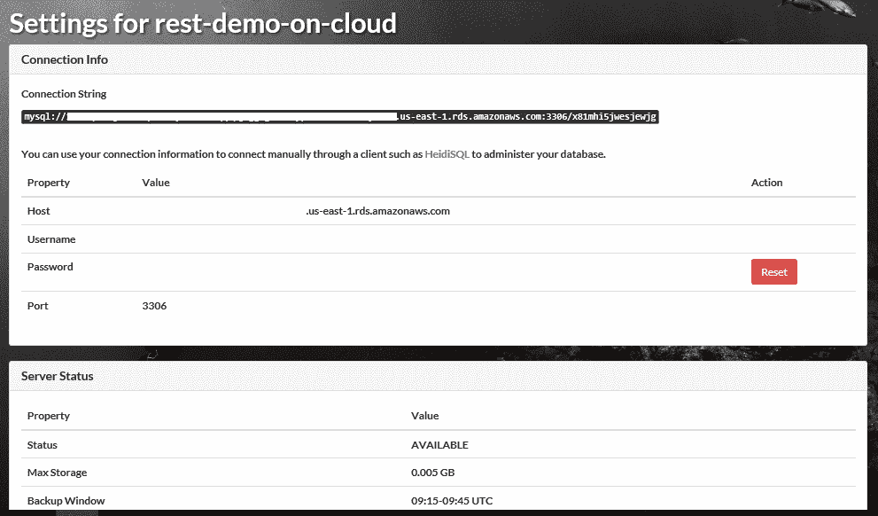

3.  您甚至可以从`JAWSDB_URL`配置属性中获取 MySQL 连接字符串。您可以使用以下命令列出应用程序的配置：

```java
 $ heroku config
 === rest-demo-on-cloud Config Vars
 JAWSDB_URL: <URL>
```

4.  复制连接详细信息，在 MySQL Workbench 中创建新连接，然后连接到此连接。数据库名称也由加载项创建。连接到数据库后运行以下 SQL 语句：

```java
        use x81mhi5jwesjewjg;
        create table person( 
          id int not null auto_increment, 
          first_name varchar(255), 
          last_name varchar(255), 
          place varchar(255), 
          primary key(id)
        );

        INSERT INTO person(first_name, last_name, place) 
        VALUES('Heroku First', 'Heroku Last', 'USA');

        INSERT INTO person(first_name, last_name, place) 
        VALUES('Jaws First', 'Jaws Last', 'UK');
```

5.  在`src/main/resources`处为 Heroku 配置文件`application-heroku.properties`创建一个新的属性文件，该文件具有以下属性：

```java
        spring.datasource.url=jdbc:mysql://
        <URL DB>:3306/x81mhi5jwesjewjg?useSSL=false
        spring.datasource.username=zzu08pc38j33h89q
        spring.datasource.password=<DB password>

```

您可以在附加仪表板中找到与连接相关的详细信息。

6.  更新`src/main/resources/application.properties`文件，将`spring.profiles.active`属性的值替换为`heroku`。

7.  提交更改并将其推送到 Heroku remote：

```java
 $ git commit -am"using heroky mysql addon"
 $ git push heroku master
```

8.  部署成功后，运行`heroku open`命令。在浏览器中加载页面后，单击 Persons 链接。这一次，您将看到一组不同的数据，即我们在 Heroku 插件中输入的数据：

```java
        [
          {
            "id":1,
            "firstName":"Heroku First",
            "lastName":"Heroku Last",
            "place":"USA"
          },
          {
            "id":2,
            "firstName":"Jaws First",
            "lastName":"Jaws Last",
            "place":"UK"
          }
        ]
```

通过这一点，我们与我们在 Heroku 中创建的数据库进行了集成。

# 使用 Docker 容器化 RESTful web 服务

从跨服务器安装应用程序到虚拟化每个服务器，再到在这些较小的虚拟机上安装应用程序，我们已经取得了很大进步。应用程序的可伸缩性问题通过添加更多虚拟机得到解决，应用程序运行到负载平衡器。

在虚拟化中，通过在多个虚拟机之间分配计算能力、内存和存储，将大型服务器划分为多个虚拟机。通过这种方式，每个虚拟机本身都能够实现服务器的所有功能，尽管规模较小。通过这种虚拟化，我们可以明智地利用服务器的计算、内存和存储资源。

但是，虚拟化需要一些设置，也就是说，您需要创建虚拟机，安装所需的依赖项，然后运行应用程序。此外，您可能无法 100%确定应用程序是否会成功运行。失败的原因可能是由于操作系统版本不兼容，甚至可能是由于在设置时遗漏了某些配置或缺少某些依赖项。这种设置还会导致横向扩展方面的一些困难，因为在调配虚拟机然后部署应用程序时会花费一些时间。

使用 Puppet 和 Chef 等工具确实有助于进行资源调配，但设置应用程序通常会导致由于配置缺失或不正确而导致的问题。这导致了另一个概念的引入，称为集装箱化。

在虚拟化世界中，我们有主机操作系统，然后是虚拟化软件，即虚拟机监控程序。然后我们创建了多台机器，每台机器都有自己的操作系统，应用程序都部署在这些操作系统上。然而，在容器化中，我们不划分服务器的资源。取而代之的是服务器及其主机操作系统，在上面是一个容器化层，它是一个软件抽象层。我们将应用程序打包为容器，容器中只包含运行应用程序所需的足够操作系统功能、应用程序的软件依赖项，然后是应用程序本身。下图取自[这里](https://docs.docker.com/get-started/#containers-vs-virtual-machines)，最能说明这一点：

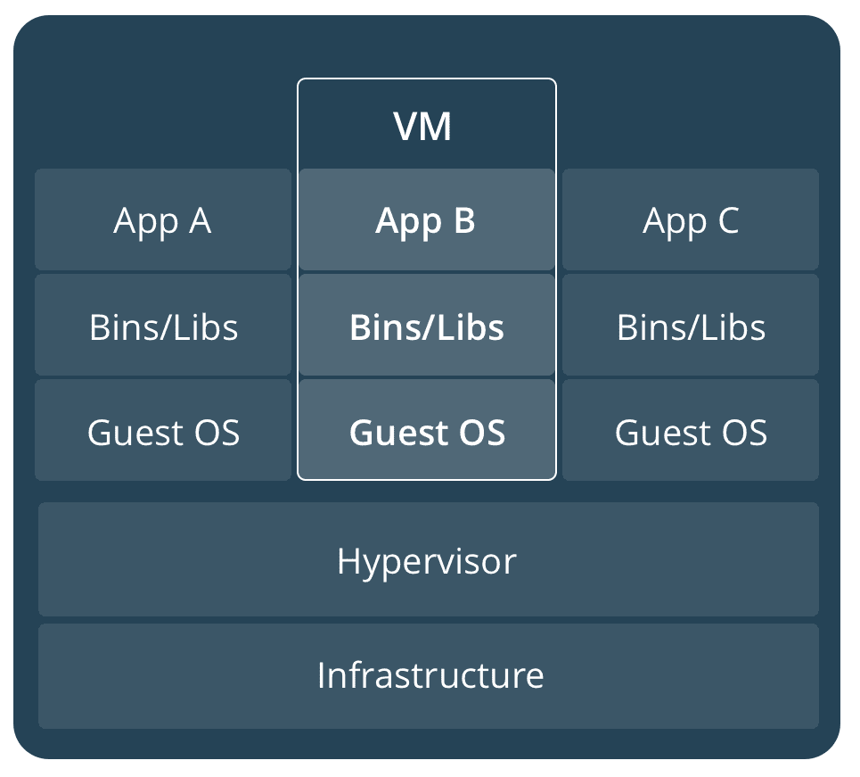

上图展示了虚拟化系统的典型体系结构。下图说明了集装箱化系统的典型体系结构：

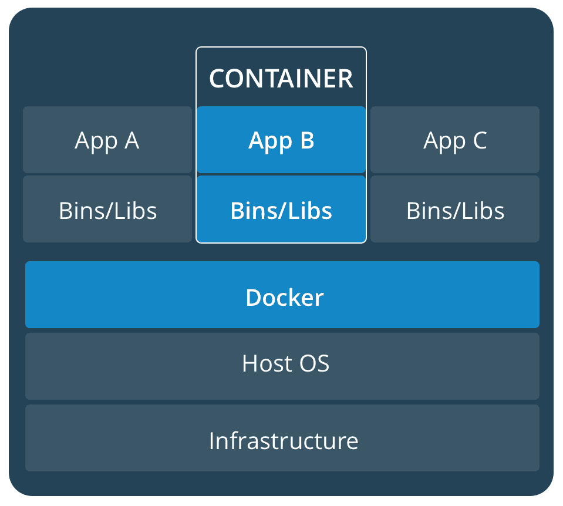

容器化的最大优点是将应用程序的所有依赖项捆绑到一个容器映像中。然后在集装箱化平台上运行此映像，从而创建集装箱。我们可以在服务器上同时运行多个容器。如果需要添加更多实例，我们可以只部署映像，并且此部署可以自动化，以方便地支持高可伸缩性。

Docker 是流行的软件集装箱化平台之一。在此配方中，我们将把在`Chapter09/6_boot_with_docker`位置找到的示例应用程序打包成 Docker 映像，并运行 Docker 映像来启动我们的应用程序。

# 准备

对于这个配方，我们将使用运行 Ubuntu 16.04.2 x64 的 Linux 服务器：

1.  从[下载最新的`.deb`文件 https://download.docker.com/linux/ubuntu/dists/xenial/pool/stable/amd64/](https://download.docker.com/linux/ubuntu/dists/xenial/pool/stable/amd64/)。对于其他 Linux 发行版，您可以在[找到软件包 https://download.docker.com/linux/](https://download.docker.com/linux/)：

```java
$ wget https://download.docker.com/linux/ubuntu/dists/xenial
 /pool/stable/amd64/docker-ce_17.03.2~ce-0~ubuntu-xenial_amd64.deb
```

2.  使用`dpkg`软件包管理器安装 Docker 软件包：

```java
 $  sudo dpkg -i docker-ce_17.03.2~ce-0~ubuntu-xenial_amd64.deb
```

软件包的名称因您下载的版本而异。

3.  成功安装后，Docker 服务开始运行。您可以使用`service`命令进行验证：

```java
 $ service docker status
 docker.service - Docker Application Container Engine
 Loaded: loaded (/lib/systemd/system/docker.service; enabled;
        vendor preset: enabled)
 Active: active (running) since Fri 2017-07-28 13:46:50 UTC;
              2min 3s ago
 Docs: https://docs.docker.com
 Main PID: 22427 (dockerd)
```

要停靠的应用程序可在`Chapter09/6_boot_with_docker`上找到，在本书下载的源代码中。

# 怎么做。。。

1.  使用以下内容在应用程序的根目录下创建`Dockerfile`：

```java
 FROM ubuntu:17.10
      FROM openjdk:9-b177-jdk
 VOLUME /tmp
 ADD target/boot_docker-1.0.jar restapp.jar
 ENV JAVA_OPTS="-Dspring.profiles.active=cloud"
      ENTRYPOINT [ "sh", "-c", "java $JAVA_OPTS -jar /restapp.jar" ]
```

2.  运行以下命令，使用前面步骤中创建的`Dockerfile`构建 Docker 映像：

```java
 $ docker build --tag restapp-image .

 Sending build context to Docker daemon 18.45 MB
 Step 1/6 : FROM ubuntu:17.10
 ---> c8cdcb3740f8
 Step 2/6 : FROM openjdk:9-b177-jdk
 ---> 38d822ff5025
 Step 3/6 : VOLUME /tmp
 ---> Using cache
 ---> 38367613d375
 Step 4/6 : ADD target/boot_docker-1.0.jar restapp.jar
 ---> Using cache
 ---> 54ad359f53f7
 Step 5/6 : ENV JAVA_OPTS "-Dspring.profiles.active=cloud"
 ---> Using cache
 ---> dfa324259fb1
 Step 6/6 : ENTRYPOINT sh -c java $JAVA_OPTS -jar /restapp.jar
 ---> Using cache
 ---> 6af62bd40afe
 Successfully built 6af62bd40afe
```

3.  您可以使用以下命令查看已安装的映像：

```java
 $ docker images

      REPOSITORY     TAG        IMAGE ID     CREATED     SIZE
 restapp-image  latest     6af62bd40afe 4 hours ago 606 MB
 openjdk        9-b177-jdk 38d822ff5025 6 days ago  588 MB
 ubuntu         17.10      c8cdcb3740f8 8 days ago  93.9 MB
```

您将看到还有 OpenJDK 和 Ubuntu 图像。下载这些图片是为了为我们的应用程序构建图像，这是第一个列出的。

4.  运行映像以创建包含正在运行的应用程序的容器：

```java
 docker run -p 8090:8080 -d --name restapp restapp-image
 d521b9927cec105d8b69995ef6d917121931c1d1f0b1f4398594bd1f1fcbee55
```

`run`命令后打印的大字符串是容器的标识符。您可以使用最初的几个字符来唯一标识容器。或者，您可以使用容器名称`restapp`。

5.  应用程序将已启动。可以通过运行以下命令查看日志：

```java
 docker logs restapp
```

6.  您可以使用以下命令查看创建的 Docker 容器：

```java
 docker ps
```

前面命令的输出类似于以下内容：

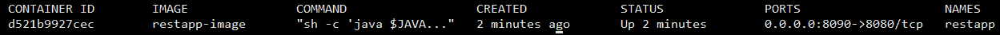

7.  您可以使用以下命令管理容器：

```java
 $ docker stop restapp
 $ docker start restapp
```

应用程序运行后，打开`http://<hostname>:8090/api/persons`。

# 它是如何工作的。。。

您可以通过定义`Dockerfile`来定义容器结构及其内容。`Dockerfile`遵循一种结构，其中每一行都是`INSTRUCTION arguments`形式。有一组预定义的指令，即`FROM`、`RUN`、`CMD`、`LABEL`、`ENV`、`ADD`和`COPY`。完整列表可在[中找到 https://docs.docker.com/engine/reference/builder/#from](https://docs.docker.com/engine/reference/builder/#from)。让我们看看我们定义的`Dockerfile`：

```java
FROM ubuntu:17.10
FROM openjdk:9-b177-jdk
VOLUME /tmp
ADD target/boot_docker-1.0.jar restapp.jar
ENV JAVA_OPTS="-Dspring.profiles.active=cloud"
ENTRYPOINT [ "sh", "-c", "java $JAVA_OPTS -jar /restapp.jar" ]
```

前两行使用`FROM`指令为 Docker 映像指定了基础映像。我们使用 Ubuntu 操作系统映像作为基础映像，然后将其与 OpenJDK 9 映像相结合。`VOLUME`指令用于指定映像的装入点。这通常是主机操作系统中的一条路径。

`ADD`指令用于将文件从源目录复制到工作目录下的目标目录。`ENV`指令用于定义环境变量。

`ENTRYPOINT`指令用于将容器配置为作为可执行文件运行。对于该指令，我们传递一个参数数组，否则我们将直接从命令行执行该数组。在我们的场景中，我们使用 bashshell 来运行`java -$JAVA_OPTS -jar <jar name>`。

定义了`Dockerfile`后，我们指示 Docker 工具使用`Dockerfile`构建图像。我们还使用`--tag`选项为图像提供名称。在构建我们的应用程序映像时，它将下载所需的基本映像，在我们的例子中，这些基本映像是 Ubuntu 和 OpenJDK 映像。因此，如果您列出 Docker 图像，您将看到基本图像以及我们的应用程序图像。

此 Docker 映像是一个可重用的实体。如果我们需要更多的应用程序实例，我们可以使用`docker run`命令生成一个新的容器。当我们运行 Docker 映像时，我们有多个选项，其中一个是`-p`选项，它将容器内的端口映射到主机操作系统。在我们的例子中，我们将 Spring Boot 应用程序的`8080`端口映射到主机操作系统的`8090`。

现在，要检查我们正在运行的应用程序的状态，我们可以使用`docker logs restapp`检查日志。除此之外，`docker`工具还支持多个命令。强烈建议运行`docker help`并探索支持的命令。

Docker 是 Docker 集装箱化平台背后的公司，它创建了一组基本图像，可用于创建集装箱。有 MySQL DB、Couchbase、Ubuntu 和其他操作系统的映像。您可以在[浏览软件包 https://store.docker.com/](https://store.docker.com/)。

# 使用千分尺和Prometheus监控 Spring Boot 2 应用程序

监视和收集性能指标是应用程序开发和维护的一个重要部分。人们可能会对内存使用、各种端点的响应时间、CPU 使用、机器负载、垃圾收集频率和暂停等指标感兴趣。有不同的方法来启用捕获度量，例如使用 [Dropwizard 度量](https://metrics.dropwizard.io/4.0.0/) 或 Spring Boot 的度量框架。

使用一个名为测微计的库（[对Spring靴 2 中的代码进行检测 https://micrometer.io/](https://micrometer.io/) ）。测微计提供了一个供应商中立的代码工具，以便您可以使用任何监控工具，并让测微计以该工具可以理解的格式提供度量数据。这类似于用于日志记录的 SLF4J。它是度量端点上的一个门面，以供应商中立的方式生成输出。

测微计支持 [Prometheus](https://prometheus.io/)、[Netflix Atlas](https://github.com/Netflix/atlas)、[DataDogHQ](https://www.datadoghq.com/) 和即将推出的[对 XDB 的支持](https://www.influxdata.com/)、[statsd](https://github.com/etsy/statsd)、[Graphite](https://graphiteapp.org/)。使用早期版本的 Spring Boot（如 1.5）的应用程序也可以使用这个新的检测库，如*中所示，还有更多。。。*节。

在这个配方中，我们将使用测微计来检测我们的代码，并将度量值发送给Prometheus。因此，首先，我们将在*准备*部分设置Prometheus。

# 准备

[Prometheus](https://prometheus.io/) 是一个监控系统和时间序列数据库，允许我们存储时间序列数据，其中包括随时间变化的应用程序指标、可视化指标的简单方法，或根据不同指标设置警报。

让我们执行以下步骤，让Prometheus在我们的机器上运行（在我们的例子中，我们将在 Windows 上运行。类似的步骤也适用于 Linux）：

1.  从[这里](https://github.com/prometheus/prometheus/releases/download/v2.3.2/prometheus-2.3.2.windows-amd64.tar.gz)下载Prometheus发行版。
2.  使用 [7-Zip](https://www.7-zip.org/) 解压到我们称之为`PROMETHEUS_HOME`的位置。
3.  将`%PROMETHEUS_HOME%`添加到您的路径变量中（在 Linux 上，将`$PROMETHEUS_HOME`添加到路径变量中）。
4.  使用`prometheus --config "%PROMETHEUS_HOME%/prometheus.yml"`命令运行Prometheus。您将看到以下输出：

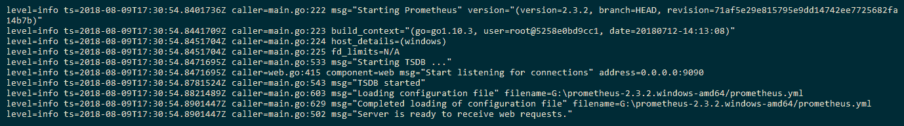

5.  在浏览器中打开`http://localhost:9090`以查看Prometheus控制台。在空文本框中输入`go_gc_duration_seconds`并单击执行按钮以显示捕获的度量。您可以将选项卡切换到图形版本以可视化数据：

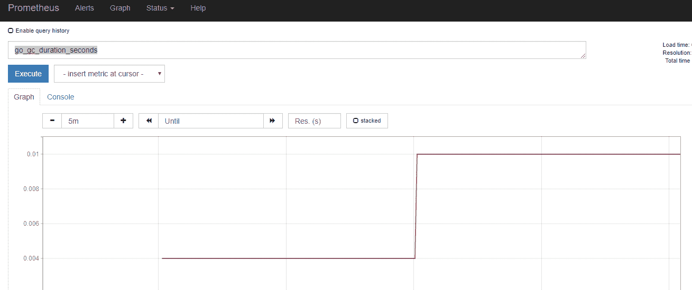

前面的指标是针对Prometheus本身的。您可以导航到`http://localhost:9090/targets`找到 Promethues 监控的目标，如下所示：

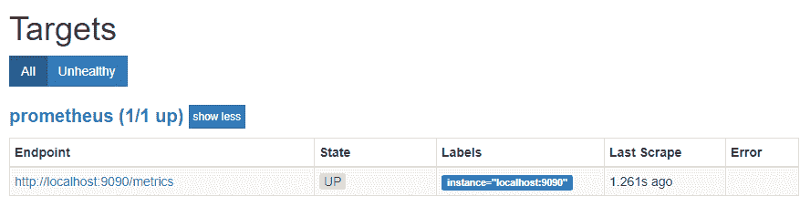

当您在浏览器中打开`http://localhost:9090/metrics`时，您将看到当前时刻的度量值。没有形象化很难理解。随着时间的推移收集这些指标并使用图形进行可视化时，这些指标很有用。

现在，Prometheus已经上路了。让我们以Prometheus理解的格式发布测微计和度量。为此，我们将在本章中重用*与数据库*交互过程中使用的代码。此配方可在`Chapter09/2_boot_db_demo`上获得。因此，我们只需将相同的代码复制到`Chapter09/7_boot_micrometer`中，然后增强部件以添加对测微计和Prometheus的支持，如下一节所示。

# 怎么做。。。

1.  更新`pom.xml`以包含Spring靴致动器和测微计Prometheus注册表依赖项：

```java
<dependency>
  <groupId>org.springframework.boot</groupId>
  <artifactId>spring-boot-starter-actuator</artifactId>
</dependency>
<dependency>
  <groupId>io.micrometer</groupId>
  <artifactId>micrometer-registry-prometheus</artifactId>
  <version>1.0.6</version>
</dependency>
```

在 Spring Boot 2 之后的版本中，测微计配置了执行器，所以我们只需要添加执行器作为依赖项，然后`micrometer-registry-prometheus`依赖项生成Prometheus理解的度量表示。

2.  当我们运行应用程序（其中一种方式是运行`mvn spring-boot:run`并打开执行器端点时，默认为`<root_url>/actuator`。我们会发现默认情况下很少有可用的执行器端点，但 Prometheus metrics 端点不是其中的一部分：

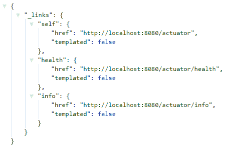

3.  要在执行器中启用 Prometheus 端点，我们需要在`src/main/resources/application.properties`文件中添加以下属性：

```java
management.endpoints.web.exposure.include=prometheus
```

4.  重新启动应用程序并浏览至`http://localhost:8080/actuator/`。现在，您将看到只有Prometheus端点可用：

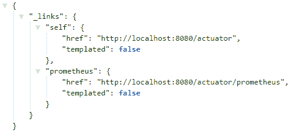

5.  打开`http://localhost:8080/actuator/prometheus`以Prometheus理解的格式查看指标：

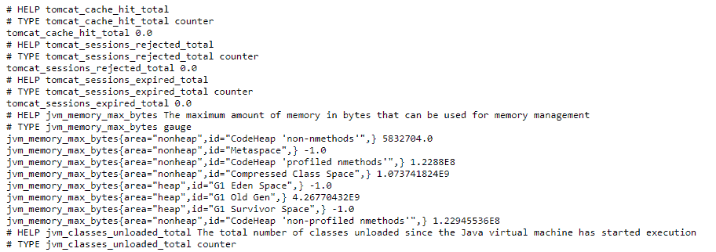

6.  配置Prometheus以特定频率呼叫`http://localhost:8080/actuator/prometheus`，可进行配置。这可以通过使用`scrape_configs`属性下的新作业更新`%PROMETHEUS_HOME%/prometheus.yml`配置文件来完成：

```java
- job_name: 'spring_apps'
    metrics_path: '/actuator/prometheus'
    static_configs:
      - targets: ['localhost:8080']
```

您将看到，在默认情况下，有一项工作是废弃Prometheus度量本身。

7.  重新启动 Prometheus 服务器并访问`http://localhost:9090/targets`。您将看到一个新的部分，`spring_apps`，其中我们添加了以下目标：

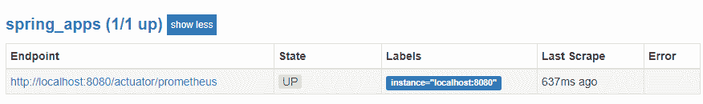

8.  我们可以通过访问`http://localhost:9090/graph`，在文本框中键入`jvm_memory_max_bytes`，然后单击执行，从捕获的度量中绘制一个度量：

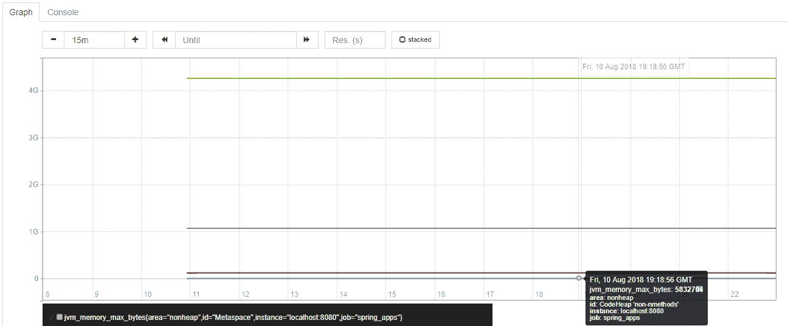

因此，我们最终在Prometheus建立了度量的吸收，并根据度量值在Prometheus上创建了图表。

# 它是如何工作的。。。

Spring Boot 提供了一个名为 actuator 的库，它具有一些功能，可以帮助您在部署到生产环境时监视和管理应用程序。这种开箱即用的功能不需要开发人员进行任何设置。因此，您无需任何工作即可获得审计、健康检查和指标收集。

如前所述，执行机构使用测微计测量和捕获代码中的不同指标，例如：

*   JVM 内存使用
*   连接池信息
*   应用程序中不同 HTTP 端点的响应时间
*   不同 HTTP 端点的调用频率

要使您的应用程序具有这些生产就绪功能，如果您使用的是 Maven（Gradle 有一个等效项），则需要在`pom.xml`中添加以下依赖项：

```java
<dependency>
    <groupId>org.springframework.boot</groupId>
    <artifactId>spring-boot-starter-actuator</artifactId>
</dependency>
```

默认情况下，致动器在`/actuator`端点可用，但可以通过使用不同的值覆盖`src/main/resources/application.properties`文件中的`management.endpoints.web.base-path`属性来配置，如下所示：

```java
management.endpoints.web.base-path=/metrics
```

除`/shutdown`端点外，所有可用于监控和审核应用程序的端点在默认情况下都处于启用状态，而`/shutdown`端点在默认情况下处于禁用状态。此端点用于关闭应用程序。以下是一些可用的端点：

| | |
| --- | --- |
| `auditevents` | 公开当前应用程序的审核事件信息 |
| `beans` | 显示应用程序中所有 SpringBean 的完整列表 |
| `env` | 暴露 Spring 的`ConfigurableEnvironment`中的属性 |
| `health` | 显示应用程序运行状况信息 |
| `info` | 显示任意应用程序信息 |
| `metrics` | 显示当前应用程序的度量信息 |
| `mappings` | 显示所有`@RequestMapping`路径的整理列表 |
| `prometheus` | 以可由 Prometheus 服务器刮取的格式公开度量 |

您可以看到，这些端点非常敏感，需要加以保护。好的方面是，Spring 引导执行器与 Spring Security 很好地集成，以保护这些端点。因此，如果 Spring 安全性位于类路径上，则默认情况下会保护这些端点。

这些端点可以通过 JMX 或 web 访问。默认情况下，并不是所有的执行器端点都允许 web 访问，而是默认情况下，它们允许使用 JMX 访问。默认情况下，仅允许从 web 访问以下属性：

*   `health`
*   `info`

这就是我们必须添加以下配置属性以使 Prometheus 端点以及健康状况、信息和指标在 web 上可用的原因：

```java
management.endpoints.web.exposure.include=prometheus,health,info,metrics
```

即使我们启用了Prometheus，我们也需要在类路径上拥有`micrometer-registry-prometheus`库。只有这样，我们才能查看Prometheus格式的度量。因此，我们在 pom 中添加了以下依赖项：

```java
<dependency>
  <groupId>io.micrometer</groupId>
  <artifactId>micrometer-registry-prometheus</artifactId>
  <version>1.0.6</version>
</dependency>
```

Prometheus处理的输出格式很简单：它接受`<property_name value>`，每个属性在一个新行中。Spring启动执行器不会将指标推送到Prometheus；相反，我们将 Prometheus 配置为以其配置中定义的频率从给定 URL 提取度量。Prometheus的默认配置（位于其主目录中）如下所示：

```java
# my global config
global:
  scrape_interval: 15s # Set the scrape interval to every 15 seconds. Default is every 1 minute.
  evaluation_interval: 15s # Evaluate rules every 15 seconds. The default is every 1 minute.
  # scrape_timeout is set to the global default (10s).

# Alertmanager configuration
alerting:
  alertmanagers:
  - static_configs:
    - targets:
      # - alertmanager:9093

# Load rules once and periodically evaluate them according to the global 'evaluation_interval'.
rule_files:
  # - "first_rules.yml"
  # - "second_rules.yml"

# A scrape configuration containing exactly one endpoint to scrape:
# Here it's Prometheus itself.
scrape_configs:
  # The job name is added as a label `job=<job_name>` to any timeseries scraped from this config.
  - job_name: 'prometheus'

    # metrics_path defaults to '/metrics'
    # scheme defaults to 'http'.

    static_configs:
    - targets: ['localhost:9090']
```

因此，它配置了Prometheus获取度量的时间间隔的默认值，以及它评估`rule_files`中定义的规则的时间间隔的默认值。刮取是从`scrape_configs`选项下定义的不同目标中提取度量的活动，评估是评估`rule_files`中定义的不同规则的行为。为了使Prometheus能够从我们的 Spring Boot 应用程序中删除度量值，我们通过提供作业名称、相对于应用程序 URL 的度量值路径以及应用程序的 URL，在`scrape_configs`下添加了一个新作业：

```java
- job_name: 'spring_apps'
    metrics_path: '/actuator/prometheus'
    static_configs:
      - targets: ['localhost:8080']
```

我们还了解了如何从`http://localhost:9090/graph`查看这些指标的值，以及如何使用Prometheus提供的简单图形支持可视化这些指标。

# 还有更多

通过配置另一个名为 [Alertmanager](https://prometheus.io/docs/alerting/alertmanager/) 的服务，可以在Prometheus中启用警报。此服务可用于向电子邮件、寻呼机等发送警报。

Prometheus对图形的支持是幼稚的。您可以使用 [Grafana](https://grafana.com/)，该软件是分析时间序列数据的领先开源软件之一，例如储存在Prometheus的软件。通过这种方式，您可以配置 Grafana 从Prometheus读取时间序列数据，并使用绘制在不同类型图表上的预定义指标构建仪表板。