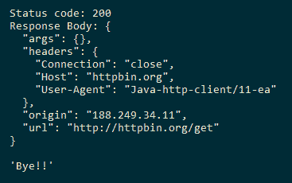
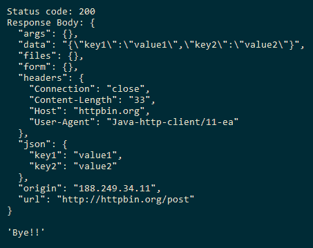
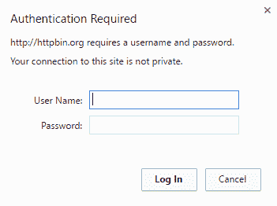
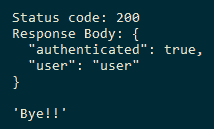
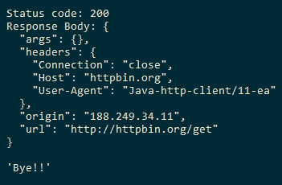
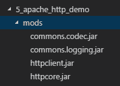
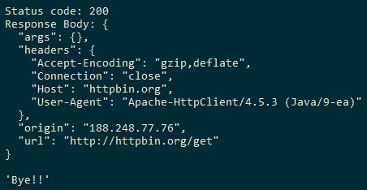

# 网络

在本章中，我们将介绍以下配方：

*   发出HTTP GET请求
*   发出HTTP POST请求
*   对受保护的资源发出HTTP请求
*   发出异步HTTP请求
*   使用ApacheHttpClient发出HTTP请求
*   使用Unirest HTTP客户端库发出HTTP请求

# 介绍

Java对与HTTP特定特性交互的支持非常原始。`HttpURLConnection`类自JDK1.1开始提供，它提供了用于与具有HTTP特定功能的URL交互的API。因为这个API在HTTP/1.1之前就已经存在，所以它缺乏高级特性，使用起来很麻烦。这就是为什么开发人员大多求助于使用第三方库，如**ApacheHttpClient**、SpringFramework和HTTPAPI。

在JDK 9中，在JEP 110（[下）中引入了一个新的HTTP客户端APIhttp://openjdk.java.net/jeps/110](http://openjdk.java.net/jeps/110) 作为孵化器模块[(http://openjdk.java.net/jeps/11](http://openjdk.java.net/jeps/11) ）。同一孵化器模块已在JEP 321（[下以`java.net.http`的名称提升为标准模块http://openjdk.java.net/jeps/321](http://openjdk.java.net/jeps/321) ），这是最新JDK 11版本的一部分。

关于孵化器模块的一个注意事项：孵化器模块包含非最终API，这些API非常大，并且不够成熟，无法包含在JavaSE中。这是API的一种beta版本，因此开发人员可以更早地使用API。但问题是，在较新版本的JDK中，这些API不支持向后兼容。这意味着依赖于孵化器模块的代码可能会与较新版本的JDK冲突。这可能是由于孵化器模块被升级为Java SE或从孵化器模块中无声地删除。

在本章中，我们将介绍如何在JDK 11中使用HTTP客户机API的一些方法，然后介绍使用Apache HttpClient（[的一些其他APIhttp://hc.apache.org/httpcomponents-client-ga/](http://hc.apache.org/httpcomponents-client-ga/) API和Unirest Java HTTP库（[http://unirest.io/java.html](http://unirest.io/java.html) ）。

# 发出HTTP GET请求

在本配方中，我们将研究如何使用JDK 11 HTTP客户端API向[发出`GET`请求http://httpbin.org/get](http://httpbin.org/get) 。

# 怎么做。。。

1.  使用`java.net.http.HttpClient`的生成器`java.net.http.HttpClient.Builder`创建`java.net.http.HttpClient`的实例：

```
        HttpClient client = HttpClient.newBuilder().build();
```

2.  使用`java.net.http.HttpRequest`的生成器`java.net.http.HttpRequest.Builder`创建`java.net.http.HttpRequest`的实例。请求的URL应作为`java.net.URI`的实例提供：

```
        HttpRequest request = HttpRequest
                    .newBuilder(new URI("http://httpbin.org/get"))
                    .GET()
                    .version(HttpClient.Version.HTTP_1_1)
                    .build();
```

3.  使用`java.net.http.HttpClient`的`send`API发送HTTP请求。此API以`java.net.http.HttpRequest`为例，以`java.net.http.HttpResponse.BodyHandler`为实现：

```
        HttpResponse<String> response = client.send(request,
                             HttpResponse.BodyHandlers.ofString());
```

4.  打印`java.net.http.HttpResponse`状态码和响应体：

```
        System.out.println("Status code: " + response.statusCode());
        System.out.println("Response Body: " + response.body());
```

完整的代码可在`Chapter10/1_making_http_get`中找到。您可以使用运行脚本`run.bat`或`run.sh`来编译和运行代码：



# 它是如何工作的。。。

对URL进行HTTP调用有两个主要步骤：

*   创建HTTP客户端以启动调用
*   设置目标URL、所需的HTTP头和HTTP方法类型，即`GET`、`POST`或`PUT`

Java HTTP客户端API提供了一个构建器类`java.net.http.HttpClient.Builder`，可以同时构建`java.net.http.HttpClient`实例，利用构建器API设置`java.net.http.HttpClient`。下面的代码片段显示了如何使用默认配置获取`java.net.http.HttpClient`的实例：

```
HttpClient client = HttpClient.newHttpClient();
```

以下代码段使用生成器配置并创建`java.net.http.HttpClient`的实例：

```
HttpClient client = HttpClient
                    .newBuilder()
                    //redirect policy for the client. Default is NEVER
                    .followRedirects(HttpClient.Redirect.ALWAYS) 
                    //HTTP client version. Defabult is HTTP_2
                    .version(HttpClient.Version.HTTP_1_1)
                    //few more APIs for more configuration
                    .build();
```

构建器中有更多的API，例如用于设置身份验证、代理和提供SSL上下文，我们将在不同的食谱中介绍这些API。

设置目标URL无非是创建一个`java.net.http.HttpRequest`实例，使用其生成器和API对其进行配置。下面的代码片段显示了如何创建`java.net.http.HttpRequest`的实例：

```
HttpRequest request = HttpRequest
                .newBuilder()
                .uri(new URI("http://httpbin.org/get")
                .headers("Header 1", "Value 1", "Header 2", "Value 2")
                .timeout(Duration.ofMinutes(5))
                .version(HttpClient.Version.HTTP_1_1)
                .GET()
                .build();
```

`java.net.http.HttpClient`对象提供两个API来进行HTTP调用：

*   您可以使用`HttpClient#send()`方式同步发送
*   您可以使用`HttpClient#sendAsync()`方法异步发送

`send()`方法接受两个参数：HTTP请求和HTTP响应的处理程序。响应的处理程序由`java.net.http.HttpResponse.BodyHandlers`接口的实现表示。有几个可用的实现，例如将响应体读取为`String`的`ofString()`和将响应体读取为字节数组的`ofByteArray()`。我们将使用`ofString()`方法，该方法以字符串形式返回响应`Body`：

```
HttpResponse<String> response = client.send(request,
                                HttpResponse.BodyHandlers.ofString());
```

`java.net.http.HttpResponse`的实例表示来自HTTP服务器的响应。它为以下内容提供API：

*   获取响应主体（`body()`）
*   HTTP头文件（`headers()`）
*   初始HTTP请求（`request()`）
*   响应状态代码（`statusCode()`）
*   用于请求的URL（`uri()`

传递给`send()`方法的`HttpResponse.BodyHandlers`实现有助于将HTTP响应转换为兼容格式，如`String`或`byte`数组。

# 发出HTTP POST请求

在这个配方中，我们将看到通过请求主体将一些数据发布到HTTP服务。我们将把数据发布到`http://httpbin.org/post`URL。

我们将跳过类的包前缀，因为它被假定为`java.net.http`。

# 怎么做。。。

1.  使用`HttpClient.Builder`生成器创建`HttpClient`实例：

```
        HttpClient client = HttpClient.newBuilder().build();
```

2.  创建要传递到请求正文中的所需数据：

```
        Map<String, String> requestBody = 
                    Map.of("key1", "value1", "key2", "value2");
```

3.  创建一个`HttpRequest`对象，请求方法为POST，请求主体数据为`String`。我们将使用Jackson的`ObjectMapper`将请求主体`Map<String, String>`转换为普通JSON`String`，然后使用`HttpRequest.BodyPublishers`处理`String`请求主体：

```
        ObjectMapper mapper = new ObjectMapper();
        HttpRequest request = HttpRequest
                   .newBuilder(new URI("http://httpbin.org/post"))
                   .POST(
          HttpRequest.BodyPublishers.ofString(
            mapper.writeValueAsString(requestBody)
          )
        )
        .version(HttpClient.Version.HTTP_1_1)
        .build();
```

4.  使用`send(HttpRequest, HttpRequest.BodyHandlers)`方法发送请求并获得响应：

```
        HttpResponse<String> response = client.send(request, 
                             HttpResponse.BodyHandlers.ofString());
```

5.  然后打印服务器发送的响应状态代码和响应正文：

```
        System.out.println("Status code: " + response.statusCode());
        System.out.println("Response Body: " + response.body());
```

完整的代码可在`Chapter10/2_making_http_post`中找到。确保`Chapter10/2_making_http_post/mods`中有以下杰克逊罐：

*   `jackson.databind.jar`
*   `jackson.core.jar`
*   `jackson.annotations.jar`

另外，注意模块定义`module-info.java`，可在`Chapter10/2_making_http_post/src/http.client.demo`中找到。

要了解Jackson JARs在该模块化代码中的使用方式，请参考[第3章](03.html)、*模块化编程*中的*自下而上迁移*和*自上而下迁移*配方。

提供运行脚本`run.bat`和`run.sh`，以方便代码的编译和执行：



# 对受保护的资源发出HTTP请求

在本配方中，我们将研究如何调用受用户凭据保护的HTTP资源。[http://httpbin.org/basic-auth/user/passwd](http://httpbin.org/basic-auth/user/passwd) 已经受到HTTP基本身份验证的保护。基本身份验证要求以纯文本形式提供用户名和密码，然后HTTP资源使用该用户名和密码来决定用户身份验证是否成功。

如果您打开[http://httpbin.org/basic-auth/user/passwd](http://httpbin.org/basic-auth/user/passwd) 在浏览器中，会提示您输入用户名和密码：



输入用户名为`user`和密码为`passwd`，您将被验证为显示JSON响应：

```
{
  "authenticated": true,
  "user": "user"
}
```

让我们使用`HttpClient`API实现同样的事情。

# 怎么做。。。

1.  我们需要扩展`java.net.Authenticator`并覆盖其`getPasswordAuthentication()`方法。此方法应返回一个`java.net.PasswordAuthentication`实例。让我们创建一个类`UsernamePasswordAuthenticator`，它扩展了`java.net.Authenticator`：

```
        public class UsernamePasswordAuthenticator 
          extends Authenticator{
        }
```

2.  我们将在`UsernamePasswordAuthenticator`类中创建两个实例变量来存储用户名和密码，并提供一个构造函数来初始化它：

```
        private String username;
        private String password;

        public UsernamePasswordAuthenticator(){}
        public UsernamePasswordAuthenticator ( String username, 
                                               String password){
          this.username = username;
          this.password = password;
        }
```

3.  然后我们将覆盖`getPasswordAuthentication()`方法，返回`java.net.PasswordAuthentication`的实例，并使用用户名和密码初始化：

```
        @Override
        protected PasswordAuthentication getPasswordAuthentication(){
          return new PasswordAuthentication(username, 
                                            password.toCharArray());
        }
```

4.  然后我们将创建一个`UsernamePasswordAuthenticator`的实例：

```
        String username = "user";
        String password = "passwd"; 
        UsernamePasswordAuthenticator authenticator = 
                new UsernamePasswordAuthenticator(username, password);
```

5.  我们在初始化`HttpClient`时提供`UsernamePasswordAuthenticator`的实例：

```
        HttpClient client = HttpClient.newBuilder()
                                      .authenticator(authenticator)
                                      .build();
```

6.  创建相应的`HttpRequest`对象来调用受保护的HTTP资源[http://httpbin.org/basic-auth/user/passwd](http://httpbin.org/basic-auth/user/passwd) ：

```
        HttpRequest request = HttpRequest.newBuilder(new URI(
          "http://httpbin.org/basic-auth/user/passwd"
        ))
        .GET()
        .version(HttpClient.Version.HTTP_1_1)
        .build();
```

7.  我们通过执行请求获得`HttpResponse`，并打印状态码和请求正文：

```
        HttpResponse<String> response = client.send(request,
        HttpResponse.BodyHandlers.ofString());

        System.out.println("Status code: " + response.statusCode());
        System.out.println("Response Body: " + response.body());
```

完整的代码可在`Chapter10/3_making_http_request_protected_res`中找到。您可以使用运行脚本`run.bat`或`run.sh`运行代码：



# 它是如何工作的。。。

网络调用使用`Authenticator`对象获取认证信息。开发人员通常扩展`java.net.Authenticator`类并重写其`getPasswordAuthentication()`方法。用户名和密码可从用户输入或配置中读取，并由扩展类用于创建`java.net.PasswordAuthentication`的实例。

在配方中，我们创建了`java.net.Authenticator`的扩展，如下所示：

```
public class UsernamePasswordAuthenticator 
  extends Authenticator{
    private String username;
    private String password;

    public UsernamePasswordAuthenticator(){}

    public UsernamePasswordAuthenticator ( String username, 
                                           String password){
        this.username = username;
        this.password = password;
    }

    @Override
    protected PasswordAuthentication getPasswordAuthentication(){
      return new PasswordAuthentication(username, 
                         password.toCharArray());
    }
}
```

然后将`UsernamePasswordAuthenticator`的实例提供给`HttpClient.Builder`API。`HttpClient` 实例在调用受保护的HTTP请求时使用此验证器获取用户名和密码。

# 发出异步HTTP请求

在本食谱中，我们将了解如何发出异步`GET`请求。在异步请求中，我们不等待响应；相反，只要客户端接收到响应，我们就处理它。在jQuery中，我们将发出一个异步请求并提供一个负责处理响应的回调，而在Java中，我们得到一个实例`java.util.concurrent.CompletableFuture`，然后调用`thenApply`方法来处理响应。让我们看看这一行动。

# 怎么做。。。

1.  使用`HttpClient`的生成器`HttpClient.Builder`创建`HttpClient`的实例：

```
        HttpClient client = HttpClient.newBuilder().build();
```

2.  使用`HttpRequest.Builder`生成器创建`HttpRequest`的实例，表示要使用的URL和相应的HTTP方法：

```
        HttpRequest request = HttpRequest
                        .newBuilder(new URI("http://httpbin.org/get"))
                        .GET()
                        .version(HttpClient.Version.HTTP_1_1)
                        .build();
```

3.  使用`sendAsync`方法发出异步HTTP请求，并保留对我们获得的`CompletableFuture<HttpResponse<String>>`对象的引用。我们将使用它来处理响应：

```
        CompletableFuture<HttpResponse<String>> responseFuture = 
                  client.sendAsync(request, 
                         HttpResponse.BodyHandlers.ofString());
```

4.  我们提供`CompletionStage`以在前一阶段完成后处理响应。为此，我们使用了采用lambda表达式的`thenAccept`方法：

```
        CompletableFuture<Void> processedFuture = 
                   responseFuture.thenAccept(response -> {
          System.out.println("Status code: " + response.statusCode());
          System.out.println("Response Body: " + response.body());
        });
```

5.  等待将来完成：

```
        CompletableFuture.allOf(processedFuture).join();
```

此配方的完整代码可在`Chapter10/4_async_http_request`中找到。我们提供了`run.bat`和`run.sh`脚本来编译和运行配方：



# 使用ApacheHttpClient发出HTTP请求

在这个配方中，我们将使用ApacheHttpClient（[https://hc.apache.org/httpcomponents-client-4.5.x/index.html](https://hc.apache.org/httpcomponents-client-4.5.x/index.html) ）库来进行一个简单的HTTP`GET`请求。当我们使用Java9时，我们希望使用模块路径而不是类路径。因此，我们需要模块化ApacheHttpClient库。实现这一点的一种方法是使用自动模块的概念。让我们看看如何设置配方的依赖项。

# 准备

`Chapter10/5_apache_http_demo/mods`中已经存在所有需要的罐子：



一旦这些JAR位于模块路径上，我们就可以在`module-info.java`中声明对这些JAR的依赖关系，该依赖关系出现在`Chapter10/5_apache_http_demo/src/http.client.demo`中，如下面的代码片段所示：

```
module http.client.demo{
  requires httpclient;
  requires httpcore;
  requires commons.logging;
  requires commons.codec;
}
```

# 怎么做。。。

1.  使用`org.apache.http.impl.client.HttpClients`工厂创建`org.http.client.HttpClient`的默认实例：

```
        CloseableHttpClient client = HttpClients.createDefault();
```

2.  创建一个`org.apache.http.client.methods.HttpGet`的实例以及所需的URL。这表示HTTP方法类型和请求的URL：

```
        HttpGet request = new HttpGet("http://httpbin.org/get");
```

3.  使用`HttpClient`实例执行HTTP请求，获取`CloseableHttpResponse`实例：

```
        CloseableHttpResponse response = client.execute(request);
```

执行HTTP请求后返回的`CloseableHttpResponse`实例可用于获取`HttpEntity`实现实例中嵌入的响应状态码等响应内容的详细信息。

4.  我们利用`EntityUtils.toString()`获取嵌入`HttpEntity`实现实例中的响应体，并打印状态码和响应体：

```
        int statusCode = response.getStatusLine().getStatusCode();
        String responseBody = 
                       EntityUtils.toString(response.getEntity());
        System.out.println("Status code: " + statusCode);
        System.out.println("Response Body: " + responseBody);
```

此配方的完整代码可在`Chapter10/5_apache_http_demo`中找到。我们提供了`run.bat`和`run.sh`来编译和执行配方代码：



# 还有更多。。。

我们可以在调用`HttpClient.execute`方法时提供一个自定义响应处理程序，如下所示：

```
String responseBody = client.execute(request, response -> {
  int status = response.getStatusLine().getStatusCode();
  HttpEntity entity = response.getEntity();
  return entity != null ? EntityUtils.toString(entity) : null;
});
```

在本例中，响应由响应处理程序处理并返回响应体字符串。完整的代码可在`Chapter10/5_1_apache_http_demo_response_handler`中找到。

# 使用Unirest HTTP客户端库发出HTTP请求

在这个配方中，我们将使用Unirest HTTP（[http://unirest.io/java.html](http://unirest.io/java.html) ）访问HTTP服务的Java库。UnirestJava是一个基于Apache的HTTP客户端库的库，它提供了一个用于发出HTTP请求的流畅API。

# 准备

由于Java库不是模块化的，我们将使用自动模块的概念，如[第3章](03.html)、*模块化编程*中所述。属于库的JAR被放置在应用程序的模块路径上，然后应用程序通过使用JAR的名称作为其模块名来声明对JAR的依赖关系。这样，JAR文件自动成为一个模块，因此称为自动模块。

Java库的Maven依赖项如下所示：

```
<dependency>
  <groupId>com.mashape.unirest</groupId>
  <artifactId>unirest-java</artifactId>
  <version>1.4.9</version>
</dependency>
```

由于我们的示例中没有使用Maven，因此我们已将JAR下载到`Chapter10/6_unirest_http_demo/mods`文件夹中。

模块定义如下：

```
module http.client.demo{
  requires httpasyncclient;
  requires httpclient;
  requires httpmime;
  requires json;
  requires unirest.java;
  requires httpcore;
  requires httpcore.nio;
  requires commons.logging;
  requires commons.codec;
}
```

# 怎么做。。。

Unirest为进行HTTP请求提供了一个非常流畅的API。我们可以提出如下`GET`请求：

```
HttpResponse<JsonNode> jsonResponse = 
  Unirest.get("http://httpbin.org/get")
         .asJson();
```

可从`jsonResponse`对象获取响应状态和响应体，如下所示：

```
int statusCode = jsonResponse.getStatus();
JsonNode jsonBody = jsonResponse.getBody();
```

我们可以发出`POST`请求并传递一些数据，如下所示：

```
jsonResponse = Unirest.post("http://httpbin.org/post")
                      .field("key1", "val1")
                      .field("key2", "val2")
                      .asJson();
```

我们可以调用受保护的HTTP资源，如下所示：

```
jsonResponse = Unirest.get("http://httpbin.org/basic-auth/user/passwd")
                      .basicAuth("user", "passwd")
                      .asJson();
```

此代码可在`Chapter10/6_unirest_http_demo`中找到。

我们提供了`run.bat`和`run.sh`脚本来执行代码。

# 还有更多。。。

UnirestJava库提供了更高级的功能，如异步请求、文件上传和使用代理。建议您试用图书馆的这些不同功能。