# 内存管理和调试

在本章中，我们将介绍以下配方：

*   了解 G1 垃圾收集器
*   JVM 的统一日志记录
*   对 JVM 使用`jcmd`命令
*   尝试使用资源以更好地处理资源
*   用于改进调试的堆栈遍历
*   使用内存感知编码样式
*   提高内存使用率的最佳实践
*   了解 Epsilon，一个低开销的垃圾收集器

# 介绍

内存管理是在一些分配的内存不再使用后，为程序执行和内存重用分配内存的过程。在 Java 中，这个过程称为**垃圾收集**（**GC**）。GC 的有效性影响两个主要的应用程序特性—响应性和吞吐量。

响应性通过应用程序响应请求的速度来衡量。例如，网站返回页面的速度或桌面应用程序响应事件的速度。当然，响应时间越短，用户体验越好，这是许多应用程序的目标。

吞吐量表示应用程序在单位时间内可以完成的工作量。例如，一个 Web 应用程序可以服务多少请求，或者一个数据库可以支持多少事务。数量越大，应用程序可能产生的价值就越大，它可以容纳的用户数量也就越多。

并非每个应用程序都需要具有尽可能小的响应能力和最大的可实现吞吐量。应用程序可以是异步提交并执行其他操作，这不需要太多用户交互。可能也有一些潜在的应用程序用户，因此低于平均吞吐量就足够了。然而，有些应用程序对这些特性中的一个或两个都有很高的要求，并且不能容忍 GC 过程施加的长时间暂停。

另一方面，GC 需要偶尔停止任何应用程序的执行，以重新评估内存使用情况，并从不再使用的数据中释放内存。这种 GC 活动的周期称为停止世界。时间越长，GC 完成其工作的速度就越快，应用程序冻结的持续时间也就越长，这最终会发展到足以影响应用程序的响应能力和吞吐量。如果是这样的话，GC 调优和 JVM 优化就变得非常重要，需要了解 GC 原理及其现代实现。

不幸的是，程序员经常错过这一步。为了提高响应能力和/或吞吐量，他们只是增加了内存和其他计算能力，从而为原本存在的小问题提供了增长空间。除了硬件和软件成本外，扩大的基础设施还需要更多的人来维护，并最终证明有必要建立一个致力于维持系统的全新组织。到那时，这个问题已经达到了几乎无法解决的程度，并通过强迫他们在其职业生涯的剩余时间里从事日常的、几乎是卑微的工作而助长了制造这个问题的人。

在本章中，我们将重点介绍**垃圾优先**（**G1**）垃圾收集器，它是自 Java 9 以来的默认垃圾收集器。然而，我们还将参考一些其他可用的 GC 实现，以对比和解释一些使 G1 得以实现的设计决策。此外，对于某些应用程序，它们可能比 G1 更合适。

内存组织和管理是 JVM 开发中非常专业和复杂的专业领域。本书不打算在这样一个层次上讨论实现细节。我们的重点是 GC 的那些方面，它们可以帮助应用程序开发人员通过设置 JVM 运行时的相应参数来根据应用程序的需要对其进行调优。

GC 堆和堆栈使用两个内存区域。第一个用于 JVM 分配内存和存储程序创建的对象。当使用`new`关键字创建对象时，它位于堆中，对它的引用存储在堆栈中。堆栈还存储原语变量和对当前方法或线程使用的堆对象的引用。堆栈在**后进先出**（**LIFO**）模式下运行。堆栈比堆小得多。

任何 GC 的主要活动的高级视图稍微简单了一点，但对于我们的目的来说已经足够好了，下面是遍历堆中的对象并删除堆栈中没有任何引用的对象。

# 了解 G1 垃圾收集器

先前的 GC 实现包括**串行 GC**、**并行 GC**和**并发标记扫描**（**CMS**）收集器。他们将堆分为三个部分：年轻一代、老年代或终身一代，以及巨大的区域，用于容纳标准区域大小 50% 或更大的对象。年轻一代包含大多数新创建的对象；这是最具活力的区域，因为大多数对象都是短期的，并且很快（随着年龄的增长）就有资格收集。期限是指对象存活下来的收集周期数。年轻一代有三个收集周期——一个*伊甸空间*和两个幸存者空间，如幸存者 0（`S0`）和幸存者 1（`S1`）。对象会在其中移动（根据其年龄和其他一些特征），直到最终被丢弃或放置在老年代中。

老年代包含的对象比某个年龄段的对象旧。这个区域比年轻一代大，因此，这里的垃圾收集成本更高，而且不像年轻一代那样频繁。

永久生成包含描述应用程序中使用的类和方法的元数据。它还存储字符串、库类和方法。

当 JVM 启动时，堆是空的，然后对象被推入 Eden。当它充满时，一个次要的 GC 过程开始。它删除未引用和循环引用的对象，并将其他对象移动到`S0`区域。

下一个次要 GC 过程将引用的对象迁移到`S1`，并增加在上一个次要集合中幸存下来的对象的年龄。当所有幸存的物体（不同年龄）移动到`S1`后`S0`和伊甸园都变空。

在下一个小系列中，`S0`和`S1`切换角色。参照对象从伊甸园移动到`S1`，从`S1`移动到`S0`。

在每个小集合中，已达到某个年龄的对象都会移动到老年代。正如我们前面提到的，旧的一代最终会被检查（在几次小的收集之后），未引用的对象会从那里被删除，内存也会被碎片整理。这种对老年代的清洁被认为是一个主要的收藏。

通过不同的 GC 算法在不同的时间清理永久生成。

g1gc 的做法有些不同。它将堆划分为大小相等的区域，并为每个区域分配一个相同的角色 Eden、survivor 或 old，但根据需要动态更改具有相同角色的区域数。它使内存清理过程和内存碎片整理更加可预测。

# 准备

串行 GC 在同一个周期中清理年轻和老代（串行，因此命名）。在任务执行期间，它会停止整个世界。这就是为什么它用于具有一个 CPU 和几百 MB 堆大小的非服务器应用程序。

并行 GC 在所有可用的内核上并行工作，尽管可以配置线程的数量。它还可以阻止世界，并且只适用于能够承受长时间冻结的应用程序。

CMS 收集器旨在解决长暂停问题。它这样做的代价是不对老年代进行碎片整理，并在应用程序执行的同时进行一些分析（通常使用 25% 的 CPU）。老年代的收集在其已满 68% 时开始（默认情况下，但可以配置此值）。

G1 GC 算法类似于 CMS 收集器。首先，它同时标识堆中所有被引用的对象并相应地标记它们。然后它首先收集最空的区域，从而释放大量的可用空间。这就是为什么它被称为*垃圾优先*。因为它使用了许多小的专用区域，所以它有更好的机会预测清理其中一个区域所需的时间量，并拟合用户定义的暂停时间（G1 可能偶尔会超过它，但大多数时间都非常接近）。

G1 的主要受益者是需要大堆（6GB 或更高）且不允许长时间暂停（0.5 秒或更短）的应用程序。如果应用程序遇到暂停太多和/或太长的问题，可以从 CMS 或并行 GC（特别是老年代的并行 GC）切换到 G1 GC。如果不是这样，那么在使用 JDK 9 或更高版本时，不需要切换到 G1 收集器。

G1 GC 从年轻一代集合开始，使用停止世界进行疏散（将年轻一代内部的对象移动到老年代）。当老年代的入住率达到一定阈值后，也会被收集。旧代中的某些对象的收集是同时进行的，某些对象是使用“停止世界”进行收集的。这些步骤包括：

*   幸存者区域（根区域）的初始标记（可能有对旧代中对象的引用）使用“停止世界”完成
*   在应用程序继续运行时，同时扫描幸存者区域以查找对旧代的引用
*   在整个堆上同时标记活动对象，在应用程序继续运行时同时进行
*   备注步骤完成活动对象的标记，使用“停止世界”完成
*   清理过程计算活动对象的年龄，释放区域（使用“停止世界”），并将其返回到“可用”列表（同时）

前面的序列中可能夹杂着年轻一代的撤离，因为大多数物体都是短暂的，更频繁地扫描年轻一代更容易释放大量内存。

当 G1 收集年轻人和老年人已经标记为主要垃圾的区域时，也有一个混合阶段，当大型物体被移动到或从巨大区域撤离时，也有巨大的分配。

在某些情况下，使用“停止世界”执行完全 GC：

*   **并发故障**：如果老年代在打标阶段已满，则发生此情况
*   **提升失败**：如果老年代在混合阶段空间不足，则会发生此情况
*   **疏散失败**：当收集器无法将对象提升到幸存者空间和老年代时发生
*   **分配过大**：当应用程序试图分配一个非常大的对象时会发生这种情况

如果调整得当，应用程序应该避免完全 GC。

为了帮助 GC 调优，[JVM 文档](https://docs.oracle.com/javase/8/docs/technotes/guides/vm/gctuning/ergonomics.html)对工效学的描述如下：

“*工效学*是一个过程，通过该过程 JVM 和垃圾收集优化（如基于行为的优化）可提高应用程序性能。JVM 为垃圾收集器、堆大小和运行时编译器提供依赖于平台的默认选择。这些选择匹配不同类型应用程序的需要，同时需要更少的命令行优化。此外，behavior-bASD 调优动态调整堆的大小，以满足应用程序的指定行为。

# 怎么做。。。

1.  要了解 GC 的工作原理，请编写以下程序：

```java
        public class Chapter11Memory {   
           public static void main(String... args) {
              int max = 99_888_999;
              System.out.println("Chapter11Memory.main() for " 
                                      + max + " is running...");
              List<AnObject> list = new ArrayList<>();
              IntStream.range(0, max)
                       .forEach(i -> list.add(new AnObject(i)));
           }

           private static class AnObject {
              private int prop;
              AnObject(int i){ this.prop = i; }
           }
        }
```

如您所见，它创建了 99888999 个对象并将它们添加到`List<AnObject> list`集合中。您可以通过减少最大对象数（`max`来调整它，以匹配计算机的配置。

2.  g1gc 是自 java9 以来的默认收集器，因此，如果它对您的应用程序足够好，则不必设置任何内容。不过，您可以通过在命令行上提供`-XX:+UseG1GC`来显式启用 G1：

```java
 java -XX:+UseG1GC -cp ./cookbook-1.0.jar 
      com.packt.cookbook.ch11_memory.Chapter11Memory
```

注意，我们假设您可以构建一个可执行的`.jar`文件并理解基本的 Java 执行命令。如果没有，请参阅 JVM 文档。

通过设置以下选项之一，可以使用其他可用地面军事系统：

3.  要查看 GC 的日志消息，请设置`-Xlog:gc`。您还可以使用 Unix 实用程序`time`来测量执行作业所需的时间（该实用程序发布输出的最后三行，因此，如果您不能或不想执行，则无需使用它）：

```java
 time java -Xlog:gc -cp ./cookbook-1.0.jar com.packt.cookbook.ch11_memory.Chapter11Memory
```

4.  运行前面的命令。输出可能如下所示（计算机上的实际值可能不同）：

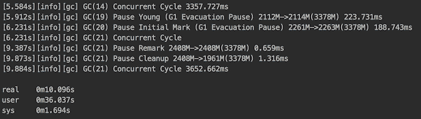

如您所见，GC 完成了我们描述的大部分步骤。它从收集年轻一代开始。然后，当`List<AnObject> list`对象（参见前面的代码）变得太大（超过年轻一代区域的 50%）时，它的内存被分配到*庞大的*区域。您还可以看到初始标记步骤、下面的备注以及前面描述的其他步骤。

每一行以 JVM 运行的时间（以秒为单位）开始，以每一步所用的时间（以毫秒为单位）结束。在屏幕截图的底部，我们看到`time`实用程序打印的三行内容：

5.  设置`-XX:+PrintGCDetails`选项（或只需在日志选项`-Xlog:gc*`中添加`*`，即可查看有关 GC 活动的更多详细信息。在以下屏幕截图中，我们仅提供与 GC 步骤 0 相关的日志的开头：

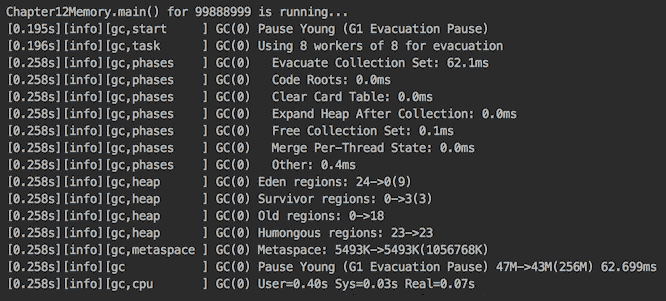

现在，日志中每个 GC 步骤都有十几个条目，最后记录了每个步骤所花费的`User`、`Sys`和`Real`时间量（由`time`实用程序累积的量）。例如，您可以通过添加更多短期对象来修改程序，并查看 GC 活动是如何变化的。

6.  通过`-Xlog:gc*=debug`选项获取更多信息。以下仅是输出的一部分：

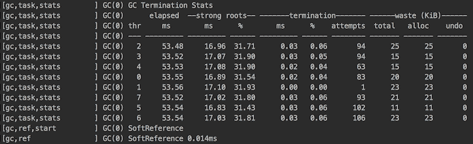

因此，您可以选择分析需要多少信息。

我们将在 JVM 配方的“统一日志”中讨论更多关于日志格式和其他日志选项的细节。

# 它是如何工作的。。。

正如我们前面提到的，G1 GC 使用默认的人体工程学值，这对于大多数应用来说可能已经足够好了。以下是最重要的一个列表（`<ergo>`表示实际值根据环境以人体工程学方式确定）：

*   `-XX:MaxGCPauseMillis=200`：保存最大暂停时间的值
*   `-XX:GCPauseTimeInterval=<ergo>`：保留 GC 步骤之间的最大暂停时间（默认情况下未设置，允许 G1 在需要时背靠背执行垃圾收集）
*   `-XX:ParallelGCThreads=<ergo>`：保存垃圾收集暂停期间用于并行工作的最大线程数（默认情况下，从可用线程数派生；如果进程可用的 CPU 线程数小于或等于 8，则使用此数字；否则，将在最终线程数中添加大于 8 的线程的八分之五）
*   `-XX:ConcGCThreads=<ergo>`：保存用于并发工作的最大线程数（默认设置为`-XX:ParallelGCThreads`除以四）。
*   `-XX:+G1UseAdaptiveIHOP`：表示起始堆占用应该是自适应的
*   `-XX:InitiatingHeapOccupancyPercent=45`：设置前几个采集周期；G1 将使用老年代的 45% 的占有率作为标记开始阈值
*   `-XX:G1HeapRegionSize=<ergo>`：根据初始堆大小和最大堆大小保存堆区域大小（默认情况下，因为堆包含大约 2048 个堆区域，所以堆区域的大小可以从 1 到 32 MB 不等，并且必须是 2 的幂）
*   `-XX:G1NewSizePercent=5`和`-XX:XX:G1MaxNewSizePercent=60`：定义年轻一代的总大小，在这两个值之间变化为当前使用的 JVM 堆的百分比
*   `-XX:G1HeapWastePercent=5`：以百分比形式保存候选集合集中允许的未回收空间（如果候选集合中的可用空间低于该百分比，G1 停止空间回收）
*   `-XX:G1MixedGCCountTarget=8`：保存多个集合中空间回收阶段的预期长度）
*   `-XX:G1MixedGCLiveThresholdPercent=85`：保存老年代区域的活动对象占用百分比，在此百分比之后，在此空间回收阶段将不会收集区域

一般来说，默认配置中的 G1 目标是“*在高吞吐量下提供相对较小、均匀的暂停*”（来自 G1 文档）。如果这些默认设置不适合您的应用程序，您可以更改暂停时间（使用`-XX:MaxGCPauseMillis`和最大 Java 堆大小（使用`-Xmx`选项）。不过，请注意，实际暂停时间在运行时并不完全匹配，但 G1 将尽最大努力实现这一目标。

如果要增加吞吐量，请减少暂停时间目标或请求更大的堆。要提高响应能力，请更改“暂停时间”值。但是请注意，限制年轻一代的大小（使用`-Xmn`、`-XX:NewRatio`或其他选项）可能会妨碍暂停时间控制，因为“年轻一代的大小是 G1 满足暂停时间的主要手段”（来自 G1 文档）。

性能差的第一个可能原因之一是老年代中堆占用率过高而触发的完全 GC。此情况可通过日志中存在*暂停已满（分配失败）*来检测。它通常发生在快速连续创建过多对象（并且不能足够快地收集）或无法及时分配许多大型（庞大）对象时。有几种建议的方法来处理这种情况：

*   如果大量对象的数量过多，请使用`-XX:G1HeapRegionSize`选项（当前选择的堆区域大小打印在日志的开头），通过增加区域大小来减少它们的数量。
*   增加堆的大小。
*   通过设置`-XX:ConcGCThreads`增加并发标记线程数。
*   促进早期标记的开始（利用 G1 根据早期应用程序行为做出决策的事实）。通过修改`-XX:G1ReservePercent`增加自适应 IHOP 计算中使用的缓冲区，或通过使用`-XX:-G1UseAdaptiveIHOP`和`-XX:InitiatingHeapOccupancyPercent`手动设置来禁用 IHOP 的自适应计算。

只有在寻址完整 GC 之后，才能开始调优 JVM 以获得更好的响应性和/或吞吐量。JVM 文档为响应性调优确定了以下情况：

*   异常系统或实时使用
*   引用处理时间太长
*   仅限年轻人的收藏花费的时间太长
*   混合收藏花费的时间太长
*   高更新 RS 和扫描 RS 次数

通过减少总体暂停时间和暂停频率，可以实现更好的吞吐量。请参阅 JVM 文档，以了解缓解问题的标识和建议。

# JVM 的统一日志记录

JVM 的主要组件包括：

*   类别载入器
*   存储运行时数据的 JVM 内存；它分为以下几个方面：
    *   堆放区
    *   方法区
    *   堆区
    *   PC 寄存器
    *   本机方法堆栈
*   执行引擎，由以下部分组成：
    *   翻译
    *   JIT 编译器
    *   垃圾收集
    *   本机方法接口 JNI
    *   本机方法库

现在可以使用`-Xlog`选项打开的统一日志记录来捕获和分析所有这些组件的日志消息。

新测井系统的主要特点如下：

*   日志级别的使用-`trace`、`debug`、`info`、`warning`、`error`
*   标识 JVM 组件、操作或特定感兴趣的消息的消息标记
*   三种输出类型-`stdout`、`stderr`和`file`
*   每行一条消息限制的实施

# 准备

要一目了然地查看所有可能的日志记录，可以运行以下命令：

```java
java -Xlog:help
```

以下是输出：

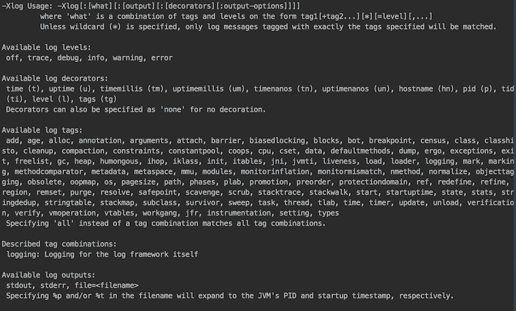

如您所见，`-Xlog`选项的格式定义如下：

```java
-Xlog[:[what][:[output][:[decorators][:output-options]]]]
```

让我们详细解释一下该选项：

*   `what`是`tag1[+tag2...][*][=level][,...]`形式的标记和级别的组合。当我们在`-Xlog:gc*=debug`选项中使用`gc`标记时，我们已经演示了这个构造是如何工作的。通配符（`*`）表示您希望看到所有带有`gc`标记的消息（可能在其他标记中）。缺少`-Xlog:gc=debug`通配符表示您只希望看到由一个标记（`gc`）标记的消息。如果只使用了`-Xlog`，日志将显示`info`级别的所有消息。
*   `output`设置输出类型（默认为`stdout`。
*   `decorators`指示将在日志的每行开头放置的内容（在实际日志消息来自组件之前）。默认装饰器为`uptime`、`level`和`tags`，每个都包含在方括号中。
*   `output_options`可包括带有可选 K、M 或 G 后缀的`filecount=file count`和/或`filesize=file size`。

总之，默认日志配置如下所示：

```java
-Xlog:all=info:stdout:uptime,level,tags
```

# 怎么做。。。

让我们运行一些日志设置：

1.  运行以下命令：

```java
 java -Xlog:cpu -cp ./cookbook-1.0.jar 
                  com.packt.cookbook.ch11_memory.Chapter11Memory
```

没有消息，因为 JVM 不会只记录带有`cpu`标记的消息。该标记与其他标记结合使用。

2.  添加一个`*`符号并再次运行该命令：

```java
 java -Xlog:cpu* -cp ./cookbook-1.0.jar  
                 com.packt.cookbook.ch11_memory.Chapter11Memory
```

结果如下：

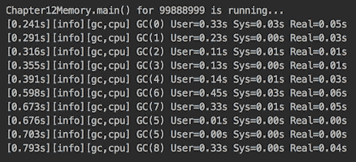

正如您所看到的，`cpu`标记只带来有关执行垃圾收集所需时间的消息。即使我们将日志级别设置为`trace`或`debug`（例如`-Xlog:cpu*=debug`，也不会显示其他消息。

3.  使用`heap`标记运行命令：

```java
 java -Xlog:heap* -cp ./cookbook-1.0.jar 
                 com.packt.cookbook.ch11_memory.Chapter11Memory
```

您将只获得与堆相关的消息：

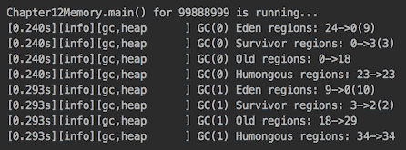

但让我们仔细看看第一行。它从三个装饰符开始-`uptime`、`log level`和`tags`-然后是消息本身，它从收集周期号（本例中为 0）和伊甸园区域数从 24 降到 0 的信息开始（现在它们的计数为 9）。这是因为（正如我们在下一行中看到的）幸存者区域的数量从 0 增加到 3，老年代（第三行）的数量增加到 18，而庞大区域的数量（23）没有改变。这些都是第一个收集周期中与堆相关的消息。然后，第二个收集周期开始。

4.  再次添加`cpu`标签并运行：

```java
 java -Xlog:heap*,cpu* -cp ./cookbook-1.0.jar 
                   com.packt.cookbook.ch11_memory.Chapter11Memory
```

如您所见，`cpu`消息显示了每个周期所用的时间：

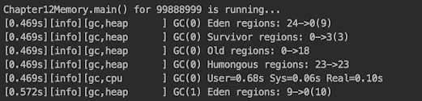

5.  尝试使用两个通过`+`符号组合的标签（例如`-Xlog:gc+heap`。它只显示具有两个标记的消息（类似于二进制`AND`操作）。请注意，通配符不能与`+`符号一起使用（例如`-Xlog:gc*+heap`不起作用）。
6.  您还可以选择输出类型和装饰器。实际上，decorator 级别似乎信息量不大，可以通过只显式列出所需的 decorator 而轻松忽略。考虑以下示例：

```java
 java -Xlog:heap*,cpu*::uptime,tags -cp ./cookbook-1.0.jar 
                    com.packt.cookbook.ch11_memory.Chapter11Memory
```

注意如何插入两个冒号（`::`）以保留输出类型的默认设置。我们还可以明确地表明：

```java
 java -Xlog:heap*,cpu*:stdout:uptime,tags -cp ./cookbook-1.0.jar
                    com.packt.cookbook.ch11_memory.Chapter11Memory
```

要移除任何装饰，可以将其设置为`none`：

```java
 java -Xlog:heap*,cpu*::none -cp ./cookbook-1.0.jar
                     com.packt.cookbook.ch11_memory.Chapter11Memory
```

新记录系统最有用的方面是标记选择。它可以更好地分析每个 JVM 组件及其子系统的内存演变，或者找到性能瓶颈，分析每个收集阶段花费的时间，这两个阶段对 JVM 和应用程序调优都至关重要。

# 对 JVM 使用 jcmd 命令

如果您打开 Java 安装的`bin`文件夹，您可以在那里找到相当多的命令行实用程序，它们可以用于诊断问题和监视使用**Java 运行时环境**（**JRE**）部署的应用程序。他们使用不同的机制来获取他们报告的数据。这些机制特定于**虚拟机**（**VM**）实现、操作系统和版本。通常，只有一部分工具适用于给定问题。

在本食谱中，我们将重点介绍 Java 9 作为命令行实用程序引入的诊断命令`jcmd`。如果`bin`文件夹在路径上，您可以通过在命令行中键入`jcmd`来调用它。否则，您必须转到`bin`目录或在示例中的`jcmd`前面加上`bin`文件夹的完整或相对（相对于命令行窗口的位置）路径。

如果您确实键入了它，并且机器上当前没有运行 Java 进程，那么您将只返回一行，如下所示：

```java
87863 jdk.jcmd/sun.tools.jcmd.JCmd 
```

它显示当前只有一个 Java 进程正在运行（`jcmd`实用程序本身），并且它的**进程标识符**（**PID**）为 87863（每次运行都会有所不同）。

让我们运行一个 Java 程序，例如：

```java
java -cp ./cookbook-1.0.jar 
                   com.packt.cookbook.ch11_memory.Chapter11Memory
```

`jcmd`的输出将显示（使用不同的 PID）以下内容：

```java
87864 jdk.jcmd/sun.tools.jcmd.JCmd 
87785 com.packt.cookbook.ch11_memory.Chapter11Memory
```

如您所见，如果在没有任何选项的情况下输入，`jcmd`实用程序会报告当前运行的所有 Java 进程的 PID。获取 PID 后，您可以使用`jcmd`从运行流程的 JVM 请求数据：

```java
jcmd 88749 VM.version 
```

或者，您可以通过引用应用程序主类的流程来避免使用 PID（并调用不带参数的`jcmd`：

```java
jcmd Chapter11Memory VM.version
```

您可以阅读 JVM 文档，了解有关`jcmd`实用程序以及如何使用它的更多详细信息。

# 怎么做。。。

`jcmd`是一个实用程序，允许我们向指定的 Java 进程发出命令：

1.  通过执行以下行，获取特定 Java 进程可用的`jcmd`命令的完整列表：

```java
 jcmd PID/main-class-name help
```

请输入进程标识符或主类名，而不是`PID/main-class`。该列表特定于 JVM，因此每个列出的命令都从特定进程请求数据。

2.  在 JDK 8 中，以下`jcmd`命令可用：

```java
JFR.stop
JFR.start
JFR.dump
JFR.check
VM.native_memory
VM.check_commercial_features
VM.unlock_commercial_features
ManagementAgent.stop
ManagementAgent.start_local
ManagementAgent.start
GC.rotate_log
Thread.print
GC.class_stats
GC.class_histogram
GC.heap_dump
GC.run_finalization
GC.run
VM.uptime
VM.flags
VM.system_properties
VM.command_line
VM.version
```

JDK 9 引入了以下`jcmd`命令（JDK 18.3 和 JDK 18.9 没有添加新命令）：

如您所见，这些新命令属于几个组，由前缀编译器、**垃圾收集器**（**GC**）、**Java 飞行记录器**（**JFR**）、**Java 虚拟机接口**（**JVMTI**）、**管理代理**表示（与远程 JMX 代理相关）、**线程**和**VM**。在本书中，我们没有足够的空间详细介绍每个命令。我们将只演示几个实际的用法。

# 它是如何工作的。。。

1.  要获取`jcmd`实用程序的帮助，请运行以下命令：

```java
jcmd -h 
```

以下是命令的结果：

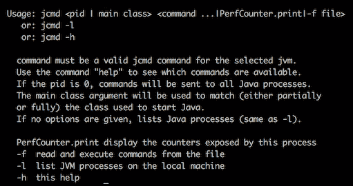

它告诉我们也可以从`-f`之后指定的文件中读取命令，并且有一个`PerfCounter.print`命令，它打印进程的所有性能计数器（统计数据）。

2.  运行以下命令：

```java
jcmd Chapter11Memory GC.heap_info
```

输出可能类似于以下屏幕截图：

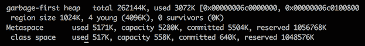

它显示了堆的总大小和使用量，年轻一代中的区域大小和分配的区域数量，以及参数`Metaspace`和`class space`。

3.  如果您正在寻找失控的线程或希望了解幕后的其他情况，则以下命令非常有用：

```java
jcmd Chapter11Memory Thread.print
```

以下是可能输出的一个片段：

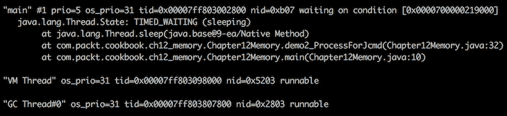

4.  此命令可能是最常用的命令，因为它生成了大量关于硬件、JVM 进程整体及其组件当前状态的信息：

```java
jcmd Chapter11Memory VM.info
```

首先是总结，如下所示：

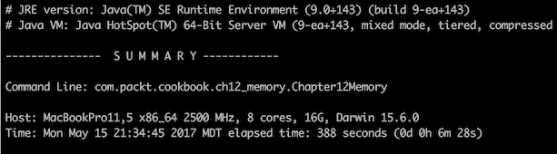

一般过程描述如下：


然后是堆的细节（这只是堆的一小部分）：

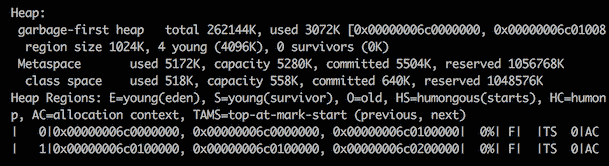

然后，它打印编译事件、GC 堆历史记录、去优化事件、内部异常、事件、动态库、日志选项、环境变量、VM 参数以及运行进程的系统的许多参数。

`jcmd`命令可以深入了解 JVM 进程，这有助于调试和调优进程，以获得最佳性能和最佳资源利用率。

# 尝试使用资源以更好地处理资源

管理资源很重要。例如，任何错误处理（未释放）保持打开状态的资源数据库连接和文件描述符都可能耗尽系统的操作能力。这就是为什么在 JDK 7 中引入了*资源试用*语句。我们在第 6 章、“数据库编程”的示例中使用过：

```java
try (Connection conn = getDbConnection();
Statement st = createStatement(conn)) {
  st.execute(sql);
} catch (Exception ex) {
  ex.printStackTrace();
}
```

作为提醒，以下是`getDbConnection()`方法：

```java
Connection getDbConnection() {
  PGPoolingDataSource source = new PGPoolingDataSource();
  source.setServerName("localhost");
  source.setDatabaseName("cookbook");
  try {
    return source.getConnection(); 
  } catch(Exception ex) {
    ex.printStackTrace();
    return null;
  }
}
```

以下是`createStatement()`方法：

```java
Statement createStatement(Connection conn) {
  try {
    return conn.createStatement();
  } catch(Exception ex) {
    ex.printStackTrace();
    return null;
  }
}
```

这非常有用，但在某些情况下，我们仍然需要以旧式编写额外的代码，例如，如果有一个`execute()`方法接受`Statement`对象作为参数，我们希望在使用它后立即释放（关闭）它。在这种情况下，代码如下所示：

```java
void execute(Statement st, String sql){
  try {
    st.execute(sql);
  } catch (Exception ex) {
    ex.printStackTrace();
  } finally {
    if(st != null) {
      try{
        st.close();
      } catch (Exception ex) {
        ex.printStackTrace();
      }
    }
  }
}
```

正如您所看到的，其中大部分只是样板复制和粘贴代码。

Java9 引入的新的*资源试用*语句通过允许有效地使用最终变量作为资源来解决这种情况。

# 怎么做。。。

1.  使用新的*资源试用*语句重写前面的示例：

```java
        void execute(Statement st, String sql){
          try (st) {
            st.execute(sql);
          } catch (Exception ex) {
            ex.printStackTrace();
          }
        }
```

如您所见，它更加简洁和集中，无需重复编写关闭资源的琐碎代码。没有更多的`finally`和额外的`try...catch`。

2.  如果连接也被传入，也可以将其放入同一个 try 块中，并在不再需要时立即关闭：

```java
        void execute(Connection conn, Statement st, String sql) {
          try (conn; st) {
            st.execute(sql);
          } catch (Exception ex) {
            ex.printStackTrace();
          }
        }
```

它可能适合应用程序的连接处理，也可能不适合，但通常情况下，此功能非常方便。

3.  请尝试其他组合，例如以下组合：

```java
        Connection conn = getDbConnection();
        Statement st = conn.createStatement();
        try (conn; st) {
          st.execute(sql);
        } catch (Exception ex) {
          ex.printStackTrace();
        }
```

这种组合也是允许的：

```java
        Connection conn = getDbConnection();
        try (conn; Statement st = conn.createStatement()) {
          st.execute(sql);
        } catch (Exception ex) {
          ex.printStackTrace();
        }
```

新语句提供了更大的灵活性，可以编写符合需要的代码，而无需编写关闭资源的行。

唯一的要求如下：

```java
        void close() throws Exception;
```

# 它是如何工作的。。。

为了演示新语句是如何工作的，让我们创建自己的资源来实现`AutoCloseable`，并以类似于前面示例中的资源的方式使用它们。

这里有一个资源：

```java
class MyResource1 implements AutoCloseable {
  public MyResource1(){
    System.out.println("MyResource1 is acquired");
  }
  public void close() throws Exception {
    //Do what has to be done to release this resource
    System.out.println("MyResource1 is closed");
  }
}
```

这是第二个资源：

```java
class MyResource2 implements AutoCloseable {
  public MyResource2(){
    System.out.println("MyResource2 is acquired");
  }
  public void close() throws Exception {
    //Do what has to be done to release this resource
    System.out.println("MyResource2 is closed");
  }
}
```

让我们在代码示例中使用它们：

```java
MyResource1 res1 = new MyResource1();
MyResource2 res2 = new MyResource2();
try (res1; res2) {
  System.out.println("res1 and res2 are used");
} catch (Exception ex) {
  ex.printStackTrace();
}
```

如果我们运行它，结果将如下所示：

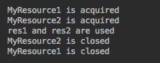

请注意，`try`语句中首先列出的资源最后关闭。让我们只做一次更改并切换`try`语句中引用的顺序：

```java
MyResource1 res1 = new MyResource1();
MyResource2 res2 = new MyResource2();
try (res2; res1) {
  System.out.println("res1 and res2 are used");
} catch (Exception ex) {
  ex.printStackTrace();
}
```

输出确认参考关闭的顺序也发生了变化：

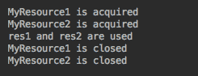

按相反顺序关闭资源的规则解决了资源之间可能存在的最重要的依赖性问题，但是由程序员定义关闭资源的顺序（通过在`try`语句中以正确的顺序列出它们）。幸运的是，大多数标准资源的关闭是由 JVM 优雅地处理的，如果资源以错误的顺序列出，代码不会中断。不过，最好按照创建它们的顺序列出它们。

# 用于改进调试的堆栈遍历

堆栈跟踪可以非常有助于找出问题的根源。如果可以进行自动更正，则需要以编程方式读取。

从 Java 1.4 开始，当前堆栈跟踪可以通过`java.lang.Thread`和`java.lang.Throwable`类访问。您可以将以下行添加到代码的任何方法中：

```java
Thread.currentThread().dumpStack();
```

还可以添加以下行：

```java
new Throwable().printStackTrace();
```

它将把堆栈跟踪打印到标准输出。或者，自 Java 8 以来，您可以使用以下任何一行实现相同的效果：

```java
Arrays.stream(Thread.currentThread().getStackTrace())
      .forEach(System.out::println);

Arrays.stream(new Throwable().getStackTrace())
      .forEach(System.out::println);

```

或者，您可以使用以下行之一提取调用方类的完全限定名：

```java
System.out.println("This method is called by " + Thread.currentThread()
                                   .getStackTrace()[1].getClassName());

System.out.println("This method is called by " + new Throwable()
                                   .getStackTrace()[0].getClassName());
```

上述所有解决方案都是可能的，因为`java.lang.StackTraceElement`类表示堆栈跟踪中的堆栈帧。此类提供了其他方法来描述此堆栈跟踪元素表示的执行点，该元素允许对堆栈跟踪信息进行编程访问。例如，您可以从程序中的任何位置运行此代码段：

```java
Arrays.stream(Thread.currentThread().getStackTrace())
  .forEach(e -> {
    System.out.println();
    System.out.println("e="+e);
    System.out.println("e.getFileName()="+ e.getFileName());
    System.out.println("e.getMethodName()="+ e.getMethodName());
    System.out.println("e.getLineNumber()="+ e.getLineNumber());
});

```

或者，您可以从程序中的任何位置运行以下命令：

```java
Arrays.stream(new Throwable().getStackTrace())
  .forEach(x -> {
    System.out.println();
    System.out.println("x="+x);
    System.out.println("x.getFileName()="+ x.getFileName());
    System.out.println("x.getMethodName()="+ x.getMethodName());
    System.out.println("x.getLineNumber()="+ x.getLineNumber());
});

```

不幸的是，这些丰富的数据是有代价的。JVM 捕获整个堆栈（隐藏堆栈帧除外），在这些情况下，当堆栈跟踪的编程分析嵌入到主应用程序流中时，可能会影响应用程序性能。同时，你只需要这些数据的一小部分就可以做出决定。

这就是新的 Java9 类`java.lang.StackWalker`及其嵌套的`Option`类和`StackFrame`接口的用武之地。

# 准备

`StackWalker`类有四个重载的`getInstance()`静态工厂方法：

*   `StackWalker getInstance()`：配置为跳过所有隐藏帧，不保留调用方类引用。隐藏帧包含 JVM 内部实现特定的信息。不保留调用方类引用意味着调用`StackWalker`对象上的`getCallerClass()`方法会抛出`UnsupportedOperationException`。
*   `StackWalker getInstance(StackWalker.Option option)`：使用给定选项创建实例，指定可以访问的堆栈帧信息。
*   `StackWalker getInstance(Set<StackWalker.Option> options)`：这将创建一个具有给定选项集的实例，指定它可以访问的堆栈帧信息。如果给定集合为空，则实例的配置与`StackWalker getInstance()`创建的实例完全相同。
*   `StackWalker getInstance(Set<StackWalker.Option> options, int estimatedDepth)`：这将创建一个与前一个类似的实例，并接受`estimatedDepth`参数，该参数允许我们估计它可能需要的缓冲区大小。

以下是`enum StackWalker.Option`的值：

*   `StackWalker.Option.RETAIN_CLASS_REFERENCE`：配置`StackWalker`实例支持`getCallerClass()`方法，配置`StackFrame`实例支持`getDeclaringClass()`方法
*   `StackWalker.Option.SHOW_HIDDEN_FRAMES`：配置`StackWalker`实例以显示所有反射帧和特定于实现的帧
*   `StackWalker.Option.SHOW_REFLECT_FRAMES`：配置`StackWalker`实例显示所有反射帧

`StackWalker`类还有三种方法：

*   `T walk(Function<Stream<StackWalker.StackFrame>, T> function)`：将给定函数应用于当前线程的`StackFrames`流，从堆栈顶部开始遍历帧。顶部框架包含调用此`walk()`方法的方法。
*   `void forEach(Consumer<StackWalker.StackFrame> action)`：对当前线程的`StackFrame`流的每个元素执行给定的操作，从堆栈的顶部帧开始遍历，这是调用`forEach`方法的方法。此方法相当于调用`walk(s -> { s.forEach(action); return null; })`。
*   `Class<?> getCallerClass()`：获取调用`getCallerClass()`方法的调用方的`Class`对象。如果此`StackWalker`实例未配置`RETAIN_CLASS_REFERENCE`选项，则此方法抛出`UnsupportedOperationException`。

# 怎么做。。。

创建几个相互调用的类和方法，以便可以执行堆栈跟踪处理：

1.  创建一个`Clazz01`类：

```java
        public class Clazz01 {
          public void method(){
            new Clazz03().method("Do something");
            new Clazz02().method();
          }
        }
```

2.  创建一个`Clazz02`类：

```java
        public class Clazz02 {
          public void method(){
            new Clazz03().method(null);
          }
        }
```

3.  创建一个`Clazz03`类：

```java
        public class Clazz03 {
          public void method(String action){
            if(action != null){
              System.out.println(action);
              return;
            }
            System.out.println("Throw the exception:");
            action.toString();
          }
        }
```

4.  写一个`demo4_StackWalk()`方法：

```java
        private static void demo4_StackWalk(){
          new Clazz01().method();
        }
```

从`Chapter11Memory`类的 main 方法调用此方法：

```java
        public class Chapter11Memory {
          public static void main(String... args) {
            demo4_StackWalk();
          }
        }
```

如果我们现在运行`Chapter11Memory`类，结果如下：

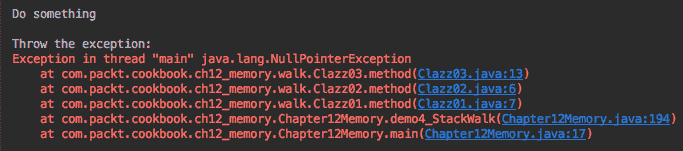

`Do something`消息从`Clazz01`传递并在`Clazz03`中打印出来。然后`Clazz02`将 null 传递给`Clazz03`，并在`action.toString()`行`NullPointerException`引起的堆栈跟踪之前打印出`Throw the exception`消息。

# 它是如何工作的。。。

为了更深入地理解这里的概念，让我们修改`Clazz03`：

```java
public class Clazz03 {
  public void method(String action){
    if(action != null){
      System.out.println(action);
      return;
    }
    System.out.println("Print the stack trace:");
    Thread.currentThread().dumpStack();
  }
}
```

结果如下：

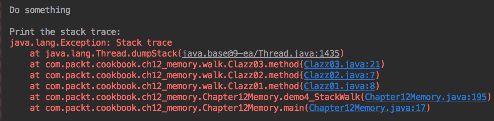

或者，我们可以使用`Throwable`代替`Thread`获得类似的输出：

```java
new Throwable().printStackTrace();
```

前一行生成此输出：

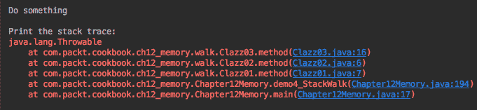

类似的结果将产生以下两行中的每一行：

```java
Arrays.stream(Thread.currentThread().getStackTrace())
                             .forEach(System.out::println);
Arrays.stream(new Throwable().getStackTrace())
                             .forEach(System.out::println);

```

自 Java 9 以来，使用`StackWalker`类可以实现相同的输出。让我们看看如果我们修改`Clazz03`如下所示会发生什么：

```java
public class Clazz03 {
  public void method(String action){
    if(action != null){
      System.out.println(action);
      return;
    }
    StackWalker stackWalker = StackWalker.getInstance();
    stackWalker.forEach(System.out::println);
  }
}
```

结果是：

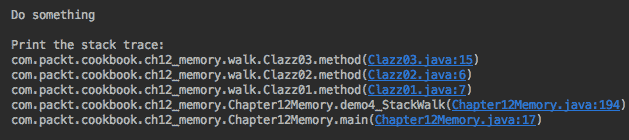

它包含了传统方法产生的所有信息。然而，与在内存中作为数组生成和存储的完整堆栈跟踪相反，`StackWalker`类只带来请求的元素。这已经是一个很大的优势。然而，`StackWalker`最大的优点是，当我们只需要调用方类名时，我们现在可以通过使用以下两行获得所需的信息，而不是获取所有数组并仅使用一个元素：

```java
System.out.println("Print the caller class name:");
System.out.println(StackWalker.getInstance(StackWalker
                        .Option.RETAIN_CLASS_REFERENCE)
                        .getCallerClass().getSimpleName());

```

上述代码段的结果如下所示：

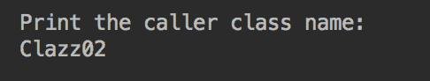

# 使用内存感知编码样式

编写代码时，程序员有两个主要目标：

*   实现所需的功能
*   编写易于阅读和理解的代码

然而，在这样做的同时，他们还必须做出许多其他决定，其中之一是使用哪一个具有类似功能的标准库类和方法。在本食谱中，我们将向您介绍一些注意事项，这些注意事项有助于避免内存浪费，并使您的代码样式内存具有感知能力：

*   注意在循环内创建的对象
*   使用延迟初始化并在使用之前创建一个对象，特别是如果很有可能，这种需求可能永远不会实现
*   不要忘记清理缓存并删除不必要的条目
*   使用`StringBuilder`代替`+`操作符
*   如果符合您的需要，请先使用`ArrayList`，然后再使用`HashSet`（内存使用量依次从`ArrayList`增加到`LinkedList`、`HashTable`、`HashMap`、`HashSet`）

# 怎么做。。。

1.  请注意在循环内创建的对象。

这个建议很明显。快速连续创建和丢弃多个对象可能会在垃圾收集器重新利用空间之前消耗过多内存。考虑重用对象，而不是每次创建一个新对象。以下是一个例子：

```java
class Calculator {
   public  double calculate(int i) {
       return Math.sqrt(2.0 * i);
   }
}

class SomeOtherClass {
   void reuseObject() {
      Calculator calculator = new Calculator();
      for(int i = 0; i < 100; i++ ){
          double r = calculator.calculate(i);
          //use result r
      }
   }
} 
```

前面的代码可以通过使`calculate()`方法为静态来改进。另一个解决方案是创建`SomeOtherClass`类的静态属性`Calculator calculator = new Calculator()`。但是，静态属性在第一次加载类时立即初始化。如果不使用`calculator`属性，则其初始化将产生不必要的开销。在这种情况下，必须添加延迟初始化。

2.  使用延迟初始化并在使用之前创建一个对象，尤其是在某些请求很可能永远不会实现这种需求的情况下。

在上一步中，我们讨论了`calculator`属性的延迟初始化：

```java
class Calculator {
    public  double calculate(int i) {
        return Math.sqrt(2.0 * i);
    }
}

class SomeOtherClass {
     private static Calculator calculator;
     private static Calculator getCalculator(){
        if(this.calculator == null){
            this.calculator = new Calculator();
        }
        return this.calculator;
     }
     void reuseObject() {
        for(int i = 0; i < 100; i++ ){
           double r = getCalculator().calculate(i);
           //use result r
      }
   }
} 
```

在前面的示例中，`Calculator`对象一经创建就是一个单例，应用程序中只存在它的一个实例。如果我们知道将始终使用 calculator 属性，那么就不需要延迟初始化。在 Java 中，我们可以在任何应用程序线程首次加载类时利用静态属性初始化：

```java
class SomeOtherClass {
   private static Calculator calculator = new Calculator();
   void reuseObject() {
      for(int i = 0; i < 100; i++ ){
          double r = calculator.calculate(i);
          //use result r
      }
   }
}
```

但是，如果初始化对象很有可能永远不会被使用，那么我们就回到了惰性初始化，正如前面讨论的那样（使用`getCalculator()`方法），它可以在单个线程中实现，或者当共享对象是无状态的，并且它的初始化不会消耗很多资源时。

对于多线程应用程序和复杂对象初始化，需要大量的资源消耗，必须采取一些额外的措施来避免并发访问的冲突，并确保只创建一个实例。例如，考虑下面的类：

```java
class ExpensiveInitClass {
    private Object data;
    public ExpensiveInitClass() {
        //code that consumes resources
        //and assignes value to this.data
    }

    public Object getData(){
        return this.data;
    }
}
```

如果前面的构造函数需要很长的时间来完成对象创建，则第二个线程有可能在第一个线程完成对象创建之前进入构造函数。为了避免同时创建第二个对象，我们需要同步初始化过程：

```java
class LazyInitExample {
  public ExpensiveInitClass expensiveInitClass
  public Object getData(){  //can synchrnonize here
    if(this.expensiveInitClass == null){
      synchronized (LazyInitExample.class) {
        if (this.expensiveInitClass == null) {
          this.expensiveInitClass = new ExpensiveInitClass();
        }
      }
    }
    return expensiveInitClass.getData();
  }
}
```

如您所见，我们可以同步对`getData()`方法的访问，但在创建对象后不需要这种同步，并且在高度并发的多线程环境中可能会造成瓶颈。类似地，我们可以在同步块内只进行一次 null 检查，但在对象初始化后不需要进行此同步，因此我们用另一次 null 检查将其包围起来，以减少出现瓶颈的可能性。

3.  不要忘记清理缓存并删除不必要的条目。

缓存有助于减少访问数据的时间。但是缓存会消耗内存，因此在保持其可用性的同时，尽可能保持其小是有意义的。如何做到这一点在很大程度上取决于缓存数据的使用模式。例如，如果您知道缓存中存储的对象一旦使用，就不会再次使用，则可以在应用程序启动时（或根据使用模式定期）将其放入缓存中，并在使用后将其从缓存中删除：

```java
static HashMap<String, Object> cache = new HashMap<>();
static {
    //populate the cache here
}
public Object getSomeData(String someKey) {
    Object obj = cache.get(someKey);
    cache.remove(someKey);
    return obj;
}
```

或者，如果希望每个对象具有高级别的可重用性，则可以在第一次请求后将其放入缓存：

```java
static HashMap<String, Object> cache = new HashMap<>();
public Object getSomeData(String someKey) {
    Object obj = cache.get(someKey);
    if(obj == null){
        obj = getDataFromSomeSource();
        cache.put(someKey, obj);
    }
    return obj;
}
```

上述情况可能会导致缓存的不可控增长，从而消耗过多内存，并最终导致`OutOfMemoryError`状况。为了防止这种情况发生，您可以实现一种算法，将缓存的大小限制在一定的大小之后，每次添加新对象时，都会删除一些其他对象（例如使用最多或使用最少的对象）。以下是通过删除最常用的缓存对象将缓存大小限制为 10 的示例：

```java
static HashMap<String, Object> cache = new HashMap<>();
static HashMap<String, Integer> count = new HashMap<>();
public static Object getSomeData(String someKey) {
   Object obj = cache.get(someKey);
   if(obj == null){
       obj = getDataFromSomeSource();
       cache.put(someKey, obj);
       count.put(someKey, 1);
       if(cache.size() > 10){
          Map.Entry<String, Integer> max = 
             count.entrySet().stream()
             .max(Map.Entry.comparingByValue(Integer::compareTo))
             .get();
            cache.remove(max.getKey());
            count.remove(max.getKey());
        }
    } else {
        count.put(someKey, count.get(someKey) + 1);
    } 
    return obj;
}
```

或者，可以使用`java.util.WeakHashMap`类实现缓存：

```java
private static WeakHashMap<Integer, Double> cache 
                                     = new WeakHashMap<>();
void weakHashMap() {
    int last = 0;
    int cacheSize = 0;
    for(int i = 0; i < 100_000_000; i++) {
        cache.put(i, Double.valueOf(i));
        cacheSize = cache.size();
        if(cacheSize < last){
            System.out.println("Used memory=" + 
              usedMemoryMB()+" MB, cache="  + cacheSize);
        }
        last = cacheSize;
    }
}
```

如果运行前面的示例，您将看到内存使用率和缓存大小首先增加，然后下降，然后增加，然后再次下降。以下是一个输出的摘录：

```java
Used memory=1895 MB, cache=2100931
Used memory=189 MB, cache=95658
Used memory=296 MB, cache=271
Used memory=408 MB, cache=153
Used memory=519 MB, cache=350
Used memory=631 MB, cache=129
Used memory=745 MB, cache=2079710
Used memory=750 MB, cache=69590
Used memory=858 MB, cache=213
```

我们使用的内存使用率计算如下：

```java
long usedMemoryMB() {
   return Math.round(
      Double.valueOf(Runtime.getRuntime().totalMemory() - 
                     Runtime.getRuntime().freeMemory())/1024/1024
   );
}
```

`java.util.WeakHashMap`类是一个带有`java.lang.ref.WeakReference`类型键的映射实现。只要垃圾收集器确定需要更多内存，就会对仅由弱引用引用的对象进行垃圾收集。这意味着`WeakHashMap`对象中的条目将在没有对该键的引用时被删除。当垃圾收集从内存中删除密钥时，相应的值也从映射中删除。

在前面的示例中，没有一个缓存键在映射之外使用，因此垃圾收集器自行删除它们。即使在向映射外部的键添加显式引用时，代码的行为也相同：

```java
private static WeakHashMap<Integer, Double> cache 
                                     = new WeakHashMap<>();
void weakHashMap() {
    int last = 0;
    int cacheSize = 0;
    for(int i = 0; i < 100_000_000; i++) {
        Integer iObj = i;
        cache.put(iObj, Double.valueOf(i));
        cacheSize = cache.size();
        if(cacheSize < last){
            System.out.println("Used memory=" + 
              usedMemoryMB()+" MB, cache="  + cacheSize);
        }
        last = cacheSize;
    }
}
```

这是因为前面代码块中显示的`iObj`引用在每次迭代后都会被放弃并被收集，因此缓存中相应的密钥没有外部引用，垃圾收集器也会将其删除。为了证明这一点，让我们再次修改前面的代码：

```java
private static WeakHashMap<Integer, Double> cache 
                                     = new WeakHashMap<>();
void weakHashMap() {
    int last = 0;
    int cacheSize = 0;
    List<Integer> list = new ArrayList<>();
    for(int i = 0; i < 100_000_000; i++) {
        Integer iObj = i;
        cache.put(iObj, Double.valueOf(i));
        list.add(iObj);
        cacheSize = cache.size();
        if(cacheSize < last){
            System.out.println("Used memory=" + 
              usedMemoryMB()+" MB, cache="  + cacheSize);
        }
        last = cacheSize;
    }
}
```

我们已经创建了一个列表，并向其中添加了每个映射键。如果我们运行前面的代码，我们最终会得到`OutOfMemoryError`，因为缓存的键在映射之外有强引用。我们也可以削弱外部参照：

```java
private static WeakHashMap<Integer, Double> cache 
                                     = new WeakHashMap<>();
void weakHashMap() {
    int last = 0;
    int cacheSize = 0;
    List<WeakReference<Integer>> list = new ArrayList<>();
    for(int i = 0; i < 100_000_000; i++) {
        Integer iObj = i;
        cache.put(iObj, Double.valueOf(i));
 list.add(new WeakReference(iObj));
        cacheSize = cache.size();
        if(cacheSize < last){
            System.out.println("Used memory=" + 
              usedMemoryMB()+" MB, cache="  + cacheSize +
              ", list size=" + list.size());
        }
        last = cacheSize;
    }
}
```

前面的代码现在运行起来就像缓存键没有外部引用一样。使用的内存和缓存大小会再次增长和下降。但是列表大小不会下降，因为垃圾收集器不会从列表中删除值。因此，最终应用程序可能会耗尽内存。

然而，无论您是限制缓存的大小还是让它不受控制地增长，应用程序都可能需要尽可能多的内存。因此，如果存在对应用程序的主要功能不重要的大对象，有时将它们从内存中删除是有意义的，这样应用程序才能生存，而不会进入`OutOfMemoryError`状态。

如果存在缓存，它通常是移除和释放内存的好候选，因此我们可以使用`WeakReference`类包装缓存本身：

```java
private static WeakReference<Map<Integer, Double[]>> cache;
void weakReference() {
   Map<Integer, Double[]> map = new HashMap<>();
   cache = new WeakReference<>(map);
   map = null;
   int cacheSize = 0;
   List<Double[]> list = new ArrayList<>();
   for(int i = 0; i < 10_000_000; i++) {
      Double[] d = new Double[1024];
      list.add(d);
      if (cache.get() != null) {
          cache.get().put(i, d);
          cacheSize = cache.get().size();
          System.out.println("Cache="+cacheSize + 
                  ", used memory=" + usedMemoryMB()+" MB");
      } else {
          System.out.println(i +": cache.get()=="+cache.get()); 
          break;
      }
   }
}
```

在前面的代码中，我们将映射（缓存）包装在`WeakReference`类中，这意味着我们告诉 JVM，只要没有对该对象的引用，它就可以收集该对象。然后，在 for 循环的每次迭代中，我们创建`new Double[1024]`对象并将其保存在列表中。我们这样做是为了更快地使用所有可用内存。然后我们将相同的对象放入缓存。当我们运行此代码时，它很快会得到以下输出：

```java
Cache=4582, used memory=25 MB
4582: cache.get()==null

```

这意味着垃圾收集器决定在使用 25 MB 内存后收集缓存对象。如果您认为这种方法过于激进，并且不需要经常更新缓存，那么可以将其包装在`java.lang.ref.SoftReference`类中。如果您这样做，只有当所有内存即将抛出`OutOfMemoryError`时，才会收集缓存。下面是演示该功能的代码段：

```java
private static SoftReference<Map<Integer, Double[]>> cache;
void weakReference() {
   Map<Integer, Double[]> map = new HashMap<>();
   cache = new SoftReference<>(map);
   map = null;
   int cacheSize = 0;
   List<Double[]> list = new ArrayList<>();
   for(int i = 0; i < 10_000_000; i++) {
      Double[] d = new Double[1024];
      list.add(d);
      if (cache.get() != null) {
          cache.get().put(i, d);
          cacheSize = cache.get().size();
          System.out.println("Cache="+cacheSize + 
                      ", used memory=" + usedMemoryMB()+" MB");
      } else {
          System.out.println(i +": cache.get()=="+cache.get()); 
          break;
      }
   }
}
```

如果我们运行它，输出将如下所示：

```java
Cache=1004737, used memory=4096 MB
1004737: cache.get()==null
```

没错，在我们的测试计算机上，有 4GB 的 RAM，所以缓存只有在几乎全部被使用时才被删除。

3.  使用`StringBuilder`代替`+`操作符。

你可以在网上找到许多这样的建议。也有相当多的陈述认为这一建议已经过时，因为现代 Java 使用`StringBuilder`来实现字符串的`+`操作符。这是我们实验的结果。首先，我们运行了以下代码：

```java
long um = usedMemoryMB();
String s = "";
for(int i = 1000; i < 10_1000; i++ ){
    s += Integer.toString(i);
    s += " ";
}
System.out.println("Used memory: " 
         + (usedMemoryMB() - um) + " MB");  //prints: 71 MB

```

`usedMemoryMB()`的实施：

```java
long usedMemoryMB() {
   return Math.round(
      Double.valueOf(Runtime.getRuntime().totalMemory() - 
                  Runtime.getRuntime().freeMemory())/1024/1024
   );
}
```

然后我们使用`StringBuilder`用于同样的目的：

```java
long um = usedMemoryMB();
StringBuilder sb = new StringBuilder();
for(int i = 1000; i < 10_1000; i++ ){
    sb.append(Integer.toString(i)).append(" ");
}
System.out.println("Used memory: " 
         + (usedMemoryMB() - um) + " MB");  //prints: 1 MB
```

如您所见，使用`+`操作符消耗了 71MB 的内存，而`StringBuilder`对同一任务只使用了 1MB 的内存。我们也测试了`StringBuffer`。它也消耗了 1MB，但执行速度略慢于`StringBuilder`，因为它是线程安全的，而`StringBuilder`只能在单线程环境中使用。

所有这些都不适用于长的`String`值，该值被分成几个带有加号的子字符串，以提高可读性。编译器将子字符串收集回一个长值。例如，`s1`和`s2`字符串占用相同的内存量：

```java
String s1 = "this " +
            "string " +
            "takes " +
            "as much memory as another one";
String s2 = "this string takes as much memory as another one";
```

4.  如果您需要使用收藏，请选择`ArrayList`，如果它符合您的需要。内存使用量依次从`ArrayList`增加到`LinkedList`、`HashTable`、`HashMap`和`HashSet`。

`ArrayList`对象将其元素存储在`Object[]`数组中，并使用`int`字段跟踪列表大小（除了`array.length`之外）。由于这种设计，如果有可能无法充分利用该容量，则不建议在声明时分配大容量的`ArrayList`。随着新元素添加到列表中，后端阵列的容量将以 10 个元素的块增加，这可能是内存浪费的一个来源。如果对应用程序有意义，可以通过调用`trimToSize()`方法将`ArrayList`容量缩小到当前使用的容量。请注意，`clear()`和`remove()`方法不影响`ArrayList`容量，它们只改变其大小。

其他集合的开销更大，因为它们提供了更多的服务。`LinkedList`元素包含对上一个和下一个元素的引用以及对数据值的引用。基于散列的集合的大多数实现都关注于更好的性能，这通常以牺牲内存占用为代价。

如果 Java 集合类的大小很小，那么它的选择可能无关紧要。然而，程序员通常使用相同的编码模式，人们可以通过代码的样式来识别代码的作者。这就是为什么从长远来看，找出最有效的结构并定期使用它们是值得的。但是，尽量避免使代码难以理解；可读性是代码质量的一个重要方面。

# 提高内存使用率的最佳实践

内存管理可能永远不会成为你的问题，它可能会影响你醒着的每一刻，或者你可能会发现自己处于这两个极性之间。大多数时候，这对大多数程序员来说都不是问题，特别是随着垃圾收集算法的不断改进。G1 垃圾收集器（JVM9 中的默认设置）无疑是朝着正确方向迈出的一步。但也有可能会有人打电话（或注意到自己）告诉您应用程序性能下降的情况，这时您将了解自己的能力如何应对挑战。

本食谱旨在帮助您避免这种情况或成功摆脱这种情况。

# 怎么做。。。

第一道防线是代码本身。在前面的食谱中，我们讨论了在不再需要资源时立即释放资源的需要，以及使用`StackWalker`来消耗更少的内存。互联网上有很多建议，但它们可能不适用于您的应用程序。在决定将注意力集中在哪里之前，您必须监控内存消耗并测试您的设计决策，特别是当您的代码处理大量数据时。

一旦代码开始执行它应该执行的操作，就测试并评测它。您可能需要更改设计或一些实现细节。它还将通知您未来的决定。有许多探查器和诊断工具可用于任何环境。我们在“为 JVM 使用`jcmd`命令”配方中描述了其中的一个`jcmd`。

了解您的垃圾收集器是如何工作的（请参阅“了解 G1 垃圾收集器”配方），不要忘记使用 JVM 日志记录（在“针对 JVM 的统一日志记录”配方中描述）。

之后，您可能需要调优 JVM 和垃圾收集器。下面是一些常用的`java`命令行参数（默认情况下，大小以字节为单位指定，但可以附加字母 k 或 k 表示千字节，m 或 m 表示兆字节，g 或 g 表示千兆字节）：

*   `-Xms size`：此选项允许我们设置初始堆大小（必须大于 1MB，并且是 1024 的倍数）。
*   `-Xmx size`：此选项允许我们设置最大堆大小（必须大于 2MB 和 1024 的倍数）。
*   `-Xmn size`或`-XX:NewSize=size`和`-XX:MaxNewSize=size`的组合：此选项允许我们设置年轻一代的初始和最大大小。对于高效 GC，它必须低于`-Xmx size`。Oracle 建议将其设置为堆大小的 25% 以上，50% 以下。
*   `-XX:NewRatio=ratio`：此选项允许我们设置年轻一代和老年代之间的比率（默认为两代）。
*   `-Xss size`：此选项允许我们设置线程堆栈大小。以下是不同平台的默认值：
    *   Linux/ARM（32 位）：320 KB
    *   Linux/ARM（64 位）：1024KB
    *   Linux/x64（64 位）：1024KB
    *   macOS（64 位）：1024KB
    *   Oracle Solaris/i386（32 位）：320 KB
    *   Oracle Solaris/x64（64 位）：1024 KB
    *   Windows：依赖于虚拟内存

*   `-XX:MaxMetaspaceSize=size`：此选项允许我们设置类元数据区域的上限（默认无限制）。

内存泄漏的信号是老年代的增长，导致完整 GC 运行得更频繁。要进行调查，可以使用将堆内存转储到文件中的 JVM 参数：

*   `-XX:+HeapDumpOnOutOfMemoryError`：允许我们将 JVM 堆内容保存到文件中，但仅当抛出`java.lang.OutOfMemoryError`异常时。默认情况下，堆转储以`java_pid<pid>.hprof`名称保存在当前目录中，其中`<pid>`是进程 ID。使用`-XX:HeapDumpPath=<path>`选项自定义转储文件位置。`<path>`值必须包含文件名。
*   `-XX:OnOutOfMemoryError="<cmd args>;<cmd args>"`：允许我们提供一组命令（用分号分隔），当抛出`OutOfMemoryError`异常时将执行这些命令。
*   `-XX:+UseGCOverheadLimit`：调节 GC 在抛出`OutOfMemoryError`异常之前所花费的时间比例大小。例如，当 GC 占用 98% 以上的时间并且恢复不到堆的 2% 时，并行 GC 将抛出一个`OutOfMemoryError`异常。当堆很小时，此选项特别有用，因为它阻止 JVM 以很少或没有进展的方式运行。默认情况下，它处于启用状态。要禁用它，请使用`-XX:-UseGCOverheadLimit`。

# 了解低开销垃圾收集器 Epsilon

一个流行的 Java 面试问题是，你实施垃圾收集吗？Java 运行时内存管理不在程序员的控制范围内，有时会扮演一个不可预知的小丑角色—它会中断本来运行良好的应用程序，并启动停止世界完整内存扫描。它通常发生在*最糟糕的时间*。尤其令人恼火的是，当您试图使用短期运行来衡量应用程序在负载下的性能，然后意识到在垃圾收集过程中花费了大量的时间和资源，并且在更改代码后，垃圾收集的模式与代码更改前不同。

在本章中，我们描述了许多编程技巧和解决方案，它们有助于减轻垃圾收集器的压力。然而，它仍然是应用程序性能的独立且不可预测的贡献者（或减损者）。如果垃圾收集器得到更好的控制（至少出于测试目的），或者可以关闭，那不是很好吗？在 Java11 中，引入了一个称为无操作垃圾收集器的垃圾收集器 Epsilon。

乍一看，它看起来很奇怪——一个不收集任何东西的垃圾收集器。但它是可预测的（这是肯定的），因为它什么也不做，而且该功能允许我们在短期内测试算法，而不用担心不可预测的暂停。此外，还有一整类小型短命应用程序需要在短时间内收集所有资源，因此最好重新启动 JVM 并让负载平衡器执行故障切换，而不是尝试将垃圾收集过程中不可预测的小丑因素考虑在内。

它还被设想为一个基准过程，允许我们估算常规垃圾收集器的开销。

# 怎么做。。。

要调用 no-op 垃圾收集器，请使用`-XX:+UseEpsilonGC`选项。在撰写本文时，它需要一个`-XX:+UnlockExperimentalVMOptions`选项来访问新功能。

我们将使用以下程序进行演示：

```java
package com.packt.cookbook.ch11_memory;
import java.util.ArrayList;
import java.util.List;
public class Epsilon {
    public static void main(String... args) {
        List<byte[]> list = new ArrayList<>();
        int n = 4 * 1024 * 1024;
        for(int i=0; i < n; i++){
            list.add(new byte[1024]);
            byte[] arr = new byte[1024];
        }
    }
}
```

正如您所看到的，在这个程序中，我们试图通过在每次迭代时向列表中添加一个 1KB 的数组来分配 4GB 的内存。同时，我们还在每次迭代中创建一个 1K 数组`arr`，但不使用对它的引用，因此传统的垃圾收集器可以收集它。

首先，我们将使用默认垃圾收集器运行前面的程序：

```java
time java -cp cookbook-1.0.jar -Xms4G -Xmx4G -Xlog:gc com.packt.cookbook.ch11_memory.Epsilon
```

请注意，我们将 JVM 堆内存限制为 4GB，因为出于演示目的，我们希望程序以`OutOfMemoryError`退出。我们用`time`命令包装了调用，以捕获三个值：

*   **真实时间**：程序运行了多长时间
*   **用户时间**：程序使用 CPU 的时间
*   **系统时间**：操作系统为程序工作的时间

我们使用 JDK 11：

```java
java -version
java version "11-ea" 2018-09-25
Java(TM) SE Runtime Environment 18.9 (build 11-ea+22)
Java HotSpot(TM) 64-Bit Server VM 18.9 (build 11-ea+22, mixed mode)
```

在您的计算机上，上述命令的输出可能不同。在我们的测试运行期间，当我们使用指定的`java`命令参数执行前面的程序时，输出从以下四行开始：

```java
Using G1
GC(0) Pause Young (Normal) (G1 Evacuation Pause) 204M->101M(4096M)
GC(1) Pause Young (Normal) (G1 Evacuation Pause) 279M->191M(4096M)
GC(2) Pause Young (Normal) (G1 Evacuation Pause) 371M->280M(4096M)
```

如您所见，G1 垃圾收集器是 JDK 11 中的默认垃圾收集器，它立即开始收集未引用的`arr`对象。如我们所料，程序在`OutOfMemoryError`之后退出：

```java
GC(50) Pause Full (G1 Evacuation Pause) 4090M->4083M(4096M)
GC(51) Concurrent Cycle 401.931ms
GC(52) To-space exhausted
GC(52) Pause Young (Concurrent Start) (G1 Humongous Allocation)
GC(53) Concurrent Cycle
GC(54) Pause Young (Normal) (G1 Humongous Allocation) 4088M->4088M(4096M)
GC(55) Pause Full (G1 Humongous Allocation) 4088M->4085M(4096M)
GC(56) Pause Full (G1 Humongous Allocation) 4085M->4085M(4096M)
GC(53) Concurrent Cycle 875.061ms
Exception in thread "main" java.lang.OutOfMemoryError: Java heap space
 at java.base/java.util.Arrays.copyOf(Arrays.java:3720)
 at java.base/java.util.Arrays.copyOf(Arrays.java:3689)
 at java.base/java.util.ArrayList.grow(ArrayList.java:237)
 at java.base/java.util.ArrayList.grow(ArrayList.java:242)
 at java.base/java.util.ArrayList.add(ArrayList.java:485)
 at java.base/java.util.ArrayList.add(ArrayList.java:498)
 at com.packt.cookbook.ch11_memory.Epsilon.main(Epsilon.java:12)
```

时间实用程序产生以下结果：

```java
real 0m11.549s    //How long the program ran
user 0m35.301s    //How much time the CPU was used by the program
sys 0m19.125s     //How much time the OS worked for the program
```

我们的计算机是多核的，因此 JVM 能够并行使用多个核，最有可能用于垃圾收集。这就是为什么用户时间比实时时间大，而系统时间也比实时时间大的原因。

现在，让我们使用以下命令运行相同的程序：

```java
time java -cp cookbook-1.0.jar -XX:+UnlockExperimentalVMOptions -XX:+UseEpsilonGC -Xms4G -Xmx4G -Xlog:gc com.packt.cookbook.ch11_memory.Epsilon
```

注意，我们添加了`-XX:+UnlockExperimentalVMOptions -XX:+UseEpsilonGC`选项，它需要 Epsilon 垃圾收集器。结果如下：

```java
Non-resizeable heap; start/max: 4096M
Using TLAB allocation; max: 4096K
Elastic TLABs enabled; elasticity: 1.10x
Elastic TLABs decay enabled; decay time: 1000ms
Using Epsilon
Heap: 4096M reserved, 4096M (100.00%) committed, 205M (5.01%) used
Heap: 4096M reserved, 4096M (100.00%) committed, 410M (10.01%) used
Heap: 4096M reserved, 4096M (100.00%) committed, 614M (15.01%) used
Heap: 4096M reserved, 4096M (100.00%) committed, 820M (20.02%) used
Heap: 4096M reserved, 4096M (100.00%) committed, 1025M (25.02%) used
Heap: 4096M reserved, 4096M (100.00%) committed, 1230M (30.03%) used
Heap: 4096M reserved, 4096M (100.00%) committed, 1435M (35.04%) used
Heap: 4096M reserved, 4096M (100.00%) committed, 1640M (40.04%) used
Heap: 4096M reserved, 4096M (100.00%) committed, 1845M (45.05%) used
Heap: 4096M reserved, 4096M (100.00%) committed, 2050M (50.05%) used
Heap: 4096M reserved, 4096M (100.00%) committed, 2255M (55.06%) used
Heap: 4096M reserved, 4096M (100.00%) committed, 2460M (60.06%) used
Heap: 4096M reserved, 4096M (100.00%) committed, 2665M (65.07%) used
Heap: 4096M reserved, 4096M (100.00%) committed, 2870M (70.07%) used
Heap: 4096M reserved, 4096M (100.00%) committed, 3075M (75.08%) used
Heap: 4096M reserved, 4096M (100.00%) committed, 3280M (80.08%) used
Heap: 4096M reserved, 4096M (100.00%) committed, 3485M (85.09%) used
Heap: 4096M reserved, 4096M (100.00%) committed, 3690M (90.09%) used
Heap: 4096M reserved, 4096M (100.00%) committed, 3895M (95.10%) used
Terminating due to java.lang.OutOfMemoryError: Java heap space
```

如您所见，垃圾收集器甚至没有尝试收集废弃的对象。堆空间的使用率稳步增长，直到完全消耗，JVM 以`OutOfMemoryError`退出。使用`time`实用程序，我们可以测量以下三个时间参数：

```java
real 0m4.239s
user 0m1.861s
sys 0m2.132s
```

当然，耗尽所有堆内存所需的时间要少得多，用户时间也比实时时间少得多。这就是为什么，正如我们已经提到的，no-op-Epsilon 垃圾收集器对于必须尽可能快但不消耗所有堆内存或可以随时停止的程序非常有用。可能还有其他一些不做任何事情的垃圾收集器会有所帮助的用例。**