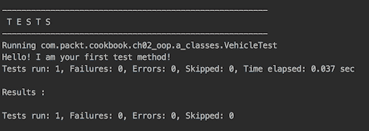
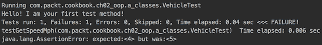
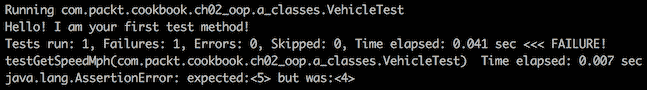
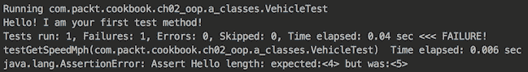
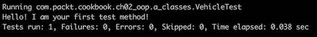
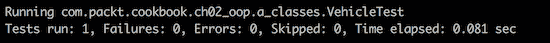
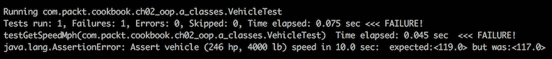
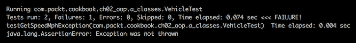
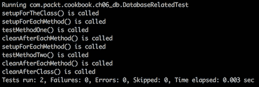
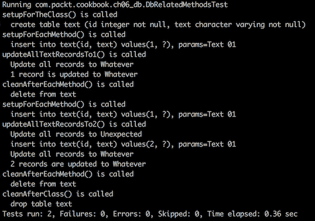

# 测试

本章介绍如何测试应用程序如何捕获和自动测试用例，如何在 API 与其他组件集成之前对其进行单元测试，以及如何集成所有单元。我们将向您介绍**行为驱动开发**（**BDD**），并展示它如何成为您应用程序开发的起点。我们还将演示 JUnit 框架如何用于单元测试。有时，在单元测试期间，我们必须使用一些虚拟数据来插桩依赖项，这可以通过模拟依赖项来完成。我们将向您展示如何使用模拟库来实现这一点。我们还将向您展示如何编写夹具来填充测试数据，以及如何通过集成不同的 api 并将它们测试在一起来测试应用程序的行为。我们将介绍以下配方：

*   黄瓜行为测试
*   使用 JUnit 对 API 进行单元测试
*   通过模拟依赖项进行单元测试
*   使用夹具填充测试数据
*   集成测试

# 介绍

经过良好测试的代码可以让开发人员安心。如果您觉得为您正在开发的新方法编写测试的开销太大，那么您通常不会在第一次就把它做好。无论如何，您都必须测试您的方法，从长远来看，设置或编写单元测试要比每次代码更改和每次逻辑传递多次构建和启动应用程序花费更少的时间。

我们经常感到时间紧迫的原因之一是，我们没有在估计中包括编写测试所需的时间。一个原因是，我们有时只是忘记做这件事。另一个原因是我们不愿给出更高的估计，因为我们不想被认为技术不够熟练。不管是什么原因，它都会发生。只有经过多年的经验，我们才能学会在评估中加入测试，并赢得足够的尊重和影响力，从而能够公开宣称，做正确的事情需要更多的前期时间，但从长远来看，可以节省更多的时间。除此之外，正确的操作会产生一个健壮的代码，压力小得多，这意味着总体生活质量更好。

在主代码完成之前尽早进行测试的另一个优点是，在容易修复的阶段可以发现代码的弱点。如果需要，您甚至可以重新构造代码以获得更好的可测试性。

如果你仍然不相信，记下你读这篇文章的日期，并每年检查一次，直到你明白这条建议。然后，请与他人分享你的经历。这就是人类通过将知识代代相传而取得进步的方式。

从方法论上讲，本章的内容也适用于其他语言和专业，但这些示例主要是为 Java 开发人员编写的。

# 黄瓜行为测试

以下是程序员经常抱怨的三个问题：

*   缺乏要求
*   需求的模糊性
*   需求一直在变化

有相当多的建议和程序有助于缓解这些问题，但没有一个能够完全消除这些问题。在我们看来，最成功的是与 BDD 结合使用的敏捷过程方法，使用 Cucumber 或其他类似的框架。短迭代允许在业务（客户）和程序员之间进行快速调整和协调，而带有 Cucumber 的 BDD 用一种称为 Gherkin 的正式语言捕获需求，但不需要维护大量文档。

用小黄瓜编写的需求必须分解为**特征**。每个功能都存储在一个扩展名为`.feature`的文件中，由一个或多个**场景**组成，这些场景描述了功能的不同方面。每个场景由描述用户操作或输入数据以及应用程序如何响应的步骤组成。

程序员实现必要的应用程序功能，然后使用它在一个或多个`.java`文件中实现场景。每个步骤都在一个方法中实现。

在它们实现之后，场景成为一套测试，可以像单元测试一样细粒度，也可以像集成测试一样高级别，以及介于两者之间的任何测试。这完全取决于谁编写场景以及应用程序代码的结构。如果场景的作者是商业人士，那么场景往往是更高级别的用例。但是，如果应用程序的结构使得每个场景（可能有多个输入数据排列）都作为一个方法实现，那么它就可以有效地作为一个单元测试。或者，如果一个场景跨越多个方法甚至子系统，它可以作为一个集成测试，而程序员可以用更细粒度（更像单元测试）的场景来补充它。稍后，在代码交付之后，所有场景都可以用作回归测试。

您付出的代价是场景、维护的开销，但回报是捕获需求并保证应用程序完全按照需要执行的正式系统。这就是说，一个条件是：捕获 UI 层的场景通常会有更大的问题，因为 UI 往往会更频繁地更改，特别是在应用程序开发的开始阶段。然而，一旦 UI 稳定下来，也可以使用 Selenium 或类似的框架在 Cumber 场景中捕获对它的需求。

# 怎么做。。。

1.  安装黄瓜。Cucumber 安装只不过是将框架作为 Maven 依赖项添加到项目中。由于我们要添加几个 Cucumber JAR 文件，并且所有文件都必须具有相同的版本，因此首先在`pom.xml`中添加`cucumber.version`属性是有意义的：

```java
    <properties>
        <cucumber.version>3.0.2</cucumber.version>
    </properties>
```

现在我们可以在`pom.xml`中添加 Cucumber 主 JAR 文件作为依赖项：

```java
<dependency>
    <groupId>io.cucumber</groupId>
    <artifactId>cucumber-java</artifactId>
    <version>${cucumber.version}</version>
    <scope>test</scope>
</dependency>

```

或者，如果您喜欢流畅的基于流的编码风格，您可以添加不同的 Cucumber 主 JAR 文件：

```java
<dependency>
    <groupId>io.cucumber</groupId>
    <artifactId>cucumber-java8</artifactId>
    <version>${cucumber.version}</version>
    <scope>test</scope>
</dependency>

```

如果您的项目尚未将 JUnit 设置为依赖项，您可以将其与另一个`cucumber-junit`JAR 文件一起添加，如下所示：

```java
<dependency>
    <groupId>junit</groupId>
    <artifactId>junit</artifactId>
    <version>4.12</version>
    <scope>test</scope>
</dependency>
<dependency>
    <groupId>io.cucumber</groupId>
    <artifactId>cucumber-junit</artifactId>
    <version>${cucumber.version}</version>
    <scope>test</scope>
</dependency> 
```

如果您计划利用 JUnit 断言，则上述内容是必要的。注意，在编写本文时，Cucumber 不支持 JUnit5。

或者，您可以使用 [TestNG](https://testng.org) 中的断言：

```java
<dependency>
    <groupId>org.testng</groupId>
    <artifactId>testng</artifactId>
    <version>6.14.2</version>
    <scope>test</scope>
</dependency>
<dependency>
    <groupId>io.cucumber</groupId>
    <artifactId>cucumber-testng</artifactId>
    <version>${cucumber.version}</version>
    <scope>test</scope>
</dependency>
```

如您所见，在本例中，您需要添加`cucumber-testng`JAR 文件，而不是`cucumber-junit`JAR 文件。TestNG 提供了丰富多样的断言方法，包括深度集合和其他对象比较。

2.  吃黄瓜。`cucumber-junit`JAR 文件还提供了一个`@RunWith`注释，将一个类指定为测试运行程序：

```java
package com.packt.cookbook.ch16_testing;

import cucumber.api.CucumberOptions;
import cucumber.api.junit.Cucumber;
import org.junit.runner.RunWith;

@RunWith(Cucumber.class)
public class RunScenariousTest {
}
```

执行前面的类将执行运行程序所在的同一包中的所有场景。Cucumber 读取每个`.feature`文件以及其中的场景。对于每个场景的每个步骤，它都会尝试在与运行程序和`.feature`文件相同的包中找到其实现。它按照场景中列出的顺序执行每个实现的步骤。

3.  创建一个`.feature`文件。正如我们已经提到的，`.feature`文件包含一个或多个场景。文件名对 Cucumber 没有任何意义。文件内容以`Feature`关键字开头（后面有冒号`:`。以下文字描述了该功能，与文件名类似，对 Cumber 没有任何意义。当`Scenario`关键字（后面带冒号`:`）开始新行时，功能描述结束。这就是第一个场景描述的开始。以下是一个例子：

```java
Feature: Vehicle speed calculation
 The calculations should be made based on the assumption
 that a vehicle starts moving, and driving conditions are 
 always the same.

Scenario: Calculate speed
 This the happy path that demonstrates the main case
```

当以下关键字之一开始换行时，场景描述结束：`Given`、`When`、`Then`、`And`或`But`。每一个关键字在开始新行时都表示步骤定义的开始。对于 Cucumber，这样一个关键字除了步骤定义的开始外没有任何意义。但对于人类来说，如果场景以关键字`Given`开头，则更容易阅读——该步骤描述了系统先决条件的初始状态。可遵循其他几个步骤（先决条件）；每个步骤都以新行和关键字`And`或`But`开始，例如，如下所示：

```java
Given the vehicle has 246 hp engine and weighs 4000 pounds
```

之后，步骤组将描述操作或事件。为了便于阅读，该组通常以新行的`When`关键字开头。接下来是其他动作或事件，每个动作或事件都以新行和`And`或`But`关键字开头。建议将此组中的步骤数量保持在最小，以便每个场景都有针对性，例如，如下所示：

```java
When the application calculates its speed after 10.0 sec
```

场景中的最后一组步骤以新行中的`Then`关键字开始。它们描述了预期的结果。与前两组步骤一样，该组中的每个后续步骤都以新行和`And`或`But`关键字开始，例如，如下所示：

```java
Then the result should be 117.0 mph
```

总结前面的内容，功能如下所示：

```java
Feature: Vehicle speed calculation
 The calculations should be made based on the assumption
 that a vehicle starts moving, and driving conditions are
 always the same.

Scenario: Calculate speed
 This the happy path that demonstrates the main case

 Given the vehicle has 246 hp engine and weighs 4000 pounds
 When the application calculates its speed after 10.0 sec
 Then the result should be 117.0 mph
```

我们把它放在以下文件夹的`CalculateSpeed.feature`文件中：`src/test/resources/com/packt/cookbook/Chapter14_testing`，

注意，它必须位于`test/resources`文件夹中，并且它的路径必须与`RunScenariosTest`测试运行程序所属的包名匹配。

测试运行程序作为任何 JUnit 测试执行，例如使用`mvn test`命令，或者仅在 JDE 中运行它。执行时，它会在同一个包中查找所有的`.feature`文件（Maven 将它们从`resources`文件夹复制到`target/classes`文件夹，从而将它们设置在类路径上）。然后，它按顺序读取每个场景的步骤，并尝试在同一个包中找到每个步骤的实现。

正如我们已经提到的，文件名对 Cucumber 没有任何意义。它首先查找`.feature`扩展名，然后查找第一步，并在同一目录中尝试查找一个类，该类中有一个方法，该方法使用与该步骤相同的措辞进行注释。

为了说明这意味着什么，让我们通过执行测试运行程序来运行创建的特性。结果如下：

```java
cucumber.runtime.junit.UndefinedThrowable: 
The step "the vehicle has 246 hp engine and weighs 4000 pounds" 
                                                     is undefined
cucumber.runtime.junit.UndefinedThrowable: 
The step "the application calculates its speed after 10.0 sec" 
                                                     is undefined
cucumber.runtime.junit.UndefinedThrowable: 
The step "the result should be 117.0 mph" is undefined

Undefined scenarios:
com/packt/cookbook/ch16_testing/CalculateSpeed.feature:6 
                                                # Calculate speed
1 Scenarios (1 undefined)
3 Steps (3 undefined)
0m0.081s

You can implement missing steps with the snippets below:

@Given("the vehicle has {int} hp engine and weighs {int} pounds")
public void the_vehicle_has_hp_engine_and_weighs_pounds(Integer 
                                             int1, Integer int2) {
 // Write code here that turns the phrase above 
 // into concrete actions
 throw new PendingException();
}

@When("the application calculates its speed after {double} sec")
public void the_application_calculates_its_speed_after_sec(Double 
                                                         double1) {
 // Write code here that turns the phrase above 
 // into concrete actions
 throw new PendingException();
}

@Then("the result should be {double} mph")
public void the_result_should_be_mph(Double double1) {
 // Write code here that turns the phrase above 
 // into concrete actions
 throw new PendingException();
}
```

正如您所见，Cucumber 不仅告诉我们哪些以及有多少特性和场景是`undefined`，它甚至提供了一种可能的实现方式。请注意 Cucumber 如何允许使用花括号中的类型传入参数。以下为内置类型：`int`、`float`、`word`、`string`、`biginteger`、`bigdecimal`、`byte`、`short`、`long`、`double`。`word`和`string`之间的区别在于后者允许空间。但是 Cucumber 还允许我们定义自定义类型。

4.  编写和运行步骤定义。Cucumber 的术语`undefined`可能令人困惑，因为我们确实定义了功能和场景。我们只是没有实施它们。因此，Cucumber 消息中的`undefined`实际上意味着`not implemented`。

为了开始实现，我们首先在与测试运行程序相同的目录中创建一个类`CalculateSpeedSteps`。类名对 Cucumber 没有任何意义，因此您可以用任何其他方式命名它。然后，我们复制前面建议的带有注释的三种方法，并将它们放在该类中：

```java
package com.packt.cookbook.ch16_testing;

import cucumber.api.PendingException;
import cucumber.api.java.en.Given;
import cucumber.api.java.en.Then;
import cucumber.api.java.en.When;

public class Calc {
  @Given("the vehicle has {int} hp engine and weighs {int} pounds")
  public void the_vehicle_has_hp_engine_and_weighs_pounds(Integer 
                                              int1, Integer int2) {
        // Write code here that turns the phrase above 
        // into concrete actions
        throw new PendingException();
  }

  @When("the application calculates its speed after {double} sec")
  public void the_application_calculates_its_speed_after_sec(Double 
                                                         double1) {
        // Write code here that turns the phrase above 
        // into concrete actions
        throw new PendingException();
  }

  @Then("the result should be {double} mph")
    public void the_result_should_be_mph(Double double1) {
        // Write code here that turns the phrase above 
        // into concrete actions
        throw new PendingException();
  }
}
```

如果我们再次执行测试运行程序，输出将如下所示：

```java
cucumber.api.PendingException: TODO: implement me
 at com.packt.cookbook.ch16_testing.CalculateSpeedSteps.the_vehicle
      _has_hp_engine_and_weighs_pounds(CalculateSpeedSteps.java:13)
 at *.the vehicle has 246 hp engine and weighs 4000 pounds(com/packt/cookbook/ch16_testing/CalculateSpeed.feature:9)

Pending scenarios:
com/packt/cookbook/ch16_testing/CalculateSpeed.feature:6 
                                                 # Calculate speed
1 Scenarios (1 pending)
3 Steps (2 skipped, 1 pending)
0m0.055s

cucumber.api.PendingException: TODO: implement me
 at com.packt.cookbook.ch16_testing.CalculateSpeedSteps.the_vehicle       has_hp_engine_and_weighs_pounds(CalculateSpeedSteps.java:13)
 at *.the vehicle has 246 hp engine and weighs 4000 pounds(com/packt/cookbook/ch16_testing/CalculateSpeed.feature:9)
```

运行程序在第一个`PendingException`处停止执行，因此跳过了其他两个步骤。如果系统地应用 BDD 方法，那么在编写应用程序的任何代码之前，先编写特性。因此，每个特征都会产生先前的结果。

随着应用程序的开发，每个新功能都得到了实现，不再出现故障。

# 它是如何工作的。。。

在需求被表示为特性之后，应用程序立即被一个特性一个特性地实现。例如，我们可以从创建`Vehicle`类开始：

```java
class Vehicle {
    private int wp, hp;
    public Vehicle(int weightPounds, int hp){
        this.wp = weightPounds;
        this.hp = hp;
    }
    protected double getSpeedMpH(double timeSec){
        double v = 2.0 * this.hp * 746 ;
        v = v*timeSec * 32.174 / this.wp;
        return Math.round(Math.sqrt(v) * 0.68);
    }
}
```

然后，前面所示的第一个特征的步骤可以如下实现：

```java
package com.packt.cookbook.ch16_testing;

import cucumber.api.java.en.Given;
import cucumber.api.java.en.Then;
import cucumber.api.java.en.When;
import static org.junit.Assert.assertEquals;

public class CalculateSpeedSteps {
  private Vehicle vehicle;
  private double speed;

  @Given("the vehicle has {int} hp engine and weighs {int} pounds")
  public void the_vehicle_has_hp_engine_and_weighs_pounds(Integer 
                                                  wp, Integer hp) {
        vehicle = new Vehicle(wp, hp);
  }

  @When("the application calculates its speed after {double} sec")
  public void 
        the_application_calculates_its_speed_after_sec(Double t) {
        speed = vehicle.getSpeedMpH(t);
  }

  @Then("the result should be {double} mph")
  public void the_result_should_be_mph(Double speed) {
        assertEquals(speed, this.speed, 0.0001 * speed);
  }
}
```

如果我们再次运行`com.packt.cookbook.ch16_testing`包中的测试运行程序，步骤将成功执行。

现在，如果需求发生变化，并且`.feature`文件被相应修改，则测试将失败，除非应用程序代码也发生变化，并且与需求相匹配。这就是 BDD 的力量。它使需求与代码保持同步。它还允许 Cumber 测试用作回归测试。如果代码更改违反了要求，测试将失败。

# 使用 JUnit 对 API 进行单元测试

据维基百科称，GitHub 上托管的项目中有 30% 以上包括 JUnit，JUnit 是由 SUnit 发起的单元测试框架家族（统称为 xUnit）之一。它在编译时作为 JAR 链接，并驻留在`org.junit`包中（从 JUnit4 开始）。

在面向对象编程中，单元可以是整个类，但也可以是单个方法。我们发现最后一部分——单元作为单独的方法在实践中最有用。它是本章食谱示例的基础。

# 准备

在撰写本文时，JUnit 的最新稳定版本是 4.12，可以通过将以下 Maven 依赖项添加到`pom.xml`项目级别来使用它：

```java
<dependency>
  <groupId>junit</groupId>
  <artifactId>junit</artifactId>
  <version>4.12</version>
  <scope>test</scope>
</dependency>
```

在此之后，您可以编写第一个 JUnit 测试。假设您在`src/main/java/com/packt/cookbook.ch02_oop.a_classes`文件夹中创建了`Vehicle`类（这是我们在第 2 章“OOP 的快速通道——类和接口”中讨论的代码）：

```java
package com.packt.cookbook.ch02_oop.a_classes;
public class Vehicle {
  private int weightPounds;
  private Engine engine;
  public Vehicle(int weightPounds, Engine engine) {
    this.weightPounds = weightPounds;
    if(engine == null){
      throw new RuntimeException("Engine value is not set.");
    }
    this.engine = engine;
  }
  protected double getSpeedMph(double timeSec){
    double v = 2.0*this.engine.getHorsePower()*746;
    v = v*timeSec*32.174/this.weightPounds;
    return Math.round(Math.sqrt(v)*0.68);
  }
}
```

现在您可以创建`src/test/java/com/packt/cookbook.ch02_oop.a_classes`文件夹和其中名为`VehicleTest.java`的新文件，其中包含`VehicleTest`类：

```java
package com.packt.cookbook.ch02_oop.a_classes;
import org.junit.Test;
public class VehicleTest {
  @Test
  public void testGetSpeedMph(){
    System.out.println("Hello!" + " I am your first test method!");
  }
}
```

使用您最喜欢的 IDE 或只使用`mvn test`命令运行它。您将看到包含以下内容的输出：



祝贺你！您已经创建了第一个测试类。它还没有测试任何东西，但是它是一个重要的设置，它可以减少开销，这对于以正确的方式做事是必要的。在下一节中，我们将从实际测试开始。

# 怎么做。。。

让我们仔细看一下`Vehicle`类。测试获取器没有什么价值，但我们仍然可以这样做，确保传递给构造函数的值由相应的获取器返回。构造函数中的异常属于必须测试特性以及`getSpeedMph()`方法。还有一个`Engine`类的对象具有`getHorsePower()`方法。它能返回`null`吗？为了回答这个问题，让我们看看`Engine`课程：

```java
public class Engine {
  private int horsePower;
  public int getHorsePower() {
    return horsePower;
  }
  public void setHorsePower(int horsePower) {
    this.horsePower = horsePower;
  }
}
```

`getHorsePower()`方法不能返回`null`。如果`setHorsePower()`方法未明确设置，`horsePower`字段默认为零。但是返回负值是一种确定的可能性，这反过来会导致`getSpeedMph()`方法的`Math.sqrt()`功能出现问题。我们是否应该确保马力值永远不会为负值？这取决于方法的使用限制以及输入数据的来源。

类似的考虑也适用于`Vehicle`类的`weightPounds`字段的值。在`getSpeedMph()`方法中，由于被零除而导致`ArithmeticException`停止应用。

然而，在实践中，发动机马力和车辆重量值为负值或接近于零的可能性很小，因此我们将假设这一点，并且不会将这些检查添加到代码中。

这种分析是每个开发人员的日常工作和背景想法，这是朝着正确方向迈出的第一步。第二步是在单元测试中捕获所有这些想法和疑问，并验证假设。

让我们回到我们创建的测试类。正如您可能已经注意到的，`@Test`注释使某个方法成为测试方法。这意味着每当您发出运行测试的命令时，它都将由 IDE 或 Maven 运行。该方法可以按照您喜欢的任何方式命名，但最佳实践建议您指出您正在测试的方法（在本例中为`Vehicle`类）。因此，格式通常类似于`test<methodname><scenario>`，其中`scenario`表示一个特定的测试用例：一个愉快的路径、一个失败或一些您想要测试的其他条件。在第一个示例中，虽然我们不使用后缀，但只是为了保持代码简单。稍后我们将展示测试其他场景的方法示例。

在测试中，您可以调用正在测试的应用程序方法，向其提供数据，并断言结果。您可以创建自己的断言（将实际结果与预期结果进行比较的方法），也可以使用 JUnit 提供的断言。要执行后者，只需添加`static`导入：

```java
import static org.junit.Assert.assertEquals;
```

如果使用现代 IDE，可以键入`import static org.junit.Assert`并查看有多少不同的断言可用（或者转到 JUnit 的 API 文档并在那里查看）。有十几种或更多过载方法可用：`assertArrayEquals()`、`assertEquals()`、`assertNotEquals()`、`assertNull()`、`assertNotNull()`、`assertSame()`、`assertNotSame()`、`assertFalse()`、`assertTrue()`、`assertThat()`、`fail()`。如果您花几分钟阅读这些方法的作用，这将是很有帮助的。你也可以通过他们的名字猜出他们的目的。以下是使用`assertEquals()`方法的示例：

```java
import org.junit.Test;
import static org.junit.Assert.assertEquals;
public class VehicleTest {
  @Test
  public void testGetSpeedMph(){
    System.out.println("Hello!" + " I am your first test method!");
    assertEquals(4, "Hello".length());
  }
}
```

我们比较了单词`Hello`的实际长度和`4`的预期长度。我们知道正确的数字应该是`5`，但我们希望测试不能证明失败的行为。如果运行前面的测试，将得到以下结果：



如您所见，最后一行告诉您出了什么问题：预期值是`4`，而实际值是`5`。假设您按如下方式切换参数的顺序：

```java
assertEquals("Assert Hello length:","Hello".length(), 4);
```

结果如下：



最后一条信息现在具有误导性。

重要的是要记住，在每个断言方法中，具有期望值的参数位于（在断言的签名中）实际参数之前。

编写测试后，您将执行其他操作，几个月后，您可能会忘记每个断言实际计算的内容。但很可能有一天测试会失败（因为应用程序代码被更改）。您将看到测试方法名称、预期值和实际值，但您必须仔细阅读代码，找出哪些断言失败（每个测试方法中通常有几个断言）。您可能会被迫添加一条调试语句，并运行测试几次，以便找出答案。

为了帮助您避免这种额外的挖掘，每个 JUnit 断言都允许您添加一条描述特定断言的消息。例如，运行此版本的测试：

```java
public class VehicleTest {
  @Test
  public void testGetSpeedMph(){
    System.out.println("Hello!" + " I am your first test method!");
    assertEquals("Assert Hello length:", 4, "Hello".length());
  }
}
```

如果这样做，结果将更具可读性：



为了完成此演示，我们将预期值更改为`5`：

```java
assertEquals("Assert Hello length:", 5, "Hello".length());
```

现在，测试结果显示没有故障：



# 它是如何工作的。。。

掌握了 JUnit 框架使用的基本知识后，我们现在可以编写一个真实的测试方法，用于计算具有一定重量的车辆和确定一定马力的发动机的速度。我们采用用于速度计算的公式，并首先手动计算期望值。例如，如果车辆的发动机为 246 hp，重量为 4000 lb，则在 10 秒内，其速度可以达到 117 mph。由于速度是`double`类型，我们将使用带有一些增量的断言。否则，由于`double`值在计算机中的表示方式，两个`double`值可能永远不相等。下面是`org.junit.Assert`类的断言方法：

```java
void assertEquals(String message, double expected, 
                       double actual, double delta)
```

`delta`值为允许精度。`test`方法的最终实现如下所示：

```java
@Test
public void testGetSpeedMph(){
  double timeSec = 10.0;
  int engineHorsePower = 246;
  int vehicleWeightPounds = 4000;

  Engine engine = new Engine();
  engine.setHorsePower(engineHorsePower);

  Vehicle vehicle = new Vehicle(vehicleWeightPounds, engine);
  double speed = vehicle.getSpeedMph(timeSec);
  assertEquals("Assert vehicle (" + engineHorsePower 
            + " hp, " + vehicleWeightPounds + " lb) speed in " 
            + timeSec + " sec: ", 117, speed, 0.001 * speed);
}
```

正如你们所看到的，我们已经决定，对于我们的目的来说，十分之一的值是足够精确的。如果我们运行前面的测试，输出将如下所示：



为了确保测试工作正常，我们可以将预期值设置为 119 mph（与实际值相差超过百分之一），然后再次运行测试。结果如下：



我们将预期值更改回 117，并继续编写我们在分析代码时讨论的其他测试用例。

让我们确保在预期的时候抛出异常。为此，我们添加了另一个导入：

```java
import static org.junit.Assert.fail;

```

然后，我们可以编写代码来测试在`Vehicle`类的构造函数中传递的值为 null 时的情况（因此应该抛出异常）：

```java
@Test
public void testGetSpeedMphException(){
  int vehicleWeightPounds = 4000;
  Engine engine = null;
  try {
    Vehicle vehicle = new Vehicle(vehicleWeightPounds, engine);
    fail("Exception was not thrown");
  } catch (RuntimeException ex) {}
}
```

此测试成功运行，这意味着`Vehicle`构造函数引发了异常，代码从未到达行：

```java
    fail("Exception was not thrown");

```

为了确保测试正常工作，我们临时将一个非空值传递给`Vehicle`构造函数：

```java
Engine engine = new Engine();
```

然后，我们观察输出：



通过这种方式，我们可以获得一定程度的信心，相信我们的测试能够按照预期工作。或者，我们可以创建另一个在引发异常时失败的测试：

```java
@Test
public void testGetSpeedMphException(){
  int vehicleWeightPounds = 4000;
  Engine engine = new Engine();
  try {
    Vehicle vehicle = new Vehicle(vehicleWeightPounds, engine);
  } catch (RuntimeException ex) {
    fail("Exception was thrown");
  }
}
```

编写此类测试的最佳方法是在编写应用程序代码的过程中，因此您可以在代码变得越来越复杂时对其进行测试。否则，尤其是在更复杂的代码中，在所有代码都已编写完成之后，您可能会遇到调试问题。

还有很多其他注释和 JUnit 特性可以对您有所帮助，因此请参考 JUnit 文档以更深入地了解所有框架功能。

# 通过模拟依赖项进行单元测试

编写单元测试需要控制所有输入数据。如果一个方法接收到来自其他对象的输入，则需要限制测试深度，以便每个层可以作为一个单元单独测试。这是模仿较低级别的需要成为焦点的时候。

模拟不仅可以垂直进行，还可以在同一级别水平进行。如果一个方法庞大而复杂，你可以考虑把它分解成几个较小的方法，这样你就可以在嘲笑其他方法的时候只测试其中一个。这是单元测试代码及其开发的另一个优点；在开发的早期阶段，重新设计代码以获得更好的可测试性更容易。

# 准备

模仿其他方法和类很简单。对接口进行编码（如第 2 章“OOP 的快速通道——类和接口”中所述），使其更加容易，尽管有模拟框架允许您模拟未实现任何接口的类（我们将在本配方的下一节中看到此类框架用法的示例）。此外，使用对象和方法工厂可以帮助您创建此类工厂的特定于测试的实现，以便它们可以使用返回预期硬编码值的方法生成对象。

例如，在第 4 章、“开始函数式”中，我们引入了`FactoryTraffic`，它产生了`TrafficUnit`的一个或多个对象。在实际系统中，该工厂将从某个外部系统提取数据。使用真实系统作为源代码可能会使代码设置复杂化。如您所见，为了解决这个问题，我们模拟了数据，根据与真实数据有点相似的分布生成数据：汽车比卡车多一点，车辆重量取决于汽车类型，乘客数量和有效载荷重量，等等。对于这种模拟来说，重要的是值的范围（最小值和最大值）应该反映来自真实系统的值，因此应用程序将在可能的真实数据的整个范围内进行测试。

模拟代码的重要限制是它不应该太复杂。否则，它的维护将需要开销，这将降低团队生产力或降低测试覆盖率。

# 怎么做。。。

`FactoryTraffic`的模拟可能如下所示：

```java
public class FactoryTraffic {
  public static List<TrafficUnit> generateTraffic(int 
    trafficUnitsNumber, Month month, DayOfWeek dayOfWeek, 
    int hour, String country, String city, String trafficLight){
    List<TrafficUnit> tms = new ArrayList();
    for (int i = 0; i < trafficUnitsNumber; i++) {
      TrafficUnit trafficUnit = 
        FactoryTraffic.getOneUnit(month, dayOfWeek,  hour, country, 
                                  city, trafficLight);
        tms.add(trafficUnit);
    }
    return tms;
  }
}
```

它集合了一组`TrafficUnit`对象。例如，在实际系统中，这些对象将从某些数据库查询结果的行中创建。但在我们的例子中，我们只是硬编码值：

```java
public static TrafficUnit getOneUnit(Month month, 
              DayOfWeek dayOfWeek, int hour, String country, 
              String city, String trafficLight) {
  double r0 = Math.random(); 
  VehicleType vehicleType = r0 < 0.4 ? VehicleType.CAR :
  (r0 > 0.6 ? VehicleType.TRUCK : VehicleType.CAB_CREW);
  double r1 = Math.random();
  double r2 = Math.random();
  double r3 = Math.random();
  return new TrafficModelImpl(vehicleType, gen(4,1),
             gen(3300,1000), gen(246,100), gen(4000,2000),
             (r1 > 0.5 ? RoadCondition.WET : RoadCondition.DRY),    
             (r2 > 0.5 ? TireCondition.WORN : TireCondition.NEW),
             r1 > 0.5 ? ( r3 > 0.5 ? 63 : 50 ) : 63 );
}
```

如您所见，我们使用随机数生成器从每个参数的范围中提取值。该范围与实际数据的范围一致。这段代码非常简单，不需要太多维护，但它为应用程序提供了与实际应用程序相似的数据流。

你可以使用另一种技术。例如，让我们重温`VechicleTest`类。我们可以使用一个模拟框架来模拟它，而不是创建一个真正的`Engine`对象。在本例中，我们使用 Mockito。以下是它的 Maven 依赖项：

```java
<dependency>
  <groupId>org.mockito</groupId>
  <artifactId>mockito-core</artifactId>
  <version>2.7.13</version>
  <scope>test</scope>
</dependency>

```

测试方法现在如下所示（已更改的两行高亮显示）：

```java
@Test
public void testGetSpeedMph(){
  double timeSec = 10.0;
  int engineHorsePower = 246;
  int vehicleWeightPounds = 4000;

 Engine engine = Mockito.mock(Engine.class);
  Mockito.when(engine.getHorsePower()).thenReturn(engineHorsePower);

  Vehicle vehicle =  new Vehicle(vehicleWeightPounds, engine);
  double speed = vehicle.getSpeedMph(timeSec);
  assertEquals("Assert vehicle (" + engineHorsePower 
               + " hp, " + vehicleWeightPounds + " lb) speed in " 
               + timeSec + " sec: ", 117, speed, 0.001 * speed);
}
```

如您所见，我们指示`mock`对象在调用`getHorsePower()`方法时返回一个固定值。我们甚至可以为要测试的方法创建一个模拟对象：

```java
Vehicle vehicleMock = Mockito.mock(Vehicle.class);
Mockito.when(vehicleMock.getSpeedMph(10)).thenReturn(30d);

double speed = vehicleMock.getSpeedMph(10);
System.out.println(speed);

```

因此，它总是返回相同的值：


但是，这会破坏测试的目的，因为我们希望测试计算速度的代码，而不是模拟它。

为了测试流的管道方法，还可以使用另一种技术。假设我们需要在`TrafficDensity1`类中测试`trafficByLane()`方法（我们也将有`TrafficDensity2`和`TrafficDensity3`：

```java
public class TrafficDensity1 {
  public Integer[] trafficByLane(Stream<TrafficUnit> stream, 
  int trafficUnitsNumber, double timeSec,
  SpeedModel speedModel, double[] speedLimitByLane) {

    int lanesCount = speedLimitByLane.length;

    Map<Integer, Integer> trafficByLane = stream
      .limit(trafficUnitsNumber)
      .map(TrafficUnitWrapper::new)
      .map(tuw -> tuw.setSpeedModel(speedModel))
      .map(tuw -> tuw.calcSpeed(timeSec))
      .map(speed ->  countByLane(lanesCount, speedLimitByLane, speed))
      .collect(Collectors.groupingBy(CountByLane::getLane, 
               Collectors.summingInt(CountByLane::getCount)));

    for(int i = 1; i <= lanesCount; i++){
      trafficByLane.putIfAbsent(i, 0);
    }
    return trafficByLane.values()
      .toArray(new Integer[lanesCount]);
  }

  private CountByLane countByLane(int lanesCount, 
                 double[] speedLimit, double speed) {
    for(int i = 1; i <= lanesCount; i++){
      if(speed <= speedLimit[i - 1]){
        return new CountByLane(1, i);
      }
    }
    return new CountByLane(1, lanesCount);
  }
}
```

它使用两个支持类：

```java
private class CountByLane{
  int count, lane;
  private CountByLane(int count, int lane){
    this.count = count;
    this.lane = lane;
  }
  public int getLane() { return lane; }
  public int getCount() { return count; }
}
```

它还使用以下内容：

```java
private static class TrafficUnitWrapper {
  private Vehicle vehicle;
  private TrafficUnit trafficUnit;
  public TrafficUnitWrapper(TrafficUnit trafficUnit){
    this.vehicle = FactoryVehicle.build(trafficUnit);
    this.trafficUnit = trafficUnit;
  }
  public TrafficUnitWrapper setSpeedModel(SpeedModel speedModel) {
    this.vehicle.setSpeedModel(speedModel);
    return this;
  }
  public double calcSpeed(double timeSec) {
    double speed = this.vehicle.getSpeedMph(timeSec);
    return Math.round(speed * this.trafficUnit.getTraction());
  }
}
```

我们在第 3 章“模块化编程”中演示了这些支持类的使用，同时讨论了流。现在我们意识到测试这个类可能并不容易。

由于`SpeedModel`对象是`trafficByLane()`方法的输入参数，我们可以单独测试其`getSpeedMph()`方法：

```java
@Test
public void testSpeedModel(){
  double timeSec = 10.0;
  int engineHorsePower = 246;
  int vehicleWeightPounds = 4000;
  double speed = getSpeedModel().getSpeedMph(timeSec,
                 vehicleWeightPounds, engineHorsePower);
  assertEquals("Assert vehicle (" + engineHorsePower 
               + " hp, " + vehicleWeightPounds + " lb) speed in " 
               + timeSec + " sec: ", 117, speed, 0.001 * speed);
}

private SpeedModel getSpeedModel(){
  //FactorySpeedModel possibly
}
```

请参阅以下代码：

```java
public class FactorySpeedModel {
  public static SpeedModel generateSpeedModel(TrafficUnit trafficUnit){
    return new SpeedModelImpl(trafficUnit);
  }
  private static class SpeedModelImpl implements SpeedModel{
    private TrafficUnit trafficUnit;
    private SpeedModelImpl(TrafficUnit trafficUnit){
      this.trafficUnit = trafficUnit;
    }
    public double getSpeedMph(double timeSec, 
                              int weightPounds, int horsePower) {
      double traction = trafficUnit.getTraction();
      double v = 2.0 * horsePower * 746 
                 * timeSec * 32.174 / weightPounds;
      return Math.round(Math.sqrt(v) * 0.68 * traction);
    }
  }
```

如您所见，`FactorySpeedModel`的当前实现需要`TrafficUnit`对象才能获得牵引力值。为了解决这个问题，我们可以修改前面的代码并删除对`TrafficUnit`的`SpeedModel`依赖。我们可以将牵引应用程序移动到`calcSpeed()`方法。新版本的`FactorySpeedModel`可以如下所示：

```java
public class FactorySpeedModel {
  public static SpeedModel generateSpeedModel(TrafficUnit 
                                                   trafficUnit) {
    return new SpeedModelImpl(trafficUnit);
  }
 public static SpeedModel getSpeedModel(){
 return SpeedModelImpl.getSpeedModel();
 }
  private static class SpeedModelImpl implements SpeedModel{
    private TrafficUnit trafficUnit;
    private SpeedModelImpl(TrafficUnit trafficUnit){
      this.trafficUnit = trafficUnit;
    }
    public double getSpeedMph(double timeSec, 
                     int weightPounds, int horsePower) {
      double speed = getSpeedModel()
             .getSpeedMph(timeSec, weightPounds, horsePower);
      return Math.round(speed *trafficUnit.getTraction());
    }
    public static SpeedModel getSpeedModel(){
      return  (t, wp, hp) -> {
        double weightPower = 2.0 * hp * 746 * 32.174 / wp;
        return Math.round(Math.sqrt(t * weightPower) * 0.68);
      };
    }
  }
}
```

现在可以按照以下方式实施测试方法：

```java
@Test
public void testSpeedModel(){
  double timeSec = 10.0;
  int engineHorsePower = 246;
  int vehicleWeightPounds = 4000;
  double speed = FactorySpeedModel.generateSpeedModel()
                 .getSpeedMph(timeSec, vehicleWeightPounds, 
                              engineHorsePower);
  assertEquals("Assert vehicle (" + engineHorsePower 
               + " hp, " + vehicleWeightPounds + " lb) speed in " 
               + timeSec + " sec: ", 117, speed, 0.001 * speed);
}
```

然而，`TrafficUnitWrapper`中的`calcSpeed()`方法仍然未经测试。我们可以从整体上测试`trafficByLane()`方法：

```java
@Test
public void testTrafficByLane() {
  TrafficDensity1 trafficDensity = new TrafficDensity1();
  double timeSec = 10.0;
  int trafficUnitsNumber = 120;
  double[] speedLimitByLane = {30, 50, 65};
  Integer[] expectedCountByLane = {30, 30, 60};
  Integer[] trafficByLane = 
    trafficDensity.trafficByLane(getTrafficUnitStream2(
      trafficUnitsNumber), trafficUnitsNumber, timeSec, 
      FactorySpeedModel.getSpeedModel(),speedLimitByLane);
    assertArrayEquals("Assert count of " 
              + trafficUnitsNumber + " vehicles by " 
              + speedLimitByLane.length +" lanes with speed limit " 
              + Arrays.stream(speedLimitByLane)
                      .mapToObj(Double::toString)
                      .collect(Collectors.joining(", ")),
                      expectedCountByLane, trafficByLane);
}
```

但这需要创建一个具有固定数据的`TrafficUnit`对象流：

```java
TrafficUnit getTrafficUnit(int engineHorsePower, 
                           int vehicleWeightPounds) {
  return new TrafficUnit() {
    @Override
    public Vehicle.VehicleType getVehicleType() {
      return Vehicle.VehicleType.TRUCK;
    }
    @Override
    public int getHorsePower() {return engineHorsePower;}
    @Override
    public int getWeightPounds() { return vehicleWeightPounds; }
    @Override
    public int getPayloadPounds() { return 0; }
    @Override
    public int getPassengersCount() { return 0; }
    @Override
    public double getSpeedLimitMph() { return 55; }
    @Override
    public double getTraction() { return 0.2; }
    @Override
    public SpeedModel.RoadCondition getRoadCondition(){return null;}
    @Override
    public SpeedModel.TireCondition getTireCondition(){return null;}
    @Override
    public int getTemperature() { return 0; }
  };
}
```

这种解决方案不提供不同车型和其他参数的各种测试数据。我们需要重新审视`trafficByLane()`方法的设计。

# 它是如何工作的。。。

如果仔细观察`trafficByLane()`方法，您会注意到问题是由计算在私有类`TrafficUnitWrapper`中的位置引起的。我们可以把它移出那里，在`TrafficDensity`类中创建一个新方法`calcSpeed()`：

```java
double calcSpeed(double timeSec) {
  double speed = this.vehicle.getSpeedMph(timeSec);
  return Math.round(speed * this.trafficUnit.getTraction());
}
```

然后，我们可以更改其签名，并将`Vehicle`对象和`traction`系数作为参数：

```java
double calcSpeed(Vehicle vehicle, double traction, double timeSec){
  double speed = vehicle.getSpeedMph(timeSec);
  return Math.round(speed * traction);
}
```

我们还将向`TrafficUnitWrapper`类添加两个方法（稍后您将看到我们为什么需要它们）：

```java
public Vehicle getVehicle() { return vehicle; }
public double getTraction() { return trafficUnit.getTraction(); }
```

前面的更改允许我们重写流管道，如下所示（更改的行以粗体显示）：

```java
Map<Integer, Integer> trafficByLane = stream
  .limit(trafficUnitsNumber)
  .map(TrafficUnitWrapper::new)
  .map(tuw -> tuw.setSpeedModel(speedModel))
  .map(tuw -> calcSpeed(tuw.getVehicle(), tuw.getTraction(), timeSec))
  .map(speed -> countByLane(lanesCount, speedLimitByLane, speed))
      .collect(Collectors.groupingBy(CountByLane::getLane, 
            Collectors.summingInt(CountByLane::getCount)));

```

通过保护`calcSpeed()`方法并假设`Vehicle`类在其自己的测试类`VehicleTest`中进行测试，我们现在可以编写`testCalcSpeed()`方法：

```java
@Test
public void testCalcSpeed(){
  double timeSec = 10.0;
  TrafficDensity2 trafficDensity = new TrafficDensity2();

  Vehicle vehicle = Mockito.mock(Vehicle.class);
  Mockito.when(vehicle.getSpeedMph(timeSec)).thenReturn(100d);
  double traction = 0.2;
  double speed = trafficDensity.calcSpeed(vehicle, traction, timeSec);
  assertEquals("Assert speed (traction=" + traction + ") in " 
               + timeSec + " sec: ",20,speed,0.001 *speed);
}
```

其余功能可通过模拟`calcSpeed()`方法进行测试：

```java
@Test
public void testCountByLane() {
  int[] count ={0};
  double[] speeds = 
                  {1, 2, 3, 4, 5, 6, 7, 8, 9, 10, 11, 12};
  TrafficDensity2 trafficDensity = new TrafficDensity2() {
    @Override
    protected double calcSpeed(Vehicle vehicle, 
                     double traction, double timeSec) {
      return speeds[count[0]++];
    }
  };
  double timeSec = 10.0;
  int trafficUnitsNumber = speeds.length;

  double[] speedLimitByLane = {4.5, 8.5, 12.5};
  Integer[] expectedCountByLane = {4, 4, 4};

  Integer[] trafficByLane = trafficDensity.trafficByLane( 
    getTrafficUnitStream(trafficUnitsNumber), 
    trafficUnitsNumber, timeSec, FactorySpeedModel.getSpeedModel(),
    speedLimitByLane );
  assertArrayEquals("Assert count of " + speeds.length 
          + " vehicles by " + speedLimitByLane.length 
          + " lanes with speed limit " 
          + Arrays.stream(speedLimitByLane)
             .mapToObj(Double::toString).collect(Collectors
             .joining(", ")), expectedCountByLane, trafficByLane);
}
```

# 还有更多。。。

这一经验使我们意识到，使用内部私有类可以使功能在隔离状态下不稳定。让我们试着摆脱`private`类`CountByLane`。这就引出了`TrafficDensity3`类的第三个版本（更改后的代码突出显示）：

```java
Integer[] trafficByLane(Stream<TrafficUnit> stream, 
int trafficUnitsNumber, double timeSec,
SpeedModel speedModel, double[] speedLimitByLane) {
  int lanesCount = speedLimitByLane.length;
  Map<Integer, Integer> trafficByLane = new HashMap<>();
  for(int i = 1; i <= lanesCount; i++){
    trafficByLane.put(i, 0);
  }
  stream.limit(trafficUnitsNumber)
    .map(TrafficUnitWrapper::new)
    .map(tuw -> tuw.setSpeedModel(speedModel))
    .map(tuw -> calcSpeed(tuw.getVehicle(), tuw.getTraction(), 
                                                         timeSec))
 .forEach(speed -> trafficByLane.computeIfPresent(
 calcLaneNumber(lanesCount, 
                         speedLimitByLane, speed), (k, v) -> ++v));    return trafficByLane.values().toArray(new Integer[lanesCount]);}
protected int calcLaneNumber(int lanesCount, 
  double[] speedLimitByLane, double speed) {
 for(int i = 1; i <= lanesCount; i++){
 if(speed <= speedLimitByLane[i - 1]){
 return i;
      }
 }
 return lanesCount;
}
```

此更改允许我们在测试中扩展类：

```java
class TrafficDensityTestCalcLaneNumber extends TrafficDensity3 {
  protected int calcLaneNumber(int lanesCount, 
    double[] speedLimitByLane, double speed){
    return super.calcLaneNumber(lanesCount, 
    speedLimitByLane, speed);
  }
}
```

它还允许我们单独更改`calcLaneNumber()`测试方法：

```java
@Test
public void testCalcLaneNumber() {
  double[] speeds = {1, 2, 3, 4, 5, 6, 7, 8, 9, 10, 11, 12};
  double[] speedLimitByLane = {4.5, 8.5, 12.5};
  int[] expectedLaneNumber = {1, 1, 1, 1, 2, 2, 2, 2, 3, 3, 3, 3};

  TrafficDensityTestCalcLaneNumber trafficDensity = 
               new TrafficDensityTestCalcLaneNumber();
  for(int i = 0; i < speeds.length; i++){
    int ln = trafficDensity.calcLaneNumber(
               speedLimitByLane.length, 
               speedLimitByLane, speeds[i]);
    assertEquals("Assert lane number of speed " 
                + speeds + " with speed limit " 
                + Arrays.stream(speedLimitByLane)
                        .mapToObj(Double::toString).collect(
                              Collectors.joining(", ")), 
                expectedLaneNumber[i], ln);
  }
}
```

# 使用夹具填充测试数据

在更复杂的应用程序（例如，使用数据库的应用程序）中，通常需要在每次测试之前设置数据，并在测试完成后清理数据。某些数据部分需要在每个试验方法之前设置和/或在每个试验方法完成后清理。在运行测试类的任何测试方法之前和/或在测试类的最后一个测试方法完成后清理之前，可能需要设置其他数据。

# 怎么做。。。

为了实现这一点，您在它前面添加了一个`@Before`注释，这表明该方法必须在每个测试方法之前运行。相应的清洁方法由`@After`注释确定。类似地，类级设置方法由`@BeforeClass`和`@AfterClass`注释，这意味着这些设置方法在执行该类的任何测试方法之前（`@BeforeClass`）和在执行该类的最后一个测试方法之后（`@AfterClass`）只执行一次。下面是这方面的快速演示：

```java
public class DatabaseRelatedTest {
  @BeforeClass
  public static void setupForTheClass(){
    System.out.println("setupForTheClass() is called");
  }
  @AfterClass
  public static void cleanUpAfterTheClass(){
    System.out.println("cleanAfterClass() is called");
  }
  @Before
  public void setupForEachMethod(){
    System.out.println("setupForEachMethod() is called");
  }
  @After
  public void cleanUpAfterEachMethod(){
    System.out.println("cleanAfterEachMethod() is called");
  }
  @Test
  public void testMethodOne(){      
    System.out.println("testMethodOne() is called"); 
  }
  @Test
  public void testMethodTwo(){ 
    System.out.println("testMethodTwo() is called"); 
  }
}
```

如果现在运行测试，将得到以下结果：



这种*固定*测试上下文的方法称为**夹具**。请注意，它们必须是公共的，并且类级别的设置/清理装置必须是静态的。不过，即将发布的 JUnit 版本 5 计划取消这些限制。

# 它是如何工作的。。。

这种用法的一个典型示例是在运行第一个测试方法之前创建必要的表，并在测试类的最后一个方法完成之后删除它们。设置/清理方法也可用于创建/关闭数据库连接，除非您的代码在“资源试用”构造中执行此操作（请参阅第 11 章、“内存管理和调试”。

这里是一个夹具使用的示例（参考第 6 章、“数据库编程”，了解如何设置数据库以运行它的更多信息）。假设我们需要测试`DbRelatedMethods`类：

```java
class DbRelatedMethods{
  public void updateAllTextRecordsTo(String text){
    executeUpdate("update text set text = ?", text);
  }
  private void executeUpdate(String sql, String text){
    try (Connection conn = getDbConnection();
      PreparedStatement st = conn.prepareStatement(sql)){
        st.setString(1, text);
        st.executeUpdate();
      } catch (Exception ex) {
        ex.printStackTrace();
      }
    }
    private Connection getDbConnection(){
       //...  code that creates DB connection 
    }
}
```

我们希望确保前面的方法`updateAllTextRecordsTo()`始终使用提供的值更新`text`表的所有记录。我们的第一个测试`updateAllTextRecordsTo1()`是更新一条现有记录：

```java
@Test
public void updateAllTextRecordsTo1(){
  System.out.println("updateAllTextRecordsTo1() is called");
  String testString = "Whatever";
  System.out.println("  Update all records to " + testString);
  dbRelatedMethods.updateAllTextRecordsTo(testString);
  int count = countRecordsWithText(testString);
  assertEquals("Assert number of records with " 
                                  + testString + ": ", 1, count);
  System.out.println("All records are updated to " + testString);
}
```

这意味着表必须存在于测试数据库中，并且其中应该有一条记录。

我们的第二个测试`updateAllTextRecordsTo2()`确保更新两条记录，即使每条记录包含不同的值：

```java
@Test
public void updateAllTextRecordsTo2(){
  System.out.println("updateAllTextRecordsTo2() is called");
  String testString = "Unexpected";
  System.out.println("Update all records to " + testString);
  dbRelatedMethods.updateAllTextRecordsTo(testString);
  executeUpdate("insert into text(id,text) values(2, ?)","Text 01");

  testString = "Whatever";
  System.out.println("Update all records to " + testString);
  dbRelatedMethods.updateAllTextRecordsTo(testString);
  int count = countRecordsWithText(testString);
  assertEquals("Assert number of records with " 
               + testString + ": ", 2, count);
  System.out.println("  " + count + " records are updated to " +
                                                        testString);
}
```

前面的两个测试使用相同的表，即`text`。因此，无需在每次测试后放下该表。这就是为什么我们在类级别创建并删除它：

```java
@BeforeClass
public static void setupForTheClass(){
  System.out.println("setupForTheClass() is called");
  execute("create table text (id integer not null, 
          text character varying not null)");
}
@AfterClass
public static void cleanUpAfterTheClass(){
  System.out.println("cleanAfterClass() is called");
  execute("drop table text");
}
```

这意味着我们需要做的就是在每次测试之前填充表，并在每次测试完成后清理表：

```java
@Before
public void setupForEachMethod(){
  System.out.println("setupForEachMethod() is called");
  executeUpdate("insert into text(id, text) values(1,?)", "Text 01");
}
@After
public void cleanUpAfterEachMethod(){
  System.out.println("cleanAfterEachMethod() is called");
  execute("delete from text");
}
```

此外，由于我们可以对所有测试使用同一个对象`dbRelatedMethods`，因此我们也可以在类级别上创建它（作为测试类的属性），因此它只创建一次：

```java
private DbRelatedMethods dbRelatedMethods = new DbRelatedMethods();

```

如果我们现在运行`test`类的所有测试，输出将如下所示：



打印的消息允许您跟踪所有方法调用的顺序，并查看它们是否按预期执行。

# 集成测试

如果您已经阅读了所有章节并查看了代码示例，您可能已经注意到，到目前为止，我们已经讨论并构建了典型分布式应用程序所需的所有组件。现在是时候把所有的组件放在一起，看看它们是否按照预期进行合作了。这个过程称为**集成**。

在执行此操作时，我们将仔细研究评估应用程序的行为是否符合要求。在功能需求以可执行形式呈现的情况下（例如，使用 Cucumber 框架），我们可以运行它们并检查是否所有检查都通过。许多软件公司遵循行为驱动的开发过程，很早就执行测试，有时甚至在编写大量代码之前（当然，这类测试会失败，但一旦实现了预期的功能就会成功）。如前所述，早期测试对于编写集中、清晰且可测试的代码非常有帮助。

然而，即使没有严格遵守*测试优先*过程，集成阶段自然也包括某种行为测试。在本食谱中，我们将看到与此相关的几种可能方法和具体示例。

# 准备

您可能已经注意到，在本书的过程中，我们构建了几个类，它们组成了一个分析和建模流量的应用程序。为了您的方便，我们已将它们全部包含在`com.packt.cookbook.ch16_testing`包中。

从前面的章节中，您已经熟悉了`api`文件夹中的五个接口—`Car`、`SpeedModel`、`TrafficUnit`、`Truck`和`Vehicle`。它们的实现封装在名为**工厂**的类中，位于同名文件夹中：`FactorySpeedModel`、`FactoryTraffic`和`FactoryVehicle`。这些工厂为`AverageSpeed`类（第 7 章“并发多线程编程”）和`TrafficDensity`类（基于第 5 章“创建流和管道”，并在本章中讨论）的功能生成输入-演示应用程序的核心类。它们产生的价值首先推动了这个特定应用程序的开发。

应用程序的主要功能很简单。对于给定的车道数和每条车道的速度限制，`AverageSpeed`计算（估计）每条车道的实际速度（假设所有驾驶员行为合理，根据其速度选择车道），而`TrafficDensity`计算 10 秒后每条车道的车辆数量（假设所有车辆在红绿灯后同时启动），根据`numberOfTrafficUnits`中的数据进行计算在一年中的特定地点和时间收集的车辆。这并不意味着所有 1000 辆车辆都在同一时间进行比赛。这 1000 个测量点是在 50 年中收集的，用于在指定时间内在指定交叉口行驶的大约 20 辆车辆（这意味着平均每三分钟一辆车）。

应用程序的整体基础架构由`process`文件夹中的类支持：`Dispatcher`、`Processor`和`Subscription`。我们在第 7 章“并发多线程编程”中讨论并演示了它们的功能。这些类允许分发处理。

`Dispatcher`类使用`Subscription`类向池中`Processors`的填充发送处理请求。每个`Processor`类根据请求执行任务（使用`AverageSpeed`和`TraffciDensity`类），并将结果存储在数据库中（基于第 6 章、“数据库编程”中讨论的功能，使用`utils`文件夹中的`DbUtil`类）。

我们已经将这些类中的大多数作为单元进行了测试。现在，我们将集成它们，并作为一个整体测试应用程序的正确行为。

这些要求只是为了说明目的而制定的。演示的目的是展示一些动机良好的东西（类似于真实数据），同时也足够简单，可以理解，而无需特别的交通分析和建模知识。

# 怎么做。。。

有几个层次的整合。我们需要集成应用程序的类和子系统，还需要将我们的应用程序与外部系统（由第三方开发和维护的交通数据源）集成。

下面是在`Chapter14Testing`类中使用`demo1_class_level_integration()`方法进行类级集成的示例：

```java
String result = IntStream.rangeClosed(1, 
  speedLimitByLane.length).mapToDouble(i -> {
    AverageSpeed averageSpeed = 
      new AverageSpeed(trafficUnitsNumber, timeSec, 
                       dateLocation, speedLimitByLane, i,100);
    ForkJoinPool commonPool = ForkJoinPool.commonPool();
    return commonPool.invoke(averageSpeed);
}).mapToObj(Double::toString).collect(Collectors.joining(", "));
System.out.println("Average speed = " + result);

TrafficDensity trafficDensity = new TrafficDensity();
Integer[] trafficByLane = 
     trafficDensity.trafficByLane(trafficUnitsNumber,
                    timeSec, dateLocation, speedLimitByLane );
System.out.println("Traffic density = "+Arrays.stream(trafficByLane)
                                .map(Object::toString)
                                .collect(Collectors.joining(", ")));

```

在本例中，我们将两个主要类（即`AverageSpeed`和`TrafficDensity`中的每一个）与它们的接口的工厂和实现进行了集成。

结果如下：


请注意，每次运行的结果略有不同。这是因为`FactoryTraffic`生成的数据因请求而异。但是，在这个阶段，我们只需要确保所有东西都能协同工作，并产生一些或多或少精确的结果。我们已经对代码进行了单元测试，并且对每个单元都在做它应该做的事情有一定的信心。我们将在实际集成*测试*过程中返回结果验证，而不是在集成过程中。

在完成类级集成后，查看子系统如何使用`Chapter14Testing`类中的`demo1_subsystem_level_integration()`方法协同工作：

```java
DbUtil.createResultTable();
Dispatcher.dispatch(trafficUnitsNumber, timeSec, dateLocation, 
                    speedLimitByLane);
try { Thread.sleep(2000L); } 
catch (InterruptedException ex) {}
Arrays.stream(Process.values()).forEach(v -> {
  System.out.println("Result " + v.name() + ": " 
                     + DbUtil.selectResult(v.name()));
});

```

在这段代码中，我们使用`DBUtil`创建了必要的表，该表保存了`Processor`生成和记录的输入数据和结果。`Dispatcher`类向`Processor`类的对象发送请求并输入数据，如下所示：

```java
void dispatch(int trafficUnitsNumber, double timeSec, 
         DateLocation dateLocation, double[] speedLimitByLane) {
  ExecutorService execService =  ForkJoinPool.commonPool();
  try (SubmissionPublisher<Integer> publisher = 
                              new SubmissionPublisher<>()){
    subscribe(publisher, execService,Process.AVERAGE_SPEED, 
              timeSec, dateLocation, speedLimitByLane);
   subscribe(publisher,execService,Process.TRAFFIC_DENSITY, 
             timeSec, dateLocation, speedLimitByLane);
    publisher.submit(trafficUnitsNumber);
  } finally {
    try {
      execService.shutdown();
      execService.awaitTermination(1, TimeUnit.SECONDS);
    } catch (Exception ex) {
      System.out.println(ex.getClass().getName());
    } finally {
      execService.shutdownNow();
    }
  }
}
```

`Subscription`类用于发送/获取消息（关于此功能的描述，请参见第 7 章“并发多线程编程”：

```java
void subscribe(SubmissionPublisher<Integer> publisher, 
              ExecutorService execService, Process process, 
              double timeSec, DateLocation dateLocation, 
              double[] speedLimitByLane) {
  Processor<Integer> subscriber =  new Processor<>(process, timeSec, 
                                 dateLocation, speedLimitByLane);
  Subscription subscription = 
                       new Subscription(subscriber, execService);
  subscriber.onSubscribe(subscription);
  publisher.subscribe(subscriber);
}
```

处理器正在做他们的工作；我们只需要等待几秒钟（如果您正在使用的计算机需要更多的时间来完成任务，您可以调整此时间），然后才能得到结果。我们使用`DBUtil`从数据库中读取结果：


`Process`enum 类的名称指向数据库`result`表中相应的记录。同样，在这个阶段，我们主要是寻找任何结果，而不是在如何正确的价值观。

在基于`FactoryTraffic`生成的数据成功集成我们应用程序的子系统后，我们可以尝试连接到提供真实交通数据的外部系统。在`FactoryTraffic`中，我们现在将从生成`TrafficUnit`对象切换到从真实系统获取数据：

```java
public class FactoryTraffic {
  private static boolean switchToRealData = true;
  public static Stream<TrafficUnit> 
  getTrafficUnitStream(DateLocation dl, int trafficUnitsNumber){
    if(switchToRealData){
      return getRealData(dL,  trafficUnitsNumber);
    } else {
      return IntStream.range(0, trafficUnitsNumber)
      .mapToObj(i -> generateOneUnit());
    }
  }

  private static Stream<TrafficUnit> 
  getRealData(DateLocation dl, int trafficUnitsNumber) {
    //connect to the source of the real data 
    // and request the flow or collection of data
    return new ArrayList<TrafficUnit>().stream();
  }
}
```

开关可以实现为类中的`Boolean`属性（如前面代码所示）或项目配置属性。我们省略了与特定真实流量数据源的连接细节，因为这与本书的目的无关。

此阶段的主要重点必须是性能，以及在外部真实数据源和我们的应用程序之间保持平稳的数据流。在我们确保一切正常并产生具有令人满意性能的实际结果后，我们可以将*测试*与实际结果的断言进行集成。

# 它是如何工作的。。。

对于测试，我们需要设置期望值，以便与处理真实数据的应用程序生成的实际值进行比较。但实际数据在每次运行时都会发生轻微变化，试图预测结果值会使测试变得脆弱，或迫使引入巨大的误差范围，这可能会有效地破坏测试的目的。

我们甚至不能模拟生成的数据（就像我们在单元测试中所做的那样），因为我们处于集成阶段，必须使用真实的数据。

一种可能的解决方案是将传入的真实数据和应用程序生成的结果存储在数据库中。然后，领域专家可以遍历每个记录并判断结果是否符合预期。

为了实现这一点，我们在`TrafficDensity`类中引入了一个`boolean`开关，因此它会记录每个计算单元的输入：

```java
public class TrafficDensity {
 public static Connection conn;
 public static boolean recordData = false;
  //... 
  private double calcSpeed(TrafficUnitWrapper tuw, double timeSec){
    double speed = calcSpeed(tuw.getVehicle(),       
    tuw.getTrafficUnit().getTraction(), timeSec);
 if(recordData) {
 DbUtil.recordData(conn, tuw.getTrafficUnit(), speed);
 }
    return speed;
  }
  //...
} 
```

我们还引入了一个静态属性，以便在所有类实例之间保持相同的数据库连接。否则，连接池应该非常大，因为正如您在第 7 章、“并发和多线程编程”中回忆的那样，并行执行任务的工作人员数量随着要做的工作量的增加而增加。

如果您查看`DbUtils`，您将看到一种新方法，该方法创建了`data`表，用于保存`FactoryTraffic`中的`TrafficUnits`和`data_common`表，该表保存了用于数据请求和计算的主要参数：请求的交通单元数、交通数据的日期和地理位置、时间（以秒为单位）（计算速度时的点）和每条车道的速度限制（其大小定义了我们在建模交通时计划使用的车道数）。以下是我们配置用于进行记录的代码：

```java
private static void demo3_prepare_for_integration_testing(){
  DbUtil.createResultTable();
  DbUtil.createDataTables();
  TrafficDensity.recordData = true;
  try(Connection conn = DbUtil.getDbConnection()){
    TrafficDensity.conn = conn;
    Dispatcher.dispatch(trafficUnitsNumber, timeSec, 
                        dateLocation, speedLimitByLane);
  } catch (SQLException ex){
    ex.printStackTrace();
  }
}
```

记录完成后，我们可以将数据移交给能够断言应用程序行为正确性的领域专家。

经验证的数据现在可用于集成测试。我们可以在`FactoryTrafficUnit`上增加另一个开关，强制它读取记录的数据，而不是不可预测的真实数据：

```java
public class FactoryTraffic {
  public static boolean readDataFromDb = false;
  private static boolean switchToRealData = false;
  public static Stream<TrafficUnit> 
     getTrafficUnitStream(DateLocation dl, int trafficUnitsNumber){
 if(readDataFromDb){
 if(!DbUtil.isEnoughData(trafficUnitsNumber)){
 System.out.println("Not enough data");
        return new ArrayList<TrafficUnit>().stream();
      }
 return readDataFromDb(trafficUnitsNumber);
    }
    //....
}
```

您可能已经注意到，我们还添加了检查是否有足够记录数据的`isEnoughData()`方法：

```java
public static boolean isEnoughData(int trafficUnitsNumber){
  try (Connection conn = getDbConnection();
  PreparedStatement st = 
      conn.prepareStatement("select count(*) from data")){
    ResultSet rs = st.executeQuery();
    if(rs.next()){
      int count = rs.getInt(1);
      return count >= trafficUnitsNumber;
    }
  } catch (Exception ex) {
    ex.printStackTrace();
  }
  return false;
}
```

这将有助于避免调试测试问题时不必要的挫折，尤其是在测试更复杂的系统时。

现在，我们不仅可以控制输入值，还可以控制用于断言应用程序行为的预期结果。现在这两个都包含在`TrafficUnit`对象中。为了能够做到这一点，我们利用了第 2 章“OOP 的快速通道—类和接口”中讨论的新 Java 接口功能，这是接口默认方法：

```java
public interface TrafficUnit {
  VehicleType getVehicleType();
  int getHorsePower();
  int getWeightPounds();
  int getPayloadPounds();
  int getPassengersCount();
  double getSpeedLimitMph();
  double getTraction();
  RoadCondition getRoadCondition();
  TireCondition getTireCondition();
  int getTemperature();
 default double getSpeed(){ return 0.0; }
}
```

因此，我们可以将结果附加到输入数据。请参见以下方法：

```java
List<TrafficUnit> selectData(int trafficUnitsNumber){...}
```

我们也可以将结果附加到`DbUtil`类和`DbUtil`内的`TrafficUnitImpl`类：

```java
class TrafficUnitImpl implements TrafficUnit{
  private int horsePower, weightPounds, payloadPounds, 
              passengersCount, temperature;
  private Vehicle.VehicleType vehicleType;
  private double speedLimitMph, traction, speed;
  private RoadCondition roadCondition;
  private TireCondition tireCondition;
  ...
  public double getSpeed() { return speed; }
}
```

我们也可以在`DbUtil`类中附加它。

前面的更改允许我们编写集成测试。首先，我们将使用记录的数据测试速度模型：

```java
void demo1_test_speed_model_with_real_data(){
  double timeSec = DbUtil.getTimeSecFromDataCommon();
  FactoryTraffic.readDataFromDb = true;
  TrafficDensity trafficDensity = new TrafficDensity();
  FactoryTraffic.
           getTrafficUnitStream(dateLocation,1000).forEach(tu -> {
    Vehicle vehicle = FactoryVehicle.build(tu);
    vehicle.setSpeedModel(FactorySpeedModel.getSpeedModel());
    double speed = trafficDensity.calcSpeed(vehicle, 
                               tu.getTraction(), timeSec);
    assertEquals("Assert vehicle (" + tu.getHorsePower() 
                 + " hp, " + tu.getWeightPounds() + " lb) speed in " 
                 + timeSec + " sec: ", tu.getSpeed(), speed, 
                 speed * 0.001);
  });
}
```

可以编写类似的测试，用真实数据测试`AverageSpeed`类的速度计算。

然后，我们可以为类级别编写集成测试：

```java
private static void demo2_class_level_integration_test() {
  FactoryTraffic.readDataFromDb = true;
  String result = IntStream.rangeClosed(1, 
              speedLimitByLane.length).mapToDouble(i -> {
    AverageSpeed averageSpeed = new AverageSpeed(trafficUnitsNumber, 
               timeSec, dateLocation, speedLimitByLane, i,100);
    ForkJoinPool commonPool = ForkJoinPool.commonPool();
    return commonPool.invoke(averageSpeed);
  }).mapToObj(Double::toString).collect(Collectors.joining(", "));
  String expectedResult = "7.0, 23.0, 41.0";
  String limits = Arrays.stream(speedLimitByLane)
                        .mapToObj(Double::toString)
                        .collect(Collectors.joining(", "));
  assertEquals("Assert average speeds by " 
                + speedLimitByLane.length 
                + " lanes with speed limit " 
                + limits, expectedResult, result);

```

`TrafficDensity`类的类级测试也可以编写类似的代码：

```java
TrafficDensity trafficDensity = new TrafficDensity();
String result = Arrays.stream(trafficDensity.
       trafficByLane(trafficUnitsNumber, timeSec, 
                     dateLocation, speedLimitByLane))
       .map(Object::toString)
       .collect(Collectors.joining(", "));
expectedResult = "354, 335, 311";
assertEquals("Assert vehicle count by " + speedLimitByLane.length + 
         " lanes with speed limit " + limits, expectedResult, result);
```

最后，我们还可以编写子系统级的集成测试：

```java
void demo3_subsystem_level_integration_test() {
  FactoryTraffic.readDataFromDb = true;
  DbUtil.createResultTable();
  Dispatcher.dispatch(trafficUnitsNumber, 10, dateLocation, 
                      speedLimitByLane);
  try { Thread.sleep(3000l); } 
  catch (InterruptedException ex) {}
  String result = DbUtil.selectResult(Process.AVERAGE_SPEED.name());
  String expectedResult = "7.0, 23.0, 41.0";
  String limits = Arrays.stream(speedLimitByLane)
                        .mapToObj(Double::toString)
                        .collect(Collectors.joining(", "));
  assertEquals("Assert average speeds by " + speedLimitByLane.length 
        + " lanes with speed limit " + limits, expectedResult, result);
  result = DbUtil.selectResult(Process.TRAFFIC_DENSITY.name());
  expectedResult = "354, 335, 311";
  assertEquals("Assert vehicle count by " + speedLimitByLane.length 
        + " lanes with speed limit " + limits, expectedResult, result);
}
```

前面的所有测试现在都已成功运行，可以在以后的任何时间用于应用程序回归测试。

只有当真实流量数据源具有测试模式时，才能在我们的应用程序和真实流量数据源之间创建一个自动集成测试，在该测试模式中，相同的数据流可以按我们的方式发送，这样我们就可以用与使用记录数据相同的方式使用它（本质上是相同的）。

有人认为，当处理数据量具有统计显著性时，所有这些集成测试都是可能的。这是因为我们不能完全控制工作进程的数量以及 JVM 决定如何分配负载。在特定情况下，本章中演示的代码很可能不起作用。在这种情况下，请尝试增加请求的通信单元数。这将确保为负载分配逻辑提供更多空间。