# 使用 JavaFX 进行 GUI 编程

在本章中，我们将介绍以下配方：

*   使用 JavaFX 控件创建 GUI
*   使用 FXML 标记创建 GUI
*   使用 CSS 为 JavaFX 中的元素设置样式
*   创建条形图
*   创建饼图
*   在应用程序中嵌入 HTML
*   在应用程序中嵌入媒体
*   向控件添加效果
*   使用 robotapi

# 介绍

自 JDK1.0 以来，GUI 编程一直使用 Java，通过名为**抽象窗口工具包**（**AWT**的 API）。这在当时是一件了不起的事情，但也有其自身的局限性，其中一些局限性如下：

*   它有一组有限的组件。
*   您无法创建自定义可重用组件，因为 AWT 正在使用本机组件。
*   组件的外观无法控制，它们采用了主机操作系统的外观。

然后，在 Java 1.2 中，引入了一个新的 GUI 开发 API，名为**Swing**，它通过提供以下内容解决了 AWT 的不足：

*   更丰富的组件库。
*   支持创建自定义组件。
*   本机外观，支持插入不同的外观。一些著名的 Java 外观主题是 Nimbus、Metal、Motif 和系统默认。

许多使用 Swing 的桌面应用程序已经构建，其中许多仍在使用中。然而，随着时间的推移，技术必须不断发展；否则，它最终将过时，很少使用。2008 年，Adobe 的**Flex**开始受到关注。它是构建**富互联网应用程序**（**RIAs**的框架。桌面应用程序始终是基于丰富组件的 UI，但 web 应用程序的使用并不令人惊讶。Adobe 引入了一个名为 Flex 的框架，它使 web 开发人员能够在 web 上创建丰富的沉浸式 UI。因此，web 应用程序不再枯燥乏味。

Adobe 还为桌面引入了富 internet 应用程序运行时环境，称为**Adobe AIR**，允许在桌面上运行 Flex 应用程序。这是对由来已久的 Swing API 的重大打击。但让我们回到市场：2009 年，Sun Microsystems 推出了一款名为**JavaFX**的产品。该框架受 Flex（使用 XML 定义 UI）的启发，并引入了自己的脚本语言**JavaFX****script**，这有点接近 JSON 和 JavaScript。您可以从 JavaFX 脚本调用 JavaAPI。引入了一种新的体系结构，它有一个新的窗口工具包和一个新的图形引擎。它是 Swing 更好的替代方案，但它有一个缺点，开发人员必须学习 JavaFX 脚本来开发基于 JavaFX 的应用程序。除了 Sun Microsystems 无法在 JavaFX 和 Java 平台上进行更多投资外，一般来说，JavaFX 从未像预想的那样起飞。

Oracle（在收购 Sun Microsystems 之后）宣布了新的 JavaFX 版本 2.0，这是对 JavaFX 的完全重写，从而消除了脚本语言，使 JavaFX 成为 Java 平台中的 API。这使得使用 javafxapi 与使用 swingapi 类似。此外，还可以在 Swing 中嵌入 JavaFX 组件，从而使基于 Swing 的应用程序更具功能性。从那时起，JavaFX 就不再回头了。

JavaFX 不再与 jdk11 绑定（既不是 oraclejdk，也不是 OpenJDK 构建）。而且它也不再与 OpenJDK10 版本捆绑在一起。[它们必须从 OpenJFX 项目页面单独下载](https://wiki.openjdk.java.net/display/OpenJFX/Main)。[OpenJFX](https://openjfx.io/) 的新社区网站已经发布。

在本章中，我们将完全关注 JavaFX 的配方。我们将尝试涵盖尽可能多的食谱，为您提供使用 JavaFX 的良好体验。

# 使用 JavaFX 控件创建 GUI

在本教程中，我们将介绍如何使用 JavaFX 控件创建一个简单的 GUI 应用程序。在您提供出生日期后，我们将开发一个应用程序，帮助您计算年龄。或者，你甚至可以输入你的名字，应用程序会向你打招呼并显示你的年龄。这是一个非常简单的示例，试图展示如何通过使用布局、组件和事件处理来创建 GUI。

# 准备

以下是 JavaFX 的模块部分：

*   `javafx.base`
*   `javafx.controls`
*   `javafx.fxml`
*   `javafx.graphics`
*   `javafx.media`
*   `javafx.swing`
*   `javafx.web`

如果您使用的是 OracleJDK10 和 9，它附带了前面提到的 JavaFX 模块作为设置的一部分；也就是说，您可以在`JAVA_HOME/jmods`目录中找到它们。如果您使用的是 OpenJDK10 及 JDK11，则需要[下载 JavaFXSDK](https://gluonhq.com/products/javafx/)，并在您的`modulepath`上提供`JAVAFX_SDK_PATH/libs`位置的JAR，如下所示：

```java
javac -p "PATH_TO_JAVAFX_SDK_LIB" <other parts of the command line> 

#Windows
java -p "PATH_TO_JAVAFX_SDK_LIB;COMPILED_CODE" <other parts of the command line>
#Linux 
java -p "PATH_TO_JAVAFX_SDK_LIB:COMPILED_CODE" <other parts of the command line>
```

在我们的配方中，我们将在需要时使用前面列表中的一些模块。

# 怎么做。。。

1.  创建一个扩展`javafx.application.Application`的类。`Application`类管理 JavaFX 应用程序的生命周期。`Application`类有一个抽象方法`start(Stage stage)`，您必须实现它。这将是 JavaFXUI 的起点：

```java
        public class CreateGuiDemo extends Application{
          public void start(Stage stage){
            //to implement in new steps
          }
        }
```

通过提供`public static void main(String [] args) {}`方法，该类也可以作为应用程序的起点：

```java
        public class CreateGuiDemo extends Application{
          public void start(Stage stage){
            //to implement in new steps
          }
          public static void main(String[] args){
            //launch the JavaFX application
          }
        }
```

后续步骤的代码必须在`start(Stage stage)`方法中编写。

2.  让我们创建一个容器布局，以正确对齐要添加的组件。在这种情况下，我们将使用`javafx.scene.layout.GridPane`以行和列的网格形式布置组件：

```java
        GridPane gridPane = new GridPane();
        gridPane.setAlignment(Pos.CENTER);
        gridPane.setHgap(10);
        gridPane.setVgap(10);
        gridPane.setPadding(new Insets(25, 25, 25, 25));
```

在创建`GridPane`实例的同时，我们正在设置其布局属性，例如`GridPane`的对齐方式、行和列之间的水平和垂直空间以及网格每个单元格内的填充。

3.  创建一个新标签，它将显示我们的应用程序的名称，特别是`Age calculator`，并将其添加到我们在上一步中创建的`gridPane`：

```java
        Text appTitle = new Text("Age calculator");
        appTitle.setFont(Font.font("Arial", FontWeight.NORMAL, 15));
        gridPane.add(appTitle, 0, 0, 2, 1);
```

4.  创建标签和文本输入组合，用于接受用户名。然后将这两个组件添加到`gridPane`：

```java
        Label nameLbl = new Label("Name");
        TextField nameField = new TextField();
        gridPane.add(nameLbl, 0, 1);
        gridPane.add(nameField, 1, 1);
```

5.  创建标签和日期选择器组合，用于接受用户的出生日期：

```java
        Label dobLbl = new Label("Date of birth");
        gridPane.add(dobLbl, 0, 2);
        DatePicker dateOfBirthPicker = new DatePicker();
        gridPane.add(dateOfBirthPicker, 1, 2);
```

6.  创建一个按钮，用户将使用该按钮触发年龄计算，并将其添加到`gridPane`：

```java
        Button ageCalculator = new Button("Calculate");
        gridPane.add(ageCalculator, 1, 3);
```

7.  创建一个组件以保存计算年龄的结果：

```java
        Text resultTxt = new Text();
        resultTxt.setFont(Font.font("Arial", FontWeight.NORMAL, 15));
        gridPane.add(resultTxt, 0, 5, 2, 1);
```

8.  现在我们需要将一个操作绑定到步骤 6 中创建的按钮。该操作将在“姓名”字段中输入姓名，并在“日期选择器”字段中输入出生日期。如果提供了出生日期，则使用 Java 时间 API 计算从现在到出生日期之间的时间段。如果提供了名称，则在结果前加上问候语`Hello, <name>`：

```java
        ageCalculator.setOnAction((event) -> {
          String name = nameField.getText();
          LocalDate dob = dateOfBirthPicker.getValue();
          if ( dob != null ){
            LocalDate now = LocalDate.now();
            Period period = Period.between(dob, now);
            StringBuilder resultBuilder = new StringBuilder();
            if ( name != null && name.length() > 0 ){
              resultBuilder.append("Hello, ")
                         .append(name)
                         .append("n");
            }
            resultBuilder.append(String.format(
              "Your age is %d years %d months %d days",
              period.getYears(), 
              period.getMonths(), 
              period.getDays())
            );
            resultTxt.setText(resultBuilder.toString());
          }
        });
```

9.  通过提供我们在步骤 2 中创建的`gridPane`对象以及场景的尺寸、宽度和高度，创建`Scene`类的实例：

```java
        Scene scene = new Scene(gridPane, 300, 250);
```

`Scene`的一个实例包含 UI 组件的图形，称为**场景图**。

10.  我们已经看到，`start()`方法为我们提供了对`Stage`对象的引用。`Stage`对象是 JavaFX 中的顶级容器，类似于 JFrame。我们将`Scene`对象设置为`Stage`对象，并使用其`show()`方法呈现 UI：

```java
        stage.setTitle("Age calculator");
        stage.setScene(scene);
        stage.show();
```

11.  现在我们需要从 main 方法启动这个 javafxui。我们使用`Application`类的`launch(String[] args)`方法来启动 JavaFXUI：

```java
        public static void main(String[] args) {
          Application.launch(args);
        }
```

完整代码可在`Chapter16/1_create_javafx_gui`找到。

我们在`Chapter16/1_create_javafx_gui`中提供了两个脚本`run.bat`和`run.sh`。`run.bat`脚本用于在 Windows 上运行应用程序，`run.sh`脚本用于在 Linux 上运行应用程序。

使用`run.bat`或`run.sh`运行应用程序，您将看到 GUI，如下图所示：

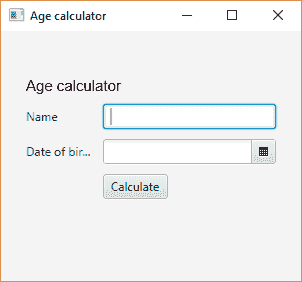

输入姓名和出生日期，点击`Calculate`查看年龄：

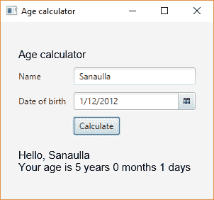

# 它是如何工作的。。。

在讨论其他细节之前，让我们简要概述一下 JavaFX 体系结构。我们从 JavaFX 文档（[中获取了描述体系结构堆栈的下图 http://docs.oracle.com/javase/8/javafx/get-started-tutorial/jfx-architecture.htm#JFXST788](http://docs.oracle.com/javase/8/javafx/get-started-tutorial/jfx-architecture.htm#JFXST788)：

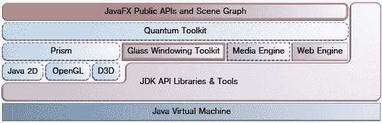

让我们从堆栈的顶部开始：

*   **JavaFXAPI 和场景图**：这是应用程序的起点，我们主要关注这一部分。这为不同的组件、布局和其他实用程序提供了 API，以便于开发基于 JavaFX 的 UI。场景图包含应用程序的视觉元素。
*   **Prism、Quantum Toolkit 和其他蓝色的东西**：这些组件管理 UI 的呈现，并提供底层操作系统和 JavaFX 之间的桥梁。当图形硬件无法提供丰富 UI 和 3D 元素的硬件加速渲染时，该层提供软件渲染。
*   **玻璃开窗工具包**：这是开窗工具包，就像 Swing 使用的 AWT 一样。
*   **媒体引擎**：支持 JavaFX 中的媒体。
*   **web 引擎**：支持 web 组件，允许完整的 HTML 呈现。
*   **JDK API 和 JVM**：它们与 Java API 集成，并将代码编译成字节码在 JVM 上运行。

让我们回到解释食谱上来。`javafx.application.Application`类是启动 JavaFX 应用程序的入口点。它有以下映射到应用程序生命周期的方法（按调用顺序）：

*   **`init()`**：实例化`javafx.application.Application`后立即调用此方法。您可以重写此方法以在应用程序启动之前进行一些初始化。默认情况下，此方法不执行任何操作。
*   `start(javafx.stage.Stage)`：此方法在`init()`之后以及系统完成运行应用程序所需的初始化后立即调用。此方法通过一个`javafx.stage.Stage`实例传递，该实例是渲染组件的主要阶段。您可以创建其他`javafx.stage.Stage`对象，但应用程序提供的是主阶段。
*   `stop()`：当应用程序应该停止时调用此方法。您可以执行必要的退出相关操作。

*阶段*是顶级 JavaFX 容器。作为参数传递给`start()`方法的主阶段由平台创建，应用程序可以根据需要创建其他`Stage`容器。

与`javafx.application.Application`相关的另一个重要方法是`launch()`方法。这有两种变体：

*   `launch(Class<? extends Application> appClass, String... args)`
*   `launch(String... args)`

此方法是从主方法调用的，只应调用一次。第一个变量采用扩展`javafx.application.Application`类的类的名称以及传递给 main 方法的参数，第二个变量不采用类的名称，而是应从扩展`javafx.application.Application`类的类中调用。在我们的食谱中，我们使用了第二种变体。

我们创建了一个类`CreateGuiDemo`，扩展了`javafx.application.Application`。这将是 JavaFXUI 的入口点，我们还向该类添加了一个 main 方法，使其成为应用程序的入口点。

布局构造决定了零部件的布局方式。JavaFX 支持多种布局，如下所示：

*   `javafx.scene.layout.HBox`和`javafx.scene.layout.VBox`：用于将组件水平和垂直对齐。
*   `javafx.scene.layout.BorderPane`：这允许将组件放置在顶部、右侧、底部、左侧和中心位置。
*   `javafx.scene.layout.FlowPane`：此布局允许将组件放置在流中，也就是说，除了彼此之外，在流窗格的边界处进行包裹。
*   `javafx.scene.layout.GridPane`：该布局允许将组件放置在行和列的网格中。
*   `javafx.scene.layout.StackPane`：此布局将组件放置在前后堆叠中。
*   `javafx.scene.layout.TilePane`：此布局将组件放置在大小一致的瓷砖网格中。

在我们的配方中，我们使用了`GridPane`并配置了布局，以便我们能够实现以下目标：

*   放置在中心的网格（`gridPane.setAlignment(Pos.CENTER);`
*   将立柱之间的间隙设置为 10（`gridPane.setHgap(10);`
*   将行间距设置为 10（`gridPane.setVgap(10);`
*   在网格单元内设置填充（`gridPane.setPadding(new Insets(25, 25, 25, 25));`

`javafx.scene.text.Text`组件的字体可以使用`javafx.scene.text.Font`对象进行设置，如图所示：`appTitle.setFont(Font.font("Arial", FontWeight.NORMAL, 15));`

在将组件添加到`javafx.scene.layout.GridPane`时，我们必须提到列号、行号和列跨度，即组件占用的列数，以及行跨度，即组件按该顺序占用的行数。列跨距和行跨距是可选的。在我们的配方中，我们将`appTitle`放在第一行和第一列，它占用两列空间和一行空间，如这里的代码所示：`appTitle.setFont(Font.font("Arial", FontWeight.NORMAL, 15));`

本配方的另一个重要部分是`ageCalculator`按钮事件的设置。我们使用`javafx.scene.control.Button`类的`setOnAction()`方法来设置单击按钮时执行的操作。这接受`javafx.event.EventHandler<ActionEvent>`接口的实现。由于`javafx.event.EventHandler`是一个功能接口，其实现可以写成 lambda 表达式的形式，如下图：

```java
ageCalculator.setOnAction((event) -> {
  //event handling code here
});
```

前面的语法看起来类似于 Swing 期间广泛使用的匿名内部类。您可以在第 4 章、*开始功能化*中的配方中了解更多关于功能接口和 lambda 表达式的信息。

在我们的事件处理代码中，我们分别使用`getText()`和`getValue()`方法从`nameField`和`dateOfBirthPicker`获取值。`DatePicker`返回选择作为`java.time.LocalDate`实例的日期。这是添加到 Java8 中的新日期时间 API 之一。它表示一个日期，即年、月和日，没有任何时区相关信息。然后，我们使用`java.time.Period`类查找当前日期和所选日期之间的持续时间，如下所示：

```java
LocalDate now = LocalDate.now();
Period period = Period.between(dob, now);
```

`Period`以年、月、日表示基于日期的持续时间，例如三年、两个月、三天。这正是我们试图用这行代码提取的内容：`String.format("Your age is %d years %d months %d days", period.getYears(), period.getMonths(), period.getDays())`。

我们已经提到，JavaFX 中的 UI 组件以场景图的形式表示，然后将该场景图渲染到一个名为`Stage`*的容器中。*创建场景图的方法是使用`javafx.scene.Scene`类。我们通过传递场景图的根并提供场景图将在其中渲染的容器的维度来创建一个`javafx.scene.Scene`实例。

我们使用提供给`start()`方法的容器，它只是`javafx.stage.Stage`的一个实例。为`Stage`对象设置场景，然后调用其`show()`方法，使完整的场景图呈现在显示器上：

```java
stage.setScene(scene);
stage.show();
```

# 使用 FXML 标记创建 GUI

在我们的第一个配方中，我们研究了如何使用 JavaAPI 构建 UI。经常发生的情况是，一个精通 Java 的人可能不是一个好的 UI 设计师；也就是说，他们可能不善于为自己的应用程序确定最佳用户体验。在 web 开发领域，我们有开发人员在前端工作，基于 UX 设计师给出的设计，还有其他开发人员在后端工作，以构建前端使用的服务。

开发者双方同意一组 API 和一个通用的数据交换模型。前端开发人员使用一些基于数据交换模型的模拟数据，并将 UI 与所需的 API 集成。另一方面，后端开发人员致力于实现 API，以便在商定的交换模型中返回数据。因此，双方同时工作，利用各自工作领域的专业知识。

如果能在桌面应用程序上复制（至少在某种程度上）同样的功能，那将是令人惊讶的。朝这个方向迈出的一步是引入了一种基于 XML 的语言，称为**FXML**。这支持一种声明式的 UI 开发方法，开发人员可以使用相同的 JavaFX 组件独立开发 UI，但可以作为 XML 标记使用。JavaFX 组件的不同属性作为 XML 标记的属性提供。事件处理程序可以在 Java 代码中声明和定义，然后从 FXML 引用。

在此配方中，我们将指导您使用 FXML 构建 UI，然后将 FXML 与 Java 代码集成，以绑定操作并启动 FXML 中定义的 UI。

# 准备

正如我们所知，JavaFX 库不是从 Oracle JDK 11 和 Open JDK 10 开始在 JDK 安装中提供的，我们必须从[下载 JavaFX SDKhttps://gluonhq.com/products/javafx/](https://gluonhq.com/products/javafx/) 并使用`-p`选项将 SDK 的`lib`文件夹中存在的 JAR 包含在模块化路径中，如图所示：

```java
javac -p "PATH_TO_JAVAFX_SDK_LIB" <other parts of the command line> 

#Windows
java -p "PATH_TO_JAVAFX_SDK_LIB;COMPILED_CODE" <other parts of the command line> 
#Linux 
java -p "PATH_TO_JAVAFX_SDK_LIB:COMPILED_CODE" <other parts of the command line> 
```

我们将开发一个简单的年龄计算器应用程序。此应用程序将询问用户的姓名（可选）及其出生日期，并计算从给定出生日期算起的年龄，并将其显示给用户。

# 怎么做。。。

1.  所有 FXML 文件都应该以`.fxml`扩展名结尾。让我们在位置`src/gui/com/packt`中创建一个空的`fxml_age_calc_gui.xml`文件。在后续步骤中，我们将使用 JavaFX 组件的 XML 标记更新此文件。
2.  创建一个`GridPane`布局，将所有组件放置在一个由行和列组成的网格中。我们还将使用`vgap`和`hgap`属性提供行和列之间所需的间距。此外，我们还将提供`GridPane`，这是我们的根组件，并引用 Java 类，我们将在其中添加所需的事件处理。该 Java 类类似于 UI 的控制器：

```java
        <GridPane alignment="CENTER" hgap="10.0" vgap="10.0"
          xmlns:fx="http://javafx.com/fxml"
          fx:controller="com.packt.FxmlController">
        </GridPane>
```

3.  我们将通过在`GridPane`内定义一个带有`Insets`的`padding`标记，在网格的每个单元格内提供填充：

```java
        <padding>
          <Insets bottom="25.0" left="25.0" right="25.0" top="25.0" />
        </padding>
```

4.  接下来是添加一个`Text`标记，它显示应用程序的标题—`Age Calculator`。我们在`style`属性中提供所需的样式信息，并使用`GridPane.columnIndex`和`GridPane.rowIndex`属性在`GridPane`中提供`Text`组件的位置。可以使用`GridPane.columnSpan`和`GridPane.rowSpan`属性提供小区占用信息：

```java
        <Text style="-fx-font: NORMAL 15 Arial;" text="Age calculator"
          GridPane.columnIndex="0" GridPane.rowIndex="0" 
          GridPane.columnSpan="2" GridPane.rowSpan="1">
        </Text>
```

5.  然后我们添加`Label`和`TextField`组件以接受名称。注意在`TextField`中使用了`fx:id`属性。这有助于在 Java 控制器中绑定此组件，方法是创建一个与`fx:id`值同名的字段：

```java
        <Label text="Name" GridPane.columnIndex="0" 
          GridPane.rowIndex="1">
        </Label>
        <TextField fx:id="nameField" GridPane.columnIndex="1" 
          GridPane.rowIndex="1">
        </TextField>
```

6.  我们添加了用于接受出生日期的`Label`和`DatePicker`组件：

```java
        <Label text="Date of Birth" GridPane.columnIndex="0" 
          GridPane.rowIndex="2">
        </Label>
        <DatePicker fx:id="dateOfBirthPicker" GridPane.columnIndex="1" 
          GridPane.rowIndex="2">
        </DatePicker>
```

7.  然后，我们添加一个`Button`对象，并将其`onAction`属性设置为 Java 控制器中处理该按钮点击事件的方法的名称：

```java
        <Button onAction="#calculateAge" text="Calculate"
          GridPane.columnIndex="1" GridPane.rowIndex="3">
        </Button>
```

8.  最后，我们添加一个`Text`组件来显示计算的年龄：

```java
        <Text fx:id="resultTxt" style="-fx-font: NORMAL 15 Arial;"
          GridPane.columnIndex="0" GridPane.rowIndex="5"
          GridPane.columnSpan="2" GridPane.rowSpan="1"
        </Text>
```

9.  下一步是实现 Java 类，它与前面步骤中创建的基于 XML 的 UI 组件直接相关。创建一个名为`FxmlController`的类。这将包含与 FXML UI 相关的代码；也就是说，它将包含对在 FXML 中创建的组件的 FXML 操作处理程序中创建的组件的引用：

```java
        public class FxmlController {
          //to implement in next few steps
        }
```

10.  我们需要参考`nameField`、`dateOfBirthPicker`和`resultText`组件。我们使用前两个分别获取输入的姓名和出生日期，第三个显示年龄计算结果：

```java
        @FXML private Text resultTxt;
        @FXML private DatePicker dateOfBirthPicker;
        @FXML private TextField nameField;
```

11.  下一步是实现`calculateAge`方法，该方法注册为`Calculate`按钮的动作事件处理程序。该实现类似于上一个配方中的实现。唯一的区别是，它是一种方法，不同于之前的配方，它是一个 lambda 表达式：

```java
        @FXML
        public void calculateAge(ActionEvent event){
          String name = nameField.getText();
          LocalDate dob = dateOfBirthPicker.getValue();
          if ( dob != null ){
            LocalDate now = LocalDate.now();
            Period period = Period.between(dob, now);
            StringBuilder resultBuilder = new StringBuilder();
            if ( name != null && name.length() > 0 ){
              resultBuilder.append("Hello, ")
                           .append(name)
                           .append("n");
            }
            resultBuilder.append(String.format(
              "Your age is %d years %d months %d days", 
              period.getYears(), 
              period.getMonths(), 
              period.getDays())
            );
            resultTxt.setText(resultBuilder.toString());
          }
        }
```

12.  在步骤 10 和 11 中，我们都使用了注释`@FXML`。此注释表示基于 FXML 的 UI 可以访问该类或成员。
13.  接下来，我们将创建另一个 Java 类`FxmlGuiDemo`，该类负责呈现基于 FXML 的 UI，也是启动应用程序的入口点：

```java
        public class FxmlGuiDemo extends Application{ 
          //code to launch the UI + provide main() method
        }
```

14.  现在我们需要通过覆盖`javafx.application.Application`类的`start(Stage stage)`方法，从 FXML UI 定义创建场景图，然后在传递的`javafx.stage.Stage`对象中渲染场景图：

```java
        @Override
        public void start(Stage stage) throws IOException{
          FXMLLoader loader = new FXMLLoader();
          Pane pane = (Pane)loader.load(getClass()
              .getModule()
              .getResourceAsStream("com/packt/fxml_age_calc_gui.fxml")
          );

          Scene scene = new Scene(pane,300, 250);
          stage.setTitle("Age calculator");
          stage.setScene(scene);
          stage.show();
        }
```

15.  最后，我们提供`main()`方法实现：

```java
        public static void main(String[] args) {
          Application.launch(args);
        }
```

完整的代码可在位置`Chapter16/2_fxml_gui`找到。

我们在`Chapter16/2_fxml_gui`中提供了两个运行脚本`run.bat`和`run.sh`。`run.bat`脚本用于在 Windows 上运行应用程序，`run.sh`脚本用于在 Linux 上运行应用程序。

使用`run.bat`或`run.sh`运行应用程序，您将看到 GUI，如以下屏幕截图所示：

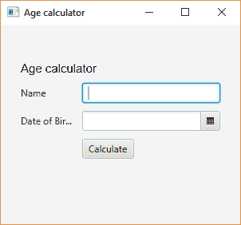

输入姓名和出生日期，点击`Calculate`查看年龄：

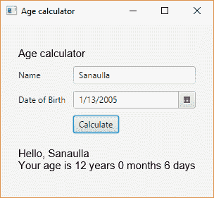

# 它是如何工作的。。。

没有 XSD 定义 FXML 文档的架构。因此，为了知道要使用的标记，它们遵循一个简单的命名约定。组件的 Java 类名也是 XML 标记的名称。例如，`javafx.scene.layout.GridPane`布局的 XML 标记为`<GridPane>`，`javafx.scene.control.TextField`为`<TextField>`，`javafx.scene.control.DatePicke`为`<DatePicker>`：

```java
Pane pane = (Pane)loader.load(getClass()
    .getModule()
    .getResourceAsStream("com/packt/fxml_age_calc_gui.fxml")
 );
```

前一行代码使用`javafx.fxml.FXMLLoader`实例读取 FXML 文件并获取 UI 组件的 Java 表示。`FXMLLoader`使用基于事件的 SAX 解析器解析 FXML 文件。XML 标记的各个 Java 类的实例通过反射创建，XML 标记的属性值填充到 Java 类的各个属性中。

因为我们的 FXML 的根是`javafx.scene.layout.GridPane`，它扩展了`javafx.scene.layout.Pane`，所以我们可以将返回值从`FXMLoader.load()`转换为`javafx.scene.layout.Pane`。

这个食谱中另一个有趣的东西是`FxmlController`类。此类充当 FXML 的接口。在 FXML 中，我们使用`<GridPane>`标记的`fx:controller`属性来表示相同的内容。我们可以通过对`FxmlController`类的成员字段使用`@FXML`注释来获得 FXML 中定义的 UI 组件，就像我们在本配方中所做的那样：

```java
@FXML private Text resultTxt;
@FXML private DatePicker dateOfBirthPicker;
@FXML private TextField nameField;
```

成员名称与 FXML 中`fx:id`属性值的名称相同，成员类型与 FXML 中标记的类型相同。例如，第一个成员绑定到以下对象：

```java
<Text fx:id="resultTxt" style="-fx-font: NORMAL 15 Arial;"
  GridPane.columnIndex="0" GridPane.rowIndex="5" 
  GridPane.columnSpan="2" GridPane.rowSpan="1">
</Text>
```

在类似的行中，我们在`FxmlController`中创建了一个事件处理程序，并用`@FXML`对其进行了注释，并且在 FXML 中用`onAction`属性`<Button>`引用了该事件处理程序。请注意，我们在`onAction`属性值中的方法名称开头添加了`#`。

# 使用 CSS 创建 JavaFX 中的样式元素

那些有 web 开发背景的人将能够欣赏到**级联样式表**（**CSS**）的有用性，对于那些没有的人，我们将在深入研究 JavaFX 中的 CSS 应用程序之前，概述一下它们是什么以及它们是如何有用的。

您在网页上看到的元素或组件通常根据网站的主题进行样式设置。通过使用名为**CSS**的语言，可以实现此样式。CSS 由一组由分号分隔的`name:value`对组成。这些`name:value`对，当与 HTML 元素关联时，比如说`<button>`，为它提供了所需的样式。

有多种方法可以将这些`name:value`对与元素关联，最简单的方法是将这个`name:value`对放在 HTML 元素的 style 属性中。例如，要为按钮提供蓝色背景，我们可以执行以下操作：

```java
<button style="background-color: blue;"></button>
```

不同的样式属性有预定义的名称，这些名称采用一组特定的值；也就是说，属性`background-color`将只接受有效的颜色值。

另一种方法是在具有`.css`扩展名的不同文件中定义这些`name:value`对组。让我们将这组`name:value`对称为**CSS 属性**。我们可以将这些 CSS 属性与不同的选择器相关联，也就是选择 HTML 页面上的元素以应用 CSS 属性的选择器。提供选择器的方式有三种：

1.  通过直接给出 HTML 元素的名称，即它是锚定标记（`<a>`）、按钮还是输入。在这种情况下，CSS 属性将应用于页面中所有类型的 HTML 元素。

2.  通过使用 HTML 元素的`id`属性。假设我们有一个带有`id="btn1"`的按钮，那么我们可以定义一个选择器`#btn1`，根据它我们提供 CSS 属性。请看以下示例：

```java
        #btn1 { background-color: blue; }
```

3.  通过使用 HTML 元素的 class 属性。假设我们有一个带有`class="blue-btn"`的按钮，那么我们可以定义一个选择器`.blue-btn`，根据它我们提供 CSS 属性。请查看以下示例：

```java
        .blue-btn { background-color: blue; }
```

使用不同 CSS 文件的优点是，我们可以独立地改变网页的外观，而不必与元素的位置紧密耦合。此外，这还鼓励跨不同页面重用 CSS 属性，从而使它们在所有页面上都具有统一的外观。

当我们对 JavaFX 应用类似的方法时，我们可以利用 web 设计师已经掌握的 CSS 知识为 JavaFX 组件构建 CSS，这有助于比使用 javaapi 更容易地设计组件的样式。当这个 CSS 与 FXML 混合使用时，它就成为 web 开发人员已知的领域。

在本食谱中，我们将介绍使用外部 CSS 文件设计一些 JavaFX 组件的样式。

# 准备

正如我们所知，JavaFX 库不是从 Oracle JDK 11 和 Open JDK 10 开始在 JDK 安装中提供的，我们必须从[下载 JavaFX SDKhttps://gluonhq.com/products/javafx/](https://gluonhq.com/products/javafx/) 并使用`-p`选项将 SDK 的`lib`文件夹中存在的 JAR 包含在模块化路径中，如图所示：

```java
javac -p "PATH_TO_JAVAFX_SDK_LIB" <other parts of the command line> 

#Windows
java -p "PATH_TO_JAVAFX_SDK_LIB;COMPILED_CODE" <other parts of the command line> 
#Linux 
java -p "PATH_TO_JAVAFX_SDK_LIB:COMPILED_CODE" <other parts of the command line> 
```

在定义 JavaFX 组件的 CSS 属性方面有一点不同。所有属性必须以`-fx-`为前缀，即`background-color`变为`-fx-background-color`。选择器，`#id`和`.class-name`在 JavaFX 世界中仍然保持不变。我们甚至可以为 JavaFX 组件提供多个类，从而将所有这些 CSS 属性应用于组件。

我在这个食谱中使用的 CSS 是基于一个流行的 CSS 框架，名为 [**Bootstrap**](http://getbootstrap.com/css/)。

# 怎么做。。。

1.  让我们创建`GridPane`，它将组件保存在一个由行和列组成的网格中：

```java
        GridPane gridPane = new GridPane();
        gridPane.setAlignment(Pos.CENTER);
        gridPane.setHgap(10);
        gridPane.setVgap(10);
        gridPane.setPadding(new Insets(25, 25, 25, 25));
```

2.  首先，我们将创建一个按钮并向其添加两个类：`btn`和`btn-primary`。在下一步中，我们将使用所需的 CSS 属性定义这些选择器：

```java
        Button primaryBtn = new Button("Primary");
        primaryBtn.getStyleClass().add("btn");
        primaryBtn.getStyleClass().add("btn-primary");
        gridPane.add(primaryBtn, 0, 1);
```

3.  现在，让我们为类`btn`和`btn-primary`提供所需的 CSS 属性。类的选择器的形式为`.<class-name>`：

```java
        .btn{
          -fx-border-radius: 4px;
          -fx-border: 2px;
          -fx-font-size: 18px;
          -fx-font-weight: normal;
          -fx-text-align: center;
        }
        .btn-primary {
          -fx-text-fill: #fff;
          -fx-background-color: #337ab7;
          -fx-border-color: #2e6da4;
        }
```

4.  让我们使用不同的 CSS 类创建另一个按钮：

```java
        Button successBtn = new Button("Sucess");
        successBtn.getStyleClass().add("btn");
        successBtn.getStyleClass().add("btn-success");
        gridPane.add(successBtn, 1, 1);
```

5.  现在我们为`.btn-success`选择器定义 CSS 属性，如下所示：

```java
        .btn-success {
          -fx-text-fill: #fff;
          -fx-background-color: #5cb85c;
          -fx-border-color: #4cae4c;
        }
```

6.  让我们用另一个 CSS 类创建另一个按钮：

```java
        Button dangerBtn = new Button("Danger");
        dangerBtn.getStyleClass().add("btn");
        dangerBtn.getStyleClass().add("btn-danger");
        gridPane.add(dangerBtn, 2, 1);
```

7.  我们将为选择器`.btn-danger`定义 CSS 属性：

```java
        .btn-danger {
          -fx-text-fill: #fff;
          -fx-background-color: #d9534f;
          -fx-border-color: #d43f3a;
        }
```

8.  现在，让我们添加一些具有不同选择器的标签，即`badge`和`badge-info`：

```java
        Label label = new Label("Default Label");
        label.getStyleClass().add("badge");
        gridPane.add(label, 0, 2);

        Label infoLabel = new Label("Info Label");
        infoLabel.getStyleClass().add("badge");
        infoLabel.getStyleClass().add("badge-info");
        gridPane.add(infoLabel, 1, 2);
```

9.  前面选择器的 CSS 属性如下所示：

```java
        .badge{
          -fx-label-padding: 6,7,6,7;
          -fx-font-size: 12px;
          -fx-font-weight: 700;
          -fx-text-fill: #fff;
          -fx-text-alignment: center;
          -fx-background-color: #777;
          -fx-border-radius: 4;
        }

        .badge-info{
          -fx-background-color: #3a87ad;
        }
        .badge-warning {
          -fx-background-color: #f89406;
        }
```

10.  让我们在`big-input`类中添加`TextField`：

```java
        TextField bigTextField = new TextField();
        bigTextField.getStyleClass().add("big-input");
        gridPane.add(bigTextField, 0, 3, 3, 1);
```

11.  我们定义 CSS 属性，以便文本框的内容大且颜色为红色：

```java
        .big-input{
          -fx-text-fill: red;
          -fx-font-size: 18px;
          -fx-font-style: italic;
          -fx-font-weight: bold;
        }
```

12.  让我们添加一些单选按钮：

```java
        ToggleGroup group = new ToggleGroup();
        RadioButton bigRadioOne = new RadioButton("First");
        bigRadioOne.getStyleClass().add("big-radio");
        bigRadioOne.setToggleGroup(group);
        bigRadioOne.setSelected(true);
        gridPane.add(bigRadioOne, 0, 4);
        RadioButton bigRadioTwo = new RadioButton("Second");
        bigRadioTwo.setToggleGroup(group);
        bigRadioTwo.getStyleClass().add("big-radio");
        gridPane.add(bigRadioTwo, 1, 4);
```

13.  我们定义 CSS 属性，以使单选按钮的标签大且颜色为绿色：

```java
        .big-radio{
          -fx-text-fill: green;
          -fx-font-size: 18px;
          -fx-font-weight: bold;
          -fx-background-color: yellow;
          -fx-padding: 5;
        }
```

14.  最后，我们将`javafx.scene.layout.GridPane`添加到场景图中，并在`javafx.stage.Stage`上渲染场景图。我们还需要将`stylesheet.css`与`Scene`关联起来：

```java
        Scene scene = new Scene(gridPane, 600, 500);
        scene.getStylesheets().add("com/packt/stylesheet.css");
        stage.setTitle("Age calculator");
        stage.setScene(scene);
        stage.show();
```

15.  添加`main()`方法启动 GUI：

```java
        public static void main(String[] args) {
          Application.launch(args);
        }
```

完整的代码可以在这里找到：`Chapter16/3_css_javafx`。

我们在`Chapter16/3_css_javafx`下提供了两个运行脚本`run.bat`和`run.sh`。`run.bat`将用于在 Windows 上运行应用程序，`run.sh`将用于在 Linux 上运行应用程序。

使用`run.bat`或`run.sh`运行应用程序，您将看到以下 GUI：

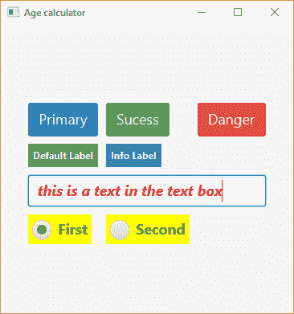

# 它是如何工作的。。。

在这个配方中，我们使用类名及其对应的 CSS 选择器将组件与不同的样式属性关联起来。JavaFX 支持 CSS 属性的子集，并且有不同的属性适用于不同类型的 JavaFX 组件。[JavaFX CSS 参考指南](http://docs.oracle.com/javase/8/javafx/api/javafx/scene/doc-files/cssref.html)将帮助您识别支持的 CSS 属性。

所有场景图节点都从抽象类`javax.scene.Node`扩展而来。这个抽象类提供了一个 API`getStyleClass()`，它返回添加到节点或 JavaFX 组件的类名列表（简单的`String`。由于这是一个简单的类名列表，我们甚至可以使用`getStyleClass().add("new-class-name")`向其中添加更多的类名。

使用类名的优点是，它允许我们用一个公共类名对相似的组件进行分组。这种技术在 web 开发世界中被广泛使用。假设我在 HTML 页面上有一个按钮列表，我希望在单击每个按钮时执行类似的操作。为了实现这一点，我将为每个按钮分配相同的类，比如说，`my-button`，然后使用`document.getElementsByClassName('my-button')`获得这些按钮的数组。现在，我们可以循环获得的按钮数组，并添加所需的操作处理程序。

将类分配给组件后，我们需要为给定的类名编写 CSS 属性。然后，这些属性将应用于具有相同类名的所有组件。

让我们从我们的配方中挑选一种成分，看看我们是如何设计它的。考虑以下两个组件，即 Tyt0}和 OutT1：

```java
primaryBtn.getStyleClass().add("btn");
primaryBtn.getStyleClass().add("btn-primary");
```

我们使用了选择器`.btn`和`.btn-primary`，并将所有 CSS 属性分组在这些选择器下，如下所示：

```java
.btn{
  -fx-border-radius: 4px;
  -fx-border: 2px;
  -fx-font-size: 18px;
  -fx-font-weight: normal;
  -fx-text-align: center;
}
```

```java
.btn-primary {
  -fx-text-fill: #fff;
  -fx-background-color: #337ab7;
  -fx-border-color: #2e6da4;
}
```

注意，在 CSS 中，我们有一个`color`属性，它在 JavaFX 中的等价物是`-fx-text-fill`。其他 CSS 属性，即`border-radius`、`border`、`font-size`、`font-weight`、`text-align`、`background-color`和`border-color`以`-fx-`为前缀。

重要的部分是如何将样式表与`Scene`组件相关联。

代码的`scene.getStylesheets().add("com/packt/stylesheet.css");`行将样式表与场景组件相关联。当`getStylesheets()`返回字符串列表时，我们可以向其中添加多个字符串，这意味着我们可以将多个样式表关联到一个场景。

`getStylesheets()`的文件说明如下：

URL 是[scheme:][//authority][path]形式的分层 URI。如果 URL 没有[scheme:]组件，则 URL 仅被视为[path]组件。忽略[path]的任何前导“/”字符，[path]被视为相对于应用程序类路径根的路径

在我们的配方中，我们只使用`path`组件，因此它在类路径中查找文件。这就是为什么我们将样式表添加到与场景相同的包中。这是一种在类路径上使其可用的更简单的方法。

# 创建条形图

当数据以表格的形式表示时，很难理解，但当数据以图表的形式表示时，眼睛会感到舒服，也很容易理解。我们已经看到很多用于 web 应用程序的图表库。但是，桌面应用程序前端缺少相同的支持。Swing 没有创建图表的本地支持，我们不得不依赖第三方应用程序，如**JFreeChart**（[）http://www.jfree.org/jfreechart/](http://www.jfree.org/jfreechart/) ）。不过，通过 JavaFX，我们对创建图表有本地支持，我们将向您展示如何使用 JavaFX 图表组件以图表的形式表示数据。

JavaFX 支持以下图表类型：

*   条形图
*   折线图
*   饼图
*   散点图
*   面积图
*   气泡图

在接下来的几个食谱中，我们将介绍每种图表类型的构造。将每种图表类型分离为自己的配方将有助于我们以更简单的方式解释配方，并有助于更好地理解。

这个食谱将是关于条形图的。示例条形图如下所示：

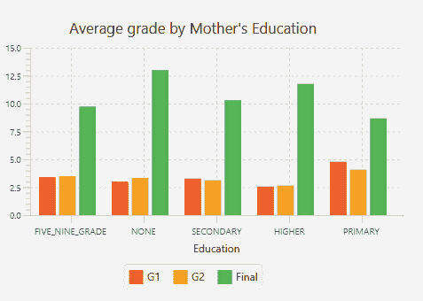

对于*x*轴上的每个值，条形图可以有单个条形图或多个条形图（如上图所示）。多个条帮助我们比较*x*轴上每个值的多个值点。

# 准备

我们知道，从 OracleJDK11 开始和从 OpenJDK10 开始，JavaFX 库都没有在 JDK 安装中提供，因此我们必须从这里下载 [JavaFXSDK](https://gluonhq.com/products/javafx/) 并使用`-p`选项将 SDK 的`lib`文件夹中存在的 JAR 包含在模块化路径中，如图所示：

```java
javac -p "PATH_TO_JAVAFX_SDK_LIB" <other parts of the command line> 

#Windows
java -p "PATH_TO_JAVAFX_SDK_LIB;COMPILED_CODE" <other parts of the command line> 
#Linux 
java -p "PATH_TO_JAVAFX_SDK_LIB:COMPILED_CODE" <other parts of the command line>
```

我们将利用学生成绩机器学习库（[中的一部分数据 https://archive.ics.uci.edu/ml/datasets/Student+性能](https://archive.ics.uci.edu/ml/datasets/Student+Performance)）。该数据集包括学生在数学和葡萄牙语两门学科的成绩，以及他们的社会背景信息，如父母的职业和教育等信息。数据集中有很多属性，但我们将选择以下内容：

*   学生性别
*   学生年龄
*   父亲的教育
*   父亲的职业
*   母亲的教育
*   母亲的职业
*   学生是否参加了额外的课程
*   第一学期成绩
*   第二学期成绩
*   期末成绩

正如我们前面提到的，数据中捕获了很多属性，但是我们应该熟悉一些重要的属性，这些属性将帮助我们绘制一些有用的图表。因此，我们将机器学习库中可用数据集的信息提取到一个单独的文件中，该文件可在本书代码下载的`Chapter16/4_bar_charts/src/gui/com/packt/students`中找到。学生档案摘录如下：

```java
"F";18;4;4;"at_home";"teacher";"no";"5";"6";6
"F";17;1;1;"at_home";"other";"no";"5";"5";6
"F";15;1;1;"at_home";"other";"yes";"7";"8";10
"F";15;4;2;"health";"services";"yes";"15";"14";15
"F";16;3;3;"other";"other";"yes";"6";"10";10
"M";16;4;3;"services";"other";"yes";"15";"15";15
```

条目用分号（`;`分隔。每个条目都解释了它所代表的内容。教育信息（字段 3 和 4）是一个数值，其中每个数字表示教育水平，如下所示：

*   `0`：无
*   `1`：小学教育（四年级）
*   `2`：五至九年级
*   `3`：中等教育
*   `4`：高等教育

我们已经创建了一个用于处理学生文件的模块。模块名称为`student.processor`，其代码可在`Chapter16/101_student_data_processor`找到。因此，如果您想更改那里的任何代码，您可以通过运行`build-jar.bat`或`build-jar.sh`文件来重建 JAR。这将在`mlib`目录中创建一个模块化 JAR`student.processor.jar`。然后，你必须用这个配方的`mlib`目录中的一个，即`Chapter16/4_bar_charts/mlib`来替换这个模块化JAR。

我们建议您从`Chapter16/101_student_data_processor`中提供的源代码构建`student.processor`模块化 jar。我们提供了`build-jar.bat`和`build-jar.sh`脚本来帮助您构建 JAR。您只需运行与平台相关的脚本，然后将`101_student_data_processor/mlib`中的 jar 构建复制到`4_bar_charts/mlib`。

这样，我们可以在所有涉及图表的配方中重用此模块。

# 怎么做。。。

1.  首先，创建`GridPane`并将其配置为放置我们将要创建的图表：

```java
        GridPane gridPane = new GridPane();
        gridPane.setAlignment(Pos.CENTER);
        gridPane.setHgap(10);
        gridPane.setVgap(10);
        gridPane.setPadding(new Insets(25, 25, 25, 25));
```

2.  使用`student.processor`模块中的`StudentDataProcessor`类解析学生文件，并将数据加载到`Student`的`List`中：

```java
        StudentDataProcessor sdp = new StudentDataProcessor();
        List<Student> students = sdp.loadStudent();
```

3.  原始数据，即`Student`对象列表，对于绘制图表没有用处，因此我们需要根据学生母亲和父亲的教育程度对学生进行分组，并计算这些学生的平均成绩（所有三个学期），以处理学生的成绩。为此，我们将编写一个简单的方法，该方法接受`List<Student>`、一个分组函数（即学生需要分组的值）和一个映射函数（即必须用于计算平均值的值）：

```java
        private Map<ParentEducation, IntSummaryStatistics> summarize(
          List<Student> students,
          Function<Student, ParentEducation> classifier,
          ToIntFunction<Student> mapper
        ){
          Map<ParentEducation, IntSummaryStatistics> statistics =
            students.stream().collect(
              Collectors.groupingBy(
                classifier,
                Collectors.summarizingInt(mapper)
              )
          );
          return statistics;
        }
```

前面的方法使用新的基于流的 API。这些 API 非常强大，他们使用`Collectors.groupingBy()`对学生进行分组，然后使用`Collectors.summarizingInt()`计算他们的成绩统计。

4.  条形图的数据作为`XYChart.Series`的实例提供。对于给定的*x*值，每个系列产生一个*y*值，对于给定的*x*值，这是一个 bar。我们将有多个系列，每个学期一个，即第一学期成绩、第二学期成绩和最后一个成绩。让我们创建一个方法，该方法接受每个学期成绩和`seriesName`的统计信息，并返回一个`series`对象：

```java
        private XYChart.Series<String,Number> getSeries(
            String seriesName,
            Map<ParentEducation, IntSummaryStatistics> statistics
        ){
         XYChart.Series<String,Number> series = new XYChart.Series<>();
          series.setName(seriesName);
          statistics.forEach((k, v) -> {
            series.getData().add(
              new XYChart.Data<String, Number>(
                k.toString(),v.getAverage()
              )
            );
          });
          return series;
        }
```

5.  我们将创建两个条形图，一个用于母亲教育的平均成绩，另一个用于父亲教育的平均成绩。为此，我们将创建一个采用`List<Student>`的方法和一个分类器，也就是说，一个返回用于对学生分组的值的函数。此方法将执行必要的计算并返回一个`BarChart`对象：

```java
       private BarChart<String, Number> getAvgGradeByEducationBarChart(
          List<Student> students,
          Function<Student, ParentEducation> classifier
        ){
          final CategoryAxis xAxis = new CategoryAxis();
          final NumberAxis yAxis = new NumberAxis();
          final BarChart<String,Number> bc = 
                new BarChart<>(xAxis,yAxis);
          xAxis.setLabel("Education");
          yAxis.setLabel("Grade");
          bc.getData().add(getSeries(
            "G1",
            summarize(students, classifier, Student::getFirstTermGrade)
          ));
          bc.getData().add(getSeries(
            "G2",
           summarize(students, classifier, Student::getSecondTermGrade)
          ));
          bc.getData().add(getSeries(
            "Final",
            summarize(students, classifier, Student::getFinalGrade)
          ));
          return bc;
        }
```

6.  为母亲教育的平均成绩创建`BarChart`，并将其添加到`gridPane`：

```java
        BarChart<String, Number> avgGradeByMotherEdu = 
            getAvgGradeByEducationBarChart(
              students, 
              Student::getMotherEducation
            );
        avgGradeByMotherEdu.setTitle(
            "Average grade by Mother's Education"
        );
        gridPane.add(avgGradeByMotherEdu, 1,1);
```

7.  为父亲教育的平均成绩创建`BarChart`并将其添加到`gridPane`：

```java
        BarChart<String, Number> avgGradeByFatherEdu = 
            getAvgGradeByEducationBarChart(
              students, 
              Student::getFatherEducation
            );
        avgGradeByFatherEdu.setTitle(
            "Average grade by Father's Education");
        gridPane.add(avgGradeByFatherEdu, 2,1);
```

8.  使用`gridPane`创建场景图并将其设置为`Stage`：

```java
        Scene scene = new Scene(gridPane, 800, 600);
        stage.setTitle("Bar Charts");
        stage.setScene(scene);
        stage.show();
```

完整代码可在`Chapter16/4_bar_charts`找到。

我们在`Chapter16/4_bar_charts`下提供了两个运行脚本：`run.bat`和`run.sh`。`run.bat`脚本用于在 Windows 上运行应用程序，`run.sh`脚本用于在 Linux 上运行应用程序。

使用`run.bat`或`run.sh`运行应用程序，您将看到以下 GUI：

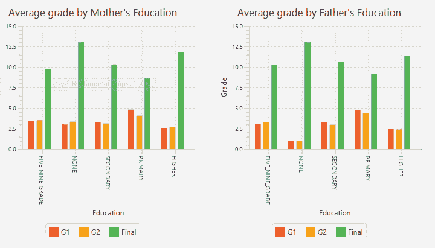

# 它是如何工作的。。。

我们先来看看创建`BarChart`需要什么。`BarChart`是基于两个轴的图表，其中数据绘制在两个轴上，即*x*轴（水平轴）和*y*轴（垂直轴）。其他两个基于轴的图表是面积图、气泡图和折线图。

在 JavaFX 中，支持两种类型的轴：

*   `javafx.scene.chart.CategoryAxis`：支持轴上的字符串值
*   `javafx.scene.chart.NumberAxis`：支持轴上的数值

在我们的配方中，我们创建了`BarChart`，其中`CategoryAxis`为*x*轴，我们在其中绘制教育，`NumberAxis`为*y*轴，我们在其中绘制年级，如下所示：

```java
final CategoryAxis xAxis = new CategoryAxis();
final NumberAxis yAxis = new NumberAxis();
final BarChart<String,Number> bc = new BarChart<>(xAxis,yAxis);
xAxis.setLabel("Education");
yAxis.setLabel("Grade");
```

在接下来的几段中，我们将向您展示`BarChart`的绘图过程。

`BarChart`上绘制的数据应该是一对值，每对值代表*（x，y）*值，即*x*轴上的一点和*y*轴上的一点。这对值由`javafx.scene.chart.XYChart.Data`表示。`Data`是`XYChart`中的嵌套类，表示基于双轴的图表的单个数据项。`XYChart.Data`对象可以非常简单地创建，如下所示：

```java
XYChart.Data item = new XYChart.Data("Cat1", "12");
```

这只是一个数据项。图表可以有多个数据项，即一系列数据项。为了表示一系列数据项，JavaFX 提供了一个名为`javafx.scene.chart.XYChart.Series`的类。这个`XYChart.Series`对象是`XYChart.Data`项的命名系列。让我们创建一个简单的系列，如下所示：

```java
XYChart.Series<String,Number> series = new XYChart.Series<>();
series.setName("My series");
series.getData().add(
  new XYChart.Data<String, Number>("Cat1", 12)
);
series.getData().add(
  new XYChart.Data<String, Number>("Cat2", 3)
);
series.getData().add(
  new XYChart.Data<String, Number>("Cat3", 16)
);
```

`BarChart`可以有多个系列的数据项。如果我们提供多个系列，那么*x*轴上的每个数据点都会有多个条形图。为了演示这是如何工作的，我们将使用一个系列。但是我们配方中的`BarChart`类使用多个系列。让我们将该系列添加到`BarChart`中，然后将其渲染到屏幕上：

```java
bc.getData().add(series);
Scene scene = new Scene(bc, 800, 600);
stage.setTitle("Bar Charts");
stage.setScene(scene);
stage.show();
```

结果如下表所示：

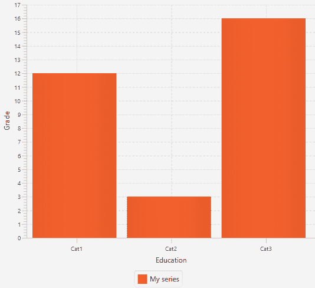

这个食谱的另一个有趣的部分是根据父母的教育程度对学生进行分组，然后计算他们第一学期、第二学期和最后一学期的平均成绩。进行分组和平均计算的代码如下所示：

```java
Map<ParentEducation, IntSummaryStatistics> statistics =
        students.stream().collect(
  Collectors.groupingBy(
    classifier,
    Collectors.summarizingInt(mapper)
  )
);
```

上述代码执行以下操作：

*   它从`List<Student>`创建一个流。
*   它使用`collect()`方法将该流减少到所需的分组。
*   `collect()`的一个重载版本采用两个参数。第一个是返回学生需要分组的值的函数。第二个参数是一个附加的映射函数，它将分组的学生对象映射为所需的格式。在我们的例子中，所需的格式是为该组学生获取`IntSummaryStatistics`的任何分数值。

前两部分（为条形图设置数据和创建填充`BarChart`实例所需的对象）是配方的重要部分；了解它们会让你对配方有一个更清晰的了解。

# 创建饼图

顾名思义，饼图是带有切片（连接或分离）的圆形图表，其中每个切片及其大小表示切片所代表项目的大小。饼图用于比较不同类别、类别、产品等的大小。以下是示例饼图的外观：

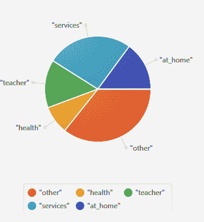

# 准备

我们知道，从 OracleJDK11 开始和从 OpenJDK10 开始，JavaFX 库都没有在 JDK 安装中提供，因此我们必须从这里下载 [JavaFXSDK](https://gluonhq.com/products/javafx/) 并使用`-p`选项将 SDK 的`lib`文件夹中存在的 JAR 包含在模块化路径中，[如图所示](https://gluonhq.com/products/javafx/)：

```java
javac -p "PATH_TO_JAVAFX_SDK_LIB" <other parts of the command line> 

#Windows
java -p "PATH_TO_JAVAFX_SDK_LIB;COMPILED_CODE" <other parts of the command line> 
#Linux 
java -p "PATH_TO_JAVAFX_SDK_LIB:COMPILED_CODE" <other parts of the command line>
```

我们将使用我们在*配方中讨论过的相同的学生数据（从机器学习库中获取并在我们这里处理），创建一个条形图*配方。为此，我们创建了一个模块`student.processor`，它将读取学生数据并向我们提供`Student`对象列表。模块的源代码可在`Chapter16/101_student_data_processor`中找到。我们已经为本配方代码的`Chapter16/5_pie_charts/mlib`处的`student.processor`模块提供了模块化 jar。

我们建议您从`Chapter16/101_student_data_processor`中提供的源代码构建`student.processor`模块化 jar。我们提供了`build-jar.bat`和`build-jar.sh`脚本来帮助您构建 jar。您只需运行与平台相关的脚本，然后将`101_student_data_processor/mlib`中的 jar 构建复制到`4_bar_charts/mlib`。

# 怎么做。。。

1.  让我们首先创建并配置`GridPane`来保存饼图：

```java
        GridPane gridPane = new GridPane();
        gridPane.setAlignment(Pos.CENTER);
        gridPane.setHgap(10);
        gridPane.setVgap(10);
        gridPane.setPadding(new Insets(25, 25, 25, 25));
```

2.  创建一个`StudentDataProcessor`实例（来自`student.processor`模块）并使用它加载`Student`的`List`：

```java
        StudentDataProcessor sdp = new StudentDataProcessor();
        List<Student> students = sdp.loadStudent();
```

3.  现在我们需要根据学生母亲和父亲的职业来统计学生人数。我们将编写一个方法，该方法将获取一个学生列表和一个分类器，即返回学生需要分组的值的函数。该方法返回一个`PieChart`实例：

```java
        private PieChart getStudentCountByOccupation(
            List<Student> students,
            Function<Student, String> classifier
        ){
          Map<String, Long> occupationBreakUp = 
                  students.stream().collect(
            Collectors.groupingBy(
              classifier,
              Collectors.counting()
            )
          );
          List<PieChart.Data> pieChartData = new ArrayList<>();
          occupationBreakUp.forEach((k, v) -> {
            pieChartData.add(new PieChart.Data(k.toString(), v));
          });
          PieChart chart = new PieChart(
            FXCollections.observableList(pieChartData)
          );
          return chart;
        }
```

4.  我们将调用前面的方法两次，一次使用母亲的职业作为分类器，另一次使用父亲的职业作为分类器。然后我们将返回的`PieChart`实例添加到`gridPane`。这应在`start()`方法内完成：

```java
        PieChart motherOccupationBreakUp = 
        getStudentCountByOccupation(
          students, Student::getMotherJob
        );
        motherOccupationBreakUp.setTitle("Mother's Occupation");
        gridPane.add(motherOccupationBreakUp, 1,1);

        PieChart fatherOccupationBreakUp = 
        getStudentCountByOccupation(
          students, Student::getFatherJob
        );
        fatherOccupationBreakUp.setTitle("Father's Occupation");
        gridPane.add(fatherOccupationBreakUp, 2,1);
```

5.  下一步是使用`gridPane`创建场景图并将其添加到`Stage`：

```java
        Scene scene = new Scene(gridPane, 800, 600);
        stage.setTitle("Pie Charts");
        stage.setScene(scene);
        stage.show();
```

6.  通过调用`Application.launch`方法，可以从主方法启动 UI：

```java
        public static void main(String[] args) {
          Application.launch(args);
        }
```

完整代码可在`Chapter16/5_pie_charts`找到。

我们在`Chapter16/5_pie_charts`下提供了两个运行脚本`run.bat`和`run.sh`。`run.bat`脚本用于在 Windows 上运行应用程序，`run.sh`脚本用于在 Linux 上运行应用程序。

使用`run.bat`或`run.sh`运行应用程序，您将看到以下 GUI：

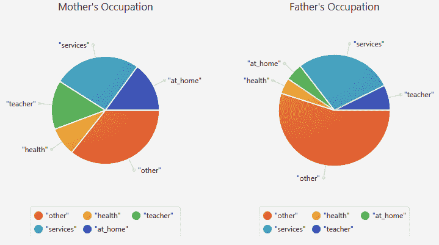

# 它是如何工作的。。。

在这个配方中，完成所有工作的最重要方法是`getStudentCountByOccupation()`。它做了以下工作：

1.  它按专业对学生人数进行分组。这可以使用新的流式 API（作为 Java 8 的一部分添加）的强大功能在一行代码中完成：

```java
        Map<String, Long> occupationBreakUp = 
                    students.stream().collect(
          Collectors.groupingBy(
            classifier,
            Collectors.counting()
          )
        );
```

2.  `PieChart`所需的构建数据。`PieChart`实例的数据为`PieChart.Data`的`ObservableList`。我们首先利用上一步得到的`Map`创建`PieChart.Data`的`ArrayList`。然后，我们使用`FXCollections.observableList()`API 从`List<PieChart.Data>`获取`ObservableList<PieChart.Data>`：

```java
        List<PieChart.Data> pieChartData = new ArrayList<>();
        occupationBreakUp.forEach((k, v) -> {
          pieChartData.add(new PieChart.Data(k.toString(), v));
        });
        PieChart chart = new PieChart(
          FXCollections.observableList(pieChartData)
        );
```

食谱中另一个重要的东西是我们使用的分类器：`Student::getMotherJob`和`Student::getFatherJob`。这是在`Student`列表中`Student`的不同实例上调用`getMotherJob`和`getFatherJob`方法的两个方法引用。

一旦我们得到了`PieChart`实例，我们将它们添加到`GridPane`中，然后使用`GridPane`构建场景图。场景图必须与`Stage`关联，才能在屏幕上渲染。

main 方法通过调用`Application.launch(args);`方法来启动 UI。

JavaFX 提供用于创建不同类型图表的 API，如以下图表：

*   面积图
*   气泡图
*   线型图
*   散点图

所有这些图表都是基于*x*和*y*轴的图表，可以像条形图一样构建。我们提供了一些示例实现来创建这些类型的图表，它们可以在以下位置找到：`Chapter16/5_2_area_charts`、`Chapter16/5_3_line_charts`、`Chapter16/5_4_bubble_charts`和`Chapter16/5_5_scatter_charts`。

# 在应用程序中嵌入 HTML

JavaFX 支持通过`javafx.scene.web`包中定义的类管理网页。它支持通过接受网页 URL 或接受网页内容来加载网页。它还管理 web 页面的文档模型，应用相关 CSS，并运行相关 JavaScript 代码。它还扩展了对 JavaScript 和 Java 代码之间双向通信的支持。

在此配方中，我们将构建一个非常原始和简单的 web 浏览器，它支持以下功能：

*   浏览所访问页面的历史记录
*   重新加载当前页面
*   用于接受 URL 的地址栏
*   用于加载输入的 URL 的按钮
*   显示网页
*   显示网页的加载状态

# 准备

正如我们所知，JavaFX 库不是从 OracleJDK11 和 OpenJDK10 开始在 JDK 安装中提供的，我们必须从这里下载 [JavaFXSDK](https://gluonhq.com/products/javafx/) 并使用`-p`选项将 SDK 的`lib`文件夹中存在的 JAR 包含在模块化路径中，如图所示：

```java
javac -p "PATH_TO_JAVAFX_SDK_LIB" <other parts of the command line> 

#Windows
java -p "PATH_TO_JAVAFX_SDK_LIB;COMPILED_CODE" <other parts of the command line> 
#Linux 
java -p "PATH_TO_JAVAFX_SDK_LIB:COMPILED_CODE" <other parts of the command line>
```

我们将需要一个互联网连接来测试网页的加载。因此，请确保您已连接到 internet。除此之外，使用此配方不需要任何具体要求。

# 怎么做。。。

1.  让我们首先创建一个带有空方法的类，它将表示用于启动应用程序以及 JavaFXUI 的主应用程序：

```java
        public class BrowserDemo extends Application{
          public static void main(String[] args) {
            Application.launch(args);
          }
          @Override
          public void start(Stage stage) {
            //this will have all the JavaFX related code
          }
        }
```

在接下来的步骤中，我们将在`start(Stage stage)`方法中编写所有代码。

2.  让我们创建一个`javafx.scene.web.WebView`组件，它将呈现我们的网页。这有所需的`javafx.scene.web.WebEngine`实例，用于管理网页的加载：

```java
        WebView webView = new WebView();
```

3.  获取`webView`使用的`javafx.scene.web.WebEngine`实例。我们将使用`javafx.scene.web.WebEngine`的这个实例浏览历史记录并加载其他网页。然后，默认情况下，我们将加载 [URL](http://www.google.com)：

```java
        WebEngine webEngine = webView.getEngine();
        webEngine.load("http://www.google.com/");
```

4.  现在让我们创建一个`javafx.scene.control.TextField`组件，它将充当浏览器的地址栏：

```java
        TextField webAddress = new
        TextField("http://www.google.com/");
```

5.  我们希望根据完全加载的网页的标题和 URL，在地址栏中更改浏览器和网页的标题。这可以通过监听从`javafx.scene.web.WebEngine`实例获得的`javafx.concurrent.Worker`的`stateProperty`的变化来实现：

```java
        webEngine.getLoadWorker().stateProperty().addListener(
          new ChangeListener<State>() {
            public void changed(ObservableValue ov, 
                                State oldState, State newState) {
              if (newState == State.SUCCEEDED) {
                stage.setTitle(webEngine.getTitle());
                webAddress.setText(webEngine.getLocation());
              }
            }
          }
        );
```

6.  让我们创建一个`javafx.scene.control.Button`实例，点击后将加载地址栏中输入的 URL 标识的网页：

```java
        Button goButton = new Button("Go");
        goButton.setOnAction((event) -> {
          String url = webAddress.getText();
          if ( url != null && url.length() > 0){
            webEngine.load(url);
          }
        });
```

7.  让我们创建一个`javafx.scene.control.Button`实例，单击该实例将转到历史记录中的上一个网页。为了实现这一点，我们将从操作处理程序中执行 JavaScript 代码`history.back()`：

```java
        Button prevButton = new Button("Prev");
        prevButton.setOnAction(e -> {
          webEngine.executeScript("history.back()");
        });
```

8.  让我们创建一个`javafx.scene.control.Button`实例，点击该实例，将转到`javafx.scene.web.WebEngine`实例维护的历史记录中的下一个条目。为此，我们将使用`javafx.scene.web.WebHistory`API：

```java
        Button nextButton = new Button("Next");
        nextButton.setOnAction(e -> {
          WebHistory wh = webEngine.getHistory();
          Integer historySize = wh.getEntries().size();
          Integer currentIndex = wh.getCurrentIndex();
          if ( currentIndex < (historySize - 1)){
            wh.go(1);
          }
        });
```

9.  下一步是用于重新加载当前页面的按钮。再次，我们将使用`javafx.scene.web.WebEngine`重新加载当前页面：

```java
        Button reloadButton = new Button("Refresh");
        reloadButton.setOnAction(e -> {
          webEngine.reload();
        });
```

10.  现在我们需要对迄今为止创建的所有组件进行分组，即，`prevButton`、`nextButton`、`reloadButton`、`webAddress`和`goButton`，以便它们彼此水平对齐。为了实现这一点，我们将使用具有相关间距和填充的`javafx.scene.layout.HBox`使组件看起来间隔良好：

```java
        HBox addressBar = new HBox(10);
        addressBar.setPadding(new Insets(10, 5, 10, 5));
        addressBar.setHgrow(webAddress, Priority.ALWAYS);
        addressBar.getChildren().addAll(
          prevButton, nextButton, reloadButton, webAddress, goButton
        );
```

11.  我们想知道网页是否正在加载以及是否已完成。让我们创建一个`javafx.scene.layout.Label`字段来更新网页加载时的状态。然后我们监听`javafx.concurrent.Worker`实例的`workDoneProperty`更新，我们可以从`javafx.scene.web.WebEngine`实例中得到：

```java
Label websiteLoadingStatus = new Label();
webEngine
  .getLoadWorker()
  .workDoneProperty()
  .addListener(
    new ChangeListener<Number>(){

      public void changed(
        ObservableValue ov, 
        Number oldState, 
        Number newState
      ) {
        if (newState.doubleValue() != 100.0){
          websiteLoadingStatus.setText(
            "Loading " + webAddress.getText());
        }else{
          websiteLoadingStatus.setText("Done");
        }
      }

    }
  );
```

12.  让我们将整个地址栏（及其导航按钮）、`webView`和`websiteLoadingStatus`垂直对齐：

```java
        VBox root = new VBox();
        root.getChildren().addAll(
          addressBar, webView, websiteLoadingStatus
        );
```

13.  创建一个新的`Scene`对象，将上一步创建的`VBox`实例作为根：

```java
        Scene scene = new Scene(root);
```

14.  我们希望`javafx.stage.Stage`实例占据整个屏幕大小；为此，我们将使用`Screen.getPrimary().getVisualBounds()`。然后，像往常一样，我们将在舞台上渲染场景图：

```java
        Rectangle2D primaryScreenBounds = 
                    Screen.getPrimary().getVisualBounds();
        stage.setTitle("Web Browser");
        stage.setScene(scene);
        stage.setX(primaryScreenBounds.getMinX());
        stage.setY(primaryScreenBounds.getMinY());
        stage.setWidth(primaryScreenBounds.getWidth());
        stage.setHeight(primaryScreenBounds.getHeight());
        stage.show();
```

完整代码可在位置`Chapter16/6_embed_html`找到。

我们在`Chapter16/6_embed_html`下提供了两个运行脚本`run.bat`和`run.sh`。`run.bat`脚本用于在 Windows 上运行应用程序，`run.sh`脚本用于在 Linux 上运行应用程序。

使用`run.bat`或`run.sh`运行应用程序，您将看到以下 GUI：


# 它是如何工作的。。。

与 web 相关的 API 在`javafx.web`模块中提供，因此我们需要在`module-info`中提供：

```java
module gui{
  requires javafx.controls;
  requires javafx.web;
  opens com.packt;
}
```

以下是在处理 JavaFX 中的网页时`javafx.scene.`web 包中的重要类：

*   `WebView`：此 UI 组件使用`WebEngine`管理网页的加载、呈现和交互。
*   `WebEngine`：这是处理加载和管理网页的主要组件。
*   `WebHistory`：记录当前`WebEngine`实例中访问的网页。
*   `WebEvent`：这些是传递给 JavaScript 事件调用的`WebEngine`事件处理程序的实例。

在我们的食谱中，我们使用前三类。

我们不直接创建`WebEngine`的实例；相反，我们使用`WebView`获取对其管理的`WebEngine`实例的引用。`WebEngine`实例通过向`javafx.concurrent.Worker`实例提交页面加载任务，异步加载网页。然后，我们在这些工作者实例属性上注册更改侦听器，以跟踪加载网页的进度。我们在这个配方中使用了两个这样的特性，即`stateProperty`和`workDoneProperty`。前者跟踪工人状态的变化，后者跟踪完成工作的百分比。

工人可以经历以下状态（如`javafx.concurrent.Worker.State`枚举中所列）：

*   `CANCELLED`
*   `FAILED`
*   `READY`
*   `RUNNING`
*   `SCHEDULED`
*   `SUCCEEDED`

在我们的配方中，我们只检查`SUCCEEDED`，但您也可以将其增强为检查`FAILED`。这将帮助我们报告无效的 URL，甚至从事件对象获取消息并将其显示给用户。

我们添加侦听器以跟踪属性的更改的方式是使用`*Property()`上的`addListener()`方法，其中`*`可以是`state`、`workDone`或作为属性公开的工作人员的任何其他属性：

```java
webEngine
  .getLoadWorker()
  .stateProperty()
  .addListener( 
    new ChangeListener<State>() {
      public void changed(ObservableValue ov, 
       State oldState, State newState) {
         //event handler code here
       }
    }
);

webEngine
  .getLoadWorker()
  .workDoneProperty()
  .addListener(
    new ChangeListener<Number>(){
      public void changed(ObservableValue ov, 
        Number oldState, Number newState) {
          //event handler code here
      }
   }
);
```

那么`javafx.scene.web.WebEngine`组件还支持以下功能：

*   重新加载当前页面
*   获取由它加载的页面的历史记录
*   执行 JavaScript 代码
*   侦听 JavaScript 属性，例如显示警报框或确认框
*   使用`getDocument()`方法与网页的文档模型交互

在这个配方中，我们还使用了从`WebEngine`中获得的`WebHistory`。`WebHistory`存储给定`WebEngine`实例加载的网页，即一个`WebEngine`实例将有一个`WebHistory`实例。`WebHistory`支持以下功能：

*   使用`getEntries()`方法获取条目列表。这也将为我们提供历史记录中的条目数量。这是在历史上向前和向后导航时所必需的；否则，我们将得到一个索引越界异常。
*   获取`currentIndex`，即其在`getEntries()`列表中的索引。
*   导航到`WebHistory`的条目列表中的特定条目。这可以通过使用接受偏移的`go()`方法来实现。此偏移指示相对于当前位置要加载的网页。例如，*+1*表示下一个条目，*-1*表示上一个条目。检查边界条件很重要；否则，您将在*0*之前结束，即*-1*之前，或超过条目列表大小。

# 还有更多。。。

在这个配方中，我们向您展示了使用 JavaFX 提供的支持创建 web 浏览器的基本方法。您可以对此进行增强以支持以下内容：

*   更好的错误处理和用户消息，即通过跟踪工作进程的状态更改来显示 web 地址是否有效
*   多选项卡
*   书签
*   本地存储浏览器的状态，以便下次运行时加载所有书签和历史记录

# 在应用程序中嵌入媒体

JavaFX 提供了一个组件`javafx.scene.media.MediaView`，用于观看视频和收听音频。该组件由媒体引擎`javafx.scene.media.MediaPlayer`支持，该引擎加载并管理媒体的播放。

在本教程中，我们将介绍如何播放示例视频，并使用媒体引擎上的方法控制其播放。

# 准备

正如我们所知，JavaFX 库不是从 OracleJDK11 和 OpenJDK10 开始在 JDK 安装中提供的，我们必须从这里下载 [JavaFXSDK](https://gluonhq.com/products/javafx/) 并使用此处显示的`-p`选项将 SDK 的`lib`文件夹中存在的 JAR 包含在模块化路径中：

```java
javac -p "PATH_TO_JAVAFX_SDK_LIB" <other parts of the command line> 

#Windows
java -p "PATH_TO_JAVAFX_SDK_LIB;COMPILED_CODE" <other parts of the command line> 
#Linux 
java -p "PATH_TO_JAVAFX_SDK_LIB:COMPILED_CODE" <other parts of the command line>
```

我们将利用`Chapter16/7_embed_audio_video/sample_video1.mp4`提供的示例视频。

# 怎么做。。。

1.  让我们首先创建一个带有空方法的类，它将表示用于启动应用程序以及 JavaFXUI 的主应用程序：

```java
        public class EmbedAudioVideoDemo extends Application{
          public static void main(String[] args) {
            Application.launch(args);
          }
          @Override
          public void start(Stage stage) {
            //this will have all the JavaFX related code
          }
        }
```

2.  为位于`Chapter16/7_embed_audio_video/sample_video1.mp4`的视频创建一个`javafx.scene.media.Media`对象：

```java
        File file = new File("sample_video1.mp4");
        Media media = new Media(file.toURI().toString());
```

3.  使用上一步创建的`javafx.scene.media.Media`对象创建新的媒体引擎`javafx.scene.media.MediaPlayer`：

```java
        MediaPlayer mediaPlayer = new MediaPlayer(media);
```

4.  让我们通过在`javafx.scene.media.MediaPlayer`对象的`statusProperty`上注册一个更改侦听器来跟踪媒体播放器的状态：

```java
        mediaPlayer.statusProperty().addListener(
                    new ChangeListener<Status>() {
          public void changed(ObservableValue ov, 
                              Status oldStatus, Status newStatus) {
            System.out.println(oldStatus +"->" + newStatus);
          }
        });
```

5.  现在，让我们使用上一步中创建的媒体引擎创建媒体查看器：

```java
        MediaView mediaView = new MediaView(mediaPlayer);
```

6.  我们将限制媒体查看器的宽度和高度：

```java
        mediaView.setFitWidth(350);
        mediaView.setFitHeight(350); 
```

7.  接下来，我们创建三个按钮来暂停视频播放、恢复播放和停止播放。我们将使用`javafx.scene.media.MediaPlayer`类中的相关方法：

```java
        Button pauseB = new Button("Pause");
        pauseB.setOnAction(e -> {
          mediaPlayer.pause();
        });

        Button playB = new Button("Play");
        playB.setOnAction(e -> {
          mediaPlayer.play();
        });

        Button stopB = new Button("Stop");
        stopB.setOnAction(e -> {
          mediaPlayer.stop();
        });
```

8.  使用`javafx.scene.layout.HBox`将所有这些按钮水平对齐：

```java
        HBox controlsBox = new HBox(10);
        controlsBox.getChildren().addAll(pauseB, playB, stopB);
```

9.  使用`javafx.scene.layout.VBox`垂直对齐媒体查看器和按钮栏：

```java
        VBox vbox = new VBox();
        vbox.getChildren().addAll(mediaView, controlsBox);
```

10.  使用`VBox`对象作为根创建新的场景图，并将其设置为舞台对象：

```java
        Scene scene = new Scene(vbox);
        stage.setScene(scene);
        // Name and display the Stage.
        stage.setTitle("Media Demo");
```

11.  在显示器上渲染舞台：

```java
        stage.setWidth(400);
        stage.setHeight(400);
        stage.show();
```

完整代码可在`Chapter16/7_embed_audio_video`找到。

我们在`Chapter16/7_embed_audio_video`下提供了两个运行脚本`run.bat`和`run.sh`。`run.bat`脚本将用于在 Windows 上运行应用程序，`run.sh`脚本将用于在 Linux 上运行应用程序。

使用`run.bat`或`run.sh`运行应用程序，您将看到以下 GUI：

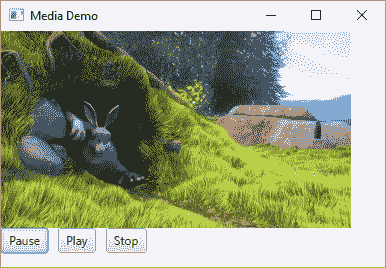

# 它是如何工作的。。。

`javafx.scene.media`媒体播放包中的重要类如下：

*   `Media`：表示媒体的来源，即视频或音频。它接受 HTTP/HTTPS/FILE 和 JAR URL 形式的源代码。
*   `MediaPlayer`：管理媒体的播放。
*   `MediaView`：这是允许查看媒体的 UI 组件。

还有一些其他的课程，但我们没有在本食谱中介绍它们。与媒体相关的类在`javafx.media`模块中。因此，不要忘记要求依赖它，如下所示：

```java
module gui{
  requires javafx.controls;
  requires javafx.media;
  opens com.packt;
}
```

在这个配方中，我们在`Chapter16/7_embed_audio_video/sample_video1.mp4`有一个示例视频，我们利用`java.io.File`API 构建`File`URL 来定位视频：

```java
File file = new File("sample_video1.mp4");
Media media = new Media(file.toURI().toString());
```

使用`javafx.scene.media.MediaPlayer`类公开的 API 管理媒体播放。在这个配方中，我们使用了几种方法，即`play()`、`pause()`和`stop()`。使用`javafx.scene.media.Media`对象初始化`javafx.scene.media.MediaPlayer`类：

```java
MediaPlayer mediaPlayer = new MediaPlayer(media);
```

在 UI 上呈现媒体由`javafx.scene.media.MediaView`类管理，由`javafx.scene.media.MediaPlayer`对象支持：

```java
MediaView mediaView = new MediaView(mediaPlayer);
```

我们可以使用`setFitWidth()`和`setFitHeight()`方法设置观看者的高度和宽度。

# 还有更多。。。

我们给出了 JavaFX 中媒体支持的基本演示。还有很多东西需要探索。您可以添加音量控制选项、向前或向后搜索选项、播放音频和音频均衡器。

# 向控件添加效果

以受控的方式添加效果可以为用户界面提供良好的外观。有多种效果，如模糊、阴影、反射、绽放等。JavaFX 在`javafx.scene.effects`包下提供了一组类，可用于添加效果以增强应用程序的外观。此软件包在`javafx.graphics`模块中提供。

在这个配方中，我们将看到一些模糊、阴影和反射效果。

# 准备

正如我们所知，JavaFX 库不是从 OracleJDK11 和 OpenJDK10 开始在 JDK 安装中提供的，我们必须从这里下载 [JavaFXSDK](https://gluonhq.com/products/javafx/) 并使用`-p`将 SDK 的`lib`文件夹中存在的 JAR 包含在模块化路径中选项如下所示：

```java
javac -p "PATH_TO_JAVAFX_SDK_LIB" <other parts of the command line> 

#Windows
java -p "PATH_TO_JAVAFX_SDK_LIB;COMPILED_CODE" <other parts of the command line> 
#Linux 
java -p "PATH_TO_JAVAFX_SDK_LIB:COMPILED_CODE" <other parts of the command line>
```

# 怎么做。。。

1.  让我们首先创建一个带有空方法的类，它将表示用于启动应用程序以及 JavaFXUI 的主应用程序：

```java
        public class EffectsDemo extends Application{
          public static void main(String[] args) {
            Application.launch(args);
          }
          @Override
          public void start(Stage stage) {
            //code added here in next steps
          }
        }
```

2.  后续代码将在`start(Stage stage)`方法中写入。创建并配置`javafx.scene.layout.GridPane`：

```java
        GridPane gridPane = new GridPane();
        gridPane.setAlignment(Pos.CENTER);
        gridPane.setHgap(10);
        gridPane.setVgap(10);
        gridPane.setPadding(new Insets(25, 25, 25, 25));
```

3.  创建应用模糊效果所需的矩形：

```java
        Rectangle r1 = new Rectangle(100,25, Color.BLUE);
        Rectangle r2 = new Rectangle(100,25, Color.RED);
        Rectangle r3 = new Rectangle(100,25, Color.ORANGE);
```

4.  将`javafx.scene.effect.BoxBlur`添加到`Rectangle r1`、`javafx.scene.effect.MotionBlur`添加到`Rectangle r2`、`javafx.scene.effect.GaussianBlur`添加到`Rectangle r3`：

```java
        r1.setEffect(new BoxBlur(10,10,3));
        r2.setEffect(new MotionBlur(90, 15.0));
        r3.setEffect(new GaussianBlur(15.0));
```

5.  将矩形添加到`gridPane`：

```java
        gridPane.add(r1,1,1);
        gridPane.add(r2,2,1);
        gridPane.add(r3,3,1);
```

6.  创建应用阴影所需的三个圆：

```java
        Circle c1 = new Circle(20, Color.BLUE);
        Circle c2 = new Circle(20, Color.RED);
        Circle c3 = new Circle(20, Color.GREEN);
```

7.  将`javafx.scene.effect.DropShadow`添加到`c1`中，将`javafx.scene.effect.InnerShadow`添加到`c2`中：

```java
        c1.setEffect(new DropShadow(0, 4.0, 0, Color.YELLOW));
        c2.setEffect(new InnerShadow(0, 4.0, 4.0, Color.ORANGE));
```

8.  将这些圆圈添加到`gridPane`：

```java
        gridPane.add(c1,1,2);
        gridPane.add(c2,2,2);
        gridPane.add(c3,3,2);
```

9.  创建一个简单的文本`Reflection Sample`，我们将在其上应用反射效果：

```java
        Text t = new Text("Reflection Sample");
        t.setFont(Font.font("Arial", FontWeight.BOLD, 20));
        t.setFill(Color.BLUE);
```

10.  创建`javafx.scene.effect.Reflection`效果并将其添加到文本中：

```java
        Reflection reflection = new Reflection();
        reflection.setFraction(0.8);
        t.setEffect(reflection);
```

11.  将文本组件添加到`gridPane`：

```java
        gridPane.add(t, 1, 3, 3, 1);
```

12.  使用`gridPane`作为根节点创建场景图：

```java
        Scene scene = new Scene(gridPane, 500, 300);
```

13.  将场景图设置为舞台并在显示器上渲染：

```java
        stage.setScene(scene);
        stage.setTitle("Effects Demo");
        stage.show();
```

完整代码可在`Chapter16/8_effects_demo`找到。

我们在`Chapter16/8_effects_demo`下提供了两个运行脚本`run.bat`和`run.sh`。`run.bat`脚本将用于在 Windows 上运行应用程序，`run.sh`脚本将用于在 Linux 上运行应用程序。

使用`run.bat`或`run.sh`运行应用程序，您将看到以下 GUI：

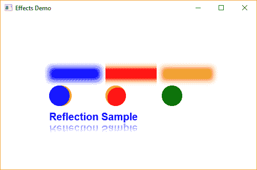

# 它是如何工作的。。。

在本配方中，我们利用了以下效果：

*   `javafx.scene.effect.BoxBlur`
*   `javafx.scene.effect.MotionBlur`
*   `javafx.scene.effect.GaussianBlur`
*   `javafx.scene.effect.DropShadow`
*   `javafx.scene.effect.InnerShadow`
*   `javafx.scene.effect.Reflection`

`BoxBlur`效果是通过指定模糊效果的宽度和高度以及需要应用效果的次数来创建的：

```java
BoxBlur boxBlur = new BoxBlur(10,10,3);
```

`MotionBlur`效果是通过提供模糊的角度及其半径创建的。这会产生运动中捕捉到的物体的效果：

```java
MotionBlur motionBlur = new MotionBlur(90, 15.0);
```

`GaussianBlur`效果通过提供效果的半径创建，效果使用高斯公式应用效果：

```java
GaussianBlur gb = new GaussianBlur(15.0);
```

`DropShadow`添加对象后面的阴影，而`InnerShadow`添加对象内部的阴影。每一个都取阴影的半径、阴影开始的*x*和*y*位置以及阴影的颜色：

```java
DropShadow dropShadow = new DropShadow(0, 4.0, 0, Color.YELLOW);
InnerShadow innerShadow = new InnerShadow(0, 4.0, 4.0, Color.ORANGE);
```

`Reflection`是一个非常简单的效果，添加了对象的反射。我们可以设置原始对象反射多少的分数：

```java
Reflection reflection = new Reflection();
reflection.setFraction(0.8);
```

# 还有更多。。。

还有很多其他影响：

*   混合效果，使用预定义的混合方法混合两个不同的输入
*   “bloom”效果，使较亮的部分看起来更亮
*   使对象发光的发光效果
*   照明效果，模拟对象上的光源，从而使其具有三维外观。

我们建议您以与我们相同的方式尝试这些效果。

# 使用 robotapi

**Robot API**用于模拟屏幕上的键盘和鼠标动作，这意味着您将指示代码在文本字段中键入一些文本，选择一个选项，然后单击按钮。来自 Web UI 测试背景的人可以将其与 Selenium 测试库联系起来。**抽象窗口工具包**（**AWT**）是 JDK 中较老的窗口工具包，提供了 Robot API，但在 JavaFX 上使用相同的 API 并不简单，需要一些技巧。名为**Glass**的 JavaFX 窗口工具包有自己的[机器人 API](https://openjfx.io/javadoc/11/javafx.graphics/javafx/scene/robot/Robot.html)，但这些不是公开的。因此，作为 OpenJFX11 发行版的一部分，为同一版本引入了新的公共 API。

在本教程中，我们将介绍如何使用 RobotAPI 在 JavaFXUI 上模拟一些动作。

# 准备

我们知道，从 Oracle JDK 11 开始和从 Open JDK 10 开始，JDK 安装中没有提供 JavaFX 库，因此我们必须从这里下载 [JavaFXSDK](https://gluonhq.com/products/javafx/)，并使用`-p`选项将 SDK 的`lib`文件夹中存在的 JAR 包含在模块化路径中，如下所示：

```java
javac -p "PATH_TO_JAVAFX_SDK_LIB" <other parts of the command line> 

#Windows
java -p "PATH_TO_JAVAFX_SDK_LIB;COMPILED_CODE" <other parts of the command line> 
#Linux 
java -p "PATH_TO_JAVAFX_SDK_LIB:COMPILED_CODE" <other parts of the command line> 

```

在此配方中，我们将创建一个简单的应用程序，该应用程序接受用户的名称，并在单击按钮时向用户打印消息。整个操作将使用 Robot API 进行模拟，最后，在退出应用程序之前，我们将使用 Robot API 捕获屏幕。

# 怎么做。。。

1.  创建一个简单的类`RobotApplication`，它扩展了`javafx.application.Application`并设置了测试 Robot API 所需的 UI，还创建了`javafx.scene.robot.Robot`的实例。此类将被定义为`RobotAPIDemo`主类的静态内部类：

```java
public static class RobotApplication extends Application{

  @Override
  public void start(Stage stage) throws Exception{
    robot = new Robot();
    GridPane gridPane = new GridPane();
    gridPane.setAlignment(Pos.CENTER);
    gridPane.setHgap(10);
    gridPane.setVgap(10);
    gridPane.setPadding(new Insets(25, 25, 25, 25));

    Text appTitle = new Text("Robot Demo");
    appTitle.setFont(Font.font("Arial", 
        FontWeight.NORMAL, 15));
    gridPane.add(appTitle, 0, 0, 2, 1);

    Label nameLbl = new Label("Name");
    nameField = new TextField();
    gridPane.add(nameLbl, 0, 1);
    gridPane.add(nameField, 1, 1);

    greeting = new Button("Greet");
    gridPane.add(greeting, 1, 2);

    Text resultTxt = new Text();
    resultTxt.setFont(Font.font("Arial", 
        FontWeight.NORMAL, 15));
    gridPane.add(resultTxt, 0, 5, 2, 1);

    greeting.setOnAction((event) -> {

      String name = nameField.getText();
      StringBuilder resultBuilder = new StringBuilder();
      if ( name != null && name.length() > 0 ){
        resultBuilder.append("Hello, ")
            .append(name).append("\n");
      }else{
        resultBuilder.append("Please enter the name");
      }
      resultTxt.setText(resultBuilder.toString());
      btnActionLatch.countDown();
    });

    Scene scene = new Scene(gridPane, 300, 250);

    stage.setTitle("Age calculator");
    stage.setScene(scene);
    stage.setAlwaysOnTop(true);
    stage.addEventHandler(WindowEvent.WINDOW_SHOWN, e -> 
      Platform.runLater(appStartLatch::countDown));
    stage.show();
    appStage = stage;
  }
}
```

2.  由于 JavaFX UI 将在不同的 JavaFX 应用程序线程中启动，在我们执行与 UI 交互的命令之前，完全呈现 UI 会有一些延迟，因此我们将使用`java.util.concurrent.CountDownLatch`指示不同的事件。为了使用`CountDownLatch`，我们在`RobotAPIDemo`类中创建了一个简单的静态助手方法，其定义如下：

```java
public static void waitForOperation(
    CountDownLatch latchToWaitFor, 
    int seconds, String errorMsg) {
  try {
    if (!latchToWaitFor.await(seconds, 
         TimeUnit.SECONDS)) {
      System.out.println(errorMsg);
    }
  } catch (Exception ex) {
    ex.printStackTrace();
  }
}
```

3.  `typeName()`方法是在文本字段中键入人员姓名的助手方法：

```java
public static void typeName(){
  Platform.runLater(() -> {
    Bounds textBoxBounds = nameField.localToScreen(
      nameField.getBoundsInLocal());
    robot.mouseMove(textBoxBounds.getMinX(), 
      textBoxBounds.getMinY());
    robot.mouseClick(MouseButton.PRIMARY);
    robot.keyType(KeyCode.CAPS);
    robot.keyType(KeyCode.S);
    robot.keyType(KeyCode.CAPS);
    robot.keyType(KeyCode.A);
    robot.keyType(KeyCode.N);
    robot.keyType(KeyCode.A);
    robot.keyType(KeyCode.U);
    robot.keyType(KeyCode.L);
    robot.keyType(KeyCode.L);
    robot.keyType(KeyCode.A);
  });
}
```

4.  `clickButton()`法为辅助法；它单击正确的按钮以触发问候语显示：

```java
public static void clickButton(){
  Platform.runLater(() -> {
    //click the button
    Bounds greetBtnBounds = greeting
      .localToScreen(greeting.getBoundsInLocal());

    robot.mouseMove(greetBtnBounds.getCenterX(), 
      greetBtnBounds.getCenterY());
    robot.mouseClick(MouseButton.PRIMARY);
  });
}
```

5.  `captureScreen()`方法是获取应用程序屏幕截图并将其保存到文件系统的辅助方法：

```java
public static void captureScreen(){
  Platform.runLater(() -> {
    try{

      WritableImage screenCapture = 
        new WritableImage(
          Double.valueOf(appStage.getWidth()).intValue(), 
          Double.valueOf(appStage.getHeight()).intValue()
        );

      robot.getScreenCapture(screenCapture, 
        appStage.getX(), appStage.getY(), 
        appStage.getWidth(), appStage.getHeight());

      BufferedImage screenCaptureBI = 
        SwingFXUtils.fromFXImage(screenCapture, null);
      String timePart = LocalDateTime.now()
        .format(DateTimeFormatter.ofPattern("yyyy-dd-M-m-H-ss"));
      ImageIO.write(screenCaptureBI, "png", 
        new File("screenCapture-" + timePart +".png"));
      Platform.exit();
    }catch(Exception ex){
      ex.printStackTrace();
    }
  });
}
```

6.  我们将在`main()`方法中绑定 UI 的启动和创建的 helper 方法，如下所示：

```java
public static void main(String[] args) 
  throws Exception{
  new Thread(() -> Application.launch(
    RobotApplication.class, args)).start();

  waitForOperation(appStartLatch, 10,
    "Timed out waiting for JavaFX Application to Start");
  typeName();
  clickButton();
  waitForOperation(btnActionLatch, 10, 
    "Timed out waiting for Button to complete operation");
  Thread.sleep(1000);
  captureScreen();
}
```

完整的代码可在`Chapter16/9_robot_api`中找到。您可以使用`run.bat`或`run.sh`运行样本。运行应用程序将启动 UI、执行操作、截屏并退出应用程序。屏幕截图将放在启动应用程序的文件夹中，并遵循命名约定-`screenCapture-yyyy-dd-M-m-H-ss.png`。以下是一个示例屏幕截图：

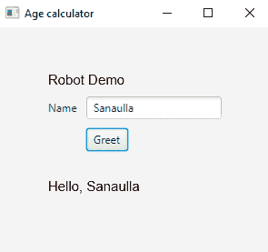

# 它是如何工作的。。。

由于 JavaFX 应用程序在不同的线程中运行，我们需要确保 Robot API 的操作顺序正确，并且只有在显示完整的 UI 时，才会执行 Robot API 的操作。为了确保这一点，我们利用`java.util.concurrent.CountDownLatch`就以下事件进行沟通：

*   完成 UI 的加载
*   完成为按钮定义的操作的执行

通过使用`CountDownLatch`实现关于 UI 加载完成的通信，如下所示：

```java
# Declaration of the latch
static public CountDownLatch appStartLatch = new CountDownLatch(1);

# Using the latch 
stage.addEventHandler(WindowEvent.WINDOW_SHOWN, e ->
                Platform.runLater(appStartLatch::countDown));
```

当显示窗口时，在`Stage`事件处理程序中调用`countDown()`方法，从而释放闩锁并触发在主方法中执行以下代码块：

```java
typeName();
clickButton();
```

然后，主线程再次被阻塞，无法等待`btnActionLatch`被释放。按钮问候中的动作完成后，`btnActionLatch`被释放。一旦`btnActionLatch`被释放，主线程将继续执行以调用`captureScreen()`方法。

让我们讨论一下我们在`javafx.scene.robot.Robot`类中使用的一些方法：

`mouseMove()`：此方法用于将鼠标光标移动到由其*x*和*y*坐标标识的给定位置。我们使用了以下代码行来获取组件的边界：

```java
Bounds textBoxBounds = nameField.localToScreen(nameField.getBoundsInLocal());
```

组件的边界包含以下内容：

*   左上角*x*和*y*坐标
*   右下角*x*和*y*坐标
*   构件的宽度和高度

因此，对于我们的 Robot API 用例，我们使用左上方的*x*和*y*坐标，如下所示：

```java
robot.mouseMove(textBoxBounds.getMinX(), textBoxBounds.getMinY());
```

`mouseClick()`：此方法用于点击鼠标上的按钮。鼠标按钮由`javafx.scene.input.MouseButton`枚举中的以下`enums`标识：

*   `PRIMARY`：表示鼠标左键点击
*   `SECONDARY`：表示鼠标右键点击
*   `MIDDLE`：表示鼠标的滚动或中间的按钮。

因此，为了能够使用`mouseClick()`，我们需要移动需要执行单击操作的组件的位置。在我们的例子中，正如在方法`typeName()`的实现中所看到的，我们使用`mouseMove()`移动到文本字段的位置，然后调用`mouseClick()`，如下所示：

```java
robot.mouseMove(textBoxBounds.getMinX(), 
    textBoxBounds.getMinY());
robot.mouseClick(MouseButton.PRIMARY);
```

`keyType()`：此方法用于在接受文本输入的组件中键入字符。要键入的字符由`javafx.scene.input.KeyCode`枚举中的枚举表示。在我们的`typeName()`方法实现中，我们输入字符串`Sanaulla`，如下所示：

```java
robot.keyType(KeyCode.CAPS);
robot.keyType(KeyCode.S);
robot.keyType(KeyCode.CAPS);
robot.keyType(KeyCode.A);
robot.keyType(KeyCode.N);
robot.keyType(KeyCode.A);
robot.keyType(KeyCode.U);
robot.keyType(KeyCode.L);
robot.keyType(KeyCode.L);
robot.keyType(KeyCode.A);
```

`getScreenCapture()`：此方法用于获取应用程序的屏幕截图。截图区域由*x*和*y*坐标以及传递给该方法的宽度和高度信息确定。然后将捕获的图像转换为`java.awt.image.BufferedImage`并保存到文件系统中，如下代码所示：

```java
WritableImage screenCapture = new WritableImage(
    Double.valueOf(appStage.getWidth()).intValue(), 
    Double.valueOf(appStage.getHeight()).intValue()
  );
robot.getScreenCapture(screenCapture, 
  appStage.getX(), appStage.getY(), 
  appStage.getWidth(), appStage.getHeight());

BufferedImage screenCaptureBI = 
  SwingFXUtils.fromFXImage(screenCapture, null);
String timePart = LocalDateTime.now().format(
  DateTimeFormatter.ofPattern("yyyy-dd-M-m-H-ss"));
ImageIO.write(screenCaptureBI, "png", 
  new File("screenCapture-" + timePart +".png"));
```