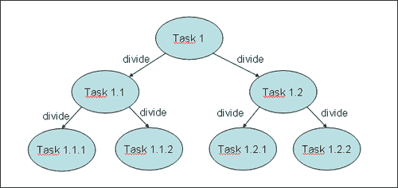
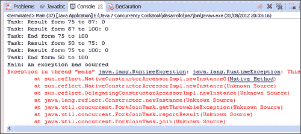

# 五、Fork/Join 框架

在本章中，我们将介绍：

*   创建 Fork/Join 池
*   加入任务的结果
*   异步运行任务
*   在任务中抛出异常
*   取消任务

# 导言

通常，当您实现一个简单的并发 Java 应用时，您会实现一些`Runnable`对象，然后是相应的`Thread`对象。您可以控制程序中这些线程的创建、执行和状态。Java5 对`Executor`和`ExecutorService`接口以及实现它们的类（例如`ThreadPoolExecutor`类）进行了改进。

Executor 框架将任务创建和执行分开。使用它，您只需实现`Runnable`对象并使用`Executor`对象。您将`Runnable`任务发送给执行器，执行器将创建、管理和完成执行这些任务所需的线程。

Java7 更进一步，包括面向特定问题的`ExecutorService`接口的附加实现。它是**Fork/Join 框架**。

该框架旨在解决可以使用分治技术分解为更小任务的问题。在任务内部，检查要解决的问题的大小，如果问题的大小大于已确定的大小，则将其划分为使用框架执行的较小任务。如果问题的大小小于已确定的大小，则直接在任务中解决问题，然后（可选）返回结果。下图总结了这一概念：



没有公式可以确定问题的参考大小，该公式可以根据任务的特征确定任务是否细分。您可以使用任务中要处理的元素数量和执行时间估计来确定引用大小。测试不同的参考尺寸，以选择最适合您问题的尺寸。你可以把它看作是一种特殊的形式。

该框架基于以下两个操作：

*   **fork**操作：将任务划分为更小的任务，并使用框架执行它们
*   **加入**操作：当任务等待其创建的任务完成时

Fork/Join 与 Executor 框架的主要区别在于**工作窃取**算法。与 Executor 框架不同，当任务等待使用联接操作创建的子任务完成时，执行该任务的线程（称为**工作线程**查找尚未执行的其他任务并开始执行。通过这种方式，线程可以充分利用其运行时间，从而提高应用的性能。

为了实现这一目标，Fork/Join 框架执行的任务有以下限制：

*   任务只能使用`fork()`和`join()`操作作为同步机制。如果使用其他同步机制，工作线程在同步操作中将无法执行其他任务。例如，如果您在 Fork/Join 框架中将一个任务置于睡眠状态，则执行该任务的工作线程在睡眠期间不会执行另一个任务。
*   任务不应执行 I/O 操作，例如读取或写入文件中的数据。
*   任务不能抛出已检查的异常。它必须包含处理它们所需的代码。

Fork/Join 框架的核心由以下两个类组成：

*   `ForkJoinPool`：实现`ExecutorService`接口和工作窃取算法。它管理工作线程，并提供有关任务状态及其执行的信息。
*   `ForkJoinTask`：是将在`ForkJoinPool`中执行的任务的基类。它提供了在任务内部执行`fork()`和`join()`操作的机制以及控制任务状态的方法。通常，为了实现 Fork/Join 任务，您将实现此类中两个子类的子类：`RecursiveAction`用于没有返回结果的任务，`RecursiveTask`用于返回结果的任务。

本章介绍了五种方法，它们向您展示了如何有效地使用 Fork/Join 框架。

# 创建 Fork/Join 池

在本食谱中，您将学习如何使用 Fork/Join 框架的基本元素。这包括：

*   创建一个`ForkJoinPool`对象来执行任务
*   创建要在池中执行的`ForkJoinTask`子类

您将在本例中使用的 Fork/Join 框架的主要特征如下：

*   您将使用默认构造函数创建`ForkJoinPool`。
*   在任务内部，您将使用 Java API 文档推荐的结构：

    ```java
    If (problem size > default size){
      tasks=divide(task);
      execute(tasks);
    } else {
      resolve problem using another algorithm;
    }
    ```

*   您将以同步方式执行任务。当一个任务执行两个或多个子任务时，它会等待它们的完成。通过这种方式，执行该任务的线程（称为工作线程）将寻找其他要执行的任务，充分利用它们的执行时间。
*   您将要实现的任务不会返回任何结果，因此您将使用`RecursiveAction`类作为其实现的基类。

## 准备好了吗

此配方的示例已使用 EclipseIDE 实现。如果您使用 Eclipse 或其他 IDE（如 NetBeans），请打开它并创建一个新的 Java 项目。

## 怎么做。。。

在此配方中，您将执行一项任务来更新产品列表的价格。初始任务将负责更新列表中的所有元素。您将使用尺寸 10 作为参考尺寸，因此，如果任务必须更新 10 个以上的元素，它会将分配给它的列表部分分为两部分，并创建两个任务来更新相应部分中产品的价格。

按照以下步骤来实现该示例：

1.  创建一个名为`Product`的类，该类将存储产品的名称和价格。

    ```java
    public class Product {
    ```

2.  声明名为`name`的私有`String`属性和名为`price`的私有`double`属性。

    ```java
      private String name;
      private double price;
    ```

3.  实现这两种方法并建立两个属性的值。

    ```java
      public String getName() {
        return name;
      }

      public void setName(String name) {
        this.name = name;
      }

      public double getPrice() {
        return price;
      }

      public void setPrice(double price) {
        this.price = price;
      }
    ```

4.  创建一个名为`ProductListGenerator`的类来生成随机产品列表。

    ```java
    public class ProductListGenerator {
    ```

5.  执行`generate()`方法。它接收一个带有列表大小的`int`参数，并返回一个带有生成产品列表的`List<Product>`对象。

    ```java
      public List<Product> generate (int size) {
    ```

6.  创建对象以返回产品列表。

    ```java
        List<Product> ret=new ArrayList<Product>();
    ```

7.  生成产品列表。将相同的价格分配给所有产品，例如 10，以检查程序是否运行良好。

    ```java
        for (int i=0; i<size; i++){
          Product product=new Product();
          product.setName("Product "+i);
          product.setPrice(10);
          ret.add(product);
        }
        return ret;
      }
    ```

8.  创建一个名为`Task`的类。指定它扩展`RecursiveAction`类。

    ```java
    public class Task extends RecursiveAction {
    ```

9.  声明类的串行版本 UID。这个元素是必需的，因为`RecursiveAction`类的父类`ForkJoinTask`类实现了`Serializable`接口。

    ```java
      private static final long serialVersionUID = 1L;
    ```

10.  声明名为`products`的私有`List<Product>`属性。

    ```java
      private List<Product> products;
    ```

11.  声明两个私有的`int`属性，分别命名为`first`和`last`。这些属性将决定此任务必须处理的产品块。

    ```java
      private int first;
      private int last;
    ```

12.  声明一个名为`increment`的私有`double`属性来存储产品价格的增量。

    ```java
      private double increment;
    ```

13.  实现类的构造函数，该构造函数将初始化该类的所有属性。

    ```java
      public Task (List<Product> products, int first, int last, double increment) {
        this.products=products;
        this.first=first;
        this.last=last;
        this.increment=increment;
      }
    ```

14.  实现将实现任务逻辑的`compute()`方法。

    ```java
      @Override
      protected void compute() {
    ```

15.  如果`last`和`first`属性的差异小于 10（任务必须更新少于 10 个产品的价格），则使用`updatePrices()`方法增加该集合或产品的价格。

    ```java
        if (last-first<10) {
          updatePrices();
    ```

16.  如果`last`和`first`属性之间的差异大于或等于 10，则创建两个新的`Task`对象，一个用于处理前半部分产品，另一个用于处理后半部分产品，并使用`invokeAll()`方法在`ForkJoinPool`中执行。

    ```java
        } else {
          int middle=(last+first)/2;
          System.out.printf("Task: Pending tasks: %s\n",getQueuedTaskCount());
          Task t1=new Task(products, first,middle+1, increment);
          Task t2=new Task(products, middle+1,last, increment);
          invokeAll(t1, t2);  
        }
    ```

17.  执行`updatePrices()`方法。此方法更新占据产品列表中`first`和`last`属性值之间位置的产品。

    ```java
      private void updatePrices() {
        for (int i=first; i<last; i++){
          Product product=products.get(i);
          product.setPrice(product.getPrice()*(1+increment));
        }
      }
    ```

18.  通过创建名为`Main`的类来实现示例的主类，并向其添加`main()`方法。

    ```java
    public class Main {
      public static void main(String[] args) {
    ```

19.  使用`ProductListGenerator`类创建 10000 个产品的列表。

    ```java
        ProductListGenerator generator=new ProductListGenerator();
        List<Product> products=generator.generate(10000);
    ```

20.  新建`Task`对象，更新列表中所有产品的产品。参数`first`取值`0`，参数`last`取值`10,000`（产品列表的大小）。

    ```java
          Task task=new Task(products, 0, products.size(), 0.20);
    ```

21.  使用不带参数的构造函数创建一个`ForkJoinPool`对象。

    ```java
        ForkJoinPool pool=new ForkJoinPool();
    ```

22.  使用`execute()`方法在池中执行任务。

    ```java
        pool.execute(task);
    ```

23.  实现一个代码块，每五毫秒向控制台写入池的某些参数的值，以显示池的演变信息，直到任务完成其执行。

    ```java
        do {
          System.out.printf("Main: Thread Count: %d\n",pool.getActiveThreadCount());
          System.out.printf("Main: Thread Steal: %d\n",pool.getStealCount());
          System.out.printf("Main: Parallelism: %d\n",pool.getParallelism());
          try {
            TimeUnit.MILLISECONDS.sleep(5);
          } catch (InterruptedException e) {
            e.printStackTrace();
          }
        } while (!task.isDone());
    ```

24.  使用`shutdown()` 方法关闭池。

    ```java
        pool.shutdown();
    ```

25.  使用`isCompletedNormally()`方法检查任务是否已完成且没有错误，在这种情况下，向控制台写入消息。

    ```java
        if (task.isCompletedNormally()){
          System.out.printf("Main: The process has completed normally.\n");
        }
    ```

26.  所有产品的预期价格在增加后为 12。写下所有价差为 12 的产品的名称和价格，以检查所有产品是否正确加价。

    ```java
        for (int i=0; i<products.size(); i++){
          Product product=products.get(i);
          if (product.getPrice()!=12) {
            System.out.printf("Product %s: %f\n",product.getName(),product.getPrice());
          }
        }
    ```

27.  编写一条消息，指示程序已完成。

    ```java
        System.out.println("Main: End of the program.\n");
    ```

## 它是如何工作的。。。

在本例中，创建了一个`ForkJoinPool`对象和在池中执行的`ForkJoinTask`类的子类。要创建`ForkJoinPool`对象，您使用了没有参数的构造函数，因此它将以默认配置执行。它创建一个线程数等于计算机处理器数的池。当`ForkJoinPool`对象被创建时，这些线程被创建，它们在池中等待，直到一些任务到达执行。

由于`Task`类不返回结果，因此它扩展了`RecursiveAction`类。在配方中，您使用了建议的结构来执行任务。如果任务必须更新 10 个以上的产品，它会将这些元素集划分为两个块，创建两个任务，并为每个任务分配一个块。您已经使用了`Task`类中的`first`和`last`属性来了解此任务必须在产品列表中更新的位置范围。您已使用`first`和`last`属性仅使用产品列表的一个副本，而不是为每个任务创建不同的列表。

为了执行任务创建的子任务，它调用`invokeAll()`方法。这是一个同步调用，任务在继续（可能完成）其执行之前等待子任务的完成。当任务正在等待其子任务时，执行它的工作线程将接受另一个正在等待执行的任务并执行它。通过这种行为，Fork/Join 框架提供了比`Runnable`和`Callable`对象本身更有效的任务管理。

`ForkJoinTask`类的`invokeAll()`方法是 Executor 和 Fork/Join 框架之间的主要区别之一。在 Executor 框架中，所有任务都必须发送给 Executor，而在这种情况下，任务包括在池中执行和控制任务的方法。您在`Task`类中使用了`invokeAll()`方法，该方法扩展了`RecursiveAction`类，该类扩展了`ForkJoinTask`类。

您已向池发送了一个独特的任务，以使用`execute()`方法更新所有产品列表。在本例中，它是一个异步调用，主线程继续执行。

你用来检查 T0 类运行状态的方法。该类包含更多可用于此目的的方法。有关这些方法的完整列表，请参见*监控 Fork/Join 池*配方。

最后，与 Executor 框架一样，您应该使用`shutdown()`方法完成`ForkJoinPool`。

以下屏幕截图显示了此示例执行的一部分：


你可以看到任务完成了他们的工作和产品的价格更新。

## 还有更多。。。

`ForkJoinPool`类提供了在中执行任务的其他方法。这些方法如下：

*   `execute (Runnable task)`：这是示例中使用的`execute()`方法的另一个版本。在本例中，您向`ForkJoinPool`类发送`Runnable`任务。请注意，`ForkJoinPool`类没有对`Runnable`对象使用工作窃取算法。它仅用于`ForkJoinTask`对象。
*   `invoke(ForkJoinTask<T> task)`：当`execute()`方法对`ForkJoinPool`类进行异步调用时，正如您在示例中了解到的，`invoke()`方法对`ForkJoinPool`类进行同步调用。在作为参数传递的任务完成其执行之前，此调用不会返回。
*   您也可以使用`ExecutorService`界面中声明的`invokeAll()`和`invokeAny()`方法。这些方法接收`Callable`对象作为参数。`ForkJoinPool`类不使用`Callable`对象的工作窃取算法，因此最好使用执行器执行它们。

`ForkJoinTask`类还包括示例中使用的`invokeAll()`方法的其他版本。这些版本如下：

*   `invokeAll(ForkJoinTask<?>... tasks)`：此版本的方法使用变量参数列表。您可以将任意多个`ForkJoinTask`对象作为参数传递给它。
*   `invokeAll(Collection<T> tasks)`：此版本的方法接受泛型类型`T`对象的集合（例如，`ArrayList`对象、`LinkedList`对象或`TreeSet`对象）。此泛型类型`T`必须是`ForkJoinTask`类或其子类。

虽然`ForkJoinPool`类设计用于执行`ForkJoinTask`的对象，但您也可以直接执行`Runnable`和`Callable`对象。您也可以使用`ForkJoinTask`类的`adapt()`方法，该方法接受`Callable`对象或`Runnable`对象并返回`ForkJoinTask`对象以执行该任务。

## 另见

*   [第 8 章](8.html "Chapter 8. Testing Concurrent Applications")*测试并发应用*中的*监控 Fork/Join 池*配方

# 加入任务结果

Fork/Join 框架提供了执行返回结果的任务的能力。此类任务由`RecursiveTask`类实现。该类扩展了`ForkJoinTask`类，实现了 Executor 框架提供的`Future`接口。

在任务内部，必须使用 Java API 文档推荐的结构：

```java
If (problem size > size){
  tasks=Divide(task);
  execute(tasks);
  groupResults()
  return result;
} else {
  resolve problem;
  return result;
}
```

如果任务必须解决大于预定义大小的问题，则可以将问题划分为更多子任务，并使用 Fork/Join 框架执行这些子任务。当它们完成执行时，发起任务获得所有子任务生成的结果，对它们进行分组，并返回最终结果。最终，当池中执行的初始任务完成其执行时，您将获得其结果，这实际上是整个问题的最终结果。

在本教程中，您将学习如何使用 Fork/Join 框架开发一个在文档中查找单词的应用来解决此类问题。您将执行以下两种任务：

*   文档任务，它将在文档的一组行中搜索一个单词
*   一个行任务，它将在文档的一部分中搜索一个单词

所有任务都将返回单词在其处理的文档部分或行中出现的次数。

## 怎么做。。。

按照以下步骤来实现该示例：

1.  创建一个名为`Document`的类。它将生成模拟文档的字符串矩阵。

    ```java
    public class Document {
    ```

2.  创建一个包含一些单词的字符串数组。此数组将用于生成字符串矩阵。

    ```java
    private String words[]={"the","hello","goodbye","packt", "java","thread","pool","random","class","main"};
    ```

3.  执行`generateDocument()`方法。它接收行数、每行字数以及示例要查找的字数作为参数。它返回一个字符串矩阵。

    ```java
      public String[][] generateDocument(int numLines, int numWords, String word){
    ```

4.  首先，创建生成文档所需的对象：`String`矩阵和生成随机数的`Random`对象。

    ```java
        int counter=0;
        String document[][]=new String[numLines][numWords];
        Random random=new Random();
    ```

5.  用字符串填充数组。将位于单词数组中随机位置的字符串存储在每个位置，并计算程序将在生成的数组中查找的单词的出现次数。可以使用此值检查程序是否正确执行其工作。

    ```java
        for (int i=0; i<numLines; i++){
          for (int j=0; j<numWords; j++) {
            int index=random.nextInt(words.length);
            document[i][j]=words[index];
            if (document[i][j].equals(word)){
              counter++;
            }
          }
        }
    ```

6.  用单词的出现次数写一条消息，并返回生成的矩阵。

    ```java
        System.out.println("DocumentMock: The word appears "+ counter+" times in the document");
        return document;
    ```

7.  创建一个名为`DocumentTask`的类，并指定它扩展用`Integer`类参数化的`RecursiveTask`类。此类将实现一个任务，该任务将计算单词在一组行中的出现次数。

    ```java
    public class DocumentTask extends RecursiveTask<Integer> {
    ```

8.  声明一个名为`document`的私有`String`矩阵和两个名为`start`和`end`的私有`int`属性。还声明名为`word`的私有`String`属性。

    ```java
      private String document[][];
      private int start, end;
      private String word;
    ```

9.  实现类的构造函数以初始化其所有属性。

    ```java
      public DocumentTask (String document[][], int start, int end, String word){
        this.document=document;
        this.start=start;
        this.end=end;
        this.word=word;
      }
    ```

10.  执行`compute()`方法。如果`end`和`start`属性之间的差异小于 10，则任务将计算调用`processLines()`方法的这些位置之间的行中单词的出现次数。

    ```java
      @Override
      protected Integer compute() {
          int result;
        if (end-start<10){
          result=processLines(document, start, end, word);
    ```

11.  否则，将两个对象中的行分组，创建两个新的`DocumentTask`对象来处理这两个组，并使用`invokeAll()`方法在池中执行。

    ```java
        } else {
          int mid=(start+end)/2;
          DocumentTask task1=new DocumentTask(document,start,mid,word);
          DocumentTask task2=new DocumentTask(document,mid,end,word);
          invokeAll(task1,task2);
    ```

12.  然后，使用`groupResults()`方法将两个任务返回的值相加。最后，返回任务计算的结果。

    ```java
          try {
            result=groupResults(task1.get(),task2.get());
          } catch (InterruptedException | ExecutionException e) {
            e.printStackTrace();
          }
        }
        return result;
    ```

13.  执行`processLines()`方法。它接收任务正在搜索的字符串矩阵、`start`属性、`end`属性和`word`属性作为参数。

    ```java
      private Integer processLines(String[][] document, int start, int end,String word) {
    ```

14.  对于任务必须处理的每一行，创建一个`LineTask`对象来处理完整的行，并将它们存储在任务列表中。

    ```java
        List<LineTask> tasks=new ArrayList<LineTask>();  
        for (int i=start; i<end; i++){
          LineTask task=new LineTask(document[i], 0, document[i].length, word);
          tasks.add(task);
        }
    ```

15.  使用`invokeAll()`方法执行该列表中的所有任务。

    ```java
        invokeAll(tasks);
    ```

16.  对所有这些任务返回的值求和并返回结果。

    ```java
        int result=0;
        for (int i=0; i<tasks.size(); i++) {
          LineTask task=tasks.get(i);
          try {
            result=result+task.get();
          } catch (InterruptedException | ExecutionException e) {
            e.printStackTrace();
          }
        }
        return new Integer(result);
    ```

17.  实施方法的`groupResults()`方法。它将两个数字相加并返回结果。

    ```java
      private Integer groupResults(Integer number1, Integer number2) {
        Integer result;
        result=number1+number2;
        return result;
      }
    ```

18.  创建一个名为`LineTask`的类，并指定它扩展用`Integer`类参数化的`RecursiveTask`类。此类将实现计算单词在一行中出现的次数的任务。

    ```java
    public class LineTask extends RecursiveTask<Integer>{
    ```

19.  声明类的串行版本 UID。此元素是必需的，因为`RecursiveTask`类的父类`ForkJoinTask`类实现了`Serializable`接口。声明一个名为`line`的私有`String`数组属性和两个名为`start`和`end`的私有`int`属性。最后，声明一个名为`word`的私有`String`属性。

    ```java
      private static final long serialVersionUID = 1L;
      private String line[];
      private int start, end;
      private String word;
    ```

20.  实现类的构造函数以初始化其所有属性。

    ```java
      public LineTask(String line[], int start, int end, String word) {
        this.line=line;
        this.start=start;
        this.end=end;
        this.word=word;
      }
    ```

21.  实现类的`compute()`方法。如果`end`和`start`属性之间的差异小于 100，则任务使用 `count()`方法在`start`和`end`属性确定的行片段中搜索单词。

    ```java
      @Override
      protected Integer compute() {
        Integer result=null;
        if (end-start<100) {
          result=count(line, start, end, word);
    ```

22.  否则，将行中的单词组一分为二，创建两个新的`LineTask`对象来处理这两个组，并使用`invokeAll()`方法在池中执行它们。

    ```java
        } else {
          int mid=(start+end)/2;
          LineTask task1=new LineTask(line, start, mid, word);
          LineTask task2=new LineTask(line, mid, end, word);
          invokeAll(task1, task2);
    ```

23.  然后，使用`groupResults()`方法将两个任务返回的值相加。最后，返回任务计算的结果。

    ```java
          try {
            result=groupResults(task1.get(),task2.get());
          } catch (InterruptedException | ExecutionException e) {
            e.printStackTrace();
          }
        }
        return result;
    ```

24.  执行`count()`方法。它接收字符串数组，其中包含任务正在搜索的完整行、`star`属性、`end`属性和`word`属性作为参数。

    ```java
      private Integer count(String[] line, int start, int end, String word) {
    ```

25.  将存储在`start`和`end`属性之间的位置中的单词与任务正在搜索的`word`属性进行比较，如果它们相等，则增加一个`counter`变量。

    ```java
        int counter;
        counter=0;
        for (int i=start; i<end; i++){
          if (line[i].equals(word)){
            counter++;
          }
        }
    ```

26.  要降低示例的执行速度，请将任务置于睡眠状态 10 毫秒。

    ```java
        try {
          Thread.sleep(10);
        } catch (InterruptedException e) {
          e.printStackTrace();
        }
    ```

27.  返回该`counter`变量的值。

    ```java
        return counter;
    ```

28.  执行`groupResults()`方法。对两个数字求和并返回结果。

    ```java
      private Integer groupResults(Integer number1, Integer number2) {
        Integer result;
        result=number1+number2;
        return result;
      }
    ```

29.  通过使用`main()`方法创建名为`Main`的类来实现示例的主类。

    ```java
    public class Main{
      public static void main(String[] args) {
    ```

30.  使用`DocumentMock`类创建包含 100 行和每行 1000 字的`Document`。

    ```java
        DocumentMock mock=new DocumentMock();
        String[][] document=mock.generateDocument(100, 1000, "the");
    ```

31.  创建一个新的`DocumentTask`对象来更新整个文档的产品。参数`start`取值`0`，参数`end`取值`100`。

    ```java
        DocumentTask task=new DocumentTask(document, 0, 100, "the");
    ```

32.  使用不带参数的构造函数创建`ForkJoinPool`对象，并使用`execute()`方法在池中执行任务。

    ```java
        ForkJoinPool pool=new ForkJoinPool();
        pool.execute(task);
    ```

33.  实现一个代码块，该代码块显示池的进度信息，每秒向控制台写入池的某些参数的值，直到任务完成执行。

    ```java
        do {
          System.out.printf("******************************************\n");
          System.out.printf("Main: Parallelism: %d\n",pool.getParallelism());
          System.out.printf("Main: Active Threads: %d\n",pool.getActiveThreadCount());
          System.out.printf("Main: Task Count: %d\n",pool.getQueuedTaskCount());
          System.out.printf("Main: Steal Count: %d\n",pool.getStealCount());
          System.out.printf("******************************************\n");
          try {
            TimeUnit.SECONDS.sleep(1);
          } catch (InterruptedException e) {
            e.printStackTrace();
          }
        } while (!task.isDone());
    ```

34.  使用`shutdown()`方法关闭池。

    ```java
        pool.shutdown();
    ```

35.  使用`awaitTermination()` 方法等待任务完成。

    ```java
        try {
          pool.awaitTermination(1, TimeUnit.DAYS);
        } catch (InterruptedException e) {
          e.printStackTrace();
        }
    ```

36.  在文档中写出单词出现的次数。检查此编号是否与`DocumentMock`类编写的编号相同。

    ```java
        try {
          System.out.printf("Main: The word appears %d in the document",task.get());
        } catch (InterruptedException | ExecutionException e) {
          e.printStackTrace();
        }
    ```

## 它是如何工作的。。。

在本例中，您实现了两个不同的任务：

*   `DocumentTask`类：该类的任务必须处理由`start`和`end`属性确定的一组文档行。如果这组行的大小小于 10，它将为每行创建`LineTask`，当它们完成执行时，它将对这些任务的结果求和，并返回求和的结果。如果任务必须处理的行集合的大小为 10 或更大，它会将该集合一分为二，并创建两个`DocumentTask`对象来处理这些新集合。当这些任务完成执行时，任务将对其结果求和，并返回该和作为结果。
*   `LineTask`类：该类的任务必须处理文档一行中的一组单词。如果这组单词小于 100，任务将直接在该组单词中搜索该单词，并返回该单词的出现次数。否则，它会将单词集一分为二，并创建两个`LineTask`对象来处理这些单词集。当这些任务完成执行时，任务将两个任务的结果相加，并返回该总和作为结果。

在`Main`类中，使用默认构造函数创建了一个`ForkJoinPool`对象，并在其中执行了一个`DocumentTask`类，该类必须处理一个 100 行、每行 1000 字的文档。此任务将使用其他`DocumentTask`对象和`LineTask`对象来划分问题，当所有任务完成执行后，您可以使用原始任务来获取单词在整个文档中的出现总数。由于任务返回结果，因此它们扩展了`RecursiveTask`类。

为了获取`Task`返回的结果，您使用了`get()`方法。此方法在`RecursiveTask`类实现的`Future`接口中声明。

执行程序时，可以比较控制台中写入的第一行和最后一行。第一行是生成文档时计算的单词出现次数，最后一行是 Fork/Join 任务计算的相同次数。

## 还有更多。。。

`ForkJoinTask`类提供了另一种方法来完成任务的执行并返回结果，即`complete()`方法。此方法接受`RecursiveTask`类参数化中使用的类型的对象，并在调用`join()`方法时返回该对象作为任务的结果。建议使用它为异步任务提供结果。

由于`RecursiveTask`类实现了`Future`接口，所以`get()`方法还有版本：

*   `get(long timeout, TimeUnit unit)`：此版本的`get()`方法，如果任务结果不可用，则等待指定时间。如果指定的时间段过去了，结果还不可用，则该方法返回一个`null`值。`TimeUnit`类是具有以下常量的枚举：`DAYS`、`HOURS`、`MICROSECONDS`、`MILLISECONDS`、`MINUTES`、`NANOSECONDS`和`SECONDS`。

## 另见

*   [第 5 章](5.html "Chapter 5. Fork/Join Framework")*Fork/Join 框架*中的*创建 Fork/Join 池*配方
*   [第 8 章](8.html "Chapter 8. Testing Concurrent Applications")*测试并发应用*中的*监控 Fork/Join 池*配方

# 异步运行任务

当在`ForkJoinPool`中执行`ForkJoinTask`时，可以同步或异步执行。当您以同步方式执行时，将任务发送到池的方法不会返回，直到发送的任务完成其执行。以异步方式执行时，将任务发送给执行器的方法会立即返回，因此任务可以继续执行。

您应该意识到这两种方法之间的巨大差异。当您使用同步方法时，调用其中一个方法（例如，`invokeAll()`方法）的任务将被挂起，直到它发送到池中的任务完成执行为止。这允许`ForkJoinPool`类使用工作窃取算法将新任务分配给执行休眠任务的工作线程。相反，当您使用异步方法（例如，`fork()`方法）时，任务将继续执行，因此`ForkJoinPool`类不能使用工作窃取算法来提高应用的性能。在这种情况下，只有在调用`join()`或`get()`方法等待任务完成时，`ForkJoinPool`类才能使用该算法。

在这个配方中，您将学习如何使用`ForkJoinPool`和`ForkJoinTask`类提供的异步方法来管理任务。您将要实现一个程序，该程序将在文件夹及其子文件夹中搜索具有确定扩展名的文件。您将要实现的`ForkJoinTask`类将处理文件夹的内容。对于该文件夹中的每个子文件夹，它将以异步方式向`ForkJoinPool`类发送一个新任务。对于该文件夹中的每个文件，任务将检查文件的扩展名，并在继续时将其添加到结果列表中。

## 怎么做。。。

按照以下步骤实现示例：

1.  创建一个名为`FolderProcessor`的类，并指定它扩展用`List<String>`类型参数化的`RecursiveTask`类。

    ```java
    public class FolderProcessor extends RecursiveTask<List<String>> {
    ```

2.  声明类的串行版本 UID。此元素是必需的，因为`RecursiveTask`类的父类`ForkJoinTask`类实现了`Serializable`接口。

    ```java
      private static final long serialVersionUID = 1L;
    ```

3.  声明名为`path`的私有`String`属性。此属性将存储此任务要处理的文件夹的完整路径。

    ```java
      private String path;
    ```

4.  声明名为`extension`的私有`String`属性。此属性将存储此任务要查找的文件扩展名的名称。

    ```java
      private String extension;
    ```

5.  实现类的构造函数以初始化其属性。

    ```java
      public FolderProcessor (String path, String extension) {
        this.path=path;
        this.extension=extension;
      }
    ```

6.  执行`compute()`方法。当您使用`List<String>`类型参数化`RecursiveTask`类时，此方法必须返回该类型的对象。

    ```java
      @Override
      protected List<String> compute() {
    ```

7.  声明一个`String`对象列表，用于存储文件夹中存储的文件名。

    ```java
        List<String> list=new ArrayList<>();
    ```

8.  声明一个`FolderProcessor`任务列表，以存储将要处理文件夹中存储的子文件夹的子任务。

    ```java
        List<FolderProcessor> tasks=new ArrayList<>();
    ```

9.  获取文件夹的内容。

    ```java
        File file=new File(path);
        File content[] = file.listFiles();
    ```

10.  对于文件夹中的每个元素，如果存在子文件夹，则创建一个新的`FolderProcessor`对象，并使用`fork()`方法异步执行。

    ```java
        if (content != null) {
          for (int i = 0; i < content.length; i++) {
            if (content[i].isDirectory()) {
              FolderProcessor task=new FolderProcessor(content[i].getAbsolutePath(), extension);
              task.fork();
              tasks.add(task);
    ```

11.  否则，使用`checkFile()`方法将文件的扩展名与您要查找的扩展名进行比较，如果它们相等，则将文件的完整路径存储在前面声明的字符串列表中。

    ```java
            } else {
              if (checkFile(content[i].getName())){
                list.add(content[i].getAbsolutePath());
              }
            }
          }
    ```

12.  如果`FolderProcessor`子任务列表包含 50 个以上的元素，则向控制台写入一条消息以指示这种情况。

    ```java
          if (tasks.size()>50) {
            System.out.printf("%s: %d tasks ran.\n",file.getAbsolutePath(),tasks.size());
          }

    ```

13.  调用辅助方法`addResultsFromTask()`，将此任务启动的子任务返回的结果添加到文件列表中。将字符串列表和`FolderProcessor`子任务列表作为参数传递给它。

    ```java
          addResultsFromTasks(list,tasks);
    ```

14.  返回字符串列表。

    ```java
        return list;
    ```

15.  执行的`addResultsFromTasks()`方法。对于存储在任务列表中的每个任务，调用`join()`方法，等待其完成，然后返回任务结果。使用`addAll()`方法将该结果添加到字符串列表中。

    ```java
      private void addResultsFromTasks(List<String> list,
          List<FolderProcessor> tasks) {
        for (FolderProcessor item: tasks) {
          list.addAll(item.join());
        }
      }
    ```

16.  执行的`checkFile()`方法。此方法比较作为参数传递的文件的名称是否以您要查找的扩展名结尾。如果是，则返回`true`值，否则返回`false`值。

    ```java
      private boolean checkFile(String name) {
         return name.endsWith(extension);
      }
    ```

17.  通过使用`main()`方法创建名为`Main`的类来实现示例的主类。

    ```java
    public class Main {
      public static void main(String[] args) {
    ```

18.  使用默认构造函数创建`ForkJoinPool`。

    ```java
        ForkJoinPool pool=new ForkJoinPool();
    ```

19.  创建三个`FolderProcessor`任务。使用不同的文件夹路径初始化每个文件夹。

    ```java
        FolderProcessor system=new FolderProcessor("C:\\Windows", "log");
        FolderProcessor apps=new 
    FolderProcessor("C:\\Program Files","log");
        FolderProcessor documents=new FolderProcessor("C:\\Documents And Settings","log");
    ```

20.  使用`execute()`方法执行池中的三个任务。

    ```java
        pool.execute(system);
        pool.execute(apps);
        pool.execute(documents);
    ```

21.  每秒钟向控制台写入池状态信息，直到三个任务完成执行。

    ```java
        do {
          System.out.printf("******************************************\n");
          System.out.printf("Main: Parallelism: %d\n",pool.getParallelism());
          System.out.printf("Main: Active Threads: %d\n",pool.getActiveThreadCount());
          System.out.printf("Main: Task Count: %d\n",pool.getQueuedTaskCount());
          System.out.printf("Main: Steal Count: %d\n",pool.getStealCount());
          System.out.printf("******************************************\n");
          try {
            TimeUnit.SECONDS.sleep(1);
          } catch (InterruptedException e) {
            e.printStackTrace();
          }
        } while ((!system.isDone())||(!apps.isDone())||(!documents.isDone()));
    ```

22.  使用`shutdown()`方法关闭`ForkJoinPool`。

    ```java
        pool.shutdown();
    ```

23.  将每个任务生成的结果编号写入控制台。

    ```java
        List<String> results;

        results=system.join();
        System.out.printf("System: %d files found.\n",results.size());

        results=apps.join();
        System.out.printf("Apps: %d files found.\n",results.size());

        results=documents.join();
        System.out.printf("Documents: %d files found.\n",results.size());
    ```

## 它是如何工作的。。。

以下屏幕截图显示了此示例的部分执行：


本例的键在`FolderProcessor`类中。每个任务处理一个文件夹的内容。如您所知，此内容包含以下两种元素：

*   文件夹
*   其它文件夹

如果任务找到一个文件夹，它将创建另一个`Task`对象来处理该文件夹，并使用`fork()`方法将其发送到池中。此方法将任务发送到池中，如果池中有空闲工作线程或可以创建新线程，则池将执行该任务。该方法立即返回，因此任务可以继续处理文件夹的内容。对于每个文件，任务都会将其扩展名与要查找的文件进行比较，如果扩展名相等，则会将文件名添加到结果列表中。

一旦任务处理完分配文件夹的所有内容，它将等待使用`join()`方法发送到池中的所有任务完成。在任务中调用的此方法等待其执行的完成，并返回由`compute()`方法返回的值。任务将其发送的所有任务的结果与自己的结果分组，并将该列表作为`compute()`方法的返回值返回。

`ForkJoinPool`类还允许以异步方式执行任务。您已使用`execute()`方法将三个初始任务发送到池中。在`Main`类中，您还使用`shutdown()`方法完成了池，并编写了关于池中运行的任务的状态和演化的信息。`ForkJoinPool`类包含更多可用于此目的的方法。请参阅*监控 Fork/Join 池*配方，以查看这些方法的完整列表。

## 还有更多。。。

在本例中，您使用了`join()`方法来等待任务的完成并获得其结果。您也可以使用`get()`方法的两个版本中的一个来实现此目的：

*   `get()`：此版本的`get()`方法返回`compute()`方法返回的值，如果`ForkJoinTask`已完成执行，或等待其完成。
*   `get(long timeout, TimeUnit unit)`：此版本的`get()`方法，如果任务结果不可用，则等待指定时间。如果指定的时间段过去了，结果还不可用，则该方法返回一个`null`值。`TimeUnit`类是具有以下常量的枚举：`DAYS`、`HOURS`、`MICROSECONDS`、`MILLISECONDS`、`MINUTES`、`NANOSECONDS`和`SECONDS`。

`get()`和`join()`方法之间有两个主要区别：

*   `join()`方法无法中断。如果中断调用`join()`方法的线程，该方法将抛出`InterruptedException`异常。
*   如果任务抛出任何未检查的异常，`get()`方法将返回`ExecutionException`异常，`join()`方法将返回`RuntimeException`异常。

## 另见

*   [第 5 章](5.html "Chapter 5. Fork/Join Framework")*Fork/Join 框架*中的*创建 Fork/Join 池*配方
*   [第 8 章](8.html "Chapter 8. Testing Concurrent Applications")*测试并发应用*中的*监控 Fork/Join 池*配方

# 在任务中抛出异常

Java 中有两种异常：

*   **检查异常**：这些异常必须在方法的`throws`子句中指定或捕获。例如，`IOException`或`ClassNotFoundException`。
*   **未检查的异常**：不必指定或捕获这些异常。例如，`NumberFormatException`。

您不能在`ForkJoinTask`类的`compute()`方法中抛出任何选中的异常，因为该方法的实现中不包含任何抛出声明。您必须包含处理异常所需的代码。另一方面，您可以抛出（也可以由方法内部使用的任何方法或对象抛出）未经检查的异常。`ForkJoinTask`和`ForkJoinPool`类的行为与您可能期望的不同。程序未完成执行，并且在控制台中看不到有关异常的任何信息。它只是被吞下，就好像没有被扔掉一样。但是，您可以使用`ForkJoinTask`类的一些方法来了解任务是否引发异常以及异常的类型。在本食谱中，您将学习如何获取这些信息。

## 准备好了吗

此配方的示例已使用 EclipseIDE 实现。如果您使用 Eclipse 或其他 IDE（如 NetBeans），请打开它并创建一个新的 Java 项目。

## 怎么做。。。

按照以下步骤来实现该示例：

1.  创建一个名为`Task`的类。指定它实现用`Integer`类参数化的`RecursiveTask`类。

    ```java
    public class Task extends RecursiveTask<Integer> {
    ```

2.  声明一个名为`array`的私有`int`数组。它将模拟本例中要处理的数据数组。

    ```java
      private int array[];
    ```

3.  声明两个名为`start`和`end`的私有`int`属性。这些属性将确定此任务必须处理的数组元素。

    ```java
      private int start, end;
    ```

4.  实现初始化其属性的类的构造函数。

    ```java
      public Task(int array[], int start, int end){
        this.array=array;
        this.start=start;
        this.end=end;
      }
    ```

5.  执行任务的`compute()`方法。当您使用`Integer`类参数化`RecursiveTask`类时，此方法必须返回一个`Integer`对象。首先，使用`start`和`end`属性的值向控制台写入消息。

    ```java
      @Override
      protected Integer compute() {
        System.out.printf("Task: Start from %d to %d\n",start,end); 
    ```

6.  如果此任务必须处理的元素块由`start`和`end`属性确定，其大小小于 10，请检查数组中第四个位置（索引号 3）的元素是否在该块中。如果是这种情况，抛出一个`RuntimeException` 异常。然后，让任务休眠一秒钟。

    ```java
        if (end-start<10) {
          if ((3>start)&&(3<end)){
            throw new RuntimeException("This task throws an"+ "Exception: Task from  "+start+" to "+end);
          }      
          try {
            TimeUnit.SECONDS.sleep(1);
          } catch (InterruptedException e) {
            e.printStackTrace();
          }
    ```

7.  否则（此任务必须处理的元素块大小为 10 或更大），将元素块一分为二，创建两个`Task`对象来处理这些块，并使用`invokeAll()`方法在池中执行它们。

    ```java
        } else {
          int mid=(end+start)/2;
          Task task1=new Task(array,start,mid);
          Task task2=new Task(array,mid,end);
          invokeAll(task1, task2);
        }
    ```

8.  向控制台写入一条消息，指示写入`start`和`end`属性值的任务结束。

    ```java
        System.out.printf("Task: End form %d to %d\n",start,end);
    ```

9.  返回编号`0`作为任务的结果。

    ```java
        return 0;
    ```

10.  通过使用`main()`方法创建名为`Main`的类来实现示例的主类。

    ```java
    public class Main {
      public static void main(String[] args) {
    ```

11.  创建一个包含 100 个整数的数组。

    ```java
        int array[]=new int[100];
    ```

12.  创建一个`Task`对象来处理该数组。

    ```java
        Task task=new Task(array,0,100);
    ```

13.  使用默认构造函数创建一个`ForkJoinPool`对象。

    ```java
        ForkJoinPool pool=new ForkJoinPool();
    ```

14.  使用`execute()`方法执行池中的任务。

    ```java
        pool.execute(task);
    ```

15.  使用`shutdown()`方法关闭`ForkJoinPool`类。

    ```java
        pool.shutdown();
    ```

16.  使用`awaitTermination()`方法等待任务完成。由于您希望等待任务的完成，无论需要多长时间才能完成，请将值`1`和`TimeUnit.DAYS` 作为参数传递给此方法。

    ```java
        try {
          pool.awaitTermination(1, TimeUnit.DAYS);
        } catch (InterruptedException e) {
          e.printStackTrace();
        }
    ```

17.  使用`isCompletedAbnormally()`方法检查任务或其子任务是否引发异常。在这种情况下，向控制台写入一条消息，其中包含抛出的异常。使用`ForkJoinTask`类的`getException()`方法获取该异常。

    ```java
        if (task.isCompletedAbnormally()) {
          System.out.printf("Main: An exception has ocurred\n");
          System.out.printf("Main: %s\n",task.getException());
        }
        System.out.printf("Main: Result: %d",task.join());
    ```

## 它是如何工作的。。。

在此配方中实现的`Task`类处理一个数字数组。它检查必须处理的数字块是否有 10 个或更多元素。在这种情况下，它将块一分为二，并创建两个新的`Task`对象来处理这些块。否则，它将在数组的第四个位置（索引号 3）查找元素。如果该元素位于任务必须处理的块中，它将抛出一个`RuntimeException`异常。

当您执行程序时，会抛出异常，但程序不会停止。在`Main`类中，您使用原始任务调用了`ForkJoinTask`类的`isCompletedAbnormally()`方法。如果该任务或其子任务之一引发异常，则此方法返回`true`。您还使用同一对象的`getException()`方法获取它抛出的`Exception`对象。

当您在任务中抛出未经检查的异常时，它还会影响其父任务（将其发送到`ForkJoinPool`类的任务）及其父任务的父任务，依此类推。如果修改程序的所有输出，您将看到没有用于完成某些任务的输出消息。这些任务的说明信息如下：

```java
Task: Starting form 0 to 100
Task: Starting form 0 to 50
Task: Starting form 0 to 25
Task: Starting form 0 to 12
Task: Starting form 0 to 6
```

这些任务是引发异常及其父任务的任务。他们都不正常地完成了。考虑到这一点，当您使用`ForkJoinPool`和`ForkJoinTask`对象开发一个程序时，若您不希望出现这种行为，可以抛出异常。

以下屏幕截图显示了此示例执行的一部分：



## 还有更多。。。

如果不抛出异常，而是使用`ForkJoinTask`类的`completeExceptionally()`方法，则可以获得与示例中相同的结果。代码如下所示：

```java
Exception e=new Exception("This task throws an Exception: "+ "Task from  "+start+" to "+end);
completeExceptionally(e);
```

## 另见

*   [第 5 章](5.html "Chapter 5. Fork/Join Framework")*Fork/Join 框架*中的*创建 Fork/Join 池*配方

# 取消任务

当您执行`ForkJoinPool`类中的`ForkJoinTask`对象时，可以在它们开始执行之前取消它们。`ForkJoinTask`类为此提供了`cancel()`方法。要取消任务，您必须考虑以下几点：

*   `ForkJoinPool`类没有提供任何方法来取消它在池中运行或等待的所有任务
*   取消任务时，不会取消此任务已执行的任务

在此配方中，您将实现一个取消`ForkJoinTask`对象的示例。您将在数组中查找数字的位置。找到编号的第一个任务将取消其余任务。由于 Fork/Join 框架不提供该功能，因此您将实现一个辅助类来执行此取消操作。

## 准备好了。。。

此配方的示例已使用 EclipseIDE 实现。如果您使用 Eclipse 或其他 IDE NetBeans，请打开它并创建一个新的 Java 项目

## 怎么做。。。

按照以下步骤来实现该示例：

1.  创建一个名为`ArrayGenerator`的类。此类将生成具有指定大小的随机整数数组。实现一个名为`generateArray()`的方法。将生成数字数组。它接收数组的大小作为参数。

    ```java
    public class ArrayGenerator {
      public int[] generateArray(int size) {
        int array[]=new int[size];
        Random random=new Random();
        for (int i=0; i<size; i++){
          array[i]=random.nextInt(10);
        }
        return array;
      }
    ```

2.  创建一个名为`TaskManager`的类。我们将使用这个类来存储在示例中使用的`ForkJoinPool`中执行的所有任务。由于`ForkJoinPool`和`ForkJoinTask`类的限制，您将使用该类取消`ForkJoinPool` 类的所有任务。

    ```java
    public class TaskManager {
    ```

3.  声明一个用名为`List`的`Integer`类参数化的`ForkJoinTask`类参数化的对象列表。

    ```java
      private List<ForkJoinTask<Integer>> tasks;
    ```

4.  实现类的构造函数。它初始化任务列表。

    ```java
      public TaskManager(){
        tasks=new ArrayList<>();
      }
    ```

5.  执行`addTask()`方法。它向任务列表中添加一个`ForkJoinTask`对象。

    ```java
      public void addTask(ForkJoinTask<Integer> task){
        tasks.add(task);
      }
    ```

6.  执行`cancelTasks()`方法。它将使用`cancel()`方法取消列表中存储的所有`ForkJoinTask`对象。它作为参数接收要取消其余任务的`ForkJoinTask`对象。该方法取消所有任务。

    ```java
      public void cancelTasks(ForkJoinTask<Integer> cancelTask){
        for (ForkJoinTask<Integer> task  :tasks) {
          if (task!=cancelTask) {
            task.cancel(true);
            ((SearchNumberTask)task).writeCancelMessage();
          }
        }
      }
    ```

7.  实现的`SearchNumberTask`类。指定它扩展用`Integer`类参数化的`RecursiveTask`类。此类将在整数数组的元素块中查找数字。

    ```java
    public class SearchNumberTask extends RecursiveTask<Integer> {
    ```

8.  声明名为`array`的`int`数字的私有数组。

    ```java
      private int numbers[];
    ```

9.  声明两个名为`start`和`end`的私有`int`属性。这些属性将确定此任务必须处理的数组元素。

    ```java
      private int start, end;
    ```

10.  声明一个名为`number`的私有`int`属性来存储要查找的号码。

    ```java
      private int number;
    ```

11.  声明名为`manager`的私有`TaskManager`属性。您将使用此对象取消所有任务。

    ```java
      private TaskManager manager;
    ```

12.  声明一个私有`int`常量并将其初始化为`-1`值。它将是任务在找不到数字时返回的值。

    ```java
      private final static int NOT_FOUND=-1;
    ```

13.  实现类的构造函数以初始化其属性。

    ```java
      public Task(int numbers[], int start, int end, int number, TaskManager manager){
        this.numbers=numbers;
        this.start=start;
        this.end=end;
        this.number=number;
        this.manager=manager;
      }
    ```

14.  执行`compute()`方法。通过向控制台写入指示`start`和`end`属性值的消息来启动该方法。

    ```java
      @Override
      protected Integer compute() {
        System.out.println("Task: "+start+":"+end);
    ```

15.  如果`start`和`end`属性之间的差异大于 10（任务必须处理数组中的 10 个以上元素），则调用`launchTasks()`方法将该任务的工作划分为两个子任务。

    ```java
        int ret;
        if (end-start>10) {
          ret=launchTasks();
    ```

16.  否则，在调用`lookForNumber()`方法的任务必须处理的数组块中查找编号。

    ```java
        } else {
          ret=lookForNumber();
        }
    ```

17.  返回任务的结果。

    ```java
        return ret;
    ```

18.  执行`lookForNumber()`方法。

    ```java
      private int lookForNumber() {
    ```

19.  对于此任务必须处理的元素块中的所有元素，将该元素中存储的值与您要查找的数字进行比较。如果它们相等，则向控制台写入一条消息，指示在这种情况下，使用`TaskManager`对象的`cancelTasks()`方法取消所有任务，并返回元素的位置，即找到编号的位置。

    ```java
        for (int i=start; i<end; i++){
          if (array[i]==number) {
            System.out.printf("Task: Number %d found in position %d\n",number,i);
            manager.cancelTasks(this);
            return i;
          }
    ```

20.  在循环内部，将任务休眠一秒钟。

    ```java
          try {
            TimeUnit.SECONDS.sleep(1);
          } catch (InterruptedException e) {
            e.printStackTrace();
          }
        }
    ```

21.  最后，返回`-1`值。

    ```java
        return NOT_FOUND;
      }
    ```

22.  执行的`launchTasks()`方法。首先，将此任务必须处理的数字块分成两部分，然后创建两个`Task`对象来处理它们。

    ```java
      private int launchTasks() {
        int mid=(start+end)/2;

        Task task1=new Task(array,start,mid,number,manager);
        Task task2=new Task(array,mid,end,number,manager);
    ```

23.  将任务添加到`TaskManager`对象。

    ```java
        manager.addTask(task1);
        manager.addTask(task2);
    ```

24.  使用`fork()`方法异步执行两个任务。

    ```java
        task1.fork();
        task2.fork();
    ```

25.  等待任务的完成，如果第一个任务的结果不同，则返回给`-1,`或第二个任务的结果。

    ```java
        int returnValue;

        returnValue=task1.join();
        if (returnValue!=-1) {
          return returnValue;
        }

        returnValue=task2.join();
        return returnValue;
    ```

26.  执行`writeCancelMessage()`方法在任务取消时写消息。

    ```java
      public void writeCancelMessage(){
        System.out.printf("Task: Canceled task from %d to %d",start,end);
      }
    ```

27.  通过使用`main()`方法创建名为`Main`的类来实现示例的主类。

    ```java
    public class Main {
      public static void main(String[] args) {
    ```

28.  使用`ArrayGenerator`类创建一个包含 1000 个数字的数组。

    ```java
        ArrayGenerator generator=new ArrayGenerator();
        int array[]=generator.generateArray(1000);
    ```

29.  创建一个`TaskManager`对象。

    ```java
        TaskManager manager=new TaskManager();
    ```

30.  使用默认构造函数创建一个`ForkJoinPool`对象。

    ```java
        ForkJoinPool pool=new ForkJoinPool();
    ```

31.  创建一个`Task`对象来处理之前生成的数组。

    ```java
        Task task=new Task(array,0,1000,5,manager);
    ```

32.  使用`execute()`方法异步执行池中的任务。

    ```java
        pool.execute(task);
    ```

33.  使用`shutdown()`方法关闭池。

    ```java
        pool.shutdown();
    ```

34.  使用`ForkJoinPool`类的`awaitTermination()`方法等待任务完成。

    ```java
        try {
          pool.awaitTermination(1, TimeUnit.DAYS);
        } catch (InterruptedException e) {
          e.printStackTrace();
        }
    ```

35.  向控制台写入一条消息，指示程序结束。

    ```java
        System.out.printf("Main: The program has finished\n");
    ```

## 它是如何工作的。。。

`ForkJoinTask`类提供了`cancel()`方法，允许您在任务尚未执行时取消任务。这是非常重要的一点。如果任务已开始执行，则对`cancel()`方法的调用无效。该方法接收一个参数作为名为`mayInterruptIfRunning`的`Boolean`值。这个名称可能会让您认为，如果您将`true`值传递给该方法，即使该任务正在运行，它也会被取消。Java API 文档指定，在`ForkJoinTask`类的默认实现中，此属性无效。任务只有在尚未开始执行时才会取消。任务的取消对该任务发送到池的任务没有影响。他们继续执行死刑。

Fork/Join 框架的一个限制是它不允许取消`ForkJoinPool`中的所有任务。为了克服这个限制，您已经实现了`TaskManager`类。它存储已发送到池的所有任务。它有一个方法可以取消它存储的所有任务。如果某个任务由于正在运行或已完成而无法取消，`cancel()`方法返回`false`值，因此您可以尝试取消所有任务，而不必担心可能的附带影响。

在本例中，您实现了一个任务，该任务在一个数字数组中查找一个数字。按照 Fork/Join 框架的建议，可以将问题划分为更小的子问题。您只对该数字的一次出现感兴趣，因此，当您找到它时，您将取消其他任务。

以下屏幕截图显示了此示例执行的一部分：


## 另见

*   [第 5 章](5.html "Chapter 5. Fork/Join Framework")*Fork/Join 框架*中的*创建 Fork/Join 池*配方