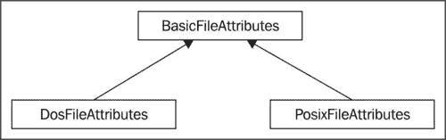

# 三、获取文件和目录信息

在本章中，我们将介绍以下内容：

*   确定文件内容类型
*   使用 getAttribute 方法一次获取单个属性
*   获取文件属性的映射
*   获取文件和目录信息
*   确定操作系统对属性视图的支持
*   使用 BasicFileAttributeView 维护基本文件属性
*   使用 PosixFileAttributeView 维护 POSIX 文件属性
*   使用 DosFileAttributeView 维护 FAT 表属性
*   使用 FileOwnerAttributeView 维护文件所有权属性
*   使用 AclFileAttributeView 维护文件的 ACL
*   使用 UserDefinedFileAttributeView 维护用户定义的文件属性

# 导言

许多应用程序需要访问文件和目录信息。此信息包括文件是否可以执行、文件大小、文件所有者甚至其内容类型等属性。在本章中，我们将研究用于获取文件或目录信息的各种技术。我们已经根据所需的访问类型组织了食谱。

使用 `java.nio.file.Files`类获取文件和目录信息的一般方法有以下五种：

*   使用 `Files`类的特定方法（如 `isDirectory`方法）一次获取单个属性。这在*获取文件和目录信息*配方中有详细说明。
*   使用 `Files`类的 `getAttribute`方法一次获取一个属性。这在使用 getAttribute 方法配方一次获取单个属性的*中有详细说明。*
*   使用 `readAttributes`方法返回属性映射，使用 `String`指定要返回的属性。这在*获取文件属性映射*配方中进行了解释。
*   使用带有 `BasicFileAttributes`派生类的 `readAttributes`方法返回该属性集的属性类。这在使用 BasicFileAttributeView 方法维护基本文件属性的*中有详细说明。*
*   使用 `getFileAttributes`方法返回一个视图，该视图提供对一组特定属性的访问。这在*使用 BasicFileAttributeView 方法维护基本文件属性*配方中也有详细说明。在*中可以找到更多。。*。菜谱的一部分。

通过多种方法支持对属性的动态访问，并允许开发人员使用 `String`指定属性。 `Files`类的 `getAttribute`方法就是这种方法的典型代表。

Java7 引入了许多基于文件视图的接口。视图只是组织文件或目录信息的一种方式。例如， `AclFileAttributeView`提供了与文件的**访问控制列表**（**ACL**相关的方法。 `FileAttributeView`接口是提供特定类型文件信息的其他接口的基础接口。 `java.nio.file.attribute`包中的子接口包括以下内容：

*   `AclFileAttributeView:`用于维护文件的 ACL 和所有权属性
*   `BasicFileAttributeView:`用于访问文件的基本信息，设置与时间相关的属性
*   `DosFileAttributeView:`设计用于遗留**磁盘操作系统**（**DOS**）文件属性的使用
*   `FileOwnerAttributeView:`用于维护文件的所有权
*   `PosixFileAttributeView:`支持**便携式操作系统接口**（**POSIX**）属性
*   `UserDefinedFileAttributeView:`支持文件的自定义属性

视图之间的关系如下所示：

### 注

较低级别的接口继承自它们上面的接口。


`readAttributes`方法的第二个参数指定要返回的属性类型。支持三个属性接口，其关系如下图所示，这些接口提供了访问其对应视图接口的方式：



每一种观点都有一个秘诀。此处不讨论 `FileStoreAttributeView`，而是在[第 4 章](04.html "Chapter 4. Managing Files and Directories")*管理文件和目录*中的*获取文件存储信息*配方中介绍。

本章示例中使用的文件和目录结构在[第 2 章](02.html "Chapter 2. Locating Files and Directories Using Paths")*使用路径*定位文件和目录的介绍中进行了描述。

# 确定文件内容类型

文件的类型通常可以从其扩展名派生。但是，这可能会产生误导，具有相同扩展名的文件可能包含不同类型的数据。如果可能的话， `Files`类的 `probeContentType`方法用于确定文件的内容类型。当应用程序需要指示文件中的内容以进行处理时，这非常有用。

## 准备好了吗

为了确定内容类型，需要完成以下步骤：

1.  获取表示文件的 `Path`对象。
2.  使用 `Path`对象作为 `probeContentType`方法的参数。
3.  使用结果处理文件。

## 怎么做。。。

1.  创建一个新的控制台应用程序。将三种不同类型的文件添加到 `/home/docs`目录。在 `main`方法中使用以下内容。虽然您可以使用您选择的任何文件，但本示例使用文本文件、Word 文档和可执行文件，如下所示：

    ```java
    public static void main(String[] args) throws Exception {
    displayContentType("/home/docs/users.txt");
    displayContentType("/home/docs/Chapter 2.doc");
    displayContentType("/home/docs/java.exe");
    }
    static void displayContentType(String pathText) throws Exception {
    Path path = Paths.get(pathText);
    String type = Files.probeContentType(path);
    System.out.println(type);
    }

    ```

2.  Execute the application. Your output should appear as follows. The type returned is dependent on the actual files you used:

    **文本/普通**

    **应用程序/msword**

    **应用/x-msdownload**

## 它是如何工作的。。。

创建了一个 `java.nio.file.Path`变量，并将其分配给三个不同的文件。对这些文件中的每个文件都执行了 `Files`类的 `probeContentPath`方法。返回的结果是一个 `String`，显示该结果用于说明。 `probeContentType`方法抛出一个 `java.io.IOException`，我们通过 `displayConentType`方法和 `main`方法抛出一个基类异常来处理这个问题。 `probeContentPath`方法也可能抛出 `java.lang.SecurityException`，但您不需要处理。

在本例中使用的文件中，第一个文件是文本文件。返回的类型为**文本/普通**。另外两个是 Word 文档和可执行文件 `java.exe`。返回类型分别为**应用/msword**和**应用/x-msdownload**。

## 还有更多。。。

该方法的结果是**多用途互联网邮件扩展**（**MIME**）：**RFC 2045：多用途互联网邮件扩展（**MIME**）第一部分：互联网消息体格式**定义的 `String`。这允许使用 RFC 2045 语法规范解析 `String`。如果无法识别内容类型，则返回 null。

MIME 类型由类型和具有一个或多个可选参数的子类型组成。使用正斜杠将类型与子类型分开。在以前的输出中，文本文档类型为 text，其子类型为 plain。其他两种类型都是类型应用程序，但具有不同的子类型。以 x-开头的子类型是非标准的。

`probeContentType`方法的实施取决于系统。该方法将使用 `java.nio.file.spi.FileTypeDetector`实现来确定内容类型。它可以检查文件名或可能访问文件属性以确定文件内容类型。大多数操作系统都会维护一个文件检测器列表。将加载此列表中的检测器并用于确定文件类型。 `FileTypeDetector`类未扩展，目前无法确定哪些文件检测器可用。

# 使用 getAttribute 方法一次获取一个属性

如果您对获取单个文件属性感兴趣，并且知道该属性的名称，那么 `Files`类“ `getAttribute`方法简单易用。它将根据表示属性的 `String`返回有关文件的信息。此配方的第一部分说明了 `getAttribute`方法的简单用法。其他可用属性在*中列出，还有更多。。*。这是食谱的一部分。

## 准备好了吗

要获取单个文件属性值，请执行以下操作：

1.  创建一个表示感兴趣文件的 `Path`对象。
2.  将此对象用作 `getAttribute`方法的第一个参数。
3.  使用包含属性名称的 `String`作为方法的第二个参数。

## 怎么做。。。

1.  创建一个新的控制台应用程序，并使用以下 `main`方法。在这种方法中，我们确定文件的大小如下：

    ```java
    public static void main(String[] args) {
    try {
    Path path = FileSystems.getDefault().getPath("/home/docs/users.txt");
    System.out.println(Files.getAttribute(path, "size"));
    }
    catch (IOException ex) {
    System.out.println("IOException");
    }
    }

    ```

2.  The output will be as follows, and will depend upon the actual size of the file used:

    **30**

## 它是如何工作的。。。

创建了一个表示 `users.txt`文件的 `Path`。然后，该路径被用作 `Files`类的 `getAttribute`方法的第一个参数。执行代码时，会显示文件的大小。

## 还有更多。。。

`Files`类“ `getAttribute`方法具有以下三个参数：

*   表示文件的 `Path`对象
*   包含属性名称的 `String`
*   处理符号文件时使用的可选 `LinkOption`

下表列出了可用于此方法的有效属性名称：

<colgroup><col width="1.64652777777778" style="text-align: left"> <col width="1.10805555555556" style="text-align: left"></colgroup> 
| 

属性名

 | 

数据类型

 |
| --- | --- |
| `lastModifiedTime` | 文件时间 |
| `lastAccessTime` | 文件时间 |
| `creationTime` | 文件时间 |
| `size` | 长的 |
| `isRegularFile` | 布尔值 |
| `isDirectory` | 布尔值 |
| `isSymbolicLink` | 布尔值 |
| `isOther` | 布尔值 |
| `fileKey` | 对象 |

如果使用的名称无效，则会发生运行时错误。这是这种方法的主要弱点。例如，如果名称拼写错误，我们将得到一个运行时错误。该方法如下所示，其中指定的属性在属性 `String:`的末尾有一个额外的*s*

```java
System.out.println(Files.getAttribute(path, "sizes"));

```

执行应用程序时，应获得类似以下结果：

**线程“main”java.lang.IllegalArgumentException 中出现异常：**未识别“大小”

**位于 sun.nio.fs.AbstractBasicFileAttributeView$AttributesBuilder。<初始化>（AbstractBasicFile AttributeView.java:102）**

**位于 sun.nio.fs.AbstractBasicFileAttributeView$AttributesBuilder.create（AbstractBasicFileAttributeView.java:112）**

**位于 sun.nio.fs.AbstractBasicFileAttributeView.readAttributes（AbstractBasicFileAttributeView.java:166）**

**位于 sun.nio.fs.AbstractFileSystemProvider.readAttributes（AbstractFileSystemProvider.java:92）**

**位于 java.nio.file.Files.readAttributes（Files.java:1896）**

**位于 java.nio.file.Files.getAttribute（Files.java:1801）**

**位于 packt.SingleAttributeExample.main（SingleAttributeExample.java:15）**

**Java 结果：1**

如*获取文件属性映射*配方中所述，可以获取文件属性列表。这可用于避免使用无效名称。

# 获取文件属性映射

访问文件属性的另一种方法是使用 `Files`类的 `readAttributes`方法。此方法有两个重载版本，它们的第二个参数和返回数据类型不同。在本配方中，我们将探索返回 `java.util.Map`对象的版本，因为它允许在返回哪些属性方面具有更大的灵活性。该方法的第二个版本在一系列配方中讨论，每个配方都专门用于特定的属性类。

## 准备好了吗

要获取 `Map`对象形式的属性列表，需要执行以下步骤：

1.  创建一个表示文件的 `Path`对象。
2.  对 `Files`类应用静态 `readAttributes`方法。
3.  指定其参数的值：

    *   表示感兴趣文件的 `Path`对象
    *   表示要返回的属性的 `String`参数
    *   指定是否应遵循符号链接的可选第三个参数

## 怎么做。。。

1.  创建一个新的控制台应用程序。使用以下 `main`方法：

    ```java
    public static void main(String[] args) throws Exception {
    Path path = Paths.getPath("/home/docs/users.txt");
    try {
    Map<String, Object> attrsMap = Files.readAttributes(path, "*");
    Set<String> keys = attrsMap.keySet();
    for(String attribute : keys) {
    out.println(attribute + ": "
    + Files.getAttribute(path, attribute));
    }
    }
    }

    ```

2.  Execute the application. Your output should appear similar to the following:

    **上次修改时间：2011-09-06T01:26:56.501665Z**

    **文件密钥：空**

    **isDirectory:false**

    **最后访问时间：2011-09-06T21:14:11.214057Z**

    **等温线：假**

    **isSymbolicLink:false**

    **isRegularFile:true**

    **创建时间：2011-09-06T21:14:11.214057Z**

    **尺寸：30**

## 它是如何工作的。。。

该示例使用了 `docs`目录中的 `users.txt`文件。声明键类型为 `String`且值类型为 `Object`的 `Map`对象，然后从 `readAttributes`方法中分配一个值。使用 `Map`接口的 `keySet`方法创建了 `java.util.Set`对象。这使我们能够访问 `Map`的键和值。在 for-each 循环中，集合的每个成员都被用作 `getAttribute`方法的参数。该文件显示了相应的属性及其值。 `getAttribute`方法在*使用 getAttribute 方法*配方一次获取单个属性中进行了说明。

在本例中，我们使用字符串文字 `"*`作为第二个参数。该值指示方法返回文件的所有可用属性。我们将很快看到，其他字符串值可用于获得不同的结果。

`readAttributes`方法是一种原子文件系统操作。默认情况下，后面跟着符号链接。要使方法不遵循符号链接，请使用 `java.nio.file`包的 `LinkOption.NOFOLLOW_LINKS`枚举常量，如下所示：

```java
Map<String, Object> attrsMap = Files.readAttributes(path, "*", LinkOption.NOFOLLOW_LINKS);

```

## 还有更多。。。

这种方法的有趣之处在于它的第二个参数。 `String`参数的语法包括可选的 `viewName`和冒号，后跟属性列表。 `viewName`通常是以下情况之一：

*   国际计算语言学协会
*   基本的
*   物主
*   使用者
*   磁盘操作系统
*   posix

这些 `viewNames`中的每一个对应于视图接口的名称。

属性列表是以逗号分隔的属性列表。属性列表可能包含零个或多个元素。如果使用了无效的元素名称，将忽略它。使用星号将返回与该 `viewName`相关的所有属性。如果不包括一个 `viewName`，则返回所有基本文件属性，如前所示。

以基本视图为例，下表说明了如何选择返回哪些属性：

<colgroup><col width="2.71111111111111" style="text-align: left"> <col width="2.78194444444444" style="text-align: left"></colgroup> 
| 

一串

 | 

返回的属性

 |
| --- | --- |
| `"*"` | 所有基本文件属性 |
| `"basic:*"` | 所有基本文件属性 |
| `"basic:isDirectory,lastAccessTime` | 只有 `isDirectory`和 `lastAccessTime`属性 |
| `"isDirectory,lastAccessTime` | 只有 `isDirectory`和 `lastAccessTime`属性 |
| `""` | 无-生成一个 `java.lang.IllegalArgumentException` |

属性 `String`的使用方式与基本视图以外的视图相同。

### 提示

属性 `String`中不能有任何嵌入空格。例如， `String, "basic:isDirectory, lastAccessTime`，其中逗号后有一个空格将导致一个 `IllegalArgumentException`。

# 获取文件和目录信息

经常需要检索有关文件或目录的基本信息。本食谱研究 `java.nio.file.Files`类如何提供直接支持。这些方法仅提供对文件和目录信息的部分访问，并以 `isRegularFile`方法为代表。在*中可以找到此类方法的列表，还有更多。。*。这是食谱的一部分。

## 准备好了吗

使用 `Files`类的方法来显示信息很容易，因为这些方法中的大多数（如果不是全部的话）都是静态的。这意味着这些方法可以很容易地针对 `Files`类名执行。要使用此技术：

1.  创建一个表示文件或目录的 `Path`对象。
2.  使用 `Path`对象作为相应的 `Files`类方法的参数。

## 怎么做。。。

1.  为了演示如何获取文件属性，我们将开发一种显示文件属性的方法。创建包含以下 `main`方法的新控制台应用程序。在该方法中，我们创建一个对文件的引用，然后调用一个 `displayFileAttribute`方法。使用以下几种方法显示路径信息：

    ```java
    public static void main(String[] args) throws Exception {
    Path path = FileSystems.getDefault().getPath("/home/docs/users.txt");
    displayFileAttributes(path);
    }
    private static void displayFileAttributes(Path path) throws Exception {
    String format =
    "Exists: %s %n"
    + "notExists: %s %n"
    + "Directory: %s %n"
    + "Regular: %s %n"
    + "Executable: %s %n"
    + "Readable: %s %n"
    + "Writable: %s %n"
    + "Hidden: %s %n"
    + "Symbolic: %s %n"
    + "Last Modified Date: %s %n"
    + "Size: %s %n";
    System.out.printf(format,
    Files.exists(path, LinkOption.NOFOLLOW_LINKS),
    Files.notExists(path, LinkOption.NOFOLLOW_LINKS),
    Files.isDirectory(path, LinkOption.NOFOLLOW_LINKS),
    Files.isRegularFile(path, LinkOption.NOFOLLOW_LINKS),
    Files.isExecutable(path),
    Files.isReadable(path),
    Files.isWritable(path),
    Files.isHidden(path),
    Files.isSymbolicLink(path),
    Files.getLastModifiedTime(path, LinkOption.NOFOLLOW_LINKS),
    Files.size(path));
    }

    ```

2.  Execute the program. Your output should appear as follows:

    **存在：真**

    **notExists:false**

    **目录：假**

    **常规：真**

    **可执行文件：真**

    **可读：正确**

    **可写：真**

    **隐藏：假**

    **符号：假**

    **上次修改日期：2011-10-20T03:18:20.338139Z**

    **尺寸：29**

## 它是如何工作的。。。

已创建到 `users.txt`文件的 `Path`。然后将这个 `Path`对象传递给 `displayFileAttribute`方法，该方法显示文件的许多属性。下表总结了返回这些属性的方法：

<colgroup><col width="1.66652777777778" style="text-align: left"> <col width="3.82652777777778" style="text-align: left"></colgroup> 
| 

方法

 | 

描述

 |
| --- | --- |
| `exists` | 如果文件存在，则返回 `true` |
| `notExists` | 如果文件不存在，则返回 `true` |
| `isDirectory` | 如果路径代表目录，则返回 `true` |
| `isRegularFile` | 如果路径代表常规文件，则返回 `true` |
| `isExecutable` | 返回 `true`文件是否可以执行 |
| `isReadable` | 如果文件可以读取，则返回 `true` |
| `isWritable` | 如果文件可以写入，则返回 `true` |
| `isHidden` | 如果文件被隐藏且非特权用户不可见，则返回 `true` |
| `isSymbolicLink` | 如果文件是符号链接，则返回 `true` |
| `getLastModifiedTime` | 返回上次修改文件的时间 |
| `size` | 返回文件的大小 |

其中一些方法具有第二个参数，用于指定如何处理符号链接。当 `LinkOption.NOFOLLOW_LINKS`存在时，则不遵循符号链接。第二个参数是可选的。如果省略了它，则不遵循符号链接。符号链接在[第 2 章](02.html "Chapter 2. Locating Files and Directories Using Paths")的*管理符号链接*配方*使用路径*定位文件和目录中进行了讨论。

## 还有更多。。。

下表总结了抛出的异常，以及该方法是否为非原子方法。如果不允许调用线程读取文件，则可能抛出 `SecurityException`的方法将抛出该文件。

### 注

当一个方法被称为**非原子**时，这意味着其他文件系统操作可以与该方法并发执行。非原子操作可能会导致不一致的结果。也就是说，针对方法目标的并发操作可能会导致在这些方法执行时修改文件的状态。使用这些方法时应考虑这一点。

标记为过期的这些方法的结果在返回时不一定有效。也就是说，不能保证任何后续访问会成功，因为文件可能已被删除或以其他方式修改。

无法确定指定为**的方法**表示，如果无法以其他方式确定结果，则可以返回 `false`。例如， `exists`方法如果无法确定文件是否存在，则返回 `false`。它可能存在，但该方法无法确定它是否存在：

<colgroup><col width="1.56" style="text-align: left"> <col width="1.13" style="text-align: left"> <col width="0.790000000000001" style="text-align: left"> <col width="0.54" style="text-align: left"> <col width="0.659999999999999" style="text-align: left"> <col width="0.820000000000001" style="text-align: left"></colgroup> 
| 

方法

 | 

安全例外

 | 

IOException

 | 

非原子

 | 

过时的

 | 

无法确定

 |
| --- | --- | --- | --- | --- | --- |
| `exists` | 对 |   |   | 对 | 对 |
| `notExists` | 对 |   |   | 对 | 对 |
| `isDirectory` | 对 |   |   |   | 对 |
| `isRegularFile` | 对 |   |   |   | 对 |
| `isExecutable` | 对 |   | 对 | 对 | 对 |
| `isReadable` | 对 |   | 对 | 对 | 对 |
| `isWritable` | 对 |   | 对 | 对 | 对 |
| `isHidden` | 对 | 对 |   |   |   |
| `isSymbolicLink` | 对 |   |   |   | 对 |
| `getLastModifiedTime` | 对 | 对 |   |   |   |
| `size` | 对 | 对 |   |   |   |

注意， `notExists`方法与 `exists`方法不同。使用任何一种方法，都可能无法确定文件是否存在。在这种情况下，两种方法都将返回 `false`。

`isRegularFile`确定该文件是否为常规文件。 `isDirectory, isSymbolicLink`和 `isRegularFile`方法都可以返回 `false`，如果：

*   它不是那种类型
*   如果文件不存在或
*   如果无法确定它是文件还是目录

对于这些方法， `BasicFileAttributes`界面中对应的方法可以提供更好的结果。这些方法包含在使用 BasicFileAttributeView 方法维护基本文件属性的*中。*

`isExecutable`方法检查该文件是否存在，以及 JVM 是否具有执行该文件的访问权限。如果文件是目录，则该方法确定 JVM 是否有足够的权限搜索该目录。如果：则返回 `false`

*   该文件不存在
*   该文件不可执行
*   如果无法确定它是否可执行

隐藏的含义取决于系统。在 UNIX 系统上，如果文件名以句点开头，则文件将隐藏。在 Windows 上，如果设置了 DOS HINDED 属性，则文件将隐藏。

# 确定操作系统对属性视图的支持

操作系统可能不支持 Java 中的所有属性视图。有三种基本技术可用于确定支持哪些视图。了解哪些视图受支持可以使开发人员避免在尝试使用不受支持的视图时可能发生的异常。

## 准备好了吗

这三种技术包括：

*   `java.nio.file.FileSystem`类“ `supportedFileAttributeViews`方法返回一组支持的所有视图。
*   带有类参数的 `java.nio.file.FileStore`类“ `supportsFileAttributeView`方法。如果支持该类，则该方法将返回 `true`。
*   `FileStore`类的 `supportsFileAttributeView`方法带有 `String`参数。如果支持该 `String`表示的类，则该方法将返回 `true`。

第一种方法是最简单的，将首先说明。

## 怎么做。。。

1.  使用以下 `main`方法创建一个新的控制台应用程序。在此方法中，我们将显示当前系统支持的所有视图，如下所示：

    ```java
    public static void main(String[] args)
    Path path = Paths.get("C:/home/docs/users.txt");
    FileSystem fileSystem = path.getFileSystem();
    Set<String> supportedViews = fileSystem.supportedFileAttributeViews();
    for(String view : supportedViews) {
    System.out.println(view);
    }
    }

    ```

2.  When the application is executed on a Windows 7 system, you should get the following output:

    **acl**

    **基础**

    **业主**

    **用户**

    **dos**

3.  When the application is executed under Ubuntu, version 10.10, you should get the following output:

    **基础**

    **业主**

    **用户**

    **unix**

    **dos**

    **posix**

请注意，不支持**acl**视图，并且支持**unix**和**posix**视图。Java 7 版本中没有可用的 `UnixFileAttributeView`。但是，该接口可以作为 JSR203 backport 项目的一部分找到。

## 它是如何工作的。。。

为 `users.txt`文件创建了一个 `Path`对象。接下来使用 `getFileSystem`方法获取此 `Path`的文件系统。 `FileSystem`类拥有 `supportedFileAttributeViews`方法，该方法返回一组表示支持的视图的字符串。然后使用 for-each 循环来显示每个字符串值。

## 还有更多。。。

我们还可以使用另外两种方法来确定支持哪些视图：

*   使用带有类参数的 `supportsFileAttributeView`方法
*   使用带有 `String`参数的 `supportsFileAttributeView`方法

这两种技术非常相似。它们都允许您测试特定视图。

### 使用带有类参数的 supportsFileAttributeView 方法

重载的 `supportsFileAttributeView`方法接受一个表示该视图的类对象。将以下代码添加到上一个示例的 `main`方法中。在这段代码中，我们确定支持几个视图中的哪一个：

```java
try {
FileStore fileStore = Files.getFileStore(path);
System.out.println("FileAttributeView supported: " + fileStore.supportsFileAttributeView(
FileAttributeView.class));
System.out.println("BasicFileAttributeView supported: " + fileStore.supportsFileAttributeView(
BasicFileAttributeView.class));
System.out.println("FileOwnerAttributeView supported: " + fileStore.supportsFileAttributeView(
FileOwnerAttributeView.class));
System.out.println("AclFileAttributeView supported: " + fileStore.supportsFileAttributeView(
AclFileAttributeView.class));
System.out.println("PosixFileAttributeView supported: " + fileStore.supportsFileAttributeView(
PosixFileAttributeView.class));
System.out.println("UserDefinedFileAttributeView supported: " + fileStore.supportsFileAttributeView(
UserDefinedFileAttributeView.class));
System.out.println("DosFileAttributeView supported: " + fileStore.supportsFileAttributeView(
DosFileAttributeView.class));
}
catch (IOException ex) {
System.out.println("Attribute view not supported");
}

```

在 Windows 7 计算机上执行时，应获得以下输出：

**支持 FileAttributeView:false**

**支持的 BasicFileAttributeView：true**

**支持的 FileOwnerAttributeView：true**

**支持的 AclFileAttributeView：true**

**支持 PosixFileAttributeView：false**

**支持的 UserDefinedFileAttributeView：true**

**支持的 DosFileAttributeView：true**

### 使用带有字符串参数的 supportsFileAttributeView 方法

重载的 `supportsFileAttributeView`方法接受 `String`对象，其工作方式类似。将以下代码添加到 `main`方法的 try 块：

```java
System.out.println("FileAttributeView supported: " + fileStore.supportsFileAttributeView(
"file"));
System.out.println("BasicFileAttributeView supported: " + fileStore.supportsFileAttributeView(
"basic"));
System.out.println("FileOwnerAttributeView supported: " + fileStore.supportsFileAttributeView(
"owner"));
System.out.println("AclFileAttributeView supported: " + fileStore.supportsFileAttributeView(
"acl"));
System.out.println("PosixFileAttributeView supported: " + fileStore.supportsFileAttributeView(
"posix"));
System.out.println("UserDefinedFileAttributeView supported: " + fileStore.supportsFileAttributeView(
"user"));
System.out.println("DosFileAttributeView supported: " + fileStore.supportsFileAttributeView(
"dos"));

```

在 Windows 7 平台上执行时，应获得以下输出：

**支持 FileAttributeView:false**

**支持的 BasicFileAttributeView：true**

**支持的 FileOwnerAttributeView：true**

**支持的 AclFileAttributeView：true**

**支持 PosixFileAttributeView：false**

**支持的 UserDefinedFileAttributeView：true**

**支持的 DosFileAttributeView：true**

# 使用 BasicFileAttributeView 维护基本文件属性

`java.nio.file.attribute.BasicFileAttributeView`提供了一系列获取文件基本信息的方法，如文件的创建时间和大小。视图拥有一个 `readAttributes`方法，该方法返回一个 `BasicFileAttributes`对象。 `BasicFileAttributes`接口具有多种访问文件属性的方法。此视图提供了一种获取文件信息的替代方法，而不是 `Files`类所支持的方法。这种方法的结果有时可能比 `Files`类的结果更可靠。

## 准备好了吗

获取 `BasicFileAttributes`对象有两种方法。第一种方法是使用 `readAttributes`方法，该方法使用 `BasicFileAttributes.class`作为第二个参数。第二种方法使用 `getFileAttributeView`方法，并在*中进行了探讨，还有更多。。*。这是食谱的一部分。

`Files`类的 `readAttributes`方法最容易使用：

1.  使用表示感兴趣文件的 `Path`对象作为第一个参数。
2.  使用 `BasicFileAttributes.class`作为第二个参数。
3.  使用返回的 `BasicFileAttributes`对象方法访问文件属性。

此基本方法用于本章中说明的其他视图。只有属性视图类不同。

## 怎么做。。。

1.  创建一个新的控制台应用程序。使用以下 `main`方法。在该方法中，我们创建一个 `BasicFileAttributes`对象，并使用其方法显示关于文件的信息：

    ```java
    public static void main(String[] args) {
    Path path
    = FileSystems.getDefault().getPath("/home/docs/users.txt");
    try {
    BasicFileAttributes attributes = Files.readAttributes(path, BasicFileAttributes.class);
    System.out.println("Creation Time: " + attributes.creationTime());
    System.out.println("Last Accessed Time: " + attributes.lastAccessTime());
    System.out.println("Last Modified Time: " + attributes.lastModifiedTime());
    System.out.println("File Key: " + attributes.fileKey());
    System.out.println("Directory: " + attributes.isDirectory());
    System.out.println("Other Type of File: " + attributes.isOther());
    System.out.println("Regular File: " + attributes.isRegularFile());
    System.out.println("Symbolic File: " + attributes.isSymbolicLink());
    System.out.println("Size: " + attributes.size());
    }
    catch (IOException ex) {
    System.out.println("Attribute error");
    }
    }

    ```

2.  Execute the application. Your output should be similar to the following:

    **创建时间：2011-09-06T21:14:11.214057Z**

    **上次访问时间：2011-09-06T21:14:11.214057Z**

    **上次修改时间：2011-09-06T01:26:56.501665Z**

    **文件密钥：空**

    **目录：假**

    **其他类型文件：false**

    **常规文件：真**

    **符号文件：false**

    **尺寸：30**

## 它是如何工作的。。。

首先，我们创建了一个表示 `users.txt`文件的 `Path`对象。接下来，我们使用 `Files`类的 `readAttributes`方法获得了一个 `BasicFileAttributes`对象。该方法的第一个参数是一个 `Path`对象。第二个参数指定要返回的对象的类型。在本例中，它是一个 `BasicFileAttributes.class`对象。

随后是一系列打印语句，这些语句显示有关文件的特定属性信息。 `readAttributes`方法检索文件的所有基本文件属性。因为它可以抛出一个 `IOException`，所以代码序列被封装在一个 try 块中。

大多数 `BasicFileAttributes`接口方法都很容易理解，但有一些需要进一步解释。首先，如果 `isOther`方法返回 `true`，则表示该文件不是常规文件、目录或符号链接。此外，尽管文件大小以字节为单位，但由于文件压缩和稀疏文件的实现等问题，实际大小可能不同。如果文件不是常规文件，则返回值的含义取决于系统。

`fileKey`方法返回唯一标识该文件的对象。在 UNIX 中，设备 id 或 inode 用于此目的。如果文件系统及其文件发生更改，则文件密钥不一定是唯一的。它们可以使用 `equals`方法进行比较，并可用于收集。同样，假设文件系统没有以影响文件密钥的方式进行更改。在[第 2 章](02.html "Chapter 2. Locating Files and Directories Using Paths")*使用路径*定位文件和目录的[第 2 章](02.html "Chapter 2. Locating Files and Directories Using Paths")中的*确定两条路径是否等效*配方中介绍了两个文件的比较。

## 还有更多。。。

获取对象的另一种方法是使用 `Files`类的 `getFileAttributeView`方法。它返回一个基于第二个参数的 `AttributeView`派生的 `object`。要获取 `BasicFileAttributeView`对象的实例：

1.  使用表示感兴趣文件的 `Path`对象作为第一个参数。
2.  Use the `BasicFileAttributeView` as the second argument.

    而不是使用以下语句：

    ```java
    BasicFileAttributes attributes = Files.readAttributes(path, BasicFileAttributes.class);

    ```

    我们可以将其替换为以下代码序列：

    ```java
    BasicFileAttributeView view = Files.getFileAttributeView(path, BasicFileAttributeView.class);
    BasicFileAttributes attributes = view.readAttributes();

    ```

    使用 getFileAttributeView 方法返回一个`BasicFileAttributeView`对象。readAttributes 方法然后返回 BasicFileAttributes 对象。这种方法更长，但我们现在可以使用三种额外的方法，如下所示：

    *   `name:`返回属性视图的名称
    *   `readAttributes:`返回一个 `BasicFileAttributes`对象
    *   `setTimes:`用于设置文件的时间属性

3.  然后我们使用如下所示的 `name`方法：

    ```java
    System.out.println("Name: " + view.name());

    ```

这将产生以下输出：

**名称：基础**

然而，这并没有为我们提供多少有用的信息。 `setTimes`方法见[第 4 章](04.html "Chapter 4. Managing Files and Directories")*管理文件和目录*中*设置文件或目录*配方的时间相关属性。

# 使用 PosixFileAttributeView 维护 POSIX 文件属性

许多操作系统支持**便携式操作系统接口**（**POSIX**标准）。这为编写可跨操作系统移植的应用程序提供了一种更具可移植性的方法。Java 7 支持使用 `java.nio.file.attribute.PosixFileAttributeView`接口访问文件属性。

并非所有操作系统都支持 POSIX 标准。*确定操作系统对属性视图的支持*配方说明了如何确定特定操作系统是否支持 POSIX。

## 准备好了吗

为了获得文件或目录的 POSIX 属性，我们需要执行以下操作：

1.  创建一个表示感兴趣的文件或目录的 `Path`对象。
2.  使用 `getFileAttributeView`方法获取 `PosixFileAttributeView`接口实例。
3.  使用 `readAttributes`方法获得一组属性。

## 怎么做。。。

1.  创建一个新的控制台应用程序。使用下面的 `main`方法。在该方法中，我们获取 `users.txt`文件的属性如下：

    ```java
    public static void main(String[] args) throws Exception {
    Path path = Paths.get("home/docs/users.txt");
    FileSystem fileSystem = path.getFileSystem();
    PosixFileAttributeView view = Files.getFileAttributeView(path, PosixFileAttributeView.class);
    PosixFileAttributes attributes = view.readAttributes();
    System.out.println("Group: " + attributes.group());
    System.out.println("Owner: " + attributes.owner().getName());
    Set<PosixFilePermission> permissions = attributes.permissions();
    for(PosixFilePermission permission : permissions) {
    System.out.print(permission.name() + " ");
    }
    }

    ```

2.  Execute the application. Your output should appear as follows. The owner names will probably be different. In this case, it is **richard:**

    **组：richard**

    **所有者：理查德**

    **所有者\读取所有者\写入他人\读取组\读取**

## 它是如何工作的。。。

为 `users.txt`文件创建了一个 `Path`对象。这被用作 `Files`类的 `getFileAttributeView`方法的第一个参数。第二个论点是 `PosixFileAttributeView.class`。返回了一个 `PosixFileAttributeView`对象。

接下来，使用 `readAttributes`方法获得 `PosixFileAttributes`接口的一个实例。使用 `group`和 `getName`方法显示文件的组和所有者。permissions 方法返回了一组 `PosixFilePermission`枚举。这些枚举表示分配给文件的权限。

## 还有更多。。。

`PosixFileAttributes`接口扩展了 `java.nio.file.attribute.BasicFileAttributes`接口，因此可以访问其所有方法。 `PosixFileAttributeView`接口扩展了 `java.nio.file.attribute.FileOwnerAttributeView`和 `BasicFileAttributeView`接口，并继承了它们的方法。

`PosixFileAttributeView`接口有 `setGroup`方法，可用于配置文件的组所有者。可以使用 `setPermissions`方法维护该文件的权限。维护文件权限在[第 4 章](04.html "Chapter 4. Managing Files and Directories")*管理文件和目录*中的*管理 POSIX 属性*配方中讨论。

## 另见

*使用 BasicFileAttributeView*配方维护基本文件属性详细说明了此视图中可用的属性。*使用 FileOwnerAttributeView*配方维护文件所有权属性讨论所有权问题。要确定操作系统是否支持 POSIX，请查看*确定操作系统对属性视图的支持*配方。

# 使用 DosFileAttributeView 维护 FAT 表属性

`java.nio.file.attribute.DosFileAttributeView`涉及较旧的**磁盘操作系统**（**DOS**文件）。它在当今大多数计算机上的价值有限。但是，这是唯一可用于确定文件是标记为存档还是系统文件的界面。

## 准备好了吗

使用 `DosFileAttributeView`界面：

1.  使用 `Files`类的 `getFileAttributeView`方法获取 `DosFileAttributeView`的实例。
2.  使用视图的 `readAttributes`方法返回 `DosFileAttributes`的实例。
3.  使用 `DosFileAttributes`类方法获取文件信息。

此视图支持以下四种方法：

*   `isArchive:`与文件是否需要备份有关
*   `isHidden:`如果用户看不到该文件，则返回 `true`
*   `isReadOnly:`如果文件只能读取，则返回 `true`
*   `isSystem:`如果文件是操作系统的一部分，则返回 `true`

## 怎么做。。。

1.  创建一个新的控制台应用程序，并添加以下 `main`方法。在这个方法中，我们创建了一个 `DosFileAttributes`实例，然后使用它的方法来显示关于文件的信息：

    ```java
    public static void main(String[] args) {
    Path path = FileSystems.getDefault().getPath("/home/docs/users.txt");
    try {
    DosFileAttributeView view = Files.getFileAttributeView(path, DosFileAttributeView.class);
    DosFileAttributes attributes = view.readAttributes();
    System.out.println("isArchive: " + attributes.isArchive());
    System.out.println("isHidden: " + attributes.isHidden());
    System.out.println("isReadOnly: " + attributes.isReadOnly());
    System.out.println("isSystem: " + attributes.isSystem());
    }
    catch (IOException ex) {
    ex.printStackTrace();
    }
    }

    ```

2.  Execute the program. Your output should appear as follows:

    **isArchive:true**

    **伊希登：假**

    **isReadOnly:false**

    **isSystem:false**

## 它是如何工作的。。。

创建了一个表示 `users.txt`文件的 `Path`对象。此对象与 `DosFileAttributeView.class`一起用作 `Files`类的 `getFileAttributeView`方法的参数。返回了 `DosFileAttributeView`接口的一个实例。这用于创建 `DosFileAttributes`接口的实例，该实例与接口的四种方法一起使用。

`DosFileAttributeView`扩展了 `BasicFileAttributes`接口，因此继承了其所有属性，如*使用 BasicFileAttributeView*配方维护基本文件属性中所述。

## 另见

有关其方法的更多信息，请参见*使用 BasicFileAttributeView*配方维护基本文件属性。

# 使用 FileOwnerAttributeView 维护文件所有权属性

如果我们只对访问文件或目录所有者的信息感兴趣， `java.nio.file.attribute.FileOwnerAttributeView`接口提供了检索和设置此类信息的方法。[第 4 章](04.html "Chapter 4. Managing Files and Directories")*管理文件和目录*的*设置文件和目录所有者*配方中包含了文件所有权的设置。

## 准备好了吗

要检索文件的所有者，请执行以下操作：

1.  获取 `FileOwnerAttributeView`接口实例。
2.  使用其 `getOwner`方法返回代表所有者的 `UserPrincipal`对象。

## 怎么做。。。

1.  创建一个新的控制台应用程序。添加以下 `main`方法。在此方法中，我们将确定 `users.txt`文件的所有者如下：

    ```java
    public static void main(String[] args) {
    Path path = Paths.get("C:/home/docs/users.txt");
    try {
    FileOwnerAttributeView view = Files.getFileAttributeView(path, FileOwnerAttributeView.class);
    UserPrincipal userPrincipal = view.getOwner();
    System.out.println(userPrincipal.getName());
    }
    catch (IOException e) {
    e.printStackTrace();
    }
    }

    ```

2.  Execute the application. Your output should be similar to the following, except the PC and usernames should be different.

    **李察电脑\李察**

## 它是如何工作的。。。

为 `users.txt`文件创建了一个 `Path`对象。接下来，使用 `Path`对象作为第一个参数调用 `Files`类的 `getFileAttributeView`方法。第二个参数是 `FileOwnerAttributeView.class`，它为返回的文件生成一个 `FileOwnerAttributeView`对象。

然后调用视图的 `getOwner`方法返回 `UserPrincipal`对象。它的 `getName`方法返回用户的名称，然后显示该名称。

## 另见

有关其方法的更多信息，请参见*使用 BasicFileAttributeView*配方维护基本文件属性。

# 使用 AclFileAttributeView 维护文件的 ACL

`java.nio.file.attribute.AclFileAttributeView`接口提供对文件或目录的 ACL 属性的访问。这些属性包括用户主体、属性类型以及文件的标志和权限。使用此界面的能力允许用户确定哪些权限可用并修改这些属性。

## 准备好了吗

要确定文件或目录的属性：

1.  创建一个表示该文件或目录的 `Path`对象。
2.  将此 `Path`对象用作 `Files`类的 `getFileAttributeView`方法的第一个参数。
3.  使用 `AclFileAttributeView.class`作为第二个参数。
4.  使用返回的 `AclFileAttributeView`对象访问该文件或目录的 ACL 条目列表。

## 怎么做。。。

1.  创建一个新的控制台应用程序。在 `main`方法中，我们将检查 `users.txt`文件的 ACL 属性。 `getFileAttributeView`方法用于获取视图并访问 ACL 条目列表。两个助手方法用于支持此示例： `displayPermissions`和 `displayEntryFlags`。使用以下 `main`方法：

    ```java
    public static void main(String[] args) {
    Path path = Paths.get("C:/home/docs/users.txt");
    try {
    AclFileAttributeView view = Files.getFileAttributeView(path, AclFileAttributeView.class);
    List<AclEntry> aclEntryList = view.getAcl();
    for (AclEntry entry : aclEntryList) {
    System.out.println("User Principal Name: " + entry.principal().getName());
    System.out.println("ACL Entry Type: " + entry.type());
    displayEntryFlags(entry.flags());
    displayPermissions(entry.permissions());
    System.out.println();
    }
    }
    catch (IOException e) {
    e.printStackTrace();
    }
    }

    ```

2.  创建方法 `displayPermissions`显示文件权限列表如下：

    ```java
    private static void displayPermissions(Set<AclEntryPermission> permissionSet) {
    if (permissionSet.isEmpty()) {
    System.out.println("No Permissions present");
    }
    else {
    System.out.println("Permissions");
    for (AclEntryPermission permission : permissionSet) {
    System.out.print(permission.name() + " " );
    }
    System.out.println();
    }
    }

    ```

3.  创建方法 `displayEntryFlags`方法，显示文件的 ACL 标志列表如下：

    ```java
    private static void displayEntryFlags(Set<AclEntryFlag> flagSet) {
    if (flagSet.isEmpty()) {
    System.out.println("No ACL Entry Flags present");
    }
    else {
    System.out.println("ACL Entry Flags");
    for (AclEntryFlag flag : flagSet) {
    System.out.print(flag.name() + " ");
    }
    System.out.println();
    }
    }

    ```

4.  Execute the application. You should get an output similar to the following:

    **用户主体名称：内置\管理员**

    **ACL 录入类型：允许**

    **不存在 ACL 进入标志**

    **权限**

    **写入属性执行删除读取属性写入数据读取 ACL 读取数据写入所有者读取命名属性写入 ACL 附加数据同步删除子写入命名属性**

    **用户主体名称：NT AUTHORITY\SYSTEM**

    **ACL 录入类型：允许**

    **不存在 ACL 进入标志**

    **权限**

    **写入属性执行删除读取属性写入数据读取 ACL 读取数据写入所有者读取命名属性写入 ACL 附加数据同步删除子写入命名属性**

    **用户主体名称：内置\用户**

    **ACL 录入类型：允许**

    **不存在 ACL 进入标志**

    **权限**

    **读取\u 数据读取\u 命名为\u ATTRS 执行同步读取\u 属性读取\u ACL**

    **用户主体名称：NT 权威\认证用户**

    **ACL 录入类型：允许**

    **不存在 ACL 进入标志**

    **权限**

    **读取\数据读取\命名\属性写入\属性执行删除追加\数据同步读取\属性写入\命名\属性写入\数据读取\ ACL**

## 它是如何工作的。。。

在 `users.txt`文件中创建了一个 `Path`。然后将其与 `AclFileAttributeView.class`参数一起用作 `getFileAttributeView`方法的参数。这返回了一个 `AclFileAttributeView`的实例。

`AclFileAttributeView`接口有三种方式： `name, getAcl`和 `setAcl`。对于本例，仅使用了 `getAcl`方法，该方法返回 `AclEntry`元素的列表。每个条目表示文件的特定 ACL。

使用 for-each 循环在列表中迭代。将显示用户主体的名称和条目类型。接下来调用了 `displayEntryFlags`和 `displayPermissions`方法，以显示有关条目的更多信息。

这两种方法在构造上相似。进行检查以确定集合中是否有任何元素，并显示相应的消息。接下来，集合的每个元素都显示在一行上，以节省输出上的垂直空间。

## 还有更多。。。

`AclFileAttributeView`来自 `java.nio.file.attribute.FileOwnerAttributeView`接口。这提供了对 `getOwner`和 `setOwner`方法的访问。这些方法分别为文件或目录返回或设置一个 `UserPrincipal`对象。

有三种 `AclFileAttributeView`方法：

*   `getAcl`方法，返回 ACL 条目列表，如前所示
*   `setAcl`方法，它允许我们向文件添加新属性
*   `name`方法，简单返回**acl**

`getAcl`方法将返回 `AclEntrys`的列表。条目的元素之一是 `java.nio.file.attribute.UserPrincipal`对象。正如我们在前面的示例中看到的，这表示有权访问该文件的用户。访问用户的另一种方法是使用 `java.nio.file.attribute.UserPrincipalLookupService`类。这个类的一个实例可以通过 `FileSystem`类的 `getUserPrincipalLookupService`方法获得，如下图：

```java
try {
UserPrincipalLookupService lookupService = FileSystems.getDefault().getUserPrincipalLookupService();
GroupPrincipal groupPrincipal = lookupService.lookupPrincipalByGroupName("Administrators");
UserPrincipal userPrincipal = lookupService.lookupPrincipalByName("Richard");
System.out.println(groupPrincipal.getName());
System.out.println(userPrincipal.getName());
}
catch (IOException e) {
e.printStackTrace();
}

```

该服务有两种方法可以通过用户名或组名查找用户。在前面的代码中，我们使用了 `Administrators`组和用户 `Richard`。

将此代码添加到前面的示例中，并更改名称以反映系统中的组和用户。当代码执行时，您将收到类似以下内容的输出：

**内置\管理员**

**李察电脑\李察**

但是，请注意， `UserPrincipal`和 `java.nio.file.attribute.GroupPrincipal`对象的方法提供的信息比用户的名称多不了多少。用户名或组名可能区分大小写，也可能不区分大小写，具体取决于操作系统。如果使用了无效的名称，将抛出一个 `java.nio.file.attribute.UserPrincipalNotFoundException`。

## 另见

管理文件所有权和权限在*设置文件和目录所有者*配方中的[第 4 章](04.html "Chapter 4. Managing Files and Directories")、*管理文件和目录*中讨论。[第 4 章](04.html "Chapter 4. Managing Files and Directories")中还包括了 ACL 属性的设置，如*管理 ACL 文件权限*配方中所示。

# 使用 UserDefinedFileAttributeView 维护自定义文件属性

`java.nio.file.attribute.UserDefinedFileAttributeView`接口允许将非标准属性附加到文件或目录。这些类型的属性有时称为**扩展**属性。通常，用户定义的属性存储有关文件的元数据。文件系统不一定理解或使用这些数据。

这些属性存储为名称/值对。名称为 `String`，值存储为 `ByteBuffer`对象。此缓冲区的大小不应超过 `Integer.MAX_VALUE`。

## 准备好了吗

用户定义的属性必须首先附加到文件。这是通过以下方式实现的：

1.  获取 `UserDefinedFileAttributeView`对象的实例
2.  以 `String`名称和 `ByteBuffer`值的形式创建属性
3.  使用 `write`方法将属性附加到文件

*中说明了读取用户定义属性的过程，还有更多。。*。这是食谱的一部分。

## 怎么做。。。

1.  创建一个新的控制台应用程序。在 `main`方法中，我们将创建一个名为 `publishable`的用户定义属性，并将其附加到 `users.txt`文件中。使用以下 `main`方法：

    ```java
    public static void main(String[] args) {
    Path path = Paths.get("C:/home/docs/users.txt");
    try {
    UserDefinedFileAttributeView view = Files.getFileAttributeView(path, UserDefinedFileAttributeView.class);
    view.write("publishable", Charset.defaultCharset().encode("true"));
    System.out.println("Publishable set");
    }
    catch (IOException e) {
    e.printStackTrace();
    }
    }

    ```

2.  Execute the application. Your output should appear as follows:

    **可出版集**

## 它是如何工作的。。。

首先，我们创建了一个表示 `users.txt`文件的 `Path`对象。然后我们使用 `Files`类的 `getFileAttributeView`方法使用 `Path`对象，第二个参数使用 `UserDefinedFileAttributeView.class`。这将返回文件的 `UserDefinedFileAttributeView`实例。

使用该对象，我们使用属性 `publishable`对其执行 `write`方法，并创建一个包含属性值 `true`的 `java.nio.ByteBuffer`对象。 `java.nio.Charset`类的 `defaultCharset`方法返回一个 `Charset`对象，该对象使用基础操作系统使用的区域设置和字符集。 `encode`方法接受 `String`并为属性值返回一个 `ByteBuffer`。然后，我们显示了一条简单的消息，指示流程成功完成。

## 还有更多。。。

`read`方法用于读取属性。要获取与文件关联的用户定义属性，需要遵循以下步骤：

1.  获取一个 `UserDefinedFileAttributeView`对象的实例。
2.  为属性名创建一个 `String`。
3.  分配一个 `ByteBuffer`来保存该值。
4.  使用 `read`方法获取属性值。

以下代码序列为先前附加的 `publishable`属性完成此任务：

```java
String name = "publishable";
ByteBuffer buffer = ByteBuffer.allocate(view.size(name));
view.read(name, buffer);
buffer.flip();
String value = Charset.defaultCharset().decode(buffer).toString();
System.out.println(value);

```

首先为属性名创建了一个 `String`。接下来，创建一个 `ByteBuffer`来保存要检索的属性值。 `allocate`方法按照 `UserDefinedFileAttributeView`接口的 `size`方法指定分配空间。此方法确定附加属性的大小并返回大小。

然后针对 `view`对象执行 `read`方法。缓冲区将填充属性值。 `flip`方法重置缓冲区。使用 `decode`方法将缓冲区转换为 `String`对象，该方法使用操作系统的默认字符集。

将 `main`方法中的自定义属性 `write`序列替换为该 `read`序列。当应用程序被执行时，您应该得到如下类似的输出：

**正确**

还有一种 `delete`方法，用于从文件或目录中删除用户定义的属性。此外，请注意，使用 `UserDefinedFileAttributeView`对象需要 `accessUserDefinedAttributes`的运行时权限。