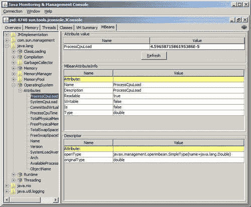

# 九、数据库、安全和系统增强

在本章中，我们将介绍以下内容：

*   使用 RowSetFactory 类
*   Java7 数据库增强
*   使用 ExtendedSSLSession 接口
*   使用平台 MXBeans 进行 JVM 或系统进程负载监控
*   重定向操作系统进程的输入和输出
*   在 HTML 页面中嵌入 JNLP 文件

# 导言

本章介绍对 Java7 进行的数据库、安全性和系统类型增强。其中一些增强是次要的，将在本简介中介绍。其他的更重要，在本章的食谱中有详细说明。由于某些主题（例如一些安全增强所代表的主题）具有相当专业的性质，这里将提及这些主题，但不进行解释。

Java 7 中对 JDBC 进行了多项增强，现在支持**JDBC 4.1**。一些改进依赖于早期驱动程序版本中不可用的第三方驱动程序支持。发生这种情况时，您可能会收到一封 `AbstractMethodException`。在测试本章的数据库配方时，请确保您使用的是支持 JDBC 4.1 功能的驱动程序。司机可在[找到 http://developers.sun.com/product/jdbc/drivers](http://developers.sun.com/product/jdbc/drivers) 。

使用 RowSetFactory 方法的*处理 `javax.sql.rowset.RowSetFactory`接口和 `javax.sql.rowset.RowSetProvider`类的使用，这允许创建给定 JDBC 驱动程序支持的任何行集。Java7 中还包括许多其他对数据库支持的改进。这些问题在*Java 7 数据库增强*配方中解决，包括确定当前模式的名称和提供对隐藏列的访问等问题。数据库示例将使用**Derby**数据库引擎。如果希望使用其他数据库和表，可以通过调整不同数据库的代码来实现。*

除了这些数据库配方之外，try with resource 语句还可以用于实现 `java.sql`包的 `Connection, ResultSet`或 `Statement`接口的任何对象。这种语言改进简化了打开和关闭资源的过程。try with resource 语句的一般用法在*使用 try with resource 块改进异常处理代码*配方[第 1 章](01.html "Chapter 1. Java Language Improvements")*Java 语言改进*中有详细说明。使用 RowSetFactory 类配方的*中显示了将其与 `ResultSet-derived`类一起使用的示例。*

`Statement`接口已通过两种新方法进行了增强。第一种方法 `closeOnCompletion`被执行以指定当使用连接的结果集被关闭时 `Statement`对象将被关闭。第二个方法 `isCloseOnCompletion`返回一个布尔值，指示在满足此条件时是否关闭语句。

Java 7 的网络增强包括在 `java.net.URLClassLoader`类中添加两个方法：

*   `close:`此方法将关闭当前 `URLClassLoader`，使其无法再加载类或资源。这解决了在 Windows 上发现的问题，详见[http://download.oracle.com/javase/7/docs/technotes/guides/net/ClassLoader.html](http://download.oracle.com/javase/7/docs/technotes/guides/net/ClassLoader.html)
*   `getResourceAsStream:`此方法为其 `String`参数指定的资源返回 `InputStream`

还提供帮助，以支持使用**InfiniBand**（**IB**的流连接。该技术使用**远程直接内存访问**（**RDMA**）在不同计算机的内存之间直接移动数据。此支持通过**套接字直接协议**（**SDP**网络协议）提供。这项技术的专业性质排除了进一步的讨论。

*使用平台 MXBeans 进行 JVM 或系统进程负载监控*配方，检查在支持 `MXBeans`方面所做的改进。这包括访问这些管理类型 bean 的不同方法。

`java.lang.ProcessBuilder`类改进了 `ProcessBuilder.Redirect`类引入的重定向功能。*重定向操作系统进程的输入和输出*配方中探讨了此主题。

Java7 还改进了小程序嵌入 HTML 页面的方式。*在 HTML 页面*配方中嵌入 JNLP 文件提供了此技术的演示。

**Java 安全套接字扩展**（**JSSE**）用于使用**安全套接字层**（**SSL**）和**传输层安全性**（**TLS**）保护互联网通信。JSSE 协助数据加密、身份验证和维护消息完整性。在 Java7 中，出现了一些增强。使用 ExtendeDSLSession 接口的*配方使用 SSL，用于说明 `ExtendedSSLSession`接口的使用和新的安全特性。*

安全性增强包括加入了**椭圆曲线加密**（**ECC**算法）。这类加密算法更能抵抗暴力攻击。提供了该算法的可移植实现。

添加或增强了新的异常类以增强安全性。抛出新的 `java.security.cert.CertificateRevokedException`时，表示**X.509**证书已被吊销。 `java.security.cert.CertPathValidatorException`类通过添加一个新的构造函数来增强，该构造函数接受 `CertPathValidatorException.Reason`对象。此对象实现枚举异常原因的 `CertPathValidatorException.BasicReason`枚举。 `CertPathValidatorException`类的 `getReason`方法返回一个 `CertPathValidatorException.Reason`对象。

Java7 还支持 TLS1.1 和 1.2 规范，并改进了这种支持。**Sun JSSE**提供程序支持 RFC 4346（[中定义的 TLS 1.1 和 TLS 1.2http://tools.ietf.org/html/rfc4346](http://tools.ietf.org/html/rfc4346) 和 RFC 5246（[http://tools.ietf.org/html/rfc5246](http://tools.ietf.org/html/rfc5246) 分别。其中包括支持防止密码块链接攻击和新的加密算法。

此外，还有一些其他与 TKS 相关的增强功能：

*   **SSLv2Hello**协议已从默认启用的协议列表中删除。
*   Java 7 中修复了与 TLS 重新协商相关的缺陷。有关此缺陷的详细信息，请参见[http://www.oracle.com/technetwork/java/javase/documentation/tlsreadme2-176330.html](http://www.oracle.com/technetwork/java/javase/documentation/tlsreadme2-176330.html) 。
*   在 TLS1.1/1.2 握手过程中，Java7 改进了版本号检查过程。

可以使用**Sun**提供程序的 `jdk.certpath.disabledAlgorithms`属性禁用弱加密算法。默认情况下，禁用 MD2 算法。此属性在 `jre/lib/security/java.security`文件中指定。默认设置如下所示：

```java
jdk.certpath.disabledAlgorithms=MD2

```

不仅可以指定算法，还可以指定密钥大小的限制。

也可以在 TLS 级别设置算法限制。这是使用 `jre/lib/security/java.security`文件中的 `jdk.tls.disabledAlgorithms`安全属性完成的。例如：

```java
jdk.tls.disabledAlgorithms=MD5, SHA1, RSA keySize < 2048

```

目前，此属性特定于**Oracle JSSE**实现，其他实现可能无法识别。

**服务器名称指示**（**SNI**JSSE 扩展（RFC 4366）使 TLS 客户端能够连接到虚拟服务器，即使用相同支持网络地址的具有不同网络名称的多个服务器。默认设置为 `true`，但对于不支持扩展的系统，可以设置为 `false`。

`jsse.enableSNIExtension`系统属性用于控制此设置。可以使用如下所示的 `-D`java 命令选项进行设置：

```java
java -D jsse.enableSNIExtension=true ApplicationName

```

也可以使用如下所示的 `setProperty`方法设置此属性：

```java
System.setProperty("jsse.enableSNIExtension", "true");

```

请注意，属性名称将来可能会更改。

# 使用 RowSetFactory 类

现在可以使用新的 `javax.sql.rowset`包的 `RowSetFactoryInterface`接口和 `RowSetProvider`类创建行集。这允许创建 JDBC 支持的任何类型的行集。我们将使用 Derby 数据库来说明创建行集的过程。将使用 `COLLEAGUES`表。有关如何创建此表的说明，请参见[http://netbeans.org/kb/docs/ide/java-db.html](http://netbeans.org/kb/docs/ide/java-db.html) 。创建表的 SQL 代码如下：

```java
CREATE TABLE COLLEAGUES (
"ID" INTEGER not null primary key,
"FIRSTNAME" VARCHAR(30),
"LASTNAME" VARCHAR(30),
"TITLE" VARCHAR(10),
"DEPARTMENT" VARCHAR(20),
"EMAIL" VARCHAR(60)
);
INSERT INTO COLLEAGUES VALUES (1,'Mike','Johnson','Manager','Engineering','mike.johnson@foo.com');
INSERT INTO COLLEAGUES VALUES
(2, 'James', 'Still', 'Engineer', 'Engineering', 'james.still@foo.com');
INSERT INTO COLLEAGUES VALUES
(3, 'Jerilyn', 'Stall', 'Manager', 'Marketing', 'jerilyn.stall@foo.com');
INSERT INTO COLLEAGUES VALUES
(4, 'Jonathan', 'Smith', 'Manager', 'Marketing', 'jonathan.smith@foo.com');

```

## 准备好了吗

要创建新行集，请执行以下操作：

1.  创建 `RowSetFactory.`的实例
2.  使用几种 `create`方法之一创建 `RowSet`对象。

## 怎么做。。。

1.  创建一个新的控制台应用程序。在 `main`方法中，添加以下代码序列。我们将创建一个新的 `javax.sql.rowset.JdbcRowSet`对象，并使用它来显示 `COLLEAGUES`表中的一些字段。首先设置 `String`变量以建立与数据库的连接，并创建一个 `RowSetFactory`对象，如下所示：

    ```java
    String databaseUrl = "jdbc:derby://localhost:1527/contact";
    String username = "userName";
    String password = "password";
    RowSetFactory rowSetFactory = null;
    try {
    rowSetFactory = RowSetProvider.newFactory("com.sun.rowset.RowSetFactoryImpl", null);
    }
    catch (SQLException ex) {
    ex.printStackTrace();
    return;
    }

    ```

2.  接下来，添加一个 try 块来捕获任何 `SQLExceptions`，然后使用 `createJdbcRowSet`方法创建行集。接下来，显示表中选定的元素。

    ```java
    try (JdbcRowSet rowSet = rowSetFactory.createJdbcRowSet();) {
    rowSet.setUrl(databaseUrl);
    rowSet.setUsername(username);
    rowSet.setPassword(password);
    rowSet.setCommand("SELECT * FROM COLLEAGUES");
    rowSet.execute();
    while (rowSet.next()) {
    System.out.println(rowSet.getInt("ID") + " - "
    + rowSet.getString("FIRSTNAME"));
    }
    }
    catch (SQLException ex) {
    ex.printStackTrace();
    }

    ```

3.  Execute the application. The output should appear as follows:

    **1-麦克**

    **2-詹姆斯**

    **3-杰里琳**

    **4-乔纳森**

## 它是如何工作的。。。

为数据库 URL、用户名和密码创建了字符串变量。 `RowSetFactory`对象是使用静态 `newFactory`方法创建的。产生的任何异常都将导致应用程序终止。

在 try with resources 块中，使用 `createJdbcRowSet`方法创建 `JdbcRowSet`类的实例。然后将 URL、用户名和密码分配给行集。select 命令从 `COLLEAGUES`表中检索所有字段。然后执行查询。

接下来，使用一个 `while`循环来显示行集合中每一行的 ID 和名字。

## 还有更多。。。

可能有多个 `RowSetFactory`实现可用。 `newFactory`方法将按以下顺序查找 `RowSetFactory`类：

1.  系统属性 `javax.sql.rowset.RowSetFactory`中指定的一个，如果已定义。
2.  使用 `ServiceLoader`API。
3.  平台默认实例。

除了创建 `JdbcRowSet`行集外，还可以使用其他方法创建下表中列出的不同类型的行集：

<colgroup><col width="1.825" style="text-align: left"> <col width="1.4375" style="text-align: left"></colgroup> 
| 

方法

 | 

已创建行集

 |
| --- | --- |
| `createCachedRowSet` | `CachedRowSet` |
| `createFilteredRowSet` | `FilteredRowSet` |
| `createJdbcRowSet` | `JdbcRowSet` |
| `createJoinRowSet` | `JoinRowSet` |
| `createWebRowSet` | `WebRowSet` |

也可以使用带两个参数的重载 `newFactory`方法创建 `RowSetFactory`，如下所示：

```java
rowSetFactory = RowSetProvider.newFactory("com.sun.rowset.RowSetFactoryImpl", null);

```

这种方法为应用程序提供了更多的控制，使其能够指定要使用的提供程序。当在类路径中找到多个提供程序时，这可能很有用。第一个参数指定提供程序的类名，第二个参数指定要使用的类加载器。使用 `null`作为第二个参数指定要使用上下文类加载器。

# Java 7 数据库增强

Java 7 提供的数据库支持有许多小的增强。本食谱介绍了这些增强功能，并提供了实际的示例。由于许多 JDBC4.1 驱动器还不成熟，并非所有的代码示例都能完全正常工作。

## 准备好了吗

大多数示例都是从以下内容开始的：

1.  创建到 Derby 数据库的连接。
2.  使用连接方法访问所需的功能。

## 怎么做。。。

1.  创建一个新的控制台应用程序。在 `main`方法中，添加以下代码序列。它将建立与数据库的连接，并确定是否始终返回自动生成的密钥以及当前模式是什么：

    ```java
    try {
    Connection con = DriverManager.getConnection(
    "jdbc:derby://localhost:1527/contact", "userName", "password");
    System.out.println("Schema: " + con.getSchema());
    System.out.println("Auto Generated Keys: " + metaData.generatedKeyAlwaysReturned());
    }
    catch (SQLException ex) {
    ex.printStackTrace();
    }

    ```

2.  When executed, your output should appear similar to the following:

    **自动生成密钥：真**

    **模式：模式名**

## 它是如何工作的。。。

在 Java1.4 中引入了 `Statement`接口的 `getGeneratedKeys`方法，并返回该语句的所有自动生成的键。 `java.sql.DatabaseMetaData`接口的 `generatedKeyAlwaysReturned`方法返回一个布尔值，表示自动生成的键将始终返回。

可以使用 `Connection`接口的 `setSchema`和 `getSchema`方法设置和获取连接的模式。执行了 `getSchema`方法，该方法返回架构名称。

## 还有更多。。。

还有三个议题需要进一步讨论：

*   检索伪列
*   控制 `OUT`参数的类型值
*   其他数据库增强功能

### 检索伪列

数据库通常使用隐藏列来表示表中每一行的唯一键。这些隐藏列有时称为**伪列**。在 Java7 中，添加了两个新方法来处理伪列。 `DatabaseMetaData`接口的 `getPseudoColumns`方法将检索一个 `ResultSet`。该方法要求如下：

*   目录：这需要与数据库中使用的目录名称匹配。如果未使用目录，则使用空字符串。空值表示在搜索列时将不使用目录名称。
*   模式模式：这需要与数据库中使用的模式名称相匹配。如果未使用架构，则使用空字符串。空值表示在搜索列时不会使用架构名称。
*   表名模式：这需要与数据库中使用的表名匹配
*   列名模式：这需要与数据库中使用的列名匹配

返回的 `ResultSet`组织如下表所示：

<colgroup><col width="1.575" style="text-align: left"> <col width="0.6875" style="text-align: left"> <col width="3.23055555555556" style="text-align: left"></colgroup> 
| 

柱

 | 

类型

 | 

意思

 |
| --- | --- | --- |
| `TABLE_CAT` | 一串 | 目录的名称，可能为空 |
| `TABLE_SCHEM` | 一串 | 架构的名称，该名称可能为空 |
| `TABLE_NAME` | 一串 | 表的名称 |
| `COLUMN_NAME` | 一串 | 列的名称 |
| `DATA_TYPE` | int | SQL 类型（`java.sql.Types`） |
| `COLUMN_SIZE` | int | 列的大小 |
| `DECIMAL_DIGITS` | int | 小数位数。空值表示不存在小数位数。 |
| `NUM_PREC_RADIX` | int | 基数 |
| `COLUMN_USAGE` | 一串 | 指定如何使用新 PsuedoColumnUsage 枚举定义的列 |
| `REMARKS` | 一串 | 关于专栏的评论 |
| `CHAR_OCTET_LENGTH` | int | 字符列的最大字符数 |
| `IS_NULLABLE` | 一串 | *是：列可以包含空**否：列不能包含空**：未知* |

隐藏列表示一个唯一的键，它提供了一种快速访问行的方法。Derby 不支持隐藏列。然而，下面的代码序列说明了如何实现这一点：

```java
try {
Connection con = DriverManager.getConnection(
"jdbc:derby://localhost:1527/contact", "userName", "password");
DatabaseMetaData metaData = con.getMetaData();
ResultSet resultSet = metaData.getPseudoColumns("", "schemaName", "tableName", "");
while (rs.next()) {
System.out.println(
resultSet.getString("TABLE_SCHEM ")+" - "+
resultSet.getString("COLUMN_NAME "));
}
}
catch (SQLException ex) {
ex.printStackTrace();
}

```

Derby 将返回一个由前面列出的列组成的空 `ResultSet`。

### 控制 OUT 参数的类型值

`java.sql.CallableStatement`有两个重载的 `getObject`方法返回一个对象，该对象被赋予一个列名或索引。目前支持有限。然而，基本方法如下所示：

```java
try {
Connection conn = DriverManager.getConnection(
"...", "username", "password");
String query = "{CALL GETDATE(?,?)}";
CallableStatement callableStatement = (CallableStatement) conn.prepareCall(query);
callableStatement.setInt(1,recordIdentifier);
callableStatement.registerOutParameter(1, Types.DATE);
callableStatement.executeQuery();
date = callableStatement.getObject(2,Date.class));
}
catch (SQLException ex) {
ex.printStackTrace();
}

```

查询字符串包含对存储过程的调用。假设此过程使用整数值作为第一个参数来标识表中的记录。第二个参数将被返回，类型为 `Date`。

一旦执行查询， `getObject`方法将使用指定的数据类型返回指定的列。该方法将 SQL 类型转换为 Java 数据类型。

### 其他数据库增强功能

`java.sql`包的 `Driver`接口有一个新方法，它为驱动程序返回父记录器。这用以下代码序列说明：

```java
try {
Driver driver = DriverManager.getDriver("jdbc:derby://localhost:1527");
System.out.println("Parent Logger" + driver.getParentLogger());
}
catch (SQLException ex) {
ex.printStackTrace();
}

```

但是，当执行时，驱动程序的当前版本将生成以下异常：

**Java.sql.SQLFeatureNotSupportedException:未实现的功能：getParentLogger**。

Derby 不使用 `java.util.logging`包，因此它抛出此异常。 `javax.sql.CommonDataSource`接口还增加了 `getParentLogger`方法。

此外，当结合 `Executor`执行一系列数据库操作时，有三种方法支持这些操作，如下所示：

*   `abort:`此方法将使用传递给方法的 `Executor`中止打开的连接
*   `setNetworkTimeout:`此方法指定等待请求响应的超时时间（以毫秒为单位）。它还使用一个 `Executor`对象。
*   `getNetworkTimeout:`此方法返回连接等待数据库请求的毫秒数

最后两个方法是可选的，Derby 不支持。

# 使用 ExtendedSSLSession 接口

`javax.net.ssl`包提供了一系列用于实现安全套接字通信的类。Java 7 中引入的改进包括增加了 `ExtendedSSLSession`接口，该接口可用于确定所使用的特定本地和对等支持的签名算法。此外，当创建 `SSLSession`时，可以使用端点识别算法来确保主机的地址与证书的地址匹配。此算法可通过 `SSLParameters`类访问。

## 准备好了吗

为了演示 `ExtendedSSLSession`接口的使用，我们将：

1.  创建一个 `SSLServerSocket-based EchoServer`应用程序来接受来自客户端的消息。
2.  创建一个客户端应用程序，它使用一个 `SSLSocket`实例与服务器通信。
3.  使用 `EchoServer`应用程序获取 `ExtendedSSLSession`接口实例。
4.  使用 `SimpleConstraints`类演示算法约束的使用。

## 怎么做。。。

1.  让我们首先创建一个名为 `SimpleConstraints`的类，该类改编自**Java PKI 程序员指南**（[http://download.oracle.com/javase/7/docs/technotes/guides/security/certpath/CertPathProgGuide.html](http://download.oracle.com/javase/7/docs/technotes/guides/security/certpath/CertPathProgGuide.html) ）。我们将使用它将算法约束与应用程序关联起来。将以下类添加到您的项目中：

    ```java
    public class SimpleConstraints implements AlgorithmConstraints {
    public boolean permits(Set<CryptoPrimitive> primitives,
    String algorithm, AlgorithmParameters parameters) {
    return permits(primitives, algorithm, null, parameters);
    }
    public boolean permits(Set<CryptoPrimitive> primitives, Key key) {
    return permits(primitives, null, key, null);
    }
    public boolean permits(Set<CryptoPrimitive> primitives,
    String algorithm, Key key, AlgorithmParameters parameters) {
    if (algorithm == null) algorithm = key.getAlgorithm();
    if (algorithm.indexOf("RSA") == -1) return false;
    if (key != null) {
    RSAKey rsaKey = (RSAKey)key;
    int size = rsaKey.getModulus().bitLength();
    if (size < 2048) return false;
    }
    return true;
    }
    }

    ```

2.  要创建 `EchoServer`应用程序，请创建一个新的控制台应用程序。将以下代码添加到 `main`方法中。在这个初始序列中，我们创建并启动服务器：

    ```java
    try {
    SSLServerSocketFactory sslServerSocketFactory =
    (SSLServerSocketFactory) SSLServerSocketFactory.getDefault();
    SSLServerSocket sslServerSocket =
    (SSLServerSocket) sslServerSocketFactory.createServerSocket(9999);
    System.out.println("Waiting for a client ...");
    SSLSocket sslSocket = (SSLSocket) sslServerSocket.accept();
    }
    catch (Exception exception) {
    exception.printStackTrace();
    }

    ```

3.  接下来，添加以下代码序列以设置应用程序的算法约束。它还返回端点算法的名称：

    ```java
    SSLParameters parameters = sslSocket.getSSLParameters();
    parameters.setAlgorithmConstraints (new SimpleConstraints());
    String endPoint = parameters.getEndpointIdentificationAlgorithm();
    System.out.println("End Point: " + endPoint);

    ```

4.  添加以下代码显示本地支持的算法：

    ```java
    System.out.println("Local Supported Signature Algorithms");
    if (sslSocket.getSession() instanceof ExtendedSSLSession) {
    ExtendedSSLSession extendedSSLSession =
    (ExtendedSSLSession) sslSocket.getSession();
    ExtendedSSLSession interfaceusingString algorithms[] =
    extendedSSLSession.getLocalSupportedSignatureAlgorithms();
    for (String algorithm : algorithms) {
    System.out.println("Algorithm: " + algorithm);
    }
    }

    ```

5.  以下顺序显示对等支持的算法：

    ```java
    System.out.println("Peer Supported Signature Algorithms");
    if (sslSocket.getSession() instanceof ExtendedSSLSession) {
    String algorithms[] = ((ExtendedSSLSession) sslSocket.getSession()).getPeerSupportedSignatureAlgorithms();
    for (String algorithm : algorithms) {
    System.out.println("Algorithm: " + algorithm);
    }
    }

    ```

6.  添加以下代码以缓冲来自客户端应用程序的输入流：

    ```java
    InputStream inputstream = sslSocket.getInputStream();
    InputStreamReader inputstreamreader = new InputStreamReader(inputstream);
    BufferedReader bufferedreader = new BufferedReader (inputstreamreader);

    ```

7.  通过添加代码来显示客户端输入完成此方法：

    ```java
    String stringline = null;
    while ((stringline = bufferedreader.readLine()) != null) {
    System.out.println(string);
    System.out.flush();
    }

    ```

8.  要执行服务器，我们需要创建密钥存储。这是通过执行以下命令在命令提示符下完成的：

    ```java
    keytool -genkey -keystore mySrvKeystore -keyalg RSA

    ```

9.  提供程序要求的密码和其他信息。接下来，导航到 echo 服务器的位置并输入以下命令：

    ```java
    java -Djavax.net.ssl.keyStore=mySrvKeystore
    Djavax.net.ssl.keyStorePassword=password package.EchoServer

    ```

10.  The **password** above, is the password that you used to create the key store, and package, is your EchoServer's package, if any. When the program executes, you get the following output:

    **等待客户。。。**

11.  我们现在需要创建一个名为 `EchoClient`的客户端控制台应用程序。在 `main`方法中，添加以下代码，我们在其中创建到服务器的连接，然后将输入从键盘发送到服务器：

    ```java
    try {
    SSLSocketFactory sslSocketFactory =
    (SSLSocketFactory) SSLSocketFactory.getDefault();
    SSLSocket sslSocket = (SSLSocket)
    sslSocketFactory.createSocket("localhost", 9999);
    InputStreamReader inputStreamReader =
    new InputStreamReader(System.in);
    BufferedReader bufferedReader =
    new BufferedReader(inputStreamReader);
    OutputStream outputStream = sslSocket.getOutputStream();
    OutputStreamWriter outputStreamWriter =
    new OutputStreamWriter(outputStream);
    BufferedWriter bufferedwriter =
    new BufferedWriter(outputStreamWriter);
    String line = null;
    while ((line = bufferedReader.readLine()) != null) {
    ExtendedSSLSession interfaceusingbufferedwriter.write(line + '\n');
    bufferedwriter.flush();
    }
    }
    catch (Exception exception) {
    exception.printStackTrace();
    }

    ```

12.  将密钥存储文件复制到客户端应用程序的目录。在单独的命令窗口中，执行以下命令：

    ```java
    java -Djavax.net.ssl.trustStore=mySrvKeystore
    -Djavax.net.ssl.trustStorePassword=password package.EchoClient

    ```

13.  The **password** above, is the password that you used to create the key store, and package, is your EchoServer's package, if any. When the program executes, enter the word **cat**, and then press the *Enter* key. In the server command window, you should see an end point name, which may be null, a list of local supported signature algorithms, and **cat** similar to the following:

    **终点：空**

    **本地支持的签名算法**

    **算法：SHA512 带 ECDSA**

    **算法：SHA512 带 RSA**

    **算法：SHA384 带 ECDSA**

    **算法：SHA384 带 RSA**

    **算法：SHA256 带 ECDSA**

    **算法：SHA256withRSA**

    **算法：SHA224 带 ECDSA**

    **算法：SHA224 带 RSA**

    **算法：SHA1 带 ECDSA**

    **算法：SHA1 带 RSA**

    **算法：SHA1 带 DSA**

    **算法：MD5withRSA**

    **对等支持的签名算法**

    **类别**

14.  当您输入更多的输入行时，它们应该反映在服务器命令窗口中。要终止程序，请在客户端命令窗口中输入一个*Ctrl*+*C*。

## 它是如何工作的。。。

`SimpleConstraints`类只允许使用 RSA 算法，然后使用使用 2048 位或更多位的密钥。这被用作 `setAlgorithmConstraints`方法的参数。该类实现了 `java.security.AlgorithmConstraints`接口，该接口表示算法的限制。

创建了一个 `SSLServerSocketFactory`实例，然后创建了一个 `SSLServerSocket`。 `accept`方法是针对套接字执行的，套接字会阻塞，直到客户端连接到它。

接下来，设置 `SimpleConstraints`，然后使用 `getEndpointIdentificationAlgorithm`方法，该方法返回一个空字符串。对于本例，未使用端点识别算法。

列出了本地和对等支持的签名算法。剩下的代码与读取然后显示客户端发送的字符串有关。

`EchoClient`应用程序更简单。它创建了一个 `SSLSocket`类的实例，然后使用其 `getOutputStream`方法将用户的输入写入 echo 服务器。

# 使用平台 MXBeans 进行 JVM 或系统进程负载监控

**Java 管理扩展**（**JMX**是向应用程序添加管理接口的标准方式。一个**托管 bean**（**MBean**）为应用程序提供管理服务，并在持有和管理 MBean 的 `javax.management.MBeanServer`注册。 `javax.management.MXBean`是一种 MBean，它允许客户端访问 bean，而无需访问特定类。

`java.lang.management`包的 `ManagementFactory`类添加了几个新方法来访问 MBean。然后可以使用它们访问进程和负载监视。

## 准备好了吗

访问一个 `MXBean:`

1.  使用应用所需的 `MXBean`类型的 `getPlatformMXBean`方法。
2.  根据需要使用 `MXBean`方法。

## 怎么做。。。

1.  创建一个新的控制台应用程序。使用下面的 `main`方法。在本应用程序中，我们将获取运行时环境的 `MXBean`并显示其基本信息：

    ```java
    public static void main(String[] args) {
    RuntimeMXBean mxBean = ManagementFactory.getPlatformMXBean(RuntimeMXBean.class);
    System.out.println("JVM Name: " + mxBean.getName());
    System.out.println("JVM Specification Name: " + mxBean.getSpecName());
    System.out.println("JVM Specification Version: " + mxBean.getSpecVersion());
    System.out.println("JVM Implementation Name: " + mxBean.getVmName());
    System.out.println("JVM Implementation Vendor: " + mxBean.getVmVendor());
    System.out.println("JVM Implementation Version: " + mxBean.getVmVersion());
    }

    ```

2.  Execute the application. Your output should be similar to the following:

    **JVM 名称：5584@name-PC**

    **JVM 规范名称：Java 虚拟机规范**

    **JVM 规范版本：1.7**

    **JVM 实现名称：Java 热点（TM）64 位服务器 VM**

    **JVM 实现供应商：甲骨文公司**

    **JVM 实现版本：21.0-b17**

## 它是如何工作的。。。

我们使用了 `ManagementFactory`类的静态 `getPlatformMXBean`方法，参数为 `RuntimeMXBean.class`。这返回了一个 `RuntimeMXBean`的实例。然后应用此实例的特定方法并显示其值。

## 还有更多。。。

`ManagementFactory`在 Java7 中引入了几个新方法：

*   `getPlatformMXBean:`这是一个重载方法，使用 `Class`参数返回支持特定管理接口的 `PlatformManagedObject`派生对象
*   `getPlatformMXBeans:`这是一个重载方法，使用 `MBeanServerConnection`对象和 `Class`参数返回支持特定管理接口的 `PlatformManagedObject`派生对象
*   `getPlatformManagementInterfaces:`此方法为当前 Java 平台上的 `PlatformManagedObject`派生对象返回一组 `Class`对象

此外，在 `java.lang.management`包中添加了一个新接口。 `PlatformManagedObject`接口作为所有 `MXBeans`的基础接口。

### 使用 getPlatformMXBeans 方法

`getPlatformMXBeans`方法被传递 `MXBean`类型，并返回实现 `MXBean`类型的平台 `MXBeans`列表。在下面的示例中，我们获得了 `OperatingSystemMXBean`的列表。然后显示 `MXBean`的几个属性：

```java
List<OperatingSystemMXBean> list =
ManagementFactory.getPlatformMXBeans(OperatingSystemMXBean.class);
for (OperatingSystemMXBean bean : list) {
System.out.println("Operating System Name: " + bean.getName());
System.out.println("Operating System Architecture: " + bean.getArch());
System.out.println("Operating System Version: " + bean.getVersion());
}

```

当执行时，您应该会得到如下类似的输出。确切的输出取决于用于执行应用程序的操作系统和硬件：

**操作系统名称：Windows 7**

**操作系统架构：amd64**

**操作系统版本：6.1**

### 获取平台的管理接口

`ManagementFactory`类的静态 `getPlatformManagementInterfaces`方法返回一组表示支持的平台 `MXBeans`的 `Class`对象。然而，当运行 JDK7.01 版本时，这种方法在 Windows7 和 Ubuntu 平台上都产生了一个 `ClassCastException`。将来的版本应该会更正此问题。

作为 JDK 的一部分提供的**jconsole**应用程序为确定哪些 `MXBeans`可用提供了一种替代技术。以下是显示操作系统属性的控制台，具体为 `ProcessCpuLoad`属性：



# 重定向操作系统进程的输入和输出

`java.lang.ProcessBuilder`类有几个新方法，用于重定向从 Java 应用程序执行的外部进程的输入和输出。引入了嵌套的 `ProcessBuilder.Redirect`类来提供这些额外的重定向功能。为了演示这个过程，我们将把命令行参数从一个文本文件发送到 DOS 提示符，并将输出记录在另一个文本文件中。

## 准备好了吗

为了控制外部过程的输入和输出，您必须：

1.  创建一个新的 `ProcessBuilder`对象。
2.  将过程的输入和输出导向适当的位置。
3.  通过 `start`方法执行流程。

## 怎么做。。。

1.  首先，创建一个新的控制台应用程序。创建三个新文件实例来表示流程执行中涉及的三个文件：输入、输出和错误，如下所示：

    ```java
    File commands = new File("C:/Projects/ProcessCommands.txt");
    File output = new File("C:/Projects/ProcessLog.txt");
    File errors = new File("C:/Projects/ErrorLog.txt");

    ```

2.  Create the file `ProcessCommands.txt` using the path specified for the file and enter the following text:

    **cd C:\**

    **目录**

    **mkdir“测试目录”**

    **目录**

3.  确保在最后一行之后有回车。
4.  接下来，创建一个 `ProcessBuilder`的新实例，将字符串 `"cmd`传递给构造函数，指定我们要启动的外部进程，即操作系统命令窗口。调用 `redirectInput, redirectOutput`和 `redirectError`方法，不带参数，并打印出默认位置：

    ```java
    ProcessBuilder pb = new ProcessBuilder("cmd");
    System.out.println(pb.redirectInput());
    System.out.println(pb.redirectOutput());
    System.out.println(pb.redirectError());

    ```

5.  然后我们要调用前面方法的重载形式，将相应的文件传递给每个方法。再次调用使用 `toString`方法执行的每个方法的无参数表单，以验证 IO 源是否已更改：

    ```java
    pb.redirectInput(commands);
    pb.redirectError(errors);
    pb.redirectOutput(output);
    System.out.println(pb.redirectInput());
    System.out.println(pb.redirectOutput());
    System.out.println(pb.redirectError());

    ```

6.  最后调用 `start`方法执行如下流程：

    ```java
    pb.start();

    ```

7.  Run the application. You should see output similar to the following:

    **管道**

    **管道**

    **管道**

    **重定向到从文件“C:\Projects\ProcessCommands.txt”**读取

    **重定向到写入文件“C:\Projects\ProcessLog.txt”**

    **重定向到写入文件“C:\Projects\ErrorLog.txt”**

8.  Examine each of the text files. Your output file should have text similar to this:

    **微软视窗【版本 6.7601】**

    **版权所有（c）2009 微软公司。版权所有。**

    **C:\Users\Jenn\Documents\NetBeansProjects\processbuilder 示例>cd C:\**

    **C:\>目录**

    **驱动器 C 中的卷没有标签。**

    **卷序列号为 927A-1F77**

    **C 目录：\**

    **03/05/2011 10:56<DIR>戴尔**

    **2011 年 8 月 11 日 16:04<目录>杂项**

    **2011 年 8 月 11 日 11:08<方向>移动**

    **2011 年 10 月 31 日 10:57<导演>音乐**

    **2011 年 8 月 11 日 19:44<目录>项目**

    **2011 年 10 月 27 日 21:09<方向>温度**

    **2011 年 10 月 28 日 10:46<目录>用户**

    **2011 年 8 月 11 日 17:11<方向>视窗**

    **0 个文件 0 个字节**

    **34 目录 620819542016 字节空闲**

    **C:\>mkdir“测试目录”**

    **C:\>目录**

    **驱动器 C 中的卷没有标签。**

    **卷序列号为 927A-1F77**

    **C 目录：\**

    **03/05/2011 10:56<DIR>戴尔**

    **2011 年 8 月 11 日 16:04<目录>杂项**

    **2011 年 8 月 11 日 11:08<方向>移动**

    **2011 年 10 月 31 日 10:57<导演>音乐**

    **2011 年 8 月 11 日 19:44<目录>项目**

    **2011 年 10 月 27 日 21:09<方向>温度**

    **2011 年 10 月 28 日 10:46<目录>测试目录**

    **2011 年 10 月 28 日 10:46<目录>用户**

    **2011 年 8 月 11 日 17:11<方向>视窗**

9.  Execute the program again and examine the contents of your error log. Because your test directory had already been created with the first process execution, you should now see the following error message:

    **子目录或文件测试目录已存在。**

## 它是如何工作的。。。

我们创建了三个文件来处理流程的输入和输出。当我们创建 `ProcessBuilder`对象的实例时，我们将要启动的应用程序指定为命令窗口。在应用程序中执行操作所需的信息存储在我们的输入文件中。

当我们第一次调用 `redirectInput, redirectOutput`和 `redirectError`方法时，我们没有传递任何参数。这些方法都返回一个 `ProcessBuilder.Redirect`对象，我们打印了它。此对象表示默认 IO 源，在所有三种情况下都是 `Redirect.PIPE`，是 `ProcessBuilder.Redirect.Type`枚举之一。管道获取一个源的输出并将其发送到另一个源。

我们使用的第二种方法涉及将一个 `java.io.File`实例传递给 `redirectInput, redirectOutput`和 `redirectError`方法。这些方法也返回一个 `ProcessBuilder`对象，但它们还具有设置 IO 源的功能。在我们的示例中，我们再次调用每个方法的无参数形式，以验证 IO 是否已重定向。

第一次执行程序时，您的错误日志应该是空的，假设您为每个 `File`对象使用了有效的文件路径，并且您在计算机上具有写入权限。第二次执行旨在显示如何将错误捕获定向到单独的文件。如果未调用 `redirectError`方法，则错误将继承标准位置并显示在 IDE 的输出窗口中。看*还有更多。。*。部分以获取有关继承标准 IO 位置的信息。

需要注意的是， `start`方法必须在重定向方法之后调用。在重定向输入或输出之前启动进程将导致进程忽略重定向，应用程序将使用标准 IO 位置执行。

## 还有更多。。。

在本节中，我们将检查 `ProcessBuilder.Redirect`类和 `inheritIO`方法的使用。

### 使用 ProcessBuilder.Redirect 类

`ProcessBuilder.Redirect`类提供了另一种指定 IO 数据重定向方式的方法。使用前面的示例，在调用 `start`方法之前添加一个新行：

```java
pb.redirectError(Redirect.appendTo(errors));

```

`redirectError`方法的这种形式允许您指定错误应该附加到错误日志文本文件中，而不是被覆盖。如果使用此更改执行应用程序，当进程再次尝试创建 `Test Directory`目录时，您将看到两个错误实例：

**子目录或文件测试目录已经存在**。

**子目录或文件测试目录已经存在**。

这是一个使用重载形式的 `redirectError`方法的示例，传递 `ProcessBuilder.Redirect`对象而不是文件。所有三种方法， `redirectError, redirectInput`和 `redirectOutput`都有这种重载形式。

`ProcessBuilder.Redirect`类有两个特殊的值，即 `Redirect.PIPE`和 `Redirect.INHERIT. Redirect.PIPE`是处理外部进程 IO 的默认方式，只是表示 Java 进程将通过管道连接到外部进程。 `Redirect.INHERIT`值表示外部进程将具有与当前 Java 进程相同的输入或输出位置。您还可以使用 `Redirect.to`和 `Redirect.from`方法重定向数据的输入或输出。

### 使用继承 IO 方法继承默认 IO 位置

如果从 Java 应用程序执行外部进程，则可以将源和目标数据的位置设置为与当前 Java 进程的位置相同。 `ProcessBuilder`类的 `inheritIO`方法是实现这一点的便捷方法。如果您有一个 `ProcessBuilder`对象 `pb`，执行以下代码：

```java
pb.inheritIO()

```

然后，它与同时执行以下三条语句具有相同的效果：

```java
pb.redirectInput(Redirect.INHERIT)
pb.redirectOutput(Redirect.INHERIT)
pb.redirectError(Redirect.INHERIT)

```

在这两种情况下，输入、输出和错误数据将与当前 Java 进程的输入、输出和错误数据位于相同的位置。

# 在 HTML 页面中嵌入 JNLP 文件

Java7 提供了一个新的选项来加速网页中小程序的部署。7 之前，当使用**Java 网络启动协议**（**JNLP**启动小程序时，必须先从网络下载 JNLP 文件，然后才能启动小程序。在新版本中，JNLP 文件可以直接嵌入到 HTML 代码中，从而减少小程序启动所需的时间。在本例中，我们将构建一个基本小程序，并使用 JNLP 嵌入的 HTML 页面启动它。

## 准备好了吗

要加快 Java 7 中小程序的启动速度，您必须：

1.  创建一个新的小程序。
2.  创建并编码 JNLP 文件。
3.  将对 JNLP 文件的引用添加到 HTML 页面。

## 怎么做。。。

1.  首先创建要在 HTML 窗口中使用的小程序。以下是一个简单的小程序，可用于此配方。此小程序有两个输入字段 `subtotal`和 `taxRate`，一个 `calculate`按钮用于计算总计：

    ```java
    public class JNLPAppletExample extends Applet {
    TextField subtotal = new TextField(10);
    TextField taxRate = new TextField(10);
    Button calculate = new Button("Calculate");
    TextArea grandTot = new TextArea("Total = $", 2, 15, TextArea.SCROLLBARS_NONE);
    @Override
    public void init() {
    this.setLayout(new GridLayout(3,2));
    this.add(new Label("Subtotal = "));
    this.add(subtotal);
    this.add(new Label("Tax Rate = "));
    this.add(taxRate);
    this.add(calculate);
    grandTot.setEditable(false);
    this.add(grandTot);
    calculate.addActionListener(new CalcListener());
    }
    class CalcListener implements ActionListener {
    public void actionPerformed(ActionEvent event) {
    JNLP fileembedding, in HTML pagedouble subTot;
    double tax;
    double grandTot;
    subTot = validateSubTot(subtotal.getText());
    tax = validateSubTot(taxRate.getText());
    grandTot = calculateTotal(subTot, tax);
    JNLPAppletExample.this.grandTot.setText("Total = $" + grandTot);
    }
    }
    double validateSubTot(String s) {
    double answer;
    Double d;
    try {
    d = new Double(s);
    answer = d.doubleValue();
    }
    catch (NumberFormatException e) {
    answer = Double.NaN;
    }
    return answer;
    }
    double calculateTotal(double subTot, double taxRate) {
    double grandTotal;
    taxRate = taxRate / 100;
    grandTotal = (subTot * taxRate) + subTot;
    return grandTotal;
    }
    }

    ```

2.  接下来，创建一个名为 `JNLPExample.jnlp`的 JNLP 文件。下面是一个示例 JNLP 文件，与前面的小程序一起提供。注意，在 resources 标记中引用了一个 JAR 文件。这个包含小程序的 JAR 文件必须与 JNLP 文件和 HTML 文件位于同一位置，我们稍后将创建它：

    ```java
    <?xml version="1.0" encoding="UTF-8"?>
    <jnlp href="http://JNLPExample.jnlp">
    <information>
    <title>Embedded JNLP File</title>
    <vendor>Sample Vendor</vendor>
    </information>
    <resources>
    <j2se version="7" />
    <jar href="http://JNLPAppletExample.jar"
    main="true" />
    </resources>
    <applet-desc
    name="Embedded JNLP Example"
    main-class="packt.JNLPAppletExample"
    width="500"
    height="500">
    </applet-desc>
    <update check="background"/>
    </jnlp>

    ```

3.  创建 JNLP 文件后，必须对其进行编码。有几个在线资源可用于将 JNLP 文件转换为 BASE64，但本例中使用的资源是[http://base64encode.org/](http://base64encode.org/) 。使用 UTF-8 字符集。一旦您有了编码数据，您将在创建 HTML 文件时使用它。创建一个 HTML 文件，如下所示。请注意，为了简洁起见，突出显示的 BASE64 编码字符串已缩短，但您的字符串将更长：

    ```java
    <HTML>
    <HEAD>
    <TITLE>Embedded JNLP File Example</TITLE>
    </HEAD>
    <BODY>
    <H3>Embedded JNLP Applet</H3>
    <script src="http://www.java.com/js/deployJava.js"></script>
    <script>
    var jnlpFile = "http://JNLPExample.jnlp";
    deployJava.createWebStartLaunchButtonEx(jnlpFile);
    </script>
    <script>
    var attributes = {} ;
    var parameters = {jnlp_href: 'JNLPExample.jnlp',
    jnlp_embedded: 'PD94bWw...'};
    deployJava.runApplet(attributes, parameters, '7');
    </script>
    </BODY>
    </HTML>

    ```

4.  另外，请注意第一个脚本标记。为了避免使用 `codebase`属性，我们通过使用开发工具包脚本来利用 Java7 的另一个新特性。
5.  在浏览器窗口中加载应用程序。根据当前的浏览器设置，您可能需要启用 JavaScript。您的小程序应快速加载，并与以下屏幕截图类似：


## 它是如何工作的。。。

在 HTML 页面中嵌入 JNLP 文件允许立即加载小程序，而不必先从服务器下载。JNLP 文件必须在 `href`属性中具有相对路径，并且不应指定 `codebase`。通过将 `codebase`属性留空，它由小程序网页的 URL 确定。

`resources`标记指定了 JAR 文件的位置和要使用的 Java 版本。JAR 文件的路径被假定为默认工作目录，JNLP 文件的位置也是如此。JNLP 文件中还包括小程序的描述，周围有 `applet-desc`标记。在此标记中指定了小程序的名称和主类文件的名称。

HTML 文件包含加载小程序所需的信息，而无需从服务器下载小程序信息。我们首先指定使用 JavaScript 调用加载应用程序。然后，在我们的第一个脚本标记中，我们添加了一个部分，允许我们在不使用 `codebase`的情况下调用小程序。这是有利的，因为应用程序可以在不同的环境中加载和测试，而无需更改 `codebase`属性。相反，它是从运行应用程序的 web 页面继承的。

部署工具包有两个功能可用于在没有 `codebase`属性的网页中部署 Java 小程序： `launchWebStartApplication`和 `createWebStartLaunchButtonEx`。我们选择将 `createWebStartLaunchButtonEx`用于此配方，但 `launchWebStartApplication`选项也将在下面讨论。在这两种情况下，客户机都必须有 JavaSE7 版本才能启动小程序，如果没有，则会被引导到 Java 网站下载最新版本。

`createWebStartLaunchButtonEx`函数为应用程序创建了一个启动按钮。在 `script`标记中， `jnlpFile`变量指定了 JNLP 文件的名称，并且与小程序的网页相关。然后将此文件名传递给 `deployJava.createWebStartLaunchButtonEx`函数。

或者， `launchWebStartApplication`函数可以嵌入到 HTML 链接中。该函数在 `href`标记内调用，如下所示：

```java
<script src="http://www.java.com/js/deployJava.js"></script>
<a href="javascript:deployJava.launchWebStartApplication('JNLPExample.jnlp');">Launch</a>
</script>

```

HTML 文件中的第二个 `script`标记包含关于 JNLP 文件的信息。 `jnlp_href`变量存储了 JNLP 文件的名称。JNLP 文件的编码形式由 `jnlp_embedded`参数指定。BASE64 编码器编码二进制数据，用于需要跨文本介质（如电子邮件和 XML 文件）存储和传输数据的实例。