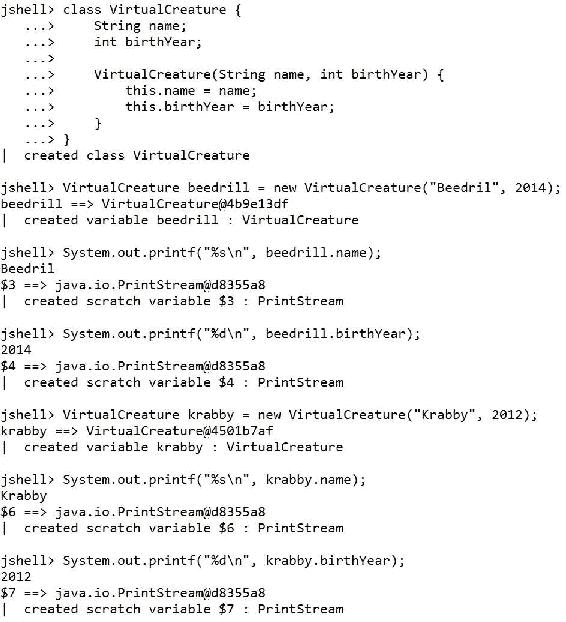
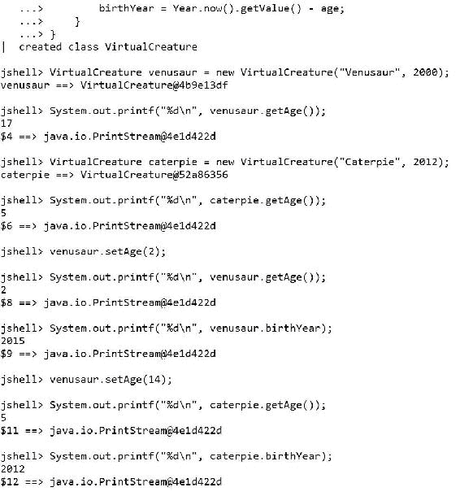
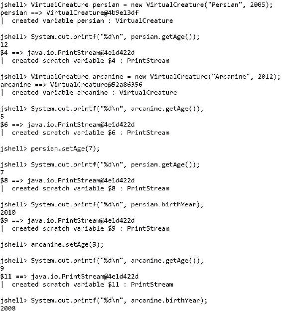
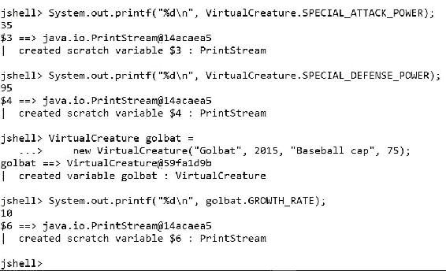

# 四、数据封装

在本章中，我们将学习 Java 9 中类的不同成员，以及它们如何反映在类生成的实例成员中。我们将使用实例字段、类字段、setter、getter、实例方法和类方法。我们将：

*   了解 Java 9 中组成类的成员
*   声明不可变字段
*   与二传手和接球手合作
*   了解 Java 9 中的访问修饰符
*   组合 setter、getter 和相关字段
*   使用 setter 和 getter 转换值
*   使用静态字段和静态方法创建一个类的所有实例共享的值

# 了解组成班级的成员

到目前为止，我们一直在使用一个非常简单的`Rectangle`类。我们在 JShell 中创建了许多此类的实例，并且了解了垃圾收集的工作原理。现在，是时候深入研究在 Java9 中组成类的不同成员了。

下面的列表列举了我们可以在 Java9 的类定义中包含的最常见的元素类型。每个成员在其他编程语言中都包含了它的等价物，以便于将我们使用其他面向对象语言的经验转换为 Java9。我们已经与其中一些成员进行了合作：

*   **构造函数**：类可以定义一个或多个构造函数。它们相当于其他编程语言中的初始值设定项。
*   **类变量或类字段**：这些变量对于该类的所有实例都是公共的，即它们的值对于所有实例都是相同的。在 Java9 中，可以从类及其实例访问类变量。我们不需要创建特定的实例来访问类变量。类变量也称为静态变量，因为它们在声明中使用`static`修饰符。类变量等价于其他编程语言中的类属性、类属性和类型属性。
*   **类方法**：这些方法可以用类名调用。在 Java9 中，可以从类及其实例访问类方法。我们不需要创建特定的实例来访问类方法。类方法也称为静态方法，因为它们在声明中使用`static`修饰符。类方法相当于其他编程语言中的类函数和类型方法。类方法作为一个整体在类上操作，并且可以访问类变量、类常量和其他类方法，但是它们不能访问任何实例成员，例如实例字段或方法，因为它们在类级别上操作，根本没有实例。当我们希望包含与类相关的方法，而不希望生成实例来调用它们时，类方法非常有用。
*   **常量**：当我们用`final`修饰符声明类变量或类字段时，我们定义了其值不能更改的常量。
*   **字段、成员变量、实例变量或实例字段**：我们在前面的示例中使用了这些字段。类的每个实例都有自己的实例字段的不同副本，以及它们自己的值。实例字段相当于其他编程语言中的属性和实例属性。
*   **方法或实例方法**：这些方法需要调用实例，并且可以访问特定实例的字段。实例方法等同于其他编程语言中的实例函数。
*   **嵌套类**：这些类在另一个类中定义。静态嵌套类使用`static`修饰符。不使用`static`修饰符的嵌套类也称为**内部类**。嵌套类在其他编程语言中也称为嵌套类型。

# 声明不可变字段

口袋妖怪围棋是一款基于位置的增强现实游戏，玩家可以使用移动设备的 GPS 功能定位、捕获、训练和让虚拟生物战斗。该游戏取得了巨大成功，普及了基于位置和增强现实的游戏。在它取得巨大成功之后，想象一下，我们必须开发一个 Web 服务，它将被一个类似的游戏所使用，这个游戏使虚拟生物进行战斗。

我们必须进入虚拟生物的世界。我们肯定会有一个`VirtualCreature`基类。每种具有独特特征的虚拟生物都可以参与战斗，它们将成为`VirtualCreature`的一个子类。

所有虚拟生物都有一个名字，它们将在特定的年份出生。年龄对他们在战斗中的表现至关重要。因此，我们的基类将具有所有子类将继承的`name`和`birthYear`字段。

当我们设计类时，我们希望确保所有必要的数据都可用于对这些数据进行操作的方法。出于这个原因，我们封装了数据。但是，我们只希望相关信息对我们的类的用户可见，这些类将创建实例，更改可访问字段的值，并调用可用方法。我们希望隐藏或保护一些内部使用（即我们的方法）所需的数据。我们不想对敏感数据进行意外更改。

例如，当我们创建任何虚拟生物的新实例时，我们可以使用其名称和出生年份作为构造函数的两个参数。构造函数初始化两个属性的值：`name`和`birthYear`。下面几行显示了声明`VirtualCreature`类的示例代码。样本的代码文件包含在`example04_01.java`文件的`java_9_oop_chapter_04_01`文件夹中。

```java
class VirtualCreature {
    String name;
    int birthYear;

    VirtualCreature(String name, int birthYear) {
        this.name = name;
        this.birthYear = birthYear;
    }
}
```

接下来的几行创建两个实例，初始化两个字段的值，然后使用`System.out.printf`方法在 JShell 中显示它们的值。样本的代码文件包含在`java_9_oop_chapter_04_01`文件夹中的`example04_01.java`文件中。

```java
VirtualCreature beedrill = new VirtualCreature("Beedril", 2014);
System.out.printf("%s\n", beedrill.name);
System.out.printf("%d\n", beedrill.birthYear);
VirtualCreature krabby = new VirtualCreature("Krabby", 2012);
System.out.printf("%s\n", krabby.name);
System.out.printf("%d\n", krabby.birthYear);
```

下面的屏幕截图显示了类声明的结果以及 JShell 中前几行的执行情况：



我们不希望`VirtualCreature`类的用户能够在实例初始化后更改虚拟生物的名称，因为名称不应该更改。嗯，有些人会改名，但这种情况在虚拟生物身上从未发生过。在前面声明的类中，有一种简单的方法可以实现这个目标。我们可以在类型（`String`之前添加`final`关键字，定义`String`类型的不可变`name`字段。在定义`birthYear`字段时，我们还可以在类型（`int`之前添加`final`关键字，因为在初始化虚拟生物实例后，出生年份永远不会改变。

下面的行显示了用两个不可变的实例字段声明`VirtualCreature`类的新代码：`name`和`birthYear`。请注意，构造函数代码不需要更改，可以使用相同的代码初始化两个不可变的实例字段。样本的代码文件包含在`example04_02.java`文件的`java_9_oop_chapter_04_01`文件夹中。

```java
class VirtualCreature {
 final String name;
 final int birthYear;

    VirtualCreature(String name, int birthYear) {
        this.name = name;
        this.birthYear = birthYear;
    }
}
```

### 注

不可变实例字段也称为非变异实例字段。

接下来的几行创建一个实例，初始化两个不可变实例字段的值，然后使用`System.out.printf`方法在 JShell 中显示它们的值。样本的代码文件包含在`java_9_oop_chapter_04_01`文件夹中的`example04_02.java`文件中。

```java
VirtualCreature squirtle = new VirtualCreature("Squirtle", 2014);
System.out.printf("%s\n", squirtle.name);
System.out.printf("%d\n", squirtle.birthYear);
```

接下来的两行代码尝试为`name`和`birthYear`不可变实例字段分配一个新值。样本的代码文件包含在`example04_03.java`文件的`java_9_oop_chapter_04_01`文件夹中。

```java
squirtle.name = "Tentacruel";
squirtle.birthYear = 2017;
```

由于 Java 不允许我们将值赋给使用`final`修饰符声明的字段，该修饰符将字段转换为不可变字段，因此这两行将无法执行。下一个屏幕截图显示了在试图为不可变字段设置新值的每一行之后 JShell 中显示的错误：


### 提示

当我们使用`final`关键字来声明一个实例字段时，我们可以初始化该字段，但它在初始化后变得不可变，即常量。

# 与二传手和接球手合作

到目前为止，我们一直在使用字段来封装实例中的数据。我们可以不受任何限制地访问字段作为实例的成员变量。然而，正如现实世界中有时会发生的那样，限制是避免严重问题的必要条件。有时，我们希望限制访问或将特定字段转换为只读字段。我们可以将对底层字段的访问限制与名为 setter 和 getter 的方法结合起来。

**设置器**是方法，允许我们控制值的设置方式；也就是说，这些方法用于更改相关字段的值。**getter**允许我们在检索相关字段的值时控制返回的值。getter 不会更改相关字段的值。

### 提示

虽然一些框架（如 JavaBeans）强制您使用 setter 和 getter 来访问每个相关字段，但在其他情况下，setter 和 getter 是不必要的。在下一个示例中，我们将使用可变对象。在下一章[第 5 章](05.html#1HIT81-bc1530b4c4784270ae8a31a7038f8341 "Chapter 5. Mutable and Immutable Classes")、*可变和不可变类*中，我们将同时处理可变和不可变对象。在处理不可变对象时，getter 和 setter 是无用的。

如前所述，我们不希望`VirtualCreature`类的用户能够在实例初始化后更改虚拟生物的出生年份，因为虚拟生物不会在不同的日期再次出生。事实上，我们想计算虚拟生物的年龄，并让用户可以使用。因为我们只考虑出生年份，所以我们将计算一个近似的年龄。我们保持示例的简单性，以保持对 getter 和 setter 的关注。

我们可以定义一个名为`getAge`的 getter 方法，而无需定义 setter 方法。通过这种方式，可以检索虚拟生物的年龄，但我们无法更改它，因为没有 setter 方法。getter 方法返回根据当前年份和`birthYear`不可变实例字段的值计算虚拟生物年龄的结果。

以下几行显示了使用新的`getAge`方法的`VirtualCreature`类的新版本。请注意，有必要导入`java.time.Year`以使用 Java8 中引入的`Year`类。`getAge`方法的代码在下一行中突出显示。该方法调用`Year.now().getValue`来检索当前日期的年份组件，并返回当前年份与`birthYear`字段值之间的差值。样本的代码文件包含在`java_9_oop_chapter_04_01`文件夹中的`example04_04.java`文件中。

```java
import java.time.Year;

class VirtualCreature {
    final String name;
    final int birthYear;

    VirtualCreature(String name, int birthYear) {
        this.name = name;
        this.birthYear = birthYear;
    }

 int getAge() {
 return Year.now().getValue() - birthYear;
 }
}
```

接下来的几行创建一个实例，初始化两个不可变实例字段的值，然后使用`System.out.printf`方法在 JShell 中显示`getAge`方法返回的值。在创建新版本的`VirtualCreature`类的代码后面输入行。样本的代码文件包含在`example04_04.java`文件的`java_9_oop_chapter_04_01`文件夹中。

```java
VirtualCreature arbok = new VirtualCreature("Arbok", 2008);
System.out.printf("%d\n", arbok.getAge());
VirtualCreature pidgey = new VirtualCreature("Pidgey", 2015);
System.out.printf("%d\n", pidgey.getAge());
```

下一个屏幕截图显示了在 JShell 中执行前几行的结果：


在与虚拟生物方面的专家进行了几次会议后，我们意识到，其中一些生物去了一个星球进行进化，并在进化后从一个卵子中重生。因为进化发生在不同的星球上，虚拟生物的出生年份会发生变化，在地球上有一个相同的出生年份。因此，有必要允许用户自定义虚拟生物的年龄或出生年份。我们将添加一个 setter 方法，其代码根据指定的年龄计算出生年份，并将该值分配给`birthYear`字段。首先，必须在声明`birthYear`字段时删除`final`关键字，因为我们希望它成为可变字段。

### 提示

还有另一种方法来研究虚拟生物的进化。我们可以创建另一个代表进化虚拟生物的实例。我们将在下一章[第 5 章](05.html#1HIT81-bc1530b4c4784270ae8a31a7038f8341 "Chapter 5. Mutable and Immutable Classes")*可变和不可变类*中使用这种不可变方法。在本例中，我们将使用可变对象。在我们了解了所有的可能性之后，我们可以根据我们的具体需求来决定最佳方案。

以下几行显示了使用新的`setAge`方法的`VirtualCreature`类的新版本。`setAge`方法的代码在下一行中突出显示。该方法在`age`参数中接收虚拟生物的新年龄。代码调用`Year.now().getValue`检索当前日期的年份组件，并分配当前年份与`age`中接收到的值之间的差值。这样，`birthYear`字段将根据收到的`age`值保存虚拟生物出生的年份。样本的代码文件包含在`example04_05.java`文件的`java_9_oop_chapter_04_01`文件夹中。

```java
import java.time.Year;

class VirtualCreature {
    final String name;
 int birthYear;

    VirtualCreature(String name, int birthYear) {
        this.name = name;
        this.birthYear = birthYear;
    }

    int getAge() {
        return Year.now().getValue() - birthYear;
    }

 void setAge(final int age) {
 birthYear = Year.now().getValue() - age;
 }
}
```

接下来的几行创建新版本的`VirtualCreature`类的两个实例，调用具有虚拟生物所需年龄的`setAge`方法，然后使用`System.out.printf`方法在 JShell 中显示`getAge`方法和`birthYear`字段返回的值。在创建`VirtualCreature`类的新版本的代码后面输入行。样本的代码文件包含在`example04_05.java`文件的`java_9_oop_chapter_04_01`文件夹中。

```java
VirtualCreature venusaur = new VirtualCreature("Venusaur", 2000);
System.out.printf("%d\n", venusaur.getAge());
VirtualCreature caterpie = new VirtualCreature("Caterpie", 2012);
System.out.printf("%d\n", caterpie.getAge());

venusaur.setAge(2);
System.out.printf("%d\n", venusaur.getAge());
System.out.printf("%d\n", venusaur.birthYear);

venusaur.setAge(14);
System.out.printf("%d\n", caterpie.getAge());
System.out.printf("%d\n", caterpie.birthYear);
```

使用新的年龄值调用`setAge`方法后，该方法会更改`birthYear`字段的值。基于当前年份值，运行代码的结果将不同。下一个屏幕截图显示了在 JShell 中执行前几行的结果：



getter 和 setter 方法都使用相同的代码来检索当前年份。我们可以添加一个新方法来检索当前年份，并从`getAge`和`setAge`方法中调用它。在本例中，它只是一行代码，但新方法为我们提供了一个示例，说明如何添加将在类中使用的方法，并帮助其他方法完成它们的工作。稍后，我们将学习如何避免从实例调用这些方法，因为它们仅用于内部使用。

以下几行显示了使用新的`getCurrentYear`方法的`SuperHero`类的新版本。`getAge`和`setAge`方法的新代码调用新的`getCurrentYear`方法，而不是重复用于检索当前年份的代码。样本的代码文件包含在`example04_06.java`文件的`java_9_oop_chapter_04_01`文件夹中。

```java
import java.time.Year;

class VirtualCreature {
    final String name;
    int birthYear;

    VirtualCreature(String name, int birthYear) {
        this.name = name;
        this.birthYear = birthYear;
    }

 int getCurrentYear() {
 return Year.now().getValue();
 }

    int getAge() {
 return getCurrentYear() - birthYear;
    }

    void setAge(final int age) {
 birthYear = getCurrentYear() - age;
    }
}
```

接下来的几行创建`VirtualCreature`类的两个实例，调用虚拟生物所需年龄的`setAge`方法，然后使用`System.out.printf`方法在 JShell 中显示`getAge`方法和`birthYear`字段返回的值。在创建`VirtualCreature`类新版本的代码后面输入行。样本的代码文件包含在`example04_06.java`文件的`java_9_oop_chapter_04_01`文件夹中。

```java
VirtualCreature persian = new VirtualCreature("Persian", 2005);
System.out.printf("%d\n", persian.getAge());
VirtualCreature arcanine = new VirtualCreature("Arcanine", 2012);
System.out.printf("%d\n", arcanine.getAge());

persian.setAge(7);
System.out.printf("%d\n", persian.getAge());
System.out.printf("%d\n", persian.birthYear);

arcanine.setAge(9);
System.out.printf("%d\n", arcanine.getAge());
System.out.printf("%d\n", arcanine.birthYear);
```

下一个屏幕截图显示了在 JShell 中执行前几行的结果：



## 探索 Java 9 中的访问修饰符

前面的声明的`VirtualCreature`类公开了它的所有成员（字段和方法），没有任何限制，因为我们声明它们时没有使用任何访问修饰符。因此，在用户创建类的实例后，类的用户可以访问任何字段并调用任何声明的方法。

Java9 允许我们通过使用访问级别修饰符来控制对调用成员的访问。不同的关键字允许我们控制哪些代码可以访问类的特定成员。到目前为止，我们可以访问类定义内和类声明外的字段和方法。

我们可以使用以下任何访问修饰符代替`public`来限制对任何字段的访问：

*   `protected`：Java 不允许用户访问类定义之外的成员。只有类或其派生类中的代码才能访问该字段。使用`protected`访问修饰符声明成员的类的任何子类都可以访问该成员。
*   `private`：Java 不允许用户访问类定义之外的字段。只有类中的代码才能访问该字段。其派生类无法访问该字段。因此，`private`的子类成员不能访问的任何成员。

下面一行显示了如何将`birthYear`实例字段的声明更改为`protected`字段。我们只需要在字段声明中添加`protected`关键字。

```java
protected int birthYear;
```

每当我们在字段声明中使用`protected`访问修饰符时，我们都会将对该字段的访问限制为类定义和子类中编写的代码。Java 9 为标记为`protected`的字段生成了一个真正的屏蔽，在解释的边界之外无法访问它们。

下一行显示了如何将`birthYear`受保护实例字段的声明更改为`private`字段。我们将`protected`访问修饰符替换为`private`。

```java
private int birthYear;
```

每当我们在字段声明中使用`private`访问修饰符时，我们都会将对该字段的访问限制为类定义和子类中编写的代码。Java 为标记为`private`的字段生成了一个真正的屏蔽，在类定义之外无法访问它们。该限制也适用于子类，因此，只有在类中编写的代码才能访问标记为 private 的属性。

### 提示

我们可以对任何类型成员应用前面解释的访问修饰符，包括类变量、类方法、常量、字段、方法和嵌套类。

# 组合 setter、getter 和 field

有时，我们希望对设置到相关字段并从中检索的值有更多的控制，我们可以利用 getter 和 setter 来实现这一点。我们可以将 getter、setter、存储计算值的相关字段和访问保护机制结合起来，以防止用户更改相关字段。这样，我们将强制用户始终使用 getter 和 setter。

虚拟生物喜欢任何种类的帽子。虚拟生物的帽子可以随时间变化。我们必须确保帽子的名字是大写的，也就是大写的`String`。我们将定义一个`setHat`方法，该方法总是从接收到的`String`生成大写的`String`，并将其存储在私有`hat`字段中。

我们将提供一个`getHat`方法来检索私有`hat`字段中存储的值。以下几行显示了`VirtualCreature`类的新版本，该类添加了`hat`私有实例字段以及`getHat`和`setHat`方法。我们对类的不同成员使用先前学习的访问修饰符。样本的代码文件包含在`example04_07.java`文件的`java_9_oop_chapter_04_01`文件夹中。

```java
import java.time.Year;

public class VirtualCreature {
    public final String name;
    private int birthYear;
    private String hat = "NONE";

    VirtualCreature(String name, int birthYear, String hat) {
        this.name = name;
        this.birthYear = birthYear;
        setHat(hat);
    }

    private int getCurrentYear() {
        return Year.now().getValue();
    }

    public int getAge() {
        return getCurrentYear() - birthYear;
    }

    public void setAge(final int age) {
        birthYear = getCurrentYear() - age;
    }

    public String getHat() {
        return hat;
    }

    public void setHat(final String hat) {
        this.hat = hat.toUpperCase();
    }
}
```

如果您使用特定的早期版本的 JDK，当您在 JShell 中输入之前的代码时，您可能会看到以下警告消息：

```java
|  Warning:
|  Modifier 'public'  not permitted in top-level declarations, ignored
|  public class VirtualCreature {
|  ^----^
|  created class VirtualCreature this error is corrected:
|      Modifier 'public'  not permitted in top-level declarations, ignored
|      public class VirtualCreature {
|      ^----^

```

JShell 不允许我们在顶级声明中使用访问修饰符，比如类声明。但是，我们指定访问修饰符是因为我们想要像在 JShell 之外编写类声明一样编写代码。JShell 只是忽略类的`public`访问修饰符，而包含 JShell 的 JDK 的一些版本使 REPL 显示了前面显示的警告消息。如果看到这些消息，应该将已安装的 JDK 升级到不再显示警告消息的最新版本。

我们将`birthyear`和`hat`实例字段声明为`private`。我们将`getCurrentYear`方法声明为`protected`。当用户创建`VirtualCreature`类的实例时，用户将无法访问这些`private`成员中的任何一个。这样，创建`VirtualCreature`类实例的人就可以隐藏`private`成员。

我们将`name`声明为`public`不可变实例字段。我们将以下方法声明为`public`：`getAge`、`setAge`、`getHat`和`setHat`。当用户创建`VirtualCreature`类的实例时，他将能够访问所有这些`public`成员。

构造函数添加了一个新参数，为新的`hat`字段提供初始值。构造函数中的代码调用`setHat`方法，将接收到的`hat`参数作为参数，以确保从接收到的`String`生成大写的`String`，并将生成的`String`分配给`hat`字段。

接下来的几行创建`VirtualCreature`类的两个实例，使用`printf`方法显示`getHat`方法返回的值，使用虚拟生物所需的新帽子调用`setHat`方法，然后使用`System.out.printf`方法再次显示`getHat`方法返回的值。在创建`VirtualCreature`类新版本的代码后面输入行。样本的代码文件包含在`java_9_oop_chapter_04_01`文件夹中的`example04_07.java`文件中。

```java
VirtualCreature glaceon = 
    new VirtualCreature("Glaceon", 2009, "Baseball cap");
System.out.printf(glaceon.getHat());
glaceon.setHat("Hard hat")
System.out.printf(glaceon.getHat());
VirtualCreature gliscor = 
    new VirtualCreature("Gliscor", 2015, "Cowboy hat");
System.out.printf(gliscor.getHat());
gliscor.setHat("Panama hat")
System.out.printf(gliscor.getHat());
```

下一个屏幕截图显示了在 JShell 中执行前几行的结果：


### 提示

我们可以结合 getter 和 setter 方法，以及访问保护机制和作为底层字段的相关字段，以绝对控制在可变对象中如何将值设置为底层字段并从底层字段中检索值。然而，我们必须确保初始化也必须使用 setter 方法，就像我们在构造函数中设置初始值时所做的那样。

下一行将尝试访问我们创建的`VirtualCreature`类的实例的私有字段和私有方法。这两行都无法编译，因为我们无法访问实例中的私有成员。第一行尝试访问`hat`实例字段，第二行尝试调用`getCurrentYear`实例方法。样本的代码文件包含在`example04_08.java`文件的`java_9_oop_chapter_04_01`文件夹中。

```java
System.out.printf(gliscor.hat);
System.out.printf("%d", glaceon.getCurrentYear());
```

下一个屏幕截图显示了当我们尝试执行前几行时在 JShell 中生成的错误消息。


# 使用 setter 和 getter 转换值

我们可以定义一个 setter 方法，将接收到的值转换为相关字段的有效值。getter 方法将只需要返回相关字段的值。用户将只能使用 setter 和 getter 方法，我们的相关字段将始终具有有效值。通过这种方式，我们可以确保无论何时需要该值，我们都将检索一个有效的值。

每个虚拟生物都有一个可见性级别，它决定了任何人看到虚拟生物身体的容易程度。我们将添加一个私有的`visibilityLevel`字段、一个`setVisibility`方法和一个`getVisibility`方法。我们将更改构造函数代码以调用`setVisiblity`方法为`visibilityLevel`字段设置初始值。

我们希望确保可见性级别为从`0`到`100`（含）的数字。因此，我们将对 setter 方法进行编码，将低于`0`的值转换为`0`，高于`100`的值转换为`100`。`setVisibility`方法在相关私有`visibilityLevel`字段中保存有效范围内的转换值或原始值。

已编辑的行和新行高亮显示。样本的代码文件包含在`example04_09.java`文件的`java_9_oop_chapter_04_01`文件夹中。

```java
import java.time.Year;

public class VirtualCreature {
    public final String name;
    private int birthYear;
    private String hat = "NONE";
 private int visibilityLevel;

 VirtualCreature(String name, 
 int birthYear, 
 String hat, 
 int visibilityLevel) {
        this.name = name;
        this.birthYear = birthYear;
        setHat(hat);
 setVisibilityLevel(visibilityLevel);
    }

    private int getCurrentYear() {
        return Year.now().getValue();
    }

    public int getAge() {
        return getCurrentYear() - birthYear;
    }

    public void setAge(final int age) {
        birthYear = getCurrentYear() - age;
    }

    public String getHat() {
        return hat;
    }

    public void setHat(final String hat) {
        this.hat = hat.toUpperCase();
    }

    public int getVisibilityLevel() {
        return visibilityLevel;
    }

 public void setVisibilityLevel(final int visibilityLevel) {
 this.visibilityLevel = 
 Math.min(Math.max(visibilityLevel, 0), 100);
 }
}
```

接下来的行创建一个`VirtualCreature`实例，将`150`指定为`visibilityLevel`参数的值。然后，下一行使用`System.out.printf`方法在 JShell 中显示`getVisibilityLevel`方法返回的值。然后，我们调用`setVisibilityLevel`和`getVisibilityLevel`三次，将值设置为`visibilityLevel,`，然后检查最终设置的值。在创建新版本的`VirtualCreature`类的代码后面输入行。样本的代码文件包含在`example04_09.java`文件的`java_9_oop_chapter_04_01`文件夹中。

```java
VirtualCreature lairon = 
    new VirtualCreature("Lairon", 2014, "Sombrero", 150);
System.out.printf("%d", lairon.getVisibilityLevel());
lairon.setVisibilityLevel(-6);
System.out.printf("%d", lairon.getVisibilityLevel());
lairon.setVisibilityLevel(320);
System.out.printf("%d", lairon.getVisibilityLevel());
lairon.setVisibilityLevel(25);
System.out.printf("%d", lairon.getVisibilityLevel());
```

构造函数调用`setVisibilityLevel`方法为`visibilityLevel`相关的私有字段设置初始值，因此该方法确保该值在有效范围内。代码指定了`150`，但最大值为`100`，因此`setVisibilityLevel`将`100`分配给了`visibilityLevel`相关的私有字段。

在我们以`-6`作为参数调用`setVisibilityLevel`之后，我们打印了`getVisibilityLevel`返回的值，结果是`0`。我们指定`320`后，实际打印值为`100`。最后，在我们指定了`25`之后，实际打印值为`25`。下一个屏幕截图显示了在 JShell 中执行前几行的结果：


# 使用静态字段提供类级值

有时，一个类的所有成员共享相同的属性，我们不需要为每个实例指定特定的值。例如，虚拟生物类型具有以下配置文件值：

*   攻击力
*   国防力量
*   特殊攻击力
*   特殊防卫权
*   平均速度
*   捕获率
*   增长率

第一种方法我们可能认为对这种情况有用，即定义以下类常量来存储所有实例共享的值：

*   `ATTACK_POWER`
*   `DEFENSE_POWER`
*   `SPECIAL_ATTACK_POWER`
*   `SPECIAL_DEFENSE_POWER`
*   `AVERAGE_SPEED`
*   `CATCH_RATE`
*   `GROWTH_RATE`

### 注

请注意，类常量名称使用大写字母和下划线（`_`分隔的单词。这是 Java9 中的命名约定。

以下几行显示了`VirtualCreature`类的新版本，它使用`public`访问修饰符定义了前面列出的七个类常量。注意，`final`和`static`关键字的组合使它们成为类常量。样本的代码文件包含在`java_9_oop_chapter_04_01`文件夹中的`example04_10.java`文件中。

```java
import java.time.Year;

public class VirtualCreature {
 public final static int ATTACK_POWER = 45;
 public final static int DEFENSE_POWER = 85;
 public final static int SPECIAL_ATTACK_POWER = 35;
 public final static int SPECIAL_DEFENSE_POWER = 95;
 public final static int AVERAGE_SPEED = 85;
 public final static int CATCH_RATE = 25;
 public final static int GROWTH_RATE = 10;

    public final String name;
    private int birthYear;
    private String hat = "NONE";
    private int visibilityLevel;

    VirtualCreature(String name, 
        int birthYear, 
        String hat, 
        int visibilityLevel) {
        this.name = name;
        this.birthYear = birthYear;
        setHat(hat);
        setVisibilityLevel(visibilityLevel);
    }

    private int getCurrentYear() {
        return Year.now().getValue();
    }

    public int getAge() {
        return getCurrentYear() - birthYear;
    }

    public void setAge(final int age) {
        birthYear = getCurrentYear() - age;
    }

    public String getHat() {
        return hat;
    }

    public void setHat(final String hat) {
        this.hat = hat.toUpperCase();
    }

    public int getVisibilityLevel() {
        return visibilityLevel;
    }

    public void setVisibilityLevel(final int visibilityLevel) {
        this.visibilityLevel = 
            Math.min(Math.max(visibilityLevel, 0), 100);
    }
}
```

代码初始化中声明它们的同一行中的每个类常量。以下几行打印先前声明的`SPECIAL_ATTACK_POWER`和`SPECIAL_DEFENSE_POWER`类常量的值。请注意，我们没有创建任何`VirtualCreature`类的实例，并且在类名和一个点（`.`之后指定了类常量名。样本的代码文件包含在`java_9_oop_chapter_04_01`文件夹中的`example04_10.java`文件中。

```java
System.out.printf("%d\n", VirtualCreature.SPECIAL_ATTACK_POWER);
System.out.printf("%d\n", VirtualCreature.SPECIAL_DEFENSE_POWER);
```

Java9 允许我们从实例访问类常量，因此，我们可以使用类名或实例来访问类常量。下一行创建名为`golbat`的`VirtualCreature`类的新版本的实例，并打印`GROWTH_RATE`类常量的值，该值可从此新实例访问。样本的代码文件包含在`example04_10.java`文件的`java_9_oop_chapter_04_01`文件夹中。

```java
VirtualCreature golbat = 
    new VirtualCreature("Golbat", 2015, "Baseball cap", 75);
System.out.printf("%d\n", golbat.GROWTH_RATE);
```

下一个屏幕截图显示了在 JShell 中执行前几行的结果。



# 使用静态方法提供可重写的类级值

类常量有一个很大的局限性：我们无法在`VirtualCreature`类的未来子类中为它们提供新的值，这些子类表示特定类型的虚拟生物。这是有道理的，因为它们是常量。这些子类需要为`ATTACK_POWER`或`AVERAGE_SPEED`设置不同的值。我们可以创建以下类方法来返回每个概要文件值的平均值，而不是使用类常量。我们将能够使这些方法在`VirtualCreature`类的子类中返回不同的值。

*   `getAttackPower`
*   `getDefensePower`
*   `getSpecialAttackPower`
*   `getSpecialDefensePower`
*   `getAverageSpeed`
*   `getCatchRate`
*   `getGrowthRate`

以下几行显示了`VirtualCreature`类的新版本，它使用`public`访问修饰符定义了前面列出的七个类方法。注意，在方法声明中使用`static`关键字使它们成为类方法。样本的代码文件包含在`example04_11.java`文件的`java_9_oop_chapter_04_01`文件夹中。

```java
import java.time.Year;

public class VirtualCreature {
 public static int getAttackPower() {
 return 45;
 }

 public static int getDefensePower() {
 return 85;
 }

 public static int getSpecialAttackPower() {
 return 35;
 }

 public static int getSpecialDefensePower() {
 return 95;
 }

 public static int getAverageSpeed() {
 return 85;
 }

 public static int getCatchRate() {
 return 25;
 }

 public static int getGrowthRate() {
 return 10;
 }

    public final String name;
    private int birthYear;
    private String hat = "NONE";
    private int visibilityLevel;

    VirtualCreature(String name, 
        int birthYear, 
        String hat, 
        int visibilityLevel) {
        this.name = name;
        this.birthYear = birthYear;
        setHat(hat);
        setVisibilityLevel(visibilityLevel);
    }

    private int getCurrentYear() {
        return Year.now().getValue();
    }

    public int getAge() {
        return getCurrentYear() - birthYear;
    }

    public void setAge(final int age) {
        birthYear = getCurrentYear() - age;
    }

    public String getHat() {
        return hat;
    }

    public void setHat(final String hat) {
        this.hat = hat.toUpperCase();
    }

    public int getVisibilityLevel() {
        return visibilityLevel;
    }

    public void setVisibilityLevel(final int visibilityLevel) {
        this.visibilityLevel = 
            Math.min(Math.max(visibilityLevel, 0), 100);
    }
}
```

下面的行打印先前声明的`getSpecialAttackPower`和`getSpecialDefensePower`类方法返回的值。请注意，我们没有创建任何`VirtualCreature`类的实例，并且在类名和一个点（`.`之后指定了类方法名。样本的代码文件包含在`java_9_oop_chapter_04_01`文件夹中的`example04_11.java`文件中。

```java
System.out.printf("%d\n", VirtualCreature.getSpecialAttackPower());
System.out.printf("%d\n", VirtualCreature.getSpecialDefensePower());
```

与类常量一样，Java9 允许我们从实例访问类方法，因此，我们可以使用类名或实例来访问类方法。下一行创建了名为`vulpix`的`VirtualCreature`类的新版本的实例，并打印了`getGrowthRate`类方法返回的值，从这个新实例访问。样本的代码文件包含在`example04_11.java`文件的`java_9_oop_chapter_04_01`文件夹中。

```java
VirtualCreature vulpix = 
    new VirtualCreature("Vulpix", 2012, "Fedora", 35);
System.out.printf("%d\n", vulpix.getGrowthRate())
```

下一个屏幕截图显示了在 JShell 中执行前几行的结果：


# 测试你的知识

1.  我们使用`static`关键字和方法声明来定义：
    1.  实例方法。
    2.  类方法。
    3.  类常数。
2.  我们使用`final`静态关键字，后跟初始化的变量声明来定义：
    1.  类常数。
    2.  类变量。
    3.  实例常数。
3.  类常数：
    1.  对于类的每个实例都有自己的独立值。
    2.  对于类的所有实例具有相同的值。
    3.  对于类的所有实例具有相同的值，除非通过类名后跟一个点（`.`和常量名来访问它。
4.  实例字段：
    1.  对于类的每个实例都有自己的独立值。
    2.  对于类的所有实例具有相同的值。
    3.  对于类的所有实例具有相同的值，除非通过类名后跟一个点（`.`和实例字段名来访问它。
5.  在 Java 9 中，`public`、`protected`和`private`是：
    1.  `java.lang`中定义了三个不同的类别。
    2.  三个等效的访问修饰符。
    3.  三种不同的访问修饰符。

# 总结

在本章中，您了解了可以在 Java9 中编写类声明的不同成员。我们使用实例字段、实例方法、类常量和类方法。我们使用 getter 和 setter，并利用访问修饰符来隐藏我们不希望类的用户能够访问的数据。

我们与虚拟生物合作。首先，我们声明了一个简单的类，然后我们让它与其他特性一起发展。我们在 JShell 中测试了一切是如何工作的。

现在，您已经了解了数据封装，可以使用 Java 9 中的可变和不可变版本的类了，这就是我们将在下一章中讨论的内容。