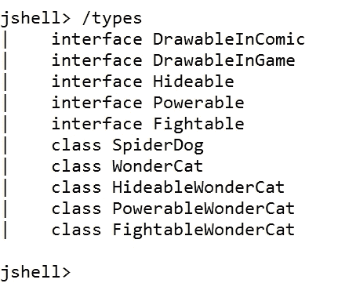
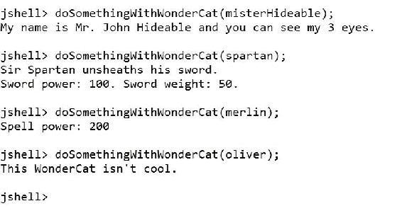

# 九、使用接口的高级契约式编程

在本章中，我们将深入探讨带有接口的契约式编程。我们将更好地理解接口如何作为类型工作。我们将：

*   使用接收接口作为参数的方法
*   带有接口和类的 Downcast
*   理解装箱和拆箱
*   将接口类型的实例视为不同的子类
*   利用 Java 9 中接口中的默认方法

# 使用接收接口作为参数的方法

在上一章中，我们创建了以下五个接口：`DrawableInComic`、`DrawableInGame`、`Hideable`、`Powerable`和`Fightable`。然后，我们创建了以下实现不同接口的类，其中许多类也继承自超类：`SpiderDog`、`WonderCat`、`HideableWonderCat`、`PowerableWonderCat`和`FightableWonderCat`。

在 JShell 中运行以下命令以检查我们创建的所有类型：

```java
/types

```

下面的屏幕截图显示了在 JShell 中执行上一个命令的结果。JShell 列举了我们在会话中创建的五个接口和五个类。



当我们使用接口时，我们使用它们来指定参数类型，而不是使用类名。多个类可能实现单个接口，因此，不同类的实例可能符合特定接口的参数。

现在，我们将创建前面提到的类的其他实例，并使用接口名而不是类名调用指定其所需参数的方法。当我们使用接口作为方法中参数的类型时，我们将了解在幕后发生了什么。

在下面的代码中，前两行创建了名为`teddy`和`winston`的`SpiderDog`类的两个实例。然后，代码为`teddy`调用`drawSpeechBalloon`方法的两个版本。对该方法的第二次调用将`winston`作为`DrawableInComic`参数传递，因为`winston`是`SpiderDog`的实例，而`SpiderDog`是实现`DrawableInComic`实例的类。样本的代码文件包含在`java_9_oop_chapter_09_01`文件夹中的`example09_01.java`文件中。

```java
SpiderDog teddy = new SpiderDog("Teddy");
SpiderDog winston = new SpiderDog("Winston");
teddy.drawSpeechBalloon(
    String.format("Hello, my name is %s", teddy.getNickName()));
teddy.drawSpeechBalloon(winston, "How do you do?");
winston.drawThoughtBalloon("Who are you? I think.");
```

下面的代码创建了名为`oliver`的`WonderCat`类的实例。构造函数中为`nickName`参数指定的值为`"Oliver"`。下一行调用`drawSpeechBalloon`方法让新实例在漫画中引入`Oliver`，然后`teddy`调用`drawSpeechBalloon`方法并将`oliver`作为`DrawableInComic`参数传递，因为`oliver`是`WonderCat`的实例，而`WonderCat`是实现`DrawableInComic`实例的类。因此，我们也可以在需要`DrawableInComic`参数时使用`WonderCat`的实例。样本的代码文件包含在`java_9_oop_chapter_09_01`文件夹中的`example09_01.java`文件中。

```java
WonderCat oliver = 
    new WonderCat("Oliver", 10, "Mr. Oliver", 0, 15, 25);
oliver.drawSpeechBalloon(
    String.format("Hello, my name is %s", oliver.getNickName()));
teddy.drawSpeechBalloon(oliver, 
    String.format("Hello %s", oliver.getNickName()));
```

下面的代码创建了名为`misterHideable`的`HideableWonderCat`类的实例。构造函数中为`nickName`参数指定的值为`"Mr. Hideable"`。下一行检查以`oliver`为参数的`isIntersectingWith`方法调用是否返回`true`。该方法需要一个`DrawableInComic`参数，因此我们可以使用`oliver`。该方法将返回`true`，因为两个实例的`x`和`y`字段具有相同的值。`if`块内的行调用`misterHideable`的`setLocation`方法。然后，代码调用`show`方法。样本的代码文件包含在`java_9_oop_chapter_09_01`文件夹中的`example09_01.java`文件中。

```java
HideableWonderCat misterHideable = 
    new HideableWonderCat("Mr. Hideable", 310, 
        "Mr. John Hideable", 67000, 15, 25, 3);
if (misterHideable.isIntersectingWith(oliver)) {
    misterHideable.setLocation(
        oliver.getX() + 30, oliver.getY() + 30);
}
misterHideable.show();
```

下面的代码创建了名为`merlin`的`PowerableWonderCat`类的实例。构造函数中为`nickName`参数指定的值为`"Merlin"`。接下来的几行调用`setLocation`和`draw`方法。然后，代码调用以`misterHideable`作为`Hideable`参数的`useSpellToHide`方法。该方法需要一个`Hideable`参数，因此我们可以使用`misterHideable`，它是之前创建的`HideableWonderCat`实例，实现`Hideable`接口。然后，对`misterHideable`的`show`方法进行调用，使具有三只眼睛的`Hideable`再次出现。样本的代码文件包含在`java_9_oop_chapter_09_01`文件夹中的`example09_01.java`文件中。

```java
PowerableWonderCat merlin = 
    new PowerableWonderCat("Merlin", 35, 
        "Mr. Merlin", 78000, 30, 40, 200);
merlin.setLocation(
    merlin.getX() + 5, merlin.getY() + 5);
merlin.draw();
merlin.useSpellToHide(misterHideable);
misterHideable.show();
```

下面的代码创建了一个名为`spartan`的`FightableWonderCat`类的实例。构造函数中为`nickName`参数指定的值为`"Spartan"`。接下来的几行调用`setLocation`和`draw`方法。然后，代码以`misterHideable`作为参数调用`unsheathSword`方法。该方法需要一个`Hideable`参数，因此我们可以使用`misterHideable`，之前创建的`HideableWonderCat`实例实现`Hideable`接口。样本的代码文件包含在`java_9_oop_chapter_09_01`文件夹中的`example09_01.java`文件中。

```java
FightableWonderCat spartan = 
    new FightableWonderCat("Spartan", 28, 
        "Sir Spartan", 1000000, 60, 60, 100, 50);
spartan.setLocation(
    spartan.getX() + 30, spartan.getY() + 10);
spartan.draw();
spartan.unsheathSword(misterHideable);

```

最后，代码为`misterHideable`调用`drawThoughtBalloon`和`drawSpeechBalloon`方法。我们可以调用这些方法，因为`misterHideable`是`HideableWonderCat`的一个实例，这个类从它的超类`WonderCat`继承了`DrawableInComic`接口的实现。

对`drawSpeechBalloon`方法的调用将`spartan`作为`DrawableInComic`参数传递，因为`spartan`是`FightableWonderCat`的实例，而`FightableWonderCat`也是一个从其超类`WonderCat`继承`DrawableInComic`接口实现的类。因此，我们也可以在需要`DrawableInComic`参数时使用`FightableWonderCat`的实例，如下面几行所述。样本的代码文件包含在`example09_01.java`文件的`java_9_oop_chapter_09_01`文件夹中。

```java
misterHideable.drawThoughtBalloon(
    "I guess I must be friendly...");
misterHideable.drawSpeechBalloon(
    spartan, "Pleased to meet you, Sir!");
```

当我们在 JShell 中执行前面解释的所有代码片段后，我们将看到以下文本输出：

```java
Teddy -> Hello, my name is Teddy
Teddy -> message: Winston, How do you do?
Winston -> ***Who are you? I think.***
Oliver -> Meow
Teddy -> message: Oliver, Hello Oliver
Moving WonderCat Mr. John Hideable to x:45, y:55
My name is Mr. John Hideable and you can see my 3 eyes.
Moving WonderCat Mr. Merlin to x:35, y:45
Drawing WonderCat Mr. Merlin at x:35, y:45
Mr. Merlin uses his 200 spell power to hide the Hideable with 3 eyes.
My name is Mr. John Hideable and you can see my 3 eyes.
Moving WonderCat Sir Spartan to x:90, y:70
Drawing WonderCat Sir Spartan at x:90, y:70
Sir Spartan unsheaths his sword.
Sword power: 100\. Sword weight: 50.
The sword targets a Hideable with 3 eyes.
Mr. Hideable thinks: 'I guess I must be friendly...'
Spartan ==> Mr. Hideable --> Pleased to meet you, Sir!

```

# 带有接口和类的向下广播

`DrawableInComic`接口以`destination`作为`DrawableInComic`类型的参数，定义方法的`drawSpeechBalloon`方法要求之一，该参数与接口定义的类型相同。下面是我们示例代码中调用此方法的第一行：

```java
teddy.drawSpeechBalloon(winston, "How do you do?");
```

我们调用了在`SpiderDog`类中实现的方法，因为`teddy`是`SpiderDog`的实例。我们将一个`SpiderDog`实例`winston`传递给`destination`参数。该方法使用`destination`参数作为实现`DrawableInComic`接口的实例。因此，每当我们引用`destination`变量时，我们只能看到`DrawableInComic`类型定义了什么。

我们可以很容易地理解，当 Java 将一个类型从其原始类型向下转换为目标类型（例如类所符合的接口）时，会发生什么。在这种情况下，`SpiderDog`被降级为`DrawableInComic`。如果我们在 JShell 中输入以下代码并按下*Tab*键，JShell 将枚举名为`winston`的`SpiderDog`实例的成员：

```java
winston.
```

JShell 将显示以下成员：

```java
drawSpeechBalloon(    drawThoughtBalloon(   equals(
getClass()            getNickName()         hashCode()
nickName              notify()              notifyAll()
speak(                think(                toString()
wait(

```

当我们要求 JShell 列出成员时，它将包括从`java.lang.Object`继承的以下成员：

```java
equals(       getClass()    hashCode()    notify()      notifyAll()
toString()    wait(

```

删除之前输入的代码（`winston.`。如果我们在 JShell 中输入以下代码并按下*Tab*键，括号中作为`winston`变量前缀的`DrawableInComic`接口类型将强制向下转换为`DrawableInComic`接口类型。因此，JShell 只会为名为`winston`的`SpiderDog`实例枚举`DrawableInComic`接口中需要的成员：

```java
((DrawableInComic) winston).
```

JShell 将显示以下成员：

```java
drawSpeechBalloon(    drawThoughtBalloon(   equals(
getClass()            getNickName()         hashCode()
notify()              notifyAll()           toString()
wait(

```

让我们来看看当我们进入 HORT T0 时，结果的差异，并按下了 OutT8TAB TAL T9 键，以及最新的结果。最后列表中显示的成员不包括`SpiderDog`类中定义但`DrawableInComic`接口中不需要的两种方法：`speak`和`think`。因此，当 Java 将`winston`降级到`DrawableInComic`时，我们只能处理`DrawableInComic`接口所需的成员。

### 提示

如果我们使用任何支持自动完成功能的 IDE，当我们使用自动完成功能而不是按 JShell 中的*Tab*键时，我们会注意到成员枚举中的相同差异。

现在我们将分析另一种情况，在这种情况下，我们将实例向下转换到它实现的一个接口。`DrawableInGame`接口定义`isIntersectingWith`方法的方法需求，其中`otherDrawableInGame`作为`DrawableInGame`类型的参数，与接口定义的类型相同。下面是我们示例代码中调用此方法的第一行：

```java
if (misterHideable.isIntersectingWith(oliver)) {
```

我们调用了在`WonderCat`类中定义的方法，因为`misterHideable`是`HideableWonderCat`的一个实例，它从`WonderCat`类继承了`isIntersectingWith`方法的实现。我们将一个`WonderCat`实例`oliver`传递给`otherDrawableInGame`参数。该方法将`otherDrawableInGame`参数用作实现`DrawableInGame`实例的实例。因此，每当我们引用`otherDrawableInGame`变量时，只能看到`DrawableInGame`类型定义了什么。在这种情况下，`WonderCat`被降级为`DrawableInGame`。

如果我们在 JShell 中输入以下代码并按下*Tab*键，JShell 将枚举名为`oliver`的`WonderCat`实例的成员：

```java
oliver.
```

JShell 将为`oliver`显示以下成员：

```java
age                   draw()                drawSpeechBalloon(
drawThoughtBalloon(   equals(               fullName
getAge()              getClass()            getFullName()
getNickName()         getScore()            getX()
getY()                hashCode()            isIntersectingWith(
nickName              notify()              notifyAll()
score                 setLocation(          toString()
wait(                 x                     y

```

删除之前输入的代码（`oliver.`。如果我们在 JShell 中输入以下代码并按下*Tab*键，括号中作为`oliver`变量前缀的`DrawableInGame`接口类型将强制向下转换为`DrawableInGame`接口类型。因此，JShell 只会枚举名为`oliver`的`WonderCat`实例的成员，这些成员是`DrawableInGame`实例中必需的成员：

```java
((DrawableInComic) oliver).
```

JShell 将显示以下成员：

```java
draw()                equals(               getClass()
getFullName()         getScore()            getX()
getY()                hashCode()            isIntersectingWith(
notify()              notifyAll()           setLocation(
toString()            wait(

```

让我们来看看当我们进入 HORT T0 时，结果的差异，并按下了 To.T4TAB TAL T5 键，以及最新的结果。当 Java 将`oliver`下推到`DrawableInGame`时，我们只能处理`DrawableInGame`接口所需的成员。

我们可以使用类似的语法将前面的表达式强制转换为原始类型，即`WonderCat`类型。如果我们在 JShell 中输入以下代码并按下*Tab*键，JShell 将再次枚举名为`oliver`的`WonderCat`实例的所有成员：

```java
((WonderCat) ((DrawableInGame) oliver)).
```

JShell 将显示以下成员，即当我们在没有任何类型强制转换的情况下输入`oliver.`并按下*选项卡*键时，JShell 枚举的所有成员：

```java
age                      draw()             drawSpeechBalloon(
drawThoughtBalloon(      equals(            fullName
getAge()                 getClass()         getFullName()
getNickName()            getScore()         getX()
getY()                   hashCode()         isIntersectingWith(
nickName                 notify()           notifyAll()
score                    setLocation(       toString()
wait(                    x                  y

```

# 将接口类型的实例视为不同的子类

在[第 7 章](07.html#21PMQ2-bc1530b4c4784270ae8a31a7038f8341 "Chapter 7. Members Inheritance and Polymorphism")*成员继承与多态性*中，我们研究了多态性。下一个示例并不代表最佳实践，因为多态性是使其工作的方法。然而，我们将编写一些不代表最佳实践的代码，只是为了进一步了解类型转换。

下面几行在 JShell 中创建了一个名为`doSomethingWithWonderCat`的方法。我们将使用此方法来理解如何将使用接口类型接收的实例视为不同的子类。样本的代码文件包含在`java_9_oop_chapter_09_01`文件夹中的`example09_02.java`文件中。

```java
// The following code is just for educational purposes
// and it doesn't represent a best practice
// We should always take advantage of polymorphism instead
public void doSomethingWithWonderCat(WonderCat wonderCat) {
    if (wonderCat instanceof HideableWonderCat) {
        HideableWonderCat hideableCat = (HideableWonderCat) wonderCat;
        hideableCat.show();
    } else if (wonderCat instanceof FightableWonderCat) {
        FightableWonderCat fightableCat = (FightableWonderCat) wonderCat;
        fightableCat.unsheathSword();
    } else if (wonderCat instanceof PowerableWonderCat) {
        PowerableWonderCat powerableCat = (PowerableWonderCat) wonderCat;
        System.out.println(
            String.format("Spell power: %d", 
                powerableCat.getSpellPower()));
    } else {
        System.out.println("This WonderCat isn't cool.");
    }
}
```

`doSomethingWithWonderCat`方法在`wonderCat`参数中接收`WonderCat`实例。该方法评估许多使用`instanceof`关键字的表达式，以确定`wonderCat`参数中接收的实例是`HideableWonderCat`、`FightableWonderCat`还是`PowerableWonder`的实例。

如果`wonderCat`是`HideableWonderCat`的实例或`HideableWonderCat`的任何潜在子类的实例，则代码声明一个名为`hideableCat`的`HideableWonderCat`局部变量，以保存对`HideableWonderCat`的`wonderCat`引用。然后，代码调用`hideableCat.show`方法。

如果`wonderCat`不是`HideableWonderCat`的实例，则代码计算下一个表达式。如果`wonderCat`是`FightableWonderCat`的实例或`FightableWonderCat`的任何潜在子类的实例，则代码声明一个名为`fightableCat`的`FightableWonderCat`局部变量，以保存对`FightableWonderCat`的`wonderCat`的引用。然后，代码调用`fightableCat.unsheathSword`方法。

如果`wonderCat`不是`FightableWonderCat`的实例，则代码计算下一个表达式。如果`wonderCat`是`PowerableWonderCat`的实例或`PowerableWonderCat`的任何潜在子类的实例，则代码声明一个名为`powerableCat`的`PowerableWonderCat`局部变量，以保存对`PowerableWonderCat`的`wonderCat`的引用。然后，代码使用`powerableCat.getSpellPower()`方法返回的结果打印法术强度值。

最后，如果最后一个表达式的计算结果为`false`，则表示`wonderCat`实例只属于`WonderCat`，代码打印一条消息，指示`WonderCat`不酷。

### 提示

如果我们必须执行类似于此方法中显示的代码的操作，我们必须利用多态性，而不是使用`instanceof`关键字根据实例所属的类运行代码。请记住，我们使用这个示例来了解有关类型转换的更多信息。

现在我们将对 JShell 中最近编码的`doSomethingWithWonderCat`方法进行许多调用。我们将使用在声明此方法之前创建的`WonderCat`及其子类的实例调用此方法。对于`wonderCat`参数，我们将使用以下值调用`doSomethingWithWonderCat`方法：

*   `misterHideable`：`HideableWonderCat`类的实例
*   `spartan`：`FightableWonderCat`类的实例
*   `merlin`：`PowerableWonderCat`类的实例
*   `oliver`：`WonderCat`类的实例

以下四行使用前面枚举的参数调用 JShell 中的`doSomethingWithWonderCat`方法。样本的代码文件包含在`java_9_oop_chapter_09_01`文件夹中的`example09_02.java`文件中。

```java
doSomethingWithWonderCat(misterHideable);
doSomethingWithWonderCat(spartan);
doSomethingWithWonderCat(merlin);
doSomethingWithWonderCat(oliver);
```

下面的屏幕截图显示了在 JShell 中为前几行生成的输出。每个调用都会触发不同的类型转换并调用 typecasted 实例的方法：



# 利用 Java 9 接口中的默认方法

`SpiderDog`和`WonderCat`类都实现了`DrawableInComic`接口。从`WonderCat`类继承的所有类都继承`DrawableInComic`接口的实现。想象一下，我们必须向`DrawableInComic`接口添加一个新的方法需求，并且我们将创建实现该接口新版本的新类。我们将添加一个新的`drawScreamBalloon`方法，绘制一个尖叫气球，也称为尖叫气泡，并带有一条消息。

我们将在`SpiderDog`类中添加新方法的实现。但是，假设我们不能对实现`DrawableInComic`接口`WonderCat`的其中一个类中的代码进行更改。我们有一个大问题，因为一旦我们更改了`DrawableInComic`接口的代码，Java 编译器就会为`WonderCat`类生成一个编译错误，我们将无法编译这个类及其子类。

在这个场景中，Java 8 中引入的以及 Java 9 中可用的接口的默认方法非常有用。我们可以为`drawScreamBalloon`方法声明一个默认实现，并将其包含在新版本的`DrawableInComic`接口中。这样，`WonderCat`类及其子类将能够使用接口中提供的方法的默认实现，并且它们将符合接口中指定的要求。

下面的 UML 图显示了名为`drawScreamBalloon`的默认方法的`DrawableInComic`接口的新版本和覆盖默认方法的`SpiderDog`类的新版本。请注意，`drawScreamBalloon`方法是唯一一个不使用斜体文本的方法，因为它不是抽象方法。


以下几行显示了声明新版本的`DrawableInComic`接口的代码，该接口包括对`drawScreamBalloon`方法的方法要求以及默认实现。注意方法返回类型前面的`default`关键字，表示我们正在声明一个默认方法。默认实现调用`drawSpeechBalloon`方法，实现接口的每个类都将声明该方法。这样，默认情况下，实现此接口的类在收到绘制尖叫气球的请求时将绘制语音气球。

样本的代码文件包含在`example09_03.java`文件的`java_9_oop_chapter_09_01`文件夹中。

```java
public interface DrawableInComic {
    String getNickName();
    void drawSpeechBalloon(String message);
    void drawSpeechBalloon(DrawableInComic destination, String message);
    void drawThoughtBalloon(String message);
 default void drawScreamBalloon(String message) {
 drawSpeechBalloon(message);
 }
}
```

### 提示

在我们创建新版本的接口之后，JShell 将把所有包含实现`DrawableInComic`接口的类实例引用的变量重置为`null`。因此，我们将无法使用正在创建的实例来测试接口中的更改。

以下几行显示了使用新的`drawScreamBalloon`方法的`SpiderDog`类的新版本代码。新行将高亮显示。样本的代码文件包含在`example09_03.java`文件的`java_9_oop_chapter_09_01`文件夹中。

```java
public class SpiderDog implements DrawableInComic {
    protected final String nickName;

    public SpiderDog(String nickName) {
        this.nickName = nickName;
    }

    protected void speak(String message) {
        System.out.println(
            String.format("%s -> %s",
                nickName,
                message));
    }

    protected void think(String message) {
        System.out.println(
            String.format("%s -> ***%s***",
                nickName,
                message));
    }

 protected void scream(String message) {
 System.out.println(
 String.format("%s screams +++ %s +++",
 nickName,
 message));
 }

    @Override
    public String getNickName() {
        return nickName;
    }

    @Override
    public void drawSpeechBalloon(String message) {
        speak(message);
    }

    @Override
    public void drawSpeechBalloon(DrawableInComic destination, 
        String message) {
        speak(String.format("message: %s, %s",
            destination.getNickName(),
            message));
    }

    @Override
    public void drawThoughtBalloon(String message) {
        think(message);
    }

 @Override
 public void drawScreamBalloon(String message) {
 scream(message);
 }
}
```

`SpiderDog`类使用调用受保护的`scream`方法的新版本覆盖`drawScreamBalloon`方法的默认实现，该方法使用特定格式打印收到的`message`，该格式包括`nickName`值作为前缀。这样，这个类就不会使用`DrawableInComic`接口中声明的默认实现，而是使用自己的实现。

在下面的代码中，第一行创建名为`rocky`的`SpiderDog`类的新版本实例，以及名为`maggie`的`FightableWonderCat`类的新版本实例。然后，代码调用`drawScreamBalloon`方法，并为创建的两个实例发送消息：`rocky`和`maggie`。样本的代码文件包含在`java_9_oop_chapter_09_01`文件夹中的`example09_03.java`文件中。

```java
SpiderDog rocky = new SpiderDog("Rocky");
FightableWonderCat maggie = 
    new FightableWonderCat("Maggie", 2, 
        "Mrs. Maggie", 5000000, 10, 10, 80, 30);
rocky.drawScreamBalloon("I am Rocky!");
maggie.drawScreamBalloon("I am Mrs. Maggie!");
```

当我们调用`rocky.drawScreamBalloon`时，Java 执行`SpiderDog`类中声明的该方法的重写实现。当我们调用`maggie.drawScreamBalloon`时，Java 执行`DrawableInComic`接口中声明的默认方法，因为`WonderCat`和`FightableWonderCat`类都没有覆盖该方法的默认实现。别忘了`FightableWonderCat`是`WonderCat`的一个子类。以下屏幕截图显示了在 JShell 中执行前几行的结果：


# 测试你的知识

1.  默认方法允许我们声明：
    1.  当实现接口的类没有声明构造函数时，Java 将使用的接口的默认构造函数。
    2.  在为实现接口的类的实例执行任何方法之前将调用的方法。
    3.  当实现接口的类没有提供自己的方法实现时，Java 将使用接口中方法的默认实现。
2.  考虑到我们有一个现有的接口，很多类都实现，所有的类都没有错误地编译。如果我们将默认方法添加到此接口：
    1.  实现接口的类在为新方法需求提供实现之前不会编译。
    2.  实现接口的类在为新的构造函数需求提供实现之前不会编译。
    3.  实现接口的类将编译。
3.  以下哪个关键字允许我们确定实例是否是实现特定接口的类的实例：
    1.  `instanceof`
    2.  `isinterfaceimplementedby`
    3.  `implementsinterface`
4.  以下哪一个代码段强制将`winston`变量向下转换到`DrawableInComic`接口：
    1.  `(winston as DrawableInComic)`
    2.  `((DrawableInComic) < winston)`
    3.  `((DrawableInComic) winston)`
5.  以下哪一个代码段强制将`misterHideable`变量向下转换为`HideableWonderCat`类：
    1.  `(misterHideable as HideableWonderCat)`
    2.  `((HideableWonderCat) < misterHideable)`
    3.  `((Hid``eableWonderCat) misterHideable)`

# 总结

在本章中，您了解了当方法接收到接口类型的参数时会发生什么。我们使用了接收接口类型参数的方法，并对接口和类进行了降级。我们了解如何将对象视为不同兼容类型的实例，以及这样做时会发生什么。JShell 让我们很容易理解当我们使用类型转换时会发生什么。

我们利用了接口中的默认方法。我们可以向接口添加新方法，并提供默认实现，以避免破坏无法编辑的现有代码。

现在您已经了解了使用接口的高级场景，我们已经准备好使用 Java 9 中的泛型最大化代码重用，这是我们将在下一章中讨论的主题。