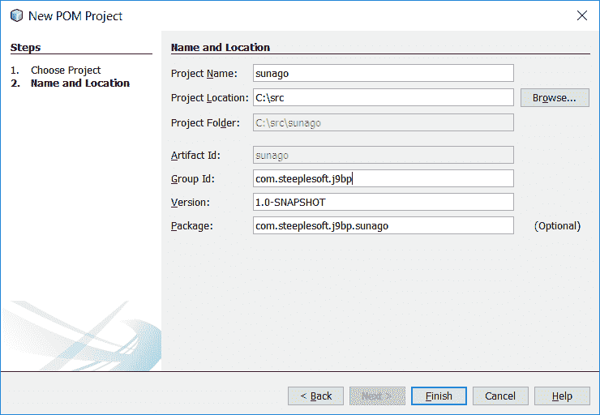
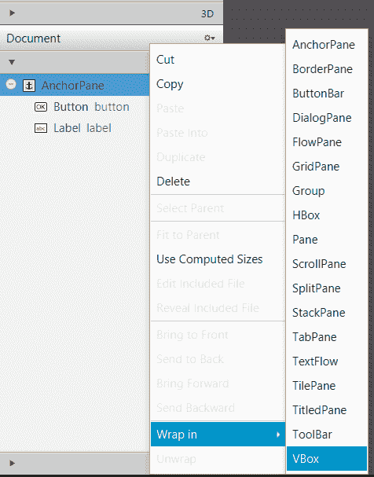
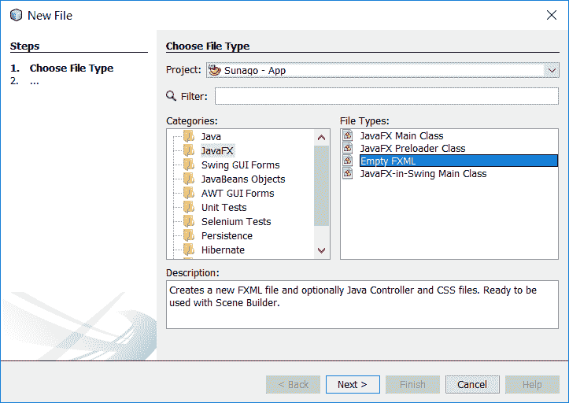
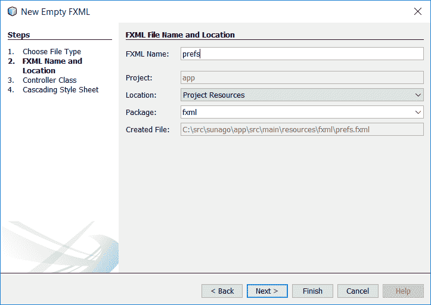
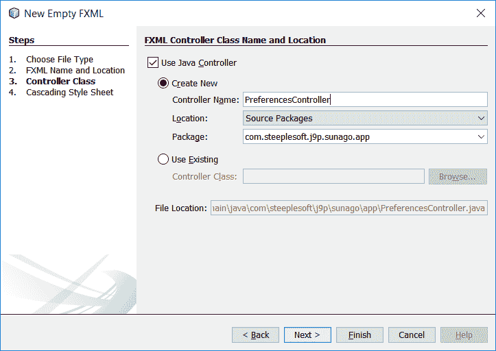
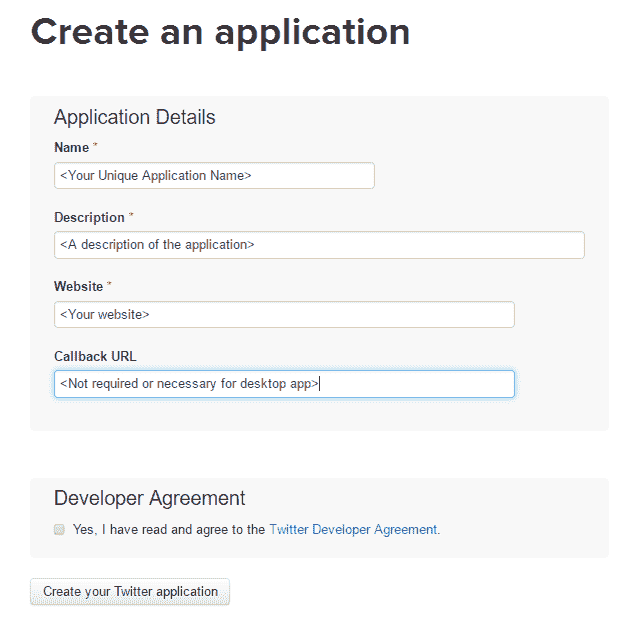
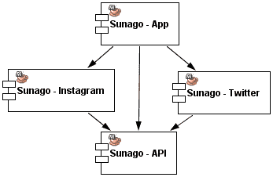
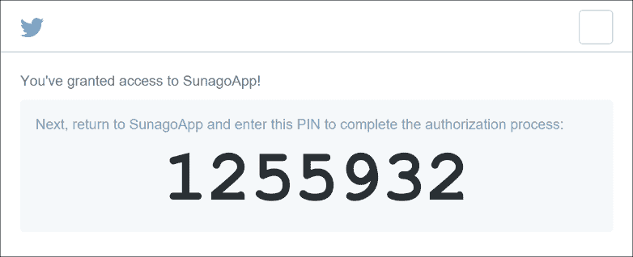
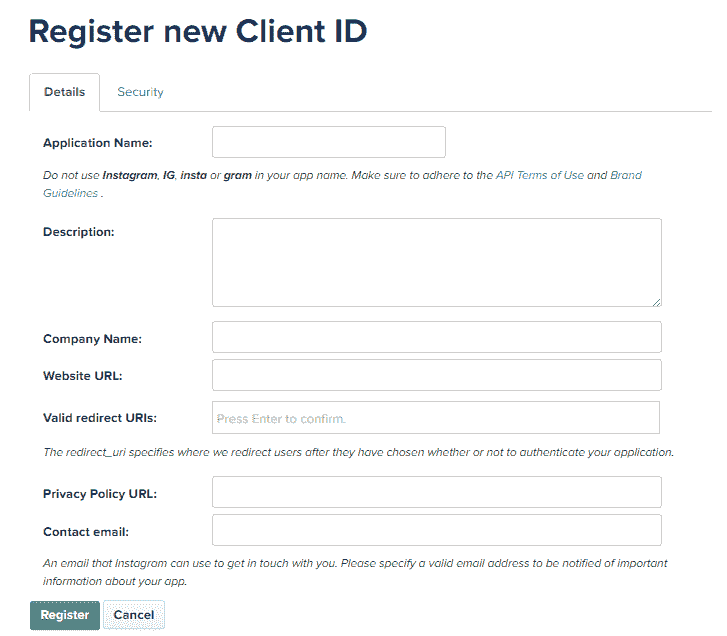

# 五、Sunago——社交媒体聚合器

在我们的下一个项目中，我们将尝试一些更具雄心的东西；我们将构建一个桌面应用程序，该应用程序聚合来自各种社交媒体网络的数据，并在一次无缝交互中显示数据。我们还将尝试一些新的东西，我们将给这个项目起一个名字，这个名字可能比我们迄今为止使用的枯燥的、尽管准确的`description-turned-name`更吸引人。这个应用程序，那么，我们将调用 Sunago，它是（Koine）希腊单词σννάγω的拼音，意思是**我聚集**、**聚集**、**聚集**。

构建该应用程序将涉及几个不同的主题，有些是熟悉的，有些是新的。该清单包括以下内容：

*   JavaFX
*   国际化与本土化
*   **服务商接口**（**SPI**）
*   REST API 消耗
*   `ClassLoader`手法
*   Lambdas、Lambdas 和更多 Lambdas

像往常一样，这些只是亮点，有许多有趣的项目散布在各处。

# 开始

与每个应用程序一样，在开始之前，我们需要考虑我们希望应用程序做什么。也就是说，功能需求是什么？从较高的层次上讲，描述从广义上告诉我们想要实现什么，但更具体地说，我们希望用户能够做到以下几点：

*   连接到多个不同的社交媒体网络
*   逐个网络确定要检索的数据组（用户、列表等）
*   请参见合并显示中每个网络的项目列表
*   能够确定项目来自哪个网络
*   单击项目并将其加载到用户的默认浏览器中

除了应用程序**应该**做的事情列表之外，应用程序**不应该**做的事情还包括：

*   答复/答复项目
*   对项目的评论
*   管理好友/以下列表

这些特性对应用程序来说是一个很好的补充，但是除了前面详细介绍的基本应用程序之外，它们在架构上没有提供太多有趣的功能，因此，为了保持简单--并继续--我们将把范围限制在给定的基本需求集。

那么从哪里开始应用程序呢？在前面的章节中，我们将使其成为桌面应用程序，因此让我们从这里开始，使用 JavaFX 应用程序。我将在这里稍微举手，以使以后的工作更轻松：这将是一个多模块项目，因此我们首先需要创建父项目。在 NetBeans 中，单击文件| New Project…，然后选择`Maven`类别，如以下屏幕截图所示：


单击“下一步”按钮，填写项目详细信息，如下所示：



当您单击 Finish 时，将显示一个空项目。一旦我们将模块添加到这个项目中，区分它们可能会变得很困难，所以作为实践，我会给每个模块一个不同的“名称空间”名称。也就是说，当然，每个模块都有自己的名称，但我用项目名称作为前缀。例如，因为这是项目的基本 POM，所以我称之为`Master`。为了反映这一点，我修改了生成的 POM，使其看起来像这样：

```java
    <?xml version="1.0" encoding="UTF-8"?> 
    <project   
      xmlns:xsi="http://www.w3.org/2001/XMLSchema-instance"  
      xsi:schemaLocation="http://maven.apache.org/POM/4.0.0  
      http://maven.apache.org/xsd/maven-4.0.0.xsd"> 
      <modelVersion>4.0.0</modelVersion> 
      <groupId>com.steeplesoft.sunago</groupId> 
      <artifactId>master</artifactId> 
      <version>1.0-SNAPSHOT</version> 
      <name>Sunago - Master</name> 
      <packaging>pom</packaging> 
    </project> 

```

这方面的内容还不多。这样的父 POM 给我们带来的好处是，如果我们愿意，我们可以使用一个命令构建所有项目，并且我们可以将任何共享配置移动到此共享父 POM 以减少重复。不过，我们现在需要添加的是一个模块，NetBeans 可以帮助我们完成这项工作，如本屏幕截图所示：


单击 CreateNewModule…（创建新模块）后，您将看到熟悉的 NewProject 窗口，您需要从中选择 Maven | JavaFX 应用程序，然后单击 Next（下一步）。在 New Java Application（新建 Java 应用程序）屏幕中，输入`app`作为项目名称，然后单击 Finish（所有其他默认值都可以接受）。

同样，我们想给这个模块一个有意义的名称，所以让我们修改生成的`pom.xml`如下：

```java
    <?xml version="1.0" encoding="UTF-8"?> 
    <project   
      xmlns:xsi="http://www.w3.org/2001/XMLSchema-instance"  
      xsi:schemaLocation="http://maven.apache.org/POM/4.0.0  
      http://maven.apache.org/xsd/maven-4.0.0.xsd"> 
      <modelVersion>4.0.0</modelVersion> 
      <parent> 
        <groupId>com.steeplesoft.sunago</groupId> 
        <artifactId>master</artifactId> 
        <version>1.0-SNAPSHOT</version> 
      </parent> 
      <artifactId>sunago</artifactId> 
      <name>Sunago - App</name> 
      <packaging>jar</packaging> 
    </project> 

```

当 NetBeans 创建项目时，它将为我们生成几个工件——两个类`FXMLController`和`MainApp`，以及资源`fxml/Scene.xml`和`styles/Styles.css`。虽然这可能是显而易见的，但工件的名称应该清楚地传达它们的目的，所以让我们重新命名它们。

类`FxmlContoller`应重命名为`SunagoController`。也许最快捷、最简单的方法是在项目视图中双击该类打开该类，然后在源代码编辑器中，在类声明中单击该类的名称，然后按*Ctrl*+*R*。此时将出现重命名类对话框，您需要在其中输入新名称，然后按*enter*。这将为您重命名类和文件。现在对`MainApp`重复这个过程，将其重命名为`Sunago`。

我们还想将生成的 FXML 文件`Scene.xml`重命名为`sunago.fxml`。要执行此操作，请在“项目视图”中的文件上单击鼠标右键，然后选择“重命名…”。。。从上下文菜单中。在重命名对话框中输入新名称（不带扩展名），然后按*输入*。在我们讨论这个问题时，让我们也将`Styles.css`重命名为`styles.css`，以便案例是一致的。这是一件小事，但代码的一致性可以帮助您对将来可能接管您的代码的人产生信心。

不幸的是，重命名这些文件不会调整 Java 源代码中对它们的引用，因此我们需要编辑`Sunago.java`以指向这些新名称，操作如下：

```java
    @Override
    public void start(Stage stage) throws Exception {
      Parent root = fxmlLoader.load(
        getClass().getResource("/fxml/sunago.fxml"));

        Scene scene = new Scene(root);
        scene.getStylesheets().add("/styles/styles.css");

        stage.setTitle("Sunago, your social media aggregator");
        stage.setScene(scene);
        stage.show();
    }

```

还请注意，我们将标题更改为更合适的名称。

# 设置用户界面

如果我们愿意，现在可以运行我们的应用程序。这将是非常无聊的，但它会运行。让我们试着把无聊的部分修好。

创建的默认 FXML 只是一个带有两个子项、一个按钮和一个标签的 AnchorPane。我们不需要这些，所以让我们把它们处理掉。我们的主用户界面将非常简单——基本上，只是一个组件的垂直堆栈——因此我们可以使用 VBox 作为根组件。也许，将根组件从存在的锚平面更改为 VBox 的最简单方法是使用场景生成器将该组件包装到 VBox 中，然后删除锚平面：



为此，请双击场景生成器中的 FXML 文件（假设您已正确配置 NetBeans，以便它知道在哪里可以找到场景生成器。如果没有，请参阅[第 1 章](01.html)、*简介*。在场景生成器中，右键单击左侧手风琴文档部分的 AnchorPane，选择“包裹”，然后选择 VBox，如前一个屏幕截图所示。然后场景生成器将修改 FXML 文件，使 AnchorPane 成为 VBox 的子对象。完成后，您可以右键单击 AnchorPane，然后单击 Delete 删除它及其子项。这给我们留下了一个空的用户界面，这比我们开始时更无聊。我们现在可以通过添加两个控件来解决这个问题——一个菜单栏和一个列表视图。我们通过单击手风琴控件部分中的每个组件并将其拖动到 VBox 来实现这一点。如果将组件放置在 VBox 上，它们将附加到子组件列表中。确保菜单栏位于 ListView 之前，否则您将拥有一个非常奇怪的用户界面。

在返回代码之前，让我们先配置一下这些组件。从左侧的文档部分选择 VBox，然后需要在右侧的手风琴中选择布局部分。对于最小宽度和最小高度，分别输入`640`和`480`。这将使窗口的默认大小更大，用户更友好。

对于菜单栏，我们需要在文档下展开它的条目，然后展开它的每个菜单子项，每个菜单子项应该显示一个菜单项。单击第一个菜单，然后在右侧将`Text`设置为`_File`，并检查助记符解析。这将允许用户按*Alt*+*F*激活（或显示）此菜单。接下来，点击它的`MenuItem`子项，将`Text`设置为`_Exit`，并检查助记符解析。（如果`Menu`、`MenuItem`、`Button`等的文本中有下划线，请确保检查助记符解析。为简洁起见，我不会再次明确标记。）打开代码部分，并将 On Action 值设置为`closeApplication`。

第二个`Menu`的文本值应设置为`_Edit`。其`MenuItem`应标注为`_Settings`，且其 On 动作值为`showPreferences`。最后，第三个`Menu`应标记为`_Help`，其`MenuItem`应标记为`About`，并带有`showAbout`的开启动作。

接下来，我们想给`ListView`一个 ID，所以选择左边的那个，确保代码部分在右边展开，并为 fx:ID 输入`entriesListView`。

我们需要进行的最后一次编辑是设置控制器。我们在左侧的手风琴中，在最底部的控制器部分中这样做。展开它，确保控制器类值与我们刚刚在 NetBeans 中创建的 Java 类和包匹配，然后保存文件。

# 设置控制器

回到 NetBeans，我们需要调整控制器以反映我们刚刚在 FXML 中所做的更改。在`SunagoController`中，我们需要添加`entriesListView`属性，如下所示：

```java
    @FXML 
    private ListView<SocialMediaItem> entriesListView; 

```

请注意，参数化类型为`SocialMediaItem`。这是我们将在几分钟内创建的自定义模型。不过，在解决这个问题之前，我们需要完成用户界面的连接。我们在 FXML 中定义了三个`onAction`处理程序。相应代码如下：

```java
    @FXML 
    public void closeApplication(ActionEvent event) { 
      Platform.exit(); 
    } 

```

关闭应用程序就像在`Platform`类上调用`exit`方法一样简单。显示“关于”框也相当简单，正如我们在`showAbout`方法中看到的：

```java
    @FXML 
    public void showAbout(ActionEvent event) { 
      Alert alert = new Alert(Alert.AlertType.INFORMATION); 
      alert.setTitle("About..."); 
      alert.setHeaderText("Sunago (συνάγω)"); 
      alert.setContentText("(c) Copyright 2016"); 
      alert.showAndWait(); 
    } 

```

使用内置的`Alert`类，我们构造了一个实例，并为 About 屏幕设置了合适的值，然后通过`showAndWait()`以模式显示。

preferences 窗口是一个更复杂的逻辑部分，因此我们将其封装在一个新的控制器类中，并调用其`showAndWait()`方法。

```java
    @FXML 
    public void showPreferences(ActionEvent event) { 
      PreferencesController.showAndWait(); 
    } 

```

# 编写模型类

不过，在我们看之前，主控制器中还有一些项目需要处理。第一个是前面提到的模型类，`SocialMediaItem`。正如您可能想象的那样，从社交网络返回的数据的结构可能非常复杂，当然也可能多种多样。例如，tweet 的数据要求可能与 Instagram 帖子的数据要求大不相同。那么，我们希望能够做的就是将这些复杂性和差异隐藏在一个简单的、可重用的接口后面。在现实世界中，这样一个简单的抽象并不总是可能的，但是，出于我们在这里的目的，我们在`SocialMediaItem`中有这样一个接口，正如您在这段代码中所看到的：

```java
    public interface SocialMediaItem { 
      String getProvider(); 
      String getTitle(); 
      String getBody(); 
      String getUrl(); 
      String getImage(); 
      Date getTimestamp(); 
    } 

```

抽象的一个问题是，为了使其可重用，您有时必须以这样一种方式对其进行构造，即它们公开可能不是每个实现都使用的属性。这还不明显，但这里的情况确实如此。有些人认为这是不可接受的，他们可能有一个观点，但这确实是一个权衡取舍的问题。我们的选项包括一个稍微臃肿的界面或一个复杂的系统，其中每个网络支持模块（我们将很快介绍）都提供自己的渲染器，应用程序必须查询每个模块，寻找可以在绘制`ListView`时处理每个项目的渲染器。当然，可能还有其他选择，但面对（至少）这两种选择，为了简单性和性能，我们将选择第一种选择。但是，当在设计自己的系统时遇到类似情况时，您需要评估项目的各种需求，并做出适当的选择。对于我们在这方面的需要，简单的方法已经足够了。

无论如何，每个社交媒体网络模块都将实现该接口来包装其数据。这将为应用程序提供一个公共接口，使其可以使用，而无需确切知道它来自何处。不过，我们现在需要告诉`ListView`如何绘制包含`SocialMediaItem`的单元格。我们可以在控制器的`initialize()`方法中使用这一行代码，如下所示：

```java
    entriesListView.setCellFactory(listView ->  
      new SocialMediaItemViewCell()); 

```

很明显，那是一个兰姆达。出于好奇，前面方法的前 lambda 版本如下所示：

```java
    entriesListView.setCellFactory( 
      new Callback<ListView<SocialMediaItem>,  
      ListCell<SocialMediaItem>>() {  
        @Override 
        public ListCell<SocialMediaItem> call( 
          ListView<SocialMediaItem> param) { 
            return new SocialMediaItemViewCell(); 
          } 
    }); 

```

# 完成控制器

在我们看`SocialMediaItemViewCell`之前，还有两个控制器项。第一个是保存`ListView`数据的列表。记住，`ListView`从`ObservableList`开始运行。这允许我们对列表中的数据进行更改，并使其自动反映在用户界面中。要创建该列表，我们将在定义类属性时使用 JavaFX 帮助器方法，如下所示：

```java
    private final ObservableList<SocialMediaItem> entriesList =  
      FXCollections.observableArrayList(); 

```

然后我们需要将该`List`连接到我们的`ListView`。回到`intialize()`，我们有以下内容：

```java
    entriesListView.setItems(entriesList); 

```

为了完成`SocialMediaItem`接口的渲染，我们定义`SocialMediaItemViewCell`如下：

```java
    public class SocialMediaItemViewCell extends  
      ListCell<SocialMediaItem> { 
      @Override 
      public void updateItem(SocialMediaItem item, boolean empty) { 
        super.updateItem(item, empty); 
        if (item != null) { 
          setGraphic(buildItemCell(item)); 
          this.setOnMouseClicked(me -> SunagoUtil 
            .openUrlInDefaultApplication(item.getUrl())); 
        } else { 
            setGraphic(null); 
          } 
      } 

      private Node buildItemCell(SocialMediaItem item) { 
        HBox hbox = new HBox(); 
        InputStream resource = item.getClass() 
          .getResourceAsStream("icon.png"); 
        if (resource != null) { 
          ImageView sourceImage = new ImageView(); 
          sourceImage.setFitHeight(18); 
          sourceImage.setPreserveRatio(true); 
          sourceImage.setSmooth(true); 
          sourceImage.setCache(true); 
          sourceImage.setImage(new Image(resource)); 
          hbox.getChildren().add(sourceImage); 
        } 

        if (item.getImage() != null) { 
          HBox picture = new HBox(); 
          picture.setPadding(new Insets(0,10,0,0)); 
          ImageView imageView = new ImageView(item.getImage()); 
          imageView.setPreserveRatio(true); 
          imageView.setFitWidth(150); 
          picture.getChildren().add(imageView); 
          hbox.getChildren().add(picture); 
        } 

        Label label = new Label(item.getBody()); 
        label.setFont(Font.font(null, 20)); 
        label.setWrapText(true); 
        hbox.getChildren().add(label); 

        return hbox; 
      } 

    } 

```

这里发生的事情相当多，但`updateItem()`是我们感兴趣的第一点。这是每次在屏幕上更新行时调用的方法。注意，我们检查`item`是否为空。我们之所以这样做，是因为`ListView`并不是对其`List`中的每一项调用此方法，而是对`ListView`中可见的每一行调用此方法，无论是否有数据。这意味着，如果`List`有五个项目，但`ListView`足够高，可以显示十行，则该方法将被调用十次，最后五次调用使用空`item`。在这种情况下，我们会调用`setGraphic(null)`来清除之前可能呈现的任何项目。

如果`item`不为空，我们需要构建`Node`来显示该项，这在`buildItemCell()`中完成。对于每个项目，我们希望呈现三个项目——社交媒体网络图标（这样用户一眼就能知道项目来自何处）、项目中嵌入的任何图像，以及项目中的任何文本/标题。为了帮助安排，我们从一个`HBox`开始。

接下来，我们尝试查找网络的图标。如果我们有一份正式的合同，我们会在合同中加入一种语言，规定模块包含一个名为`icon.png`的文件，该文件与模块的`SocialMediaItem`实现在同一个包中。使用`ClassLoader`进行实现，然后，我们尝试获取资源的`InputStream`。我们检查空值，只是为了确保确实找到了图像；如果是这样，我们创建一个`ImageView`，设置一些属性，然后将资源包装成一个`Image`，将其交给`ImageView`，然后将`ImageView`添加到`HBox`。

# 为项目添加图像

如果项目有一个图像，我们处理它的方式与处理网络图标图像的方式相同。不过，这一次，我们实际上在将`ImageView`添加到外部`HBox`之前，将其包装在另一个`HBox`中。我们这样做是为了可以在图像周围添加填充（通过`picture.setPadding(new Insets()`，在图像和网络图标之间留出一些空间。

最后，我们创建一个`Label`来固定物品的主体。我们通过`label.setFont(Font.font(null, 20))`将文本的字体大小设置为`20`点，并将其添加到我们的`HBox`，然后我们将其返回给调用者`updateItem()`。

任何时候你有一个`ListView`，你可能会想要一个像我们这里一样的自定义`ListCell`实现。在某些情况下，在`List`内容上调用`toString()`可能是合适的，但情况并非总是如此，如果不亲自实现`ListCell`，您肯定无法拥有像我们这里这样复杂的`ListCell`结构。如果您计划进行大量 JavaFX 开发，那么最好熟悉这种技术。

# 构建首选项用户界面

我们终于完成了**与主控制器的**，我们可以将注意力转向下一个大件`PreferencesController`。我们的首选项对话框将像通常预期的那样是一个模式对话框。它将提供一个选项卡式界面，其中一个选项卡用于常规设置，然后一个选项卡用于每个受支持的社交网络。我们通过向项目中添加一个新的 FXML 文件和控制器开始这项工作，NetBeans 为此提供了一个很棒的向导。右键单击所需的软件包，然后单击 New | Other。在类别列表中选择`JavaFX`，然后在文件类型列表中选择`Empty FXML`，如下图所示：



单击 Next 之后，您应该会看到 FXML 名称和位置步骤。这将允许我们指定新文件的名称及其创建包，如本屏幕截图所示：



单击 Next 将进入控制器类步骤。在这里，我们可以创建一个新的控制器类，也可以将文件附加到现有的控制器类。由于这是我们应用程序的一个新对话框/窗口，我们需要创建一个新控制器，如下所示：



选中使用 Java 控制器复选框，输入`PreferencesController`作为名称，然后选择所需的包。我们可以单击 Next，这将带我们进入级联样式表步骤，但我们不想为此控制器指定，因此，我们通过单击 Finish 结束向导，这将带我们到新创建的控制器类的源。

让我们从布置用户界面开始。双击新的`prefs.fxml`文件以在场景生成器中打开它。与上一个 FXML 文件一样，默认根元素是 AnchorPane。对于这个窗口，我们想使用一个边界窗格，所以我们使用了上次替换 AnchorPane 时使用的相同技术——右键单击组件，然后单击 Wrap in | BorderPane。AnchorPane 现在嵌套在 BorderPane 中，所以我们再次右键单击它并选择 Delete。

为了构建用户界面，我们现在从左侧的手风琴中拖动一个 TabPane 控件，并将其放置在 BorderPane 的中心区域。这将向我们的用户界面添加一个带有两个选项卡的选项卡窗格。我们现在只想要一个，所以删除第二个。我们想给我们的标签一个有意义的标签。我们可以通过双击预览窗口中的选项卡（或在 Inspector 的 Properties 部分中选择 Text 属性）并键入`General`来实现。最后，展开 Inspector's Code 部分，并为 fx:id 输入`tabPane`。

现在，我们需要提供一种方法，用户可以通过该方法关闭窗口，保存或放弃更改。我们通过将 ButtonBar 组件拖动到边框窗格的底部区域来实现这一点。这将添加一个带有一个按钮的按钮栏，但我们需要两个按钮，因此我们将另一个按钮拖到按钮栏上。这个控件的优点是它可以为我们处理按钮的放置和填充，因此，当我们放下新按钮时，它会自动添加到右侧的适当位置。（此行为可以被重写，但它的工作方式正是我们希望的，因此我们可以只接受默认值。）

对于每个`Button`，我们需要设置三个属性--`text`、`fx:id`和`onAction`。第一个属性位于 inspector 的 Properties 部分，最后两个属性位于 Code 部分。第一个按钮的值为`Save`、`savePrefs`和`savePreferences`。对于第二个按钮，值为`Cancel`、`cancel`和`closeDialog`。在 inspector 中选择`ButtonBar`的布局部分，并将右侧填充设置为 10，以确保`Button`未压在窗口边缘。

最后，我们将在此添加我们唯一的首选项。我们希望允许用户为给定请求指定从每个社交媒体网络检索的最大项目数。对于应用程序已经有一段时间（或曾经）没有被使用的场景，我们会这样做。在这些情况下，我们不想尝试下载，例如，数千条推文。为了增加对此的支持，我们添加了两个控件，`Label`和`TextField`。

获得标签控件的正确位置非常简单，因为它是第一个组件。场景生成器将提供红色指南，以帮助您将组件准确定位在所需位置，如此屏幕截图所示：


确保`TextField`与标签对齐可能更棘手。默认情况下，在 TabPane 上放置组件时，场景生成器将添加一个固定器以容纳新组件。HBox 可能是更好的选择，但我们将继续使用 AnchorPane 来演示场景生成器的这一功能。如果您将文本字段拖到 TabPane 上并尝试定位它，您应该会看到更多的红线显示出来。位置刚好合适，您应该看到一条红线穿过标签的中间和`TextField`，表示两个组件垂直对齐。这就是我们想要的，所以确保`TextField`和标签之间有一个小空间，然后放下它。

我们需要给标签一些有意义的文本，所以在预览窗口中双击它，然后输入`Number of items to retrieve`。我们还需要给`TextField`一个 ID，以便我们可以与之交互，所以点击组件，展开 Inspector 中的代码部分，并将 fx:ID 设置为`itemCount`。

我们的用户界面虽然很基本，但现在已经尽可能完整了，所以保存文件，关闭场景生成器，然后返回 NetBeans。

# 保存用户首选项

为了允许我们新定义的用户界面连接到我们的控制器中，我们需要创建实例变量，以将控件与`fx:id`属性集相匹配，因此，我们将这些变量添加到`PreferencesController`中，如下所示：

```java
    @FXML 
    protected Button savePrefs; 
    @FXML 
    protected Button cancel; 
    @FXML 
    protected TabPane tabPane; 

```

在`initialize()`方法中，我们需要为`itemCount`字段添加加载保存值的支持，因此我们需要讨论一下偏好。

Java 作为一种通用语言，可以编写任何您可以想象的偏好存储策略。幸运的是，它还提供了两种不同的标准 API，允许您以更易于移植的方式进行操作，即`Preferences`和`Properties`。

`java.util.Properties`类自 1.0 版以来就一直存在于 JDK 中，虽然它的基本、不起眼的 API 可能会让这一点变得显而易见，但它仍然是一个非常有用的抽象。在其核心，`Properties`是一个`Hashtable`实现，其中添加了从输入流和读取器加载数据，并将数据写入输出流和写入器的方法（以及其他一些相关方法）。所有属性都被视为带有`String`键的`String`值。由于`Properties`是`Hashtable`，您仍然可以使用`put()`和`putAll()`来存储非字符串数据，但如果您调用`store()`，则会导致`ClassCastException`，因此，可能最好避免这样做。

`java.util.prefs.Preferences`类是在 Java1.4 中添加的，它是一个更加现代的 API。而对于属性，我们必须单独处理持久性，而首选项则以不透明的方式为我们处理持久性——我们不需要担心如何或何时编写持久性。事实上，设置首选项的调用可能会立即返回，而实际的持久性可能在相当长的一段时间内不会发生。`Preferences`API 的契约保证即使 JVM 关闭，首选项也会保持不变，假设这是正常的、有序的关闭（根据定义，如果 JVM 进程突然死亡，那么没有什么可以做的）。

此外，用户也不必担心如何保存首选项。实际的备份存储是特定于实现的详细信息。它可以是平面文件、特定于操作系统的注册表、数据库或某种目录服务器。出于好奇，实际实现是通过在`java.util.prefs.PreferencesFactory`系统属性中使用类名（如果指定）来选择的。如果没有定义，系统将查找文件`META-INF/services/java.util.prefs.PreferencesFactory`（一种称为 SPI 的机制，我们将在后面深入研究），并使用其中定义的第一个类。最后，如果失败，则加载并使用底层平台的实现。

那么选择哪一个呢？这两种方法都能很好地发挥作用，但您必须决定是希望控制信息的存储位置（`Properties`还是易于实现（`Preferences`。在某种程度上，可移植性可能也是一个问题。例如，如果 Java 代码在某种移动或嵌入式设备中运行，则可能没有写入文件系统的权限，也可能根本没有文件系统。不过，为了展示这两种实现的相似性，我们将同时实现这两种实现。

我希望尽可能多的代码可以在 Android 环境中重用。为了帮助实现这一点，我们将创建一个非常简单的界面，如下所示：

```java
    public interface SunagoPreferences { 
      String getPreference(String key); 
      String getPreference(String key, String defaultValue); 
      Integer getPreference(String key, Integer defaultValue); 
      void putPreference(String key, String value); 
      void putPreference(String key, Integer value); 
    } 

```

我们只处理字符串和整数，因为应用程序的需求非常基本。定义了接口之后，我们如何获得对实现的引用？为此，我们将使用一种我们已经简要提到过的技术——服务提供者接口（ServiceProviderInterface，SPI）。

# 带有服务提供商接口的插件和扩展

我们在研究`Preferences`类时已经看到了前面提到的 SPI，以及如何选择和加载实现，但它到底是什么？服务提供者接口是第三方可以实现的接口（或类，抽象的或非抽象的，可以扩展的），以提供额外功能、替换现有组件等的通用术语。

简而言之，目标系统的作者（例如，我们前面的示例中的 JDK 本身）定义并发布一个接口。理想情况下，该系统将提供默认实现，但并非所有情况下都需要。任何感兴趣的第三方都可以实现这个接口，注册它，然后目标系统可以加载并使用它。这种方法的优点之一是，目标系统可以很容易地扩展，而不与第三方耦合。也就是说，虽然第三方通过接口了解目标系统，但目标系统完全不了解第三方。它只是在定义的接口之外进行操作。

这些第三方插件是如何在目标系统中注册的？第三方开发人员将使用特定目录中的特定文件创建文本文件。该文件与正在实现的接口具有相同的名称。对于`Preferences`类示例，我们将实现`java.util.prefs.PreferencesFactory`接口，因此这将是文件名，它将位于库类路径根目录的`META-INF/services`目录中。在一个基于 Maven 的项目中，可以在`src/main/resources/META-INF/services`中找到该文件。该文件只包含实现接口的类的名称。也可以在服务文件中列出多个类，每个类都位于新行中。然而，这取决于消费系统，是否可以使用其中的每一种。

那么这一切对我们来说是什么样子的呢？如前所述，我们将利用一个难得的机会展示我们对`Preferences`支持的多个实现。这两个类都足够小，我们可以显示`Properties`和`Preferences`的用法，并使用 SPI 选择一个来使用。

让我们从基于`Properties`的实现开始：

```java
    public class SunagoProperties implements SunagoPreferences { 
      private Properties props = new Properties(); 
      private final String FILE = System.getProperty("user.home")  
        + File.separator + ".sunago.properties"; 

      public SunagoProperties() { 
        try (InputStream input = new FileInputStream(FILE)) { 
          props.load(input); 
        } catch (IOException ex) { 
        } 
    } 

```

在前面的代码中，我们首先实现`SunagoPreferences`接口。然后，我们创建一个`Properties`类的实例，并为文件名和位置定义一个常量，我们以独立于系统的方式将其放在用户的主目录中。

# 使用 try with resources 处理资源

构造函数显示了一些我们没有讨论过的有趣的东西——请尝试使用资源。在 Java 8 之前，您可能编写过如下内容：

```java
    public SunagoProperties(int a) { 
      InputStream input = null; 
      try { 
        input = new FileInputStream(FILE); 
        props.load(input); 
      } catch  (IOException ex) { 
        // do something 
      } finally { 
          if (input != null) { 
            try { 
                input.close(); 
            } catch (IOException ex1) { 
                Logger.getLogger(SunagoProperties.class.getName()) 
                  .log(Level.SEVERE, null, ex1); 
            } 
          } 
        } 
    } 

```

前面这段极其冗长的代码在 try 块外声明了一个`InputStream`，然后在`try`块中对其进行了一些处理。在`finally`块中，我们尝试关闭`InputStream`，但我们首先必须检查它是否为空。例如，如果该文件不存在（因为它不是第一次创建此类），将抛出一个`Exception`，而`input`将为空。如果它不为 null，我们可以调用它的`close()`，但这可能会抛出`IOException`，所以我们也必须将其封装在`try/catch`块中。

Java8 引入了 try-with-resources 结构，使其更小。如果某个对象是`AutoCloseable`的实例，则可以在的`try`声明中定义**，无论是否抛出`Exception`都会在`try`块作用域终止时自动关闭。这使我们能够获得通常为十四行的代码，并用四行代码表达完全相同的功能，而噪音要小得多。**

除了`AutoCloseable`之外，请注意，我们通过`Properties.load(InputStream)`将文件中的任何现有值加载到我们的`Properties`实例中。

接下来，我们看到的是非常简单的接受者和接受者：

```java
    @Override 
    public String getPreference(String key) { 
      return props.getProperty(key); 
    } 

    @Override 
    public String getPreference(String key, String defaultValue) { 
      String value = props.getProperty(key); 
      return (value == null) ? defaultValue : value; 
    } 

    @Override 
    public Integer getPreference(String key, Integer defaultValue) { 
      String value = props.getProperty(key); 
      return (value == null) ? defaultValue :  
        Integer.parseInt(value); 
    } 

    @Override 
    public void putPreference(String key, String value) { 
      props.put(key, value); 
      store(); 
    } 

    @Override 
    public void putPreference(String key, Integer value) { 
      if (value != null) { 
        putPreference(key, value.toString()); 
      } 
    } 

```

最后一种方法是将我们的首选项写回，如下所示：

```java
    private void store() { 
      try (OutputStream output = new FileOutputStream(FILE)) { 
        props.store(output, null); 
      } catch (IOException e) { } 
    } 

```

最后一个方法看起来很像我们的构造函数，但是我们创建了一个`OutputStream`，并调用`Properties.store(OutputStream)`将我们的值写到一个文件中。请注意，我们从每个 put 方法调用此方法，以确保尽可能将用户首选项忠实地持久化到磁盘。

基于首选项的实现是什么样子的？没什么不同。

```java
    public class SunagoPreferencesImpl implements SunagoPreferences { 
      private final Preferences prefs = Preferences.userRoot() 
        .node(SunagoPreferencesImpl.class.getPackage() 
        .getName()); 
      @Override 
      public String getPreference(String key) { 
        return prefs.get(key, null); 
      } 
      @Override 
      public String getPreference(String key, String defaultValue) { 
        return prefs.get(key, defaultValue); 
      } 

      @Override 
      public Integer getPreference(String key,Integer defaultValue){ 
        return prefs.getInt(key, defaultValue); 
      } 
      @Override 
      public void putPreference(String key, String value) { 
        prefs.put(key, value); 
      } 
      @Override 
      public void putPreference(String key, Integer value) { 
        prefs.putInt(key, value); 
      } 
    } 

```

有两件事需要注意。首先，我们不需要像`Preferences`那样处理持久性。第二，`Preferences`实例的实例化需要注意。显然，我认为，我们希望将这些首选项的范围限定到用户，因此我们从`Preferences.userRoot()`开始获取根首选项节点。然后，我们请求在其中存储首选项的节点，我们选择以类的包命名该节点。

那东西放在哪里？在 Linux 上，该文件可能类似于`~/.java/.userPrefs/_!':!bw"t!#4!cw"0!'`!~@"w!'w!~@"z!'8!~g"0!#4!ag!5!')!c!!u!(:!d@"u!'%!~w"v!#4!}@"w!(!=/prefs.xml`（是的，这是一个目录名）。在 Windows 上，这些首选项保存在 Windows 注册表中的注册表项`HKEY_CURRENT_USER\SOFTWARE\JavaSoft\Prefs\com.steeplesoft.sunago.app`下。但是，除非您想直接与这些文件交互，否则它们的确切位置和格式只是实现细节。不过，有时候知道这是件好事。

我们有两个实现，那么如何选择使用哪一个呢？在文件`src/main/resources/META-INF/service/com.steeplesoft.sunago.api.SunagoPreferences`中（为了清楚起见，包括源根目录），我们可以放置以下两行之一：

```java
    com.steeplesoft.sunago.app.SunagoPreferencesImpl 
    com.steeplesoft.sunago.app.SunagoProperties 

```

您可以同时列出这两个，但只会选择第一个，我们现在将看到这一点。为了使事情变得简单，我们将其封装在一个实用方法中，如下所示：

```java
    private static SunagoPreferences preferences; 
    public static synchronized 
          SunagoPreferences getSunagoPreferences() { 
        if (preferences == null) { 
          ServiceLoader<SunagoPreferences> spLoader =  
            ServiceLoader.load(SunagoPreferences.class); 
          Iterator<SunagoPreferences> iterator = 
            spLoader.iterator(); 
          preferences = iterator.hasNext() ? iterator.next() : null; 
        } 
        return preferences; 
    } 

```

为了达到我们的目的，我们实现了一个单例，将`SunagoPreferences`接口的实例声明为私有静态，并通过同步方法使其可用，该方法检查`null`，并在需要时创建实例。

虽然这很有趣，但不要让它分散你对该方法实质的注意力。我们使用`ServiceLoader.load()`方法向系统询问`SunagoPreferences`接口的任何实现。再次值得注意的是，为了清楚起见，它不会在系统中获取**任何**实现，而只获取**我们前面描述的服务文件中列出的**实现。使用`ServiceLoader<SunagoPreferences>`实例，我们获取一个迭代器，如果它有一个条目（`iterator.hasNext()`，我们将返回该实例（`iterator.next()`。如果没有，我们返回`null`。这里有一个`NullPointerException`的机会，因为我们返回`null`，但我们也提供了一个实现，所以我们避免了这种风险。然而，在您自己的代码中，您需要确保您有一个实现，就像我们在这里所做的那样，或者确保消费代码是`null`就绪的。

# 添加网络-Twitter

到目前为止，我们已经有了一个非常基本的应用程序，它可以保存和加载自己的首选项，但让我们开始了解我们在这里的目的，并开始连接到社交网络。我们希望开发的是一个框架，可以轻松地为不同的社交网络添加支持。从技术上讲，我们很快就会看到，**网络**甚至不需要社交，因为唯一能暗示特定类型源的东西就是所涉及的类和接口的名称。然而，事实上，我们将重点关注社交网络，我们将使用几个不同的社交网络来展示一些多样性。为此，我们将从推特（Twitter）和 Instagram（Instagram）开始，Twitter 是一个广受欢迎的微博平台，Instagram 是一个越来越关注照片的网络，现在已成为 Facebook 的一部分。

说到 Facebook，我们为什么不展示与该社交网络的整合？有两个原因——第一，它与 Twitter 没有太大的不同，所以不会有太多新的内容来涵盖；第二，最重要的是，Facebook 提供的权限使得它几乎不可能以这里感兴趣的方式与之集成。例如，阅读用户主页时间线（或墙）的权限仅授予针对 Facebook 当前不可用的平台的应用程序，而完全不授予桌面应用程序，这是我们的目标。

如前所述，我们希望公开一种不必更改核心应用程序就可以添加更多网络的方法，因此我们需要开发一个 API。我们将在这里介绍的是 API 或多或少处于**完成**状态（是否有任何软件真正完成了？）。然而，尽管您将看到一个相当完整的 API，但需要注意的是——尝试创建一个从该抽象开始的抽象——也就是说，从头开始编写抽象——很少有好的结局。通常最好编写一个特定的实现，以便更好地理解所需的细节，然后提取一个抽象。你们在这里看到的是这个过程的最终结果，所以这个过程在这里不会有任何深度。

# 注册为 Twitter 开发者

要创建与 Twitter 集成的应用程序，我们需要创建一个 Twitter 开发人员帐户，然后创建一个 Twitter 应用程序。要创建帐户，我们需要访问[https://dev.twitter.com](https://dev.twitter.com/) ，点击加入按钮。创建开发者帐户后，您可以单击“我的应用”链接转到[https://apps.twitter.com](https://apps.twitter.com/) 。在这里，我们需要单击“创建新应用”按钮，这将为我们提供一个类似以下内容的表单：



虽然我们正在开发的应用程序名为*Sunago*，但您将无法使用该名称，因为它已经被使用了；假设您计划自己运行应用程序，则必须创建自己的唯一名称。创建应用程序后，您将进入新应用程序的应用程序管理页面。从该页面，您可以管理应用程序的权限和密钥，如果需要，还可以删除应用程序。

本页需要注意的一点是，我们很快就会用到它，即在哪里可以找到应用程序的使用者密钥和机密。这些是长的字母数字字符串，您的应用程序将使用它们来验证 Twitter 的服务。为了代表用户与 Twitter 交互——这是我们的最终目标——需要一组不同的令牌，我们将很快获取这些令牌。您的消费者密钥和机密——特别是消费者机密——应该保密。如果这种组合被公开披露，其他用户将能够伪装成你的应用程序，如果他们滥用该服务，可能会给你带来严重的麻烦。因此，在本书或源代码的任何地方都看不到我生成的密钥/密码组合，这就是为什么需要生成自己的密钥/密码组合的原因。

现在有了我们的消费者密钥和秘密，我们需要决定如何与 Twitter 交谈。Twitter 提供了一个公共 restapi，他们将其记录在自己的站点上。如果我们愿意，我们可以选择某种 HTTP 客户机，并开始进行调用。不过，为了简单明了，更不用说健壮性、容错性等等，我们最好使用某种更高级的库。幸运的是，有这样一个库 Twitter4J，它将使我们的集成更加简单和干净（奇怪的是，Twitter4J 有 200 多个 Java 类。虽然我们不需要所有在这里表示并通过 RESTAPI 公开的功能，但它应该让您了解为 Twitter 的 REST 接口编写合理包装所需的工作范围）。

如前所述，我们希望能够在不改变核心应用程序的情况下向 Sunago 添加网络，因此我们将在单独的 Maven 模块中编写 Twitter 集成。这需要将我们为 Sunago 编写的一些代码提取到另一个模块中。我们的 Twitter 模块和主应用程序模块都将在这个新模块上添加一个依赖项。因为这里有多个模块，所以我们一定要指出每个类属于哪个模块。完成后，我们的项目依赖关系图将如下所示：



从技术上讲，我们显示应用程序模块与 Instagram 和 Twitter 模块之间存在依赖关系的唯一原因是，我们将它们构建为同一项目的一部分。我们将看到，第三方开发人员可以轻松地开发一个独立的模块，将其添加到应用程序的运行时类路径，并查看应用程序中的更改，所有这些都不需要构建级别的依赖关系。不过，希望此图有助于解释模块之间的关系。

# 向 Sunago 添加 Twitter 首选项

让我们从将 Twitter 添加到首选项屏幕开始。在进行任何集成之前，我们需要能够配置应用程序，或者更准确地说，配置 Twitter 模块，以便它可以作为特定用户进行连接。为了实现这一点，我们将向 API 模块添加一个新接口，如下所示：

```java
    public abstract class SocialMediaPreferencesController { 
      public abstract Tab getTab(); 
      public abstract void savePreferences(); 
    } 

```

这个接口将为 Sunago 模块提供两个钩子——一个让模块有机会绘制自己的首选项用户界面，另一个让模块保存这些首选项。然后我们可以在我们的模块中实现它。在我们这样做之前，让我们看看应用程序将如何找到这些实现，以便可以使用它们。为此，我们将再次转向 SPI。在 Sunago 的`PreferencesController`界面中，我们添加了以下代码：

```java
    private List<SocialMediaPreferencesController> smPrefs =  
      new ArrayList<>(); 
    @Override 
    public void initialize(URL url, ResourceBundle rb) { 
      itemCount.setText(SunagoUtil.getSunagoPreferences() 
       .getPreference(SunagoPrefsKeys.ITEM_COUNT.getKey(), "50")); 
      final ServiceLoader<SocialMediaPreferencesController>  
       smPrefsLoader = ServiceLoader.load( 
         SocialMediaPreferencesController.class); 
       smPrefsLoader.forEach(smp -> smPrefs.add(smp)); 
       smPrefs.forEach(smp -> tabPane.getTabs().add(smp.getTab())); 
    } 

```

我们有一个实例变量来保存我们找到的任何`SocialMediaPreferencesController`实例的列表。接下来，在`initialize()`中，我们调用现在熟悉的`ServiceLoader.load()`方法来查找任何实现，然后将其添加到我们之前创建的`List`中。一旦我们有了控制器列表，我们就对每个控制器调用`getTab()`，将返回的`Tab`实例添加到`PreferencesController`接口的`tabPane`中。

在阐明了加载部分之后，现在让我们看看 Twitter 首选项用户界面实现。我们首先实现支持用户界面这一部分的控制器，如下所示：

```java
    public class TwitterPreferencesController  
      extends SocialMediaPreferencesController { 
        private final TwitterClient twitter; 
        private Tab tab; 

        public TwitterPreferencesController() { 
          twitter = new TwitterClient(); 
        } 

        @Override 
        public Tab getTab() { 
          if (tab == null) { 
            tab = new Tab("Twitter"); 
            tab.setContent(getNode()); 
          } 

          return tab; 
    } 

```

稍后我们将看一看`TwitterClient`，但首先，请注意`getTab()`。注意，我们创建了需要返回的`Tab`实例，但是我们将其内容的创建委托给`getNode()`方法。`Tab.setContent()`允许我们用一个呼叫完全替换选项卡的内容，我们将在下一步使用它。`getNode()`方法如下：

```java
    private Node getNode() { 
      return twitter.isAuthenticated() ? buildConfigurationUI() : 
        buildConnectUI(); 
    } 

```

如果用户已经通过身份验证，那么我们希望提供一些配置选项。如果没有，那么我们需要提供一种连接 Twitter 的方式。

```java
    private Node buildConnectUI() { 
      HBox box = new HBox(); 
      box.setPadding(new Insets(10)); 
      Button button = new Button(MessageBundle.getInstance() 
       .getString("connect")); 
      button.setOnAction(event -> connectToTwitter()); 

      box.getChildren().add(button); 

      return box; 
    } 

```

在这个简单的用户界面中，我们主要创建一个`HBox`，以便添加一些填充。如果没有我们传递给`setPadding()`的`new Insets(10)`实例，我们的按钮会被按到窗口的左上角，这在视觉上是不吸引人的。接下来，我们创建`Button`，并设置`onAction`处理程序（暂时忽略该构造函数参数）。

有趣的部分隐藏在`connectToTwitter`中，如下代码所示：

```java
    private void connectToTwitter() { 
      try { 
        RequestToken requestToken =  
          twitter.getOAuthRequestToken(); 
        LoginController.showAndWait( 
          requestToken.getAuthorizationURL(), 
           e -> ((String) e.executeScript( 
             "document.documentElement.outerHTML")) 
              .contains("You've granted access to"), 
               e -> { 
                 final String html =  
                   "<kbd aria-labelledby=\"code-desc\"><code>"; 
                    String body = (String) e.executeScript( 
                      "document.documentElement.outerHTML"); 
                    final int start = body.indexOf(html) +  
                     html.length(); 
                    String code = body.substring(start, start+7); 
                    saveTwitterAuthentication(requestToken, code); 
                    showConfigurationUI(); 
               }); 
      } catch (TwitterException ex) { 
        Logger.getLogger(getClass().getName()) 
          .log(Level.SEVERE, null, ex); 
      } 
    } 

```

# OAuth 和登录 Twitter

我们稍后将绕道进入`LoginController`，但首先，让我们确保了解这里发生了什么。为了代表用户登录 Twitter，我们需要生成一个 OAuth 请求令牌，从中我们可以获得授权 URL。其详细信息隐藏在 Twitter4J API 后面，但它基本上是应用程序管理页面上列出的 OAuth 授权 URL，请求令牌作为查询字符串传递。我们将看到，此 URL 在`WebView`中打开，提示用户对 Twitter 进行身份验证，然后授权应用程序（或拒绝）：


如果用户成功地对应用程序进行了身份验证和授权，`WebView`将重定向到一个成功页面，该页面显示我们需要捕获的数字代码，以完成收集所需的身份验证/授权凭据。成功页面可能如下所示：



对于那些不熟悉 OAuth 的人来说，这允许我们现在和将来的任意时刻作为用户进行身份验证，而不需要存储用户的实际密码。我们的应用程序和 Twitter 之间握手的最终结果是令牌和令牌机密，我们将传递给 Twitter 进行身份验证。只要这个令牌有效——用户可以随时通过 Twitter 的 web 界面使其无效——我们就可以连接并充当该用户。如果密钥被泄露，用户可以撤销密钥，仅影响预期应用程序和试图使用被盗密钥的任何人。

`LoginController`是 API 模块的一部分，为我们处理所有样板代码，如以下代码所示：

```java
    public class LoginController implements Initializable { 
      @FXML 
      private WebView webView; 
      private Predicate<WebEngine> loginSuccessTest; 
      private Consumer<WebEngine> handler; 

      public static void showAndWait(String url,  
       Predicate<WebEngine> loginSuccessTest, 
       Consumer<WebEngine> handler) { 
         try { 
           fxmlLoader loader = new fxmlLoader(LoginController 
             .class.getResource("/fxml/login.fxml")); 

           Stage stage = new Stage(); 
           stage.setScene(new Scene(loader.load())); 
           LoginController controller =  
              loader.<LoginController>getController(); 
           controller.setUrl(url); 
           controller.setLoginSuccessTest(loginSuccessTest); 
           controller.setHandler(handler); 

           stage.setTitle("Login..."); 
           stage.initModality(Modality.APPLICATION_MODAL); 

           stage.showAndWait(); 
         } catch (IOException ex) { 
           throw new RuntimeException(ex); 
         } 
    } 

```

前面的代码是一个基本的 FXML 支持的 JavaFX 控制器，但是我们有一个静态帮助器方法来处理创建、配置和显示实例的细节。我们使用 FXML 加载场景，获取控制器（它是封闭类的一个实例），设置`loginSuccessTest`和`handler`属性，然后显示对话框。

`loginSuccessTest`和`handler`看起来奇怪吗？它们是 Java 8 功能接口`Predicate<T>`和`Consumer<T>`的实例。`Predicate`是一个函数接口，它接受一个类型，在我们的例子中是`WebEngine`，并返回一个`boolean`。它的目的是检查给定指定类型变量的特定条件。在本例中，我们调用`WebEngine.executeScript().contains()`提取文档的一部分，并查看它是否包含一段表示我们已重定向到登录成功页面的文本。

`Consumer<T>`是一个函数接口（或者，在我们的例子中是一个 lambda），它接受指定类型的单个参数，并返回 void。我们的处理程序是一个`Consumer`，一旦我们的`Predicate`返回 true，就会调用它。lambda 从 HTML 页面提取代码，调用`saveTwitterAuthentication()`完成对用户的身份验证，然后`showConfigurationUI()`更改用户界面，以便用户可以配置与 Twitter 相关的设置。

方法`saveTwitterAuthentication()`非常简单，如下所示：

```java
    private void saveTwitterAuthentication(RequestToken requestToken,
     String code) { 
       if (!code.isEmpty()) { 
         try { 
           AccessToken accessToken = twitter 
             .getAcccessToken(requestToken, code); 
           prefs.putPreference(TwitterPrefsKeys.TOKEN.getKey(),  
             accessToken.getToken()); 
           prefs.putPreference(TwitterPrefsKeys.TOKEN_SECRET.getKey(),  
             accessToken.getTokenSecret()); 
         } catch (TwitterException ex) { 
           Logger.getLogger(TwitterPreferencesController 
             .class.getName()).log(Level.SEVERE, null, ex); 
         } 
       } 
    } 

```

方法`twitter.getAccessToken()`获取我们的请求令牌和我们从网页中提取的代码，并向 Twitter REST 端点发送 HTTP`POST`，该端点生成我们需要的令牌密钥。当该请求返回时，我们将令牌和令牌机密存储到我们的`Preferences`存储中（同样，不知道在哪里以及如何存储）。

方法`showConfigurationUI()`和相关方法也应熟悉。

```java
    private void showConfigurationUI() { 
      getTab().setContent(buildConfigurationUI()); 
    } 
    private Node buildConfigurationUI() { 
      VBox box = new VBox(); 
      box.setPadding(new Insets(10)); 

      CheckBox cb = new CheckBox(MessageBundle.getInstance() 
        .getString("homeTimelineCB")); 
      cb.selectedProperty().addListener( 
        (ObservableValue<? extends Boolean> ov,  
          Boolean oldVal, Boolean newVal) -> { 
            showHomeTimeline = newVal; 
          }); 

      Label label = new Label(MessageBundle.getInstance() 
        .getString("userListLabel") + ":"); 

      ListView<SelectableItem<UserList>> lv = new ListView<>(); 
      lv.setItems(itemList); 
      lv.setCellFactory(CheckBoxListCell.forListView( 
        item -> item.getSelected())); 
      VBox.setVgrow(lv, Priority.ALWAYS); 

      box.getChildren().addAll(cb, label, lv); 
      showTwitterListSelection(); 

      return box;
    } 

```

上述方法中的一个新项是我们添加到`CheckBox`的`selectedProperty`中的侦听器。只要所选值发生变化，就会调用我们的侦听器，从而设置`showHomeTimeline`布尔值。

`ListView`也需要特别注意。请注意参数化类型`SelectableItem<UserList>`。那是什么？这是我们创建的一个抽象类，用于包装在`CheckBoxListCell`中使用的项目，您可以在对`setCellFactory()`的调用中看到。该类如下所示：

```java
    public abstract class SelectableItem<T> { 
      private final SimpleBooleanProperty selected =  
        new SimpleBooleanProperty(false); 
      private final T item; 
      public SelectableItem(T item) { 
        this.item = item; 
      } 
      public T getItem() { 
        return item; 
      } 
      public SimpleBooleanProperty getSelected() { 
        return selected; 
      } 
    } 

```

这个类位于 API 模块中，是一个简单的包装器，它围绕一个任意类型添加了一个`SimpleBooleanProperty`。我们可以看到在建立单元工厂时如何操作此属性--`lv.setCellFactory(CheckBoxListCell .forListView(item -> item.getSelected()))`。我们通过`getSelected()`方法公开`SimpleBooleanProperty`，`CheckBoxListCell`使用`getSelected()`方法设置和读取每一行的状态。

我们最终的用户界面相关方法如下：

```java
    private void showTwitterListSelection() { 
      List<SelectableItem<UserList>> selectable =  
        twitter.getLists().stream() 
         .map(u -> new SelectableUserList(u)) 
         .collect(Collectors.toList()); 
      List<Long> selectedListIds = twitter.getSelectedLists(prefs); 
      selectable.forEach(s -> s.getSelected() 
        .set(selectedListIds.contains(s.getItem().getId()))); 
      itemList.clear(); 
      itemList.addAll(selectable); 
    } 

```

使用相同的`SelectableItem`类，我们从 Twitter 请求用户可能已经创建的所有列表，我们将其包装在`SelectableUserList`中，一个`SelectableItem`子类覆盖`toString()`方法，在`ListView`中提供用户友好的文本。我们从首选项加载任何选中列表，设置它们各自的布尔值/复选框，并更新我们的`ObservableList`和用户界面。

为满足`SocialMediaPreferencesController`合同，我们需要实施的最终方法是`savePreferences()`，具体如下：

```java
    public void savePreferences() { 
      prefs.putPreference(TwitterPrefsKeys.HOME_TIMELINE.getKey(),  
       Boolean.toString(showHomeTimeline)); 
      List<String> selectedLists = itemList.stream() 
       .filter(s -> s != null) 
       .filter(s -> s.getSelected().get()) 
       .map(s -> Long.toString(s.getItem().getId())) 
       .collect(Collectors.toList()); 
      prefs.putPreference(TwitterPrefsKeys.SELECTED_LISTS.getKey(),  
       String.join(",", selectedLists)); 
    } 

```

这是一种将用户选项保存到首选项的简单方法，但是列表处理值得指出。我们不需要手动迭代列表中的每个项目，而是可以使用流并应用两个`filter()`操作来去除我们不感兴趣的条目，`map()`每个`SelectableUserList`都可以到达`Long`（列表的 ID），然后在`List<String>`中收集它们。我们使用`String.join()`加入`List`，并根据我们的喜好写出它。

# 为 Twitter 添加模型

我们还需要实现几个其他接口来完成对 Twitter 的支持。第一个也是更简单的一个是`SocialMediaItem`：

```java
    public interface SocialMediaItem { 
      String getProvider(); 
      String getTitle(); 
      String getBody(); 
      String getUrl(); 
      String getImage(); 
      Date getTimestamp(); 
    } 

```

前面的这个接口为我们提供了一个很好的对各种类型的数据的抽象，社交网络可能返回这些数据，而不会对大多数（或至少很多）网络没有使用的字段造成太大的负担。这个`Tweet`类的 Twitter 实现如下：

```java
    public class Tweet implements SocialMediaItem { 
      private final Status status; 
      private final String url; 
      private final String body; 

      public Tweet(Status status) { 
        this.status = status; 
        body = String.format("@%s: %s (%s)",  
          status.getUser().getScreenName(), 
          status.getText(), status.getCreatedAt().toString()); 
        url = String.format("https://twitter.com/%s/status/%d", 
          status.getUser().getScreenName(), status.getId()); 
    } 

```

以 Twitter4J 类`Status`为例，我们提取我们感兴趣的信息，并将其存储在实例变量中（没有显示其 getter，因为它们只是简单的 getter）。对于`getImage()`方法，我们尽了合理的努力从 tweet 中提取任何图像，如下所示：

```java
    public String getImage() { 
      MediaEntity[] mediaEntities = status.getMediaEntities(); 
      if (mediaEntities.length > 0) { 
        return mediaEntities[0].getMediaURLHttps(); 
      } else { 
          Status retweetedStatus = status.getRetweetedStatus(); 
          if (retweetedStatus != null) { 
            if (retweetedStatus.getMediaEntities().length > 0) { 
              return retweetedStatus.getMediaEntities()[0] 
               .getMediaURLHttps(); 
            } 
          } 
        } 
      return null; 
    } 

```

# 实现 Twitter 客户端

第二个接口是`SocialMediaClient`。该接口不仅是 Sunago 可以用来与任意社交网络集成进行交互的抽象，也是感兴趣的开发人员向他们展示集成的最低要求的指南。看起来是这样的：

```java
    public interface SocialMediaClient { 
      void authenticateUser(String token, String tokenSecret); 
      String getAuthorizationUrl(); 
      List<? Extends SocialMediaItem> getItems(); 
      boolean isAuthenticated(); 
    } 

```

对于 Twitter 支持，前面的接口由类`TwitterClient`实现。这个类的大部分内容都是非常基本的，所以我们不会在这里重复（如果您需要详细信息，可以在源代码存储库中阅读），但是一个实现细节可能值得花一些时间。该方法为`processList()`，具体如下：

```java
    private List<Tweet> processList(long listId) { 
      List<Tweet> tweets = new ArrayList<>(); 

      try { 
        final AtomicLong sinceId = new AtomicLong( 
          getSinceId(listId)); 
        final Paging paging = new Paging(1,  
          prefs.getPreference(SunagoPrefsKeys. 
          ITEM_COUNT.getKey(), 50), sinceId.get()); 
        List<Status> statuses = (listId == HOMETIMELINE) ?  
          twitter.getHomeTimeline(paging) : 
           twitter.getUserListStatuses(listId, paging); 
        statuses.forEach(s -> { 
          if (s.getId() > sinceId.get()) { 
            sinceId.set(s.getId()); 
          } 
          tweets.add(new Tweet(s)); 
        }); 
        saveSinceId(listId, sinceId.get()); 
      } catch (TwitterException ex) { 
          Logger.getLogger(TwitterClient.class.getName()) 
           .log(Level.SEVERE, null, ex); 
        } 
        return tweets; 
    } 

```

在最后一种方法中发生了几件事。首先，我们想限制我们实际检索的 tweet 数量。如果这是应用程序第一次被使用，或者是很长一段时间以来第一次被使用，那么可能会有大量的 tweet。从网络使用、内存和处理时间的角度来看，检索所有这些文件都会非常昂贵。我们使用 Twitter4J 中的`Paging`对象实现该限制。

我们也不想检索我们已经拥有的 tweet，因此，对于每个列表，我们保留一个`sinceId`，我们可以将其传递到 Twitter API。它将使用此查找 ID 大于`sinceId`的最多指定数量的 tweet。

在`Paging`对象中封装所有这些内容，如果列表 ID 为`-1`（我们用来标识主时间线的内部 ID），则调用`twitter.getHomeTimeline()`，或者调用`twitter.getUserListStatus()`作为用户定义的列表。对于每个返回的`Status`，我们更新`sinceId`（我们使用`AtomicLong`建模，因为 lambda 中使用的任何方法变量都必须是 final 或有效 final），并将 tweet 添加到我们的`List`。在退出之前，我们将列表的`sinceId`存储在内存存储中，然后返回 Twitter 列表的 tweets。

# 浅谈国际化与本土化

虽然有点基础，但我们与 Twitter 的集成现在已经完成，因为它满足了我们对网络的功能需求。然而，我们还需要快速查看另外一段代码。在前面的一些代码示例中，您可能已经注意到如下代码：`MessageBundle.getInstance().getString("homeTimelineCB")`。那是什么，它有什么作用？

`MessageBundle`类是 JDK 提供的国际化和本地化设施（也称为 i18n 和 l10n，其中数字表示从单词中删除的字母数，以形成缩写）的小包装。此类的代码如下所示：

```java
    public class MessageBundle { 
      ResourceBundle messages =  
        ResourceBundle.getBundle("Messages", Locale.getDefault()); 

      private MessageBundle() { 
      } 

      public final String getString(String key) { 
        return messages.getString(key); 
      } 

      private static class LazyHolder { 
        private static final MessageBundle INSTANCE =  
          new MessageBundle(); 
      } 

      public static MessageBundle getInstance() { 
        return LazyHolder.INSTANCE; 
      } 
    } 

```

这里有两个主要的关注点。我们将在课程结束时使用`getInstance()`方法开始。这是一个被称为**按需初始化持有者**（**IODH**模式的示例。JVM 中有一个类`MessageBundle`的静态实例。但是，在调用`getInstance()`方法之前，它不会初始化。这是通过利用 JVM 如何加载和初始化静态来实现的。一旦类以任何方式被引用，它就会被加载到`ClassLoader`中，此时类上的任何静态都将被初始化。私有静态类`LazyHolder`在 JVM 确定需要访问它之前**不会**初始化。一旦我们调用引用`LazyHolder.INSTANCE`的`getInstance()`，该类将被初始化并创建 singleton 实例。

应该注意的是，我们试图实现的是一些单例性质的方法（例如，通过反射），但是我们这里的用例并不保证对这种攻击有任何担心。

实际功能在类的第一行实现，如下所示

```java
    ResourceBundle messages =  
      ResourceBundle.getBundle("Messages", Locale.getDefault()); 

```

用 Javadoc 的话来说，`ResourceBundle`文件*包含特定于语言环境的对象*。通常，这意味着字符串，就像在我们的例子中一样。`getBundle()`方法将尝试查找并加载具有指定区域设置的名称的捆绑包。在我们的例子中，我们正在寻找一个名为`Messages`的包。从技术上讲，我们正在寻找一个具有共享基本名称`Messages`的捆绑包族中的捆绑包。系统将使用指定的`Locale`查找正确的文件。此解析将遵循`Locale`使用的相同查找逻辑，因此`getBundle()`方法将返回具有最特定匹配名称的包。

假设我们正在我的计算机上运行这个应用程序。我住在美国，所以我的系统的默认区域设置是`en_US`。按照`Locale`查找的规则，`getBundle()`将尝试按以下顺序查找文件：

1.  `Messages_en_US.properties`。
2.  `Messages_en.properties`。
3.  `Messages.properties`。

系统将从最特定的文件转到最不特定的文件，直到找到请求的密钥。如果在任何文件中都找不到它，则抛出`MissingResourceException`。每个文件由键/值对组成。我们的`Messages.properties`文件如下所示：

```java
    homeTimelineCB=Include the home timeline 
    userListLabel=User lists to include 
    connect=Connect 
    twitter=Twitter 

```

它只是键到本地化文本的简单映射。我们可以用这条线`Messages_es.properties`：

```java
    userListLabel=Listas de usuarios para incluir 

```

如果这是文件中的唯一条目，那么文件中的一个标签将是西班牙语，其他所有标签都是从`Message.properties`开始的默认值，在我们的例子中，是英语。

# 使我们的 JAR 文件更胖

至此，我们的实施工作已经完成。但是，在以我们想要的方式使用之前，我们需要进行构建更改。如果您还记得本章开头对需求的讨论，我们希望构建一个系统，使第三方开发人员能够轻松编写模块，添加对任意社交网络的支持，而无需修改核心应用程序。为了提供该功能，这些开发人员需要提供一个 JAR，Sunago 用户可以将其放入文件夹中。当应用程序启动时，新功能现在可用。

因此，这就留给我们捆绑所有必需代码的任务。现在，这个项目创建了一个 JAR，它只保存我们的类。不过，这还不够，因为我们依赖于 Twitter4J jar。其他模块可能有更多的依赖项。要求用户上门拜访，比如说，半打或更多的罐子可能要求有点高。幸运的是，Maven 有一个机制可以让我们完全避免这个问题：shade 插件。

通过在构建中配置这个插件，我们可以生成一个 jar，其中包含我们的类和资源，以及项目中声明的每个依赖项的类和资源。这通常被称为**脂肪罐**，如下所示：

```java
    <build> 
      <plugins> 
        <plugin> 
          <artifactId>maven-shade-plugin</artifactId> 
            <version>${plugin.shade}</version> 
              <executions> 
                <execution> 
                  <phase>package</phase> 
                    <goals> 
                      <goal>shade</goal> 
                    </goals> 
                  </execution> 
              </executions> 
        </plugin> 
      </plugins> 
    </build> 

```

这是一个官方的 Maven 插件，因此我们可以省略`groupId`，并且我们已经在 POM 的继承树上定义了一个属性`plugin.shade`。当包阶段运行时，这个插件的 shade 目标将执行并构建我们的 fat jar。

```java
$ ll target/*.jar
  total 348
  -rwx------+ 1 jason None  19803 Nov 20 19:22 original-twitter-1.0-
  SNAPSHOT.jar
  -rwx------+ 1 jason None 325249 Nov 20 19:22 twitter-1.0-
  SNAPSHOT.jar  

```

原来的 jar 要小得多，它被重命名为`original-twitter-1.0-SNAPSHOT.jar`，fat jar 接收配置的最终名称。正是这个胖 jar 安装在本地 maven 存储库中，或者部署到工件管理器，比如 Artifactory。

不过，有一个小错误。我们的 twitter 模块依赖于 API 模块，因此它可以看到应用程序公开的接口和类。目前，甚至那些都包含在脂肪罐中，这是我们不想要的，因为在某些情况下，这可能会导致一些`ClassLoader`问题。为了防止这种情况，我们将该依赖项标记为`provided`，如下所示：

```java
    <dependency> 
      <groupId>${project.groupId}</groupId> 
      <artifactId>api</artifactId> 
      <version>${project.version}</version> 
      <scope>provided</scope> 
    </dependency> 

```

如果我们现在发布一个`mvn clean install`，我们将有一个漂亮的胖罐子，里面只包含我们需要打包的类，还有一个可以分发的类。

为了使事情尽可能简单，我们将在 Sunago 的应用程序模块中声明对这个 jar 的依赖，如下所示：

```java
    <dependencies> 
      <dependency> 
        <groupId>${project.groupId}</groupId> 
        <artifactId>api</artifactId> 
        <version>${project.version}</version> 
      </dependency> 
      <dependency> 
        <groupId>${project.groupId}</groupId> 
        <artifactId>twitter</artifactId> 
        <version>${project.version}</version> 
      </dependency> 
    </dependencies> 

```

如果我们现在运行 Sunago，我们将看到 Twitter 添加到设置屏幕，并且，一旦连接和配置，我们将看到 Twitter 显示在主屏幕上。我们还将注意到，主屏幕有点简单，更重要的是，没有提供任何刷新内容的方法，所以让我们来解决这个问题。

# 添加刷新按钮

在项目窗口中，找到`sunago.fxml`，右击`sunago.fxml`，选择`Edit`。我们将手动更改此用户界面，只是为了体验。向下滚动，直到找到结束`Menubar`标记（`</Menubar>`。在紧随其后的行中，插入以下行：

```java
    <ToolBar > 
      <items> 
        <Button fx:id="refreshButton" /> 
        <Button fx:id="settingsButton" /> 
      </items> 
    </ToolBar> 

```

在`SunagoController`中，我们需要添加实例变量，如下所示：

```java
    @FXML 
    private Button refreshButton; 
    @FXML 
    private Button settingsButton; 

```

然后，在`initialize()`中，我们需要这样设置它们：

```java
    refreshButton.setGraphic(getButtonImageimg/reload.png")); 
    refreshButton.setOnAction(ae -> loadItemsFromNetworks()); 
    refreshButton.setTooltip(new Tooltip("Refresh")); 

    settingsButton.setGraphic(getButtonImageimg/settings.png")); 
    settingsButton.setOnAction(ae -> showPreferences(ae)); 
    settingsButton.setTooltip(new Tooltip("Settings")); 

```

请注意，我们所做的不仅仅是设置动作处理程序。我们要做的第一件事就是打电话给`setGraphic()`。记住，在我们对 Twitter 首选项选项卡的讨论中，调用`setGraphic()`将用您指定的`Node`替换子节点。在这两种情况下，`Node`是`ImageView`，来自`getButtonImage()`方法。

```java
    private ImageView getButtonImage(String path) { 
      ImageView imageView = new ImageView( 
        new Image(getClass().getResourceAsStream(path))); 
      imageView.setFitHeight(32); 
      imageView.setPreserveRatio(true); 
      return imageView; 
    } 

```

在设置动作处理程序之后，我们还设置了一个工具提示。当用户将鼠标悬停在按钮上时，这将为图形按钮提供文本描述，如此屏幕截图所示：


刷新按钮的操作处理程序值得一看，如下所示：

```java
    private void loadItemsFromNetworks() { 
      List<SocialMediaItem> items = new ArrayList<>(); 
      clientLoader.forEach(smc -> { 
        if (smc.isAuthenticated()) { 
            items.addAll(smc.getItems()); 
        } 
      }); 

      items.sort((o1, o2) ->  
        o2.getTimestamp().compareTo(o1.getTimestamp())); 
      entriesList.addAll(0, items); 
    } 

```

这与我们从`initialize()`调用的方法相同。使用我们前面讨论的服务提供者接口，我们迭代系统中可用的每个`SocialMediaClient`。如果客户端已通过其网络的身份验证，我们将调用`getItems()`方法，并将其可能返回的任何内容添加到局部变量`items`。查询完系统中配置的所有网络后，我们将对列表进行排序。这将导致各种网络的条目混杂在一起，因为它们是按时间戳按时间顺序降序排列的。然后将该排序列表添加到我们的`ObservableList`的开头或第 0 个元素，以使它们出现在用户界面列表的顶部。

# 添加另一个网络-Instagram

为了让我们看到另一种类型的集成，以及演示我们定义的接口如何使添加新网络变得相对快速和简单，让我们向 Sunago 再添加一个网络——Instagram。尽管 Instagram 归 Facebook 所有，但在撰写本文时，它的 API 比社交媒体巨头的 API 要宽松得多，因此我们可以相对轻松地添加有趣的集成。

与 Twitter 非常相似，我们可以选择如何处理与 Instragram API 的交互。与 Twitter 一样，Instagram 提供了一个使用 OAuth 保护的公共 RESTAPI。同样，就像 Twitter 一样，由于所需的工作水平，手动实现一个客户端来使用这些 API 也不是一个有吸引力的提议。同样，除非有令人信服的理由编写您自己的客户机库，否则我建议使用某种客户机包装器应该是首选的方法（如果有）。幸运的是，这里有——jInstagram。

# 注册为 Instagram 开发者

在开始编写客户端之前，我们需要向该服务注册一个新的 Instagram 客户端。如果需要，我们首先在[创建 Instagram 开发者账户 https://www.instagram.com/developer](https://www.instagram.com/developer) 。一旦我们拥有一个帐户，我们需要通过点击页面上的注册您的应用程序按钮或访问[来注册我们的应用程序 https://www.instagram.com/developer/clients/manage/](https://www.instagram.com/developer/clients/manage/) 直接。从这里，我们需要单击注册新客户端，该客户端将显示以下表单：



注册新客户机后，可以单击生成的网页上的“管理”按钮来获取客户机 ID 和密码。抓住那些，因为你马上就需要它们了。

接下来，我们将通过创建一个新模块来启动实际的客户端，就像我们为 Twitter 模块所做的那样。不过，这一个，我们将调用`Sunago - Instagram`和`artifactIdinstagram`。我们还将继续添加 jInstagram 依赖项，如下所示：

```java
    <artifactId>instagram</artifactId> 
    <name>Sunago - Instagram</name> 
    <packaging>jar</packaging> 
    <dependencies> 
      <dependency> 
        <groupId>${project.groupId}</groupId> 
        <artifactId>api</artifactId> 
        <version>${project.version}</version> 
        <scope>provided</scope> 
      </dependency> 
      <dependency> 
        <groupId>com.sachinhandiekar</groupId> 
        <artifactId>jInstagram</artifactId> 
        <version>1.1.8</version> 
      </dependency> 
    </dependencies> 

```

请注意，我们已经添加了 Sunago`api`依赖项，其范围与提供的相同。我们还需要添加 Shade 插件配置，它看起来就像在 Twitter 模块中一样，所以这里没有显示。

# 实现 Instagram 客户端

创建新模块后，我们需要创建三个特定项来履行 Sunago API 模块提供的合同。我们需要`SocialMediaPreferencesController`、`SocialMediaClient`和`SocialMediaItem`。

我们的`SocialMediaPreferencesController`实例是`InstagramPreferencesController`。与接口要求的`getTab()`方式相同，如下：

```java
    public Tab getTab() { 
      if (tab == null) { 
        tab = new Tab(); 
        tab.setText("Instagram"); 
        tab.setContent(getNode()); 
      } 

      return tab; 
    } 

    private Node getNode() { 
      Node node = instagram.isAuthenticated() 
        ? buildConfigurationUI() : buildConnectUI(); 
      return node; 
    } 

```

例如，为了节省时间和空间，我们让 Instagram 实现比我们为 Twitter 创建的实现更为基本，因此用户界面定义没有太大的意义。然而，身份验证处理很有趣，因为尽管它与 Twitter 使用的 OAuth 流相同，但返回数据的方式要容易得多。“连接”按钮调用此方法：

```java
    private static final String CODE_QUERY_PARAM = "code="; 
    private void showConnectWindow() { 
      LoginController.showAndWait(instagram.getAuthorizationUrl(), 
        e -> e.getLocation().contains(CODE_QUERY_PARAM), 
        e -> { 
          saveInstagramToken(e.getLocation()); 
          showInstagramConfig(); 
        }); 
    } 

```

这使用了我们在 Twitter 上看到的`LoginController`，但我们的`Predicate`和`Consumer`要简洁得多。用户重定向到的页面将 URL 中的代码作为查询参数，因此不需要刮取 HTML。我们可以直接从 URL 中提取它，如下所示：

```java
    private void saveInstagramToken(String location) { 
      int index = location.indexOf(CODE_QUERY_PARAM); 
      String code = location.substring(index +  
        CODE_QUERY_PARAM.length()); 
      Token accessToken = instagram. 
        verifyCodeAndGetAccessToken(code); 
      instagram.authenticateUser(accessToken.getToken(),  
        accessToken.getSecret()); 
    } 

```

一旦我们有了代码，我们就在`instagram`对象上使用 API 来获取访问令牌，然后用它来验证用户。那么`instagram`对象看起来像什么？与`TwitterClient`类似，`InstagramClient`是一个`SocialMediaClient`包装了 jInstagram API。

```java
    public final class InstagramClient implements
    SocialMediaClient { 

      private final InstagramService service; 
      private Instagram instagram; 

```

JinstagramAPI 有两个我们需要使用的对象。`InstagramService`封装了 OAuth 逻辑。我们使用构建器获得它的一个实例，如下所示：

```java
    service = new InstagramAuthService() 
     .apiKey(apiKey) 
     .apiSecret(apiSecret) 
     .callback("http://blogs.steeplesoft.com") 
     .scope("basic public_content relationships follower_list") 
     .build(); 

```

如前所述，要在本地运行应用程序，您需要提供自己的 API 密钥和密钥对。我们对回调 URL 的唯一用途是为 Instagram 提供一个重定向客户端的位置。一旦这样做了，我们就会像前面看到的那样从查询参数中提取代码。最后，我们必须提供一个范围列表，Instagram 粗略地称之为权限。此列表将允许我们获取经过身份验证的用户遵循的帐户列表，我们将使用该列表获取图像：

```java
    @Override 
    public List<? extends SocialMediaItem> getItems() { 
      List<Photo> items = new ArrayList<>(); 
      try { 
        UserFeed follows = instagram.getUserFollowList("self"); 
        follows.getUserList().forEach(u ->  
          items.addAll(processMediaForUser(u))); 
      } catch (InstagramException ex) { 
        Logger.getLogger(InstagramClient.class.getName()) 
          .log(Level.SEVERE, null, ex); 
      } 

      return items; 
    } 

```

如果你阅读 jInstagram 文档，你会尝试使用`instagram.getUserFeeds()`方法，如果你这样做，你会得到我得到的——一个`404`错误页面。Instagram 已经在他们的 API 上做了一些 jInstagram 尚未反映的工作。那么，我们需要做的是实现我们自己的包装器，jInstagram 使之相当简单。在这里，我们得到了用户关注的人的列表。对于每个用户，我们调用`processMediaForUser()`获取并存储任何挂起的图像。

```java
    private List<Photo> processMediaForUser(UserFeedData u) { 
      List<Photo> userMedia = new ArrayList<>(); 
      try { 
        final String id = u.getId(); 
        instagram.getRecentMediaFeed(id, 
          prefs.getPreference(SunagoPrefsKeys.ITEM_COUNT 
            .getKey(), 50), 
          getSinceForUser(id), null, null, null).getData() 
            .forEach(m -> userMedia.add(new Photo(m))); 
        if (!userMedia.isEmpty()) { 
          setSinceForUser(id, userMedia.get(0).getId()); 
        } 
      } catch (InstagramException ex) { 
        Logger.getLogger(InstagramClient.class.getName()) 
          .log(Level.SEVERE, null, ex); 
      } 
      return userMedia; 
    } 

```

我们使用与 Twitter 客户端相同的**ID**和最大计数方法，为用户请求任何最新媒体。每个返回的项目都（通过 lambda）包装在一个`Photo`实例中，这是 Instagram 的`SocialMediaItem`子实例。一旦我们有了列表，如果它不是空的，我们就会抓取第一个`Photo`，我们知道它是最古老的，因为 Instagram API 就是这样返回数据的，我们会得到 ID，我们会在下次调用此方法时将其存储为自 ID。最后，我们返回`List`以便可以将其添加到前面给出的主`Photo`列表中。

# 在 Sunago 中加载我们的插件

这样，我们的新集成就完成了。为了让它发挥作用，我们将依赖项添加到 Sunago 的 POM 中，如下所示：

```java
    <dependency> 
      <groupId>${project.groupId}</groupId> 
      <artifactId>instagram</artifactId> 
      <version>${project.version}</version> 
    </dependency> 

```

然后运行应用程序。

显然，为每个新集成添加依赖项并不是一个理想的解决方案，如果没有其他原因，用户不会从 IDE 或 Maven 运行应用程序。那么，我们需要的是应用程序在运行时在用户机器上查找任何模块（或者插件，如果您喜欢这个术语的话）的方法。最简单的解决方案是通过如下 shell 脚本启动应用程序：

```java
    #!/bin/bash 
    JARS=sunago-1.0-SNAPSHOT.jar 
    SEP=: 
    for JAR in `ls ~/.sunago/*.jar` ; do 
      JARS="$JARS$SEP$JAR" 
    done 

    java -cp $JARS com.steeplesoft.sunago.app.Sunago 

```

前面的 shell 脚本使用主 Sunago jar 以及在`~/.sunago`中找到的任何 jar 创建一个类路径，然后运行应用程序。这是简单而有效的，但需要每个操作系统版本。幸运的是，这仅仅意味着这个适用于 Mac 和 Linux 的 shell 脚本，以及一个适用于 Windows 的批处理文件。这并不难做到，也不难维护，但它确实要求您能够访问这些操作系统来测试和验证脚本。

另一个选择是使用类加载器。`ClassLoader`看起来很简单，但它只是一个负责加载类（和其他资源）的对象。在任何给定的 JVM 中，都有几个类加载器在工作，它们都以分层的方式排列，首先是引导`ClassLoader`，然后是平台`ClassLoader`，最后是系统或应用程序`ClassLoader`。给定的应用程序或运行时环境，例如**Java Enterprise Edition**（**Java EE**应用程序服务器，可能会添加一个或多个`ClassLoader`实例作为应用程序`ClassLoader`的子实例。这些添加的`ClassLoader`实例本身可能是分层的，也可能是**兄弟**。不管怎样，他们几乎肯定是应用程序`ClassLoader`的孩子。

对类加载器及其所有内容的全面处理远远超出了本书的范围，但我们可以创建一个新的`ClassLoader`，允许应用程序在**插件**jar 中查找类和资源。为此，我们需要向我们的应用程序类 Sunago 添加几个方法——确切地说是三个方法。我们将从构造函数开始：

```java
    public Sunago() throws Exception { 
      super(); 
      updateClassLoader(); 
    } 

```

通常（尽管不总是），当 JavaFX 应用程序启动时，`public static void main`方法运行，它调用`Application`类上的`launch()`静态方法，我们将其子类化。根据`javafx.application.Application`的 Javadoc，JavaFX 运行时在启动应用程序时执行以下步骤：

1.  构造指定的`Application`类的实例。
2.  调用`init()`方法。
3.  调用`start(javafx.stage.Stage)`方法。
4.  等待应用程序完成，发生以下任一情况时会发生这种情况：
    1.  应用程序调用`Platform.exit()`。
    2.  最后一个窗口已关闭，平台上的`implicitExit`属性为真。
5.  调用`stop()`方法。

我们希望在`Application`的构造函数中执行第 1 步的`ClassLoader`工作，以确保后面的所有内容都是最新的`ClassLoader`。这项工作是通过我们需要添加的第二种方法完成的，即：

```java
    private void updateClassLoader() { 
      final File[] jars = getFiles(); 
      if (jars != null) { 
        URL[] urls = new URL[jars.length]; 
        int index = 0; 
        for (File jar : jars) { 
          try { 
            urls[index] = jar.toURI().toURL(); 
            index++; 
          } catch (MalformedURLException ex) { 
              Logger.getLogger(Sunago.class.getName()) 
               .log(Level.SEVERE, null, ex); 
            } 
        } 
        Thread.currentThread().setContextClassLoader( 
          URLClassLoader.newInstance(urls)); 
      } 
    } 

```

我们首先获取 jar 文件的列表（稍后我们将看到该代码），然后，如果数组非空，我们需要构建一个由`URL`组成的数组，因此，我们迭代`File`数组，并调用`.toURI().toURL()`来执行此操作。一旦我们有了`URL`阵列，我们就创建了一个新的`ClassLoader`（`URLClassLoader.newInstance(urls)`，然后通过`Thread.currentThread().setContextClassLoader()`为当前线程设置`ClassLoader`。

这是我们最后的附加方法`getFiles()`：

```java
    private File[] getFiles() { 
      String pluginDir = System.getProperty("user.home")  
       + "/.sunago"; 
      return new File(pluginDir).listFiles(file -> file.isFile() &&  
       file.getName().toLowerCase().endsWith(".jar")); 
    } 

```

最后一种方法只是扫描`$HOME/.sunago`中的文件，寻找以`.jar`结尾的文件。零个或多个 jar 文件的列表被返回到我们的调用代码中，以包含在新的`ClassLoader`中，我们的工作就完成了。

因此，有两种方法可以动态地将插件 jar 添加到运行时。每个人都有自己的长处和短处。第一个需要多平台开发和维护，而第二个则有点风险，因为类装入器可能很棘手。我在 Windows 和 Linux 以及 Java 8 和 9 上测试了第二种方法，没有发现任何错误。当然，您使用哪种方法取决于您独特的环境和需求，但您至少有两种选择来开始评估。

# 总结

综上所述，我们的申请已经完成。当然，几乎没有任何软件是真正完整的，而且对 Sunago 还有很多事情可以做。Twitter 的支持可以扩展到包括直接消息。Instagram 模块需要添加一些配置选项。虽然通过 Facebook API 公开的功能有限，但可以添加一些有意义的 Facebook 集成。比如说，Sunago 本身可以进行修改，添加对应用程序内查看社交媒体内容的支持（而不是使用主机操作系统的默认浏览器）。有一些小的用户体验错误可以解决。这个名单可以一直列下去。不过，我们拥有的是一个相当复杂的网络应用程序，它展示了 Java 平台的许多特性和功能。我们已经构建了一个可扩展的国际化 JavaFX 应用程序，它演示了服务提供者接口和`ClassLoader`魔术的使用，并提供了更多的 lambdas、流操作和功能接口示例。

在下一章中，我们将在这里介绍的思想的基础上，构建一个 Sunago 的 Android 端口，这样我们就可以随身携带我们的社交媒体聚合。