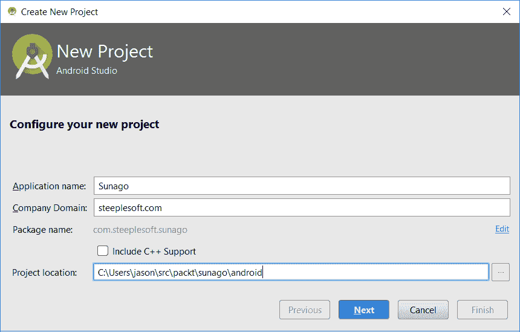
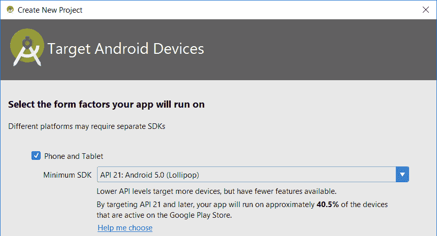
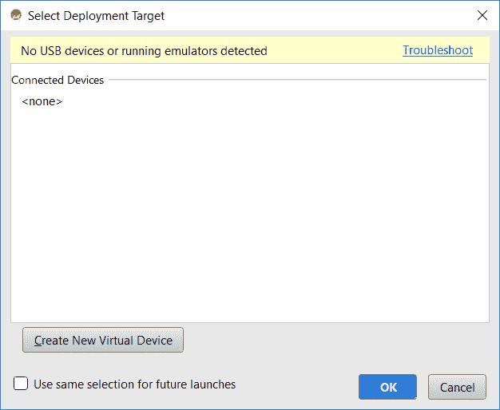
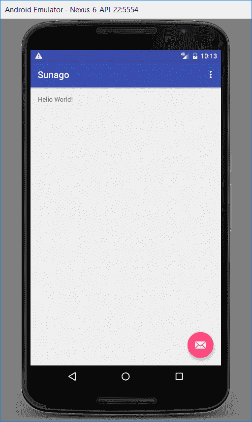

# 六、Sunago——安卓端

在最后一章中，我们构建了 Sunago，一个社交媒体聚合应用程序。在那一章中，我们了解到 Sunago 是一个基于 JavaFX 的应用程序，它可以从各种社交媒体网络获取帖子、推特、照片等，并在一个地方显示它们。该应用程序当然提供了许多有趣的架构和技术示例，但该应用程序本身可能更实用——我们倾向于通过手机和平板电脑等移动设备与社交网络进行交互，因此移动版本会更有用。在本章中，我们将编写一个 Android 端口，尽可能重用代码。

Android 应用程序虽然内置于 Java，但看起来与桌面应用程序有很大不同。虽然我们不能涵盖 Android 开发的各个方面，但在本章中我们将为您提供足够的内容，包括以下内容：

*   设置 Android 开发环境
*   格拉德尔建造
*   Android 视图
*   安卓状态管理
*   安卓服务
*   应用程序打包和部署

与其他章节一样，小项目太多，无法一一列举，但我们将尽最大努力在介绍新项目时强调它们。

# 开始

第一步是建立 Android 开发环境。与*常规的*Java 开发一样，IDE 并不是绝对必要的，但确实有帮助，因此我们将安装 Android Studio，这是一个基于 IntelliJ IDEA 的 IDE。如果你已经安装了 IDEA，你只需安装 Android 插件，就可以拥有你所需要的一切。不过，出于我们的目的，我们假设您没有安装任何一个。

1.  要下载 Android Studio，请访问[https://developer.android.com/studio/index.html](https://developer.android.com/studio/index.html) ，下载适合您操作系统的软件包。当您第一次启动 Android Studio 时，您将看到以下屏幕：


2.  在我们开始一个新项目之前，让我们先配置可用的 Android SDK。单击右下角的配置菜单，然后单击 SDK 管理器以获得此屏幕：


您选择的 SDK 将根据您的需要而有所不同。你可能需要支持旧设备，比如说安卓 5.0，或者你只想支持安卓 7.0 或 7.1.1 的最新版本。

3.  一旦您知道需要什么，选择合适的 SDK（或者像我在前面的屏幕截图中所做的那样，选择 5.0 和更高版本中的所有内容），然后单击 OK。继续之前，您需要阅读并接受许可证。
4.  完成后，Android Studio 将开始下载选定的 SDK 和任何依赖项。这个过程可能需要一段时间，所以要有耐心。
5.  SDK 安装完成后，单击 Finish 按钮，将进入欢迎屏幕。单击开始一个新的 Android Studio 项目以获得以下屏幕：



6.  这里没有什么令人兴奋的内容--我们需要指定应用程序名称、公司域和应用程序的项目位置：



7.  不过，接下来，我们需要为我们的应用程序指定形状因子。我们的选择包括手机和平板电脑、Wear、电视、Android Auto 和 Glass。正如前面的屏幕截图所示，我们对这个应用程序感兴趣的只是手机和平板电脑。
8.  在下一个窗口中，我们需要为应用程序的主`Activity`选择一个类型。在 Android 应用程序中，我们可能称之为*屏幕*（或者*页面*，如果您来自 web 应用程序背景）的内容称为`Activity`。不过，并非所有的`Activity`都是屏幕。

来自 Android 开发者文档（[https://developer.android.com/reference/android/app/Activity.html](https://developer.android.com/reference/android/app/Activity.html) ，我们了解到：

[a] n 活动是用户可以做的一件专注的事情。几乎所有的活动都与用户交互，因此 Activity 类负责为您创建一个窗口。。。

出于我们的目的，将两者等同起来可能是可以接受的，但这样做不严格，并且始终牢记这一警告。向导为我们提供了许多选项，如此屏幕截图所示：


9.  如您所见，有几个选项：基本、空、全屏、Google AdMobs 广告、Google 地图、登录等等。选择哪一个同样取决于您对应用程序的需求。就用户界面而言，我们的最低要求是，它告诉用户应用程序的名称，显示社交媒体项目的列表，并提供更改应用程序设置的菜单。从前面的列表中，基本活动是最接近的匹配项，因此我们选择它，然后单击下一步：


10.  前面屏幕中的默认值基本上是可以接受的（请注意，活动名称已更改），但在单击 Finish 之前，最后还有几个字。在构建任意大小的 Android 应用程序时，您将拥有大量的布局、菜单、活动等。我发现命名这些工件很有帮助，正如您在这里看到的一样，`Activity`的布局命名为`activity_`加上`Activity`名称；菜单是`menu_`加上活动名称，或者，对于共享菜单，是其内容的有意义的摘要。每个工件类型都以其类型作为前缀。随着文件数量的增加，此常规模式将帮助您快速导航到源文件，因为这些文件的排列非常平淡。
11.  最后，请注意使用片段复选框。*片段是可以放置在活动*中的应用程序用户界面或行为的一部分。作为开发人员，这是一种将用户界面定义分解为多个片段（或片段，即名称）的有效方法，这些片段可以在活动中以不同的方式组合成一个整体，具体取决于应用程序的当前上下文。例如，基于片段的用户界面可能有两个屏幕用于手机上的某些操作，但可能会将这些屏幕组合成一个活动，用于平板电脑上的大屏幕。当然，这有点复杂，但我包含了简短而不完整的描述，只是为了对复选框进行一些解释。我们将不会在应用程序中使用片段，因此我们将其保留为未选中状态，然后单击 Finish。

经过一段时间的处理，Android Studio 现在为我们创建了一个基本的应用程序。在开始编写应用程序之前，让我们先运行它，看看这个过程是什么样子。我们可以通过几种方式运行应用程序——我们可以点击 run | run'app'；单击工具栏中间的“绿色播放”按钮，或按 Enter T0.移位 To1 T1HE+ORDT2。这三个选项都将显示相同的“选择部署目标”窗口，如下所示：



因为我们刚刚安装了 Android Studio，所以我们没有创建任何模拟器，所以我们现在需要这样做。要创建模拟器，请执行以下步骤：

1.  单击“创建新虚拟设备”按钮可显示以下屏幕：


2.  让我们从一款相当现代的 Android 手机开始——选择 Nexus 6 配置文件，然后单击下一步：


在前面的屏幕中，您的选项将根据您安装的 SDK 而有所不同。同样，您选择哪个 SDK 取决于您的目标受众、应用程序需求等。尽管使用最新和最好的 API 总是令人愉快的，但我们并不严格地需要任何来自（比如）牛轧糖的 API。选择安卓 7.x 将限制 Sunago 只在非常新的手机上使用，而且这样做没有充分的理由。然后，我们将以棒棒糖（Android 5.0）为目标，它在支持尽可能多的用户和提供对 Android 新功能的访问之间取得了良好的平衡。

3.  如果需要 x86_64 ABI，请单击下载链接，选择该版本，单击下一步，然后在验证配置屏幕上单击完成。

4.  创建了仿真器后，我们现在可以在选择部署目标屏幕中选择它，并通过单击 OK 运行应用程序。如果您想在下次运行应用程序时跳过选择屏幕，可以在单击“确定”之前选中“为将来的启动使用相同的选择”复选框。

第一次运行应用程序时，将花费更长的时间，因为应用程序已构建和打包，并且模拟器已启动。几分钟后，您将看到以下屏幕：



这没什么特别的，但它表明一切都按预期进行。现在，我们已经准备好开始移植 Sunago 的真正工作。

# 构建用户界面

简而言之，Android 用户界面基于活动，使用布局文件来描述用户界面的结构。当然，还有更多的内容，但是这个简单的定义对于我们在 Sunago 上的工作应该足够了。那么，让我们从我们的`Activity`、`MainActivity`开始，如下所示：

```java
    public class MainActivity extends AppCompatActivity { 
      @Override 
      protected void onCreate(Bundle savedInstanceState) { 
        super.onCreate(savedInstanceState); 
        setContentView(R.layout.activity_main); 
        Toolbar toolbar = (Toolbar) findViewById(R.id.toolbar); 
        setSupportActionBar(toolbar); 

        FloatingActionButton fab =
            (FloatingActionButton) findViewById(R.id.fab); 
        fab.setOnClickListener(new View.OnClickListener() { 
            @Override 
            public void onClick(View view) { 
                Snackbar.make(view,
                        "Replace with your own action",
                        Snackbar.LENGTH_LONG) 
                    .setAction("Action", null).show(); 
            } 
        }); 
      } 

     @Override 
     public boolean onCreateOptionsMenu(Menu menu) { 
        getMenuInflater().inflate(R.menu.menu_main, menu); 
        return true; 
     } 

     @Override 
     public boolean onOptionsItemSelected(MenuItem item) { 
        int id = item.getItemId(); 

        if (id == R.id.action_settings) { 
            return true; 
        } 

        return super.onOptionsItemSelected(item); 
      } 
    } 

```

最后一段代码是由 Android Studio 生成的类。这是非常基本的，但它拥有创建`Activity`所需的大部分内容。请注意，该类扩展了`AppCompatActivity`。虽然谷歌一直在积极推动 Android 平台的发展，但他们也不遗余力地确保旧设备不会比必须的更早被淘汰。为了实现这一点，谷歌在“compat”（或兼容性）软件包中引入了许多新功能，这意味着许多较新的 API 实际上将在旧版本的 Android 上运行。不过，由于这些更改位于单独的包中，因此不会破坏任何现有功能——必须明确选择它们，这就是我们在这里所做的。虽然我们不打算支持旧版本的 Android，比如 KitKat，但仍然有人建议您的`Activity`类扩展兼容性类，比如这一类，因为这些类内置了大量功能，否则我们必须自己实现。让我们走遍本课程，了解以下步骤中发生的一切：

1.  第一种方法是`onCreate()`，这是一种`Activity`生命周期方法（稍后我们将进一步讨论活动生命周期）。当系统创建`Activity`类时，调用此方法。在这里，我们初始化用户界面、设置值、连接到数据源的控件等等。请注意，该方法采用**捆绑**。这就是 Android 在活动状态下的传递方式，以便可以恢复它。

在`setContentView(R.layout.activity_main)`方法中，我们告诉系统我们想要为`Activity`使用什么布局。一旦我们为`Activity`设置了内容`View`，我们就可以开始获取对各种元素的引用。请注意，我们首先查找视图中定义的`Toolbar``findViewById(R.id.toolbar)`，然后告诉 Android 通过`setSupportActionBar()`将其用作我们的操作栏。这是一个通过`compat`类为我们实现的功能示例。如果我们直接扩展，比如说，`Activity`，我们将需要做更多的工作来让动作条工作。事实上，我们叫了一个二传手，我们就完蛋了。

2.  接下来，我们查找另一个用户界面元素，`FloatingActionButton`。在前面的屏幕截图中，这是右下角带有电子邮件图标的按钮。我们实际上会删除它，但是，由于 Android Studio 生成了它，我们可以在删除它之前从中了解到什么。一旦我们有了对它的引用，我们就可以附加侦听器。在本例中，我们通过创建一个类型为`View.OnClickListener`的匿名内部类来添加一个`on Click`侦听器。这是可行的，但我们刚刚花了最后五章来解决这些问题。

3.  Android build 系统现在本机支持使用 Java 8，因此我们可以修改`onClick`侦听器注册，如下所示：

```java
    fab.setOnClickListener(view -> Snackbar.make(view,
        "Replace with your own action",
            Snackbar.LENGTH_LONG) 
        .setAction("Action", null).show()); 

```

当用户点击按钮时，Snackbar 出现。根据谷歌文档，*snackbar 通过屏幕*底部的一条消息提供有关操作的简短反馈。这正是我们得到的信息——一条信息告诉我们用我们自己的行动来取代`onClick`结果。但是，正如前面所述，我们不需要浮动按钮，因此我们将从布局中删除此方法和视图定义。

4.  类中的下一个方法是`onCreateOptionsMenu()`。当首次打开选项菜单以填充项目列表时，将调用此方法。我们使用`MenuInflater`对菜单定义文件进行充气，并将其定义的内容添加到系统传入的`Menu`中。不过，此方法只调用一次，因此如果需要更改菜单，则应覆盖`onPrepareOptionsMenu(Menu)`。
5.  当用户点击选项菜单项时，调用最后一个方法`onOptionsItemSelected()`。已传入所选的特定`MenuItem`。我们获取它的 ID，并调用适合该菜单项的方法。

这是一个基本的`Activity`，但布局是什么样的呢？以下是`activity_main.xml`的内容：

```java
    <?xml version="1.0" encoding="utf-8"?> 
     <android.support.design.widget.CoordinatorLayout  
      xmlns:android="http://schemas.android.com/apk/res/android" 
      xmlns:app="http://schemas.android.com/apk/res-auto" 
      xmlns:tools="http://schemas.android.com/tools" 
      android:layout_width="match_parent" 
      android:layout_height="match_parent" 
      android:fitsSystemWindows="true" 
      tools:context="com.steeplesoft.sunago.MainActivity"> 

      <android.support.design.widget.AppBarLayout 
        android:layout_width="match_parent" 
        android:layout_height="wrap_content" 
        android:theme="@style/AppTheme.AppBarOverlay"> 

       <android.support.v7.widget.Toolbar 
            android:id="@+id/toolbar" 
            android:layout_width="match_parent" 
            android:layout_height="?attr/actionBarSize" 
            android:background="?attr/colorPrimary" 
            app:popupTheme="@style/AppTheme.PopupOverlay" /> 

      </android.support.design.widget.AppBarLayout> 

      <include layout="@layout/content_main" /> 

     <android.support.design.widget.FloatingActionButton 
        android:id="@+id/fab" 
        android:layout_width="wrap_content" 
        android:layout_height="wrap_content" 
        android:layout_gravity="bottom|end" 
        android:layout_margin="@dimen/fab_margin" 
        app:srcCompat="@android:drawable/ic_dialog_email" /> 

     </android.support.design.widget.CoordinatorLayout> 

```

这是一个相当多的 XML，所以让我们快速浏览一下主要感兴趣的项目，如下所示：

1.  根元素是`CoordinatorLayout`。其 Java 文档将其描述为超级动力`FrameLayout`。它的一个预期用途是*作为顶级应用程序装饰或 chrome 布局*，这正是我们在这里使用它的目的。像`CoordinatorLayout`这样的布局大致类似于 JavaFX 的容器。不同的布局（或`ViewGroup`）提供了多种功能，例如使用精确的 X/Y 坐标（`AbsoluteLayout`）、网格（`GridLayout`）和相对（`RelativeLayout`等布局元素。
2.  除了提供顶级容器外，元素还定义了许多必需的 XML 名称空间。它还设置控件的高度和宽度。此字段有三个可能的值--`match_parent`（在 SDK 的早期版本中，如果您遇到此字段，则称为`fill_parent`），这意味着控件应与其父控件`wrap_content`的值匹配，这意味着控件应刚好足够容纳其内容；或者确切的数字。

3.  下一个元素是`AppBarLayout`，它是一个`ViewGroup`，实现了许多材料设计应用程序栏的概念。**材质设计**是谷歌正在开发和支持的最新**视觉语言**。它在 Android 应用程序中提供了现代、一致的外观和感觉。它的使用受到谷歌的鼓励，幸运的是，新的`Activity`向导让我们可以开箱即用。版面的宽度设置为`match_parent`以填充屏幕，宽度设置为`wrap_content`以显示其内容，即单个`Toolbar`。

4.  暂时跳过`include`元素，视图中的最后一个元素是`FloatingActionButton`。我们在这里唯一感兴趣的是，如果在其他项目中需要一个小部件，那么这个小部件是存在的。正如我们在`Activity`类中所做的那样，我们需要删除这个小部件。
5.  最后，还有`include`元素。这就是您认为它应该做的——指定的文件包含在布局定义中，就好像它的内容硬编码到文件中一样。这使我们能够保持布局文件的小型化，重用用户界面元素定义（这对于复杂场景尤其有用），等等。

包含的文件`content_main.xml`如下所示：

```java
        <RelativeLayout
          xmlns:android="http://schemas.android.com/apk/res/android" 
          xmlns:app="http://schemas.android.com/apk/res-auto" 
          xmlns:tools="http://schemas.android.com/tools" 
          android:id="@+id/content_main" 
          android:layout_width="match_parent" 
          android:layout_height="match_parent" 
          android:paddingBottom="@dimen/activity_vertical_margin" 
          android:paddingLeft="@dimen/activity_horizontal_margin" 
          android:paddingRight="@dimen/activity_horizontal_margin" 
          android:paddingTop="@dimen/activity_vertical_margin" 
          app:layout_behavior="@string/appbar_scrolling_view_behavior" 
          tools:context="com.steeplesoft.sunago.MainActivity" 
          tools:showIn="@layout/activity_main"> 

         <TextView 
            android:layout_width="wrap_content" 
            android:layout_height="wrap_content" 
            android:text="Hello World!" /> 
        </RelativeLayout> 

```

前面的视图使用`RelativeLayout`来包装其唯一的子视图`TextView`。请注意，我们可以设置控件的填充。这控制了*在*控件内及其子控件周围的空间大小。把它想象成包装一个盒子——在盒子里，你可能有一个易碎的陶瓷古董，所以你要用衬垫来保护它。您还可以设置控件的边距，即控件外部的空间*，类似于我们经常喜欢的个人空间。*

但是，`TextView`没有帮助，所以我们将删除它，并添加我们真正需要的，即`ListView`，如下所示：

```java
    <ListView 
      android:id="@+id/listView" 
      android:layout_width="match_parent" 
      android:layout_height="match_parent" 
      android:layout_alignParentTop="true" 
      android:layout_alignParentStart="true"/> 

```

`ListView`是在垂直滚动列表中显示项目的控件。就用户体验而言，这与我们在 JavaFX 中看到的`ListView`非常相似。然而，它的工作原理却大不相同。为了了解如何进行，我们需要对 activity 的`onCreate()`方法进行如下调整：

```java
    protected void onCreate(Bundle savedInstanceState) { 
       super.onCreate(savedInstanceState); 
       setContentView(R.layout.activity_main); 

      if (!isNetworkAvailable()) { 
         showErrorDialog( 
            "A valid internet connection can't be established"); 
      } else { 
        Toolbar toolbar = (Toolbar) findViewById(R.id.toolbar); 
        setSupportActionBar(toolbar); 
        findPlugins(); 

        adapter = new SunagoCursorAdapter(this, null, 0); 
        final ListView listView = (ListView)
            findViewById(R.id.listView); 
        listView.setAdapter(adapter); 
        listView.setOnItemClickListener( 
                new AdapterView.OnItemClickListener() { 
            @Override 
            public void onItemClick(AdapterView<?> adapterView,
                    View view, int position, long id) { 
                Cursor c = (Cursor)
                    adapterView.getItemAtPosition(position); 
                String url = c.getString(c.getColumnIndex( 
                    SunagoContentProvider.URL)); 
                Intent intent = new Intent(Intent.ACTION_VIEW,
                    Uri.parse(url)); 
                startActivity(intent); 
            } 
         }); 

         getLoaderManager().initLoader(0, null, this); 
       } 
    } 

```

这里发生了几件事，这为我们讨论 Android 中的数据访问打下了良好的基础。不过，在我们详细讨论之前，先简要介绍一下：

1.  我们通过`isNetworkAvailable()`检查以确保设备具有正常的网络连接，我们将在本章后面介绍。
2.  如果连接可用，我们将从设置工具栏开始配置用户界面。
3.  接下来，我们创建一个`SunagoCursorAdapter`实例，稍后我们将详细讨论。不过，现在请注意，`Adapter`是`ListView`与数据源的连接方式，它们可以由 SQL 数据源或`Array`等多种数据源支持。
4.  我们将适配器传递给`ListView`，从而通过`ListView.setAdapter()`完成此连接。与 JavaFX 的`Observable`模型属性非常相似，我们可以使用它来更新用户界面，而无需在数据更改时进行直接交互。
5.  接下来，我们为列表中的项目设置一个`onClick`侦听器。我们将使用它在外部浏览器中显示用户点击（或单击）的项目。简而言之，给定`position`参数，我们在该位置获取项目`Cursor`，提取项目的 URL，然后使用设备的默认浏览器通过`Intent`显示该 URL 处的页面（我们将在后面详细讨论）。
6.  最后，完成数据绑定后，我们初始化将以异步方式处理加载和更新`Adapter`的`LoaderManager`。

在进入数据访问之前，要查看的最后一段代码--`isNetworkAvailable()`--如下所示：

```java
        public boolean isNetworkAvailable() { 
          boolean connected = false; 
          ConnectivityManager cm = (ConnectivityManager)  
            getSystemService(Context.CONNECTIVITY_SERVICE); 
          for (Network network : cm.getAllNetworks()) { 
            NetworkInfo networkInfo = cm.getNetworkInfo(network); 
            if (networkInfo.isConnected() == true) { 
                connected = true; 
                break; 
            } 
          } 
         return connected; 
        } 

        private void showErrorDialog(String message) { 
          AlertDialog alertDialog = new AlertDialog.Builder(this) 
            .create(); 
          alertDialog.setTitle("Error!"); 
          alertDialog.setMessage(message); 
          alertDialog.setIcon(android.R.drawable.alert_dark_frame); 
          alertDialog.setButton(DialogInterface.BUTTON_POSITIVE,
          "OK", new DialogInterface.OnClickListener() { 
            @Override 
            public void onClick(DialogInterface dialog, int which) { 
              MainActivity.this.finish(); 
            } 
          }); 

          alertDialog.show(); 
       } 

```

在前面的代码中，我们首先获取对系统服务的引用`ConnectivityManager`，然后循环遍历系统已知的每个`Network`。对于每个`Network`，我们都会得到一个对其`NetworkInfo`的引用，并调用`isConnected()`。如果我们找到一个连接的网络，我们返回 true，否则返回 false。在调用代码中，如果我们的返回值为`false`，我们将显示一个错误对话框，这里也显示了该对话框的方法。这是一个标准的 Android 对话框。然而，我们已经在 OK 按钮中添加了一个`onClick`侦听器，它将关闭应用程序。使用此功能，我们告诉用户需要网络连接，然后在用户点击 OK 时关闭应用程序。当然，如果这种行为是可取的，这是有争议的，但是确定设备网络状态的过程非常有趣，所以我在这里包括了它。

现在让我们来关注安卓应用程序中的数据访问方式--`CursorAdapters`。

# 安卓数据访问

对于任何平台，都有多种访问数据的方法，从内置设施到自行开发的 API。Android 也不例外，因此，尽管您可以编写自己的方式从任意数据源加载数据，除非您有非常特殊的要求，但通常没有必要，因为 Android 内置了一个系统--`ContentProvider`。

Android 文档将告诉您，*内容提供商管理对中央数据存储库*的访问，并为数据提供一致的*标准接口，该接口还处理进程间通信和安全数据访问*。如果您打算将应用程序的数据公开给外部源（读或写），`ContentProvider`是一个很好的方法。但是，如果您不打算公开数据，则非常欢迎您自己编写所需的 CRUD 方法，手动发出各种 SQL 语句。在我们的例子中，我们将使用`ContentProvider`，因为我们有兴趣允许第三方开发人员访问数据。

要创建一个`ContentProvider`，我们需要创建一个扩展`ContentProvider`的新类，如下所示：

```java
    public class SunagoContentProvider extends ContentProvider { 

```

我们还需要在`AndroidManfest.xml`中注册提供商，我们将这样做：

```java
    <provider android:name=".data.SunagoContentProvider 
      android:authorities="com.steeplesoft.sunago.SunagoProvider" /> 

```

与`ContentProvider`的交互从未直接完成。客户端代码将指定要处理的数据的 URL，Android 系统将请求定向到适当的提供者。为了确保我们的`ContentProvider`功能符合预期，我们需要注册提供者的权限，我们已经在前面的 XML 中看到了这一点。在我们的提供者中，我们将创建一些静态字段，以帮助我们以一种干燥的方式管理部分权限和相关 URL。

```java
    private static final String PROVIDER_NAME =  
     "com.steeplesoft.sunago.SunagoProvider"; 
    private static final String CONTENT_URL =  
     "content://" + PROVIDER_NAME + "/items"; 
    public static final Uri CONTENT_URI = Uri.parse(CONTENT_URL); 

```

代码前一位中的前两个字段是私有的，因为类外不需要它们。不过，为了清晰起见，我们在这里将它们定义为单独的字段。第三个字段`CONTENT_URI`是公共字段，因为我们将在应用程序的其他地方引用该字段。显然，第三方消费者将无法访问该领域，但需要知道其价值，`content://com.steeplesoft.sunago.SunagoProvider/items`，我们将在某个地方为附加开发人员记录该价值。URL 的第一部分，协议字段，告诉 Android 我们正在寻找一个`ContentProvider`。下一部分是权限，它唯一地标识一个特定的`ContentProvider`，最后一个字段指定我们感兴趣的数据类型或模型。对于 Sunago，我们有一个单一的数据类型，`items`。

接下来，我们需要指定要支持的 URI。我们只有两个--一个用于 items 集合，另一个用于特定的 item。请参阅以下代码段：

```java
    private static final UriMatcher URI_MATCHER =  
      new UriMatcher(UriMatcher.NO_MATCH); 
    private static final int ITEM = 1; 
    private static final int ITEM_ID = 2; 
    static { 
      URI_MATCHER.addURI(PROVIDER_NAME, "items", ITEM); 
      URI_MATCHER.addURI(PROVIDER_NAME, "items/#", ITEM_ID); 
     } 

```

在最后一段代码中，我们首先创建一个`UriMatcher`。注意，我们将`UriMatcher.NO_MATCH`传递给构造函数。目前还不清楚该值的用途，但如果用户传入的 URI 与注册的 URI 不匹配，则将返回该值。最后，我们用唯一的`int`标识符注册每个 URI。

接下来，像许多 Android 类一样，我们需要指定一个`onCreate`生命周期挂钩，如下所示：

```java
    public boolean onCreate() { 
      openHelper = new SunagoOpenHelper(getContext(), DBNAME,  
        null, 1); 
      return true; 
    } 

```

`SunagoOpenHelper`是`SQLiteOpenHelper`的子项，负责管理基础 SQLite 数据库的创建和/或更新。该类本身非常简单，如下所示：

```java
    public class SunagoOpenHelper extends SQLiteOpenHelper { 
      public SunagoOpenHelper(Context context, String name,  
            SQLiteDatabase.CursorFactory factory, int version) { 
          super(context, name, factory, version); 
      } 

      @Override 
      public void onCreate(SQLiteDatabase db) { 
        db.execSQL(SQL_CREATE_MAIN); 
      } 

      @Override 
      public void onUpgrade(SQLiteDatabase db, int oldVersion,  
        int newVersion) { 
      } 
    } 

```

我没有展示表创建 DDL，因为它是一个非常简单的表创建，但是创建和维护数据库只需要这个类。如果您有多个表，您将在`onCreate`中发出多个 creates。当应用程序更新时，会调用`onUpgrade()`以允许您在需要时修改模式。

回到我们的`ContentProvider`中，我们需要实现两种方法，一种是读取数据，另一种是插入（鉴于应用程序的性质，我们现在对删除或更新不感兴趣）。对于读取数据，我们覆盖`query()`如下：

```java
    public Cursor query(Uri uri, String[] projection,  
      String selection, String[] selectionArgs,  
      String sortOrder) { 
        switch (URI_MATCHER.match(uri)) { 
          case 2: 
            selection = selection + "_ID = " +  
              uri.getLastPathSegment(); 
              break; 
        } 
        SQLiteDatabase db = openHelper.getReadableDatabase(); 
        Cursor cursor = db.query("items", projection, selection,  
          selectionArgs, null, null, sortOrder); 
        cursor.setNotificationUri( 
          getContext().getContentResolver(), uri); 
        return cursor; 
    } 

```

最后一段代码就是我们的 URI 和它们的`int`标识符的来源。使用`UriMatcher`检查调用方传入的`Uri`。考虑到我们的提供者很简单，我们只需要为`#2`做一些特殊的事情，这是对特定项目的查询。在这种情况下，我们提取作为最后一个路径段传入的 ID，并将其添加到调用方指定的选择条件中。

一旦我们按照请求配置了查询，我们就会从我们的`openHelper`中获得一个可读的`SQLiteDatabase`，并使用调用者传递的值进行查询。这是`ContentProvider`合同方便使用的领域之一——我们不需要手动编写任何`SELECT`语句。

在返回光标之前，我们需要对其执行以下操作：

```java
    cursor.setNotificationUri(getContext().getContentResolver(), uri); 

```

在前面的调用中，我们告诉系统我们希望在数据更新时通知游标。由于我们使用的是`Loader`，这将允许我们在插入数据时自动更新用户界面。

对于插入数据，我们覆盖`insert()`如下：

```java
    public Uri insert(Uri uri, ContentValues values) { 
      SQLiteDatabase db = openHelper.getWritableDatabase(); 
      long rowID = db.insert("items", "", values); 

      if (rowID > 0) { 
        Uri newUri = ContentUris.withAppendedId(CONTENT_URI,  
            rowID); 
        getContext().getContentResolver().notifyChange(newUri,  
            null); 
        return newUri; 
      } 

    throw new SQLException("Failed to add a record into " + uri); 
    } 

```

使用`openHelper`，这一次，我们得到了数据库的一个可写实例，我们将其称为`insert()`。insert 方法返回刚刚插入的行的 ID。如果我们得到一个非零的 ID，我们将为该行生成一个 URI，并最终返回。但是，在执行此操作之前，我们会将数据中的更改通知内容解析器，从而触发用户界面中的自动重新加载。

不过，我们还有一个步骤来完成数据加载代码。如果你回顾`MainActivity.onCreate()`，你会看到这一行：

```java
    getLoaderManager().initLoader(0, null, this); 

```

最后一行告诉系统我们要初始化一个`Loader`，并且`Loader`是`this`或`MainActivity`。在我们对`MainActivity`的定义中，我们指定它实现`LoaderManager.LoaderCallbacks<Cursor>`接口。这就要求我们实施以下几种方法：

```java
    public Loader<Cursor> onCreateLoader(int i, Bundle bundle) { 
      CursorLoader cl = new CursorLoader(this,  
        SunagoContentProvider.CONTENT_URI,  
        ITEM_PROJECTION, null, null, 
           SunagoContentProvider.TIMESTAMP + " DESC"); 
      return cl; 
    } 

    public void onLoadFinished(Loader<Cursor> loader, Cursor cursor) { 
      adapter.swapCursor(cursor); 
    } 

    public void onLoaderReset(Loader<Cursor> loader) { 
      adapter.swapCursor(null); 
    } 

```

在`onCreateLoader()`中，我们指定了加载内容和加载位置。我们传入刚刚创建的`ContentProvider`的 URI，通过`ITEM_PROJECTION`变量指定我们感兴趣的字段（这是一个`String[]`，此处未显示），最后是排序顺序（我们已按降序指定为项目的时间戳，以便我们在顶部获得最新的项目）。方法`onLoadFinished()`是自动重新加载的地方。一旦为更新后的数据创建了一个新的`Cursor`，我们将其替换为`Adapter`当前使用的`Cursor`。虽然您可以编写自己的持久性代码，但这突出了为什么尽可能使用平台设施是明智的选择。

关于数据处理，还有一个大项目需要考虑--`SunagoCursorAdapter`。再看看 Android Javadocs，我们了解到*一个*`Adapter`*对象充当*`AdapterView`*和该视图*的底层数据之间的桥梁，`CursorAdapter`*将*`Cursor`小部件*中的数据公开给***。通常——如果不是在大多数情况下——一个特定的`ListView`将需要一个自定义`CursorAdapter`以允许正确呈现底层数据。Sunago 也不例外。为了创建我们的`Adapter`，我们创建了一个新类，如下所示：**

 *```java
    public class SunagoCursorAdapter extends CursorAdapter { 
      public SunagoCursorAdapter(Context context, Cursor c,  
      int flags) { 
        super(context, c, flags); 
    } 

```

这是相当标准的票价。真正有趣的部分来自视图创建，这是成为`CursorAdapter`的原因之一。当`Adapter`需要创建一个新视图来保存光标指向的数据时，它调用以下方法。在这里，我们通过调用`LayoutInflater.inflate()`指定视图的外观：

```java
    public View newView(Context context, Cursor cursor,  
        ViewGroup viewGroup) { 
          View view = LayoutInflater.from(context).inflate( 
          R.layout.social_media_item, viewGroup, false); 
          ViewHolder viewHolder = new ViewHolder(); 
          viewHolder.text = (TextView)
          view.findViewById(R.id.textView); 
          viewHolder.image = (ImageView) view.findViewById( 
          R.id.imageView); 

          WindowManager wm = (WindowManager) Sunago.getAppContext() 
            .getSystemService(Context.WINDOW_SERVICE); 
          Point size = new Point(); 
          wm.getDefaultDisplay().getSize(size); 
          viewHolder.image.getLayoutParams().width =  
            (int) Math.round(size.x * 0.33); 

          view.setTag(viewHolder); 
          return view; 
     } 

```

我们将在一瞬间查看我们的布局定义，但是首先，让我们看一看 OrthT0:

```java
    private static class ViewHolder { 
      public TextView text; 
      public ImageView image; 
   } 

```

通过 ID 查找视图可能是一项昂贵的操作，因此一种非常常见的模式是这种`ViewHolder`方法。视图膨胀后，我们立即查找感兴趣的字段，并将这些引用存储在`ViewHolder`实例中，然后将其存储为`View`上的标记。由于视图是由`ListView`类循环使用的（也就是说，当您在数据中滚动时，它们会根据需要重新使用），因此这个昂贵的`findViewById()`被调用一次，并按`View`进行缓存，而不是按基础数据中的每个项进行缓存。对于大型数据集（和复杂视图），这将大大提高性能。

在这个方法中，我们还设置了`ImageView`类的大小。Android 不支持通过 XML 标记（下一步给出）将视图的宽度设置为百分比，因此我们在这里创建`View`时手动进行设置。我们得到`WindowManager`系统服务，从中我们得到默认显示的大小。我们将显示器的宽度乘以 0.33，这将限制图像（如果有）为显示器宽度的 1/3，并将`ImageView`的宽度设置为该值。

那么，每一行的视图是什么样的呢？

```java
    <LinearLayout  
      xmlns:android="http://schemas.android.com/apk/res/android" 
      xmlns:app="http://schemas.android.com/apk/res-auto" 
      xmlns:tools="http://schemas.android.com/tools" 
      android:layout_width="match_parent" 
      android:layout_height="match_parent" 
      android:orientation="horizontal"> 

      <ImageView 
        android:id="@+id/imageView" 
        android:layout_width="wrap_content" 
        android:layout_height="wrap_content" 
        android:layout_marginEnd="5dip" 
        android:layout_gravity="top" 
        android:adjustViewBounds="true"/> 

      <TextView 
        android:layout_width="match_parent" 
        android:layout_height="wrap_content" 
        android:id="@+id/textView" 
        android:scrollHorizontally="false" 
        android:textSize="18sp" /> 
     </LinearLayout> 

```

正如`ViewHolder`所暗示的，我们的视图由一个`ImageView`和一个`TextView`组成，水平呈现，这要归功于所附的`LinearLayout`。

当`CursorAdapter`调用`newView()`创建`View`时，它调用`bindView()`将`View`绑定到`Cursor`中的特定行。这就是`View`循环利用发挥作用的地方。`Adapter`缓存了大量`View`实例，并根据需要将一个实例传递给此方法。我们的方法如下所示：

```java
    public void bindView(View view, Context context, Cursor cursor) { 
      final ViewHolder viewHolder = (ViewHolder) view.getTag(); 
      String image = cursor.getString(INDEX_IMAGE); 
      if (image != null) { 
        new DownloadImageTask(viewHolder.image).execute(image); 
      } else { 
        viewHolder.image.setImageBitmap(null); 
        viewHolder.image.setVisibility(View.GONE); 
      } 
      viewHolder.body.setText(cursor.getString(INDEX_BODY)); 
    } 

```

我们从获取`ViewHolder`实例开始。如前所述，我们将使用存储在这里的小部件引用来更新用户界面。接下来，我们从光标中提取图像 URL。由每个`SocialMediaItem`决定如何填充此字段，但它可能是一张推特图像或 Instagram 帖子中的照片。如果该项目有一个，我们需要下载它，以便它可以显示。因为这需要一个网络操作，并且我们在用户界面线程上运行，所以我们将工作交给`DownloadImageTask`。如果此项目没有图像，我们需要将图像的位图设置为`null`（否则，上次使用此视图实例时的图像将再次显示）。这会释放一些内存，这总是很好的，但是我们还将`ImageView`类的可见性设置为`GONE`，这会在用户界面中隐藏它。您可能会尝试使用`INVISIBLE`，但这只会使其不可见**，同时保留其在用户界面**中的空间。最终结果将是一个大的空白方块，这不是我们想要的。最后，我们将`TextView`主体的文本设置为为为该项指定的文本。

图像下载通过`AsyncTask`线程外处理，如下所示：

```java
    private static class DownloadImageTask extends  
       AsyncTask<String, Void, Bitmap> { 
        private ImageView imageView; 

        public DownloadImageTask(ImageView imageView) { 
         this.imageView = imageView; 
        } 

```

Android 将创建一个后台`Thread`来运行此任务。我们的逻辑的主要入口点是`doInBackground()`。请参阅以下代码段：

```java
    protected Bitmap doInBackground(String... urls) { 
      Bitmap image = null; 
      try (InputStream in = new URL(urls[0]).openStream()) { 
        image = BitmapFactory.decodeStream(in); 
      } catch (java.io.IOException e) { 
         Log.e("Error", e.getMessage()); 
         } 
        return image; 
    } 

```

这不是可以想象的最健壮的下载代码（例如，重定向状态代码被愉快地忽略），但它确实是可用的。使用 Java7 的`try-with-resources`，我们创建了一个`URL`实例，我们在该实例上调用`openStream()`。假设在这两个操作中都没有抛出`Exception`，我们调用`BitmapFactory.decodeStream()`将传入的字节转换为`Bitmap`，这是该方法预期返回的结果。

那么，一旦我们归还`Bitmap`会发生什么？我们在`onPostExecute()`中这样处理：

```java
    protected void onPostExecute(Bitmap result) { 
      imageView.setImageBitmap(result); 
      imageView.setVisibility(View.VISIBLE); 
      imageView.getParent().requestLayout(); 
    } 

```

在最后一种方法中，我们使用现在下载的`Bitmap`更新`ImageView`，使其成为`VISIBLE`，然后请求视图在屏幕上自我更新。

到目前为止，我们已经构建了一个能够显示`SocialMediaItem`实例的应用程序，但是我们没有任何东西可以显示。我们现在将通过 Android 服务来解决这个问题。

# 安卓服务

对于 Sunago 的桌面版本，我们定义了一个 API，允许第三方开发人员（或我们自己）向 Sunago 添加对任意社交网络的支持。这对于台式机来说是一个伟大的目标，对于移动设备来说也是一个伟大的目标。幸运的是，Android 为我们提供了一种机制，可以用来实现这一点：服务。*服务是一种应用程序组件，表示应用程序希望在不与用户交互的情况下执行更长时间的运行操作，或为其他应用程序提供功能以供*使用。虽然服务的设计不仅仅是为了可扩展性，但我们可以利用此功能达到这一目的。

虽然有许多方法可以实现服务并与之交互，但我们将把服务绑定到我们的`Activity`，这样它们的生命周期就与我们的`Activity`的生命周期相关联，我们将异步向它们发送消息。我们将从定义类开始，如下所示：

```java
    public class TwitterService extends IntentService { 
      public TwitterService() { 
        super("TwitterService"); 
      } 

     @Override 
      protected void onHandleIntent(Intent intent) { 
    } 

```

从技术上讲，这些是创建服务所需的唯一方法。显然，这没什么作用，但我们会马上解决这个问题。在此之前，我们需要向 Android 声明我们的新`Service`，它是在`AndroidManifest.xml`中完成的，如下所示：

```java
    <service android:name=".twitter.TwitterService"  
     android:exported="false"> 
      <intent-filter> 
        <action  
          android:name="com.steeplesoft.sunago.intent.plugin" /> 
        <category  
          android:name="android.intent.category.DEFAULT" /> 
       </intent-filter> 
    </service> 

```

注意，除了服务声明之外，我们还通过`intent-filter`元素指定了一个`IntentFilter`。稍后我们将在`MainActivity`中使用它来查找和绑定我们的服务。在我们研究服务的同时，让我们看看绑定过程的这一方面。我们需要实现以下两种生命周期方法：

```java
    public IBinder onBind(Intent intent) { 
      receiver = new TwitterServiceReceiver(); 
      registerReceiver(receiver,  
        new IntentFilter("sunago.service")); 
      return null; 
     } 

    public boolean onUnbind(Intent intent) { 
      unregisterReceiver(receiver); 
      return super.onUnbind(intent); 
    } 

```

当服务被绑定和解除绑定时，会调用上述方法，这给了我们注册接收者的机会，这可能会导致一个问题：那是什么？Android 提供了一个**进程间通信**（**IPC**），但由于负载大小不能超过 1MB，所以受到一定限制。尽管我们的有效负载只是文本，但我们可以（而且肯定会，根据我的测试）超过这一点。然后，我们的方法是通过接收器使用异步通信，并让服务通过我们的`ContentProvider`持久化数据。

为了创建接收器，我们将`android.content.BroadcastReceiver`扩展如下：

```java
    private class TwitterServiceReceiver extends BroadcastReceiver { 
      @Override 
      public void onReceive(Context context, Intent intent) { 
        if ("REFRESH".equals(intent.getStringExtra("message"))) { 
            if (SunagoUtil.getPreferences().getBoolean( 
                getString(R.string.twitter_authd), false)) { 
                new TwitterUpdatesAsyncTask().execute(); 
            } 
          } 
       } 
     } 

```

我们的消息方案非常简单——Sunago 发送消息`REFRESH`，服务执行其工作，我们在`TwitterUpdatesAsyncTask`中完成了这项工作。在`onBind()`中，我们使用指定我们感兴趣的`Intent`广播的特定`IntentFilter`注册接收器。在`onUnbind()`中，我们在服务发布时注销了接收者。

我们的其他服务在我们的`AsyncTask`中，如下所示：

```java
    private class TwitterUpdatesAsyncTask extends  
    AsyncTask<Void, Void, List<ContentValues>> { 
      @Override 
      protected List<ContentValues> doInBackground(Void... voids) { 
        List<ContentValues> values = new ArrayList<>(); 
        for (SocialMediaItem item :  
                TwitterClient.instance().getItems()) { 
            ContentValues cv = new ContentValues(); 
            cv.put(SunagoContentProvider.BODY, item.getBody()); 
            cv.put(SunagoContentProvider.URL, item.getUrl()); 
            cv.put(SunagoContentProvider.IMAGE, item.getImage()); 
            cv.put(SunagoContentProvider.PROVIDER,  
                item.getProvider()); 
            cv.put(SunagoContentProvider.TITLE, item.getTitle()); 
            cv.put(SunagoContentProvider.TIMESTAMP,  
                item.getTimestamp().getTime()); 
            values.add(cv); 
        } 
        return values; 
      } 

    @Override 
    protected void onPostExecute(List<ContentValues> values) { 
      Log.i(MainActivity.LOG_TAG, "Inserting " + values.size() +  
        " tweets."); 
      getContentResolver() 
        .bulkInsert(SunagoContentProvider.CONTENT_URI, 
           values.toArray(new ContentValues[0])); 
      } 
    }  

```

我们需要确保没有在用户界面线程上执行网络操作，所以我们在`AsyncTask`中执行工作。我们不需要向任务传递任何参数，因此我们将`Params`和`Progress`类型设置为`Void`。不过，我们对`Result`类型感兴趣，即`List<ContentValue>`，我们可以在`execute()`的类型声明和返回类型中看到这一点。在`onPostExecute()`中，我们随后在`ContentProvider`上发布批量插入以保存数据。这样，我们可以使新检索到的数据可供应用程序使用，而不会与`IBinder`的 1MB 限制相冲突。

定义了服务之后，我们现在需要了解如何查找和绑定服务。回顾`MainActivity`，我们最终将看到前面提到的一种方法`findPlugins()`：

```java
    private void findPlugins() { 
     Intent baseIntent = new Intent(PLUGIN_ACTION); 
     baseIntent.setFlags(Intent.FLAG_DEBUG_LOG_RESOLUTION); 
     List<ResolveInfo> list = getPackageManager() 
            .queryIntentServices(baseIntent, 
            PackageManager.GET_RESOLVED_FILTER); 
     for (ResolveInfo rinfo : list) { 
        ServiceInfo sinfo = rinfo.serviceInfo; 
        if (sinfo != null) { 
            plugins.add(new  
                ComponentName(sinfo.packageName, sinfo.name)); 
        } 
      } 
    } 

```

为了找到我们感兴趣的插件，我们创建了一个带有特定操作的`Intent`。在本例中，该操作是`com.steeplesoft.sunago.intent.plugin`，我们已经在`AndroidManifest.xml`中的服务定义中看到了。使用此`Intent`查询`PackageManager`中的所有`IntentServices`匹配意图。接下来，我们迭代`ResolveInfo`实例列表，得到`ServiceInfo`实例，并创建并存储一个代表插件的`ComponentName`。

服务的实际绑定通过以下`bindPlugins()`方法完成，我们从`onStart()`方法调用该方法，以确保绑定在活动生命周期的适当时间发生：

```java
    private void bindPluginServices() { 
      for (ComponentName plugin : plugins) { 
        Intent intent = new Intent(); 
        intent.setComponent(plugin); 
        PluginServiceConnection conn =  
            new PluginServiceConnection(); 
        pluginServiceConnections.add(conn); 
        bindService(intent, conn, Context.BIND_AUTO_CREATE); 
      } 
    } 

```

对于找到的每个插件，我们使用前面创建的`ComponentName`创建一个`Intent`。每个服务绑定都需要一个`ServiceConnection`对象。为此，我们创建了实现接口的`PluginServiceConnection`。它的方法是空的，所以我们在这里不看这个类。通过我们的`ServiceConnection`实例，我们现在可以通过调用`bindService()`来绑定服务。

最后，要在应用程序关闭时进行清理，我们需要解除服务绑定。从`onStop()`开始，我们称之为：

```java
    private void releasePluginServices() { 
      for (PluginServiceConnection conn :  
            pluginServiceConnections) { 
        unbindService(conn); 
      } 
      pluginServiceConnections.clear(); 
    } 

```

在这里，我们只需通过`ServiceConnection`插件循环，将每个插件传递给`unbindService()`，这将允许 Android 对我们可能启动的任何服务进行垃圾收集。

到目前为止，我们已经定义了一个服务，查找并绑定了它。但我们如何与之互动？我们将按照简单的路线，添加一个选项菜单项。为此，我们对`res/menu/main_menu.xml`进行如下修改：

```java
    <menu xmlns:android="http://schemas.android.com/apk/res/android" 
      xmlns:app="http://schemas.android.com/apk/res-auto" 
      xmlns:tools="http://schemas.android.com/tools"> 
      <item android:id="@+id/action_settings"  
        android:orderInCategory="100"  
        android: 
        app:showAsAction="never" /> 
     <item android:id="@+id/action_refresh"  
        android:orderInCategory="100"  
        android: 
        app:showAsAction="never" /> 
    </menu> 

```

为了响应所选择的菜单项，我们需要在此处重新访问`onOptionsItemSelected()`：

```java
    @Override 
    public boolean onOptionsItemSelected(MenuItem item) { 
      switch (item.getItemId()) { 
        case R.id.action_settings: 
            showPreferencesActivity(); 
            return true; 
        case R.id.action_refresh: 
            sendRefreshMessage(); 
            break; 
       } 

     return super.onOptionsItemSelected(item); 
    } 

```

在前面代码的`switch`块中，我们为`R.id.action_refresh`添加了一个`case`标签，该标签与我们新添加的菜单项的 ID 相匹配，我们在其中调用方法`sendRefreshMessage()`：

```java
    private void sendRefreshMessage() { 
      sendMessage("REFRESH"); 
    } 

    private void sendMessage(String message) { 
      Intent intent = new Intent("sunago.service"); 
      intent.putExtra("message", message); 
      sendBroadcast(intent); 
    } 

```

第一种方法非常简单。事实上，考虑到它的简单性，它甚至可能没有必要，但它确实为消费代码增加了语义清晰性，所以我认为这是一个很好的添加方法。

然而，有趣的是方法`sendMessage()`。我们首先创建一个`Intent`来指定我们的行为`sunago.service`。这是我们定义的任意字符串，然后为任何第三方使用者编写文档。这将帮助我们的服务过滤掉不感兴趣的消息，这正是我们在`TwitterService.onBind()`中调用`registerReceiver(receiver, new IntentFilter("sunago.service"))`时所做的。然后，我们在`Intent`上添加我们的应用程序想要发送的消息（本例中为`REFRESH`，作为额外信息，然后通过`sendBroadcast()`进行广播。从这里开始，Android 将负责将消息传递到我们的服务，该服务已经在运行（因为我们已经将其绑定到了`Activity`）并正在监听（因为我们注册了`BroadcastReceiver`）。

# Android 标签和片段

我们已经看了很多，但是还有很多我们还没有看到，比如`TwitterClient`的实现，以及关于网络集成的任何细节，比如 Instagram，我们在上一章看到过。在大多数情况下，`TwitterClient`与我们在[第 5 章](05.html)中看到的*Sunago——社交媒体聚合器*中看到的内容相同。唯一的主要区别在于流 API 的使用。一些 API 仅在某些 Android 版本中可用，特别是 24 版，也称为牛轧糖。因为我们的目标是棒棒糖（SDK 版本 21），所以我们无法使用它们。除此之外，内部逻辑和 API 用法是相同的。您可以在源存储库中查看详细信息。不过，在结束之前，我们需要看看 Twitter 首选项屏幕，因为那里有一些有趣的项目。

我们将从选项卡布局活动开始，如下所示：

```java
    public class PreferencesActivity extends AppCompatActivity { 
      private SectionsPagerAdapter sectionsPagerAdapter; 
      private ViewPager viewPager; 

      @Override 
      protected void onCreate(Bundle savedInstanceState) { 
        super.onCreate(savedInstanceState); 
        setContentView(R.layout.activity_preferences); 

        setSupportActionBar((Toolbar) findViewById(R.id.toolbar)); 
        sectionsPagerAdapter =  
        new SectionsPagerAdapter(getSupportFragmentManager()); 

        viewPager = (ViewPager) findViewById(R.id.container); 
        viewPager.setAdapter(sectionsPagerAdapter); 

        TabLayout tabLayout = (TabLayout) findViewById(R.id.tabs); 
        tabLayout.setupWithViewPager(viewPager); 
    } 

```

为了制作一个选项卡式界面，我们需要两样东西--`FragmentPagerAdapter`和`ViewPager`。`ViewPager`是一个用户界面元素，实际显示选项卡。把它想象成标签的`ListView`。那么，`FragmentPagerAdapter`就像标签的`CursorAdapter`。然而，`FragmentPagerAdapter`不是 SQL 支持的数据源，而是一个将页面表示为片段的适配器。在这个方法中，我们创建了`SectionsPagerAdapter`的一个实例，并将其设置为`ViewPager`上的适配器。我们还将`ViewPager`元素与`TabLayout`相关联。

`SectionsPagerAdapter`是一个简单的类，编写如下：

```java
    public class SectionsPagerAdapter extends FragmentPagerAdapter { 
      public SectionsPagerAdapter(FragmentManager fm) { 
      super(fm); 
    } 

    @Override 
    public Fragment getItem(int position) { 
        switch (position) { 
            case 0 : 
                return new TwitterPreferencesFragment(); 
            case 1 : 
                return new InstagramPreferencesFragment(); 
            default: 
                throw new RuntimeException("Invalid position"); 
        } 
     } 

     @Override 
     public int getCount() { 
        return 2; 
     } 

     @Override 
     public CharSequence getPageTitle(int position) { 
        switch (position) { 
            case 0: 
                return "Twitter"; 
            case 1: 
                return "Instagram"; 
       } 
        return null; 
     } 
    } 

```

方法`getCount()`告诉系统我们支持多少个标签，`getPageTitle()`返回的每个标签的标题，`getItem()`返回代表所选标签的`Fragment`。在本例中，我们根据需要创建一个`Fragment`实例。注意，我们在这里暗示了 Instagram 的支持，但是它的实现看起来与 Twitter 的实现惊人地相似，所以我们在这里不做详细介绍。

`TwitterPreferencesFragment`如下所示：

```java
    public class TwitterPreferencesFragment extends Fragment { 
      @Override 
       public View onCreateView(LayoutInflater inflater,  
       ViewGroup container, Bundle savedInstanceState) { 
       return inflater.inflate( 
        R.layout.fragment_twitter_preferences,  
        container, false); 
     } 

      @Override 
      public void onStart() { 
        super.onStart(); 
        updateUI(); 
      } 

```

片段的生命周期与`Activity`稍有不同。在这里，我们在`onCreateView()`中对视图进行充气，然后使用`onStart()`中的当前状态更新用户界面。风景是什么样子的？这是由`R.layout.fragment_twitter_preferences`决定的。

```java
    <LinearLayout  
      xmlns:android="http://schemas.android.com/apk/res/android" 
      xmlns:tools="http://schemas.android.com/tools" 
      android:layout_width="match_parent" 
      android:layout_height="match_parent" 
      android:paddingBottom="@dimen/activity_vertical_margin" 
      android:paddingLeft="@dimen/activity_horizontal_margin" 
      android:paddingRight="@dimen/activity_horizontal_margin" 
      android:paddingTop="@dimen/activity_vertical_margin" 
      android:orientation="vertical"> 

     <Button 
       android:text="Login" 
       android:layout_width="wrap_content" 
       android:layout_height="wrap_content" 
       android:id="@+id/connectButton" /> 

     <LinearLayout 
       android:orientation="vertical" 
       android:layout_width="match_parent" 
       android:layout_height="match_parent" 
       android:id="@+id/twitterPrefsLayout"> 

     <CheckBox 
       android:text="Include the home timeline" 
       android:layout_width="match_parent" 
       android:layout_height="wrap_content" 
       android:id="@+id/showHomeTimeline" /> 

     <TextView 
       android:text="User lists to include" 
       android:layout_width="match_parent" 
       android:layout_height="wrap_content" 
       android:id="@+id/textView2" /> 

     <ListView 
       android:layout_width="match_parent" 
       android:layout_height="match_parent" 
       android:id="@+id/userListsListView" /> 
     </LinearLayout> 
    </LinearLayout> 

```

简而言之，正如您在前面的代码中所看到的，我们有一个用于登录和注销的按钮，还有一个`ListView`用于允许用户选择要从中加载数据的 Twitter 列表。

由于频繁使用网络与 Twitter 进行交互，加上 Android 对用户界面线程上的网络访问的厌恶，这里的代码变得有点复杂。我们可以在`updateUI()`中看到它的开始，如下所示：

```java
    private void updateUI() { 
      getActivity().runOnUiThread(new Runnable() { 
        @Override 
        public void run() { 
          final Button button = (Button)  
          getView().findViewById(R.id.connectButton); 
          final View prefsLayout =  
          getView().findViewById(R.id.twitterPrefsLayout); 
          if (!SunagoUtil.getPreferences().getBoolean( 
          getString(R.string.twitter_authd), false)) { 
            prefsLayout.setVisibility(View.GONE); 
            button.setOnClickListener( 
              new View.OnClickListener() { 
            @Override 
            public void onClick(View view) { 
             new TwitterAuthenticateTask().execute(); 
            } 
            }); 
            } else { 
              button.setText(getString(R.string.logout)); 
              button.setOnClickListener( 
              new View.OnClickListener() { 
                @Override 
                public void onClick(View view) { 
                 final SharedPreferences.Editor editor =  
                 SunagoUtil.getPreferences().edit(); 
                 editor.remove(getString( 
                 R.string.twitter_oauth_token)); 
                 editor.remove(getString( 
                 R.string.twitter_oauth_secret)); 
                 editor.putBoolean(getString( 
                 R.string.twitter_authd), false); 
                 editor.commit(); 
                 button.setText(getString(R.string.login)); 
                 button.setOnClickListener( 
                 new LoginClickListener()); 
               } 
              }); 

               prefsLayout.setVisibility(View.VISIBLE); 
               populateUserList(); 
              } 
            } 
        });  
      }

```

最后一段代码中最突出的是第一行。因为我们正在更新用户界面，所以必须确保此代码在用户界面线程上运行。为了实现这一点，我们将逻辑封装在一个`Runnable`中，并将其传递给方法`runOnUiThread()`。在`Runnable`中，我们检查用户是否登录。如果没有，我们将`prefsLayout`部分的可见性设置为`GONE`，将`Button`的文本设置为登录，并将其`onClick`侦听器设置为执行`TwitterAuthenticateTask`的`View.OnClickListener`方法。

如果用户没有登录，我们会做相反的事情——使`prefsLayout`可见，将`Button`文本设置为注销，将`onClick`设置为删除认证相关首选项的匿名`View.OnClickListener`类，并递归调用`updateUI()`以确保更新界面以反映注销。

`TwitterAuthenticateTask`是另一个处理 Twitter 身份验证的`AsyncTask`。为了进行身份验证，我们必须获得一个 Twitter 请求令牌，它需要网络访问，因此这必须在用户界面线程之外完成，因此，`AsyncTask`。请参阅以下代码段：

```java
    private class TwitterAuthenticateTask extends  
        AsyncTask<String, String, RequestToken> { 
      @Override 
      protected void onPostExecute(RequestToken requestToken) { 
        super.onPostExecute(requestToken); 

        Intent intent = new Intent(getContext(),  
          WebLoginActivity.class); 
        intent.putExtra("url",  
          requestToken.getAuthenticationURL()); 
        intent.putExtra("queryParam", "oauth_verifier"); 
        startActivityForResult(intent, LOGIN_REQUEST); 
      } 

      @Override 
      protected RequestToken doInBackground(String... strings) { 
        try { 
          return TwitterClient.instance().getRequestToken(); 
        } catch (TwitterException e) { 
          throw new RuntimeException(e); 
        } 
      } 
    } 

```

一旦我们有了`RequestToken`，我们将显示`WebLoginActivity`，用户将从中输入服务的凭据。我们将在下一段代码中讨论这一点。

当该活动返回时，我们需要检查结果并做出适当的响应。

```java
    public void onActivityResult(int requestCode, int resultCode,  
    Intent data) { 
      super.onActivityResult(requestCode, resultCode, data); 
      if (requestCode == LOGIN_REQUEST) { 
        if (resultCode == Activity.RESULT_OK) { 
            new TwitterLoginAsyncTask() 
                .execute(data.getStringExtra("oauth_verifier")); 
        } 
      } 
    } 

```

当我们启动`WebLoginActivity`时，我们指定我们想要得到一个结果，并且我们指定了一个标识符`LOGIN_REQUEST`，该标识符设置为 1，以唯一地标识返回结果的`Activity`。如果`requestCode`为`LOGIN_REQUEST`，结果代码为`Activity.RESULT_OK`（见下一步给出的`WebLoginActivity`，则我们有一个成功的响应，我们需要完成登录过程，为此我们将使用另一个`AsyncTask`。

```java
    private class TwitterLoginAsyncTask  
    extends AsyncTask<String, String, AccessToken> { 
      @Override 
      protected AccessToken doInBackground(String... codes) { 
        AccessToken accessToken = null; 
        if (codes != null && codes.length > 0) { 
            String code = codes[0]; 
            TwitterClient twitterClient =  
              TwitterClient.instance(); 
            try { 
              accessToken = twitterClient.getAcccessToken( 
                twitterClient.getRequestToken(), code); 
            } catch (TwitterException e) { 
              e.printStackTrace(); 
            } 
            twitterClient.authenticateUser(accessToken.getToken(),  
              accessToken.getTokenSecret()); 
           } 

        return accessToken; 
       } 

      @Override 
      protected void onPostExecute(AccessToken accessToken) { 
        if (accessToken != null) { 
          SharedPreferences.Editor preferences =  
            SunagoUtil.getPreferences().edit(); 
          preferences.putString(getString( 
              R.string.twitter_oauth_token),  
            accessToken.getToken()); 
          preferences.putString(getString( 
              R.string.twitter_oauth_secret),  
            accessToken.getTokenSecret()); 
          preferences.putBoolean(getString( 
             R.string.twitter_authd), true); 
            preferences.commit(); 
          updateUI(); 
        } 
      } 
    } 

```

在`doInBackground()`中，我们执行网络操作。当我们得到一个结果，`AccessToken`时，我们使用它来验证我们的`TwitterClient`实例，然后我们返回令牌。在`onPostExecute()`中，我们将`AccessToken`的详细信息保存到`SharedPreferences`。从技术上讲，所有这些都可以在`doInBackground()`中完成，但我发现这很有帮助，尤其是在学习新东西时，不要抄近路。一旦你对所有这些工作方式感到满意，你当然可以在你感到满意的时间和地点自由地走捷径。

我们还有最后一件要看，`WebLoginActivity`。在功能上，它与`LoginActivity`相同——它提供了一个 web 视图，显示给定网络的登录页面。登录成功后，所需信息将返回给调用代码。这是 Android 而不是 JavaFX，其机制当然有点不同。

```java
    public class WebLoginActivity extends AppCompatActivity { 
      @Override 
      protected void onCreate(Bundle savedInstanceState) { 
        super.onCreate(savedInstanceState); 
        setContentView(R.layout.activity_web_view); 
        setTitle("Login"); 
        Toolbar toolbar = (Toolbar) findViewById(R.id.toolbar); 
        setSupportActionBar(toolbar); 
        Intent intent = getIntent(); 
        final String url = intent.getStringExtra("url"); 
        final String queryParam =  
            intent.getStringExtra("queryParam"); 
        WebView webView = (WebView)findViewById(R.id.webView); 
        final WebViewClient client =  
            new LoginWebViewClient(queryParam); 
        webView.setWebViewClient(client); 
        webView.loadUrl(url); 
      } 

```

前面的大部分代码与我们编写的其他`Activity`类非常相似。我们做了一些基本的用户界面设置，然后，获取对`Intent`的引用，我们提取了两个感兴趣的参数——登录页面的 URL 和表示成功登录的查询参数。

为了参与页面加载生命周期，我们扩展了`WebViewClient`（如前所述，我们将其附加到`Activity`中的`WebView`。具体做法如下：

```java
    private class LoginWebViewClient extends WebViewClient { 
      private String queryParam; 

      public LoginWebViewClient(String queryParam) { 
        this.queryParam = queryParam; 
      } 

     @Override 
     public void onPageStarted(WebView view, String url,  
            Bitmap favicon) { 
        final Uri uri = Uri.parse(url); 
        final String value = uri.getQueryParameter(queryParam); 
        if (value != null) { 
            Intent resultIntent = new Intent(); 
            for (String name : uri.getQueryParameterNames()) { 
                resultIntent.putExtra(name,  
                    uri.getQueryParameter(name)); 
            } 
            setResult(Activity.RESULT_OK, resultIntent); 
            finish(); 
        } 
        super.onPageStarted(view, url, favicon); 
       } 
   } 

```

虽然`WebViewClient`提供了无数的生命周期事件，但我们现在只关心一个事件`onPageStarted()`，它会在页面开始加载时被触发。通过在此挂钩，我们可以在相关网络活动开始之前查看 URL。我们可以检查所需的 URL，以查看是否存在感兴趣的查询参数。如果是，我们创建一个新的`Intent`将数据传递回调用者，将所有查询参数复制到调用者，将`Activity`结果设置为`RESULT_OK`，并完成`Activity`。如果你回顾`onActivityResult()`，你现在应该知道`resultCode`是从哪里来的。

# 总结

这样，我们的申请就完成了。这不是一个完美的应用程序，但它是一个完整的 Android 应用程序，它展示了您自己的应用程序可能需要的许多功能，包括`Activities`、服务、数据库创建、内容提供商、消息传递和异步处理。显然，在应用程序的某些部分中，错误处理可能更健壮，或者设计更通用一些，以便更易于重用。但是，在这种情况下这样做会过分模糊应用程序的基础。那么，对读者来说，做出这些改变将是一个很好的练习。

在下一章中，我们将研究一种完全不同类型的应用程序。我们将构建一个小型实用程序来处理可能出现的严重问题——电子邮件太多。此应用程序将允许我们描述一组删除或移动电子邮件的规则。这是一个简单的概念，但它允许我们使用 JSON API 和`JavaMail`包。您将学到一些东西，并最终得到一个有用的小实用程序。*