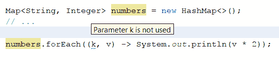

# 十二、下一步是什么？

最后，我们一起来到了我们的最后一章。我们已经构建了许多不同类型的应用程序，试图突出并演示 Java 平台的不同部分，特别是 Java 9 的新部分。正如我们所讨论的，只使用**新的 Java-9 技术和 API 编写东西是不可能的，因此我们还看到了来自 Java 7 和 8 的各种有趣的项目。随着 Java9 终于面世，展望 Java 的未来对我们来说是有意义的，但环顾四周，看看其他语言提供了什么，这样我们就可以决定我们的下一个 Java 是否真的将**变成**Java。在本章中，我们将这样做。**

本章将介绍以下主题：

*   重温我们之前讨论过的主题
*   我们在未来能期待什么

# 回首往事

在展望 Java 10 及更高版本之前，让我们快速回顾一下本书中介绍的一些内容：

*   Java 平台模块系统，可能是本版本中最大、最值得期待的平台添加。我们了解了如何创建模块，并讨论了它对运行时系统的影响。
*   我们在 Java9 中浏览了新的流程管理 API，并学习了如何查看流程，甚至在需要时杀死流程。
*   我们研究了 Java8 中引入的一些主要功能接口，讨论了如何使用它们，并展示了在使用和不使用这些接口支持的 lambda 时代码的外观。
*   我们详细讨论了 Java8 的`Optional<T>`，展示了如何创建类的实例，它公开的各种方法，以及如何使用它。
*   我们花了大量时间构建基于 JavaFX 的应用程序，演示各种技巧和窍门，解决几个**问题**，等等。
*   使用 JavaNIO 文件和路径 API，我们遍历文件系统，寻找重复的文件。
*   我们使用 JavaPersistenceAPI 实现了数据持久化，演示了如何在 JavaSE 环境中使用 API，如何定义实体，等等。
*   我们使用 Java8 日期/时间 API 构建了一个计算器，将其功能公开为库和命令行实用程序。
*   作为这项工作的一部分，在确定 Crest 并演示如何创建和使用命令行选项之前，我们简要比较了几个命令行实用程序框架（特别关注 Crest 和 Airline）。
*   虽然我们没有在每一章中都关注它，但我们确实休息了一下，讨论并演示了单元测试。
*   我们了解了**服务提供商接口**（**SPI**）作为一种为可在运行时动态加载的接口提供多种替代实现的方法。
*   我们实现了两个 REST 服务，不仅演示了 JAX-RS 的基本功能、如何在 JavaSE 环境中部署它以及 POJO 映射，还演示了一些更高级的功能，包括服务器发送事件和使用`Filter`保护端点。
*   我们构建了几个 Android 应用程序，讨论并演示了活动、片段、服务、内容提供商、异步消息传递和后台任务。
*   我们看到 OAuth2 身份验证流正在运行，包括如何使用 GoogleOAuth 提供程序和驱动该过程所需的 Java 代码设置凭据。
*   我们发现了 JSON Web 令牌，这是一种在客户机和服务器之间来回传递数据的加密安全方式，并将其作为身份验证系统的一部分进行了非常基本的使用。
*   我们参观了 JavaMail API，了解了一些常见电子邮件协议（如 POP3 和 SMTP）的历史和工作原理。
*   我们学习了如何使用 Quartz 调度程序库进行作业调度。
*   我们看到了如何以声明的方式为数据指定约束，然后如何使用 Bean 验证 API 根据这些约束验证数据。
*   我们完全改变了现状，使用功能丰富的 NetBeans 富客户端平台构建了一个中等复杂的应用程序。
*   我们简要介绍了 MongoDB 的世界文档数据库。
*   我们还学习了依赖注入以及如何将其与 CDI 规范一起使用。

这是一个相当多的列表，但还没有涵盖所有内容。本书陈述的目的之一是讨论和演示 Java9 的新特性。该版本附带了近 100 个**Java 增强方案**（**JEPs**），这使得其中一些方案很难演示，但我们已经尽了最大努力。

# 期待

Java 9 完成后，自然的问题是，**下一步是什么？**正如您所料，甲骨文、红帽、IBM、Azul Systems 等公司的工程师甚至在计划和开发 Java 9 时就一直在思考这个问题。虽然几乎不可能肯定地说 Java10 将拥有什么（记住，完成模块系统需要三个主要版本），但我们确实有几个项目目前正在讨论和设计中，希望在下一个版本中发布它们。在接下来的几页中，我们将探讨其中的一些内容，以便尽早了解几年后我们作为 Java 开发人员的生活会是什么样子。

# 瓦尔哈拉项目

Valhalla 项目是高级语言虚拟机共同开发项目的*孵化基地。它由甲骨文工程师布赖恩·戈茨领导。在撰写本文时，Valhalla 计划有三个功能。它们是值类型、泛型专门化和具体化泛型。*

# 值类型

这项工作的目标是更新 Java 虚拟机，如果可能的话，更新 Java 语言，以支持小型、不可变、无身份的**值类型。当前，如果实例化一个新的`Object`，JVM 会给它一个标识符，允许引用**变量**实例。**

例如，如果您创建一个新的整数，`new Integer(42)`，一个标识为`java.lang.Integer@68f29546`、但值为`42`的变量，那么这个变量的值将永远不会改变，而这正是我们作为开发人员通常关心的。然而，JVM 并不真正知道这一点，因此它必须维护变量的标识，以及由此产生的所有开销。根据 Goetz 的说法，这意味着该对象的每个实例将需要最多 24 个额外字节来存储该实例。例如，如果您有一个很大的数组，那么需要管理大量内存，最终需要进行垃圾收集。

因此，JVM 工程师希望实现的是一种**温和扩展**Java 虚拟机字节码和 Java 语言本身的方法，以支持一种小的、不可变的聚合类型（想想一个具有 0 个或更多属性的类）的概念，这种聚合类型缺乏标识，这将导致“在不牺牲封装的情况下，内存和位置效率高的编程习惯用法”。他们希望 Java 开发人员能够创建这些新类型，并将其视为另一个原语。Goetz 说，如果他们正确地完成工作，该功能可以概括为类似类的**代码，类似于 int！**

截至 2017 年 4 月的当前提案（[http://cr.openjdk.java.net/~jrose/values/shady-values.html](http://cr.openjdk.java.net/~jrose/values/shady-values.html)提供了以下代码片段，作为如何定义值类型的示例：

```java
    @jvm.internal.value.DeriveValueType 
    public final class DoubleComplex { 
      public final double re, im; 
      private DoubleComplex(double re, double im) { 
        this.re = re; this.im = im; 
      } 
      ... // toString/equals/hashCode, accessors,
       math functions, etc. 
    } 

```

当实例化时，这种类型的实例可以在堆栈上而不是在堆上创建，并且使用的内存要少得多。这是一个非常低级和技术性的讨论，远远超出了本书的范围，但如果您对更多细节感兴趣，我建议您阅读前面链接的页面，或者在[上阅读该工作的初始公告 http://cr.openjdk.java.net/~jrose/values/values-0.html](http://cr.openjdk.java.net/~jrose/values/values-0.html)。

# 一般专门化

泛型专门化可能更容易理解。目前，泛型类型变量只能包含引用类型。例如，您可以创建一个`List<Integer>`，但不能创建一个`List<int>`。之所以如此，有一些相当复杂的原因，但能够使用原语和值类型，将使集合在内存和计算方面更加高效。在本文档中，您可以再次从 Brian Goetz 阅读更多关于此功能的信息--[http://cr.openjdk.java.net/~briangoetz/valhalla/specialization.html](http://cr.openjdk.java.net/~briangoetz/valhalla/specialization.html)。Jesper de Jong 还对泛型类型变量中原语的复杂性进行了很好的总结：

[http://www.jesperdj.com/2015/10/12/project-valhalla-generic-specialization/](http://www.jesperdj.com/2015/10/12/project-valhalla-generic-specialization/)

# 具体化仿制药

术语**具体化的仿制药**似乎经常会引起非常响亮、生动的反应。目前，如果将变量声明为类型`List<Integer>`，则生成的字节码没有参数化类型的真实概念，因此在运行时无法发现。如果您在运行时检查变量，您将不会看到提到`Integer`。当然，您可以查看每个元素的类型，但即使这样，您也无法确定`List`的类型，因为没有强制规定**只能**将`Integer`添加到`List`中。

自从泛型在 Java5 中引入以来，Java 开发人员一直在叫嚣着要具体化泛型，或者简单地说，要在运行时保留其类型信息的泛型。正如您可能猜到的，使 Java 的泛型具体化并不是一项简单的任务，但是，最后，我们有一个正式的努力来看看它是否可以做到，如果可以做到，找到一种向后兼容的方式，例如，不具有负面的性能特征。

# 巴拿马计划

尽管巴拿马项目尚未针对任何特定的 Java 版本，但它为那些使用或希望使用第三方本机库的人提供了一些希望。目前，向 JVM 公开本机库（即用 C 或 C++编写的特定于操作系统的库）的主要方式是通过**Java 本机接口**（**JNI**）。JNI（或至少其中一个）的问题是，它要求每个想要向 JVM 公开本机库的 Java 程序员也成为 C 程序员，这不仅意味着 C 语言本身，还意味着每个受支持平台的相关构建工具。

Panama 项目希望通过向 Java 开发人员提供一种新的方法来解决这个问题，这种方法可以在不需要深入了解库语言的生态系统或 JVM 的情况下公开本机库。巴拿马项目的 JEP（[http://openjdk.java.net/jeps/191](http://openjdk.java.net/jeps/191) 列出了这些设计目标：

*   描述本机库调用（调用协议、参数列表结构、参数类型、返回类型）和本机内存结构（大小、布局、类型、生命周期）的元数据系统。
*   发现和加载本机库的机制。这些功能可能由当前的`System.loadLibrary`提供，也可能包括定位适合主机系统的平台或版本特定二进制文件的附加增强功能。
*   基于元数据将给定库/函数绑定到 Java 端点的机制，可能通过管道支持的用户定义接口进行本机下行调用。
*   基于元数据，通过用户定义的接口或用户定义的类，将特定内存结构（布局、endianness、逻辑类型）绑定到 Java 端点的机制，在这两种情况下都由管道支持，以管理真正的本机内存块。
*   适当的支持代码将 Java 数据类型封送到本机数据类型，反之亦然。在某些情况下，这将需要创建特定于 FFI 的类型，以支持 Java 无法表示的比特宽度和数字符号。

JNI 已经有相当一段时间了，它终于得到了一些早就应该得到的关注。

# 琥珀计划

Amber 项目的目标是**探索和培育更小的、面向生产力的 Java 语言特性**。当前列表包括局部变量类型推断、增强枚举和 lambda 剩余。

# 局部变量类型推断

正如我们在本书中无数次看到的那样，当您在 Java 中声明变量时，必须声明两次类型，一次在左侧，一次在右侧，再加上一个变量名：

```java
    AtomicInteger atomicInt = new AtomicInteger(42); 

```

这里的问题是，这段代码冗长且重复。局部变量类型推断工作希望解决这一问题，实现如下功能：

```java
    var atomicInt = new AtomicInteger(42); 

```

这段代码更简洁，可读性更强。注意添加了`val`关键字。通常，编译器在看到`<type> <name> = ...`时知道一行代码是一个变量声明。由于这项工作将消除对声明左侧类型的需要，因此我们需要编译器的提示，本 JEP 的作者建议将其命名为`var`。

关于简化不可变变量的声明，也有一些讨论。这些建议包括`final var`和`val`，如 Scala 等其他语言所示。在撰写本文时，尚未就哪项提案将进行最终削减做出决定。

# 增强枚举

增强的枚举将通过允许枚举（泛型枚举）中的类型变量，并对枚举常量执行更清晰的类型检查，增强 Java 语言中枚举构造的表达能力。（[http://openjdk.java.net/jeps/301](http://openjdk.java.net/jeps/301) ）。这意味着枚举最终将支持参数化类型，允许这样的操作（取自前面提到的链接中的 JEP）：

```java
    enum Primitive<X> { 
      INT<Integer>(Integer.class, 0) { 
        int mod(int x, int y) { return x % y; } 
        int add(int x, int y) { return x + y; } 
      }, 
      FLOAT<Float>(Float.class, 0f)  { 
        long add(long x, long y) { return x + y; } 
      }, ... ; 

      final Class<X> boxClass; 
      final X defaultValue; 

      Primitive(Class<X> boxClass, X defaultValue) { 
        this.boxClass = boxClass; 
        this.defaultValue = defaultValue; 
      } 
    } 

```

注意，除了为每个`enum`值指定泛型类型外，我们还可以为每个`enum`类型定义特定于类型的方法。这将使定义一组预定义的常量变得更加容易，而且还可以为每个常量定义类型安全和类型感知方法。

# Lambda 剩菜

目前，Java 8 中的 lambda 工作中有两项标记为`leftovers`。第一个是在 lambda 声明中对未使用的参数使用下划线。例如，在这个精心设计的例子中，我们所关心的只是`Map`值：

```java
    Map<String, Integer> numbers = new HashMap<>(); 
    numbers.forEach((k, v) -> System.out.println(v*2)); 

```

这导致 IDE 中出现如下情况：



一旦允许使用下划线，此代码将如下所示：

```java
    numbers.forEach((_, v) -> System.out.println(v*2)); 

```

这允许更好地静态检查未使用的变量，允许工具（和开发人员）更容易地识别此类参数并更正或标记它们。

另一个遗留问题是允许 lambda 参数对封闭范围内的变量进行阴影处理。如果您现在尝试这样做，如果您尝试在语句块内重新定义变量，您将得到相同的错误--**变量已定义**：

```java
    Map<String, Integer> numbers = new HashMap<>(); 
    String key = someMethod(); 
    numbers.forEach((key, value) ->  
      System.out.println(value*2)); // error 

```

有了这个更改，前面的代码可以很好地编译和运行。

# 环顾四周

JVM 多年来一直支持替代语言。其中一些比较著名的包括 Groovy 和 Scala。这些年来，这两种语言都以某种方式影响了 Java，但与任何语言一样，它们也并非没有问题。许多人认为 Groovy 的性能不如 Java（尽管`invokedynamic`字节码指令应该已经解决了这一问题），许多人认为 Groovy 更具动态性的特性不太吸引人。另一方面，Scala（公平或不公平，取决于你问谁）却认为这太复杂了。编译时间也是一个常见的问题。此外，许多组织都非常乐于使用这两种方法，因此它们绝对值得考虑，看看它们是否能在您的环境中工作，是否能满足您的需要。

虽然这些语言可能很棒，但我们在这里花了一些时间来看看下一步会发生什么，至少有两种语言在人群中脱颖而出——锡兰和科特林。我们不能对每种语言都进行详尽的介绍，但是，在接下来的几页中，我们将快速查看这些语言，看看它们现在为 JVM 开发人员提供了什么，也许还可以看看它们可能会如何影响 Java 语言的未来更改。

# 锡兰

锡兰语，一种由红帽赞助的语言，在 2011 年左右首次出现。在 Hibernate 和 Seam 框架知名度的 Gavin King 的领导下，该团队着手在语言和库级别解决他们多年来在开发自己的框架和库时遇到的一些痛点。尽管他们承认自己是 Java 语言的忠实粉丝，但他们也欣然承认 Java 语言并不完美，特别是在一些标准库方面，他们的目标是修复锡兰的这些缺陷。该语言的目标包括可读性、可预测性、工具性、模块性和元编程性（[https://ceylon-lang.org/blog/2012/01/10/goals](https://ceylon-lang.org/blog/2012/01/10/goals) ）。

在开始使用锡兰时，您可能会注意到的最大区别之一是模块的概念已经融入到语言中。在许多方面，它与 Java 9 的模块声明非常相似，如下所示：

```java
    module com.example.foo "1.0" { 
      import com.example.bar "2.1"; 
    } 

```

然而，有一个非常明显的区别——锡兰模块**确实**有版本信息，这允许不同的模块依赖于系统中可能已经存在的模块的不同版本。

锡兰和 Java 之间至少还有一个相当重要的区别——锡兰内置了一个构建工具。例如，虽然有一个 Maven 插件，但首选的方法是使用 Ceylon 的本地工具来构建和运行项目：

```java
$ ceylonb new hello-world 
Enter project folder name [helloworld]: ceylon-helloworld 
Enter module name [com.example.helloworld]: 
Enter module version [1.0.0]: 
Would you like to generate Eclipse project files? (y/n) [y]: n 
Would you like to generate an ant build.xml? (y/n) [y]: n 
$ cd ceylon-helloworld 
$ ceylonb compile 
Note: Created module com.example.helloworld/1.0.0 
$ ceylonb run com.example.helloworld/1.0.0 
Hello, World! 

```

除了模块系统之外，Ceylon 还能为 Java 开发人员提供什么？更直接有用和实用的特性之一是改进的空处理支持。正如我们必须在 Java 中所做的那样，我们仍然必须在 Ceylon 中检查 null，但是该语言提供了一种更好的方法，并且都是从类型系统开始的。

对 Scala 的抱怨之一（不管它是否真的被认可）是类型系统太复杂了。不管您是否同意，很明显，与 Java 提供的相比，肯定还有改进的余地（甚至 Java 语言架构师也同意，例如，建议的局部变量类型推断建议就是明证）。Ceylon 为类型系统提供了一个非常强大的补充--并集类型和交集类型。

联合类型允许一个变量有多个类型，但一次只能有一个。这在讨论 null 时起作用的是，`String? foo = ...`声明了可为 null 的`String`类型的变量，实际上与`String|Null foo = ...`相同。

这声明了一个变量 foo，其类型为`String`或`Null`，但不是两者都是。`?`语法只是对联合类型声明（`A | B`或`A`或`B`的语法修饰。如果我们有一个方法，那么它采用这种联合类型；我们知道该变量可为 null，因此需要使用以下代码段进行检查：

```java
    void bar (String? Foo) { 
      if (exists foo) { 
        print (foo); 
      } 
    } 

```

由于这是一种联合类型，我们也可以这样做：

```java
    void bar (String? Foo) { 
      if (is String foo) { 
        print (foo); 
      } 
    } 

```

请注意，一旦我们使用`exists`或`is`进行了测试，我们就可以假设变量不是 null，而是一个`String`。编译器不会抱怨，我们也不会在运行时遇到意外的`NullPointerException`（它们在 Ceylon 中实际上并不存在，因为编译器要求您在处理可空变量时非常明确）。这种编译器对 null 和类型检查的感知称为**流敏感**类型。一旦您验证了某种类型的东西，编译器就会知道并记住（可以说）该范围其余部分的检查结果，这样您就可以编写更干净、更简洁的代码。

联合类型为 A 或 B，交叉类型为 A**和**B。对于一个完全任意的示例，假设您有一个参数必须为`Serializable`**和**`Closeable`的方法。在 Java 中，您必须通过编写以下代码行手动检查：

```java
    public void someMethod (Object object) { 
      if (!(object instanceof Serializable) ||  
        !(object instanceof Closeable)) { 
        // throw Exception 
      } 
    } 

```

对于交叉口类型，锡兰让我们写下：

```java
    void someMethod(Serializable&Closeable object) { 
      // ... 
    } 

```

如果我们试图用不实现**两个**接口的东西调用该方法，或者说，扩展一个类并实现其他接口，那么我们在**编译时**会得到一个错误。这是非常强大的。

在企业中采用一种新语言，甚至是一个库之前，人们通常会先看看还有谁在使用它。有值得注意的收养故事吗？有没有其他公司对这项技术有足够的信心来使用它构建生产系统？不幸的是，锡兰网站（在撰写本文时）对红帽之外的收养细节知之甚少，因此很难回答这个问题。然而，Red Hat 在设计语言、构建工具和社区方面花费了大量资金，所以这应该是一个安全的赌注。当然，这是您的企业在仔细考虑后必须做出的决定。有关锡兰的更多信息，请访问[https://ceylon-lang.org](https://ceylon-lang.org) 。

# 科特林

另一种新兴语言是 Kotlin。它是一种静态类型语言，来自 IntelliJ IDEA 的制造商 JetBrains，目标是 JVM 和 Javascript。对于那些不需要或不允许使用虚拟机的环境，例如 iOS、嵌入式系统等，它甚至还提供了通过 LLVM 直接编译为机器代码的新支持。

Kotlin 于 2010 年启动，并于 2012 年开源，作为解决 JetBrains 在大规模 Java 开发中面临的一些常见问题的一种手段。在调查了当时的语言环境后，他们的工程师认为这些语言都不能充分解决他们的问题。例如，许多人多年来一直认为 Scala 是**下一代 Java**的 Scala，尽管拥有可接受的功能集，但被认为编译速度太慢，因此 JetBrains 开始设计自己的，最终于 2016 年 2 月发布了 1.0。

Kotlin 团队的设计目标包括表达能力、可伸缩性和互操作性。他们的目标是允许开发人员通过语言和库特性编写更少的代码，并使用与 Java 100%互操作的语言以更清晰的方式完成更多的工作。他们增加了一些功能，比如协同路由，使基于 Kotlin 的系统能够快速、轻松地扩展。

说到这里，Kotlin 看起来像什么？作为 Java 开发人员，我们为什么要感兴趣？让我们从变量开始。

正如您所记得的，Java 既有原语（`int`、`double`、`float`、`char`等等）也有引用，或者是**包装器**类型（`Integer`、`Double`、`Float`、`String`等等）。正如我们在本章中所讨论的，JVM 工程师正在研究改善这种二分法带来的一些行为和能力差异的方法。Kotlin 完全避免了这一点，因为每个值都是一个对象，所以不必担心`List<int>`和`List<Integer>`。

此外，Kotlin 已经支持局部变量类型推断以及不可变性。例如，考虑下面的 java 代码作为一个例子：

```java
    Integer a = new Integer(1); 
    final String s = "This is a string literal"; 

```

在 Kotlin 中，前面几行代码可以这样编写：

```java
    var a = 1; 
    val s = "This is a string literal"; 

```

注意`var`和`val`关键字的使用。正如前面关于未来 Java 语言更改所讨论的，这些关键字允许我们分别声明可变变量和不可变变量。还请注意，我们不需要声明变量的类型，因为编译器会为我们处理该类型。在某些情况下，我们可能需要显式声明类型，例如，在编译器可能猜错的情况下，或者当它没有足够的信息进行猜测时，此时，它将停止编译并显示错误消息。在这些情况下，我们可以这样声明类型：

```java
    var a: Int  = 1; 
    val s: String = "This is a string literal"; 

```

如我们所见，在 Java8 中，我们有`Optional<T>`来帮助处理空值。Kotlin 也有空支持，但它内置于语言中。默认情况下，Kotlin 中的所有变量不可为空。也就是说，如果编译器可以告诉您正在尝试为变量分配 null 值，或者如果它无法确定某个值是否为 null（例如，来自 Java API 的返回值），那么您将得到一个编译器错误。为了表明某个值可以为空，您可以在变量声明中添加一个`?`，如下所示：

```java
    var var1 : String = null; // error 
    var var2 : String? = null; // ok 

```

Kotlin 还在方法调用中提供了改进的 null 处理支持。例如，假设您想要获取用户的城市。在 Java 中，您可以执行以下操作：

```java
    String city = null; 
    User user = getUser(); 
    if (user != null) { 
      Address address = user.getAddress(); 
      if (address != null) { 
        city address.getCity(); 
      } 
    } 

```

在 Kotlin 中，可以用一行表示，如下所示：

```java
    var city : String? = getUser()?.getAddress()?.getCity(); 

```

如果在任何时候，其中一个方法返回 null，则方法调用链结束，并将 null 分配给变量 city。Kotlin 并没有停止处理 null。例如，它提供了`let`函数，可以作为 if not null 检查的快捷方式。例如，考虑下面的代码行：

```java
    if (city != null) { 
      System.out.println(city.toUpperCase()); 
    } 

```

前面的代码行在 Kotlin 中变为：

```java
    city?.let { 
      println(city.toUpperCase()) 
    } 

```

当然，这可以写成`city?.toUpperCase()`。不过，这应该说明，在任意大、复杂的代码块中安全地使用可为 null 的变量的能力。还值得注意的是，在`let`块中，编译器知道`city`不是 null，因此不需要进一步的 null 检查。

在前面的例子中，可能隐藏着 Kotlin 对 lambdas 的支持，没有这一点，似乎任何现代语言都不值得考虑。Kotlin 确实完全支持 lambda、高阶函数、下划线作为 lambda 参数名等等。它的支持和语法与 Java 非常相似，因此 Java 开发人员应该非常熟悉 Kotlin 的 lambdas。

当然，最大的问题是，科特林准备好进入黄金时段了吗？JetBrains 肯定这么认为，因为他们在许多应用中都使用了它，包括内部和外部。其他著名用户包括 Pinterest、Gradle、Evernote、Uber、Pivotal、Atlassian 和 Basecamp。Kotlin 甚至在 Android 开发中得到了谷歌（Android Studio）的官方支持，因此它绝对是一种生产级语言。

当然，这门伟大的新语言还有很多，空间不允许我们讨论所有内容，但你可以浏览[https://kotlinlang.org](https://kotlinlang.org) 了解更多信息，看看 Kotlin 是否适合贵公司。

# 总结

当然，关于 Java10 和这两种语言，以及在 Java 虚拟机内部和周围发生的无数其他项目，还有更多可以讨论的内容。经过 20 多年的发展，Java——语言**和**环境——仍在发展壮大。在本书的几页中，我尝试展示了该语言的一些重大进步，为您自己的项目提供了各种起点、学习和重用的示例代码，以及对各种库、API 和技术的解释，这些可能对您的日常工作有所帮助。我希望你们喜欢这些例子和解释，就像我喜欢准备它们一样。更重要的是，我希望它们能帮助你们构建下一个大项目。

祝你好运