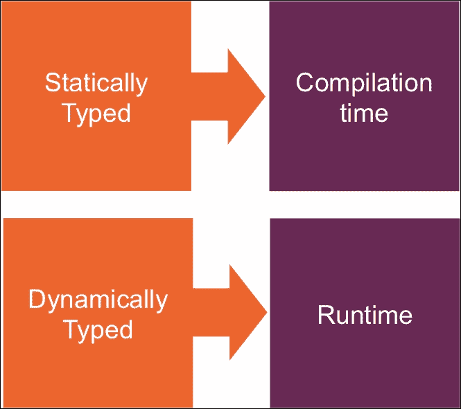
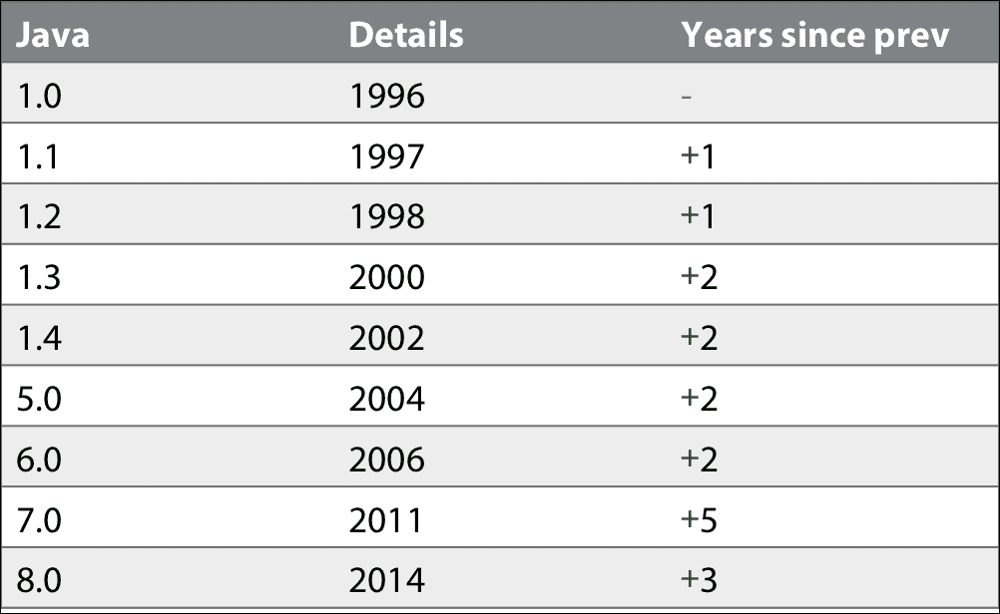
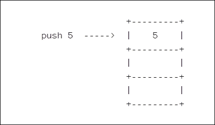
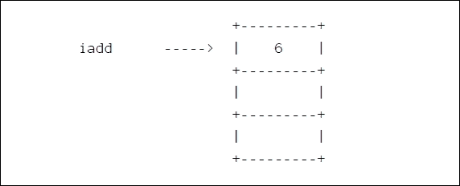

# 三、深入 Lambda

在本节中，我们将更详细地了解一些情况，并讨论一些相关主题，例如：

*   功能接口
*   方法和构造函数引用
*   范围和最终变量
*   例外透明度
*   lambdas 和闭包之间的区别
*   我们已经讨论了 lambda 如何不仅仅是语法上的糖，我们将看看 lambda 产生的字节码

# 功能接口

Java 将 lambdas 视为接口类型的实例。它将其形式化为它调用的*功能接口*。功能接口只是一个具有单一方法的接口。Java 将该方法称为“函数方法”，但通常使用“单一抽象方法”或 SAM。

JDK 中现有的所有单一方法接口，如`Runnable`和`Callable`现在都是功能接口，并且 lambdas 可以在使用单一抽象方法接口的任何地方使用。事实上，正是功能接口允许所谓的*目标类型*；它们为编译器推断参数和返回类型提供了足够的信息。

## @功能界面

Oracle 引入了一个新的注释`@FunctionalInterface`来标记这样的接口。它基本上是为了传达意图，但也允许编译器进行一些额外的检查。

例如，此接口编译：

```java
public interface FunctionalInterfaceExample {
    // compiles ok
}
```

但是当您通过添加新的注释来指示它应该是一个*功能接口*时，

```java
@FunctionalInterface // <- error here
    public interface FunctionalInterfaceExample {
      // doesn't compile
}
```

编译器将引发一个错误。它告诉我们“示例不是函数接口”，因为“没有找到抽象方法”。IDE 通常也会提示，[IntelliJ](http://www.jetbrains.com/idea/)会说类似“未找到目标方法”的话。这暗示着我们省略了函数方法。一个“单一的抽象方法”需要一个单一的`abstract`方法。

那么，如果我们尝试向接口添加第二个方法会怎么样？

```java
@FunctionalInterface
public interface FunctionalInterfaceExample {
    void apply();
    void illegal(); // <- error here
}
```

编译器将再次出错，这一次会显示一条“找到了多个非重写的抽象方法”的消息。功能接口只能有**一种**方法。

## 分机

一个接口扩展另一个接口的情况如何？

让我们创建一个名为`A`的新功能接口和一个扩展了`A`的名为`B`的新功能接口。`B`接口仍然是一个功能接口。它继承了您期望的父`apply`方法：

```java
@FunctionalInterface
interface A {
    abstract void apply();
}

interface B extends A {
}
```

如果希望更清楚地说明这一点，还可以从父级重写函数方法：

```java
@FunctionalInterface
interface A {
    abstract void apply();
}

interface B extends A {
    @Override
    abstract void apply();
}
```

如果我们将其用作 lambda，则可以验证它是否作为功能接口工作。我们将实现一个方法来显示 lambda 可以分配给下面的 a 和 B 类型。实现只是打印出`"A"`或`"B"`。

```java
@FunctionalInterface
public interface A {
    void apply();
}

public interface B extends A {
    @Override
    void apply();
}

public static void main(String... args) {
   A a = () -> System.out.println("A");
   B b = () -> System.out.println("B");
}
```

但是，您不能向扩展接口（B）添加新的`abstract`方法，因为生成的类型将有两个`abstract`方法，IDE 将警告我们，编译器将出错。

```java
@FunctionalInterface
public interface A {
    void apply();
}

public interface B extends A {
    void illegal();     // <- can't do this
}

public static void main(String... args) {
    A a = () -> System.out.println("A");
    B b = () -> System.out.println("B");    // <- error
}
```

在这两种情况下，您都可以重写`Object`中的方法，而不会引起问题。您还可以添加默认方法（从 Java8 开始也是新的）。正如您可能期望的那样，尝试将抽象类标记为函数接口是没有意义的。

## 其他接口改进

接口通常添加了一些新功能，包括：

*   默认方法（虚拟扩展方法）
*   静态接口方法
*   以及`java.util.function`包中的一系列新功能接口；像`Function`和`Predicate`之类的东西

## 总结

在本节中，我们讨论了任何具有单个方法的接口现在如何成为“功能接口”，并且单个方法通常被称为“功能方法”或 SAM（对于单个抽象方法）。

我们查看了新的注释，并看到了两个示例，说明了如何使用注释对现有的 JDK 接口（如`Runnable`和`Callable`）进行了改装。

我们还介绍了*目标类型*的思想，这是编译器如何使用函数方法的签名来帮助计算 lambdas 可以在何处使用。我们略过了这一点，因为我们将在后面的类型推断部分讨论它。

我们讨论了一些函数接口的例子，编译器和 IDE 在我们出错时如何帮助我们，并对我们可能遇到的各种错误有了感觉。比如在函数接口中添加多个方法。我们还看到了该规则的例外情况，即当我们重写`Object`中的方法或实现默认方法时。

我们快速了解了接口继承以及它是如何影响事情的，并提到了我们稍后将介绍的一些其他接口改进。

这里需要强调的一点是，在使用功能接口的任何地方，现在都可以使用 lambda。lambda 可以用来代替函数接口的匿名实现。使用 lambda 而不是匿名类可能看起来像是语法上的甜点，但实际上它们是完全不同的。详见*函数 vs.类*一节。

# 类型推断改进

在现代 Java 中，有几种类型推断的改进。为了能够支持 lambdas，编译器推断事物的方式已经得到了改进，可以广泛使用*目标类型*。这一点以及对 Java7 推理的其他改进都是在开放的**JDK 增强方案**（**JEP**101）下进行管理的。

在我们开始之前，让我们回顾一下基本知识。

类型推断是指编程语言自动推断表达式类型的能力。

静态类型语言在*编译*时知道事物的类型。动态类型语言在*运行时*知道类型。静态类型语言可以使用类型推断并在源代码中删除类型信息，并使用编译器找出缺少的内容。



这意味着静态类型语言（比如 Scala）可以使用类型推断来“看起来”像动态语言（比如 JavaScript）。至少在源代码级别。

下面是 Scala 中一行代码的示例：

```java
val name = "Henry"
```

您不需要显式地告诉编译器该值是字符串。它解决了这个问题。你可以这样明确地写出来，

```java
val name : String = "Henry"
```

但是没有必要。

另一方面，Scala 还试图根据它的**抽象语法树**（**AST**）判断您何时完成了一个语句或表达式。通常，您甚至不需要添加终止分号

## Java 类型推断

类型推断是一个相当广泛的主题，Java 不支持这种类型的推断。我刚才讨论过，至少是关于删除变量的类型注释之类的事情。我们必须保持这一点：

```java
String name = "Henry"; // <- we can't drop the String like Scala
```

因此 Java 不支持更广泛意义上的类型推断。它不能像某些语言一样猜出所有的东西。Java 的类型推断通常指编译器计算泛型类型的方式。Java7 在引入菱形操作符（`<>`时改进了这一点，但是 Java*能够*理解的东西仍然有很多限制。

Java 编译器是使用类型擦除构建的；它在编译期间主动删除类型信息。由于类型擦除，`List<String>`编译后变为`List<Object>`。

由于历史原因，当泛型在 Java5 中引入时，开发人员无法轻易改变使用擦除的决定。Java 需要理解用什么类型来替换给定的泛型类型，但却不知道如何做，因为它已经被删除了。类型推断是解决方案。

所有泛型值实际上都是幕后的类型`Object`，但通过使用类型推断，编译器可以检查所有源代码用法是否与它认为泛型应该是的一致。在运行时，所有内容都将作为`Object`的实例进行传递，并在幕后进行适当的强制转换。类型推断只允许编译器提前检查强制转换是否有效。

因此，类型推断是关于猜测类型的，Java 对类型推断的支持在 Java 8 中有两种改进：

1.  lambdas 的目标类型。

并使用通用目标类型来：

1.  在方法调用中添加对参数类型推断的支持。
2.  添加对链接调用中参数类型推断的支持。

让我们看看当前的问题以及现代 Java 如何解决这些问题。

## lambdas 的目标类型

现代 Java 对类型推断的一般改进意味着 Lambda 可以推断其类型参数；因此，不要使用：

```java
(Integer x, Integer y) -> x + y;
```

您可以删除`Integer`类型的注释并使用以下内容：

```java
(x, y) -> x + y;
```

这是因为函数接口描述了类型，它为编译器提供了所需的所有信息。

例如，如果我们以函数接口为例。

```java
@FunctionalInterface
interface Calculation {
    Integer apply(Integer x, Integer y);
}
```

当使用 lambda 代替接口时，编译器要做的第一件事就是计算出 lambda 的*目标*类型。因此，如果我们创建一个方法`calculate`，它接受接口和两个整数。

```java
static Integer calculate(Calculation operation, Integer x, Integer y) { 
    return operation.apply(x, y);
}
```

然后创建两个 lambda；加减函数

```java
Calculation addition = (x, y) -> x + y;
Calculation subtraction = (x, y) -> x - y;
```

然后像这样使用它们：

```java
calculate(addition, 2, 2);
calculate(subtraction, 5, calculate(addition, 3, 2));
```

编译器知道 lambdas 加法和减法有一个目标计算类型（它是唯一适合 calculate 方法签名的“形状”）。然后，它可以使用方法签名来推断 lambda 参数的类型。接口上只有一个方法，所以没有歧义，参数类型显然是`Integer`。

我们将要看很多目标类型的例子，所以现在，请注意 Java 用来实现很多 lambda 优点的机制依赖于对类型推断的改进和*目标*类型的想法。

### 方法调用中的类型参数

在 Java8 之前的某些情况下，编译器无法推断类型。其中之一是在调用以泛型类型参数作为参数的方法时。

例如，`Collections`类有一个生成空列表的泛化方法。看起来是这样的：

```java
public static final <T> List<T> emptyList() { ... }
```

在 Java 7 中，这编译：

```java
List<String> names = Collections.emptyList(); // compiles in Java 7
```

因为 Java 7 编译器可以计算出`emptyList`方法所需的泛型是`String`类型。但它所面临的困难是，泛型方法的结果是否作为参数传递给另一个方法调用。

因此，如果我们有一种方法来处理如下所示的列表：

```java
static void processNames(List<String> names) {
    System.out.println("hello " + name);
}
```

然后用空列表方法调用它。

```java
processNames(Collections.emptyList()); // doesn't compile in Java 7
```

无法编译，因为参数的泛型类型已被删除为`Object`。看起来真的是这样。

```java
processNames(Collections.<Object>emptyList names);
```

这与`processList`方法不匹配。

```java
processNames(Collections.<String>emptyList names);
```

因此，在我们使用显式的“类型见证”给它一个额外的提示之前，它不会编译。

```java
processNames(Collections.<String>emptyList());   // compiles in Java 7
```

现在，编译器对传递到方法中的泛型类型有了足够的了解。

Java8 中的改进包括更好地支持这一点，因此一般来说，在需要类型见证的地方，您不再需要。

我们调用`processNames`的示例现在已经编译！

```java
processNames(Collections.emptyList());           // compiles in Java 8
```

### 链式方法调用中的类型参数

类型推断的另一个常见问题是当方法链接在一起时。假设我们有一个`List`类：

```java
static class List<E> {

    static <T> List<T> emptyList() {
        return new List<T>();
    }

    List<E> add(E e) {
        // add element
        return this;
    }
}
```

我们希望链接一个调用，向创建空列表的方法添加一个元素。类型擦除再次抬头；该类型已被擦除，因此链中的下一个方法无法识别该类型。它不能编译。

```java
List<String> list = List.emptyList().add(":(");
```

这本来应该在 Java8 中修复，但不幸的是它被删除了。所以，至少现在，您仍然需要显式地向编译器提供一个类型；你还需要一个证人。

```java
List<String> list = List.<String>emptyList().add(":(");
```

# 方法参考

我前面提到过，方法引用类似于 lambdas 的快捷方式。它们是一种简洁方便的方法，可以指向一个方法，并允许该方法在使用 lambda 的任何地方使用。

创建 lambda 时，创建匿名函数并提供方法体。当您使用方法引用作为 lambda 时，它实际上指向一个已经存在的名为的*方法；它已经有一个身体了。*

您可以将其视为将常规方法转换为功能接口的*转换。*

基本语法如下所示：

```java
Class::method
```

或者，一个更具体的例子：

```java
String::valueOf
```

双冒号前面的部分是目标引用，后面是方法名称。因此，在本例中，我们针对`String`类，寻找一个名为`valueOf`的方法；我们指的是`String`上的`static`方法。

```java
public static String valueOf(Object obj) { ... }
```

双冒号称为*分隔符*。当我们使用它时，我们不是调用该方法，只是引用它。所以记住不要在末尾加括号。

```java
String::valueOf(); // <-- error
```

您不能直接调用方法引用，它们只能用来代替 lambda。因此，只要使用 lambda，就可以使用方法引用。

## 示例

此语句本身无法编译。

```java
public static void main(String... args) {
    String::valueOf;
}
```

这是因为方法引用无法转换为 lambda，因为编译器没有上下文来推断要创建什么类型的 lambda。

*我们*碰巧知道这个参考相当于

```java
(x) -> String.valueOf(x)
```

但是编译器还不知道这一点。但它可以告诉我们一些事情。它知道，作为 lambda，返回值应该是类型`String`，因为`String`中调用`valueOf`的所有方法都返回字符串。但它不知道该提供什么作为论据。我们需要给它一点帮助，给它更多的背景。

我们将创建一个名为`Conversion`的函数接口，它接受一个整数并返回一个字符串。这将是我们 lambda 的目标类型。

```java
@FunctionalInterface
interface Conversion {
    String convert(Integer number);
}
```

接下来，我们需要创建一个场景，将其用作 lambda。所以我们创建了一个小方法来接受函数接口，并对其应用一个整数。

```java
public static String convert(Integer number, Conversion function) {
    return function.convert(number);
}
```

现在，事情是这样的。我们刚刚为编译器提供了足够的信息，可以将方法引用转换为等效的 lambda。

当我们调用`convert`方法时，我们可以传递一个 lambda。

```java
convert(100, (number) -> String.valueOf(number));
```

我们可以参考`valueOf`方法来替换 lambda。编译器现在知道我们需要一个 lambda，它返回一个字符串并接受一个整数。现在它知道`valueOf`方法“适合”并可以替换整数参数。

```java
convert(100, String::valueOf);
```

为编译器提供所需信息的另一种方法是将引用分配给类型。

```java
Conversion b = (number) -> String.valueOf(number);
```

并作为方法参考

```java
Conversion a = String::valueOf;
```

“形状”合适，因此可以指定。

有趣的是，我们可以将相同的 lambda 分配给任何需要相同“形状”的接口。例如，如果我们有另一个具有相同“形状”的功能接口，

这里，`Example`返回一个`String`并接受一个`Object`，因此它具有与`valueOf`相同的签名形状。

```java
interface Example {
    String theNameIsUnimportant(Object object);
}
```

我们仍然可以将方法引用（或 lambda）分配给它。

```java
Example a = String::valueOf;
```

## 方法参考类型

方法参考有四种类型：

*   构造函数引用
*   静态方法引用
*   和两种类型的实例方法引用

最后两个有点混乱。第一个是特定对象的方法引用，第二个是特定类型的*任意*对象*但*的方法引用。区别在于您希望如何使用该方法，以及您是否提前拥有该实例。

首先，让我们看看构造函数引用。

## 建造商参考

基本语法如下所示：

```java
String::new
```

一个*目标*类型，后跟双冒号，然后是`new`关键字。它将创建一个 lambda 来调用`String`类的零参数构造函数。

它相当于这个 lambda

```java
() -> new String()
```

记住，方法引用从来没有括号；他们没有调用方法，只是引用了一个。此示例引用的是`String`类的构造函数，但*不是*实例化字符串。

让我们看看如何实际使用构造函数引用。

如果我们创建一个对象列表，我们可能希望填充该列表，比如说十个项目。所以我们可以创建一个循环并添加一个新对象十次。

```java
public void usage() {
    List<Object> list = new ArrayList<>();
    for (int i = 0; i < 10; i++) {
        list.add(new Object());
  }
}
```

但是，如果我们希望能够重用初始化函数，我们可以将代码提取到一个名为`initialise`的新方法中，然后使用工厂创建对象。

```java
public void usage() {
    List<Object> list = new ArrayList<>();
    initialise(list, ...);
}

private void initialise(List<Object> list, Factory<Object> factory){
    for (int i = 0; i < 10; i++) {
        list.add(factory.create());
    }
 }
```

`Factory`类只是一个函数接口，它具有一个名为`create`的方法，该方法返回一些对象。然后，我们可以将它创建的对象添加到列表中。因为它是一个功能接口，我们可以使用 lambda 实现工厂来初始化列表：

```java
public void usage() {
    List<Object> list = new ArrayList<>();
    initialise(list, () -> new Object());
}
```

或者我们可以交换构造函数引用。

```java
public void usage() {
    List<Object> list = new ArrayList<>();
    initialise(list, Object::new);
}
```

我们还可以做一些其他的事情。如果我们在`initialise`方法中添加一些泛型，我们可以在初始化任何类型的列表时重用它。例如，我们可以返回并将列表的类型更改为`String`并使用构造函数引用对其进行初始化。

```java
public void usage() {
    List<String> list = new ArrayList<>();
    initialise(list, String::new);
}

private <T> void initialise(List<T> list, Factory<T> factory) {
    for (int i = 0; i < 10; i++) {
        list.add(factory.create());
    }
}
```

我们已经看到了零参数构造函数是如何工作的，但是当类有多个参数构造函数时，情况又如何呢？

当有多个构造函数时，使用相同的语法，但编译器会找出哪个构造函数最匹配。它是基于*目标*类型并推断可用于创建该类型的功能接口来完成此操作的。

让我们以一个`Person`类为例，它看起来像这样，您可以看到构造函数接受了一系列参数。

```java
class Person {
    public Person(String forename, String surname, LocalDate    
    birthday, Sex gender, String emailAddress, int age) {
      // ...
    }
}
```

回到前面的例子，看看通用的`initialise`方法，我们可以使用如下 lambda：

```java
initialise(people, () -> new Person(forename, surname, birthday,
                                    gender, email, age));
```

但是为了能够使用构造函数引用，我们需要一个 lambda*和变量参数*，看起来如下所示：

```java
(a, b, c, d, e, f) -> new Person(a, b, c, d, e, f);
```

但这并不能直接转换为构造函数引用。如果我们尝试使用

```java
Person::new
```

它不会编译，因为它对参数一无所知。如果您尝试编译它，错误表明您创建了一个无效的构造函数引用，无法应用于给定的类型；它没有发现任何论据。

相反，我们必须引入一些间接方法，为编译器提供足够的信息来找到合适的构造函数。我们可以创建一些可以用作功能接口*的东西，并且*具有合适的类型，可以插入适当的构造函数。

让我们创建一个名为`PersonFactory`的新功能接口。

```java
@FunctionalInterface
interface PersonFactory {
    Person create(String forename, String surname, LocalDate 
    birthday, Sex gender, String emailAddress, int age);
}
```

这里，`PersonFactory`的参数与`Person`上的可用构造函数匹配。神奇的是，这意味着我们可以返回并将其与构造函数引用`Person`一起使用。

```java
public void example() {
    List<Person> list = new ArrayList<>();
    PersonFactory factory = Person::new;
    // ...
}
```

注意，我使用的是`Person`中的构造函数引用。这里需要注意的是，构造函数引用可以分配给目标函数接口，即使我们还不知道参数。

方法引用的类型是`PersonFactory`而不是`Person`，这似乎有点奇怪。这个额外的目标类型信息帮助编译器知道它必须通过`PersonFactory`来创建`Person`。有了这个额外的提示，编译器能够基于工厂接口创建 lambda，该工厂接口将在*之后*创建`Person`。

把它写出来，编译器会生成这个。

```java
public void example() {
    PersonFactory factory = (a, b, c, d, e, f) -> new Person(a, b,   
    c, d, e, f);
}
```

以后可以这样使用：

```java
public void example() {
    PersonFactory factory = (a, b, c, d, e, f) -> new Person(a, b,  
    c, d, e, f);
    Person person = factory.create(forename, surname, birthday,
                                gender, email, age);
}
```

幸运的是，一旦我们引入了间接寻址，编译器就可以为我们做到这一点。

它知道要使用的目标类型是`PersonFactory`，并且它知道它的单个`abstract`方法可以用来代替构造函数。这有点像一个两步的过程，首先，确定`abstract`方法与构造函数具有相同的参数列表，并且返回正确的类型，然后使用冒号新语法应用它。

为了结束这个例子，我们需要调整`initialise`方法来添加类型信息（替换泛型），添加参数来表示人员的详细信息，并实际调用工厂。

```java
private void initialise(List<Person> list, PersonFactory factory, 
                       String forename, String surname,                           
                       LocalDate birthday, Sex gender,
                       String emailAddress, int age) {
                         for (int i = 0; i < 10; i++) {
                           list.add(factory.create(forename,  
                           surname, birthday, gender,        
                           emailAddress, age));
                         }
                       }
```

然后我们可以这样使用它：

```java
public void example() {
    List<Person> list = new ArrayList<>();
    PersonFactory factory = Person::new;
    initialise(people, factory, a, b, c, d, e, f);
}
```

或者是内联的，像这样：

```java
public void example() {
    List<Person> list = new ArrayList<>();
    initialise(people, Person::new, a, b, c, d, e, f);
}
```

## 静态方法参考

方法引用可以直接指向静态方法。例如

```java
String::valueOf
```

这一次，左侧指的是可以找到静态方法的类型，在本例中为`valueOf`。它相当于这个 lambda

```java
x -> String.valueOf(x))
```

一个更广泛的例子是，我们使用对类`Comparators`上静态方法的引用对集合进行排序。

```java
Collections.sort(Arrays.asList(5, 12, 4), Comparators::ascending);

// equivalent to
Collections.sort(Arrays.asList(5, 12, 4), (a, b) -> Comparators.ascending(a, b));
```

其中，静态方法`ascending`的定义如下：

```java
public static class Comparators {
    public static Integer ascending(Integer first, Integer second)   
    {
        return first.compareTo(second);
     }
}
```

## 特定对象的实例方法引用（本例中为闭包）

以下是特定实例的实例方法引用示例：

```java
x::toString
```

`x`是我们想要了解的一个具体实例。它的 lambda 等价物如下所示：

```java
() -> x.toString()
```

引用特定实例的方法的能力也为我们提供了一种在不同功能接口类型之间转换的方便方法。例如：

```java
Callable<String> c = () -> "Hello";
```

Callable 的函数方法是 call。当它被调用时，lambda 将返回`"Hello"`。

如果我们有另一个功能接口`Factory`，我们可以使用方法引用转换`Callable`。

```java
Factory<String> f = c::call;
```

我们本可以重新创建 lambda，但这个技巧是一种有用的方法，可以从预定义的 lambda 中获得重用。将它们分配给变量并重用它们以避免重复。

下面是一个正在使用的示例：

```java
public void example() {
    String x = "hello";
    function(x::toString);
}
```

这是一个方法引用使用闭包的示例。它创建一个 lambda，该 lambda 将调用实例`x`上的`toString`方法。

上述函数的签名和实现如下所示：

```java
public static String function(Supplier<String> supplier) {
    return supplier.get();
}
```

`Supplier`接口是一个功能接口，如下所示：

```java
@FunctionalInterface
public interface Supplier<T> {
  T get();
}
```

在我们的函数中使用时，它提供一个字符串值（通过调用`get`），唯一的方法是在构造时提供该值。这相当于：

```java
public void example() {
  String x = "";
  function(() -> x.toString());
}
```

注意这里 lambda 没有参数（它使用“hamburger”符号）。这表明，`x`的值在 lambda 的本地范围内不可用，因此只能从 lambda 的范围外可用。这是一个关闭，因为必须关闭`x`（它将*捕获*`x`。

如果您有兴趣看到与之相当的长手匿名类，它将如下所示。再次注意`x`必须如何传入：

```java
public void example() {
    String x = "";
    function(new Supplier<String>() {
        @Override
        public String get() {
            return x.toString(); // <- closes over 'x'
        }
    });
}
```

这三者都是等价的。将此与实例方法引用的 lambda 变体进行比较，实例方法引用没有从外部作用域显式传递参数。

## 后面提供实例的任意对象的实例方法引用（lambda）

最后一种情况适用于指向由其类型引用的任意对象的方法引用：

```java
Object::toString
```

因此，在本例中，尽管看起来左手边指向一个类（如`static`方法引用），但实际上它指向一个实例。`toString`方法是`Object`上的实例方法，不是`static`方法。您可能不使用常规实例方法语法的原因是，您可能还没有要引用的实例。

所以之前，当我们调用`x`冒号`toString`时，我们知道`x`的值。在某些情况下，您没有`x`的值，在这些情况下，您仍然可以传递对该方法的引用，但稍后使用此语法提供一个值。

例如，lambda 等价物没有`x`的界限值。

```java
(x) -> x.toString()
```

这两种类型的实例方法参考之间的差异基本上是学术性的。有时，您需要传入一些内容，其他时候，lambda 的使用将为您提供这些内容。

该示例类似于常规方法参考；这次它只调用字符串的`toString`方法，字符串被提供给使用 lambda 的函数，而不是从外部范围传入。

```java
public void lambdaExample() {
    function("value", String::toString);
}
```

`String`部分看起来像是在引用一个类，但实际上是在引用一个实例。这让人困惑，我知道，但要想看得更清楚，我们需要看看使用 lambda 的函数。看起来像这样。

```java
public static String function(String value, Function<String, String> function) {
    return function.apply(value);
}
```

因此，字符串值直接传递给函数，它看起来像一个完全限定的 lambda。

```java
public void lambdaExample() {
    function("value", x -> x.toString());
}
```

哪一个 Java 可以看起来像`String::toString`；它在运行时说“提供对象实例”。

如果您将其完全扩展到匿名接口，它看起来是这样的。`x`参数可用且未关闭。因此，它是 lambda 而不是闭包。

```java
public void lambdaExample() {
    function("value", new Function<String, String>() {
      @Override
      // takes the argument as a parameter, doesn't need to close 
      over it
      public String apply(String x) {
        return x.toString();
      }
    });
}
```

## 总结

Oracle 描述了四种方法参考（[http://docs.oracle.com/javase/tutorial/java/javaOO/methodreferences.html](http://docs.oracle.com/javase/tutorial/java/javaOO/methodreferences.html) ）如下：

<colgroup><col> <col></colgroup> 
| **种类** | **示例** |
| 对静态方法的引用 | `ContainingClass::staticMethodName` |
| 对特定对象的实例方法的引用 | `ContainingObject::instanceMethodName` |
| 对特定类型的任意对象的实例方法的引用 | `ContainingType::methodName` |
| 对构造函数的引用 | `ClassName::new` |

但是实例方法描述很容易混淆。一个特定类型的任意对象的实例方法究竟是什么？不是所有的*对象都是*特定类型的吗？为什么对象是*任意*很重要？

我更愿意将第一个视为提前知道的*特定*对象的实例方法，第二个视为稍后将*提供的*任意对象的实例方法。有趣的是，这意味着第一个是*闭包*，第二个是*lambda*。一个是*绑定的*和另一个*未绑定的*。一个方法引用结束于某个对象（闭包）和一个不结束于某个对象（lambda）之间的区别可能有点学术性，但至少它是一个比 Oracle 的描述更正式的定义。

<colgroup><col> <col> <col></colgroup> 
| **种类** | **语法** | **示例** |
| 对静态方法的引用 | `Class::staticMethodName` | `String::valueOf` |
| 对特定对象的实例方法的引用 | `object::instanceMethodName` | `x::toString` |
| 对稍后提供的任意对象的实例方法的引用 | `Class::instanceMethodName` | `String::toString` |
| 对构造函数的引用 | `ClassName::new` | `String::new` |

或作为等效 lambdas：

<colgroup><col> <col> <col></colgroup> 
| **种类** | **语法** | **作为 Lambda** |
| 对静态方法的引用 | `Class::staticMethodName` | `(s) -> String.valueOf(s)` |
| 对特定对象的实例方法的引用 | `object::instanceMethodName` | `() -> "hello".toString()` |
| 对稍后提供的任意对象的实例方法的引用 | `Class::instanceMethodName` | `(s) -> s.toString()` |
| 对构造函数的引用 | `ClassName::new` | `() -> new String()` |

注意，`static`方法引用的语法看起来非常类似于对类的实例方法的引用。编译器通过检查每个适用的静态方法和每个适用的实例方法来确定要使用的方法。如果要找到两者的匹配项，则结果将是编译器错误。

您可以将整个过程看作是从方法引用到 lambda 的转换。编译器提供了*转换*函数，该函数接受方法引用和目标类型，并可以派生 lambda。

# 范围界定

lambdas 的好消息是，它们没有引入任何新的范围。在 lambda 中使用变量将引用驻留在封闭环境中的变量。

这就是所谓的**词汇范围界定**。这意味着 lambdas 根本没有引入新的范围界定级别；您可以直接从封闭范围访问字段、方法和变量。**this**和**super**关键字也是如此。因此，我们不必担心用于解析作用域的疯狂嵌套类语法。

让我们来看一个例子。我们这里有一个示例类，其成员变量`i`设置为`5`的值。

```java
public static class Example {
    int i = 5;

    public Integer example() {
        Supplier<Integer> function = () -> i * 2;
        return function.get();
    }
}
```

在`example`方法中，lambda 使用名为`i`的变量并将其乘以 2。

因为 lambda 是词汇范围的，`i`只是引用封闭类的变量。它在运行时的值将是 5。利用这一点，我们就明白了这一点；lambda 中的这一点与没有 lambda 的情况相同。

```java
public static class Example {
    int i = 5;
    public Integer example() {
        Supplier<Integer> function = () -> this.i * 2;
        return function.get();
    }
}
```

在下面的`anotherExample`方法中，使用了一个方法参数，也称为`i`。通常的阴影规则在这里生效，`i`将引用方法参数，而不是类成员变量。方法变量*阴影*类变量。它的值将是传递到方法中的任何值。

```java
public static class Example {
    int i = 5;

    public Integer anotherExample(int i) {
        Supplier<Integer> function = () -> i * 2;
        return function.get();
    }
}
```

如果您想引用类变量`i`，而不是主体中的参数`i`，那么可以使用此函数显式地引用变量。例如，`Supplier<Integer> function = () -> i * 2;`。

以下示例在`yetAnotherExample`方法中定义了一个局部作用域变量。请记住，lambda 使用其封闭范围作为自己的范围，因此在本例中，lambda 中的`i`指的是方法的变量；`i`将是`15`而不是`5`。

```java
public static class Example {
    int i = 5;

    public Integer yetAnotherExample() {
        int i = 15;
        Supplier<Integer> function = () -> i * 2;
        return function.get();
    }
}
```

如果您想亲自查看，可以使用如下方法打印出值：

```java
public static void main(String... args) {
    Example scoping = new Example();
    System.out.println("class scope        = " +    
    scoping.example());
    System.out.println("method param scope = " +  
    scoping.anotherExample(10));
    System.out.println("method scope       = " +   
    scoping.yetAnotherExample());
}
```

输出如下所示：

```java
class scope        = 10
method param scope = 20
method scope       = 30
```

因此，第一种方法打印`10`；从类变量乘以 2 得到 5。当参数值为 10 时，第二种方法打印`20`并乘以 2，当局部方法变量设置为 15 时，最后一种方法打印`30`并再次乘以 2。

词法范围界定意味着服从封闭环境。每个示例都有不同的封闭环境或范围。您看到了一个定义为类成员、方法参数和方法内部局部变量的变量。在所有情况下，lambda 的行为都是一致的，并从这些封闭范围中引用变量。

Lambda 作用域应该是直观的，如果您已经熟悉基本的 Java 作用域，这里真的没有什么新东西。

## 最终有效

在 Java7 中，传入匿名类实例的任何变量都需要设置为 final。

这是因为编译器实际上将它需要的所有上下文或*环境*复制到匿名类的实例中。如果这些值在其下发生变化，可能会发生意外的副作用。因此 Java 坚持变量是 final 的，以确保它不会更改，并且内部类可以安全地对其进行操作。所谓安全，我的意思是线程之间没有争用条件或可见性问题。

让我们看一个例子。首先，我们将使用 Java7 创建一个名为`filter`的方法，该方法接受一个人员列表和一个谓词。我们将创建一个临时列表来包含找到的任何匹配项，然后枚举每个元素测试，以查看谓词对每个人是否成立。如果测试结果为阳性，我们将在返回所有匹配项之前将它们添加到临时列表中。

```java
// java 7
private List<Person> filter(List<Person> people, Predicate<Person> predicate) {
    ArrayList<Person> matches = new ArrayList<>();
    for (Person person : people)
        if (predicate.test(person))
            matches.add(person);
    return matches;
}
```

然后我们将创建一个方法，使用该方法查找列表中符合退休条件的所有人。我们设置了一个退休年龄变量，然后使用任意的人员列表和一个新的匿名接口实例调用`filter`方法。

如果一个人的年龄大于或等于退休年龄变量，我们将实现此功能以返回 true。

```java
 public void findRetirees() {
     int retirementAge = 55;
     List<Person> retirees = filter(allPeople, new 
     Predicate<Person>   
     () {
         @Override
         public boolean test(Person person) {
             return person.getAge() >= retirementAge; // <-- 
             compilation error
         }
     });
 }
```

如果您尝试编译该变量，那么在访问该变量时将出现编译器故障。这是因为变量不是 final。我们需要添加`final`以使其可编译。

```java
final int retirementAge = 55;
```

### 注

像这样将环境传递到匿名内部类就是闭包的一个示例。环境是封闭“结束”的东西；它必须捕获完成工作所需的变量。Java 编译器使用复制技巧来实现这一点，而不是尝试管理对同一变量的多个更改。在闭包上下文中，这称为*变量捕获*

Java8 引入了“有效最终”的概念，这意味着如果编译器能够计算出某个特定变量*从未*更改过，那么它可以在任何可能使用最终变量的地方使用。它将其解释为“有效的”最终结果。

在我们的示例中，如果切换到 Java8 并删除`final`关键字。事情还在继续。无需将变量设为 final。Java 知道变量不会改变，所以它会使变量有效地成为最终变量。

```java
int retirementAge = 55;
```

当然，如果你想让它`final`，它仍然可以编译。

但是如果我们在初始化变量之后尝试修改它呢？

```java
int retirementAge = 55;
// ...
retirementAge = 65;
```

编译器发现了更改，不能再有效地将变量视为最终变量。我们得到原始编译错误，要求我们将其设置为最终版本。相反，如果向变量声明中添加`final`关键字不会导致编译器错误，那么该变量实际上是最终变量。

我在这里用一个匿名类的例子来说明这一点，因为有效的 final 并不是 lambdas 特有的概念。当然，它也适用于 lambdas。您可以将上面的匿名类转换为 lambda，并且不会发生任何更改。仍然没有必要将变量设为 final。

### 规避最终风险

您仍然可以通过传入最终对象或数组绕过安全网，然后在 lambda 中更改它们的内部结构。

例如，以我们的人员列表为例，假设我们要将他们的所有年龄相加。我们可以创建一个循环和求和的方法，如下所示：

```java
private static int sumAllAges(List<Person> people) {
    int sum = 0;
    for (Person person : people) {
        sum += person.getAge();
    }
    return sum;
}
```

其中，在枚举列表时保持总和计数。作为替代方案，我们可以尝试抽象循环行为，并传入一个应用于每个元素的函数。这样地：

```java
public final static Integer forEach(List<Person> people, Function<Integer, Integer> function) {
  Integer result = null;
  for (Person t : people) {
    result = function.apply(t.getAge());
  }
  return result;
}
```

为了实现求和行为，我们需要做的就是创建一个可以求和的函数。您可以使用以下匿名类执行此操作：

```java
private static void badExample() {
    Function<Integer, Integer> sum = new Function<Integer, Integer>   
   () {
        private Integer sum = 0;

        @Override
        public Integer apply(Integer amount) {
            sum += amount;
            return sum;
        }
   };
}
```

其中 functions 方法接受一个整数并返回一个整数。在实现中，sum 变量是一个类成员变量，每次应用函数时都会发生变化。当涉及到函数式编程时，这种变异通常是不好的。

更何况，我们可以像这样将其传递到我们的`forEach`方法中：

```java
forEach(allPeople, sum);
```

我们可以得到所有年龄段的人的总和。这是因为我们使用的是同一个函数实例，`sum`变量在每次迭代中都会被重用和变异。

坏消息是我们不能直接将其转换为 lambda；没有等价于 lambda 的成员变量，因此除了 lambda 之外，没有其他地方可以放置`sum`变量。

```java
double sum = 0;
forEach(allPeople, x -> {
    return sum += x;
});
```

但这突出了变量并不是最终变量（它在 lambda 的主体中发生了更改），因此必须将其设置为最终变量。

但如果我们最终决定

```java
final double sum = 0;
forEach(allPeople, x -> {
    return sum += x;
});
```

我们不能再在体内修改它了！这是一个鸡和蛋的局面。

解决这个问题的诀窍是使用对象或数组；它的参考可以是最终的，但它的内部可以修改

```java
int[] sum = {0};
forEach(allPeople, x -> sum[0] += x);
```

这里的数组引用确实是最终的，但是我们可以修改数组内容，而无需重新分配引用。然而，这通常是一种不好的形式，因为它涉及到我们前面讨论过的所有安全问题。我提到它是为了举例说明，但不建议你经常做这种事情。一般来说，最好不要创建有副作用的函数，如果使用更实用的方法，可以完全避免这些问题。进行这种求和的一种更为惯用的方法是使用所谓的*折叠*或 Java 方言*归约*。

# 异常处理

lambdas 中没有用于异常处理的新语法。lambda 中抛出的异常会传播到调用方，就像常规方法调用所期望的那样。调用 lambda 或处理它们的异常没有什么特别之处。

但是，您需要注意一些微妙之处。首先，作为 lambda 的调用者，您可能不知道可能会抛出什么异常（如果有）；其次，作为 lambda 的作者，您可能不知道 lambda 将在什么上下文中运行。

创建 lambda 时，通常会将如何执行 lambda 的责任交给传递它的方法。据您所知，您的 lambda 可能会并行运行，或者在将来的某个时候运行，因此您抛出的任何异常都可能无法得到预期的处理。您不能依赖异常处理来控制程序流。

为了演示这一点，让我们编写一些代码来调用两件事情，一件接一件。我们将使用`Runnable`作为方便的 lambda 类型。

```java
public static void runInSequence(Runnable first, Runnable second) {
    first.run();
    second.run();
}
```

如果要运行的第一个调用抛出异常，则该方法将终止，而第二个方法将永远不会被调用。让调用方处理异常。如果我们使用这种方法在两个银行账户之间转账，我们可能会写两个 lambda。一个用于借记操作，一个用于贷记操作。

```java
public void transfer(BankAccount a, BankAccount b, Integer amount) {
    Runnable debit = () -> a.debit(amount);
    Runnable credit = () -> b.credit(amount);
 }
```

我们可以这样称呼我们的`runInSequence`方法：

```java
public void transfer(BankAccount a, BankAccount b, Integer amount) {
    Runnable debit = () -> a.debit(amount);
    Runnable credit = () -> b.credit(amount);
    runInSequence(debit, credit);
 }
```

任何异常都可以通过如下方式使用`try`/`catch`进行捕获和处理：

```java
public void transfer(BankAccount a, BankAccount b, Integer amount) {
    Runnable debit = () -> a.debit(amount);
    Runnable credit = () -> b.credit(amount);
    try {
        runInSequence(debit, credit);
    } catch (Exception e) {
        // check account balances and rollback
    }
  }
```

事情是这样的。作为 lambdas 的作者，我可能不知道`runInSequence`是如何实现的。它很可能实现为异步运行，如下所示：

```java
public static void runInSequence(Runnable first, Runnable second) {
    new Thread(() -> {
        first.run();
        second.run();
    }).start();
}
```

在这种情况下，第一次调用中的任何异常都将终止线程，该异常将消失到默认的异常处理程序中，并且我们的原始客户机代码将没有机会处理该异常。

## 使用回调

顺便说一句，解决特定问题的一种方法是在不同于调用方的线程上引发异常，这可以通过回调函数来解决。首先，您要在`runInSequence`方法中防御异常：

```java
public static void runInSequence(Runnable first, Runnable second) {
    new Thread(() -> {
        try {
            first.run();
            second.run();
        } catch (Exception e) {
            // ...
        }
    }).start();
}
```

然后介绍一个异常处理程序，在发生异常时可以调用该处理程序：

```java
public static void runInSequence(Runnable first, Runnable second,
        Consumer<Throwable> exceptionHandler) {
    new Thread(() -> {
        try {
            first.run();
            second.run();
        } catch (Exception e) {
            exceptionHandler.accept(e);
        }
    }).start();
}
```

Consumer 是一个函数接口（Java8 中新增的），在本例中，它将异常作为其`accept`方法的参数。

当我们将其连接到客户端时，我们可以传入回调 lambda 来处理任何异常。

```java
public void nonBlockingTransfer(BankAccount a, BankAccount b, Integer amount) {
    Runnable debit = () -> a.debit(amount);
    Runnable credit = () -> b.credit(amount);
    runInSequence(debit, credit, (exception) -> {
      /* check account balances and rollback */
    });
}
```

这是延迟执行的一个很好的例子，它也有自己的缺点。异常处理程序方法可能会（也可能不会）在稍后的某个时间点执行。`nonBlockingTransfer`方法将已完成，在触发时，银行帐户本身可能处于其他状态。在方便的时候，不能依赖调用异常处理程序；我们已经打开了一整罐并发蠕虫。

## 编写 lambda 时处理异常

让我们从一个 lambda 作者的角度来看处理异常，一个编写 lambda 的人。在此之后，我们将研究在调用 lambdas 时如何处理异常。

让我们看看它，好像我们想要使用 lambdas 实现`transfer`方法，但这次想要重用提供`runInSequence`方法的现有库。

在开始之前，让我们来看看 AutoT0.类。您会注意到，这一次，`debit`和`credit`方法都会抛出一个选中的异常；`InsufficientFundsException`。

```java
class BankAccount {
    public void debit(int amount) throws InsufficientFundsException    
    {
        // ...
     }

     public void credit(int amount) throws 
     InsufficientFundsException   
     {
         // ...
      }
}

class InsufficientFundsException extends Exception { }
```

让我们重新创建`transfer`方法。我们将尝试创建借方和贷方 lambda，并将它们传递到`runInSequence`方法中。请记住，`runInSequence`方法是由某个库作者编写的，我们无法查看或修改它的实现。

```java
public void transfer(BankAccount a, BankAccount b, Integer amount) {
    Runnable debit = () -> a.debit(amount);   <- compiler error
    Runnable credit = () -> b.credit(amount); <- compiler error
    runInSequence(debit, credit);
 }
```

借方和贷方都会抛出一个已检查的异常，因此这一次，您可以看到一个编译器错误。如果我们将其添加到方法签名中，则没有区别；例外情况将发生在 lambda 内部。记得我说过 lambdas 中的异常会传播到调用方吗？在我们的例子中，这将是`runInSequence`方法，而不是我们定义 lambda 的点。两人之间没有就可能引发的异常进行沟通。

```java
// still doesn't compile
public void transfer(BankAccount a, BankAccount b, Integer amount)
       throws InsufficientFundsException {
    Runnable debit = () -> a.debit(amount);
    Runnable credit = () -> b.credit(amount);
    runInSequence(debit, credit);
}
```

因此，如果我们不能强制选中的异常在 lambda 和调用方之间是*透明*，一个选项是将选中的异常包装为运行时异常，如下所示：

```java
public void transfer(BankAccount a, BankAccount b, Integer amount) {
    Runnable debit = () -> {
        try {
            a.debit(amount);
        } catch (InsufficientFundsException e) {
            throw new RuntimeException(e);
        }
   };
   Runnable credit = () -> {
       try {
           b.credit(amount);
       } catch (InsufficientFundsException e) {
           throw new RuntimeException(e);
       }
   };
   runInSequence(debit, credit);
 }
```

这让我们摆脱了编译错误，但还不是全部。它非常冗长，我们仍然需要捕捉和处理，现在是运行时异常，围绕着对`runInSequence`的调用。

```java
public void transfer(BankAccount a, BankAccount b, Integer amount){
    Runnable debit = () -> { ... };
    };
    Runnable credit = () -> { ... };
    try {
        runInSequence(debit, credit);
    } catch (RuntimeException e) {
        // check balances and rollback
    }
}

```

不过还是有一两件小事；我们正在投掷和捕获一个可能有点松的`RuntimeException`。我们真的不知道在`runInSequence`方法中还会抛出哪些异常（如果有的话）。也许更明确一点更好。让我们创建一个新的子类型`RuntimeException`并使用它。

```java
class InsufficientFundsRuntimeException extends RuntimeException {
    public   
    InsufficientFundsRuntimeException(InsufficientFundsException   
    cause) {
        super(cause);
    }
}
```

在修改原始 lambda 以抛出新异常后，我们可以限制捕获只处理我们知道的异常；即`InsufficientFundsRuntimeException`。

我们现在可以实现某种平衡检查和回滚功能，确信我们了解了所有可能导致这种情况的场景。

```java
public void transfer(BankAccount a, BankAccount b, Integer amount) {
    Runnable debit = () -> {
        try {
            a.debit(amount);
        } catch (InsufficientFundsException e) {
            throw new InsufficientFundsRuntimeException(e);
        }
   };
   Runnable credit = () -> {
       try {
           b.credit(amount);
       } catch (InsufficientFundsException e) {
           throw new InsufficientFundsRuntimeException(e);
       }
   };
   try {
       runInSequence(debit, credit);
   } catch (InsufficientFundsRuntimeException e) {
       // check balances and rollback
   }
 }
```

所有这些的问题在于，代码中的异常处理样板文件比实际的业务逻辑多。lambda 应该让事情变得不那么冗长，但这只是充满了噪音。如果我们将检查异常的包装推广到运行时等价物，我们可以做得更好。我们可以创建一个功能接口，使用泛型捕获签名上的异常类型。

我们将其命名为`Callable`及其单一方法；`call`。不要将其与 JDK 中同名的类混淆；我们正在创建一个新类来说明如何处理异常。

```java
@FunctionalInterface
interface Callable<E extends Exception> {
    void call() throws E;
}
```

我们将更改 transfer 的旧实现，并创建 lambda 以匹配新功能接口的“形状”。我暂时不打字了。

```java
public void transfer(BankAccount a, BankAccount b, Integer amount) {
    ??? debit = () -> a.debit(amount);
    ??? credit = () -> b.credit(amount);
 }
```

请记住，在类型推断部分，Java 可以将其视为一种类型`Callable`，因为它与`Callable`没有参数，它具有相同的返回类型（无），并引发与接口相同类型的异常。我们只需要给编译器一个提示，这样我们就可以把它分配给一个`Callable`的实例。

```java
public void transfer(BankAccount a, BankAccount b, Integer amount) {
    Callable<InsufficientFundsException> debit = () ->   
    a.debit(amount);
    Callable<InsufficientFundsException> credit = () -> 
    b.credit(amount);
 }
```

这样创建 lambda 不会导致编译错误，因为函数接口声明可以抛出它。它不需要在创建 lambda 时警告我们，因为函数方法的签名将导致编译器在实际尝试调用它时出错（如果需要）。就像常规方法一样。

如果我们尝试将它们传递到`runInSequence`方法中，我们将得到一个编译器错误。

```java
public void transfer(BankAccount a, BankAccount b, Integer amount) {
    Callable<InsufficientFundsException> debit = () -> 
    a.debit(amount);
    Callable<InsufficientFundsException> credit = () -> 
    b.credit(amount);
    runInSequence(debit, credit); <- doesn't compile
 }
```

lambda 是错误的类型。我们还需要一个`Runnable`型的 lambda。我们必须编写一个可以从`Callable`转换为`Runnable`的方法。同时，我们将把选中的异常包装为运行时异常。大概是这样的：

```java
public static Runnable unchecked(Callable<InsufficientFundsException> function) {
    return () -> {
        try {
            function.call();
        } catch (InsufficientFundsException e) {
            throw new InsufficientFundsRuntimeException(e);
        }
    };
}
```

剩下要做的就是将其连接到我们的 Lambda：

```java
public void transfer(BankAccount a, BankAccount b, Integer amount) {
    Runnable debit = unchecked(() -> a.debit(amount));
    Runnable credit = unchecked(() -> b.credit(amount));
    runInSequence(debit, credit);
 }
```

一旦我们把异常处理放回原处，我们就回到了一个更简洁的方法体，并以与以前相同的方式处理了潜在的异常。

```java
public void transfer(BankAccount a, BankAccount b, Integer amount) {
    Runnable debit = unchecked(() -> a.debit(amount));
    Runnable credit = unchecked(() -> b.credit(amount));
    try {
         runInSequence(debit, credit);
    } catch (InsufficientFundsRuntimeException e) {
        // check balances and rollback
    }
 }
```

缺点是这不是一个完全通用的解决方案；我们仍然需要为不同的函数创建 unchecked 方法的变体。我们还隐藏了详细的语法。长篇大论还在那里，只是被移动了一下。是的，我们从中获得了一些重用，但是如果异常处理是透明的，或者我们没有检查异常，我们就不需要对这个问题进行太多的掩盖。

值得指出的是，如果我们在 Java7 中使用匿名类而不是 lambdas，我们可能最终会做类似的事情。在 Java8 之前，仍然可以完成很多这方面的工作，最终您将创建帮助器方法来将冗长的内容推到一边。

当然，lambdas 为小型匿名功能提供了更简洁的表示，但由于 Java 的 checked 异常模型，在 lambdas 中处理异常通常会导致我们以前遇到的所有冗长问题。

## 作为调用方（调用 lambdas 时处理异常）

我们已经从编写 lambdas 的角度看到了一些事情，现在让我们看看调用 lambdas 时的情况。

让我们想象一下，现在我们正在编写提供`runInSequence`方法的库。这次我们有了更多的控制权，并且不局限于使用`Runnable`作为 lambda 类型。因为我们不想强迫客户机在 lambda 中处理异常（或将它们包装为运行时异常），所以我们将提供一个函数接口，声明可能会抛出已检查的异常。

我们用一个`transfer`方法称之为`FinancialTransfer`：

```java
@FunctionalInterface
interface FinancialTransfer {
    void transfer() throws InsufficientFundsException;
}
```

我们的意思是，无论何时发生银行交易，都有可能出现资金不足的情况。然后，当我们实现`runInSequence`方法时，我们接受这种类型的 lambda。

```java
public static void runInSequence(FinancialTransfer first,
        FinancialTransfer second) throws InsufficientFundsException      
{
    first.transfer();
    second.transfer();
 }
```

这意味着当客户机使用该方法时，他们不会被迫在 lambda 中处理异常。例如，编写这样的方法。

```java
// example client usage
public void transfer(BankAccount a, BankAccount b, Integer amount) {
    FinancialTransfer debit = () -> a.debit(amount);
    FinancialTransfer credit = () -> b.credit(amount);
 }
```

这一次在创建 lambda 时没有编译器错误。不需要将`BankAccount`方法中的异常包装为运行时异常；功能接口已经声明了异常。但是，`runInSequence`现在会抛出一个已检查的异常，因此很明显，客户端必须处理这种可能性，您将看到编译器错误。

```java
public void transfer(BankAccount a, BankAccount b, Integer amount) {
    FinancialTransfer debit = () -> a.debit(amount);
    FinancialTransfer credit = () -> b.credit(amount);
    runInSequence(debit, credit);  <- compiler error
 }
```

因此，我们需要将调用包装在一个`try`/`catch`中，以使编译器满意：

```java
public void transfer(BankAccount a, BankAccount b, Integer amount) {
    FinancialTransfer debit = () -> a.debit(amount);
    FinancialTransfer credit = () -> b.credit(amount);
    try {
        runInSequence(debit, credit);  <- compiler error
    } catch (InsufficientFundsException e) {
        // whatever
    }
 }
```

最终的结果与我们之前看到的一样，但不需要 unchecked 方法。作为一名库开发人员，我们让客户更容易与我们的代码集成。

但是如果我们尝试一些更具异国情调的东西呢？让我们再次使`runInSequence`方法异步。没有必要从方法签名中抛出异常，因为如果它是从不同的线程抛出的，它不会传播到调用方。因此，这个版本的`runInSequence`方法不包含 throws 子句，`transfer`方法不再被迫处理它。但是，对`.transfer`的调用仍然会抛出异常。

```java
public static void runInSequence(Runnable first, Runnable second) {
    new Thread(() -> {
        first.transfer();   <- compiler error
        second.transfer();  <- compiler error
    }).start();
}

public void transfer(BankAccount a, BankAccount b, Integer amount) {
    FinancialTransfer debit = () -> a.debit(amount);
    FinancialTransfer credit = () -> b.credit(amount);
    runInSequence(debit, credit);  <- compiler error
 }
```

由于编译器错误仍然在`runInSequence`方法中，我们需要另一种方法来处理异常。一种技术是传入一个函数，该函数将在发生异常时调用。我们可以使用这个 lambda 将异步运行的代码桥接回调用方。

首先，我们将添加`catch`块，并传入一个函数接口，用作异常处理程序。我将在这里使用`Consumer`接口，它是 Java8 中的新接口，也是`java.util.function`包的一部分。然后在 catch 块中调用接口方法，传递原因。

```java
public void runInSequence(FinancialTransfer first,     
       FinancialTransfer second,
       Consumer<InsufficientFundsException> exceptionHandler) {
    new Thread(() -> {
        try {
            first.transfer();
            second.transfer();
        } catch (InsufficientFundsException e) {
            exceptionHandler.accept(e);
        }
    }).start();
}
```

要调用它，我们需要更新`transfer`方法，以便为回调传递 lambda。下面的参数 exception 将是在`runInSequence`中传递到`accept`方法的任何参数。这将是`InsufficientFundsException`的一个实例，客户可以根据自己的选择进行处理。

```java
public void transfer(BankAccount a, BankAccount b, Integer amount) {
    FinancialTransfer debit = () -> a.debit(amount);
    FinancialTransfer credit = () -> b.credit(amount);
    Consumer<InsufficientFundsException> handler = (exception) -> {
        /* check account balances and rollback */
   };
   runInSequenceNonBlocking(debit, credit, handler);
}
```

我们到了。我们为我们的库提供了一种可选的异常处理机制，而不是强制客户机捕获异常。

我们已经将异常处理内部化到库代码中。这是延迟执行的一个很好的例子；如果出现异常，客户机不一定知道何时调用他的异常处理程序。例如，当我们在另一个线程中运行时，银行帐户本身在执行时可能已被更改。它再次强调，使用异常控制程序流是一种有缺陷的方法。在方便的时候，不能依赖调用异常处理程序。

# Lambdas vs closures

术语*闭包*和*lambda*经常互换使用，但它们实际上是不同的。在本节中，我们将了解这些差异，以便您能够清楚地了解哪些是哪些。

下表显示了每个主要 Java 版本的发布日期。Java 5.0 出现于 2004 年，包括第一次主要的语言更改，包括泛型支持：



在 2008 年到 2010 年期间，在 Java 中引入闭包有很多工作要做。它本来应该使用 Java7，但没有及时完成。相反，它演变成了 Java8 中的 lambda 支持。不幸的是，大约在那个时候，人们交替使用术语“closures”和“lambdas”，因此从那时起，Java 社区就有点困惑了。事实上，OpenJDK 站点上还有一个用于[闭包](http://openjdk.java.net/projects/closures/)的项目页面和一个用于[lambdas](http://openjdk.java.net/projects/lambda/)的项目页面。

从 OpenJDK 项目的角度来看，他们真的应该从一开始就一直使用“lambda”。事实上，OpenJDK 错得太厉害了，他们忽略了 Java*从 1.1 版开始就有*闭包支持这一事实！

我在这里有点迂腐，因为尽管闭包和 lambdas 之间存在技术差异，但这两个项目的目标是实现相同的目标，即使它们使用的术语不一致。

那么 lambda 和闭包之间的区别是什么呢？基本上，闭包*是*类型的 lambda，但 lambda 不一定是闭包。

## 基本差异

就像 lambda 一样，闭包实际上是一个匿名的功能块，但是有一些重要的区别。闭包依赖于外部值（不仅仅是它的参数），而 lambda 只依赖于它的参数。所谓关闭就是“关闭”它所需要的环境。

例如，以下各项：

```java
(server) -> server.isRunning();
```

这是一个兰姆达，但是这个

```java
() -> server.isRunning();
```

这是一个结束。

它们都返回一个布尔值，指示某个服务器是否启动，但其中一个使用它的参数，另一个必须从其他地方获取变量。两者都是 lambdas；在一般意义上，它们都是匿名的功能块，在 Java 语言意义上，它们都使用新的 lambda 语法。

第一个示例引用作为参数传递到 lambda 的服务器变量，而第二个示例（闭包）从其他地方获取服务器变量；这就是环境。要获取变量的实例，lambda 必须“关闭”环境或捕获服务器的值。当我们之前谈论`effectively final`时，我们已经看到了这一点。

让我们扩展示例以更清楚地了解情况。首先，我们将在一个静态类中创建一个方法来执行简单的轮询和等待。它将在每次轮询时检查一个功能接口，以查看是否满足某些条件。

```java
class WaitFor {
    static <T> void waitFor(T input, Predicate<T> predicate)
            throws InterruptedException {
        while (!predicate.test(input))
            Thread.sleep(250);
    }
}
```

我们使用`Predicate`（另一个新的`java.util`接口）作为我们的功能接口，并对其进行测试，如果条件不满足，则暂停片刻。我们可以使用一个简单的 lambda 来调用这个方法，该 lambda 检查某个 HTTP 服务器是否正在运行。

```java
void lambda() throws InterruptedException {
    waitFor(new HttpServer(), (server) -> !server.isRunning());
}
```

服务器参数由我们的`waitFor`方法提供，将是我们刚刚定义的`HttpServer`的实例。这是一个 lambda，因为编译器不需要捕获服务器变量，因为我们在运行时手动提供它。

### 注

顺便说一下，我们可能已经能够使用方法引用。。。`waitFor(new HttpServer(), HttpServer::isRunning);`

现在，如果我们把它重新实现为一个闭包，它会是这样的。首先，我们必须添加另一个`waitFor`方法。

```java
static void waitFor(Condition condition) throws InterruptedException {
    while (!condition.isSatisfied())
        Thread.sleep(250);
}
```

这一次，签名更简单。我们传入一个不需要参数的函数接口。`Condition`接口有一个简单的`isSatisfied`方法，没有参数，这意味着我们必须提供实现可能需要的任何值。它已经暗示使用它可能导致关闭。

使用它，我们可以这样写：

```java
void closure() throws InterruptedException {
    Server server = new HttpServer();
    waitFor(() -> !server.isRunning());
}
```

此处服务器实例不是作为参数传递给 lambda 的，而是从封闭范围访问的。我们已经定义了变量，lambda 直接使用它。编译器必须捕获或复制此变量。lambda“关闭”服务器变量。

“close-over”的这个表达式来自这样一个想法，即具有开放绑定（或自由变量）的 lambda 表达式已经被词汇环境或范围关闭（或绑定）。结果是一个*闭合表达式*。没有未绑定的变量。更准确地说，闭包关闭的是*值*而不是*变量*。

我们已经看到一个闭包被用来提供一个匿名的功能块，以及等效 lambda 之间的区别，但是，我们仍然可以做更多有用的区别。

## 其他差异

匿名函数是没有名称的函数文字，而闭包是函数的实例。根据定义，lambda 没有实例变量；这不是一个例子。它的变量作为参数提供。但是，闭包具有实例的变量，这些变量在创建实例时提供。

考虑到这一点，lambda 通常比闭包更有效，因为它只需要评估一次。一旦你有了这个功能，你可以重复使用它。当闭包关闭不在其本地环境中的东西时，每次调用闭包时都必须对其进行评估。每次使用实例时都必须对其进行更新。

我们在函数与类部分中看到的所有问题在这里也是相关的。在 lambda 上使用闭包可能需要考虑内存问题。

## 总结

我们在这里讨论了很多，所以让我们简要总结一下这些差异。

lambda 只是匿名函数，类似于 Java 中的静态方法。就像静态方法一样，除了参数之外，它们不能引用其范围之外的变量。一种特殊类型的 lambda，称为闭包，可以捕获其作用域之外的变量（或闭包），以便使用外部变量或其参数。因此，简单的规则是，如果 lambda 使用范围之外的变量，那么它也是一个闭包。

闭包可以看作是函数的实例。对于 Java 开发人员来说，这是一个奇怪的概念。

一个很好的例子是传统的匿名类，如果没有新的 lambda 语法，我们将传递它。这些可以“关闭”变量，它们本身也是闭包。因此，我们从 1.1 开始就在 Java 中支持闭包。

看看这个例子。要在`Condition`接口的匿名实例中使用，编译器必须关闭服务器变量。这既是一个匿名类实例，也是一个闭包。

```java
@since Java 1.1!
void anonymousClassClosure() {
    Server server = new HttpServer();
    waitFor(new Condition() {
        @Override
        public Boolean isSatisfied() {
            return !server.isRunning();
        }
    });
}
```

Lambda 并不总是闭包，但闭包总是 Lambda。

在本节中，我们将探讨编译匿名类和编译 lambdas 时编译器输出的差异。首先，我们将提醒自己有关 java 字节码以及如何读取它。然后，我们将研究匿名类和 lambda 在捕获变量和不捕获变量时的情况。我们将比较 Java 8 之前的闭包和 lambdas，并探索 lambdas 是如何*而不仅仅是*语法糖，而是产生与传统方法非常不同的字节码的。

# 字节码重述

首先，让我们回顾一下我们对字节码的了解。

从源代码到机器可运行代码。Java 编译器生成字节码。这要么由 JVM 解释，要么由实时编译器重新编译。

当它被解释时，字节码会被转换成机器码并执行。每次遇到字节码时都会发生这种情况，但 JVM 不存在。

当它被及时编译时，JVM 会在第一次遇到它时将它直接编译成机器代码，然后继续执行它。

两者都发生在运行时，但即时编译提供了大量优化。

因此，Java 字节码是源代码和机器代码之间的中间表示。

### 注

作为一个快速的补充：Java 的 JIT 编译器多年来享有很高的声誉。但回到我们的介绍，是 John McCarthy 在 1960 年第一次写了关于 JIT 编译的文章。所以有意思的是，受 LISP 影响的不仅仅是 lambda 支持。（[Aycock 2003，2.JIT 编译技术，2.1《创世纪》，第 98 页](http://user.it.uu.se/~kostis/Teaching/KT2-04/jit_survey.pdf)

字节码是 JVM 的指令集。顾名思义，字节码由单字节指令（称为*操作码*）以及相关的参数字节组成。因此，虽然实际使用的操作码只有大约 200 个，但可能有 256 个操作码可用。

JVM 使用一个基于[堆栈的计算模型](http://en.wikipedia.org/wiki/Model_of_computation)，如果我们想增加一个数字，我们必须使用堆栈。所有指令或操作码都在堆栈上工作。

例如，5+1 变为 5+1，其中 5 被推到堆栈中，



1 被按下，然后。。。


已应用`+`运算符。Plus 将弹出顶部的两个帧，将数字相加，并将结果推回到堆栈上。结果是这样的。



每个操作码都是针对堆栈工作的，如下所示，因此我们可以将示例转换为一系列 Java 字节码：


`push 5`操作码变为`iconst_5`。


`push 1`操作码变为`iconst_1`：


并且`add`变成`iadd`。


`iconst_x`操作码和`iadd`操作码是操作码的示例。操作码通常有前缀和/或后缀来表示它们所处理的类型，`i`在这些示例中指的是整数，`x`是操作码特定的后缀。

我们可以将操作码分为以下几类：

<colgroup><col> <col></colgroup> 
| **组** | **示例** |
| 堆栈操作 | `aload_n`、`istore`、`swap`、`dup2` |
| 控制流指令 | `goto`、`ifeq`、`iflt` |
| 对象交互 | `new`、`invokespecial`、`areturn` |
| 算术、逻辑和类型转换 | `iadd`、`fcmpl`、`i2b` |

与堆栈操作相关的指令，如`aload`和`istore`。

为了控制像 if 和 while 这样的程序流，我们使用像`goto`和 if 相等的操作码。

创建对象和访问方法使用类似于`new`和`invokespecial`的代码。当我们研究用于调用 lambdas 的不同操作码时，我们将对这个组特别感兴趣。

最后一组是关于算术、逻辑和类型转换的，包括像`iadd`、浮点比较长（`fcmpl`和整数到字节（`i2b`等代码。

# 描述符

操作码通常使用参数，这些参数在字节码中看起来有点神秘，因为它们通常通过查找表引用。在内部，Java 使用所谓的*描述符*来描述这些参数。

它们使用特定的语法描述类型和签名，您将在字节码中看到这些语法。您经常会在编译器或调试输出中看到相同的语法，因此在这里重述它很有用。

下面是一个方法签名描述符的示例。

```java
Example$1."<init>":(Lcom/foo/Example;Lcom/foo/Server;)V
```

它描述了一个名为`$1`的类的构造函数，我们碰巧知道它是另一个类中第一个匿名类实例的 JVM 名称。在本例中`Example`。我们有一个匿名类的构造函数，它有两个参数，一个是外部类`com.foo.Example`的实例，一个是`com.foo.Server`的实例。

作为构造函数，该方法不返回任何内容。`V`符号表示无效。

看看下面描述符语法的分解。如果您在描述符中看到大写字母`Z`，则表示布尔值，大写字母`B`表示字节，依此类推。


有几点值得一提：

*   类用大写的`L`后跟完全限定的类名，后跟分号来描述。类名用斜线而不是点分隔。
*   和数组使用一个方括号开头，后跟列表中的类型进行描述。没有结束括号。

# 转换方法签名

让我们将以下方法签名转换为方法描述符：

```java
long f (int n, String s, int[] array);
```

该方法返回一个`long`，因此我们描述了这样一个事实，即它是一个带括号的方法，并且它返回一个大写为`J`的`long`。

```java
()J
```

第一个参数的类型为`int`，因此我们使用大写的`I`。

```java
(I)J
```

下一个参数是一个对象，因此我们使用`L`来描述它是一个对象，完全限定名称并用分号将其关闭。

```java
(ILString;)J
```

最后一个参数是一个整数数组，因此我们在数组语法中加上后面的`int`类型：

```java
(ILString;[I)J
```

我们完成了。JVM 方法描述符。

# 代码示例

让我们看看为一些示例生成的字节码。

我们将根据`lambdas vs closures`节中的示例，研究四个不同功能块的字节码。

我们将探讨：

1.  一个简单的匿名类。
2.  在某个变量上关闭的匿名类（旧式闭包）。
3.  没有参数的 lambda。
4.  带有参数的 lambda。
5.  某个变量上的 lambda 闭包（新样式闭包）。

示例字节码是使用`javap`命令行工具生成的。本节仅显示部分字节码列表，有关完整的源代码和字节码列表，请参见`Appendix A`。此外，完全限定的类名已被缩短，以更好地适应页面。

# 例 1

第一个例子是一个简单的匿名类实例，它被传递到我们的`waitFor`方法中。

```java
public class Example1 {
    // anonymous class
    void example() throws InterruptedException {
        waitFor(new Condition() {
            @Override
            public Boolean isSatisfied() {
                return true;
            }
        });
    }
}
```

如果我们看一下下面的字节码，需要注意的是，匿名类的一个实例在第 6 行新出现。`#2`表示查找，其结果显示在注释中。因此，它将`new`操作码与常量池中`#2`处的任何内容一起使用，这恰好是匿名类`Example$1`。

```java
void example() throws java.lang.InterruptedException;
    descriptor: ()V 
    flags:
    Code:
      stack=3, locals=1, args_size=1
         0: new #2 // class Example1$1
         3: dup
         4: aload_0
         5: invokespecial #3 // Method Example1$1."":(LExample1;)V
         8: invokestatic #4 // Method WaitFor.waitFor:  
            (LCondition;)V
        11: return
      LineNumberTable:
        line 10: 0
        line 16: 11
      LocalVariableTable:
        Start Length Slot Name Signature
            0     12    0 this LExample1;
    Exceptions: 
      throws java.lang.InterruptedException
```

一旦创建，就在第 9 行使用`invokespecial`调用构造函数。此操作码用于调用超类的构造函数方法、私有方法和可访问方法。您可能会注意到方法描述符包含对`Example1`的引用。所有匿名类实例都具有对父类的隐式引用。

下一步使用`invokestatic`调用第 10 行传入匿名类的`waitFor`方法。`invokestatic`操作码用于调用静态方法，速度非常快，因为它可以直接拨号一个方法，而不是像在对象层次结构中那样确定要调用哪个方法。

# 例 2

`Example 2`类是另一个匿名类，但这次它关闭了服务器变量。这是一个老式的结尾：

```java
public class Example2 {
    // anonymous class (closure)
    void example() throws InterruptedException {
        Server server = new HttpServer();
        waitFor(new Condition() {
            @Override
            public Boolean isSatisfied() {
                return !server.isRunning();
            }
        });
    }
}
```

字节码与前一个类似，只是`Server`类的一个实例被更新（在第 3 行），它的构造函数在第 5 行被调用。匿名类`$1`的实例仍然是用`invokespecial`构造的（在第 11 行），但这次它将`Server`的实例作为参数以及调用类的实例。

要关闭服务器变量，将其直接传递到匿名类：

```java
void example() throws java.lang.InterruptedException;
    Code:
       0: new #2 // class Server$HttpServer
       3: dup
       4: invokespecial #3 // Method Server$HttpServer."":()V
       7: astore_1
       8: new #4 // class Example2$1
      11: dup
      12: aload_0
      13: aload_1
      14: invokespecial #5 // Method Example2$1."":   
          (LExample2;LServer;)V
      17: invokestatic #6 // Method WaitFor.waitFor:(LCondition;)V
      20: return
```

# 例 3

`Example 3`类在`waitFor`方法中使用 Java lambda。lambda 只返回 true。这相当于示例 1。

```java
public class Example3 {
    // simple lambda
    void example() throws InterruptedException {
        waitFor(() -> true);
    }
}
```

这次字节码非常简单。它使用`invokedynamic`操作码在第 3 行创建 lambda，然后将 lambda 传递给下一行的`invokestatic`操作码。

```java
 void example() throws java.lang.InterruptedException;
     Code:
        0: invokedynamic #2, 0 // InvokeDynamic #0:isSatisfied:   
           ()LCondition;
        5: invokestatic #3 // Method WaitFor.waitFor:(LCondition;)V
        8: return
```

`invokedynamic`调用的描述符针对`Condition`接口（第 3 行）上的`isSatisfied`方法。

我们在这里没有看到的是`invokedynamic`的机制。`invokedynamic`操作码是 Java 7 的一个新操作码，旨在为 JVM 上的动态语言提供更好的支持。它通过在运行时之前不将类型链接到方法来实现这一点。其他“调用”操作码都在编译时解析类型。

对于 lambdas，这意味着占位符方法调用可以像我们刚才看到的那样放入字节码中，并且可以在运行时在 JVM 上完成实现。

如果我们查看包含常量池的更详细字节码，我们可以取消对查找的引用。例如，如果我们查找数字 2，我们可以看到它引用了`#0`和`#26`。

```java
Constant pool:
   #1 = Methodref #6.#21 // Object."":()V
   #2 = InvokeDynamic #0:#26 // #0:isSatisfied:()LCondition;
   ...
BootstrapMethods:
    0: #23 invokestatic LambdaMetafactory.metafactory:              
            (LMethodHandles$Lookup;LString;
            LMethodType;LMethodType;
            LMethodHandle;LMethodType;)LCallSite;
      Method arguments:
        #24 ()LBoolean;
        #25 invokestatic Example3.lambda$example$25:()LBoolean;
        #24 ()LBoolean;
```

常量`0`位于引导方法的特殊查找表中（第 6 行）。它是指对 JDK`LambdaMetafactory`的静态方法调用，以创建 lambda。这就是繁重的工作继续进行的地方。所有用于调整类型的目标类型推断和任何部分参数计算都在这里进行。

实际的 lambda 显示为一个名为`lambda$example$25`（第 12 行）的方法句柄，没有参数，返回布尔值。它是使用`invokestatic`调用的，这表明它是作为一个真正的函数被访问的；没有与之关联的对象。与之前的匿名示例不同，也没有对包含类的隐式引用。

它被传递到`LambdaMetafactory`中，通过在常量池中查找它，我们知道它是一个方法句柄。lambda 的数量由编译器分配，对于所需的每个 lambda，它只是从零开始递增。

```java
Constant pool:
    // invokestatic Example3.lambda$example$25:()LBoolean;
    #25 = MethodHandle #6:#35
```

# 例 4

`Example 4`类是另一个 lambda，但这次它将`Server`的一个实例作为参数。它在功能上与示例 2 相同，但它不覆盖变量；这不是结束。

```java
public class Example4 {
    // lambda with arguments
    void example() throws InterruptedException {
        waitFor(new HttpServer(), (server) -> server.isRunning());
    }
}
```

与示例 2 一样，字节码必须创建服务器实例，但这次，`invokedynamic`操作码引用了类型为`Predicate`的`test`方法。如果我们按照 boostrap methods 表的引用（`#4`，我们会看到实际的 lambda 需要一个`HttpServer`类型的参数，并返回一个`Z`，它是一个基本布尔值。

```java
void example() throws java.lang.InterruptedException;
    descriptor: ()V
    flags:
    Code:
      stack=2, locals=1, args_size=1
         0: new #2 // class Server$HttpServer
         3: dup
         4: invokespecial #3 // Method Server$HttpServer."":()V
         7: invokedynamic #4, 0 // InvokeDynamic #0:test:  
            ()LPredicate;
        12: invokestatic #5 // Method WaitFor.waitFor:     
            (LObject;LPredicate;)V
        15: return
      LineNumberTable:
        line 13: 0
        line 15: 15
      LocalVariableTable:
        Start Length Slot Name Signature
            0     16    0 this LExample4;
    Exceptions:
      throws java.lang.InterruptedException
```

因此，对 lambda 的调用仍然像以前一样是静态方法调用，但这次调用时将变量作为参数。

# 例 4（带方法参考）

有趣的是，如果我们使用方法引用，功能完全相同，但得到的字节码不同。

```java
public class Example4_method_reference {
    // lambda with method reference
    void example() throws InterruptedException {
        waitFor(new HttpServer(), HttpServer::isRunning);
    }
}
```

当最终执行发生时，通过对`LambdaMetafactory`的调用，`method_reference`导致对`invokevirtual`的调用，而不是对`invokestatic`的调用。`invokevirtual`操作码用于调用 public、protected 和 package-protected 方法，因此它意味着需要一个实例。实例提供给`metafactory`方法，不需要 lambda（或静态函数）；此字节码中没有`lambda$`。

```java
void example() throws java.lang.InterruptedException;
    descriptor: ()V
    flags:
    Code:
      stack=2, locals=1, args_size=1
         0: new #2 // class Server$HttpServer
         3: dup
         4: invokespecial #3 // Method Server$HttpServer."":()V
         7: invokedynamic #4, 0 // InvokeDynamic #0:test:   
            ()LPredicate;
        12: invokestatic #5 // Method WaitFor.waitFor:
            (LObject;LPredicate;)V
        15: return
      LineNumberTable:
        line 11: 0
        line 12: 15
      LocalVariableTable:
        Start Length Slot Name Signature
            0     16    0 this LExample4_method_reference;
    Exceptions:
      throws java.lang.InterruptedException
```

# 例 5

最后，示例 5 使用 lambda，但关闭服务器实例。它相当于示例 2，是一个新样式的闭包。

```java
public class Example5 {
    // closure
    void example() throws InterruptedException {
        Server server = new HttpServer();
        waitFor(() -> !server.isRunning());
    }
}
```

它以与其他 lambda 相同的方式进行基本操作，但是如果我们在 bootstrap methods 表中查找`metafactory`方法，您会注意到，这次 lambda 的方法句柄有一个类型为`Server`的参数。使用`invokestatic`（第 9 行）调用它，并在调用时将变量直接传递到 lambda 中。

```java
BootstrapMethods:
    0: #34 invokestatic LambdaMetafactory.metafactory:
            (LMethodHandles$Lookup;
             LString;LMethodType;
             LMethodType;
             LMethodHandle;LMethodType;)LCallSite;
      Method arguments:
        #35 ()LBoolean; // <-- SAM method to be implemented by the        
            lambda
        #36 invokestatic Example5.lambda$example$35:
          (LServer;)LBoolean;
        #35 ()LBoolean; // <-- type to be enforced at invocation   
        time
```

因此，就像示例 2 中的匿名类一样，编译器添加了一个参数来捕获术语，尽管这次它是一个方法参数，而不是构造函数参数。

# 总结

我们看到了如何使用匿名类创建一个新实例，并使用`invokespecial`调用其构造函数。

我们看到关闭变量的匿名类在其构造函数上有一个额外的参数来捕获该变量。

我们还看到了 JavaLambda 如何使用`invokedynamic`指令延迟类型绑定，并且使用了一个特殊的`lambda$`方法句柄来实际表示 lambda。在这种情况下，此方法句柄没有参数，使用`invokestatic`调用，使其成为真正的函数。

lambda 是由`LambdaMetafactory`类创建的，该类本身就是`invokedynamic`调用的目标。

当 lambda 有参数时，我们看到了`LambdaMetafactory`如何描述要传递到 lambda 中的参数。`invokestatic`操作码用于像以前一样执行 lambda。但我们也看到了一个替代 lambda 的方法引用。在本例中，没有创建`lambda$`方法句柄，而是使用`invokevirtual`直接调用该方法。

最后，我们看了一个在变量上闭合的 lambda。这一个在`lambda$`方法句柄上创建了一个参数，并再次用`invokestatic`调用。