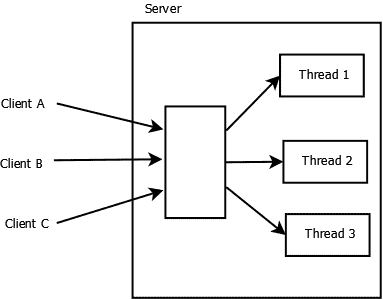
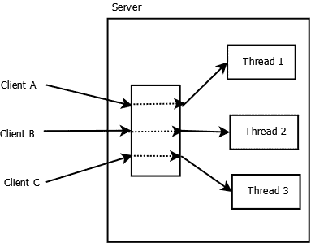
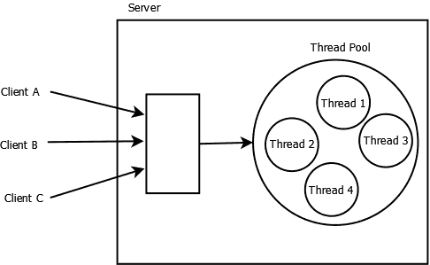

# 七、网络可扩展性

网络可伸缩性关注的是如何构建应用程序，使其能够随着对应用程序的需求增加而调整以应对压力。需求的形式可能是更多的用户、更多的请求、更复杂的请求以及网络特性的变化。

以下列出了几个值得关注的领域：

*   服务器容量
*   多线程
*   网络带宽和延迟
*   执行环境

通过添加更多服务器、使用适当数量的线程、提高执行环境的性能以及增加网络带宽以消除瓶颈，可以实现可伸缩性。

添加更多服务器将有助于实现服务器之间的负载平衡。但是，如果网络带宽或延迟是问题所在，那么这将不会有多大帮助。可以通过网络管道推送的量非常有限。

线程经常被用来提高系统的性能。为一个系统使用适当数量的线程允许一些线程在其他线程被阻塞时执行。被阻止的线程可能正在等待 IO 发生或等待用户响应。允许其他线程在某些线程被阻塞时执行可以提高应用程序吞吐量。

执行环境包括底层硬件、操作系统、JVM 和应用程序本身。这些领域中的每一个都是有待改进的领域。我们将不讨论硬件环境，因为这超出了我们的控制范围。操作系统也是如此。虽然可以实现一些性能改进，但我们不会涉及这些方面。将识别可能影响网络性能的 JVM 参数。

我们将研究代码改进的机会。我们大部分的讨论都是关于线程的使用，因为我们对这个架构特性有更多的控制。在本章中，我们将说明几种提高应用程序可伸缩性的方法。这些措施包括：

*   多线程服务器
*   线程池
*   期货和可赎回债券
*   选择器（TCP/UDP）

我们将探讨使用简单线程/池的细节，因为您在工作中可能会遇到它们，并且由于平台限制，可能无法使用某些较新的技术。线程池提供了在许多情况下重用线程的优势。Futures 和 callables 是一种线程变体，可以从线程传递和返回数据。选择器允许单个线程处理多个通道。

# 多线程服务器概述

多线程服务器的主要优点是，长时间运行的客户端请求不会阻止服务器接受其他客户端请求。如果未创建新线程，则将处理当前请求。只有在处理了请求之后，才能接受新的请求。对请求使用单独的线程意味着可以同时处理连接及其关联的请求。

使用多线程服务器时，有以下几种方式配置线程：

*   每个请求的线程数
*   每个连接的线程数
*   每个对象的线程数

在每个请求线程模型中，到达服务器的每个请求都被分配一个新线程。虽然这是一种简单的方法，但它会导致创建大量线程。此外，每个请求通常意味着将创建一个新连接。

此模型在不需要保留以前的客户端请求的环境中运行良好。例如，如果服务器的唯一目的是响应特定股票报价的请求，那么线程不需要知道以前的任何请求。

下图说明了这种方法。发送到服务器的每个客户端请求都被分配给一个新线程。



在每线程连接模型中，客户端连接在会话期间保持。会话由一系列请求和响应组成。通过特定命令或在超时时间过后终止会话。这种方法允许在请求之间维护状态信息。

下图说明了这种方法。虚线表示来自同一客户端的多个请求由同一线程处理。



“每个对象线程”方法将关联的请求与可以处理该请求的特定对象排队。对象及其方法放置在一个线程中，该线程一次处理一个请求。请求与线程一起排队。虽然我们在这里不演示这种方法，但它通常用于线程池。

创建和删除连接的过程可能非常昂贵。如果一个客户端提交了多个请求，那么打开和关闭一个连接就变得昂贵，应该避免。

为了解决线程过多的问题，经常使用线程池。当需要处理请求时，该请求被分配给现有的未使用线程来处理该请求。一旦发送了响应，线程就可以用于其他请求。这假定不需要维护状态信息。

# 每个请求的线程方法

在[第一章](1.html "Chapter 1. Getting Started with Network Programming")*网络编程入门*中，我们介绍了一个简单的多线程 echo 服务器。这里介绍了这个 Ty4Ty 方法，为本章其余部分中的线程的使用提供了基础。

## 每个请求服务器的线程数

在本例中，当给定零件名称时，服务器将接受价格请求。实现将使用支持并发访问部件名称和价格的`ConcurrentHashMap`类。在多线程环境中，并发数据结构（如`ConcurrentHashMap`类）处理操作而不会导致数据损坏。此外，此映射是缓存的一个示例，它有助于提高应用程序的性能。

我们从服务器声明开始，如下所示。映射声明为静态，因为服务器只需要一个实例。静态初始化块初始化映射。`main`方法将使用`ServerSocket`类接受来自客户端的请求。将采用`run`方法进行处理。`clientSocket`变量将保存对客户端套接字的引用：

```java
public class SimpleMultiTheadedServer implements Runnable {
    private static ConcurrentHashMap<String, Float> map;
    private Socket clientSocket;

    static {
        map = new ConcurrentHashMap<>();
        map.put("Axle", 238.50f);
        map.put("Gear", 45.55f);
        map.put("Wheel", 86.30f);
        map.put("Rotor", 8.50f);
    }

    SimpleMultiTheadedServer(Socket socket) {
        this.clientSocket = socket;
    }

    public static void main(String args[]) {
        ...
    }

    public void run() {
        ...
    }
}
```

`main`方法如下：服务器套接字等待客户端请求，然后创建一个新线程，将客户端套接字传递给线程进行处理。将显示消息，显示正在接受的连接：

```java
    public static void main(String args[]) {
        System.out.println("Multi-Threaded Server Started");
        try {
            ServerSocket serverSocket = new ServerSocket(5000);
            while (true) {
                System.out.println(
                    "Listening for a client connection");
                Socket socket = serverSocket.accept();
                System.out.println("Connected to a Client");
                new Thread(new 
                    SimpleMultiTheadedServer(socket)).start();
            }
        } catch (IOException ex) {
            ex.printStackTrace();
        }
        System.out.println("Multi-Threaded Server Terminated");
    }
```

`run`方法处理请求，如下所示。从客户端套接字获取输入流，并读取部件名称。地图的`get`方法使用此名称检索价格。输入流将价格发送回客户端，并显示操作的进度：

```java
    public void run() {
        System.out.println("Client Thread Started");
        try (BufferedReader bis = new BufferedReader(
                new InputStreamReader(
                    clientSocket.getInputStream()));
             PrintStream out = new PrintStream(
                clientSocket.getOutputStream())) {

            String partName = bis.readLine();
            float price = map.get(partName);
            out.println(price);
            NumberFormat nf = NumberFormat.getCurrencyInstance();
            System.out.println("Request for " + partName
                    + " and returned a price of "
                    + nf.format(price));

            clientSocket.close();
            System.out.println("Client Connection Terminated");
        } catch (IOException ex) {
            ex.printStackTrace();
        }
        System.out.println("Client Thread Terminated");
    }
```

现在，让我们为服务器开发一个客户端。

## 每个请求客户端的线程数

客户端应用程序，如下面所示，将连接到服务器，发送请求，等待响应，然后显示价格。对于本例，客户端和服务器位于同一台计算机上：

```java
public class SimpleClient {

    public static void main(String args[]) {
        System.out.println("Client Started");
        try {
            Socket socket = new Socket("127.0.0.1", 5000);
            System.out.println("Connected to a Server");
            PrintStream out = 
                new PrintStream(socket.getOutputStream());
            InputStreamReader isr = 
                new InputStreamReader(socket.getInputStream());
            BufferedReader br = new BufferedReader(isr);

            String partName = "Axle";
            out.println(partName);
            System.out.println(partName + " request sent");
            System.out.println("Response: " + br.readLine());
                        socket.close();
        } catch (IOException ex) {
            ex.printStackTrace();
        }
        System.out.println("Client Terminated");
    }
}
```

现在，让我们看看客户端和服务器是如何交互的。

## 每个请求的线程应用程序正在运行

首先启动服务器，将显示以下输出：

**多线程服务器启动**

**正在侦听客户端连接**

接下来，启动客户端应用程序。将显示以下输出：

**客户端启动**

**连接到服务器**

**已发送车轴请求**

**回复：238.5**

**客户终止**

然后，服务器将显示以下输出。您将注意到，**客户端线程启动**输出跟随**监听客户端连接**输出。这是因为在线程开始之前有一点延迟：

**已连接到客户端**

**正在侦听客户端连接**

**客户端线程已启动**

**请求购买车轴，并返回 238.50 美元的价格**

**客户端连接终止**

**客户端线程终止**

客户端线程启动、处理请求，然后终止。

在关闭操作之前向客户端应用程序添加以下代码，以向服务器发送第二个价格请求：

```java
            partName = "Wheel";
            out.println(partName);
            System.out.println(partName + " request sent");
            System.out.println("Response: " + br.readLine());
```

当客户端被执行时，您将得到以下输出。第二个字符串的响应为 null。这是因为服务器的响应线程在第一个请求得到响应后已终止：

**客户端启动**

**连接到服务器**

**已发送车轴请求**

**回复：238.5**

**已发送车轮请求**

**应答：空**

**客户终止**

要使用此方法处理多个请求，您需要重新打开连接并发送单独的请求。下面的代码说明了这种方法。删除发送第二个请求的代码段。在套接字关闭后向客户端添加以下代码。在此顺序中，套接字将重新打开，IO 流将重新创建，消息将重新发送：

```java
            socket = new Socket("127.0.0.1", 5000);
            System.out.println("Connected to a Server");
            out = new PrintStream(socket.getOutputStream());
            isr = new InputStreamReader(socket.getInputStream());
            br = new BufferedReader(isr);

            partName = "Wheel";
            out.println(partName);
            System.out.println(partName + " request sent");
            System.out.println("Response: " + br.readLine());
            socket.close();
```

执行客户端时，它将生成以下输出，反映两个请求及其响应：

**客户端启动**

**连接到服务器**

**已发送车轴请求**

**回复：238.5**

**连接到服务器**

**已发送车轮请求**

**回复：86.3**

**客户终止**

在服务器端，我们将获得以下输出。创建了两个线程来处理请求：

**多线程服务器启动**

**正在侦听客户端连接**

**已连接到客户端**

**正在侦听客户端连接**

**客户端线程已启动**

**已连接到客户端**

**正在侦听客户端连接**

**客户端线程已启动**

**请求购买车轴，并返回 238.50 美元的价格**

**客户端连接终止**

**客户端线程终止**

**请求购买车轮并返回 86.30 美元的价格**

**客户端连接终止**

**客户端线程终止**

打开和关闭连接可能会很昂贵。在下一节中，我们将讨论这类问题。但是，如果只发出一个请求，那么每个请求的线程都可以工作。

# 每个连接方法的螺纹

在这种方法中，使用一个单线程来处理客户端的所有请求。这种方法将要求客户端发送某种通知，表示它没有进一步的请求。可能需要设置超时来代替显式通知，以便在经过足够的时间后自动断开客户端。

## 每个连接服务器的线程数

修改服务器的`run`方法，注释掉处理请求并将响应发送到客户端的大部分 try 块。将其替换为以下代码。在无限循环中，读取命令请求。如果请求为`quit`，则退出循环。否则，请求的处理方式与之前相同：

```java
            while(true) {
                String partName = bis.readLine();
                if("quit".equalsIgnoreCase(partName)) {
                    break;
                }
                float price = map.get(partName);
                out.println(price);
                NumberFormat nf = 
                    NumberFormat.getCurrencyInstance();
                System.out.println("Request for " + partName
                        + " and returned a price of "
                        + nf.format(price));
            } 
```

这就是服务器中需要修改的全部内容。

## 每个连接客户端的线程数

在客户端，在创建缓冲读卡器后，用以下代码替换代码。这将向服务器发送三个请求：

```java
            String partName = "Axle";
            out.println(partName);
            System.out.println(partName + " request sent");
            System.out.println("Response: " + br.readLine());

            partName = "Wheel";
            out.println(partName);
            System.out.println(partName + " request sent");
            System.out.println("Response: " + br.readLine());

            partName = "Quit";
            out.println(partName);
            socket.close();
```

仅为所有三个请求打开一个连接。

## 每个连接的线程应用程序正在运行

当客户端执行时，您将得到以下输出：

**客户端启动**

**连接到服务器**

**已发送车轴请求**

**回复：238.5**

**已发送车轮请求**

**回复：86.3**

**客户终止**

在服务器端，生成以下输出。您将注意到，只创建了一个线程来处理多个请求：

**多线程服务器启动**

**正在侦听客户端连接**

**已连接到客户端**

**正在侦听客户端连接**

**客户端线程已启动**

**请求购买车轴，并返回 238.50 美元的价格**

**请求购买车轮并返回 86.30 美元的价格**

**客户端连接终止**

**客户端线程终止**

当客户端发出多个请求时，这是一种更有效的体系结构。

# 线程池

当需要限制创建的线程数量时，线程池非常有用。使用池不仅可以控制创建线程的数量，而且还可以消除重复创建和销毁线程的需要，这通常是一项昂贵的操作。

下图描述了一个线程池。请求被分配给池中的线程。如果没有可用的未使用线程，某些线程池将创建新线程。其他人将限制可用线程的数量。这可能会导致某些请求被阻止。



我们将使用`ThreadPoolExecutor`类演示线程池。这个类还提供了传递线程执行状态信息的方法。

尽管`ThreadPoolExecutor`类拥有多个构造函数，`Executors`类提供了创建`ThreadPoolExecutor`类实例的简单方法。我们将演示其中两种方法。首先，我们将使用`newCachedThreadPool`方法。此方法创建的池将重用线程。需要时将创建新线程。但是，这可能会导致创建太多线程。第二种方法`newFixedThreadPool`创建一个固定大小的线程池。

## ThreadPoolExecutor 类特征

当创建此类的实例时，它将接受新任务，这些任务被传递到线程池。但是，池不会自动关闭。如果空闲，它将等待新任务提交。要终止池，需要调用`shutdown`或`shutdownNow`方法。后一种方法会立即关闭池，并且不会处理挂起的任务。

`ThreadPoolExecutor`类有许多提供附加信息的方法。例如，`getPoolSize`方法返回池中当前的线程数。`getActiveCount`方法返回活动线程数。`getLargestPoolSize`方法返回一次池中的最大线程数。还有其他几种可用的方法。

## 简单线程池服务器

我们将用于演示线程池的服务器在给定部件名称时将返回部件的价格。每个线程将访问保存零件信息的`ConcurrentHashMap`实例。我们使用哈希映射的并发版本，因为它可以从多个线程访问。

下一步将声明`ThreadPool`类。`main`方法使用`WorkerThread`类来执行实际工作。在`main`方法中，调用`newCachedThreadPool`方法创建线程池：

```java
public class ThreadPool {

    public static void main(String[] args) {
        System.out.println("Thread Pool Server Started");
        ThreadPoolExecutor executor = (ThreadPoolExecutor) 
            Executors.newCachedThreadPool();
        ...
        executor.shutdown();
        System.out.println("Thread Pool Server Terminated");
    }
}
```

接下来，使用 try 块捕获并处理可能发生的任何异常。在 try 块中，创建一个服务器套接字，其`accept`方法阻塞，直到请求客户端连接。建立连接后，使用客户端套接字创建`WorkerThread`实例，如下代码所示：

```java
        try {
            ServerSocket serverSocket = new ServerSocket(5000);
            while (true) {
                System.out.println(
                    "Listening for a client connection");
                Socket socket = serverSocket.accept();
                System.out.println("Connected to a Client");
                WorkerThread task = new WorkerThread(socket);
                System.out.println("Task created: " + task);
                executor.execute(task);
            }
        } catch (IOException ex) {
            ex.printStackTrace();
        }
```

现在，让我们检查下一个显示的`WorkerThread`类。`ConcurrentHashMap`实例被声明，其中字符串用作键，而存储的对象是一个 float。散列映射在静态初始值设定项块中初始化：

```java
public class WorkerThread implements Runnable {
    private static final ConcurrentHashMap<String, Float> map;
    private final Socket clientSocket;

    static {
        map = new ConcurrentHashMap<>();
        map.put("Axle", 238.50f);
        map.put("Gear", 45.55f);
        map.put("Wheel", 86.30f);
        map.put("Rotor", 8.50f);
    }
    ...
}
```

该类的构造函数将客户端套接字分配给`clientSocket`实例变量以供以后使用，如下所示：

```java
    public WorkerThread(Socket clientSocket) {
        this.clientSocket = clientSocket;
    }
```

`run`方法处理请求。从客户端套接字获取输入流，并用于获取部件名称。此名称用作哈希映射的`get`方法的参数，以获取相应的价格。此价格将发送回客户端，并显示一条消息，显示响应：

```java
    @Override
    public void run() {
        System.out.println("Worker Thread Started");
        try (BufferedReader bis = new BufferedReader(
                new InputStreamReader(
                    clientSocket.getInputStream()));
                PrintStream out = new PrintStream(
                        clientSocket.getOutputStream())) {

            String partName = bis.readLine();
            float price = map.get(partName);
            out.println(price);
            NumberFormat nf = NumberFormat.getCurrencyInstance();
            System.out.println("Request for " + partName
                    + " and returned a price of "
                    + nf.format(price));
            clientSocket.close();
            System.out.println("Client Connection Terminated");
        } catch (IOException ex) {
            ex.printStackTrace();
        }
        System.out.println("Worker Thread Terminated");
    }
```

我们现在准备讨论客户端应用程序。

## 简单线程池客户端

此应用程序使用`Socket`类建立与服务器的连接。输入和输出流用于发送和接收响应。该方法在[第 1 章](1.html "Chapter 1. Getting Started with Network Programming")、*网络编程入门*中进行了讨论。客户端应用程序如下所示。与服务器建立连接，并向服务器发送零件价格请求。获得并显示响应。

```java
public class SimpleClient {

    public static void main(String args[]) {
        System.out.println("Client Started");
        try (Socket socket = new Socket("127.0.0.1", 5000)) {
            System.out.println("Connected to a Server");
            PrintStream out = 
                new PrintStream(socket.getOutputStream());
            InputStreamReader isr = 
                new InputStreamReader(socket.getInputStream());
            BufferedReader br = new BufferedReader(isr);

            String partName = "Axle";
            out.println(partName);
            System.out.println(partName + " request sent");
            System.out.println("Response: " + br.readLine());
            socket.close();

        } catch (IOException ex) {
            ex.printStackTrace();
        }
        System.out.println("Client Terminated");
    }
}
```

我们现在准备看看他们是如何合作的。

## 线程池客户端/服务器正在运行

首先启动服务器应用程序。您将看到以下输出：

**线程池服务器启动**

**正在侦听客户端连接**

接下来，启动客户端。它将产生以下输出，其中发送车轴价格请求，然后收到响应`238.5`：

**客户端启动**

**连接到服务器**

**已发送车轴请求**

**回复：238.5**

**客户终止**

在服务器端，您将看到与以下输出类似的输出。创建线程，并显示请求和响应数据。然后线程终止。您将注意到线程的名称前面有字符串“packt”。这是应用程序包的名称：

**已连接到客户端**

**创建的任务：packt。WorkerThread@33909752**

**正在侦听客户端连接**

**工作线程已启动**

**请求购买车轴，并返回 238.50 美元的价格**

**客户端连接终止**

**工作线程终止**

如果启动第二个客户端，服务器将生成类似于以下客户端的输出。您将注意到，将为每个请求创建一个新线程：

**线程池服务器启动**

**正在侦听客户端连接**

**已连接到客户端**

**创建的任务：packt。WorkerThread@33909752**

**正在侦听客户端连接**

**工作线程已启动**

**请求购买车轴，并返回 238.50 美元的价格**

**客户端连接终止**

**工作线程终止**

**已连接到客户端**

**创建的任务：packt。WorkerThread@3d4eac69**

**正在侦听客户端连接**

**工作线程已启动**

**请求购买车轴，并返回 238.50 美元的价格**

**客户端连接****终止**

**工作线程终止**

## 可调用线程池

使用`Callable`和`Future`接口提供了另一种支持多线程的方法。`Callable`接口支持线程需要返回结果的线程。`Runnable`接口的`run`方法不返回值。对于某些线程，这可能是一个问题。`Callable`接口有一个方法`call`，返回一个值，可以使用代替`Runnable`接口。

`Future`接口与`Callable`对象结合使用。其思想是调用`call`方法，当前线程继续执行其他任务。当`Callable`对象完成时，使用`get`方法检索结果。如有必要，此方法将被阻止。

### 使用可调用的

我们将使用`Callable`接口来补充前面创建的`WorkerThread`类。与不同的是，我们将把零件名哈希映射放在`WorkerThread`类中，并将其移动到一个名为`WorkerCallable`的类中，在该类中我们将覆盖`call`方法以返回价格。这实际上是该应用程序的额外工作，但它说明了使用`Callable`接口的一种方法。它演示了如何从`Callable`对象返回值。

下面声明的`WorkerCallable`类使用相同的代码创建和初始化哈希映射：

```java
public class WorkerCallable implements Callable<Float> {

    private static final ConcurrentHashMap<String, Float> map;
    private String partName;

    static {
        map = new ConcurrentHashMap<>();
        map.put("Axle", 238.50f);
        map.put("Gear", 45.55f);
        map.put("Wheel", 86.30f);
        map.put("Rotor", 8.50f);
    }
    ...
}
```

构造函数将初始化部件名称，如下所示：

```java
    public WorkerCallable(String partName) {
        this.partName = partName;
    }
```

`call`方法如下所示。地图获取价格，我们显示价格，然后返回：

```java
    @Override
    public Float call() throws Exception {
        float price = map.get(this.partName);
        System.out.println("WorkerCallable returned " + price);
        return price;
    }
```

接下来，通过删除以下语句来修改`WorkerThread`类：

```java
        float price = map.get(partName);
```

将其替换为以下代码。使用客户端请求的部件名称创建新的`WorkerCallable`实例。立即调用`call`方法并返回相应部件的价格：

```java
        float price = 0.0f;
        try {
            price = new WorkerCallable(partName).call();
        } catch (Exception ex) {
            ex.printStackTrace();
        }
```

应用程序将产生与之前相同的输出，只是您将看到指示`WorkerCallable`类的`call`方法已执行的消息。当创建另一个线程时，我们将阻塞，直到`call`方法返回。

这个例子并没有充分展示这种方法的威力。`Future`接口将改进此技术。

### 利用未来

`Future`接口表示完成的`call`方法的结果。通过这个接口，我们可以调用一个`Callable`对象，而不必等待它返回。假设计算零件价格的过程比在表格中查找更复杂。可以想象，计算价格可能需要多个步骤，每个步骤都可能涉及，可能需要一些时间才能完成。还假设这些单独的步骤可以同时执行。

用以下代码替换前面的示例。我们创建一个新的`ThreadPoolExecutor`实例，我们将为其分配两个`Callable`对象，表示一个两步价格确定过程。这是使用返回一个`Future`实例的`submit`方法完成的。`call`方法的实现分别返回`1.0` 和`2.0`，以保持示例的简单性：

```java
        float price = 0.0f;
        ThreadPoolExecutor executor = (ThreadPoolExecutor) 
            Executors.newCachedThreadPool();
        Future<Float> future1 = 
                executor.submit(new Callable<Float>() {
            @Override
            public Float call() {
                // Compute first part
                return 1.0f;
            }
        });
        Future<Float> future2 = 
                executor.submit(new Callable<Float>() {
            @Override
            public Float call() {
                // Compute second part
                return 2.0f;
            }
        });
```

接下来，添加下面的 try 块，它使用`get`方法获得价格的两部分。这些用于确定零件的价格。如果对应的`Callable`对象未完成，则`get`方法将阻塞：

```java
            try {
                Float firstPart = future1.get();
                Float secondPart = future2.get();
                price = firstPart + secondPart;
            } catch (InterruptedException|ExecutionException ex) {
                ex.printStackTrace();
            }
```

当执行此代码时，您将获得零件 3.0 的价格。`Callable`和`Future`接口的组合提供了一种易于使用的方法来处理返回值的线程。

# 使用 HttpServer 执行器

我们在[第 4 章](4.html "Chapter 4. Client/Server Development")、*客户端/服务器开发*中介绍了`HTTPServer`类。当 HTTP 服务器收到请求时，默认情况下，它使用在调用`start`方法时创建的线程。但是，也可以使用不同的线程。`setExecutor`方法指定如何将这些请求分配给线程。

此方法的参数是一个`Executor`对象。对于这个参数，我们可以使用几种实现中的任何一种。按照以下顺序，使用缓存线程池：

```java
        server.setExecutor(Executors.newCachedThreadPool());
```

为了控制服务器使用的线程数量，我们可以使用大小为`5`的固定线程池，如下所示：

```java
        server.setExecutor(Executors.newFixedThreadPool(5));
```

必须先调用此方法，然后才能调用`HTTPServer`的`start`方法。然后将所有请求提交给执行人。以下是从[第 4 章](4.html "Chapter 4. Client/Server Development")、*客户端/服务器开发*中开发的`HTTPServer`类复制而来，并向您展示了`setExecutor`方法的使用：

```java
public class MyHTTPServer {

    public static void main(String[] args) throws Exception {
        System.out.println("MyHTTPServer Started");
        HttpServer server = HttpServer.create(
            new InetSocketAddress(80), 0);
        server.createContext("/index", new OtherHandler());
        server.setExecutor(Executors.newCachedThreadPool());
        server.start();
    }
    ...
}
```

服务器将以与以前相同的方式执行，但它将使用缓存线程池。

# 使用选择器

选择器用于 NIO 应用程序，允许一个线程处理多个通道。选择器协调多个通道及其事件。它标识那些准备好处理的通道。如果每个通道使用一个线程，那么我们会发现自己经常在线程之间切换。这种切换过程可能很昂贵。使用单个线程处理多个通道可以避免一些这种开销。

下图描述了此体系结构。线程在选择器中注册。选择器将识别准备好处理的通道和事件。


选择器由两个主类支持：

*   `Selector`：提供主要功能
*   `SelectionKey`：标识准备处理的事件类型

要使用选择器，请执行以下操作：

*   创建一个选择器
*   向选择器注册通道
*   选择一个可用的频道

让我们更详细地检查这些步骤中的每一步。

## 创建选择器

无公共`Selector`施工人员。要创建一个`Selector`对象，请使用静态`open`方法，如下所示：

```java
    Selector selector = Selector.open();
```

还有一种`isOpen`方法用于确定选择器是否打开，还有一种`close`方法用于在不再需要时关闭选择器。

## 注册频道

`register`方法向选择器注册通道。向选择器注册的任何通道都必须处于非阻塞模式。例如，`FileChannel`对象无法注册，因为无法将其置于非阻塞模式。使用以`false`为参数的`configureBlocking`方法将通道置于非阻塞模式，如下所示：

```java
    socketChannel.configureBlocking(false);
```

`register`方法如下。这是`ServerSocketChannel`和 SocketChannel 类的方法。在以下示例中，它与`SocketChannel``instance`一起使用：

```java
    socketChannel.register(selector, SelectionKey.OP_WRITE, null);
```

`Channel`类的`register`方法有三个参数：

*   要注册的选择器
*   感兴趣的事件类型
*   要与通道关联的数据

事件类型指定应用程序感兴趣处理的通道事件的类型。例如，我们可能只希望在通道具有准备好读取的数据时收到事件通知。

下表列出了四种可用的事件类型：

<colgroup><col style="text-align: left"> <col style="text-align: left"> <col style="text-align: left"></colgroup> 
| 

类型

 | 

事件类型常量

 | 

意思

 |
| --- | --- | --- |
| 连接 | `SelectionKey.OP_CONNECT` | 这表示通道已成功连接到服务器 |
| 接受 | `SelectionKey.OP_ACCEPT` | 这表示服务器套接字通道已准备好接受来自客户端的连接请求 |
| 阅读 | `SelectionKey.OP_READ` | 这表示通道已准备好读取数据 |
| 写 | `SelectionKey.OP_WRITE` | 这表示通道已准备好进行写入操作 |

这些类型被称为兴趣集。在下面的语句中，通道与读取兴趣类型相关联。该方法返回一个`SelectionKey`实例，其中包含许多有用的属性：

```java
    SelectionKey key = channel.register(selector, 
        SelectionKey.OP_READ);
```

如果有多个感兴趣的事件，那么我们可以使用 OR 运算符创建这些事件的组合，如下所示：

```java
    int interestSet = SelectionKey.OP_READ | 
        SelectionKey.OP_WRITE;
    SelectionKey key = channel.register(selector, interestSet);
```

`SelectionKey`类具有几个属性，这些属性有助于处理通道。这些措施包括：

*   **兴趣集**：此包含感兴趣的事件。
*   **就绪集**：这是通道准备处理的操作集。
*   **频道**：`channel`方法返回与选择键关联的频道。
*   **选择器**：`selector`方法返回与选择键关联的选择器。
*   **附着物**：进一步信息可以通过`attach`方式进行附着。`attachment`方法稍后用于访问此对象。

`interestOps`方法返回一个表示感兴趣事件的整数，如下所示：

```java
    int interestSet = selectionKey.interestOps();
```

我们将使用它来处理事件。

要确定哪些事件已准备就绪，我们可以使用以下任何方法：

*   `readOps`：返回一个包含就绪事件的整数
*   `isAcceptable`：表示接受事件准备就绪
*   `isConnectable`：表示连接事件准备就绪
*   `isReadable`：表示读取事件已准备就绪
*   `isWritable`：表示写入事件已准备就绪

现在，让我们看看这些方法的实际应用。

## 使用选择器支持时间客户端/服务器

我们将开发一个时间服务器来演示`Selector`类和相关类的使用。此服务器和时间客户端改编自[第 3 章](3.html "Chapter 3. NIO Support for Networking")*NIO 网络支持*中的时间服务器和客户端应用程序。这里的重点是选择器的使用。这里不讨论通道和缓冲区操作，因为前面已经讨论过。

### 频道时间服务器

时间服务器将接受与客户端应用程序的连接，并每秒向客户端发送当前日期和时间。当我们讨论客户端时会发现，客户端可能不会收到所有这些消息。

时间服务器使用内部静态类`SelectorHandler`来处理选择器并发送消息。此类实现了`Runnable`接口，并将成为选择器的线程。

在`main`方法中，服务器套接字接受新的通道连接并向选择器注册它们。`Selector`对象被声明为静态实例变量，如下所示。这允许从`SelectorHandler`线程和主应用程序线程访问它。共享此对象将导致潜在的同步问题，我们将解决这些问题：

```java
public class ServerSocketChannelTimeServer {
    private static Selector selector;

    static class SelectorHandler implements Runnable {
        ...
    }

    public static void main(String[] args) {
        ...
    }
}
```

让我们从`main`方法开始。已创建使用端口`5000`的服务器套接字通道。异常被捕获在 try 块中，如下所示：

```java
    public static void main(String[] args) {
        System.out.println("Time Server started");
        try {
            ServerSocketChannel serverSocketChannel = 
                ServerSocketChannel.open();
            serverSocketChannel.socket().bind(
                new InetSocketAddress(5000));
            ...
            }
        } catch (ClosedChannelException ex) {
            ex.printStackTrace();
        } catch (IOException ex) {
            ex.printStackTrace();
        }
    }
```

创建选择器并启动`SelectorHandler`实例的线程：

```java
            selector = Selector.open();
            new Thread(new SelectorHandler()).start();
```

无限循环将接受新连接。将显示一条消息，指示已建立连接：

```java
            while (true) {
                SocketChannel socketChannel
                        = serverSocketChannel.accept();
                System.out.println("Socket channel accepted - " 
                    + socketChannel);
                ...
            }
```

有了好的通道，调用`configureBlocking`方法，唤醒选择器，并向选择器注册通道。螺纹可能会被`select`方法堵塞。使用`wakeup`方法会导致`select`方法立即返回，从而允许`register`方法解锁：

```java
                if (socketChannel != null) {
                    socketChannel.configureBlocking(false);
                    selector.wakeup();
                    socketChannel.register(selector, 
                        SelectionKey.OP_WRITE, null);
                }
```

一旦向选择器注册了通道，我们就可以开始处理与该通道关联的事件。

`SelectorHandler`类将使用选择器对象在事件发生时识别事件，并将其与特定通道关联。它的`run`方法完成了所有工作。如下图所示，无限循环使用`select`方法在事件发生时识别事件。`select`方法使用一个参数`500`，该参数指定了 500 毫秒的超时时间。它返回一个整数，指定准备处理的键数：

```java
    static class SelectorHandler implements Runnable {

        @Override
        public void run() {
            while (true) {
                try {
                    System.out.println("About to select ...");
                    int readyChannels = selector.select(500);
                    ...
                } catch (IOException | InterruptedException ex) {
                    ex.printStackTrace();
                }
            }
        }
    }
```

如果`select`方法超时，则返回`0`值。发生这种情况时，我们会显示一条消息，如下所示：

```java
        if (readyChannels == 0) {
            System.out.println("No tasks available");
        } else {
            ...
        }
```

如果有钥匙准备就绪，`selectedKeys`方法将返回此集合。然后使用迭代器一次处理一个键：

```java
        Set<SelectionKey> keys = selector.selectedKeys();
        Iterator<SelectionKey> keyIterator = keys.iterator();
        while (keyIterator.hasNext()) {
            ...
        }
```

检查每个`SelectionKey`实例，查看发生了哪种事件类型。在下面的实现中，只处理可写事件。处理后，线程休眠一秒钟。这将导致日期和时间消息的发送延迟至少一秒钟。需要使用`remove`方法删除迭代器列表中的事件：

```java
            SelectionKey key = keyIterator.next();
            if (key.isAcceptable()) {
                // Connection accepted
            } else if (key.isConnectable()) {
                // Connection established
            } else if (key.isReadable()) {
                // Channel ready to read
            } else if (key.isWritable()) {
                ...
            }
            Thread.sleep(1000);
            keyIterator.remove();
```

如果是可写事件，则发送日期和时间，如下所示。`channel`方法返回事件的通道，并将消息发送到该客户端。此时会显示一条信息，表明该信息已发送：

```java
            String message = "Date: "
                + new Date(System.currentTimeMillis());

            ByteBuffer buffer = ByteBuffer.allocate(64);
            buffer.put(message.getBytes());
            buffer.flip();
            SocketChannel socketChannel = null;
            while (buffer.hasRemaining()) {
                socketChannel = (SocketChannel) key.channel();
                socketChannel.write(buffer);
            }
            System.out.println("Sent: " + message + " to: " 
                + socketChannel);
```

服务器就绪后，我们将开发客户端应用程序。

### 客户端应用程序的日期和时间

客户端应用程序与[第 3 章](3.html "Chapter 3. NIO Support for Networking")*网络 NIO 支持*中开发的应用程序几乎相同。主要区别在于，它将以随机间隔请求数据和时间。当我们在服务器上使用多个客户端时，就会看到这种效应。该应用程序的实现如下所示：

```java
public class SocketChannelTimeClient {

    public static void main(String[] args) {
        Random random = new Random();
        SocketAddress address = 
            new InetSocketAddress("127.0.0.1", 5000);
        try (SocketChannel socketChannel = 
                SocketChannel.open(address)) {
            while (true) {
                ByteBuffer byteBuffer = ByteBuffer.allocate(64);
                int bytesRead = socketChannel.read(byteBuffer);
                while (bytesRead > 0) {
                    byteBuffer.flip();
                    while (byteBuffer.hasRemaining()) {
                        System.out.print((char) byteBuffer.get());
                    }
                    System.out.println();
                    bytesRead = socketChannel.read(byteBuffer);
                }
                Thread.sleep(random.nextInt(1000) + 1000);
            }
        } catch (ClosedChannelException ex) {
            // Handle exceptions
        }catch (IOException | InterruptedException ex) {
            // Handle exceptions
        } 
    }
}
```

我们现在准备看看服务器和客户端是如何协同工作的。

### 服务器/客户端运行的日期和时间

首先，启动服务器。它将产生以下输出：

**服务器启动时间**

**即将选择。。。**

**没有可用的任务**

**即将选择。。。**

**没有可用的任务**

**即将选择。。。**

**没有可用的任务**

**。。。**

此序列将重复自身，直到客户端连接到服务器。

接下来，启动客户端。在客户端，您将获得与以下类似的输出：

**日期：2015 年 10 月 7 日星期三 17:55:43**

**日期：2015 年 10 月 7 日星期三 17:55:45**

**日期：2015 年 10 月 7 日星期三 17:55:47**

**日期：2015 年 10 月 7 日星期三 17:55:49**

在服务器端，您将看到反映连接和请求的输出，如下所示。您将注意到端口号`58907`标识了该客户端：

**。。。**

**发送日期：2015 年 10 月 7 日星期三 17:55:43 CDT 发送至：java.nio.channels.SocketChannel[connected local=/127.0.0.1:5000 remote=/127.0.0.1:58907]**

**。。。**

**发送日期：2015 年 10 月 7 日星期三 17:55:45 CDT 发送至：java.nio.channels.SocketChannel【已连接本地=/127.0.0.1:5000 远程=/127.0.0.1:58907】**

启动第二个客户端。您将看到类似的连接消息，但端口号不同。下面一条可能的连接消息显示端口号为`58908`的客户端：

**接受套接字通道-java.nio.channels.SocketChannel[连接的本地=/127.0.0.1:5000 远程=/127.0.0.1:58908]**

然后，您将看到向两个客户端发送的日期和时间消息。

# 处理网络超时

在现实世界中部署应用程序时，可能会出现在 LAN 上开发此应用程序时不存在的新网络问题。网络拥塞、连接速度慢和网络链路丢失等问题可能会导致消息延迟或丢失。检测和处理网络超时非常重要。

有几个插座选项，可以对插座通信进行一些控制。`SO_TIMEOUT`选项用于设置读取操作的超时。如果经过指定的时间量，则会引发`SocketTimeoutException`异常。

在以下语句中，套接字将在三秒钟后过期：

```java
    Socket socket = new ...
    socket.setSoTimeout(3000);
```

必须在发生阻塞读取操作之前设置该选项。零超时永远不会超时。处理超时是一个重要的设计考虑因素。

# 总结

在本章中，我们研究了几种解决应用程序可伸缩性的方法。可伸缩性是指应用程序能够补偿增加的负载。虽然我们的示例侧重于将这些技术应用于服务器，但它们同样适用于客户端。

我们介绍了三种线程体系结构，重点介绍了其中两种：每个请求的线程和每个连接的线程。每个请求线程模型为到达服务器的每个请求创建一个新线程。这适用于客户端一次发出一个或几个请求的情况。

每个连接的线程模型将创建一个线程来处理来自客户端的多个请求。这避免了必须多次重新连接到客户端以及必须承担创建多个线程的成本。这种方法适用于需要维护会话和状态信息的客户端。

线程池支持一种避免创建和销毁线程的方法。线程集合由线程池管理。未被使用的线程可以针对不同的请求重新调整用途。线程池的大小可以控制，因此可以根据应用程序和环境的要求进行限制。`Executor`类用于创建和管理线程池。

NIO 的`Selector`课程进行了说明。这个类使得使用线程和 NIO 通道更容易。使用选择器注册通道和通道相关事件。当发生某个事件（如通道可用于读取操作）时，选择器提供对通道和事件的访问。这允许单个线程管理多个通道。

我们简要地重新检查了[第 4 章](4.html "Chapter 4. Client/Server Development")、*客户端/服务器开发*中介绍的`HttpServer`类。我们演示了添加线程池以提高服务器性能是多么容易。我们还研究了网络超时的性质以及如何处理它们。当网络无法支持应用程序之间的及时通信时，可能会发生这种情况。

在下一章中，我们将探讨网络安全威胁以及如何应对这些威胁。