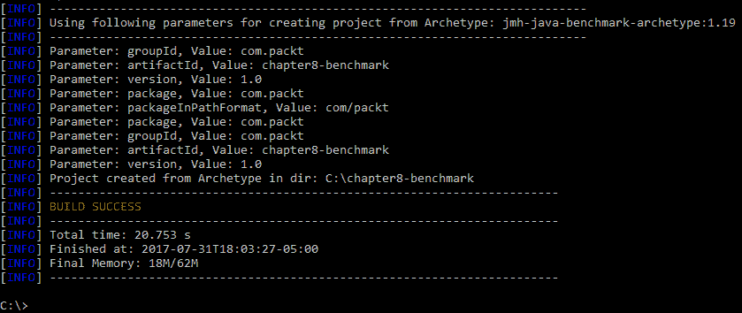
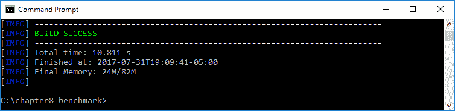
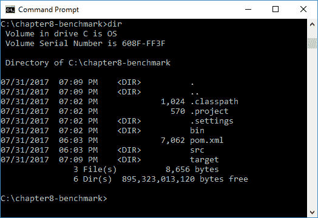
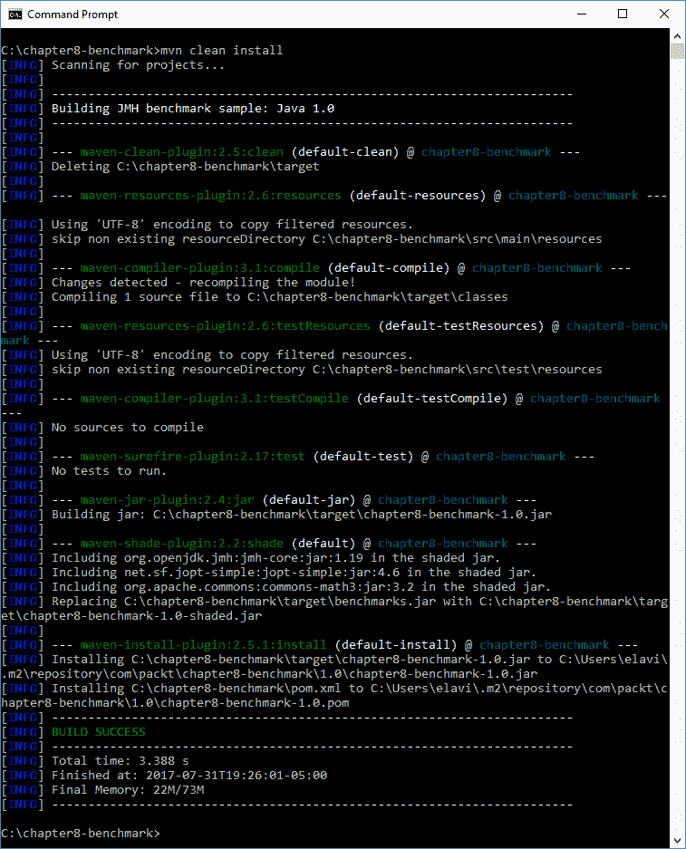
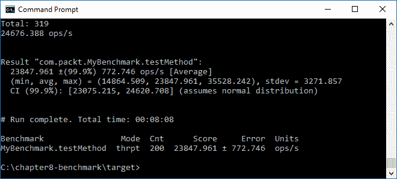

# 八、JMH 的微基准应用

在上一章中，我们深入回顾了垃圾收集，包括对象生命周期、垃圾收集算法、垃圾收集选项以及与垃圾收集相关的方法。我们简要介绍了 Java8 中垃圾收集的升级，重点介绍了新 Java 平台的变化。我们对 Java11 中的垃圾收集的探索包括：默认垃圾收集、废弃的垃圾收集组合、统一的垃圾收集日志记录以及持久存在的垃圾收集问题。

在本章中，我们将研究如何使用 **Java 微基准线束**（**JMH**）编写性能测试，这是一个用于编写 JVM 基准测试的 Java 线束库。我们将使用 Maven 和 JMH 来帮助说明使用新 Java 平台进行微标记的威力。

具体来说，我们将讨论以下主题：

*   微基准概述
*   Maven 微基准
*   基准选择
*   避免微基准陷阱的技术

# 技术要求

本章以 Java11 为特色，Java 平台的**标准版**（**SE**）可从 [Oracle 官方下载网站](http://www.oracle.com/technetwork/java/javase/downloads/index.html)下载。

IDE 包就足够了。来自 JetBrains 的 IntelliJ IDEA 用于与本章和后续章节相关的所有编码。IntelliJ IDEA 的社区版可从[网站](https://www.jetbrains.com/idea/features/)下载。

本章的源代码可以在 [GitHub 的 URL](https://github.com/PacktPublishing/Mastering-Java-11-Second-Edition) 上找到。

# 微基准概述

微基准是用来测试系统性能的。这与宏观基准测试不同，后者在不同的平台上运行测试，以进行效率比较和后续分析。使用微标记，我们通常针对一个系统上的特定代码片段，例如方法或循环。微基准的主要目的是在我们的代码中识别优化机会。

基准测试有多种方法；我们将重点介绍如何使用 JMH 工具？开发人员并不总是关心性能问题，除非性能是一个明确的要求。这可能会导致部署后的意外情况，如果将微基准作为开发过程的一部分进行，则可以避免这些意外情况。

微基准发生在一个过程的几个阶段。如下图所示，流程包括设计、实现、执行、分析和增强：


微基准过程阶段

在**设计**阶段，我们确定了我们的目标并设计了相应的微基准；在**实现**阶段，我们编写了微基准，然后在**执行**阶段，我们实际运行了测试。在**分析**阶段，我们利用手中的微标记结果对结果进行了解释和分析。这导致了**增强**阶段的代码改进。一旦我们的代码被更新，我们就重新设计微基准测试，调整实现，或者直接进入**执行**阶段。这是一个循环的过程，一直持续到我们实现目标中确定的性能优化为止。

# 使用 JMH 的方法

Oracle 的文档表明，最理想的 JMH 用例是使用依赖于应用 JAR 文件的 Maven 项目。他们进一步建议微标记通过命令行进行，而不是从 IDE 中进行，因为这可能会影响结果。

Maven，也称为 ApacheMaven，是一个项目管理和理解工具，我们可以使用它来管理我们的应用项目构建、报告和文档。

为了使用 JMH，我们将使用字节码处理器（注解）来生成基准代码。

为了测试 JMH，您必须有一个支持 Maven 的 IDE 和您正在使用的 Java 版本。如果您还没有 Java11 或支持 Java11 的 IDE，可以按照下一节中的步骤操作。

# 安装 Java 和 Eclipse

您可以从 [JDK11 早期访问构建页面](http://jdk.java.net/11/)下载并安装。

一旦安装了 Java11，请下载最新版本的 Eclipse。在写这本书的时候，那是氧气。[这是相关链接](https://www.eclipse.org/downloads/)。

# 动手实验

现在我们已经安装了 EclipseOxygen，您可以运行一个快速测试来确定 JMH 是否在您的开发计算机上工作。首先创建一个新的 Maven 项目，如以下屏幕截图所示：


新 Maven 项目

接下来，我们需要添加一个依赖项。我们可以用以下代码直接编辑`pom.xml`文件：

```java
<dependency>
  <groupId>org.openjdk.jmh</groupId>
```

```java
  <artifactId>jmh-core</artifactId>
  <version>0.1</version>
</dependency>
```

或者，我们可以单击添加。。。按钮，以在对话框窗口中输入数据，如下面的屏幕截图所示。使用此表单用前面的代码更新`pom.xml`文件：


依赖项选择

接下来，我们需要编写一个包含 JMH 方法的类。这只是确认我们最近更新的开发环境的初始测试。以下是可用于测试的示例代码：

```java
package com.packt.benchmark.test.com.packt.benchmark.test;
import org.openjdk.jmh.Main;

public class Test {
  public static void main(String[] args) {
    Main.main(args);
  }
}
```

我们现在可以编译和运行我们非常简单的测试程序。结果在控制台选项卡中提供，如果使用命令行，则在实际控制台中提供。以下是您将看到的内容：


JMH 测试结果

# Maven 微基准

开始使用 JMH 的一种方法是使用 JMHMaven 原型。第一步是创建一个新的 JMH 项目。在我们系统的命令提示符下，我们将输入`mvn`命令，然后输入一组长参数，以创建一个新的 Java 项目和必要的 Maven`pom.xml`文件：

```java
mvn archetype:generate -DinteractiveMode=false -DarchetypeGroupId=org.openjdk.jmh -DarchetypeArtifactId=jmh-java-benchmark-archetype -DgroupId=com.packt -DartifactId=chapter8-benchmark -Dversion=1.0
```

一旦您输入`mvn`命令和前面的详细参数，您将看到通过终端向您报告的结果。根据您的使用级别，您可能会看到大量来自[这个页面](https://repo.maven.apache.org/maven2/org/apache/maven/plugins/)的下载和其他类似的存储库站点。

您还将看到一个信息部分，通知您项目构建过程，如以下屏幕截图所示：


Maven 构建过程

可能会有额外的插件和从[这个页面](https://repo.maven.apache.org)下载的其他资源仓库。然后，您将看到一个信息反馈组件，它让您知道项目是以批处理模式生成的，如下所示：


Maven 项目生成

最后，您将看到一组参数，并注意到您的项目构建是成功的。正如您在下面的示例中所看到的，该过程用了不到 21 秒的时间完成：



新 Maven 项目

我们将根据`-DartifactId`选项中包含的参数创建一个文件夹，在我们的示例中，我们使用了`-DartifactId=chapter8-benchmark`，Maven 创建了一个`chapter8-benchmark`项目文件夹，如下所示：


基准项目文件夹

您将看到 Maven 创建了`pom.xml`文件以及一个源（`src`文件夹。在该文件夹中，`C:\chapter8-benchmark\src\main\java\com\packt`的子目录结构下是`MyBenchmark.java`文件。Maven 为我们创建了一个基准类，如下图所示：


`MyBenchmark.java`文件位置

以下是 JMH Maven 项目创建过程创建的`MyBenchmark.java`类的内容：

```java
/*
 * Copyright (c) 2014, Oracle America, Inc.
 * All rights reserved.
 *
 * Redistribution and use in source and binary forms, with or without
 * modification, are permitted provided that the following conditions 
   are met:
 *
 * 
 * Redistributions of source code must retain the above copyright 
   notice,
 * this list of conditions and the following disclaimer.
 *
 * * Redistributions in binary form must reproduce the above copyright
 * notice, this list of conditions and the following disclaimer in the
 * documentation and/or other materials provided with the distribution.
 *
 * * Neither the name of Oracle nor the names of its contributors may 
   be used
 * to endorse or promote products derived from this software without
 * specific prior written permission.
 *
 * THIS SOFTWARE IS PROVIDED BY THE COPYRIGHT HOLDERS AND CONTRIBUTORS 
   "AS IS"
 * AND ANY EXPRESS OR IMPLIED WARRANTIES, INCLUDING, BUT NOT LIMITED 
   TO, THE
 * IMPLIED WARRANTIES OF MERCHANTABILITY AND FITNESS FOR A PARTICULAR 
   PURPOSE
 * ARE DISCLAIMED. IN NO EVENT SHALL THE COPYRIGHT HOLDER OR 
   CONTRIBUTORS BE
 * LIABLE FOR ANY DIRECT, INDIRECT, INCIDENTAL, SPECIAL, EXEMPLARY, OR
 * CONSEQUENTIAL DAMAGES (INCLUDING, BUT NOT LIMITED TO, PROCUREMENT OF
 * SUBSTITUTE GOODS OR SERVICES; LOSS OF USE, DATA, OR PROFITS; OR 
   BUSINESS
 * INTERRUPTION) HOWEVER CAUSED AND ON ANY THEORY OF LIABILITY, WHETHER 
   IN
 * CONTRACT, STRICT LIABILITY, OR TORT (INCLUDING NEGLIGENCE OR 
   OTHERWISE)
 * ARISING IN ANY WAY OUT OF THE USE OF THIS SOFTWARE, EVEN IF ADVISED 
   OF 
 * THE POSSIBILITY OF SUCH DAMAGE.
 */

package com.packt;
import org.openjdk.jmh.annotations.Benchmark;

public class MyBenchmark {
  @Benchmark
  public void testMethod() {
    // This is a demo/sample template for building your JMH benchmarks.
    // Edit as needed.
    // Put your benchmark code here.
  }
}
```

我们的下一步是修改`testMethod()`，这样就有东西要测试了。下面是我们将用于基准测试的修改方法：

```java
@Benchmark
public void testMethod() {
  int total = 0;
  for (int i=0; i<100000; i++) {
    total = total + (i * 2 );
  }
System.out.println("Total: " + total);
}
```

编辑代码后，我们将导航回本例中的项目文件夹`C:\chapter8-benchmark`，并在命令提示符下执行`mvn clean install`。

您将看到多个存储库下载、源代码编译、插件安装，最后还有`Build Success`指示符，如下所示：



生成结果

现在您将在项目目录中看到`.classpath`和`.project`文件以及新的`.settings`和`target`子文件夹，如下所示：



项目目录

如果您导航到`\target`子文件夹，您将看到我们的`benchmarks.jar`文件已创建。这个 JAR 包含我们运行基准测试所需的内容。

`benchmarks.jar`中的外部依赖在`pom.xml`文件中配置。

我们可以在 IDE 中更新我们的`MyBenchmark.java`文件，比如 Eclipse。然后，我们可以再次执行`mvn clean install`来覆盖我们的文件。在初始执行之后，我们的构建速度会更快，因为不需要下载任何东西。

以下是初始执行后构建过程的输出：



清洁安装过程

最后一步是从`C:\chapter8-benchmark\target`文件夹运行基准工具。我们可以通过以下命令`-java -jar benchmarks.jar`来完成。即使对于简单代码上的小型基准测试（如我们的示例所示），运行基准测试也可能需要一些时间。可能会有几个迭代，包括热身，以提供更简洁有效的基准测试结果集

这里提供了我们的基准测试结果。如您所见，测试运行了`00:08:08`个小时：



`MyBenchmark.java`文件位置

# 基准选择

在上一节中，您学习了如何运行基准测试。在本节中，我们将查看以下用于运行基准测试的可配置选项：

*   模式
*   时间单位

# 模式

在上一节中，我们的基准测试结果的输出包括一个`Mode`列，该列的值为`thrpt`，是吞吐量的缩写。这是默认模式，另外还有四种模式。所有 JMH 基准模式如下所示：

| **模式** | **说明** |
| --- | --- |
| 全部 | 依次测量所有其他模式。 |
| 平均时间 | 此模式测量单个基准运行的平均时间。 |
| 采样时间 | 此模式测量基准执行时间，包括最小和最大时间。 |
| 单发时间 | 在这种模式下，没有 JVM 预热，测试是确定单个基准测试方法运行所需的时间。 |
| 吞吐量 | 这是默认模式，测量每秒的操作数。 |

要指定使用哪种基准模式，您需要将`@Benchmark`代码行修改为以下代码之一：

*   `@Benchmark @BenchmarkMode(Mode.All)`
*   `@Benchmark @BenchmarkMode(Mode.AverageTime)`
*   `@Benchmark @BenchmarkMode(Mode.SampleTime)`
*   `@Benchmark @BenchmarkMode(Mode.SingleShotTime)`
*   `@Benchmark @BenchmarkMode(Mode.Throughput)`

# 时间单位

为了在基准输出中获得更高的保真度，我们可以指定一个特定的时间单位，从最短到最长列出：

*   `NANOSECONDS`
*   `MICROSECONDS`
*   `MILLISECONDS`
*   `SECONDS`
*   `MINUTES`
*   `HOURS`
*   `DAYS`

为了进行此指定，我们只需在`@Benchmark`行中添加以下代码：

```java
@Benchmark @BenchmarkMode(Mode.AverageTime)
@OutputTimeUnit(TimeUnit.NANOSECONDS)
```

在前面的示例中，我们指定了平均模式和纳秒作为时间单位。

# 避免微基准陷阱的技术

微基准并不是每个开发者都要担心的事情，但是对于那些这样做的人来说，有几个陷阱你应该注意。在本节中，我们将回顾最常见的陷阱，并提出避免它们的策略。

# 电源管理

有许多子系统可以用来帮助您管理电源和性能之间的平衡（即，`cpufreq`。这些系统可以在基准测试期间改变时间状态。

对于这个陷阱，有两种建议策略：

*   在运行测试之前禁用任何电源管理系统
*   长时间运行基准测试

# 操作系统调度器

操作系统调度器（如 Solaris 调度器）有助于确定哪些软件进程可以访问系统资源。使用这些调度器可能会产生不可靠的基准测试结果。

对于这个陷阱，有两种建议策略：

*   优化系统调度策略
*   长时间运行基准测试

# 分时

分时系统用于帮助平衡系统资源。使用这些系统通常会导致线程的开始和停止时间之间出现不规则的间隔。而且，CPU 负载将不统一，我们的基准数据也不会对我们有多大用处。

有两种建议策略可以避免这种陷阱：

*   在运行基准测试之前测试所有代码，以确保一切正常工作
*   只有在所有线程都已启动或停止之后，才使用 JMH 进行测量

# 消除死代码和常量折叠

死代码和常量折叠通常被称为冗余代码，我们的现代编译器非常擅长消除它们。死代码的一个例子是永远达不到的代码。考虑以下示例：

```java
. . .
int value = 10;
if (value != null) {
  System.out.println("The value is " + value + ".");
} else {
    System.out.println("The value is null."); // This is a line of Dead-Code
}
. . .
```

在我们前面的示例中，由于变量值永远不会等于`null`，因此永远不会到达标识为死代码的行。在条件语句`if`计算变量之前，它被设置为`10`。

问题是，为了消除死代码，有时可以删除基准测试代码。

常量折叠是编译时约束被实际结果替换时发生的编译器操作。编译器执行常量折叠以删除任何冗余的运行时计算。在下面的例子中，我们根据涉及第一个`int`的数学计算得到了最后一个`int`，后面是第二个`int`：

```java
. . .
static final int value = 10;
int newValue = 319 * value;
. . .
```

常量折叠操作将前面代码的两行转换为：

```java
int newValue = 3190;
```

对于这个陷阱，有一个建议的策略：

*   使用 JMH API 支持来确保您的基准测试代码不会被消除

# 运行间差异

有太多的问题会严重影响基准测试中的运行差异。

对于这个陷阱，有两种建议策略：

*   在每个子系统中多次运行 JVM
*   使用多个 JMH 分叉

# 缓存容量

**动态随机存取存储器**（**DRAM**）非常慢。在基准测试期间，这可能会导致非常不同的性能结果。

有两种策略可以解决这个陷阱：

*   使用不同的问题集运行多个基准测试。在测试期间跟踪内存占用。
*   使用`@State`注解来指示 JMH 状态。此注解用于定义实例的范围。有三种状态：
*   `Scope.Benchmark`：实例在运行同一测试的所有线程之间共享
*   `Scope.Group`：每个线程组分配一个实例
*   `Scope.Thread`：每个线程都有自己的实例。这是默认状态

# 总结

在本章中，我们了解到 JMH 是一个 Java 工具库，用于为 JVM 编写基准测试。我们尝试使用 Maven 和 JMH 编写性能测试，以帮助说明使用新 Java 平台进行微基准标记的过程。我们从微基准概述开始，然后与 Maven 深入到微基准，回顾了基准选项，最后介绍了一些避免微基准陷阱的技术。

在下一章中，我们将学习编写一个管理其他进程并利用 Java 平台的现代进程管理 API 的应用。

# 问题

1.  什么是微基准？
2.  微基准的主要阶段是什么？
3.  什么是 Maven？
4.  什么文件用于定义依赖关系？
5.  关于基准测试，模式和时间单位有什么共同点？
6.  什么是 JMH 基准模式？
7.  基准测试中使用的时间单位是什么，按从最小到最大的顺序排列？
8.  有什么建议策略可以避免电源管理陷阱？
9.  为避免操作系统调度器陷阱，有哪些建议策略？
10.  避免分时陷阱的建议策略是什么？

# 进一步阅读

下面列出的参考资料将帮助您深入了解本章介绍的概念：

*   《Java EE Eclipse 开发》，可在[这个页面](https://www.packtpub.com/application-development/java-ee-development-eclipse)上获得。
*   《Java EE Eclipse 开发——第二版》，可在[这个页面](https://www.packtpub.com/application-development/java-ee-development-eclipse-second-edition)上获得。