# JUnit5 有什么新功能

Those who can imagine anything, can create the impossible.
*- Alan Turing*

JUnit 是 JVM 最重要的测试框架，也是软件工程中最有影响力的框架之一。JUnit 5 是下一代 JUnit，其首个**通用**（**GA**）版本（5.0.0）于 2017 年 9 月 10 日发布。正如我们将要发现的，JUnit5 设想了一场关于 JUnit4 的小革命，提供了一个全新的架构、编程和扩展模型。本章包括以下内容：

*   **JUnit 5 之路**：在第一部分中，我们将发现创建 JUnit 新主要版本的动机（即 JUnit 4 的局限性）、指导 JUnit 5 开发的设计原则，以及 JUnit 5 开源社区的细节。
*   **JUnit 5 架构**：JUnit 5 是一个模块化框架，由平台、Jupiter 和 Vintage 三个主要组件组成。
*   **在 JUnit 5 中运行测试**：我们将发现如何使用流行的构建工具（如 Maven 或 Gradle）以及 IDE（如 IntelliJ 或 Eclipse）运行 JUnit 5 测试。
*   **JUnit 5 的扩展模型**：该扩展模型允许第三方库和框架通过自己的添加来扩展 JUnit 5 编程模型。

# 通往 JUnit 5 的道路

自 2006 年第一次发布 JUnit4 以来，软件测试已经发生了很大的变化。从那时起，不仅 Java 和 JVM 有所发展，而且我们的测试需求也已经成熟。我们不再只编写单元测试了。相反，除了验证单个代码外，软件工程师和测试人员还需要其他类型的测试，例如集成和端到端测试。

此外，我们对测试框架的期望也在增长。现在，我们需要这些框架的高级功能，例如可扩展性或模块化。在本节中，我们将发现 JUnit4 的主要局限性、JUnit5 的远景以及支持其开发的社区。

# JUnit 5 动机

根据一些研究，JUnit4 是 Java 项目最常用的库。例如，*GitHub*上的前 100 个 Java 库是 OverOps（[@overopshq](https://twitter.com/overopshq)一家专注于大规模 Java 和 Scala 代码库的软件分析公司发布的一份著名报告。

在 2017 年版中，该报告分析了 GitHub 上 1000 个 Java 项目（按 stars）使用的独特 Java 库的导入语句。从结果来看，JUnit4 无疑是 Java 库之王：包`org.junit`和`org.junit.runner`的导入分别出现在第一和第二位置：

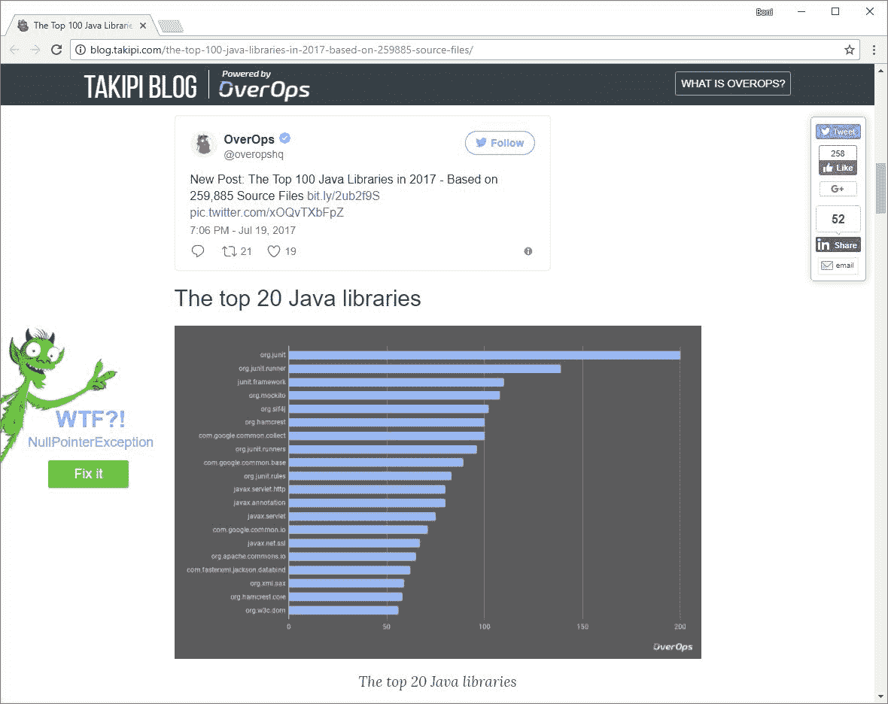

GitHub 上排名前 20 的 Java 库

尽管如此，JUnit4 是十多年前创建的一个框架，并且存在一些重要的限制，需要对框架进行全面的重新设计。

# 模块化

首先，JUnit4 不是模块化的。如下图所示，JUnit4 的体系结构是完全单片的。JUnit4 的所有功能都由`junit.jar`依赖项提供。因此，不同的测试机制，如测试发现和执行，在 JUnit4 中紧密耦合。

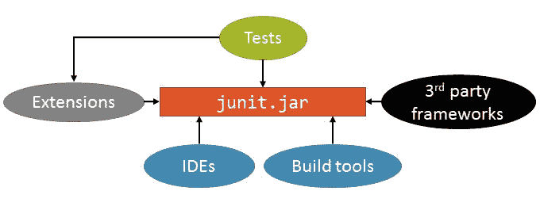

JUnit4 体系结构

JUnit 5 核心团队成员之一 Johannes Link 在 2015 年 8 月 13 日接受 Jax 杂志采访时总结了这个问题（在 JUnit 5 成立期间）：

JUnit 作为平台的成功阻止了 JUnit 作为测试工具的开发。我们想要解决的基本问题是通过分离一个足够强大和稳定的 API 来执行测试用例。

# JUnit 4 级运动员

JUnit4 的 runner API 也具有重要的威慑作用。如[第 1 章](1.html#K0RQ0-ef8404ed083f459d860f84cc8198f8bb)*软件质量和 Java 测试回顾*所述，在 JUnit4 中，runner 是一个 Java 类，用于管理测试的生命周期。JUnit4 中的 runner API 非常强大，但是它有一个重要的缺点：runner 是不可组合的，也就是说，我们一次只能使用一个 runner。

例如，参数化测试不能与 Spring 测试支持相结合，因为两个测试都将使用自己的 runner 实现。用 Java 思考（参见下面给出的代码片段），每个测试用例都使用自己独特的`@RunWith`注释。第一个使用`Parameterized`跑步者：

```java
import org.junit.Test;
import org.junit.runner.RunWith;
import org.junit.runners.Parameterized;

@RunWith(Parameterized.class)
public class MyParameterizedTest {

   @Test
   public void myFirstTest() {
      // my test code
   }

}
```

虽然第二个示例使用的是`SpringJUnit4ClassRunner`runner，但由于 JUnit4 的限制（runner 是不可组合的），它不会与前一个示例结合使用：

```java
import org.junit.Test;
import org.junit.runner.RunWith;
import org.springframework.test.context.junit4.SpringJUnit4ClassRunner;

@RunWith(SpringJUnit4ClassRunner.class)
public class MySpringTest {

   @Test
   public void yetAnotherTest() {
      // my test code
   }

}
```

# JUnit4 规则

由于 JUnit 4 运行程序在同一测试类中的唯一性受到严格限制，JUnit 4.7 版引入了方法级规则的概念，这些规则是测试类中带有`@Rule`的注释字段。这些规则允许通过在测试执行之前和之后执行一些代码来添加或重新定义测试行为。JUnit4.9 还引入了类级规则的概念，这些规则是在类内的所有测试之前和之后执行的。这些规则通过使用`@ClassRule`注释静态字段来标识，如下例所示：

```java
import org.junit.ClassRule;
import org.junit.Test;
import org.junit.rules.TemporaryFolder;

public class MyRuleTest {

   @ClassRule
   public static TemporaryFolder temporaryFolder = new TemporaryFolder();

   @Test
   public void anotherTest() {
      // my test code
   }

}
```

虽然规则更简单，而且大部分是可组合的，但它们还有其他缺点。在复杂测试中使用 JUnit4 规则的主要不便之处在于，我们无法在方法级和类级使用单个规则实体。最终，这会对定制生命周期管理（前/后行为）施加限制。

# JUnit 5《盗梦空间》

尽管 JUnit4 是全世界数百万 Java 开发人员的默认测试框架，但是没有一个活跃的 JUnit 维护人员是由他们的雇主付钱来做这项工作的。因此，为了克服 JUnit 4 的缺点，Johannes Link 和 Marc Philipp 于 2015 年 7 月，在国际众筹网站 Indiegogo 上启动了 [JUnit Lambda 众筹活动](http://junit.org/junit4/junit-lambda-campaign.html)：


JUnit Lambda 众筹活动

JUnit Lambda 是该项目的名称，它是当前 JUnit 5 框架的种子。在项目名称中包含 lambda 一词强化了从项目一开始就使用 Java8 的想法。引用 JUnit Lambda 项目站点：

目标是为 JVM 上的开发人员端测试创建最新的基础。这包括关注 Java8 及以上版本，以及支持多种不同风格的测试。

JUnit Lambda 众筹活动于 2015 年 7 月至 10 月进行。这是一个成功，从全球 474 家个人和公司筹集了 53937 欧元。从这一点上，JUnit5 启动团队成立了，加入了 Eclipse、Gradle、IntelliJ 或 Spring 的人员。

JUnit Lambda 项目成为 JUnit 5，指导开发过程的设计原则如下：

*   模块化：正如前面介绍的，JUnit4 不是模块化的，这会导致一些问题。从一开始，JUnit5 体系结构就完全模块化，允许开发人员使用他们需要的框架的特定部分。
*   功能强大的扩展模型，重点关注可组合性：可扩展性是现代测试框架所必须的。因此，JUnit5 应该提供与第三方框架（例如 Spring 或 Mockito）的无缝集成。
*   API 分离：将测试发现和执行与测试定义分离。
*   与旧版本的兼容性：支持在新的 JUnit5 平台上执行旧的 Java3 和 Java4。
*   用于编写测试的现代编程模型（Java8）：如今，越来越多的开发人员使用 Java8 的新特性编写代码，例如 lambda 表达式。JUnit4 是在 Java5 上构建的，但是 JUnit5 是使用 Java8 从头创建的。

# JUnit 5 社区

[JUnit5 的源代码托管在 GitHub 上](https://github.com/junit-team/junit5)。JUnit5 框架的所有模块都已根据开放源码许可证 EPLV1.0 的条款发布。此规则有一个例外，因为名为`junit-platform-surefire-provider`（稍后描述）的模块已使用 Apache License v2.0 发布。

[JUnit 开发路线图](https://github.com/junit-team/junit5/wiki/Roadmap)以及[不同版本和里程碑的定义和状态](https://github.com/junit-team/junit5/milestones/)在 GitHub 上公开。下表总结了该路线图：

| 阶段 | 日期 | 释放 |
| 0 众筹 | 2015 年 7 月至 2015 年 10 月 | - |
| 1.开球 | 2015 年 10 月 20 日至 22 日 | - |
| 2.第一个原型 | 2015 年 10 月 23 日至 2015 年 11 月底 | - |
| 3.阿尔法版本 | 2016 年 2 月 1 日 | 5.0 阿尔法 |
| 4 第一个里程碑 | 2016 年 7 月 9 日 | 5.0 M1：稳定的、记录在案的面向 IDE 的 API（启动器 API 和引擎 SPI），动态测试 |
| 5.其他里程碑 | 2016 年 7 月 23 日（5.0 平方米）2016 年 11 月 30 日（5.0 M3）2017 年 4 月 1 日（5.0 M4）2017 年 7 月 5 日（5.0 M5）2017 年 7 月 16 日（5.0 M6） | 5.0 M2：错误修复和小改进版本 5.0 M3:JUnit 4 互操作性，附加发现选择器 5.0 M4：测试模板、重复测试和参数化测试 5.0 M5：动态容器和轻微 API 更改 5.0 M6:Java 9 兼容性、场景测试、JUnit Jupiter 的附加扩展 API |
| 6**发布候选**（**RC**） | 2017 年 7 月 30 日 2017 年 7 月 30 日 2017 年 8 月 23 日 | 5.0 RC1：最终缺陷修复和文档改进 5.0 RC2:*junit jupiter 发动机*的固定梯度消耗 5.0 RC3：配置参数和错误修复 |
| 7.**一般可用性**（**GA**） | 2017 年 9 月 10 日 | 5.0 GA：首次稳定发布 |

JUnit5 贡献者不仅仅是开发人员。贡献者也是测试人员、维护人员和沟通者。在撰写本文时，GitHub 上排名前 5 的贡献者是：

*   Sam Brannen（[@Sam_Brannen](https://twitter.com/sam_brannen)）：核心 Spring 框架和 JUnit 5 提交人。Swiftmind 的企业 Java 顾问。Spring&JUnit教练。会议发言人。
*   Marc Philipp（[@MarchPhilipp](https://twitter.com/marcphilipp)）：LogMeIn 的高级软件工程师，积极参与 JUnit 或 Usus 等开源项目。会议发言人。
*   johanneslink（[@johanneslink](https://twitter.com/johanneslink)）：程序员和软件治疗师。JUnit5 的支持者。
*   Matthias Merdes：德国海德堡美孚股份有限公司的首席开发商。


GitHub 上排名前 5 的 JUnit 贡献者

以下列表提供了联机 JUnit 5 资源的集合：

*   [官方网站](https://twitter.com/hashtag/JUnit5)。
*   [源代码](https://github.com/junit-team/junit5/)。
*   [JUnit5 开发者指南](http://junit.org/junit5/docs/current/user-guide/)。参考文件。
*   [JUnit 团队推特](https://twitter.com/junitteam)。通常，[关于 JUnit 5 的推文都带有`#JUnit5`的标签](https://twitter.com/hashtag/JUnit5)。
*   [工单](https://github.com/junit-team/junit5/issues)。关于 GitHub 上附加功能的问题或建议。
*   [关于堆栈溢出的问题](https://stackoverflow.com/questions/tagged/junit5)。Stack Overflow 是一个流行的计算机编程问答网站。标签`junit5`应用于询问有关 JUnit 5 的问题。
*   [JUnit5 JavaDoc](http://junit.org/junit5/docs/current/api/)。
*   [JUnit 5 Gitter](https://gitter.im/junit-team/junit5)，一个即时消息和聊天室系统，用于直接与 JUnit 5 团队成员和其他从业者进行讨论。
*   [JVM 开放测试联盟](https://github.com/ota4j-team/opentest4j)。它是由 JUnit5 团队发起的一项计划，其目标是为测试 JVM 上的库（JUnit、TestNG、Spock 等）和第三方断言库（Hamcrest、AssertJ 等）提供一个最小的公共基础。其思想是使用一组通用的异常，IDE 和构建工具可以在所有测试场景中以一致的方式支持这些异常（到目前为止，还没有在 JVM 上进行测试的标准，唯一通用的构建块是 Java 异常`java.lang.AssertionError`。

# JUnit5 体系结构

JUnit5 框架被设计为供不同的编程客户端使用。第一组客户机是 Java 测试。这些测试可以基于 JUnit4（使用测试遗留编程模型的测试）、JUnit5（使用全新编程模型的测试），甚至其他类型的 Java 测试（第三方测试）。第二组客户机是构建工具（如 Maven 或 Gradle）和 IDE（如 IntelliJ 或 Eclipse）。

为了以松散耦合的方式实现所有这些部分的集成，JUnit5 被设计为模块化的。如下图所示，JUnit 5 框架由三个主要组件组成，称为平台、Jupiter*、*和 Vintage：

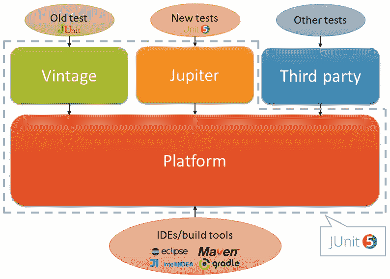

JUnit5 体系结构：高级组件

JUnit 5 体系结构的高级组件列举如下：

*   第一个高级组件称为*木星*。它提供了 JUnit5 框架的全新编程和扩展模型。
*   在 JUnit5 的核心中，我们找到了 JUnit*平台*。该组件旨在成为 JVM 中执行的任何测试框架的基础。换句话说，它提供了运行 Jupiter 测试、遗留 JUnit4 以及第三方测试（例如，Spock、FitNesse 等）的机制。
*   JUnit5 体系结构的最后一个高级组件称为*Vintage*。此组件允许在 JUnit 平台上开箱即用地运行遗留 JUnit 测试。

让我们仔细看看每个组件的细节，找出它们的内部模块：

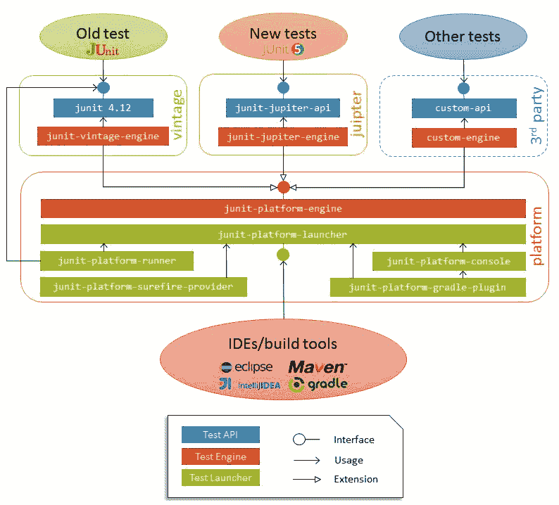

JUnit5 体系结构：模块

如上图所示，有三种类型的模块：

*   **测试 API**：这些是面向用户（即软件工程师和测试人员）的模块。这些模块为特定的测试引擎提供编程模型（例如，`junit-jupiter-api`用于 JUnit 5 测试，`junit`用于 JUnit 4 测试）。
*   **测试引擎**：这些模块允许在 JUnit 平台内执行一种测试（Jupiter 测试、遗留 JUnit 4 或其他 Java 测试）。它们是通过扩展通用的*平台引擎*（`junit-platform-engine`）创建的。
*   **测试启动器**：*这些模块为外部构建工具和 IDE 提供 JUnit 平台内部的测试发现能力。此 API 由 Maven、Gradle、IntelliJ 等工具使用`junit-platform-launcher`模块使用。*

 *作为这种模块化体系结构的结果，JUnit 框架公开了一组接口：

*   编写测试的**API**（**应用程序编程接口**）和*Jupiter API*。该 API 的详细描述就是我们所知的 Jupiter 编程模型，在本书的[第 3 章](#)、*JUnit 5 标准测试*和[第 4 章](4.html#2VBO80-ef8404ed083f459d860f84cc8198f8bb)、*使用高级 JUnit 功能简化测试*中有详细描述。
*   用于发现和执行测试的**SPI**（**服务提供商接口**），*引擎 SPI*。此 SPI 通常由测试引擎扩展，测试引擎最终提供编写测试的编程模型。
*   一个用于测试发现和执行的 API，*启动器 API*。此 API 通常由编程客户端（即 IDE 和构建工具）使用。

API 和 SPI 都是软件工程师为特定目的使用的一组资产（通常是类和接口）。区别在于 API 被*调用*，而 SPI 被*扩展*。

# 测试引擎 SPI

测试引擎 SPI 允许在 JVM 上创建测试执行器。在 JUnit 5 框架中，有两种现成的测试引擎实现：

*   `junit-vintage-engine`：这允许在 JUnit 平台上运行 JUnit3 和 JUnit4 测试。
*   `junit-jupiter-engine`：这允许在 JUnit 平台上运行 JUnit5 测试。

此外，第三方测试库（例如，Spock、TestNG 等）可以通过提供自定义测试引擎插入 JUnit 平台。为此，这些框架应该通过扩展 JUnit5 接口`org.junit.platform.engine.TestEngine`来创建自己的测试引擎。为了扩展此接口，必须覆盖三个强制方法：

*   `getId`：测试引擎的唯一标识符。
*   `discover`：查找和过滤测试的逻辑。
*   `execute`：运行先前找到的测试的逻辑。

以下示例提供了自定义测试引擎的框架：

```java
package io.github.bonigarcia;

import org.junit.platform.engine.EngineDiscoveryRequest;
import org.junit.platform.engine.ExecutionRequest;
import org.junit.platform.engine.TestDescriptor;
import org.junit.platform.engine.TestEngine;
import org.junit.platform.engine.UniqueId;
import org.junit.platform.engine.support.descriptor.EngineDescriptor;

public class MyCustomEngine implements TestEngine {

    public static final String *ENGINE_ID* = "my-custom-engine";

    @Override
    public String getId() {
        return *ENGINE_ID*;
    }

    @Override
    public TestDescriptor discover(EngineDiscoveryRequest discoveryRequest,
            UniqueId uniqueId) {
        // Discover test(s) and return a TestDescriptor object
        TestDescriptor testDescriptor = new EngineDescriptor(uniqueId,
                "My test");
        return testDescriptor;
    }

    @Override
    public void execute(ExecutionRequest request) {
        // Use ExecutionRequest to execute TestDescriptor
        TestDescriptor rootTestDescriptor =             
                request.getRootTestDescriptor();
        request.getEngineExecutionListener()
                .executionStarted(rootTestDescriptor);
    }

}
```

社区在 JUnit 5 团队的 GitHub 站点的 wiki 中维护[现有测试引擎（例如，Specsy、Spek 和其他）的列表](https://github.com/junit-team/junit5/wiki/Third-party-Extensions) 。

# 测试启动器 API

JUnit5 的目标之一是使 JUnit 与其编程客户机（构建工具和 IDE）之间的接口更加强大和稳定。为此，已经实现了测试启动器 API。IDE 和构建工具使用此 API 来发现、过滤和执行测试。

仔细查看这个 API 的细节，我们发现了类`LauncherDiscoveryRequest`，它公开了一个 fluent API 来选择测试的位置（例如类、方法或包）。例如，可以使用匹配模式筛选这组测试：

```java
import static org.junit.platform.engine.discovery.ClassNameFilter.includeClassNamePatterns;
import static org.junit.platform.engine.discovery.DiscoverySelectors.selectClass;
import static org.junit.platform.engine.discovery.DiscoverySelectors.selectPackage;

import org.junit.platform.launcher.Launcher;
import org.junit.platform.launcher.LauncherDiscoveryRequest;
import org.junit.platform.launcher.TestPlan;
import org.junit.platform.launcher.core.LauncherDiscoveryRequestBuilder;
import org.junit.platform.launcher.core.LauncherFactory;

// Discover and filter tests
LauncherDiscoveryRequest request = LauncherDiscoveryRequestBuilder
     .*request*()
     .*selectors*(*selectPackage*("io.github.bonigarcia"),     
      selectClass(MyTest.class))
     .*filters*(i*ncludeClassNamePatterns*(".*Test")).build();
Launcher launcher = LauncherFactory.create();
TestPlan plan = launcher.discover(request);
```

之后，可以使用类`TestExecutionListener`执行生成的测试套件。此类还可用于获取反馈和接收事件：

```java
import org.junit.platform.launcher.TestExecutionListener;
import org.junit.platform.launcher.listeners.SummaryGeneratingListener;

// Executing tests
TestExecutionListener listener = new SummaryGeneratingListener();
launcher.registerTestExecutionListeners(listener);
launcher.execute(request);
```

# 在 JUnit5 中运行测试

在编写本文时，Jupiter 测试可以通过几种方式执行：

*   **使用构建工具**：Maven（在模块`junit-plaform-surefire-provider`中实现）或 Gradle（在模块`junit-platform-gradle-plugin`中实现）。
*   **使用控制台启动器**：允许从控制台启动 JUnit 平台的命令行 Java 应用程序。
*   **使用 IDE**：IntelliJ（自 2016.2 版起）和 Eclipse（自 4.7 版起，氧气）。

正如我们将要发现的，由于 JUnit5 的模块化架构，我们需要在项目中包括三个依赖项：一个用于测试 API（实现测试），另一个用于测试引擎（运行测试），以及最后一个测试启动器（发现测试）。

# Jupiter 与 Maven 测试

为了在 Maven 项目中运行 Jupiter 测试，我们需要正确配置`pom.xml`文件。首先，我们需要包含`junit-jupiter-api`模块作为依赖项。这是编写我们的测试所必需的，并且通常具有测试范围：

```java
<dependencies>
   <dependency>
      <groupId>org.junit.jupiter</groupId>
      <artifactId>junit-jupiter-api</artifactId>
      <version>${junit.jupiter.version}</version>
      <scope>test</scope>
   </dependency>
</dependencies>
```

通常，建议使用最新版本的依赖项。为了检查该版本是什么，我们可以在 Maven Central（[上进行检查 http://search.maven.org/](http://search.maven.org/) ）

然后，必须声明`maven-surefire-plugin`。在内部，该插件需要两个依赖项：测试启动器（`junit-platform-surefire-provider`和测试引擎（`junit-jupiter-engine`）：

```java
<build>
   <plugins>
      <plugin>
         <artifactId>maven-surefire-plugin</artifactId>
         <version>${maven-surefire-plugin.version}</version>
         <dependencies>
             <dependency>
                <groupId>org.junit.platform</groupId>
                <artifactId>junit-platform-surefire-provider</artifactId>
                <version>${junit.platform.version}</version>
            </dependency>
            <dependency>
               <groupId>org.junit.jupiter</groupId>
               <artifactId>junit-jupiter-engine</artifactId>
               <version>${junit.jupiter.version}</version>
            </dependency>
         </dependencies>
      </plugin>
   </plugins>
 </build>
```

本书的所有源代码都可以在 GitHub 存储库的[上公开获取 https://github.com/bonigarcia/mastering-junit5](https://github.com/bonigarcia/mastering-junit5) 。

最后但并非最不重要的一点是，我们需要创建一个 Jupiter 测试用例。到目前为止，我们还没有学会如何实现 Jupiter 测试（这部分在[第 3 章](3.html#29DRA0-ef8404ed083f459d860f84cc8198f8bb)JUnit 5 标准测试中介绍）。然而，我们在这里执行的测试是演示 JUnit5 框架执行的最简单的测试。Jupiter 测试在其最小表达式中只是一个 Java 类，其中一个（或多个）方法用`@Test`（包`org.junit.jupiter.api`）注释。以下代码段提供了一个示例：

```java
package io.github.bonigarcia;

import static org.junit.jupiter.api.Assertions.assertEquals;

import org.junit.jupiter.api.Test;

class MyFirstJUnit5Test {

   @Test
   void myFirstTest() {
       String message = "1+1 should be equal to 2";
       System.*out*.println(message);
       *assertEquals*(2, 1 + 1, message);
   }

}
```

JUnit 在运行时需要 Java8（或更高版本）。但是，我们仍然可以测试使用以前版本的 Java 编译的代码。

如下图所示，可以使用命令`mvn test`执行此测试：

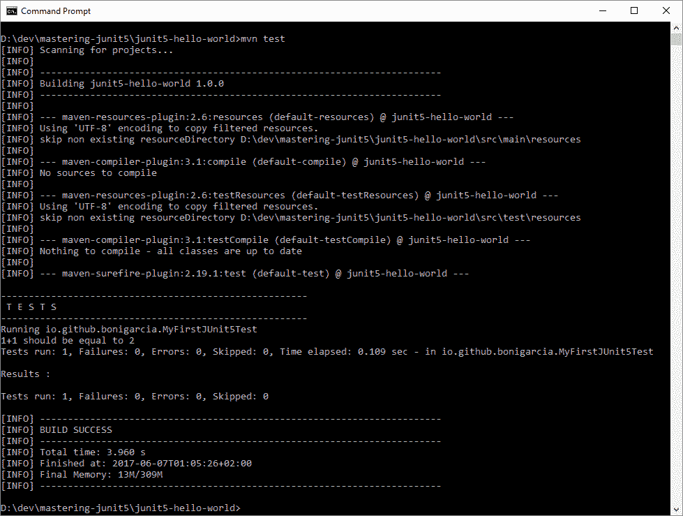

使用 Maven 运行 Jupiter 测试

# 朱庇特与格拉德尔测试

现在，我们将学习相同的示例，但这次是用 Gradle 执行的。因此，我们需要配置`build.gradle`文件。在此文件中，我们需要定义：

*   Jupiter API 的依赖项（`junit-jupiter-api`。
*   测试引擎的依赖关系（`junit-jupiter-engine`。
*   测试启动器的插件（`junit-platform-gradle-plugin`。

`build.gradle`的完整来源如下：

```java
buildscript {
   repositories {
      mavenCentral()
   }
   dependencies {
      classpath("org.junit.platform:junit-platform-gradle-plugin:${junitPlatformVersion}")
   }
}
repositories {
   mavenCentral()
}

apply plugin: 'java'
apply plugin: 'eclipse'
apply plugin: 'idea'
apply plugin: 'org.junit.platform.gradle.plugin'

compileTestJava {
   sourceCompatibility = 1.8
   targetCompatibility = 1.8
   options.compilerArgs += '-parameters'
}

dependencies {
   testCompile("org.junit.jupiter:junit-jupiter-api:${junitJupiterVersion}")
   testRuntime("org.junit.jupiter:junit-jupiter-engine:${junitJupiterVersion}")
}
```

我们使用命令`gradle test`从命令行与 Gradle 一起运行 Jupiter 测试：

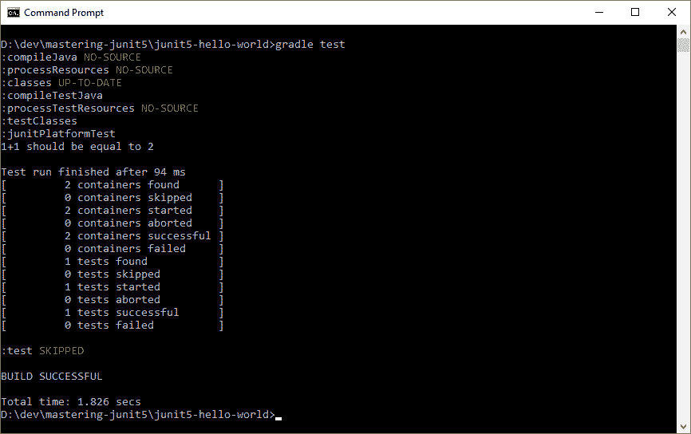

使用 Gradle 运行 Jupiter 测试

# Maven 遗留测试

下面是我们希望在 JUnit 平台内运行遗留测试（本例中为 JUnit 4）的映像：

```java
package io.github.bonigarcia;

import static org.junit.Assert.assertEquals;

import org.junit.Test;

public class LegacyJUnit4Test {

   @Test
   public void myFirstTest() {
      String message = "1+1 should be equal to 2";
      System.*out*.println(message);
      *assertEquals*(message, 2, 1 + 1);
   }

}
```

为此，在 Maven 中，我们首先需要在我们的`pom.xml`中包含旧的 JUnit4 依赖项，如下所示：

```java
<dependencies>
   <dependency>
      <groupId>junit</groupId>
      <artifactId>junit</artifactId>
      <version>4.12</version>
      <scope>test</scope>
   </dependency>
</dependencies>
```

然后，我们需要使用插件的以下依赖项包括`maven-surefire-plugin`：测试引擎（`junit-vintage-engine`）和测试启动器（`junit-platform-surefire-provider`）：

```java
<build>
   <plugins>
      <plugin>
         <artifactId>maven-surefire-plugin</artifactId>
         <version>${maven-surefire-plugin.version}</version>
         <dependencies>
            <dependency>
               <groupId>org.junit.platform</groupId>
               <artifactId>junit-platform-surefire-provider</artifactId>
               <version>${junit.platform.version}</version>
            </dependency>
            <dependency>
                <groupId>org.junit.vintage</groupId>
                <artifactId>junit-vintage-engine</artifactId>
                <version>${junit.vintage.version}</version>
            </dependency>
         </dependencies>
      </plugin>
   </plugins>
</build>
```

命令行的执行也将使用命令`mvn test`：

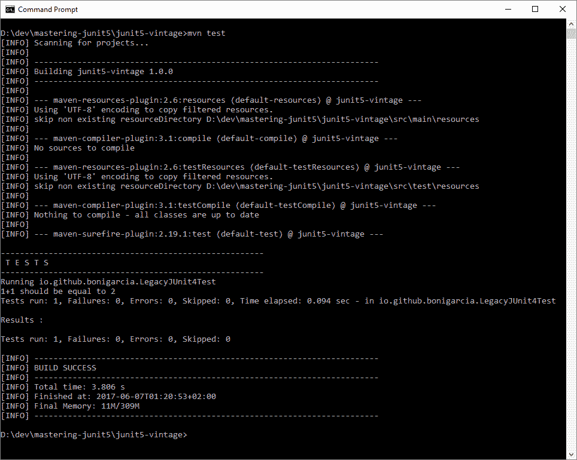

使用 Maven 运行遗留测试

# 具有 Gradle 的遗留测试

如果我们想执行前面的示例（`io.github.bonigarcia.LegacyJUnit4Test`中所示的相同测试，但这次使用 Gradle，我们需要在`build.gradle`文件中包括以下内容：

*   JUnit4.12 的依赖关系。
*   测试引擎的依赖关系（`junit-vintage-engine`。
*   测试启动器的插件（`junit-platform-gradle-plugin`。

因此，`build.gradle`的完整来源如下：

```java
buildscript {
   repositories {
      mavenCentral()
   }
   dependencies {
      classpath("org.junit.platform:junit-platform-gradle-plugin:${junitPlatformVersion}")
   }
}

repositories {
   mavenCentral()
}

apply plugin: 'java'
apply plugin: 'eclipse'
apply plugin: 'idea'
apply plugin: 'org.junit.platform.gradle.plugin'

compileTestJava {
   sourceCompatibility = 1.8
   targetCompatibility = 1.8
   options.compilerArgs += '-parameters'
}

dependencies {
   testCompile("junit:junit:${junitLegacy}")
   testRuntime("org.junit.vintage:junit-vintage-engine:${junitVintageVersion}")
}
```

从命令行执行如下：

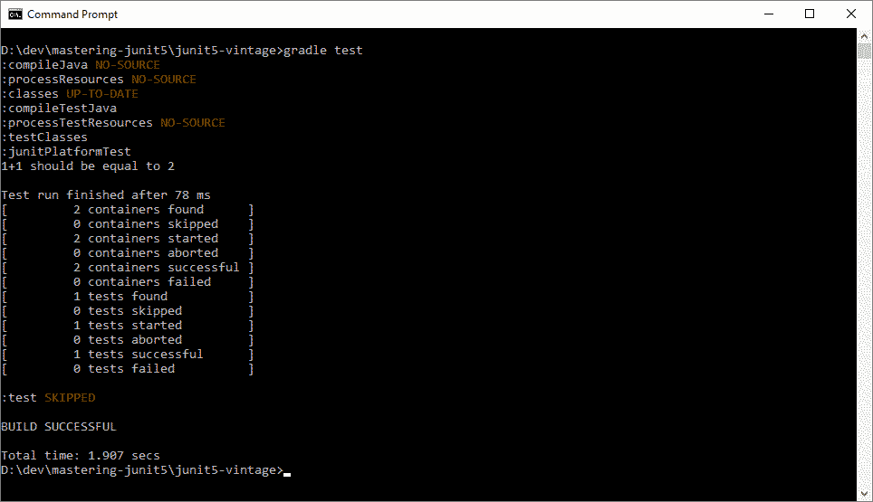

使用 Gradle 运行遗留测试

# 控制台

`ConsoleLauncher`是一个命令行 Java 应用程序，允许从控制台启动 JUnit 平台。例如，它可以用于从命令行运行 Vintage 和 Jupiter 测试。

包含所有依赖项的可执行 JAR 发布在中央 Maven 存储库中的`junit-platform-console-standalone`工件下。独立控制台启动器可以按如下方式执行：

```java
java -jar junit-platform-console-standalone-version.jar <Options>
```

示例 GitHub 存储库[*junit5 控制台启动器*](https://github.com/bonigarcia/mastering-junit5/tree/master/junit5-console-launcher)包含一个使用控制台启动器的简单示例。如下图所示，在 Eclipse 中创建了一个运行配置条目，运行主类`org.junit.platform.console.ConsoleLauncher`。然后，使用选项`--select-class`和限定类名（在本例中为`io.github.bonigarcia.EmptyTest`）将测试类名作为参数传递。之后，我们可以运行应用程序，在 Eclipse 的集成控制台中获得测试结果：

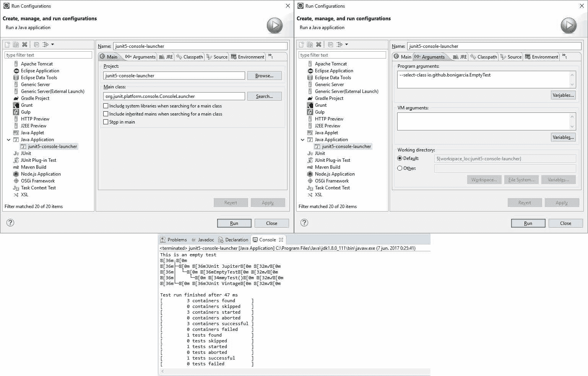

Eclipse 中 ConsoleLancher 的示例

# JUnit4 中的 Jupiter 测试

JUnit5 被设计为向前和向后兼容。一方面，Vintage 组件支持在 JUnit3 和 JUnit4 上运行遗留代码。另一方面，JUnit 5 提供了一个 JUnit 4 运行程序，它允许在 IDE 中运行 JUnit 5，并构建支持 JUnit 4 的系统，但还不能直接支持新的 JUnit 平台 5。

让我们看一个例子。假设我们想要在一个不支持 JUnit5 的 IDE 中运行 Jupiter 测试，例如旧版本的 Eclipse。在这种情况下，我们需要用`@RunWith(JUnitPlatform.class)`注释我们的 Jupiter 测试。`JUnitPlatform`runner 是一个基于 JUnit 4 的 runner，它支持在 JUnit 4 环境中运行其编程模型在 JUnit 平台上受支持的任何测试。因此，我们的测试结果如下：

```java
package io.github.bonigarcia;

import static org.junit.jupiter.api.Assertions.assertEquals;

import org.junit.jupiter.api.Test;
import org.junit.platform.runner.JUnitPlatform;
import org.junit.runner.RunWith;

@RunWith(JUnitPlatform.class)
public class JUnit5CompatibleTest {

   @Test 
   void myTest() {
      String message = "1+1 should be equal to 2";
      System.*out*.println(message);
 *assertEquals*(2, 1 + 1, message);
   }

}
```

如果此测试包含在 Maven 项目中，我们的`pom.xml`应该包含以下依赖项：

```java
<dependencies>
   <dependency>
      <groupId>org.junit.jupiter</groupId>
      <artifactId>junit-jupiter-api</artifactId>
      <version>${junit.jupiter.version}</version>
      <scope>test</scope>
    </dependency>
    <dependency>
       <groupId>org.junit.jupiter</groupId>
       <artifactId>junit-jupiter-engine</artifactId>
       <version>${junit.jupiter.version}</version>
       <scope>test</scope>
     </dependency>
     <dependency>
        <groupId>org.junit.platform</groupId>
        <artifactId>junit-platform-runner</artifactId>
        <version>${junit.platform.version}</version>
        <scope>test</scope>
     </dependency>
 </dependencies>
```

另一方面，对于 Gradle 项目，我们的`build.gradle`如下：

```java
buildscript {
   repositories {
      mavenCentral()
   }
   dependencies {
      classpath("org.junit.platform:junit-platform-gradle-plugin:${junitPlatformVersion}")
   }
}

repositories {
   mavenCentral()
}

apply plugin: 'java'
apply plugin: 'eclipse'
apply plugin: 'idea'
apply plugin: 'org.junit.platform.gradle.plugin'

compileTestJava {
   sourceCompatibility = 1.8
   targetCompatibility = 1.8
   options.compilerArgs += '-parameters'
}

dependencies {
   testCompile("org.junit.jupiter:junit-jupiter-api:${junitJupiterVersion}")
   testRuntime("org.junit.jupiter:junit-jupiter-engine:${junitJupiterVersion}")
   testCompile("org.junit.platform:junit-platform-runner:${junitPlatformVersion}")
}
```

# IntelliJ

IntelliJ 2016.2+是第一个支持本地执行 Jupiter 测试的 IDE。如以下屏幕截图所示，可以使用 IDE 的集成功能执行任何 Jupiter 测试：

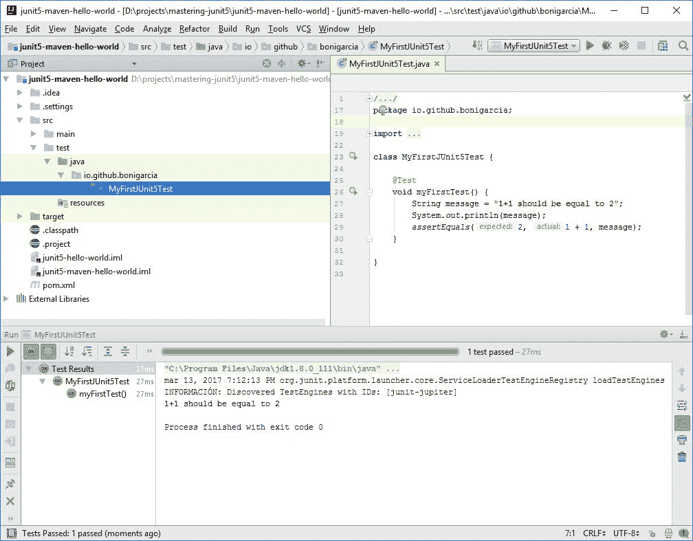

在 IntelliJ 2016.2 中运行 Jupiter 测试+

# 日食

Eclipse4.7（*Oxygen*）对 JUnit5 有 beta 版支持。由于这一点，Eclipse 提供了直接在 Eclipse 中运行 Jupiter 测试的能力，如以下屏幕截图所示：

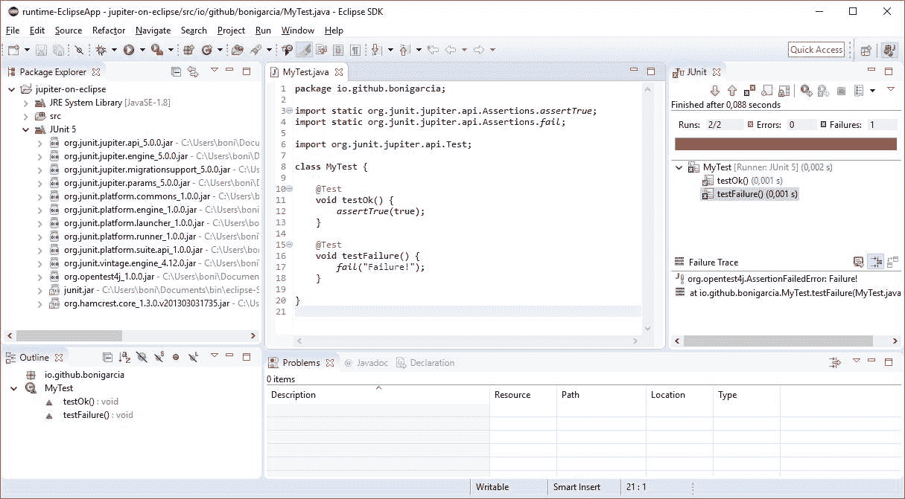

在 Eclipse4.7 中运行 Jupiter 测试+

此外，Eclipse 4.7（*Oxygen*）提供了一个向导，以简单的方式创建 Jupiter 测试，如下图所示：

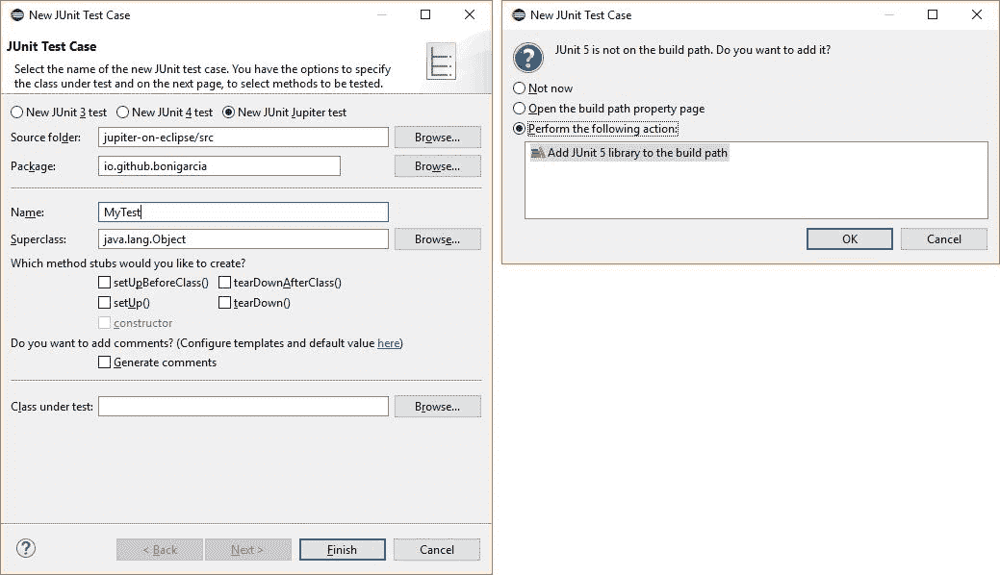

创建 Jupiter 测试的 Eclipse 向导

# JUnit5 的扩展模型

如前所述，Jupiter 是 JUnit 5 新编程模型的名称，详细描述见[第 3 章](3.html#29DRA0-ef8404ed083f459d860f84cc8198f8bb)、*JUnit 5 标准测试*和[第 4 章](4.html#2VBO80-ef8404ed083f459d860f84cc8198f8bb)、*使用高级 JUnit 特性简化测试*以及扩展模型。扩展模型允许通过自定义添加扩展 Jupiter 编程模型。由于这一点，第三方框架（如 Spring 或 Mockito 等）可以无缝地实现与 JUnit5 的互操作性。这些框架提供的扩展将在[第 5 章](5.html#3KB4K0-ef8404ed083f459d860f84cc8198f8bb)*JUnit 5 与外部框架的集成*中研究。在本节中，我们将分析扩展模型的一般性能，以及 JUnit5 中提供的现成扩展。

与 JUnit4 中以前的扩展点（即测试运行程序和规则）不同，JUnit5 扩展模型由一个单一的、连贯的概念组成：**扩展 API**。此 API 允许任何第三方（工具供应商、开发人员等）扩展 JUnit5 的核心功能。关于 Jupiter 中的扩展，我们需要了解的第一件事是，每个新扩展都实现一个名为`Extension`的接口。该接口是一个*标记*接口，即没有字段或方法的 Java 接口：

```java
package org.junit.jupiter.api.extension;

import static org.apiguardian.api.API.Status.STABLE;

import org.apiguardian.api.API;

/**
 * Marker interface for all extensions.
 *
 * @since 5.0
 */
@API(status = STABLE, since = "5.0")
public interface Extension {
}
```

为了简化 Jupiter 扩展的创建，JUnit5 提供了一组扩展点，允许在测试生命周期的不同部分执行自定义代码。下表总结了 Jupiter 中的扩展点，其详细信息将在下一节中介绍：

| **扩展点** | **由想要……**的扩展实现 |
| `TestInstancePostProcessor` | 在测试实例化之后提供其他行为 |
| `BeforeAllCallback` | 在测试容器中调用所有测试之前提供其他行为 |
| `BeforeEachCallback` | 在调用每个测试之前，为测试提供其他行为 |
| `BeforeTestExecutionCallback` | 在执行每个测试之前，为测试提供额外的行为 |
| `TestExecutionExceptionHandler` | 处理测试执行期间引发的异常 |
| `AfterAllCallback` | 在调用所有测试后，为测试容器提供其他行为 |
| `AfterEachCallback` | 在调用每个测试后，为测试提供其他行为 |
| `AfterTestExecutionCallback` | 在执行每个测试后立即向测试提供附加行为 |
| `ExecutionCondition` | 在运行时条件化测试执行 |
| `ParameterResolver` | 在运行时解析参数 |

一旦我们创建了一个扩展，为了使用它，我们需要使用注释`ExtendWith`。此批注可用于注册一个或多个扩展名。它可以在接口、类、方法、字段甚至其他注释中声明：

```java
import org.junit.jupiter.api.Test;
import org.junit.jupiter.api.extension.ExtendWith;

public class MyTest {

   @ExtendWith(MyExtension.class)
   @Test
   public void test() {
     // My test logic
   }

}
```

# 测试生命周期

有一组扩展点旨在控制测试的生命周期。首先，在测试实例化之后，`TestInstancePostProcessor`可以用来执行一些逻辑。之后，有不同的扩展控制预测试阶段：

*   `BeforeAllCallback`定义了所有测试之前执行的逻辑。
*   `BeforeEachCallback`定义了测试方法之前执行的逻辑。
*   `BeforeTestExecutionCallback`定义了测试方法之前立即执行的逻辑。

类似地，也有控制测试后阶段的扩展：

*   `AfterAllCallback`定义了所有测试后执行的逻辑。
*   `AfterEachCallback`定义了测试方法后执行的逻辑。
*   `AfterTestExecutionCallback`定义了测试方法之后立即执行的逻辑。

在`Before*`和`After*`回调之间，有一个扩展提供了收集异常的方法：`TestExecutionExceptionHandler`。

所有这些回调及其在测试生命周期中的顺序如下图所示：


扩展回调的生命周期

让我们看一个例子。我们创建了一个名为`IgnoreIOExceptionExtension`的扩展，它实现了`TestExecutionExceptionHandler`。在本例中，扩展检查异常是否为`IOException`。如果是，则丢弃异常：

```java
package io.github.bonigarcia;

import java.io.IOException;
import org.junit.jupiter.api.extension.ExtensionContext;
import org.junit.jupiter.api.extension.TestExecutionExceptionHandler;

public class IgnoreIOExceptionExtension
   implements TestExecutionExceptionHandler {

   @Override
   public void handleTestExecutionException(ExtensionContext context,
          Throwable throwable) throws Throwable {
      if (throwable instanceof IOException) {
         return;
      }
      throw throwable;
   }

}
```

考虑下面的测试类，它包含两个测试（AutoT0}）。第一个注释为`@ExtendWith`和我们的自定义扩展名（`IgnoreIOExceptionExtension`：

```java
package io.github.bonigarcia;

import java.io.IOException;
import org.junit.jupiter.api.Test;
import org.junit.jupiter.api.extension.ExtendWith;

public class ExceptionTest {

   @ExtendWith(IgnoreIOExceptionExtension.class)
   @Test
   public void firstTest() throws IOException {
      throw new IOException("IO Exception");
   }

   @Test
   public void secondTest() throws IOException {
      throw new IOException("My IO Exception");
   }

}
```

当执行这个测试类时，第一个测试成功，因为`IOException`已经由我们的扩展内部处理。另一方面，第二个将失败，因为没有处理该异常。

在下一个屏幕截图中可以看到该测试类在控制台中的执行。注意，我们使用 Maven 命令`mvn test -Dtest=ExceptionTest`选择要执行的测试：

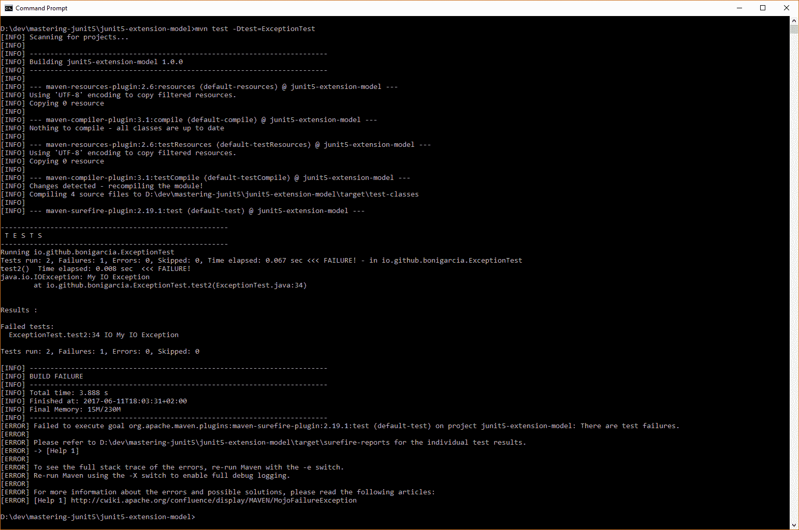

忽略异常示例的输出

# 条件扩展点

为了创建根据给定条件激活或停用测试的扩展，JUnit5 提供了一个被调用的条件扩展点`ExecutionCondition`。以下代码段显示了此扩展点的声明：

```java
package org.junit.jupiter.api.extension;

import static org.apiguardian.api.API.Status.STABLE;

import org.apiguardian.api.API;

@FunctionalInterface
@API(status = STABLE, since = "5.0")
public interface ExecutionCondition extends Extension {
   ConditionEvaluationResult evaluateExecutionCondition         
     ExtensionContext context);

}
```

该扩展可用于停用容器中的所有测试（可能是类）或单个测试（可能是测试方法）。[第 3 章](3.html#29DRA0-ef8404ed083f459d860f84cc8198f8bb)*JUnit 5 标准测试*中的*条件测试执行*部分提供了此扩展的示例。

# 依赖注入

`ParameterResolver`扩展在方法级别提供依赖注入。在这个例子中，我们可以看到一个参数是如何通过一个名为`MyParameterResolver`的`ParameterResolver`自定义实现注入测试方法的。在代码之后，我们可以看到此解析器将简单地使用值`my parameter`注入硬编码字符串参数：

```java
package io.github.bonigarcia;

import org.junit.jupiter.api.extension.ExtensionContext;
import org.junit.jupiter.api.extension.ParameterContext;
import org.junit.jupiter.api.extension.ParameterResolutionException;
import org.junit.jupiter.api.extension.ParameterResolver;

public class MyParameterResolver implements ParameterResolver {

    @Override
    public boolean supportsParameter(ParameterContext parameterContext,
            ExtensionContext extensionContext)
            throws ParameterResolutionException {
        return true;
    }

    @Override
    public Object resolveParameter(ParameterContext parameterContext,
            ExtensionContext extensionContext)
            throws ParameterResolutionException {
        return "my parameter";
    }

}
```

然后，可以在测试中使用此参数解析器，并使用注释`@ExtendWith`声明其正常：

```java
package io.github.bonigarcia;

import org.junit.jupiter.api.Test;
import org.junit.jupiter.api.extension.ExtendWith;

public class DependencyInjectionTest {

   @ExtendWith(MyParameterResolver.class)
   @Test
   public void test(Object parameter) {
      System.*out*.println("My parameter " + parameter);
   }
}
```

最后，如果我们执行这个测试（例如使用 Maven 和命令行），我们可以看到注入的参数是如何记录在标准输出中的：


依赖项注入扩展示例的输出

# 第三方扩展

在现实世界中，扩展通常实现前面解释的几个扩展点。例如，`SpringExtension`（详见[第 5 章](5.html#3KB4K0-ef8404ed083f459d860f84cc8198f8bb)、*JUnit 5 与外部框架的集成*）实现了`BeforeAllCallback`、`TestInstancePostProcessor`、`ParameterResolver`等扩展点。以下片段提供了`SpringExtension`的结构：

```java
package org.springframework.test.context.junit.jupiter;

import org.junit.jupiter.api.extension.*;

public class SpringExtension implements BeforeAllCallback,     
   AfterAllCallback,
   TestInstancePostProcessor, BeforeEachCallback, AfterEachCallback,
   BeforeTestExecutionCallback, AfterTestExecutionCallback,
   ParameterResolver {

   @Override
   public void afterTestExecution(TestExtensionContext context) 
    throws Exception {
      // implementation
   }

   // Rest of methods
}
```

社区在 JUnit 5 团队的 GitHub 站点的 wiki 中维护[现有 JUnit 5 扩展（例如 Spring、Selenium、Docker 和其他）的列表](https://github.com/junit-team/junit5/wiki/Third-party-Extensions)。其中一些在[第 5 章](5.html#3KB4K0-ef8404ed083f459d860f84cc8198f8bb)、*JUnit 5 与外部框架的集成*中也有详细介绍。

# 总结

本章概述 JUnit5 测试框架。由于 JUnit4 的局限性（单片架构、组合测试运行程序的不可能性以及测试规则的局限性），需要一个新的主要框架版本。为了实施，JUnit Lambda 项目于 2015 年启动了众筹活动。因此，JUnit5 开发团队诞生了，框架的 GA 版本于 2017 年 9 月 10 日发布。

JUnit5 被设计成现代的（也就是说，从一开始就使用 Java8 和 Java9 兼容）和模块化的。JUnit5 中的三个主要组件是：Jupiter（新的扩展模型编程）、Platform（JVM 中执行的任何测试框架的基础）和 Vintage（与遗留 JUnit3 和 4 测试的集成）。在撰写本文时，JUnit5 测试可以使用构建工具（Maven 或 Gradle）和 IDE（Intellij2016.2+或 Eclipse4.7+）执行。

JUnit5 的扩展模型允许任何第三方扩展 JUnit5 的核心功能。为了创建 JUnit 5 扩展，我们需要实现一个或多个 JUnit 扩展点（例如`BeforeAllCallback`、`ParameterResolver`或`ExecutionCondition`等），然后使用注释`@ExtendWith`在我们的测试中注册扩展。

在接下来的[第 3 章](3.html#29DRA0-ef8404ed083f459d860f84cc8198f8bb)*JUnit 5 标准测试*中，我们将学习 Jupiter 编程模型的基础知识。换句话说，我们将学习如何创建标准 JUnit5 测试。*