# JUnit5 与外部框架的集成

如果我比别人看得更远，那就是站在巨人的肩膀上。

——艾萨克·牛顿

如第 2 章、*JUnit*中所述，JUnit 5 的扩展模型允许我们通过第三方（工具供应商、开发人员等）扩展 JUnit 5 的核心功能。在 Jupiter 扩展模型中，扩展点是一个回调接口，扩展实现该接口，然后在 JUnit 5 框架中注册（激活）。正如我们将在本章中发现的，JUnit5 扩展模型可用于提供与现有第三方框架的无缝集成。具体地说，在本章中，我们将回顾 JUnit 5 扩展的以下技术：

*   **Mockito**：Mock（test-double）单元测试框架。
*   **Spring**：用于构建企业应用程序的 Java 框架。
*   **Selenium**：一个自动化 web 应用程序导航和评估的测试框架。
*   **Cumber**：测试框架，允许我们创建按照**行为驱动开发**（**BDD**风格编写的验收测试。
*   **Docker**：一种软件技术，允许我们将任何应用程序打包并作为轻量级便携容器运行。

此外，我们发现 JUnit5 扩展模型并不是与外部世界集成的唯一方式。具体而言，我们研究 JUnit 5 如何与以下内容一起使用：

*   **Android**（基于 Linux 的移动操作系统）：我们可以使用 JUnit5 的 Gradle 插件在 Android 项目中运行 Jupiter 测试。
*   **REST**（设计分布式系统的体系结构风格）：我们可以简单地使用第三方库（如 REST Assured 或 WireMock）或使用 Spring 的完全集成方法（与服务实现一起测试）来交互和验证 REST 服务。

# 莫基托

[Mockito](http://site.mockito.org/) 是一个面向 Java 的开源模拟单元测试框架，于 2008 年 4 月首次发布。当然，Mockito 不是 Java 的唯一模拟框架；还有其他一些，例如：

*   [EasyMock](http://easymock.org/)。
*   [JMock](http://www.jmock.org/)。
*   [PowerMock](http://powermock.github.io/)。
*   [JMockit](http://jmockit.org/)。

我们可以说，在撰写本文时，Mockito 是大多数开发人员和测试人员在 Java 测试中首选的模拟框架。为了证明这一说法的合理性，我们使用了下面的屏幕截图，它显示了从 2004 年到 2017 年，谷歌趋势中[术语 Mockito、EasyMock、JMock、PowerMock 和 JMockit 的演变](https://trends.google.com/)。在这一时期的开始，我们可以看到人们对 EasyMock 和 JMock 产生了极大的兴趣；然而，与其他框架相比，Mockito 的需求更大：


谷歌趋势 Mockito、EasyMock、JMock、PowerMock 和 JMockit 的发展

# 简言之，莫基托

正如第一章、*软件质量回顾和 Java 测试*中介绍的，软件测试有不同的层次，如单元、集成、系统或验收。关于单元测试，它们应该为单个软件单独执行，例如，单个类。此级别测试的目标是验证单元的功能，而不是其依赖性。

换句话说，我们想要测试被测的**系统**（**SUT**），而不是它的**依赖于组件**（**文档**）。为了实现这种隔离，我们通常使用*测试加倍*来替换这些文档。模拟对象是一种双重测试，它是按照对真实文档的期望进行编程的。

简单地说，Mockito 是一个测试框架，允许创建、存根和验证模拟对象。为此，Mockito 提供了一个 API 来隔离 SUT 及其文档。一般来说，使用 Mockito 包括三个不同的步骤：

1.  **Mocking objects**：为了隔离我们的 SUT，我们使用 Mockito API 创建其关联文档的 mock。这样，我们保证 SUT 不依赖于它的实际文档，而我们的单元测试实际上关注于 SUT。
2.  **设置期望值**：mock 对象与其他测试双重对象（如存根）的区别在于，可以根据单元测试的需要，使用自定义期望值对 mock 对象进行编程。Mockito 术语中的这个过程称为 stubing 方法，其中这些方法属于 mock。默认情况下，模拟对象模仿真实对象的行为。实际上，这意味着模拟对象返回适当的伪值，例如布尔类型为 false，对象为 null，整数或长返回类型为 0，等等。Mockito 允许我们使用一个丰富的 API 来改变这种行为，它允许存根在调用方法时返回一个特定的值。

当一个模拟对象没有任何预期（即没有*存根方法*时，从技术上讲，它不是*模拟*对象，而是*虚拟*对象（请看第一章、*软件质量和 Java 测试回顾*对于定义）。

3.  **验证**：最后，我们正在创建测试，因此，我们需要对 SUT 进行某种验证。Mockito 提供了一个强大的 API 来执行不同类型的验证。使用此 API，我们评估与 SUT 和文档的交互，使用模拟验证调用顺序，或者捕获并验证传递给存根方法的参数。此外，可以使用 JUnit 的内置断言功能或使用第三方断言库（例如，Hamcrest、AssertJ 或 Truth）来补充 Mockito 的验证功能。参见第 3 章*JUnit 5 标准测试*中的*断言*部分。

下表总结了按上述阶段分组的 Mockito API：

| **Mockito API** | **说明** | **阶段** |
| --- | --- | --- |
| `@Mock` | 此注释标识由 Mockito 创建的模拟对象。这通常用于单据。 | 1.模拟对象 |
| `@InjectMocks` | 此注释标识将在其中注入模拟的对象。这通常用于我们要测试的单元，即我们的 SUT。 | 1.模拟对象 |
| `@Spy` | 除了 mock 之外，Mockito 还允许我们创建 spy 对象（即部分 mock 实现，因为它们在非存根方法中使用真实实现）。 | 1.模拟对象 |
| `Mockito.when(x).thenReturn(y)``Mockito.doReturn(y).when(x)` | 这些方法允许我们指定给定模拟对象的存根方法（`x`应该返回的值（`y`。 | 2.设定期望值（*存根方式*） |
| `Mockito.when(x).thenThrow(e)``Mockito.doThrow(e).when(x)` | 这些方法允许我们指定调用给定模拟对象的存根方法（`x`时应引发的异常（`e`）。 | 2.设定期望值（*存根方式*） |
| `Mockito.when(x).thenAnswer(a)``Mockito.doAnswer(a).when(x)` | 与返回硬编码值不同，当调用模拟的给定方法（`x`时，将执行动态用户定义逻辑（`Answer a`）。 | 2.设定期望值（*存根方式*） |
| `Mockito.when(x).thenCallRealMethod()``Mockito.doCallRealMethod().when(x)` | 这个方法允许我们真正实现一个方法，而不是模拟的方法。 | 2.设定期望值（*存根方式*） |
| `Mockito.doNothing().when(x)` | 使用间谍时，默认行为是调用对象的实际方法。为了避免执行`void`方法`x`，使用此方法。 | 2.设定期望值（*存根方式*） |
| `BDDMockito.given(x).willReturn(y)``BDDMockito.given(x).willThrow(e)``BDDMockito.given(x).willAnswer(a)``BDDMockito.given(x).willCallRealMethod()` | 行为驱动开发是一种测试方法，在这种方法中，测试是根据场景指定的，并在给定的（初始上下文）、（事件发生时的*和*然后*（确保某些结果）时实施。Mockito 通过类`BDDMockito`支持这种类型的测试。存根方法（`x`的行为等同于`Mockito.when(x)`。* | 2.设定期望值（*存根方式*） |
| `Mockito.verify()` | 此方法验证模拟对象的调用。可以选择使用以下方法增强此验证： | 3.核查 |
| | `times(n)`：stubbed 方法被精确调用`n`次。 | |
| | `never()`：从未调用存根方法。 | |
| | `atLeastOnce()`：stubbed 方法至少调用一次。 | |
| | `atLeast(n)`：stubbed 方法至少被调用 n 次。 | |
| | `atMost(n)`：stubbed 方法最多调用 n 次。 | |
| | `only()`：如果对 mock 对象调用任何其他方法，mock 将失败。 | |
| | `timeout(m)`：此方法最多在`m`毫秒内调用。 | |
| `Mockito.verifyZeroInteractions()``Mockito.verifyNoMoreInteractions()` | 这两个方法验证存根方法没有交互。在内部，它们使用相同的实现。 | 3.核查 |
| `@Captor` | 这个注释允许我们定义一个`ArgumentChaptor`对象，目的是验证传递给存根方法的参数。 | 3.核查 |
| `Mockito.inOrder` | 它有助于验证与模拟的交互是否按给定顺序执行。 | 3.核查 |

使用上表中描述的不同注释（`@Mock`、`@InjectMocks`、`@Spy`和`@Captor`）是可选的，尽管对于测试可读性的影响是推荐的。换句话说，除了使用不同的 Mockito 类使用注释外，还有其他选择。例如，为了创建一个`Mock`，我们可以使用注释`@Mock`，如下所示：

```java
@Mock
MyDoc docMock;
```

替代方法是使用`Mockito.mock`方法，如下所示：

```java
MyDoc docMock = Mockito.*mock*(MyDoc.class)
```

以下各节包含使用上表中描述的 Jupiter 测试中的 Mockito API 的综合示例。

# Mockito 的 JUnit5 扩展

在撰写本文时，还没有官方的 JUnit5 扩展在 Jupiter 测试中使用 Mockito。然而，JUnit5 团队提供了一个简单的现成 Java 类，实现了一个简单但有效的 Mockito 扩展。该类可以在 [JUnit5 用户指南](http://junit.org/junit5/docs/current/user-guide/)中找到，其代码如下：

```java
import static org.mockito.Mockito.*mock*;

import java.lang.reflect.Parameter;
import org.junit.jupiter.api.extension.ExtensionContext;
import org.junit.jupiter.api.extension.ExtensionContext.Namespace;
import org.junit.jupiter.api.extension.ExtensionContext.Store;
import org.junit.jupiter.api.extension.ParameterContext;
import org.junit.jupiter.api.extension.ParameterResolver;
import org.junit.jupiter.api.extension.TestInstancePostProcessor;
import org.mockito.Mock;
import org.mockito.MockitoAnnotations;
public class MockitoExtension
        implements TestInstancePostProcessor, ParameterResolver {

    @Override
    public void postProcessTestInstance(Object testInstance,
            ExtensionContext context) {
        MockitoAnnotations.*initMocks*(testInstance);
    }

    @Override
    public boolean supportsParameter(ParameterContext parameterContext,
       ExtensionContext extensionContext) {
      return 
       parameterContext.getParameter().isAnnotationPresent(Mock.class);
    }

    @Override
    public Object resolveParameter(ParameterContext parameterContext,
            ExtensionContext extensionContext) {
        return getMock(parameterContext.getParameter(), extensionContext);
    }

    private Object getMock(Parameter parameter,
            ExtensionContext extensionContext) {
        Class<?> mockType = parameter.getType();
        Store mocks = extensionContext
                .getStore(Namespace.*create*(MockitoExtension.class, 
                mockType));
        String mockName = getMockName(parameter);
        if (mockName != null) {
            return mocks.getOrComputeIfAbsent(mockName,
                    key -> *mock*(mockType, mockName));
        } else {
            return mocks.getOrComputeIfAbsent(mockType.getCanonicalName(),
                    key -> *mock*(mockType));
        }
    }

    private String getMockName(Parameter parameter) {
        String explicitMockName = 
                parameter.getAnnotation(Mock.class).name()
                .trim();
        if (!explicitMockName.isEmpty()) {
            return explicitMockName;
        } else if (parameter.isNamePresent()) {
            return parameter.getName();
        }
        return null;
    }

}
```

该扩展（以及其他扩展）计划在开源项目 [JUnit Pioneer](http://junit-pioneer.org/) 中发布。该项目由 Java 开发者、博客 [CodeFX](https://blog.codefx.org/) 的作者 Nicolai Palog 负责维护。

检查前面的类，我们可以检查它是否只是 Jupiter 扩展模型的一个用例（在本书的第 2 章、*JUnit 5 中的新增内容、*中描述），它实现了扩展回调`TestInstancePostProcessor`和`ParameterResolver`。首先，在测试用例实例化后，调用`postProcessTestInstance`方法，并在该方法的主体中进行 mock 的初始化：

```java
MockitoAnnotations.*initMocks*(testInstance)
```

这与在 Mockito 中使用 JUnit4 runner 的效果相同：`@RunWith(MockitoJUnitRunner.class)`。

此外，该扩展还实现了接口`ParameterResolver`。这意味着在注册扩展（`@ExtendWith(MockitoExtension.class)`的测试中允许方法级的依赖项注入。特别是，注释将为带有`@Mock`注释的测试参数（位于包`org.mockito`中）注入模拟对象。

让我们看一些例子来说明这个扩展和 Mockito 的用法。与往常一样，我们可以在 [GitHub 存储库](https://github.com/bonigarcia/mastering-junit5)上找到此示例的源代码。上述扩展（`MockitoExtension`的副本包含在项目`junit5-mockito`中。为了指导这些示例，我们在软件应用程序中实现了一个典型的用例：用户在软件系统中的登录。

在本用例中，我们假设用户与由三个类组成的系统交互：

*   `LoginController`：接收用户请求并返回响应的类。此请求被发送到`LoginService`组件。
*   `LoginService`：此类实现用例的功能。为此，需要确认用户是否在系统中经过身份验证。为此，它需要读取在`LoginRepository`类中实现的持久层。
*   `LoginRepository`：此类允许访问系统的持久层，通常通过数据库实现。此类也可以称为**数据访问对象**（**DAO**。

就构成而言，这三类之间的关系如下：


登录用例类图（类之间的组合关系）

用例中涉及的两个基本操作（登录和注销）的序列图如下图所示：

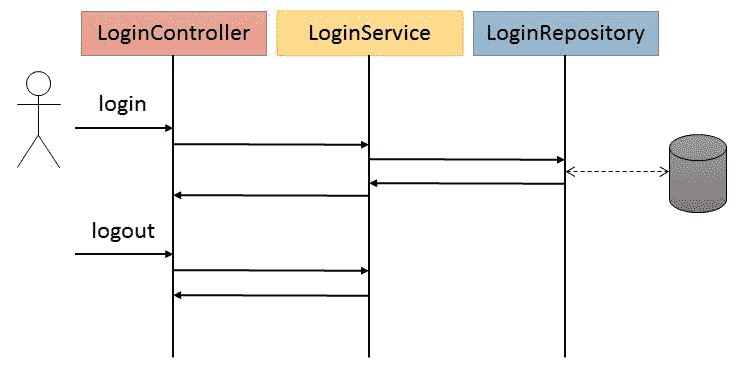

登录用例序列图

我们使用几个简单的 Java 类来实现这个示例。首先，`LoginController`按组合使用`LoginService`：

```java
package io.github.bonigarcia;

public class LoginController {
    public LoginService loginService = new LoginService();

    public String login(UserForm userForm) {
        System.*out*.println("LoginController.login " + userForm);
        try {
            if (userForm == null) {
                return "ERROR";
            } else if (loginService.login(userForm)) {
                return "OK";
            } else {
                return "KO";
            }
        } catch (Exception e) {
            return "ERROR";
        }
    }

    public void logout(UserForm userForm) {
        System.*out*.println("LoginController.logout " + userForm);
        loginService.logout(userForm);
    }
}
```

`UserForm`对象是一个简单的 Java 类，有时称为**普通旧 Java 对象**（**POJO**），有两个属性用户名和密码：

```java
package io.github.bonigarcia;

public class UserForm {

    public String username;
    public String password;

    public UserForm(String username, String password) {
        this.username = username;
        this.password = password;
    }

    // Getters and setters

    @Override
    public String toString() {
        return "UserForm [username=" + username + ", password=" + password
                + "]";
    }
}
```

然后，服务依赖于存储库（`LoginRepository`进行数据访问。在本例中，服务还使用 Java 列表实现了一个用户注册表，其中存储了经过身份验证的用户：

```java
package io.github.bonigarcia;

import java.util.ArrayList;
import java.util.List;

public class LoginService {

    private LoginRepository loginRepository = new LoginRepository();
    private List<String> usersLogged = new ArrayList<>();

    public boolean login(UserForm userForm) {
        System.*out*.println("LoginService.login " + userForm);

        // Preconditions
        checkForm(userForm);

        // Same user cannot be logged twice
        String username = userForm.getUsername();
        if (usersLogged.contains(username)) {
            throw new LoginException(username + " already logged");
        }

        // Call to repository to make logic
        boolean login = loginRepository.login(userForm);

        if (login) {
            usersLogged.add(username);
        }

        return login;
    }

    public void logout(UserForm userForm) {
        System.*out*.println("LoginService.logout " + userForm);

        // Preconditions
        checkForm(userForm);

        // User should be logged beforehand
        String username = userForm.getUsername();
        if (!usersLogged.contains(username)) {
            throw new LoginException(username + " not logged");
        }

        usersLogged.remove(username);
    }

    public int getUserLoggedCount() {
        return usersLogged.size();
    }

    private void checkForm(UserForm userForm) {
        assert userForm != null;
        assert userForm.getUsername() != null;
        assert userForm.getPassword() != null;
    }

}
```

最后，`LoginRepository`如下所示。为了简单起见，该组件不访问真实数据库，而是实现了一个映射，其中存储了系统假设用户的凭据（其中，`key`*=*用户名，`value`=密码）：

```java
package io.github.bonigarcia;

import java.util.HashMap;
import java.util.Map;

public class LoginRepository {

    Map<String, String> users;

    public LoginRepository() {
        users = new HashMap<>();
        users.put("user1", "p1");
        users.put("user2", "p3");
        users.put("user3", "p4");
    }

    public boolean login(UserForm userForm) {
        System.*out*.println("LoginRepository.login " + userForm);
        String username = userForm.getUsername();
        String password = userForm.getPassword();
        return users.keySet().contains(username)
                && users.get(username).equals(password);
    }

}
```

现在，我们将使用 JUnit5 和 Mockito 测试我们的系统。首先，我们测试控制器组件。因为我们正在进行单元测试，所以需要将`LoginController`登录与系统的其余部分隔离开来。要做到这一点，我们需要模拟它的依赖关系，在本例中是`LoginService`组件。使用前面解释的 SUT/DOC 术语，在这个测试中，我们的 SUT 是类`LoginController`，它的 DOC 是类`LoginService`。

为了用 JUnit5 实现我们的测试，首先我们需要用`@ExtendWith`注册`MockitoExtension`。然后，我们用`@InjectMocks`（类别`LoginController`）声明 SUT，用`@Mock`（类别`LoginService`声明其 DOC。我们实施了两个测试（`@Test`。第一个（`testLoginOk`指定调用 mock`loginService`的方法 login 时，该方法应返回 true。之后，实际执行 SUT，并验证其响应（在这种情况下，返回的字符串必须是`OK`。此外，Mockito API 再次用于评估是否不再与 mock`LoginService`进行交互。第二个测试（`testLoginKo`）是等效的，但是将方法 login 存根为返回 false，因此在这种情况下 SUT`(LoginController)`的响应必须是`KO`：

```java
package io.github.bonigarcia;

import static org.junit.jupiter.api.Assertions.*assertEquals*;
import static org.mockito.Mockito.*verify*;
import static org.mockito.Mockito.*verifyNoMoreInteractions*;
import static org.mockito.Mockito.*verifyZeroInteractions*;
import static org.mockito.Mockito.*when*;

import org.junit.jupiter.api.Test;
import org.junit.jupiter.api.extension.ExtendWith;
import org.mockito.InjectMocks;
import org.mockito.Mock;
import io.github.bonigarcia.mockito.MockitoExtension;

@ExtendWith(MockitoExtension.class)
class LoginControllerLoginTest {

    // Mocking objects
    @InjectMocks
    LoginController loginController;

    @Mock
    LoginService loginService;

    // Test data
    UserForm userForm = new UserForm("foo", "bar");

    @Test
    void testLoginOk() {
        // Setting expectations (stubbing methods)
        *when*(loginService.login(userForm)).thenReturn(true);

        // Exercise SUT
        String reseponseLogin = loginController.login(userForm);

        // Verification
        *assertEquals*("OK", reseponseLogin);
        *verify*(loginService).login(userForm);
        *verifyNoMoreInteractions*(loginService);
    }

    @Test
    void testLoginKo() {
        // Setting expectations (stubbing methods)
        *when*(loginService.login(userForm)).thenReturn(false);

        // Exercise SUT
        String reseponseLogin = loginController.login(userForm);

        // Verification
        *assertEquals*("KO", reseponseLogin);
        *verify*(loginService).login(userForm);
        *verifyZeroInteractions*(loginService);
    }

}
```

如果执行此测试，只需检查标准输出上的跟踪，就可以检查 SUT 是否已实际执行。此外，我们保证两项测试的验证阶段均已成功，因为两项测试均已通过：

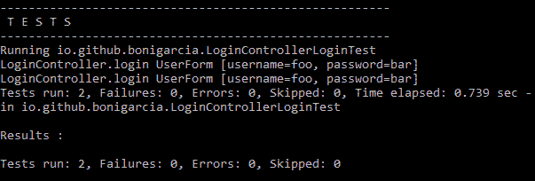

使用 JUnit 5 和 Mockito 执行*LoginControllerLoginTest*的单元测试

现在让我们来看另一个例子，在这个例子中，对组件`LoginController`测试了负面场景（即错误情况）。下面的类包含两个测试，第一个（`testLoginError`）用于评估使用空表单时系统的响应（应该是`ERROR`）。在第二个测试（`testLoginException`中，我们对模拟`loginService`的方法登录进行编程，以在首次使用任何表单时引发异常。然后，我们练习 SUT（`LoginController`并评估该响应实际上是一个`ERROR`：

注意，在设置 mock 方法的期望值时，我们使用的是参数匹配器 any（由 Mockito 提供）。

```java
package io.github.bonigarcia;

import static org.junit.jupiter.api.Assertions.*assertEquals*;
import static org.mockito.ArgumentMatchers.*any*;
import static org.mockito.Mockito.*when*;

import org.junit.jupiter.api.Test;
import org.junit.jupiter.api.extension.ExtendWith;
import org.mockito.InjectMocks;
import org.mockito.Mock;
import io.github.bonigarcia.mockito.MockitoExtension;

@ExtendWith(MockitoExtension.class)
class LoginControllerErrorTest {

    @InjectMocks
    LoginController loginController;

    @Mock
    LoginService loginService;

    UserForm userForm = new UserForm("foo", "bar");

    @Test
    void testLoginError() {
        // Exercise
        String response = loginController.login(null);

        // Verify
        *assertEquals*("ERROR", response);
    }

    @Test
    void testLoginException() {
        // Expectation
        *when*(loginService.login(*any*(UserForm.class)))
                .thenThrow(IllegalArgumentException.class);

        // Exercise
        String response = loginController.login(userForm);

        // Verify
        *assertEquals*("ERROR", response);
    }

}
```

同样，在 shell 中运行测试时，我们可以确认这两个测试都已正确执行，并且已执行 SUT：

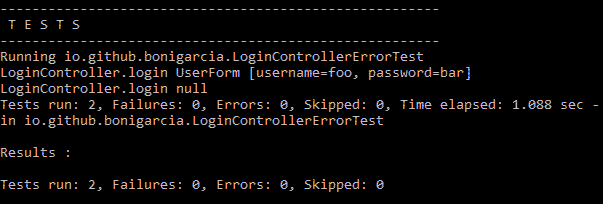

使用 JUnit 5 和 Mockito 执行*LoginControllerErrorTest*的单元测试

让我们看一个使用 BDD 样式的示例。为了达到这个目的，使用了`BDDMockito`类。请注意，示例中导入了该类的静态方法。然后，实现了四个测试。事实上，这四个测试与前面的示例（`LoginControllerLoginTest`和`LoginControllerErrorTest`中实现的测试完全相同，但这次使用的是 BDD 样式和更紧凑的样式（一行命令）。

```java
package io.github.bonigarcia;

import static org.junit.jupiter.api.Assertions.*assertEquals*;
import static org.mockito.ArgumentMatchers.*any*;
import static org.mockito.BDDMockito.*given*;

import org.junit.jupiter.api.Test;
import org.junit.jupiter.api.extension.ExtendWith;
import org.mockito.InjectMocks;
import org.mockito.Mock;
import io.github.bonigarcia.mockito.MockitoExtension;

@ExtendWith(MockitoExtension.class)
class LoginControllerBDDTest {

    @InjectMocks
    LoginController loginController;

    @Mock
    LoginService loginService;

    UserForm userForm = new UserForm("foo", "bar");

    @Test
    void testLoginOk() {
        *given*(loginService.login(userForm)).willReturn(true);
        *assertEquals*("OK", loginController.login(userForm));
    }

    @Test
    void testLoginKo() {
        *given*(loginService.login(userForm)).willReturn(false);
        *assertEquals*("KO", loginController.login(userForm));
    }

    @Test
    void testLoginError() {
        *assertEquals*("ERROR", loginController.login(null));
    }

    @Test
    void testLoginException() {
        *given*(loginService.login(*any*(UserForm.class)))
                .willThrow(IllegalArgumentException.class);
        *assertEquals*("ERROR", loginController.login(userForm));
    }

}
```

该测试类的执行假设执行了四个测试。如下面的屏幕截图所示，它们全部通过：

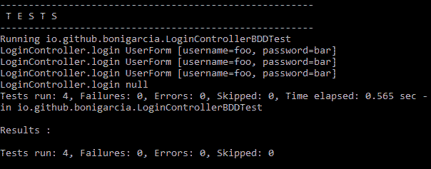

使用 JUnit 5 和 Mockito 执行*LoginControllerBDTest*的单元测试

现在让我们转到系统的下一个组件：`LoginService`。在下面的示例中，我们旨在对该组件进行单元测试，因此首先使用注释`@InjectMocks`在测试中注入 SUT。然后，使用注释`@Mock`模拟文档（`LoginRepository`。该类包含三个测试。第一个（`testLoginOk`用于在收到正确的表单时验证 SUT 的答案。第二个测试（`testLoginKo`验证了相反的场景。最后，第三个测试还验证了系统的错误情况。此服务的实现会记录用户的注册表，并且不允许同一用户登录两次。因此，我们实施了一个测试（`testLoginTwice`），验证当同一用户尝试登录两次时是否引发异常`LoginException`：

```java
package io.github.bonigarcia;

import static org.junit.jupiter.api.Assertions.*assertFalse*;
import static org.junit.jupiter.api.Assertions.*assertThrows*;
import static org.junit.jupiter.api.Assertions.*assertTrue*;
import static org.mockito.ArgumentMatchers.*any*;
import static org.mockito.Mockito.*atLeast*;
import static org.mockito.Mockito.*times*;
import static org.mockito.Mockito.*verify*;
import static org.mockito.Mockito.*when*;

import org.junit.jupiter.api.Test;
import org.junit.jupiter.api.extension.ExtendWith;
import org.mockito.InjectMocks;
import org.mockito.Mock;
import io.github.bonigarcia.mockito.MockitoExtension;

@ExtendWith(MockitoExtension.class)
class LoginServiceTest {

    @InjectMocks
    LoginService loginService;

    @Mock
    LoginRepository loginRepository;

    UserForm userForm = new UserForm("foo", "bar");

    @Test
    void testLoginOk() {
        *when*(loginRepository.login(*any*(UserForm.class))).thenReturn(true);
        *assertTrue*(loginService.login(userForm));
        *verify*(loginRepository, *atLeast*(1)).login(userForm);
    }

    @Test
    void testLoginKo() {
        *when*(loginRepository.login(*any*(UserForm.class))).thenReturn(false);
        *assertFalse*(loginService.login(userForm));
        *verify*(loginRepository, *times*(1)).login(userForm);
    }

    @Test
    void testLoginTwice() {
        *when*(loginRepository.login(userForm)).thenReturn(true);
        *assertThrows*(LoginException.class, () -> {
            loginService.login(userForm);
            loginService.login(userForm);
        });
    }

}
```

和往常一样，在 shell 中执行测试可以让我们了解事情的进展情况。我们可以检查登录服务是否已经运行了四次（因为在第三次测试中，我们执行了两次）。但由于`LoginException`是预期的，该测试成功（以及其他两项）：

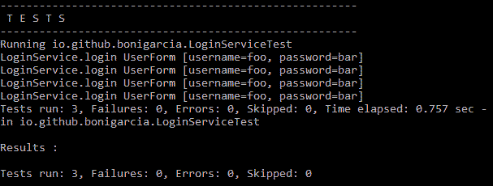

使用 JUnit 5 和 Mockito 执行*LoginServiceTest*的单元测试

下面的类提供了一个捕获模拟对象参数的简单示例。我们定义了一个类型为`ArgumentCaptor<UserForm>`的类属性，该类属性用`@Captor`注释。然后，在测试主体中，执行 SUT（本例中为`LoginService`，并捕获方法 login 的参数。最后，评估该论点的价值：

```java
package io.github.bonigarcia;

import static org.junit.jupiter.api.Assertions.*assertEquals*;
import static org.mockito.Mockito.*verify*;

import org.junit.jupiter.api.Test;
import org.junit.jupiter.api.extension.ExtendWith;
import org.mockito.ArgumentCaptor;
import org.mockito.Captor;
import org.mockito.InjectMocks;
import org.mockito.Mock;
import io.github.bonigarcia.mockito.MockitoExtension;

@ExtendWith(MockitoExtension.class)
class LoginServiceChaptorTest {

    @InjectMocks
    LoginService loginService;

    @Mock
    LoginRepository loginRepository;

    @Captor
    ArgumentCaptor<UserForm> argCaptor;

    UserForm userForm = new UserForm("foo", "bar");

    @Test
    void testArgumentCaptor() {
        loginService.login(userForm);
        *verify*(loginRepository).login(argCaptor.capture());
        *assertEquals*(userForm, argCaptor.getValue());
    }

}
```

再次，在控制台中，我们检查 SUT 是否已执行，测试是否声明为成功：

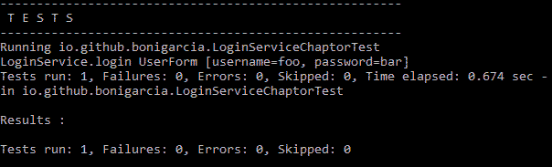

使用 JUnit 5 和 Mockito 执行*LoginServiceChaptorTest*的单元测试

我们在本章中看到的最后一个与 Mockito 有关的例子与间谍的使用有关。正如前面介绍的，默认情况下，间谍在非存根方法中使用实际实现。因此，如果我们不在 spy 对象中存根方法，我们得到的就是测试中的真实对象。这就是下一个示例中发生的情况。如我们所见，我们使用`LoginService`作为我们的 SUT，然后我们监视对象`LoginRepository`。由于在测试主体中，我们没有在 spy 对象中编程期望，因此我们正在测试中评估真实系统。

总之，测试数据准备好获得正确的登录（使用用户名为`user`，密码为`p1`，这在`LoginRepository`的实际实现中存在于硬编码值中），然后获得一些不成功登录的伪值：

```java
package io.github.bonigarcia;

import static org.junit.jupiter.api.Assertions.*assertFalse*;
import static org.junit.jupiter.api.Assertions.*assertTrue*;
 import org.junit.jupiter.api.Test;
import org.junit.jupiter.api.extension.ExtendWith;
import org.mockito.InjectMocks;
import org.mockito.Spy;
import io.github.bonigarcia.mockito.MockitoExtension;

@ExtendWith(MockitoExtension.class)
class LoginServiceSpyTest {

    @InjectMocks
    LoginService loginService;

    @Spy
    LoginRepository loginRepository;

    UserForm userOk = new UserForm("user1", "p1");
    UserForm userKo = new UserForm("foo", "bar");

    @Test
    void testLoginOk() {
        *assertTrue*(loginService.login(userOk));
    }

    @Test
    void testLoginKo() {
        *assertFalse*(loginService.login(userKo));
    }
}
```

在 shell 中，我们可以检查两个测试是否正确执行，在这种情况下，实际组件（包括`LoginService`和`LoginRepository`）实际执行了：

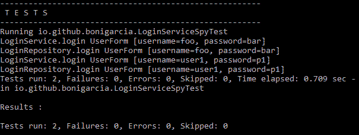

使用 JUnit 5 和 Mockito 执行*LoginServicesByTest*的单元测试

这些示例演示了 Mockito 的一些功能，当然不是全部。欲了解更多信息，请访问[官方 Mockito 参考资料](http://site.mockito.org/)。

# Spring

[Spring](https://spring.io/) 是一个用于构建企业应用程序的开源 Java 框架。2002 年 10 月，Rod Johnson 与他的书*专家一对一 J2EE 设计和开发*一起首次撰写了这本书。Spring 最初的动机是摆脱 J2EE 的复杂性，提供一个轻量级的基础设施，旨在使用简单的 pojo 作为构建块简化企业应用程序的开发。

# 一言以蔽之

Spring 框架的核心技术被称为**控制反转**（**IoC**），这是在实际使用这些对象的类之外实例化对象的过程。这些对象在 Spring 行话中称为 bean 或组件，默认情况下创建为*单例*对象。负责创建 bean 的实体称为 SpringIOC 容器。这是通过**依赖项注入**（**DI**实现的，这是提供一个对象的依赖项而不是自己构建它们的过程。

IoC 和 DI 经常互换使用。然而，如前一段所述，这些概念并不完全相同（IoC 是通过 DI 实现的）。

如本节下一部分所述，Spring 是一个模块化框架。`spring-context`模块中提供了 Spring 的核心功能（即 IoC）。该模块提供创建**应用上下文**的能力，即 Spring 的 DI 容器。在 Spring 中有许多不同的方法来定义应用程序上下文。以下是两种最重要的类型：

*   `AnnotationConfigApplicationContext`：应用程序上下文，它接受带注释的类来标识要在容器中执行的 SpringBean。在这种类型的上下文中，bean 通过使用注释`@Component`注释普通类来标识。它不是唯一一个将类声明为 Springbean 的类。还有更多的原型注释：`@Controller`（表示层原型，用于 web 模块，MVC）、`@Repository`（持久层原型，用于数据访问模块，称为 Spring 数据）和`@Service`（用于服务层）。这三个注释用于分离应用程序的各个层。最后，使用`@Configuration`注释的类允许通过使用`@Bean`注释方法来定义 Springbeans（这些方法返回的对象将是容器中的 Springbeans）：

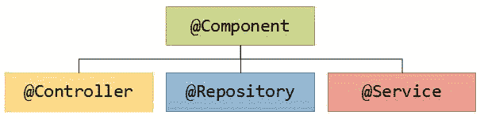

用于定义 bean 的 Spring 原型

*   `ClassPathXmlApplicationContext`：应用程序上下文，它接受在项目类路径中的 XML 文件中声明的 bean 定义。

Spring2.5 引入了基于注释的上下文配置。springioc 容器与配置元数据（即 bean 定义）的实际写入格式完全解耦。如今，许多开发人员选择基于注释的配置，而不是基于 XML 的配置。因此，在本书中，我们将在示例中仅使用基于注释的上下文配置。

让我们看一个简单的例子。首先，我们需要在我们的项目中包含`spring-context`依赖项。例如，作为 Maven 依赖项：

```java
<dependency>
    <groupId>org.springframework</groupId>
    <artifactId>spring-context</artifactId>
    <version>${spring-context.version}</version>
</dependency>
```

然后，我们创建一个可执行的 Java 类（即，使用 main 方法）。注意，在这个类中，类级别有一个注释：`@ComponentScan`。这是 Spring 中非常重要的注释，因为它允许声明 Spring 将在其中以注释的形式查找 bean 定义的包。如果未定义特定的包（如示例中所示），则将从声明此注释的类的包（在示例中为包`io.github.bonigarcia`）进行扫描。在 main 方法的主体中，我们使用`AnnotationConfigApplicationContext`创建 Spring 应用程序上下文。从该上下文中，我们得到了类为`MessageComponent`的 Spring 组件，并将其`getMessage()`方法的结果写入标准输出：

```java
package io.github.bonigarcia;

import org.springframework.context.annotation.AnnotationConfigApplicationContext;
import org.springframework.context.annotation.ComponentScan;

@ComponentScan
public class MySpringApplication {

    public static void main(String[] args) {
        try (AnnotationConfigApplicationContext context = new 
                AnnotationConfigApplicationContext(
                MySpringApplication.class)) {
            MessageComponent messageComponent = context
                    .getBean(MessageComponent.class);
            System.*out*.println(messageComponent.getMessage());
        }
    }

}
```

bean`MessageComponent`在下面的类中定义。请注意，它只是在类级别使用注释`@Component`声明为 Spring 组件。然后，在本例中，我们使用类构造函数注入另一个名为`MessageService`的 Spring 组件：

```java
package io.github.bonigarcia;

import org.springframework.beans.factory.annotation.Autowired;
import org.springframework.stereotype.Component;

@Component
public class MessageComponent {

    private MessageService messageService;

    public MessageComponent(MessageService messageService) {
       this.messageService = messageService;
    }

    public String getMessage() {
        return messageService.getMessage();
    }

}
```

此时，值得回顾一下执行 Spring 组件依赖项注入的不同方式：

1.  字段注入：注入的组件是一个带有`@Autowired`注释的类字段，就像前面的示例一样。作为一个好处，这种注入可以消除杂乱的代码，例如 setter 方法或构造函数参数。
2.  Setter 注入：注入的组件被声明为类中的一个字段，然后为该字段创建一个 Setter 并用`@Autowired`注释。

3.  构造函数注入：在类构造函数中注入依赖项，并用`@Autowired`（图中为 3-a）注释。这是前面示例中显示的方式。从 Spring 4.3 开始，不再需要用`@Autowired`注释构造函数来执行注入（3-b）。

最新的注入方式（*3-b*）有几个好处，例如在不需要反射机制的情况下提高可测试性（例如，通过模拟库实现）。此外，它可以让开发人员考虑类的设计，因为许多注入的依赖项假设了许多构造函数参数，这应该避免（*上帝对象*反模式）。

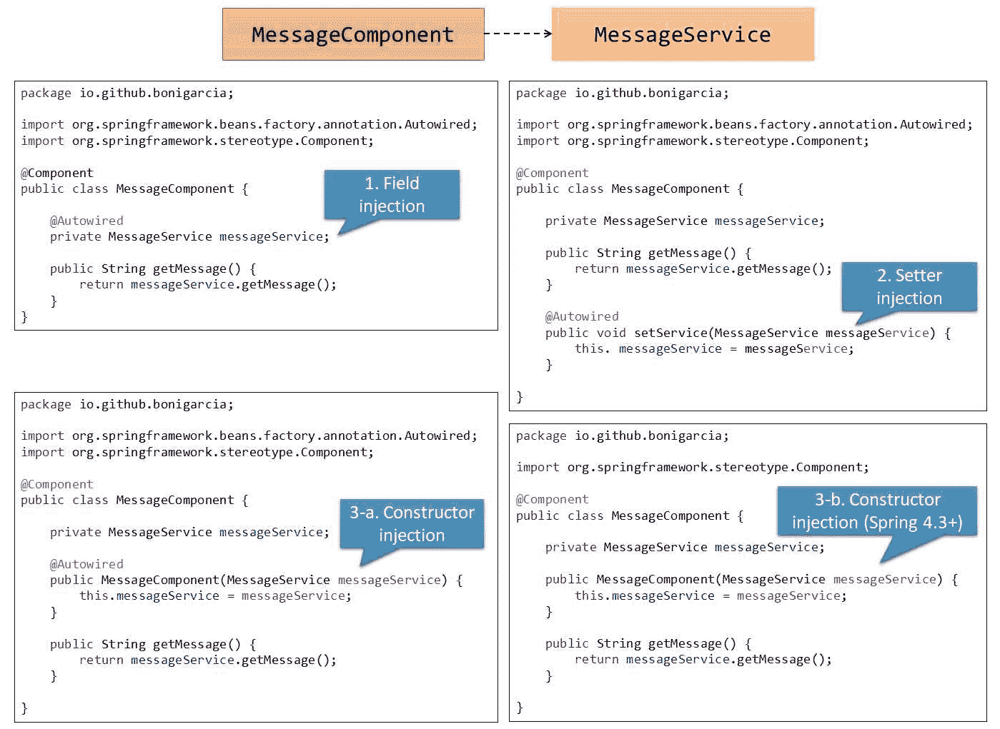

Spring 中依赖项注入（自动连线）的不同方式

我们示例中的最后一个组件名为`MessageService`。请注意，这也是一个 Spring 组件，这次用`@Service`注释以说明其服务性质（从功能角度来看，这与用`@Component`注释类相同）：

```java
package io.github.bonigarcia;

import org.springframework.stereotype.Service;

@Service
public class MessageService {

    public String getMessage() {
        return "Hello world!";
    }

}
```

现在，如果我们执行本例的主类（称为`MySpringApplication`，请参见此处的源代码），我们将创建一个基于注释的应用程序上下文，并尝试使用资源（这样，应用程序上下文将在最后关闭）。Spring IoC 容器将创建两个 bean：`MessageService`和`MessageComponet`。使用应用程序上下文，我们寻找 bean`MessageComponet`并调用其方法`getMessage`，最终写入标准输出：

```java
package io.github.bonigarcia;

import org.springframework.context.annotation.AnnotationConfigApplicationContext;
import org.springframework.context.annotation.ComponentScan;

@ComponentScan
public class MySpringApplication {

    public static void main(String[] args) {
        try (AnnotationConfigApplicationContext context = new 
                AnnotationConfigApplicationContext(
                MySpringApplication.class)) {
            MessageComponent messageComponent = context
                    .getBean(MessageComponent.class);
            System.*out*.println(messageComponent.getMessage());
        }
    }

}
```

# Spring模块

Spring 框架是模块化的，允许开发人员只使用框架提供的所需模块。此模块的完整列表可在[这里](https://spring.io/projects)找到。下表总结了一些最重要的问题：

| **Spring 工程** | **标识** | **说明** |
| --- | --- | --- |
| Spring 框架 |  | 为 DI、事务管理、web 应用程序（Spring MCV）、数据访问、消息传递等提供核心支持。 |
| Spring IO 平台 |  | 将核心 SpringAPI 整合到一个内聚的、版本化的基础平台中，用于现代应用程序。 |
| SpringBoot |  | 以最少的配置简化了基于 Spring 的独立生产级应用程序的创建。它遵循传统的配置方法。 |
| SpringData |  | 通过使用关系数据库、NoSQL、map reduce 算法等全面的 API 简化数据访问。 |
| SpringCloud |  | 提供一组库和通用模式，用于构建和部署分布式系统和微服务。 |
| SpringSecurity |  | 为基于 Spring 的应用程序提供可定制的身份验证和授权功能。 |
| Spring 集成 |  | 为基于 Spring 的应用程序提供轻量级、基于 POJO 的消息传递，以便与外部系统集成。 |
| SpringBatch |  | 提供一个轻量级框架，旨在为企业系统的操作开发健壮的批处理应用程序。 |

# Spring试验简介

Spring 是一个名为`spring-test`的模块，支持 Spring 组件的单元测试和集成测试。在其他特性中，该模块提供了创建用于测试目的的 Spring 应用程序上下文的能力，或者创建用于单独测试代码的模拟对象的能力。有不同的注释支持此测试功能。最重要的一项清单如下：

*   `@ContextConfiguration`：此注释用于确定如何为集成测试加载和配置`ApplicationContext`。例如，它允许从注释类（使用元素类）或 XML 文件中声明的 bean 定义（使用元素位置）加载应用程序上下文。
*   `@ActiveProfiles`：此注释用于指示容器在应用程序上下文加载期间应激活哪些定义配置文件（例如，开发和测试配置文件）。
*   `@TestPropertySource`：此注释用于配置属性文件的位置和要添加的内联属性。
*   `@WebAppConfiguration`：此注释用于指示Spring上下文`ApplicationContext`加载的是`WebApplicationContext.`

此外，`spring-test`模块还提供了多种功能来执行测试中通常需要的不同操作，即：

*   `org.springframework.mock.web`包包含一组 Servlet API 模拟对象，用于测试 web 上下文。例如，对象`MockMvc`允许执行 HTTP 请求（`POST`、`GET`、`PUT`、`DELETE`等）并验证响应（状态码、内容类型或响应主体）。
*   `org.springframework.mock.jndi`包包含**Java 命名和目录接口**（**JNDI**）SPI 的实现，可用于建立简单的 JNDI 测试环境。例如，使用`SimpleNamingContextBuilder`类，我们可以在测试中使用 JNDI 数据源。
*   `org.springframework.test.jdbc`包包含类`JdbcTestUtils`，它是 JDBC 实用程序函数的集合，旨在简化标准数据库访问。
*   `org.springframework.test.util`包包含类`ReflectionTestUtils`，它是一组实用方法的集合，用于在测试应用程序代码时设置非公共字段或调用私有/受保护的 setter 方法。

# 测试 Spring 启动应用程序

如前所述，Spring Boot 是 Spring 产品组合的一个项目，旨在简化 Spring 应用程序的开发。使用 Spring Boot 的主要好处总结如下：

*   Spring 引导应用程序只是一个 Spring`ApplicationContext`，其中使用了配置上的主要约定。多亏了这一点，我们可以更快地开始 Spring 开发。
*   注释`@SpringBootApplication`用于标识 Spring Boot 项目中的主类。
*   提供了一系列开箱即用的非功能特性：嵌入式 servlet 容器（Tomcat、Jetty 和 Undertow）、安全性、度量、运行状况检查或外部化配置。
*   创建仅使用命令`java -jar`运行的独立运行应用程序（即使对于 web 应用程序也是如此）。
*   Spring Boot**命令行界面**（**CLI**允许运行 Groovy 脚本，以便使用 Spring 快速原型化。
*   Spring Boot 的工作方式与任何标准 Java 库相同，也就是说，要使用它，我们只需在项目类路径中添加适当的`spring-boot-*.jar`（通常使用 Maven 或 Gradle 等构建工具）。Spring Boot 提供了许多*启动器*，旨在简化将不同库添加到类路径的过程。下表包含其中几个启动器：

| **名称** | **说明** |
| --- | --- |
| `spring-boot-starter` | 核心启动器，包括自动配置支持和日志记录 |
| `spring-boot-starter-batch` | Spring批用起动器 |
| `spring-boot-starter-cloud-connectors` | 使用 SpringCloudConnectors 的初学者，它简化了与云平台（如 CloudFoundry 和 Heroku）中的服务的连接 |
| `spring-boot-starter-data-jpa` | 将 Spring 数据 JPA 与 Hibernate 结合使用的启动程序 |
| `spring-boot-starter-integration` | 使用 Spring 集成的启动器 |
| `spring-boot-starter-jdbc` | 将 JDBC 与 Tomcat JDBC 连接池一起使用的初学者 |
| `spring-boot-starter-test` | 用于使用库（包括 JUnit、Hamcrest 和 Mockito）测试 Spring 引导应用程序的初学者 |
| `spring-boot-starter-thymeleaf` | 用于使用 IELAF 视图构建 MVC web 应用程序的初学者 |
| `spring-boot-starter-web` | 使用 SpringMVC 构建 web（包括 REST）应用程序的初学者。使用 Tomcat 作为默认的嵌入式容器 |
| `spring-boot-starter-websocket` | 使用 Spring 框架的 WebSocket 支持构建 WebSocket 应用程序的初学者 |

有关 Spring Boot 的完整信息，请访问[官方参考资料](https://projects.spring.io/spring-boot/)。

SpringBoot 提供了不同的功能来简化测试。例如，它提供了`@SpringBootTest`注释，用于测试类的类级别。此注释将为这些测试创建`ApplicationContext`（与`@ContextConfiguration`类似，但用于基于 Spring 引导的应用程序）。正如我们在前面的章节中所看到的，`spring-test`模块中，我们使用注释`@ContextConfiguration(classes=… )`来指定要加载的 bean 定义（Spring`@Configuration`。在测试 Spring 引导应用程序时，这通常不是必需的。SpringBoot 的测试注释将自动搜索主配置（如果没有明确定义）。搜索算法从包含测试的包开始，直到找到一个`@SpringBootApplication`注释类。

SpringBoot 还促进了对 Spring 组件使用模拟。为此，提供了注释`@MockBean`。此注释允许在`ApplicationContext`中为 bean 定义 Mockito mock。它可以是新的 bean，但也可以替换单个现有的 bean 定义。模拟 bean 在每个测试方法之后自动重置。这种方法通常被称为容器内测试，与容器外测试相对应，其中使用模拟库（例如，Mockito）对Spring组件进行单元测试，以隔离，而不需要Spring`ApplicationContext`。例如，Spring 应用程序的两种单元测试的示例将在下一节中显示。

# 用于 Spring 的 JUnit5 扩展

为了将`spring-test`功能集成到 JUnit5 的 Jupiter 编程模型中，开发了`SpringExtension`。从Spring 5 开始，此延长件是`spring-test`模块的一部分。让我们一起来看看 JUnit5 和 Spring5 的几个示例。

假设我们要对前一节中描述的 Spring 应用程序进行容器内集成测试，该测试由三个类组成：`MySpringApplication`、`MessageComponent`和`MessageService`。正如我们所了解的，为了针对该应用程序实施 Jupiter 测试，我们需要执行以下步骤：

1.  用`@ContextConfiguration`注释我们的测试类，以指定需要加载的`ApplicationContext`。
2.  用`@ExtendWith(SpringExtension.class)`注释我们的测试类，以启用`spring-test`进入 Jupiter。
3.  注入我们要在测试类中评估的 Spring 组件。
4.  实施我们的测试（`@Test`。

例如：

```java
package io.github.bonigarcia;

import static org.junit.jupiter.api.Assertions.*assertEquals*;

import org.junit.jupiter.api.Test;
import org.junit.jupiter.api.extension.ExtendWith;
import org.springframework.beans.factory.annotation.Autowired;
import org.springframework.test.context.ContextConfiguration;
import org.springframework.test.context.junit.jupiter.SpringExtension;

@ExtendWith(SpringExtension.class)
@ContextConfiguration(classes = { MySpringApplication.class })
class SimpleSpringTest {

    @Autowired
    public MessageComponent messageComponent;

    @Test
    public void test() {
        *assertEquals*("Hello world!", messageComponent.getMessage());
    }

}
```

这是一个非常简单的示例，其中评估了名为`MessageComponent`的Spring组件。当本测试开始时，我们的`ApplicationContext`启动，所有Spring组件都在里面。之后，在本例中，将 bean`MessageComponent`注入测试中，只需调用方法`getMessage()`并验证其响应即可对其进行评估。

值得回顾一下此测试需要哪些依赖项。使用 Maven 时，这些依赖项如下所示：

```java
    <dependencies>
        <dependency>
            <groupId>org.springframework</groupId>
            <artifactId>spring-context</artifactId>
            <version>${spring.version}</version>
        </dependency>
        <dependency>
            <groupId>org.springframework</groupId>
            <artifactId>spring-test</artifactId>
            <version>${spring.version}</version>
            <scope>test</scope>
        </dependency>
        <dependency>
            <groupId>org.junit.jupiter</groupId>
            <artifactId>junit-jupiter-api</artifactId>
            <version>${junit.jupiter.version}</version>
            <scope>test</scope>
        </dependency>
    </dependencies>
```

另一方面，如果我们使用 Gradle，dependencies 子句将如下所示：

```java
dependencies {
    compile("org.springframework:spring-context:${springVersion}")
    testCompile("org.springframework:spring-test:${springVersion}")
    testCompile("org.junit.jupiter:junit-jupiter-api:${junitJupiterVersion}")
    testRuntime("org.junit.jupiter:junit-jupiter-engine:${junitJupiterVersion}")
}
```

请注意，在这两种情况下，都需要`spring-context`依赖项来实现应用程序，然后我们需要`spring-test`和`junit-jupiter`来测试它。为了实现等效的应用程序和测试，但这次使用 Spring Boot，首先我们需要更改我们的`pom.xml`（使用 Maven 时）：

```java
<project  xmlns:xsi="http://www.w3.org/2001/XMLSchema-instance"
    xsi:schemaLocation="http://maven.apache.org/POM/4.0.0 http://maven.apache.org/xsd/maven-4.0.0.xsd">
    <modelVersion>4.0.0</modelVersion>
    <groupId>io.github.bonigarcia</groupId>
    <artifactId>junit5-spring-boot</artifactId>
    <version>1.0.0</version>

    <parent>
        <groupId>org.springframework.boot</groupId>
        <artifactId>spring-boot-starter-parent</artifactId>
        <version>2.0.0.M3</version>
    </parent>

    <properties>
        <junit.jupiter.version>5.0.0</junit.jupiter.version>
        <junit.platform.version>1.0.0</junit.platform.version>
        <java.version>1.8</java.version>
        <maven.compiler.target>${java.version}</maven.compiler.target>
        <maven.compiler.source>${java.version}</maven.compiler.source>
        <project.build.sourceEncoding>UTF-8</project.build.sourceEncoding>
        <project.reporting.outputEncoding>UTF-8</project.reporting.outputEncoding>
    </properties>

    <dependencies>
        <dependency>
            <groupId>org.springframework.boot</groupId>
            <artifactId>spring-boot-starter</artifactId>
        </dependency>
        <dependency>
            <groupId>org.springframework.boot</groupId>
            <artifactId>spring-boot-starter-test</artifactId>
            <scope>test</scope>
        </dependency>
        <dependency>
            <groupId>org.junit.jupiter</groupId>
            <artifactId>junit-jupiter-api</artifactId>
            <version>${junit.jupiter.version}</version>
            <scope>test</scope>
        </dependency>
    </dependencies>

    <build>
        <plugins>
            <plugin>
                <artifactId>maven-surefire-plugin</artifactId>
                <dependencies>
                    <dependency>
                        <groupId>org.junit.platform</groupId>
                        <artifactId>junit-platform-surefire-provider</artifactId>
                        <version>${junit.platform.version}</version>
                    </dependency>
                    <dependency>
                        <groupId>org.junit.jupiter</groupId>
                        <artifactId>junit-jupiter-engine</artifactId>
                        <version>${junit.jupiter.version}</version>
                    </dependency>
                </dependencies>
            </plugin>
            <plugin>
                <groupId>org.springframework.boot</groupId>
                <artifactId>spring-boot-maven-plugin</artifactId>
                <executions>
                    <execution>
                        <goals>
                            <goal>repackage</goal>
                        </goals>
                    </execution>
                </executions>
            </plugin>
        </plugins>
    </build>

    <repositories>
        <repository>
            <id>spring-milestones</id>
            <url>https://repo.spring.io/libs-milestone</url>
        </repository>
    </repositories>

    <pluginRepositories>
        <pluginRepository>
            <id>spring-milestones</id>
            <url>https://repo.spring.io/milestone</url>
        </pluginRepository>
    </pluginRepositories>

</project>
```

或我们的`build.gradle`（使用 Gradle 时）：

```java
buildscript {
    ext {
        springBootVersion = '2.0.0.M3'
        junitPlatformVersion = '1.0.0'
    }

    repositories {
        mavenCentral()
        maven {
            url 'https://repo.spring.io/milestone'
        }
    }

    dependencies {
        classpath("org.springframework.boot:spring-boot-gradle-plugin:${springBootVersion}")
        classpath("org.junit.platform:junit-platform-gradle-plugin:${junitPlatformVersion}")
    }
}

repositories {
    mavenCentral()
    maven {
        url 'https://repo.spring.io/libs-milestone'
    }
}

apply plugin: 'java'
apply plugin: 'eclipse'
apply plugin: 'idea'
apply plugin: 'org.springframework.boot'
apply plugin: 'io.spring.dependency-management'
apply plugin: 'org.junit.platform.gradle.plugin'

jar {
    baseName = 'junit5-spring-boot'
    version = '1.0.0'
}

compileTestJava {
    sourceCompatibility = 1.8
    targetCompatibility = 1.8
    options.compilerArgs += '-parameters'
}

dependencies {
    compile('org.springframework.boot:spring-boot-starter')
    testCompile("org.springframework.boot:spring-boot-starter-test")
    testCompile("org.junit.jupiter:junit-jupiter-api:${junitJupiterVersion}")
    testRuntime("org.junit.jupiter:junit-jupiter-engine:${junitJupiterVersion}")
}
```

为了将原始 Spring 应用程序转换为 Spring Boot，我们的组件（在示例中称为`MessageComponent`和`MessageService`）将完全相同，但我们的主类将发生一些变化（参见此处）。请注意，我们在类级别使用注释`@SpringBootApplication`，使用 Spring Boot 的典型引导机制实现 main 方法。出于日志记录的目的，我们正在实现一个用`@PostConstruct`注释的方法。此方法将在应用程序上下文启动之前触发：

```java
package io.github.bonigarcia;

import javax.annotation.PostConstruct;
import org.slf4j.Logger;
import org.slf4j.LoggerFactory;
import org.springframework.beans.factory.annotation.Autowired;
import org.springframework.boot.SpringApplication;
import org.springframework.boot.autoconfigure.SpringBootApplication;

@SpringBootApplication
public class MySpringBootApplication {
    final Logger log = LoggerFactory.*getLogger*(MySpringBootApplication.class);

    @Autowired
    public MessageComponent messageComponent;

    @PostConstruct
    private void setup() {
        log.info("*** {} ***", messageComponent.getMessage());
    }

    public static void main(String[] args) throws Exception {
        new SpringApplication(MySpringBootApplication.class).run(args);
    }

}
```

测试的实施将非常简单。我们需要做的唯一更改是用`@SpringBootTest`而不是`@ContextConfiguration`注释测试（Spring Boot 自动查找并启动我们的`ApplicationContext`：

```java
package io.github.bonigarcia;

import static org.junit.jupiter.api.Assertions.*assertEquals*;
 import org.junit.jupiter.api.Test;
import org.junit.jupiter.api.extension.ExtendWith;
import org.springframework.beans.factory.annotation.Autowired;
import org.springframework.boot.test.context.SpringBootTest;
import org.springframework.test.context.junit.jupiter.SpringExtension;

@ExtendWith(SpringExtension.class)
@SpringBootTest
class SimpleSpringBootTest {

    @Autowired
    public MessageComponent messagePrinter;

    @Test
    public void test() {
        *assertEquals*("Hello world!", messagePrinter.getMessage());
    }

}
```

在控制台中执行测试时，我们可以看到应用程序实际上是在测试之前启动的（请注意开头的 spring ASCII 横幅）。

之后，我们的测试使用`ApplicationContext`对一个Spring组件进行验证，结果测试成功：

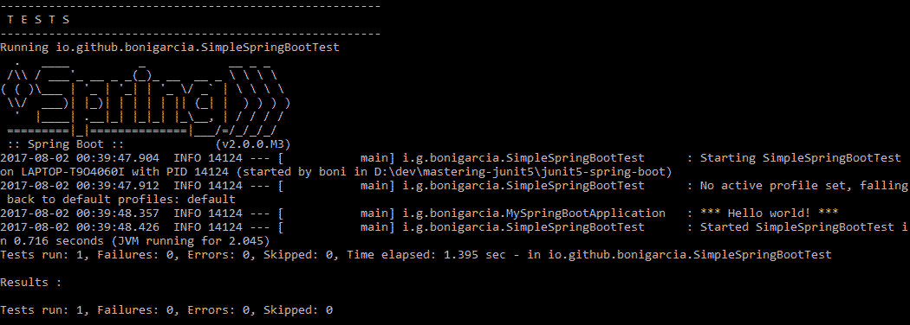

使用 springboot 执行测试

最后，我们将看到一个使用 Spring Boot 实现的简单 web 应用程序。关于依赖项，我们需要做的唯一更改是包含已启动的`spring-boot-starter-web`（而不是通用的`spring-boot-starter`）。就这样，我们可以开始实现基于 Spring 的 web 应用程序了。

我们将实现一个非常简单的`@Controller`，即 Springbean，它处理来自浏览器的请求。在我们的示例中，控制器映射的唯一 URL 是默认资源`/`：

```java
package io.github.bonigarcia;

import static org.springframework.web.bind.annotation.RequestMethod.*GET*;

import org.springframework.beans.factory.annotation.Autowired;
import org.springframework.stereotype.Controller;
import org.springframework.web.bind.annotation.RequestMapping;

@Controller
public class WebController {

    @Autowired
    private PageService pageService;

    @RequestMapping(value = "/", method = *GET*)
    public String greeting() {
        return pageService.getPage();
    }

}
```

该组件注入一个名为`PageService`的服务，负责将响应请求而要加载的实际页面返回给`/`。这项服务的内容也非常简单：

```java
package io.github.bonigarcia;

import org.springframework.stereotype.Service;

@Service
public class PageService {

    public String getPage() {
        return "/index.html";
    }

}
```

按照惯例（我们在这里使用 Spring 引导），基于 Spring 的 web 应用程序的静态资源位于项目类路径中名为`static`的文件夹中。按照 Maven/Gradle 项目的结构，该文件夹位于`src/main/resources`路径中（见下面的屏幕截图）。请注意，这里有两个页面（我们在测试中从一个页面切换到另一个页面，请继续关注）：

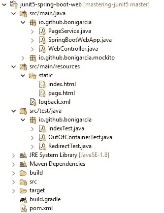

示例项目*junit5 spring boot web*的内容

让我们继续讨论有趣的部分：测试。我们正在这个项目中实施三个 Jupiter 测试。第一个用于验证对页面`/index.html`的直接调用。如前所述，该测试需要使用Spring延长件（`@ExtendWith(SpringExtension.class)`并声明为Spring启动测试（`@SpringBootTest`。为了实现对 web 应用程序的请求，我们使用了一个`MockMvc`实例，通过几种方式（HTTP 响应代码、内容类型和响应内容体）验证响应。此实例使用 Spring Boot 注释`@AutoConfigureMockMvc`自动配置。

在 Spring Boot 之外，可以使用名为`MockMvcBuilders`的构建器类来创建对象`MockMvc`，而不是使用`@AutoConfigureMockMvc`。在本例中，应用程序上下文用作该生成器的参数。

```java
package io.github.bonigarcia;

import static org.hamcrest.core.StringContains.*containsString*;
import static org.springframework.test.web.servlet.request.MockMvcRequestBuilders.*get*;
import static org.springframework.test.web.servlet.result.MockMvcResultMatchers.*content*;
import static org.springframework.test.web.servlet.result.MockMvcResultMatchers.*status*;

import org.junit.jupiter.api.Test;
import org.junit.jupiter.api.extension.ExtendWith;
import org.springframework.beans.factory.annotation.Autowired;
import org.springframework.boot.test.autoconfigure.web.servlet.AutoConfigureMockMvc;
import org.springframework.boot.test.context.SpringBootTest;
import org.springframework.test.context.junit.jupiter.SpringExtension;
import org.springframework.test.web.servlet.MockMvc;

@ExtendWith(SpringExtension.class)
@SpringBootTest
@AutoConfigureMockMvc
class IndexTest {

    @Autowired
    MockMvc mockMvc;

    @Test
    void testIndex() throws Exception {
        mockMvc.perform(*get*("/index.html")).andExpect(*status*().isOk())
                .andExpect(*content*().contentType("text/html")).andExpect(
                        *content*().string(*containsString*("This is index 
                        page")));
    }

}
```

同样，在 shell 中运行此测试，我们检查应用程序是否实际执行。默认情况下，嵌入式 Tomcat 监听端口`8080`。之后，测试成功执行：

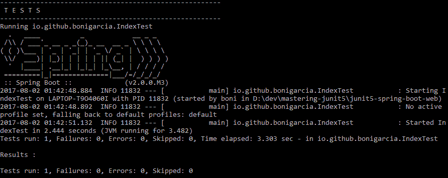

容器内首次测试的控制台输出

第二个测试类似，但作为一个差异因素，它使用测试能力`@MockBean`通过模拟覆盖Spring组件（在本例中为`PageService`）。在测试主体中，首先我们将模拟的方法`getPage`存根，以将组件的默认响应更改为`redirect:/page.html`。因此，当使用对象`MockMvc`在测试中请求资源`/`时，我们将获得一个 HTTP 302 响应（重定向）到资源`/page.html`（实际上是一个现有页面，如项目截图所示）：

```java
package io.github.bonigarcia;

import static org.mockito.Mockito.*doReturn*;
import static org.springframework.test.web.servlet.request.MockMvcRequestBuilders.*get*;
import static org.springframework.test.web.servlet.result.MockMvcResultMatchers.*redirectedUrl*;
import static org.springframework.test.web.servlet.result.MockMvcResultMatchers.*status*;

import org.junit.jupiter.api.Test;
import org.junit.jupiter.api.extension.ExtendWith;
import org.springframework.beans.factory.annotation.Autowired;
import org.springframework.boot.test.autoconfigure.web.servlet.AutoConfigureMockMvc;
import org.springframework.boot.test.context.SpringBootTest;
import org.springframework.boot.test.mock.mockito.MockBean;
import org.springframework.test.context.junit.jupiter.SpringExtension;
import org.springframework.test.web.servlet.MockMvc;

@ExtendWith(SpringExtension.class)
@SpringBootTest
@AutoConfigureMockMvc
class RedirectTest {

    @MockBean
    PageService pageService;

    @Autowired
    MockMvc mockMvc;

    @Test
    void test() throws Exception {
        *doReturn*("redirect:/page.html").when(pageService).getPage();
        mockMvc.perform(*get*("/")).andExpect(*status*().isFound())
                .andExpect(*redirectedUrl*("/page.html"));
    }

}
```

类似地，在 shell 中，我们可以确认测试启动了 Spring 应用程序，然后正确执行：

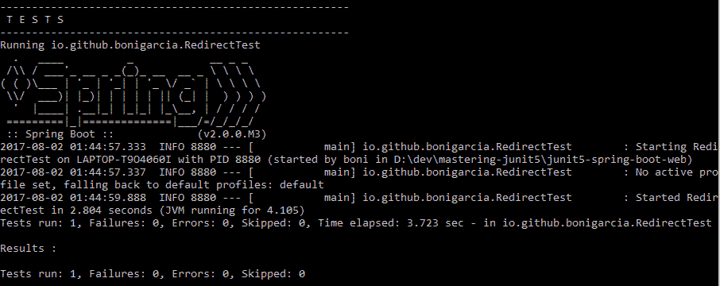

容器内第二次测试的控制台输出

本项目的最后一个测试是*集装箱外*测试的一个示例。在前面的测试示例中，测试中使用了 Spring 上下文。另一方面，以下内容完全依赖于 Mockito 来执行系统的组件，这次没有启动 Spring 应用程序上下文。注意，我们在这里使用的是`MockitoExtension`扩展，使用组件`WebController`作为我们的 SUT（`@InjectMocks`），组件`PageService`作为 DOC（`@Mock`：

```java
package io.github.bonigarcia;

import static org.junit.jupiter.api.Assertions.assertEquals;
import static org.mockito.Mockito.times;
import static org.mockito.Mockito.verify;
import static org.mockito.Mockito.when;

import org.junit.jupiter.api.Test;
import org.junit.jupiter.api.extension.ExtendWith;
import org.mockito.InjectMocks;
import org.mockito.Mock;
import io.github.bonigarcia.mockito.MockitoExtension;

@ExtendWith(MockitoExtension.class)
class OutOfContainerTest {

    @InjectMocks
    private WebController webController;

    @Mock
    private PageService pageService;

    @Test
    void test() {
        when(pageService.getPage()).thenReturn("/my-page.html");
        assertEquals("/my-page.html", webController.greeting());
        verify(pageService, times(1)).getPage();
    }

}
```

这一次，在执行测试时，我们没有看到 spring 跟踪，因为在执行测试之前应用程序容器没有启动：

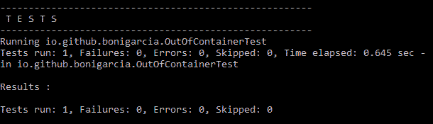

容器外测试的控制台输出

# Selenium

[Selenium](http://www.seleniumhq.org/) 是一个开源的 web 测试框架，自 2008 年成立以来，已将自己建立为*事实上的*web 自动化库。在下一节中，我们将回顾 Selenium 的主要特性以及如何在 JUnit5 测试中使用它。

# 简言之，Selenium

Selenium由不同的项目组成。首先，我们找到了Selenium IDE。它是一个 Firefox 插件，为 web 应用程序实现 R**ecord 和回放**（**R&P**模式。因此，它允许记录与 Firefox 的手动交互以及以自动方式进行的回放。

第二个项目名为**Selenium遥控**（**RC**。该组件能够使用不同的编程语言（如 Java、C#、Python、Ruby、PHP、Perl 或 JavaScript）自动驱动不同类型的浏览器。该组件在 SUT 中注入了一个 JavaScript 库（称为 Selenium Core）。该库由一个名为 Selenium RC Server 的中间组件控制，该组件接收来自测试代码的请求（参见下图）。由于同源策略，Selenium RC 存在重要的安全问题。

出于这个原因，2016 年它被弃用，取而代之的是 Selenium WebDriver：

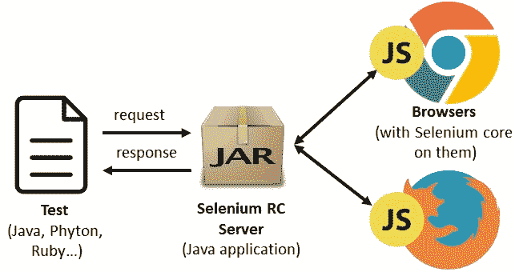

Selenium RC 模式

我们回顾 SeleniumRC 只是为了介绍 SeleniumWebDriver。如今，Selenium RC 已被弃用，它的使用也极不受欢迎。

从功能的角度来看，SeleniumWebDriver 相当于 RC（也就是说，允许使用代码控制浏览器）。作为一个不同的方面，Selenium WebDriver 使用每个浏览器对自动化的本机支持来调用浏览器。Selenium WebDriver 提供的语言绑定（在下图中标记为 Test）与特定于浏览器的二进制文件进行通信，该二进制文件充当真实浏览器之间的桥梁。例如，这个二进制文件被称为[ChromeDriver](https://sites.google.com/a/chromium.org/chromedriver/) 用于 Chrome，[GeckoDriver](https://github.com/mozilla/geckodriver) 用于 Firefox。测试和驱动程序之间的通信是使用 JSON 消息通过 HTTP 通过所谓的 JSON Wire 协议完成的。

此机制最初由 WebDriver 团队提出，并在 [W3C WebDriver API](https://www.w3.org/TR/webdriver/) 中进行了标准化：

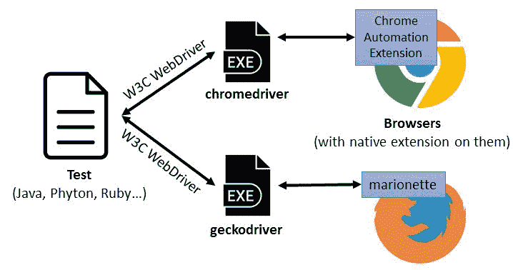

Selenium WebDriver schema

Selenium 项目组合的最后一个项目称为 Selenium Grid。它可以看作是 SeleniumWebDriver 的扩展，因为它允许在远程机器上分发浏览器执行。有许多节点，每个节点运行在不同的操作系统和不同的浏览器上。集线器服务器跟踪节点并向其发送代理请求（参见下图）：

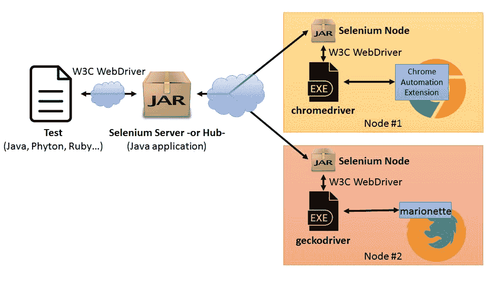

Selenium Grid schema

下表总结了 WebDriver API 的主要功能：

WebDriver 对象创建：它允许创建 WebDriver 实例，这些实例从测试代码中用于远程控制浏览器。

```java
WebDriver driver = new FirefoxDriver();

WebDriver driver = new ChromeDriver();

WebDriver driver = new OperaDriver();
```

导航：它允许导航到给定的 URL。

```java
driver.get("http://junit.org/junit5/");
```

定位元素：它允许使用不同的策略识别网页（WebElement）中的元素：按 id、名称、类名、CSS 选择器、链接文本、标记名或 XPath 

```java
WebElement webElement = driver.findElement(By.*id("id"));* driver.findElement(By.*name("name"));* driver.findElement(By.*className("class"));* driver.findElement(By.*cssSelector("cssInput"));* driver.findElement(By.*linkText("text"));* driver.findElement(By.*tagName("tag name"));* driver.findElement(By.*xpath("/html/body/div[4]"));*
```

与元素交互：从给定的 WebElement，我们可以执行不同类型的自动交互，例如单击元素、键入文本或清除输入字段、读取属性等。

```java
webElement.click();
webElement.sendKeys("text");
webElement.clear();
String text = webElement.getText();
String href = webElement.getAttribute("href");
String css = webElement.getCssValue("css");
Dimension dim = webElement.getSize();
boolean enabled = webElement.isEnabled();
boolean selected = webElement.isSelected();
boolean displayed = webElement.isDisplayed();
```

句柄等待：WebDriver 可以显式和隐式地处理等待。

```java
// Explicit
WebDriverWait wait = new WebDriverWait(driver, 30);
wait.until(ExpectedConditions);

// Implicit wait
driver.manage().timeouts().implicitlyWait(30, ***SECONDS***);
```

XPath（XML 路径语言）是一种用于构建表达式以解析和处理类似 XML 的文档（例如 HTML）的语言

# 用于 Selenium 的 JUnit5 扩展

为了简化 SeleniumWebDriver 在 JUnit5 中的使用，可以使用名为`selenium-jupiter`的开源 JUnit5 扩展。这个扩展是使用 JUnit5 的扩展模型提供的依赖注入功能构建的。由于这个特性，不同类型的对象可以作为参数注入 JUnit5 中的`@Test`方法中。具体来说，`selenium-jupiter`允许注入`WebDriver`接口的子类型（例如，`ChromeDriver`、`FirefoxDriver`等）。

使用`selenium-jupiter`非常简单。首先，我们需要在项目中导入依赖项（通常作为测试依赖项）。在 Maven 中，操作如下：

```java
<dependency>
        <groupId>io.github.bonigarcia</groupId>
        <artifactId>selenium-jupiter</artifactId>
        <version>${selenium-jupiter.version}</version>
        <scope>test</scope>
</dependency>
```

`selenium-jupiter`依赖于几个库，这些库在我们的项目中作为传递性`dependencies`添加，即：

*   `Selenium-java`（`org.seleniumhq.selenium:selenium-java`：Selenium WebDriver 的 Java 库。
*   `WebDriverManager`（`io.github.bonigarcia:webdrivermanager`）：用于在 Java 运行时自动管理 [Selenium WebDriver 二进制文件的 Java 库](https://github.com/bonigarcia/webdrivermanager)。
*   Appium（`io.appium:java-client`）：Appium 的 Java 客户端，测试框架，扩展 Selenium [以自动测试本地、混合和移动 web 应用程序](http://appium.io/)。

一旦`selenium-jupiter`包含在我们的项目中，我们需要在 JUnit5 测试中声明`selenium-jupiter`扩展，只需用`@ExtendWith(SeleniumExtension.class)`注释它。然后，我们需要在`@Test`方法中包含一个或多个参数，其类型实现 WebDriver 接口，并且`selenium-jupiter`在内部控制 WebDriver 对象的生命周期。`selenium-jupiter`支持的 WebDriver 子类型如下：

*   `ChromeDriver`：用于控制 Google Chrome 浏览器。
*   `FirefoxDriver`：用于控制 Firefox 浏览器。
*   `EdgeDriver`：用于控制 Microsoft Edge 浏览器。
*   `OperaDriver`：用于控制 Opera 浏览器。
*   `SafariDriver`：用于控制 Apple Safari 浏览器（仅适用于 OSX El Capitan 或更高版本）。
*   `HtmlUnitDriver`：用于控制 HtmlUnit（无头浏览器，即没有 GUI 的浏览器）。
*   `PhantomJSDriver`：用于控制 PhantomJS（另一种无头浏览器）。
*   `InternetExplorerDriver`：用于控制 Microsoft Internet Explorer。虽然支持此浏览器，但不推荐使用 Internet Explorer（支持 Edge），并且强烈建议不要使用它。
*   `RemoteWebDriver`：用于控制远程浏览器（Selenium Grid）。
*   `AppiumDriver`：用于控制移动设备（Android 和 iOS）。

考虑下面的类，它使用了胡 T0T，即使用 MultT1。本例定义了三个测试，它们将使用本地浏览器执行。第一个（名为`testWithChrome`）使用 Chrome 作为浏览器。为此，由于`selenium-jupiter`*的依赖注入特性，*方法只需使用`ChromeDriver`类型声明一个方法参数。然后，在测试主体中，在该对象中调用`WebDriver`API。请注意，此简单测试将打开一个网页，并断言标题与预期一致。接下来，test（`testWithFirefoxAndOpera`类似，但这次同时使用两种不同的浏览器：Firefox（使用`FirefoxDriver`实例）和 Opera（使用`OperaDriver`实例）。第三个也是最后一个测试（`testWithHeadlessBrowsers`声明并使用两个无头浏览器（`HtmlUnit`和`PhantomJS`）：

```java
package io.github.bonigarcia;

import static org.junit.jupiter.api.Assertions.assertNotNull;
import static org.junit.jupiter.api.Assertions.assertTrue;
 import org.junit.jupiter.api.Test;
import org.junit.jupiter.api.extension.ExtendWith;
import org.openqa.selenium.chrome.ChromeDriver;
import org.openqa.selenium.firefox.FirefoxDriver;
import org.openqa.selenium.htmlunit.HtmlUnitDriver;
import org.openqa.selenium.opera.OperaDriver;
import org.openqa.selenium.phantomjs.PhantomJSDriver;

@ExtendWith(SeleniumExtension.class)
public class LocalWebDriverTest {

    @Test
    public void testWithChrome(ChromeDriver chrome) {
        chrome.get("https://bonigarcia.github.io/selenium-jupiter/");
        assertTrue(chrome.getTitle().startsWith("selenium-jupiter"));
    }

    @Test
    public void testWithFirefoxAndOpera(FirefoxDriver firefox,
            OperaDriver opera) {
        firefox.get("http://www.seleniumhq.org/");
        opera.get("http://junit.org/junit5/");
        assertTrue(firefox.getTitle().startsWith("Selenium"));
        assertTrue(opera.getTitle().equals("JUnit 5"));
    }

    @Test
    public void testWithHeadlessBrowsers(HtmlUnitDriver htmlUnit,
            PhantomJSDriver phantomjs) {
        htmlUnit.get("https://bonigarcia.github.io/selenium-jupiter/");
        phantomjs.get("https://bonigarcia.github.io/selenium-jupiter/");
        assertTrue(htmlUnit.getTitle().contains("JUnit 5 extension"));
        assertNotNull(phantomjs.getPageSource());
    }

}
```

为了正确执行这个测试类，应该在运行它之前安装所需的浏览器（Chrome、Firefox 和 Opera）。另一方面，无头浏览器（HtmlUnit 和 PhantomJS）作为 Java 依赖项使用，因此不需要手动安装它们。

让我们看另一个例子，这次使用远程浏览器（即 Selenium 网格）。同样，这个类使用了`selenium-jupiter`扩展名。测试（`testWithRemoteChrome`声明了一个名为`remoteChrome`的参数，类型为`RemoteWedbrider`。此参数用`@DriverUrl`和`@DriverCapabilities`注释，分别指定 Selenium 服务器（或集线器）URL 和所需的功能。关于功能，我们正在配置使用 Chrome 浏览器版本 59：

要正确运行此测试，应该在本地主机中启动并运行 Selenium 服务器，并且需要在集线器中注册节点（Chrome 59）。

```java
package io.github.bonigarcia;

import static org.junit.jupiter.api.Assertions.assertTrue;
 import org.junit.jupiter.api.Test;
import org.junit.jupiter.api.extension.ExtendWith;
import org.openqa.selenium.remote.RemoteWebDriver;

@ExtendWith(SeleniumExtension.class)
public class RemoteWebDriverTest {

    @Test
    void testWithRemoteChrome(
            @DriverUrl("http://localhost:4444/wd/hub") 
            @DriverCapabilities(capability = {
                   @Capability(name = "browserName", value ="chrome"),
                   @Capability(name = "version", value = "59") }) 
                   RemoteWebDriver remoteChrome)
            throws InterruptedException {
        remoteChrome.get("https://bonigarcia.github.io/selenium-    
            jupiter/");
        assertTrue(remoteChrome.getTitle().contains("JUnit 5 
            extension"));
    }

}
```

在本节的最后一个示例中，我们使用了`AppiumDriver`。具体来说，我们将在 Android 模拟设备（`@DriverCapabilities`中）中使用 Chrome 浏览器设置为功能。同样，此模拟器需要在运行测试的机器上启动并运行：

```java
package io.github.bonigarcia;

import static org.junit.jupiter.api.Assertions.assertTrue;
 import org.junit.jupiter.api.Test;
import org.junit.jupiter.api.extension.ExtendWith;
import org.openqa.selenium.By;
import org.openqa.selenium.WebElement;
import org.openqa.selenium.remote.DesiredCapabilities;
import io.appium.java_client.AppiumDriver;

@ExtendWith(SeleniumExtension.class)
public class AppiumTest {

    @DriverCapabilities
    DesiredCapabilities capabilities = new DesiredCapabilities();
    {
        capabilities.setCapability("browserName", "chrome");
        capabilities.setCapability("deviceName", "Android");
    }

    @Test
    void testWithAndroid(AppiumDriver<WebElement> android) {
        String context = android.getContext();
        android.context("NATIVE_APP");
        android.findElement(By.id("com.android.chrome:id/terms_accept"))
                .click();
        android.findElement(By.id("com.android.chrome:id/negative_button"))
                .click();
        android.context(context);
        android.get("https://bonigarcia.github.io/selenium-jupiter/");
        assertTrue(android.getTitle().contains("JUnit 5 extension"));
    }

}
```

有关`selenium-jupiter`的更多示例，请访问[这里](https://bonigarcia.github.io/selenium-jupiter/)。

# 黄瓜

[Cucumber](https://cucumber.io/) 是一个测试框架，旨在自动化按照**行为驱动开发**（**BDD**风格编写的验收测试。Cucumber 是用 Ruby 编写的，不过也有其他语言（包括 Java、JavaScript 和 Python）的实现。

# 黄瓜壳

Cucumber 执行用名为 Gherkin 的语言编写的指定测试。它是一种具有给定结构的纯文本自然语言（例如，英语或 Cucumber 支持的其他 60 多种语言之一）。小黄瓜被设计成供非程序员使用，通常是客户、业务分析、经理等等。

小黄瓜文件的扩展名为`*.feature*`。

在小黄瓜文件中，非空行可以以关键字开头，然后是自然语言中的文本。主要关键词如下：

*   **特性**：待测试软件特性的高层描述。它可以看作是一个用例描述。
*   **场景**：说明业务规则的具体示例。场景遵循相同的模式：
    *   描述初始上下文。
    *   描述一个事件。
    *   描述预期结果。

这些动作在小黄瓜术语中被称为步骤，主要是**给出**、**当**时，或**然后**：

有两个额外的步骤：**和**（用于逻辑和不同的步骤）和**但**（用于**和**的否定形式）。

*   **给定**：测试开始前的先决条件和初始状态。
*   **当**时：用户在测试过程中采取的动作。
*   **然后**：在**当**条款中采取行动的结果。
*   **背景**：为了避免在不同场景中重复步骤，关键字 Background 允许声明这些步骤，这些步骤在后续场景中重复使用。
*   **场景大纲**：步骤用变量标记的场景（使用符号`**<**`和`**>**`。
*   **示例**：场景大纲声明后面总是有一个或多个示例部分，这是一个容器表，其中包含**场景大纲**中声明的变量的值。

当一行不以关键字开头时，Cucumber 不会解释该行。它用于自定义描述。

一旦我们定义了要测试的功能，我们就需要所谓的*步骤定义*，它允许将纯文本小黄瓜翻译成实际执行 SUT 的动作。在 Java 中，可以很容易地通过注释对步骤实现的方法进行注释：`@Given`、`@Then`、`@When`、`@And`和`@But`。每个步骤的字符串值可以包含正则表达式，这些正则表达式在方法中映射为字段。请参见下一节中的示例。

# 黄瓜 JUnit 5 的扩展

Cucumber artifacts for Java 的最新版本包含一个 JUnit 5 Cucumber 扩展。本节包含在 Gherkin 和 JUnit 5 中定义的一个功能的完整示例，用于使用 Cucumber 执行该功能。与往常一样，[本例的源代码托管在 GitHub 上](https://github.com/bonigarcia/mastering-junit5)。

包含此示例的项目结构如下所示：

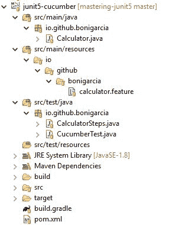

JUnit5 与 Cucumber 项目结构和内容

首先，我们需要创建小黄瓜文件，该文件旨在测试一个简单的计算器系统。这个计算器将是 SUT 或我们的测试。我们的专题文件内容如下：

```java
Feature: Basic Arithmetic
  Background: A Calculator
    Given a calculator I just turned on
  Scenario: Addition
    When I add 4 and 5
    Then the result is 9
  Scenario: Substraction
    When I substract 7 to 2
    Then the result is 5
  Scenario Outline: Several additions
    When I add <a> and <b>
*    Then the result is <c>
*  Examples: Single digits
    | a | b | c  |
    | 1 | 2 | 3  |
    | 3 | 7 | 10 |
```

然后，我们需要实现步骤定义。如前所述，我们使用注释和正则表达式将小黄瓜文件中包含的文本映射到 SUT 的实际练习，具体取决于以下步骤：

```java
package io.github.bonigarcia;

import static org.junit.jupiter.api.Assertions.assertEquals;

import cucumber.api.java.en.Given;
import cucumber.api.java.en.Then;
import cucumber.api.java.en.When;
 public class CalculatorSteps {

    private Calculator calc;

    @Given("^a calculator I just turned on$")
    public void setup() {
        calc = new Calculator();
    }

    @When("^I add (\\d+) and (\\d+)$")
    public void add(int arg1, int arg2) {
        calc.push(arg1);
        calc.push(arg2);
        calc.push("+");
    }

    @When("^I substract (\\d+) to (\\d+)$")
    public void substract(int arg1, int arg2) {
        calc.push(arg1);
        calc.push(arg2);
        calc.push("-");
    }

    @Then("^the result is (\\d+)$")
    public void the_result_is(double expected) {
        assertEquals(expected, calc.value());
    }

}
```

当然，我们仍然需要实现 JUnit5 测试。为了实现 Cucumber 与 JUnit 5 的集成，Cucumber 扩展需要通过`@ExtendWith(CucumberExtension.**class**)`在我们班注册。在内部，`CucumberExtension`实现了 Jupiter 扩展模型的`ParameterResolver`回调。目标是将黄瓜特征的相应测试作为 Jupiter`DynamicTest`对象注入测试中。注意，在示例中，`@TestFactory`是如何使用的。

或者，我们可以用`@CucumberOptions`注释我们的测试类。此注释允许为我们的测试配置 Cumber 设置。此批注允许的元素包括：

*   `plugin`：内置格式化程序：pretty、progress、JSON、usage 等。默认值：`{}`。
*   `dryRun`：检查所有步骤是否都有定义。默认值：`false`。
*   `features`：特征文件的路径。默认值：`{}`。
*   `glue`：步骤定义的路径。默认值：`{}`。
*   `tags`：待执行特征中的标签。默认值`{}`。
*   `monochrome`：以可读的方式显示控制台输出。默认值：`false`。
*   `format`：要使用的报表格式化程序。默认值：`{}`。
*   `strict`：如果存在未定义或挂起的步骤，则失败。默认值：`false`。

```java
package io.github.bonigarcia;

import java.util.List;
import java.util.stream.Collectors;
import java.util.stream.Stream;
import org.junit.jupiter.api.DynamicTest;
import org.junit.jupiter.api.TestFactory;
import org.junit.jupiter.api.extension.ExtendWith;
import cucumber.api.CucumberOptions;
import cucumber.api.junit.jupiter.CucumberExtension;

@CucumberOptions(plugin = { "pretty" })
@ExtendWith(CucumberExtension.class)
public class CucumberTest {

    @TestFactory
    public Stream<DynamicTest> runCukes(Stream<DynamicTest> scenarios) {
        List<DynamicTest> tests = scenarios.collect(Collectors.*toList*());
        return tests.stream();
    }

}
```

此时，我们可以使用 JUnit5 执行 Cumber 套件。在下面的示例中，我们看到使用 Gradle 运行测试时的输出：

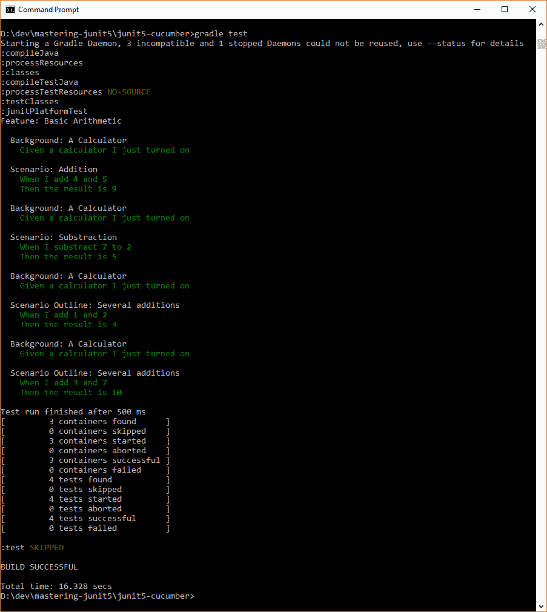

用黄瓜和青瓜生产 JUnit 5

# Docker

[Docker](https://www.docker.com/) 是一种开源软件技术，允许将任何应用程序打包并作为轻量级便携容器运行。它提供了一个命令行程序、一个后台守护程序和一组远程服务，简化了容器的生命周期。

# 简言之，Docker

在历史上，UNIX 风格的操作系统使用“牢狱”一词来描述经过修改的隔离运行时环境。**Linux 容器**（**LXC**项目始于 2008 年，将 cGroup、内核名称空间或 chroot（以及其他）集合在一起，以提供完整的隔离执行。LXC 的问题在于它的难度，正因为如此，Docker 技术应运而生。

Docker 隐藏在 Linux 内核的上述资源隔离特性（cgroups、内核名称空间等）的底层复杂性中，以允许独立容器在单个 Linux 实例中运行。Docker 提供了一个高级 API，允许将任何应用程序作为容器进行打包、装运和运行。

在 Docker 中，容器包含应用程序及其依赖项。多个容器可以在同一台机器上运行，并与其他容器共享同一操作系统内核。每个容器在用户空间中作为独立进程运行。

与**虚拟机**（**虚拟机**不同，在 Docker 容器中不需要使用虚拟机监控程序，虚拟机监控程序是允许创建和运行虚拟机的软件（例如：VirtualBox、VMware、QEMU 或虚拟 PC）。

VM 和容器的体系结构如下图所示：

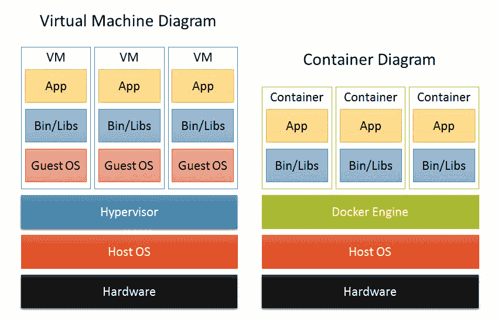

虚拟机与容器

Docker 平台有两个组件：Docker 引擎，负责创建和运行容器；以及 [Docker Hub](https://hub.docker.com/)，一种用于分发容器的云服务。Docker Hub 提供了大量可供下载的公共容器映像。Docker 引擎是一个客户机-服务器应用程序，由三个主要组件组成：

*   作为守护进程（即`dockerd`命令）实现的服务器。
*   一个 RESTAPI，它指定了程序可以用来与守护进程对话并指示它做什么的接口。
*   一个**命令行界面**（**CLI**客户端）（`docker`命令）。

# Docker 的 JUnit5 扩展

如今，容器正在改变我们开发、分发和运行软件的方式。这对于**持续集成**（**CI**）测试环境来说尤其有趣，其中与 Docker 的融合直接影响效率的提高。

关于 JUnit5，在撰写本文时，Docker 有一个开源 JUnit5 扩展，名为 [JUnit5 Docker](https://faustxvi.github.io/junit5-docker/)。此扩展充当 Docker 引擎的客户端，并允许在运行类测试之前启动 Docker 容器（从 Docker Hub 下载）。该容器在测试结束时停止。为了使用 JUnit5 Docker，首先我们需要在项目中添加依赖项。在 Maven：

```java
<dependency>
   <groupId>com.github.faustxvi</groupId>
   <artifactId>junit5-docker</artifactId>
   <version>${junit5-docker.version}</version>
   <scope>test</scope>
</dependency>
```

在格拉德尔：

```java
dependencies {
    testCompile("com.github.faustxvi:junit5-docker:${junitDockerVersion}")
}
```

JUnit5 Docker 的使用非常简单。我们只需要用`@Docker`注释我们的测试类。此注释中可用的图元如下所示：

*   `image`：待启动的 Docker 镜像。
*   `ports`：Docker 容器的端口映射。这是必需的，因为容器必须至少有一个端口可见才能使用。
*   `environments`：传递给 docker 容器的可选环境变量。默认值：`{}`。
*   `waitFor`：运行测试前等待的可选日志。默认值：`@WaitFor(NOTHING)`。
*   `newForEachCase`：布尔标志，用于确定是否应为每个测试用例重新创建容器。如果只为测试类创建一次，则该值将为 false。默认值：`true`。

考虑下面的例子。这个测试类使用`@Docker`注释来启动 MySql 容器（容器图像 MySql）和每个测试的开始。内部集装箱端口为`3306`，将映射到主机端口`8801`。然后，定义了几个环境属性（MySql 根密码、默认数据库以及用户名和密码）。直到容器日志中出现跟踪*mysqld:ready for connections*（表示 MySql 实例已启动并正在运行）后，测试才会开始执行。在测试主体中，我们针对容器中运行的 MySQL 实例启动 JDBC 连接。

此测试已在 Windows 计算机上执行。因此，JDBCURL 的主机是 192.168.99.100，这是 Docker 机器的 IP。它是一个允许在虚拟主机上安装 Docker 引擎的工具，如 Windows 或 p[Mac](https://docs.docker.com/machine/)。在 Linux 机器中，该 IP 可以是 127.0.0.1（localhost）。

```java
package io.github.bonigarcia;
 import static org.junit.jupiter.api.Assertions.*assertFalse*;

import java.sql.Connection;
import java.sql.DriverManager;
import org.junit.jupiter.api.Test;
import com.github.junit5docker.Docker;
import com.github.junit5docker.Environment;
import com.github.junit5docker.Port;
import com.github.junit5docker.WaitFor;

@Docker(image = "mysql", ports = @Port(exposed = 8801, inner = 3306), environments = {
        @Environment(key = "MYSQL_ROOT_PASSWORD", value = "root"),
        @Environment(key = "MYSQL_DATABASE", value = "testdb"),
        @Environment(key = "MYSQL_USER", value = "testuser"),
        @Environment(key = "MYSQL_PASSWORD", value = "secret"), }, 
            waitFor = @WaitFor("mysqld: ready for connections"))

public class DockerTest {

    @Test
   void test() throws Exception {
        Class.*forName*("com.mysql.jdbc.Driver");
        Connection connection = DriverManager.*getConnection*(
                "jdbc:mysql://192.168.99.100:8801/testdb", "testuser",
                "secret");
        *assertFalse*(connection.isClosed());
        connection.close();
    }

}
```

在 Docker Windows 终端中执行此测试如下：

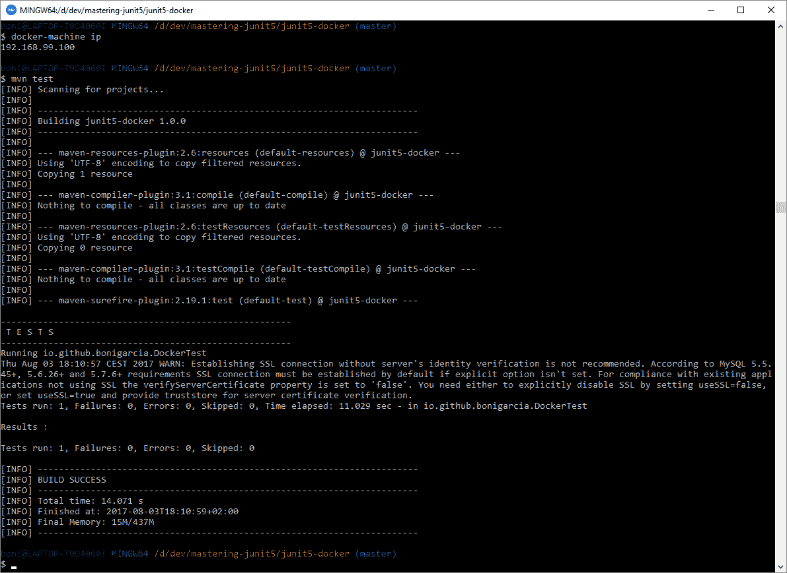

使用 JUnit5 Docker 扩展执行测试

# 安卓

[安卓](https://www.android.com/)是基于 Linux 修改版的开源移动操作系统。它最初由一家名为 Android 的初创公司开发，2005 年被谷歌收购并支持。

根据 Gartner Inc.（美国 IT 研究和咨询公司）的报告，2017 年，Android 和 iOS 占全球智能手机销量的 99%以上，如下图所示：


智能手机操作系统市场。图片由 www.statista.com 创建。

# 简而言之，Android

Android 是一个基于 Linux 的软件栈，分为若干层。这些层（从下到上）如下所示：

*   **Linux 内核**：这是 Android 平台的基础。该层包含 Android 设备各种硬件组件的所有低级设备驱动程序。
*   **硬件抽象层**（**HAL**）：该层提供标准接口，向更高级别的 Java API 框架公开硬件功能。
*   **安卓运行时**（**艺术**）：它为`.dex`文件提供了一个运行时环境，一种字节码格式，旨在减少内存占用。ART 是 Android 5.0 的第一个版本（见下表）。在该版本之前，Dalvik 是 Android 运行时。
*   **原生 C/C++库**：该层包含用 C 和 C++编写的原生库，如用于高性能 2D 和 3D 图形处理的 OpenGL ES。
*   **Java API 框架**：Android 的整个功能集可以通过 Java 编写的 API 提供给开发者。这些 API 是创建 Android 应用程序的构建块，例如：视图系统（用于应用程序 UI）、资源管理器（用于 I18N、图形、布局）、通知管理器（用于状态栏中的自定义警报）、活动管理器（用于管理应用程序生命周期）或内容提供商（启用应用程序从其他应用程序（如联系人等）访问数据）。
*   **应用**：Android 自带一套核心应用，如手机、通讯录、浏览器等。此外，还可以从 Google Play（以前的 Android Market）下载和安装许多其他应用程序：

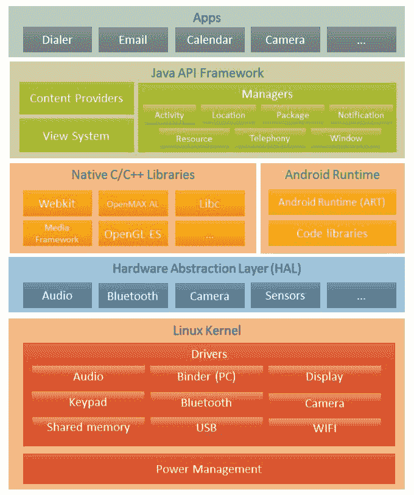

Android layered architecture

Android 自第一次发布以来已经经历了很多次更新，如下表所示：

| **安卓版本** | **代号** | **API 等级** | **Linux 内核版本** | **发布日期** |
| --- | --- | --- | --- | --- |
| 1.5 | Cupcake | 3. | 2.6.27 | 2009 年 4 月 30 日 |
| 1.6 | Donut | 4. | 2.6.29 | 2009 年 9 月 15 日 |
| 2.0, 2.1 | Eclair | 5, 6, 7 | 2.6.29 | 2009 年 10 月 26 日 |
| 2.2 | Froyo | 8 | 2.6.32 | 2010 年 5 月 20 日 |
| 2.3 | Gingerbread | 9, 10 | 2.6.35 | 2010 年 12 月 6 日 |
| 3.0, 3.1, 3.2 | Honeycomb | 11, 12, 13 | 2.6.36 | 2011 年 2 月 22 日 |
| 4 | IceCreamSandwich | 14, 15 | 3.0.1 | 2011 年 10 月 18 日 |
| 4.1, 4.2, 4.3 | JellyBean | 16, 17, 18 | 3.0.31, 3.0.21, 3.4.0 | 2012 年 7 月 9 日 |
| 4.4 | KitKat | 19, 20 | 3.10 | 2013 年 10 月 31 日 |
| 5.0, 5.1 | Lollipop | 21, 22 | 3.16.1 | 2014 年 11 月 12 日 |
| 6 | Marshmallow | 23 | 3.18.10 | 2015 年 10 月 5 日 |
| 7.0, 7.1 | Nougat | 24, 25 | 4.4.1 | 2016 年 8 月 22 日 |
| 8 | AndroidO | 26 | TBA | TBA |

从开发人员的角度来看，Android 提供了丰富的应用程序框架，允许为移动设备构建应用程序。Android 应用程序是用 Java 编程语言编写的。安卓**软件开发工具包**（**SDK**）将 Java 代码连同任何数据和资源文件编译成`.apk`（安卓软件包）文件，该文件包含可安装在安卓驱动的设备中，如智能手机、平板电脑、智能电视或智能手表。

有关 Android 开发的完整信息，请访问[这里](https://developer.android.com/)。

Android Studio 是 Android 开发的官方 IDE。它是基于 IntelliJ 理念构建的。在 Android Studio 中，Android 项目的构建过程由 Gradle 构建系统管理。在 Android Studio 安装期间，还可以安装两个附加工具：

*   **Android SDK**：包含开发 Android 应用程序所需的所有软件包和工具。SDK 管理器允许下载和安装不同版本的 SDK（请参阅上表）。
*   **Android 虚拟设备**（**AVD**）：这是一个模拟器，允许我们对实际设备进行建模。AVD 管理器允许下载和安装不同的模拟 Android 虚拟设备，这些设备分为四类：手机、桌子、电视和手机。

# Android 项目中 JUnit5 的 Gradle 插件

在撰写本文时，Android 项目中还没有对 JUnit5 的官方支持。为了解决这个问题，已经创建了一个名为`android-junit5`的[开源 Gradle 插件](https://github.com/aurae/android-junit5)。要使用此插件，首先我们需要在`build.gradle`文件中指定适当的依赖项：

```java
buildscript {
    dependencies {
        classpath "de.mannodermaus.gradle.plugins:android-junit5:1.0.0"
    }
}
```

为了在我们的项目中使用此插件，我们需要使用我们的`build.gradle`文件中的条款`apply plugin`来扩展我们的项目功能：

```java
apply plugin: "com.android.application"
apply plugin: "de.mannodermaus.android-junit5"

dependencies {
    testCompile junitJupiter()
}
```

`android-junit5`插件配置`junitPlatform`任务，在测试执行阶段自动连接 Jupiter 和 Vintage 引擎。作为一个示例，考虑以下项目示例，通常托管在 [GitHub](https://github.com/bonigarcia/mastering-junit5/tree/master/junit5-android) 上。以下是在 Android Studio 中导入的该项目的屏幕截图：

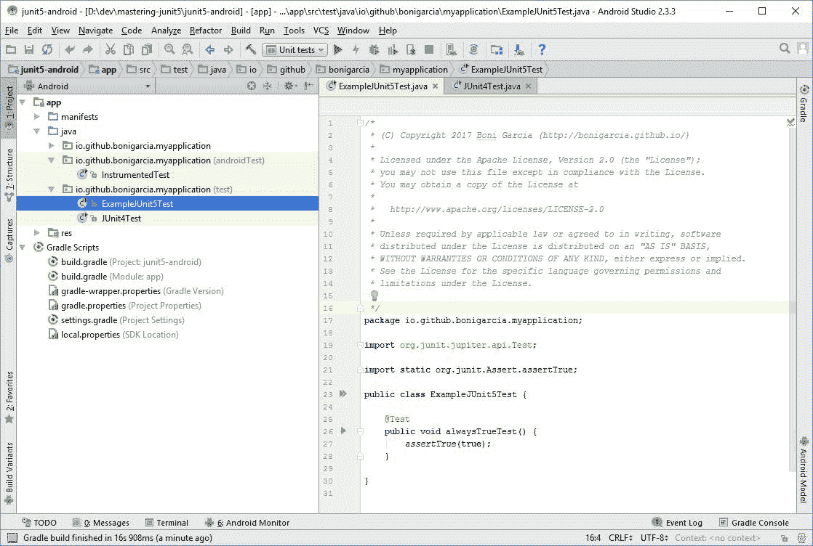

Android project compatible with JUnit 5 on IntelliJ

现在，我们将创建 Android Studio 的 Android JUnit 运行配置。如屏幕截图所示，我们使用选项`All in package`引用包含测试的包（本例中为`io.github.bonigarcia.myapplication`：

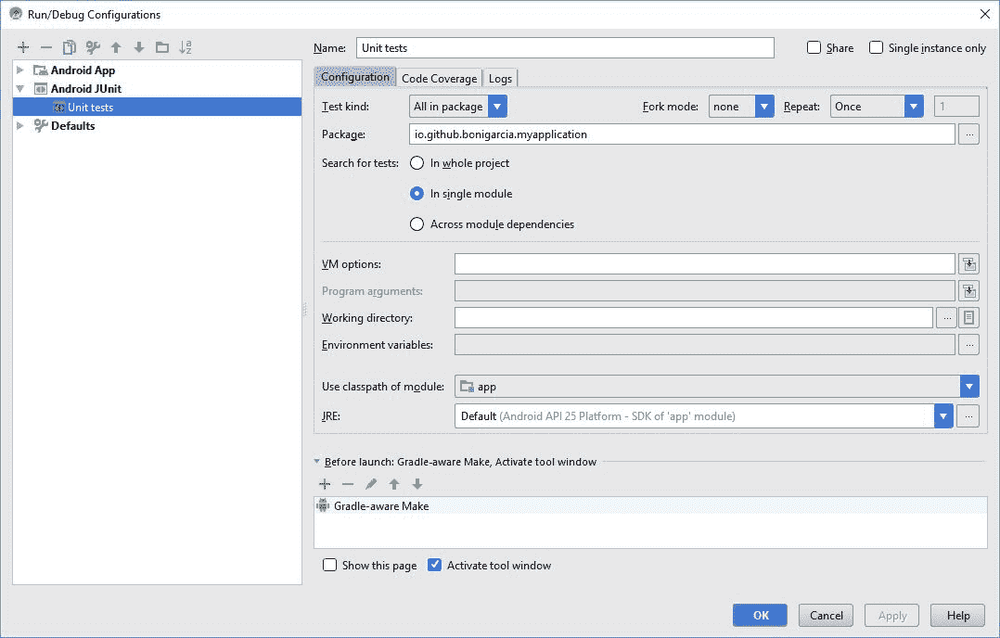

Android JUnit 运行配置

如果我们启动上述运行配置，项目的所有测试都将执行。这些测试可以无缝地使用 JUnit 4 编程模型（Vintage）甚至 JUnit 5（Jupiter）：

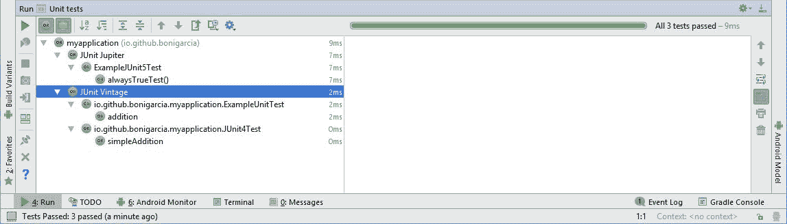

在 IntelliJ 的 Android 项目中执行 Jupiter 和 Vintage 测试

# 休息

罗伊·菲尔丁是 1965 年出生的美国计算机科学家。他是 HTTP 协议的作者之一，也是 ApacheWeb 服务器的共同作者。2000 年，菲尔丁在他的博士论文《体系结构风格与基于网络的软件体系结构的设计》中创造了术语 REST（代表性状态转移的缩写）。REST 是设计分布式系统的一种架构风格。这不是一个标准，而是一组约束。REST 通常与 HTTP 结合使用。一方面，遵循 REST 严格原则的实现通常被称为 RESTful。另一方面，那些遵循这些原则的人被称为 RESTlike。

# 一言以蔽之

REST 遵循客户机-服务器体系结构。服务器负责处理一组服务，监听客户端发出的请求。客户机和服务器之间的通信必须是无状态的，这意味着服务器不存储来自客户机的任何记录，因此来自客户机的每个请求必须包含服务器单独处理它所需的所有信息。

REST 体系结构的构建块称为资源。资源定义要传输的信息类型。应以独特的方式确定资源。在 HTTP 中，访问资源的方法是提供其完整的 URL，也称为 API 端点。每个资源都有一个表示，它是对资源当前状态的机器可读解释。现在，表示通常使用 JSON，但也可以使用其他格式，如 XML 或 YAML。

一旦我们确定了资源和表示格式，我们就需要指定可以使用它们做什么，即操作。尽管任何面向资源的系统都应该提供一组常见的操作：CRUD（创建、检索、更新和删除）操作，但操作可能是任何东西。REST 操作可以映射到 HTTP 方法（所谓的谓词），如下所示：

*   `GET`：读取资源。
*   `POST`：向服务器发送新资源。
*   `PUT`：更新给定资源。
*   `DELETE`：删除一个资源。
*   `PATCH`：部分更新资源。
*   `HEAD`：询问给定资源是否存在，但不返回其任何表示。
*   `OPTIONS`：检索给定资源上可用动词的列表。

在 REST 中，*幂等性*的概念很重要。例如，`GET`、`DELETE`或`PUT`被称为幂等，因为无论命令发送一次还是多次，这些请求的效果都应该相同。另一方面，`POST`不是幂等的，因为每次请求时它都会创建不同的资源。

基于 HTTP 的 REST 可以利用标准 HTTP 状态代码。状态代码是一个数字，它总结了与之相关的响应。REST 中重用的典型 HTTP 状态代码有：

*   `200 OK`：请求顺利，请求内容已返回。通常用于 GET 请求。
*   `201 Created`：资源已创建。对 POST 或 PUT 请求的响应非常有用。
*   `204 No content`：操作成功，但没有返回内容。对于不需要响应主体的操作非常有用，例如删除。
*   `301 Moved permanently`：此资源已移动到另一个位置，并返回该位置。
*   `400 Bad request`：发出的请求存在问题（例如缺少一些必需的参数）。
*   `401 Unauthorized`：当拥有请求的用户无法访问请求的资源时，用于身份验证。
*   `403 Forbidden`：资源不可访问，但与 401 不同，认证不会影响响应。
*   `404 Not found`：提供的 URL 未标识任何资源。
*   405 方法不允许。不允许在资源上使用 HTTP 谓词。（例如，放置在只读资源上）。
*   `500 Internal server error`：服务器端出现意外情况时的一般错误代码。

下图显示了客户机-服务器与 REST 交互的示例。HTTP 消息体对请求和响应都使用 JSON：

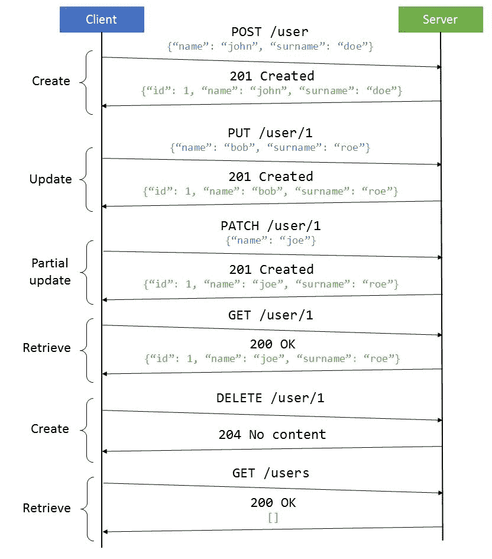

REST sequence diagram example

# 与 Jupiter 一起使用 REST 测试库

RESTAPI 现在变得越来越普及。因此，评估 REST 服务的适当策略是可取的。在本节中，我们将学习如何在 JUnit5 测试中使用几个测试库。

首先，我们可以放心使用[开源库](http://rest-assured.io/)。REST Assured 允许通过受 Ruby 或 Groovy 等动态语言启发的流畅 API 验证 REST 服务。要在测试项目中使用 REST Assured，我们只需在 Maven 中添加适当的依赖项：

```java
<dependency>
   <groupId>io.rest-assured</groupId>
   <artifactId>rest-assured</artifactId>
   <version>${rest-assured.version}</version>
   <scope>test</scope>
</dependency>
```

或者在格拉德尔：

```java
dependencies {
    testCompile("io.rest-assured:rest-assured:${restAssuredVersion}")
}
```

之后，我们可以使用 REST-Assured API。下面的类包含两个测试示例。首先向[免费在线 REST 服务](http://echo.jsontest.com/)发送请求。然后验证响应代码和正文内容是否符合预期。第二个测试使用另一个[免费在线 REST 服务](http://services.groupkt.com/)，并验证响应：

```java
package io.github.bonigarcia;

import static io.restassured.RestAssured.*given*;
import static org.hamcrest.Matchers.*equalTo*;

import org.junit.jupiter.api.Test;
 public class PublicRestServicesTest {

    @Test
    void testEchoService() {
        String key = "foo";
        String value = "bar";
        given().when().get("http://echo.jsontest.com/" + key + "/" + value)
                .then().assertThat().statusCode(200).body(key, 
                equalTo(value));
    }

    @Test
    void testCountryService() {
        *given*().when()
                .get("http://services.groupkt.com/country/get/iso2code/ES")
                .then().assertThat().statusCode(200)
                .body("RestResponse.result.name", *equalTo*("Spain"));
    }

}
```

使用 Maven 在控制台中运行此测试，我们可以检查两个测试是否成功：

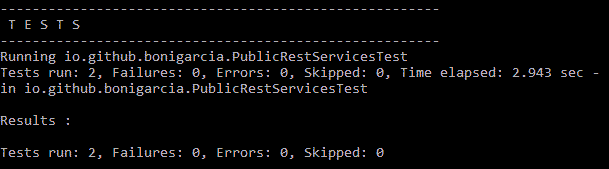

使用 REST-Assured 执行测试

在第二个示例中，我们将研究，除了测试之外，我们还将实现服务器端，即 REST 服务实现。为此，我们将使用本章前面介绍的 SpringMVC 和 SpringBoot（参见第*节 Spring*）。

在 Spring 中实现 REST 服务非常简单。首先，我们只需要用`@RestController`注释一个 Java 类。在这个类的主体中，我们需要添加带有`@RequestMapping`注释的方法。这些方法将侦听 RESTAPI 中实现的不同 URL（端点）。`@RequestMapping`的可接受要素为：

*   `value`：这是路径映射 URL。
*   `method`：查找要映射到的 HTTP 请求方法。
*   `params`：查找映射请求的参数，缩小主映射范围。
*   `headers`：his 查找映射请求的头。
*   `consumes`：查找映射请求的可消耗介质类型。
*   `produces`：查找映射请求的可生产媒体类型。

通过查看以下类的代码可以看出，我们的服务示例实现了三种不同的操作：`GET /books`（读取系统中的所有书籍）、`GET /book/{index}`（读取给定标识符的书籍）和`POST /book`（创建书籍）。

```java
package io.github.bonigarcia;
 import java.util.List;
import org.springframework.beans.factory.annotation.Autowired;
import org.springframework.http.HttpStatus;
import org.springframework.http.ResponseEntity;
import org.springframework.web.bind.annotation.PathVariable;
import org.springframework.web.bind.annotation.RequestBody;
import org.springframework.web.bind.annotation.RequestMapping;
import org.springframework.web.bind.annotation.RequestMethod;
import org.springframework.web.bind.annotation.RestController;

@RestController
public class MyRestController {

    @Autowired
    private LibraryService libraryService;

    @RequestMapping(value = "/books", method = RequestMethod.*GET*)
    public List<Book> getBooks() {
        return libraryService.getBooks();
    }

    @RequestMapping(value = "/book/{index}", method = RequestMethod.*GET*)
    public Book getTeam(@PathVariable("index") int index) {
        return libraryService.getBook(index);
    }

    @RequestMapping(value = "/book", method = RequestMethod.*POST*)
    public ResponseEntity<Boolean> addBook(@RequestBody Book book) {
        libraryService.addBook(book);
        return new ResponseEntity<Boolean>(true, HttpStatus.*CREATED*);
    }

}
```

因为我们正在为 Spring 实现 Jupiter 测试，所以我们需要使用`SpringExtension`和`SpringBootTest`注释。作为创新，我们将注入一个由`spring-test`提供的测试组件，名为`TestRestTemplate`。

这个组件是标准 Spring 的`RestTemplate`对象的包装器，它允许以无缝方式实现 REST 客户机。在我们的测试中，它请求我们的服务（在执行测试之前启动），并使用响应来验证结果。

请注意，对象`MockMvc`（在*Spring*一节中解释）也可以用于测试 REST 服务。`TestRestTemplate`的区别在于前者用于从客户端（即响应代码、主体、内容类型等）测试，后者用于从服务器端测试服务。例如，在这里的示例中，对服务调用（`getForEntity`和`postForEntity`的响应是 Java 对象，其作用域仅为服务器端（在客户端，此信息被序列化为 JSON）。

```java
package io.github.bonigarcia;

import static org.junit.Assert.assertEquals;
import static org.springframework.boot.test.context.SpringBootTest.WebEnvironment.RANDOM_PORT;
import static org.springframework.http.HttpStatus.CREATED;
import static org.springframework.http.HttpStatus.OK;
 import java.time.LocalDate;
import org.junit.jupiter.api.Test;
import org.junit.jupiter.api.extension.ExtendWith;
import org.springframework.beans.factory.annotation.Autowired;
import org.springframework.boot.test.context.SpringBootTest;
import org.springframework.boot.test.web.client.TestRestTemplate;
import org.springframework.http.ResponseEntity;
import org.springframework.test.context.junit.jupiter.SpringExtension;

@ExtendWith(SpringExtension.class)
@SpringBootTest(webEnvironment = RANDOM_PORT)
class SpringBootRestTest {

    @Autowired
    TestRestTemplate restTemplate;

    @Test
    void testGetAllBooks() {
        ResponseEntity<Book[]> responseEntity = restTemplate
                .getForEntity("/books", Book[].class);
        assertEquals(OK, responseEntity.getStatusCode());
        assertEquals(3, responseEntity.getBody().length);
    }

    @Test
    void testGetBook() {
        ResponseEntity<Book> responseEntity = restTemplate
                .getForEntity("/book/0", Book.class);
        assertEquals(OK, responseEntity.getStatusCode());
        assertEquals("The Hobbit", responseEntity.getBody().getName());
    }

    @Test
    void testPostBook() {
        Book book = new Book("I, Robot", "Isaac Asimov",
                LocalDate.of(1950, 12, 2));
        ResponseEntity<Boolean> responseEntity = restTemplate
                .postForEntity("/book", book, Boolean.class);
        assertEquals(CREATED, responseEntity.getStatusCode());
        assertEquals(true, responseEntity.getBody());
        ResponseEntity<Book[]> responseEntity2 = restTemplate
                .getForEntity("/books", Book[].class);
        assertEquals(responseEntity2.getBody().length, 4);
    }

}
```

如下面的屏幕截图所示，我们的 Spring 应用程序在运行测试之前启动，测试成功执行：

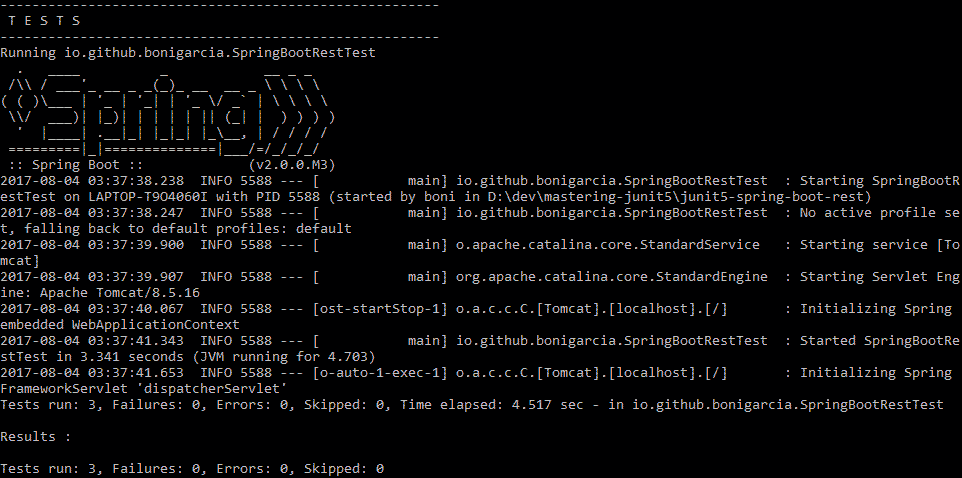

使用 TestRestTemplate 验证 REST 服务的 Jupiter 测试的输出。

在本节结束时，我们将看到一个示例，其中使用 [WireMock](http://wiremock.org/) 库。该库允许模拟 REST 服务，即所谓的 HTTP*模拟服务器*。此模拟服务器捕获对服务的传入请求，并提供存根响应。此功能对于测试使用 REST 服务的系统非常有用，但该服务在测试期间不可用（或者我们可以测试单独调用该服务的组件）。

像往常一样，我们看到一个示例来演示它的用法。假设我们有一个使用远程 REST 服务的系统。为了实现该服务的客户机，我们使用 [Retrofit2](http://square.github.io/retrofit/)，这是一个高度可配置的 Java HTTP 客户端。我们定义了使用此服务的接口，如下面的类所示。请注意，该服务公开了三个用于读取远程文件的端点（打开文件、读取流和关闭流）：

```java
package io.github.bonigarcia;

import okhttp3.ResponseBody;
import retrofit2.Call;
import retrofit2.http.POST;
import retrofit2.http.Path;
 public interface RemoteFileApi {

    @POST("/api/v1/paths/{file}/open-file")
    Call<ResponseBody> openFile(@Path("file") String file);

    @POST("/api/v1/streams/{streamId}/read")
    Call<ResponseBody> readStream(@Path("streamId") String streamId);

    @POST("/api/v1/streams/{streamId}/close")
    Call<ResponseBody> closeStream(@Path("streamId") String streamId);

}
```

然后我们实现使用 REST 服务的类。在本例中，它是一个简单的 Java 类，它连接到远程服务，并将其 URL 作为构造函数参数传递：

```java
package io.github.bonigarcia;

import java.io.IOException;
import okhttp3.ResponseBody;
import retrofit2.Call;
import retrofit2.Response;
import retrofit2.Retrofit;
import retrofit2.adapter.rxjava.RxJavaCallAdapterFactory;
import retrofit2.converter.gson.GsonConverterFactory;
 public class RemoteFileService {

    private RemoteFileApi remoteFileApi;

    public RemoteFileService(String baseUrl) {
        Retrofit retrofit = new Retrofit.Builder()
                .addCallAdapterFactory(RxJavaCallAdapterFactory.*create*())
                .addConverterFactory(GsonConverterFactory.*create*())
                .baseUrl(baseUrl).build();
        remoteFileApi = retrofit.create(RemoteFileApi.class);
    }

    public byte[] getFile(String file) throws IOException {
        Call<ResponseBody> openFile = remoteFileApi.openFile(file);
        Response<ResponseBody> execute = openFile.execute();
        String streamId = execute.body().string();
        System.*out*.println("Stream " + streamId + " open");

        Call<ResponseBody> readStream = remoteFileApi.readStream(streamId);
        byte[] content = readStream.execute().body().bytes();
        System.*out*.println("Received " + content.length + " bytes");

        remoteFileApi.closeStream(streamId).execute();
        System.*out*.println("Stream " + streamId + " closed");

        return content;
    }

}
```

最后，我们实现了一个 JUnit5 测试来验证我们的服务。注意，我们正在创建模拟服务器（`**new** WireMockServer`，并使用 WireMock 在测试设置（`@BeforeEach`中提供的静态方法`stubFor(...)`对 REST 服务调用进行存根。由于在本例中，SUT 非常简单，并且没有文档，因此我们也在每个测试的设置中直接实例化了类`RemoteFileService`，使用模拟服务器 URL 作为构造函数参数。最后，我们测试我们的服务（使用模拟服务器），在本例中，通过调用方法`getFile`并评估其输出，简单地运行名为`wireMockServer`的对象。

```java

package io.github.bonigarcia;

import static com.github.tomakehurst.wiremock.client.WireMock.aResponse;
import static com.github.tomakehurst.wiremock.client.WireMock.configureFor;
import static com.github.tomakehurst.wiremock.client.WireMock.post;
import static com.github.tomakehurst.wiremock.client.WireMock.stubFor;
import static com.github.tomakehurst.wiremock.client.WireMock.urlEqualTo;
import static com.github.tomakehurst.wiremock.core.WireMockConfiguration.options;
import static org.junit.jupiter.api.Assertions.assertEquals;
 import java.io.IOException;
import java.net.ServerSocket;
import org.junit.jupiter.api.AfterEach;
import org.junit.jupiter.api.BeforeEach;
import org.junit.jupiter.api.Test;
import com.github.tomakehurst.wiremock.WireMockServer;

public class RemoteFileTest {

    RemoteFileService remoteFileService;
    WireMockServer wireMockServer;

    // Test data
    String filename = "foo";
    String streamId = "1";
    String contentFile = "dummy";

    @BeforeEach
    void setup() throws Exception {
        // Look for free port for SUT instantiation
        int port;
        try (ServerSocket socket = new ServerSocket(0)) {
            port = socket.getLocalPort();
        }
        remoteFileService = new RemoteFileService("http://localhost:" + 
             port);

        // Mock server
        wireMockServer = new WireMockServer(options().port(port));
        wireMockServer.start();
        configureFor("localhost", wireMockServer.port());

        // Stubbing service
        stubFor(post(urlEqualTo("/api/v1/paths/" + filename + "/open-
           file"))
           .willReturn(aResponse().withStatus(200).withBody(streamId)));
        stubFor(post(urlEqualTo("/api/v1/streams/" + streamId + 
           "/read"))
           .willReturn(aResponse().withStatus(200).withBody(contentFile)));
        stubFor(post(urlEqualTo("/api/v1/streams/" + streamId + /close"))
           .willReturn(aResponse().withStatus(200)));
    }

    @Test
    void testGetFile() throws IOException {
        byte[] fileContent = remoteFileService.getFile(filename);
        assertEquals(contentFile.length(), fileContent.length);
    }

    @AfterEach
    void teardown() {
        wireMockServer.stop();
    }

}
```

在控制台中执行测试，在跟踪中，我们可以看到 WireMock 控制的内部 HTTP 服务器是如何在测试执行之前启动的。然后，测试执行三个 REST 操作（开放流、读取字节、关闭流），最后释放模拟服务器：

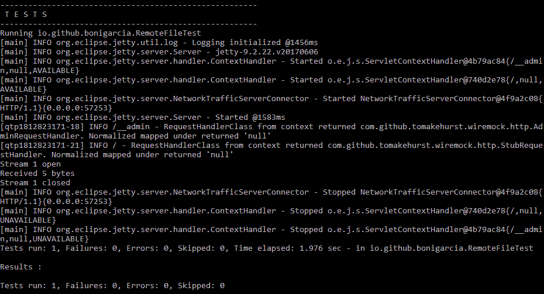

使用 WireMock 使用模拟 REST 服务器执行测试

# 总结

本节详细介绍了 JUnit5 如何与第三方框架、库和平台结合使用。由于 Jupiter 扩展模型，开发人员可以创建扩展，允许与 JUnit5 的外部框架无缝集成。首先，我们看到了*MockitoExtension*，JUnit 5 团队提供了一个扩展，用于在 Jupiter 测试中使用 Mockito（一个臭名昭著的 Java 模拟框架）。然后，我们使用了*SpringExtension*，这是 Spring 框架版本 5 中提供的官方扩展。此扩展将 Spring 集成到 JUnit5 编程模型中。这样，我们就能够在测试中使用 Spring 的应用程序上下文（即 Spring 的 DI 容器）。

我们还回顾了*SeleniumExtension*由*SeleniumJupiter 实施的*SeleniumExtension*是一个开源项目，为 SeleniumWebDriver（web 应用程序测试框架）提供 JUnit5 扩展。感谢 thins 扩展，我们可以使用不同的浏览器与 web 应用程序和模拟移动设备（使用 Appium）自动交互。然后，我们看到了*CucumberExtension，*允许使用 Gherkin 语言指定 JUnit 5 验收测试，该测试遵循 BDD 风格。最后，我们已经了解了如何在执行 JUnit5 测试之前使用开源 JUnit5 Docker 扩展来启动 Docker 容器（从 Docker Hub 下载图像）。*

此外，我们发现扩展模型不是通过 JUnit 测试与外部技术交互的唯一方式。例如，为了在 Android 项目中运行 Jupiter 测试，我们可以使用`android-junit5`插件。另一方面，即使没有使用 JUnit 5 评估 REST 服务的自定义扩展，与此类库的集成也是向前发展的：我们只需要在项目中包含适当的依赖项，并在测试中使用它（例如，REST Assured、Spring 或 WireMock）。