# 测试管理

The important thing is not to stop questioning.
*- Albert Einstein*

这是本书的最后一章，它的目的是指导如何理解软件测试活动在一个活的软件项目中何时以及如何进行管理。为此，本章分为以下几节：

*   **软件开发过程**：在本节中，我们研究了以不同方法执行测试的时间：**行为驱动开发**（**BDD**）、**测试驱动开发**（**TDD**）、**测试先行开发**（**TFD**）和**测试最后开发**（**TLD**）。
*   **持续集成**（**CI**）：在本节中，我们将发现 CI 是一种软件开发实践，在这种实践中，构建、测试和集成的过程是不断进行的。此过程的常见触发因素通常是将新更改（补丁）提交到源代码存储库（例如 GitHub）。此外，在本节中，我们将学习如何扩展 CI，回顾连续交付和连续部署的概念。最后，我们介绍了当今最重要的两个构建服务器：Jenkins 和 Travis CI。
*   **测试报告**：在本节中，我们将首先发现 xUnit 框架通常报告测试执行的 XML 格式。这种格式的问题在于它不是人类可读的。因此，有一些工具可以将 XML 转换为更友好的格式，通常是 HTML。我们回顾了两种选择：Maven Surefire 报告和诱惑。
*   **缺陷跟踪系统**：在本节中，我们回顾了几个问题跟踪：JIRA、Bugzilla、Redmine、MantisBT 和 GitHub 问题。
*   **静态分析**：在本节中，我们一方面回顾了几种自动分析工具（*linters*），如 Checkstyle、FindBugs、PMD 和 SonarQube。另一方面，我们描述了几种同行评审工具，如 Collaborator、Crucible、Gerrit 和 GitHub 请求评审。
*   **将所有的部分放在一起**：为了总结本书，在最后一节中，我们展示了一个完整的示例应用程序，其中使用本书中介绍的一些主要概念执行不同类型的测试（单元、集成和端到端）。

# 软件开发过程

在软件工程中，软件开发过程（也称为软件开发生命周期）是创建软件系统所需的活动、操作和任务的工作流的名称。正如[第 6 章](6.html#4D4J80-ef8404ed083f459d860f84cc8198f8bb)*从需求到测试用例*中介绍的，任何软件开发过程中通常的阶段都是：

*   *什么*的定义：需求获取、分析和用例建模。
*   *how*的定义：系统架构以及结构和行为图的建模。
*   实际的软件开发（编码）。
*   使软件可用的一组活动（发布、安装、激活等）。

在整个软件开发过程中设计和实施测试的时间会导致不同的测试方法，即（见列表后的图表）：

*   **行为驱动开发****（BDD）**：在分析阶段开始时，软件消费者（最终用户或客户）和一些开发团队（通常是项目负责人、经理或分析师）之间进行了对话。这些对话用于具体化场景（即，建立对系统功能的共同理解的具体示例）。这些示例构成了使用 Cucumber 等工具开发验收测试的基础（有关更多详细信息，请参阅[第 5 章](5.html#3KB4K0-ef8404ed083f459d860f84cc8198f8bb)、*JUnit 5 与外部框架的集成*）。BDD 中验收测试的描述（例如，在 Cucumber 中使用小黄瓜）生成准确描述应用程序功能的自动化测试和文档。BDD 方法自然地与迭代或敏捷方法相一致，因为预先定义需求非常困难，并且随着团队对项目了解的深入，需求也会不断变化。

随着 2001 年敏捷宣言（[的诞生，*agil**e*一词开始普及 http://agilemanifesto.org/](http://agilemanifesto.org/) ）。它由 17 位软件从业者（肯特·贝克、詹姆斯·格朗宁、罗伯特·C·马丁、迈克·比德尔、吉姆·海史密斯、史蒂夫·梅勒、阿里·范本内库姆、安德鲁·亨特、肯·施瓦伯、阿利斯泰尔·科伯恩、罗恩·杰弗里斯、杰夫·萨瑟兰、沃德·坎宁安、乔恩·克恩、戴夫·托马斯、马丁·福勒和布赖恩·马里克）编写，并包括 12 条原则的列表，用于指导迭代和以人为中心的软件开发过程。基于这些原则，出现了一些软件开发框架，如 SCRUM、看板或极限编程（XP）。

*   **测试驱动开发**（**TDD**）：TDD 是一种在实际软件设计之前设计和实现测试的方法。其思想是将在分析阶段获得的需求转换为特定的测试用例。然后，设计并实现了通过这些测试的软件。TDD 是 XP 方法的一部分。
*   **测试先行开发**（**TFD**）：在这种方法中，测试是在设计阶段之后，但在 SUT 的实际实施之前实施的。这样可以确保在实际实施之前正确理解软件单元。统一过程遵循这种方法，这是一种流行的迭代和增量软件开发过程。**Rational 统一过程**（**RUP**是统一过程的著名框架实现。除了 TFD，RUP 还支持其他方法，如 TDD 和 TLD。

*   **测试上次开发**（**TLD**）：在本方法中，测试的实施是在实际软件（SUT）实施之后进行的。这种测试方法遵循经典的软件开发过程，如瀑布式（顺序）、增量式（多瀑布）或螺旋式（面向风险的多瀑布）。

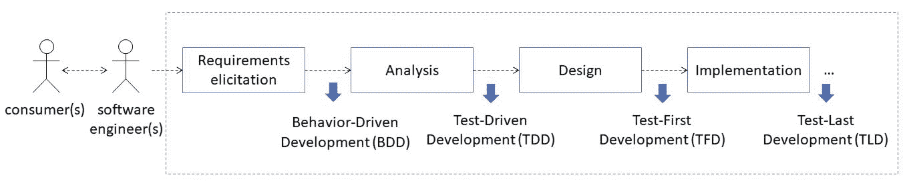

软件开发过程中的测试方法

到目前为止，还没有一个普遍接受的术语定义。就像软件工程本身一样，这些概念也会不断演变和争论。认为这是一个适合大量软件项目的建议。

关于谁负责编写测试代码，有一个普遍接受的共识。广泛建议单元测试应由 SUT 开发人员编写。在某些情况下，特别是在小型团队中，这些开发人员还负责其他类型的测试。

此外，独立测试组（通常称为测试人员或 QA 团队）的角色也是一种常见做法，尤其是在大型团队中。这种角色分离的目标之一是消除可能存在的利益冲突。我们不能忘记，从生理学角度来看，测试被理解为一种破坏性活动（目的是发现缺陷）。该独立测试组通常负责集成、系统和非功能测试。在这种情况下，两组工程师应密切合作；在进行测试时，开发人员应该能够纠正错误并将未来的错误降至最低。

最后，高级验收测试通常在非程序员（客户、业务分析、经理等）以及软件工程师或测试人员（例如，为了在 Cucumber 中实现步骤定义）的异构组中进行。

# 连续积分

CI 的概念于 1991 年由 Grady Booch（美国软件工程师，最著名的是与 Ivar Jacobson 和 James Rumbaugh 一起开发 UML）首次提出。**极限编程**（**XP**）方法学采用了这个术语，因此非常流行。根据 Martin Fowler，CI 的定义如下：

*Continuous Integration is a software development practice where members of a team integrate their work frequently, usually each person integrates at least daily - leading to multiple integrations per day. Each integration is verified by an automated build (including test) to detect integration errors as quickly as possible.*

在 CI 系统中，我们可以识别不同的部分。首先，我们需要一个源代码存储库，它是一个文件归档，用来存放软件项目的源代码，通常使用版本控制系统。如今，首选的版本控制系统是 Git（最初由 Linus Torvalds 开发），而不是旧的解决方案，如 CVS 或 SVN。在撰写本文时，领先的版本控制存储库是 GitHub（[https://github.com/](https://github.com/) ），顾名思义是基于 Git 的。此外，还有其他替代方案，例如 GitLab（[https://gitlab.com](https://gitlab.com) 、比特桶（[https://bitbucket.org/](https://bitbucket.org/) 或 SourceForge（[https://sourceforge.net/](https://sourceforge.net/) 。后者过去是主要的锻造厂，但现在使用较少。

源代码存储库的副本在开发人员的本地环境中同步。编码工作是针对这个本地副本完成的。开发人员应该每天向远程存储库提交新的更改（称为*补丁*）。频繁提交允许避免由于相互修改给定文件的相同部分而导致的冲突错误。

CI 的基本思想是，每次提交都应执行构建，并使用新的更改测试软件。出于这个原因，我们需要一个服务器端基础设施来自动化这个过程。此基础结构称为构建服务器（或直接称为 CI 服务器）。当今最重要的两个构建服务器是 Jenkins 和 Travis CI。下一小节将提供这两个方面的详细信息。作为构建过程的结果，构建服务器应将该过程的结果通知源开发人员。如果测试成功，修补程序将合并到代码库中：

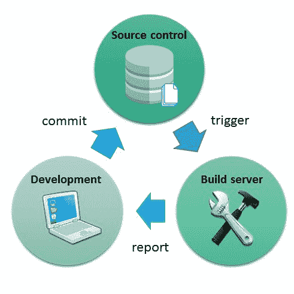

持续集成过程

接近 CI 时，术语 DevOps 已获得了发展势头。DevOps 源于*开发*和*运营*，它是一个软件开发过程的名称，强调项目软件中不同团队之间的沟通和协作：开发（软件工程）、QA（**质量保证**和运营（基础设施）。术语 DevOps 也指工作岗位，通常负责设置，监控构建服务器的操作：

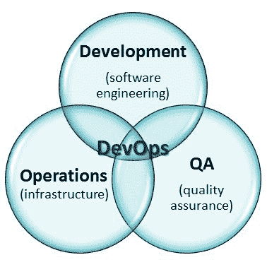

DevOps 介于开发、运营和 QA 之间

如下图所示，CI 的概念可以扩展到：

*   **持续交付**：当 CI 管道正确完成时，至少会将一个版本的软件部署到测试环境中（例如，将快照工件部署到 Maven archiver）。在此阶段，还可以执行验收测试。
*   **持续部署**：作为自动化工具链中的最后一步，软件的发布可以发布到生产环境中（例如，在每次提交时将一个 web 应用程序部署到生产服务器上，以实现通过整个管道）。

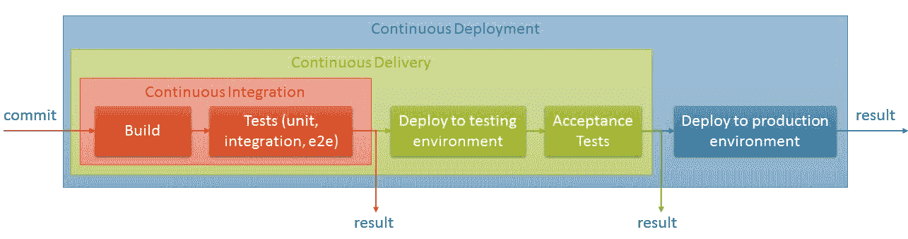

持续集成、持续交付和持续部署链

# 詹金斯

詹金斯（[https://jenkins.io/](https://jenkins.io/) 是一个开源构建服务器，支持构建、部署和自动化任何项目。Jenkins 是用 Java 开发的，可以使用其 web 界面轻松管理。Jenkins 实例的全局配置包括关于 JDK、Git、Maven、Gradle、Ant 和 Docker 的信息。

Jenkins 最初是由 Sun Microsystems 于 2004 年开发的哈德逊项目。甲骨文收购 Sun 后，Hudson 项目转入一个开源项目，更名为 Jenkins。这两个名字（哈德森和詹金斯）听起来都像是刻板的英国管家名字。他们的想法是帮助开发人员完成繁琐的任务，就像帮助管家一样。

在 Jenkins 中，构建通常由版本控制系统中的新提交触发。此外，构建可以通过其他机制启动，例如定时 cron 任务，甚至可以使用 Jenkins 接口手动启动。

Jenkins 的插件架构使其具有高度的可扩展性。由于这些，Jenkins 已经扩展到由大量第三方框架、库、系统等组成的丰富插件生态系统。这是由开源社区维护的。Jenkins 插件组合可在[上获得 https://plugins.jenkins.io/](https://plugins.jenkins.io/) 。

在詹金斯的核心，我们找到了工作的概念。作业是由 Jenkins 监控的可运行实体。如这里的屏幕截图所示，Jenkins 作业由四个组组成：

*   **源代码管理**：源代码库的 URL（Git、SVN 等）
*   **构建触发器**：这是启动构建过程的机制，例如源代码存储库中的新更改、外部脚本、周期性更改等。
*   **构建环境**：可选设置，例如，在构建开始前删除工作区，在卡住时中止构建，等等。
*   **作业步骤集合**：这些步骤可以通过 Maven、Gradle、Ant 或 shell 命令完成。之后，可以配置构建后操作，例如，归档工件、发布 JUnit 测试报告（我们将在本章后面介绍此功能）、电子邮件通知等。

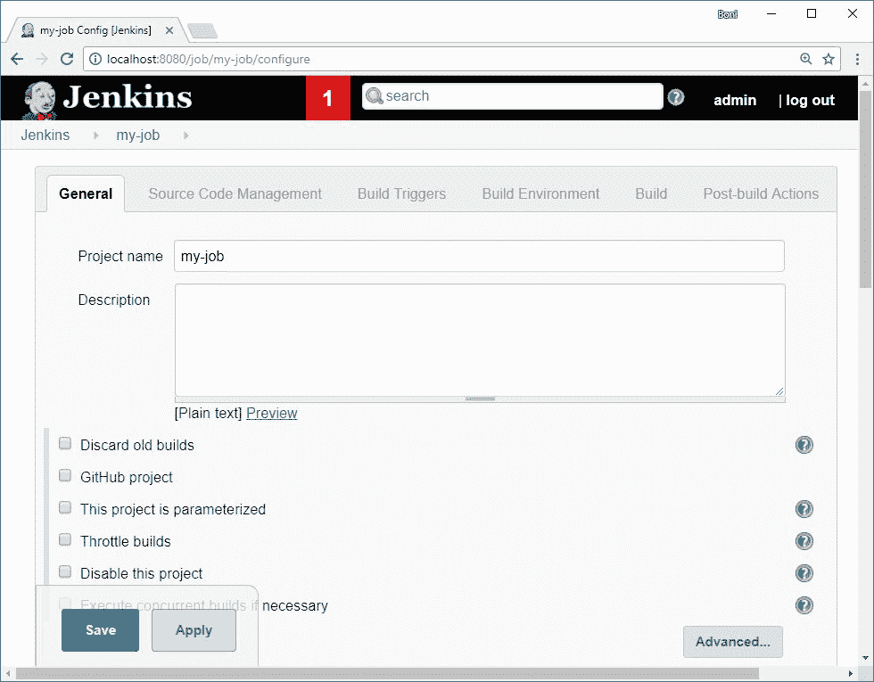

詹金斯作业配置

配置作业的另一种有趣方式是使用 Jenkins*管道*，这是使用管道 DSL（基于 Groovy 的领域特定语言）描述构建工作流。Jenkins 管道描述通常存储在名为 Jenkinsfile 的文件中，该文件可由源代码存储库控制。简言之，Jenkins 管道是由步骤组成的阶段声明链。例如：

```java
pipeline {
    agent any
    stages {
        stage('Build') {
            steps {
                sh 'make'
            }
        }
        stage('Test') {
            steps {
                sh 'make check'
                junit 'reports/**/*.xml'
            }
        }
        stage('Deploy') {
            steps {
                sh 'make publish'
            }
        }
    }
}
```

# 特拉维斯 CI

特拉维斯 CI（[https://travis-ci.org/](https://travis-ci.org/) 是一个分布式构建服务器，用于构建和测试托管在 GitHub 上的软件项目。Travis 免费支持开源项目。

Travis CI 的配置使用名为*.Travis.yaml*的文件完成。此文件的内容使用不同的关键字进行结构化，包括：

*   `language`：项目语言，即 java、node_js、ruby、python 或 php 等（完整列表见[）https://docs.travis-ci.com/user/languages/](https://docs.travis-ci.com/user/languages/) 。
*   `sudo`：设置是否需要超级用户权限的标志值（例如安装 Ubuntu 软件包）。
*   `dist`：构建可以在 Linux 环境（UbuntuPrecise 12.04 或 UbuntuTrusty 14.04）上执行。
*   `addons`：apt get 命令基本操作的声明性快捷方式。
*   `install`：Travis 构建生命周期的第一部分，其中完成了所需依赖项的安装。可以选择使用`before_install`启动此部件。
*   `script`：构建的实际执行。该阶段可以选择由`before_script`和`after_script`包围。
*   `deploy`：最后，在这个阶段可以选择部署构建。该阶段有自己的生命周期，由`before_deploy`和`after_deploy`控制。

YAML 是一种轻量级标记语言，由于其最简单的语法，广泛用于配置文件。它最初被定义为另一种标记语言，但后来被重新调整为 YAML 不是标记语言，以区分其面向数据的用途。

下面的代码片段显示了`.travis.yaml`的一个示例：

```java
language: java
sudo: false
dist: trusty

addons:
    firefox: latest
    apt:
        packages:
            - google-chrome-stable
    sonarcloud:
        organization: "bonigarcia-github"
        token:
            secure: "encripted-token"

before_script:
    - export DISPLAY=:99.0
    - sh -e /etc/init.d/xvfb start &
    - sleep 3

script:
    - mvn test sonar:sonar
    - bash <(curl -s https://codecov.io/bash)
```

Travis CI 提供了一个 web 仪表板，我们可以在其中使用 GitHub 帐户的 Travis CI 检查项目中生成的当前和过去版本的状态：

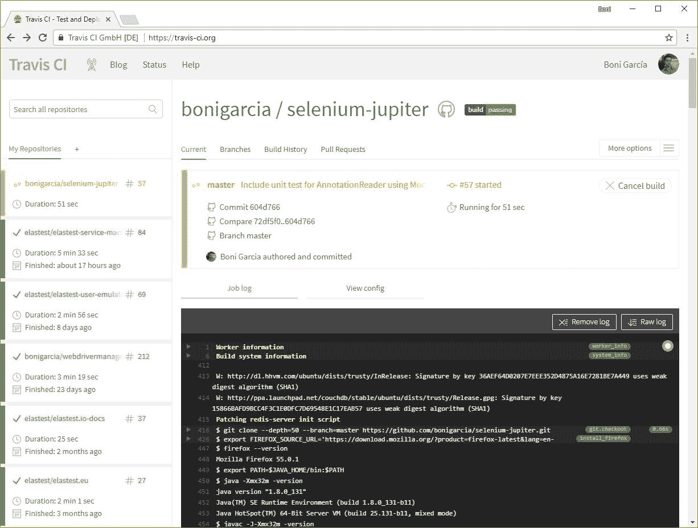

特拉维斯 CI 仪表板

# 测试报告

从最初的版本开始，JUnit 测试框架引入了一种 XML 文件格式来报告测试套件的执行情况。多年来，这种 XML 格式已经成为报告测试结果的*事实上的*标准，在 xUnit 家族中被广泛采用。

这些 XML 可以由不同的程序处理，以人性化的格式显示结果。例如，构建服务器就是这样做的。例如，Jenkins 实现了一个名为`JUnitResultArchiver`*的工具，该工具将作业测试执行产生的 XML 文件解析为 HTML。*

 *尽管这种 XML 格式已经变得非常普遍，但还没有通用的正式定义。JUnit 测试执行器（例如 Maven、Gradle 等）通常使用自己的 XSD（XML 模式定义）。例如，这个 XML 报告在 Maven（[中的结构 http://maven.apache.org/surefire/maven-surefire-plugin/](http://maven.apache.org/surefire/maven-surefire-plugin/) 如下图所示。请注意，测试套件由一组属性和一组测试用例组成。每个测试用例都可以声明为失败（某个断言失败的测试）、跳过（忽略测试）和错误（带有意外异常的测试）。如果这些状态都没有出现在测试套件的主体中，那么测试将被解释为成功。最后，对于每个测试用例，XML 还存储标准输出（*系统输出*）和标准错误输出（*系统错误*）：

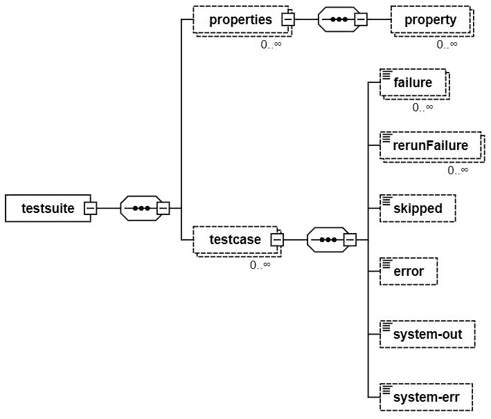

Maven Surefire XML 报告的模式表示

*REREREUNTRUIRE*是 Maven Surefire 为重试片状（间歇）测试而实现的自定义状态（[http://maven.apache.org/surefire/maven-surefire-plugin/examples/rerun-failing-tests.html](http://maven.apache.org/surefire/maven-surefire-plugin/examples/rerun-failing-tests.html) ）。

对于 JUnit5，用于运行 Jupiter 测试的 Maven 和 Gradle 插件（分别为`maven-surefire-plugin`和`junit-platform-gradle-plugin`）按照此 XML 格式编写测试执行结果。在以下各节中，我们将看到如何将此 XML 输出转换为人类可读的 HTML 报告。

# 马文·苏雷菲尔报道

默认情况下，`maven-surefire-plugin`将测试套件执行产生的 XML 生成为`${basedir}/target/surefire-reports/TEST-*.xml`。使用插件`maven-surefire-report-plugin`可以轻松地将此 XML 输出解析为 HTML。为此，我们只需在`pom.xml`的报告条款中声明此插件，如下所示：

```java
<reporting>
    <plugins>
        <plugin>
            <groupId>org.apache.maven.plugins</groupId>
            <artifactId>maven-surefire-report-plugin</artifactId>
            <version>${maven-surefire-report-plugin.version}</version>
        </plugin>
    </plugins>
</reporting>
```

这样，当我们为文档（`mvn site`调用 Maven 生命周期时，一个带有测试结果的 HTML 页面将包含在通用报告中。

请参阅使用 GitHub 存储库示例（[中的项目`junit5-reporting`生成的报告示例 https://github.com/bonigarcia/mastering-junit5](https://github.com/bonigarcia/mastering-junit5) ：

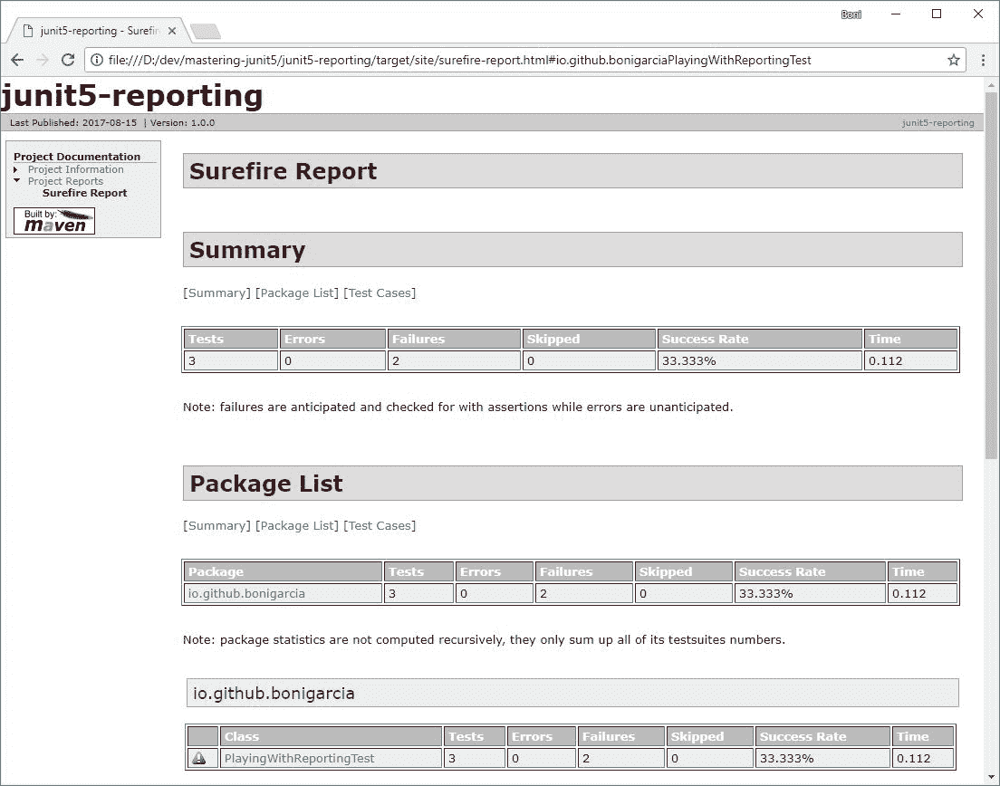

maven surefire 报表插件生成的 HTML 报表

# 诱惑

诱惑（[http://allure.qatools.ru/](http://allure.qatools.ru/) 是一个轻量级的开源框架，用于为不同的编程语言生成测试报告，包括 Java、Python、JavaScript、Ruby、Groovy、PHP、.NET 和 Scala。一般来说，Allure 使用 XML 测试输出，并将其转换为富 HTML5 的报告。

诱惑为 JUnit5 项目提供支持。这可以使用 Maven 和 Gradle 来完成。关于 Maven，我们需要在`maven-surefire-plugin`中注册一个侦听器。这个监听器将是 JUnit5 类（位于库`io.qameta.allure:allure-junit5`中），它基本上是 JUnit5`TestExecutionListener`的一个实现。如[第 2 章](2.html#1GKCM0-ef8404ed083f459d860f84cc8198f8bb)所述，*JUnit 5*的新增功能`TestExecutionListener`是 Launcher API 的一部分，用于接收有关测试执行的事件。总之，这个监听器允许诱惑编译测试信息，而测试信息是在 JUnit 平台中生成的。此信息由 Allure 存储为 JSON 文件。之后，我们可以使用插件`io.qameta.allure:allure-maven`从这些 JSON 文件生成 HTML5。这些命令是：

```java
mvn test
mvn allure:serve
```

我们`pom.xml`的内容应包含以下内容：

```java
<dependencies>
    <dependency>
        <groupId>io.qameta.allure</groupId>
        <artifactId>allure-junit5</artifactId>
        <version>${allure-junit5.version}</version>
        <scope>test</scope>
    </dependency>
    <dependency>
        <groupId>org.junit.jupiter</groupId>
        <artifactId>junit-jupiter-api</artifactId>
        <version>${junit.jupiter.version}</version>
        <scope>test</scope>
    </dependency>
</dependencies>

<build>
    <plugins>
        <plugin>
            <artifactId>maven-surefire-plugin</artifactId>
            <version>${maven-surefire-plugin.version}</version>
            <configuration>
                <properties>
                    <property>
                        <name>listener</name>
                        <value>io.qameta.allure.junit5.AllureJunit5</value>
                    </property>
                </properties>
                <systemProperties>
                    <property>
                        <name>allure.results.directory</name>
                        <value>${project.build.directory}/allure-results</value>
                    </property>
                </systemProperties>
            </configuration>
            <dependencies>
                <dependency>
                    <groupId>org.junit.platform</groupId>
                    <artifactId>junit-platform-surefire-provider</artifactId>
                    <version>${junit.platform.version}</version>
                </dependency>
                <dependency>
                    <groupId>org.junit.jupiter</groupId>
                    <artifactId>junit-jupiter-engine</artifactId>
                    <version>${junit.jupiter.version}</version>
                </dependency>
            </dependencies>
        </plugin>
        <plugin>
            <groupId>io.qameta.allure</groupId>
            <artifactId>allure-maven</artifactId>
            <version>${allure-maven.version}</version>
        </plugin>
    </plugins>
</build>
```

同样的过程也可以使用 Gradle 完成，这次使用的是等效的插件`io.qameta.allure:allure-gradle`。总之，我们`build.gradle`文件的内容应包括：

```java
buildscript {
    repositories {
        jcenter()
        mavenCentral()
    }
    dependencies {
        classpath("org.junit.platform:junit-platform-gradle-plugin:${junitPlatformVersion}")
        classpath("io.qameta.allure:allure-gradle:${allureGradleVersion}")
    }
}

apply plugin: 'io.qameta.allure'

dependencies {
    testCompile("org.junit.jupiter:junit-jupiter-api:${junitJupiterVersion}")
    testCompile("io.qameta.allure:allure-junit5:${allureJUnit5Version}")
    testRuntime("org.junit.jupiter:junit-jupiter-engine:${junitJupiterVersion}")
}
```

下图显示了使用上述步骤生成的诱惑报告的几个屏幕截图（使用 Maven 或 Gradle 的最终结果相同）。本例中的项目名为`junit5-allure`，通常托管在 GitHub 中。

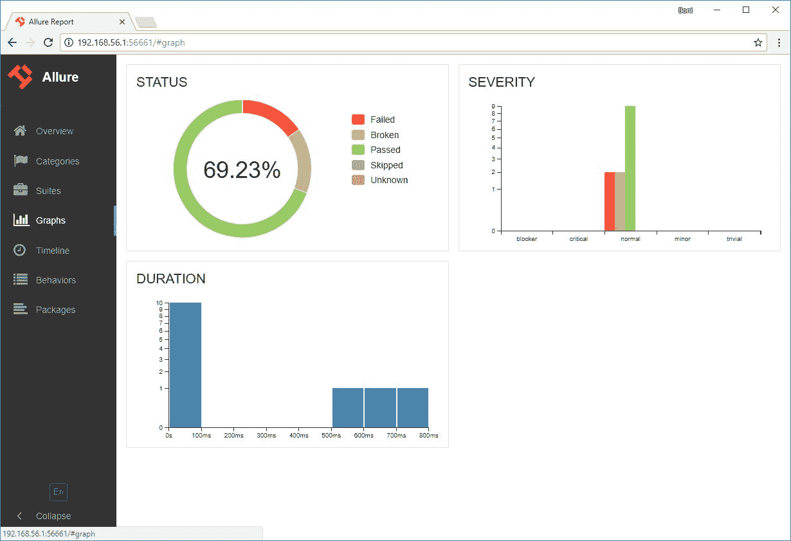

JUnit5 项目中生成的诱惑报告

# 缺陷跟踪系统

缺陷跟踪系统（也称为缺陷跟踪系统、缺陷跟踪器或问题跟踪器）是跟踪软件项目中报告的软件缺陷的软件系统。这种系统的主要好处是提供开发管理、bug 报告甚至特性请求的集中概述。维护挂起项目的列表也很常见，通常称为 backlog。

有许多可用的缺陷跟踪系统，包括专有的和开源的。在本节中，我们简要介绍几个最著名的：

*   **吉拉**[https://www.atlassian.com/software/jira](https://www.atlassian.com/software/jira) ：Atlasian 创建的专有缺陷跟踪系统。除了 bug 和问题跟踪，它还提供管理功能，如 SCRUM 和看板、查询问题的语言（JIRA 查询语言）、与外部系统的集成（例如 GitHub、Bitbucket）以及使用来自 Atlasian Marketplace 的插件扩展 JIRA 的附加机制（ [https://marketplace.atlassian.com/](https://marketplace.atlassian.com/) ）。
*   **布奇拉**[https://www.bugzilla.org/ 这是一个开源的基于 Web 的缺陷跟踪系统，由 Mozilla 基金会开发。在其功能中，我们可以找到一个旨在提高性能和可伸缩性的数据库、用于搜索缺陷的查询机制、集成的电子邮件功能以及用户角色管理。](https://www.bugzilla.org/)
*   **红矿**[http://www.redmine.org/](http://www.redmine.org/) ：这是一个开源的、基于 web 的缺陷跟踪系统。它为项目管理提供 wiki、论坛、时间跟踪、基于角色的访问控制或甘特图。
*   **螳螂 Bt**[https://www.mantisbt.org/](https://www.mantisbt.org/) ：这是另一个开源的、基于 web 的缺陷跟踪系统，设计简单但有效。在它的特性中，我们可以重点介绍它的事件驱动插件系统，以允许对第三方、多渠道通知系统（电子邮件、RSS 提要、Twitter 插件等）或基于角色的访问控制进行扩展。
*   **GitHub 发行**[https://guides.github.com/features/issues/](https://guides.github.com/features/issues/) ：它是集成在每个 GitHub 存储库中的跟踪系统。GitHub 问题的方法是使用 GitHub 问题为缺陷、任务调度、讨论甚至功能请求提供通用的跟踪系统。每个问题都可以使用可定制的标签系统、参与者管理和通知进行分类。

# 静力分析

这本书很快就要完成了，它的重点是软件测试。毫不奇怪，JUnit 是关于测试的。但正如我们在[第一章](1.html#K0RQ0-ef8404ed083f459d860f84cc8198f8bb)、*软件质量和 Java 测试回顾*中所看到的，虽然软件测试是**验证&验证**（**V&V**中最常见的执行活动，但它并不是唯一的类型。另一组重要的活动是静态分析，其中没有执行软件测试。

有不同的活动可以归类为静态分析。其中，自动化软件分析是一种在所需工作方面相当便宜的替代方法，它可以帮助显著提高内部代码质量。在本章中，我们将回顾几种自动化软件分析工具，称为**linters**，即：

*   **支票样式**[http://checkstyle.sourceforge.net/](http://checkstyle.sourceforge.net/) ：它按照不同的规则分析 Java 代码，例如缺少 Javadoc 注释、使用幻数、变量和方法的命名约定、方法的参数长度和行长度、导入的使用、某些字符之间的空格、，类构造的良好实践，或复制代码。它可以用作 Eclipse 或 IntelliJ 插件等。
*   **FindBugs**[http://findbugs.sourceforge.net/](http://findbugs.sourceforge.net/) ：在 Java 代码中查找三种类型的错误：
    *   正确性错误：明显的编码错误（例如，类定义了`equal(Object)`而不是`equals(Object)`。
    *   错误做法：违反建议的最佳做法（删除异常、误用 finalize 等）。
    *   狡猾的错误：混淆代码或以导致错误的方式编写（例如，从未使用过类`literal`、开关故障、未确认的类型转换和冗余的空检查）。
*   **PMD**[https://pmd.github.io/](https://pmd.github.io/) ：跨语言静态代码分析器，包括 Java、JavaScript、C++、C#、Go、Groovy、Perl、PHP 等。它有很多插件，包括 Maven、Gradle、Eclipse、IntelliJ 和 Jenkins。
*   **声纳 QUBE**[https://www.sonarqube.org/](https://www.sonarqube.org/) ：它（以前只是 Sonar）是一个基于网络、开源的持续质量评估仪表盘。它支持多种语言，包括 Java、C/C++、Objective-C、C#等。提供关于重复代码、代码气味、代码覆盖率、复杂性和安全漏洞的报告。SonarQube 有一种分布式风味，称为**SonarCloud**（[https://sonarcloud.io/](https://sonarcloud.io/) 。它可以在开源项目中免费使用，通过`.travis.yml`中的几行配置（见以下代码段），包括 SonarCloud 组织标识符和安全令牌，提供与 Travis CI 的无缝集成。将 SonarCloud 帐户与 GitHub 关联后，可以在 SonarCloud web 管理面板中获取这些参数。

```java
addons:
    sonarcloud:
        organization: "bonigarcia-github"
        token:
            secure: "encrypted-token"
```

之后，我们只需使用 Maven 或 Gradle 调用 SonarCloud：

```java
script:
    - mvn test sonar:sonar
```

```java
script:
    - gradle test sonarQube
```

下图显示了 SonarCloud 仪表板的示例应用率 my cat！，本章最后一节介绍：


SonarCloud 报告我的猫的应用率！

许多软件项目中高度采用的另一种静态分析技术是**同行评审**。这种方法在所需的时间和精力方面非常昂贵，但如果正确应用，它允许保持非常好的内部代码质量。现在有很多工具旨在简化软件代码库的同行评审过程。除其他外，我们发现：

*   **合作方**[https://smartbear.com/product/collaborator/](https://smartbear.com/product/collaborator/) ：由 SmartBear 公司创建的同行代码（和文档）审查适当性工具。
*   **坩埚**[https://www.atlassian.com/software/crucible](https://www.atlassian.com/software/crucible) ：Atlassian 创建的企业产品内部代码审查适当性工具。
*   **格瑞特**[https://www.gerritcodereview.com/](https://www.gerritcodereview.com/) ：基于 Web 的代码协作开源工具。它可以通过 GerritHub（[与 GitHub 存储库一起使用 http://gerrithub.io/](http://gerrithub.io/) ）。
*   **GitHub 拉取请求审核**[https://help.github.com/articles/about-pull-request-reviews/](https://help.github.com/articles/about-pull-request-reviews/) ：在 GitHub 中，pull 请求是在第三方存储库中提交贡献的一种方法。作为 GitHub 提供的协作工具的一部分，pull 请求允许以一种简单且集成的方式进行评论和评论。

# 拼凑

在本书的最后一节中，我们将用一个实际的例子来回顾本书中涉及的一些主要方面。为此，将开发一个完整的应用程序，并使用 JUnit5 实现不同类型的测试。

# 特点和要求

我们应用程序的历史从一个假想的人开始，他喜欢猫。此人拥有一个 clowder，他/她希望从外部世界获得关于他们的反馈。因此，此人（我们可以从现在开始联系他/她我们的*客户机*来实现满足他/她的需求的 web 应用程序。该应用程序的名称为*“为我的猫打分！”*。在与客户的对话中，我们得出了要开发的应用程序的以下功能列表：

*   **F1**：每个用户应通过观察猫的名字和图片对猫的列表进行评分。
*   **F2**：费率应使用星型机制为每个用户执行一次（每猫从`0.5`到`5`星型），并且可以选择为每个猫添加评论。

作为我们开发过程分析阶段的一部分，这些特性被细化为**功能需求**（**FR**）列表，如下所示：

*   **FR1**：应用程序向最终用户呈现猫的列表（由名称和图片组成）。
*   **FR2**：每只猫都可以单独评级。
*   **FR3**：评级猫的范围是从`0.5`到`5`（星星）的区间。
*   **FR4**：对于每猫的数字费率，用户可以选择添加一些注释。
*   **FR5**：每个终端用户仅对每个 cat（评论和/或星级）进行一次评分。

# 设计

由于我们的应用程序非常简单，我们决定在这里停止分析阶段，而不将我们的需求建模为用例。相反，我们继续使用经典的三层模型（表示层、应用程序（或业务）逻辑层和数据层）对 web 应用程序进行高级体系结构设计。关于应用程序逻辑，如下图所示，需要两个组件。第一个，称为`CatService`负责需求列表中描述的所有评级操作。第二个名为`CookiesServices`的用于处理 HTTP Cookies，需要实现 FR5*：*

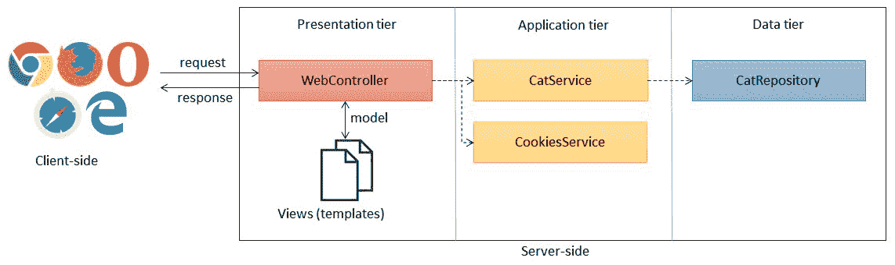

应用率高的高层建筑设计我的猫！

在此阶段，在开发过程中，我们能够确定应用程序实现中隐含的主要技术：

*   **Spring 5**：这将是我们应用程序的基础框架。具体地说，我们通过 SpringBoot 使用 SpringMVC 来简化 web 应用程序的创建。此外，我们使用 Spring 数据 JPA，使用一个简单的 H2 数据库来持久化应用程序数据，并使用 Thymeleaf（[http://www.thymeleaf.org/](http://www.thymeleaf.org/) ）作为模板引擎（用于 MVC 中的视图）。最后，我们还使用 Spring 测试模块以一种简单的方式进行容器内集成测试。
*   **JUnit 5**：当然，对于我们的测试用例，我们不能使用与 JUnit 5 不同的测试框架。此外，为了提高断言的可读性，我们使用了 Hamcrest。
*   **Mockito**：为了实现单元测试用例，我们将使用 Mockito 框架，在几个容器外单元测试中将 SUT 与其文档隔离。
*   **Selenium WebDriver**：我们还将使用 Selenium WebDriver 实现不同的端到端测试，以从 JUnit 5 测试中测试我们的 web 应用程序。
*   **GitHub**：我们的源代码存储库将托管在公共 GitHub 存储库中。
*   **Travis CI**：我们的测试套件将在每次向我们的 GitHub 存储库提交新补丁时执行。
*   **Codecov**：为了跟踪测试套件的代码覆盖率，我们将使用 Codecov。
*   **SonarCloud**：为了全面评估源代码的内部质量，我们使用 SonarCloud 进行了一些自动静态分析，以补充我们的测试过程。

此处的屏幕截图显示了正在运行的应用程序 GUI。本节的主要目的不是深入挖掘应用程序的实现细节。在[上访问应用程序的 GitHub 存储库 https://github.com/bonigarcia/rate-my-cat](https://github.com/bonigarcia/rate-my-cat) 了解详细信息。


我的猫的应用率截图！

用于实现此示例的图片已从[上提供的免费图片库下载 https://pixabay.com/](https://pixabay.com/) 。

# 测验

现在让我们关注这个应用程序的 JUnit5 测试。我们实现三种类型的测试：单元测试、集成测试和端到端测试。正如前面介绍的，对于单元测试，我们使用 Mockito 单独地执行 SUT。我们决定使用包含不同 JUnit5 测试的 Java 类对应用程序的两个主要组件（`CatService`和`CookiesServices`进行单元测试。

考虑第一个测试（称为`RateCatsTest`）。从代码中可以看出，在这个类中，我们将类`CatService`定义为 SUT（使用注释`@InjectMocks`），将类`CatRepository`（通过依赖项注入由`CatService`使用）定义为文档（使用注释`@Mock`）。此类的第一个测试（`testCorrectRangeOfStars`是参数化 JUnit 5 测试的一个示例。本测试的目的是评估`CatService`（方法`rateCate`中的费率方法）。为了选择此测试的测试数据（输入），我们遵循黑盒策略，因此我们使用需求定义的信息。具体而言，*FR3*说明了用于猫评级机制的恒星范围。根据边界分析方法，我们选择输入范围的边，即 0.5 和 5。第二个测试用例（`testCorrectRangeOfStars`）也测试了相同的方法（`rateCat`），但这一次测试评估了超出范围的输入执行 SUT 时的 SUT 响应（负面测试场景）。然后，在这个类中又执行了两个测试，这次的目的是评估*FR4*（也就是说，使用注释对 CAT 进行评分）。请注意，我们使用 JUnit 5`@Tag`注释来识别每个测试及其相应的需求：

```java
package io.github.bonigarcia.test.unit;

import static org.hamcrest.CoreMatchers.*equalTo*;
import static org.hamcrest.MatcherAssert.*assertThat*;
import static org.hamcrest.text.IsEmptyString.*isEmptyString*;
import static org.junit.jupiter.api.Assertions.*assertThrows*;
import static org.mockito.ArgumentMatchers.*any*;
import static org.mockito.Mockito.*when*;

import java.util.Optional;
import org.junit.jupiter.api.DisplayName;
import org.junit.jupiter.api.Tag;
import org.junit.jupiter.api.Test;
import org.junit.jupiter.api.extension.ExtendWith;
import org.junit.jupiter.params.ParameterizedTest;
import org.junit.jupiter.params.provider.ValueSource;
import org.mockito.InjectMocks;
import org.mockito.Mock;
import io.github.bonigarcia.Cat;
import io.github.bonigarcia.CatException;
import io.github.bonigarcia.CatRepository;
import io.github.bonigarcia.CatService;
import io.github.bonigarcia.mockito.MockitoExtension;

@ExtendWith(MockitoExtension.class)
@DisplayName("Unit tests (black-box): rating cats")
@Tag("unit")
class RateCatsTest {

    @InjectMocks
    CatService catService;

    @Mock
    CatRepository catRepository;

    // Test data
    Cat dummy = new Cat("dummy", "dummy.png");
    int stars = 5;
    String comment = "foo";

    @ParameterizedTest(name = "Rating cat with {0} stars")
    @ValueSource(doubles = { 0.5, 5 })
    @DisplayName("Correct range of stars test")
    @Tag("functional-requirement-3")
    void testCorrectRangeOfStars(double stars) {
        *when*(catRepository.save(dummy)).thenReturn(dummy);
        Cat dummyCat = catService.rateCat(stars, dummy);
        *assertThat*(dummyCat.getAverageRate(), *equalTo*(stars));
    }

    @ParameterizedTest(name = "Rating cat with {0} stars")
    @ValueSource(ints = { 0, 6 })
    @DisplayName("Incorrect range of stars test")
    @Tag("functional-requirement-3")
    void testIncorrectRangeOfStars(int stars) {
        *assertThrows*(CatException.class, () -> {
            catService.rateCat(stars, dummy);
        });
    }

    @Test
    @DisplayName("Rating cats with a comment")
    @Tag("functional-requirement-4")
    void testRatingWithComments() {
        *when*(catRepository.findById(*any*(Long.class)))
            .thenReturn(Optional.*of*(dummy));
        Cat dummyCat = catService.rateCat(stars, comment, 0);
        *assertThat*(catService.getOpinions(dummyCat).iterator().next()
           .getComment(), *equalTo*(comment));
    }

    @Test
    @DisplayName("Rating cats with empty comment")
    @Tag("functional-requirement-4")
    void testRatingWithEmptyComments() {
        *when*(catRepository.findById(*any*(Long.class)))
            .thenReturn(Optional.*of*(dummy));
        Cat dummyCat = catService.rateCat(stars, dummy);
        *assertThat*(catService.getOpinions(dummyCat).iterator().next()
            .getComment(), *isEmptyString*());
    }

}
```

接下来，单元测试评估 cookies 服务（*FR5*。为了达到这个目的，下面的测试使用类`CookiesService`作为 SUT，这次我们将模拟标准 Java 对象，它处理 HTTP Cookies，即`javax.servlet.http.HttpServletResponse`。查看这个测试类的源代码，我们可以看到第一个测试方法（称为`testUpdateCookies`）使用了服务方法`updateCookies`，验证 cookie 的格式是否符合预期。接下来的两个测试（`testCheckCatInCookies`和`testCheckCatInEmptyCookies`使用肯定策略（即输入 cat 对应于 cookie 的格式）和否定策略（相反的情况）评估服务的方法`isCatInCookies`。最后，最后两个测试（`testUpdateOpinionsWithCookies`和`testUpdateOpinionsWithEmptyCookies`按照相同的方法使用 SUT 的`updateOpinionsWithCookiesValue`方法，即使用有效且空的 cookie 检查 SUT 的响应。所有这些测试都是按照白盒策略实施的，因为其测试数据和逻辑完全依赖于 SUT 的特定内部逻辑（在本例中，cookie 是如何格式化和管理的）。

该测试不遵循纯白盒方法，因为其目标是在 SUT 内练习所有可能的路径。可以将其视为白盒，因为它的设计直接与实现相关联，而不是与需求相关联。

```java
package io.github.bonigarcia.test.unit;

import static org.hamcrest.CoreMatchers.*containsString*;
import static org.hamcrest.CoreMatchers.*equalTo*;
import static org.hamcrest.CoreMatchers.*not*;
import static org.hamcrest.MatcherAssert.*assertThat*;
import static org.hamcrest.collection.IsEmptyCollection.*empty*;
import static org.mockito.ArgumentMatchers.*any*;
import static org.mockito.Mockito.*doNothing*;
import java.util.List;
import javax.servlet.http.Cookie;
import javax.servlet.http.HttpServletResponse;
import org.junit.jupiter.api.DisplayName;
import org.junit.jupiter.api.Tag;
import org.junit.jupiter.api.Test;
import org.junit.jupiter.api.extension.ExtendWith;
import org.mockito.InjectMocks;
import org.mockito.Mock;
import io.github.bonigarcia.Cat;
import io.github.bonigarcia.CookiesService;
import io.github.bonigarcia.Opinion;
import io.github.bonigarcia.mockito.MockitoExtension;

@ExtendWith(MockitoExtension.class)
@DisplayName("Unit tests (white-box): handling cookies")
@Tag("unit")
@Tag("functional-requirement-5")
class CookiesTest {
    @InjectMocks
    CookiesService cookiesService;
    @Mock
    HttpServletResponse response;

    // Test data
    Cat dummy = new Cat("dummy", "dummy.png");
    String dummyCookie = "0#0.0#_";

    @Test
    @DisplayName("Update cookies test")
    void testUpdateCookies() {
        *doNothing*().when(response).addCookie(*any*(Cookie.class));
        String cookies = cookiesService.updateCookies("", 0L, 0D, "", 
          response);
        *assertThat*(cookies,                         
 *containsString*(CookiesService.*VALUE_SEPARATOR*));
        *assertThat*(cookies, 
 *containsString*(Cookies.*CA**T_SEPARATOR*));
    }

    @Test
    @DisplayName("Check cat in cookies")
    void testCheckCatInCookies() {
        boolean catInCookies = cookiesService.isCatInCookies(dummy,
            dummyCookie);
        *assertThat*(catInCookies, *equalTo*(true));
    }

    @DisplayName("Check cat in empty cookies")
    @Test
    void testCheckCatInEmptyCookies() {
        boolean catInCookies = cookiesService.isCatInCookies(dummy, "");
        *assertThat*(catInCookies, *equalTo*(false));
    }

    @DisplayName("Update opinions with cookies")
    @Test
    void testUpdateOpinionsWithCookies() {
        List<Opinion> opinions = cookiesService
            .updateOpinionsWithCookiesValue(dummy, dummyCookie);
        *assertThat*(opinions, *not*(*empty*()));
    }

    @DisplayName("Update opinions with empty cookies")
    @Test
    void testUpdateOpinionsWithEmptyCookies() {
        List<Opinion> opinions = cookiesService
            .updateOpinionsWithCookiesValue(dummy, "");
        *assertThat*(opinions, *empty*());
    }

}
```

让我们转到下一种测试类型：集成。对于这种类型的测试，我们将使用 Spring 提供的容器内测试功能。具体地说，我们使用 Spring 测试对象`MockMvc`从客户端评估应用程序的 HTTP 响应。在每个测试中，执行不同的请求，验证响应（状态代码和内容类型）是否符合预期：

```java
package io.github.bonigarcia.test.integration;

import static org.springframework.test.web.servlet.request.MockMvcRequestBuilders.*get*;
import static org.springframework.test.web.servlet.request.MockMvcRequestBuilders.*post*;
import static org.springframework.test.web.servlet.result.MockMvcResultMatchers.*content*;
import static org.springframework.test.web.servlet.result.MockMvcResultMatchers.*status*;
import org.junit.jupiter.api.DisplayName;
import org.junit.jupiter.api.Tag;
import org.junit.jupiter.api.Test;
import org.junit.jupiter.api.extension.ExtendWith;
import org.springframework.beans.factory.annotation.Autowired;
import org.springframework.boot.test.context.SpringBootTest;
import org.springframework.test.context.junit.jupiter.SpringExtension;
import org.springframework.test.web.servlet.MockMvc;

@ExtendWith(SpringExtension.class)
@SpringBootTest
@DisplayName("Integration tests: HTTP reponses")
@Tag("integration")
@Tag("functional-requirement-1")
@Tag("functional-requirement-2")

class WebContextTest {

    @Autowired
    MockMvc mockMvc;

    @Test
    @DisplayName("Check home page (GET /)")
    void testHomePage() throws Exception {
        mockMvc.perform(*get*("/")).andExpect(*status*().isOk())
            .andExpect(*content*().contentType("text/html;charset=UTF-8"));
    }

    @Test
    @DisplayName("Check rate cat (POST /)")
    void testRatePage() throws Exception {
        mockMvc.perform(*post*("/").param("catId", "1").param("stars", "1")
            .param("comment", "")).andExpect(*status*().isOk())
            .andExpect(*content*().contentType("text/html;charset=UTF-8"));
    }

    @Test
    @DisplayName("Check rate cat (POST /) of an non-existing cat")
    void testRatePageCatNotAvailable() throws Exception {
        mockMvc.perform(*post*("/").param("catId", "0").param("stars", "1")
            .param("comment", "")).andExpect(*status*().isOk())
           .andExpect(*content*().contentType("text/html;charset=UTF-8"));
    }

    @Test
    @DisplayName("Check rate cat (POST /) with bad parameters")
    void testRatePageNoParameters() throws Exception {
        mockMvc.perform(*post*("/")).andExpect(*status*().isBadRequest());
    }

}
```

最后，我们还使用 SeleniumWebDriver 实现了几个端到端测试。通过检查该测试的实现，我们可以看到该测试同时使用了两个 JUnit 5 扩展：`SpringExtension`（在 JUnit 5 测试的生命周期内启动/停止 Spring 上下文）和`SeleniumExtension`（在测试方法中注入旨在控制 web 浏览器的 WebDriver 对象）。特别是，我们在其中一个测试中使用了三种不同的浏览器：

*   PhantomJS（无头浏览器），用于评估猫的列表是否在 web GUI（FR1）中正确呈现。
*   Chrome，通过应用程序 GUI（FR2）对猫进行评级。
*   Firefox，对使用 GUI 的猫进行评级，但结果会出现错误（FR2）。

```java
package io.github.bonigarcia.test.e2e;

import static org.hamcrest.CoreMatchers.*containsString*;
import static org.hamcrest.CoreMatchers.*equalTo*;
import static org.hamcrest.MatcherAssert.*assertThat*;
import static org.openqa.selenium.support.ui.ExpectedConditions.*elementToBeClickable*;
import static org.springframework.boot.test.context.SpringBootTest.WebEnvironment.*RANDOM_PORT*;
 import java.util.List;
import org.junit.jupiter.api.DisplayName;
import org.junit.jupiter.api.Tag;
import org.junit.jupiter.api.Test;
import org.junit.jupiter.api.extension.ExtendWith;
import org.openqa.selenium.By;
import org.openqa.selenium.WebElement;
import org.openqa.selenium.chrome.ChromeDriver;
import org.openqa.selenium.firefox.FirefoxDriver;
import org.openqa.selenium.phantomjs.PhantomJSDriver;
import org.openqa.selenium.support.ui.WebDriverWait;
import org.springframework.boot.test.context.SpringBootTest;
import org.springframework.boot.web.server.LocalServerPort;
import org.springframework.test.context.junit.jupiter.SpringExtension;
import io.github.bonigarcia.SeleniumExtension;

@ExtendWith({ SpringExtension.class, SeleniumExtension.class })
@SpringBootTest(webEnvironment = *RANDOM_PORT*)
@DisplayName("E2E tests: user interface")
@Tag("e2e")
public class UserInferfaceTest {
    @LocalServerPort
    int serverPort;

    @Test
    @DisplayName("List cats in the GUI")
    @Tag("functional-requirement-1")
    public void testListCats(PhantomJSDriver driver) {
        driver.get("http://localhost:" + serverPort);
        List<WebElement> catLinks = driver
            .findElements(By.*className*("lightbox"));
        *assertThat*(catLinks.size(), *equalTo*(9));
    }

    @Test
    @DisplayName("Rate a cat using the GUI")
    @Tag("functional-requirement-2")
    public void testRateCat(ChromeDriver driver) {
        driver.get("http://localhost:" + serverPort);
        driver.findElement(By.*id*("Baby")).click();
        String fourStarsSelector = "#form1 span:nth-child(4)";
        new WebDriverWait(driver, 10)                     
            .until(*elementToBeClickable
*                (By.*cssSelector*(fourStarsSelector)));
        driver.findElement(By.*cssSelector*(fourStarsSelector)).click();
        driver.findElement(By.*xpath*("//*[@id=\"comment\"]"))
            .sendKeys("Very nice cat");
        driver.findElement(By.*cssSelector*("#form1 > button")).click();
        WebElement sucessDiv = driver
            .findElement(By.*cssSelector*("#success > div"));
        *assertThat*(sucessDiv.getText(), *containsString*("Your vote for               
            Baby"));
    }

    @Test
    @DisplayName("Rate a cat using the GUI with error")
    @Tag("functional-requirement-2")
    public void testRateCatWithError(FirefoxDriver driver) {
        driver.get("http://localhost:" + serverPort);
        driver.findElement(By.*id*("Baby")).click();
        String sendButtonSelector = "#form1 > button";
        new WebDriverWait(driver, 10).until(
 *elementToBeClickable*(By.*cssSelector*(sendButtonSelector)));
        driver.findElement(By.*cssSelector*(sendButtonSelector)).click();
        WebElement sucessDiv = driver
            .findElement(By.*cssSelector*("#error > div"));
        *assertThat*(sucessDiv.getText(), *containsString*(
            "You need to select some stars for rating each cat"));
    }

}
```

为了便于测试执行的可追溯性，在所有实现的测试中，我们使用`@DisplayName`选择了有意义的测试名称。此外，对于参数化测试，我们使用元素名称根据测试输入来细化每次执行测试的测试名称。以下是 Eclipse 4.7（氧气）中测试套件执行的屏幕截图：

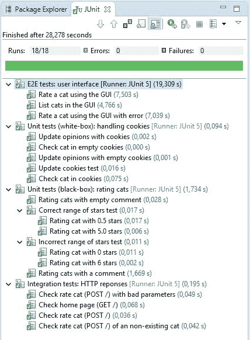

针对应用率 my cat 执行测试套件！在 Eclipse4.7 中

如前所述，我们使用 Travis CI 作为构建服务器在开发过程中执行测试。在 Travis CI（文件`.travis.yml`的配置中，我们设置了两个额外的工具来增强应用程序的开发和测试过程。一方面，Codecov 提供了全面的测试覆盖率报告。另一方面，声纳云提供了完整的静态分析。这两种工具都由 Travis CI 触发，作为持续集成构建过程的一部分。因此，我们可以在开发过程中评估应用程序的覆盖率测试和内部代码质量（例如代码气味、重复块或技术债务）。

下图显示了 Codecov 提供的在线报告的屏幕截图（SonarCloud 提供的报告在本章前一节中介绍）：

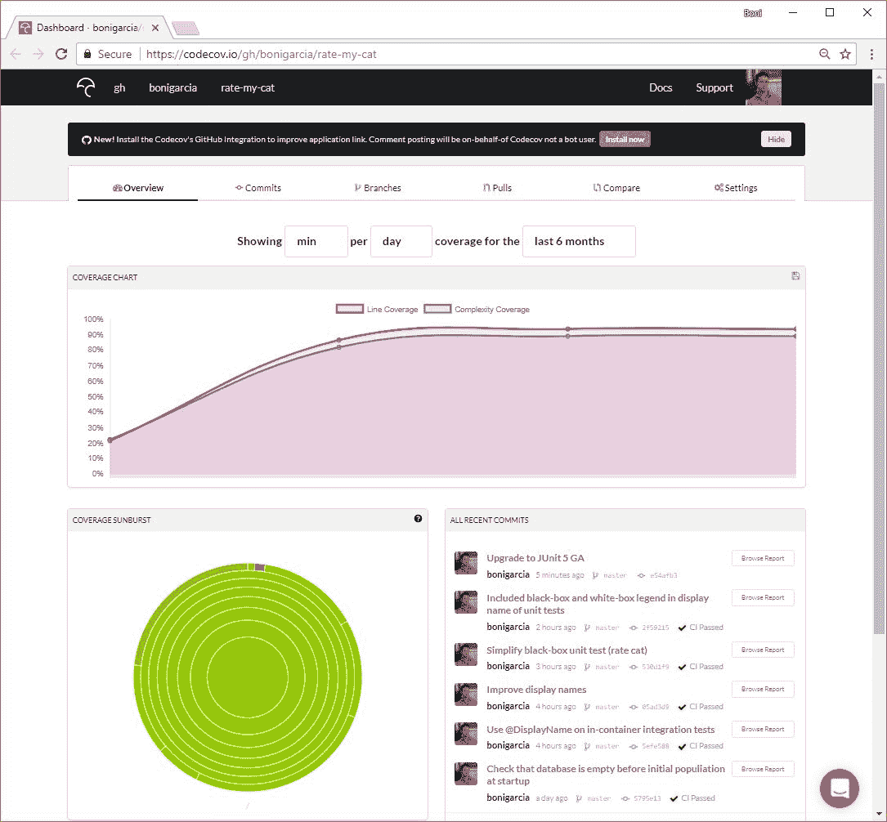

Codecov 报告我的猫的应用率！

最后但并非最不重要的一点是，我们在 GitHub 存储库的`README`中使用了几个*徽章*。具体来说，我们为 Travis CI（上次构建过程的状态）、SonarCloud（上次分析的状态）和 Codecov（上次代码覆盖率分析的百分比）添加了徽章：

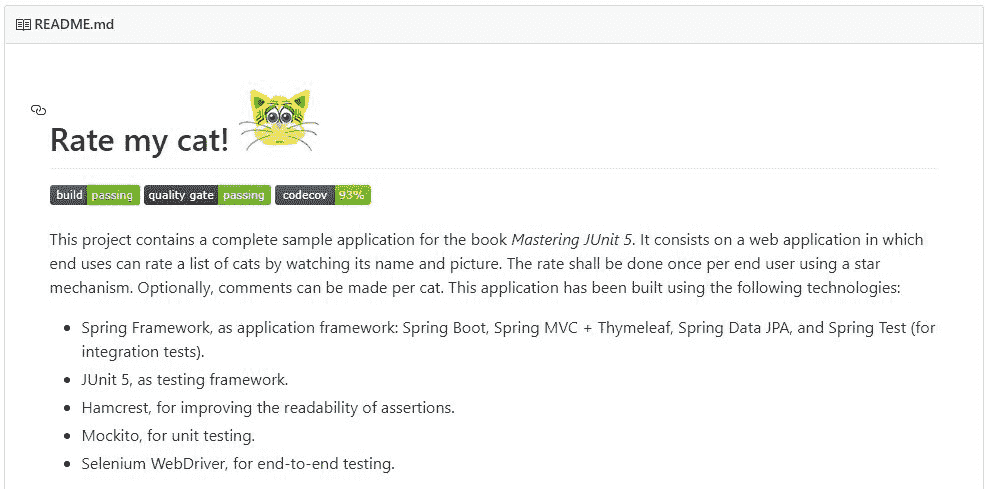

GitHub 为我的猫的应用率颁发徽章！

# 总结

在本章中，我们回顾了关于测试活动的管理方面的几个问题。首先，我们了解到，根据测试方法，测试可以在软件开发过程（软件生命周期）的不同部分进行：BDD（在需求分析之前定义验收测试）、TDD（在系统设计之前定义测试）、TFD（在系统设计之后实施测试）和 TLD（测试在系统实施后实施）。

CI 是一种越来越多地用于软件开发的过程。它包括代码库的自动构建和测试。此过程通常由源代码存储库（如 GitHub、GitLab 或 Bitbucket）中的新提交触发。CI 扩展到连续交付（当发布到开发环境时）和连续部署（当连续部署到生产环境时）。我们回顾了当今最常用的两个构建服务器：Jenkins（*CI 即服务*和 Travis（内部部署）。

还有一些其他工具可用于改进测试管理，例如报告工具（如 Maven Surefire Report 或 Allure）或缺陷跟踪系统（如 JIRA、Bugzilla、Redmine、MantisBT 和 GitHub 问题）。自动化静态分析是对测试的一个很好的补充，例如，使用诸如 Checkstyle、FindBugs、PMD 或 SonarQube 之类的过梁，以及诸如 Collaborator、Crucible、Gerrit 和 GitHub 拉式请求审查之类的同行审查工具。

为了结束本书，本章的最后一节介绍了一个完整的 web 应用程序（名为*Rate my cat！*）及其相应的 JUnit 5 测试（单元测试、集成测试和端到端测试）。它包括一个 web 应用程序，该应用程序使用本书中介绍的不同技术开发和评估，即 Spring、Mockito、Selenium、Hamcrest、Travis CI、Codecov 和 SonarCloud。*