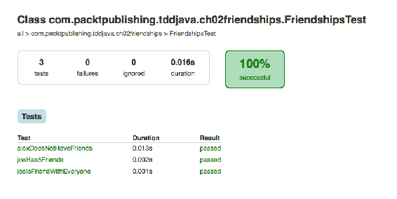
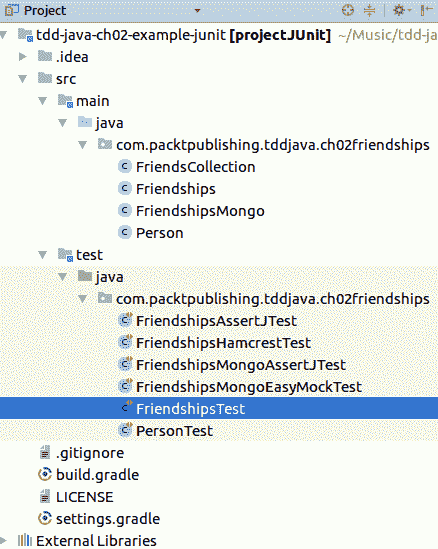
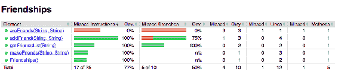
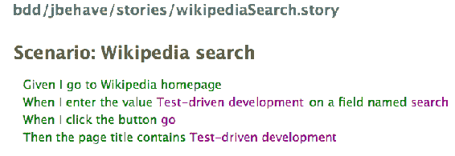
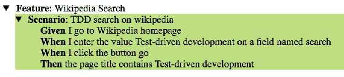

# 工具、框架和环境

“我们成为我们所看到的。我们塑造我们的工具，然后我们的工具塑造我们。”

-马歇尔·麦克卢汉

每个士兵都知道自己的武器，程序员必须熟悉开发生态系统和那些使编程更容易的工具。无论您是在工作中还是在家中已经在使用这些工具，都值得一看其中的许多工具，并比较它们的特性、优点和缺点。让我们大致了解一下我们现在能找到的关于以下主题的内容，并构建一个小项目来熟悉其中的一些内容。

我们将不深入讨论这些工具和框架的细节，因为这将在后面的章节中完成。我们的目标是让你开始跑步，并为你提供他们做什么以及如何做的简要概述。

本章将介绍以下主题：

*   吉特
*   虚拟机
*   构建工具
*   综合发展环境
*   单元测试框架
*   Hamcrest 和 AssertJ

*   代码覆盖工具
*   模拟框架
*   用户界面测试
*   行为驱动开发

# 吉特

Git 是最流行的版本控制系统。因此，[本书中使用的所有代码都存储在 Bitbucket 中](https://bitbucket.org/)。如果您还没有，请安装 Git。[所有流行操作系统的发行版可在以下网址找到](http://git-scm.com)。

许多图形界面可用于 Git；有些是 [Tortoise](https://code.google.com/p/tortoisegit)、[SourceTree](https://www.sourcetreeapp.com)、[GitTower](http://www.git-tower.com/)。

# 虚拟机

尽管虚拟机不在本书的主题范围内，但在良好的开发环境中，虚拟机是一种强大的工具和一流的公民。它们在孤立的系统中提供了动态且易于使用的资源，因此可以在我们需要时使用和删除它们。这有助于开发人员专注于他们的任务，而不是浪费时间从头开始创建或安装所需的服务。这就是为什么虚拟机在这里有一席之地的原因。我们希望利用它们让您专注于代码。

为了无论您使用的是什么操作系统都能拥有相同的环境，我们将使用 Vagrant 创建虚拟机，并使用 Docker 部署所需的应用程序。在我们的示例中，我们选择 Ubuntu 作为基本操作系统，只是因为它是一个流行的、常用的类 Unix 发行版。大多数技术都是独立于平台的，但有时您无法按照此处的说明操作，因为您可能正在使用其他操作系统。在这种情况下，你的任务是找出 Ubuntu 和你的操作系统之间的区别，并采取相应的行动。

# Vagrant

Vagrant 是我们将用于创建开发环境堆栈的工具。这是一种使用预配置的框以最小的工作量初始化现成虚拟机的简单方法。所有框和配置都放在一个文件中，称为`Vagrant`文件。

下面是一个创建简单 Ubuntu 框的示例。我们为使用 Docker 安装 MongoDB 做了额外的配置（Docker 的用法将很快解释）。我们假设您有 [VirtualBox](https://www.virtualbox.org) 和 [VagrantUp](https://www.vagrantup.com) 安装在您的计算机上，并且您可以访问互联网。

在这个特殊的例子中，我们使用 Ubuntu 框（`ubuntu/trusty64`创建了一个 Ubuntu 64 位的实例，并指定 VM 应该有 1GB 的 RAM：

```java
  config.vm.box = "ubuntu/trusty64" 

  config.vm.provider "virtualbox" do |vb| 
  vb.memory = "1024" 
  end 
```

接下来，我们将在 Vagrant 机器中公开 MongoDB 的默认端口，并使用 Docker 运行它：

```java
  config.vm.network "forwarded_port", guest: 27017, host: 27017 
  config.vm.provision "docker" do |d| 
    d.run "mongoDB", image: "mongo:2", args: "-p 27017:27017" 
  end 
```

最后，为了加速 Vagrant 设置，我们正在缓存一些资源。您应该安装名为`cachier`的插件。欲了解更多信息，请访问[这里](https://github.com/fgrehm/vagrant-cachier)。

```java
  if Vagrant.has_plugin?("vagrant-cachier") 
    config.cache.scope = :box 
  end 
```

现在是时候看到它工作了。第一次运行它通常需要几分钟，因为需要下载并安装基本框和所有依赖项：

```java
$> vagrant plugin install vagrant-cachier
$> git clone https://bitbucket.org/vfarcic/tdd-java-ch02-example-vagrant.git
$> cd tdd-java-ch02-example-vagrant$> vagrant up
```

运行此命令时，应看到以下输出：


耐心等待，直到执行完毕。完成后，您将拥有一个新的虚拟机，其中包含 Ubuntu、Docker 和一个 MongoDB 实例并正在运行。最棒的是，所有这些都是通过一个命令完成的。

要查看当前运行的 VM 的状态，我们可以使用`status`参数：

```java
$> vagrant status
Current machine states:
default                   running (virtualbox)

```

可以通过`ssh`或使用 Vagrant 命令访问虚拟机，如下例所示：

```java
$> vagrant ssh
Welcome to Ubuntu 14.04.2 LTS (GNU/Linux 3.13.0-46-generic x86_64)

 * Documentation:  https://help.ubuntu.com/

 System information disabled due to load higher than 1.0

 Get cloud support with Ubuntu Advantage Cloud Guest:
 http://www.ubuntu.com/business/services/cloud

 0 packages can be updated.
 0 updates are security updates.

vagrant@vagrant-ubuntu-trusty-64:~$  
```

最后，要停止虚拟机，请退出虚拟机并运行`vagrant halt`命令：

```java
$> exit
$> vagrant halt
 ==> default: Attempting graceful shutdown of VM...
$>  
```

有关 Vagrant Box 列表或有关配置 Vagrant 的更多详细信息，请访问[这里](https://www.vagrantup.com)。

# Docker

设置好环境后，就可以安装我们需要的服务和软件了。这可以通过使用 Docker 来实现，Docker 是一种在独立容器中运送和运行许多应用程序和服务的简单而便携的方法。我们将使用它在使用 Vagrant 创建的虚拟机中安装本书所需的数据库、web 服务器和所有其他应用程序。事实上，之前创建的 Vagrant VM 已经有了一个使用 Docker 启动并运行 MongoDB 实例的示例。

让我们再次启动 VM（我们之前用`vagrant halt`命令停止了它）和 MongoDB：

```java
$> vagrant up
$> vagrant ssh
vagrant@vagrant-ubuntu-trusty-64:~$ docker start mongoDB
mongoDB
vagrant@vagrant-ubuntu-trusty-64:~$ docker ps
CONTAINER ID        IMAGE           COMMAND                    CREATED
360f5340d5fc        mongo:2         "/entrypoint.sh mong..."   4 minutes ago

STATUS              PORTS                      NAMES
Up 4 minutes        0.0.0.0:27017->27017/tcp   mongoDB
vagrant@vagrant-ubuntu-trusty-64:~$ exit

```

用`docker start`启动容器；在`docker ps`中，我们列出了所有正在运行的进程。

通过使用这种过程，我们能够在一眨眼之间重现一个完整的堆栈环境。你可能想知道这是不是听起来那么棒。答案是肯定的。Vagrant 和 Docker 允许开发人员专注于他们应该做的事情，而忽略复杂的安装和复杂的配置。此外，我们还为您提供了所有必要的步骤和资源，以复制和测试本书中的所有代码示例和演示。

# 构建工具

随着时间的推移，代码的复杂性和大小都会增加。这在软件行业中是自然发生的。所有产品都在不断发展，新的需求在产品的整个生命周期中都在制定和实施。构建工具提供了一种尽可能简单地管理项目生命周期的方法，方法是以特定的方式遵循一些代码约定，例如代码的组织，并使用命名约定为类命名，或使用不同文件夹和文件形成的确定项目结构。

你们中的一些人可能熟悉 Maven 或 Ant。他们是处理项目的瑞士军刀，但我们在这里学习，所以我们决定使用 Gradle。Gradle 的一些优点是简化了样板代码，从而生成了更短的文件和更可读的配置文件。其中，谷歌将其作为构建工具。它由 IntelliJ IDEA 支持，非常容易学习和使用。大多数功能和任务都是通过添加插件获得的。

掌握 Gradle 不是本书的目标。 所以，如果你想了解更多关于这个很棒的工具的信息，请浏览[它的网站](http://gradle.org/)并阅读您可以使用的插件和可以自定义的选项。有关不同 Java 构建工具的比较，请访问[这里](https://technologyconversations.com/2014/06/18/build-tools/)。在继续之前，请确保您的系统上安装了 Gradle。

让我们分析`build.gradle`文件的相关部分。它使用 Groovy 作为描述符语言，以简洁的方式保存项目信息。这是我们项目的生成文件，由 IntelliJ 自动生成：

```java
apply plugin: 'java'
sourceCompatibility = 1.7
version = '1.0'
```

应用 Java 插件是因为它是一个 Java 项目。它带来了常见的 Java 任务，如构建、打包、测试等。源代码兼容性设置为 JDK 7。如果我们试图使用此版本不支持的 Java 语法，编译器会抱怨：

```java
repositories { 
    mavenCentral() 
} 
```

[Maven 中心](http://search.maven.org/) 保存了我们所有的项目依赖关系。本节告诉 Gradle 从何处提取它们。Maven 中央存储库对于这个项目来说已经足够了，但是您可以添加自定义存储库（如果有的话）。Nexus 和 Ivy 也受支持：

```java
dependencies { 
    testCompile group: 'junit', name: 'junit', version: '4.12' 
} 
```

最后，但并非最不重要的一点是，项目依赖关系是如何声明的。IntelliJ 决定使用 JUnit 作为测试框架。

Gradle 任务很容易运行。例如，要从命令提示符运行测试，我们只需执行以下命令：

```java
gradle test  
```

这可以通过 IDEA 从 Gradle 工具窗口运行`test`任务来实现，该窗口可以从视图|工具窗口| Gradle 访问。

测试结果存储在位于`build/reports/tests`目录的 HTML 文件中。

以下是针对样本代码运行`gradle test`生成的测试报告：



# 综合发展环境

由于将涉及许多工具和技术，我们建议使用 IntelliJ IDEA 作为代码开发工具。主要原因是这个**集成开发环境**（**IDE**工作时没有任何繁琐的配置。社区版（IntelliJ IDEA CE）提供了一系列内置功能和插件，使编码变得简单高效。它会根据文件扩展名自动推荐可安装的插件。由于 IntelliJ IDEA 是我们为本书所做的选择，因此您将找到有关其操作或菜单的参考资料和步骤。如果读者正在使用其他 IDE，他们应该找到一种适当的方法来模拟这些步骤。参见[这里](https://www.jetbrains.com/idea/)获取有关如何下载和安装 IntelliJ IDEA 的说明。

# 创意演示项目

让我们创建演示项目的基本布局。本项目将在本章中用于说明所涵盖的所有主题。Java 将成为编程语言和 [Gradle](http://gradle.org/) 将用于运行不同的任务集，如构建、测试等。

让我们将包含本章示例的存储库导入 IDEA：

1.  打开 IntelliJ IDEA，选择 Check out from Version Control，然后单击 Git。
2.  在 Git 存储库 URL 中键入`https://bitbucket.org/vfarcic/tdd-java-ch02-example-junit.git`并单击克隆。确认 IDEA 的其余问题，直到使用从 Git 存储库克隆的代码创建新项目

导入的项目应类似于下图：



现在我们已经建立了项目，现在是时候来看看单元测试框架了。

# 单元测试框架

在本节中，将展示两个最常用的用于单元测试的 Java 框架，并对其进行简要的评论。通过比较使用 JUnit 和 TestNG 编写的测试类，我们将重点讨论它们的语法和主要特性。尽管有细微的区别，但两个框架都提供了最常用的功能，主要区别在于测试的执行和组织方式。

让我们从一个问题开始。什么是考试？我们如何定义它？

测试是一种可重复的过程或方法，它在确定的情况下，通过预期预定义输出或交互的确定输入，验证测试目标的正确行为。

在编程方法中，根据功能测试、验收测试和单元测试的范围，有几种类型的测试。接下来，我们将更详细地探讨每种类型的测试。

单元测试是关于测试小块代码的。让我们看看如何测试单个 Java 类。课程非常简单，但足以满足我们的兴趣：

```java
public class Friendships { 
  private final Map<String, List<String>> friendships = 
     new HashMap<>(); 

  public void makeFriends(String person1, String person2) { 
    addFriend(person1, person2); 
    addFriend(person2, person1); 
  } 

  public List<String> getFriendsList(String person) { 
    if (!friendships.containsKey(person)) { 
      return Collections.emptyList(); 
    } 
    return friendships.get(person)
  } 

  public boolean areFriends(String person1, String person2) { 
    return friendships.containsKey(person1) &&  
        friendships.get(person1).contains(person2); 
  } 

  private void addFriend(String person, String friend) { 
    if (!friendships.containsKey(person)) { 
      friendships.put(person, new ArrayList<String>()); 
    } 
    List<String> friends = friendships.get(person); 
    if (!friends.contains(friend)) { 
      friends.add(friend); 
    } 
  } 
} 
```

# 朱尼特

[JUnit](http://junit.org/) 是一个简单易学的框架，用于编写和运行测试。每个测试都映射为一个方法，每个方法都应该表示一个特定的已知场景，在该场景中我们的代码的一部分将被执行。通过将预期输出或行为与实际输出进行比较来进行代码验证。

下面是用 JUnit 编写的测试类。缺少一些场景，但现在我们感兴趣的是展示测试的样子。在本书后面部分，我们将重点介绍测试代码的更好方法和最佳实践。

测试类通常包括三个阶段：设置、测试和拆卸。让我们从设置测试所需数据的方法开始。可以在类或方法级别执行设置：

```java
Friendships friendships; 

@BeforeClass 
public static void beforeClass() { 
  // This method will be executed once on initialization time 
} 

@Before 
public void before() { 
  friendships = new Friendships(); 
  friendships.makeFriends("Joe",",," "Audrey"); 
  friendships.makeFriends("Joe", "Peter"); 
  friendships.makeFriends("Joe", "Michael"); 
  friendships.makeFriends("Joe", "Britney"); 
  friendships.makeFriends("Joe", "Paul"); 
}
```

`@BeforeClass`注释指定了一个方法，该方法将在类中的任何测试方法之前运行一次。这是一种有用的方法，可以进行大多数（如果不是全部）测试都会使用的一些常规设置。

`@Before`注释指定了将在每个测试方法之前运行的方法。我们可以使用它来设置测试数据，而不用担心之后运行的测试会改变数据的状态。在前面的示例中，我们实例化了`Friendships`类，并向`Friendships`列表中添加了五个示例条目。无论每个单独的测试将执行什么更改，这些数据都将一次又一次地重新创建，直到执行所有测试为止。

使用这两个注释的常见示例是设置数据库数据、创建测试所需的文件等。稍后，我们将看到如何使用 mock 避免外部依赖。然而，功能或集成测试可能仍然需要这些依赖项，`@Before`和`@BeforeClass`注释是设置它们的好方法。

一旦建立了数据，我们就可以进行实际测试：

```java
@Test 
public void alexDoesNotHaveFriends() { 
  Assert.assertTrue("Alex does not have friends", 
     friendships.getFriendsList("Alex").isEmpty()); 
} 

@Test 
public void joeHas5Friends() { 
  Assert.assertEquals("Joe has 5 friends", 5, 
     friendships.getFriendsList("Joe").size()); 
} 

@Test 
public void joeIsFriendWithEveryone() { 
  List<String> friendsOfJoe =  
    Arrays.asList("Audrey", "Peter", "Michael", "Britney", "Paul"); 
  Assert.assertTrue(friendships.getFriendsList("Joe")
     .containsAll(friendsOfJoe)); 
} 
```

在本例中，我们使用了许多不同类型的资产中的一些。我们确认`Alex`没有任何朋友，而`Joe`是一个非常受欢迎的家伙，有五个朋友（`Audrey`、`Peter`、`Michael`、`Britney`和`Paul`）。

最后，一旦测试完成，我们可能需要执行一些清理：

```java
@AfterClass 
public static void afterClass() { 
  // This method will be executed once when all test are executed 
} 

@After 
public void after() { 
  // This method will be executed once after each test execution 
} 
```

在我们的例子中，在`Friendships`类中，我们不需要清理任何东西。如果有这样的需要，这两个注释将提供该特性。它们的工作方式与`@Before`和`@BeforeClass`注释类似。完成所有测试后，运行`@AfterClass`。`@After`注释在每次测试后执行。这会将每个测试方法作为单独的类实例运行。只要我们避免全局变量和外部资源，比如数据库和 API，每个测试都是与其他测试隔离的。无论一个人做了什么，都不会影响其他人。

完整的源代码可以在[`FriendshipsTest`类中找到](https://bitbucket.org/vfarcic/tdd-java-ch02-example-junit)。

# TestNG

在 [TestNG](http://testng.org/doc/index.html) 中，测试是按类组织的，就像 JUnit 一样。

为了运行 TestNG 测试，需要以下渐变配置（`build.gradle`）：

```java
dependencies { 
   testCompile group: 'org.testng', name: 'testng', version: '6.8.21' 
} 

test.useTestNG() { 
// Optionally you can filter which tests are executed using 
//    exclude/include filters 
// excludeGroups 'complex' 
} 
```

与 JUnit 不同，TestNG 需要额外的 Gradle 配置，告诉它使用 TestNG 来运行测试。

下面的测试类是使用 TestNG 编写的，它反映了我们之前使用 JUnit 所做的工作。省略重复进口和其他镗孔零件，目的是关注相关零件：

```java
@BeforeClass 
public static void beforeClass() { 
  // This method will be executed once on initialization time 
} 

@BeforeMethod 
public void before() { 
  friendships = new Friendships(); 
  friendships.makeFriends("Joe", "Audrey"); 
  friendships.makeFriends("Joe", "Peter"); 
  friendships.makeFriends("Joe", "Michael"); 
  friendships.makeFriends("Joe", "Britney"); 
  friendships.makeFriends("Joe", "Paul"); 
} 
```

您可能已经注意到 JUnit 和 TestNG 之间的相似之处。两者都使用注释来指定某些方法的用途。除了名称不同（`@Beforeclass`与`@BeforeMethod`之间），两者之间没有区别。但是，与 Junit 不同，TestNG 对所有测试方法重用相同的测试类实例。这意味着默认情况下测试方法不是孤立的，因此在`before`和`after`方法中需要更加小心。

资产也非常相似：

```java
public void alexDoesNotHaveFriends() { 
  Assert.assertTrue(friendships.getFriendsList("Alex").isEmpty(), 
      "Alex does not have friends"); 
} 

public void joeHas5Friends() { 
  Assert.assertEquals(friendships.getFriendsList("Joe").size(), 
      5, "Joe has 5 friends"); 
} 

public void joeIsFriendWithEveryone() { 
  List<String> friendsOfJoe = 
    Arrays.asList("Audrey", "Peter", "Michael", "Britney", "Paul");
  Assert.assertTrue(friendships.getFriendsList("Joe")
      .containsAll(friendsOfJoe)); 
} 
```

与 JUnit 相比，唯一显著的区别是`assert`变量的顺序。JUnit assert 的参数顺序是**可选消息**、**期望值**和**实际值**，而 TestNG 的顺序是实际值、期望值和可选消息。除了传递给`assert`方法的参数顺序不同之外，JUnit 和 TestNG 之间几乎没有区别。

你可能已经注意到`@Test`不见了。TestNG 允许我们在类级别设置它，从而将所有公共方法转换为测试。

`@After`注释也非常相似。唯一显著的区别是 TestNG`@AfterMethod`注释，其作用方式与 JUnit`@After`注释相同。

如您所见，语法非常相似。测试按类组织，并使用断言进行测试验证。这并不是说这两个框架之间没有更重要的区别；我们将在本书中看到其中的一些。我邀请你自己探索 [JUnit](http://junit.org/) 和 [TestNG](http://testng.org/)。

上述示例的完整源代码可在[这里找到](https://bitbucket.org/vfarcic/tdd-java-ch02-example-testng)。

到目前为止，我们编写的断言只使用了测试框架。但是，有一些测试实用程序可以帮助我们使它们更漂亮、更可读。

# Hamcrest 和 AssertJ

在上一节中，我们概述了什么是单元测试，以及如何使用两种最常用的 Java 框架编写单元测试。既然测试是我们项目的重要组成部分，为什么不改进我们编写测试的方式呢？出现了一些很酷的项目，旨在通过改变断言的方式来增强测试的语义。因此，测试更简洁，更容易理解。

# 汉克雷斯特

**Hamcrest**增加了很多称为**匹配器**的方法。每个匹配器设计用于执行比较操作。它的可扩展性足以支持您自己创建的自定义匹配器。此外，JUnit 本机支持 Hamcrest，因为它的核心包含在 JUnit 发行版中。您可以毫不费力地开始使用 Hamcrest。但是，我们希望使用功能齐全的项目，因此我们将向 Gradle 的文件中添加一个测试依赖项：

```java
testCompile 'org.hamcrest:hamcrest-all:1.3' 
```

让我们将 JUnit 中的一个断言与 Hamcrest 中的等效断言进行比较：

*   JUnit`assert`：

```java
List<String> friendsOfJoe = 
  Arrays.asList("Audrey", "Peter", "Michael", "Britney", "Paul");
Assert.assertTrue( friendships.getFriendsList("Joe")
    .containsAll(friendsOfJoe)); 
```

*   汉克雷斯特`assert`：

```java
assertThat( 
  friendships.getFriendsList("Joe"), 
  containsInAnyOrder("Audrey", "Peter", "Michael", "Britney", "Paul") 
); 
```

如你所见，Hamcrest 更具表现力。它有更大范围的断言，允许我们避免一些样板代码，同时使代码更易于阅读，更具表现力。

下面是另一个例子：

*   JUnit`assert`：

```java
Assert.assertEquals(5, friendships.getFriendsList("Joe").size()); 
```

*   Hamcrest`assert`：

```java
assertThat(friendships.getFriendsList("Joe"), hasSize(5)); 
```

你会注意到两个不同点。首先，与 JUnit 不同，Hamcrest 几乎总是使用直接对象。而在 JUnit 的情况下，我们需要得到整数大小，并将其与预期的数字进行比较（`5`）；Hamcrest 的资产范围更广，因此我们可以简单地将其中一项（`hasSize`与实际对象（`List`一起使用）。另一个不同之处是 Hamcrest 的顺序相反，实际值是第一个参数（如 TestNG）。

这两个例子不足以显示 Hamcrest 的全部潜力。在这本书的后面，将有更多的例子和解释 Hamcrest。访问[这里](http://hamcrest.org/) 并探索其语法。

完整的源代码可以在[存储库的`FriendshipsHamcrestTest`类中找到](https://bitbucket.org/vfarcic/tdd-java-ch02-example-junit)。

# 资产

**AssertJ**的工作方式与 Hamcrest 类似。一个主要区别是 AssertJ 断言可以连接起来。

要使用 AssertJ，必须将依赖项添加到 Gradle 的依赖项中：

```java
testCompile 'org.assertj:assertj-core:2.0.0' 
```

让我们将 JUnit 断言与 AssertJ 进行比较：

```java
Assert.assertEquals(5, friendships.getFriendsList("Joe").size()); 
List<String> friendsOfJoe = 
   Arrays.asList("Audrey", "Peter", "Michael", "Britney", "Paul");
Assert.assertTrue(  friendships.getFriendsList("Joe")
   .containsAll (friendsOfJoe) 
); 
```

相同的两个资产可以连接到 AssertJ 中的单个资产：

```java
assertThat(friendships.getFriendsList("Joe")) 
  .hasSize(5) 
  .containsOnly("Audrey", "Peter", "Michael", "Britney", "Paul");
```

这是一个很好的进步。不需要有两个单独的资产，也不需要创建具有预期值的新列表。此外，AssertJ 更具可读性，更易于理解。

完整的源代码可以在[`FriendshipsAssertJTest`类中找到](https://bitbucket.org/vfarcic/tdd-java-ch02-example-junit)。

现在我们已经启动并运行了测试，我们可能想看看测试生成的代码覆盖率是多少。

# 代码覆盖工具

我们编写测试的事实并不意味着它们是好的，也不意味着它们涵盖了足够的代码。一旦我们开始编写和运行测试，自然的反应就是开始问以前没有的问题。我们的代码的哪些部分经过了适当的测试？我们的测试没有考虑哪些情况？我们的测试是否足够？这些和其他类似的问题可以用代码覆盖工具来回答。它们可用于识别我们的测试未涵盖的代码块或代码行；他们还可以计算代码覆盖的百分比，并提供其他有趣的指标。

它们是用于获取度量和显示测试与实现代码之间关系的强大工具。然而，与任何其他工具一样，它们的目的需要明确。它们不提供关于质量的信息，只提供关于我们代码的哪些部分已经过测试的信息。

代码覆盖率显示在测试执行期间是否达到了代码行，但它不能保证良好的测试实践，因为测试质量不包括在这些度量中。

让我们看一看用于计算代码覆盖率的最流行的工具之一。

# 杰科科

Java 代码覆盖率（JaCoCo）是测量测试覆盖率的著名工具。
要在我们的项目中使用它，我们需要在 Gradle 配置文件中添加几行，即`build.gradle`：

1.  为 JaCoCo 添加渐变`plugin`：

```java
apply plugin: 'jacoco'
```

2.  要查看 JaCoCo 结果，请在命令提示符下运行以下命令：

```java
gradle test jacocoTestReport
```

3.  可以从 Gradle tasks IDEA 工具窗口运行相同的 Gradle 任务。
4.  最终结果存储在`build/reports/jacoco/test/html`目录中。这是一个可以在任何浏览器中打开的 HTML 文件：



本书的后续章节将更详细地探讨代码覆盖范围。在此之前，请转至[这里](http://www.eclemma.org/jacoco/)了解更多信息。

# 模拟框架

我们的项目看起来很酷，但太简单了，离真正的项目还很远。它仍然不使用外部资源。Java 项目需要一个数据库，所以我们也将尝试介绍它。

测试使用外部资源或第三方库的代码的常用方法是什么？嘲笑是答案。模拟对象或简单的模拟对象是可以用来替换真实对象的模拟对象。当依赖外部资源的对象被剥夺时，它们非常有用。

事实上，在开发应用程序时根本不需要数据库。相反，您可以使用 mock 来加速开发和测试，并且只在运行时使用真正的数据库连接。我们不必花时间建立数据库和准备测试数据，而可以专注于编写类，并在以后的集成期间考虑它们。

出于演示目的，我们将引入两个新类：`Person`类和`FriendCollection`类，用于表示人员和数据库对象映射。将使用 [MongoDB](https://www.mongodb.org/) 进行持久化。

我们的样品将分为两类。`Person`表示数据库对象数据；`FriendCollection`将是我们的数据访问层。希望代码是不言自明的。

让我们创建并使用`Person`类：

```java
public class Person { 
  @Id
  private String name; 

  private List<String> friends; 

  public Person() { } 

  public Person(String name) { 
    this.name = name; 
    friends = new ArrayList<>(); 
  } 

  public List<String> getFriends() { 
    return friends; 
  } 

  public void addFriend(String friend) { 
    if (!friends.contains(friend)) friends.add(friend); 
  }
}
```

让我们创建并使用`FriendsCollection`类：

```java
public class FriendsCollection { 
  private MongoCollection friends; 

  public FriendsCollection() { 
    try { 
      DB db = new MongoClient().getDB("friendships"); 
      friends = new Jongo(db).getCollection("friends"); 
    } catch (UnknownHostException e) { 
      throw new RuntimeException(e.getMessage()); 
    } 
  } 

  public Person findByName(String name) { 
    return friends.findOne("{_id: #}", name).as(Person.class); 
  } 

  public void save(Person p) { 
    friends.save(p); 
  } 
} 
```

此外，还引入了一些新的依赖项，因此 Gradle dependencies 块也需要修改。第一个是 MongoDB 驱动程序，它是连接数据库所必需的。第二个是 Jongo，一个使访问 Mongo 集合变得非常简单的小项目。

`mongodb`和`jongo`的梯度依赖关系如下：

```java
dependencies { 
    compile 'org.mongodb:mongo-java-driver:2.13.2' 
    compile 'org.jongo:jongo:1.1' 
} 
```

我们正在使用一个数据库，所以`Friendships`类也应该被修改。我们应该将一个映射更改为`FriendsCollection`并修改代码的其余部分以使用它。最终结果如下：

```java
public class FriendshipsMongo { 
  private FriendsCollection friends; 

  public FriendshipsMongo() { 
    friends = new FriendsCollection(); 
  } 

  public List<String> getFriendsList(String person) { 
    Person p = friends.findByName(person); 
    if (p == null) return Collections.emptyList(); 
    return p.getFriends(); 
  } 

  public void makeFriends(String person1, String person2) { 
    addFriend(person1, person2); 
    addFriend(person2, person1); 
  } 

  public boolean areFriends(String person1, String person2) { 
    Person p = friends.findByName(person1); 
    return p != null && p.getFriends().contains(person2); 
  } 

  private void addFriend(String person, String friend) {
    Person p = friends.findByName(person); 
    if (p == null) p = new Person(person); 
    p.addFriend(friend); 
    friends.save(p); 
  } 
} 
```

完整的源代码可以在[存储库的`FriendsCollection`和`FriendshipsMongo`类中找到](https://bitbucket.org/vfarcic/tdd-java-ch02-example-junit)。

现在我们有了使用 MongoDB 的`Friendships`类，让我们看一看使用 Mock 测试它的一种可能方法。

# 莫基托

Mockito 是一个 Java 框架，允许轻松创建测试替身。

渐变相关性如下所示：

```java
dependencies { 
  testCompile group: 'org.mockito', name: 'mockito-all', version: '1.+' 
} 
```

莫基托跑过JUnit赛跑者。它为我们创建所有必需的模拟，并通过测试将它们注入类中。有两种基本方法；我们自己实例化 mock，并通过类构造函数或使用一组注释将它们作为类依赖项注入。在下一个示例中，我们将看到如何使用注释来完成。

为了让类使用 Mockito 注释，它需要与`MockitoJUnitRunner`一起运行。使用 runner 简化了流程，因为您只需向要创建的对象添加注释：

```java
@RunWith(MockitoJUnitRunner.class) 
public class FriendshipsTest { 
... 
} 
```

在您的测试类中，测试类应该用`@InjectMocks`注释。这将告诉 Mockito 要将 mock 注入到哪个类中：

```java
@InjectMocks 
FriendshipsMongo friendships; 
```

从那时起，我们可以指定类中的哪些特定方法或对象（在本例中为`FriendshipsMongo`）将被 mock 替换：

```java
@Mock 
FriendsCollection friends; 
```

在本例中，`FriendshipsMongo`类中的`FriendsCollection`将被模拟。

现在，我们可以指定调用`friends`时应该返回什么：

```java
Person joe = new Person("Joe"); 
doReturn(joe).when(friends).findByName("Joe"); 
assertThat(friends.findByName("Joe")).isEqualTo(joe); 
```

在本例中，我们告诉 Mockito 在调用`friends.findByName("Joe")`时返回`joe`对象。稍后，我们将用`assertThat`验证此假设是否正确。

让我们尝试进行与之前在没有 MongoDB 的类中相同的测试：

```java
@Test 
public void joeHas5Friends() { 
  List<String> expected = 
    Arrays.asList("Audrey", "Peter", "Michael", "Britney", "Paul"); 
  Person joe = spy(new Person("Joe")); 

  doReturn(joe).when(friends).findByName("Joe"); 
  doReturn(expected).when(joe).getFriends(); 

  assertThat(friendships.getFriendsList("Joe")) 
    .hasSize(5) 
    .containsOnly("Audrey", "Peter", "Michael", "Britney", "Paul"); 
} 
```

在这个小测试中发生了很多事情。首先，我们确定`joe`是间谍。在 Mockito 中，间谍是使用真实方法的真实对象，除非另有规定。然后，我们告诉 Mockito 在`friends`方法调用`getFriends`时返回`joe`。这种组合允许我们在调用`getFriends`方法时返回`expected`列表。最后，我们断言，`getFriendsList`返回预期的名称列表。

完整的源代码可以在[存储库的`FriendshipsMongoAssertJTest`类中找到](https://bitbucket.org/vfarcic/tdd-java-ch02-example-junit)。

稍后我们将使用 Mockito；在这本书中，你将有机会更熟悉它和一般的嘲弄。有关 Mockito 的更多信息，请访问[这里](http://mockito.org/)。

# 轻松的

EasyMock 是另一种模拟框架。它与 Mockito 非常相似。然而，主要的区别在于 EasyMock 不创建`spy`对象，而是模拟。其他的区别是句法上的。

让我们看一个 EasyMock 的例子。我们将使用与 Mockito 示例相同的测试用例集：

```java
@RunWith(EasyMockRunner.class) 
public class FriendshipsTest { 
  @TestSubject 
  FriendshipsMongo friendships = new FriendshipsMongo(); 
  @Mock(type = MockType.NICE) 
  FriendsCollection friends;
}
```

从本质上讲，runner 的操作与 Mockito runner 相同：

```java
@TestSubject 
FriendshipsMongo friendships = new FriendshipsMongo(); 

@Mock(type = MockType.NICE) 
FriendsCollection friends; 
```

`@TestSubject`注释类似于 Mockito 的`@InjectMocks`，而`@Mock`注释表示要以类似于 Mockito 的`@Mock`的方式模拟的对象。此外，类型`NICE`告诉 mock 返回空。

让我们比较一下我们对 Mockito 的一个断言：

```java
@Test 
public void mockingWorksAsExpected() { 
  Person joe = new Person("Joe"); 
  expect(friends.findByName("Joe")).andReturn(joe); 
  replay(friends); 
  assertThat(friends.findByName("Joe")).isEqualTo(joe); 
} 
```

除了语法上的细微差异外，EasyMock 唯一的缺点是需要额外的指令`replay`。它告诉框架应该应用前面指定的期望。其余的几乎一样。我们指定`friends.findByName`应该返回`joe`对象，应用该期望，最后断言实际结果是否如预期的那样。

在 EasyMock 版本中，我们对 Mockito 使用的第二种测试方法如下：

```java
@Test 
public void joeHas5Friends() { 
  List<String> expected = 
  Arrays.asList("Audrey", "Peter", "Michael", "Britney", "Paul"); 
  Person joe = createMock(Person.class); 

  expect(friends.findByName("Joe")).andReturn(joe); 
  expect(joe.getFriends()).andReturn(expected); 
  replay(friends); 
  replay(joe); 

  assertThat(friendships.getFriendsList("Joe")) 
    .hasSize(5)
    .containsOnly("Audrey", "Peter", "Michael", "Britney", "Paul"); 
}
```

同样，与莫基托相比几乎没有什么不同，只是 EasyMock 没有间谍。根据上下文的不同，这可能是一个重要的区别。

尽管这两个框架相似，但有一些小细节让我们选择 Mockito 作为框架，这将贯穿本书。

有关此断言库的更多信息请访问[这里](http://easymock.org/)。

完整的源代码可以在[存储库](https://bitbucket.org/vfarcic/tdd-java-ch02-example-junit)中的`FriendshipsMongoEasyMockTest`类中找到。

# 模拟的额外功率

前面介绍的两个项目并不涵盖所有类型的方法或字段。根据应用的修饰符（如 static 或 final），类、方法或字段可能超出 Mockito 或 EasyMock 的范围。在这种情况下，我们可以使用 PowerMock 来扩展模拟框架。通过这种方式，我们可以模拟那些只能以复杂方式模拟的对象。但是，使用 PowerMock 时应该谨慎，因为使用它提供的许多特性的必要性通常是设计不佳的标志。如果您正在处理遗留代码，PowerMock 可能是一个不错的选择。否则，请尝试以不需要 PowerMock 的方式设计代码。稍后我们将向您演示如何执行此操作。

欲了解更多信息，请访问[这里](https://code.google.com/p/powermock/)。

# 用户界面测试

尽管单元测试可以而且应该涵盖应用程序的主要部分，但仍然需要进行功能测试和验收测试。与单元测试不同，它们提供更高级别的验证，通常在入口点执行，并且严重依赖用户界面。最后，我们创建的应用程序在大多数情况下都是由人类使用的，因此对应用程序的行为有信心是非常重要的。从真实用户的角度来看，可以通过测试应用程序的预期功能来实现这种舒适状态。

在这里，我们将尝试通过用户界面提供功能和验收测试的概述。我们将以 web 为例，尽管还有许多其他类型的用户界面，例如桌面应用程序、智能手机界面等等。

# Web 测试框架

本章对应用程序类和数据源进行了测试，但仍然缺少一些东西；最常见的用户入口点是 web。大多数企业应用程序（如内部网或公司网站）都是通过浏览器访问的。因此，测试 web 提供了重要的价值，帮助我们确保它正在做预期的事情。

此外，每当应用程序发生变化时，公司都会投入大量时间执行冗长而繁重的手动测试。这是一个巨大的时间浪费，因为许多测试可以在没有监督的情况下，使用 Selenium 或 Selenide 等工具实现自动化和执行。

# Selenium

Selenium 是一个很好的 web 测试工具。它使用浏览器来运行验证，并且可以处理所有流行的浏览器，如 Firefox、Safari 和 Chrome。它还支持无头浏览器以更快的速度和更少的资源消耗测试网页。

有一个`SeleniumIDE`插件，可以通过记录用户执行的操作来创建测试。目前，它仅受 Firefox 支持。不幸的是，尽管以这种方式生成的测试提供了非常快的结果，但它们往往非常脆弱，从长远来看会导致问题，特别是当页面的某些部分发生更改时。出于这个原因，我们将继续使用在没有插件帮助的情况下编写的代码。

执行 Selenium 最简单的方法是通过`JUnitRunner`运行它。
所有 Selenium 测试都从初始化`WebDriver`开始，该类用于与浏览器通信：

1.  让我们从添加渐变依赖项开始：

```java
dependencies { 
  testCompile 'org.seleniumhq.selenium:selenium-java:2.45.0' 
} 
```

2.  例如，我们将创建一个搜索维基百科的测试。我们将使用 Firefox 驱动程序作为首选浏览器：

```java
WebDriver driver = new FirefoxDriver(); 
```

`WebDriver`是一个接口，可以使用 Selenium 提供的众多驱动程序之一进行实例化：

1.  要打开 URL，说明如下所示：

```java
driver.get("http://en.wikipedia.org/wiki/Main_Page");
```

2.  打开页面后，我们可以通过名称搜索输入元素，然后键入一些文本：

```java
WebElement query = driver.findElement(By.name("search")); 
query.sendKeys("Test-driven development"); 
```

3.  键入搜索查询后，我们应该找到并单击 Go 按钮：

```java
WebElement goButton = driver.findElement(By.name("go")); 
goButton.click();
```

4.  一旦我们到达目的地，就需要验证页面标题是否正确：

```java
assertThat(driver.getTitle(), 
  startsWith("Test-driven development"));
```

5.  最后，`driver`应该在使用完毕后关闭：

```java
driver.quit(); 
```

就这样。我们有一个很小但很有价值的测试来验证一个用例。虽然
关于Selenium还有很多要说的，但希望这能为您
提供足够的信息，让您认识到Selenium背后的潜力。

有关`WebDriver`的更多信息和更复杂的使用，请访问[这里](http://www.seleniumhq.org/)。

完整的源代码可以在[存储库的`SeleniumTest`类中找到](https://bitbucket.org/vfarcic/tdd-java-ch02-example-web)。

虽然 Selenium 是最常用的浏览器框架，但它的级别仍然很低，需要进行大量调整。Selenide 的诞生源于这样一个想法，即如果有一个更高级别的库可以实现一些常见模式并解决经常重复的需求，那么 Selenium 将更加有用。

# Selenide

我们所看到的Selenium是非常酷的。它提供了一个机会，让我们可以了解我们的应用程序是否做得很好，但有时配置和使用起来有点棘手。Selenide 是一个基于 Selenium 的项目，它为编写测试提供了良好的语法，并使测试更具可读性。它对您隐藏了`WebDriver`的用法和配置，同时仍然保持高级别的定制：

1.  与我们迄今为止使用的所有其他库一样，第一步是添加 Gradle 依赖项：

```java
dependencies { 
    testCompile 'com.codeborne:selenide:2.17' 
}
```

2.  让我们看看如何使用Selenide
    编写上一个Selenium测试。对于了解 [JQuery](https://jquery.com/) 的人来说，语法可能很熟悉：

```java
public class SelenideTest { 
  @Test 
  public void wikipediaSearchFeature() throws 
      InterruptedException { 

    // Opening Wikipedia page 
    open("http://en.wikipedia.org/wiki/Main_Page"); 

    // Searching TDD 
    $(By.name("search")).setValue("Test-driven development"); 

    // Clicking search button 
    $(By.name("go")).click(); 

    // Checks 
    assertThat(title(),
      startsWith("Test-driven development")); 
  } 
} 
```

这是一种更具表现力的测试方式。除了更流畅的语法之外，在这段代码后面还发生了一些事情，需要额外的 Selenium 行。例如，单击操作将等待相关元素可用，并且只有在预定义的时间段过期时才会失败。另一方面，Selenium会立即失效。在当今世界，许多元素都是通过 JavaScript 动态加载的，我们不能期望所有内容都同时出现。因此，这个 Selenide 特性被证明是有用的，它避免了我们使用重复的样板代码。Selenide还带来了许多其他好处。由于Selenide与Selenium相比所带来的好处，本书将选择它作为我们的框架。此外，还有一整章专门介绍使用该框架的 web 测试。访问[这里](http://selenide.org/) 了解有关在测试中使用 web 驱动程序的更多信息。

不管测试是用一个框架还是另一个框架编写的，效果都是一样的。测试运行时，会出现 Firefox 浏览器窗口，并按顺序执行测试中定义的所有步骤。除非选择无头浏览器作为您的驱动程序，否则您将能够看到整个测试过程中发生的情况。如果出现问题，可以使用故障跟踪。最重要的是，我们可以在任何时候拍摄浏览器屏幕截图。例如，记录故障时的情况是一种常见做法。

完整的源代码可以在[存储库的`SelenideTest`类中找到](https://bitbucket.org/vfarcic/tdd-java-ch02-example-web)。

掌握了 web 测试框架的基本知识后，现在是时候简单介绍一下 BDD 了。

# 行为驱动开发

**行为驱动开发**（**BDD**）是一个敏捷的过程，旨在在整个项目中保持对利益相关者价值的关注。BDD 的前提是，必须以每个人都能理解的方式编写需求，无论是业务代表、分析师、开发人员、测试人员、经理等等。关键是要有一组每个人都能理解和使用的独特的工件——一组用户故事。故事由整个团队编写，并用作需求和可执行测试用例。这是一种清晰地执行 TDD 的方法，而这是单元测试无法实现的。这是一种用（几乎）自然语言描述和测试功能并使其可运行和可重复的方法。

一个故事由情景组成。每个场景代表一个简明的行为用例，并使用步骤以自然语言编写。步骤是场景的先决条件、事件和结果的序列。每个步骤必须以单词`Given`、`When`或`Then`开头。`Given`表示先决条件，`When`表示动作，`Then`表示执行验证。

这只是一个简短的介绍。有一整章，第 8 章、*BDD–与整个团队*一起工作，致力于此主题。现在是时候介绍 JBehave 和 Cucumber 了，它们是许多用于编写和执行故事的可用框架中的两个。

# 杰伯哈夫

JBehave 是一个 JavaBDD 框架，用于编写能够执行和自动化的验收测试。故事中使用的步骤通过框架提供的几个注释绑定到 Java 代码：

1.  首先，将 JBehave 添加到 Gradle 依赖项：

```java
dependencies { 
    testCompile 'org.jbehave:jbehave-core:3.9.5' 
}
```

2.  让我们看几个示例步骤：

```java
@Given("I go to Wikipedia homepage") 
public void goToWikiPage() { 
  open("http://en.wikipedia.org/wiki/Main_Page"); 
} 
```

3.  这是`Given`类型的步骤。它代表了成功执行某些操作所需满足的先决条件。在这种情况下，它将打开一个维基百科页面。现在我们已经指定了先决条件，现在是定义一些操作的时候了：

```java
@When("I enter the value $value on a field named $fieldName")
public void enterValueOnFieldByName(String value, String fieldName) { 
  $(By.name(fieldName)).setValue(value); 
} 
@When("I click the button $buttonName") 
public void clickButonByName(String buttonName){ 
  $(By.name(buttonName)).click(); 
} 
```

4.  如您所见，操作是通过`When`注释定义的。在我们的例子中，我们可以使用这些步骤为字段设置一些值或单击特定按钮。一旦执行了操作，我们就可以处理验证了。注意
    通过引入参数，步骤可以更加灵活：

```java
@Then("the page title contains $title") 
public void pageTitleIs(String title) { 
  assertThat(title(), containsString(title)); 
} 
```

使用`Then`注释声明验证。在本例中，我们按照预期验证页面标题。

这些步骤可以在[存储库的`WebSteps`类中找到](https://bitbucket.org/vfarcic/tdd-java-ch02-example-web)。

一旦我们定义了我们的步骤，是时候使用它们了。下面的故事结合了这些步骤，以验证所需的行为：

```java
Scenario: TDD search on wikipedia 
```

它从命名场景开始。名称应尽可能简洁，但足以明确识别用户案例；本文件仅供参考：

```java
Given I go to Wikipedia homepage 
When I enter the value Test-driven development on a field named search 
When I click the button go 
Then the page title contains Test-driven development 
```

如您所见，我们使用的步骤与前面定义的相同。与这些步骤相关的代码将按顺序执行。如果其中任何一个被暂停，则执行将暂停，并且场景本身将被视为失败。

即使我们在故事之前定义了步骤，也可以通过另一种方式来完成，首先定义故事，然后再定义步骤。在这种情况下，场景的状态将是挂起的，这意味着缺少所需的步骤。

这个故事可以在[存储库中的`wikipediaSearch.story`文件中找到](https://bitbucket.org/vfarcic/tdd-java-ch02-example-web)。

要运行此故事，请执行以下操作：

```java
$> gradle testJBehave
```

当故事运行时，我们可以看到浏览器中正在进行操作。完成后，将生成包含执行结果的报告。可在`build/reports/jbehave`中找到：



JBehave 故事执行报告

为了简洁起见，我们排除了运行 JBehave 故事的`build.gradle`代码。完整的源代码可以在[存储库找到](https://bitbucket.org/vfarcic/tdd-java-ch02-example-web)。

有关 JBehave 及其优势的更多信息，请访问[这里](http://jbehave.org/)。

# 黄瓜

Cucumber 最初是一个 Ruby BDD 框架。如今，它支持多种语言，包括 Java。它提供的功能与 JBehave 非常相似。

让我们看看用 Cucumber 编写的相同示例。

与我们迄今为止使用的任何其他依赖项一样，Cucumber 需要添加到`build.gradle`中，然后我们才能开始使用它：

```java
dependencies { 
    testCompile 'info.cukes:cucumber-java:1.2.2' 
    testCompile 'info.cukes:cucumber-junit:1.2.2' 
} 
```

我们将使用 cumber 方法创建与 JBehave 相同的步骤：

```java
@Given("^I go to Wikipedia homepage$") 
public void goToWikiPage() { 
  open("http://en.wikipedia.org/wiki/Main_Page"); 
} 

@When("^I enter the value (.*) on a field named (.*)$") 
public void enterValueOnFieldByName(String value, 
    String fieldName) { 
  $(By.name(fieldName)).setValue(value); 
} 

@When("^I click the button (.*)$") 
public void clickButonByName(String buttonName) { 
  $(By.name(buttonName)).click(); 
} 

@Then("^the page title contains (.*)$") 
public void pageTitleIs(String title) { 
  assertThat(title(), containsString(title)); 
} 
```

这两个框架之间唯一明显的区别是 Cucumber 定义步骤文本的方式。它使用正则表达式来匹配变量类型，这与 JBehave 不同，JBehave 通过方法签名来推断变量类型。

步骤代码可以在[存储库中的`WebSteps`类中找到](https://bitbucket.org/vfarcic/tdd-java-ch02-example-web)：

让我们看看使用 Cucumber 语法编写故事时的样子：

```java
Feature: Wikipedia Search 

  Scenario: TDD search on wikipedia 
    Given I go to Wikipedia homepage 
    When I enter the value Test-driven development on a field named search 
    When I click the button go 
    Then the page title contains Test-driven development 
```

请注意，几乎没有差异。这个故事可以在[存储库中的`wikipediaSearch.feature`文件中找到](https://bitbucket.org/vfarcic/tdd-java-ch02-example-web)。

正如您可能已经猜到的，要运行 Cucumber 故事，您只需运行以下 Gradle 任务：

```java
$> gradle testCucumber
```

结果报告位于`build/reports/cucumber-report`目录中。这是前一个故事的报告：



黄瓜故事执行报告

完整的代码示例可以在[存储库中找到](https://bitbucket.org/vfarcic/tdd-java-ch02-example-web)。

有关 Cucumber 支持的语言列表或任何其他详细信息，请访问[这里](https://cukes.info/)。

由于 JBehave 和 Cucumber 都提供了一组类似的特性，因此我们决定在本书的其余部分使用 JBehave。有一整章专门介绍 BDD 和 JBehave。

# 总结

在本章中，我们从 TDD 中稍作休息，并介绍了许多工具和框架，这些工具和框架将用于本章其余部分的代码演示。我们设置了从版本控制、虚拟机、构建工具和 IDE 到现在常用的测试工具框架的所有内容。

我们是开源运动的大力支持者。本着这一精神，我们特别努力在每个类别中选择免费工具和框架。

现在我们已经设置了我们需要的所有工具，在下一章中，我们将深入讨论 TDD，从红-绿重构过程 TDD 的基石开始。