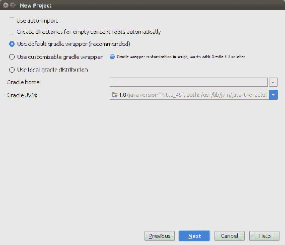
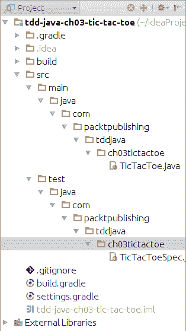
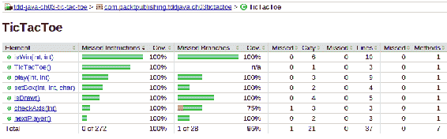

# 红绿重构——从失败到成功，直到完美

“仅仅知道是不够的，我们必须应用。仅仅愿意是不够的，我们必须去做。”

–李小龙

**红绿重构**技术是**测试驱动开发**（**TDD**的基础。这是一个乒乓球游戏，我们在测试和实现代码之间快速切换。我们会失败，然后我们会成功，最后，我们会进步。

我们将开发一个 Tic-Tac-Toe 游戏，每次检查一个需求。我们将编写一个测试，看看它是否失败。然后，我们将编写实现该测试的代码，运行所有测试，并看到它们成功。最后，我们将重构代码并尝试使其更好。该过程将重复多次，直到所有需求都成功实现。

我们将从使用 Gradle 和 JUnit 设置环境开始。然后，我们将深入讨论红绿重构过程。一旦我们准备好了设置和理论，我们将了解应用程序的高级需求。

一切就绪后，我们将一次一个地深入到代码需求中。完成所有工作后，我们将查看代码覆盖率，并决定它是否可以接受，或者是否需要添加更多测试。

本章将介绍以下主题：

*   使用 Gradle 和 JUnit 设置环境
*   红绿重构过程
*   Tic Tac Toe 的要求
*   开发 Tic-Tac-Toe
*   代码覆盖率
*   更多的练习

# 使用 Gradle 和 JUnit 设置环境

您可能熟悉 Java 项目的设置。然而，您可能以前没有使用 IntelliJ IDEA，或者您可能使用 Maven 而不是 Gradle。为了确保您能够按照练习进行操作，我们将快速完成设置。

# 在 IntelliJ IDEA 中设置 Gradle/Java 项目

这本书的主要目的是教 TDD，所以我们不会详细介绍 Gradle 和 IntelliJ IDEA。两者都被用作示例。本书中的所有练习都可以通过 IDE 和构建工具的不同选择来完成。例如，您可以使用 Maven 和 Eclipse。对大多数人来说，遵循本书中所述的指导原则可能更容易，但选择权在你。

以下步骤将在 IntelliJ IDEA 中创建一个新的 Gradle 项目：

1.  打开 IntelliJ 的想法。单击 CreatenewProject 并从左侧菜单中选择 Gradle。然后，单击 Next。
2.  如果您使用的是 IDEA 14 及更高版本，系统会要求您输入工件 ID。键入`tdd-java-ch03-tic-tac-toe`并单击“下一步”两次。键入`tdd-java-ch03-tic-tac-toe`作为项目名称。然后，单击“完成”按钮：



在新建项目对话框中，我们可以看到 IDEA 已经创建了`build.gradle`文件。打开它，您将看到它已经包含 JUnit 依赖项。因为这是我们在本章中选择的框架，所以我们不需要进行额外的配置。默认情况下，`build.gradle`设置为使用 Java 1.5 作为源代码兼容性设置。您可以将其更改为您喜欢的任何版本。本章中的示例将不使用版本 5 之后的任何 Java 特性，但这并不意味着您无法使用 JDK 8 等解决此练习。

我们的`build.gradle`文件应该如下所示：

```java
apply plugin: 'java' 

version = '1.0' 

repositories { 
  mavenCentral()
} 

dependencies { 
  testCompile group: 'junit', name: 'junit', version: '4.11' 
} 
```

现在，剩下要做的就是创建我们将用于测试和实现的包。在“项目”对话框中，右键单击以打开关联菜单并选择“新建|目录”。键入`src/test/java/com/packtpublishing/tddjava/ch03tictactoe`并单击 OK 按钮创建测试包。对`src/main/java/com/packtpublishing/tddjava/ch03tictactoe`目录重复相同的步骤来创建实现包。

最后，我们需要制作测试和实现类。在`src/test/java`目录下的`com.packtpublishing.tddjava.ch03tictactoe`包中创建`TicTacToeSpec`类。这个类将包含我们所有的测试。对`src/main/java`目录中的`TicTacToe`类重复相同的操作。

您的项目结构应与以下屏幕截图中显示的结构相似：



源代码可以在`tdd-java-ch03-tic-tac-toe`Git 库[的`00-setup`分支中找到 https://bitbucket.org/vfarcic/tdd-java-ch03-tic-tac-toe/branch/00-setup](https://bitbucket.org/vfarcic/tdd-java-ch03-tic-tac-toe/branch/00-setup)。

Always separate tests from the implementation code.

The benefits are as follows: this avoids accidentally packaging tests together with production binaries; many build tools expect tests to be in a certain source directory.

A common practice is to have at least two source directories. The implementation code should be located in `src/main/java` and the test code in `src/test/java`. In bigger projects, the number of source directories can increase, but the separation between implementation and tests should remain.

Build tools such as Maven and Gradle expect source directories, separation, as well as naming conventions.

就这样。我们准备开始使用 JUnit 作为首选的测试框架，使用 Gradle 进行编译、依赖、测试和其他任务，开发我们的 Tic-Tac-Toe 应用程序。在第 1 章中*我为什么要关注测试驱动开发？*，您首先遇到了红-绿重构过程。因为它是 TDD 的基石，也是本章练习的主要目标，所以在我们开始开发之前，深入了解更多细节可能是一个好主意。

# 红绿重构过程

红绿重构过程是 TDD 最重要的部分。它是 TDD 的主要支柱，没有它，TDD 的任何其他方面都无法发挥作用。

该名称来自我们的代码在周期内所处的状态。当处于红色状态时，代码不工作；当处于绿色状态时，一切都按预期运行，但不一定以最佳方式运行。重构是一个阶段，当我们知道特性已经被测试很好地覆盖，从而给我们信心去改变它，使它变得更好。

# 写测验

每一个新特性都从一个测试开始。本测试的主要目标是在编写代码之前关注需求和代码设计。测试是可执行文档的一种形式，可以在以后使用它来理解代码的作用或背后的意图。

此时，我们处于红色状态，因为测试执行失败。测试对代码的期望与实现代码的实际执行之间存在差异。更具体地说，没有满足上一次测试期望的代码；我们还没写呢。在这个阶段，所有的测试都有可能通过，但这是一个问题的迹象。

# 运行所有测试并确认最后一个测试失败

确认最后一个测试失败，确认如果不引入新代码，测试不会错误地通过。如果测试通过，则该功能已存在或测试产生假阳性。如果是这种情况，并且测试实际上总是独立于实现而通过，那么它本身就毫无价值，应该被删除。

测试不仅必须失败，而且必须因为预期的原因失败。在这个阶段，我们仍然处于红色阶段。测试已运行，最后一个测试失败。

# 编写实现代码

此阶段的目的是编写代码，使最后一次测试通过。不要试图让它变得完美，也不要试图花太多时间在它上面。如果它写得不好或者不是最佳的，那也没关系。以后会好起来的。我们真正想做的是建立一个安全网，以确保通过测试。不要尝试引入上次测试中未描述的任何功能。要做到这一点，我们需要回到第一步，开始新的测试。然而，在所有现有测试都通过之前，我们不应该编写新的测试。

在这个阶段，我们仍然处于红色阶段。虽然编写的代码可能会通过所有测试，但这一假设尚未得到证实。

# 运行所有测试

所有测试都要运行，而不仅仅是上一次编写的测试，这一点非常重要。我们刚刚编写的代码可能已经通过了最后一次测试，同时破坏了其他内容。运行所有测试不仅可以确认上一个测试的实现是正确的，而且还可以确认它没有破坏整个应用程序的完整性。整个测试套件的执行速度缓慢，这表明测试编写得很糟糕，或者代码中存在太多耦合。耦合防止了外部依赖的容易隔离，从而增加了执行测试所需的时间。

在这个阶段，我们处于绿色状态。所有测试都通过了，应用程序的行为与我们预期的一样。

# 重构

虽然前面的所有步骤都是强制性的，但此步骤是可选的。尽管重构很少在每个周期结束时进行，但如果不是强制性的，它迟早会被期望的。并非每个测试的实现都需要重构。没有规则告诉您何时重构，何时不重构。最好的时机是当你感觉到代码可以以更好或更优化的方式重写时。

什么构成重构的候选者？这是一个很难回答的问题，因为它可能有很多答案——很难理解代码、一段代码的不合理位置、重复、没有明确说明目的的名称、很长的方法、做太多事情的类等等。这个名单可以一直列下去。无论原因是什么，最重要的规则是重构不能改变任何现有的功能。

# 重复

一旦所有步骤（重构是可选的）完成，我们就重复它们。乍一看，整个过程似乎太长或太复杂，但事实并非如此。有经验的 TDD 从业者在切换到下一步之前编写一到十行代码。整个循环应该持续几秒钟到几分钟。如果需要更多的时间，那么测试的范围太大，应该分成更小的块。快速、快速失败、纠正并重复。

有了这些知识，让我们来看看我们将要使用红绿重构过程开发的应用程序的需求。

# 井字游戏要求

小孩子最常玩井字游戏。游戏规则相当简单。

Tic-Tac-Toe is a paper-and-pencil game for two players, *X* and *O*, who take turns marking the spaces in a 3×3 grid. The player who succeeds in placing three respective marks in a horizontal, vertical, or diagonal row, wins the game.

有关游戏的更多信息，请访问[维基百科](http://en.wikipedia.org/wiki/Tic-tac-toe)。

稍后将提出更详细的要求。

该练习包括创建一个与其中一个需求相对应的测试。测试之后是满足该测试期望的代码。最后，如果需要，对代码进行重构。应重复相同的程序，并进行与相同要求相关的更多试验。一旦我们对测试和该需求的实现感到满意，我们将进入下一个测试，直到它们全部完成。

在现实世界中，您不会得到如此详细的需求，而是直接投入到将作为需求和验证的测试中。然而，在您熟悉 TDD 之前，我们必须将需求与测试分开定义。

即使提供了所有的测试和实现，也要尝试一次只读取一个需求，自己编写测试和实现代码。完成后，将您的解决方案与本书中的解决方案进行比较，然后转到下一个需求。没有一个也只有一个解决办法；你的可能比这里介绍的更好。

# 开发 Tic-Tac-Toe

你准备好编码了吗？让我们从第一个要求开始。

# 要求 1–放置工件

我们应该从定义边界开始，以及什么构成工件的无效放置。

A piece can be placed on any empty space of a 3×3 board.

我们可以将此要求分为三个测试：

*   当工件放置在*x*轴之外的任何位置时，则抛出`RuntimeException`
*   当一个工件放置在*y*轴之外的任何位置时，就会抛出`RuntimeException`
*   当一件物品被放置在一个被占用的空间时，就会抛出`RuntimeException`

如您所见，与第一个需求相关的测试都是关于输入参数的验证。需求中没有说明应该如何处理这些部件。

在我们开始第一个测试之前，先简要说明如何使用 JUnit 测试异常。

从 4.7 版开始，JUnit 引入了一个名为`Rule`的特性。它可以用来做很多不同的事情（更多信息可以在[中找到）https://github.com/junit-team/junit/wiki/Rules](https://github.com/junit-team/junit/wiki/Rules)，但在我们的案例中，我们对`ExpectedException`规则感兴趣：

```java
public class FooTest {
  @Rule
  public ExpectedException exception = ExpectedException.none();
  @Test
  public void whenDoFooThenThrowRuntimeException() {
    Foo foo = new Foo();
    exception.expect(RuntimeException.class);
    foo.doFoo();
  }
} 
```

在这个例子中，我们定义了`ExpectedException`是一个规则。稍后，在`doFooThrowsRuntimeException`测试中，我们指定希望在`Foo`类实例化后抛出`RuntimeException`。如果之前抛出，测试将失败。如果在之后引发异常，则测试成功。

`@Before`可用于注释每次测试前应运行的方法。这是一个非常有用的功能，例如，我们可以使用它实例化测试中使用的类，或者执行一些其他类型的操作，这些操作应该在每次测试之前运行：

```java
private Foo foo; 

@Before 
public final void before() { 
  foo = new Foo(); 
} 
```

在本例中，`Foo`类将在每次测试之前实例化。通过这种方式，我们可以避免在每个测试方法中都有实例化`Foo`的重复代码。

每项测试均应注明`@Test`。这告诉`JunitRunner`哪些方法构成测试。每个测试都将以随机顺序运行，因此确保每个测试都是自给自足的，并且不依赖于其他测试可能创建的状态：

```java
@Test 
public void whenSomethingThenResultIsSomethingElse() { 
  // This is a test method 
} 
```

有了这些知识，您应该能够编写您的第一个测试并在实现过程中遵循它。完成后，将其与提供的解决方案进行比较。

Use descriptive names for test methods. 

One of the benefits is that it helps to understand the objective of tests.

Using method names that describe tests is beneficial when trying to figure out why some tests failed or when the coverage should be increased with more tests. It should be clear what conditions are set before the test, what actions are performed, and what the expected outcome is.

There are many different ways to name test methods. My preferred method is to name them using the given/when/then syntax used in BDD scenarios. `Given` describes (pre)conditions, `When` describes actions, and `Then` describes the expected outcome. If a test does not have preconditions (usually set using the `@Before` and `@BeforeClass` annotations), `Given` can be skipped.

Do not rely only on comments to provide information about test objectives. Comments do not appear when tests are executed from your favorite IDE, nor do they appear in reports generated by the CI or build tools.

除了编写测试，您还需要运行它们。由于我们使用的是 Gradle，因此可以从命令提示符下运行它们：

```java
    $ gradle test
```

IntelliJ IDEA 提供了一个非常好的 Gradle 任务模型，可以通过单击查看|工具窗口| Gradle 来访问该模型。它列出了所有可以使用 Gradle 运行的任务（`test`是其中之一）。

您可以选择以任何适合的方式运行测试，只要您运行所有测试。

# 测试板边界 I

首先，我们应该检查一件物品是否放置在 3x3 电路板的边界内：

```java
package com.packtpublishing.tddjava.ch03tictactoe;

import org.junit.Before;
import org.junit.Rule;
import org.junit.Test;
import org.junit.rules.ExpectedException;

public class TicTacToeSpec {
  @Rule
  public ExpectedException exception = ExpectedException.none();
  private TicTacToe ticTacToe;

  @Before
  public final void before() {
    ticTacToe = new TicTacToe();
  }
  @Test
  public void whenXOutsideBoardThenRuntimeException() {
    exception.expect(RuntimeException.class);
    ticTacToe.play(5, 2);
  }
} 
```

When a piece is placed anywhere outside the *x*-axis, then `RuntimeException` is thrown.

在这个测试中，我们定义当调用`ticTacToe.play(5, 2)`方法时，`RuntimeException`是预期的。这是一个很短很容易的测试，让它通过也应该很容易。我们所要做的就是创建`play`方法，并确保当`x`参数小于 1 或大于 3（电路板为 3x3）时，它抛出`RuntimeException`。您应该运行此测试三次。第一次，它应该失败，因为`play`方法不存在。一旦添加，它应该会失败，因为没有抛出`RuntimeException`。第三次，它应该是成功的，因为与此测试对应的代码已完全实现。

# 实施

现在，我们对何时引发异常有了明确的定义，实现应该很简单：

```java
package com.packtpublishing.tddjava.ch03tictactoe;

public class TicTacToe {
  public void play(int x, int y) {
    if (x < 1 || x > 3) {
      throw new RuntimeException("X is outside board");
    }
  }
}
```

正如您所看到的，此代码不包含任何其他内容，而是测试通过所需的最小值。

一些 TDD 实践者倾向于将最小值作为字面意义。他们将使用只包含`throw new RuntimeException();`行的`play`方法。我倾向于在合理的范围内将最小值转换为尽可能少的值。

我们没有添加数字，也没有返回任何内容。这一切都是关于快速做出微小的改变。（还记得乒乓球吗？）。我们不能做太多的工作来改进这段代码，所以我们跳过了重构。

让我们进入下一个测试。

# 测试板边界 II

这项测试几乎与前一项相同。这次我们应该验证*y*轴：

```java
@Test
public void whenYOutsideBoardThenRuntimeException() {
  exception.expect(RuntimeException.class);
  ticTacToe.play(2, 5);
}
```

When a piece is placed anywhere outside the *y*-axis, then `RuntimeException` is thrown.

# 实施

本规范的实现与前一规范几乎相同。如果`y`不在定义的范围内，我们只需抛出一个异常：

```java
public void play(int x, int y) {
  if (x < 1 || x > 3) {
    throw new RuntimeException("X is outside board");
  } else if (y < 1 || y > 3) {
    throw new RuntimeException("Y is outside board");
  }
}
```

为了让最后一次测试通过，我们必须添加检查`Y`是否在电路板内部的`else`子句。

让我们为这个需求做最后一次测试。

# 测试-占用点

既然我们知道了棋子被放置在棋盘的边界内，我们应该确保它们只能放置在未占用的空间：

```java
@Test 
public void whenOccupiedThenRuntimeException() { 
  ticTacToe.play(2, 1); 
  exception.expect(RuntimeException.class); 
  ticTacToe.play(2, 1); 
} 
```

When a piece is placed on an occupied space, then `RuntimeException` is thrown.

就这样,；这是我们最后一次测试。一旦实现完成，我们就可以认为第一个需求已经完成。

# 实施

为了实现最后一个测试，我们应该将放置的片段的位置存储在一个数组中。每次放置新工件时，我们都应确认该位置未被占用，否则会引发异常：

```java
private Character[][] board = {
  {'\0', '\0', '\0'},
  {'\0', '\0', '\0'},
  {'\0', '\0', '\0'}
};

public void play(int x, int y) {
  if (x < 1 || x > 3) {
    throw new RuntimeException("X is outside board");
  } else if (y < 1 || y > 3) {
    throw new RuntimeException("Y is outside board");
  }
  if (board[x - 1][y - 1] != '\0') {
    throw new RuntimeException("Box is occupied");
  } else {
    board[x - 1][y - 1] = 'X';
  }
}
```

我们正在检查播放的位置是否已被占用，如果未被占用，则将数组条目值从空（`\0`）更改为已占用（`X`）。请记住，我们仍然没有存储谁玩过（`X`或`O`）。

# 重构

虽然到目前为止我们所做的代码满足了测试所设置的需求，但它看起来有点混乱。如果有人读了它，`play`方法的作用就不清楚了。我们应该通过将代码移动到单独的方法来重构它。重构后的代码如下所示：

```java
public void play(int x, int y) {
  checkAxis(x);
  checkAxis(y);
  setBox(x, y);
}

private void checkAxis(int axis) {
  if (axis < 1 || axis > 3) {
    throw new RuntimeException("X is outside board");
  }
}

private void setBox(int x, int y) {
  if (board[x - 1][y - 1] != '\0') {
    throw new RuntimeException("Box is occupied");
  } else {
    board[x - 1][y - 1] = 'X';
  }
}
```

通过这次重构，我们没有改变`play`方法的功能。它的行为与以前完全相同，但新代码更具可读性。因为我们的测试涵盖了所有现有的功能，所以不必担心我们会做错什么。只要所有测试都一直通过，并且重构没有引入任何新行为，那么对代码进行更改是安全的。

源代码可以在`tdd-java-ch03-tic-tac-toe`Git 库[的`01-exceptions`分支中找到 https://bitbucket.org/vfarcic/tdd-java-ch03-tic-tac-toe/branch/01-exceptions](https://bitbucket.org/vfarcic/tdd-java-ch03-tic-tac-toe/branch/01-exceptions)。

# 要求 2–增加两人支持

现在，是时候研究一下该轮到哪个球员上场了。

There should be a way to find out which player should play next.

我们可以将此要求分为三个测试：

*   第一回合由玩家`X`进行
*   如果上一回合由`X`进行，则下一回合应由`O`进行
*   如果上一回合由`O`进行，则下一回合应由`X`进行

直到现在，我们还没有使用 JUnit 的任何断言。要使用它们，我们需要`import`来自`org.junit.Assert`类的`static`方法：

```java
import static org.junit.Assert.*;
```

本质上，`Assert`类中的方法非常简单。大多数都以`assert`开头。例如，`assertEquals`比较两个对象-`assertNotEquals`验证两个对象不相同，`assertArrayEquals`验证两个数组相同。这些断言中的每一个都有许多重载变体，因此几乎可以使用任何类型的 Java 对象。

在我们的例子中，我们需要比较两个字符。第一个是我们期望的，第二个是从`nextPlayer`方法检索到的实际字符。

现在是编写这些测试和实现的时候了。

Write the test before writing the implementation code .

The benefits of doing this are as follows—it ensures that testable code is written and ensures that every line of code gets tests written for it.

By writing or modifying the test first, the developer is focused on requirements before starting to work on a code. This is the main difference when compared to writing tests after the implementation is done. An additional benefit is that with tests first, we are avoiding the danger that the tests work as quality checking instead of quality assurance.

# 测试–X 首先播放

玩家`X`拥有第一回合：

```java
@Test
public void givenFirstTurnWhenNextPlayerThenX() {
  assertEquals('X', ticTacToe.nextPlayer());
}
```

The first turn should be played by Player `X`.

这个测试应该是不言自明的。我们期待`nextPlayer`方法返回`X`。如果您尝试运行这个，您将看到代码甚至没有编译。那是因为`nextPlayer`方法根本不存在。我们的任务是编写`nextPlayer`方法并确保它返回正确的值。

# 实施

没有必要检查这是否真的是球员的第一回合。目前，可以通过始终返回`X`来完成此测试。稍后的测试将迫使我们改进此代码：

```java
public char nextPlayer() {
  return 'X';
}
```

# 测试–O 在 X 之后播放

现在，我们应该确保球员正在改变。`X`结束后，应先轮到`O`，然后再轮到`X`，依此类推：

```java
@Test
public void givenLastTurnWasXWhenNextPlayerThenO() {
  ticTacToe.play(1, 1);
  assertEquals('O', ticTacToe.nextPlayer());
}
```

If the last turn was played by `X`, then the next turn should be played by `O`.

# 实施

为了跟踪下一个玩家，我们需要存储最后一个玩家：

```java
private char lastPlayer = '\0';

public void play(int x, int y) {
  checkAxis(x);
  checkAxis(y);
  setBox(x, y);
  lastPlayer = nextPlayer();
}

public char nextPlayer() {
  if (lastPlayer == 'X') {
    return 'O';
  }
  return 'X';
}
```

你可能已经开始掌握窍门了。测试很小，很容易编写。有了足够的经验，编写一个测试应该需要一分钟，如果不是几秒钟的话，编写实现也需要同样多或更少的时间。

# 测试–X 在 O 之后立即播放

最后，我们可以检查`X`的回合是否在`O`播放之后。

If the last turn was played by `O`, then the next turn should be played by `X`.

没有什么可以做来完成这个测试，因此，这个测试是无用的，应该被丢弃。如果你写这个测试，你会发现它是一个假阳性。它将在不改变实施的情况下通过；试试看。编写此测试，如果它成功而没有编写任何实现代码，则放弃它。

源代码可以在`tdd-java-ch03-tic-tac-toe`Git 库[的`02-next-player`分支中找到 https://bitbucket.org/vfarcic/tdd-java-ch03-tic-tac-toe/branch/02-next-player](https://bitbucket.org/vfarcic/tdd-java-ch03-tic-tac-toe/branch/02-next-player)。

# 要求 3–添加获胜条件

是时候按照游戏规则努力赢得比赛了。与前面的代码相比，这一部分的工作变得有点乏味。我们应该检查所有可能获胜的组合，如果其中一个组合成功，则宣布获胜。

A player wins by being the first to connect a line of friendly pieces from one side or corner of the board to the other.

为了检查一行友好的片段是否连接，我们应该验证水平线、垂直线和对角线。

# 测试–默认情况下没有赢家

让我们从定义`play`方法的默认响应开始：

```java
@Test
public void whenPlayThenNoWinner() {
  String actual = ticTacToe.play(1,1);
  assertEquals("No winner", actual);
}
```

If no winning condition is fulfilled, then there is no winner.

# 实施

默认返回值总是最容易实现的，这一个也不例外：

```java
public String play(int x, int y) {
  checkAxis(x);
  checkAxis(y);
  setBox(x, y);
  lastPlayer = nextPlayer();
  return "No winner";
}
```

# 测试-获胜条件 I

现在我们已经声明了默认响应是什么（`No winner`），是时候开始处理不同的获胜条件了：

```java
@Test
public void whenPlayAndWholeHorizontalLineThenWinner() {
  ticTacToe.play(1, 1); // X
  ticTacToe.play(1, 2); // O
  ticTacToe.play(2, 1); // X
  ticTacToe.play(2, 2); // O
  String actual = ticTacToe.play(3, 1); // X
  assertEquals("X is the winner", actual);
}
```

The player wins when the whole horizontal line is occupied by his pieces.

# 实施

为了完成这个测试，我们需要检查是否有任何水平线与当前玩家的标记相同。在这之前，我们并不关心板阵列上放了什么。现在，我们不仅需要介绍哪些棋盘盒是空的，还需要介绍哪些玩家玩了它们：

```java
public String play(int x, int y) {
  checkAxis(x);
  checkAxis(y);
  lastPlayer = nextPlayer();
  setBox(x, y, lastPlayer);
  for (int index = 0; index < 3; index++) {
    if (board[0][index] == lastPlayer
        && board[1][index] == lastPlayer
        && board[2][index] == lastPlayer) {
      return lastPlayer + " is the winner";
    }
  }
  return "No winner";
}
private void setBox(int x, int y, char lastPlayer) {
  if (board[x - 1][y - 1] != '\0') {
    throw new RuntimeException("Box is occupied");
  } else {
    board[x - 1][y - 1] = lastPlayer;
  }
}
```

# 重构

前面的代码满足测试要求，但不一定是最终版本。它达到了尽快获得代码覆盖率的目的。现在，由于我们有保证预期行为完整性的测试，我们可以重构代码：

```java
private static final int SIZE = 3;

public String play(int x, int y) {
  checkAxis(x);
  checkAxis(y);
  lastPlayer = nextPlayer();
  setBox(x, y, lastPlayer);
  if (isWin()) {
    return lastPlayer + " is the winner";
  }
  return "No winner";
}

private boolean isWin() {
  for (int i = 0; i < SIZE; i++) {
    if (board[0][i] + board[1][i] + board[2][i] == (lastPlayer * SIZE)) {
      return true;
    }
  }
  return false;
}
```

这个重构的解决方案看起来更好。`play`方法一直保持简洁易懂。获胜逻辑被转移到一个单独的方法。我们不仅保持了`play`方法的目的明确，而且这种分离还允许我们在与其他方法分离的情况下增加获胜条件的代码。

# 测试-获胜条件 II

我们还应该通过填充垂直线来检查是否有赢：

```java
@Test
public void whenPlayAndWholeVerticalLineThenWinner() {
  ticTacToe.play(2, 1); // X
  ticTacToe.play(1, 1); // O
  ticTacToe.play(3, 1); // X
  ticTacToe.play(1, 2); // O
  ticTacToe.play(2, 2); // X
  String actual = ticTacToe.play(1, 3); // O
  assertEquals("O is the winner", actual);
}
```

The player wins when the whole vertical line is occupied by his pieces.

# 实施

这个实现应该与前一个类似。我们已经进行了横向验证，现在我们需要纵向验证：

```java
private boolean isWin() {
  int playerTotal = lastPlayer * 3;
  for (int i = 0; i < SIZE; i++) {
    if (board[0][i] + board[1][i] + board[2][i] == playerTotal) {
      return true;
    } else if (board[i][0] + board[i][1] + board[i][2] == playerTotal) {
      return true;
    }
  }
  return false;
}
```

# 测试-获胜条件 III

既然水平线和垂直线都被覆盖了，我们应该把注意力转移到对角线组合上：

```java
@Test 
public void whenPlayAndTopBottomDiagonalLineThenWinner() {
  ticTacToe.play(1, 1); // X
  ticTacToe.play(1, 2); // O
  ticTacToe.play(2, 2); // X
  ticTacToe.play(1, 3); // O
  String actual = ticTacToe.play(3, 3); // X
  assertEquals("X is the winner", actual);
}
```

The player wins when the whole diagonal line from the top-left to bottom-right is occupied by his pieces.

# 实施

由于只有一行可以构成需求，我们可以直接检查它，而不需要任何循环：

```java
private boolean isWin() {
  int playerTotal = lastPlayer * 3;
  for (int i = 0; i < SIZE; i++) {
    if (board[0][i] + board[1][i] + board[2][i] == playerTotal) {
      return true;
    } else if (board[i][0] + board[i][1] + board[i][2] == playerTotal) {
      return true;
    } 
  } 
  if (board[0][0] + board[1][1] + board[2][2] == playerTotal) { 
    return true; 
  }   
  return false; 
} 
```

# 代码覆盖率

在整个练习中，我们没有使用代码覆盖工具。原因是我们希望您关注红绿重构模型。您编写了一个测试，看到它失败了，编写了实现代码，看到所有测试都成功执行了，只要有机会改进代码，就重构代码，然后重复这个过程。我们的测试覆盖了所有的案例吗？这是代码覆盖工具（如 JaCoCo）可以回答的问题。你应该使用那些工具吗？也许，只是在开始的时候。让我澄清一下。当您开始使用 TDD 时，您可能会错过一些测试或实现比测试定义的更多的测试。在这些情况下，使用代码覆盖率是从自己的错误中学习的好方法。以后，您对 TDD 的经验越丰富，您对此类工具的需求就越少。您将编写测试和足够的代码以使其通过。无论是否使用 JaCoCo 等工具，您的覆盖率都会很高。有少量代码没有被测试覆盖，因为您会有意识地决定哪些代码不值得测试。

JaCoCo 等工具的设计主要是为了验证在实现代码之后编写的测试是否提供了足够的覆盖率。对于 TDD，我们采用了一种不同的方法，采用相反的顺序（在实现之前进行测试）。

尽管如此，我们还是建议您使用 JaCoCo 作为学习工具，并自行决定将来是否使用它。

要在 Gradle 中启用 JaCoCo，请在`build.gradle`中添加以下内容：

```java
apply plugin: 'jacoco'
```

从现在起，Gradle 将在每次运行测试时收集 JaCoCo 指标。这些指标可以使用`jacocoTestReport`Gradle 目标转换成一个漂亮的报告。让我们再次运行测试，看看代码覆盖率是多少：

```java
$ gradle clean test jacocoTestReport
```

最终结果是位于`build/reports/jacoco/test/html`目录中的报告。根据您为本练习制定的解决方案，结果会有所不同。我的结果是有 100%的指令覆盖率和 96%的分支覆盖率；缺少 4%，因为没有玩家在 0 或负值的方框上玩的测试用例。这种情况的实现是存在的，但是没有具体的测试覆盖它。总的来说，这是一个相当不错的报道：



JaCoCo 将添加到源代码中。这可以在位于[的`tdd-java-ch03-tic-tac-toe`Git 存储库的`05-jacoco`分支中找到 https://bitbucket.org/vfarcic/tdd-java-ch03-tic-tac-toe/branch/05-jacoco](https://bitbucket.org/vfarcic/tdd-java-ch03-tic-tac-toe/branch/05-jacoco)。

# 测试-获胜条件 IV

最后，还有最后一个可能的获胜条件：

```java
@Test
public void whenPlayAndBottomTopDiagonalLineThenWinner() {
  ticTacToe.play(1, 3); // X
  ticTacToe.play(1, 1); // O
  ticTacToe.play(2, 2); // X
  ticTacToe.play(1, 2); // O
  String actual = ticTacToe.play(3, 1); // X
  assertEquals("X is the winner", actual);
}
```

The player wins when the whole diagonal line from the bottom-left to top-right is occupied by his pieces.

# 实施

此测试的实施应与前一测试几乎相同：

```java
private boolean isWin() {
  int playerTotal = lastPlayer * 3;
  for (int i = 0; i < SIZE; i++) {
    if (board[0][i] + board[1][i] + board[2][i] == playerTotal) {
      return true;
    } else if (board[i][0] + board[i][1] + board[i][2] == playerTotal) {
      return true;
    }
  }
  if (board[0][0] + board[1][1] + board[2][2] == playerTotal) {
    return true;
  } else if (board[0][2] + board[1][1] + board[2][0] == playerTotal) {
    return true;
  }
  return false;
}
```

# 重构

我们处理可能的对角线胜利的方式，计算看起来不正确。也许重新利用现有环路更有意义：

```java
private boolean isWin() {
  int playerTotal = lastPlayer * 3;
  char diagonal1 = '\0';
  char diagonal2 = '\0';
  for (int i = 0; i < SIZE; i++) {
    diagonal1 += board[i][i];
    diagonal2 += board[i][SIZE - i - 1];
    if (board[0][i] + board[1][i] + board[2][i]) == playerTotal) {
      return true;
    } else if (board[i][0] + board[i][1] + board[i][2] == playerTotal) {
      return true;
    }
  }
  if (diagonal1 == playerTotal || diagonal2 == playerTotal) {
    return true;
  }
  return false;
}
```

源代码可以在`tdd-java-ch03-tic-tac-toe`Git 库[的`03-wins`分支中找到 https://bitbucket.org/vfarcic/tdd-java-ch03-tic-tac-toe/branch/03-wins](https://bitbucket.org/vfarcic/tdd-java-ch03-tic-tac-toe/branch/03-wins)。

现在，让我们看一下最后一项要求。

# 要求 4–连接条件

唯一缺少的是如何处理平局结果。

The result is a draw when all the boxes are filled.

# 测试–处理平局情况

我们可以通过填充电路板的所有方框来测试绘图结果：

```java
@Test
public void whenAllBoxesAreFilledThenDraw() {
  ticTacToe.play(1, 1);
  ticTacToe.play(1, 2);
  ticTacToe.play(1, 3);
  ticTacToe.play(2, 1);
  ticTacToe.play(2, 3);
  ticTacToe.play(2, 2);
  ticTacToe.play(3, 1);
  ticTacToe.play(3, 3);
  String actual = ticTacToe.play(3, 2);
  assertEquals("The result is draw", actual);
}
```

# 实施

检查是否是平局相当简单。我们所要做的就是检查董事会的箱子是否都装满了。我们可以通过迭代电路板阵列来实现这一点：

```java
public String play(int x, int y) {
  checkAxis(x);
  checkAxis(y);
  lastPlayer = nextPlayer();
  setBox(x, y, lastPlayer);
  if (isWin()) {
    return lastPlayer + " is the winner";
  } else if (isDraw()) {
    return "The result is draw";
  } else {
    return "No winner";
  }
}

private boolean isDraw() {
  for (int x = 0; x < SIZE; x++) {
    for (int y = 0; y < SIZE; y++) {
      if (board[x][y] == '\0') {
        return false;
      }
    }
  }
  return true;
}
```

# 重构

尽管`isWin`方法不在上次测试的范围内，但它仍然可以进行更多的重构。这一次，我们不需要检查所有的组合，只需要检查与最后一首乐曲的位置相关的组合。最终版本可能如下所示：

```java
private boolean isWin(int x, int y) {
  int playerTotal = lastPlayer * 3;
  char horizontal, vertical, diagonal1, diagonal2;
  horizontal = vertical = diagonal1 = diagonal2 = '\0';
  for (int i = 0; i < SIZE; i++) {
    horizontal += board[i][y - 1];
    vertical += board[x - 1][i];
    diagonal1 += board[i][i];
    diagonal2 += board[i][SIZE - i - 1];
  }
  if (horizontal == playerTotal
      || vertical == playerTotal
      || diagonal1 == playerTotal
      || diagonal2 == playerTotal) {
    return true;
  }
  return false;
} 
```

重构可以在任何时候对代码的任何部分进行，只要所有测试都成功。虽然重构刚刚编写的代码通常是最简单、最快的，但回到前几天、前一个月甚至几年前编写的代码是非常受欢迎的。重构某些东西的最佳时机是当有人看到改进它的机会时。不管是谁写的，什么时候写的；使代码更好总是一件好事。

源代码可以在`tdd-java-ch03-tic-tac-toe`Git 库[的`04-draw`分支中找到 https://bitbucket.org/vfarcic/tdd-java-ch03-tic-tac-toe/branch/04-draw](https://bitbucket.org/vfarcic/tdd-java-ch03-tic-tac-toe/branch/04-draw)。

# 更多的练习

我们刚刚开发了一个（最常用的）Tic Tac Toe 游戏的变体。作为附加练习，从维基百科（[中选择一个或多个变体 http://en.wikipedia.org/wiki/Tic-tac-toe](http://en.wikipedia.org/wiki/Tic-tac-toe) ），并使用红-绿重构过程实现它。完成后，实现一种 AI，可以轮流玩`O`。由于 Tic Tac Toe 通常会导致平局，当 AI 在`X`的任何动作组合中成功达到平局时，可以认为 AI 已经完成。

在做这些练习时，记得要快一点，打乒乓球。另外，最重要的是，记住使用红-绿重构过程。

# 总结

我们使用红绿重构过程成功地完成了 Tic-Tac-Toe 游戏。这些例子本身很简单，你可能没有问题跟随它们。

本章的目的不是深入研究一些复杂的东西（后面会介绍），而是养成使用称为红-绿重构的短期重复周期的习惯。

我们了解到，开发某种东西最简单的方法是将它分成非常小的块。该设计是从测试中产生的，而不是使用大的前期方法。没有一行实现代码是在不先编写测试并看到它失败的情况下编写的。通过确认最后一个测试失败，我们确认它是有效的（很容易出错并编写一个总是成功的测试），并且我们将要实现的功能不存在。测试失败后，我们编写了该测试的实现。在编写实现时，我们试图使其成为一个最小的实现，目标是通过测试，而不是最终解决方案。我们重复这个过程，直到我们觉得有必要重构代码。重构没有引入任何新功能（我们没有改变应用程序的功能），而是使代码更优化，更易于阅读和维护。

在下一章中，我们将更详细地阐述在 TDD 上下文中什么构成单元，以及如何基于这些单元创建测试。