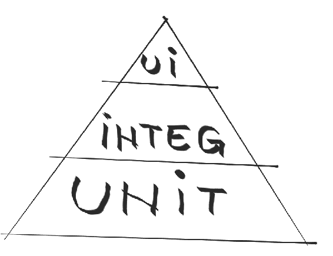
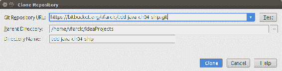
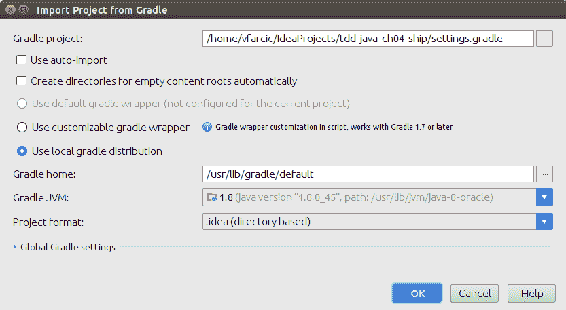
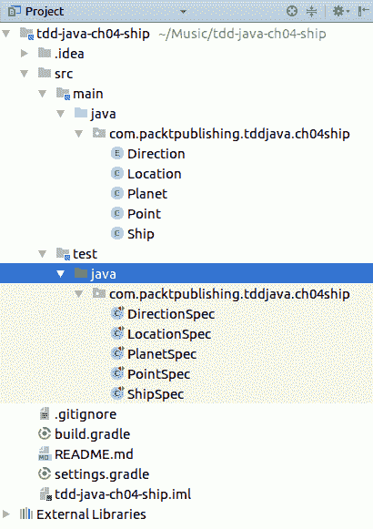
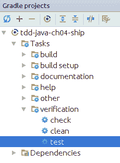

# 单元测试——关注你做了什么，而不是已经做了什么

“要创造出与众不同的东西，你的思维方式必须坚持不懈地专注于最小的细节。”

——乔治·阿玛尼

正如所承诺的，每一章都将探讨不同的 Java 测试框架，这一章也不例外。我们将使用 TestNG 来构建我们的规范。

在前面的第 3 章*红绿重构——从失败到成功直到完美*中，我们实践了红绿重构过程。我们使用了单元测试，但没有深入探讨单元测试在 TDD 环境中是如何工作的。我们将以上一章的知识为基础，通过解释单元测试到底是什么，以及它们如何适合于构建软件的 TDD 方法，来进行更详细的讨论。

本章的目标是学习如何专注于我们目前正在工作的单元，以及如何忽略或隔离以前做过的单元。

一旦我们熟悉了 TestNG 和单元测试，我们将深入了解下一个应用程序的需求并开始编码。

本章将介绍以下主题：

*   单元测试
*   用 TDD 进行单元测试
*   TestNG
*   遥控船舶要求
*   遥控船舶的研制

# 单元测试

除了最小的系统外，频繁的手动测试对于任何系统都是不切实际的。唯一的解决办法是使用自动化测试。它们是减少构建、部署和维护应用程序的时间和成本的唯一有效方法。为了有效地管理应用程序，最重要的是实现和测试代码都尽可能简单。[简单性是**极限编程**（**XP**）的核心价值观之一](http://www.extremeprogramming.org/rules/simple.html)，以及 TDD 和一般编程的关键。这通常是通过划分成小单位来完成的。在 Java 中，单位是方法。作为最小的，他们提供的反馈循环是最快的，所以我们花了大部分时间思考和工作。作为实现方法的对应物，单元测试应该在所有测试中占最大的比例。

# 什么是单元测试？

**单元测试**是一种迫使我们测试小型、独立和孤立的代码单元的实践。它们通常是方法，即使在某些情况下类甚至整个应用程序也可以被视为单元。为了编写单元测试，测试中的代码需要与应用程序的其余部分隔离。最好，这种隔离已经在代码中根深蒂固，或者可以通过使用**模拟**（更多关于模拟的内容将在第 6 章、*模拟–移除外部依赖*中介绍）。如果特定方法的单元测试跨越该单元的边界，那么它们就成为集成测试。因此，测试内容变得不那么清晰。在发生故障的情况下，问题的范围突然扩大，查找原因变得更加乏味。

# 为什么要进行单元测试？

一个常见的问题，特别是在严重依赖手动测试的组织中，是*为什么我们应该使用单元而不是功能和集成测试？*这个问题本身是有缺陷的。单元测试不能取代其他类型的测试。相反，单元测试缩小了其他类型测试的范围。从本质上讲，单元测试比任何其他类型的测试都更容易、更快地编写，从而降低了成本和**上市时间**（**TTM**。由于编写和运行它们的时间缩短，它们往往能够更快地检测到问题。我们发现问题的速度越快，解决问题的成本就越低。一个在创建几分钟后检测到的 bug 要比在创建几天、几周甚至几个月后发现的 bug 更容易修复。

# 代码重构

**代码重构**是在不改变外部行为的情况下改变现有代码结构的过程。重构的目的是改进现有代码。这种改进有很多不同的原因。我们可能希望使代码更可读、更不复杂、更易于维护、扩展成本更低等等。无论重构的原因是什么，最终目标总是以某种方式使其变得更好。这一目标的效果是减少技术债务；由于设计、架构或编码不理想而需要完成的待完成工作的减少。

通常，我们通过应用一组小的更改来进行重构，而不修改预期的行为。减少重构更改的范围使我们能够不断确认这些更改没有破坏任何现有功能。有效获得该确认的唯一方法是通过使用自动测试。

单元测试的最大好处之一是它们是最好的重构使能器。当没有自动测试来确认应用程序仍按预期运行时，重构风险太大。尽管任何类型的测试都可以用来提供重构所需的代码覆盖率，但在大多数情况下，只有单元测试可以提供所需级别的详细信息。

# 为什么不专门使用单元测试呢？

此时，您可能想知道单元测试是否可以为您的所有测试需求提供解决方案。不幸的是，情况并非如此。虽然单元测试通常覆盖了测试需求的最大百分比，但功能测试和集成测试应该是测试工具箱的一个组成部分。

我们将在后面的章节中更详细地介绍其他类型的测试。目前，它们之间的一些重要区别如下：

*   单元测试试图验证功能的小单元。在 Java 世界中，这些单元是方法。所有外部依赖项，如其他类和方法的调用或数据库调用，都应该在内存中使用 mock、stub、spies、fake 和 dummie 来完成。杰拉德·梅萨罗斯（Gerard Meszaros）创造了一个更一般的术语，**测试双打***，*涵盖了所有这些（[）http://en.wikipedia.org/wiki/Test_double](http://en.wikipedia.org/wiki/Test_double) ）。单元测试简单，易于编写，运行速度快。它们通常是测试套件中最大的百分比。
*   **功能**和**验收**测试的任务是验证我们正在构建的应用程序整体上是否按预期工作。虽然这两者的目的不同，但都有一个相似的目标。与验证代码内部质量的单元测试不同，功能和验收测试试图从客户或用户的角度确保系统正常工作。由于编写和运行这些测试所需的成本和工作量，与单元测试相比，这些测试的数量通常较小。
*   **集成**测试旨在验证单独的单元、模块、应用程序，甚至整个系统是否正确地相互集成。您可能有一个使用后端 API 的前端应用程序，而后端 API 反过来又与数据库通信。集成测试的工作将是验证系统的所有三个独立组件确实是集成的，并且可以相互通信。由于我们已经知道所有单元都在工作，并且所有功能和验收测试都通过了，集成测试通常是这三个测试中最小的一个，因为它们的工作只是确认所有部件都能正常工作：



测试金字塔表明，与更高级别的测试（UI 测试、集成测试等）相比，您应该有更多的单元测试。为什么呢？单元测试的编写成本更低，运行速度更快，同时提供了更大的覆盖范围。以注册功能为例。我们应该测试用户名为空、密码为空、用户名或密码格式不正确、用户已经存在等情况。只有这一项功能才能进行数十次测试，如果不是数百次的话。从 UI 编写和运行所有这些测试可能非常昂贵（编写耗时，运行缓慢）。另一方面，单元测试——进行这种验证的方法——简单、编写速度快、运行速度快。如果单元测试涵盖了所有这些情况，那么我们可以通过一个单一的集成测试来检查 UI 是否在后端调用了正确的方法。如果是的话，从集成的角度来看，细节是不相关的，因为我们知道所有案例都已经在单元级别上涵盖了。

# 用 TDD 进行单元测试

在 TDD 环境下编写单元测试的方式有什么不同？主要区别在于时的*中。虽然传统的单元测试是在实现代码完成后编写的，但在 TDD 中，我们在颠倒顺序之前编写测试。没有 TDD，单元测试的目的是验证现有代码。TDD 告诉我们单元测试应该驱动我们的开发和设计。他们应该定义最小可能单元的行为。它们是有待开发的微观需求。测试告诉你下一步要做什么以及什么时候完成。根据测试的类型（单元测试、功能测试、集成测试等），接下来应该做的工作的范围有所不同。对于带有单元测试的 TDD，这个范围是最小的，这意味着一种方法，或者更常见的是，它的一部分。此外，由于 TDD 由单元测试驱动，我们被迫遵守一些设计原则，例如**保持简单、愚蠢**（**KISS**）。通过编写范围非常小的简单测试，这些测试的实现也趋于简单。通过强制测试不使用外部依赖项，我们正在强制实现代码分离设计良好的关注点。还有许多其他例子说明 TDD 如何帮助我们编写更好的代码。单靠单元测试无法实现这些好处。如果没有 TDD，单元测试将被迫使用现有代码，并且对设计没有影响。*

总之，没有 TDD 的单元测试的主要目标是验证现有代码。使用 TDD 程序提前编写的单元测试具有主要目标规范和设计，验证是副产品。这种副产品通常比在实现后编写测试时具有更高的质量。

TDD 迫使我们仔细考虑我们的需求和设计，编写干净有效的代码，创建可执行需求，并安全且经常地重构。最重要的是，我们最终得到了高测试代码覆盖率，每当引入一些更改时，这些代码覆盖率就用于回归测试我们的所有代码。没有 TDD 的单元测试只给我们提供测试，而且通常质量令人怀疑。

# TestNG

JUnit 和 TestNG 是两个主要的 Java 测试框架。在上一章第 3 章*红绿色重构中，您已经使用 JUnit 编写了测试——从失败到成功，直到完美*，并且，希望您能够很好地理解它的工作原理。TestNG 怎么样？它的诞生是为了让 JUnit 变得更好。实际上，它包含一些 JUnit 没有的功能。

以下小节总结了两者之间的一些差异。我们将尝试不仅解释这些差异，还将在使用 TDD 进行单元测试的上下文中对它们进行评估。

# @Test 注释

JUnit 和 TestNG 都使用`@Test`注释来指定哪个方法被认为是测试。与 JUnit 不同，JUnit 要求每个方法都用`@Test`注释，TestNG 也允许我们在类级别上使用此注释。以这种方式使用时，除非另有规定，否则所有公共方法均视为试验：

```java
@Test
public class DirectionSpec {
  public void whenGetFromShortNameNThenReturnDirectionN() {
    Direction direction = Direction.getFromShortName('N');
    assertEquals(direction, Direction.NORTH);
  }

  public void whenGetFromShortNameWThenReturnDirectionW() { 
    Direction direction = Direction.getFromShortName('W'); 
    assertEquals(direction, Direction.WEST); 
  } 
} 
```

在本例中，我们将`@Test`注释置于`DirectionSpec`类之上。因此，`whenGetFromShortNameNThenReturnDirectionN`和`whenGetFromShortNameWThenReturnDirectionW`方法都被视为试验。
如果该代码是使用 JUnit 编写的，那么这两个方法都需要有`@Test`注释。

# @BeforeSuite、@beforestest、@BeforeGroups、@AfterGroups、@AfterTest 和@AfterSuite 注释

这六个注释在 JUnit 中没有对应的注释。TestNG 可以使用 XML 配置将测试分组到套件中。在指定套件中的所有测试运行之前和之后，运行带有`@BeforeSuite`和`@AfterSuite`注释的方法。类似地，`@BeforeTest`和`@AfterTest`注释的方法在属于测试类的任何测试方法运行之前运行。最后，测试测试可以组织成组。`@BeforeGroups`和`@AfterGroups`注释允许我们在第一次测试之前和最后一次测试之后运行指定组中的方法。

虽然在实现代码之后编写测试时，这些注释非常有用，但它们在 TDD 上下文中没有提供太多用途。与传统的测试不同，传统的测试通常是作为一个单独的项目来计划和编写的，TDD 教会我们一次编写一个测试，并保持一切简单。最重要的是，单元测试应该运行得很快，因此不需要将它们分组到套件或组中。当测试速度很快时，运行比一切都慢的东西都是浪费。例如，如果所有测试都在 15 秒内运行，则无需仅运行其中的一部分。另一方面，当测试速度较慢时，外部依赖关系往往不是孤立的。不管慢测试背后的原因是什么，解决方案不是只运行一部分测试，而是解决问题。

此外，功能测试和集成测试的速度往往较慢，需要我们进行某种分离。但是，最好将它们分开，例如，`build.gradle`，以便每种类型的测试都作为单独的任务运行。

# @BeforeClass 和@AfterClass 注释

这些注释在 JUnit 和 TestNG 中具有相同的功能。带注释的方法将在当前类中的第一个测试之前和最后一个测试之后运行。唯一的区别是 TestNG 不要求这些方法是静态的。这背后的原因可以从这两个框架在运行测试方法时采用的不同方法中找到。JUnit 将每个测试隔离到它自己的测试类实例中，迫使我们将这些方法定义为静态的，因此可以在所有测试运行中重用。另一方面，TestNG 在单个测试类实例的上下文中执行所有测试方法，消除了这些方法是静态的需要。

# @BeforeMethod 和@AfterMethod 注释

`@Before`和`@After`注释等同于 JUnit。注释方法在每个测试方法之前和之后运行。

# @Test（enable=false）注释参数

JUnit 和 TestNG 都可以禁用测试。JUnit 使用单独的`@Ignore`注释，TestNG 使用`@Test`注释布尔参数`enable`。从功能上讲，两者都是以相同的方式工作的，不同之处在于我们编写它们的方式。

# @Test（expectedExceptions=SomeClass.class）注释参数

这就是 JUnit 的优势所在。虽然两者都提供了相同的方法来指定预期的异常（在 JUnit 的情况下，参数被简单地称为`expected`，但 JUnit 引入的规则是测试异常的一种更优雅的方式（我们已经在第 2 章、*工具、框架和环境*中使用过它们）。

# TestNG 与 JUnit 摘要

这两个框架之间还有许多其他差异。为简洁起见，本书并未涵盖所有内容。有关更多信息，请参阅他们的文档。

有关 JUnit 和 TestNG 的更多信息，请访问[这里](http://junit.org/)和[这里](http://testng.org/)。

TestNG 提供了更多的特性，并且比 JUnit 更高级。在本章中，我们将与 TestNG 一起工作，您将更好地了解它。您会注意到，我们不会使用这些高级功能中的任何一项。原因是，使用 TDD 时，我们在处理单元测试时很少需要它们。功能测试和集成测试属于不同的类型，可以更好地展示 TestNG 的优越性。但是，有一些工具更适合这些类型的测试，您将在下面的章节中看到。

你应该用哪一种？我将把选择权留给你。当您完成本章时，您将拥有 JUnit 和 TestNG 的实际知识。

# 遥控船舶要求

我们将研究一种名为**火星探测器**的著名卡塔的变体，最初发表在*达拉斯黑客俱乐部*（[上 http://dallashackclub.com/rover](http://dallashackclub.com/rover) ）。

想象一下，一艘军舰被安置在地球海洋的某个地方。由于现在是 21 世纪，我们可以远程控制这艘船。

Our job will be to create a program that can move the ship around the seas.

因为这是一本 TDD 书籍，本章的主题是单元测试，所以我们将使用 TDD 方法开发一个应用程序，重点是单元测试。在上一章第 3 章*红绿重构——从失败到成功，直到完美*中，您学习了红绿重构过程的理论和实践经验。我们将在此基础上进一步学习如何有效地使用单元测试。具体地说，我们将试着专注于我们正在开发的单元，并学习如何隔离和忽略单元可能使用的依赖项。不仅如此，我们还将努力一次只关注一个需求。出于这个原因，您只收到了高级别的需求；我们应该能够移动位于地球某处的遥控飞船。

为了让事情变得更简单，所有的支持类都已经制作并测试过了。这将使我们能够集中精力完成手头的主要任务，同时保持这项工作的简洁

# 遥控船舶的研制

让我们从导入现有 Git 存储库开始。

# 项目设置

让我们开始设置项目：

1.  打开 IntelliJ 的想法。如果已打开现有项目，请选择文件|关闭项目
2.  您将看到一个类似于以下内容的屏幕：


3.  要从 Git 存储库导入项目，请单击从版本控制签出并选择 Git。在 Git Repository URL 字段中键入`https://bitbucket.org/vfarcic/tdd-java-ch04-ship.git`并单击克隆：



4.  当被问及是否要打开项目时，回答“是”。
    接下来，您将看到从 Gradle 对话框导入项目。单击“确定”：



5.  IDEA 需要花一些时间下载`build.gradle`文件中指定的依赖项。完成后，您将看到已经创建了一些类和相应的测试：



# 助手类

想象一下，你的一位同事开始从事这个项目。他是一名优秀的程序员和 TDD 实践者，您相信他的能力能够覆盖良好的测试代码。换句话说，你可以信赖他的工作。然而，这位同事在休假前没有完成申请，你可以继续他停下来的地方。他创建了所有助手类：`Direction`、`Location`、`Planet`和`Point`。您会注意到相应的测试类也在那里。它们与正在测试的类同名，后缀为`Spec`（即`DirectionSpec`。使用此后缀的原因是为了明确测试不仅用于验证代码，而且还用作可执行规范。

在 helper 类之上，您可以找到`Ship`（实现）和`ShipSpec`（规范/测试）类。我们将把大部分时间花在这两门课上。我们将在`ShipSpec`中编写测试，然后在`Ship`类中编写实现代码（就像我们之前所做的那样）。

因为我们已经了解到，测试不仅是用来验证代码的一种方式，而且也是可执行文档，从现在起，我们将使用短语 specification 或 spec 来代替 test。

每次编写完规范或实现规范的代码后，我们将从命令提示符或使用 Gradle projects IDEA 工具窗口运行`gradle test`：



随着项目的建立，我们准备深入研究第一个需求。

# 需求–起点和方向

我们需要知道船的当前位置，以便能够移动它。此外，我们还应该知道它所面临的方向：北、南、东或西。因此，第一个要求如下：

You are given the initial starting point (*x*, *y*) of a ship and the direction (*N*, *S*, *E*, or *W*) it is facing.

在开始处理这个需求之前，让我们先看看可以使用的帮助器类。`Point`类保存`x`和`y`坐标。它具有以下构造函数：

```java
public Point(int x, int y) {
  this.x = x;
  this.y = y;
}
```

类似地，我们有具有以下值的`Direction enum`类：

```java
public enum Direction {
  NORTH(0, 'N),
  EAST(1, 'E'),
  SOUTH(2, 'S'),
  WEST(3, 'W'), 
  NONE(4, 'X');
}
```

最后，`Location`类要求将这两个类作为构造函数参数传递：

```java
public Location(Point point, Direction direction) {
  this.point = point;
  this.direction = direction;
}
```

知道了这一点，为第一个需求编写测试应该相当容易。我们应该像上一章一样工作，第 3 章*红绿重构——从失败到成功，直到完美*。

试着自己编写规范。完成后，将其与本书中的解决方案进行比较。对实现规范的代码重复相同的过程。试着自己写，完成后，将其与我们提出的解决方案进行比较。

# 规格-在存储器中保持位置和方向

该要求的规范可如下所示：

```java
@Test
public class ShipSpec {
  public void whenInstantiatedThenLocationIsSet() {
    Location location = new Location(new Point(21, 13), Direction.NORTH);
    Ship ship = new Ship(location);
    assertEquals(ship.getLocation(), location);
  } 
} 
```

这是一个简单的问题。我们只是检查作为`Ship`构造函数传递的`Location`对象是否已存储，是否可以通过`location`getter 访问。

`@Test`注释当 TestNG 在类级别上设置了`@Test`注释时，不需要指定哪些方法应该用作测试。在这种情况下，所有公共方法都被视为 TestNG 测试。

# 实施

本规范的实现应该相当容易。我们只需将构造函数参数设置为`location`变量：

```java
public class Ship {
  private final Location location;

  public Ship(Location location) {
    this.location = location; 
  }

  public Location getLocation() {
    return location;
  } 
}
```

[完整来源可在`tdd-java-ch04-ship`存储库的`req01-location`分支中找到](https://bitbucket.org/vfarcic/tdd-java-ch04-ship/branch/req01-location)。

# 重构

我们知道我们需要为每个规范实例化`Ship`，所以我们不妨通过添加`@BeforeMethod`注释来重构规范类。代码可以是以下代码：

```java
@Test
public class ShipSpec {

  private Ship ship;
  private Location location;

  @BeforeMethod
  public void beforeTest() {
    Location location = new Location(new Point(21, 13), Direction.NORTH);
    ship = new Ship(location);
  } 

  public void whenInstantiatedThenLocationIsSet() { 
    // Location location = new Location(new Point(21, 13), Direction.NORTH); 
    // Ship ship = new Ship(location); 
    assertEquals(ship.getLocation(), location); 
    } 
} 
```

没有引入新的行为。我们只是将部分代码移到了`@BeforeMethod`注释中，以避免重复，这将由我们即将编写的其余规范产生。现在，每次运行测试时，`ship`对象都将以`location`作为参数进行实例化。

# 要求–向前和向后移动

现在我们知道我们的船在哪里了，让我们试着移动它。首先，我们应该能够前进和后退。

Implement commands that move the ship forwards and backwards (*f* and *b*).

`Location`helper 类已经有了实现此功能的`forward`和`backward`方法：

```java
public boolean forward() {
  ...
}
```

# 规范-前进

例如，当我们朝北，将船向前移动时，会发生什么情况？其在*y*轴上的位置应减小。另一个例子是，当船舶朝东时，应将其*x*轴位置增加 1。

第一个反应可能是编写类似于以下两个方面的规范：

```java
public void givenNorthWhenMoveForwardThenYDecreases() {
  ship.moveForward();
  assertEquals(ship.getLocation().getPoint().getY(), 12);
}

public void givenEastWhenMoveForwardThenXIncreases() {
  ship.getLocation().setDirection(Direction.EAST);
  ship.moveForward();
  assertEquals(ship.getLocation().getPoint().getX(), 22);
}
```

我们应该制定至少两个与船舶朝南和向西的情况相关的规范。

然而，这不是编写单元测试的方式。大多数不熟悉单元测试的人都会陷入这样的陷阱：指定最终结果需要了解被指定方法所使用的方法、类和库的内部工作原理。这种方法在许多层面上都存在问题。

当在指定的单元中包含外部代码时，至少在本例中，我们应该考虑到外部代码已经过测试这一事实。我们知道它是有效的，因为每次对代码进行任何更改时，我们都会运行所有测试。

Rerun all the tests every time the implementation code changes. 

This ensures that there is no unexpected side-effect caused by code changes.

Every time any part of the implementation code changes, all tests should be run. Ideally, tests are fast to execute and can be run by a developer locally. Once code is submitted to the version control, all tests should be run again to ensure that there was no problem due to code merges. This is especially important when more than one developer is working on the code. CI tools, such as Jenkins, Hudson, Travind, Bamboo, and Go-CD should be used to pull the code from the repository, compile it, and run tests.

这种方法的另一个问题是，如果外部代码发生更改，将有更多的规范需要更改。理想情况下，我们应该被迫只更改与要修改的单元直接相关的规范。搜索调用该单元的所有其他位置可能非常耗时且容易出错。

为该需求编写规范的一种更简单、更快、更好的方法是：

```java
public void whenMoveForwardThenForward() {
  Location expected = location.copy();
  expected.forward();
  ship.moveForward();
  assertEquals(ship.getLocation(), expected);
}
```

由于`Location`已经有`forward`方法，我们需要做的就是确保正确调用该方法。我们创建了一个名为`expected`的新`Location`对象，调用`forward`方法，并在调用其`moveForward`方法后将该对象与船舶的位置进行比较。

请注意，规范不仅用于验证代码，还用作可执行文档，最重要的是用作思考和设计的方式。第二次尝试更清楚地说明了其背后的意图。我们应该在`Ship`类中创建一个`moveForward`方法，并确保调用了`location.forward`。

# 实施

有了如此小且定义明确的规范，编写实现它的代码应该相当容易：

```java
public boolean moveForward() { 
  return location.forward(); 
} 
```

# 规范–向后移动

现在我们已经指定并实施了向前运动，向后运动应该几乎相同：

```java
public void whenMoveBackwardThenBackward() {
  Location expected = location.copy();
  expected.backward();
  ship.moveBackward();
  assertEquals(ship.getLocation(), expected);
}
```

# 实施

与规范一样，向后移动的实现也同样简单：

```java
public boolean moveBackward() {
  return location.backward();
}
```

[此需求的完整源代码可以在`tdd-java-ch04-ship`存储库的`req02-forward-backward`分支中找到](https://bitbucket.org/vfarcic/tdd-java-ch04-ship/branch/req02-forward-backward)。

# 要求-旋转船舶

只把船来回移动我们走不了多远。我们应该能够通过向左或向右旋转船舶来改变方向。

Implement commands that turn the ship left and right (*l* and *r*).

在实现了前面的需求之后，这个需求应该非常容易，因为它可以遵循相同的逻辑。`Location`helper 类已经包含了`turnLeft`和`turnRight`方法，它们可以精确地执行此需求所要求的内容。我们需要做的就是将它们集成到`Ship`类中。

# 规格-左转

使用与我们到目前为止使用的相同的指导原则，左转的规格如下：

```java
public void whenTurnLeftThenLeft() {
  Location expected = location.copy();
  expected.turnLeft();
  ship.turnLeft();
  assertEquals(ship.getLocation(), expected);
}
```

# 实施

您可能在编写代码以通过之前的规范时没有遇到问题：

```java
public void turnLeft() {
  location.turnLeft();
}
```

# 规格-右转

右转应与左转几乎相同：

```java
public void whenTurnRightThenRight() {
  Location expected = location.copy();
  expected.turnRight();
  ship.turnRight();
  assertEquals(ship.getLocation(), expected);
}
```

# 实施

最后，让我们通过实现右转规范来完成此需求：

```java
public void turnRight() {
  location.turnRight();
}
```

[此需求的完整来源可在`tdd-java-ch04-ship`存储库的`req03-left-right`分支中找到](https://bitbucket.org/vfarcic/tdd-java-ch04-ship/branch/req03-left-right)。

# 需求-命令

到目前为止，我们所做的一切都相当简单，因为有助手类提供了所有的功能。本练习旨在学习如何停止尝试测试最终结果，并专注于我们正在处理的单元。我们正在建立信任；我们必须信任其他人（helper 类）完成的代码。

从这个需求开始，您必须信任自己编写的代码。我们将以同样的方式继续。我们将编写规范，运行测试，并看到它们失败；我们将编写实现，运行测试，并看到它们成功；最后，如果我们认为代码可以改进，我们将进行重构。继续思考如何测试单元（方法），而不深入单元将调用的方法或类。

现在我们已经实现了单独的命令（向前、向后、向左和向右），是时候把它们结合起来了。我们应该创建一个方法，允许我们以单个字符串的形式传递任意数量的命令。每个命令都应该是一个字符，其中*f*表示向前，*b*表示向后，*l*表示左转，*r*表示右转。

船舶可以接收带命令的字符串（`lrfb`，相当于左、右、前、后）。

# 规范-单个命令

让我们从命令参数开始，它只有`f`（向前）字符：

```java
public void whenReceiveCommandsFThenForward() {
  Location expected = location.copy();
  expected.forward();
  ship.receiveCommands("f");
  assertEquals(ship.getLocation(), expected);
}
```

这个规范与`whenMoveForwardThenForward`规范几乎相同，只是这次我们调用了`ship.receiveCommands("f")`方法。

# 实施

我们已经谈到了编写通过规范的最简单的代码的重要性。

Write the simplest code to pass the test. This ensures a cleaner and clearer design and avoids unnecessary features 

The idea is that the simpler the implementation, the better and easier it is to maintain the product. The idea adheres to the KISS principle. It states that most systems work best if they are kept simple rather than made complex; therefore, simplicity should be a key goal in design and unnecessary complexity should be avoided.

这是一个应用此规则的好机会。您可能倾向于编写类似以下内容的代码：

```java
public void receiveCommands(String commands) {
  if (commands.charAt(0) == 'f') {
    moveForward();
  }
}
```

在这个示例代码中，我们正在验证第一个字符是否为`f`，如果是，则调用`moveForward`方法。我们还可以做许多其他的变化。但是，如果我们坚持简单性原则，更好的解决方案是：

```java
public void receiveCommands(String command) {
  moveForward();
}
```

这是使规范通过的最简单、最短的代码。稍后，我们可能会得到更接近第一个版本的代码；当事情变得更复杂时，我们可能会使用某种循环或提出其他解决方案。至于现在，我们一次只关注一个规范，并试图使事情变得简单。我们试图通过专注于手头的任务来清理我们的头脑。

为简洁起见，此处不介绍其余组合（`b`、`l`和`r`）（继续由您自己实现）。相反，我们将跳转到这个需求的最后一个规范。

# 规范-组合命令

现在我们已经能够处理一个命令（不管该命令是什么），现在是时候添加发送一个命令字符串的选项了。规范可以是以下内容：

```java
public void whenReceiveCommandsThenAllAreExecuted() {
  Location expected = location.copy();
  expected.turnRight();
  expected.forward();
  expected.turnLeft();
  expected.backward();
  ship.receiveCommands("rflb");
  assertEquals(ship.getLocation(), expected);
}
```

这有点长，但仍然不是一个过于复杂的规范。我们正在传递命令`rflb`（右、前、左、后），并期望`Location`相应地改变。与前面一样，我们不验证最终结果（查看 if 坐标是否已更改），而是检查是否调用了对 helper 方法的正确调用。

# 实施

最终结果可能是：

```java
public void receiveCommands(String commands) {
  for (char command : commands.toCharArray()) {
    switch(command) {
      case 'f':
        moveForward();
        break;
      case 'b':
        moveBackward();
        break;
      case 'l':
        turnLeft();
        break;
      case 'r':
        turnRight();
        break;
    }
  }
}
```

如果您试图自己编写规范和实现，并且遵循简单性规则，那么您可能需要多次重构代码以获得最终解决方案。简单性是关键，重构通常是受欢迎的必要条件。重构时，请记住，所有规范必须始终通过。

Refactor only after all the tests have passed. 

Benefits: refactoring is safe.

If all the implementation code that can be affected has tests and if they are all passing, it is relatively safe to refactor. In most cases, there is no need for new tests; small modifications to existing tests should be enough. The expected outcome of refactoring is to have all the tests passing both before and after the code is modified.

[此需求的完整来源可在`tdd-java-ch04-ship`存储库的`req04-commands`分支中找到](https://bitbucket.org/vfarcic/tdd-java-ch04-ship/branch/req04-commands)。

# 要求-表示球面图

地球和其他任何行星一样，都是一个球体。当地球以地图的形式呈现时，到达一个边缘将我们包裹到另一个边缘；例如，当我们向东移动，到达太平洋最远的点时，我们被包裹在地图的西侧，继续向美国移动。此外，为了使移动更容易，我们可以将地图定义为网格。该网格的长度和高度应表示为*x*轴和*y*轴。该网格应具有最大长度（x）和高度（y）。

Implement wrapping from one edge of the grid to another.

# 规范-行星信息

我们可以做的第一件事是将具有最大`X`和`Y`轴坐标的`Planet`对象传递给`Ship`构造函数。幸运的是，`Planet`是另外一个已经制作（并测试）的助手类。我们需要做的就是实例化它并将其传递给`Ship`构造函数：

```java
public void whenInstantiatedThenPlanetIsStored() {
  Point max = new Point(50, 50);
  Planet planet = new Planet(max);
  ship = new Ship(location, planet);
  assertEquals(ship.getPlanet(), planet);
}
```

我们将行星的大小定义为 50 x 50，并将其传递给`Planet`类。反过来，该类随后被传递给`Ship`构造函数。您可能已经注意到构造函数需要一个额外的参数。在当前代码中，我们的构造函数只需要`location`。要实现本规范，还应接受`planet`。

您将如何在不破坏任何现有规范的情况下实现此规范？

# 实施

让我们从下到上的方法。`assert`要求我们有`planet`吸气剂：

```java
private Planet planet;
public Planet getPlanet() {
  return planet;
}
```

接下来，构造函数应该接受`Planet`作为第二个参数，并将其分配给先前添加的`planet`变量。第一次尝试可能是将其添加到现有构造函数中，但这会破坏许多使用单参数构造函数的现有规范。这使我们只有一个选项—第二个构造函数：

```java
public Ship(Location location) {
  this.location = location;
}
public Ship(Location location, Planet planet) {
  this.location = location;
  this.planet = planet;
}
```

运行所有规范并确认它们都成功。

# 重构

我们的规范迫使我们创建第二个构造函数，因为更改原始构造函数将破坏现有的测试。然而，现在一切都是绿色的，我们可以进行一些重构，去掉单参数构造函数。specification 类已经有了在每次测试之前运行的`beforeTest`方法。我们可以移动任何东西，但`assert`本身可以使用这种方法：

```java
public class ShipSpec {
...
  private Planet planet;

  @BeforeMethod
  public void beforeTest() {
    Point max = new Point(50, 50);
    location = new Location(new Point(21, 13), Direction.NORTH);
    planet = new Planet(max);
    // ship = new Ship(location);
    ship = new Ship(location, planet);
  }

  public void whenInstantiatedThenPlanetIsStored() {
    // Point max = new Point(50, 50);
    // Planet planet = new Planet(max);
    // ship = new Ship(location, planet);
    assertEquals(ship.getPlanet(), planet);
  }
}
```

通过此更改，我们有效地删除了`Ship`单参数构造函数的用法。通过运行所有规范，我们应该确认此更改有效。

现在，使用不再使用的单参数构造函数，我们也可以将其从实现类中删除：

```java
public class Ship {
...
  // public Ship(Location location) {
  //   this.location = location;
  // }
  public Ship(Location location, Planet planet) {
    this.location = location;
    this.planet = planet;
  }
...
}
```

通过使用这种方法，所有规范始终是绿色的。重构没有改变任何现有的功能，没有任何东西被破坏，整个过程很快就完成了。

现在，让我们进入包装本身。

# 规范-处理地图边界

与其他情况一样，helper 类已经提供了我们需要的所有功能。到目前为止，我们使用了没有参数的`location.forward`方法。为了实现包装，有一个重载的`location.forward(Point max)`方法，当我们到达网格末端时，它将包装位置。在前面的规范中，我们确保将`Planet`传递给`Ship`类，并且它包含`Point max`。我们的工作是确保前进时使用`max`。规范可以是以下内容：

```java
public void whenOverpassingEastBoundaryThenPositionIsReset() {
  location.setDirection(Direction.EAST);
  location.getPoint().setX(planet.getMax().getX());
  ship.receiveCommands("f");
  assertEquals(location.getX(), 1);
}
```

# 实施

到目前为止，您应该习惯于一次只关注一个单元，并相信以前完成的工作都能按预期工作。这种实现应该没有什么不同。我们只需要确保调用`location.forward`方法时使用了最大坐标：

```java
public boolean moveForward() {
  // return location.forward();
  return location.forward(planet.getMax());
}
```

对于`backward`方法，应进行相同的规范和实现。为简洁起见，本书不包括它，但可以在源代码中找到它。

[此需求的完整来源可在`tdd-java-ch04-ship`存储库的`req05-wrap`分支中找到](https://bitbucket.org/vfarcic/tdd-java-ch04-ship/branch/req05-wrap)。

# 需求-检测障碍物

我们差不多完成了。这是最后一项要求。

尽管地球大部分地区被水覆盖（约 70%），但仍有大陆和岛屿可被视为我们遥控船的障碍。我们应该有办法检测我们的下一步行动是否会遇到这些障碍之一。如果发生这种情况，移动应中止，船舶应停留在当前位置并报告障碍物。

Implement surface detection before each move to a new position. If a command encounters a surface, the ship aborts the move, stays on the current position, and reports the obstacle.

该需求的规范和实现与我们之前所做的非常相似，我们将留给您。

以下是一些有用的提示：

*   `Planet`对象具有接受障碍列表的构造函数。
    每个障碍物都是`Point`类的一个实例。
*   `location.foward`和`location.backward`方法具有重载版本，可以接受一系列障碍物。如果移动成功，他们返回`true`，如果移动失败，他们返回`false`。使用此布尔值可构造`Ship.receiveCommands`方法所需的状态报告。
*   `receiveCommands`方法应返回一个包含每个命令状态的字符串。`0`可以表示正常，`X`可以表示移动失败（`00X0`=OK，OK，failure，OK）。

[此需求的完整来源可在`tdd-java-ch04-ship`存储库的`req06-obstacles`分支中找到](https://bitbucket.org/vfarcic/tdd-java-ch04-ship/branch/req06-obstacles)。

# 总结

在本章中，我们使用 TestNG 作为我们选择的测试框架。与 JUnit 相比没有太大区别，只是因为我们没有使用 TestNG 的任何更高级的特性（例如，数据提供者、工厂等等）。有了 TDD，我们是否需要这些功能是值得怀疑的。

访问[这里](http://testng.org/)，探索它，并自行决定哪种框架最适合您的需要。

本章的主要目的是学习如何一次专注于一个单元。我们已经有了很多助手类，我们尽力忽略它们的内部工作。在许多情况下，我们没有编写验证最终结果是否正确的规范，但我们检查了正在处理的方法是否从这些帮助器类调用了正确的方法。在现实世界中，您将与其他团队成员一起从事项目工作，学习如何专注于您的任务并相信其他人所做的事情能够按预期工作是很重要的。第三方库也是如此。测试调用时可能发生的所有内部流程的成本太高。还有其他类型的测试将试图涵盖这些可能性。当使用单元测试时，重点应该只放在我们当前正在使用的单元上。

现在您已经更好地掌握了如何在 TDD 的上下文中有效地使用单元测试，现在是时候深入了解 TDD 提供的一些其他优势了。具体来说，我们将探讨如何更好地设计我们的应用程序。