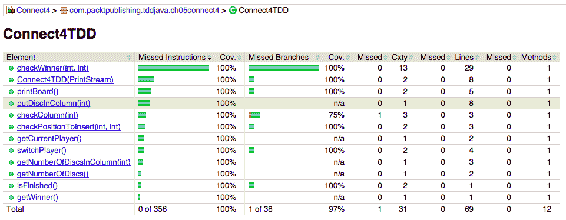

# 设计——如果它不可测试，那么它就设计得不好

“简单是最复杂的。”

——达芬奇

过去，软件行业专注于高速开发软件，只考虑成本和时间。质量是次要目标，错误地认为顾客对它不感兴趣。

如今，随着各种平台和设备的连接性不断增强，质量已成为客户要求中的头等公民。好的应用程序提供具有合理响应时间的好服务，而不受来自多个用户的大量并发请求的影响。

就质量而言，好的应用程序是那些经过良好设计的应用程序。一个好的设计意味着可伸缩性、安全性、可维护性和许多其他期望的属性。

在本章中，我们将探讨 TDD 如何通过使用传统方法和 TDD 方法实现相同的应用程序，从而引导开发人员获得良好的设计和最佳实践。

本章将介绍以下主题：

*   我们为什么要关心设计？
*   设计考虑和原则
*   传统的开发过程
*   基于 Hamcrest 的 TDD 方法

# 我们为什么要关心设计？

在软件开发中，无论您是专家还是初学者，在某些情况下，代码似乎不自然。在阅读代码时，您无法避免代码有问题的感觉。有时，您甚至想知道为什么以前的程序员以这种扭曲的方式实现了特定的方法或类。这是因为相同的功能可以以多种不同的方式实现，每种方式都是独特的。有这么多的可能性，哪一个是最好的？什么定义了一个好的解决方案？为什么一个比其他的好？事实是，只要目标实现，所有这些都是有效的。然而，在选择正确的解决方案时，确实应该考虑一些方面。这就是解决方案设计的重要性所在。

# 设计原则

**软件设计原则**是一条或一组规则，可作为软件开发人员的指南，并将他们推向智能和可维护的解决方案。换句话说，设计原则是代码必须满足的条件，才能被客观地认为设计良好。

大多数资深开发人员和经验丰富的程序员都知道软件设计原则，而且很可能，不管他们是否实践 TDD，TDD 理念鼓励程序员甚至初学者遵循一些原则和良好实践，使代码更干净、更具可读性。这些实践是由红-绿重构周期实施的。

红绿重构周期通过引入一次失败的测试来支持小的特性增量。程序员添加尽可能简洁的代码片段，这样新测试和旧测试都不会再失败。最后，他们重构代码，这包括清理和改进任务，如重复消除或代码优化。

该过程的结果是，代码变得更容易理解，将来修改更安全。让我们来看看一些最流行的软件设计原则。

# 你不会需要它的

**YAGNI**是“**您不需要它**”原则的首字母缩写。它旨在删除所有不必要的代码，并将重点放在当前的功能上，而不是未来的功能上。您拥有的代码越少，维护的代码就越少，引入 bug 的可能性就越低。

有关 YAGNI 的更多信息，请访问 [Martin Fowler 的文章](http://martinfowler.com/bliki/Yagni.html)。

# 不要重复你自己

**不要重复自己**（**DRY**）原则背后的想法是重用您以前编写的代码，而不是重复它。好处是需要维护的代码更少，并且可以使用您知道已经可以使用的代码，这是一件好事。它帮助您在代码中发现新的抽象级别。

有关更多信息，请访问[这里](http://en.wikipedia.org/wiki/Don%27t_repeat_yourself)。

# 保持简单和直接

这一原则的首字母缩写为**保持简单、愚蠢**（**KISS**），令人困惑，并指出，如果事物保持简单而不是复杂，它们的功能会更好。它是由凯利·约翰逊创造的。

要了解这一原则背后的故事，请访问[这里](http://en.wikipedia.org/wiki/KISS_principle)。

# 奥卡姆剃刀

尽管**奥卡姆剃刀**是一个哲学原理，而不是软件工程原理，但它仍然适用于我们所做的事情。这与前面的原则非常相似，主要陈述如下：

“当同一问题有两个相互竞争的解决方案时，越简单越好。”

-奥卡姆的威廉

有关奥卡姆剃须刀的更多信息，请访问[这里](http://en.wikipedia.org/wiki/Occam%27s_razor)。

# 坚实的原则

单词**SOLID**是 Robert C.Martin 为面向对象编程的五个基本原则而发明的首字母缩略词。通过遵循这五条原则，开发人员更有可能创建一个出色、持久且可维护的应用程序：

*   **单一责任原则**：一个类应该只有一个改变的理由。
*   **开闭原则**：一个类应该对扩展开放，对修改关闭。这归功于伯特兰·迈耶。
*   **里氏替换原则**：这是 Barbara Liskov 创建的，她说“一个类应该被扩展该类的其他类所替换”。
*   **接口隔离原则**：几个特定接口比一个通用接口更可取。
*   **依赖倒置原则**：类应该依赖抽象而不是实现。这意味着类依赖关系必须专注于完成了什么，而忽略了如何完成。

有关 SOLID 或其他相关原则的更多信息，请访问[这里](http://butunclebob.com/ArticleS.UncleBob.PrinciplesOfOod)。

前四条原则是 TDD 思想核心的一部分，因为它们旨在简化我们编写的代码。最后一个重点是应用程序组装过程中的类构造和依赖关系。

所有这些原则在测试和非测试驱动的开发中都是适用和可取的，因为除了其他好处外，它们使我们的代码更易于维护。它们的正确实际应用本身就值得一整本书。虽然我们没有时间深入研究，但我们鼓励您进一步调查。

在本章中，我们将看到 TDD 如何引导开发人员毫不费力地将其中一些原则付诸实践。我们将使用 TDD 和非 TDD 方法实现著名游戏 Connect 4 的一个小但功能齐全的版本。请注意，省略了重复部分，如 Gradle 项目创建等，因为它们与本章目的无关。

# 连接 4

Connect 4 是一款流行的、非常容易玩的棋盘游戏。规则是有限和简单的。

Connect 4 是一种两人连接游戏，玩家首先选择一种颜色，然后轮流将彩色圆盘从顶部放入七列六行垂直悬挂的网格中。 碎片直接落下，占据列内的下一个可用空间。 游戏的目标是在您的对手连接四个相同颜色的圆盘之前，将您自己的四个相同颜色的圆盘垂直、水平或对角地相互连接起来。

有关游戏的更多信息，请访问[维基百科](http://en.wikipedia.org/wiki/Connect_Four)。

# 要求

为了对 Connect 4 的两个实现进行编码，游戏规则以需求的形式转录如下。这些要求是这两项发展的起点。我们将对代码进行一些解释，并在最后比较两种实现：

1.  棋盘由七列六行组成；所有位置都是空的。
2.  播放机在栏目顶部介绍光盘。如果列为空，则引入的光盘将从板上掉落。同一列中介绍的未来光盘将与以前的光盘叠加。
3.  这是一个双人游戏，所以每个玩家有一种颜色。一个玩家使用红色（`R`），另一个玩家使用绿色（`G`）。播放机交替轮换，每次插入一张光盘。
4.  当游戏中发生事件或错误时，我们需要反馈。输出显示每次移动后板的状态。
5.  当无法插入更多光盘时，游戏结束，并被视为平局。
6.  如果一名玩家插入一张光盘，并在一条垂直直线上连接三张以上与其颜色相同的光盘，则该玩家获胜。
7.  在水平线方向也会发生同样的情况。
8.  在对角线方向上也会发生同样的情况。

# 测试 Connect 4 的最后一个实现

这是传统的方法，专注于解决问题的代码而不是测试。一些人和公司忘记了自动化测试的价值，在所谓的**用户验收测试**中依赖用户。

这种用户验收测试包括在受控环境中重新创建真实场景，理想情况下与生产环境相同。一些用户执行许多不同的任务来验证应用程序的正确性。如果这些操作中的任何一个失败，那么代码将不被接受，因为它破坏了某些功能或者没有按预期工作。

此外，许多这样的公司也使用单元测试作为执行早期回归检查的一种方法。这些单元测试是在开发过程之后创建的，它们试图覆盖尽可能多的代码。最后，执行代码覆盖率分析，以跟踪那些单元测试实际覆盖的内容。这些公司遵循一条经验法则：代码覆盖率越大，交付的质量越好。

这种方法的主要问题是，事后编写测试只会证明代码的行为与编程的方式相同，而不一定是代码预期的行为方式。此外，关注代码覆盖率会导致糟糕的测试，将生产代码变成不可变的实体。我们想要添加的每一个修改都可能导致来自代码不同、不相关部分的多个测试失败。这一事实意味着引入更改的成本变得非常高，执行任何轻微的修改都可能成为一场噩梦，而且成本非常昂贵。

为了演示前面描述的一些要点，让我们使用 TDD 而不是 TDD 方法实现 Connect 4 游戏。随着我们的进一步工作，将给出每个已识别需求的相关代码。此代码不是增量编写的，因此某些代码段可能包含一些与所述需求无关的代码行

# 要求 1–游戏的棋盘

让我们从第一个要求开始。

棋盘由七个横空位和六个纵空位组成。

这个需求的实现非常简单。我们只需要一个空位置的表示和数据结构来保存游戏。请注意，玩家使用的颜色也有定义：

```java
public class Connect4 {
  public enum Color {
    RED('R'), GREEN('G'), EMPTY(' ');

    private final char value;

    Color(char value) { this.value = value; }

    @Override
    public String toString() {
      return String.valueOf(value);
    }
  }

  public static final int COLUMNS = 7;

  public static final int ROWS = 6;

  private Color[][] board = new Color[COLUMNS][ROWS];

  public Connect4() {
    for (Color[] column : board) {
      Arrays.fill(column, Color.EMPTY);
    }
  }
}
```

# 要求 2–介绍光盘

这个要求介绍了游戏的部分逻辑。

玩家在列的顶部介绍光盘。 如果列是空的，则引入的圆盘会从板子上掉下来。 在同一列中引入的未来光盘将叠加在以前的光盘上。

在这一部分中，董事会界限变得相关。我们需要标记已经采取的立场，使用`Color.RED`来表示这些立场。最后，创建了第一个`private`方法。这是一种辅助方法，用于计算给定列中引入的光盘数量：

```java
public void putDisc(int column) {
  if (column > 0 && column <= COLUMNS) {
    int numOfDiscs = getNumberOfDiscsInColumn(column - 1);
    if (numOfDiscs < ROWS) {
      board[column - 1][numOfDiscs] = Color.RED;
    }
  }
}

private int getNumberOfDiscsInColumn(int column) {
  if (column >= 0 && column < COLUMNS) {
    int row;
    for (row = 0; row < ROWS; row++) {
      if (Color.EMPTY == board[column][row]) {
        return row;
      }
    }
    return row;
  }
  return -1;
}
```

# 要求 3–球员轮换

在这个需求中引入了更多的游戏逻辑。

这是一个双人游戏，所以每个玩家有一种颜色。一个玩家使用红色（`R`），另一个玩家使用绿色（`G`）。播放机交替轮换，每次插入一张光盘。

我们需要保存当前玩家以确定本回合的玩家。我们还需要一个功能来切换玩家，以重新创建回合逻辑。一些代码行与`putDisc`函数相关。具体来说，棋盘位置分配是使用当前玩家进行的，并且在每次移动后都会进行切换，正如游戏规则所说：

```java
...
private Color currentPlayer = Color.RED;

private void switchPlayer() {
  if (Color.RED == currentPlayer) {
    currentPlayer = Color.GREEN;
  } else {
    currentPlayer = Color.RED;
  }
}

public void putDisc(int column) {
  if (column > 0 && column <= COLUMNS) {
    int numOfDiscs = getNumberOfDiscsInColumn(column - 1);
    if (numOfDiscs < ROWS) {
      board[column - 1][numOfDiscs] = currentPlayer;
      switchPlayer();
    }
  }
}
...
```

# 要求 4–游戏的输出

应该添加一些输出，让玩家知道游戏的当前状态。

当游戏中发生事件或错误时，我们需要反馈。输出显示每次移动后板的状态。

未指定输出通道。为了简化，我们决定使用系统标准输出在事件发生时打印事件。在每个动作上都添加了几行，让用户了解游戏的状态：

```java
... 
private static final String DELIMITER = "|";

private void switchPlayer() {
  if (Color.RED == currentPlayer) {
    currentPlayer = Color.GREEN;
  } else {
    currentPlayer = Color.RED;
  }
  System.out.println("Current turn: " + currentPlayer);
}

public void printBoard() {
  for (int row = ROWS - 1; row >= 0; --row) {
    StringJoiner stringJoiner =
      new StringJoiner(DELIMITER, DELIMITER, DELIMITER);
    for (int col = 0; col < COLUMNS; ++col) {
      stringJoiner.add(board[col][row].toString());
    }
    System.out.println(stringJoiner.toString());
  }
}

public void putDisc(int column) {
  if (column > 0 && column <= COLUMNS) {
    int numOfDiscs = getNumberOfDiscsInColumn(column - 1); 
    if (numOfDiscs < ROWS) { 
      board[column - 1][numOfDiscs] = currentPlayer; 
      printBoard();
      switchPlayer();
    } else {
      System.out.println(numOfDiscs); 
      System.out.println("There's no room " + 
        "for a new disc in this column"); 
      printBoard(); 
    } 
  } else { 
    System.out.println("Column out of bounds"); 
    printBoard(); 
  } 
}
... 
```

# 要求 5–获胜条件（I）

第一场比赛已经结束。

当没有更多的光盘可以插入，游戏结束，它被认为是一个平局。

以下代码显示了一种可能的实现：

```java
...
public boolean isFinished() {
  int numOfDiscs = 0;
  for (int col = 0; col < COLUMNS; ++col) {
    numOfDiscs += getNumberOfDiscsInColumn(col);
  }
  if (numOfDiscs >= COLUMNS * ROWS) {
    System.out.println("It's a draw");
    return true;
  }
  return false;
}
...
```

# 要求 6–获胜条件（二）

第一个胜利的条件。

如果一名玩家插入一张光盘，并在一条垂直直线上连接三张以上与其颜色相同的光盘，则该玩家获胜。

`checkWinCondition`private 方法通过扫描最后一步是否成功来实现此规则：

```java
... 
private Color winner;

public static final int DISCS_FOR_WIN = 4;

public void putDisc(int column) {
  ...
  if (numOfDiscs < ROWS) {
    board[column - 1][numOfDiscs] = currentPlayer;
    printBoard();
    checkWinCondition(column - 1, numOfDiscs);
    switchPlayer();
    ...
}

private void checkWinCondition(int col, int row) {
  Pattern winPattern = Pattern.compile(".*" +
    currentPlayer + "{" + DISCS_FOR_WIN + "}.*");

  // Vertical check
  StringJoiner stringJoiner = new StringJoiner("");
  for (int auxRow = 0; auxRow < ROWS; ++auxRow) {
    stringJoiner.add(board[col][auxRow].toString());
  }
  if (winPattern.matcher(stringJoiner.toString()).matches()) {
    winner = currentPlayer;
    System.out.println(currentPlayer + " wins");
  }
}

public boolean isFinished() {
  if (winner != null) return true;
  ...
}
...
```

# 要求 7–获胜条件（III）

这是相同的胜利条件，但方向不同。

如果一名玩家插入一张光盘，并在一条直线上连接三张以上与其颜色相同的光盘，则该玩家获胜。

实现此规则的几行代码如下所示：

```java
...
private void checkWinCondition(int col, int row) {
  ...
  // Horizontal check
  stringJoiner = new StringJoiner("");
  for (int column = 0; column < COLUMNS; ++column) {
    stringJoiner.add(board[column][row].toString());
  }
  if (winPattern.matcher(stringJoiner.toString()).matches()) { 
    winner = currentPlayer;
    System.out.println(currentPlayer + " wins");
    return;
  }
  ...
}
...
```

# 要求 8–获胜条件（四）

最后的要求是最后的胜利条件。它与前两个非常相似；在这种情况下，沿对角线方向。

如果一名玩家插入一张光盘，并在一条直线对角线上连接三张以上与其颜色相同的光盘，则该玩家获胜。

这是最后一个需求的可能实现。该代码与其他 win 条件非常相似，因为必须满足相同的语句：

```java
...
private void checkWinCondition(int col, int row) {
  ...
  // Diagonal checks
  int startOffset = Math.min(col, row);
  int column = col - startOffset, auxRow = row - startOffset; 
  stringJoiner = new StringJoiner("");
  do {
    stringJoiner.add(board[column++][auxRow++].toString());
  } while (column < COLUMNS && auxRow < ROWS);

  if (winPattern.matcher(stringJoiner.toString()).matches()) {
    winner = currentPlayer;
    System.out.println(currentPlayer + " wins");
    return;
  }

  startOffset = Math.min(col, ROWS - 1 - row);
  column = col - startOffset;
  auxRow = row + startOffset;
  stringJoiner = new StringJoiner("");
  do {
    stringJoiner.add(board[column++][auxRow--].toString());
  } while (column < COLUMNS && auxRow >= 0);

  if (winPattern.matcher(stringJoiner.toString()).matches()) {
    winner = currentPlayer;
    System.out.println(currentPlayer + " wins");
  }
}
...
```

我们得到的是一个包含一个构造函数、三个公共方法和三个私有方法的类。应用程序的逻辑分布在所有方法中。这里最大的缺陷是这个类很难维护。关键的方法，如`checkWinCondition`是非常重要的，在将来的修改中可能会出现错误条目。

如果您想查看完整代码，可以在[存储库](https://bitbucket.org/vfarcic/tdd-java-ch05-design.git)中找到。

我们制作了这个小示例来演示这种方法的常见问题。像 SOLID principle 这样的主题需要一个更大的项目才能更具说明性。

在有数百门课的大型项目中，这些问题会被浪费在一种外科手术上。开发人员花费大量时间研究棘手的代码并了解其工作原理，而不是创建新功能。

# TDD 或测试优先实现

现在，我们知道了 TDD 是如何在测试之前编写测试，测试之后实现，以及以后重构的。我们将贯穿整个过程，只显示每个需求的最终结果。由您自己来确定迭代的红-绿重构过程。如果可能的话，让我们在测试中使用 Hamcrest 框架，让这变得更有趣。

# 汉克雷斯特

如第 2 章、“工具、框架和环境”所述，Hamcrest 提高了我们测试的可读性。通过使用**匹配器**降低复杂性，使断言更具语义性和全面性。当测试失败时，通过解释断言中使用的匹配器，显示的错误变得更具表现力。开发人员还可以添加一条消息。

`Hamcrest`库中充满了针对不同对象类型和集合的不同匹配器。让我们开始编码并体验一下。

# 要求 1–游戏的棋盘

我们将从第一个要求开始。

该板由七个水平和六个垂直空位组成。

这个要求没有什么大的挑战。指定了板边界，但其中没有描述的行为；只是在游戏开始时考虑一个空棋盘。这意味着游戏开始时零碟。然而，这一要求必须在以后加以考虑。

这就是测试类寻找此需求的方式。有一种方法可以初始化`tested`类，以便在每次测试中使用一个全新的对象。还有第一个测试是验证游戏开始时没有光盘，这意味着所有棋盘位置都是空的：

```java
public class Connect4TDDSpec {
  private Connect4TDD tested;

  @Before
  public void beforeEachTest() {
    tested = new Connect4TDD();
  }
  @Test
  public void whenTheGameIsStartedTheBoardIsEmpty() {
    assertThat(tested.getNumberOfDiscs(), is(0));
  }
}
```

这是先前规范的 TDD 实现。对于第一个需求，请注意给定解决方案的简单性；在单行中返回结果的简单方法：

```java
public class Connect4TDD {
  public int getNumberOfDiscs() {
    return 0;
  }
}
```

# 要求 2–介绍光盘

这是第二个需求的实现。

播放机在栏目顶部介绍光盘。如果列为空，则引入的光盘会从板上掉落。同一列中介绍的未来光盘将与以前的光盘叠加。

我们可以将此要求分为以下测试：

*   将光盘插入空列时，其位置为`0`
*   当第二张光盘插入同一列时，其位置为`1`
*   将光盘插入电路板时，光盘总数将增加
*   当一个碟片放在边界外时，抛出一个`Runtime Exception`
*   当一张光盘插入到一个列中并且没有空间容纳它时，就会抛出一个`Runtime Exception`

此外，这些其他测试源自第一个需求。它们与董事会限制或董事会行为有关。

上述测试的 Java 实现如下所示：

```java
@Test 
public void whenDiscOutsideBoardThenRuntimeException() {
  int column = -1;
  exception.expect(RuntimeException.class);
  exception.expectMessage("Invalid column " + column);
  tested.putDiscInColumn(column);
}

@Test
public void whenFirstDiscInsertedInColumnThenPositionIsZero() {
  int column = 1;
  assertThat(tested.putDiscInColumn(column),  is(0));
}

@Test
public void whenSecondDiscInsertedInColumnThenPositionIsOne() {
  int column = 1;
  tested.putDiscInColumn(column);
  assertThat(tested.putDiscInColumn(column), is(1));
}

@Test
public void whenDiscInsertedThenNumberOfDiscsIncreases() {
  int column = 1;
  tested.putDiscInColumn(column);
  assertThat(tested.getNumberOfDiscs(), is(1));
}

@Test 
public void whenNoMoreRoomInColumnThenRuntimeException() {
  int column = 1;
  int maxDiscsInColumn = 6; // the number of rows
  for (int times = 0; times < maxDiscsInColumn; ++times) {
    tested.putDiscInColumn(column);
  }
  exception.expect(RuntimeException.class);
  exception.expectMessage("No more room in column " + column);
  tested.putDiscInColumn(column);
}
```

这是满足测试的必要代码：

```java
private static final int ROWS = 6;

private static final int COLUMNS = 7;

private static final String EMPTY = " ";

private String[][] board = new String[ROWS][COLUMNS];

public Connect4TDD() {
  for (String[] row : board) Arrays.fill(row, EMPTY);
}

public int getNumberOfDiscs() {
  return IntStream
           .range(0, COLUMNS)
           .map(this::getNumberOfDiscsInColumn)
           .sum(); 
} 

private int getNumberOfDiscsInColumn(int column) {
  return (int) IntStream
                 .range(0, ROWS)
                 .filter(row -> !EMPTY.equals(board[row][column]))
                 .count();
}

public int putDiscInColumn(int column) {
  checkColumn(column);
  int row = getNumberOfDiscsInColumn(column);
  checkPositionToInsert(row, column);
  board[row][column] = "X";
  return row;
}

private void checkColumn(int column) {
  if (column < 0 || column >= COLUMNS)
    throw new RuntimeException("Invalid column " + column);
}

private void checkPositionToInsert(int row, int column) {
  if (row == ROWS)
    throw new RuntimeException("No more room in column " + column); 
} 
```

# 要求 3–球员轮换

第三个要求涉及博弈逻辑。

这是一个双人游戏，所以每个玩家有一种颜色。一个玩家使用红色（`R`），另一个玩家使用绿色（`G`）。播放机交替轮换，每次插入一张光盘。

这些测试包括新功能的验证。为了简单起见，红色玩家将始终启动游戏：

```java
@Test
public void whenFirstPlayerPlaysThenDiscColorIsRed() {
  assertThat(tested.getCurrentPlayer(), is("R"));
}

@Test
public void whenSecondPlayerPlaysThenDiscColorIsRed() {
  int column = 1;
  tested.putDiscInColumn(column);
  assertThat(tested.getCurrentPlayer(), is("G"));
}
```

需要创建几个方法来覆盖此功能。在`putDiscInColumn`方法返回行之前调用`switchPlayer`方法：

```java
private static final String RED = "R";

private static final String GREEN = "G";

private String currentPlayer = RED;

public Connect4TDD() {
  for (String[] row : board) Arrays.fill(row, EMPTY);
}

public String getCurrentPlayer() {
  return currentPlayer;
}

private void switchPlayer() {
  if (RED.equals(currentPlayer)) currentPlayer = GREEN;
  else currentPlayer = RED;
}

public int putDiscInColumn(int column) {
  ...
  switchPlayer();
  return row;
}
```

# 要求 4–游戏的输出

接下来，我们应该让玩家知道游戏的状态。

当游戏中发生事件或错误时，我们需要反馈。输出显示板在每次移动时的状态。

由于我们在错误发生时抛出异常，这已经包括在内，所以我们只需要实现这两个测试。此外，为了可测试性，我们需要在构造函数中引入一个参数。通过引入此参数，输出变得更易于测试：

```java
private OutputStream output;

@Before
public void beforeEachTest() {
  output = new ByteArrayOutputStream(); 
  tested = new Connect4TDD(new PrintStream(output)); 
}

@Test
public void whenAskedForCurrentPlayerTheOutputNotice() {
  tested.getCurrentPlayer();
  assertThat(output.toString(), containsString("Player R turn")); 
}

@Test
public void whenADiscIsIntroducedTheBoardIsPrinted() {
  int column = 1;
  tested.putDiscInColumn(column);
  assertThat(output.toString(), containsString("| |R| | | | | |"));
}
```

一个可能的实现是通过前面的测试。如您所见，类构造函数现在有一个参数。此参数在多种方法中用于打印事件或操作描述：

```java
private static final String DELIMITER = "|";

public Connect4TDD(PrintStream out) {
  outputChannel = out;
  for (String[] row : board) Arrays.fill(row, EMPTY); 
}

public String getCurrentPlayer() {
  outputChannel.printf("Player %s turn%n", currentPlayer);
  return currentPlayer;
}

private void printBoard() {
  for (int row = ROWS - 1; row >= 0; row--) {
    StringJoiner stringJoiner = new StringJoiner(DELIMITER, DELIMITER, DELIMITER); 
    Stream.of(board[row]).forEachOrdered(stringJoiner::add); 
    outputChannel.println(stringJoiner.toString()); 
  }
}

public int putDiscInColumn(int column) {
  ... 
  printBoard();
  switchPlayer();
  return row;
} 
```

# 要求 5–获胜条件（I）

这个要求告诉系统游戏是否结束。

当没有更多的光盘可以插入，游戏结束，它被认为是一个平局。

有两个条件需要测试。第一个条件是新游戏必须是未完成的；第二个条件是必须完成完整的棋盘游戏：

```java
@Test
public void whenTheGameStartsItIsNotFinished() {
  assertFalse("The game must not be finished", tested.isFinished()); 
} 

@Test 
public void whenNoDiscCanBeIntroducedTheGamesIsFinished() { 
  for (int row = 0; row < 6; row++)
    for (int column = 0; column < 7; column++)
      tested.putDiscInColumn(column);
    assertTrue("The game must be finished", tested.isFinished()); 
}
```

这两个测试的简单解决方案如下：

```java
public boolean isFinished() {
  return getNumberOfDiscs() == ROWS * COLUMNS;
}
```

# 要求 6–获胜条件（二）

这是对球员的第一个获胜条件要求。

如果一名玩家插入一张光盘，并在一条垂直直线上连接三张以上与其颜色相同的光盘，则该玩家获胜。

事实上，这需要一次检查。如果当前插入的光盘垂直连接其他三张光盘，则当前玩家将赢得游戏：

```java
@Test
public void when4VerticalDiscsAreConnectedThenPlayerWins() {
  for (int row = 0; row < 3; row++) {
    tested.putDiscInColumn(1); // R
    tested.putDiscInColumn(2); // G
  }
  assertThat(tested.getWinner(), isEmptyString());
  tested.putDiscInColumn(1); // R
  assertThat(tested.getWinner(), is("R"));
}
```

`putDiscInColumn`方法有几个变化。此外，还创建了一个名为`checkWinner`的新方法：

```java
private static final int DISCS_TO_WIN = 4;

private String winner = "";

private void checkWinner(int row, int column) {
  if (winner.isEmpty()) {
    String colour = board[row][column];
    Pattern winPattern =
      Pattern.compile(".*" + colour + "{" +
           DISCS_TO_WIN + "}.*");

    String vertical = IntStream
                       .range(0, ROWS)
                       .mapToObj(r -> board[r][column])
                       .reduce(String::concat).get();
    if (winPattern.matcher(vertical).matches()) 
      winner = colour;
  }
}
```

# 要求 7–获胜条件（III）

这是第二个获胜条件，与前一个非常相似。

如果一名玩家插入一张光盘，并在一条直线上连接三张以上与其颜色相同的光盘，则该玩家获胜。

这一次，我们试图通过将光盘插入相邻列来赢得游戏：

```java
@Test
public void when4HorizontalDiscsAreConnectedThenPlayerWins() {
  int column;
  for (column = 0; column < 3; column++) {
    tested.putDiscInColumn(column); // R
    tested.putDiscInColumn(column); // G
  }
  assertThat(tested.getWinner(), isEmptyString());
  tested.putDiscInColumn(column); // R
  assertThat(tested.getWinner(), is("R"));
}
```

通过此测试的代码被放入`checkWinners`方法中：

```java
  if (winner.isEmpty()) { 
    String horizontal = Stream
                         .of(board[row])
                         .reduce(String::concat).get();
    if (winPattern.matcher(horizontal).matches())
      winner = colour; 
  }
```

# 要求 8–获胜条件（四）

最后的要求是最后的胜利条件。

如果一名玩家插入一张光盘，并在一条直线对角线上连接三张以上与其颜色相同的光盘，则该玩家获胜。

我们需要执行有效的游戏动作来达到这个条件。在这种情况下，我们需要全面测试两条对角线：从右上到左下，从右下到左上。以下测试使用列列表重新创建完整游戏，以再现测试中的场景：

```java
@Test
public void when4Diagonal1DiscsAreConnectedThenThatPlayerWins() {
  int[] gameplay = new int[] {1, 2, 2, 3, 4, 3, 3, 4, 4, 5, 4};
  for (int column : gameplay) {
    tested.putDiscInColumn(column);
  }
  assertThat(tested.getWinner(), is("R"));
}

@Test
public void when4Diagonal2DiscsAreConnectedThenThatPlayerWins() { 
  int[] gameplay = new int[] {3, 4, 2, 3, 2, 2, 1, 1, 1, 1};
  for (int column : gameplay) {
    tested.putDiscInColumn(column);
  }
  assertThat(tested.getWinner(), is("G"));
}
```

再次，需要修改`checkWinner`方法，添加新的板验证：

```java
    if (winner.isEmpty()) { 
      int startOffset = Math.min(column, row); 
      int myColumn = column - startOffset, 
        myRow = row - startOffset; 
      StringJoiner stringJoiner = new StringJoiner(""); 
      do { 
        stringJoiner .add(board[myRow++][myColumn++]); 
      } while (myColumn < COLUMNS && myRow < ROWS); 
      if (winPattern .matcher(stringJoiner.toString()).matches()) 
        winner = currentPlayer; 
    } 

    if (winner.isEmpty()) {
      int startOffset = Math.min(column, ROWS - 1 - row);
      int myColumn = column - startOffset,
        myRow = row + startOffset;
      StringJoiner stringJoiner = new StringJoiner("");
      do {
        stringJoiner.add(board[myRow--][myColumn++]);
      } while (myColumn < COLUMNS && myRow >= 0);
      if (winPattern.matcher(stringJoiner.toString()).matches())
        winner = currentPlayer; 
    } 
```

# 最后考虑

使用 TDD，我们得到了一个具有构造函数、五个公共方法和六个私有方法的类。总的来说，所有的方法看起来都非常简单易懂。在这种方法中，我们还得到了一个检查赢家条件的大方法：`checkWinner`。这种方法的优点是，我们得到了一系列有用的测试，以确保将来的修改不会意外地改变方法的行为，从而可以毫无痛苦地引入新的更改。代码覆盖率不是我们的目标，但是我们得到了很高的百分比。

此外，出于测试目的，我们重构了类的构造函数，以接受输出通道作为参数（**依赖注入**）。如果我们需要修改游戏状态的打印方式，那么这种方式将比替换传统方法中的所有用途更容易。因此，它更具可扩展性。在最后一种测试方法中，我们一直在滥用`System.println`方法，如果我们决定更改所有发生的事件，这将是一项非常乏味的任务。

在大型项目中，当您检测到必须为单个类创建大量测试时，这使您能够按照单一责任原则拆分类。由于输出打印被委托给初始化时传入参数的外部类，因此更优雅的解决方案是使用高级打印方法创建一个类。这将使打印逻辑与游戏逻辑分离。与下图所示的巨大代码覆盖率一样，以下是使用 TDD 进行良好设计的几个示例：



此方法的代码可在[这里](https://bitbucket.org/vfarcic/tdd-java-ch05-design.git)找到。

# 总结

在本章中，我们简要介绍了软件设计和一些基本的设计原则。我们使用传统和 TDD 两种方法实现了棋盘游戏 Connect 4 的全功能版本。

我们从正反两方面分析了这两种解决方案，并使用 Hamcrest 框架来支持我们的测试。

最后，我们得出结论，好的设计和好的实践可以通过这两种方法来实现，但 TDD 是一种更好的方法。

有关本章所涵盖主题的更多信息，请参阅 Robert C.Martin 撰写的两本极力推荐的书籍：《干净的代码：敏捷软件工艺手册》和《敏捷软件开发：原则、模式和实践》。