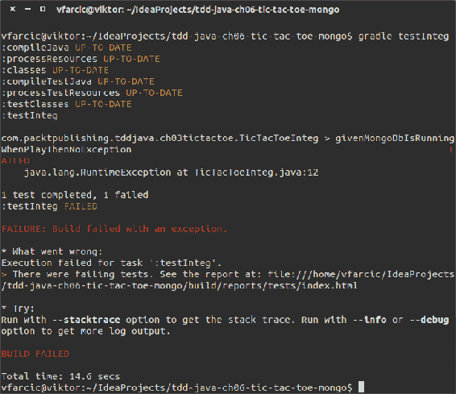
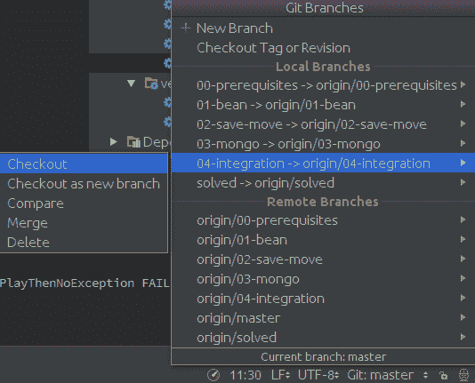
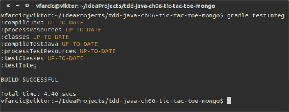

# Mocking–删除外部依赖项

“说话很便宜。给我看看密码。”

-莱纳斯·托瓦尔兹

TDD 是关于速度的。我们希望快速演示一个想法、概念或实现是否有效。此外，我们希望快速运行所有测试。这种速度的一个主要瓶颈是外部依赖性。设置测试所需的 DB 数据可能非常耗时。验证使用第三方 API 的代码的测试的执行可能会很慢。最重要的是，编写满足所有外部依赖性的测试可能会变得太复杂而不值得。模拟外部依赖和内部依赖可以帮助我们解决这些问题。

我们将在第 3 章“红绿重构——从失败到成功再到完美”中所做的基础上，我们将扩展 Tic Tac Toe 以使用 MongoDB 作为数据存储。我们的单元测试都不会真正使用 MongoDB，因为所有的通信都将被模拟。最后，我们将创建一个集成测试，以验证我们的代码和 MongoDB 确实是集成的。

本章将介绍以下主题：

*   嘲笑
*   Mockito
*   Tic Tac Toe v2 要求
*   开发 Tic-Tac-Toe v2
*   集成测试

# 嘲笑

每个完成过比`Hello World`更复杂的应用程序的人都知道 Java 代码充满了依赖性。可以有团队其他成员编写的类和方法、第三方库或与我们通信的外部系统。甚至在 JDK 中找到的库也是依赖项。我们可能有一个与数据访问层通信的业务层，数据访问层反过来使用数据库驱动程序获取数据。在处理单元测试时，我们更进一步地考虑依赖关系，并且经常将所有公共和受保护的方法（甚至是我们正在处理的类中的方法）视为应该隔离的依赖关系。

在单元测试级别上进行 TDD 时，创建考虑所有这些依赖关系的规范可能非常复杂，以至于测试本身将成为瓶颈。它们的开发时间可以大大增加，因此 TDD 带来的好处很快就被不断增加的成本所掩盖。更重要的是，这些依赖关系往往会创建复杂的测试，它们包含比实现本身更多的 bug。

单元测试（特别是与 TDD 相关联时）的思想是编写规范，验证单个单元的代码是否工作，而不考虑依赖性。当依赖关系是内部的时，它们已经过测试，我们知道它们做了我们期望它们做的事情。另一方面，外部依赖需要信任。我们必须相信它们是正确的。即使我们不这样做，对 JDK`java.nio`类进行深度测试的任务对我们大多数人来说都太大了。此外，当我们运行功能测试和集成测试时，这些潜在的问题将浮出水面。

在关注单元的同时，我们必须尝试删除单元可能使用的所有依赖项。这些依赖项的删除是通过设计和模拟的组合来完成的。

使用模拟的好处包括减少代码依赖性和更快的文本执行。

模拟是快速执行测试和专注于单个功能单元的能力的先决条件。 通过模拟正在测试的方法外部的依赖关系，开发人员能够专注于手头的任务，而无需花时间设置它们。 在更大或多个团队一起工作的情况下，甚至可能不会开发这些依赖项。 此外，没有模拟的测试的执行往往很慢。 模拟的良好候选对象是数据库、其他产品、服务等。

在我们深入研究嘲讽之前，让我们先来解释为什么人们会首先使用它们。

# 为什么嘲笑？

下面列出了我们使用模拟对象的一些原因：

*   对象生成不确定的结果。例如，`java.util.Date()`每次实例化时都会提供不同的结果。我们无法测试其结果是否符合预期：

```java
java.util.Date date = new java.util.Date(); 
date.getTime(); // What is the result this method returns?
```

*   该对象尚不存在。例如，我们可以创建一个接口并对其进行测试。在我们测试使用该接口的代码时，可能尚未编写实现该接口的对象。
*   对象速度慢，需要时间处理。最常见的例子是数据库。我们可能有一个检索所有记录并生成报告的代码。此操作可能持续数分钟、数小时，有时甚至数天。

支持模拟对象的上述原因适用于任何类型的测试。然而，在单元测试的情况下，尤其是在 TDD 的上下文中，还有一个原因，可能比其他原因更重要。模拟允许我们隔离当前正在使用的方法所使用的所有依赖项。这使我们能够专注于单个单元，而忽略该单元调用的代码的内部工作。

# 术语

**术语**可能有点混乱，特别是因为不同的人对同一事物使用不同的名称。为了使事情更加复杂，模拟框架在命名方法时往往不一致。

在我们继续之前，让我们先简要介绍一下术语。

**替身测试**是以下所有类型的通用名称：

*   虚拟对象的目的是充当实方法参数的替代品
*   测试桩可用于将真实对象替换为特定于测试的对象，该对象将所需的间接输入馈送到被测系统中
*   **测试间谍**捕获**被测系统**（**SUT**）对另一个组件的间接输出调用，供测试人员稍后验证
*   Mock 对象将 SUT 所依赖的对象替换为测试特定的对象，以验证 SUT 是否正确使用该对象
*   Fake 对象用更轻的实现替换 SUT 所依赖的组件

如果你感到困惑，它可能会帮助你知道你不是唯一的一个。事情甚至比这更复杂，因为框架或作者之间没有明确的协议，也没有命名标准。术语令人困惑且不一致，前面提到的术语并不是每个人都接受的。

为了简化，在本书中，我们将使用 Mockito（我们选择的框架）使用的相同名称。这样，您将使用的方法将与您将进一步阅读的术语相对应。我们将继续使用模拟作为其他人可能称之为**测试替身**的通用术语。此外，我们将使用模拟或间谍术语来指代`Mockito`方法。

# 模拟对象

模拟对象模拟真实（通常是复杂）对象的行为。它们允许我们创建一个对象来替换实现代码中使用的真实对象。模拟对象将期望具有已定义参数的已定义方法返回预期结果。它提前知道应该发生什么以及我们期望它如何反应。

让我们来看一个简单的例子：

```java
TicTacToeCollection collection = mock(TicTacToeCollection.class); 
assertThat(collection.drop()).isFalse();
doReturn(true).when(collection).drop(); 

assertThat(collection.drop()).isTrue();
```

首先，我们将`collection`定义为`TicTacToeCollection`的`mock`。此时，来自这个模拟对象的所有方法都是假的，在 Mockito 的情况下，返回默认值。这在第二行中得到确认，其中我们`assert`确认`drop`方法返回`false`。进一步，我们指定当调用`drop`方法时，我们的模拟对象集合应该返回`true`。最后，我们`assert`确认`drop`方法返回`true`。

我们创建了一个返回默认值的模拟对象，并为其方法之一定义了返回值。在任何时候都没有使用真实的物体。

稍后，我们将与这种逻辑颠倒的间谍合作；除非另有规定，否则对象使用实方法。当我们开始扩展 Tic-Tac-Toe 应用程序时，我们将看到并了解更多关于 mocking 的内容。现在，我们来看一个名为 Mockito 的 Java 模拟框架。

# Mockito

Mockito 是一个带有干净简单 API 的模拟框架。使用 Mockito 生成的测试可读、易于编写且直观。它包含三种主要的静态方法：

*   `mock()`：用于创建模拟。或者，我们可以使用`when()`和`given()`指定这些模拟的行为方式。
*   `spy()`：可用于部分模拟。间谍对象调用真实方法，除非我们另有规定。与`mock()`一样，可以为每个公共或受保护的方法设置行为（静态除外）。主要区别在于`mock()`创建了整个对象的伪对象，而`spy()`使用了真实对象。
*   `verify()`：用于检查是否使用给定参数调用了方法。它是断言的一种形式。

一旦我们开始编写 Tic-Tac-Toe v2 应用程序，我们将深入研究 Mockito。然而，首先，让我们快速浏览一组新的需求。

# Tic Tac Toe v2 要求

我们的 Tic Tac Toe v2 应用程序的要求很简单。我们应该添加一个持久存储，以便玩家可以在以后继续玩游戏。为此，我们将使用 MongoDB。

将 MongoDB 持久存储添加到应用程序中。

# 开发 Tic-Tac-Toe v2

我们将继续我们在第 3 章“红绿重构——从失败到成功，直到完美”中结束的内容。到目前为止开发的应用程序的完整源代码可在[这里](https://bitbucket.org/vfarcic/tdd-java-ch06-tic-tac-toe-mongo.git)找到。使用 IntelliJ IDEA 中的 VCS | Checkout from Version Control | Git 选项克隆代码。与任何其他项目一样，我们需要做的第一件事是将依赖项添加到`build.gradle`：

```java
dependencies { 
    compile 'org.jongo:jongo:1.1' 
    compile 'org.mongodb:mongo-java-driver:2.+' 
    testCompile 'junit:junit:4.12' 
    testCompile 'org.mockito:mockito-all:1.+' 
} 
```

导入 MongoDB 驱动程序应该是不言自明的。Jongo 是一组非常有用的实用方法，使 Java 代码的使用与 Mongo 查询语言更为相似。对于测试部分，我们将继续使用 JUnit，并添加 Mockito mock、spies 和验证。

您会注意到，直到最后我们才安装 MongoDB。有了 Mockito，我们就不需要它了，因为我们所有的 Mongo 依赖都会被嘲笑。

一旦指定了依赖项，记得在 IDEA Gradle Projects 对话框中刷新它们。

[源代码可以在`tdd-java-ch06-tic-tac-toe-mongo`Git 库的`00-prerequisites`分支中找到](https://bitbucket.org/vfarcic/tdd-java-ch06-tic-tac-toe-mongo/branch/00-prerequisites)。

现在我们已经设置了先决条件，让我们开始处理第一个需求。

# 要求 1–门店移动

我们应该能够将每个移动保存到数据库。因为我们已经实现了所有的游戏逻辑，所以这应该是很容易做到的。尽管如此，这将是模拟使用的一个非常好的例子。

执行一个选项以保存带有圈数、`x`和`y`轴位置以及播放器（`X`或`O`的单步移动。

我们应该从定义表示数据存储模式的 JavaBean 开始。它没有什么特别之处，所以我们将仅用一个注释跳过这一部分。

不要花太多时间为 Java 样板代码定义规范。我们的 Bean 实现包含覆盖的`equals`和`hashCode`。它们都是 IDEA 自动生成的，不提供实际值，只是为了满足比较两个相同类型对象的需要（我们稍后将在规范中使用这种比较）。TDD 应该帮助我们更好地设计和编写更好的代码。编写 15-20 个规范来定义可由 IDE 自动编写的样板代码（如`equals`方法的情况）无助于我们实现这些目标。掌握 TDD 不仅意味着学习如何编写规范，还意味着知道什么时候不值得。

也就是说，请参考源代码以查看 Bean 规范和实现的完整性。

源代码可以在`tdd-java-ch06-tic-tac-toe-mongo`Git 库的[`01-bean`分支中找到](https://bitbucket.org/vfarcic/tdd-java-ch06-tic-tac-toe-mongo/branch/01-bean)。具体类别为`TicTacToeBeanSpec`和`TicTacToeBean`。

现在，让我们进入一个更有趣的部分（但仍然没有模拟、间谍和验证）。让我们编写与将数据保存到 MongoDB 相关的规范。

对于这个需求，我们将在`com.packtpublishing.tddjava.ch03tictactoe.mongo`包中创建两个新类：

*   `TicTacToeCollectionSpec`（在`src/test/java`内）
*   `TicTacToeCollection`（在`src/main/java`内）

# 规范–数据库名称

我们应该指定要使用的数据库的名称：

```java
@Test 
public void whenInstantiatedThenMongoHasDbNameTicTacToe() { 
  TicTacToeCollection collection = new TicTacToeCollection(); 
  assertEquals(
     "tic-tac-toe",
     collection.getMongoCollection().getDBCollection().getDB().getName()); 
} 
```

我们正在实例化一个新的`TicTacToeCollection`类，并验证 DB 名称是否符合我们的预期。

# 实施

实现非常简单，如下所示：

```java
private MongoCollection mongoCollection; 
protected MongoCollection getMongoCollection() { 
  return mongoCollection; 
}
public TicTacToeCollection() throws UnknownHostException { 
  DB db = new MongoClient().getDB("tic-tac-toe"); 
  mongoCollection = new Jongo(db).getCollection("bla"); 
} 
```

在实例化`TicTacToeCollection`类时，我们使用指定的 DB 名称（`tic-tac-toe`创建一个新的`MongoCollection`并将其分配给局部变量。

请容忍我们。在我们进入有趣的部分之前，只剩下一个规范了，我们将使用 mock 和 spies。

# 规范–Mongo 集合的名称

在前面的实现中，我们使用`bla`作为集合的名称，因为`Jongo`强制我们放置一些字符串。让我们创建一个规范来定义我们将使用的 Mongo 集合的名称：

```java
@Test 
public void whenInstantiatedThenMongoCollectionHasNameGame() {
  TicTacToeCollection collection = new TicTacToeCollection(); 
  assertEquals( 
            "game", 
            collection.getMongoCollection().getName()); 
} 
```

此规范几乎与前一规范相同，并且可能是不言自明的。

# 实施

要实现此规范，我们只需更改用于设置集合名称的字符串：

```java
public TicTacToeCollection() throws UnknownHostException { 
  DB db = new MongoClient().getDB("tic-tac-toe"); 
  mongoCollection = new Jongo(db).getCollection("game"); 
} 
```

# 重构

您可能会有这样的印象，重构只为实现代码保留。然而，当我们看到重构背后的目标（更可读、优化和更快的代码）时，它们同样适用于规范和实现代码。

最后两个规范重复了`TicTacToeCollection`类的实例化。我们可以将其移动到一个带有`@Before`注释的方法。效果将是相同的（在运行每个带有`@Test`注释的方法之前将实例化该类），我们将删除重复的代码。由于在进一步的规范中需要相同的实例化，现在删除重复将在以后提供更多的好处。同时，我们将避免一次又一次地投掷`UnknownHostException`：

```java
TicTacToeCollection collection; 

@Before 
public void before() throws UnknownHostException { 
  collection = new TicTacToeCollection(); 
} 
@Test 
public void whenInstantiatedThenMongoHasDbNameTicTacToe() { 
//        throws UnknownHostException { 
//  TicTacToeCollection collection = new TicTacToeCollection(); 
  assertEquals(
    "tic-tac-toe", 
    collection.getMongoCollection().getDBCollection().getDB().getName()); 
} 

@Test 
public void whenInstantiatedThenMongoHasNameGame() { 
//        throws UnknownHostException { 
//  TicTacToeCollection collection = new TicTacToeCollection(); 
  assertEquals(
    "game",  
    collection.getMongoCollection().getName()); 
} 
```

使用设置和拆卸方法。 这些的好处允许在类或每个测试方法之前和之后执行准备或设置和处置或拆卸代码。

在很多情况下，一些代码需要在测试类或类中的每个方法之前执行。 为此，JUnit 具有应该在设置阶段使用的`@BeforeClass`和`@Before`注释。 `@BeforeClass`在加载类之前（在运行第一个测试方法之前）执行关联的方法。 `@Before` 在每个测试运行之前执行关联的方法。 当测试需要某些先决条件时，应同时使用两者。 最常见的例子是在（希望在内存中）数据库中设置测试数据。 另一端是`@After`和`@AfterClass`注释，它们应该用作拆卸阶段。 它们的主要目的是销毁在设置阶段或通过测试本身创建的数据或状态。 每个测试都应该独立于其他测试。 此外，任何测试都不应受到其他测试的影响。 拆卸阶段有助于维护系统，就好像之前没有执行过任何测试一样。

现在，让我们做一些模拟，间谍和验证！

# 规范–将项目添加到 Mongo 集合

我们应该创建一个将数据保存到 MongoDB 的方法。在研究 Jongo 文档之后，我们发现有一种`MongoCollection.save`方法，它正是这样做的。它接受任何对象作为方法参数，并将其（使用 Jackson）转换为 JSON，JSON 在 MongoDB 中本机使用。关键是在和 Jongo 玩过之后，我们决定使用这个库，更重要的是，信任这个库。

我们可以用两种方式编写 Mongo 规范。对于**端到端**（**E2E**）或集成测试，一个更传统、更合适的方法是：启动 MongoDB 实例，调用 Jongo 的 save 方法，查询数据库，并确认数据确实已保存。它并没有到此结束，因为我们需要在每次测试之前清理数据库，以始终保证相同的状态不会被以前测试的执行所污染。最后，一旦所有测试都完成执行，我们可能希望停止 MongoDB 实例并为其他一些任务释放服务器资源。

正如您可能已经猜到的，以这种方式编写的单个测试涉及大量的工作。此外，编写此类测试不仅需要投入工作。执行时间会增加很多。运行一个与数据库通信的测试不会花费很长时间。运行十个测试通常仍然很快。运行数百或数千次可能需要相当多的时间。当运行所有单元测试需要很多时间时会发生什么？人们失去耐心，开始将他们分成小组，或者一起放弃 TDD。将测试分成小组意味着我们对没有任何东西被破坏这一事实失去信心，因为我们只持续测试它的一部分。放弃 TDD。。。这不是我们想要达到的目标。然而，如果运行测试需要很多时间，那么期望开发人员不想等到运行完成后再转到下一个规范是合理的，而这正是我们停止执行 TDD 的时候。允许单元测试运行的合理时间是多少？没有一刀切的规则来定义这一点；然而，根据经验，如果时间超过 10-15 秒，我们应该开始担心，并花时间优化它们。

测试应该快速运行。 好处是经常使用这些测试。

如果运行测试需要大量时间，开发人员将停止使用它们或仅运行与他们所做更改相关的一小部分。 除了促进使用之外，快速测试的好处之一是快速反馈。 越早发现问题，就越容易解决。 关于产生问题的代码的知识仍然新鲜。 如果开发人员在等待测试执行完成时已经开始处理下一个功能，他们可能会决定推迟修复问题，直到开发新功能。 另一方面，如果他们放弃当前的工作来修复错误，时间就会浪费在上下文切换中。

如果使用 LiveDB 来运行单元测试不是一个好的选择，那么替代方案是什么？嘲笑和刺探！在我们的示例中，我们知道应该调用第三方库的哪个方法。我们还投入了足够的时间来信任这个库（除了稍后将执行的集成测试）。一旦我们知道如何使用该库，我们就可以将我们的工作限制为验证是否正确调用了该库。

让我们试一试。

首先，我们应该修改现有代码，并将`TicTacToeCollection`的实例化转换为`spy`：

```java
import static org.mockito.Mockito.*; 
... 
@Before 
public void before() throws UnknownHostException { 
  collection = spy(new TicTacToeCollection()); 
} 
```

监视一个类被称为**部分**模拟。应用时，该类的行为将与正常实例化时完全相同。主要区别在于，我们可以应用部分模拟，并用模拟替换一个或多个方法。一般来说，我们倾向于在我们正在学习的课程上使用间谍。我们希望保留我们正在为其编写规范的类的所有功能，但在需要时，可以使用一个附加选项来模拟其中的一部分。

现在让我们编写规范本身。它可以是：

```java
@Test
public void whenSaveMoveThenInvokeMongoCollectionSave() {
  TicTacToeBean bean = new TicTacToeBean(3, 2, 1, 'Y');
  MongoCollection mongoCollection = mock(MongoCollection.class);
  doReturn(mongoCollection).when(collection).getMongoCollection();

  collection.saveMove(bean);

  verify(mongoCollection, times(1)).save(bean);
}
```

静态方法，如`mock`、`doReturn`和`verify`都来自`org.mockito.Mockito`类。

首先，我们正在创建一个新的`TicTacToeBean`。那里没有什么特别的。接下来，我们将从`MongoCollection`中创建一个`mock`对象。由于我们已经确定，在单元级工作时，我们希望避免与 DB 直接通信，因此模拟这种依赖关系将为我们提供这一点。它将把一个真实的类转换成一个模拟类。对于使用`mongoCollection`的类，它将看起来像一个真实的类；然而，在幕后，它的所有方法都是肤浅的，实际上什么也做不了。这就像覆盖该类并用空方法替换所有方法一样：

```java
MongoCollection mongoCollection = mock(MongoCollection.class);
```

接下来，我们告诉大家，无论何时调用 collection spied 类的`getMongoCollection`方法，都应该返回一个模拟的`mongoCollection`。换句话说，我们告诉全班同学使用假藏品而不是真藏品：

```java
doReturn(mongoCollection).when(collection).getMongoCollection(); 
```

然后，我们调用正在处理的方法：

```java
collection.saveMove(bean); 
```

最后，我们应该验证`Jongo`库的正确调用执行一次：

```java
verify(mongoCollection, times(1)).save(bean);
```

让我们尝试实现这个规范。

# 实施

为了更好地理解我们刚刚编写的规范，让我们只做部分实现。我们将创建一个空方法`saveMove`。这将允许我们的代码在不实现规范的情况下进行编译：

```java
public void saveMove(TicTacToeBean bean) { 
} 
```

当我们运行我们的规范（`gradle test`时，结果如下：

```java
Wanted but not invoked: 
mongoCollection.save(Turn: 3; X: 2; Y: 1; Player: Y); 
```

Mockito 告诉我们，根据我们的规范，我们希望调用`mongoCollection.save`方法，但预期没有实现。由于测试仍然失败，我们需要返回并完成实现。TDD 最大的罪过之一是测试失败，转而做其他事情。

在编写新测试之前，所有测试都应该通过。 这样做的好处是将焦点保持在一个小的工作单元上，并且实现代码（几乎）始终处于工作状态。

在实际实现之前编写多个测试有时很诱人。 在其他情况下，开发人员会忽略现有测试检测到的问题并转向新功能。 应尽可能避免这种情况。 在大多数情况下，违反此规则只会引入需要支付利息的技术债务。 TDD 的目标之一是确保实现代码（几乎）总是按预期工作。 一些项目，由于要达到交付日期或维持预算的压力，打破了这一规则并将时间投入到新功能上，将与失败测试相关的代码的修复留到以后。 这些项目通常最终会推迟不可避免的事情。

让我们也修改实现，例如，以下内容：

```java
public void saveMove(TicTacToeBean bean) { 
  getMongoCollection().save(null); 
} 
```

如果我们再次运行规范，结果如下：

```java
Argument(s) are different! Wanted: 
mongoCollection.save(Turn: 3; X: 2; Y: 1; Player: Y); 
```

这次我们调用的是预期的方法，但传递给它的参数并不是我们所希望的。在规范中，我们将期望值设置为 Bean（new`TicTacToeBean(3, 2, 1, 'Y')`），在实现中，我们传递 null。不仅如此，Mockito 验证还可以告诉我们是否调用了正确的方法，以及传递给该方法的参数是否正确。

规范的正确实施如下所示：

```java
public void saveMove(TicTacToeBean bean) { 
  getMongoCollection().save(bean); 
} 
```

这一次，所有规范都应该通过，我们可以很高兴地继续下一个规范。

# 规范-添加操作反馈

我们将`saveMove`方法的返回类型改为`boolean`：

```java
@Test 
public void whenSaveMoveThenReturnTrue() {
  TicTacToeBean bean = new TicTacToeBean(3, 2, 1, 'Y');
  MongoCollection mongoCollection = mock(MongoCollection.class);
  doReturn(mongoCollection).when(collection).getMongoCollection();
  assertTrue(collection.saveMove(bean));
}
```

# 实施

这个实现非常简单。我们应该更改方法返回类型。记住，TDD 的规则之一是使用最简单的解决方案。最简单的解决方案是返回`true`，如下例所示：

```java
public boolean saveMove(TicTacToeBean bean) {
  getMongoCollection().save(bean);
  return true;
}
```

# 重构

您可能已经注意到，最后两个规范的前两行是重复的。我们可以通过将规范代码移动到带有`@Before`注释的方法来重构规范代码：

```java
TicTacToeCollection collection;
TicTacToeBean bean;
MongoCollection mongoCollection;

@Before
public void before() throws UnknownHostException {
  collection = spy(new TicTacToeCollection());
  bean = new TicTacToeBean(3, 2, 1, 'Y');
  mongoCollection = mock(MongoCollection.class);
} 
... 
@Test
public void whenSaveMoveThenInvokeMongoCollectionSave() {
// TicTacToeBean bean = new TicTacToeBean(3, 2, 1, 'Y'); 
// MongoCollection mongoCollection = mock(MongoCollection.class); 
  doReturn(mongoCollection).when(collection).getMongoCollection(); 
  collection.saveMove(bean); 
  verify(mongoCollection, times(1)).save(bean); 
} 

@Test 
public void whenSaveMoveThenReturnTrue() { 
// TicTacToeBean bean = new TicTacToeBean(3, 2, 1, 'Y'); 
// MongoCollection mongoCollection = mock(MongoCollection.class); 
   doReturn(mongoCollection).when(collection).getMongoCollection(); 
   assertTrue(collection.saveMove(bean)); 
} 
```

# 规范-错误处理

现在，让我们考虑一下使用 MongoDB 时可能出现问题的选项。例如，当抛出异常时，我们可能希望从`saveMove`方法返回`false`：

```java
@Test
public void givenExceptionWhenSaveMoveThenReturnFalse() {
  doThrow(new MongoException("Bla"))
    .when(mongoCollection).save(any(TicTacToeBean.class));
  doReturn(mongoCollection).when(collection).getMongoCollection();
  assertFalse(collection.saveMove(bean));
} 
```

这里，我们介绍另一种 Mockito 方法：`doThrow`。其作用方式与`doReturn`类似，当满足设定条件时抛出`Exception`。调用`mongoCollection`类中的 save 方法时，规范将抛出`MongoException`。这允许我们在抛出异常时`assert`我们的`saveMove`方法返回`false`。

# 实施

实现可以简单到添加一个`try`/`catch`块：

```java
public boolean saveMove(TicTacToeBean bean) {
  try {
    getMongoCollection().save(bean);
    return true;
  } catch (Exception e) {
    return false;
  }
}
```

# 规格-游戏之间的清除状态

这是一个非常简单的应用程序，至少目前只能存储一个游戏会话。无论何时创建新实例，我们都应该重新开始并删除数据库中存储的所有数据。最简单的方法是删除 MongoDB 集合。Jongo 有`MongoCollection.drop()`方法可用于此。我们将创建一个新方法，`drop`，其作用方式与`saveMove`类似。

如果您没有与 Mockito、MongoDB 和/或 Jongo 合作过，那么您很可能无法独自完成本章中的练习，而只是决定遵循我们提供的解决方案。如果是这样的话，那么此时您可能需要切换状态，尝试自己编写规范和实现。

我们应该验证`MongoCollection.drop()`是从`TicTacToeCollection`类中我们自己的方法`drop()`调用的。在查看以下代码之前，请自己尝试一下。应该和我们用`save`方法做的差不多：

```java
@Test
public void whenDropThenInvokeMongoCollectionDrop() {
  doReturn(mongoCollection).when(collection).getMongoCollection();
  collection.drop();
  verify(mongoCollection).drop();
}
```

# 实施

由于这是一种包装方法，因此实现此规范应该相当容易：

```java
public void drop() { 
  getMongoCollection().drop(); 
} 
```

# 规范-下降操作反馈

这门课我们差不多讲完了。只剩下两种规格。

让我们确保，在正常情况下，我们返回`true`：

```java
@Test 
public void whenDropThenReturnTrue() { 
  doReturn(mongoCollection).when(collection).getMongoCollection();
  assertTrue(collection.drop()); 
}
```

# 实施

如果 TDD 看起来太简单了，那么这是故意的。我们正在将任务拆分成这样的小实体，在大多数情况下，实现规范是小菜一碟。这一点也不例外：

```java
public boolean drop() { 
  getMongoCollection().drop(); 
  return true; 
} 
```

# 规范-错误处理

最后，让我们确保`drop`方法在`Exception`的情况下返回`false`：

```java
@Test 
public void givenExceptionWhenDropThenReturnFalse() {
  doThrow(new MongoException("Bla")).when(mongoCollection).drop(); 
  doReturn(mongoCollection).when(collection).getMongoCollection(); 
  assertFalse(collection.drop()); 
} 
```

# 实施

让我们添加一个`try`/`catch`块：

```java
public boolean drop() { 
  try { 
    getMongoCollection().drop();
    return true; 
  } catch (Exception e) {
    return false; 
  } 
} 
```

通过这个实现，我们完成了`TicTacToeCollection`类，它充当`main`类和 MongoDB 之间的一个层。

源代码可以在`tdd-java-ch06-tic-tac-toe-mongo`Git 库的[`02-save-move`分支中找到](https://bitbucket.org/vfarcic/tdd-java-ch06-tic-tac-toe-mongo/branch/02-save-move)。特别是类别为`TicTacToeCollectionSpec`和`TicTacToeCollection`。

# 要求 2–每回合储存一次

让我们在我们的主类`TicTacToe`中使用`TicTacToeCollection`方法。每当玩家成功地玩回合时，我们都应该将其保存到 DB 中。此外，每当实例化一个新类时，我们应该删除集合，这样新游戏就不会与旧游戏重叠。我们可以把它做得比这复杂得多；但是，为了本章的目的和学习如何使用模拟，现在应该满足此要求。

将每个回合保存到数据库，并确保新会话清除旧数据。

让我们先做一些设置。

# 规范-创建新集合

由于我们所有用于与 MongoDB 通信的方法都在`TicTacToeCollection`类中，因此我们应该确保它是实例化的。规范可以是以下内容：

```java
@Test 
public void whenInstantiatedThenSetCollection() {
  assertNotNull(ticTacToe.getTicTacToeCollection());
} 
```

`TicTacToe`的实例化已经在`@Before`注释的方法中完成。使用此规范，我们可以确保集合也被实例化。

# 实施

这个实现没有什么特别之处。我们应该简单地覆盖默认构造函数，并为`ticTacToeCollection`变量分配一个新实例。

首先，我们应该为`TicTacToeCollection`添加一个局部变量和一个 getter：

```java
private TicTacToeCollection ticTacToeCollection;

protected TicTacToeCollection getTicTacToeCollection() {
  return ticTacToeCollection;
} 
```

现在只剩下实例化一个新的`collection`并在`main`类实例化时将其分配给变量：

```java
public TicTacToe() throws UnknownHostException {
  this(new TicTacToeCollection()); 
}
protected TicTacToe(TicTacToeCollection collection) {
  ticTacToeCollection = collection; 
} 
```

我们还创建了另一种实例化类的方法，将`TicTacToeCollection`作为参数传递。这将在规范内部派上用场，作为传递模拟集合的简单方法。

现在让我们回到 specifications 类并使用这个新构造函数。

# 规范重构

要使用新创建的`TicTacToe`构造函数，我们可以执行以下操作：

```java
private TicTacToeCollection collection; 

@Before 
public final void before() throws UnknownHostException {
  collection = mock(TicTacToeCollection.class);
// ticTacToe = new TicTacToe();
  ticTacToe = new TicTacToe(collection);
} 
```

现在我们所有的规范都将使用模拟版本的`TicTacToeCollection`。还有其他方法可以注入模拟依赖项（例如，使用 Spring）；然而，如果可能的话，我们觉得简单胜过复杂的框架。

# 规范-存储当前移动

无论何时我们玩回合，它都应该保存到 DB 中。规范可以是以下内容：

```java
@Test 
public void whenPlayThenSaveMoveIsInvoked() {
  TicTacToeBean move = new TicTacToeBean(1, 1, 3, 'X');
  ticTacToe.play(move.getX(), move.getY());
  verify(collection).saveMove(move);
}
```

现在，您应该已经熟悉 Mockito 了，但让我们复习一下代码：

1.  首先，我们正在实例化一个`TicTacToeBean`，因为它包含我们的集合所期望的数据：

```java
TicTacToeBean move = new TicTacToeBean(1, 1, 3, 'X'); 
```

2.  接下来，是进行实际回合的时候了：

```java
ticTacToe.play(move.getX(), move.getY()); 
```

3.  最后，我们需要验证`saveMove`方法是否真的被调用：

```java
verify(collection, times(1)).saveMove(move); 
```

正如我们在本章中所做的，我们隔离了所有外部调用，只关注我们正在处理的单元（`play`。请记住，这种隔离仅限于公共和受保护的方法。当涉及到实际实现时，我们可能会选择将`saveMove`调用添加到`play`公共方法中，或者添加一个我们在前面进行重构后编写的私有方法。

# 实施

该规范带来了一些挑战。首先，我们应该将`saveMove`方法的调用放在哪里？`setBox`私有方法看起来是个好地方。这就是我们验证回合是否有效的地方，如果有效，我们可以调用`saveMove`方法。但是，该方法需要一个`bean`而不是当前正在使用的变量`x`、`y`和`lastPlayer`，因此我们可能需要更改`setBox`方法的签名。

下面是该方法现在的外观：

```java
private void setBox(int x, int y, char lastPlayer) {
  if (board[x - 1][y - 1] != '\0') {
    throw new RuntimeException("Box is occupied");
  } else {
    board[x - 1][y - 1] = lastPlayer;
  }
}
```

这是应用必要更改后的外观：

```java
private void setBox(TicTacToeBean bean) {
  if (board[bean.getX() - 1][bean.getY() - 1] != '\0') {
    throw new RuntimeException("Box is occupied");
  } else {
    board[bean.getX() - 1][bean.getY() - 1] = lastPlayer;
    getTicTacToeCollection().saveMove(bean);
  }
}
```

`setBox`签名的更改会触发其他一些更改。因为它是从`play`方法调用的，所以我们需要在那里实例化`bean`：

```java
public String play(int x, int y) {
  checkAxis(x);
  checkAxis(y);
  lastPlayer = nextPlayer();
// setBox(x, y, lastPlayer);
  setBox(new TicTacToeBean(1, x, y, lastPlayer));
  if (isWin(x, y)) {
    return lastPlayer + " is the winner";
  } else if (isDraw()) {
    return RESULT_DRAW;
  } else {
    return NO_WINNER;
  }
}
```

你可能已经注意到我们使用了一个常量`1`作为转折点。目前还没有其他说明，所以我们选择了捷径。我们以后再处理。

所有这些变化仍然非常简单，实施这些变化需要相当短的时间。如果变化更大，我们可能会选择一条不同的道路；并做了一个简单的更改，通过重构获得最终解决方案。记住，速度是关键。您不想被一个很长时间都无法通过测试的实现所困扰。

# 规范-错误处理

如果无法保存移动，会发生什么情况？我们的助手方法`saveMove`根据 MongoDB 操作结果返回`true`或`false`。我们可能希望在它返回`false`时抛出一个异常。

第一件事：我们应该更改`before`方法的实现，并确保在默认情况下`saveMove`返回`true`：

```java
@Before
public final void before() throws UnknownHostException {
  collection = mock(TicTacToeCollection.class);
  doReturn(true).when(collection).saveMove(any(TicTacToeBean.class));
  ticTacToe = new TicTacToe(collection);
}
```

现在我们已经用我们认为是默认的行为（调用`saveMove`时返回`true`）对模拟集合进行了插桩，我们可以继续编写规范：

```java
@Test
public void whenPlayAndSaveReturnsFalseThenThrowException() {
  doReturn(false).when(collection).saveMove(any(TicTacToeBean.class));
  TicTacToeBean move = new TicTacToeBean(1, 1, 3, 'X');
  exception.expect(RuntimeException.class);
  ticTacToe.play(move.getX(), move.getY());
}
```

我们使用 Mockito 在调用`saveMove`时返回`false`。因为在本例中，我们不关心对`saveMove`的特定调用，所以我们使用`any(TicTacToeBean.class)`作为方法参数。这是 Mockito 的另一个静态方法。

一旦一切就绪，我们使用 JUnit 期望，就像我们之前在第 3 章、“红绿重构——从失败到成功，直到完美”中所做的一样。

# 实施

让我们做一个简单的`if`并在结果出乎意料时抛出一个`RuntimeException`：

```java
private void setBox(TicTacToeBean bean) {
  if (board[bean.getX() - 1][bean.getY() - 1] != '\0') {
    throw new RuntimeException("Box is occupied");
  } else {
    board[bean.getX() - 1][bean.getY() - 1] = lastPlayer;
//  getTicTacToeCollection().saveMove(bean);
    if (!getTicTacToeCollection().saveMove(bean)) {
      throw new RuntimeException("Saving to DB failed");
    }
  }
}
```

# 规格-替补球员

你还记得我们硬编码的时刻吗？让我们纠正这种行为。

我们可以调用`play`方法两次，验证回合从`1`变为`2`：

```java
@Test 
public void whenPlayInvokedMultipleTimesThenTurnIncreases() {
  TicTacToeBean move1 = new TicTacToeBean(1, 1, 1, 'X'); 
  ticTacToe.play(move1.getX(), move1.getY()); 
  verify(collection, times(1)).saveMove(move1);
  TicTacToeBean move2 = new TicTacToeBean(2, 1, 2, 'O'); 
  ticTacToe.play(move2.getX(), move2.getY()); 
  verify(collection, times(1)).saveMove(move2); 
} 
```

# 实施

与以 TDD 方式完成的几乎所有其他工作一样，实现也相当简单：

```java
private int turn = 0;
...
public String play(int x, int y) {
  checkAxis(x);
  checkAxis(y);
  lastPlayer = nextPlayer();
  setBox(new TicTacToeBean(++turn, x, y, lastPlayer));
  if (isWin(x, y)) {
    return lastPlayer + " is the winner";
  } else if (isDraw()) {
    return RESULT_DRAW;
  } else {
    return NO_WINNER;
  }
}
```

# 练习

还有一些规范和它们的实现仍然缺失。我们应该在实例化`TicTacToe`类时调用`drop()`方法。我们还应该确保在`drop()`返回`false`时抛出`RuntimeException`。我们将把这些规范及其实现留给您作为练习。

源代码可以在`tdd-java-ch06-tic-tac-toe-mongo`Git 库的[`03-mongo`分支中找到](https://bitbucket.org/vfarcic/tdd-java-ch06-tic-tac-toe-mongo/branch/03-mongo)。特别是类别为`TicTacToeSpec`和`TicTacToe`。

# 集成测试

我们做了很多单元测试。我们非常依赖信任。一个又一个单位被指定和实施。在编写规范的过程中，我们隔离了除正在处理的单元之外的所有单元，并验证了其中一个单元正确调用了另一个单元。然而，现在已经到了验证所有这些单元是否真正能够与 MongoDB 通信的时候了。我们可能犯了错误，或者更重要的是，我们可能没有启动并运行 MongoDB。例如，如果发现我们部署了应用程序，但忘记打开数据库，或者配置（IP、端口等）设置不正确，那将是一场灾难。

正如您可能猜到的那样，集成测试的目标是验证独立组件、应用程序、系统等的集成。如果您还记得测试金字塔，它指出单元测试是最容易编写和运行最快的，因此我们应该将其他类型的测试限制在 UTs 没有涵盖的范围内。

我们应该以一种可以偶尔运行的方式隔离我们的集成测试（在我们将代码推送到存储库之前，或者作为我们的**持续集成**（**CI**）过程的一部分），并将单元测试保持为一个连续反馈循环。

# 试验分离

如果我们遵循某种惯例，在 Gradle 中分离测试是相当容易的。我们可以在不同的目录和不同的包中进行测试，例如，使用不同的文件后缀。在这种情况下，我们选择后者。我们所有的规范类都以`Spec`后缀命名（即`TicTacToeSpec`。我们可以制定一个规则，所有集成测试都有`Integ`后缀。

考虑到这一点，让我们修改`build.gradle`文件。

首先，我们将告诉 Gradle，`test`任务只能使用以`Spec`结尾的类：

```java
test { 
    include '**/*Spec.class' 
} 
```

接下来，我们可以创建一个新任务，`testInteg`：

```java
task testInteg(type: Test) { 
    include '**/*Integ.class' 
} 
```

在`build.gradle`中增加了这两项内容后，我们继续进行我们在本书中大量使用的测试任务；然而，这一次，它们仅限于规范（单元测试）。此外，通过单击 Gradle Project IDEA 窗口中的`testInteg`任务或从命令提示符下运行以下命令，可以运行所有集成测试：

```java
gradle testInteg

```

让我们编写一个简单的集成测试。

# 集成测试

我们将在`src/test/java`目录中的`com.packtpublishing.tddjava.ch03tictactoe`包中创建一个`TicTacToeInteg`类。因为我们知道 Jongo 在无法连接到数据库时会抛出异常，所以测试类可以如下所示：

```java
import org.junit.Test;
import java.net.UnknownHostException;
import static org.junit.Assert.*;

public class TicTacToeInteg {

  @Test
  public void givenMongoDbIsRunningWhenPlayThenNoException()
        throws UnknownHostException {
    TicTacToe ticTacToe = new TicTacToe();
    assertEquals(TicTacToe.NO_WINNER, ticTacToe.play(1, 1));
  }
}
```

调用`assertEquals`只是为了预防。此测试的真正目的是确保不会抛出`Exception`。由于我们没有启动 MongoDB（除非您非常积极主动地亲自启动，在这种情况下您应该停止），`test`应该失败：



既然我们知道集成测试是有效的，或者换句话说，当 MongoDB 没有启动并运行时，它确实失败了，那么让我们在 DB 启动后再试一次。为了启动 MongoDB，我们将使用 Vagrant 创建一个带有 Ubuntu 操作系统的虚拟机。MongoDB 将作为 Docker 运行。

确保 04 集成分支已签出：



在命令提示符下，运行以下命令：

```java
$ vagrant up

```

耐心等待 VM 启动并运行（第一次执行时可能需要一段时间，尤其是在较慢的带宽上）。完成后，重新运行集成测试：



它成功了，现在我们相信我们确实与 MongoDB 集成了。

这是一个非常简单的集成测试，在现实世界中，我们要做的不仅仅是这个单一的测试。例如，我们可以查询数据库并确认数据存储正确。然而，本章的目的是学习如何模拟，并且我们不应该只依赖于单元测试。下一章将更深入地探讨集成和功能测试。

[源代码可以在`tdd-java-ch06-tic-tac-toe-mongo`Git 库的`04-integration`分支中找到](https://bitbucket.org/vfarcic/tdd-java-ch06-tic-tac-toe-mongo/branch/04-integration)。

# 总结

模拟和间谍技术用于隔离代码或第三方库的不同部分。如果我们不仅要在编写代码时，而且要在运行测试时以很快的速度前进，它们是必不可少的。没有模拟的测试通常太复杂而无法编写，而且速度太慢，随着时间的推移，TDD 往往变得几乎不可能。缓慢的测试意味着我们无法在每次编写新规范时运行所有测试。这本身就导致我们对测试的信心下降，因为只有一部分测试在运行。

模拟不仅是一种隔离外部依赖关系的方法，而且也是一种将我们自己的代码与我们正在工作的单元隔离的方法。

在本章中，我们认为 Mockito 是在功能性和易用性之间取得最佳平衡的框架。[我们邀请您对其文档进行更详细的调查](http://mockito.org/)，以及其他专门用于模拟的 Java 框架。[EasyMock](http://easymock.org/)、[JMock](http://www.jmock.org/) 和 [PowerMock](https://code.google.com/p/powermock/) 是最受欢迎的几种。

在下一章中，我们将介绍一些函数式编程概念以及应用于它们的一些 TDD 概念。为此，我们将介绍 Java 函数 API 的一部分。